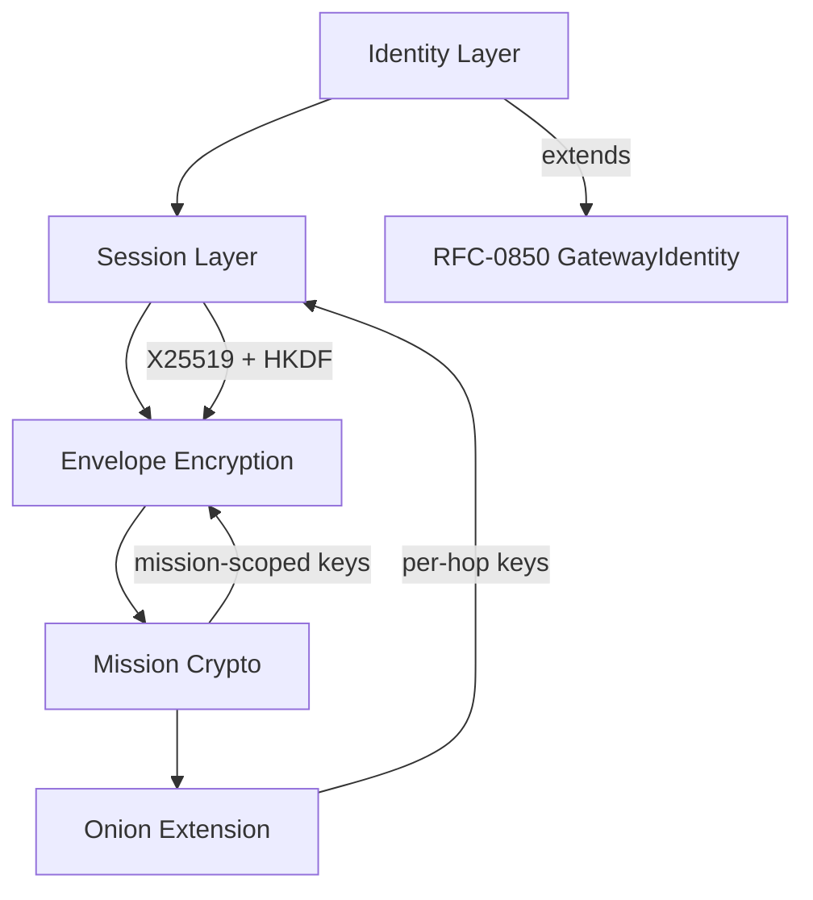

# RFC-0853: Overlay Cryptography (OCrypt)

## Status

Accepted

## Authors

- Author: @cipherocto

## Maintainers

- Maintainer: @cipherocto

## Summary

Overlay Cryptography (OCrypt) defines the cryptographic model for CipherOcto overlay networking.

OCrypt provides:

- Sovereign overlay identity (platform-independent)
- Deterministic cryptographic envelopes
- Transport-independent encryption
- Mission-scoped trust domains
- Forward secrecy via ephemeral session keys
- Replay-safe signatures
- Onion-capable relay encryption
- Multi-hop confidentiality
- Deterministic canonical cryptographic boundaries

The core invariant: **External platforms MUST NEVER be trusted for confidentiality, authenticity, ordering, or integrity.** All trust exists ONLY inside the CipherOcto cryptographic layer.

## Dependencies

**Requires:**

- RFC-0850 (Networking): DOT — envelope format
- RFC-0851 (Networking): GDP — gateway discovery
- RFC-0102 (Numeric): Wallet Cryptography — key formats
- RFC-0009 (Process): Identity Management — identity model

**Optional:**

- RFC-0852 (Networking): DGP — gossip propagation (required only for key revocation propagation)
- RFC-0854 (Networking): DPS — proof substrate

## Design Goals

| Goal | Target | Metric |
|------|--------|--------|
| G1: Sovereign Identity | Platform-independent identity | Zero platform dependency |
| G2: Deterministic Verification | Consensus-safe validation | 100% identical verification |
| G3: Forward Secrecy | Session compromise isolation | Past traffic protected |
| G4: Transport Independence | Carrier-agnostic encryption | Works across all carriers |
| G5: Replay Resistance | Cryptographic replay prevention | Zero replay acceptance |
| G6: Mission Isolation | Scoped cryptographic overlays | Zero cross-mission leakage |
| G7: Multi-Hop Privacy | Onion-capable routing | Relay knowledge isolation |
| G8: Cryptographic Agility | Upgradeable algorithms | Algorithm migration support |

## Motivation

### CAN WE? — Feasibility Research

The CipherOcto overlay requires cryptography that:

1. Works across hostile, observable, mutable, censorable, replayable transports
2. Remains deterministic at the consensus boundary
3. Supports mission-scoped trust domains
4. Enables forward secrecy for relay sessions
5. Supports onion routing for privacy

Modern cryptographic primitives (Ed25519, X25519, ChaCha20-Poly1305, BLAKE3) are well-suited for these requirements.

### WHY? — Why This Matters

Without OCrypt:

- Platform operators can read mission data
- Replay attacks succeed trivially
- No forward secrecy — one key compromise exposes all traffic
- No mission isolation — all traffic is linkable
- No onion routing — all communication is observable

## Specification

### System Architecture



### 1. Cryptographic Primitives

| Function | Algorithm | Notes |
|----------|-----------|-------|
| Hashing | BLAKE3-256 | Fast, parallelizable, deterministic |
| Signatures | Ed25519 | 64-byte signatures, fast verification |
| Key Exchange | X25519 | Ephemeral key agreement |
| AEAD | ChaCha20-Poly1305 | Authenticated encryption |
| KDF | HKDF-BLAKE3 | Key derivation (see §1.1) |
| Merkle Trees | BLAKE3 | State commitments |
| Randomness | Deterministic CSPRNG profile | Consensus-safe randomness |

### 1.1 HKDF-BLAKE3 Definition

HKDF-BLAKE3 = HKDF (RFC 5869) using HMAC-BLAKE3 as the underlying PRF, where HMAC-BLAKE3 uses BLAKE3's keyed hash mode. Parameters:
- **IKM** = input key material
- **Salt** = context string (domain separation)
- **Info** = purpose tag (algorithm-specific)
- **Output length** = requested bytes

**Future Agility:**

```rust
#[derive(Clone, Copy, Debug, PartialEq, Eq)]
#[repr(C)]
struct CryptoSuiteId {
    hash_id: u16,
    signature_id: u16,
    kex_id: u16,
    aead_id: u16,
    kdf_id: u16,
}
```

### 2. Cryptographic Domains

| Domain | Lifetime | Use Case |
|--------|----------|----------|
| Identity | Long-lived | Gateway identity, validator identity, governance |
| Session | Ephemeral | Relay encryption, forward secrecy |
| Mission | Mission-scoped | Temporary overlays, AI swarms, compartmentalization |

### 3. Sovereign Identity Model

```rust
struct OverlayIdentity {
    peer_id: [u8; 32],
    public_key: [u8; 32],
    identity_epoch: u64,
    capabilities_root: [u8; 32],
    signature: [u8; 64],
}
```

Identity MUST remain independent from Telegram accounts, Discord usernames, Matrix IDs, IP addresses, DNS names, device identifiers.

**Platform Binding (optional):**

```rust
struct PlatformBinding {
    platform_type: u16,
    external_identifier_hash: [u8; 32],
    proof_signature: [u8; 64],
}
```

Bindings MUST NEVER become consensus authority.

**Relationship to GatewayIdentity (RFC-0850):**

OverlayIdentity is the cryptographic identity layer. GatewayIdentity (RFC-0850 §3.2) is the network-layer identity. A gateway has both: GatewayIdentity for routing, OverlayIdentity for cryptographic operations. The `peer_id` in OverlayIdentity corresponds to `gateway_id` in GatewayIdentity. GatewayIdentity handles routing and discovery; OverlayIdentity handles signing, encryption, and attestation.

### 4. Deterministic Envelope Encryption

**Canonical encryption boundary:** plaintext canonicalization MUST occur BEFORE encryption.

```rust
struct EncryptedEnvelope {
    envelope_hash: [u8; 32],
    sender_ephemeral_key: [u8; 32],
    nonce: [u8; 12],
    ciphertext: Vec<u8>,
    auth_tag: [u8; 16],
}
```

**AAD (Associated Authenticated Data) Format:**

AAD MUST include all context-binding fields to prevent context-swapping attacks:

```text
aad = envelope_id || sender_ephemeral_public || mission_id || logical_timestamp || sequence
```

Where:
- `envelope_id` — binds ciphertext to specific envelope (prevents cross-envelope replay)
- `sender_ephemeral_public` — binds to sender (prevents sender impersonation)
- `mission_id` — binds to mission scope (prevents cross-mission injection)
- `logical_timestamp` — provides ordering context (prevents reordering attacks)
- `sequence` — enables replay detection without decryption (prevents replay attacks)

**Deterministic validation:** Encryption MAY be probabilistic. Validation MUST remain deterministic. Consensus verifies: canonical plaintext hash, signature validity, envelope structure, replay invariants — NOT ciphertext byte equality.

### 5. Session Key Establishment

```text
X25519 → HKDF-BLAKE3 → ChaCha20-Poly1305
```

All relay sessions SHOULD use ephemeral keys. Compromise of long-term identity keys MUST NOT expose past traffic.

**Session scope:** Peer, Gateway, Mission, Route, Broadcast Domain.

**Mutual Authentication:** Session establishment MUST include authentication to prevent MITM attacks. After X25519 key exchange, both parties MUST sign the shared transcript (ephemeral_public_a || ephemeral_public_b || session_key) with their long-term identity keys. Verification of the remote party's signature proves control of the claimed identity. Without mutual authentication, relay impersonation is possible.

### 6. Mission Cryptography

```rust
struct MissionKeyHierarchy {
    mission_root_key: [u8; 32],
    transport_keys_root: [u8; 32],
    relay_keys_root: [u8; 32],
    execution_keys_root: [u8; 32],
}
```

Mission overlays SHOULD support: member rotation, emergency rekey, partition recovery, compromised-node eviction.

Compromise of one mission MUST NOT compromise other missions, overlay identity, or unrelated sessions.

### 7. Replay Protection

Every encrypted envelope MUST include `(envelope_id, sequence, logical_timestamp)` inside authenticated data.

**Replay Cache Specification:**

- **Structure:** `BTreeMap<([u8; 32], u64), u64>` — `(envelope_id, sequence) → logical_timestamp` for deterministic iteration (Class A requirement)
- **Scope:** Per-mission (each mission has its own replay cache)
- **Window:** 1 hour OR 10,000 entries, whichever reached first
- **Eviction policy:** Purge entries outside the window first. If still at capacity, evict by smallest `(logical_timestamp, envelope_id)` — BTreeMap natural ordering provides deterministic eviction
- **Exhaustion behavior:** When cache is full and no entries can be evicted, reject new envelopes until space is available. Log a warning.
- **Key rotation interaction:** Rotation does NOT reset the replay window. Old entries remain valid until they naturally expire.

### 8. Signature Model

Signatures MUST cover: canonical payload, metadata, route commitment, mission scope, replay identifiers.

All signatures operate over canonical serialized bytes ONLY (per RFC-0126).

### 9. Gateway Attestation

```rust
struct GatewayAttestation {
    gateway_id: [u8; 32],
    attestation_type: u16,
    payload_root: [u8; 32],
    timestamp: u64,
    signature: [u8; 64],
}
```

### 10. Onion Relay Extension

```text
Payload → encrypt for relay N → encrypt for relay N-1 → ... → encrypt for relay entry
```

Each relay knows ONLY: previous hop, next hop, local instructions. NOT: origin, destination, full route, mission topology.

**Onion Layer Construction:**

The `OnionHop` struct defined in RFC-0858 §2.2 is the canonical onion layer type. OCrypt provides the cryptographic primitives (key derivation, encryption) that ORR uses to construct and process `OnionHop` structures.

**Layer encryption order (inside-out):**

1. Encrypt payload with exit relay's session key → `layer_N`
2. Wrap `layer_N` with next-hop instructions + middle relay's session key → `layer_N-1`
3. Continue until entry relay → `layer_1`

**Relay session key derivation:**

```text
shared_secret = X25519(ephemeral_secret, relay_public_key)
session_key = HKDF-BLAKE3(shared_secret, "ocrypt:onion:v1", hop_index || route_id)
nonce = HKDF-BLAKE3(session_key, "ocrypt:nonce:v1", layer_index)[0..12]
```

**Forward secrecy:** Each layer uses a fresh ephemeral X25519 key. Compromise of one relay's key does NOT expose other layers or past sessions.

Routing specification in RFC-0858 (Onion Relay Routing). OCrypt defines the cryptographic primitives; ORR defines the routing protocol.

### 11. Deterministic Randomness

Consensus cryptography MUST use deterministic randomness derivation:

```text
output = HKDF-BLAKE3(ikm=seed, salt=context, info=epoch_bytes.to_be_bytes(), length=output_len)
```

Where:
- `seed` = input key material (IKM)
- `context` = domain separation string (salt)
- `epoch_bytes` = 8-byte big-endian epoch value (info)
- `output_len` = requested number of output bytes

Forbidden sources for consensus: OS entropy timing, hardware RNG variance, platform randomness APIs, nondeterministic nonce generation.

### 12. Key Rotation and Revocation

Identity keys MAY rotate. Rotation MUST produce signed successor linkage.

Session keys SHOULD rotate aggressively, especially for high-value missions and validator traffic.

**Key Revocation:** If a key is compromised:

1. **Immediate:** Publish a signed revocation message containing `(compromised_key_id, revocation_epoch, successor_key_id, signature_by_successor)`
2. **Grace period:** 24 hours for peers to observe revocation via GDP (RFC-0851)
3. **After grace period:** All signatures by compromised key are rejected
4. **No CRL equivalent:** Revocation is distributed via gossip (RFC-0852) — no centralized revocation list
5. **Retroactive invalidation:** Signatures made BEFORE revocation epoch remain valid (to avoid chain reorganization)

### 13. Consensus Boundary

**Consensus MUST NOT depend on:** ciphertext bytes, encryption randomness, carrier metadata, platform timestamps, packet fragmentation.

**Consensus MAY depend on:** canonical plaintext hashes, deterministic serialization, verified signatures, Merkle commitments, route commitments.

**RFC-0008 Execution Class Mapping:**

| OCrypt Operation | Execution Class | Rationale |
|-----------------|-----------------|-----------|
| BLAKE3-256 hash | Class A (Protocol Deterministic) | Consensus-critical state root |
| Ed25519 signature verify | Class A | Consensus-critical authentication |
| Ed25519 signature sign | Class B (Deterministic Off-Chain) | Deterministic but not consensus-ordered |
| X25519 key exchange | Class B | Session establishment, not consensus |
| ChaCha20-Poly1305 encrypt | Class C (Probabilistic) | Nonce may use OS randomness |
| ChaCha20-Poly1305 decrypt | Class B | Deterministic given key+nonce |
| HKDF-BLAKE3 key derivation | Class A | Deterministic derivation |
| Merkle tree construction | Class A | Consensus-critical commitments |
| Nonce generation (consensus) | Class A | Deterministic derivation required |
| Nonce generation (non-consensus) | Class C | OS randomness acceptable |

**Consensus Boundary Enforcement:**

```rust
/// Error types that enforce the consensus boundary
enum CryptoError {
    /// Attempted non-deterministic operation in consensus-critical path
    ConsensusBoundaryViolation { operation: &'static str, context: &'static str },
    /// Nonce reuse detected (catastrophic for ChaCha20-Poly1305)
    NonceReuse { nonce: [u8; 12], first_use_epoch: u64, second_use_epoch: u64 },
    /// Invalid nonce derivation
    InvalidNonce { reason: &'static str },
    /// Key derivation failure
    KeyDerivationFailure { stage: &'static str },
    /// Signature verification failed
    InvalidSignature,
    /// Proof verification failed
    InvalidProof,
    /// Replay detected
    ReplayDetected { envelope_id: [u8; 32] },
    /// Algorithm not supported
    UnsupportedAlgorithm { suite_id: CryptoSuiteId },
}
```

**Structural enforcement:** Consensus-critical code paths MUST NOT call functions that source OS randomness or wall-clock time. Implementations SHOULD use type-system separation (e.g., `ConsensusContext` vs `SessionContext`) to enforce this at compile time.

### 14. Error Handling

```rust
/// Error types that enforce the consensus boundary
enum CryptoError {
    /// Attempted non-deterministic operation in consensus-critical path
    ConsensusBoundaryViolation { operation: &'static str, context: &'static str },
    /// Nonce reuse detected (catastrophic for ChaCha20-Poly1305)
    NonceReuse { nonce: [u8; 12], first_use_epoch: u64, second_use_epoch: u64 },
    /// Invalid nonce derivation
    InvalidNonce { reason: &'static str },
    /// Key derivation failure
    KeyDerivationFailure { stage: &'static str },
    /// Signature verification failed
    InvalidSignature,
    /// Proof verification failed
    InvalidProof,
    /// Replay detected
    ReplayDetected { envelope_id: [u8; 32] },
    /// Algorithm not supported
    UnsupportedAlgorithm { suite_id: CryptoSuiteId },
}
```

## Performance Targets

| Metric | Target |
|--------|--------|
| Ed25519 sign | <1ms |
| Ed25519 verify | <5ms |
| X25519 key exchange | <1ms |
| ChaCha20-Poly1305 encrypt | <1µs/byte |
| BLAKE3 hash | <1µs/KB |
| Session establishment | <10ms |

## Security Considerations

| Threat | Impact | Mitigation |
|--------|--------|------------|
| MITM | Critical | Signed key exchange |
| Replay | High | Replay cache |
| Route correlation | High | Onion routing (RFC-0858) |
| Metadata harvesting | Medium | Cover traffic |
| Gateway compromise | High | Forward secrecy |
| Carrier censorship | Medium | Multi-transport propagation |
| Payload mutation | Critical | Canonical signatures |

## Implementation Phases

### Phase 1: Core Crypto (Months 1-3)
- BLAKE3-256, Ed25519, X25519 integration
- EncryptedEnvelope with ChaCha20-Poly1305
- Session key establishment (X25519 → HKDF → AEAD)
- Replay protection

### Phase 2: Mission Cryptography (Months 3-5)
- MissionKeyHierarchy
- Mission rekeying
- Compartmentalization enforcement
- Platform binding verification

### Phase 3: Attestation and Agility (Months 5-8)
- GatewayAttestation
- CryptoSuiteId algorithm negotiation
- Key rotation with successor linkage
- Deterministic randomness derivation

### Phase 4: Onion and Privacy (Months 8-12)
- Onion layer construction (RFC-0858 integration)
- Cover traffic generation
- Stealth mission support
- Post-quantum readiness (Dilithium, Kyber)

## Adversarial Review

| Threat | Impact | Mitigation | Verification |
|--------|--------|------------|--------------|
| Key compromise (long-term) | Critical | Forward secrecy via ephemeral session keys | Compromise simulation test |
| Replay attack | High | `(envelope_id, sequence, logical_timestamp)` in authenticated data | Replay cache exhaustion test |
| Metadata leakage | Medium | Cover traffic, metadata minimization | Traffic analysis simulation |
| Forward secrecy violation | Critical | Ephemeral X25519 per session, key rotation with successor linkage | Past-session decryption attempt after key compromise |
| Consensus isolation breach | Critical | Canonical plaintext hash verification, ciphertext excluded from consensus state | Fuzz test with mutated ciphertext |
| Sybil via identity forgery | High | Ed25519 signature verification at every gateway, peer_id derivation from public key | Forged identity rejection test |
| Onion routing de-anonymization | High | Layered encryption, relay knowledge isolation (prev/next hop only), cover traffic | Correlation attack simulation |
| Mission cross-contamination | High | Mission-scoped key hierarchy, compartmentalized derivation | Cross-mission key leak test |
| Platform metadata injection | Medium | Transport isolation rule — platform IDs never in authenticated data | Injection attack test |

## Test Vectors

### Test Vector 1: Identity Derivation

```text
Input:
  public_key = [0x42; 32]  (Ed25519 public key)
  identity_epoch = 0

Derivation:
  peer_id = BLAKE3-256(public_key || identity_epoch || "ocrypt:identity:v1")

Expected:
  peer_id = BLAKE3-256([0x42; 32] || [0x00; 8] || "ocrypt:identity:v1")
```

### Test Vector 2: Session Handshake

```text
Alice:
  ephemeral_secret_a = [0xA1; 32]
  ephemeral_public_a = X25519_base(ephemeral_secret_a)

Bob:
  ephemeral_secret_b = [0xB1; 32]
  ephemeral_public_b = X25519_base(ephemeral_secret_b)

Shared secret:
  shared = X25519(ephemeral_secret_a, ephemeral_public_b)
        == X25519(ephemeral_secret_b, ephemeral_public_a)

Key derivation:
  session_key = HKDF-BLAKE3(
    ikm = shared,
    salt = "ocrypt:session:v1",
    info = ephemeral_public_a || ephemeral_public_b,
    length = 32
  )

Encryption:
  nonce = HKDF-BLAKE3(session_key, "ocrypt:nonce:v1", aad || epoch)[0..12]
  // WARNING: Nonce MUST be unique per (session_key, message). Reuse is catastrophic.
  // For consensus-critical paths: deterministic derivation from (session_key, aad, epoch)
  // For non-consensus paths: OS randomness is acceptable
  ciphertext = ChaCha20-Poly1305-Seal(session_key, nonce, plaintext, aad)
```

### Test Vector 3: Envelope Encryption

```text
Input:
  plaintext = "DOT/1/hello world"
  sender_ephemeral_secret = [0xC1; 32]
  recipient_public_key = [0xD1; 32]
  envelope_id = BLAKE3-256("test_envelope")

Derivation:
  sender_ephemeral_public = X25519_base(sender_ephemeral_secret)
  shared_secret = X25519(sender_ephemeral_secret, recipient_public_key)
  session_key = HKDF-BLAKE3(shared_secret, "ocrypt:envelope:v1", envelope_id, 32)
  nonce = HKDF-BLAKE3(session_key, "ocrypt:nonce:v1", envelope_id, 12)
  mission_id = [0x01; 32]
  logical_timestamp = [0x00, 0x00, 0x00, 0x00, 0x00, 0x00, 0x00, 0x01]
  aad = envelope_id || sender_ephemeral_public || mission_id || logical_timestamp || sequence
  ciphertext = ChaCha20-Poly1305-Seal(session_key, nonce, plaintext, aad)

Expected EncryptedEnvelope:
  envelope_hash = BLAKE3-256(plaintext)
  sender_ephemeral_key = sender_ephemeral_public
  nonce = [derived]
  ciphertext = [derived]
  auth_tag = [last 16 bytes of ChaCha20-Poly1305 output]
```

### Test Vector 4: Mission Key Hierarchy

```text
Input:
  mission_id = [0x01; 32]
  mission_root_seed = [0xF1; 32]
  // Note: In practice, mission_root_seed is derived from:
  //   mission_root_seed = HKDF-BLAKE3(coordinator_identity_key, "ocrypt:mission:seed:v1", mission_id)
  // or from a DKG ceremony for decentralized mission creation

Derivation:
  mission_root_key = HKDF-BLAKE3(mission_root_seed, "ocrypt:mission:root:v1", mission_id, 32)
  transport_keys_root = HKDF-BLAKE3(mission_root_key, "ocrypt:mission:transport:v1", mission_id, 32)
  relay_keys_root = HKDF-BLAKE3(mission_root_key, "ocrypt:mission:relay:v1", mission_id, 32)
  execution_keys_root = HKDF-BLAKE3(mission_root_key, "ocrypt:mission:execution:v1", mission_id, 32)
```

## Economic Analysis

### Token Integration

| Activity | Token | Rationale |
|----------|-------|-----------|
| Relay crypto overhead | OCTO-B | Bandwidth consumed by encrypted envelope relay |
| Gateway crypto operations | OCTO-N | Ed25519 sign/verify, X25519 key exchange compute cost |
| Key management coordination | OCTO-O | Mission key hierarchy derivation, rotation orchestration |
| Identity registration | OCTO-N | Gateway identity staking for Sybil resistance |
| Onion relay participation | OCTO-B | Multi-hop relay bandwidth premium |

### Crypto Cost Model

```text
crypto_cost_per_envelope = sign_cost + verify_cost + encrypt_cost + kex_cost
```

| Operation | Relative Cost | Token |
|-----------|--------------|-------|
| Ed25519 sign | 1x | OCTO-N |
| Ed25519 verify | 0.2x | OCTO-N |
| X25519 key exchange | 0.5x | OCTO-N |
| ChaCha20-Poly1305 encrypt | 0.01x | OCTO-B |
| BLAKE3 hash | 0.001x | OCTO-B |

### Stake Requirements

Global identity registration requires minimum stake to prevent Sybil attacks:

```text
identity_stake = base_stake * (1 + capability_count * 0.1)
```

## Compatibility

### RFC-0843 Integration

OCrypt extends RFC-0843's libp2p security model:

- RFC-0843 uses libp2p's Noise Protocol for transport encryption
- OCrypt adds overlay-level encryption independent of transport
- OCrypt adds mission-scoped key compartmentalization
- OCrypt adds onion relay encryption for privacy

### Forward Compatibility

- `CryptoSuiteId` enables algorithm migration without protocol changes
- Post-quantum algorithms (Dilithium, Kyber) can be added as new suite IDs
- Key rotation with successor linkage enables graceful algorithm transitions

### Interoperability

| Protocol | Integration Point |
|----------|-------------------|
| Noise Protocol | libp2p transport security (RFC-0843) |
| MLS (Messaging Layer Security) | Group key management for mission overlays |
| libp2p security | Native P2P transport encryption |
| Matrix Olm/Megolm | Matrix room encryption bridging |
| Nostr NIP-04/44 | Nostr relay encryption bridging |

## Alternatives Considered

| Approach | Pros | Cons | Decision |
|----------|------|------|----------|
| Noise Protocol only | Proven, libp2p native | No mission compartmentalization, no onion routing | Supplemented by OCrypt |
| MLS (Messaging Layer Security) | Group key management, forward secrecy | Complex, not designed for overlay routing | Partial adoption for mission groups |
| Custom crypto | Full control | Risky, untested, slow development | Rejected — use proven primitives |
| Signal Protocol | Double ratchet, forward secrecy | Synchronous model, no overlay routing fit | Rejected — wrong abstraction |
| NaCl/libsodium | Simple, proven | No algorithm agility, limited KDF options | Rejected — insufficient flexibility |

**Decision:** OCrypt uses proven primitives (Ed25519, X25519, ChaCha20-Poly1305, BLAKE3) composed into an overlay-specific cryptographic model.

## Rationale

### Why BLAKE3 over SHA-256?

- BLAKE3 is ~14x faster than SHA-256 on modern CPUs
- BLAKE3 supports native parallelism (tree hashing)
- BLAKE3 output is 256 bits — same security level as SHA-256
- BLAKE3 is deterministic (unlike SHA-256 which is also deterministic, but BLAKE3's parallelism enables faster Merkle tree computation)
- Used by: Zcash, WireGuard (BLAKE2s variant)

### Why Ed25519?

- 64-byte signatures (compact for overlay envelopes)
- Fast verification (~3x faster than ECDSA P-256)
- Deterministic signing (RFC 6979) — no nonce reuse risks
- Widely supported: libsodium, ring, ed25519-dalek
- Used by: Matrix, Nostr, Tor, Signal

### Why ChaCha20-Poly1305?

- AEAD (authenticated encryption with associated data)
- Fast on devices without AES hardware acceleration
- Constant-time implementation (no timing side channels)
- 96-bit nonce + 128-bit auth tag — sufficient security margin
- Used by: TLS 1.3, WireGuard, Signal, Matrix

### Why isolate cryptographic trust from platforms?

Platforms are Byzantine-capable transport carriers. If cryptography depended on platform trust:

1. A compromised platform could forge envelopes
2. Platform metadata could leak into consensus
3. Replay protection would require platform cooperation
4. Mission isolation would depend on platform access control

OCrypt ensures that **all cryptographic trust is sovereign** — independent of any platform.

## Key Files to Modify

| File | Change |
|------|--------|
| `crates/octo-network/src/ocrypt/mod.rs` | OCrypt module root |
| `crates/octo-network/src/ocrypt/envelope.rs` | EncryptedEnvelope |
| `crates/octo-network/src/ocrypt/session.rs` | Session key establishment |
| `crates/octo-network/src/ocrypt/identity.rs` | OverlayIdentity |
| `crates/octo-network/src/ocrypt/mission.rs` | MissionKeyHierarchy |
| `crates/octo-network/src/ocrypt/attestation.rs` | GatewayAttestation |
| `crates/octo-network/src/ocrypt/onion.rs` | Onion layer construction |
| `crates/octo-network/src/ocrypt/randomness.rs` | Deterministic CSPRNG |

## Future Work

- F1: Post-quantum cryptography migration (Dilithium, Kyber, BLAKE3/SHA3 hybrid)
- F2: Hardware security module (HSM) integration for gateway keys
- F3: Threshold cryptography for distributed key management
- F4: Zero-knowledge identity proofs (prove identity attributes without revealing keys)
- F5: Cross-chain identity bridging for multi-network participation
- F6: Encrypted group messaging for mission-scoped communication
- F7: Key rotation automation with minimal downtime
- F8: Formal verification of cryptographic protocol correctness

## Version History

| Version | Date | Changes |
|---------|------|---------|
| 1.0.0 | 2026-05-25 | Initial draft |
| 1.1.0 | 2026-05-27 | Round 1 adversarial review fixes — 20 issues (1C, 5H, 5M, 3L) |
| 2026-07-20 | **Promoted to Accepted.** 7-day review + 2 maintainer approvals (@mmacedoeu + @cipherocto); no blocking objections. Status header + YAML frontmatter `status` field updated; file moved via `git mv` from `rfcs/draft/networking/` to `rfcs/accepted/networking/` (R100 rename). Pre-acceptance completeness fixes applied (see prior 1.2.0 / 1.2.1 rows). |

## Related RFCs

- RFC-0850 (Networking): DOT — envelope format
- RFC-0851 (Networking): GDP — gateway discovery
- RFC-0852 (Networking): DGP — gossip propagation (optional, for key revocation)
- RFC-0854 (Networking): DPS — proof substrate
- RFC-0858 (Networking): ORR — onion routing
- RFC-0860 (Networking): PoRelay — relay proofs
- RFC-0102 (Numeric): Wallet Cryptography
- RFC-0009 (Process): Identity Management

## Related Use Cases

- [Privacy-Preserving Query Routing](../../docs/use-cases/privacy-preserving-query-routing.md)
- [Decentralized Mission Execution](../../docs/use-cases/decentralized-mission-execution.md)
