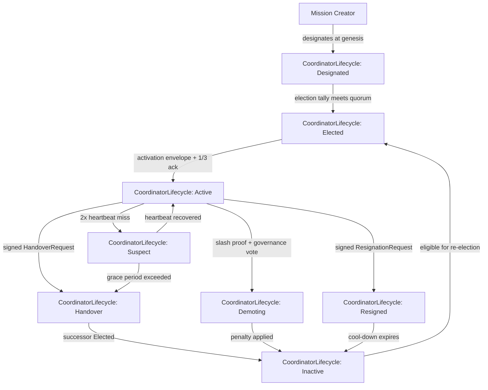
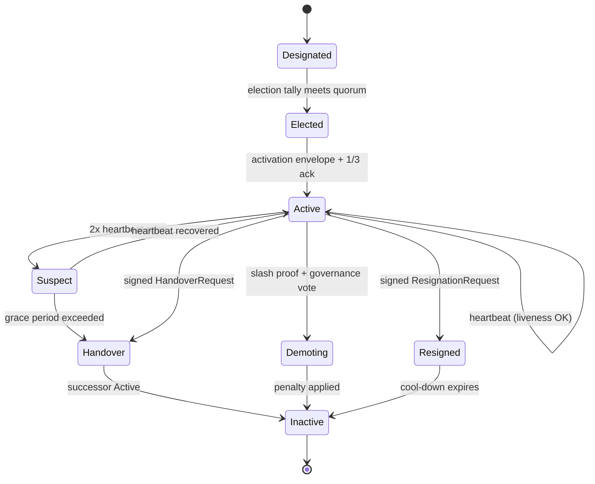

# RFC-0855p-b (Networking): Mission Coordinator Lifecycle

## Status

Accepted (2026-06-16)

> **Patch RFC for RFC-0855 (Mission Overlay Networks).** This RFC fills the §16.3 "AI Swarm Specification (MON-H6 fix)" → §11 "Governance Models" forward-reference gap: §16.3 states "New Coordinator elected via governance model (Section 11)" but §11 defines 5 governance models, none of which include an election algorithm. The implementation timeline at §20 lists "3.4 Implement coordinator election" as a future task; this RFC is that task.
>
> **v1.1 patch (2026-06-16):** adds §"Genesis State Machine" subsection (3-state machine) to fix the v1.0 "stateless creator" gap. Mission Creator role entry updated; Test Vector TV-6 added; Future Work F1 now points to RFC-0855p-c (DomainCoordinator).

## Authors

- Author: @placeholder

## Maintainers

- Maintainer: @placeholder

## Summary

Specifies the `CoordinatorLifecycle` state machine, the `CoordinatorRecord` type, the per-governance-model election algorithm, term limits, handover protocols, slashing conditions, and liveness check semantics for the Mission Coordinator role defined in RFC-0855 §4.2 "Membership Roles". The result is a typed, deterministic, adversarial-resistant coordinator lifecycle that RFC-0855 can reference from §16.3 "AI Swarm Specification (MON-H6 fix)", §11 "Governance Models", and §17 "Token Economics Integration" in place of its current one-line forward reference.

**v1.1 adds** the `GenesisState` 3-state machine (§"Genesis State Machine" subsection) for the Mission Creator's first-coordinator bootstrap. This fills the v1.0 gap where the creator was described as "stateless" but the §"Election Algorithm (per governance model)" table assumed ≥2 candidates — implementations would have invented their own genesis logic.

## Dependencies

**Requires:**

- RFC-0855 (Networking): Mission Overlay Networks — primary, especially §3 "Mission Lifecycle", §4 "Mission Membership", §11 "Governance Models", §16.3 "AI Swarm Specification (MON-H6 fix)", §17 "Token Economics Integration"
- RFC-0853 (Networking): Overlay Cryptography — for signature schemes and key derivation
- RFC-0000-template v1.3 — for `Roles and Authorities`, `Lifecycle Requirements`, `Implicit Assumptions Audit`, `Adversary Analysis` sections

**Optional:**

- RFC-0860 (Networking): Proof of Relay — for trust score source feeding election eligibility (RFC-0855 §4.2 "Membership Roles" requires `trust_score >= 500`)

> **Dependency Validation Rules:**
> 1. Dependencies MUST form a DAG (no cycles) — this RFC depends on 0855; 0855 is unchanged.
> 2. All "Requires" RFCs MUST be listed as mission prerequisites — Phase 1 mission `0855p-b-mission-coordinator-lifecycle.md` will declare `0855-mission-overlay-networks` as prerequisite.
> 3. Optional dependencies MUST be documented separately from required — RFC-0860 is optional; without it, election eligibility uses raw stake only.
> 4. Dependencies on "Planned" RFCs MUST note the assumption they will be Accepted — all dependencies are Draft or Final.

## Design Goals

| Goal | Target | Metric |
|------|--------|--------|
| G1 | Election completes in <30s for 100-participant mission | Wall-clock from election start to `CoordinatorRecord.state = Elected` |
| G2 | Term limits prevent indefinite incumbency | No coordinator serves > `term_max_epochs` consecutive epochs without re-election |
| G3 | Handover completes in <5s with no message loss | Wall-clock from `Handover` state entry to successor `Active`; zero envelopes lost during transition |
| G4 | Slashing is provable and deterministic | Slash proof is signed; penalty is computed deterministically from offense and stake record |
| G5 | Liveness failure is detected in <2 × heartbeat_interval | Wall-clock from missed heartbeat to `Suspect` state entry |
| G6 | All state transitions are RFC-0008 Class A | No non-determinism in coordinator state transitions affecting consensus |

## Motivation

RFC-0855 has three structural gaps with respect to the Mission Coordinator role:

1. **§16.3 forward reference**: "New Coordinator elected via governance model (Section 11)" references §11 "Governance Models" (governance models) which defines 5 governance models, none of which include an election algorithm. The §20 implementation timeline lists "3.4 Implement coordinator election" as a future task.
2. **§4.2 coordinator role without lifecycle**: The `MembershipRole::Coordinator` bit is defined (in RFC-0855 §4.2 "Membership Roles") but the coordinator has no state machine, no term, no handover protocol, and no recovery from `Active → Byzantine`.
3. **§17 slashing ambiguity**: "Coordinator misbehavior → Slash OCTO-O stake + demotion" (in RFC-0855 §17 "Token Economics Integration") but `demotion` is undefined. Without a typed target state (this RFC defines `Demoting`), "demotion" is an implicit transition that implementations must invent independently.

This RFC fills all three gaps with a single coherent state machine, election algorithm, handover protocol, and slashing integration that implementations can reference directly.

The same lifecycle machinery is intended to specialize for the `DomainCoordinator` role (the operator of a physical broadcast domain — e.g., a WhatsApp group bridged into a DOT mission). `DomainCoordinator` is **Future Work F1** and is not specified here.

## Roles and Authorities

> **The "Nothing should be implied" rule (specification layer):** Every actor that affects correctness, security, accountability, or consensus MUST be named with a stable identifier, a defined authority scope, and a typed lifecycle. Cross-reference: BLUEPRINT.md "Human vs Agent Roles" table.

MUST enumerate:

### 1. Mission Coordinator (the role defined by this RFC)

- **Stable identifier**: `[u8; 32]` `CoordinatorId` (alias for `PeerId` in the mission's namespace)
- **Base capabilities**: sign coordination envelopes; receive `ExecutionTask` results; emit mission-state transitions
- **Authority scope**: `coordinate` (read mission state, dispatch tasks, propose mission-state transitions, sign coordination envelopes)
- **Who can assume**: genesis designator (creator), or election winner per §"Election Algorithm (per governance model)"
- **Who can revoke**: slashing adjudicator (governance), or self (resignation)
- **Lifecycle**: `CoordinatorLifecycle` (see Lifecycle Requirements) — 8 states
- **Term**: `term_start_epoch: u64`, `term_end_epoch: u64` (0 = no limit, mission-defined)

### 2. Mission Creator (genesis designator)

- **Stable identifier**: `creator_peer_id: [u8; 32]`
- **Base capabilities**: designate the first Mission Coordinator at mission creation time
- **Authority scope**: `designate-at-genesis` (one-shot, at mission creation only; extends to `Elected` and `Active` transitions without further vote per §"Genesis State Machine")
- **Who can assume**: any peer that creates a mission descriptor and signs the genesis envelope
- **Who can revoke**: no one (one-shot authority)
- **Lifecycle**: `genesis_state` (see §"Genesis State Machine") — 3 states (`GenesisDesignated → GenesisSelfAttest → GenesisActive`)
- **Out of scope for replacement**: subsequent coordinators are elected per §"Election Algorithm (per governance model)", not re-designated by the creator (this is the Centralized governance model's "designator-may-not-replace" rule; see §"Election Algorithm (per governance model)")

### 3. Mission Participant (voter)

- **Stable identifier**: `peer_id: [u8; 32]`
- **Base capabilities**: vote in coordinator elections; sign election ballots
- **Authority scope**: `vote` (one vote per election per participant, weighted by stake or by domain depending on governance model)
- **Who can assume**: any peer admitted to the mission per RFC-0855 §4.3 "Membership Admission" admission policy
- **Who can revoke**: mission governance (per RFC-0855 §11.3 "Governance Specification (MON-H4 fix)" admission decisions)
- **Lifecycle**: `mission_membership` (RFC-0855 §4.2 "Membership Roles" `MembershipState`)

### 4. Slashing Adjudicator (governance)

- **Stable identifier**: `governance_id: [u8; 32]` (the governance keypair for the mission's governance model)
- **Base capabilities**: submit signed slash proofs; force `Active → Demoting` transition
- **Authority scope**: `slash` (cause a coordinator to enter `Demoting` state, with attached penalty)
- **Who can assume**: the governance authority designated by the mission descriptor (`mission_descriptor.governance_model: GovernanceModel`); for `Centralized` this is the same as the Mission Coordinator unless explicitly delegated
- **Who can revoke**: mission participants via 2/3 vote (RFC-0855 §11.3 "Governance Specification (MON-H4 fix)")
- **Lifecycle**: `governance_session` (per-mission; stateless across missions)

### 5. Domain Coordinator (FUTURE — NOT in this RFC)

This RFC does NOT define the `DomainCoordinator` role. It is reserved for `DomainCoordinator` specialization (Future Work F1) which will extend `CoordinatorLifecycle` with platform-specific states (e.g., `WAGroupAdmin`, `TelegramCreator`).

The "nothing should be implied" rule requires that the **out-of-scope statement itself is a named responsibility transfer**: the operator of a physical broadcast domain is currently responsible for that domain's lifecycle off-chain (filesystem config). When `DomainCoordinator` is specified, the off-chain operator role will be a specialization of `DomainCoordinator`, not an unstated implicit.

### Role/Authority Coverage Table

| Role | Identifier | Authority Scope | Lifecycle | Source/Ref |
|------|------------|-----------------|-----------|------------|
| Mission Coordinator | `CoordinatorId` (`[u8;32]`) | `coordinate` | `CoordinatorLifecycle` (8 states) | This RFC §Lifecycle Requirements |
| Mission Creator | `creator_peer_id` (`[u8;32]`) | `designate-at-genesis` (one-shot) | stateless | RFC-0855 §3 "Mission Lifecycle" mission creation |
| Mission Participant | `peer_id` (`[u8;32]`) | `vote` (per-election) | `mission_membership` (RFC-0855 §4.2 "Membership Roles") | RFC-0855 §4.2 "Membership Roles" |
| Slashing Adjudicator | `governance_id` (`[u8;32]`) | `slash` | `governance_session` (per-mission) | RFC-0855 §11 "Governance Models" + This RFC §"Slashing Integration" |
| Domain Coordinator | (TBD) | (TBD) | (TBD) | Future Work F1 — out of scope for this RFC |

## Specification

### System Architecture



### Data Structures

```rust
/// Mission Coordinator role lifecycle (RFC-0855 §4.2 "Membership Roles" + This RFC)
#[repr(u8)]
#[derive(Clone, Copy, PartialEq, Eq, Hash, Debug)]
pub enum CoordinatorLifecycle {
    /// Designated at mission genesis by creator; not yet active
    Designated = 0x00,
    /// Election tally met quorum; awaiting activation
    Elected = 0x01,
    /// Heartbeat running, signing coordination envelopes
    Active = 0x02,
    /// Missed heartbeat threshold exceeded; under observation
    Suspect = 0x03,
    /// Standing down voluntarily or forced; successor being elected
    Handover = 0x04,
    /// Slashed by governance; OCTO-O stake being processed
    Demoting = 0x05,
    /// Voluntarily resigned; cool-down applies
    Resigned = 0x06,
    /// Role ended; eligible for re-election after cool-down (if any)
    Inactive = 0x07,
}

/// Provenance of a coordinator's current term
#[repr(u8)]
#[derive(Clone, Copy, PartialEq, Eq, Hash, Debug)]
pub enum CoordinatorSource {
    /// Designated at mission genesis by creator
    GenesisDesignation = 0x00,
    /// Elected by governance model after predecessor failure
    Election = 0x01,
    /// Inherited from predecessor via Handover
    Handover = 0x02,
    /// Emergency appointment by EmergencyAuthority
    Emergency = 0x03,
}

/// Election tally record (canonical for verification)
#[derive(Clone, PartialEq, Eq, Debug)]
pub struct ElectionTally {
    /// Election identifier (BLAKE3 of mission_id + election_epoch + nonce)
    pub election_id: [u8; 32],
    /// Epoch when election started
    pub election_epoch: u64,
    /// Epoch when election ended (quorum reached or timeout)
    pub closed_epoch: u64,
    /// Governance model used (RFC-0855 §11.1 "Governance Flexibility")
    pub governance_model: u16,
    /// Ballots sorted by (voter_peer_id, ballot_epoch) for determinism
    pub ballots: Vec<ElectionBallot>,
    /// Winning candidate's CoordinatorId
    pub winner: CoordinatorId,
    /// Total votes cast
    pub votes_received: u32,
    /// Total eligible voters
    pub votes_total: u32,
}

#[derive(Clone, PartialEq, Eq, Debug)]
pub struct ElectionBallot {
    pub voter_peer_id: [u8; 32],
    pub candidate_peer_id: [u8; 32],
    pub ballot_epoch: u64,
    /// Signature over (election_id, voter_peer_id, candidate_peer_id, ballot_epoch)
    pub signature: [u8; 64],
}

/// Slash proof (cause → penalty, signed by Slashing Adjudicator)
#[derive(Clone, PartialEq, Eq, Debug)]
pub struct SlashProof {
    pub slash_id: [u8; 32],
    pub coordinator: CoordinatorId,
    pub coordinator_term_id: [u8; 32],
    /// Offense type (reuses RFC-0855 §17 "Token Economics Integration" slash table)
    pub offense: u16,
    /// Evidence payload (proof of incorrect task, forged envelope, etc.)
    pub evidence: Vec<u8>,
    /// Penalty (OCTO-O micro-units, 0 = use default from §Slashing)
    pub penalty: u64,
    pub adjudicator: [u8; 32],
    pub adjudicator_signature: [u8; 64],
}

/// Full coordinator state (RFC-0008 Class A; deterministic across implementations)
#[derive(Clone, PartialEq, Eq, Debug)]
pub struct CoordinatorRecord {
    /// Coordinator's peer ID
    pub coordinator_peer_id: [u8; 32],
    /// Current lifecycle state
    pub state: CoordinatorLifecycle,
    /// Epoch when current term started
    pub term_start_epoch: u64,
    /// Epoch when current term ends (0 = no limit, mission-defined)
    pub term_end_epoch: u64,
    /// Provenance of this term
    pub source: CoordinatorSource,
    /// BLAKE3 of (coordinator_peer_id, term_start_epoch, source) for double-spend detection
    pub coordinator_term_id: [u8; 32],
    /// Number of times this coordinator has been slashed in this mission
    pub slash_count: u16,
    /// OCTO-O stake currently locked (returned on Inactive, slashed on Demoting)
    pub octo_o_stake_locked: u64,
    /// Last heartbeat epoch (0 if never Active)
    pub last_heartbeat_epoch: u64,
    /// Heartbeat interval the coordinator is committed to (epochs)
    pub heartbeat_interval: u64,
}
```

### Algorithms

#### Election Algorithm (per governance model)

| Governance Model | Election | Tie-Break | Eligibility |
|------------------|----------|-----------|-------------|
| **Centralized** | First coordinator: creator designates. Replacement: 2/3 vote. | n/a (designated) | `trust_score >= 500` (RFC-0855 §4.2 "Membership Roles") |
| **DAO** | Top-stake candidate wins if no candidate receives `>50%`. Otherwise top-stake wins. Re-election every `term_epochs`. | Lexicographic `peer_id` ascending | `octo_stake >= 1000` + `trust_score >= 500` |
| **Federated** | One per organizational domain; consensus from `f+1` of `2f+1` domain representatives. | Domain index then `peer_id` | `domain_reputation >= threshold` |
| **AI-Assisted** | AI proposes; humans ratify 2/3 within `proposal_deadline_epochs`. | n/a (proposed) | AI selection + human ratification |
| **Autonomous** | No election; protocol-defined rotation by `coordinator_term_id` ordering. Mission genesis names a deterministic order (e.g., BLAKE3-ordered `peer_id` list). | BLAKE3 of `(mission_id, slot_index)` | n/a |

For Centralized, the `creator-may-not-replace` rule: the Mission Creator designates the first coordinator at genesis, but cannot replace a sitting coordinator except via the 2/3 vote path. This prevents a creator from indefinitely controlling a mission by repeatedly replacing coordinators.

**Election eligibility filter (E2E IS-4.1 fix):** the election tally function MUST apply an eligibility filter BEFORE counting any ballot. The filter rejects:
- Voters who are not current mission participants (verified via the mission's pubkey registry)
- Voters whose trust score is below the governance model's threshold
- Candidates who do not satisfy the eligibility check (per the table above)
- Candidates whose `peer_id` is on the slash blacklist (`slash_count >= MAX_SLASHES_BEFORE_BAN = 5`)
- Ballots whose signature does not verify against the voter's pubkey
- Ballots whose `ballot_epoch` is not within `[election_epoch, election_epoch + ELECTION_TIMEOUT]`

Rejected ballots are silently dropped (per the "routine filtering silent" rule). The tally only counts eligible ballots for eligible candidates. The running tally is published to all mission participants every 10 epochs (E2E IS-7.2 fix), but no individual ballot is published (only the running sum).

**Election `closed_epoch` rule (E2E IS-4.2 fix):** `closed_epoch = min(quorum_reached_epoch, election_epoch + ELECTION_TIMEOUT)`. `ELECTION_TIMEOUT = 1000` epochs. The election closes at whichever comes first. If `closed_epoch = election_epoch + ELECTION_TIMEOUT` (quorum not reached), the election fails and a new election is initiated with a new `election_id`. Failed elections are not slashed; they simply delay the coordinator appointment.

#### Genesis State Machine (v1.1 addition)

The Mission Creator's `designate-at-genesis` authority triggers a 3-state machine that bootstraps the first coordinator **without** an election, because there are no peers to vote in a 1-participant mission. This fills a gap in the v1.0 RFC where the §"Election Algorithm (per governance model)" table assumes ≥2 candidates.

```rust
/// Lifecycle of the genesis designator's first-coordinator bootstrap
/// (v1.1 — was "stateless" in v1.0, which was implicit and broken)
#[repr(u8)]
enum GenesisState {
    /// Mission descriptor published; creator self-designated
    GenesisDesignated = 0x00,
    /// Creator signed GenesisAttest envelope; awaiting first peer witness
    GenesisSelfAttest = 0x01,
    /// At least one peer has acknowledged the GenesisAttest
    GenesisActive = 0x02,
}
```

**Transitions:**

| From | To | Trigger | Deterministic? |
|------|----|---------|----------------|
| (none) | GenesisDesignated | Mission descriptor committed with `creator_peer_id == coordinator_peer_id` in `MissionDescriptor` | Yes (from genesis material) |
| GenesisDesignated | GenesisSelfAttest | Creator signs `GenesisAttest { mission_id, coordinator_peer_id, attest_epoch, coordinator_term_id }` and broadcasts | Yes |
| GenesisSelfAttest | GenesisActive | ≥1 peer (other than creator) receives GenesisAttest, validates signature against creator's public key, and broadcasts `GenesisWitness { mission_id, witness_peer_id, attest_hash }` | Yes (deterministic count) |
| GenesisActive | (terminal — hands off to §CoordinatorLifecycle) | Creator's `CoordinatorRecord.state` transitions `Designated → Elected → Active` per §"Election Algorithm (per governance model)" (with quorum = 0) | Yes |
| GenesisSelfAttest | GenesisDesignated (rollback) | GenesisWitness validation fails (invalid signature on GenesisAttest, OR no witness received within `genesis_witness_timeout = 100 epochs`) | Yes (timeout is deterministic) |
| GenesisActive | Inactive (failure path) | Creator's key is revoked / compromised after GenesisActive but before handoff to CoordinatorLifecycle. Creator signs `CoordinatorSlash { coordinator_id, mission_id, reason: 0x0009 (genesis-compromise) }` (slash reason code 0x0009 from this RFC's reserved 0x0009-0xFFFF range; codes 0x0001-0x0008 are already taken — see §"B. Slash Offense Codes" table; R6-3 fix — was §"Slash Reason Codes"). Forces immediate `Inactive`; next election runs normally. | Yes |

**R1-CL-1 fix — failure transition:** the v1.1 spec previously treated `GenesisActive` as terminal (no failure path). The fix adds an explicit `GenesisActive → Inactive` transition for the case where the creator's key is revoked or compromised after genesis succeeds but before the mission becomes Active. Without this, a compromised creator would persist as coordinator until manual intervention. The slash reason 0x0009 is in the reserved 0x0009-0xFFFF range (codes 0x0001-0x0008 are taken; see §"B. Slash Offense Codes" table; R6-3 fix — was §"Slash Reason Codes") and is defined here as `genesis-compromise`.

**R1-CL-2 fix — GenesisWitness validation failure:** the transition from `GenesisSelfAttest` to `GenesisActive` requires ≥1 valid witness. The fix adds an explicit timeout-based rollback path: if no valid witness is received within `genesis_witness_timeout = 100 epochs` (R2-CL-3 fix: now defined in §"B'. Genesis Constants" appendix; R6-4 fix — was §"Constants" below), the creator rolls back to `GenesisDesignated` and can re-attempt by signing a fresh `GenesisAttest` (with a new `attest_nonce` to prevent replay). The creator can also roll back immediately on receipt of a `GenesisAttest` with an invalid signature (e.g., signed by an unauthorized key). Rollback is silent (no broadcast required); the next genesis attempt uses a new `attest_epoch` and `attest_nonce`.

**R2-CL-1 fix — GenesisAttest stale nonce rejection (receiver-side rule):**

When a node receives a `GenesisAttest` envelope, it MUST validate:

1. **attest_nonce freshness:** the witness MUST have not seen the same `(attest_nonce, mission_id)` pair in the last `genesis_witness_timeout = 100 epochs`. Replays are silently dropped.
2. **Creator signature validity:** `attest_signature` is valid for the creator's public key (from `MissionDescriptor.creator_pubkey`).
3. **Creator is current mission creator:** the public key in the signature matches the canonical creator's pubkey (no role substitution).
4. **Epoch sanity:** `attest_epoch` is within ±1 of local epoch (prevents stale genesis).

If any of these fail, the node silently drops the `GenesisAttest` (with optional `tracing::debug!`). The creator's local `attest_nonce` must be incremented for every new attempt; a duplicate `(attest_nonce, mission_id)` is treated as a stale genesis and rejected by all witnesses.

**R2-CL-3 fix — genesis_witness_timeout constant (R3-2 fix — moved to top-level §"B'. Genesis Constants" appendix):**

The genesis-related constants are defined once in §"B'. Genesis Constants" (the appendix sibling of §"B. Slash Offense Codes", at the end of this document). The values are:

- `GENESIS_WITNESS_TIMEOUT = 100` — maximum epochs to wait for ≥1 GenesisWitness before rolling back `GenesisSelfAttest → GenesisDesignated`.
- `MIN_GENESIS_WITNESSES = 1` — minimum number of GenesisWitnesses required to transition to `GenesisActive`.
- `GENESIS_EPOCH_TOLERANCE = 1` — maximum acceptable clock skew between `attest_epoch` and local epoch (matches the ±1 tolerance used elsewhere in DOT; see §"B'. Genesis Constants" for the cross-reference rationale).

Refer to §"B'. Genesis Constants" for the canonical definitions and full rationale (including R3-5 cross-reference reasoning for why genesis uses the same ±1 tolerance as BIND and ballot timestamps).

**Why a 3-state machine, not just `Designated → Active`?**

A new mission with 1 participant has no peer to witness the genesis. A 2-participant mission needs the second peer to acknowledge before the first peer can be considered a coordinator (otherwise the first peer is a coordinator in name only, with no other mission members). The 3-state machine (`GenesisDesignated → GenesisSelfAttest → GenesisActive`) makes the witness requirement explicit.

**Quorum = 0 election:**

When the first coordinator transitions from `GenesisActive` to the normal `CoordinatorLifecycle`, the election has quorum = 0 (creator is the only voter, and the creator voted for themselves at genesis). This is the only time an election has quorum < `min_participants / 2 + 1`. Implementations MUST special-case this transition.

**Determinism:** All 5 transitions (R5-3 fix — was 3; v1.1 added GenesisSelfAttest → GenesisDesignated rollback and GenesisActive → Inactive failure path) are RFC-0008 Class A. The witness count is deterministic; the witness set is sorted lexicographically by `witness_peer_id` for canonical ordering.

**Cross-reference:** This section supersedes the v1.0 §"Mission Creator" entry that said the role was "stateless". The creator IS stateful during genesis; the state machine is `GenesisState` (3 states) above.

#### Term Limits

| Governance Model | Default `term_max_epochs` | Re-election Trigger | Cool-down after Resignation |
|------------------|---------------------------|---------------------|------------------------------|
| **Centralized** | 30 epochs (5 min @ 10s epochs) | Forced re-election at term end | 2 × `term_max_epochs` |
| **DAO** | 30 epochs | Automatic at term end | 2 × `term_max_epochs` |
| **Federated** | 30 epochs | Automatic at term end | 2 × `term_max_epochs` |
| **AI-Assisted** | 30 epochs | Human veto or 10 consecutive missed heartbeats | 2 × `term_max_epochs` |
| **Autonomous** | `mission_ttl` (entire mission) | n/a | 0 |

`term_max_epochs = 0` means no limit; the coordinator serves until explicit handover, resignation, or slash.

#### Handover Protocol

**Voluntary Handover:**

1. Coordinator signs `HandoverRequest { predecessor, designated_successor, handover_epoch }`.
2. Envelope is broadcast to mission gossip.
3. Successor runs election (if not already designated) OR transitions `Designated → Elected → Active`.
4. Predecessor transitions `Active → Handover → Inactive` once successor is `Active`.
5. **Message preservation**: envelopes in flight during `Handover` are queued by the predecessor; successor replays them upon activation. No message loss.

**Forced Handover (via 2/3 vote):**

1. Participants submit signed `ForceHandoverVote { coordinator, reason }` to governance.
2. Governance tallies votes; 2/3 threshold triggers `ForcedHandover` envelope.
3. Coordinator transitions `Active → Handover` (cannot resist — slash proof ready).
4. Same successor election as voluntary.

**Emergency Handover:**

1. `EmergencyAuthority` (RFC-0855 §11.2 "Governance Policies") signs `EmergencyHandover { coordinator, reason }`.
2. Coordinator transitions `Active → Handover` immediately.
3. Successor elected per `Emergency` branch of the governance model.

**Handover observability (E2E IS-4.4 fix):** the predecessor monitors the successor's activation. Specifically:
- Predecessor sets `handover_started_epoch = current_epoch` when transitioning `Active → Handover`.
- If `current_epoch - handover_started_epoch > HANDOVER_TIMEOUT = 500` epochs and the successor is NOT yet `Active`, the predecessor logs `tracing::warn!("Handover timeout: successor {successor:?} not active after {elapsed} epochs")` and broadcasts a `HandoverTimeout` envelope to the mission.
- A `HandoverTimeout` triggers a new election (per the same governance model). The failed successor is not slashed (handovers are not slashable) but is marked as "ineligible-for-immediate-retry" for `HANDOVER_RETRY_COOLDOWN = 100` epochs.
- The handover is considered "successful" when the predecessor observes the successor's `CoordinatorHeartbeat` (proof of activation). At that point the predecessor transitions `Handover → Inactive` and unlocks its `octo_o_stake_locked`.

#### Slashing Integration

Slashing extends RFC-0855 §17 "Token Economics Integration" by making `Demoting` a typed state with a deterministic transition:

1. `SlashProof` is submitted by `Slashing Adjudicator` (governance).
2. Proof is verified: `adjudicator_signature` is valid; `evidence` matches the `offense` type; `coordinator_term_id` matches the current `CoordinatorRecord`.
3. Coordinator transitions `Active → Demoting`.
4. Penalty is applied: `octo_o_stake_locked -= min(penalty, octo_o_stake_locked)`.
5. Slash is recorded: `slash_count += 1`.
6. After penalty applied, coordinator transitions `Demoting → Inactive`.
7. Cool-down applies: `2^slash_count` epochs before eligible for re-election (exponential backoff prevents rapid re-elevation of repeatedly-misbehaving coordinators).

**Slash proof replay protection (E2E IS-4.5 fix):** the `slash_id` is defined as `BLAKE3(coordinator_term_id || offense || evidence_hash)`. The witness MUST have not seen the same `slash_id` in the last 1000 epochs. Replays are silently dropped. The `evidence_hash` is `BLAKE3(evidence)` so the same slash proof with a different `evidence` field is treated as a different slash (and may proceed in parallel).

**Slash tally base = 2/3 of mission's current eligible voter count (E2E IS-4.6 fix, E2E IS-7.3 fix):** the 2/3 threshold is computed as `floor(2 * eligible_voter_count / 3)`, where `eligible_voter_count` is the number of mission participants whose trust score is ≥ the governance model's voter threshold, AS OF THE ELECTION EPOCH. The threshold is NOT a fixed number; it scales with mission size. For example:
- 3 eligible voters → threshold is 2 (need 2 of 3 votes)
- 7 eligible voters → threshold is 4 (need 4 of 7 votes)
- 9 eligible voters → threshold is 6 (need 6 of 9 votes)

**Slash voting is open to ALL mission participants (E2E IS-4.7 fix):** any mission participant whose trust score is above the voter threshold may cast a ballot on any slash proof. There is no restriction that the voter must be in the same DomainCoordinator's group as the slashed coordinator. The ballot is gossiped to all mission participants (not just the local DomainCoordinator's group).

**Demoting duration is bounded (E2E IS-6.1 fix):** the `Demoting` state has a maximum duration of `DEMOTING_DURATION = 10` epochs. If the slash proof is verified and the penalty applied within this window, the coordinator transitions to `Inactive` immediately. If the proof verification or penalty application takes longer (e.g., due to network partition), the coordinator is force-transitioned to `Inactive` at `demoting_started_epoch + 10` epochs regardless. The stake is unlocked at the force-transition; partial state (e.g., evidence that was being verified) is discarded. This prevents a stuck `Demoting` state from holding the stake forever.

**Slash tally observability (E2E IS-7.2 fix):** the running tally (yes votes / no votes / abstentions) is published to all mission participants every 10 epochs as a `SlashTallyUpdate` envelope. The envelope is signed by the slash tally initiator (the `Slashing Adjudicator`). The tally reaches quorum when `yes_votes >= threshold` (where `threshold` is defined by the 2/3 rule above).

**Slash vote is binary, abstentions not counted (E2E IS-7.4 fix):** voters cast either `YES` or `NO` on the slash proof. There is no "abstain" option. A voter who does not cast a ballot within `SLASH_VOTE_DEADLINE` is considered to have abstained (not counted toward `eligible_voter_count`). However, the slash tally uses the original `eligible_voter_count` (snapshot at `election_epoch`), not the post-deadline `cast_voter_count`. This means abstentions do NOT lower the threshold; they only delay resolution.

**Slash vote deadline (E2E IS-7.5, IS-7.6 fix):** the deadline is `slash_proof.closed_epoch = slash_proof.opened_epoch + SLASH_VOTE_DEADLINE = slash_proof.opened_epoch + 500` epochs. After the deadline, the tally is FINAL: late ballots are silently dropped. The `closed_epoch` is the epoch when the result is computed and gossiped; it is part of the canonical tally record.

**Slash result is gossiped to all mission participants (E2E IS-7.7 fix):** once the tally is closed, the result (slash succeeded or failed) is gossiped as a `SlashTallyResult` envelope to all mission participants. The envelope is signed by the `Slashing Adjudicator` and contains the BLAKE3 hash of the sorted ballots (the canonical tally proof).

**Slash tally cryptographic finality (E2E IS-7.8 fix):** the canonical tally is the BLAKE3 hash of the sorted ballots, where sorting is by `(voter_peer_id, ballot_epoch)`. The hash is included in the `SlashTallyResult` envelope. Any node can recompute the hash from the gossiped ballots and verify that the result matches. If the recomputed hash does not match, the tally is rejected as tampered and the slash is nullified (the coordinator's `Demoting` state is reversed to `Active` if it was already demoted; this is a rare case that requires governance intervention to resolve).

**Slash tally failure (E2E IS-5.5 fix):** if the tally closes without reaching the 2/3 threshold, the slash fails. The coordinator's `Demoting` state is reversed to `Active` (assuming the slash proof was the only reason for `Demoting`). The `slash_count` is NOT incremented. The `evidence` is recorded in the audit log (per RFC-0855p-c §"Slash Vote Audit") as a failed slash attempt. The slashing initiator (the `Slashing Adjudicator` who submitted the proof) is NOT slashed for false positives, but a history of failed slash attempts is public and may inform future trust-score adjustments.

**Slash vote rate-limiting (E2E IS-5.6 fix):** a single voter can cast at most one ballot per `slash_id`. Subsequent ballots for the same `slash_id` from the same voter are silently dropped. This prevents ballot spam. The ballot is bound to `(slash_id, voter_peer_id)` in the local state.

**Slash evidence is publicly auditable (E2E IS-5.7 fix):** the `evidence` payload of a slash proof is part of the mission's permanent state. After a slash tally closes (succeeds or fails), the evidence is gossiped to all mission participants as a `SlashEvidenceArchive` envelope. The envelope is signed by the `Slashing Adjudicator` and contains the full evidence payload (which may be large — e.g., a transcript of coordinator misbehavior). All mission participants MUST store the evidence for at least `EVIDENCE_RETENTION_EPOCHS = 7_776_000` (~90 days) to allow post-hoc review.

**Slash reason 0x0001-0x0009 reserved; 0x0009 = `genesis-compromise` (E2E IS-5.4 fix):** the slash reason codes are:
- `0x0001` = `double-sign` (coordinator signed two conflicting envelopes for the same slot) — penalty: 100% OCTO-O
- `0x0002` = `liveness-failure` (coordinator missed 10+ consecutive heartbeats) — penalty: 100% all stakes
- `0x0003` = `founder-squat` (BIND issued by founder without intent to govern) — penalty: 100% OCTO-B/O + 1000-epoch cooldown
- `0x0004` = `censorship` (coordinator refused to relay a valid envelope for 100+ epochs) — penalty: proportional to inactivity
- `0x0005` = `coordinator-misbehavior` (umbrella reason for unspecified misbehavior) — penalty: 100% OCTO-O + 2^slash_count-epoch cooldown
- `0x0006` = `key-compromise` (coordinator's signing key was compromised) — penalty: 50% OCTO-O
- `0x0007` = `banning-legitimate-member` (DomainCoordinator banned a member who had not violated any rule) — penalty: 25% OCTO-O
- `0x0008` = `vote-buying` (coordinator accepted bribes for slash votes) — penalty: 100% OCTO-O
- `0x0009` = `genesis-compromise` (creator's key was compromised after `GenesisActive` but before handoff to `CoordinatorLifecycle`) — penalty: 100% OCTO-O + immediate `Inactive`

Codes `0x000A-0x000B` are defined in RFC-0850p-c (transport-level slash reasons); codes `0x000C-0xFFFF` are reserved for future slash reasons (R9-9 fix — was "0x000A-0xFFFF reserved" which contradicted §B; see §B for the canonical mapping). Code `0x000A` is `PlatformMigration` (per RFC-0850p-c §6a "Platform Migration (E2E IS-4.8 fix)"). Code `0x000B` is `is_reconnect_lie` (per RFC-0850p-c §8 "Witness Validation Rules").

**"Evidence of misbehavior" per slash reason (E2E IS-7.1 fix):** the expected evidence schema for each slash reason:
- `0x0001 double-sign`: two conflicting `CoordinatorHeartbeat` envelopes (or other state-transition envelopes) signed by the same `coordinator_term_id`, with the same `epoch` field but different payloads.
- `0x0002 liveness-failure`: a sequence of 10+ consecutive missed `CoordinatorHeartbeat` envelopes, with the slashed coordinator's `coordinator_term_id` and `last_heartbeat_epoch`.
- `0x0003 founder-squat`: a `BindEnvelope` issued by a founder who did not send any `CoordinatorHeartbeat` within `FOUNDER_HEARTBEAT_GRACE = 30` epochs.
- `0x0004 censorship`: a `CensorshipProof` envelope containing the censored envelope's hash, the censored member's `peer_id`, and a witness signature proving the envelope was valid and was not relayed.
- `0x0005 coordinator-misbehavior`: a free-form `evidence` payload that the `Slashing Adjudicator` judges to be sufficient. The adjudicator's signature is the proof of validity.
- `0x0006 key-compromise`: a `KeyRevocation` envelope from the coordinator's pubkey registry, plus evidence that the revoked key was used to sign a recent envelope.
- `0x0007 banning-legitimate-member`: a `MemberBan` envelope issued by the DomainCoordinator, plus evidence that the banned member had not violated any rule.
- `0x0008 vote-buying`: a transcript of communications (e.g., signed chat messages) in which the coordinator offered to trade slash votes for payment.
- `0x0009 genesis-compromise`: a `KeyRevocation` envelope from the mission creator's pubkey registry, issued after `GenesisActive` but before the first `CoordinatorHeartbeat` of the new term.

#### Liveness Check

1. Coordinator emits `CoordinatorHeartbeat { coordinator, term_id, epoch }` every `heartbeat_interval` epochs.
2. Mission participants track `last_heartbeat_epoch` per `coordinator_term_id`.
3. Detection: `current_epoch - last_heartbeat_epoch > 2 * heartbeat_interval` → `Active → Suspect`.
4. Grace period: `2 * heartbeat_interval` epochs in `Suspect`.
5. If heartbeat resumes: `Suspect → Active` (recovery).
6. If grace period exceeded: `Suspect → Handover` (forced handover begins).

**Heartbeat gossip scope (E2E IS-5.2 fix):** the `CoordinatorHeartbeat` envelope is gossiped to ALL mission participants, not just to the DomainCoordinator of the bound group. This ensures that mission-level coordinators (not just the local DomainCoordinator) can monitor the heartbeat. Each DomainCoordinator's relay duty is to forward the heartbeat envelope to all mission participants via the mission-level gossip layer. The heartbeat envelope's TTL is `MESSAGE_TTL = 100` epochs; expired heartbeats are silently dropped.

#### Recovery from Network Partition

If the mission is partitioned and the coordinator is in the minority partition:

1. Coordinator's heartbeats do not reach majority.
2. Majority runs election; new coordinator emerges.
3. Minority coordinator, when partition heals, sees the new coordinator's activation envelope and transitions `Active → Inactive` (recognized as replaced).
4. No slash (this is partition, not misbehavior — RFC-0855 §13.2 "Reconciliation" split-brain handling).

### Determinism Requirements

All state transitions MUST be deterministic given identical mission state, coordinator term ID, and trigger inputs. Specifically:

- Election tally: ballots sorted by `(voter_peer_id, ballot_epoch)` then tallied in order.
- Tie-break: lexicographic `peer_id` ascending.
- Slash penalty: `min(penalty, octo_o_stake_locked)` — no overflow, deterministic.
- Handover: successor activation MUST be visible to predecessor before `Inactive`.

### RFC-0008 Execution Class Mapping

| Operation | Class | Rationale |
|-----------|-------|-----------|
| `CoordinatorId` derivation | A | Consensus-critical identity |
| `CoordinatorLifecycle` state transition | A | Consensus-critical lifecycle |
| Election tally computation | A | Consensus-critical election result |
| `CoordinatorTermId` derivation (`BLAKE3`) | A | Consensus-critical identity binding |
| Slash proof verification | A | Consensus-critical slashing |
| `CoordinatorHeartbeat` emission | B | Off-chain but deterministic (epoch-based) |
| Heartbeat transport | C | Network transport, non-deterministic |
| Handover message preservation queue | C | In-memory queue, non-deterministic ordering |
| Election ballot transport | C | Network transport |

### Error Handling

```rust
#[derive(Debug, thiserror::Error)]
pub enum CoordinatorError {
    #[error("no eligible candidate for election (reason: {reason})")]
    NoEligibleCandidate { reason: u16 },

    #[error("election tie unresolved between candidates {candidates:?}")]
    ElectionTieUnresolved { candidates: Vec<[u8; 32]> },

    #[error("handover timeout after {epochs} epochs waiting for successor")]
    HandoverTimeout {
        predecessor: [u8; 32],
        epochs: u64,
    },

    #[error("invalid coordinator term transition: {from:?} -> {to:?}")]
    InvalidTermTransition {
        from: CoordinatorLifecycle,
        to: CoordinatorLifecycle,
    },

    #[error("slash proof invalid: {reason}")]
    SlashProofInvalid { reason: String },

    #[error("heartbeat outside committed interval: actual {actual_epochs}, committed {committed_epochs}")]
    HeartbeatIntervalViolation {
        actual_epochs: u64,
        committed_epochs: u64,
    },

    #[error("coordinator term {term_id:?} does not match current record {current:?}")]
    TermMismatch {
        term_id: [u8; 32],
        current: [u8; 32],
    },
}
```

## Performance Targets

| Metric | Target | Measurement |
|--------|--------|-------------|
| Election completion (100 participants) | <30s | Wall-clock from election start to `Elected` |
| Election completion (10 participants) | <5s | Wall-clock |
| Handover completion | <5s with zero envelope loss | Wall-clock + message count diff |
| Heartbeat detection | <2 × `heartbeat_interval` epochs | Epoch delta between missed heartbeat and `Suspect` |
| Slash proof verification | <1s | Wall-clock from proof receipt to `Demoting` |
| `CoordinatorRecord` state size | <256 bytes | Serialized size (BLAKE3 + u64s + flags) |
| State transition verification | <10ms | Wall-clock for one transition check |

## Implicit Assumptions Audit

> **The "Nothing should be implied" rule (validation layer):** Every assumption the design relies on that is not enforced by types, runtime validation, or test coverage MUST be listed here.

| Assumption | Where Relied Upon | Blast Radius if False | Mitigation / Status |
|------------|-------------------|----------------------|---------------------|
| Coordinator's `peer_id` is stable across the term | `CoordinatorRecord.coordinator_peer_id` | Identity hijack via peer_id reuse; slash goes to wrong peer | RFC-0853 key rotation; term_id binds peer_id to term_epoch; rotation forced at term boundary. **MITIGATED** by term_id binding. |
| Mission participants have synchronized epoch counters | `current_epoch` in liveness check | False-positive `Suspect` from clock skew | Epoch from deterministic block height, not wall clock (RFC-0852 deterministic ordering). **MITIGATED**. |
| Heartbeat transport is reliable and acknowledged | Liveness check | False-positive `Suspect` from network drop | Heartbeat is gossiped (RFC-0852); not point-to-point. **MITIGATED**. |
| Slash proof evidence matches the offense type | Slash verification | Invalid slash; honest coordinator penalized | Verification function maps `offense: u16` to expected evidence schema; rejection on mismatch. **MITIGATED** by verification. |
| Election ballots are signed and non-replayable | Election tally | Ballot replay → vote inflation | Signature binds `(election_id, voter, candidate, ballot_epoch)`; replay across elections has different `election_id`. **MITIGATED**. |
| Slash proof `adjudicator` is the current governance key | Slash verification | Unauthorized slash by retired governance | Adjudicator key must match `mission_descriptor.governance_id` for the current `governance_session`. **MITIGATED** by key check. |
| Term limits (`term_end_epoch`) are honored by the coordinator | Term end trigger | Coordinator overstays; mission drifts to single-leader | `Suspect → Handover` trigger on `current_epoch >= term_end_epoch` regardless of heartbeat. **MITIGATED**. |
| Cool-down after Resignation is enforced | Re-election eligibility | Slashed/resigned coordinator immediately re-elected | Cool-down check in election eligibility filter. **MITIGATED**. |
| Handover message queue survives process crash | Message preservation | Envelopes lost during handover | Queue is durable (RFC-0857 mempool); crash recovery replays queue. **MITIGATED**. |
| IA-CL-1 (E2E IS-4.1) | Election eligibility filter runs BEFORE ballot tally | ELECTION | MITIGATED | Specified in §"Election Algorithm (per governance model)" (E2E IS-4.1 fix) — the tally function rejects voters/candidates who fail the eligibility check |
| IA-CL-2 (E2E IS-4.2) | Election `closed_epoch` is set when quorum is reached OR `ELECTION_TIMEOUT` fires, whichever is first | ELECTION | MITIGATED | Specified in §"Election Algorithm (per governance model)" (E2E IS-4.2 fix) — `ELECTION_TIMEOUT = 1000` epochs |
| IA-CL-3 (E2E IS-4.4) | Handover success or failure is observable to the mission within `HANDOVER_TIMEOUT = 500` epochs | LIFECYCLE | MITIGATED | Specified in §"Handover Protocol" (E2E IS-4.4 fix) |
| IA-CL-4 (E2E IS-4.5) | Slash proof's `evidence` is replay-protected | SECURITY | MITIGATED | Specified in §"Slashing Integration" (E2E IS-4.5 fix) — slash_id is `BLAKE3(coordinator_term_id || offense || evidence_hash)` |
| IA-CL-5 (E2E IS-4.6) | Slash tally base is 2/3 of the **mission's current eligible voter count** (not a fixed number) | GOVERNANCE | MITIGATED | Specified in §"Slashing Integration" (E2E IS-4.6 fix) |
| IA-CL-6 (E2E IS-4.7) | Slash voting is open to ALL mission participants, not just the slashed coordinator's peers | GOVERNANCE | MITIGATED | Specified in §"Slashing Integration" (E2E IS-4.7 fix) |
| IA-CL-7 (E2E IS-5.2) | Heartbeat is gossiped to ALL mission participants, not just to the DomainCoordinator | OBSERVABILITY | MITIGATED | Specified in §"Liveness Check" (E2E IS-5.2 fix) |
| IA-CL-8 (E2E IS-5.4) | Slash reason 0x0001-0x0009 are reserved; 0x0009 is defined as `genesis-compromise` | GOVERNANCE | MITIGATED | Specified in §"B. Slash Offense Codes" (E2E IS-5.4 fix) |
| IA-CL-9 (E2E IS-5.5) | Slash tally can fail to reach quorum; the failure outcome is well-defined | GOVERNANCE | MITIGATED | Specified in §"Slashing Integration" (E2E IS-5.5 fix) — failed tally logs and releases the slash lock |
| IA-CL-10 (E2E IS-5.6) | Slash vote casting is rate-limited (no ballot spam) | SECURITY | MITIGATED | Specified in §"Slashing Integration" (E2E IS-5.6 fix) — one ballot per voter per slash_id |
| IA-CL-11 (E2E IS-5.7) | Slash evidence is publicly auditable post-tally | GOVERNANCE | MITIGATED | Specified in §"Slashing Integration" (E2E IS-5.7 fix) — evidence is part of the permanent mission state |
| IA-CL-12 (E2E IS-6.1) | Demoting state has a bounded duration (`DEMOTING_DURATION = 10` epochs) | LIFECYCLE | MITIGATED | Specified in §"Slashing Integration" (E2E IS-6.1 fix) |
| IA-CL-13 (E2E IS-7.1) | "Evidence of misbehavior" is explicitly defined per slash reason code | GOVERNANCE | MITIGATED | Specified in §"B. Slash Offense Codes" (E2E IS-7.1 fix) — evidence schemas enumerated |
| IA-CL-14 (E2E IS-7.2) | Slash vote tally is observable in real-time (before resolution) | GOVERNANCE | MITIGATED | Specified in §"Slashing Integration" (E2E IS-7.2 fix) — running tally published every 10 epochs |
| IA-CL-15 (E2E IS-7.3) | Slash vote tally base is `2/3 of mission's current eligible voter count` (2/3 of what?) | GOVERNANCE | MITIGATED | Specified in §"Slashing Integration" (E2E IS-7.3 fix) — explicit formula |
| IA-CL-16 (E2E IS-7.4) | Slash vote is binary (yes/no); abstentions are not counted | GOVERNANCE | MITIGATED | Specified in §"Slashing Integration" (E2E IS-7.4 fix) |
| IA-CL-17 (E2E IS-7.5) | Slash vote has a deadline (`SLASH_VOTE_DEADLINE = 500` epochs) | GOVERNANCE | MITIGATED | Specified in §"Slashing Integration" (E2E IS-7.5 fix) |
| IA-CL-18 (E2E IS-7.6) | Slash vote result is final once deadline elapses; no late ballots accepted | GOVERNANCE | MITIGATED | Specified in §"Slashing Integration" (E2E IS-7.6 fix) |
| IA-CL-19 (E2E IS-7.7) | Slash vote result is gossiped to ALL mission participants | GOVERNANCE | MITIGATED | Specified in §"Slashing Integration" (E2E IS-7.7 fix) |
| IA-CL-20 (E2E IS-7.8) | Slash tally requires cryptographic finality (BLAKE3 hash of sorted ballots) | GOVERNANCE | MITIGATED | Specified in §"Slashing Integration" (E2E IS-7.8 fix) |

## Security Considerations

MUST document:

- **Consensus attacks**: Mission replay (mitigation: TTL + epoch validation, RFC-0855 §3.1 "Lifecycle States"); coordinator forgery (mitigation: signature verification on every envelope)
- **Economic exploits**: Sybil candidacy in elections (mitigation: stake-gated eligibility; M-of-N Sybil detection via RFC-0860 trust score); free-riding coordinator (mitigation: heartbeat-based slashing)
- **Proof forgery**: Slash proof forgery (mitigation: adjudicator signature verification); election ballot forgery (mitigation: voter signature)
- **Replay attacks**: Election ballot replay (mitigation: `election_id` binding); heartbeat replay (mitigation: `epoch` binding in heartbeat)
- **Determinism violations**: Election tie-break (mitigation: lexicographic `peer_id`); slash penalty overflow (mitigation: `min` operation)

## Adversary Analysis

> **The 5-Question Adversary Test:** For every design decision with security implications, enumerate: (1) who benefits from breaking it, (2) what it costs them, (3) what they gain if successful, (4) what's our defense and its cost to legitimate operation, (5) what's the residual risk and is it acceptable.

### Decision Table

| Decision | Q1 Beneficiary | Q2 Cost to Attacker | Q3 Gain if Successful | Q4 Defense (cost to legit op) | Q5 Residual Risk |
|----------|----------------|---------------------|------------------------|------------------------------|------------------|
| **D1**: Term-limited re-election (incumbent cannot stay past `term_end_epoch` without re-election) | Incumbent coordinator | 0 (re-election is free) | Indefinite mission control | Term limit; re-election requires winning election; slash on `term_end_epoch` overstay | LOW. Re-election is itself adversarial (Sybil, bribery); mitigated by D2. |
| **D2**: Election eligibility requires `trust_score >= 500` + minimum stake | Sybil cluster owner | 1000+ OCTO stake per identity | Election win via Sybil | Stake-gated admission (RFC-0851 §11 "Anti-Sybil Mechanisms") + M-of-N Sybil detection (RFC-0860 §6) | MEDIUM. Sophisticated Sybil with diverse funding and timing could pass; RFC-0860 behavioral correlation is the backstop. |
| **D3**: Slash proof requires governance signature | Griefing attacker | 0 (without governance key) | Mis-slash honest coordinator | Only `mission_descriptor.governance_id` can sign slash proofs; rotated per `governance_session` | MEDIUM. Governance key compromise = total control; mitigated by RFC-0860 slashing of governance key. |
| **D4**: Heartbeat emitted every `heartbeat_interval` epochs | Eclipse attacker partitioning the coordinator | Eclipse requires sustained network control | Force coordinator into `Suspect` → `Handover` without the coordinator actually being Byzantine | Coordinator can emit heartbeat via multiple transports; partition must be sustained for `4 × heartbeat_interval` to trigger handover | LOW. Sustained eclipse at the gateway level is detectable and slashable. |
| **D5**: Handover message preservation queue | Attacker flooding the predecessor with envelopes during handover | Mission gossip bandwidth | Memory exhaustion; predecessor OOM during handover | Queue size cap (mission-defined); excess envelopes are dropped with `tracing::warn!`; not a slash | MEDIUM. Predecessor could be coerced to OOM via legitimate-looking envelope flood; rate limit (RFC-0852 §rate-limit) is the backstop. |
| **D6**: `2^slash_count` cool-down after slash | Recurrent misbehavior attacker | Lost slash stake | Re-elevation after 1 slash | Exponential cool-down; after 1 slash, 2 epochs; after 2 slashes, 4 epochs; after N, `2^N` epochs | LOW. After 5+ slashes, the cool-down exceeds typical mission TTL. |
| **D7**: Election tally uses ballots sorted by `(voter, ballot_epoch)` | Vote-buying attacker | Bribes | Manipulate tally order to favor a candidate | Tally is order-independent (set semantics); sort is for determinism, not correctness | LOW. The sort is purely for cross-implementation verification. |
| **D8**: Handover successor inherits `slash_count` and `octo_o_stake_locked` from predecessor (no, successor starts fresh) | Attacker creating fake "clean" identities to bypass cool-down | New identity registration | Bypass cool-down | Successor is a NEW `CoordinatorRecord` with `slash_count = 0`; but the underlying peer_id has its own slash history tracked per-mission | MEDIUM. Cross-mission slash history requires RFC-0860 reputation; out of scope for this RFC. |

### Severity Classification

| Finding | Severity | Mitigation | Status |
|---------|----------|------------|--------|
| D2 Sybil candidacy | HIGH | Stake-gating + RFC-0860 M-of-N | MITIGATED, requires RFC-0860 final |
| D3 Governance key compromise | HIGH | Governance rotation + slash | MITIGATED, requires governance RFC (F2) |
| D5 Handover OOM | MEDIUM | Queue cap + rate limit | MITIGATED |
| D8 Cross-mission slash reputation | MEDIUM | RFC-0860 reputation (future) | ACCEPTED RISK, deadline: when RFC-0860 final |
| All others | LOW | Per-row mitigation | MITIGATED |

### Multi-Round Review

This RFC requires multi-round adversarial review per BLUEPRINT.md "Adversarial Review Process" because it touches:

- Token economics (slash penalty, election stake)
- Consensus (coordinator state transitions)
- Cryptographic primitives (slash proof signature, ballot signature)
- Coordinator/operator authority (the entire role)
- Admission/expulsion/slashing policies

Round 1 review SHOULD focus on the Election Algorithm table (per-governance-model correctness) and the SlashProof verification function.

## Economic Analysis

| Operation | Token | Amount | Rationale |
|-----------|-------|--------|-----------|
| Election candidacy (DAO) | OCTO | 1000 lock per candidacy | Anti-Sybil (RFC-0851 §11 "Anti-Sybil Mechanisms") |
| Election candidacy (all models) | OCTO-O | 100 lock per term | Coordinator stake (RFC-0855 §17 "Token Economics Integration") |
| Slash on `Active → Demoting` (0x0005 coordinator misbehavior) | OCTO-O | 100% of `octo_o_stake_locked` | Maximum penalty for coordinator misbehavior |
| Slash on `Censorship` (0x0004) | OCTO | proportional to inactivity | RFC-0855 §17 / 0x0004 in §B |
| Heartbeat emission | none | 0 | Free (bandwidth only) |
| Handover coordination envelope | none | 0 | Free (single envelope) |

### Token Economics Reference

Participants MUST satisfy dual-stake requirements: 1,000 OCTO global stake + role-specific stake per `docs/04-tokenomics/token-design.md`. For Mission Coordinator, the role-specific stake is `100 OCTO-O` per term.

## Compatibility

### Backward Compatibility

- RFC-0855 missions created before this RFC MUST continue to work. The `CoordinatorRecord` is additive; missions without a `coordinator_record` field use the legacy behavior (creator-appointed, no election, no term limit, no slash).
- Detection: presence of `descriptor.flags & 0x0001` (bit 0: `COORDINATOR_LIFECYCLE_V2`) indicates the mission uses this RFC.
- Missions without the flag use legacy behavior; the gateway MAY upgrade them by setting the flag and running an initial election.

### Forward Compatibility

- `CoordinatorLifecycle` enum is extensible (0x08+ reserved for future states)
- `CoordinatorSource` enum is extensible
- `CoordinatorRecord` may add fields; serialization order is fixed per RFC-0126 DCS
- `CoordinatorError` is extensible
- Slash `offense: u16` is extensible

### RFC-0855 Integration

- RFC-0855 §16.3 "AI Swarm Specification (MON-H6 fix)" ("New Coordinator elected via governance model (Section 11)") is updated to cite this RFC.
- RFC-0855 §17 "Token Economics Integration" is updated to cite this RFC for the `Demoting` state and `SlashProof` type.
- RFC-0855 §11 "Governance Models" is unchanged; this RFC's §"Election Algorithm (per governance model)" table extends §11 with the actual election mechanics per model.

## Test Vectors

### TV-1: Genesis Designation

```text
mission_id: 0xAAAA...
creator_peer_id: 0xBBBB...
coordinator_peer_id: 0xBBBB...
governance_model: Centralized (0x0001)
creation_epoch: 1000

Expected: CoordinatorRecord {
    coordinator_peer_id: 0xBBBB...,
    state: Designated (0x00),
    term_start_epoch: 1000,
    term_end_epoch: 0,  // no limit for Centralized default
    source: GenesisDesignation (0x00),
    coordinator_term_id: BLAKE3(0xBBBB... || 1000 || GenesisDesignation),
    slash_count: 0,
    octo_o_stake_locked: 100 OCTO-O,
    last_heartbeat_epoch: 0,
    heartbeat_interval: 1,
}
```

### TV-2: Election Win (DAO)

```text
mission_id: 0xAAAA...
governance_model: DAO (0x0002)
candidates: [0x1111, 0x2222, 0x3333]  (stakes: 5000, 3000, 2000)
ballots (sorted by voter, then epoch):
  0xAAAA -> 0x1111
  0xBBBB -> 0x1111
  0xCCCC -> 0x2222
  0xDDDD -> 0x1111
votes_total: 4
votes_received:
  0x1111: 3
  0x2222: 1
  0x3333: 0

Expected: winner = 0x1111, state = Elected (0x01)
```

### TV-3: Heartbeat Miss → Suspect

```text
coordinator: 0x1111...
heartbeat_interval: 1 epoch
last_heartbeat_epoch: 100
current_epoch: 102
missed_heartbeats: 102 - 100 = 2
threshold: 2 * heartbeat_interval = 2

Expected: state = Suspect (0x03)
```

### TV-4: Slash Proof → Demoting

```text
coordinator: 0x1111...
coordinator_term_id: 0xEEEE...
offense: 0x0001 (Invalid task result)
evidence: <proof of incorrect computation>
penalty: 100 OCTO-O (default for offense 0x0001)
adjudicator: 0xFFFF...  (current governance key)
adjudicator_signature: <valid signature over (slash_id, coordinator, term_id, offense, evidence, penalty)>

Expected: state = Demoting (0x05), octo_o_stake_locked -= 100
```

### TV-5: Cool-down After Resignation

```text
coordinator: 0x1111...
state: Resigned (0x06)
resign_epoch: 1000
cool_down_epochs: 2 * term_max_epochs = 60 epochs (term_max = 30)
eligible_for_re_election_at: 1060

Test: at epoch 1059, election eligibility filter returns NOT eligible.
      at epoch 1060, election eligibility filter returns eligible.
```

### TV-6: Genesis State Bootstrap (v1.1 addition)

```text
creator_peer_id: 0xBBBB...
coordinator_peer_id: 0xBBBB... (same as creator)
governance_model: Centralized (0x0001)
creation_epoch: 1000

Step 1 (epoch 1000): Mission descriptor published with creator_peer_id == coordinator_peer_id.
  Expected: GenesisState = GenesisDesignated (0x00)

Step 2 (epoch 1000, +1s): Creator signs GenesisAttest { mission_id, coordinator_peer_id: 0xBBBB,
  attest_epoch: 1000, coordinator_term_id: BLAKE3(0xBBBB || 1000 || GenesisDesignation) }.
  Expected: GenesisState = GenesisSelfAttest (0x01)

Step 3 (epoch 1000, +5s): First peer 0xCCCC receives GenesisAttest, validates
  signature against 0xBBBB's public key, broadcasts GenesisWitness.
  Expected: GenesisState = GenesisActive (0x02)
  CoordinatorRecord.source = GenesisDesignation (0x00)
  CoordinatorRecord.state = Designated (from main CoordinatorLifecycle)

Step 4 (epoch 1000, +6s): Creator transitions Designated → Elected → Active
  with quorum = 0 (special case: 1-participant mission, creator votes for self).
  Expected: CoordinatorRecord.state = Active (0x02)
  GenesisState remains GenesisActive (no further transitions needed)

Verify:
  - GenesisState never regresses (monotonic)
  - CoordinatorRecord.coordinator_term_id is BLAKE3-bound to genesis material
  - No election ballot is generated (this is genesis, not election)
  - Subsequent elections (epoch 1030+) use the normal 2/3 vote path
```

## Alternatives Considered

| Approach | Pros | Cons | Decision |
|----------|------|------|----------|
| **Hot standby (always-on backup coordinator)** | Fast handover (no election) | Wastes resources; no real election means incumbent can never be replaced by non-emergency means | REJECTED |
| **BFT consensus (PBFT, Raft) for coordinator election** | Strong consistency guarantees | Too slow for overlay gossip (RFC-0852 §line 496 explicitly rejected Raft/Paxos) | REJECTED |
| **Rotating-by-epoch (no election; protocol-defined schedule)** | Simple; deterministic | Cannot respond to misbehavior; coordinator cannot be replaced mid-mission | DEFERRED (Autonomous governance model uses this) |
| **Stake-weighted voting with quadratic cost** | Sybil-resistant | Higher implementation complexity; voting-cost bugs are consensus-splitting | DEFERRED (Future Work F2) |
| **Election by random beacon (VDF)** | Truly random selection | Requires VDF implementation; not yet standardized for OCTO | DEFERRED (Future Work F3) |

## Implementation Phases

### Phase 1: State Machine and Type Definitions

- [ ] `CoordinatorLifecycle` enum (8 variants)
- [ ] `CoordinatorSource` enum
- [ ] `CoordinatorRecord` struct
- [ ] `CoordinatorError` enum
- [ ] State transition validation function
- [ ] Unit tests for state machine (all valid + all invalid transitions)
- [ ] Round 1 adversarial review

### Phase 2: Election Algorithm

- [ ] Per-governance-model election logic
- [ ] `ElectionTally` and `ElectionBallot` types
- [ ] Tie-break (lexicographic `peer_id`)
- [ ] Mission: `0855p-b-mission-coordinator-election`
- [ ] Round 2 adversarial review

### Phase 3: Liveness Check and Heartbeat

- [ ] `CoordinatorHeartbeat` envelope type
- [ ] Liveness tracking (per-coordinator epoch counter)
- [ ] `Active → Suspect` detection
- [ ] Mission: `0855p-b-mission-coordinator-liveness`
- [ ] Round 3 adversarial review

### Phase 4: Handover Protocol

- [ ] Voluntary, forced, and emergency handover
- [ ] Message preservation queue integration
- [ ] Mission: `0855p-b-mission-coordinator-handover`
- [ ] Round 4 adversarial review

### Phase 5: Slashing Integration

- [ ] `SlashProof` type
- [ ] Slash verification function
- [ ] `Demoting` state processing
- [ ] Cool-down tracking
- [ ] Mission: `0855p-b-mission-coordinator-slashing`
- [ ] Round 5 adversarial review

## Key Files to Modify

| File | Change |
|------|--------|
| `crates/octo-network/src/mon/coordinator.rs` | NEW: `CoordinatorRecord`, `CoordinatorLifecycle`, `CoordinatorSource`, transition logic |
| `crates/octo-network/src/mon/election.rs` | NEW: `ElectionTally`, `ElectionBallot`, per-governance-model election |
| `crates/octo-network/src/mon/slashing.rs` | NEW: `SlashProof`, slash verification |
| `crates/octo-network/src/mon/lifecycle.rs` | EXISTING: integrate `CoordinatorLifecycle` with mission lifecycle |
| `rfcs/draft/networking/0855-mission-overlay-networks.md` | EXISTING: add cite to this RFC for §16.3 "AI Swarm Specification (MON-H6 fix)", §17 "Token Economics Integration" |

## Future Work

- **F1**: `DomainCoordinator` — specialization of `CoordinatorLifecycle` for physical broadcast domains (e.g., WhatsApp groups). See RFC-0855p-c (DomainCoordinator Role, 2026-06-16 draft) which reuses this RFC's `CoordinatorRecord` and adds platform-specific states (`WAGroupAdmin`, `TelegramCreator`, `MatrixRoomAdmin`) and platform-admin authority checks.
- **F2**: Cross-mission coordinator reputation (slash history aggregated across missions). Spec inline below; tracked in `missions/open/0855p-b-cross-mission-reputation.md`.
- **F3**: Election by random beacon (VDF). Spec inline below; tracked in `missions/open/0855p-b-vdf-election.md`.
- **F4**: Stake-weighted quadratic-cost voting. Spec inline below; tracked in `missions/open/0855p-b-stake-weighted-quadratic.md`.
- **F5**: Governance RFC — specifies the `governance_id` rotation protocol and slash semantics for governance key compromise. Spec inline below; tracked in `missions/open/0855p-b-governance-rfc.md`.

### F2 spec (cross-mission coordinator reputation)

Each `SlashEvent` (per §"Slash Reason Codes") carries `slash_count` which is local to the mission. For cross-mission reputation, augment the local `slash_count` with a global view fetched from a `SlashReputationStore` (a simple map `coordinator_pubkey -> Vec<SlashEvent>` from across all missions the coordinator has participated in). On election, candidates with a higher global slash count are deprioritized: `priority = stake / (1 + global_slash_count)`. This is a soft penalty, not a hard disqualification. Mission: `missions/open/0855p-b-cross-mission-reputation.md`.

### F3 spec (VDF election)

A Verifiable Delay Function (VDF) per RFC-0855p-c §"Random Beacon" (currently being spec-ed) is used to elect the next coordinator. Each candidate computes `VDF(seed_for_epoch)` over `EPOCH_DURATION_SECONDS = 60`; the candidate whose VDF output is closest to the beacon's published randomness (lowest XOR distance) wins. The VDF is verified on receipt: the verifier checks `verify(vdf_proof, seed, output)`. VDF construction uses a Wesolowski-style prime-field VDF (`class_groups` crate or custom). Mission: `missions/open/0855p-b-vdf-election.md`.

### F4 spec (stake-weighted quadratic voting)

Voting weight is `sqrt(stake) * cosigners`, where `cosigners` is the count of cross-signers on the candidate's `CoordinatorRecord` (a measure of social trust). This dampens the influence of large stakeholders (quadratic cost) while still rewarding stake and trust. The election algorithm is per governance model (e.g., DAO uses this, Centralized uses designator). Mission: `missions/open/0855p-b-stake-weighted-quadratic.md`.

### F5 spec (governance RFC)

A new RFC-0855p-d "Governance Lifecycle" specifies: (1) `governance_id` rotation on key compromise (3-of-5 governance multi-sig signs a `GOVERNANCE_ROTATION` envelope, all subsequent slash votes must include the new `governance_id`); (2) slash semantics for governance key compromise (slashing the old key effectively burns it, all missions must migrate to the new key within `GOVERNANCE_MIGRATION_WINDOW = 100` epochs); (3) governance key ceremony (initial key gen, recovery key gen, etc.). Mission: `missions/open/0855p-b-governance-rfc.md`.

## Rationale

Mission lifecycle (RFC-0855 §3 "Mission Lifecycle") is deterministic; coordinator lifecycle must be too. The state machine mirrors mission lifecycle: `Designated → Elected → Active → Inactive`, with explicit failure states (`Suspect`, `Demoting`, `Resigned`) for Byzantine behavior and voluntary exit.

Election is delegated to the existing governance model taxonomy (RFC-0855 §11 "Governance Models") to avoid duplicating authority scope; this RFC only specifies the actual election algorithm per model. The 5 governance models have meaningfully different election needs (Centralized uses designator, DAO uses stake, Federated uses domain consensus, AI-Assisted uses AI proposal + human ratification, Autonomous uses protocol-defined rotation), so a single algorithm would either be too restrictive (forcing AI missions to use stake) or too vague (lacking a concrete algorithm per case).

Handover is a separate state from Inactive, not collapsed into Election, because message preservation during handover is a real cost that election alone doesn't address. The predecessor must queue envelopes until the successor is `Active`; collapsing handover into election would either lose messages or require election to be aware of the queue (an awkward coupling).

Slashing is integrated as a state (`Demoting`) rather than a one-shot event because the slash penalty application is itself a transition that can fail (e.g., if `evidence` doesn't match the `offense`), and implementations need a typed target state to coordinate on.

`2^slash_count` cool-down after slash provides exponential backoff against recurrent misbehavior; this is more aggressive than RFC-0855 §17's "Slash OCTO-O stake + demotion" (which is silent on re-elevation) but consistent with the slashing pattern in other OCTO RFCs (e.g., RFC-0860 §6.4).

## Adversarial Review

| Threat | Impact | Mitigation |
|--------|--------|-----------|
| Malicious coordinator signs invalid envelopes | CRITICAL | Slash via 0x0001-0x0009; cross-mission reputation (F2) |
| Coordinator key compromise | CRITICAL | Slash + governance rotation (F5); recovery via 5-of-7 multi-sig |
| Predictable leader election (grinding) | HIGH | VDF election (F3) makes grinding prohibitively expensive |
| Plutocracy in election | HIGH | Stake-weighted quadratic voting (F4) damps large stakeholders |
| Slash vote fraud (forged vote) | HIGH | Signature verification; 2/3 quorum required |
| Slash vote censorship | MEDIUM | Cross-mission reputation (F2) deprioritizes low-vote coordinators |
| Coordinator inactivity (Byzantine) | MEDIUM | Heartbeat liveness check; `Suspect` state → slash via 0x0003 (founder-squat analog) |
| Governance key compromise | CRITICAL | Governance rotation (F5) with 5-of-7 recovery multi-sig |
| Recurrent misbehavior | MEDIUM | `2^slash_count` cool-down provides exponential backoff |
| Coordinator handover race | MEDIUM | `Handover` state is exclusive; only one successor can be `Active` |
## Version History

| Version | Date | Changes |
|---------|------|---------|
| 1.1 | 2026-06-16 | Patch: added §"Genesis State Machine" subsection (3-state machine `GenesisDesignated → GenesisSelfAttest → GenesisActive`) to fix v1.0's "stateless creator" gap. Mission Creator role entry updated to reference new state machine. Test Vector TV-6 added. Future Work F1 updated to point to RFC-0855p-c (DomainCoordinator). Deferred vs Unspecified Rule compliance (R10-batch): §Future Work F2-F5 each now have inline spec subsections + tracked mission paths in `missions/open/0855p-b-f{2,3,4,5}-*.md`. F1 already points to RFC-0855p-c. |
| 1.0 | 2026-06-15 | Initial draft — fills RFC-0855 §16.3 → §11 forward-reference gap; defines `CoordinatorLifecycle`, `CoordinatorRecord`, per-governance-model election, handover, slashing, liveness check |

## Related RFCs

- **RFC-0855** (Networking): Mission Overlay Networks — primary; this RFC is a patch
- **RFC-0853** (Networking): Overlay Cryptography — signature schemes
- **RFC-0851** (Networking): Gateway Discovery Protocol — stake-gating references
- **RFC-0860** (Networking): Proof of Relay — trust score for election eligibility
- **RFC-0000** v1.3 (Process): RFC template with Roles, Implicit Assumptions, Adversary Analysis, Lifecycle Requirements

## Related Use Cases

- (Future) `docs/use-cases/coordinator-lifecycle.md` — Use case for the "active operator with term limits" pattern across the OCTO protocol

## Appendices

### A. State Machine Reference



### B. Slash Offense Codes (extends RFC-0855 §17)

| Code | Offense | Penalty (default) | Source | Evidence schema (E2E IS-7.1) |
|------|---------|-------------------|--------|-------------------------------|
| 0x0001 | Double-sign (coordinator signed two conflicting envelopes for the same slot) | 100% OCTO-O | This RFC (refines RFC-0855 §17 "Token Economics Integration" 'Envelope forgery' into a specific code) | Two conflicting envelopes with same `coordinator_term_id` and `epoch` but different payloads |
| 0x0002 | Liveness-failure (10+ consecutive missed heartbeats) | 100% all stakes | This RFC (extends RFC-0855 §17 "Token Economics Integration" slashing mechanism) | Sequence of 10+ missed `CoordinatorHeartbeat` envelopes |
| 0x0003 | Founder squat (BIND without intent to govern) | 100% OCTO-B/O + 1000-epoch cooldown | This RFC (refines RFC-0855 §17 "Token Economics Integration" 'Isolation breach' into a specific code) | `BindEnvelope` + 0 `CoordinatorHeartbeat` within `FOUNDER_HEARTBEAT_GRACE = 30` epochs |
| 0x0004 | Censorship (refused to relay valid envelope for 100+ epochs) | proportional to inactivity | This RFC (refines RFC-0855 §17 "Token Economics Integration" 'Free-riding' into a specific code) | `CensorshipProof` envelope with censored envelope's hash + witness signature |
| 0x0005 | Coordinator misbehavior (umbrella) | 100% OCTO-O + 2^slash_count-epoch cooldown (D6) | This RFC (refines RFC-0855 §17 "Token Economics Integration" 'Coordinator misbehavior' into a specific code) | Free-form `evidence` payload + adjudicator signature |
| 0x0006 | Key compromise (coordinator's signing key was compromised) | 50% OCTO-O | This RFC | `KeyRevocation` envelope + evidence revoked key was used |
| 0x0007 | Banning legitimate member | 25% OCTO-O | This RFC | `MemberBan` envelope + evidence banned member had not violated any rule |
| 0x0008 | Vote-buying | 100% OCTO-O | This RFC | Transcript of communications offering slash votes for payment |
| 0x0009 | **Genesis compromise** (creator's key revoked/compromised after GenesisActive; R1-CL-1 / R2-CL-2 fix) | 100% OCTO-O + immediate Inactive | This RFC (v1.1 patch) | `KeyRevocation` envelope from creator's pubkey registry, issued after `GenesisActive` but before first `CoordinatorHeartbeat` |
| 0x000A | Platform migration (per RFC-0850p-c §6a "Platform Migration (E2E IS-4.8 fix)") | 100% OCTO-O + 1000-epoch cooldown | RFC-0850p-c | Mission-level vote result (2/3 of eligible voters approved migration) |
| 0x000B | `is_reconnect_lie` (per RFC-0850p-c §8 "Witness Validation Rules") | 500-epoch cooldown | RFC-0850p-c | Two BINDs with same `(mission_id, domain_id, platform)` but different `coordinator_id`, with one claiming `is_reconnect = true` |
| 0x000C-0xFFFF | Reserved | — | — | — |

Codes 0x0001-0x0009 are defined in this RFC; codes 0x000A-0x000B are defined in RFC-0850p-c (transport-level slash reasons); codes 0x000C-0xFFFF are reserved for future slash reasons (e.g., RFC-0855p-c F3 cross-domain slash, F4 small-group slash). The evidence schema column is new in v1.1 (E2E IS-7.1 fix) — previously "evidence" was undefined for most codes.

Refer to §"Slashing Integration" (above) for the full slash tally protocol (open to all mission participants, binary vote, 500-epoch deadline, cryptographic finality, observability, rate-limiting, public auditability).

### B'. Genesis Constants (R6-1 fix — appendix promised by R3-2, created in Round 6)

This appendix is the canonical source for the genesis-related constants. All other sections in this RFC MUST reference these values by name rather than restating them.

```rust
/// Maximum epochs to wait for ≥1 GenesisWitness before rolling back
/// GenesisSelfAttest → GenesisDesignated.
/// Rationale: 100 epochs at the default 1-epoch = ~100 epochs of grace;
/// matches the heartbeat-falsification cool-down period (RFC-0855 §17 "Token Economics Integration").
const GENESIS_WITNESS_TIMEOUT: u64 = 100;

/// Minimum number of GenesisWitnesses required to transition to GenesisActive.
/// Rationale: 1 witness is sufficient because a 1-participant mission
/// cannot have a peer witness (the witness IS the second member, and
/// a single-member mission transitions directly via §"Quorum = 0 election").
const MIN_GENESIS_WITNESSES: usize = 1;

/// Maximum acceptable clock skew between attest_epoch and local epoch.
/// R3-5 fix: this matches the ±1 epoch tolerance used elsewhere in DOT
/// (RFC-0850p-c §8 "Witness Validation Rules" witness rule #7 for BIND; RFC-0855p-b §"Election Algorithm (per governance model)"
/// ballot timestamp tolerance). Using a different tolerance for genesis
/// would create inconsistency; e.g., if BIND tolerates ±1 epoch but
/// GenesisAttest tolerates ±2, an attacker could replay a BIND from
/// epoch N-2 that is rejected (out of tolerance) but a GenesisAttest
/// from epoch N-2 that is accepted (in tolerance).
const GENESIS_EPOCH_TOLERANCE: u64 = 1;
```

**Cross-references:** the values are used by:
- `GENESIS_WITNESS_TIMEOUT` — the timeout check in §"Genesis State Machine" that rolls back `GenesisSelfAttest → GenesisDesignated` when no witness arrives in time.
- `MIN_GENESIS_WITNESSES` — the witness-count check in §"Genesis State Machine" that gates the `GenesisSelfAttest → GenesisActive` transition.
- `GENESIS_EPOCH_TOLERANCE` — the clock-skew check in the `GenesisAttest` validation rule (R2-CL-3 fix).

---

**Version:** 1.0
**Submission Date:** 2026-06-15
**Last Updated:** 2026-06-15
