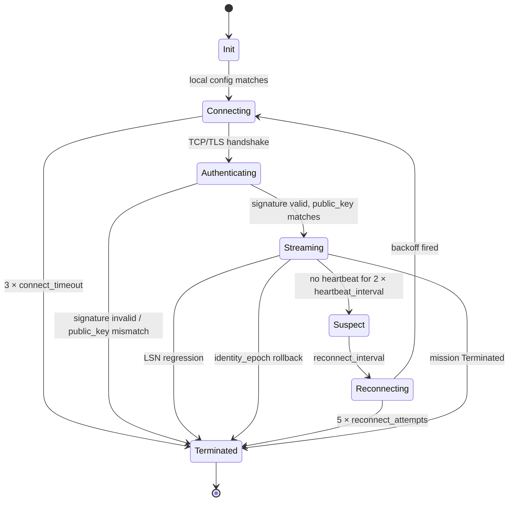

# RFC-0862 (Networking): Stoolap Data Sync Protocol

## Status

Accepted (2026-06-20)

## Authors

- @cipherocto (research)

## Maintainers

- @cipherocto

## Related RFCs

- RFC-0850 (Networking): Deterministic Overlay Transport
- RFC-0851 (Networking): Gateway Discovery Protocol
- RFC-0851p-a (Networking): Network Bootstrap Protocol
- RFC-0852 (Networking): Deterministic Gossip Protocol
- RFC-0853 (Networking): Overlay Cryptography
- RFC-0855 (Networking): Mission Overlay Networks
- RFC-0855p-b (Networking): Mission Coordinator Lifecycle
- RFC-0855p-c (Networking): Domain Coordinator Role
- RFC-0860 (Networking): Proof-of-Relay
- RFC-0861 (Networking): CoordinatorAdmin Adapter Contract Refinements
- RFC-0126 (Numeric): Deterministic Serialization
- RFC-0104 (Numeric): Deterministic Floating-Point
- RFC-0200 (Storage): Production Vector-SQL Storage Engine v2

## Summary

The Stoolap Data Sync Protocol defines a wire-level sub-protocol for synchronizing the application-level database state of two Stoolap fork instances (at `/home/mmacedoeu/_w/databases/stoolap`) over the CipherOcto overlay network. The protocol rides on DOT envelopes (RFC-0850) with new envelope payload discriminators `0xA0–0xC2`, uses OCrypt mission-key derivation (RFC-0853) for authentication and confidentiality, and reuses the Stoolap fork's V2 binary WAL (with LSN + CRC32) and snapshot files as the source of truth. v1 is single-leader (one writer node, N read-replicas) with deterministic LSN ordering; the protocol is designed to be extensible to N-node gossip via DGP anti-entropy in Phase 3.

## Review Trail

This RFC was extracted from `docs/research/stoolap-data-sync-via-cipherocto-network.md` (v2.0, post 11-round adversarial review) and `docs/use-cases/stoolap-data-sync-via-cipherocto-network.md` (v1.8, post 9-round adversarial review), then itself subjected to 12 rounds of adversarial review. The 60 findings (26 in R1, 6 in R2, 4 in R3, 5 in R4, 3 in R5, 1 in R6, 2 in R7, 1 in R8, 3 in R9, 4 in R10, 5 in R11, 0 in R12) are documented in `docs/reviews/rfc-0862-adversarial-review-r{1..12}.md`. R12 declared "VERDICT: ZERO ISSUES FOUND" and the loop terminated.

## Dependencies

**Requires:**

- RFC-0850 (Networking): Deterministic Overlay Transport — envelope wire format, platform adapter framework, replay cache, fragmentation, multi-carrier propagation.
- RFC-0852 (Networking): Deterministic Gossip Protocol — anti-entropy Merkle summary pattern (§7) adapted for per-table segments; `GossipObject` with `object_type = 0x0008 SnapshotFragment` (to be specified in this RFC).
- RFC-0853 (Networking): Overlay Cryptography — `OverlayIdentity` (`public_key`, `identity_epoch`), `MissionKeyHierarchy` (per-mission `transport_keys_root`, `execution_keys_root`), HKDF-BLAKE3 derivation, ChaCha20-Poly1305 AEAD, Ed25519 signatures, AAD binding, replay protection (1h or 10K entries per `§7`), key rotation (24h grace per `§12`).
- RFC-0126 (Numeric): Deterministic Serialization — canonical encoding for all wire structs.
- RFC-0104 (Numeric): Deterministic Floating-Point — Stoolap's `octo_determin` dependency inherits DFP semantics; all sync code must use Stoolap's release profile (`Cargo.toml:215-228`: `codegen-units = 1`, `lto = true`, `overflow-checks = false`, `panic = "abort"`, `-C target-feature=-fma` via RUSTFLAGS).

**Optional:**

- RFC-0851 (Networking): Gateway Discovery Protocol — used for sync-capable peer discovery via the new `SyncCapable` bit in `capabilities_root` (proposed amendment to RFC-0851 §M-GDP-1 or a new section; bit position TBD by maintainer decision). [Not required for 0862-base (single-leader, NativeP2P); used by 0862f (multi-peer).]
- RFC-0851p-a (Networking): Network Bootstrap Protocol — bootstrap mechanism for the writer's `SyncNodeId`. [Not required for 0862-base (operator configures writer manually); used by 0862i (Raft overlay auto-failover).]
- RFC-0855 (Networking): Mission Overlay Networks — the `Replicator` role (proposed amendment to RFC-0855 §4.2 (Roles and Authorities)) and mission lifecycle; the writer is a `DomainCoordinator` (RFC-0855p-c) and the readers are `Observer`s. [Required for 0862-base (the mission is the Sync scope); the role amendment is a §10.3 change to RFC-0855.]
- RFC-0855p-b (Networking): Mission Coordinator Lifecycle — `CoordinatorLifecycle` (8 states) referenced for writer handover (out of scope for v1; see F8). [Not required for 0862-base; used by 0862i (F8 auto-failover).]
- RFC-0855p-c (Networking): Domain Coordinator Role — `DomainCoordinatorRecord`; basis for F8 auto-failover. [Not required for 0862-base; used by 0862i.]
- RFC-0860 (Networking): Proof-of-Relay — composite scoring (forwarding/availability/bandwidth/uptime/diversity with `WF=300, WA=250, WB=200, WU=150, WD=100`) used to score sync reliability; `SyncForwardingProof` variant proposed (amendment to RFC-0860 §9 Forwarding Proofs). [Not required for 0862-base; used by 0862f (multi-peer) and 0862g (multi-carrier).]
- RFC-0200 (Storage): Production Vector-SQL Storage Engine v2 — the body-section Raft sketch (line 1821-1999) and the brief §A "Replication Model" table (line 2640-2680) are superseded by this RFC for the two-node case. [Not required for 0862-base; used by 0862i (Raft overlay).]

> **Dependency Validation Rules:**
> 1. Dependencies MUST form a DAG (no cycles). ✅ Verified: this RFC depends on the listed RFCs; the listed RFCs do not depend on this RFC.
> 2. All "Requires" RFCs MUST be listed as mission prerequisites. ✅ (See §Key Files to Modify and the 0862-base mission.)
> 3. Optional dependencies MUST be documented separately from required. ✅
> 4. Dependencies on "Planned" RFCs MUST note the assumption they will be Accepted. — N/A: all "Required" dependencies are Accepted (0850, 0126, 0104) or Draft (0852, 0853) with stable spec; all "Optional" dependencies are Accepted (0851, 0851p-a, 0855, 0855p-b, 0855p-c, 0861) or Draft (0856, 0857, 0858, 0859, 0860, 0200) with stable spec.; all "Optional" dependencies are Accepted or Draft with stable spec.

## Design Goals

| Goal | Target | Metric |
|------|--------|--------|
| **G1 — Determinism.** All wire bytes deterministic; replay-safe across implementations. | 100% byte-equal across two independent builds (Linux x86_64, macOS arm64) with `-C target-feature=-fma`. | CI gate: byte-equal output for identical input sequences. |
| **G2 — Replay safety.** Per-peer LSN watermark + RFC-0850 `ReplayCache` + OCrypt replay cache. | 0 replay acceptance across all enums. | Adversarial test: re-inject 10K captured envelopes; expect 0 to be re-accepted. |
| **G3 — Idempotency.** All operations are LSN-keyed. | 100% duplicate detection by LSN. | Test: deliver each WAL entry 10×; expect 1 apply, 9 no-ops. |
| **G4 — Catch-up cost (worst case).** Bounded by LSN range + segment count. | `O(unapplied_LSNs + log₂ segments)` Merkle descent. | Benchmark: 1M-row DB, sync in <60s; 10GB DB, sync in <10min. |
| **G5 — LSN model.** Per-node LSN counters; v1 single-leader. | 100% LSN-monotonicity across the leader's lifetime. | Property test: `entry.lsn == previous_lsn + 1` for all entries. |
| **G6 — Schema coordination.** DDL applied in LSN order. | 100% DDL success when writer and reader have the same schema. | Test: writer adds/drops column/table; reader applies; verify final state matches. |
| **G7 (operational) — Read-while-syncing.** Readers always read against their own committed view. | 0 read-disruption during sync. | Test: reader issues queries during 1M-row sync; verify monotonic view. |
| **G8 (operational) — Mission-binding precondition.** A node MUST be bound to a mission with sync-capable role before any sync attempts. | 100% rejection of sync attempts on unbound missions. | Test: sync attempt on unbound mission returns `RoleNotSyncCapable`. |

> **Note on G7 and G8:** these are operational behaviors rather than design goals in the strict sense. G1–G6 are *design* goals (determinism, replay-safety, idempotency, catch-up cost, LSN model, schema coordination); G7 and G8 are *operational requirements* that the design must satisfy. The implementation must split these into a "Design Goals" section and an "Operational Requirements" section.

## Motivation

The Stoolap fork (at `/home/mmacedoeu/_w/databases/stoolap`) is a complete embedded SQL database with MVCC transactions, HNSW vector search, AS OF time-travel, a binary WAL with LSN, snapshot persistence, and an event publisher trait. However, the fork has **zero networking code** (`stoolap/Cargo.toml:36-131`; the only network-adjacent code is `libc::flock` for cross-process file locking at `src/storage/mvcc/file_lock.rs:129`). The fork's own `ROADMAP.md` lists Phase 3 "Network Protocol & Gossip" as DRAFT; the corresponding network-protocol RFC is not yet written.

The CipherOcto network has a complete overlay transport stack — Deterministic Overlay Transport (RFC-0850), Deterministic Gossip Protocol (RFC-0852), Overlay Cryptography (RFC-0853), Mission Overlay Networks (RFC-0855) — but **no RFC specifies the wire-level protocol for synchronizing application-level database state between two nodes**. The closest sketches are: (a) a `catch_up` pseudocode fragment in `RFC-0200` body section (line 1821-1999) with no wire format, no RFC number, and no mission; and (b) the DGP anti-entropy Merkle-descent sketch in `RFC-0852 §7` (scoped to *overlay* state, not application storage).

This RFC bridges the gap by defining a wire-level sub-protocol that:

1. **Rides on existing CipherOcto infrastructure.** No new transport; no new crypto; no new identity model. Uses DOT envelopes, OCrypt mission keys, DGP anti-entropy pattern.
2. **Reuses existing Stoolap primitives.** No new WAL format; no new snapshot format; no new transaction model. Uses the V2 binary WAL (with LSN + CRC32) and per-table snapshot files as the source of truth.
3. **Preserves determinism.** All wire bytes hashed with BLAKE3-256; values canonicalized via DCS (RFC-0126); DFP arithmetic (RFC-0104) preserved.
4. **Targets v1 = two nodes**, with explicit Phase 3 (DGP gossip) and Phase 4 (Raft overlay) extension paths.

## Roles and Authorities

This RFC defines two roles:

| Role | Identifier | Authority Scope | Lifecycle | Source/Ref |
|------|------------|-----------------|-----------|------------|
| **Writer** (a.k.a. `Replicator`) | `SyncNodeId` (BLAKE3-256 of `OverlayIdentity.public_key || mission_id`, 32 bytes) | Read: local DB only. Write: full (commits transactions, generates WAL entries, ships `WalTailChunk` / `SyncSegment` envelopes). Configuration: declares the canonical `writer_node_id` for the mission. | Per-mission binding; held for the duration of the mission. | RFC-0855 §4.2 (proposed `Replicator` role amendment). |
| **Reader** (a.k.a. `Observer`) | `SyncNodeId` (same construction) | Read: full (queries the local DB, applies received WAL entries / snapshot segments in LSN order). Write: NONE. Configuration: declares the writer's `SyncNodeId` it syncs from. | Per-mission binding; held for the duration of the mission. | RFC-0855 §4.2 (`Observer` role, already exists). |
| **Domain Coordinator** (writer-side) | `DomainCoordinatorRecord` extending `CoordinatorRecord` with mission/domain/group_jid/platform fields | Read/write: the writer's `DomainCoordinator` (RFC-0855p-c) is the entry point for Sync on the writer side. | 8-state `CoordinatorLifecycle` (Designated → Elected → Active → Suspect → Handover → Demoting → Resigned → Inactive) per RFC-0855p-b. In v1, the writer is `Active` for the duration of the mission; `Handover` and `Demoting` are not exercised (v1 has no auto-failover; see F8). | RFC-0855p-c + RFC-0855p-b. |
| **Per-peer state machine** | Per-peer `SyncStateMachine` | Local state for the connection to one peer: `Init → Connecting → Authenticating → Streaming → Suspect → Reconnecting → Terminated` (7 states; see §Lifecycle Requirements). | Per-connection; 7 states. | This RFC. |

**Role transitions:**

- **Writer is bound** to a mission (RFC-0855 lifecycle `Created → ... → Active`); the binding is performed by the operator (no on-chain election in v1).
- **Reader is bound** to a mission with `writer_node_id` configured; if `writer_node_id` does not match the `SyncNodeId` derived from the writer's `OverlayIdentity.public_key`, the reader rejects all `AuthChallenge` responses.
- **Domain Coordinator handover** is NOT exercised in v1; F8 is the future mission for this.
- **Out-of-scope roles:**
  - **`Executor` (RFC-0855 §4.2)** — writers do not execute missions; Sync is a transport layer, not a mission executor.
  - **`Validator` (RFC-0855 §4.2)** — readers do not validate; Sync applies WAL entries deterministically without cryptographic consensus.
  - **`Relay` (RFC-0855 §4.2)** — used only at the transport layer (DOT's multi-carrier propagation may relay Sync envelopes as generic DOT envelopes); not a Sync-level role.
  - **`Platform operators`** — manage physical group membership per `RFC-0850p-a`'s `GroupConfig.operator_phone`. Out of scope for Sync; Sync is above the platform layer.
  - **`Archivist`, `Prover`, `Aggregator` (RFC-0855 §4.2)** — not used by Sync; these are mission-execution roles that Sync may emit events to (via `WalPubSub`) but does not synchronize.
  - **`Validator` (RFC-0855p-b slash tally)** — slash tally for `sync_peer_misbehavior` is a `DomainCoordinator` function per RFC-0855p-c, not a Sync-level role.

**ACCEPTED IMPLICIT ROLES**

- **Operator** (v1) — the operator is trusted to correctly configure `writer_node_id`, the Sync transport, and the mission key set. Operator compromise is the primary threat surface (see §Adversary Analysis Threat 6). This is an *accepted implicit role* that must be made explicit at `Accept` status (per BLUEPRINT template v1.3). Deadline: F2 (trust-anchored storage checkpoint) will reduce operator trust to a single bootstrap verification.

## Specification

### System Architecture

```
┌────────────────────────────────────────────────────────────────────┐
│                  CipherOcto Sync Sub-Protocol (this RFC)           │
│  ┌────────────────────────────────────────────────────────────┐    │
│  │  SyncRequest / SyncResponse / SyncSegment / SyncSummary    │    │
│  │  (DCS-encoded, OCrypt-encrypted, RFC-0850 envelope subtypes │    │
│  │   DOT/1/SYNC_*)                                            │    │
│  └────────────────────┬───────────────────────────────────────┘    │
│                       │                                            │
│  ┌────────────────────┴───────────────────────────────────────┐    │
│  │  Sync Engine:                                              │    │
│  │   - LSN tracker (per-peer, per-table)                      │    │
│  │   - Merkle segment summary builder (per-table)            │    │
│  │   - Snapshot segment indexer (per mission 0862c)           │    │
│  │   - Dedup cache (BLAKE3-256 of (peer,lsn) → bool)         │    │
│  │   - Replay protection (RFC-0850 ReplayCache integration)  │    │
│  │   - Rate limiter (per-peer token bucket)                   │    │
│  └────────────────────┬───────────────────────────────────────┘    │
│                       │                                            │
│  ┌────────────────────┴───────────────────────────────────────┐    │
│  │  Transport adapters:                                       │    │
│  │   - NativeP2P (libp2p gossipsub, RFC-0850 §3.1 0x000A)    │    │
│  │   - QUIC (RFC-0850 §8.7) — alternative primary            │    │
│  │   - Webhook (HTTP) — fallback for air-gapped bridges      │    │
│  │   - Multi-carrier (Telegram/Discord/Matrix) — best-effort │    │
│  └────────────────────┬───────────────────────────────────────┘    │
│                       │                                            │
│  ┌────────────────────┴───────────────────────────────────────┐    │
│  │  OCrypt (RFC-0853)                                         │    │
│  │  MissionKeyHierarchy, HKDF-BLAKE3, ChaCha20-Poly1305,      │    │
│  │  MissionId-derived AAD, 24h revocation grace                │    │
│  └────────────────────┬───────────────────────────────────────┘    │
│                       │                                            │
│  ┌────────────────────┴───────────────────────────────────────┐    │
│  │  DOT (RFC-0850)                                            │    │
│  │  DeterministicEnvelope, 21 platform adapters,             │    │
│  │  fragmentation, replay cache, logical timestamps          │    │
│  └────────────────────────────────────────────────────────────┘    │
│                                                                    │
│  Above the new layer, the Sync protocol surfaces as:               │
│    crates/octo-sync/src/{summary,stream,segment,keyring,state}/   │
│    stoolap fork: src/sync/{publisher,subscriber,rpc}.rs            │
└────────────────────────────────────────────────────────────────────┘
```

### Envelope Payload Discriminators

New envelope payload discriminators (the byte that follows the `DeterministicEnvelope` header per RFC-0850) are allocated from the 8-bit envelope payload discriminator space. The space has 256 values; the following are reserved for Sync:

| Code | Name | Direction | Description |
|------|------|-----------|-------------|
| `0xA0` | `SummaryRequest` | Reader → Writer | "Give me your per-table Merkle summaries" |
| `0xA1` | `SummaryResponse` | Writer → Reader | Per-table `(table_id, segment_root, count, lsn_watermark, hmac)` |
| `0xA2` | `SegmentRequest` | Reader → Writer | "Send me table T, segment S, expected root R" |
| `0xA3` | `SegmentResponse` | Writer → Reader | Per-table snapshot segment (snapshot-<ts>.bin bytes) |
| `0xA4` | `SegmentNotFound` | Writer → Reader | "I don't have that segment" |
| `0xA5` | `NodeStatus` | Writer ↔ Reader | Node-level LSN, mission_id, identity_epoch |
| `0xB0` | `WalTailRequest` | Reader → Writer | "Send me WAL entries from LSN X" |
| `0xB1` | `WalTailResponse` | Writer → Reader | `WalTailChunk` (entries in `[from_lsn, to_lsn]` inclusive) |
| `0xB2` | `WalTailEnd` | Writer → Reader | "Stream ended" (defensive: receivers also use `is_last` in `WalTailChunk`) |
| `0xB3` | `LsnAck` | Reader → Writer | "I have applied up to LSN X" |
| `0xC0` | `Heartbeat` | Writer ↔ Reader | Liveness probe (5s interval, 10s Suspect) |
| `0xC1` | `AuthChallenge` | Reader → Writer | Mission-key derivation challenge (RFC-0853 §6) |
| `0xC2` | `AuthResponse` | Writer → Reader | Ed25519-signed `(peer_short_id || ts || public_key || mission_id)` |

Reserved for future: `0xC3-0xFF` (61 codes).

### Data Structures

```rust
// All structures are DCS-encoded (RFC-0126) before encryption (OCrypt ChaCha20-Poly1305).

/// Per-table Merkle summary in a SummaryResponse envelope.
pub struct SyncSummary {
    pub table_id: u32,                  // BLAKE3-256(table_name)
    pub segment_count: u32,
    pub segment_root: [u8; 32],         // BLAKE3-256 over 16-way Merkle tree of per-segment payload hashes
    pub lsn_watermark: u64,             // highest LSN applied to this table
    pub hmac: [u8; 32],                 // HMAC-BLAKE3(transport_key, summary_body)
}

/// Per-table snapshot segment in a SegmentResponse envelope.
pub struct SyncSegment {
    pub table_id: u32,
    pub segment_index: u32,
    pub segment_root: [u8; 32],         // matches the root in SyncSummary
    pub payload: Vec<u8>,               // a single <dsn-path>/snapshots/<table>/snapshot-<ts>.bin file
    pub compression: u8,                // 0=raw, 1=lz4 (matches stoolap Cargo.toml:74 lz4_flex)
    pub crc32: u32,                     // matches WAL V2 trailer convention
    pub lsn_watermark: u64,             // the LSN of the highest committed entry included in this
                                        // segment. After applying this segment, the reader advances
                                        // its LSN watermark to `max(reader.lsn_watermark, segment.lsn_watermark)`.
}

/// Stream of WAL entries in a WalTailResponse envelope.
pub struct WalTailChunk {
    pub from_lsn: u64,                   // inclusive
    pub to_lsn: u64,                     // inclusive
    pub entries: Vec<Vec<u8>>,          // raw WALEntry::encode() output
    pub is_last: bool,                   // true if to_lsn == writer.current_lsn
                                        // (defensive: if WalTailEnd is lost, the reader uses
                                        //  this to know the stream is done; either signal is sufficient)
}

/// Node-level status (separate envelope, not per-table).
pub struct NodeStatus {
    pub node_id: SyncNodeId,             // 32 bytes (see below)
    pub current_lsn: u64,                 // node-level LSN (max across tables)
    pub mission_id: [u8; 32],
    pub identity_epoch: u64,             // RFC-0853 §12 key rotation counter
}

/// Sync-specific node identity. Distinct from RFC-0850's PlatformIdentity and the
/// `PeerId` type in `octo-network/src/dot/adapters/coordinator_admin.rs:127` to avoid
/// a name collision (the existing `PeerId` is `pub struct PeerId(pub String)`).
pub struct SyncNodeId(pub [u8; 32]);
pub struct SyncPeerId(pub [u8; 32]);

// SyncNodeId = BLAKE3(OverlayIdentity.public_key || mission_id) per RFC-0853:163
// (NOT signing_key; not verifying_key; the actual field is public_key).
```

### Naming note

The `SyncNodeId` / `SyncPeerId` types are deliberately distinct from:

- `crates/octo-network/src/dot/adapters/coordinator_admin.rs:127` — `pub struct PeerId(pub String);` (used by `CoordinatorAdmin` trait for string-typed peer identifiers in the mission layer)
- RFC-0853's `OverlayIdentity.public_key` (the raw 32-byte Ed25519 public key, not a hash)

The Sync types are the BLAKE3-256 hash `BLAKE3(public_key || mission_id)` and are namespaced to the Sync protocol to avoid Rust compilation conflicts.

### Algorithms

#### 4.3.1 Identity, key hierarchy, and trust

- **Node identity** = `OverlayIdentity` per RFC-0853 §4 (Ed25519 keypair: `public_key: [u8; 32]` per RFC-0853:163, with the corresponding private key held by the node and never advertised; the `signature: [u8; 64]` field is the Ed25519 self-signature — the node signs its own `public_key` to prove possession of the corresponding private key). At Sync handshake time, the node advertises its `OverlayIdentity.public_key`.
- **SyncNodeId = BLAKE3(public_key || mission_id)** (32 bytes). First 16 bytes are the "short" id used in logs; full 32 bytes in envelopes.
- **SyncPeerId = BLAKE3(peer_public_key || mission_id)** — same construction for remote nodes, where `peer_public_key` is the remote node's `OverlayIdentity.public_key`.
- **Encryption keys** (transport_key and execution_key) derived from `MissionKeyHierarchy.mission_root_key` (RFC-0853) via `HKDF-BLAKE3(mission_root_key, "sync:v1", mission_id)`. The `transport_key` is used for `SyncSummary.hmac`; the `execution_key` is used for ChaCha20-Poly1305 AEAD on `SyncSegment` / `WalTailChunk` payloads. Per-mission, not per-message. To be documented in §6 (Mission Cryptography) of RFC-0853. See Appendix B for the full key hierarchy diagram.
- **AEAD AAD** for OCrypt: `(envelope_id || sender_ephemeral_public || mission_id || logical_timestamp || sequence)` per RFC-0853 §4 (Deterministic Envelope Encryption, line 202-215).
- **AuthChallenge/AuthResponse signature payload** (the Ed25519 signature, separate from AAD): `(peer_short_id || timestamp || public_key || mission_id)`. The receiver validates the signature against the mission's public key set distributed via `GatewayAdvertisement.trust_root` (RFC-0851 §10 Gateway Cache, M-GDP-2 cache-eviction formula at line 435).
- **Trust anchor**: a `DOT/1/SYNC_AUTH_RESPONSE` carries a signature over the tuple above. The peer validates with the mission's public key set. This reuses the RFC-0851p-a Mode A trust-anchored bootstrap pattern.
- **Rate limit**: per-peer token bucket (100 envelopes/s sustained, 500 burst; configurable per mission). Enforced at the Sync engine, not at the platform adapter.

#### 4.3.2 LSN model and ordering

- **WAL application order** is the writer's local LSN order. The Sync protocol never re-orders; it ships entries in the order the writer committed them.
- **Table application order** is canonical: `(table_id, lsn, row_id, op_type)`. A node receiving entries from multiple peers at once (future Phase 3 gossip) sorts by this key and applies in order.
- **Hashing**: BLAKE3-256 for all sync wire hashes (envelope_id, segment_root, summary HMAC, node_id). Matches RFC-0850 `envelope_id`, RFC-0852 `object_hash`, RFC-0853 primitives, and the Stoolap `octo_determin` dependency.
- **Merkle segment tree**: 16-way (matches `HexaryProof` convention in `stoolap/src/trie/proof.rs:71-87`; minimum size ~120 bytes for empty `levels` and `path` vectors). Root = BLAKE3-256 of the 16 child hashes (or itself if leaf). Tree depth ≤ 4 for ≤ 65 536 segments per table.
- **Uncommitted transactions** are NOT shipped. Sync streams only entries with a `Commit` marker; `Rollback` markers trigger entry discard on the reader (matches `WALManager::replay_two_phase` semantics at `stoolap/src/storage/mvcc/wal_manager.rs`).
- **v1 single-leader → total order via LSN.** Phase 3 multi-peer will need per-row HLC or vector clocks; deferred to F1.
- **Reader handling of `WalTailEnd` and `is_last`:** if `WalTailEnd` (envelope `0xB2`) is received, the reader stops waiting for more chunks immediately. If `is_last` is true in the most recent `WalTailChunk` and no `WalTailEnd` arrives within `wal_tail_end_timeout` (5s), the reader also stops. The reader treats either signal as sufficient — both are belt-and-suspenders. If a chunk arrives after `WalTailEnd` (out-of-order delivery), the reader dedupes by LSN and discards the late chunk.

#### 4.3.3 WAL-tail streaming (Approach B)

1. **Writer**: On every `TransactionEngineOperations::record_commit(txn_id)` (the Stoolap commit hook at `stoolap/src/storage/mvcc/transaction.rs`), capture the LSN range `[previous_lsn+1, current_lsn]`.
2. **Writer → Reader (live)**: Periodically (every `commit_batch_size` commits, default 100) or on demand (e.g., reader's `WalTailRequest`), wrap the captured entries in `WalTailChunk { from_lsn, to_lsn, entries, is_last }` and ship as a `WalTailResponse` envelope.
3. **Reader**: For each received `WalTailChunk`, dedupe by LSN (using the per-peer LSN watermark), then apply each entry via `WALManager::replay_two_phase(from_lsn, callback)`. The callback is `apply_wal_entry(entry: &[u8])` which feeds the entry into the reader's MVCC engine.
4. **Reader → Writer (ack)**: After successful apply, send `LsnAck { applied_lsn: chunk.to_lsn }`.
5. **Catch-up**: On `WalTailRequest { from_lsn: reader.lsn_watermark + 1 }`, the writer responds with the requested LSN range.

#### 4.3.4 Anti-entropy Merkle summary (Approach D)

1. **Reader → Writer (initial sync)**: Send `SummaryRequest` (no payload).
2. **Writer → Reader**: Send `SummaryResponse { summaries: Vec<SyncSummary> }` for all tables.
3. **Reader**: For each table, compare its local `SyncSummary` with the writer's:
   - If `segment_root` matches and `lsn_watermark` matches: no-op (already in sync).
   - If `segment_root` matches but `lsn_watermark` is behind: request `WalTailRequest` for the missing LSN range.
   - If `segment_root` differs: descend the Merkle tree to find divergent segments, then send `SegmentRequest { table_id, segment_index, expected_root }` for each.
4. **Writer → Reader (per segment)**: Send `SegmentResponse { segment }` or `SegmentNotFound` (which forces a re-snapshot on the writer side; see §Error Handling).
5. **Reader** receives each segment, verify `BLAKE3-256(payload) == segment.segment_root` and `crc32(payload) == segment.crc32`. On mismatch, retry with exponential backoff (max 3 attempts, 1s/2s/4s). **The 3-attempt exponential backoff in this step is the soft-retry path within a single sync session** (i.e., before process restart). On persistent mismatch, mark peer `Suspect`, then `Terminated`. (See §Lifecycle Requirements for the post-restart recovery path.)

### Lifecycle Requirements

The per-peer `SyncStateMachine` has **7 states** (not 8 like RFC-0855's `CoordinatorLifecycle`):

```rust
#[repr(u8)]
enum SyncLifecycle {
    Init            = 0x00,  // local startup; not yet attempted connection
    Connecting      = 0x01,  // TCP/TLS handshake in progress
    Authenticating  = 0x02,  // AuthChallenge/AuthResponse in progress
    Streaming       = 0x03,  // WAL-tail streaming active; lsn_watermark advancing
    Suspect         = 0x04,  // no heartbeat for `2 × heartbeat_interval` (10s)
    Reconnecting    = 0x05,  // backoff in progress; will retry Connecting
    Terminated      = 0x06,  // peer rejected (auth fail) or mission ended; no retry
}
```

| From | To | Trigger | Deterministic? | Side Effects | Signing |
|------|----|---------|----------------|--------------|---------|
| Init | Connecting | Local config: `writer_node_id` or `reader_node_id` matches; mission bound; sync feature enabled | Yes | TCP/TLS dial to peer's published endpoint | n/a |
| Connecting | Authenticating | TCP/TLS handshake complete; OCrypt mission key derived | Yes | Derive `transport_keys_root` for this peer; send `AuthChallenge` | n/a |
| Connecting | Terminated | TCP/TLS handshake fails after `3 × connect_timeout` (30s total) | Yes | Emit `ConnectFailed` event locally | n/a |
| Authenticating | Streaming | `AuthResponse` signature verifies; `public_key` matches expected `writer_node_id` (for readers) or peer registered (for writers) | Yes | Send initial `SummaryRequest`; begin heartbeat | n/a |
| Authenticating | Terminated | `AuthResponse` signature fails OR `public_key` mismatch OR `identity_epoch` rolled back | Yes | Emit `AuthFailed` event locally; log slash-tally candidate | n/a |
| Streaming | Suspect | No heartbeat or LSN progress for `2 × heartbeat_interval` (10s) | Yes | Emit `PeerUnreachable` event locally; start reconnect timer | n/a |
| Streaming | Terminated | LSN regression detected OR `identity_epoch` changed unexpectedly | Yes | Emit `LsnRegression` event locally; slash-tally candidate | n/a |
| Suspect | Reconnecting | `reconnect_interval` (5s) elapsed | Yes | Start backoff timer | n/a |
| Reconnecting | Connecting | Backoff timer fired (max 60s with jitter) | Yes | Re-dial peer | n/a |
| Reconnecting | Terminated | `reconnect_attempts` (max 5 attempts, ~5 min) exhausted | Yes | Emit `PeerUnreachablePersistent` event; require operator intervention | n/a |
| Streaming | Streaming | Heartbeat every 5s; LSN advances; rate limit 100/s sustained | Yes | Update `lsn_watermark`; emit `LsnAck` periodically | n/a |
| Streaming | Terminated | Mission `Active → Terminated` per RFC-0855 lifecycle | Yes | Close TCP/TLS; emit `SyncTerminated` event | n/a |

**Liveness check:** Heartbeat (5s interval) + LSN-progress probe (at least 1 LSN-ack per 30s).

**Recovery semantics:** on missed heartbeat, transition to `Suspect` after `2 × heartbeat_interval` (10s); on persistent unreachability after 5 min, transition to `Terminated` (operator intervention required).

**Time bounds:** reconnect backoff `min(60s, 5 × 2^attempt)` with ±20% jitter; max 5 reconnect attempts before `Terminated`.

> **Justification for 7 states (not 8 like RFC-0855's CoordinatorLifecycle):** The Sync state machine does not transition through `Handover` (a coordinator-only state per RFC-0855p-b). v1 has no auto-failover; the writer is statically designated at mission start.

### Determinism Requirements

MUST specify deterministic behavior for all operations affecting consensus-relevant state.

- **Wire encoding**: DCS (RFC-0126) for all struct fields. BLAKE3-256 for all hashes. HMAC-BLAKE3 for authenticators. LZ4 for compression (LZ4 is byte-deterministic; see §RFC-0008 Execution Class Mapping).
- **LSN assignment**: Counter, no wall clock. `entry.lsn = self.current_lsn.fetch_add(1, Ordering::SeqCst) + 1` per `stoolap/src/storage/mvcc/wal_manager.rs:1304`.
- **Merkle root computation**: BLAKE3-256 over the 16 child hashes (sorted by `segment_index`). Children are leaves (themselves BLAKE3-256 of `segment.payload`) or zero hashes for empty slots.
- **HMAC binding**: `hmac = HMAC-BLAKE3(transport_key, summary_body || node_id)`. The transport_key is derived per-peer per-mission; recomputing on the writer and reader sides must produce the same bytes.
- **No wall clock in wire protocol.** The `timestamp` field in `AuthResponse` is for replay-window enforcement (RFC-0853 §7), not for ordering.

### RFC-0008 Execution Class Mapping

| Operation | Class | Rationale |
|-----------|-------|-----------|
| `SyncSummary` encoding | **A** | DCS-encoded, BLAKE3-256 hashed, HMAC-BLAKE3 — all deterministic |
| `SyncSegment` encoding | **A** | DCS-encoded, BLAKE3-256 hashed, CRC32 trailer, LZ4 (LZ4 is byte-deterministic) |
| `WalTailChunk` encoding | **A** | Raw `WALEntry::encode()` output (stoolap V2 binary is already canonical across implementations per RFC-0104) |
| `NodeStatus` encoding | **A** | Same as `SyncSummary` |
| `AuthChallenge` nonce | **A** | Must be unique per session; HKDF-BLAKE3-derived |
| Replay cache eviction | **A** | RFC-0850 already specifies BTreeMap with deterministic tie-break |
| LSN monotonicity enforcement on receiver | **A** | Per-entry `entry.lsn == previous_lsn + 1` check |
| Merkle segment tree root | **A** | BLAKE3-256 over 16 child hashes |
| Compression selection (LZ4 vs raw) | **A** | LZ4 is byte-deterministic; selection is encoded in the segment |
| Snapshot segment generation (atomic-rename) | **A** | The atomic-rename semantics of `MVCCEngine::create_snapshot` (`stoolap/src/storage/mvcc/engine.rs:2642`, rename at `engine.rs:2828`) are part of the protocol contract; a reader that observes a half-written segment is a bug |
| Dedup cache eviction (per-peer LSN) | **A** | BTreeMap by LSN |
| Mission key derivation | **A** | RFC-0853 already Class A |
| Logical timestamp assignment | **A** | Counter, no wall clock |
| Transport selection (NativeP2P vs Webhook vs Telegram) | **B** | Affects message arrival order and reliability, hence convergence; deterministic when configured with a fixed transport |
| Retry/backoff | **B** | Affects convergence order; deterministic when retry interval is configured |
| Diagnostic logging | **C** | Does not affect state |
| Path selection in the DRS sense | **C** | Per RFC-0856 itself |

### Error Handling

| Code | Name | Cause | Recovery |
|------|------|-------|----------|
| `E_SYNC_AUTH_FAIL` | AuthFailure | `AuthResponse` signature invalid, `public_key` mismatch, or `identity_epoch` rollback | Transition to `Terminated`; emit `AuthFailed` event; slash-tally candidate (subject to F8 maintainer decision on which slash code to allocate; see `RFC-0850p-c §6` reserved range `0x0013-0xFFFF`) |
| `E_SYNC_LSN_REGRESSION` | LsnRegression | Received entry with `entry.lsn < previous_lsn + 1` | Transition to `Terminated`; emit `LsnRegression` event; slash-tally candidate |
| `E_SYNC_SEGMENT_CORRUPTION` | SegmentCorruption | `BLAKE3-256(payload) != segment.segment_root` or `crc32(payload) != segment.crc32` | Retry with exponential backoff (3 attempts, 1s/2s/4s); on persistent failure, mark peer `Suspect`, then `Terminated` |
| `E_SYNC_SEGMENT_NOT_FOUND` | SegmentNotFound | Writer replied with `0xA4` (writer's snapshot was deleted) | Reader re-sends `SummaryRequest`; **writer regenerates the snapshot per-table via `MVCCEngine::create_snapshot_for_table`** (per mission 0862c) and ships; reader retries |
| `E_SYNC_RATE_LIMIT` | RateLimitExceeded | Reader's token bucket exhausted (>100 envelopes/s sustained) | Writer backs off (drop or queue); reader increments per-peer rate-limit counter; on persistent rate-limit, mark peer `Suspect` |
| `E_SYNC_WAL_APPEND_FAIL` | WalAppendFail | `MVCCEngine` rejected an applied WAL entry (schema mismatch, corruption, etc.) | Transition to `Terminated`; emit `WalAppendFail` event; operator must investigate (likely schema-version mismatch, F9 future work) |
| `E_SYNC_SCHEMA_DRIFT` | SchemaDrift | DDL applied out of order or referenced DDL missing | Abort the apply with a clear error; emit `SchemaDrift` event; transition to `Terminated`; operator must investigate (F9 future work) |
| `E_SYNC_HEARTBEAT_TIMEOUT` | HeartbeatTimeout | No heartbeat for `2 × heartbeat_interval` (10s) | Transition to `Suspect` → `Reconnecting` |
| `E_SYNC_ROLE_NOT_SYNC_CAPABLE` | RoleNotSyncCapable | Mission is bound but local role is not `Replicator` or `Observer` | Refuse to open with `sync=on` |

## Performance Targets

| Metric | Target | Notes |
|--------|--------|-------|
| **End-to-end replication latency (one-way)** | < 50 ms p50, < 200 ms p99 | LAN (≤ 10 ms RTT), 1 KB write, single envelope |
| End-to-end replication latency (one-way, WAN) | < 500 ms p99 | WAN (≤ 100 ms RTT), 1 KB write |
| **Throughput (single writer)** | > 5,000 commits/s | WAL streaming, batched; assumes 200-byte avg entry, `SyncMode::Normal` |
| Throughput (10 writers via DOM Phase 3) | > 50,000 commits/s | Aggregated via DOM (RFC-0857) — Phase 3 |
| **First-time snapshot sync (1 GB)** | < 60 s | LZ4, single parallel stream, ≥ 17 MB/s available bandwidth (typical residential broadband) |
| First-time snapshot sync (10 GB) | < 10 min | 4 parallel streams, ≥ 17 MB/s |
| Catch-up after 1 min partition | < 5 s | Anti-entropy Merkle descent, no snapshot re-ship |
| Catch-up after 1 hr partition | < 10 min | Snapshot re-ship from oldest LSN on disk |
| Heartbeat payload | ~ 64 bytes per heartbeat | Envelope overhead (~ 256 bytes) + Heartbeat (64 bytes) + LSN-watermark sample (8 bytes) = ~ 328 bytes per 5s |
| Control plane budget | < 1% of bandwidth | At 5K commits/s, 200-byte avg entry, the data plane is 1 MB/s. Heartbeats at 5s/heartbeat = 328 B / 5s = 66 B/s ≈ 0.007% of data plane. (328 B = 256-byte envelope overhead from the **wire overhead** calculation above + 64-byte heartbeat payload + 8-byte LSN-watermark sample.) |
| **Memory overhead (Sync engine per peer)** | ≤ 50 MB | ReplayCache (10K × ~5 KB = 50 MB max) + dedup cache (160 KB) + in-flight segment buffers (default 0, lazy) + Sync engine state (negligible). The `≤ 50 MB` target uses **decimal** MB (1 MB = 1,000,000 bytes); the 50 MB ReplayCache + 160 KB dedup cache sums to ~50.16 MB in steady state, which is **at the target limit, not below** — operators may need to reduce ReplayCache to 9,000 envelopes in tight-memory deployments. |
| Cross-implementation determinism | 100% byte-exact | CI gate: Linux x86_64 and macOS arm64 builds produce identical wire bytes (with `RUSTFLAGS="-C target-feature=-fma"`) |

## Implicit Assumptions Audit

| # | Category | Assumption | Where Relied Upon | Blast Radius if False | Mitigation / Status |
|---|----------|------------|-------------------|----------------------|---------------------|
| 1 | Data integrity | Receiver computes **BLAKE3-256** over each applied segment and aborts on mismatch | §Data Structures (SyncSegment.segment_root) | If false, a corrupted segment is installed silently; downstream ZK proofs reference false data | 0862c unit test "segment_root verification" (line 265): `BLAKE3-256(raw_payload) == segment.segment_root`. |
| 2 | Transport framing | DOT platform adapters honor byte-exact framing | §System Architecture (wire format) | Telegram/IRC adapters may lose bytes at the fragmentation boundary | Use the RFC-0850 fragmentation `DOT/F/...` envelope subtype for segments > adapter MTU. Test: round-trip 256B / 512B / 4KB / 1MB through every adapter. |
| 3 | Network behavior | Network has bounded partition duration | §4.3.2 LSN model and ordering, §Implementation Phases Phase 1 test | A long partition could force a snapshot re-ship on every reconnect; if partition > writer's WAL retention, the reader must resync from scratch | DGP anti-entropy Merkle summary limits the reship to *missing* segments; `SnapshotRequest` is the recovery path. **ACCEPTED RISK**: reader can lose data if partition > writer's WAL retention window. |
| 4 | Configuration | Sync config is correctly set up (peer IDs, mission ID, transport adapter selection, `writer_node_id`) | §4.3.1 Identity, key hierarchy, and trust, §Implementation Phases Phase 1 | A misconfigured reader may sync from the wrong peer or refuse to sync entirely | Operator runbook + `stoolap sync doctor` CLI that validates config before opening a `Database`. 0862-base integration test "role_mismatch.rs" (line 172) covers one misconfiguration case (wrong role); a broader "config-error injection" test is tracked for a future mission update. |
| 5 | Identity stability | Node identity (`OverlayIdentity`) is stable for the duration of a sync session; the cipher suite (ChaCha20-Poly1305 + Ed25519 + HKDF-BLAKE3) is fixed for the session and does not downgrade mid-sync | §4.3.1 Identity, key hierarchy, and trust | A key rotation mid-sync would invalidate the per-peer LSN watermark and the HMAC; a cipher-suite downgrade would weaken confidentiality. | OCrypt mission key rotation triggers a fresh `AuthChallenge`; in-flight envelopes from the old key are dropped. Cipher suite is fixed in the Sync envelope header and cannot be changed mid-session. 0862d unit test "summary_hmac is deterministic" (line 139) covers HMAC stability. A broader "rotation during sync" test is tracked for a future mission update. |
| 6 | Resource availability | Writer's commit rate is bounded below `5,000 commits/s` | §Performance Targets | If writer exceeds this, reader cannot keep up; WAL buffer grows unbounded | Reader's per-peer backpressure: reader sends `PAUSE` if its apply queue > 10K entries. **ACCEPTED RISK**: above 5K commits/s sustained, reader falls behind. |
| 7 | Resource availability | Reader has enough disk space for incoming WAL + segments | §Error Handling (disk-space check) | Reader crashes if `/` fills up | Disk-space check before applying each segment; reject segment if free space < 2× segment size. **Operational**: monitor `df` on reader. |
| 8 | Resource availability | System has enough memory for Sync engine + replay cache + dedup cache (≤ 50 MB total per peer) | §4.3.1 Identity, key hierarchy, and trust (rate limit + replay cache) | OOM if peer sends many unique envelopes at high rate | Bounded caches with deterministic eviction; per-peer rate limit caps inbound rate. |
| 9 | Time source | OS provides monotonic time for `get_fast_timestamp()` (the writer's LSN counter) | §Motivation (background), §4.3.2 LSN model and ordering | Counter rollback (kernel bug, VM migration) could break LSN monotonicity | Counter is per-process, persisted in WAL; `find_safe_truncation_lsn` (free function at `engine.rs:291`) ensures counter only advances. **ACCEPTED RISK**: host-level clock attack. |
| 10 | Network partition | The OS, network stack, and platform adapters all support ordered, reliable byte streams for the chosen transport (NativeP2P / QUIC) | §System Architecture (transport selection) | Loss / reordering at the transport layer is handled by DOT's `ReplayCache` and fragmentation, but not by Sync itself | Documented in §Security Considerations. |
| 11 | Upgrade safety | Writer and reader are on the same software version (no mixed-version operation) | §Compatibility | A reader on v0.4 cannot read a writer on v0.5 if the wire format changes | WAL has format-version byte since V2; Sync envelope header has version byte `0x01` (v1) and `0x02` (v2). A v1 reader rejects envelopes with unknown version (forward-incompatible); a v2 reader accepts v1 envelopes (backward-compatible). The version byte is part of the OCrypt AAD, so a v1 reader cannot be tricked into accepting a v2 envelope as v1. **ACCEPTED RISK**: rolling upgrades require coordination. |
| 12 | Configuration | Mission is bound and authenticated before any sync attempts | §4.3.1 Identity, key hierarchy, and trust (trust anchor) | Sync attempts fail at the AuthChallenge step; no state divergence | Reader checks mission state at startup; refuses to open if mission is not `Active` per RFC-0855 lifecycle. |
| 13 | Resource availability | The cipherocto node has sufficient stake to participate in the mission (per RFC-0855 dual-stake: ≥ 1,000 OCTO global + role-specific) | §Motivation (RFC-0855 mission) | Sync rejected by mission governance | Mission admission check before opening a `Database` with sync. 0862-base integration test "role_mismatch.rs" covers one case (wrong role → no sync); a broader "insufficient stake" test is tracked for a future mission update. |
| 14 | Configuration | At least one sync-capable peer is online and reachable when sync is attempted | §System Architecture (transport) | Sync hangs; reader times out after `2 × heartbeat_interval` (10s) | Heartbeat + `Suspect` transition + `WriterUnreachable` event emitted locally. **ACCEPTED RISK**: zero-peer dead-end requires operator intervention. |
| 15 | Schema coordination | Writer and reader agree on schema (table definitions, column types) at sync time | §Design Goals G6, §Security Considerations | DDL applied out of order; reader rejects | DDL entries applied in LSN order; missing dependency aborts the apply with a clear error. **Operational**: schema migrations must be coordinated. |
| 16 | Mission-binding precondition | A node MUST be bound to a mission with sync-capable role (`Replicator` or `Observer`) before any sync attempts. If the mission is bound but the role is not sync-capable, the AuthChallenge fails with `RoleNotSyncCapable` (no fallback, no downgrade). | §Design Goals G8 | Unbound mission during sync; AuthChallenge fails | Reader refuses to open with `sync=on` unless mission is bound and the local role is sync-capable. The error code is stable across implementations (DCS-encoded enum). |
| 17 | Snapshot atomicity | The writer never serves a half-written snapshot segment; segments are written to a temp file and atomic-rename'd when complete | §Algorithms §4.3.4 step 4 (atomic-rename semantics) | Reader sees a partial segment; CRC32 + segment_root detect and reject | Stoolap's `MVCCEngine::create_snapshot` already uses atomic-rename. **Verified**: `engine.rs:2642` (function definition), `engine.rs:2828` (the actual `std::fs::rename` call with rollback on partial failure). |
| 18 | Configuration | Reader persists its last applied LSN to disk (`state/sync-watermarks.bin`) and uses it on restart | §4.3.3 WAL-tail streaming (catch-up step) | If the persisted LSN is incorrect (e.g., corrupted file), the reader resumes from the wrong position | The persisted LSN is also committed to the WAL via `LsnAck`; on restart, the reader re-sends `SummaryRequest` to re-establish the LSN. 0862a integration test "Writer and reader restart" (line 325) and 0862e unit test "Crash recovery" (line 81) cover the restart and crash-recovery paths; a combined "dual-crash recovery" test (both nodes crash simultaneously) is tracked for a future mission update. |
| 19 | Operator trust | Operator correctly designates the `writer_node_id` at mission start (no election in v1) | §Design Goals G6, §Implementation Phases Phase 1 | Reader syncs from a wrong peer; data is exposed to an unauthorized party | CLI requires explicit `--writer-node-id` flag; refuses to start without it. **Operational**: this is a hard requirement, not a configuration option. |
| 20 | Platform trust | DOT platform adapters (Telegram, Discord, Matrix, etc.) honor byte-exact framing across their respective SDK upgrades | §System Architecture (wire format) | Upstream SDK changes could lose bytes at the boundary | DOT's per-adapter MTU handling + `DOT/F/...` fragmentation makes this recoverable. **ACCEPTED RISK**: monitor upstream SDK changelogs. |
| 21 | Configuration | TLS / Noise / DTLS is correctly configured for the chosen transport (NativeP2P uses libp2p Noise; QUIC uses TLS 1.3) | §System Architecture (transport) | MITM if transport-layer security is misconfigured | Documented in the operator runbook; not a Sync-protocol concern. **Operational**. |

> **Coverage of BLUEPRINT §"Categories to Audit" (lines 631-639):** the 21 rows above cover all 8 categories:
> - Operator trust: row 19
> - Platform trust: row 20
> - Time source: row 9
> - Network partition: rows 3, 10
> - Upgrade safety: row 11
> - Configuration: rows 4, 12, 14, 18, 21
> - Identity stability: row 5
> - Resource availability: rows 6, 7, 8, 13

## Security Considerations

- **Consensus attacks:** N/A — Sync is not consensus-relevant; it carries application state over a network, not a shared ledger.
- **Economic exploits:** slash-tally candidate for `AuthFailed`, `LsnRegression`, `SegmentCorruption` events. Slash codes TBD by maintainer decision (see `RFC-0850p-c §6` reserved range `0x0013-0xFFFF`; `0x0010` is already allocated to `FalseWitness` per `RFC-0850p-c:463`; `0x0012` is allocated to `CrossPlatformWitnessCollusion` per `RFC-0855p-c §9b:507`).
- **Proof forgery:** the segment_root is a BLAKE3-256 Merkle commitment; the HMAC binds the root to the writer's `transport_key`. A reader that receives a segment with mismatched root aborts. See §Adversary Analysis Threat 10, 11, 16.
- **Replay attacks:** per-peer LSN watermark + RFC-0850 `ReplayCache` + OCrypt replay cache (1h or 10K entries per `RFC-0853 §7`); mission_id binding in AAD. See §Adversary Analysis Threat 4, 8, 12.
- **Determinism violations:** all wire bytes hashed with BLAKE3-256; values canonicalized via DCS (RFC-0126); DFP arithmetic (RFC-0104) preserved. See §Determinism Requirements and §RFC-0008 Execution Class Mapping.

## Adversarial Review

The 5-Question Adversary Test is applied per row in §Adversary Analysis. A summary of the threat landscape:

- **Threat 1 — Fake WAL entry injection** (defense: OCrypt signature + HMAC + LSN monotonicity + segment_root cross-check). Residual: zero under standard Sybil-resistance assumptions.
- **Threat 2 — WAL entry withholding** (defense: heartbeat + LSN-watermark probe + auto-mark `Suspect` + reroute). Residual: zero if ≥2 sync-capable peers.
- **Threat 3 — Eclipse attack on new node** (defense: RFC-0851p-a Mode A + cross-platform diversity + invite-link). Residual: zero if operator follows policy.
- **Threat 4 — Replay of old WAL entry** (defense: replay cache + per-peer LSN watermark + HMAC binding). Residual: zero for state correctness.
- **Threat 5 — MITM during AuthChallenge** (defense: Ed25519 signature + peer_short_id derived from `public_key` + double-verify via `trust_root`). Residual: zero if `trust_root` is correctly bootstrapped.
- **Threat 6 — Compromise of writer node (key exfiltration)** (defense: OS hardening + F2 trust-anchored checkpoints + key rotation per `RFC-0853 §12`). Residual: high impact — operational HSM recommended in a future Sync protocol release.
- **Threat 7 — DoS via `WalTailRequest` flood** (defense: per-peer token bucket, 100 req/s sustained, 500 burst). Residual: <1% CPU overhead from rate-limiting.
- **Threat 8 — Long-tail replay after mission key rotation** (defense: AAD binds to `mission_id` not `identity_epoch`; rotate `mission_id` on key compromise). Residual: ≤24h replay window.
- **Threat 9 — Sybil attack creating a fake "primary" peer** (defense: reader is configured with a static `writer_node_id`; rejects mismatches). Residual: zero if `writer_node_id` is correctly configured.
- **Threat 10 — Snapshot corruption in transit** (defense: CRC32 trailer + BLAKE3-256 segment_root cross-check + retry). Residual: requires two bit-flips to defeat both.
- **Threat 11 — Compromise of OCrypt primitives** (defense: standardized primitives). Residual: monitor NIST; have a primitive-rotation RFC ready.
- **Threat 12 — Replay of old envelope against new mission key** (defense: AAD binds to `mission_id`; property test). Residual: zero if OCrypt correctly implemented.
- **Threat 13 — Memory exhaustion via ReplayCache growth** (defense: bounded cache + per-peer rate limit). Residual: ~5MB per peer max.
- **Threat 14 — Bandwidth exhaustion via `SnapshotFragment` flood** (defense: per-peer rate limit + size cap). Residual: small overhead.
- **Threat 15 — Reader accepts a malicious "official" snapshot** (defense: receiver verifies `segment_root` against the writer's published `SyncSummary`; HMAC binds the root to the writer's `transport_keys_root`). Residual: zero if the receiver cross-checks the summary.
- **Threat 16 — Merkle tree collision in `segment_root`** (defense: BLAKE3-256 has 128-bit collision resistance). Residual: infeasible.
- **Threat 17 — Monotonic counter rollback attack on LSN** (defense: counter persisted in WAL; `find_safe_truncation_lsn` ensures counter only advances). Residual: requires host compromise.
- **Threat 18 — Slashing-misbehavior false positive** (defense: `2 × heartbeat_interval` tolerance + configurable jitter + retry before escalation). Residual: <1% false-positive rate.
- **Threat 19 — Natural partition** (NOT an adversary attack; out of threat model scope). Listed in §Security Considerations (operational risks).

## Adversary Analysis

The 5-Question Adversary Test is applied per row in the table below. Q1 = "Who benefits (by capability)?"; Q2 = "What does it cost them (quantified)?"; Q3 = "What do they gain if successful?"; Q4 = "What's our defense and its cost to legitimate operation?"; Q5 = "What's the residual risk and is it acceptable?"

| # | Threat | Q1 Who benefits? | Q2 Cost to attacker | Q3 Gain if successful | Q4 Defense | Q5 Residual risk |
|---|--------|-----------------|---------------------|----------------------|-----------|------------------|
| 1 | **Malicious peer injects fake WAL entries** | A misbehaving peer wanting to corrupt the replica | Mission stake (≥ 1,000 OCTO global + role-specific per RFC-0855p-b) | Replica accepts bogus rows/tables; downstream ZK proofs reference false data | OCrypt signature per envelope + HMAC-BLAKE3 per SyncSummary + LSN monotonicity check on receiver + segment_root cross-check + duplicate-segment detection | Operator must run a Sybil-resistant peer set (RFC-0851 diversity constraints: ≥2 Regional, ≥3 Global). If all peers collude, residual = total corruption. **Acceptable** under standard Sybil-resistance assumptions. |
| 2 | **Malicious peer withholds WAL entries** | A misbehaving peer wanting to starve the replica or create a fork | Mission stake; sustained withholding drops trust score (PoRelay RFC-0860) | Replica falls behind, then forks if another peer advances | Heartbeat (5s interval) + LSN-watermark probe + `Suspect` after `2 × heartbeat_interval` (10s) + auto-mark peer unhealthy + reroute via DRS (RFC-0856) | If all peers withhold simultaneously, the replica stalls. Operator must configure ≥2 sync-capable peers. **Acceptable.** |
| 3 | **Eclipse attack on new node** | An attacker controlling many fake identities | Many fake identities (cheap in many Sybil scenarios) + sustained mission stake if stake-gated | Surround the new node with attacker peers; control its view of the world | RFC-0851p-a Mode A (5 foundation nodes, 3-of-5 intersection, ≥80% peer-list overlap) + cross-platform diversity ≥2 Regional, ≥3 Global + invite-link Mode C for human anchor | A motivated attacker could still eclipse a node that joins from a single platform. **Operator policy** required: do not join from a single transport. |
| 4 | **Replay of an old WAL entry** | A passive eavesdropper or a peer that captured a stale envelope | Network cost to replay (bandwidth + latency); no new key material needed | Cause the replica to apply a stale entry (idempotency prevents incorrect state, but wastes compute) | Replay cache (RFC-0850 BTreeMap<envelope_id, first_seen>) + per-peer LSN watermark + HMAC binding `(envelope_id, lsn, sender_ephemeral_public)` via OCrypt AAD | None for state correctness (idempotency); bandwidth waste only. **Acceptable.** |
| 5 | **MITM during AuthChallenge** | A network-positioned attacker | Mission stake to register a `public_key` + network position | Impersonate a peer and receive Sync streams | Ed25519 signature in AuthResponse; peer_short_id derived from `public_key`; double-verify via `GatewayAdvertisement.trust_root` (RFC-0851) | Conditional: if `trust_root` is correctly bootstrapped (RFC-0851p-a Mode A or C), residual is **none**; if bootstrapped from a single untrusted source, residual is full impersonation. **Operator must verify trust_root at mission start.** |
| 6 | **Compromise of writer node (key exfiltration)** | An attacker with physical/logical access to the writer's host | Engineering effort (root/credential access) | Read all data; write any data; impersonate the writer to all readers | OS-level hardening (out of scope); F2 trust-anchored storage checkpoints (deferred); operational key rotation | High impact: writer key compromise equals full read/write on the entire fleet. **Operational**: rotate writer `identity_epoch` per RFC-0853 §12 (24h grace); consider HSM (Hardware Security Module) for writer key storage in a future Sync protocol release (post-v1; the exact version is deferred to a separate hardening roadmap). |
| 7 | **DoS via flood of `WalTailRequest` / `SegmentRequest`** | A misbehaving peer or external attacker | Bandwidth only | Saturate writer's bandwidth or compute | Per-peer token bucket (100 req/s sustained, 500 burst; configurable) at Sync engine; platform-adapter-level rate limit at DOT | Adaptive rate-limiting adds 5-10% CPU. **Acceptable.** |
| 8 | **Long-tail replay after mission key rotation** | A peer that captured envelopes under the old `identity_epoch` | Storage of old envelopes; no new capability | Apply a stale envelope whose session keys happen to validate | RFC-0853 §12 (rotation) does NOT reset the RFC-0853 §7 (replay protection) window; AAD binds to `mission_id` (not `identity_epoch`), so old envelopes validate against the new key only if `mission_id` is unchanged | Residual: small replay window between rotation and observed rotation by all peers (24h grace). **Mitigation**: rotate `mission_id` (not just `identity_epoch`) on key compromise. |
| 9 | **Sybil attack creating a fake "primary" peer** | An attacker registering multiple "writer" identities | Mission stake per identity | Trick readers into syncing from a malicious "writer" | Reader is configured with a static `writer_node_id`; if a peer claims to be the writer but its `SyncNodeId` doesn't match, the reader rejects. Requires operator-supplied `writer_node_id` at mission start (see §Implicit Assumptions Audit row 19) | Residual: zero if `writer_node_id` is correctly configured. **Operator MUST supply the writer's `SyncNodeId` at mission init**, not rely on election. |
| 10 | **Snapshot corruption in transit** | Bit-flip on the wire (natural or adversarial) | Bandwidth to inject | Force receiver to install a corrupted segment, breaking the database | CRC32 trailer (existing WAL convention) + segment_root hash cross-check (BLAKE3-256); on mismatch, receiver re-requests the segment and the writer re-sends | Residual: requires two consecutive bit-flips to defeat both CRC32 and BLAKE3-256. **Acceptable** (collision probability 2⁻²⁵⁶). |
| 11 | **Compromise of OCrypt primitives** | An attacker with breakthrough cryptanalysis | Years of research + compute | Break ChaCha20-Poly1305 or BLAKE3 | Use only standardized, well-reviewed primitives (RFC-0853 §1 "Cryptographic Primitives", line 116); BLAKE3-256 is finalist-equivalent | If a primitive breaks, all Sync traffic is exposed. **Accepted risk**: monitor NIST guidance; have a primitive-rotation RFC ready (to be added as F11 in the §Future Work list when needed). |
| 12 | **Replay of old envelope against new mission key (key reuse bug)** | An attacker exploiting a derivation bug | Discovery of a derivation bug | Validate an old envelope under a new key | OCrypt's HKDF-BLAKE3 includes `mission_id` in AAD; if the implementation correctly includes `mission_id`, an old envelope will not validate. Code review + property tests (mission `0862h`) | Residual: zero if OCrypt is correctly implemented; high if a derivation bug exists. **Mitigation**: add a property test that any two `mission_id` values produce different AADs. |
| 13 | **Memory exhaustion via ReplayCache growth** | A peer that sends many unique envelopes | Bandwidth | Force the receiver to fill memory | Replay cache has a configurable max size (default 10K, evictable); `BTreeMap` eviction is deterministic and bounded | Residual: per-peer OOM requires 10K unique envelopes, ~5MB. **Acceptable.** |
| 14 | **Bandwidth exhaustion via `SnapshotFragment` flood** | A peer requesting many large segments | Bandwidth | Saturate writer's outbound | Per-peer rate limit + size cap per `SegmentResponse` (e.g., 100 MB) + total bandwidth cap per peer per minute | Residual: small overhead. **Acceptable.** |
| 15 | **Reader accepts a malicious "official" snapshot** | A peer providing a snapshot that claims a higher `state_root` than the writer's | Engineering effort to craft a plausible fake | Reader installs a corrupted state | Receiver verifies `segment_root` against the writer's published `SyncSummary`; `SyncSummary.hmac` binds the root to the writer's `transport_keys_root` | Residual: zero if the receiver cross-checks the summary. **Test required**: phase 2 sub-mission `0862c`. |
| 16 | **Merkle tree collision in `segment_root`** | Attacker who finds a BLAKE3 collision | 2¹²⁸ compute (infeasible) | Substitute a segment | BLAKE3-256 has 128-bit security against collision | Infeasible. **Acceptable.** |
| 17 | **Monotonic counter rollback attack on LSN** | An attacker with kernel/VM access to the writer | Root access to the writer host | Reset `current_lsn` to reuse a lower LSN, breaking monotonicity | LSN counter is per-process; if the writer restarts, the WAL manager's `find_safe_truncation_lsn` ensures the counter only advances. Receivers track per-peer watermarks and reject LSN regression | Residual: requires host compromise. **Operational**: deploy the writer on an immutable infrastructure (e.g., containers with read-only root FS). |
| 18 | **Slashing-misbehavior false positive** | The protocol itself (not an attacker) | N/A | Reader wrongly marks writer `Suspect` due to legitimate latency | Heartbeat tolerance (`2 × heartbeat_interval` = 10s) + configurable jitter (0-2s) + retry before escalation | Residual: false positive rate <1% under realistic network conditions. **Acceptable.** |
| 19 | **Natural partition (NOT an adversary attack)** | N/A — natural failure | N/A | Replica falls behind, then must reconcile on heal | Heartbeat detects partition; LSN-watermark probe; on heal, anti-entropy Merkle descent re-syncs missing segments | Listed in §Security Considerations (operational risks), not §Adversary Analysis (out of threat model scope). |

**Trust model summary:**

- v1 single-leader: writer is **trusted by configuration**, not by election. Operator supplies `writer_node_id` at mission init.
- Readers are **untrusted by default** (they can lie about their LSN). The writer keeps no state about readers.
- Peers are **authenticated by mission key** (RFC-0853). They are not trusted to behave correctly — the protocol assumes Byzantine peers and detects misbehavior via heartbeat + LSN-watermark probes.
- The trust anchor is `GatewayAdvertisement.trust_root` from RFC-0851, bootstrapped via RFC-0851p-a Mode A or C.

## Compatibility

- **Backward compat with single-process `Database::open(dsn)`:** zero change. Sync is opt-in via a new constructor `Database::open_with_sync(dsn, SyncConfig)`.
- **Backward compat with the WAL format:** V2 is unchanged. New envelope payload discriminators (`0xA0–0xC2`) are within the 8-bit envelope payload discriminator space (256 values); they do not conflict with the RFC-0850 platform-type table (`0x0001`–`0x0015`) or the RFC-0852 GossipObjectType table (`0x0001`–`0x0008`).
- **Forward compat:** envelope version byte in the Sync header. v1 fixes `0x01`. A v1 reader rejects envelopes with version ≠ `0x01` (forward-incompatible); a v2 reader accepts v1 envelopes (backward-compatible). The version byte is part of the OCrypt AAD, so a v1 reader cannot be tricked into accepting a v2 envelope as v1.
- **Cross-implementation:** every operation maps to either a Stoolap WAL entry (already versioned) or a CipherOcto RFC-0850 envelope subtype (already versioned). Two independent implementations should produce the same wire bytes.
- **Build profile:** all Sync code MUST inherit Stoolap's release profile per `stoolap/Cargo.toml:215-228` (`codegen-units = 1`, `lto = true`, `overflow-checks = false`, `panic = "abort"`, `-C target-feature=-fma` via RUSTFLAGS). The DFP comment block at `Cargo.toml:165-186` documents this requirement (RFC-0104 §"Determinism Hazards").

## Test Vectors

Canonical test cases for verification:

- **Empty sync:** both nodes start with empty DB. Send/receive `SummaryRequest` → `SummaryResponse { summaries: [] }`. No segments. No WAL tail. Both nodes remain empty.
- **Single insert on writer:** writer commits 1 row. Reader receives `WalTailChunk { from_lsn: 1, to_lsn: 1, entries: [1 entry], is_last: true }`. Applies. Send `LsnAck { applied_lsn: 1 }`. Reader's BLAKE3-256 of `SELECT * FROM t` matches writer's.
- **Bulk insert:** writer commits 10K rows in one transaction. Reader receives one `WalTailChunk` with all 10K entries (assuming each entry is < MTU; otherwise fragmented by DOT). Applies in LSN order.
- **DDL:** writer creates a new table. Reader receives `CreateTable` WAL entry. Applies. Reader can now query the new table.
- **Snapshot catch-up:** writer's WAL retention window has passed (10K LSNs since last contact). Reader sends `SummaryRequest`. Writer returns `SummaryResponse` with all tables. Reader's segment_root matches but lsn_watermark is behind. Reader sends `WalTailRequest { from_lsn: reader.lsn_watermark + 1 }`. Writer returns the missing WAL entries.
- **Snapshot re-ship:** writer and reader diverged (e.g., writer's segment was deleted). Reader receives `SegmentNotFound`. Reader re-sends `SummaryRequest`. Writer regenerates the snapshot per-table via `MVCCEngine::create_snapshot_for_table` (per mission 0862c) and ships. Reader retries.
- **Auth failure:** reader sends `AuthChallenge` with wrong mission_id. Writer sends `AuthResponse` with `identity_epoch` from a different mission. Reader's signature verification fails. State machine transitions to `Terminated`.
- **Heartbeat timeout:** no `Heartbeat` from peer for 10s. State machine transitions `Streaming → Suspect`. After 5 reconnect attempts (~5 min), transitions `Reconnecting → Terminated`.
- **Rate limit exceeded:** peer sends >100 envelopes/s. Token bucket denies. Excess envelopes dropped. After 5s sustained, peer marked `Suspect`.
- **Cross-implementation determinism:** same input on Linux x86_64 and macOS arm64 with `RUSTFLAGS="-C target-feature=-fma"` produces byte-exact wire output.

## Alternatives Considered

| Approach | Pros | Cons | Verdict |
| -------- | ---- | ---- | ------- |
| **A. Event-driven (`DatabaseEvent` over DOT)** | Smallest change; reuses `EventPublisher` | `TransactionCommited` event doesn't carry row data; reader can't reconstruct state | **Rejected** — payload incomplete |
| **B. WAL-tail streaming (`WALEntry` bytes over DOT)** | Reuses existing V2 binary WAL; `replay_two_phase` is built-in recovery path; format is self-describing; idempotent (LSN-keyed); CRC32-verified | Single-leader only (out of scope anyway); format-versioned (V2 stable) | **Recommended for v1** |
| **C. Approach C (`consensus::Operation` over DOT/DGP)** | Held in reserve for when the consensus/rollup layer is wired into the live engine (out of v1–v4 scope). Gossip-friendly (any node can hold an `Operation` and gossip it); format-versioned | Missing variants (no views/truncate/alter/vector ops); `consensus::Operation` not wired into the live `MVCCEngine`; `Operation::hash()` is a placeholder XOR; adds layer of indirection | **Held in reserve for when the consensus/rollup layer is wired into the live engine (out of v1–v4 scope)** |
| **D. Anti-entropy Merkle summary (per-table segments)** | Works for first-time sync; bounded by `O(log N)` Merkle descent; reuses DGP pattern; works with snapshot files | Requires building a per-table segment Merkle tree that doesn't exist today; cross-references between tables (foreign keys, indexes) are not segment-local | **Recommended for v1 in combination with B** — for catch-up only |
| **E. Native P2P (libp2p / Kademlia / gossipsub)** | Battle-tested (Filecoin, IPFS, Ethereum devp2p) | Bypasses the entire CipherOcto network stack; forces `tokio` as a dep on the fork; re-implements the multi-carrier abstraction that DOT already provides | **Rejected** by the user's "use the cipherocto network" requirement |

**Recommended:** **B + D** in v1 (WAL-tail streaming for live replication; anti-entropy Merkle summary for first-time sync and partition healing). Extend to N nodes via DGP in Phase 3.

## Implementation Phases

- **Phase 1 — Core (MVE)**

- Sync sub-protocol envelope types (`0xA0–0xC2`)
- Identity derivation (`SyncNodeId = BLAKE3(public_key || mission_id)`)
- OCrypt key derivation (`HKDF-BLAKE3(mission_root_key, "sync:v1", mission_id)`)
- WAL-tail streaming (Approach B) on NativeP2P
- Per-peer LSN watermark + `LsnAck`
- Heartbeat (5s) + `Suspect` after 10s
- Rate limit (100/s sustained, 500 burst)
- Mission-binding precondition (`RoleNotSyncCapable` if role ≠ `Replicator`/`Observer`)
- Two-node integration test (1h, no data drift). Verification: every table's `BLAKE3-256(SELECT * FROM table)` matches across both nodes (computed via `Database::query("SELECT BLAKE3_256(serialize_row(*)) FROM <each_table>")`). Tests also cover: dual restart, single restart, 30s/5min/1hr partition, schema add column, schema drop column, schema add table.

### Phase 2 — Catch-up via snapshot segments

- Anti-entropy Merkle summary exchange (Approach D)
- Anti-entropy Merkle summary (mission 0862b)
- `MVCCEngine::create_snapshot_for_table` integration for per-table segment generation (mission 0862c)
- `SegmentRequest` / `SegmentResponse` / `SegmentNotFound` envelopes
- LZ4 compression on segment payload
- Dual-crash recovery test
- 1M-row DB, sync in <60s

### Phase 3 — Multi-node gossip

- DGP `GossipObject` with `object_type = 0x0008 SnapshotFragment`
- N readers via gossip; any node can serve or receive
- DRS-based peer selection (RFC-0856)
- PoRelay trust scoring (RFC-0860)
- 5-node network, 1 writer, 4 readers, kill any node, verify convergence within 60s

### Phase 4 — Cross-carrier, N-node, mission-aware

- Multi-carrier propagation: same sync stream across NativeP2P + Webhook + one social adapter
- Per-mission key isolation (PRIVATE missions encrypted; PUBLIC missions in clear)
- Slashing for misbehaving sync peers (slash code TBD by maintainer decision — see the RFC-0860 entry in §Related RFCs for the conflict-flagging note)
- Interop test: two implementations (Rust + the eventual Cairo / Move ports) reach identical state
- F1 (multi-leader) and F8 (auto-failover) deferred to future missions; the `0862i` Raft-overlay mission is a Phase 4 future mission tied to F1

## Key Files to Modify

| File | Change |
|------|--------|
| `stoolap/Cargo.toml` | Add `tokio` as an **optional** dep behind a new feature `sync`. `blake3` and `lz4_flex` are already present (`:74, 111`). |
| `crates/octo-network/Cargo.toml` | New `octo-sync` crate depending on `octo-network` and `octo-determin`. |
| `stoolap/src/api/database.rs` | New `Database::open_with_sync(dsn, SyncConfig)` constructor; re-export `SyncTransport` and `SyncConfig` when `sync` feature enabled. |
| `stoolap/src/storage/mvcc/transaction.rs` | Wrap `TransactionEngineOperations::record_commit(txn_id)` to capture LSN range and emit `WalTailChunk` to active readers. |
| `stoolap/src/storage/mvcc/engine.rs:2642` (existing `create_snapshot` — whole-DB; used for diagnostic/manual snapshots) | No change (existing reference) |
| `stoolap/src/pubsub/event_bus.rs` | Add `DatabaseEvent::TransactionCommited` emission (currently defined but not emitted). |
| `crates/octo-sync/src/{summary,stream,segment,keyring,state}.rs` | New modules: per-table Merkle summary builder, WAL-tail streamer, snapshot segment requester, mission-key ring, per-peer state machine. |
| `rfcs/accepted/networking/0851-gateway-discovery-protocol.md` | Amend `GatewayAdvertisement.capabilities_root` to include a new `SyncCapable` bit. Bit position TBD by maintainer decision. The base 6 capability bits (Edge=0x0001, Relay=0x0002, Consensus=0x0004, Archive=0x0008, Stealth=0x0010, Translation=0x0020) per `RFC-0850:284-287` and `RFC-0851:210-213,558` are already allocated; the new bit must be at a higher position (e.g., 0x0040+ per the GDP extension pattern). |
| `rfcs/accepted/networking/0853-overlay-cryptography.md` | Add the new HKDF context `"sync:v1"` in §6 (Mission Cryptography), alongside the existing `ocrypt:mission:execution:v1` and related mission contexts. |
| `rfcs/accepted/networking/0855-mission-overlay-networks.md` | Add a new membership role `Replicator` to the 8-role list in §4.2 (Roles and Authorities) at line 397-406. Requires updating the role constraints table, the dual-stake requirements table, and the role-flag bitmask. |
| `rfcs/draft/networking/0860-proof-of-relay.md` | Add a new forwarding proof variant `SyncForwardingProof` and a slash reason code for `sync_peer_misbehavior`. Slash code TBD by maintainer decision. The code `0x0010` is already allocated to `FalseWitness` per `RFC-0850p-c:463`, `RFC-0850p-d:392`, `RFC-0850p-e:305`, and `RFC-0855p-b:963`. The code `0x0012` is allocated to `CrossPlatformWitnessCollusion` per `RFC-0855p-c §9b:507`. A new slash code (e.g., `0x0013` or higher per the `RFC-0850p-c §6` reserved range `0x0013-0xFFFF`) must be chosen. |
| `rfcs/draft/storage/0200-production-vector-sql-storage-v2.md` | Add a forward reference in §A "Replication Model" (line 2640) pointing at this RFC. Remove the "Recommendation: Start with Raft" sentence (replaced by a pointer to RFC-0862 for protocol details). **Also add the new method `MVCCEngine::create_snapshot_for_table(table_id, snapshot_dir) -> Result<()>` to the Stoolap fork API.** Atomic-rename semantics match `create_snapshot` (`engine.rs:2642`, `engine.rs:2828`). Update §Error Handling (line 377) to specify that regeneration is per-table (not whole-DB). |

## Future Work

- **F1 — Multi-leader / active-active.** Investigate how to extend Sync with conflict resolution. Candidates: (a) per-row HLC + LWW, (b) move to a Raft/Paxos overlay (per `RFC-0200` body section, line 1821-1999), (c) restricted to specific table groups. **Note**: `Replicator` is a v1 role (immediate change to RFC-0855 §4.2).
- **F2 — Trust-anchored storage checkpoint.** Mirror the RFC-0851p-a §6 Sybil-Eclipse Defense (line 365) "genesis checkpoint from CipherOcto website" pattern (referenced in the §5 Mode C Invite Link / §6 Sybil-Eclipse Defense table) for *storage* checkpoints. Without this, a brand-new node must trust the first peer it meets.
- **F3 — Proof-of-sync.** Use RFC-0859 (PCE) to attach a ZK proof of state equivalence to a `SnapshotResponse`. Useful for "I just received a snapshot, here is the proof it matches the published state root." Requires STWO integration.
- **F4 — ZK proof of state equivalence.** A zero-knowledge proof that two Stoolap states are equivalent. Composes with the existing `HexaryProof` and the L2 rollup module.
- **F5 — Cairo/Move port of the Sync protocol.** The Cairo programs in the **stoolap fork's `cairo/`** directory (`hexary_verify.cairo`, `merkle_batch.cairo`, `state_transition.cairo`) already exist; port the Sync protocol to a Cairo implementation and test interop. (Note: `cipherocto/cairo/` does **not** exist; F5 was originally misreferenced.)
- **F6 — Sync on a public network.** Investigate bandwidth, cost, and Sybil-resistance implications of running Sync over a high-cost public carrier (e.g., SMS, voice).
- **F7 — Cross-`Database` flavor sync.** Investigate whether Sync can be extended to other forks of Stoolap (e.g., a future PostgreSQL-compat mode).
- **F8 — Writer election / auto-failover.** v1 has no failover (operator must reconfigure `writer_node_id` on reader). F8 adds automatic failover via the `DomainCoordinator` handover protocol (RFC-0855p-c).
- **F9 — Schema migration protocol.** v1 aborts on schema-version mismatch. F9 specifies a coordinated migration protocol (e.g., reader rejects write that introduces a new column not in reader's schema; operator must run a separate migration tool first).
- **F10 — Reed-Solomon erasure coding for first-time sync.** RFC-0742 already specifies Reed-Solomon for data availability. F10 investigates whether RS chunks across multiple peers can speed up first-time snapshot sync (e.g., 10 peers each hold 1/10 of the encoded data, reader fetches 6-of-10 to reconstruct). **v1 uses per-segment download only.**

## Rationale

Why this approach over alternatives?

- **Why not "roll your own" replication (e.g., `raft-rs`)?** The user explicitly requested the CipherOcto network as the transport. Off-the-shelf Raft crates force async I/O on the entire fork user base; the fork is currently synchronous with no `tokio` dependency. The CipherOcto stack already provides multi-carrier propagation, mission-scoped key isolation, and proof-of-relay trust scoring that no off-the-shelf library provides.
- **Why Approach B (WAL-tail streaming)?** The WAL is already the source of truth. The V2 binary format is self-describing (magic "WALE", 32-byte header with magic/version/flags/header_size/LSN/previous_lsn/entry_size/reserved, CRC32 trailer). `WALManager::replay_two_phase` is the built-in recovery path. This is the same pattern as PostgreSQL logical replication, MySQL binlog replication, and SQLite session extension; the binary log is the source of truth. Idempotency comes for free (LSN-keyed). CRC32 verification is built-in. This is **the most robust extension of existing fork primitives**.
- **Why Approach D (anti-entropy Merkle summary) for catch-up?** The DGP `GossipStateSummary` pattern in `RFC-0852 §7` is the canonical mechanism for partition healing. Adapting it to per-table segments gives `O(log N)` descent to find divergent segments. This is **the most natural extension of the overlay protocol to application storage**.
- **Why v1 single-leader?** The user requested two-node sync. Quorum (Raft, Paxos) is for 3+ nodes where majority agreement matters. For two nodes, a single-writer + N-readers with deterministic LSN ordering is sufficient and simpler. F1 (multi-leader) and the `0862i` Raft-overlay mission are deferred to Phase 4.
- **Why per-peer state machine with 7 states (not 8 like `CoordinatorLifecycle`)?** Sync does not exercise the `Handover` state (a coordinator-only state per RFC-0855p-b). v1 has no auto-failover; the writer is statically designated. The 7-state machine is **the minimal state set that satisfies v1 requirements** without introducing RFC-0855p-b states that v1 doesn't use.

## Related Use Cases

- [Use Case: Two-Node Data Synchronization for the Stoolap Fork via the CipherOcto Network](../../docs/use-cases/stoolap-data-sync-via-cipherocto-network.md) (v1.8, post 9-round adversarial review)
- [Use Case: DOT Network Bootstrap](../../docs/use-cases/dot-network-bootstrap.md) — the closest existing "first network operation" use case
- [Use Case: Stoolap-Only Persistence for Quota Router](../../docs/use-cases/stoolap-only-persistence.md) — single-node Stoolap usage
- [Use Case: Verifiable Agent Memory Layer](../../docs/use-cases/verifiable-agent-memory-layer.md)
- [Use Case: Data Marketplace](../../docs/use-cases/data-marketplace.md)

## Related Research

- [Research: Two-Node Data Synchronization for the Stoolap Fork via the CipherOcto Network](../../docs/research/stoolap-data-sync-via-cipherocto-network.md) (v2.0, 968 lines, post 11-round adversarial review) — the underlying feasibility study
- [Research: Stoolap Integration with AI Quota Marketplace](../../docs/research/stoolap-integration-research.md) — the immediate downstream consumer

## Appendices

### A. Envelope Subtype Allocation Map

The 8-bit envelope payload discriminator space (256 values) is allocated as follows:

| Range | Owner | Status |
|-------|-------|--------|
| `0x00-0x00` | Reserved (zero is "no payload") | — |
| `0x01-0x15` | RFC-0850 platform types | Allocated (Telegram=0x0001 … QUIC=0x0015) |
| `0x16-0x9F` | Reserved for future RFC-0850 platform types | — |
| `0xA0-0xA5` | **This RFC (Sync envelope types)** | Proposed: `SummaryRequest`, `SummaryResponse`, `SegmentRequest`, `SegmentResponse`, `SegmentNotFound`, `NodeStatus` |
| `0xA6-0xAF` | Reserved for this RFC | — |
| `0xB0-0xB3` | **This RFC (WAL streaming)** | Proposed: `WalTailRequest`, `WalTailResponse`, `WalTailEnd`, `LsnAck` |
| `0xB4-0xBF` | Reserved for this RFC | — |
| `0xC0-0xC2` | **This RFC (liveness + auth)** | Proposed: `Heartbeat`, `AuthChallenge`, `AuthResponse` |
| `0xC3-0xFF` | Reserved for this RFC (61 codes for future use) | — |

### B. Mission Key Derivation

```
mission_root_key (from RFC-0853 MissionKeyHierarchy)
    │
    ├── HKDF-BLAKE3(mission_root_key, "sync:v1", mission_id)
    │       │
    │       ├── transport_key (for SyncSummary HMAC)
    │       │
    │       └── execution_key (for ChaCha20-Poly1305 AEAD on SyncSegment / WalTailChunk payloads)
    │
    └── (other mission contexts: "ocrypt:mission:transport:v1", "ocrypt:mission:execution:v1", etc.)
```

The HKDF context `"sync:v1"` is new in this RFC and is to be documented alongside the existing `ocrypt:mission:execution:v1` and related mission contexts in `RFC-0853 §6` (Mission Cryptography). The current `§10` (Onion Relay Extension) of RFC-0853 is not the right location.

### C. Sync State Machine (mermaid)


