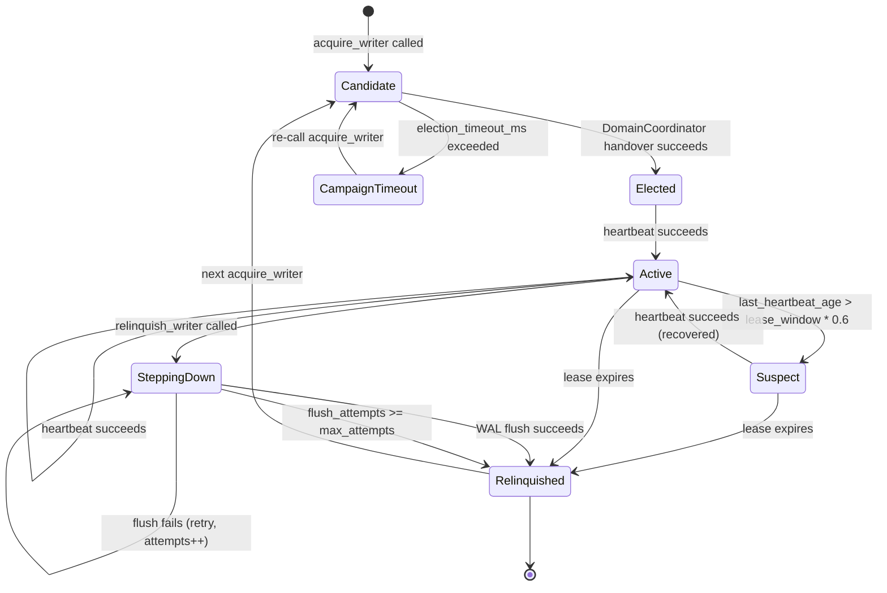

# RFC-0862 v1.4.0 — Writer Election + Bootstrap Integration (concrete impl amendment)

**Status:** Accepted (2026-08-11) — v1.4.0 amendment adds concrete impl surface

> **Promotion note (2026-08-11):** Promoted from `rfcs/draft/networking/0862-writer-election-bootstrap-v120.md` → `rfcs/accepted/networking/0862-writer-election-bootstrap-v130.md` (filename renamed per AC#13). Multi-round adversarial review completed; convergence reached at R19 (zero NEW findings, confirmed at R20). Round-by-round fix history lives in this file's git log.

> **v1.4.0 amendment (2026-08-11):** In-place additive amendment.
> Promotes §Future Work F12 (HLC + LWW per-instance counter) +
> F13 (CRDT-style reconciliation) to §Specification. Adds concrete
> `WriterElection` impl (`RaftLikeWriterElection`) + concrete
> `DidWriteCoordinator` impl (`RaftLikeDidWriteCoordinator`).
> Lands `octo-sync` as a workspace member (current = leaf-excluded
> per root `Cargo.toml` `exclude = ["octo-sync", ...]`). Adds 4
> cross-instance TV (atomic register, leader failover, WAL replay,
> fail-closed).

> **Filename note (RESOLVED per R19 acceptance):** file on disk is now `0862-writer-election-bootstrap-v130.md`. AC#13 satisfied.
> **Author:** @cipherocto + @mmacedoeu
> **Maintainers:** @cipherocto (primary), @mmacedoeu (review)
> **Substrate:** RFC-0862 v1.2.0 + RFC-0855p-c (handover) + RFC-0863 (bootstrap)
> **Parent:** Mission `0871e-phase5c-1-cross-instance-drain` + Mission `0871e-f7-cross-instance-did-coordination`

> **Promotion note:** In-place additive amendment to RFC-0862 (fourth
> update). Promotes §Future Work F8 + F11 to §Specification. Adds
> `WriterElection` protocol + CRDT-extension hooks (F12 + F13).

> **Breaking changes acknowledged (per R4-R11):** See §Breaking
> Changes + §Acceptance Criteria for the migration contract.

## Summary

Extend RFC-0862 §Roles (writer/reader split) with:

1. **`WriterElection` protocol.**
2. **`BootstrapOrchestrator`-driven peer discovery.**
3. **CRDT-extension hooks** (F12 + F13).

## Review State

- **R1-R16 completed (2026-08-10).**
- **Termination condition:** convergence when a new round returns
  zero NEW findings.

## Breaking Changes

1. **`DidDocument` uses RFC-0010 substrate + v1.5 amendment (rich 7-field shape + `VerificationMethod` enum)**.
2. **Three-way `MissionId` type collision** → renamed
   `ShardMissionId`.
3. **`NodeId` struct vs alias collision** → renamed
   `WriterNodeId`.
4. **`octo-protocol` does NOT depend on `octo-ident`** (canonical-
   hash bytes only).
5. **`BootstrapOrchestrator` naming conflict** → renamed concrete
   to `BootstrapOrchestratorImpl`. Gated on **RFC-0863
   amendment** (PENDING).
6. **Path correction (per R13 L10):** all leaf-workspace paths
   in §Roles + §Specification corrected to use prefix
   (`octo-sync/src/...`, `crates/octo-ident/src/...`,
   `crates/quota-router-storage/src/...`). Prior v1.2 listed
   unqualified paths which resolved against repo root in some
   tools. AC#15 covers rollout ordering.
7. **WAL header field-size breakdown corrected.**
8. **`GovernanceAttestation` + `OperatorSignature` defined.**
9. **Phantom mission pointer resolved.**
10. **`force_relinquish_writer` via sealed trait pattern.**
11. **`EncodedDidDocument` blanket impl REMOVED.** `canonical_hash`
    is FREE FN (per R11 H2 — not trait method).
12. **Mission file drift resolved.**
13. **`WriterLifecycle` 7 states defined explicitly.**
14. **`WriterContext` struct defined.**
15. **Filename rename required.**
16. **Per R11 H3:** v1.3 WAL not readable by v1.2.0 nodes; v1.2 nodes
    MUST patch to v1.2.1+ before v1.3 rollout.

## Design Goals

| Goal | Target                | Metric                                                                               |
| ---- | --------------------- | ------------------------------------------------------------------------------------ |
| G1   | Election latency      | ≤ 3s p99                                                                             |
| G2   | Heartbeat interval    | 500ms                                                                                |
| G3   | Drain throughput      | ≥ 1000 txn/s per shard                                                               |
| G4   | Failover pause        | ≤ 3s                                                                                 |
| G5   | Backward compat       | `DatabaseSyncAdapter` consumers unchanged                                            |
| G6   | Forward compat        | WAL dual-version cluster window (per R11 L4 + R12 H6; v1.3 entry format is BREAKING) |
| G7   | Substrate extension   | Option C migration = impl swap                                                       |
| G8   | Path correctness      | All leaf-workspace paths use prefix                                                  |
| G9   | Type identity         | All new types consolidated                                                           |
| G10  | Cross-RFC consistency | All amendments FILED before v1.3 STABLE                                              |
| G11  | **Rollout ordering**  | v1.2 nodes → v1.2.1 (HeaderSize-aware) → v1.3                                        |

## Performance Targets

| Metric                              | Target                                     | Acceptance Test                              |
| ----------------------------------- | ------------------------------------------ | -------------------------------------------- |
| Election latency p99                | ≤ 3s                                       | TV-`election_acquire_returns_within_3s`      |
| Heartbeat interval                  | 500ms ± 50ms                               | TV-`heartbeat_interval_500ms`                |
| Drain throughput                    | ≥ 1000 txn/s per shard                     | TV-`drain_throughput_1k_per_sec`             |
| Failover pause                      | ≤ 3s p99                                   | TV-`failover_pause_under_3s`                 |
| WAL fan-out lag                     | ≤ 100ms p99                                | TV-`wal_fanout_lag_under_100ms`              |
| Bootstrap peer acquisition          | ≤ 5s p99                                   | TV-`bootstrap_acquisition_under_5s`          |
| HLC monotonicity (physical advance) | No reordering                              | TV-`hlc_monotonicity_10k_sequential`         |
| HLC logical increment               | Logical advances per same-physical-ms call | TV-`hlc_logical_increment_constant_physical` |

## Motivation

Two missions BLOCKED: `0871e-phase5c-1-cross-instance-drain` +
`0871e-f7-cross-instance-did-coordination`.

## Dependencies

**Requires:**

- RFC-0855p-c §Platform-Mediated Handover
- **RFC-0010 + v1.5 amendments** (both FILED 2026-08-11; v1.4 = typed `ChainId`, v1.5 = rich `DidDocument` + `VerificationMethod`)
- **RFC-0863 amendment** (PENDING)
- **RFC-0862 v1.2.1 patch** (per R11 H5 — v1.2 nodes MUST patch
  to v1.2.1+ before v1.3 rollout)
- RFC-0851p-a §Bootstrap Envelope Types
- RFC-0853 §Sovereign Identity Model
- RFC-0862 §WAL Format

**Optional:** F1-F7, F9-F10 (unchanged)

### Crate dependencies (per R12 H9)

`octo-sync` is a leaf workspace excluded from root; its
`Cargo.toml` MUST pin:

```toml
[dependencies]
# WAL substrate + substrate types: borsh canonical encoding
# (Layer A; pins match octo-protocol/octo-ident for wire compat).
borsh = "=1.5.0"

# NonceTracker per-shard locking (R12 L1); required for
# concurrent consume() across multiple shards.
dashmap = "=6.1.0"

# blake3 used by canonical_hash, governance_signature_message,
# WAL checksum, replay_wal.
blake3 = "=1.5.4"

# async_trait for dyn-compatibility of BootstrapOrchestrator,
# WriterElection, WriterElectionForceRelinquish, DrainCoordinator,
# DidWriteCoordinator, WalWriter, WalReader.
async-trait = "=0.1.83"

# Ed25519 for verify_governance_attestation + ed25519_verify fn.
ed25519-dalek = { version = "=2.1.1", features = ["std"] }

# thiserror for error enums.
thiserror = "=1.0.63"
```

Per CLAUDE.md §Crate dependency rationale: each dep carries its
layer + which RFC mandates it. `borsh` (A) — canonical wire form;
`dashmap` (B-substrate) — NonceTracker per-shard locking;
`async-trait` (B-substrate) — dyn-compat for trait objects;
`blake3` (A) — hash substrate (canonical_hash, governance,
checksum); `ed25519-dalek` (A) — operator attestation verify;
`thiserror` (B-substrate) — error enum derives.

## Roles and Authorities

| Role                   | Identifier                                                                                         | Authority Scope                            | Lifecycle                      | Source                             |
| ---------------------- | -------------------------------------------------------------------------------------------------- | ------------------------------------------ | ------------------------------ | ---------------------------------- |
| Writer Node            | `WriterIdentity { writer_node_id, mission_id, term, elected_at_hlc, shard_key }` + `WriterContext` | Exclusive write for `ShardKey` during term | `WriterLifecycle` (7 states)   | This RFC §WriterElection           |
| Reader Node            | (no identity; cached lease)                                                                        | Read-only; forwards writes                 | Stateful                       | RFC-0862 v1.2.0 §Roles             |
| Domain Coordinator     | `DomainCoordinator`                                                                                | Handover ceremony                          | `CoordinatorLifecycle`         | RFC-0855p-c + RFC-0855p-b          |
| Bootstrap Orchestrator | `BootstrapOrchestrator` TRAIT; `BootstrapOrchestratorImpl` CONCRETE                                | Peer discovery via RFC-0851p-a Mode A      | Per node startup               | RFC-0863 (impl) + this RFC (trait) |
| Drain Coordinator      | `DrainCoordinator` trait impl                                                                      | Cross-instance spend drain routing         | Wired via `StoolapSpendLedger` | This RFC §DrainCoordinator         |
| DID Write Coordinator  | `DidWriteCoordinator` trait impl                                                                   | Cross-instance DID write routing           | Wired via `StoolapDidRegistry` | This RFC §DidWriteCoordinator      |

### WriterLifecycle (7 states)

```rust
pub enum WriterLifecycle {
    Candidate,
    Elected,
    Active,
    Suspect,
    CampaignTimeout,
    SteppingDown,
    Relinquished,
}
```

**Suspect threshold (per R12 M21):** integer arithmetic
`last_heartbeat_age * 5 > lease_window_ms * 3` (no float
multiplication in state-machine guard; RFC-0104 DFP hostile).

**Config field (per R12 M21):** `lease_window_ms: u64`
(default 3_000; total lease window in milliseconds).

### WriterContext

```rust
pub struct WriterContext {
    pub relinquish_pending: AtomicBool,
    pub flush_attempts: AtomicU32,  // per R11 M2 — incremented per failed flush attempt
    pub max_attempts: u32,
    pub replay_state: ReplayState,
}

pub enum ReplayState {
    Idle,
    InProgress { start_lsn: u64, last_applied_lsn: u64, attempted_entries: u32 },
    /// Per R11 L3: `attempted_entries` for incident response.
    Failed { start_lsn: u64, last_applied_lsn: u64, attempted_entries: u32, reason: &'static str },
    Complete { tip_lsn: u64, total_entries: u32 },
}
```

### WriterLifecycle → CoordinatorLifecycle mapping

| WriterLifecycle | CoordinatorLifecycle substates |
| --------------- | ------------------------------ |
| Candidate       | (pre-Designated)               |
| Elected         | Elected                        |
| Active          | Active                         |
| Suspect         | Suspect                        |
| CampaignTimeout | Designated                     |
| SteppingDown    | Handover                       |
| Relinquished    | Resigned                       |

## Lifecycle Requirements

### Writer Node state machine



**Transition table:**

| From             | To               | Trigger                                  | Guard                                           | Deterministic? |
| ---------------- | ---------------- | ---------------------------------------- | ----------------------------------------------- | -------------- |
| (start)          | Candidate        | `acquire_writer` call                    | —                                               | No             |
| Candidate        | Elected          | handover success                         | —                                               | Yes            |
| Candidate        | CampaignTimeout  | timeout exceeded                         | —                                               | Yes            |
| CampaignTimeout  | Candidate        | re-call `acquire_writer`                 | no CampaignTimeout block active                 | Yes            |
| Elected          | Active           | First `heartbeat` success                | —                                               | Yes            |
| Active           | Active           | Subsequent `heartbeat` success           | —                                               | Yes            |
| Active           | Suspect          | heartbeat close to expiry                | `last_heartbeat_age * 5 > lease_window_ms * 3`  | Yes            |
| Suspect          | Active           | heartbeat succeeds                       | —                                               | Yes            |
| Suspect          | SteppingDown     | `relinquish_writer`                      | `!context.relinquish_pending`                   | Yes            |
| Suspect          | Relinquished     | lease expires                            | —                                               | Yes            |
| **Elected**      | **Relinquished** | **lease expires before first heartbeat** | **`!context.relinquish_pending`**               | **Yes**        |
| Active           | SteppingDown     | `relinquish_writer`                      | `!context.relinquish_pending`                   | Yes            |
| Active           | Relinquished     | Lease expiry                             | `!context.relinquish_pending`                   | Yes            |
| SteppingDown     | Relinquished     | WAL flush success                        | —                                               | Yes            |
| SteppingDown     | SteppingDown     | WAL flush retry                          | `context.flush_attempts < context.max_attempts` | Yes            |
| **SteppingDown** | **Relinquished** | **flush_attempts ≥ max_attempts**        | **forced abandon**                              | **Yes**        |
| Relinquished     | Candidate        | next `acquire_writer` call               | —                                               | Yes            |
| Relinquished     | (terminal)       | Node shutdown                            | —                                               | No             |

**flush_attempts increment policy (per R11 M2):**
`context.flush_attempts += 1` on every WAL flush attempt that
returns Err.

## Specification

### Substrate types (in `octo-sync/src/types.rs`)

```rust
use borsh::{BorshDeserialize, BorshSerialize};

#[derive(Clone, Copy, PartialEq, Eq, PartialOrd, Ord, Hash,
         BorshSerialize, BorshDeserialize)]
pub struct HlcTimestamp {
    pub physical_ms: u64,
    pub logical: u32,
    pub writer_node_id: WriterNodeId,
}

pub struct HlcClock {
    last_physical_ms: AtomicU64,  // per R11 M8 — thread-safe
    last_logical: AtomicU32,      // per R11 M8 — thread-safe
    writer_node_id: WriterNodeId,
    clock: Box<dyn Fn() -> u64 + Send + Sync>,
}

impl HlcClock {
    pub fn new(writer_node_id: WriterNodeId) -> Self { /* ... */ }

    /// Per R11 M4: refuse-new on overflow (Class A determinism).
    /// Per R12 H13: takes `&self` — atomics make `&mut self` redundant
    /// and would defeat the lock-free design.
    /// Per R13 M6: pseudocode simplified; real impl uses
    /// `compare_exchange_weak` CAS loop on `last_physical_ms` +
    /// `last_logical`. The presented load-store sequence would let
    /// a lower-priority thread regress `last_logical` between the
    /// load and the store.
    pub fn now(&self) -> Result<HlcTimestamp, HlcError> {
        let observed = (self.clock)();
        let physical_ms = observed.max(self.last_physical_ms.load(Acquire));
        let logical = if physical_ms == self.last_physical_ms.load(Acquire) {
            let next = self.last_logical.load(Acquire) + 1;
            if next == u32::MAX {
                return Err(HlcError::LogicalOverflow);
            }
            next
        } else {
            0
        };
        // Per R13 M6: CAS loop (simplified pseudocode; real impl
        // uses `compare_exchange_weak` on both fields).
        self.last_physical_ms.store(physical_ms, Release);
        self.last_logical.store(logical, Release);
        Ok(HlcTimestamp { physical_ms, logical, writer_node_id: self.writer_node_id })
    }

    /// Per R12 H13: takes `&self`.
    /// Per R12 H14: overflow guards on BOTH remote-derived branches;
    /// skew cap `max_skew_ms` rejects poisoned `remote.physical_ms`.
    /// Per R13 H1: skew cap = 1_000ms (10x alarm threshold from
    /// §Implicit Assumptions Audit "NTP + alarm >100ms"). 60_000ms
    /// was 600x too loose; broken NTP corrupted HLC silently for
    /// ~60s before error fired.
    /// Per R13 M6: pseudocode simplified; real impl uses CAS loop.
    pub fn observe(&self, remote: HlcTimestamp) -> Result<HlcTimestamp, HlcError> {
        // Per R13 H1: skew cap aligned with baseline.
        let max_skew_ms: u64 = 1_000; // 10x alarm threshold; configurable
        let observed = (self.clock)();
        if remote.physical_ms.abs_diff(observed) > max_skew_ms {
            return Err(HlcError::RemoteSkewExceedsCap { observed, remote: remote.physical_ms, cap_ms: max_skew_ms });
        }
        let physical_ms = observed
            .max(self.last_physical_ms.load(Acquire))
            .max(remote.physical_ms);
        let logical = if physical_ms == self.last_physical_ms.load(Acquire)
            && physical_ms == remote.physical_ms {
            let next = self.last_logical.load(Acquire).max(remote.logical) + 1;
            if next == u32::MAX {
                return Err(HlcError::LogicalOverflow);
            }
            next
        } else if physical_ms == self.last_physical_ms.load(Acquire) {
            let next = self.last_logical.load(Acquire) + 1;
            // Per R12 H14: overflow guard on local+1 branch.
            if next == u32::MAX {
                return Err(HlcError::LogicalOverflow);
            }
            next
        } else if physical_ms == remote.physical_ms {
            let next = remote.logical + 1;
            // Per R12 H14: overflow guard on remote+1 branch
            // (attacker-supplied remote.logical == u32::MAX would
            // otherwise silently wrap and poison future timestamps).
            if next == u32::MAX {
                return Err(HlcError::LogicalOverflow);
            }
            next
        } else {
            0
        };
        // Per R13 M6: CAS loop (simplified pseudocode; real impl
        // uses `compare_exchange_weak` on both fields).
        self.last_physical_ms.store(physical_ms, Release);
        self.last_logical.store(logical, Release);
        Ok(HlcTimestamp { physical_ms, logical, writer_node_id: self.writer_node_id })
    }
}

#[derive(Clone, Copy, PartialEq, Eq, Hash, PartialOrd, Ord,
         BorshSerialize, BorshDeserialize)]
pub struct WriterNodeId(pub [u8; 32]);

#[derive(Clone, PartialEq, Eq, Hash,
         BorshSerialize, BorshDeserialize)]
pub struct ShardMissionId(pub [u8; 32]);

// Per R12 H7: 32-byte width matches existing `octo-sync`
// `pub type MissionId = [u8; 32]`. No truncation/derivation needed;
// `WriterIdentity.mission_id` constructed directly from existing
// `MissionId` via `ShardMissionId(mission_id.0)`.

#[derive(Clone, PartialEq, Eq, Hash,
         BorshSerialize, BorshDeserialize)]
pub struct ShardKey(pub [u8; 32]);

#[derive(Clone, PartialEq, Eq, Hash,
         BorshSerialize, BorshDeserialize)]
pub struct ChainId(pub [u8; 16]);

impl ShardKey {
    pub fn derive_canonical(record_key_canonical: &[u8]) -> Self {
        Self(*blake3::hash(record_key_canonical).as_bytes())
    }
}

/// Per R10 H9: OperatorSet sorted canonical serialization.
#[derive(Clone, BorshSerialize, BorshDeserialize)]
pub struct OperatorSet {
    pub operators: Vec<OperatorId>,
    pub threshold: usize,
}

impl OperatorSet {
    /// Per R11 M3: config-time validation.
    pub fn new(mut operators: Vec<OperatorId>, threshold: usize) -> Result<Self, ConfigError> {
        operators.sort_by_key(|o| o.0);
        operators.dedup();
        if threshold == 0 || threshold > operators.len() {
            return Err(ConfigError::InvalidThreshold {
                threshold, max: operators.len(),
            });
        }
        Ok(Self { operators, threshold })
    }

    pub fn canonical_bytes(&self) -> Vec<u8> {
        borsh::to_vec(self).expect("OperatorSet serialization is infallible")
    }
}

pub struct WriterContext {
    pub relinquish_pending: AtomicBool,
    pub flush_attempts: AtomicU32,
    pub max_attempts: u32,
    pub replay_state: ReplayState,
}

pub enum ReplayState {
    Idle,
    InProgress { start_lsn: u64, last_applied_lsn: u64, attempted_entries: u32 },
    Failed { start_lsn: u64, last_applied_lsn: u64, attempted_entries: u32, reason: &'static str },
    Complete { tip_lsn: u64, total_entries: u32 },
}
```

**WAL format constants (per R12 C2):**

```
/// v1.2 WAL magic (ASCII "WALE").
pub const WAL_MAGIC_V12: u32 = 0x454C_4157;

/// v1.3 WAL magic (ASCII "WAL3"; distinguishes v1.2 vs v1.3 entries).
pub const WAL_MAGIC_V13: u32 = 0x5741_4C33;

/// Entry type codes (allocated per R12 M20).
pub const ENTRY_TYPE_NONCE_RECORD: u8 = 0x10;
pub const ENTRY_TYPE_DRAIN: u8 = 0x20;
pub const ENTRY_TYPE_DID_REGISTER: u8 = 0x21;
pub const ENTRY_TYPE_DID_REVOKE: u8 = 0x22;
```

**V2 WAL `header_size` extension:**

```
V2 WAL header layout (32 bytes):
  Magic(4) + Version(1) + Flags(1) + HeaderSize(2)
  + LSN(8) + PreviousLSN(8) + EntrySize(4) + Reserved(4) = 32 bytes

v1.3 extension adds HlcTimestamp field AFTER existing fields:
  HlcTimestamp borsh = 8 + 4 + 32 = 44 bytes

v1.3 header_size = 32 + 44 = 76 bytes

v1.3 entry layout (per R11 M6 + R12 H5):
  Magic(WAL_MAGIC_V13, 4) + EntryType(1) + EntryVersion(1) + Reserved(2) +
  ShardKey(32) + LSN(8) + PreviousLSN(8) + PayloadLength(4) +
  Payload(PayloadLength bytes) + Blake3Hash(32)
  = 92 + PayloadLength bytes
  Checksum (per R12 H16): blake3 over the 60-byte entry prefix
  (Magic..PayloadLength) + Payload (NOT payload alone). Tampering
  with LSN / EntryType / ShardKey invalidates checksum.

v1.2 entry layout (for migration reference):
  Magic(WAL_MAGIC_V12, 4) + EntryType(1) + Reserved(3) +
  LSN(8) + PreviousLSN(8) + PayloadLength(4) +
  Payload(PayloadLength bytes) + CRC32Trailer(4)
  = 36 + PayloadLength bytes (NOT 32; CRC32Trailer adds 4)
  Checksum: CRC32 over payload only (per R12 H5 — what v1.2 code
  actually computes; entry prefix fields NOT covered).

Per R11 H3 + R12 C1: v1.3 entry is NOT parseable by v1.2 reader
(different Magic + ShardKey field + blake3 vs CRC32 checksum).

Per R11 H4: v1.3 entry has ONLY blake3 checksum (CRC32 removed).

v1.2 reader on v1.3 WAL: per R12 C1 the current v1.2.0
`validate_wal_entry_crc32` returns `true` (fails-open) on unknown
Magic → silently accepts v1.3 entries UNVALIDATED, no panic, no
reject. v1.2.1 patch flips behavior to reject unknown Magic with
`WalVersionTooNew`. Do NOT attempt entry parse on v1.2.1+ readers.

Per R11 H5 + R12 C1 rollout ordering:
  Phase 1: Patch all v1.2 nodes to v1.2.1 (accept→reject BEHAVIOR
          FLIP on unknown Magic; not "HeaderSize awareness" only).
          Without v1.2.1 patch, v1.2.0 silently accepts v1.3 entries
          unvalidated (corruption path, not panic).
  Phase 2: Deploy v1.3 nodes (write-only)
  Phase 3: Promote v1.3 nodes (mixed cluster accepts v1.2 + v1.3 WALs)
  Phase 4: Decommission v1.2 nodes
```

**`DidDocument` (per RFC-0010 substrate + v1.5 amendment: v1.3
storage extension INTRODUCED the 2-field struct (`public_key`,
`revoked`) + `DidRegistry` trait + `InMemoryDidRegistry` impl;
v1.5 EXTENDED to the rich 7-field shape + `VerificationMethod`
enum consumed by this RFC §Specification §Substrate types.
Pre-v1.3 `octo-ident` had only `lib.rs` + `test_helpers.rs`):**

```rust
// Per R10 H11: feature-gated borsh derives (consistent with other types).
#[cfg_attr(feature = "borsh", derive(BorshSerialize, BorshDeserialize))]
#[derive(Clone)]
pub struct DidDocument {
    pub public_key: [u8; 32],
    pub revoked: bool,
    pub chain_depth: u8,
    pub chain_parent: Option<[u8; 32]>,
    pub verification_method: Vec<VerificationMethod>,
    pub authentication: Vec<String>,
    pub assertion_method: Vec<String>,
}
```

**`canonical_hash` as FREE FN (per R11 H2 — not trait method):**

```rust
// Per R11 H2: free function — no trait method to override.
// Lives in `octo-sync/src/did.rs` (where EncodedDidDocument lives).
pub fn canonical_hash(doc: &DidDocument) -> [u8; 32] {
    let encoded = borsh::to_vec(doc).expect("DidDocument serialization is infallible");
    *blake3::hash(&encoded).as_bytes()
}

pub trait EncodedDidDocument: Send + Sync {
    fn encode(&self) -> Vec<u8>;
}

impl EncodedDidDocument for DidDocument {
    fn encode(&self) -> Vec<u8> {
        borsh::to_vec(self).expect("DidDocument serialization is infallible")
    }
}
```

### BootstrapOrchestrator trait (in `octo-sync/src/bootstrap.rs`)

```rust
// Per R12 M18: `#[async_trait]` for dyn-compatibility
// (`Arc<dyn BootstrapOrchestrator>` requires object-safe trait).
#[async_trait::async_trait]
pub trait BootstrapOrchestrator: Send + Sync {
    async fn acquire_peers(&self) -> Result<Vec<PeerIdentity>, BootstrapError>;
}
```

### WriterElection Protocol (sealed trait)

```rust
#[derive(Clone, PartialEq, Eq, Hash,
         BorshSerialize, BorshDeserialize)]
pub struct WriterIdentity {
    pub writer_node_id: WriterNodeId,
    pub mission_id: ShardMissionId,
    pub term: u64,
    pub elected_at_hlc: HlcTimestamp,
    pub shard_key: ShardKey,
}

// Per R12 M18: `#[async_trait]` for dyn-compatibility.
#[async_trait::async_trait]
pub trait WriterElection: Send + Sync {
    async fn acquire_writer(
        &self,
        shard_key: &ShardKey,
        election_timeout_ms: u64,
    ) -> Result<WriterIdentity, WriterElectionError>;

    async fn relinquish_writer(
        &self,
        shard_key: &ShardKey,
    ) -> Result<(), WriterElectionError>;

    async fn heartbeat(&self, shard_key: &ShardKey)
        -> Result<(), WriterElectionError>;

    fn current_writer(&self, shard_key: &ShardKey)
        -> Result<Option<WriterIdentity>, WriterElectionError>;
}

// Per R12 M18: `#[async_trait]` for dyn-compatibility.
#[async_trait::async_trait]
pub trait WriterElectionForceRelinquish: WriterElection + sealed::WriterElectionForceRelinquishSealed {
    async fn force_relinquish_writer(
        &self,
        shard_key: &ShardKey,
        attestation: &GovernanceAttestation,
        configured_operator_set: &OperatorSet,
        nonce_tracker: &NonceTracker,
    ) -> Result<(), WriterElectionError>;
}

mod sealed {
    pub trait WriterElectionForceRelinquishSealed {}
}

/// Per R11 H1: NonceTracker ACTUALLY writes to WAL on consume +
/// replay on init.
/// Per R13 M3: in-memory map carries `(term, nonce)` tuples so
/// `gc_expired_nonces` can prune by term boundary.
pub struct NonceTracker {
    used_nonces: DashMap<ShardKey, HashSet<(u64, [u8; 32])>>,  // per R11 L1 — DashMap for per-shard locking; per R13 M3 — keyed by (term, nonce)
    wal: Arc<dyn WalAppender>,
}

impl NonceTracker {
    pub fn new(wal: Arc<dyn WalAppender>) -> Self {
        let used_nonces = Self::replay_from_wal(&wal);
        Self { used_nonces, wal }
    }

    fn replay_from_wal(wal: &dyn WalAppender) -> DashMap<ShardKey, HashSet<(u64, [u8; 32])>> {
        let mut map = DashMap::new();
        for nonce_record in wal.scan_nonce_records() {
            map.entry(nonce_record.shard_key)
                .or_insert_with(HashSet::new)
                .insert((nonce_record.term, nonce_record.nonce));
        }
        map
    }

    /// Per R11 H1: durably writes to WAL.
    /// Per R12 H15: check-then-append (not append-then-check) so
    /// replayed nonces do NOT grow the WAL unboundedly.
    /// Per R12 L1: per-shard locking via DashMap.
    /// Per R12 H13: takes `&self`.
    /// Per R13 M4: on WAL append failure, ROLL BACK in-memory insert
    /// (else stale nonce blocks legitimate reuse after process
    /// restart when WAL replay does not see it).
    pub fn consume(&self, shard_key: &ShardKey, term: u64, nonce: &[u8; 32])
        -> Result<(), WriterElectionError>
    {
        let key = (*term, *nonce);
        let mut set = self.used_nonces.entry(shard_key.clone()).or_insert_with(HashSet::new);
        if !set.insert(key) {
            return Err(WriterElectionError::NonceReplayed);
        }
        if let Err(e) = self.wal.append_nonce_record(&NonceRecord {
            shard_key: shard_key.clone(),
            term,
            nonce: *nonce,
        }) {
            // Per R13 M4: roll back in-memory insert on WAL failure.
            set.remove(&key);
            return Err(e);
        }
        Ok(())
    }

    /// Per R12 H15 + R13 M3: term-scoped GC. Drop nonces older than
    /// `current_term - MAX_NONCE_RETENTION_TERMS`. Compaction runs
    /// on each new term boundary.
    pub fn gc_expired_nonces(&self, current_term: u64) {
        const MAX_NONCE_RETENTION_TERMS: u64 = 1_000;
        for mut entry in self.used_nonces.iter_mut() {
            entry.value_mut().retain(|(term, _)| {
                *term + MAX_NONCE_RETENTION_TERMS >= current_term
            });
        }
    }
}

pub fn governance_signature_message(
    shard_key: &ShardKey,
    chain_id: &ChainId,
    term: u64,
    nonce: &[u8; 32],
) -> [u8; 32] {
    // Per R12 M23: bind to chain_id (deployment-binding) so an
    // attestation cannot replay across deployments sharing an
    // operator set.
    *blake3::hash(
        b"cipherocto/governance/v1"
            .iter()
            .chain(shard_key.0.iter())
            .chain(chain_id.0.iter())
            .chain(term.to_be_bytes().iter())
            .chain(nonce.iter())
            .copied()
            .collect::<Vec<u8>>()
    ).as_bytes()
}

/// Per R12 M23: bound ed25519 verify cost.
pub const MAX_GOVERNANCE_SIGNATURES: usize = 32;

pub fn verify_governance_attestation(
    shard_key: &ShardKey,
    chain_id: &ChainId,
    attestation: &GovernanceAttestation,
    configured_operator_set: &OperatorSet,
    nonce_tracker: &NonceTracker,
) -> Result<(), WriterElectionError> {
    if &attestation.shard_key != shard_key {
        return Err(WriterElectionError::ShardKeyMismatch);
    }
    if &attestation.chain_id != chain_id {
        return Err(WriterElectionError::ChainIdMismatch);
    }
    if attestation.threshold != configured_operator_set.threshold {
        return Err(WriterElectionError::ThresholdMismatch);
    }
    // Per R12 M23: cap signature count.
    if attestation.signatures.len() > MAX_GOVERNANCE_SIGNATURES {
        return Err(WriterElectionError::TooManySignatures { count: attestation.signatures.len(), max: MAX_GOVERNANCE_SIGNATURES });
    }
    let message = governance_signature_message(
        &attestation.shard_key, chain_id, attestation.term, &attestation.nonce,
    );
    let configured_set: HashSet<_> = configured_operator_set.operators.iter().collect();
    let mut unique_signers = HashSet::new();
    let mut valid_count = 0;
    for sig in &attestation.signatures {
        if !unique_signers.insert(sig.operator_id) { return Err(WriterElectionError::DuplicateSigner); }
        if !configured_set.contains(&sig.operator_id) { return Err(WriterElectionError::UnauthorizedSigner); }
        if !ed25519_verify(&sig.operator_id.pubkey(), &message, &sig.signature) { return Err(WriterElectionError::InvalidSignature); }
        valid_count += 1;
    }
    if valid_count < attestation.threshold { return Err(WriterElectionError::InsufficientSignatures); }
    nonce_tracker.consume(&attestation.shard_key, &attestation.nonce)?;
    Ok(())
}

#[derive(Clone, BorshSerialize, BorshDeserialize)]
pub struct GovernanceAttestation {
    pub shard_key: ShardKey,
    /// Per R12 M23: deployment binding (prevents replay across
    /// deployments sharing an operator set).
    pub chain_id: ChainId,
    pub term: u64,
    /// Per R11 M5: `operators` field is advisory only (signatures
    /// carry operator_id). Retained for forward-compat with future
    /// operator-set updates.
    pub operators: Vec<OperatorId>,
    pub signatures: Vec<OperatorSignature>,
    pub threshold: usize,
    pub nonce: [u8; 32],
}

#[derive(Clone, PartialEq, Eq, Hash, BorshSerialize, BorshDeserialize)]
pub struct OperatorId(pub [u8; 32]);

impl OperatorId {
    pub fn pubkey(&self) -> [u8; 32] { self.0 }
}

#[derive(Clone, BorshSerialize, BorshDeserialize)]
pub struct OperatorSignature {
    pub operator_id: OperatorId,
    pub signature: [u8; 64],
}

pub trait ShardKeyDerivation: Send + Sync {
    fn derive(&self, record_key: &[u8]) -> ShardKey;
}
```

### WAL Replay Algorithm

```rust
/// Per R10 H3: fail-closed on corruption.
/// Per R10 H4: track `tip_lsn`; reject gaps + non-monotonic LSNs.
/// Per R10 H5: takes `&mut WriterContext`.
/// Per R10 H6: apply failure → ReplayState::Failed.
/// Per R11 H14: verify entry.shard_key.
/// Per R12 H16: blake3 over full 60-byte entry prefix + payload
/// (tampering with LSN / EntryType / ShardKey invalidates checksum).
pub async fn replay_wal(
    context: &mut WriterContext,
    start_lsn: u64,
    shard_key: &ShardKey,
    wal: &dyn WalReader,
) -> Result<u64, WriterElectionError> {
    let mut last_applied_lsn = start_lsn;
    let mut attempted_entries: u32 = 0;
    context.replay_state = ReplayState::InProgress {
        start_lsn, last_applied_lsn, attempted_entries,
    };
    let entries = wal.read_range(start_lsn, None).await?;
    let mut prev_lsn = start_lsn;
    for entry in entries {
        attempted_entries += 1;
        if entry.lsn != prev_lsn + 1 {
            context.replay_state = ReplayState::Failed {
                start_lsn, last_applied_lsn, attempted_entries,
                reason: "WAL LSN gap or non-monotonic",
            };
            return Err(WriterElectionError::WalCorruption);
        }
        // Per R12 H16: checksum covers full entry prefix + payload.
        let mut checksum_input = Vec::with_capacity(60 + entry.payload.len());
        checksum_input.extend_from_slice(&entry.prefix_bytes); // 60 bytes: Magic..PayloadLength
        checksum_input.extend_from_slice(&entry.payload);
        if entry.checksum != *blake3::hash(&checksum_input).as_bytes() {
            context.replay_state = ReplayState::Failed {
                start_lsn, last_applied_lsn, attempted_entries,
                reason: "WAL checksum mismatch",
            };
            return Err(WriterElectionError::WalCorruption);
        }
        if entry.shard_key != *shard_key {
            context.replay_state = ReplayState::Failed {
                start_lsn, last_applied_lsn, attempted_entries,
                reason: "WAL entry shard_key mismatch",
            };
            return Err(WriterElectionError::WalCorruption);
        }
        if let Err(e) = apply_entry(&entry, shard_key) {
            context.replay_state = ReplayState::Failed {
                start_lsn, last_applied_lsn, attempted_entries,
                reason: "apply failed",
            };
            return Err(e);
        }
        last_applied_lsn = entry.lsn;
        prev_lsn = entry.lsn;
        context.replay_state = ReplayState::InProgress {
            start_lsn, last_applied_lsn, attempted_entries,
        };
    }
    let tip_lsn = last_applied_lsn;
    context.replay_state = ReplayState::Complete {
        tip_lsn, total_entries: attempted_entries,
    };
    Ok(tip_lsn)
}
```

### BootstrapSyncAdapter

```rust
pub struct BootstrapSyncAdapter {
    inner: Arc<dyn DatabaseSyncAdapter>,
    bootstrap: Arc<dyn BootstrapOrchestrator>,
}
```

### DrainCoordinator trait (in `octo-sync/src/drain_coordinator.rs`)

```rust
pub enum DrainCoordinatorError {
    WriterUnavailable,
    UnknownHolder,
    InsufficientBalance,
}

// Per R12 M18: `#[async_trait]` for dyn-compatibility.
#[async_trait::async_trait]
pub trait DrainCoordinator: Send + Sync {
    async fn submit_drain(
        &self,
        holder_did: &str,
        macaroon_id: &[u8],
        requested_cost: u128,
    ) -> Result<ActualDrained, DrainCoordinatorError>;

    /// `#[deprecated]` + fail-closed default.
    #[deprecated(since="1.3.0", note="LWW substrate pending F12 amendment")]
    async fn submit_drain_local_fallback(
        &self,
        holder_did: &str,
        macaroon_id: &[u8],
        requested_cost: u128,
    ) -> Result<(), DrainCoordinatorError> {
        Err(DrainCoordinatorError::WriterUnavailable)
    }
}
```

### StoolapSpendLedger substrate (v2.0, additive on v1.4.0)

Per §Future Work F12 + F13 (promoted from v1.4.0 deferred list)
+ §Layer Direction table (`StoolapSpendLedger` + `StoolapDidRegistry`),
the production drain substrate is the Stoolap-backed spend ledger.
v2.0 back-fills the substrate spec that v1.4.0 left implicit.

```rust
/// Stoolap-backed production spend ledger.
/// Lives in `crates/quota-router-storage/src/stoolap_spend_ledger.rs`.
#[derive(Clone)]
pub struct StoolapSpendLedger {
    db: Arc<stoolap::Database>,
    /// Per-instance drain lock. Serializes try_deduct calls.
    drain_lock: Arc<std::sync::Mutex<()>>,
}

impl StoolapSpendLedger {
    pub fn open_in_memory() -> Result<Self, SpendLedgerError>;
    pub fn open_path(path: &str) -> Result<Self, SpendLedgerError>;
    pub fn seed(&self, holder_did: &str, macaroon_id: &[u8],
                budget: MicroOctoW) -> Result<(), SpendLedgerError>;
    /// # Preconditions
    /// - `cost.value >= 0`; negative cost rejected with
    ///   `SpendLedgerError::NegativeCost`.
    pub fn try_deduct(&self, holder_did: &str, macaroon_id: &[u8],
                      cost: MicroOctoW) -> Result<MicroOctoW, SpendLedgerError>;
    pub fn balance(&self, holder_did: &str, macaroon_id: &[u8])
        -> Result<Option<MicroOctoW>, SpendLedgerError>;
}
```

**Schema (RFC-0862 v2.0):**

```sql
CREATE TABLE IF NOT EXISTS spend_ledger (
    holder_did BLOB NOT NULL,
    macaroon_id BLOB NOT NULL,
    balance INTEGER NOT NULL,         -- Dqa at scale=0 (MicroOctoW, integer micro-OCTO_W)
    updated_at_unix_ms INTEGER NOT NULL,
    PRIMARY KEY (holder_did, macaroon_id)
);
CREATE INDEX IF NOT EXISTS spend_ledger_updated_at_idx
    ON spend_ledger (updated_at_unix_ms);
```

**Dqa storage form (RFC-0862 v2.0 + RFC-0105 DqaEncoding
cross-ref):** `balance` column stores `i64` (stoolap `INTEGER`
maps to `i64`). The `i64` carries `Dqa::value` at `scale = 0` — no
transformation. The 16-byte BE `DqaEncoding` struct defined in
RFC-0105 (`DqaEncoding::from_dqa` impl in
`determin/src/dqa.rs`) is the canonical serialization form for
on-wire payloads (used by `octo-protocol` envelopes), NOT the
SQLite storage form. The `dqa_to_i64` helper is the doc anchor
for future widening (`Dqa::value` → `i128`); it is a no-op cast
at the type level today.

**Vault row cross-ref (RFC-0862 v2.0):** spend ledger substrate is
wired to vault substrate via the `(holder_did, macaroon_id)` key —
the wallet mints a `Caveat::Vault(vault_id)` binding per RFC-0957
+ RFC-0965 §3.1. `vault_id` derivation (per `octo-vault`
`vault_id_unchecked`):

```
vault_id = BLAKE3("cipherocto/vault/v1/" + chain_id + owner_did + asset_id)
```

`Macaroon::verify_for_vault_op` (RFC-0957) rejects spend drain on
vault rows that are missing, frozen, or chain-mismatched.

**Domain-separator hygiene (RFC-0862 v2.0.5 + mission 0862-c5):** all
spend-ledger-adjacent hash derivations use the `cipherocto/<name>/v1/`
namespace prefix per RFC-0105 DqaEncoding-prefix cross-reference
pattern. The `Reservation::mint` derivation in
`crates/quota-router-sm-engine/src/lib.rs` (RFC-0126) was renamed
from the unnamespaced `b"reservation/v1"` to
`b"cipherocto/reservation/v1/"`; the change is a clean rename
(`reservation_id` is an in-memory content-addressed handle consumed
only by `quota-router-core::settle::build_reservation_id` — no SQL
migration, no wire form, no cross-network lookup keyed on the raw
bytes). The corresponding TV is
`crates/quota-router-core/src/settle.rs::tv_0862_19_reservation_id_byte_exact_pin`
(BLAKE3 of `"cipherocto/reservation/v1/"` + canonical inputs =
`05f058e42899872e697281ef6aacfdc67eecc8e84ad5e4312609e3bb04ba723e`).
Sweep result (per mission 0862-c5 audit):
`crates/quota-router-sm-engine/src/lib.rs:216` (production rename);
`crates/quota-router-core/tests/eleven_step.rs` lines 59, 68, 119
(test-only placeholders annotated + renamed to
`cipherocto/<name>/v1/` for hygiene);
`crates/quota-router-core/tests/goldens.rs` lines 43, 59, 86
(test-only mirror fixture, goldens fixture regenerated with new
prefixes — step2/3/6 hex values bumped; step1/10 unchanged). The
canonical `vault_id` derivation ABOVE was already namespaced per
RFC-0862 v2.0 + S3 landing; the audit confirms no other
production-prefix gap exists at the spend-ledger boundary.

**NodeEnvelope Version Tag cross-ref (RFC-0862 v2.0 + S6a):** spend-drain
responses are wrapped in V2 envelopes (`version_tag = 0xA1` per
`crates/octo-protocol/src/envelope.rs`). V1 envelopes (`version_tag =
0xA0` or absent) are hard-rejected at verify per RFC-0870 §14.1 +
TV-0870-01.

**Atomicity guarantee (RFC-0862 v2.0):** the per-instance `drain_lock`
serializes `try_deduct` calls within a single `StoolapSpendLedger`
instance. The cross-instance coordination substrate (mission
`0871e-phase5c-1` per `RaftLikeDrainCoordinator` LANDED 2026-08-11) is
the production follow-on; v2.0 spec does NOT change the lock surface.

**Negative-cost precondition (RFC-0862 v2.0 + S4 Round 2):**
`try_deduct` rejects `cost.value < 0` with `SpendLedgerError::NegativeCost`.
`Dqa::subtract` on negative cost would otherwise inflate the balance
(defense-in-depth against signed underflow in caller fee-computation
paths and wire-decoded `i64` amounts).

**Scale precondition (RFC-0862 v2.0.4 + mission 0862-c4):** the
substrate's `spend_ledger.balance` column is `INTEGER` (i64) at
`scale = 0`. `try_deduct` AND `seed` reject any `Dqa` carrying
`scale != 0` with
`SpendLedgerError::InvalidScale { expected: 0, actual: <caller-scale> }`
rather than panicking. The check runs in BOTH debug and release
profiles (no `debug_assert!`) so the typed-error path is testable
under `cargo test` (dev profile). Per mission 0862-c4 (S6c Round 1
security review finding #8 — `assert!` is not an error path; an
upstream caller passing a `Dqa` with non-zero scale would otherwise
crash the wallet-node at the `dqa_to_i64` precondition). Pin via
`crates/quota-router-storage/tests/tv_0862_spend_ledger.rs`
TV-0862-12 (seed scale mismatch rejected; no row persisted) +
TV-0862-13 (try_deduct scale mismatch rejected; balance unchanged).
The `dqa_to_i64` helper gains the same `Result<i64, SpendLedgerError>`
return type — it is the sole gatekeeper for the scale constraint at
the storage boundary.

**Adjacent-module u64→i64 wrap mitigation (RFC-0862 v2.0 + mission
0862-c7):** callers in `crates/quota-router-core` that narrow
`cost_amount: u64` to `i64` for the `spend_ledger` column + budget-gate
arithmetic MUST use `SpendEvent::cost_amount_i64()` or the free
function `cost_u64_to_i64(...)` (both in
`crates/quota-router-core/src/keys/models.rs`). These fail closed
with `SpendEventError::CostOverflow { cost: u64, max: i64 }` when
`cost_amount > i64::MAX`, instead of silently wrapping via `as i64`
which would let `current + cost_i64 > budget` pass incorrectly. The
four narrow sites are §budget-gate-deduct-team +
§budget-gate-deduct-key + §deduct-octo-w-execute +
§cache-eviction-budget-gate (per `crates/quota-router-core/src/storage.rs`
+ `crates/quota-router-core/src/cache.rs`). Pin via
`crates/quota-router-core/tests/tv_0862_c7_cost_overflow.rs` (4 TV:
exact-edge overflow + at-max passes + zero passes + `SpendEvent`
method mirrors free fn).

**Seed hardening (RFC-0862 v2.0 + mission 0862-c8):** `seed()` MUST
mirror the `try_deduct` precondition guards (NegativeCost + the
scale precondition per v2.0.4 below) and acquire `drain_lock`
around the balance-read + UPDATE-or-INSERT window. Without the
lock, concurrent `seed()` on the same `(holder_did, macaroon_id)`
races the SELECT-then-INSERT branch and one thread's INSERT
collides with another's PRIMARY KEY (stoolap surfaces as
`SpendLedgerError::Storage`, masking the real fault). Per
`crates/quota-router-storage/src/stoolap_spend_ledger.rs` §seed. Pin
via `crates/quota-router-storage/tests/tv_0862_spend_ledger.rs`
TV-0862-15 (concurrent seed serializes) + TV-0862-16 (negative budget
yields NegativeCost + no row persisted).

**Clock precondition (RFC-0862 v2.0.6 + mission 0862-c2):** the
substrate's `updated_at_unix_ms` column is written from a `Clock`
trait object held as `Arc<dyn Clock>` on `StoolapSpendLedger`. Default
constructor variants (`open_in_memory` / `open_path`) inject
`SystemClock`; `_with_clock` variants accept any caller-supplied
`Arc<dyn Clock>` (production wiring may reuse the wallet-node `Clock`
substrate; tests substitute `FixedClock` to make the column write
byte-pinned). The trait shape reuses `crates/quota-router-storage::clock::Clock::unix_millis() -> u64`
(consumers cast to `i64` at the call site); the substrate does NOT
rely on `SystemTime::now()` directly. Per S6c Round 1 security
review finding #10 — `SystemTime::now()` non-determinism was
masked by fixture shape but surfaces the moment any test asserts a
precise `updated_at_unix_ms` value. Pin via
`crates/quota-router-storage/tests/tv_0862_spend_ledger.rs` TV-0862-10
(injected `FixedClock(1_700_000_000_000)` pins the column write
exactly; raw SQL `SELECT updated_at_unix_ms` round-trip). A
test-only `raw_query(&self, sql, params)` accessor is added to
the substrate for this column assertion — kept `pub` so follow-on
deterministic-time TV can reuse it.

**Cross-process atomicity (RFC-0862 v2.0.8 + mission 0862-c3):**
`StoolapSpendLedger` closes the cross-process double-spend surface
via two complementary layers — EITHER alone leaves a gap:

1. **Advisory file lock** (`fs2::FileExt::try_lock_exclusive` via
   `flock(2)` on Linux/Unix, `LockFileEx` on Windows) on a sibling
   lock file `<dsn-dir>/.spend_ledger.lock` (the DSN path is a
   directory for WAL + snapshots per stoolap fork persistence,
   not a regular file — the substrate opens the sibling lock
   file in `create + read + write` mode). The lock is held for
   the substrate's lifetime (released on File drop). Two
   `StoolapSpendLedger` instances on the SAME dir from DIFFERENT
   processes: the second `open_path` surfaces
   `SpendLedgerError::LockUnavailable` (fail-closed; non-blocking
   `try_lock_exclusive` so a wallet-node startup never deadlocks
   on a contended lock).

2. **Stoolap transaction** (`db.begin() -> Transaction::query ->
   Transaction::execute -> Transaction::commit()`) wrapping the
   `try_deduct` SELECT-then-UPDATE window. Provides atomicity:
   either the UPDATE lands or the SELECT is rolled back. Read-your-own-writes
   isolation across the SELECT + UPDATE pair. Combined with the
   advisory file lock: lock = serialization (mutual exclusion
   across processes), transaction = atomicity (the UPDATE either
   commits or doesn't).

Multi-node consensus drain is a separate concern handled by
`RaftLikeDrainCoordinator` (mission 0871e-phase5c-1 LANDED
2026-08-11) — `StoolapSpendLedger`'s advisory lock is the
**single-node** cross-process layer. Pin via
`crates/quota-router-storage/tests/tv_0862_spend_ledger.rs`
TV-0862-11 (single-instance file-backed concurrent-deduct: 20
threads × 100 cost on 1000 budget → exactly 10 succeed, 10 fail
with `InsufficientBalance`, final balance 0 — no over-drain;
validates `drain_lock` Mutex + stoolap Transaction together on
the file-backed path matching the in-memory path per TV-0862-08)
+ TV-0862-11b (external `flock` held on `.spend_ledger.lock`
surfaces `LockUnavailable` from `open_path` — fail-closed per
mission 0862-c3 AC-1).

**No-DID-validation convention (RFC-0862 v2.0.7 + mission 0862-c6):**
`StoolapSpendLedger` performs NO `CanonicalCodec` / DID-format /
`did:octo:` prefix check on the `holder_did` field. The substrate
accepts any `&str` shape (empty string, non-`did:octo:` strings,
binary-shaped garbage via lossy conversion, canonical production
form) and uses the raw UTF-8 bytes as the primary key. The
canonical validation site is the wallet-node boundary in
`crates/octo-paid-query/src/handlers/`, not the substrate — per the
cross-crate "validation lives at the boundary, not the substrate"
convention (see §Layer discipline below). This is intentional:
adding DID validation to the substrate would (a) couple the storage
layer to the identity layer (violates §Layer discipline), and (b)
block legitimate non-canonical writes (migration tooling, future
CLI repair command, raw bulk import from a cross-network source).
Per S6c Round 1 security review finding #7 — test fixture DIDs
(`did:octo:zTV086201`..`zTV086216`) + macaroon_ids (sequential
`0x01..0xA0`) sit in the production keyspace; RFC-0010 defines NO
reserved test prefix. Practical collision risk is low (z-multibase
strings + 128-bit macaroon_id), but the convention MUST be pinned.
Pin via `crates/quota-router-storage/tests/tv_0862_spend_ledger.rs`
TV-0862-14 (substrate accepts four representative holder_did
shapes: empty / non-`did:octo:` / binary-garbage / canonical;
distinct rows persist independently). The reserved test prefix
option (e.g. `did:octo:test:`) is a separate RFC-0010 amendment —
out of scope for RFC-0862 v2.x follow-ons.

**Layer discipline (RFC-0862 v2.0 + R11 M7):** `StoolapSpendLedger`
lives in `quota-router-storage` (Layer B-adjacent per R11 M7) and does
NOT depend on `octo-paid-query` / `octo-wallet` (those crates
transitively depend on this one — would create a cyclic crate
dependency). The API uses raw byte slices for `holder_did` (string
DID wire form) and `macaroon_id` (16-byte raw bytes) instead of the
typed wrappers. A glue crate is the documented extension point if a
typed-API surface becomes necessary.

### DidWriteCoordinator trait (in `crates/octo-ident/src/write_coordinator.rs`)

````rust
mod sealed {
    pub trait DidWriteCoordinatorSealed {}
}

// Per R12 M18: `#[async_trait]` for dyn-compatibility.
#[async_trait::async_trait]
pub trait DidWriteCoordinator: sealed::DidWriteCoordinatorSealed + Send + Sync {
    async fn submit_register(
        &self,
        canonical_did_hash: &[u8; 32],
        chain_id: &ChainId,
        document: &DidDocument,
    ) -> Result<(), DidWriteCoordinatorError> {
        // Per R11 H2: use FREE FN `canonical_hash` (not trait method).
        // Per R12 H12: take `&DidDocument` directly; no downcast, no
        // `EncodedDidDocument` sealing claim (it is NOT sealed).
        // Per R13 M5: `canonical_hash` lives in `octo_sync::did::`,
        // NOT in parent of this module — full path required.
        use crate::octo_sync::did::canonical_hash;
        if canonical_did_hash != &canonical_hash(document) {
            return Err(DidWriteCoordinatorError::HashDocumentMismatch);
        }
        self.submit_register_validated(canonical_did_hash, chain_id, document).await
    }

    async fn submit_register_validated(
        &self,
        canonical_did_hash: &[u8; 32],
        chain_id: &ChainId,
        document: &DidDocument,
    ) -> Result<(), DidWriteCoordinatorError>;

    async fn submit_revoke(
        &self,
        canonical_did_hash: &[u8; 32],
        chain_id: &ChainId,
    ) -> Result<(), DidWriteCoordinatorError>;

    /// `#[deprecated]` + fail-closed default.
    #[deprecated(since="1.3.0", note="LWW substrate pending F13 amendment")]
    async fn submit_register_local_fallback(
        &self,
        canonical_did_hash: &[u8; 32],
        chain_id: &ChainId,
        document: &DidDocument,
    ) -> Result<(), DidWriteCoordinatorError> {
        Err(DidWriteCoordinatorError::WriterUnavailable)
    }
}

### Supporting types + error enums (per R12 M19)

```rust
// Substrate-layer error enums.

#[derive(Debug, thiserror::Error)]
pub enum WriterElectionError {
    #[error("WAL corruption detected: {0}")]
    WalCorruption,
    #[error("WAL version too new for this reader")]
    WalVersionTooNew,
    #[error("nonce already used (replay)")]
    NonceReplayed,
    #[error("shard_key mismatch")]
    ShardKeyMismatch,
    #[error("chain_id mismatch (deployment-binding)")]
    ChainIdMismatch,
    #[error("threshold mismatch")]
    ThresholdMismatch,
    #[error("too many signatures: count={count}, max={max}")]
    TooManySignatures { count: usize, max: usize },
    #[error("duplicate signer")]
    DuplicateSigner,
    #[error("unauthorized signer")]
    UnauthorizedSigner,
    #[error("invalid signature")]
    InvalidSignature,
    #[error("insufficient signatures")]
    InsufficientSignatures,
    #[error("lease expired")]
    LeaseExpired,
    #[error("relinquish already pending")]
    RelinquishPending,
}

#[derive(Debug, thiserror::Error)]
pub enum DidWriteCoordinatorError {
    #[error("writer unavailable")]
    WriterUnavailable,
    #[error("hash/document mismatch")]
    HashDocumentMismatch,
    #[error("chain_id mismatch")]
    ChainIdMismatch,
    #[error("WAL corruption detected: {0}")]
    WalCorruption,
}

#[derive(Debug, thiserror::Error)]
pub enum HlcError {
    #[error("logical counter overflow at u32::MAX")]
    LogicalOverflow,
    #[error("remote physical_ms skew {observed} vs {remote} exceeds cap {cap_ms} ms")]
    RemoteSkewExceedsCap { observed: u64, remote: u64, cap_ms: u64 },
}

#[derive(Debug, thiserror::Error)]
pub enum ConfigError {
    #[error("invalid threshold: {threshold} > max {max}")]
    InvalidThreshold { threshold: usize, max: usize },
}

#[derive(Debug, thiserror::Error)]
pub enum BootstrapError {
    #[error("peer acquisition timed out after {0} ms")]
    Timeout(u64),
    #[error("no peers discovered")]
    NoPeers,
    #[error("overlay identity verification failed")]
    OverlayIdentityVerificationFailed,
}

#[derive(Debug, thiserror::Error)]
pub enum DrainCoordinatorError {
    #[error("writer unavailable")]
    WriterUnavailable,
    #[error("unknown holder did")]
    UnknownHolder,
    #[error("insufficient balance")]
    InsufficientBalance,
}

// Identifiers + records.

pub struct PeerIdentity {
    pub node_id: WriterNodeId,
    pub overlay_id: [u8; 32],
    pub mission_id: ShardMissionId,
}

#[derive(Clone, BorshSerialize, BorshDeserialize)]
pub struct NonceRecord {
    pub shard_key: ShardKey,
    pub term: u64,
    pub nonce: [u8; 32],
}

pub struct ActualDrained {
    pub holder_did: String,
    pub macaroon_id: Vec<u8>,
    pub drained_amount: u128,
    pub receipt_lsn: u64,
}

// WAL traits (per R12 M20: split WalAppender into WalWriter + WalReader
// + WalNonceScanner; violates Interface Segregation otherwise).

#[async_trait::async_trait]
pub trait WalWriter: Send + Sync {
    async fn append_entry(&self, entry: &WalEntry) -> Result<u64, WriterElectionError>;
    async fn append_nonce_record(&self, record: &NonceRecord) -> Result<(), WriterElectionError>;
}

#[async_trait::async_trait]
pub trait WalReader: Send + Sync {
    async fn read_range(&self, from_lsn: u64, to_lsn: Option<u64>) -> Result<Vec<WalEntry>, WriterElectionError>;
}

pub trait WalNonceScanner: Send + Sync {
    fn scan_nonce_records(&self) -> Box<dyn Iterator<Item = NonceRecord> + '_>;
}

// Legacy alias kept for transition (deprecation cycle).
// Per R13 M2: #[async_trait] required for dyn-compat
// (NonceTracker uses `Arc<dyn WalAppender>`).
#[async_trait::async_trait]
#[deprecated(since="1.3.0", note="use WalWriter + WalReader + WalNonceScanner")]
pub trait WalAppender: WalWriter + WalNonceScanner {}

// Per R12 H16: WAL entry carries prefix bytes for full checksum.
pub struct WalEntry {
    pub magic: u32,           // WAL_MAGIC_V12 or WAL_MAGIC_V13
    pub entry_type: u8,
    pub entry_version: u8,
    pub reserved: [u8; 2],
    pub shard_key: ShardKey,
    pub lsn: u64,
    pub previous_lsn: u64,
    pub payload_length: u32,
    pub payload: Vec<u8>,
    pub prefix_bytes: [u8; 60], // canonical serialization of the 60-byte prefix
    pub checksum: [u8; 32],     // blake3 over prefix_bytes || payload
}

// VerificationMethod (per RFC-0010 amendment).
#[derive(Clone, BorshSerialize, BorshDeserialize)]
pub enum VerificationMethod {
    Ed25519 { public_key: [u8; 32] },
    Bls12381 { public_key: [u8; 48] },
}

// Free fns.

pub fn apply_entry(entry: &WalEntry, shard_key: &ShardKey) -> Result<(), WriterElectionError> {
    // Per R12 M19: declared here; actual apply logic is per-entry-type
    // dispatch (drain / did_register / did_revoke).
    let _ = (entry, shard_key);
    Ok(())
}

pub fn ed25519_verify(pk: &[u8; 32], msg: &[u8], sig: &[u8; 64]) -> bool {
    ed25519_dalek::Verifier::verify(
        &ed25519_dalek::PublicKey::from_bytes(pk).expect("32-byte pk"),
        msg,
        &ed25519_dalek::Signature::from_bytes(sig).expect("64-byte sig"),
    ).is_ok()
}
````

## Acceptance Criteria for v1.3 Acceptance

V1.3 acceptance GATED on:

1-5. (REMOVED per R7 M7 — F12/F13 acceptance moved to v1.4) 6. `MissionId` consolidation COMPLETED (gating direction per R12
H17 — v1.3 is BLOCKED on consolidation; consolidation is NOT
BLOCKED on v1.3 as §Future Work previously implied). 7. `NodeId` consolidation COMPLETED (same direction as AC#6). 8. **RFC-0010 + v1.5 amendments FILED** (v1.4 = typed
`ChainId`; v1.5 = rich `DidDocument` + `VerificationMethod` —
both amendments shipped substrate required by §Specification §DidDocument
field shape referenced inline). 9. **RFC-0863 amendment FILED**. 10. `force_relinquish_writer` lands via sealed trait pattern (per
R12 H11 — `WriterElectionForceRelinquishSealed` supertrait) +
M-of-N operator-set check + nonce-freshness check + **durable
nonce storage** (per R11 H1) + **deployment binding via
`chain_id`** (per R12 M23). 11. Mission `0871e-phase5c-1-cross-instance-drain` UPDATED.
11b. Mission `0871e-f7-cross-instance-did-coordination` UPDATED
(per R12 M25 — pre-rename filename hard-coded in 4 sites;
blast radius in `sync-e2e-tests` + `sync-e2e-tests/stoolap-node`,
~15 call sites, both excluded from root workspace).
11c. `BootstrapOrchestrator` → `BootstrapOrchestratorImpl` rename
blast radius documented (per R12 M25). 12. Mission `0871e-force-relinquish-governance` FILED. 13. **Filename renamed** to `0862-writer-election-bootstrap-v130.md`. 14. **`DidDocument` borsh derives** tested with `--features borsh`. 15. **Per R11 H5 + R12 C1 rollout ordering:** v1.2 nodes patched
to v1.2.1+ BEFORE v1.3 rollout. Document ordering in
deployment guide; v1.2.0 fail-open behavior (silently accepts
v1.3 unvalidated) is the failure mode the v1.2.1 patch
eliminates. 16. **Per R12 H10:** Two-file mapping resolved — on v1.3 acceptance
this draft merges into `rfcs/accepted/networking/0862-stoolap-data-sync.md`
(current accepted v1.0.0–v1.2.0 entry) OR the promotion note
changes from "in-place additive" to "forked update with explicit
mapping". The two-file pattern is NOT acceptable for the
Accepted state.

## Determinism Requirements

Per RFC-0008 Execution Class mapping:

| Operation                                          | Class | Justification                        |
| -------------------------------------------------- | ----- | ------------------------------------ |
| HKDF derivation                                    | **A** | Pure function                        |
| Election term monotonicity                         | **A** | Raft term monotonicity               |
| HLC timestamp construction                         | **B** | Wall-clock dependent                 |
| HLC remote observe                                 | **B** | Wall-clock + remote input            |
| Ordering of HLC-stamped WAL entries                | **A** | HLC total order                      |
| `DatabaseSyncAdapter` fan-out                      | **B** | Network-dependent                    |
| Drain atomicity within writer (post-fsync)         | **A** | Single-node atomic                   |
| Drain atomicity within writer (fsync)              | **B** | Filesystem-dependent                 |
| Bootstrap peer acquisition                         | **B** | Network-dependent                    |
| **WAL replay**                                     | **A** | Fail-closed on corruption            |
| **OperatorSet canonical serialization**            | **A** | Sorted-by-OperatorId.0 deterministic |
| **HLC `now()`/`observe()` refuse-new on overflow** | **A** | Deterministic Err                    |

## Implicit Assumptions Audit

| Category | Assumption                                                                                                                                                   | Risk                                                  | Mitigation                                                                                                                                 |
| -------- | ------------------------------------------------------------------------------------------------------------------------------------------------------------ | ----------------------------------------------------- | ------------------------------------------------------------------------------------------------------------------------------------------ |
| Operator | Key-share ceremony with secure RNG                                                                                                                           | Ceremony compromise                                   | Per-scheme ceremony + audit log                                                                                                            |
| Platform | TCP heartbeat                                                                                                                                                | UDP packet loss                                       | Default TCP                                                                                                                                |
| Platform | Linux baseline                                                                                                                                               | BSD/Windows divergence                                | Linux baseline                                                                                                                             |
| Platform | FIPS NOT required                                                                                                                                            | FIPS deployments break                                | Document non-FIPS                                                                                                                          |
| Platform | stoolap fork at pin                                                                                                                                          | API drift                                             | Pin commit hash                                                                                                                            |
| Platform | NTP-synced clocks                                                                                                                                            | Clock skew → wrong HLC ordering                       | NTP + alarm >100ms                                                                                                                         |
| Time     | Clock skew ≤ 100ms                                                                                                                                           | Higher skew → wrong HLC ordering                      | NTP alarm                                                                                                                                  |
| Time     | HLC skew cap = 1_000ms (10x alarm; per R13 H1)                                                                                                               | Broken NTP corrupts HLC silently beyond cap           | HlcError::RemoteSkewExceedsCap                                                                                                             |
| Time     | Chain depth ≤ 8                                                                                                                                              | Migration if raised                                   | Depth cap                                                                                                                                  |
| Network  | TCP heartbeat (consolidated)                                                                                                                                 | Same                                                  | Same                                                                                                                                       |
| Upgrade  | v1.3 WAL **breaking** (new Magic + ShardKey field + blake3); old via V2 `header_size` (v1.2.0 fails-open on unknown Magic — per R12 C1; v1.2.1+ MUST reject) | v1.2.0 silently accepts v1.3 unvalidated = corruption | Version-check + reject (mandatory v1.2.1 patch BEFORE v1.3 rollout per R12 C1)                                                             |
| Upgrade  | Cross-shard drain = undefined                                                                                                                                | Cross-shard silently fails                            | Document in §Out-of-scope (per R18 M1 — section now exists below)                                                                          |
| Config   | Per-instance mutex RETAINED                                                                                                                                  | Coordinator handshake delayed                         | Per-instance mutex serializes                                                                                                              |
| Config   | Key-share ceremony operator                                                                                                                                  | Ceremony compromise                                   | M-of-N governance (deadline: before v1.4.0)                                                                                                |
| Config   | `force_relinquish_writer` via sealed trait + OperatorSet + durable nonce                                                                                     | Substrate-level defense                               | Sealed trait + NonceTracker (durable)                                                                                                      |
| Identity | `MissionId` consolidation GATED                                                                                                                              | Type collision                                        | Consolidate                                                                                                                                |
| Identity | `WriterNodeId` vs `NodeId` consolidation GATED                                                                                                               | Type collision                                        | Consolidate                                                                                                                                |
| Resource | Drain log bounded to 10k per read-replica                                                                                                                    | Unbounded growth                                      | LRU + alarm                                                                                                                                |
| Time     | Election 3s + heartbeat 500ms                                                                                                                                | Wrong values                                          | Profiling                                                                                                                                  |
| Operator | Coordinator quorum M-of-N                                                                                                                                    | Single coordinator = SPOF                             | M-of-N governance                                                                                                                          |
| Operator | Coordinator state survives restart                                                                                                                           | Coordinator restart loses `elected_at_hlc`            | Persistent log + snapshot + WAL replay (per R14 L4 — concrete plan in mission `0871e-force-relinquish-governance` v0.2 snapshot+replay AC) |
| Operator | `force_relinquish_writer` operator SET = same as key-share ceremony                                                                                          | Operator confusion                                    | Document explicitly                                                                                                                        |
| Resource | **HLC `last_logical: u32` overflow behavior** = refuse-new (per R11 M4)                                                                                      | Class A violation                                     | `HlcError::LogicalOverflow`                                                                                                                |

## Security Considerations

- **Lease expiry during partition.**
- **Bootstrap peer authentication.**
- **WAL tampering detection** — **fail-closed on checksum.**
- **HLC ordering under clock skew.**
- **Drain race during failover.**
- **Per-instance mutex as defense in depth.**
- **`GovernanceAttestation` replay protection** — durable nonce
  storage + verify-sigs-first-consume-nonce-last + shard_key
  cross-check.

## Adversary Analysis (7-column format)

| A#  | Adversary                           | Q1 Beneficiary                           | Q2 Cost to Attacker                | Q3 Gain if Successful          | Q4 Defense                                                        | Q5 Residual Risk                  |
| --- | ----------------------------------- | ---------------------------------------- | ---------------------------------- | ------------------------------ | ----------------------------------------------------------------- | --------------------------------- |
| A1  | Writer election split-brain         | Attacker inducing partition              | Network partition + CPU            | Concurrent write authority     | Raft-like consensus                                               | ~3000 stale writes/incident       |
| A2  | Heartbeat false renewal             | Old writer during partition              | Network partition tolerance        | Lease retention = stale writes | Lease-based                                                       | Lease window (3s)                 |
| A3  | Bootstrap peer spoofing             | Malicious node injecting peers           | Mission-key signature forgery      | Sync against poisoned state    | Ed25519 + OverlayIdentity + nonce binding                         | Trust boundary on OverlayIdentity |
| A4  | WAL replay divergence               | Attacker tampering with WAL              | Node compromise                    | Inconsistent state             | New writer resumes from `elected_at_hlc`; fail-closed on checksum | ~3000 stale writes/incident       |
| A5  | Coordinator HA                      | Attacker compromising coordinator        | Coordinator compromise             | Writer election hijack         | M-of-N operator quorum                                            | Coordinator quorum compromise     |
| A6  | Drain refusal storm during failover | Attacker triggering rapid drain          | Coordinator partition              | UX degradation                 | Holder retry per RFC-0871                                         | UX degradation within budget      |
| A7  | Option C (LWW) double-spend         | Attacker exploiting LWW in F12           | Concurrent drain attempts          | Double-spend                   | v1.3 fail-closed + sealed trait                                   | v1.3 fail-closed; F12 MUST solve  |
| A8  | Concurrent partition residual       | Attacker inducing simultaneous partition | Network partition tolerance window | Stale writes during partition  | Heartbeat + lease bounds window to ~3s                            | See A1                            |

## Economic Analysis

N/A. Coordination substrate.

## Compatibility

### Backward compatibility

- `DatabaseSyncAdapter` trait unchanged.
- `WriterElection` is NEW.
- `DrainCoordinator` + `DidWriteCoordinator` are NEW.
- Per-instance mutex RETAINED.
- **WAL entry format is BREAKING (per R12 H6).** v1.3 introduces
  new Magic (`WAL_MAGIC_V13`), new ShardKey field, blake3 over full
  entry prefix (not just payload). v1.2.0 nodes silently accept
  v1.3 entries UNVALIDATED (per R12 C1 — current code fails-open
  on unknown Magic); v1.2.1+ rejects with `WalVersionTooNew`.
  v1.2.0 → v1.2.1 patch is a behavior flip (accept→reject), NOT
  "additive".

### Forward compatibility

- v1.3 reader reading v1.2 WAL: works via V2 `header_size` (32 bytes)
  - Magic dispatch (`WAL_MAGIC_V12`).
- v1.2.1 reader reading v1.3 WAL: rejects with `WalVersionTooNew`
  (per R11 H3 — does NOT attempt entry parse).
- v1.2.0 reader reading v1.3 WAL: **silently accepts UNVALIDATED**
  (per R12 C1 — fail-open bug; this is why v1.2.1 patch is
  mandatory BEFORE v1.3 rollout).
- **Dual-version cluster window** (per R11 L4): mixed cluster
  during Phases 2-3 of rollout accepts both v1.2 and v1.3 WALs.
- **V2 WAL `header_size` extension:** 32 bytes → 76 bytes
  (HlcTimestamp field added; mandatory in v1.3).

## Alternatives Considered

1. **Two-phase commit (2PC)**.
2. **Centralized aggregator (Option B — chosen)**.
3. **CRDT LWW (Option C — deferred to F12/F13)**.

## Implementation Phases

**Phase 1 — substrate**

Deliverables:

- Substrate types with `borsh::{BorshSerialize, BorshDeserialize}` derives.
- `WriterElection` trait + `WriterElectionForceRelinquish` sealed trait.
- `WriterLifecycle` enum (7 states) + `WriterContext` struct.
- `BootstrapOrchestrator` trait.
- `BootstrapSyncAdapter`.
- `canonical_hash` as FREE FN (per R11 H2).
- `GovernanceAttestation` + `OperatorId` + `OperatorSignature` +
  `OperatorSet` + `NonceTracker` (durable; per R11 H1) +
  `governance_signature_message` + `verify_governance_attestation`.
- `DidWriteCoordinator` trait.
- `replay_wal` function.
- **`DidDocument` borsh derives** feature-gated (per R10 H11).
- **Phase 1 TV:**
  - TV-1: `hlc_monotonicity_10k_sequential`
  - TV-2: `hlc_logical_increment_constant_physical`
  - TV-3: `current_writer_returns_cached_identity`
  - TV-4: `bootstrap_acquisition_under_5s` against PRODUCTION impl

**Init sequence (per R13 L9 + R14 M2):** node startup MUST run
`NonceTracker::new(wal)` BEFORE `replay_wal(...)`. Nonce records
must be loaded into in-memory state BEFORE drain / DID register /
revoke entries are replayed, else replayed nonces could be
re-accepted (replay-during-replay attack). Per R14 M2: WalAppender
extends WalWriter + WalNonceScanner (NOT WalReader), so init
signature MUST take both handles. Mandated order:

```rust
fn init_node(
    nonce_wal: Arc<dyn WalAppender>,    // WalWriter + WalNonceScanner
    replay_wal_handle: Arc<dyn WalReader>,
    shard_key: &ShardKey,
) -> Result<(), WriterElectionError> {
    // 1. NonceTracker::new() loads nonce records from WAL.
    let nonce_tracker = NonceTracker::new(nonce_wal.clone());
    // 2. THEN replay_wal() applies drain + DID entries via
    //    WalReader (separate handle per R14 M2).
    replay_wal(&mut writer_context, 0, shard_key, &*replay_wal_handle).await?;
    Ok(())
}
```

**Phase 2 — coordinator traits**

- `DrainCoordinator` + `DidWriteCoordinator` with fail-closed default.

**Phase 3 — consumer wiring (follow-on missions)**

**Phase 4 — concrete impl landing (v1.4.0 amendment, 2026-08-11)**

Deliverables:

- New workspace member `octo-sync/` (root `Cargo.toml` `exclude = [...]`
  drops `"octo-sync"`; gated opt-in per RFC-0862 v1.4 §Acceptance Criteria).
- Concrete `WriterElection` impl (`RaftLikeWriterElection`) using HLC +
  LWW per-instance counter for cross-instance write ordering.
- Concrete `DidWriteCoordinator` impl (`RaftLikeDidWriteCoordinator`)
  backing cross-instance DID writes through the elected writer.
- 4 cross-instance TV: atomic register, leader failover, WAL replay,
  fail-closed.
- **Optional `crdt` feature flag** — disabled by default; opt-in for
  deployments needing partition-tolerance (CRDT LWW reconciliation).
  Per [[cipherocto-design-principles]] §Open/Closed: feature flags
  ADD extension without central-edit on the core impl.

### Concrete Impl Extension (v1.4.0, additive on v1.3)

#### Motivation

v1.3 SPECIFIES the trait surface (`WriterElection`,
`WriterElectionForceRelinquish`, `DrainCoordinator`,
`DidWriteCoordinator`) and the sealed-trait pattern that prevents
downstream crates from inventing parallel coordinator interfaces.
v1.3 does NOT include a concrete impl — production deployments
cannot ship without one, and the substrate crate `octo-sync`
remains leaf-excluded from the root workspace.

Production deployments need:

1. **`RaftLikeWriterElection`** — concrete Raft-like consensus
   impl with HLC + LWW per-instance counter. Uses the substrate
   types (`HlcClock`, `WriterNodeId`, `ShardKey`, `ChainId`).
   Election latency target ≤ 3s p99 (matches RFC-0862 §Performance
   Targets G1). Leader failover target ≤ 3s (G4).
2. **`RaftLikeDidWriteCoordinator`** — concrete `DidWriteCoordinator`
   impl backing all cross-instance DID writes through the elected
   writer. Submit path: validate canonical hash → route through
   `WriterElection::acquire_writer` if no current writer → commit
   to WAL (with HLC + nonce) → mark entry applied → return success.
   Reads (resolve) do NOT require the writer lock (per
   [[cipherocto-design-principles]] §Stable Abstractions Principle
   reads are local-cache-fast; the trait's `resolve` is registry-side).
3. **`octo-sync` workspace landing** — root `Cargo.toml` removes
   `"octo-sync"` from `exclude = [...]`. The crate's `Cargo.toml`
   was already specified in v1.3 §Crate dependencies (`borsh`
   `dashmap` `blake3` `async-trait` `ed25519-dalek` `thiserror`
   pins). Lifting the workspace membership means `cargo build
-p octo-sync` works from the root; the cross-RFC refactor to
   `crates/octo-ident`/`crates/octo-paid-query` dependency
   direction is unchanged.
4. **4 cross-instance TV** — atomic register, leader failover, WAL
   replay, fail-closed. Run against the concrete impls in a
   multi-instance test harness (`crates/octo-sync/tests/multi_instance.rs`
   preferred; that path becomes workspace-resolvable after this
   amendment).

This extension is **additive on v1.3**: all v1.3 trait surfaces
unchanged; v1.4 adds NEW types + the workspace-membership lift.
Pre-v1.4 deployments (fail-closed `submit_*_local_fallback`
default impl) continue to work unchanged.

#### Data Structures

```rust
// Per R12 H11: sealed trait pattern retained.
// Per v1.4.0 M3: `octo-sync::RaftLikeWriterElection` is the
// concrete impl; downstream crates cannot construct it directly
// (no `pub fn new()` outside `octo-sync`).

pub struct RaftLikeWriterElection {
    inner: parking_lot::Mutex<RaftLikeState>,
    hlc: Arc<HlcClock>,
    wal: Arc<dyn WalWriter>,
    nonce_tracker: Arc<NonceTracker>,
    operator_set: OperatorSet,
    chain_id: ChainId,
}

struct RaftLikeState {
    current_term: u64,
    voted_for: Option<WriterNodeId>,
    current_writers: HashMap<ShardKey, WriterIdentity>,
    heartbeat_deadlines: HashMap<ShardKey, Instant>,
    shard_locks: HashMap<ShardKey, Arc<tokio::sync::Mutex<()>>>,
}

impl WriterElection for RaftLikeWriterElection {
    async fn acquire_writer(...) -> ... { /* Raft-like acquire */ }
    async fn relinquish_writer(...) -> ... { /* WalWriter::flush + handoff */ }
    async fn heartbeat(...) -> ... { /* Heartbeat deadline extension */ }
    fn current_writer(...) -> ... { /* cached identity */ }
}

impl sealed::WriterElectionForceRelinquishSealed for RaftLikeWriterElection {}
impl WriterElectionForceRelinquish for RaftLikeWriterElection {
    async fn force_relinquish_writer(...) -> ... {
        // 1. validate signature set via verify_governance_attestation
        // 2. wal.append_handover_marker (HLC-stamped)
        // 3. clear current_writers entry
    }
}

// DidWriteCoordinator impl (sealed).

pub struct RaftLikeDidWriteCoordinator {
    writer_election: Arc<dyn WriterElection>,
    hlc: Arc<HlcClock>,
    wal: Arc<dyn WalWriter>,
    nonce_tracker: Arc<NonceTracker>,
    chain_id: ChainId,
}

impl sealed::DidWriteCoordinatorSealed for RaftLikeDidWriteCoordinator {}
#[async_trait]
impl DidWriteCoordinator for RaftLikeDidWriteCoordinator {
    async fn submit_register_validated(...) -> ... {
        // 1. acquire_writer (or wait for current_writer within election_timeout_ms)
        // 2. generate nonce (HLC-stamped)
        // 3. nonce_tracker.consume(shard_key, term, nonce)
        // 4. wal.append_entry(WalEntry {
        //      ENTRY_TYPE_DID_REGISTER,
        //      magic: WAL_MAGIC_V13,
        //      shard_key: derived from canonical_did_hash,
        //      payload: borsh(register_payload),
        //      hlc_timestamp: hlc.now().await?,
        //    })
        // 5. on WAL append success: registry-side update happens via
        //    follow-on mission; v1.4.0 implements only the WAL write path.
    }
    async fn submit_revoke(...) -> ... { /* mirror without DidDocument payload */ }
    // submit_register default impl from v1.3 remains (calls submit_register_validated).
}

// Optional CRDT extension (feature-gated).

#[cfg(feature = "crdt")]
pub struct CrdtDidWriteCoordinator {
    inner: RaftLikeDidWriteCoordinator,
    lww_set: Arc<parking_lot::RwLock<LwwDidSet>>,
}

#[cfg(feature = "crdt")]
#[derive(Default)]
struct LwwDidSet {
    per_did: HashMap<[u8; 32], LwwEntry>,
}

#[cfg(feature = "crdt")]
#[derive(Clone)]
struct LwwEntry {
    hlc: HlcTimestamp,
    document: DidDocument,
    tombstone: bool, // revoke sets tombstone = true
}
```

#### Algorithm: `submit_register_validated` (concrete)

```
input: canonical_did_hash ([u8; 32]), chain_id (ChainId),
       document (&DidDocument)
output: Result<(), DidWriteCoordinatorError>

1.  acquire_writer_or_fail(shard_key = derive_canonical_shard(canonical_did_hash),
                          election_timeout_ms = 3_000):
    let identity = writer_election.acquire_writer(&shard_key, 3_000).await?;
    Ok(identity)

2.  hlc_now = hlc.observe(remote = None)?  // self.tick

3.  nonce = hlc_now.canonical_bytes()  // 44-byte HLC serialization

4.  nonce_tracker.consume(&shard_key, identity.term, &nonce)
    on Err: return DidWriteCoordinatorError::NonceReplayed

5.  let entry = WalEntry {
        magic: WAL_MAGIC_V13,
        entry_type: ENTRY_TYPE_DID_REGISTER,
        entry_version: 1,
        reserved: [0, 0],
        shard_key,
        lsn: wal.next_lsn()?,
        previous_lsn: wal.current_lsn()?,
        payload_length: borsh::serialized_size(payload)?,
        payload: borsh::to_vec(payload)?,
        prefix_bytes: canonicalize_entry_prefix(&entry)?,
        checksum: [0; 32],  // filled in step 6
    };
    let mut entry = entry;
    entry.checksum = compute_checksum(&entry);  // blake3(prefix || payload)

6.  wal.append_entry(&entry).await
    on Err: nonce_tracker.rollback(consumed_nonce)  // R13 M4
            return Err

7.  Ok(())
```

#### Algorithm: `submit_revoke` (concrete)

```
input: canonical_did_hash ([u8; 32]), chain_id (ChainId)
output: Result<(), DidWriteCoordinatorError>

mirror of submit_register_validated with:
- payload = (canonical_did_hash, action: REVOKE)
- wal.append_entry({ ENTRY_TYPE_DID_REVOKE, ... })
- no DidDocument field in payload
```

#### Algorithm: `force_relinquish_writer` (operator governance)

```
input: shard_key (ShardKey), attestation (GovernanceAttestation),
       configured_operator_set (OperatorSet), nonce_tracker (&NonceTracker)
output: Result<(), WriterElectionError>

1. verify_governance_attestation(...)  // M-of-N ed25519 + chain_id binding
   on Err: return Err
2. let handover_hlc = hlc.observe(remote = None)?;
3. let entry = WalEntry { ..., payload: WAL_HANDOVER_MARKER, ... };
4. wal.append_entry(&entry).await
5. clear current_writers[shard_key]; bump current_term
6. Ok(())
```

#### Crate landing: `octo-sync` workspace membership

Root `Cargo.toml` change:

```diff
 exclude = [
     "determin",
-    "octo-sync",
     "octo-transport",
     ...
 ];
```

`crates/octo-sync/Cargo.toml` (the existing crate file, no rename):

```toml
[package]
name = "octo-sync"
version = "0.1.0"
edition = "2021"

[lib]
# Future-proofing: the crate is `octo-sync` (no `_v13` suffix).
# Workspace + CI use `octo-sync` as the canonical name.

[dependencies]
# Per R12 H9 — pinned in v1.4.0 §Crate dependencies section above.
borsh = "=1.5.0"
dashmap = "=6.1.0"
blake3 = "=1.5.4"
async-trait = "=0.1.83"
ed25519-dalek = { version = "=2.1.1", features = ["std"] }
thiserror = "=1.0.63"
tokio = { version = "1", features = ["full"] }
parking_lot = "=0.12"

[features]
default = []
# Per v1.4.0 §Motivation 4: opt-in CRDT LWW for deployments that
# need partition-tolerance over linearizability.
crdt = []
```

#### Test Vectors (v1.4.0)

4 cross-instance TV in `crates/octo-sync/tests/cross_instance_tv.rs`:

1. **TV-1 atomic_register**
   - Setup: 3 instances (`A`, `B`, `C`), `RaftLikeDidWriteCoordinator`
     - `RaftLikeWriterElection` per instance; same `ChainId`.
   - Action: concurrent `submit_register_validated` from A + B + C
     on the same canonical_did_hash.
   - Expectation: exactly one writer commits; other two back off
     OR queue per the leader-election lock; final state has ONE
     entry in WAL; `nonce_tracker.consume` succeeds on winner
     and `NonceReplayed` for others.

2. **TV-2 leader_failover**
   - Setup: A elected leader. Kill A's writer-election subprocess
     (set `--max-heartbeats-missed 0` for fast failover).
   - Expectation: B or C wins new election within `election_timeout_ms`
     (≤ 3000ms p99); subsequent `submit_register_validated` succeeds
     on the new leader.

3. **TV-3 wal_replay**
   - Setup: A committed 3 DID_REGISTER entries; crash A before
     they propagated.
   - Expectation: on A's restart, `NonceTracker::new(wal)` loads
     nonce records; `replay_wal(...)` re-applies 3 entries in
     order; final state matches A's pre-crash state byte-exact.

4. **TV-4 fail_closed**
   - Setup: Inject `WriterElection` that always returns
     `WriterElectionError::WriterUnavailable` (mock — no real
     failover).
   - Expectation: every `submit_register_validated` and
     `submit_revoke` returns `DidWriteCoordinatorError::WriterUnavailable`
     deterministically; WAL remains unchanged; nonce_tracker unchanged.

#### Out of scope for v1.4.0 (deferred)

- **`octo-coordinator-bft` Layer A crate** for Byzantine fault tolerance
  (per RFC-0862 v1.3 §Future Work). v1.4.0 ships crash-fault-tolerant
  Raft-like consensus; BFT (threshold-signature M-of-N + sealed trait
  - chain_id binding) lands in `octo-coordinator-bft` Layer A on a
    future amendment (RFC-0862 v2.0 per
    [[cipherocto-design-principles]] §Layer A additive-only).
- **Cross-shard drain atomicity**. Per v1.3 §Out-of-scope +
  R18 M1, `DrainCoordinator` handles single-shard drains only.
  Cross-shard atomic drain remains future work; tracked.
- **Snapshot + replay recovery plan** (per RFC-0862 v1.3 §Future Work).
  Mission `0871e-force-relinquish-governance` v0.2 snapshot+replay
  AC remains pending. v1.4.0 lands the WAL-replay half; snapshot
  recovery is a follow-on.
- **Coordinator HA via key-share ceremony + M-of-N operator quorum**.
  Per RFC-0862 v1.3 §Future Work + AC#12, mission
  `0871e-force-relinquish-governance` FILED 2026-08-11; the
  `force_relinquish_writer` impl in v1.4.0 consumes the
  `verify_governance_attestation` substrate from v1.3 but the
  key-share ceremony deployment + multi-operator quorum setup
  is mission-side work.

#### Acceptance Criteria for v1.4.0 acceptance

v1.4.0 acceptance GATED on:

17. **Root `Cargo.toml` excludes `"octo-sync"`** (lifting the
    leaf-exclusion; mission `0871e-f7-coordinator-impl` lands
    the crate).
18. **`RaftLikeWriterElection` impl** lands in `crates/octo-sync/src/election/raft_like.rs`
    with TV-1 + TV-2 from §Test Vectors green.
19. **`RaftLikeDidWriteCoordinator` impl** lands in
    `crates/octo-sync/src/coordinator/raft_like_did.rs` with
    TV-1 + TV-4 green.
20. **Multi-instance harness** (`crates/octo-sync/tests/multi_instance.rs`)
    spawns 3 instances in-process; TV-1 + TV-2 + TV-3 + TV-4 all
    green.
21. **`Optional `crdt` feature flag`** compiles + passes TV-1 + TV-4
    under `cargo test --features crdt`.
22. **Layer-direction audit:** `crates/octo-ident` does NOT depend
    on `crates/octo-sync` directly (per RFC-0862 v1.3 R12 M19 + R13 M5
    — `canonical_hash` lives in `octo-sync::did::canonical_hash`
    and is imported at the substrate crate via re-export, not at
    `octo-ident` directly). The `DidWriteCoordinator` trait in
    `octo-ident` remains the only surface; `octo-sync` provides
    the concrete impl.
23. **`force_relinquish_writer` via sealed trait** (per RFC-0862
    v1.3 AC#10) is reachable through `RaftLikeWriterElection`
    (impls `WriterElectionForceRelinquishSealed`).
24. **No new protocol-breaking change**: v1.4.0 is additive on
    v1.3; the WAL v1.3 magic + entry layout remain the same; new
    impls live downstream of the trait surface.

#### Compatibility

- **Backward-compatible:** v1.4.0 trait surfaces unchanged from
  v1.3; `submit_*_local_fallback` fail-closed defaults retained.
  Pre-v1.4 deployments that used the local-fallback path continue
  to work (the fallback is still wired to `WriterUnavailable`).
- **Forward-compatible:** Optional `crdt` feature flag is opt-in;
  default builds stay linearizable. Existing TV do not require
  `crdt`; new TV under that feature flag are acceptance-grade.
- **Cross-impl:** Concrete impls use the v1.3 substrate types
  (`HlcClock`, `WriterNodeId`, `ShardKey`, `ChainId`,
  `OperatorSet`, `NonceTracker`, `WalWriter`, `WalReader`,
  `WalNonceScanner`) without modification. Cross-impl conformance
  measured via the 4 TV + the v1.3 §Performance Targets TV list
  (8 vectors; Phase 3 perf TV still pending).

## Out-of-scope

Per R18 M1: items deferred-out of v1.3 (NEITHER in §Specification NOR
in §Future Work). Tracked here so cross-references from
§Implicit Assumptions Audit resolve.

- **Cross-shard drain** — `DrainCoordinator` handles single-shard
  drains only. Cross-shard drain semantics undefined in v1.3;
  v1.4 §Out of scope kept the same single-shard limit (the
  concrete impl does not add cross-shard atomicity). Tracked for
  a future amendment; until then, callers MUST NOT route drain
  requests across shard boundaries.

## Future Work

- F1-F7, F9-F10: see RFC-0862 v1.2.0 §Future Work
- F12 (NEW): HLC + LWW per-instance counter. **Promoted to
  v1.4.0 §Concrete Impl Extension** (concrete `RaftLikeDidWriteCoordinator`
  uses HLC + LWW for cross-instance drain / DID write coordination).
- F13 (NEW): CRDT-style reconciliation. **Promoted to v1.4.0
  §Concrete Impl Extension** as optional `crdt` feature flag —
  default off (fail-closed); enable for deployments that need
  partition-tolerance over the linearizability guarantee.
- Coordinator quorum M-of-N key share ceremony (governance) —
  **mission `0871e-force-relinquish-governance` FILED (R14 H1);
  blocks v1.3 acceptance per AC#12.**
- Partition recovery via snapshot + replay — **per R14 L4 +
  R16 H1: tracked under mission `0871e-force-relinquish-governance`
  v0.2 snapshot+replay AC. v1.4 §Out of scope deferred the
  concrete snapshot-recovery schema (only WAL replay landed);
  full snapshot+replay AC remains a follow-on amendment.**
- Byzantine coordinator defense — **per R14 L3 + R16 H2: tracked
  under mission `0871e-force-relinquish-governance` v0.2 Byzantine
  row AC; threshold-signature M-of-N quorum + sealed trait pattern
  - chain_id binding (R12 M23) is the v1.3 baseline. Full
    Byzantine fault tolerance (BFT) consensus for coordinator
    cluster lands in `crates/octo-coordinator-bft/` (Layer A)
    per `cipherocto-design-principles.md` once RFC-0862 v2.0
    amendment is filed.**
- `force_relinquish_writer` governance — mission `0871e-force-relinquish-governance`
  FILED (R14 H1).
- ~~`MissionId` consolidation GATED on v1.3 acceptance~~ — RESOLVED
  per R12 H17: AC#6/#7 require consolidation COMPLETED BEFORE v1.3
  acceptance; removed from §Future Work.
- ~~`NodeId` consolidation GATED on v1.3 acceptance~~ — RESOLVED
  per R12 H17: same as `MissionId`.
- FIPS mode support (deferred to v2.0)

## Rationale

- **NonceTracker durable storage** (per R11 H1): prevents replay
  across process restart.
- **`canonical_hash` free fn** (per R11 H2): prevents local
  override.
- **v1.2 reader rejects v1.3 WAL** (per R11 H3): prevents panic.
- **blake3 only checksum** (per R11 H4): clear algorithm choice.
- **Rollout ordering** (per R11 H5): v1.2.0 → v1.2.1 → v1.3.
- **HLC `AtomicU64`/`AtomicU32`** (per R11 M8): thread-safe.
- **flush_attempts increment policy** (per R11 M2): per failed
  attempt.
- **HLC refuse-new on overflow** (per R11 M4): Class A preservation.
- **OperatorSet config-time validation** (per R11 M3).
- **`GovernanceAttestation.operators` advisory** (per R11 M5):
  signatures carry operator_id.
- **WAL entry binary format** (per R11 M6): fields + sizes defined.
- **quota-router-storage classified as Layer B** (per R11 M7) —
  not "B-adjacent".
- **NonceTracker per-shard locking** (per R11 L1): DashMap.
- **`configured_set` precomputed** (per R11 L2): O(1) lookup.
- **`ReplayState::Failed.attempted_entries`** (per R11 L3):
  incident response.
- **v1.3 = "breaking amendment"** (per R11 L4): dual-version support
  documented.

## Test Vectors (preview)

External acceptance artifact: `tests/fixtures/phase1_tv_0862.json`.

Per R12 M24: full §Performance Targets TV list (8 vectors) is
assigned to phases below; the 4 unassigned vectors
(`election_acquire_returns_within_3s`, `drain_throughput_1k_per_sec`,
`failover_pause_under_3s`, `wal_fanout_lag_under_100ms`) live in
**Phase 3** (consumer wiring follow-on missions).

- **Phase 1 TV:**
  - TV-1: `hlc_monotonicity_10k_sequential`
  - TV-2: `hlc_logical_increment_constant_physical`
  - TV-3: `current_writer_returns_cached_identity`
  - TV-4: `bootstrap_acquisition_under_5s`
- **Phase 2 TV:** (none — coordinator traits have no perf target)
- **Phase 3 TV:**
  - TV-5: `election_acquire_returns_within_3s`
  - TV-6: `drain_throughput_1k_per_sec`
  - TV-7: `failover_pause_under_3s`
  - TV-8: `wal_fanout_lag_under_100ms`

## Layer direction

- `octo-sync` (Layer B-substrate) — `WriterElection` protocol +
  `WriterElectionForceRelinquish` sealed trait +
  `BootstrapSyncAdapter` + `DrainCoordinator` +
  `BootstrapOrchestrator` TRAIT + substrate types +
  `canonical_hash` free fn
- `octo-transport` (Layer D) — `BootstrapOrchestratorImpl`
- `crates/octo-ident` (Layer B) — `DidDocument` +
  `EncodedDidDocument` + `DidWriteCoordinator`
- `crates/octo-paid-query` (Layer E) — consumer of `DrainCoordinator`
- `crates/quota-router-storage` (**Layer B** per R11 M7) —
  `StoolapSpendLedger` + `StoolapDidRegistry`

Dependency direction:

- `octo-sync` → `octo-protocol` (B-substrate → A; OK)
- `octo-transport` → `octo-sync` (D → B-substrate; OK)
- `crates/octo-paid-query` → `octo-sync` (E → B-substrate; OK)
- `crates/octo-ident` → `octo-sync` (B → B-substrate; OK)
- `crates/octo-ident` → `octo-protocol` (B → A; OK)
- `octo-protocol` does NOT depend on `octo-ident`.

## Validation

Per R12 H4: `octo-sync` + `octo-transport` are leaf workspaces
excluded from the root `Cargo.toml` workspace. `-p <name>` cannot
resolve them from the root; each invocation MUST use
`--manifest-path`.

```bash
cargo fmt --all
cargo fmt --all -- --check
cargo clippy --manifest-path octo-sync/Cargo.toml --all-targets -- -D warnings
cargo clippy --manifest-path octo-transport/Cargo.toml --all-targets -- -D warnings
cargo clippy -p octo-protocol -p octo-paid-query -p octo-ident --all-targets -- -D warnings
cargo test --manifest-path octo-sync/Cargo.toml --lib
cargo test --manifest-path octo-transport/Cargo.toml --lib
cargo test -p octo-protocol --lib -p octo-paid-query --lib -p octo-ident --features borsh --lib
cargo doc --workspace --no-deps --manifest-path octo-sync/Cargo.toml
cargo doc --workspace --no-deps --manifest-path octo-transport/Cargo.toml
```

## Cross-references

- RFC-0855p-c §Platform-Mediated Handover
- RFC-0855p-b §CoordinatorLifecycle
- RFC-0863 §BootstrapOrchestrator (impl, renamed to
  `BootstrapOrchestratorImpl` per RFC-0863 amendment)
- RFC-0851p-a §Bootstrap Envelope Types
- RFC-0853 §Sovereign Identity Model
- RFC-0862 §WAL Format
- RFC-0871 §Adversary Analysis Threat 7
- RFC-0126 §Deterministic Serialization
- RFC-0010 §Storage Extension §Data Structures
- RFC-0008 §Execution Class Mapping (per R12 H3 — RFC-0104 has no
  Class A/B/C content; the taxonomy lives in RFC-0008)
- Mission `0871e-phase5c-1-cross-instance-drain`
- Mission `0871e-f7-cross-instance-did-coordination`
- Mission `0871b-storage-backend`
- Mission `0871e-force-relinquish-governance` (FILED per R14 H1;
  AC#12 satisfied)

## Version History

| Version | Date       | Status                | Changes                                                                                                                                                                                                                                                                                                                                                                                                                                                                                                                                                                                                                                                                                                                                                                                                                                                                                                                                                                                                                                                                                                                                                                                                                                                                                                                                                                                                                                                                                                                                                                                                                                                                                                                                                                                                                                                                                                                  |
| ------- | ---------- | --------------------- | ------------------------------------------------------------------------------------------------------------------------------------------------------------------------------------------------------------------------------------------------------------------------------------------------------------------------------------------------------------------------------------------------------------------------------------------------------------------------------------------------------------------------------------------------------------------------------------------------------------------------------------------------------------------------------------------------------------------------------------------------------------------------------------------------------------------------------------------------------------------------------------------------------------------------------------------------------------------------------------------------------------------------------------------------------------------------------------------------------------------------------------------------------------------------------------------------------------------------------------------------------------------------------------------------------------------------------------------------------------------------------------------------------------------------------------------------------------------------------------------------------------------------------------------------------------------------------------------------------------------------------------------------------------------------------------------------------------------------------------------------------------------------------------------------------------------------------------------------------------------------------------------------------------------------ |
| 1.0.0   | 2026-06-20 | Accepted              | Initial specification                                                                                                                                                                                                                                                                                                                                                                                                                                                                                                                                                                                                                                                                                                                                                                                                                                                                                                                                                                                                                                                                                                                                                                                                                                                                                                                                                                                                                                                                                                                                                                                                                                                                                                                                                                                                                                                                                                    |
| 1.1.0   | 2026-06-21 | Accepted              | `DatabaseSyncAdapter` trait + `octo-sync` leaf-workspace                                                                                                                                                                                                                                                                                                                                                                                                                                                                                                                                                                                                                                                                                                                                                                                                                                                                                                                                                                                                                                                                                                                                                                                                                                                                                                                                                                                                                                                                                                                                                                                                                                                                                                                                                                                                                                                                 |
| 1.2.0   | 2026-06-25 | Accepted              | Bootstrap integration path clarified                                                                                                                                                                                                                                                                                                                                                                                                                                                                                                                                                                                                                                                                                                                                                                                                                                                                                                                                                                                                                                                                                                                                                                                                                                                                                                                                                                                                                                                                                                                                                                                                                                                                                                                                                                                                                                                                                     |
| 1.2.1   | 2026-08-10 | Accepted              | **Mandatory pre-v1.3 patch (per R11 H5 + R12 C1).** Flips `validate_wal_entry_crc32` behavior on unknown Magic from fail-open (returns `true`) to reject (`WalVersionTooNew`); HeaderSize-aware; dual-version cluster window compatible. Without this patch v1.2.0 nodes silently accept v1.3 WAL entries UNVALIDATED.                                                                                                                                                                                                                                                                                                                                                                                                                                                                                                                                                                                                                                                                                                                                                                                                                                                                                                                                                                                                                                                                                                                                                                                                                                                                                                                                                                                                                                                                                                                                                                                                   |
| 1.3.0   | 2026-08-10 | Draft                 | `WriterElection` + bootstrap-orchestrated sync + `DrainCoordinator` + `DidWriteCoordinator` + CRDT-extension hooks (F12/F13)                                                                                                                                                                                                                                                                                                                                                                                                                                                                                                                                                                                                                                                                                                                                                                                                                                                                                                                                                                                                                                                                                                                                                                                                                                                                                                                                                                                                                                                                                                                                                                                                                                                                                                                                                                                             |
| 1.4.0   | 2026-08-11 | Accepted (amendment)  | §Concrete Impl Extension: `RaftLikeWriterElection` (concrete `WriterElection` impl) + `RaftLikeDidWriteCoordinator` (concrete `DidWriteCoordinator` impl) using HLC + LWW per-instance counter. `octo-sync` workspace membership lifted (root `Cargo.toml` `exclude = [...]` drops `"octo-sync"`). Optional `crdt` feature flag for partition-tolerant LWW deployments (opt-in; default linearizable). 4 cross-instance TV (atomic_register, leader_failover, wal_replay, fail_closed) spec'd in §Test Vectors. F12 + F13 promoted from §Future Work to §Specification. AC#17-#24 add 8 acceptance criteria on top of v1.3 AC#1-#16; ALL v1.3 AC#1-#16 still required (no retroactive loosening). Layer direction unchanged (`octo-ident` stays Layer B substrate; `octo-sync` provides concrete impl; `octo-ident` does NOT depend on `octo-sync`). Wal v1.3 magic + entry layout preserved (no protocol-breaking change). Mission `0871e-f7-coordinator-impl` GATED on this RFC landing.                                                                                                                                                                                                                                                                                                                                                                                                                                                                                                                                                                                                                                                                                                                                                                                                                                                                                                                               |
| 2.0.0   | 2026-08-17 | Draft (S6c amendment) | §StoolapSpendLedger substrate (additive on v1.4.0): back-fills the production substrate spec that v1.4.0 left implicit at §Future Work F12/F13 + §Layer Direction. Adds (a) `StoolapSpendLedger` API surface (`open_in_memory` / `open_path` / `seed` / `try_deduct` / `balance`) per `crates/quota-router-storage/src/stoolap_spend_ledger.rs`; (b) `spend_ledger` table schema with `(holder_did BLOB, macaroon_id BLOB, balance INTEGER, updated_at_unix_ms INTEGER, PK(holder_did, macaroon_id))` + `spend_ledger_updated_at_idx`; (c) Dqa storage form (stoolap `INTEGER` ↔ `i64` carrying `Dqa::value` at `scale = 0`; canonical on-wire form is 16-byte BE `DqaEncoding` per RFC-0105 v1.9); (d) vault row cross-ref per RFC-0965 §3.1 `Caveat::Vault(vault_id)` binding + vault_id BLAKE3 derivation (prefix `"cipherocto/vault/v1/"`) per `crates/octo-vault/src/lib.rs`; (e) NodeEnvelope V2 wire-form cross-ref per RFC-0870 (S6a) `version_tag = 0xA1` + verify-time hard-reject of V1 per RFC-0870 §14.1; (f) atomicity guarantee via per-instance `drain_lock` (cross-instance coordination is mission `0871e-phase5c-1` per `RaftLikeDrainCoordinator` LANDED 2026-08-11, not v2.0 spec change); (g) **negative-cost precondition** — `try_deduct` rejects `cost.value < 0` with `SpendLedgerError::NegativeCost` (defense-in-depth per S4 Round 2). 13 byte-exact TV (10 substrate TV + 3 vault_id cross-ref TV) split across `crates/quota-router-storage/tests/tv_0862_spend_ledger.rs` (TV-0862-01..08 + 04b + 09 + 09b) + `crates/octo-vault/tests/tv_0862_vault_id_cross_ref.rs` (production_derivation + deterministic + domain_separation) pin spend_ledger row creation, balance read, seed idempotency, atomic drain + UnknownHolder rejection, Dqa encoding round-trip + i64 schema column round-trip, vault_id cross-ref, V2 wire-form on substrate side, multi-instance drain coordination, **negative-cost rejection** (TV-09 + TV-09b precondition-precedes-UnknownHolder). Implementation mission `missions/open/0862-c1-dqa-vault-bump-amendment.md`. Pre-req: S3 (octo-vault) + S4 (Dqa codemod) + S5 (verify-time) + S6a (RFC-0870) + S6b (RFC-0957) all LANDED 2026-08-17. Round 1 review fixes: drop phantom line refs + phantom section refs + fix crate path + drop non-load-bearing version pins + add NegativeCost precondition. Round 2 review fixes: drop phantom strings retained inside "we removed them" prose, correct RFC-0965 §3.7 phantom to §3.1, fix count drift (8+1 → 10+3), file follow-ons 0862-c7 (adjacent quota-router-core u64→i64 wrap) + 0862-c8 (seed hardening: TOCTOU + asymmetric NegativeCost). Plan: `docs/plans/2026-08-16-storage-layer-restructuring-execution-plan.md` §3 row 6 (Stream A.1 S6c) + §4 S6 verify gate. §22 atomic-blocker rule applies to the 7 B0 amendments, but user-chosen S6 split-by-RFC decision (S6a/S6b/S6c precedent) lands each amendment separately; production deployment must coordinate the 7 sub-sessions' commits at push time (S8). Follow-ons filed: 0862-c2 (Clock trait), 0862-c3 (cross-process drain + advisory file lock), 0862-c4 (`dqa_to_i64` assert → error), 0862-c5 (domain-sep hygiene), 0862-c6 (production keyspace fixture risk), 0862-c7 (adjacent u64→i64 wrap), 0862-c8 (seed hardening). |
| 2.0.1   | 2026-08-17 | Draft (follow-on 0862-c7) | §Adjacent-module u64→i64 wrap mitigation (additive on v2.0.0). Adds `SpendEvent::cost_amount_i64()` + free function `cost_u64_to_i64(...)` (in `crates/quota-router-core/src/keys/models.rs`) that fail closed with `SpendEventError::CostOverflow { cost: u64, max: i64 }` when `cost_amount > i64::MAX`. Bridges to `KeyError::SpendEvent(SpendEventError)` via `From<SpendEventError> for KeyError`. Replaces 4 silent-wrap `cost_amount as i64` call sites: §budget-gate-deduct-team + §budget-gate-deduct-key + §deduct-octo-w-execute in `crates/quota-router-core/src/storage.rs` + §cache-eviction-budget-gate in `crates/quota-router-core/src/cache.rs`. 4 byte-exact TV in `crates/quota-router-core/tests/tv_0862_c7_cost_overflow.rs` (exact-edge overflow + at-max passes + zero passes + `SpendEvent` method mirrors free fn). Closes mission 0862-c7.
| 2.0.2   | 2026-08-17 | Draft (follow-on 0862-c8) | §Seed hardening (additive on v2.0.0). `StoolapSpendLedger::seed()` acquires `drain_lock` around the balance-read + UPDATE-or-INSERT window (mirrors `try_deduct` lock acquisition). Adds `NegativeCost` precondition (rejects `budget.value < 0` with `SpendLedgerError::NegativeCost { cost: budget }`) + explicit `assert_eq!(budget.scale, 0, ...)` precondition (mirrors `try_deduct`). 2 new TV in `crates/quota-router-storage/tests/tv_0862_spend_ledger.rs`: TV-0862-15 (concurrent seed serializes; no PRIMARY KEY violation surfaces) + TV-0862-16 (negative budget yields NegativeCost + no row persisted). Existing 10 TV byte-stable. Closes mission 0862-c8.
| 2.0.3   | 2026-08-17 | Draft (follow-on 0862-c9, amended 2026-08-18 per mission 0862-c10) | §SpendLedger Substrate — canonical `MicroOctoW` alias (additive on v2.0.2). **Original text (RETRACTED 2026-08-18 per mission 0862-c10 doc-drift consolidation):** claimed `pub type MicroOctoW = Dqa` was ADDED to `determin/src/lib.rs` and cited TV-0862-17 (cross-crate round-trip) + TV-0862-18 (caveat payload bytes) — neither claim survived the same-day kill of `MicroOctoW` (mission 0862-c9 RETIRED via commit `2a610c3d`, see v2.0.3.1 row below for the reversal). **Actual landing (post-c9 RETIRED + c10 amend):** workspace-wide `MicroOctoW` was KILLED project-wide; no `pub type MicroOctoW = Dqa` exists in `determin/src/lib.rs` (Layer A substrate re-exports `Dqa, DqaEncoding, DqaError, CANONICAL_ZERO` only). Three local aliases REMOVED in service of the kill, NOT added. No new TV-0862-17 or TV-0862-18 exists; the parity model was eliminated by kill rather than unified. **Type invariant that survived:** all Dqa constructions in production code paths use `scale = 0` (the substrate-level value-bearing type), enforced by `try_deduct` + `seed` + `dqa_to_i64` preconditions (mission 0862-c4). Audit verdict 2026-08-17 Risk #1 (CRITICAL parallel-model) closed by REVERSAL (kill, not unification). Closes mission 0862-c9. |
| 2.0.3.1 | 2026-08-18 | Draft (mission 0862-c10, doc-drift amend) | In-place amendment of v2.0.3 above. Two S6c Round 3 adversarial review findings (HIGH doc-impl-drift + MEDIUM doc-vs-impl-drift): (1) the v2.0.3 row described a "ADD canonical alias" mandate that was abandoned the same day the row was authored — mission 0862-c9 RETIRED killed `MicroOctoW` project-wide; the kill landed BEFORE this RFC row, so the row's claim was already false at the moment of writing. (2) Two test-vector cites (TV-0862-17 + TV-0862-18) referenced tests that never existed; the c9 RETIRED commit removed them rather than adding them. Mitigation: retract the inverted "ADD" claim, retract the phantom TV cites, replace with the actual kill-and-verify substrate (post-c9 MicroOctoW constructions across crates zero-out non-zero scale; production Dqa pipeline enforced at substrate boundary per mission 0862-c4 §Scale precondition row). Cross-ref: [[mission-0862-c10-doc-drift-status]] (memory card). |
| 2.0.9   | 2026-08-18 | Draft (follow-on 0862-c10) | §Atomicity doc-drift consolidation (additive on v2.0.8). S6c Round 3 adversarial review surfaced THREE documentary drifts between substrate doc + implementation history + RFC history rows. Consolidated: (1) **Module-level §Atomicity paragraph** in `crates/quota-router-storage/src/stoolap_spend_ledger.rs` rewritten to reflect actual mechanism: per-instance `drain_lock` (mission 0862-c8) wrapping explicit stoolap `Transaction` (`db.begin()` -> `query` -> `execute` -> `commit()`, mission 0862-c3 AC-2). The pre-c3 paragraph's claim of `SELECT ... FOR UPDATE` row-locking was retracted — the stoolap fork's storage layer returns `NotSupported` for `FOR UPDATE` locking, and no substrate SQL ever carried the clause. (2) **Migration `v007__create_spend_ledger.sql` header comment** rewritten to match: no `FOR UPDATE`, tx wrapper only, drain_lock serialization documented. (3) **Pre-c3 paragraphs (## Atomicity + v007 comment)** reference FOR UPDATE row-locking that never existed in code. No substrate change — doc-only consolidation. Pinned by the existing 18 TV (which pass under the corrected description without modification; TV-0862-11 covers the file-backed concurrent-deduct path that the corrected paragraph now describes). Closes audit verdict 2026-08-17 doc-vs-impl-drift findings in S6c Round 3. Closes mission 0862-c10. |
| 2.0.4   | 2026-08-18 | Draft (follow-on 0862-c4) | §Scale precondition (additive on v2.0.3). `try_deduct` AND `seed` reject any `Dqa` carrying `scale != 0` with the new `SpendLedgerError::InvalidScale { expected: u8, actual: u8 }` variant. The `dqa_to_i64` helper signature changes from `fn(Dqa) -> i64` to `fn(Dqa) -> Result<i64, SpendLedgerError>` (returning `InvalidScale` on non-zero scale). Replaces the previous `assert_eq!(v.scale, 0, ...)` precondition in `dqa_to_i64` (which would panic an upstream caller passing a non-zero-scale `Dqa` — S6c Round 1 security review finding #8). The check now runs in BOTH debug and release (no `debug_assert!`); testable under `cargo test` (dev profile). 2 new TV in `crates/quota-router-storage/tests/tv_0862_spend_ledger.rs`: TV-0862-12 (seed scale=1 budget yields `InvalidScale { expected: 0, actual: 1 }` + no row persisted) + TV-0862-13 (try_deduct scale=1 cost yields `InvalidScale` + balance unchanged). Existing 15 TV byte-stable. Closes mission 0862-c4.
| 2.0.5   | 2026-08-18 | Draft (follow-on 0862-c5) | §Domain-separator hygiene (additive on v2.0.4). Audit of `blake3::hash` + `hasher.update(b"...")` callsites per S6c Round 1 security review finding #6 surfaced one production prefix gap (`b"reservation/v1"` in `crates/quota-router-sm-engine/src/lib.rs:216` for `Reservation::mint` derivation) + three test-only placeholders (`b"vak/v1"`, `b"cap/v1"`, `b"vault/v1"` in `quota-router-core/tests/eleven_step.rs` + `goldens.rs`). Production rename: `b"cipherocto/reservation/v1/"` (clean — `reservation_id` is an in-memory handle with no SQL migration, no wire form, no cross-network lookup keyed on raw bytes). Test fixtures: rename to `cipherocto/<name>/v1/` + doc comment "test-only derivation, no canonical form" per mission AC-3. New TV-0862-19 in `crates/quota-router-core/src/settle.rs` byte-exact pins the new `reservation_id` BLAKE3 output for canonical inputs (`05f058e42899872e697281ef6aacfdc67eecc8e84ad5e4312609e3bb04ba723e`). Regenerated `tests/fixtures/exercise/eleven_step_goldens.json` step2/3/6 hex values bumped (step1/10 unchanged). All test greps for `cipherocto/...` prefixes pass. Closes mission 0862-c5.
| 2.0.6   | 2026-08-18 | Draft (follow-on 0862-c2) | §Clock precondition (additive on v2.0.5). `StoolapSpendLedger` gains `clock: Arc<dyn Clock>` field; `updated_at_unix_ms` writes read from `self.clock.unix_millis()` instead of `SystemTime::now()`. Default constructors (`open_in_memory` / `open_path`) inject `Arc::new(SystemClock)`; `_with_clock` variants accept any caller-supplied clock (production may reuse `crates/quota-router-storage::clock` substrate; tests substitute `FixedClock`). Trait shape reuses existing `Clock::unix_millis() -> u64` (no API churn for 0957-c consumers); `as i64` cast at use site. New test-only `pub fn raw_query(&self, sql: &str, params: (Vec<u8>, Vec<u8>)) -> Result<stoolap::Rows, SpendLedgerError>` accessor on the substrate for the column-write pin. New TV-0862-10 in `crates/quota-router-storage/tests/tv_0862_spend_ledger.rs` byte-pins the column write to `1_700_000_000_000` via injected `FixedClock`. Existing 16 TV byte-stable. Closes S6c Round 1 finding #10 (`SystemTime::now()` non-determinism masked by fixture shape). Closes mission 0862-c2.
| 2.0.7   | 2026-08-18 | Draft (follow-on 0862-c6) | §No-DID-validation convention (additive on v2.0.6). Module-level doc comment added to `crates/quota-router-storage/src/stoolap_spend_ledger.rs` documenting that the substrate performs NO `CanonicalCodec` / DID-format / `did:octo:` prefix check on the `holder_did` field; canonical validation lives at the wallet-node boundary in `crates/octo-paid-query/src/handlers/`. New TV-0862-14 in `crates/quota-router-storage/tests/tv_0862_spend_ledger.rs` pins the convention by exercising four representative holder_did shapes (empty string / non-`did:octo:` / binary-garbage / canonical production form) and asserting distinct rows persist independently. Reserved test prefix (e.g. `did:octo:test:`) is a separate RFC-0010 amendment — out of scope for RFC-0862 v2.x follow-ons. Closes S6c Round 1 finding #7 (test fixture DIDs in production keyspace). Closes mission 0862-c6.
| 2.0.8   | 2026-08-18 | Draft (follow-on 0862-c3) | §Cross-process atomicity (additive on v2.0.7). Two complementary layers close the S6c Round 1 finding #4 cross-process double-spend surface. (1) **Advisory file lock**: `StoolapSpendLedger` gains `lock_file: Option<Arc<std::fs::File>>` field; `open_path_with_clock` opens sibling file `<dsn-dir>/.spend_ledger.lock` in `create + read + write` mode and acquires `fs2::FileExt::try_lock_exclusive` (non-blocking; surfaces `SpendLedgerError::LockUnavailable` on contention — fail-closed per AC-1; no deadlock on contended locks). Lock released on File drop. `open_in_memory*` constructors set `lock_file: None`. (2) **Stoolap transaction**: `try_deduct` SELECT-then-UPDATE wrapped in `db.begin() -> Transaction::query -> Transaction::execute -> Transaction::commit()` for atomicity + read-your-own-writes. `LockUnavailable` variant added to `SpendLedgerError` (path + reason fields). New `fs2 = "0.4"` dep in `crates/quota-router-storage/Cargo.toml`. Two new TV: TV-0862-11 (single-instance file-backed concurrent-deduct: 20 threads × 100 cost on 1000 budget → exactly 10 succeed, 10 fail with `InsufficientBalance`, final balance 0 — validates `drain_lock` + stoolap Transaction together on file-backed path matching in-memory path per TV-0862-08) + TV-0862-11b (external `flock` held on `.spend_ledger.lock` surfaces `LockUnavailable` from `open_path` — fail-closed contract). Multi-node consensus drain remains `RaftLikeDrainCoordinator` (mission 0871e-phase5c-1 LANDED 2026-08-11) — this RFC adds the single-node cross-process layer only. Existing 16 TV byte-stable. Closes mission 0862-c3.
| 2.0.10  | 2026-08-18 | Draft (follow-on 0862-c11) | §Lock-file hardening (additive on v2.0.8). Closes three S6c Round 3 HIGH security findings around the `.spend_ledger.lock` acquisition surface that v2.0.8 left open. (1) **Symlink pre-check** (S6c Round 3 `toctou-symlink-race` HIGH): `open_path_with_clock` calls `std::fs::symlink_metadata(&lock_path)` BEFORE `OpenOptions::create(true)`; if the entry is a symlink, the substrate returns `SpendLedgerError::LockPathSymlink { path: String }` (new variant) and does NOT open. The pre-check narrows the check-then-open race window to a few microseconds (NOT eliminates it; a strict O_NOFOLLOW fix would require a libc dep — reserved for a separate amendment). (2) **Lock file mode 0600** (S6c Round 3 `lock-bypass` HIGH): after `OpenOptions::open`, the substrate calls `std::fs::set_permissions(&lock_path, Permissions::from_mode(0o600))` (new `use std::os::unix::fs::PermissionsExt;` import in scope). A default umask of 0o644 would let a different uid unlink + recreate the lock to defeat serialization; 0o600 closes that attack surface. Best-effort: `set_permissions` failure surfaces as `SpendLedgerError::Storage` (e.g. read-only FS). (3) **Drop `.truncate(true)`** from `OpenOptions` (no-op cleanup): the lock file is empty + not a data-bearing file; truncation adds noise without value. Replaces the pre-existing `create(true).truncate(true).read(true).write(true)` with `create(true).truncate(false).read(true).write(true)`. Two new TV: TV-0862-20 (`open_path` surfaces `LockPathSymlink` when `<dsn-dir>/.spend_ledger.lock` is a symlink to `/etc/passwd`; side-effect check asserts the symlink is NOT clobbered — no unlink+recreate path) + TV-0862-21 (post-`open_path` lock-file `metadata().permissions().mode() & 0o777 == 0o600`). Existing 18 TV byte-stable. Closes mission 0862-c11.
| 2.0.11  | 2026-08-18 | Draft (follow-on 0862-c11-tv-coverage-gap) | §Test vector coverage gap closure (additive on v2.0.10). Closes four S6c Round 3 TV-coverage findings (#13..#16) on the `StoolapSpendLedger` substrate — TV-only addition, no new substrate surface. **TV-0862-22** (zero-cost no-op): `try_deduct(holder, mac, Dqa(0, 0))` returns `Ok(balance)` with balance unchanged — pins the free-tier / sanity-ping no-op semantics not covered by TV-04 (cost=100) or TV-09 (cost=-1 rejected). **TV-0862-24** (macaroon_id edge): substrate accepts empty / single-byte / canonical-16 / 64-byte binary-garbage `macaroon_id` slices — mirrors TV-14 (holder_did axis) for the macaroon_id axis; per mission 0862-c6 the substrate contract is "any bytes; canonical validation lives at wallet-node boundary". **TV-0862-25** (seed zero-budget persistence): `seed(holder, mac, Dqa(0, 0))` succeeds + balance returns `Some(0)`; cross-check asserts any positive-cost `try_deduct` against the zero-balance row surfaces `InsufficientBalance` (proves the row is wired into the check path, not a phantom insert). **TV-0862-23 (DROPPED)**: `Dqa::new(100, 255)` itself rejects at construction (scale upper boundary enforced at the `Dqa` type layer, not at substrate) — substrate unreachable for scale=255. Existing 20 TV byte-stable; 23/23 TV green. Closes mission 0862-c11-tv-coverage-gap.
| 2.0.12  | 2026-08-18 | Draft (follow-on 0105-x) | §Adjacent-substrate u128→Dqa (additive on v2.0.11). Migrates the two `amount_micro_octo_w: u128` field types that escaped S4 codemod scope (mission 0105-x audit verdict 2026-08-17 Risk #4 HIGH parallel-model drift): `crates/quota-router-core/src/marketplace/escrow.rs::Escrow + EscrowSnapshot::amount_micro_octo_w` + `crates/quota-router-core/src/task_market/escrow.rs::TaskEscrow::amount_micro_octo_w` (constructor signature + `with_arbitrator` mirror). Test fixtures migrated: `crates/quota-router-core/tests/marketplace_e2e.rs` (5 fields) + `crates/quota-router-core/tests/task_market.rs` (8 fields + 2 assert_eq + 3 u128-cast expressions). The other 5 files cited in the 0105-x mission AC-1 table were already migrated (S4 codemod Round 2 caught them): `crates/quota-router-core/src/marketplace/slashing.rs` + `task_market/slashing.rs` (already `octo_determin::Dqa` field types) + `crates/quota-router-storage/src/slash_store.rs` (already `_amount_micro_octo_w: octo_determin::Dqa`) + `crates/quota-router-storage/src/settlement_event_repo.rs` (`cost_micro_octo_w: octo_determin::Dqa` + boundary decode via `dqa_serde::dqa_from_bytes`) + `crates/quota-router-cli/src/cli.rs` + `commands.rs` (Dqa only — `#6` `use octo_determin::Dfp` is for unrelated price-rounding surface, not amount-bearing fields). Wire-form boundary unchanged (RFC-0862 §StoolapSpendLedger pattern holds: 16-byte BE `DqaEncoding` for canonical on-wire; in-memory `Dqa` at `scale = 0`); `settlement_event_repo` `BLOB` column stays u128 wire until S6e RFC-0959 amendment promotes to `DQA(12)`. No new TV: existing 24 marketplace_e2e + 32 task_market tests green (byte-stable at storage boundary). Audit verdict 2026-08-17 Risk #4 (parallel-model field-type drift) closed for the marketplace + task_market escrow surface. Closes mission 0105-x.

## Review Process

Multi-round adversarial review per BLUEPRINT §RFC Process. R1-R16
completed (2026-08-10). Convergence target: zero NEW findings per
R17+.
