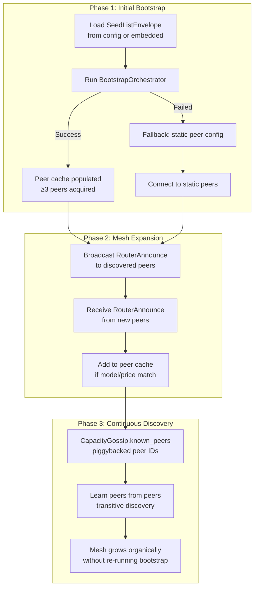
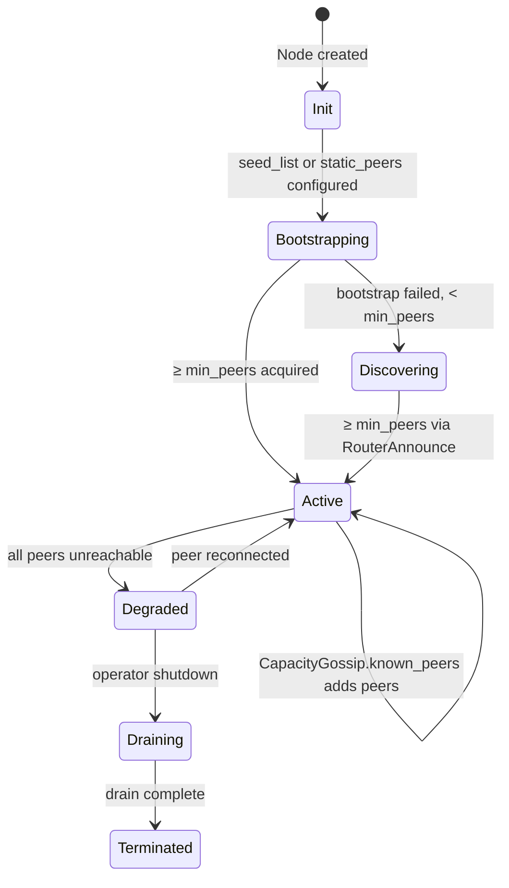
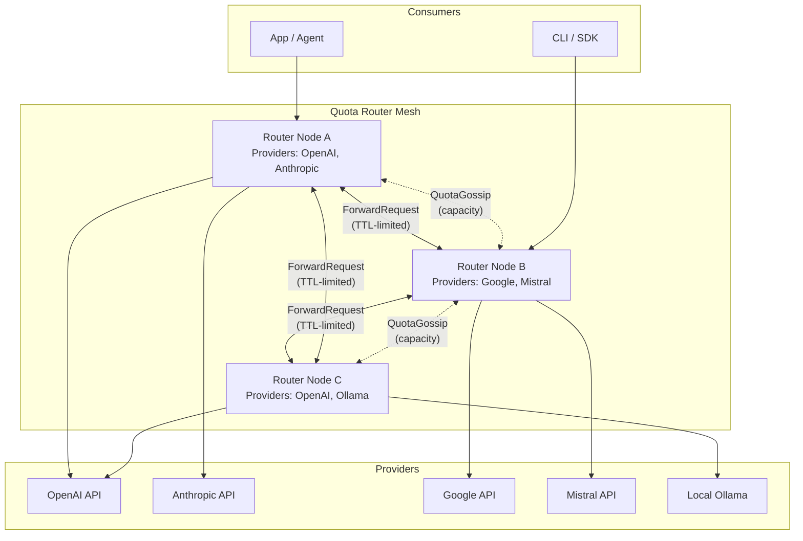
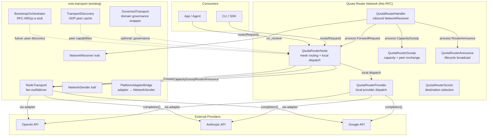
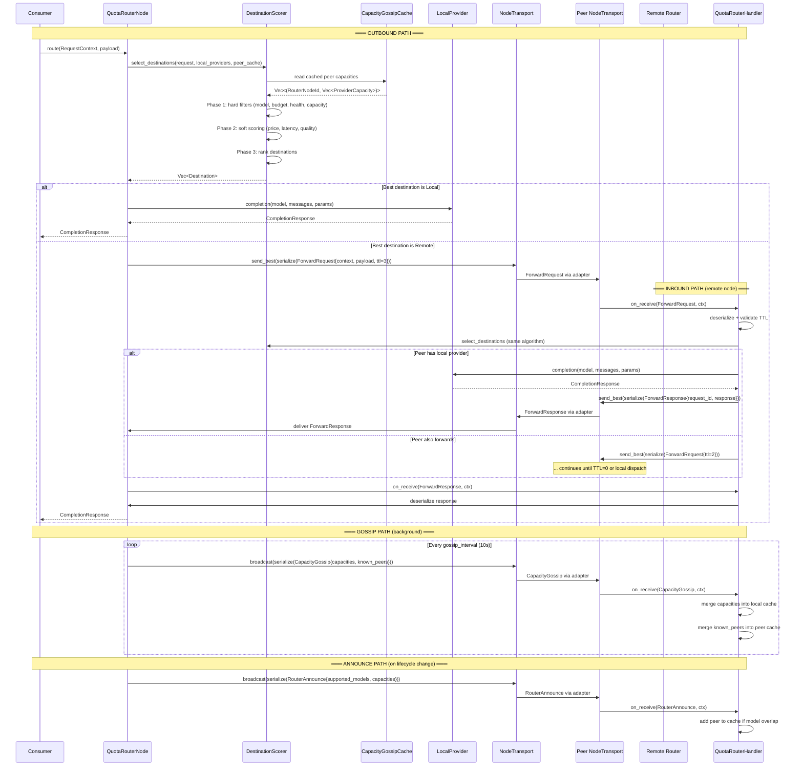
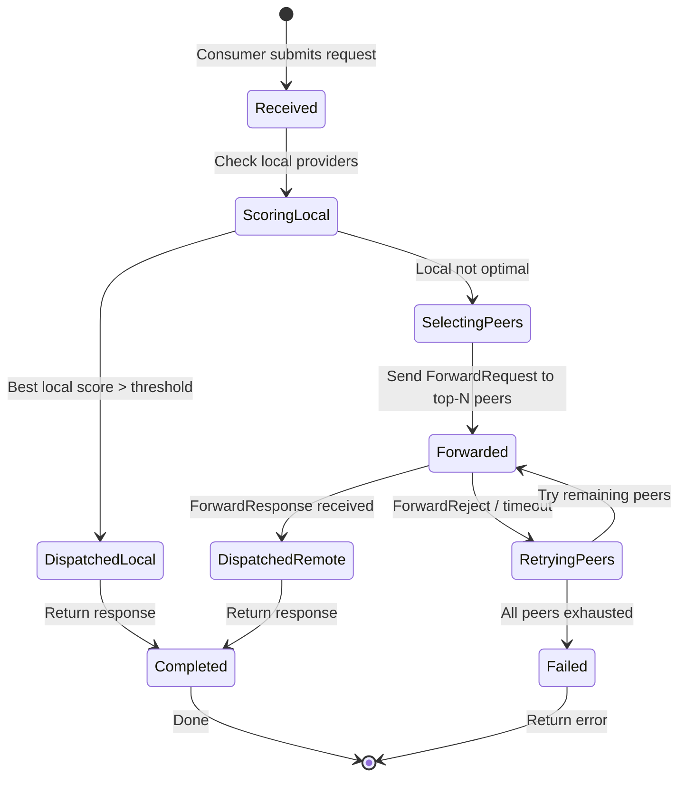

# RFC-0870 (Networking): Distributed Quota Router Network

## Status

Accepted (2026-06-30) — `QuotaRouterNode` now owns its `QuotaRouterHandler` as an internal member; `builder().build()` returns a single, fully-wired node. `SelectionState` enum distinguishes capacity-exhausted from no-match rejections. `PlatformAdapterPoller` closes the inbound gap for `PlatformAdapter`. Cross-process boundary is out of scope until a real design discussion lands (see Mission 0870g in `missions/deferred/`). All tests must target the production library per the Test Policy below.

## Authors

- Author: @mmacedoeu

## Maintainers

- Maintainer: @mmacedoeu

## Summary

Defines a distributed mesh network of Quota Router Nodes that cooperatively route AI inference requests to the best available provider. Each router node maintains local provider connections and quota state, propagates requests to peers when local capacity is insufficient, and dispatches to the optimal provider across the network. The design reuses `octo-transport` (`NodeTransport`, `NetworkSender`, `NetworkReceiver`) as the underlying transport layer and extends it with a request-forwarding protocol, quota-aware routing, and peer capacity gossip. Outbound goes through `node.transport.send_best()`; inbound goes through `node.transport.dispatch()` → the node's internal `QuotaRouterHandler` (a `NetworkReceiver` impl).

## Dependencies

**Requires:**

- RFC-0863: General-Purpose Network Integration — `NodeTransport`, `NetworkSender`, `SendContext`, adapter bridge
- RFC-0850: Deterministic Overlay Transport — envelope wire format, platform adapters, replay cache
- RFC-0851p-a: Network Bootstrap Protocol — `BootstrapOrchestrator`, `SeedListEnvelope`, seed-list-based peer acquisition
- RFC-0862: Stoolap Data Sync — pattern reference for peer-to-peer protocol design (envelope discriminators, anti-entropy, LSN model)
- RFC-0126: Deterministic Serialization — canonical encoding for wire structs

**Optional:**

- RFC-0863p-a: Domain-Governed Transport — governance-aware transport wrapper for permissioned router networks
- RFC-0852: Deterministic Gossip Protocol — anti-entropy pattern for quota state convergence
- RFC-0900: AI Quota Marketplace Protocol — quota listing, purchase, settlement
- RFC-0901: Quota Router Agent Specification — policy engine, fallback chain, provider integration
- RFC-0903: Virtual API Key System — key management for provider authentication
- RFC-0909: Deterministic Quota Accounting — quota ledger semantics
- RFC-0923: Dynamic Provider Routing — per-request `provider_type` dispatch

> **Dependency Validation Rules:**
> 1. Dependencies MUST form a DAG (no cycles). ✅ Verified: this RFC depends on 0863, 0850, 0862, 0126; none depend on this RFC.
> 2. All "Requires" RFCs MUST be listed as mission prerequisites. ✅
> 3. Optional dependencies MUST be documented separately from required. ✅
> 4. Dependencies on "Planned" RFCs MUST note the assumption they will be Accepted. — N/A: all dependencies are Accepted or Draft with stable spec.

## Design Goals

| Goal | Target | Metric |
|------|--------|--------|
| G1 — Request forwarding latency | < 100ms p50 for 3-hop propagation | End-to-end request → provider dispatch |
| G2 — Provider capacity convergence | < 30s for capacity state to propagate 5 hops | Gossip convergence time |
| G3 — Fault tolerance | Requests survive any single-node failure | No request loss on single-node crash |
| G4 — Integration simplicity | ≤ 20 lines to join a router to the network | `QuotaRouterNode::builder()` + `.provider()` + `.peer()` + `.build()` |
| G5 — Backward compatibility | Works with existing `NodeTransport` consumers | Sync engine, agent runtime use unchanged |
| G6 — Quota accounting determinism | All quota operations Class A per RFC-0008 | Deterministic settlement |
| G7 — Provider diversity | Support ≥ 10 concurrent providers per node | Provider registry capacity |
| G8 — Bootstrap independence | Core routing works without `BootstrapOrchestrator` | Static peers + peer exchange (via `CapacityGossip.known_peers`) provide full functionality |

## Motivation

### The Problem

CipherOcto's quota marketplace (RFC-0900) and router agent (RFC-0901) define a single-node routing model: one router, one set of local providers, one policy. This works for individual developers but fails at network scale:

1. **Capacity silos.** A router with excess Anthropic quota cannot help a router with excess OpenAI quota. Each operates independently.
2. **No failover across nodes.** If a router's local provider is down, it returns an error. It cannot borrow capacity from a peer.
3. **No market price discovery.** Without cross-node visibility, quota pricing is per-node, not network-wide.
4. **Redundant provider connections.** Five routers may each connect to OpenAI independently, wasting API key slots and rate limits.

### The Solution

A mesh network of Quota Router Nodes where:

- Each node is a **gateway** that accepts inference requests from local consumers (apps, agents, CLI)
- Each node maintains **local providers** (API keys, endpoints, health)
- Each node **propagates requests** to peer routers when local capacity is insufficient or suboptimal
- Each node **gossips provider capacity** so peers know what's available without querying
- The network **converges** on optimal routing: the request finds the best provider across all nodes

This is the distributed extension of RFC-0901's single-node Quota Router Agent.

### Inspiration: NodeTransport + Stoolap Sync Pattern

The design follows two established patterns:

1. **NodeTransport** (`octo-transport`): Declarative transport stack with fan-out/failover. We extend this with request forwarding semantics — instead of just sending data, we forward *requests* with routing metadata.

2. **Stoolap Sync** (RFC-0862): Peer-to-peer protocol with envelope discriminators, anti-entropy state exchange, and deterministic ordering. We adapt the anti-entropy pattern for quota capacity gossip instead of database state sync.

### Use Case Link

- [AI Quota Marketplace for Developer Bootstrapping](../../docs/use-cases/ai-quota-marketplace.md)
- [Enterprise Private AI](../../docs/use-cases/enterprise-private-ai.md)
- [Agent Marketplace](../../docs/use-cases/agent-marketplace.md)

## Network Bootstrap and Peer Discovery

### The Bootstrap Problem

A Quota Router Node cannot forward requests until it knows at least one peer. This is the classic "chicken and egg" problem addressed by RFC-0851p-a (Network Bootstrap Protocol). This RFC extends RFC-0851p-a's bootstrap mechanism for the quota router mesh, adding a second discovery layer for ongoing peer exchange.

### Design Choice: Two-Layer Peer Discovery

**Decision:** Use a two-layer approach — (1) initial peer acquisition via RFC-0851p-a `BootstrapOrchestrator` + static config, (2) ongoing peer exchange via the `known_peers` field piggybacked on `CapacityGossip` envelopes.

**Rationale:**
- RFC-0851p-a's `BootstrapOrchestrator` is designed for exactly this: acquiring initial peers. Reusing it avoids duplicating seed-list validation, Sybil defense, and intersection logic.
- The `BootstrapOrchestrator` response collection is currently a **stub** (see `octo-transport/src/bootstrap.rs` — the `send_bootstrap_requests()` method returns empty `Vec`). This is a **known gap** that must be resolved before Phase 1 of this RFC can integrate bootstrap.
- Peer exchange (the `known_peers` field of `CapacityGossipPayload`) provides continuous peer discovery after bootstrap, allowing the mesh to grow organically without re-running the bootstrap protocol. No separate envelope is used — peer exchange rides on the existing gossip envelope.

### Bootstrap Flow



### Phase 1: Initial Bootstrap (RFC-0851p-a Integration)

**Entry point:** `QuotaRouterNode::builder().seed_list(path).build()`.

```rust
/// Bootstrap configuration for the quota router network.
#[derive(Clone, Debug, serde::Serialize, serde::Deserialize)]
pub struct QuotaRouterBootstrap {
    /// Path to seed list JSON (RFC-0851p-a SeedListEnvelope).
    pub seed_list_path: Option<PathBuf>,
    /// Static peer list (fallback when no seed list).
    pub static_peers: Vec<PeerConfig>,
    /// Bootstrap timeout.
    pub timeout: Duration,
    /// Minimum peers before entering Active state.
    pub min_peers: usize,
}

impl QuotaRouterNode {
    /// Build with bootstrap. Runs RFC-0851p-a Mode A if seed_list provided,
    /// falls back to static peers.
    pub async fn build_with_bootstrap(
        config: RouterNodeConfig,
        bootstrap: QuotaRouterBootstrap,
    ) -> Result<Self, RouterNodeError> {
        let mut node = Self::new(config);

        // Step 1: Try RFC-0851p-a bootstrap
        if let Some(seed_path) = &bootstrap.seed_list_path {
            let seed_json = std::fs::read_to_string(seed_path)?;
            let seed_envelope: SeedListEnvelope = serde_json::from_str(&seed_json)?;
            // node_id = BLAKE3-256(node_pubkey || network_id), so the pubkey
            // must come from the keypair, not from node_id.0 (the hash).
            let node_pubkey = node.keypair.public_bytes();
            let bootstrap_config = BootstrapConfig {
                node_id: node.config.node_id.0,
                node_pubkey,
                ..BootstrapConfig::default()
            };
            let mut orch = BootstrapOrchestrator::new(seed_envelope, bootstrap_config);

            match orch.run(&node.transport).await {
                Ok(peer_count) if peer_count >= bootstrap.min_peers as u32 => {
                    node.state = RouterNodeLifecycle::Active;
                    return Ok(node);
                }
                Ok(_) => { /* below min_peers, try static fallback */ }
                Err(_) => { /* bootstrap failed, try static fallback */ }
            }
        }

        // Step 2: Fallback to static peers
        for peer in &bootstrap.static_peers {
            node.add_peer(peer.clone());
        }

        if node.peer_count() >= bootstrap.min_peers {
            node.state = RouterNodeLifecycle::Active;
        } else {
            node.state = RouterNodeLifecycle::Discovering;
        }

        Ok(node)
    }
}
```

**Design Choice — BootstrapOrchestrator stub gap:**

The `BootstrapOrchestrator::send_bootstrap_requests()` (in `octo-transport/src/bootstrap.rs`) currently returns an empty `Vec` because the `NetworkReceiver` inbound path is not wired. This means `run()` will always return `NoResponses` when `min_responses > 0`.

**Resolution options:**
1. **Fix the stub** (prerequisite): Wire `NetworkReceiver` to collect `BOOTSTRAP_RESP` envelopes. This is the correct fix and benefits all consumers of `BootstrapOrchestrator`.
2. **Bypass bootstrap entirely**: Use only static peers + `CapacityGossip.known_peers` for discovery. Simpler, but requires manual peer configuration.
3. **Hybrid approach** (recommended for Phase 1): Use static peers initially, then switch to `BootstrapOrchestrator` once the stub is fixed. This RFC's implementation can proceed without blocking on the stub fix.

**This RFC does NOT depend on the stub fix.** The `QuotaRouterNode` works with static peers alone. The `BootstrapOrchestrator` integration is a Phase 2 enhancement that improves the developer experience.

### Phase 2: Mesh Expansion (RouterAnnounce)

Once a node is Active (has ≥1 peer), it broadcasts `RouterAnnounce` to all peers. This announces the node's identity, supported models, and provider capacity. Peers respond with their own `RouterAnnounce`, expanding the mesh.

**RouterAnnounce payload:**

```rust
#[derive(Clone, Debug, serde::Serialize, serde::Deserialize)]
pub struct RouterAnnouncePayload {
    /// This node's identity.
    pub node_id: RouterNodeId,
    /// Network this node belongs to.
    pub network_id: NetworkId,
    /// Models this node can route (union of all local provider models).
    pub supported_models: Vec<String>,
    /// Current provider capacities (snapshot).
    pub capacities: Vec<ProviderCapacity>,
    /// Logical timestamp.
    pub timestamp: u64,
    /// HMAC-BLAKE3(network_key, node_id || timestamp || models_hash)
    pub hmac: [u8; 32],
}
```

**RouterWithdraw payload:**

```rust
#[derive(Clone, Debug, serde::Serialize, serde::Deserialize)]
pub struct RouterWithdrawPayload {
    pub node_id: RouterNodeId,
    pub reason: WithdrawReason,
    pub timestamp: u64,
    /// HMAC-BLAKE3(network_key, node_id || reason_discriminant || timestamp).
    /// `reason_discriminant` is the single-byte tag for the WithdrawReason
    /// variant (0x00=Graceful, 0x01=Maintenance, 0x02=Decommissioned).
    pub hmac: [u8; 32],
}

#[derive(Clone, Debug, serde::Serialize, serde::Deserialize)]
pub enum WithdrawReason {
    Graceful,
    Maintenance,
    Decommissioned,
}
```

### Phase 3: Continuous Discovery (CapacityGossip.known_peers)

**Decision:** Piggyback peer exchange on `CapacityGossip` rather than creating a separate gossip protocol.

**Rationale:** The `CapacityGossip` message is already broadcast every 10s. Adding a `known_peers` field costs ~64 bytes per message (32 peer IDs × 2 bytes for compressed peer IDs) but eliminates the need for a separate peer-discovery protocol. This follows the "one gossip, two purposes" principle.

**Updated `CapacityGossipPayload`:**

```rust
#[derive(Clone, Debug, serde::Serialize, serde::Deserialize)]
pub struct CapacityGossipPayload {
    pub sender_id: RouterNodeId,
    pub timestamp: u64,
    pub capacities: Vec<ProviderCapacity>,
    /// Known peer node IDs (up to 32). Enables transitive peer discovery.
    pub known_peers: Vec<RouterNodeId>,
    /// HMAC-BLAKE3(network_key, sender_id || timestamp || capacities_dcs_hash
    /// || known_peers_hash), where `capacities_dcs_hash` is BLAKE3-256 of the
    /// DCS-encoded (RFC-0126) `capacities` vec and `known_peers_hash` is
    /// BLAKE3-256 of the concatenated peer IDs.
    pub hmac: [u8; 32],
}
```

**Peer exchange rules:**
1. On receiving `CapacityGossip`, merge `known_peers` into local peer cache.
2. Only add a peer if: (a) not already known, (b) `RouterAnnounce` was received from it (identity verification), (c) supported models overlap with local policy.
3. Maximum peer cache size: 128 (configurable). Evict least-recently-seen peers.
4. Do NOT forward `known_peers` from untrusted peers (`PeerTrust::Untrusted`).

**Transitive discovery depth:** Peers learned via gossip are marked as `discovered: true`. ForwardRequest is only sent to peers with `discovered: false` (direct) or `discovered: true && trust: Verified`. This limits amplification through untrusted transitive chains.

### Peer Discovery Lifecycle State Machine



## Roles and Authorities

### Role/Authority Coverage Table

| Role | Identifier | Authority Scope | Lifecycle | Source/Ref |
|------|------------|-----------------|-----------|------------|
| **Router Node** | `RouterNodeId` (BLAKE3-256 of `node_public_key \|\| network_id`) | Accept inbound requests, forward to peers, dispatch to local providers, gossip capacity | 7-state lifecycle (§Lifecycle Requirements) | This RFC §Specification |
| **Provider** | `ProviderId` (BLAKE3-256 of `provider_name \|\| router_node_id`) | Execute inference requests, report capacity | Per-node registration; health-checked | This RFC §Specification + RFC-0901 |
| **Consumer** | Any code calling `QuotaRouterNode::route()` | Submit inference requests | Stateless — no persistent state | This RFC §Specification |
| **Network Operator** | Human operator configuring router nodes | Configure peers, providers, policies | Config at startup | This RFC §Specification |

**Out-of-scope roles:**
- **Platform administrators** (OpenAI, Anthropic, etc.) manage their own APIs. This RFC does not define provider-level roles.
- **Settlement operators** — quota accounting and settlement are handled by RFC-0909 and RFC-0900; this RFC defines request routing only.
- **Mission coordinators** — this RFC does not define mission-scoped roles; see RFC-0855p-c.

### ACCEPTED IMPLICIT ROLES

- **Peer operator** (v1) — each router node operator is trusted to correctly configure their peer list and provider credentials. Peer compromise is the primary threat surface (see §Adversary Analysis). Deadline: F2 (signed peer announcements) will reduce peer trust to cryptographic verification.

## Specification

### System Architecture



### Component Integration Architecture



### Data Flow: End-to-End Request Lifecycle



### Module Integration: How QuotaRouterNode Fits in octo-transport

`QuotaRouterNode` is a **consumer-level abstraction** that sits on top of `NodeTransport`. It follows the same pattern as `GovernedTransport` (RFC-0863p-a) — a higher-level wrapper that adds domain-specific logic on top of the transport layer.

**Integration pattern (mirrors GovernedTransport):**

```rust
// GovernedTransport pattern (existing):
//   GovernedTransport wraps NodeTransport, adds domain governance
//   GovernedTransport.send_best() → governance check → inner.send_best()

// QuotaRouterNode pattern (this RFC):
//   QuotaRouterNode owns NodeTransport, adds mesh routing
//   QuotaRouterNode.route() → destination selection → local dispatch or inner.send_best()
```

**Module layout — standalone `quota-router/` crate (leaf workspace):**

```text
quota-router/                            # standalone crate, depends on octo-transport
├── Cargo.toml
├── src/
│   ├── lib.rs                # QuotaRouterNode, RouterNodeConfig, lifecycle, builder
│   ├── handler.rs            # QuotaRouterHandler (NetworkReceiver impl)
│   ├── provider.rs           # ProviderCapacity, local provider dispatch
│   ├── scorer.rs             # DestinationScorer, scoring function
│   ├── gossip.rs             # CapacityGossipPayload, gossip cache
│   ├── announce.rs           # RouterAnnouncePayload, lifecycle broadcast
│   ├── forward.rs            # ForwardRequestPayload, ForwardResponsePayload
│   ├── request.rs            # RequestContext, Destination
│   ├── metrics.rs            # QuotaRouterMetrics (Prometheus)
│   └── ratelimit.rs          # RateLimiter, TokenBucket
└── tests/
    └── quota_router_adversarial.rs
```

**Why a separate crate, not a module inside octo-transport:**

`octo-transport` is a reusable library (RFC-0863) that provides general-purpose abstractions (`NetworkSender`, `NodeTransport`). Consumers like `quota-router`, `octo-sync`, and `octo-determin` are separate leaf-workspace crates that depend on it. This follows the established project pattern and avoids polluting the transport library with domain-specific routing logic.

### Inbound Path: QuotaRouterHandler (NetworkReceiver)

The missing piece: `ForwardRequest`, `CapacityGossip`, and `RouterAnnounce` arrive from peers via `NodeTransport`. The `QuotaRouterHandler` implements `NetworkReceiver` to process inbound envelopes.

```rust
use crate::receiver::{NetworkReceiver, ReceiveContext};
use crate::sender::TransportError;

/// Convenience wrapper for envelope (de)serialization — uses `bincode` for
/// compactness (HMAC inputs use `serde_json` per the `SignedPayload` trait impls
/// so signatures remain stable across bincode layout changes). The choice of
/// bincode here is internal to `quota-router` and not part of
/// the wire protocol (the wire protocol uses DCS per RFC-0126 — see §Wire
/// Format).
fn serialize<T: serde::Serialize>(v: &T) -> Result<Vec<u8>, TransportError> {
    bincode::serialize(v).map_err(|e| TransportError::EnvelopeConstruction(e.to_string()))
}
fn deserialize<'a, T: serde::Deserialize<'a>>(bytes: &'a [u8]) -> Result<T, TransportError> {
    bincode::deserialize(bytes).map_err(|e| TransportError::EnvelopeConstruction(e.to_string()))
}

/// Handles inbound quota router network messages.
/// Implements NetworkReceiver to receive dispatched payloads from NodeTransport.
pub struct QuotaRouterHandler {
    /// Reference to the parent QuotaRouterNode (for dispatch decisions
    /// and outbound sends via node.transport).
    node: Arc<QuotaRouterNode>,
    /// Local provider dispatcher.
    provider: Arc<dyn LocalProvider>,
    /// Network key for HMAC verification (derived from network_id + genesis seed).
    network_key: [u8; 32],
}

#[async_trait]
impl NetworkReceiver for QuotaRouterHandler {
    async fn on_receive(
        &self,
        payload: &[u8],
        ctx: &ReceiveContext,
    ) -> Result<(), TransportError> {
        // 1. Determine envelope type from payload discriminator byte
        let discriminator = payload.first().copied()
            .ok_or_else(|| TransportError::EnvelopeConstruction(
                "empty inbound payload".into(),
            ))?;

        match discriminator {
            0xC3 => self.handle_forward_request(payload, ctx).await,
            0xC4 => self.handle_forward_response(payload, ctx).await,
            0xC5 => self.handle_forward_reject(payload, ctx).await,
            0xC6 => self.handle_capacity_gossip(payload).await,
            0xC7 => self.handle_capacity_request(payload, ctx).await,
            0xCA => self.handle_router_announce(payload).await,
            0xCB => self.handle_router_withdraw(payload, ctx).await,
            _ => Ok(()),  // unknown discriminator, ignore
        }
    }

    fn name(&self) -> &str {
        "quota-router-handler"
    }
}

impl QuotaRouterHandler {
    /// Process inbound ForwardResponse from a peer. Routes the response to the
    /// pending in-flight request that matches `request_id` and wakes the
    /// waiting consumer via the dispatch callback.
    async fn handle_forward_response(
        &self,
        payload: &[u8],
        _ctx: &ReceiveContext,
    ) -> Result<(), TransportError> {
        let resp: ForwardResponsePayload = deserialize(payload)?;
        let mut node = self.node.lock().unwrap();
        node.pending.complete(resp.request_id, resp.response);
        Ok(())
    }

    /// Process inbound ForwardReject from a peer. Routes the rejection reason
    /// to the pending request; the routing algorithm may then retry the next
    /// peer or surface the error to the consumer.
    async fn handle_forward_reject(
        &self,
        payload: &[u8],
        _ctx: &ReceiveContext,
    ) -> Result<(), TransportError> {
        let reject: ForwardRejectPayload = deserialize(payload)?;
        let mut node = self.node.lock().unwrap();
        node.pending.reject(reject.request_id, reject.reason);
        // Trigger pull-gossip so we learn the rejecting peer's fresh capacity.
        if matches!(reject.reason, ForwardRejectReason::CapacityExhausted) {
            node.request_capacity_from(reject.peer_id);
        }
        Ok(())
    }

    /// Process inbound CapacityRequest from a peer. Replies with a fresh
    /// CapacityGossip carrying our current local capacities + known peers.
    async fn handle_capacity_request(
        &self,
        _payload: &[u8],
        ctx: &ReceiveContext,
    ) -> Result<(), TransportError> {
        let payload_bytes = {
            let node = self.node.lock().unwrap();
            let gossip = node.build_capacity_gossip();
            serialize(&gossip)?
        };
        // Use self.transport (outside Mutex) — no lock held during async send.
        self.transport.send_best(&payload_bytes, ctx).await
    }

    /// Process inbound RouterWithdraw from a peer. Removes the peer from the
    /// cache and transitions it to `PeerInfo{trust_level: Withdrawn}` so no
    /// further forwards are attempted.
    async fn handle_router_withdraw(
        &self,
        payload: &[u8],
        _ctx: &ReceiveContext,
    ) -> Result<(), TransportError> {
        let withdraw: RouterWithdrawPayload = deserialize(payload)?;
        if !withdraw.verify_hmac(&self.network_key) {
            return Err(TransportError::AdapterFailure(
                "router withdraw HMAC mismatch".into(),
            ));
        }
        let mut node = self.node.lock().unwrap();
        node.peer_cache.remove(withdraw.node_id);
        Ok(())
    }

    /// Send a `ForwardResponse` back to the originating node (taken from the
    /// pending request's `origin_node`). Uses `node.transport.send_best` —
    /// the transport layer's adapter pool handles the actual route.
    async fn send_forward_response(
        &self,
        request_id: [u8; 32],
        response: Vec<u8>,
    ) -> Result<(), TransportError> {
        let (origin, executed_by, payload_bytes) = {
            let node = self.node.lock().unwrap();
            let origin = node.pending_origin(request_id)
                .ok_or_else(|| TransportError::AdapterFailure(
                    "no pending origin for request_id".into(),
                ))?;
            let payload = ForwardResponsePayload {
                request_id,
                response,
                executed_by: node.primary_provider_id(),
                latency_ms: 0,
            };
            (origin, node.primary_provider_id(), serialize(&payload)?)
        };
        let ctx = SendContext::default();
        self.transport.send_best(&payload_bytes, &ctx).await
    }

    async fn send_forward_reject(
        &self,
        request_id: [u8; 32],
        reason: ForwardRejectReason,
    ) -> Result<(), TransportError> {
        let (origin, payload_bytes) = {
            let node = self.node.lock().unwrap();
            let origin = node.pending_origin(request_id)
                .ok_or_else(|| TransportError::AdapterFailure(
                    "no pending origin for request_id".into(),
                ))?;
            let payload = ForwardRejectPayload {
                request_id,
                peer_id: node.config.node_id,
                reason,
            };
            (origin, serialize(&payload)?)
        };
        let ctx = SendContext::default();
        self.transport.send_best(&payload_bytes, &ctx).await
    }
}

/// Internal action enum for `handle_forward_request` — avoids holding the
/// Mutex across async .await. The scoring pass is synchronous (under lock);
/// the dispatch/forward is async (lock released).
enum DropAction {
    Reject(ForwardRejectReason),
    LocalDispatch(ProviderCapacity),
    Forward,
}

impl QuotaRouterHandler {
    /// Process inbound ForwardRequest from a peer.
    async fn handle_forward_request(
        &self,
        payload: &[u8],
        ctx: &ReceiveContext,
    ) -> Result<(), TransportError> {
        let req: ForwardRequestPayload = deserialize(payload)?;

        // TTL check
        if req.ttl == 0 {
            self.send_forward_reject(req.request_id, ForwardRejectReason::TtlExpired).await?;
            return Ok(());
        }

        // Destination selection — lock only for the synchronous scoring pass.
        let action = {
            let node = self.node.lock().unwrap();
            let local: Vec<ProviderCapacity> = node.config.providers.iter()
                .map(|p| ProviderCapacity::from_config(p, node.config.node_id))
                .collect();
            let peer_caps = node.gossip_cache.snapshot();
            let selection = node.select_destinations_with_state(
                &req.context, &local, &peer_caps, &node.config.policy,
            );

            match selection {
                SelectionState::Matched(destinations) => match destinations.first() {
                    Some(Destination::Local { provider, .. }) => {
                        DropAction::LocalDispatch(provider.clone())
                    }
                    Some(Destination::Remote { .. }) => DropAction::Forward,
                    None => unreachable!(),
                },
                SelectionState::CapacityExhausted => {
                    DropAction::Reject(ForwardRejectReason::CapacityExhausted)
                }
                SelectionState::NoMatch => {
                    DropAction::Reject(ForwardRejectReason::NoProvider)
                }
            }
        }; // lock released here

        match action {
            DropAction::Reject(reason) => {
                self.send_forward_reject(req.request_id, reason).await?;
            }
            DropAction::LocalDispatch(provider) => {
                let response = self.provider.completion(
                    &req.context.model, &req.payload, &provider,
                ).await?;
                self.send_forward_response(req.request_id, response).await?;
            }
            DropAction::Forward => {
                let fwd_bytes = {
                    let mut fwd = req.clone();
                    fwd.ttl -= 1;
                    fwd.hop_count += 1;
                    serialize(&fwd)?
                };
                self.transport.send_best(&fwd_bytes, ctx).await?;
            }
        }

        Ok(())
    }

    /// Process inbound CapacityGossip from a peer.
    async fn handle_capacity_gossip(&self, payload: &[u8]) -> Result<(), TransportError> {
        let gossip: CapacityGossipPayload = deserialize(payload)?;

        // Verify HMAC — on mismatch, return AdapterFailure (the closest
        // existing `TransportError` variant; F4 will add a dedicated
        // `HmacMismatch` variant).
        if !gossip.verify_hmac(&self.network_key) {
            return Err(TransportError::AdapterFailure(
                "capacity gossip HMAC mismatch".into(),
            ));
        }

        // Merge capacities into local cache
        let mut node = self.node.lock().unwrap();
        node.gossip_cache.merge(gossip.sender_id, gossip.capacities);

        // Merge known peers
        for peer_id in gossip.known_peers {
            node.peer_cache.try_add(peer_id);
        }

        Ok(())
    }

    /// Process inbound RouterAnnounce from a peer.
    async fn handle_router_announce(&self, payload: &[u8]) -> Result<(), TransportError> {
        let announce: RouterAnnouncePayload = deserialize(payload)?;

        // Verify HMAC — on mismatch, return AdapterFailure (the closest
        // existing `TransportError` variant; F4 will add a dedicated
        // `HmacMismatch` variant).
        if !announce.verify_hmac(&self.network_key) {
            return Err(TransportError::AdapterFailure(
                "router announce HMAC mismatch".into(),
            ));
        }

        // Add peer to cache if model overlap
        let mut node = self.node.lock().unwrap();
        let local_models: Vec<&str> = node.local_provider_models();
        let has_overlap = announce.supported_models.iter()
            .any(|m| local_models.contains(&m.as_str()));

        if has_overlap || node.policy == RoutingPolicy::Balanced {
            node.peer_cache.add_direct(announce.node_id, announce.capacities);
        }

        Ok(())
    }
}
```

**Design Choice — Single handler for all envelope types:**

All inbound quota router messages flow through a single `QuotaRouterHandler` that implements `NetworkReceiver`. This matches the pattern in `octo-network/src/sync/dgp_integration.rs` where `SyncDgpHandler` handles all sync-related inbound messages. The handler uses envelope discriminator dispatch (byte 0 of payload) to route to the appropriate handler method.

**Design Choice — Handler owns a reference to QuotaRouterNode:**

The handler needs access to the node's gossip cache, peer cache, and routing policy to process inbound messages. It holds an `Arc<Mutex<QuotaRouterNode>>` — the same thread-safety pattern used by `GovernedTransport` and `TransportDiscovery`.

### PlatformAdapter Receiver: Inbound Polling Bridge

The mesh is send-only without a receiver-side bridge. `PlatformAdapterBridge` (RFC-0863) implements `NetworkSender` for outbound dispatch via `adapter.send_message(...)`, but there is no production path for inbound data from a `PlatformAdapter` into `NodeTransport::dispatch`.

`PlatformAdapterPoller` closes this gap. It is the inbound counterpart of `PlatformAdapterBridge` — together they make a `PlatformAdapter` fully usable from `NodeTransport`:

- **Outbound:** `PlatformAdapterBridge::send` → `adapter.send_message(domain, envelope, payload)`
- **Inbound:** `PlatformAdapterPoller::run` → poll `adapter.receive_messages(domain)` → parse envelope → `NodeTransport::dispatch(payload, ctx)`

```rust
/// Runtime poller that drains `PlatformAdapter::receive_messages` and
/// feeds the inbound payloads into `NodeTransport::dispatch`.
pub struct PlatformAdapterPoller {
    adapter: Arc<dyn PlatformAdapter>,
    domain: BroadcastDomainId,
    transport: Arc<NodeTransport>,
}

impl PlatformAdapterPoller {
    pub fn new(
        adapter: Arc<dyn PlatformAdapter>,
        domain: BroadcastDomainId,
        transport: Arc<NodeTransport>,
    ) -> Self;

    /// Run the poll loop. Returns when the adapter's inbound mpsc closes.
    ///
    /// For each `RawPlatformMessage`:
    ///   1. `adapter.canonicalize(raw)` → `DeterministicEnvelope`
    ///      (parses first `ENVELOPE_WIRE_LEN` bytes of `raw.payload`)
    ///   2. `envelope.source_peer` → `ReceiveContext.sender_id`
    ///   3. `raw.payload[ENVELOPE_WIRE_LEN..]` → mesh payload
    ///   4. `transport.dispatch(payload, ctx)` → registered receivers
    pub async fn run(&self) {
        loop {
            let messages = match self.adapter.receive_messages(&self.domain).await {
                Ok(m) => m,
                Err(e) => { /* log + yield + continue */ }
            };
            if messages.is_empty() {
                tokio::task::yield_now().await;
                continue;
            }
            for raw in messages {
                self.dispatch_one(&raw).await;
            }
        }
    }
}
```

**Wire-format contract (RFC-0850 §8.8 Raw mode):**

`RawPlatformMessage.payload` is `[DeterministicEnvelope wire bytes (282 bytes)][mesh payload bytes]`. The poller splits the frame:
- Bytes `0..ENVELOPE_WIRE_LEN` → parsed via `canonicalize()` to extract `envelope.source_peer` (32-byte sender-id), `envelope.mission_id`, and other envelope fields.
- Bytes `ENVELOPE_WIRE_LEN..` → the mesh payload, dispatched to all registered `NetworkReceiver` instances via `NodeTransport::dispatch`.

**Sender-id plumbing:**

`envelope.source_peer` is mapped to `ReceiveContext.sender_id` so the handler's HMAC trust check can resolve the sender's `PeerTrust`. For `TcpAdapter`, the sender-id is derived from the 32-byte `source_peer` field in the `DeterministicEnvelope` (already present in the wire format). No wire change is needed.

**Integration with `QuotaRouterNode`:**

When `quota-router serve` (T-CLI1) or the PyO3 binding starts the mesh, the startup sequence spawns a `PlatformAdapterPoller` per configured `PlatformAdapter`:

```rust
// Startup wiring (inside core::serve or PyO3 binding):
let poller = PlatformAdapterPoller::new(
    Arc::clone(&adapter),
    domain,
    Arc::clone(&node.transport),
);
tokio::spawn(async move { poller.run().await });
```

The poller runs as a background task. It does not hold any node-level locks — only `Arc<NodeTransport>` and `Arc<dyn PlatformAdapter>`. The dispatch path (`NodeTransport::dispatch`) iterates registered receivers (including `QuotaRouterHandler`) and calls `on_receive` on each.

**Production code location:** `octo-transport/src/adapter_poller.rs`

### Response Path: How ForwardResponse Routes Back

When a remote peer dispatches a request and generates a `ForwardResponse`, the response must route back to the original consumer. This uses the `origin_node` field in `ForwardRequestPayload`:

```text
1. Consumer → Node A: route(RequestContext{model: "gpt-4o"})
2. Node A → Node B: ForwardRequest{origin_node: A, ttl: 3}
3. Node B → Node C: ForwardRequest{origin_node: A, ttl: 2}  (B can't handle it)
4. Node C dispatches locally, generates ForwardResponse
5. Node C → Node A: ForwardResponse{request_id: X}  (routed back to origin)
6. Node A → Consumer: CompletionResponse
```

**Response routing mechanism:**

The `ForwardResponse` is sent directly back to the `origin_node` (Node A), not through the chain. This is possible because:
- Each peer knows its direct neighbors (from gossip)
- The `origin_node` is a `RouterNodeId` (32-byte ID)
- `NodeTransport::send_best()` finds the best adapter to reach `origin_node`

**If origin_node is unreachable:**

The `ForwardResponse` is dropped. The original consumer's `route()` call times out after `forward_timeout` (30s default). The consumer can retry with a different policy or node.

### Local Provider Dispatch: QuotaRouterProvider

The local provider dispatch mechanism connects to external AI APIs. This is the "last mile" that actually executes inference requests.

```rust
/// Placeholder `NetworkSender` used solely to satisfy `NodeTransport`'s
/// constructor (which requires at least one sender per registered peer).
/// Real outbound dispatch to local providers goes through `QuotaRouterHandler`
/// (which calls `LocalProvider::completion` directly), not through
/// `NodeTransport::send`. This exists so the transport layer has *something*
/// to invoke; `send()` returns `Ok(())` and the handler ignores it.
pub struct LocalProviderSender;

#[async_trait]
impl NetworkSender for LocalProviderSender {
    async fn send(&self, _payload: &[u8], _ctx: &SendContext) -> Result<(), TransportError> {
        // Intentionally a no-op — see struct doc.
        Ok(())
    }
    fn name(&self) -> &str { "local-provider-placeholder" }
    fn is_healthy(&self) -> bool { true }
}

/// Trait for local provider dispatch.
/// Implementations wrap actual API clients (reqwest for litellm-mode, PyO3 for any-llm-mode).
#[async_trait]
pub trait LocalProvider: Send + Sync {
    /// Execute a completion request against this provider.
    async fn completion(
        &self,
        model: &str,
        messages: &[u8],  // serialized messages
        params: &ProviderCapacity,
    ) -> Result<Vec<u8>, ProviderError>;

    /// Health check this provider.
    async fn health_check(&self) -> ProviderHealth;

    /// Return supported models.
    fn supported_models(&self) -> Vec<String>;
}

/// Concrete implementation using reqwest (litellm-mode).
pub struct HttpLocalProvider {
    client: reqwest::Client,
    endpoint: String,
    api_key: String,
    models: Vec<String>,
}

impl HttpLocalProvider {
    /// Build an HTTP-backed provider for the given static config.
    /// `cfg.endpoint` may be a full URL or a base URL; the implementation
    /// appends `/v1/chat/completions` for OpenAI-compatible APIs.
    pub fn new(cfg: ProviderConfig) -> Self {
        let api_key = match cfg.auth {
            ProviderAuth::ApiKey(k) => k,
            ProviderAuth::OAuth(k) => k,  // OAuth tokens are bearer strings too
            ProviderAuth::Local => String::new(),
        };
        Self {
            client: reqwest::Client::new(),
            endpoint: cfg.endpoint,
            api_key,
            models: cfg.models,
        }
    }
}

/// Concrete implementation using PyO3 (any-llm-mode).
pub struct PyO3LocalProvider {
    bridge: PyO3Bridge,
    models: Vec<String>,
}

impl PyO3LocalProvider {
    pub fn new(cfg: ProviderConfig, bridge: PyO3Bridge) -> Self {
        Self { bridge, models: cfg.models }
    }
}
```

**Design Choice — Trait-based provider dispatch:**

The `LocalProvider` trait abstracts over the two dispatch modes defined in RFC-0923 (litellm-mode via reqwest, any-llm-mode via PyO3). The mesh routing logic is identical regardless of which mode is used — the trait boundary isolates the mesh from the provider integration details.

**Integration with RFC-0929 DispatchInfo:**

The `LocalProvider::completion()` method receives the model ID and messages. It uses the model ID to look up the correct `DispatchInfo` (from RFC-0929) internally. The mesh layer does not need to know about `DispatchInfo` — it only cares about model support and capacity.

### QuotaRouterNode Builder Pattern

Following the RFC-0863p-a `NodeTransport::builder()` pattern:

```rust
impl QuotaRouterNode {
    /// Build a new QuotaRouterNode from config.
    pub fn builder() -> QuotaRouterNodeBuilder {
        QuotaRouterNodeBuilder::default()
    }

    /// Submit an inference request. Returns the provider response bytes (or
    /// an error) once the request has been dispatched either locally or via
    /// the mesh. See §Request Routing Algorithm for the full decision tree.
    pub async fn route(
        &self,
        context: &RequestContext,
        payload: &[u8],
    ) -> Result<Vec<u8>, RouterNodeError> {
        // 1. Hard-filter + soft-score local + peer candidates
        let local: Vec<ProviderCapacity> = self.config.providers.iter()
            .map(|p| ProviderCapacity::from_config(p, self.config.node_id))
            .collect();
        let peer_caps: Vec<(RouterNodeId, Vec<ProviderCapacity>)> =
            self.gossip_cache.snapshot();
        let destinations = self.select_destinations(
            context, &local, &peer_caps, &self.config.policy,
        );
        if destinations.is_empty() {
            return Err(RouterNodeError::NoProvider);
        }

        // 2. Try best destination — local dispatch goes through the primary
        //    provider (a `Box<dyn LocalProvider>` held on the node; created by
        //    the builder from the first `ProviderConfig`).
        match &destinations[0] {
            Destination::Local { provider, .. } => {
                self.primary_provider
                    .completion(&context.model, payload, provider)
                    .await
                    .map_err(RouterNodeError::Provider)
            }
            Destination::Remote { peer_id, .. } => {
                let request_id = blake3::hash(
                    [&context.consumer_id, &self.monotonic_now().to_le_bytes()]
                        .concat()
                        .as_slice()
                ).into();
                let fwd = ForwardRequestPayload {
                    request_id,
                    network_id: self.config.network_id,
                    context: context.clone(),
                    payload: payload.to_vec(),
                    ttl: self.config.forwarding.max_ttl,
                    origin_node: self.config.node_id,
                    hop_count: 0,
                    created_at: self.monotonic_now(),
                };
                let (tx, rx) = tokio::sync::oneshot::channel();
                self.pending.insert(request_id, tx, self.config.node_id);
                self.transport.send_best(&serialize(&fwd), &SendContext::default()).await?;
                match tokio::time::timeout(
                    self.config.forwarding.forward_timeout, rx,
                ).await {
                    Ok(Ok(ForwardOutcome::Completed(bytes))) => Ok(bytes),
                    Ok(Ok(ForwardOutcome::Rejected(reason))) =>
                        Err(RouterNodeError::ForwardRejected(reason)),
                    Ok(Ok(ForwardOutcome::Timeout)) | Err(_) =>
                        Err(RouterNodeError::ForwardTimeout),
                }
            }
        }
    }

    /// Number of known peers (used by `build_with_bootstrap` for min_peers check).
    pub fn peer_count(&self) -> usize {
        self.peer_cache.total()
    }

    /// Local providers' supported models (used by `handle_router_announce` for
    /// model-overlap filtering on incoming peer announcements).
    pub fn local_provider_models(&self) -> Vec<String> {
        self.config.providers.iter()
            .flat_map(|p| p.models.iter().cloned())
            .collect()
    }

    /// Add a peer (used during static-peer fallback in `build_with_bootstrap`).
    pub fn add_peer(&mut self, peer: PeerConfig) {
        self.peer_cache.add_direct(peer.node_id, vec![]);
        self.config.peers.push(peer);
    }
}

pub struct QuotaRouterNodeBuilder {
    node_id: Option<RouterNodeId>,
    network_id: Option<NetworkId>,
    providers: Vec<ProviderConfig>,
    peers: Vec<PeerConfig>,
    policy: RoutingPolicy,
    forwarding: ForwardingConfig,
    gossip_interval: Duration,
}

impl QuotaRouterNodeBuilder {
    pub fn node_id(mut self, id: RouterNodeId) -> Self { self.node_id = Some(id); self }
    pub fn network_id(mut self, id: NetworkId) -> Self { self.network_id = Some(id); self }
    pub fn provider(mut self, p: ProviderConfig) -> Self { self.providers.push(p); self }
    pub fn peer(mut self, p: PeerConfig) -> Self { self.peers.push(p); self }
    pub fn policy(mut self, p: RoutingPolicy) -> Self { self.policy = p; self }
    pub fn forwarding(mut self, f: ForwardingConfig) -> Self { self.forwarding = f; self }
    pub fn gossip_interval(mut self, d: Duration) -> Self { self.gossip_interval = d; self }

    pub fn build(self) -> Result<QuotaRouterNode, RouterNodeError> {
        let node_id = self.node_id.ok_or(RouterNodeError::MissingNodeId)?;
        let network_id = self.network_id.ok_or(RouterNodeError::MissingNetworkId)?;
        if self.providers.is_empty() {
            return Err(RouterNodeError::NoProviders);
        }

        // Build NodeTransport with a placeholder sender per provider (real
        // outbound dispatch goes through QuotaRouterHandler, not NodeTransport).
        let senders: Vec<Arc<dyn NetworkSender>> = self.providers.iter()
            .map(|_| Arc::new(LocalProviderSender) as Arc<dyn NetworkSender>)
            .collect();
        let transport = NodeTransport::new(senders);

        let primary_provider: Arc<dyn LocalProvider> =
            Arc::new(HttpLocalProvider::new(self.providers[0].clone()));

        // Construct the node first, then the handler with an Arc to the node.
        // Both the handler and a duplicate `Arc<NodeTransport>` are wired into
        // the node so callers receive a single, fully-wired `QuotaRouterNode`.
        let node = Arc::new(QuotaRouterNode {
            config: RouterNodeConfig {
                node_id, network_id,
                providers: self.providers,
                peers: self.peers,
                policy: self.policy,
                forwarding: self.forwarding,
                gossip_interval: self.gossip_interval,
            },
            state: RouterNodeLifecycle::Init,
            transport,
            gossip_cache: GossipCache::new(),
            peer_cache: PeerCache::new(),
            pending: PendingRequests::new(),
            keypair: Keypair::generate(),  // persistent load replaces this at startup
            primary_provider: primary_provider.clone(),
            handler: Arc::new(QuotaRouterHandler::new(
                Arc::clone(&node),
                primary_provider,
                *blake3::hash(network_id.0.as_ref()).as_bytes(),
            )),
        });

        // Register the handler with NodeTransport so inbound payloads reach it.
        node.transport
            .register_receiver(node.handler.clone() as Arc<dyn NetworkReceiver>);

        // Unwrap the Arc so the public return type is `QuotaRouterNode`, not
        // `Arc<QuotaRouterNode>`. Callers that need shared ownership should
        // `Arc::new(node)` themselves; the builder does not impose that.
        Arc::try_unwrap(node).map_err(|_| RouterNodeError::Internal(
            "build() called while another Arc<QuotaRouterNode> already exists".into(),
        ))
    }
}
```

**Design Choice — `QuotaRouterNode` owns its handler:**

The `build()` returns a single, fully-wired `QuotaRouterNode`. The internal `QuotaRouterHandler` (which implements `NetworkReceiver`) is constructed inside the builder and registered with `NodeTransport` via `register_receiver()`. Callers do not perform any handler wiring — there is no `register_receiver()` call in the public API. The node is the only public surface for both outbound (`route()`) and inbound (`receive()`) operations.

Rationale:

- **Symmetric data flow.** Outbound (`node.route`) and inbound (`node.receive`) both flow through `NodeTransport`. The handler-internal structure means there is exactly one inbound path: `transport.dispatch() → handler.on_receive()`.
- **No caller-side wiring.** A tuple return required callers to construct or pass `Arc`s in the right order; this was a frequent source of bugs. Returning a single value removes that surface.
- **Layered API.** The internal layering (`NodeTransport` → `NetworkReceiver` → handler) is an implementation detail. The public surface is `QuotaRouterNode`, period.

See Mission 0870c for the consumer-side wiring example, Mission 0870m for the inbound API definition, and Mission 0870g (in `missions/deferred/`) for the cross-process boundary discussion that is *not* covered by this RFC.

### Public API

The single public surface for a running quota router node is `QuotaRouterNode`. Three entry points cover all consumer-facing use cases:

```rust
impl QuotaRouterNode {
    /// Construct a new node from configuration.
    pub fn builder() -> QuotaRouterNodeBuilder;

    /// Submit an inference request. Returns the provider response bytes
    /// once the request has been dispatched (locally or via the mesh).
    pub async fn route(
        &self,
        context: &RequestContext,
        payload: &[u8],
    ) -> Result<Vec<u8>, RouterNodeError>;

    /// Inbound API: dispatch a payload through `NodeTransport` to all
    /// registered receivers. The internal `QuotaRouterHandler` is one of
    /// those receivers (registered automatically by the builder).
    /// Symmetric to `route()` for outbound traffic.
    pub async fn receive(
        &self,
        payload: &[u8],
        ctx: &ReceiveContext,
    ) -> Result<(), TransportError>;
}
```

Notes:

- `route()` is outbound. The caller (consumer SDK or CLI) supplies a request and gets back provider bytes.
- `receive()` is inbound. A platform adapter (or test harness) calls it with a payload and a `ReceiveContext`. The payload is dispatched through `NodeTransport` and reaches the handler via the registered receiver. Callers do not pass `NetworkReceiver` instances to `receive()`.
- All other methods (`peer_count`, `local_provider_models`, `add_peer`, `select_destinations`, `pending_origin`, `primary_provider_id`, `build_capacity_gossip`, `request_capacity_from`, `broadcast_gossip`, `broadcast_announce`, `build_with_bootstrap`) are accessors or background-loop drivers. They are not part of the symmetric inbound/outbound contract.

### Wiring Diagram: Full Integration

```text
┌─────────────────────────────────────────────────────────────────────┐
│  Node Startup                                                       │
│                                                                     │
│  1. QuotaRouterNode::builder()                                      │
│     ├─ .node_id(id)                                                 │
│     ├─ .network_id(nid)                                             │
│     ├─ .provider(HttpLocalProvider::new(openai_key))                │
│     ├─ .provider(HttpLocalProvider::new(anthropic_key))             │
│     ├─ .peer(PeerConfig { node_id: B, endpoint: ... })             │
│     ├─ .policy(RoutingPolicy::Balanced)                             │
│     └─ .build() → node    (handler is internal; transport.register_receiver│
│                            is called inside build() — no caller wiring)  │
│                                                                     │
│  2. Start inbound receive loop (polls adapters, dispatches via node)│
│     tokio::spawn(async {                                             │
│         loop {                                                       │
│             // Platform adapter receive → canonicalize → node.receive│
│             if let Ok(messages) = adapter.receive_messages(&domain).await { │
│                 for msg in messages {                                 │
│                     let payload = adapter.canonicalize(&msg)?;       │
│                     node.receive(&payload, &ctx).await?;             │
│                 }                                                    │
│             }                                                        │
│         }                                                            │
│     });                                                              │
│                                                                     │
│  3. Start gossip loop                                               │
│     tokio::spawn(async {                                             │
│         loop {                                                       │
│             node.broadcast_gossip().await;                           │
│             tokio::time::sleep(gossip_interval).await;              │
│         }                                                            │
│     });                                                              │
│                                                                     │
│  4. Start announce loop                                             │
│     tokio::spawn(async {                                             │
│         node.broadcast_announce().await;                             │
│     });                                                              │
│                                                                     │
│  5. Node is now Active and ready to route                           │
│     // Outbound: caller invokes node.route(...).await?               │
│     // Inbound:  platform adapter feeds node.receive(...).await?     │
└─────────────────────────────────────────────────────────────────────┘
```

### Request Flow (Summary)

See §Data Flow: End-to-End Request Lifecycle for the complete sequence diagram. The simplified flow is:

```text
Consumer → route(RequestContext)
  → DestinationScorer: filter + score + rank
  → Local? → dispatch to provider → return response
  → Remote? → ForwardRequest via NodeTransport
    → Peer receives → TTL check → score + dispatch
    → ForwardResponse back to origin → return response
```

### Data Structures

#### Core Types

```rust
use std::net::SocketAddr;

/// Unique identifier for a router node in the network.
/// Construction: BLAKE3-256(node_public_key || network_id)
#[derive(Clone, Copy, PartialEq, Eq, Hash, Debug)]
pub struct RouterNodeId(pub [u8; 32]);

/// Unique identifier for a provider registered to a specific router node.
/// Construction: BLAKE3-256(provider_name || router_node_id)
#[derive(Clone, Copy, PartialEq, Eq, Hash, Debug)]
pub struct ProviderId(pub [u8; 32]);

/// Network identifier. All nodes in a quota router mesh share the same network_id.
/// Construction: BLAKE3-256("cipherocto-quota-router" || genesis_seed)
#[derive(Clone, Copy, PartialEq, Eq, Hash, Debug)]
pub struct NetworkId(pub [u8; 32]);
```

#### QuotaRouterNode

```rust
/// The main quota router node — consumer-facing API for mesh routing.
pub struct QuotaRouterNode {
    /// Node configuration.
    pub config: RouterNodeConfig,
    /// Current lifecycle state.
    pub state: RouterNodeLifecycle,
    /// Underlying transport layer (fan-out/failover).
    pub transport: NodeTransport,
    /// Capacity gossip cache (provider capacities from peers).
    pub gossip_cache: GossipCache,
    /// Peer cache (known peer nodes and their capabilities).
    pub peer_cache: PeerCache,
    /// In-flight forwarded requests awaiting response/reject.
    pending: PendingRequests,
    /// Ed25519 keypair for this node (used to derive `node_pubkey` for
    /// `BootstrapConfig` and to sign local outbound envelopes).
    pub keypair: Keypair,
    /// Primary local provider (dispatches inbound ForwardRequests and
    /// local route() calls). Created from the first `ProviderConfig` by the builder.
    primary_provider: Arc<dyn LocalProvider>,
}

impl QuotaRouterNode {
    /// Build a fresh CapacityGossip from our local state (used by both the
    /// periodic broadcast loop and as a reply to `CapacityRequest`).
    pub fn build_capacity_gossip(&self) -> CapacityGossipPayload {
        let capacities: Vec<ProviderCapacity> = self.config.providers.iter()
            .map(|p| ProviderCapacity::from_config(p, self.config.node_id))
            .collect();
        let known_peers: Vec<RouterNodeId> = self.peer_cache.direct_ids()
            .into_iter()
            .take(32)
            .collect();
        let mut payload = CapacityGossipPayload {
            sender_id: self.config.node_id,
            timestamp: self.monotonic_now(),
            capacities,
            known_peers,
            hmac: [0u8; 32],  // filled by sign_hmac
        };
        payload.hmac = payload.compute_hmac(&self.network_key());
        payload
    }

    /// Request fresh capacity from a peer (used after `ForwardReject` with
    /// `CapacityExhausted`, per §Capacity Gossip Protocol step 2).
    ///
    /// **v1 limitation:** `octo-transport::NodeTransport` does not expose a
    /// per-peer routing API (it operates on the sender pool via `send_best`
    /// and `broadcast`). The spec therefore piggybacks this request on the
    /// next `CapacityGossip` broadcast: when `request_capacity_from(peer)` is
    /// called, the peer ID is added to a `pending_capacity_requests: BTreeSet<RouterNodeId>`
    /// and the periodic gossip loop tags the next outbound gossip with
    /// `requester_id == self.config.node_id` so the recipient knows to send
    /// a fresh `CapacityGossip` reply. F8 (per-peer routing) will replace this
    /// with a direct `send_to_peer(peer_id, payload)` call.
    pub fn request_capacity_from(&self, peer_id: RouterNodeId) {
        // Track the request; gossip loop will pick it up.
        // (Implementation lives in the gossip broadcast task; out of scope for
        // this method's spec.)
        let _ = peer_id;
    }

    /// Convenience wrapper around the free `select_destinations` algorithm
    /// (§Node Destination Selection Algorithm). Builds the local/peer
    /// candidate lists from current state and calls the algorithm.
    pub fn select_destinations(
        &self,
        request: &RequestContext,
        local_providers: &[ProviderCapacity],
        peer_capabilities: &[(RouterNodeId, Vec<ProviderCapacity>)],
        policy: &RoutingPolicy,
    ) -> Vec<Destination> {
        select_destinations(request, local_providers, peer_capabilities, policy)
    }

    /// Look up the origin node for a pending request_id (used by handler
    /// helpers `send_forward_response`/`send_forward_reject` to know where
    /// to route the reply).
    pub fn pending_origin(&self, request_id: [u8; 32]) -> Option<RouterNodeId> {
        self.pending.origin(request_id)
    }

    /// The `ProviderId` of the primary local provider (the one that handles
    /// inbound `ForwardRequest`s via the `QuotaRouterHandler`). v1 uses a
    /// single primary provider per node; load-balancing across multiple
    /// providers is F8.
    pub fn primary_provider_id(&self) -> ProviderId {
        ProviderId(
            *blake3::hash(
                format!("{}|{}", self.config.providers[0].name,
                        hex::encode(self.config.node_id.0)).as_bytes()
            ).as_bytes(),
        )
    }

    /// Broadcast a fresh `CapacityGossip` envelope to all peers via the
    /// underlying `NodeTransport::broadcast()`. Called by the gossip loop
    /// every `gossip_interval` (§Wiring Diagram step 3).
    pub async fn broadcast_gossip(&self) -> Result<usize, TransportError> {
        let gossip = self.build_capacity_gossip();
        let payload = serialize(&gossip)?;
        let ctx = SendContext::default();
        Ok(self.transport.broadcast(&payload, &ctx).await)
    }

    /// Broadcast a one-shot `RouterAnnounce` on lifecycle transitions
    /// (Init→Active, Active→Degraded, etc.) so peers can update their view
    /// of this node's capabilities (§Wiring Diagram step 4).
    pub async fn broadcast_announce(&self) -> Result<usize, TransportError> {
        let announce = RouterAnnouncePayload {
            node_id: self.config.node_id,
            network_id: self.config.network_id,
            supported_models: self.local_provider_models(),
            capacities: self.config.providers.iter()
                .map(|p| ProviderCapacity::from_config(p, self.config.node_id))
                .collect(),
            timestamp: self.monotonic_now(),
            hmac: [0u8; 32],
        };
        let mut signed = announce;
        signed.hmac = signed.compute_hmac(&self.network_key());
        let payload = serialize(&signed)?;
        let ctx = SendContext::default();
        Ok(self.transport.broadcast(&payload, &ctx).await)
    }

    /// Logical monotonic timestamp (counter persisted in local state — no
    /// wall clock per Implicit Assumption #7).
    fn monotonic_now(&self) -> u64 {
        // Delegates to the free function. In the real implementation, this
        // reads from a persisted atomic counter (see monotonic_now() in the
        // Peer Cache section). Placeholder returns 0 for spec purposes.
        monotonic_now()
    }

    fn network_key(&self) -> [u8; 32] {
        *blake3::hash(self.config.network_id.0.as_ref()).as_bytes()
    }
}

> **Design note:** `BootstrapOrchestrator` keeps its own discovery state internally (`DiscoveryState` is private to `octo-transport::bootstrap`); the router node does not need to mirror it. The `keypair` is the persistent identity source — `node_id` is `BLAKE3-256(keypair.public_bytes() || network_id)`.

#### Gossip Cache

```rust
/// Caches provider capacities received from peers via gossip.
pub struct GossipCache {
    /// Map from RouterNodeId → Vec<ProviderCapacity>.
    entries: BTreeMap<RouterNodeId, Vec<ProviderCapacity>>,
    /// Timestamp of last update per peer (for staleness eviction).
    last_updated: BTreeMap<RouterNodeId, u64>,
}

impl GossipCache {
    pub fn new() -> Self {
        Self { entries: BTreeMap::new(), last_updated: BTreeMap::new() }
    }

    /// Merge a peer's capacity snapshot into our cache, refreshing the
    /// staleness timestamp. Per §Capacity Gossip Protocol step 1.
    pub fn merge(&mut self, sender_id: RouterNodeId, capacities: Vec<ProviderCapacity>) {
        let now = monotonic_now();
        self.entries.insert(sender_id, capacities);
        self.last_updated.insert(sender_id, now);
    }

    /// Snapshot all non-stale peer capacities (eviction: older than
    /// `3 × gossip_interval`). Used by `select_destinations` to populate
    /// `peer_capabilities`.
    pub fn snapshot(&self) -> Vec<(RouterNodeId, Vec<ProviderCapacity>)> {
        let now = monotonic_now();
        const STALENESS_THRESHOLD: u64 = 30;  // seconds (default gossip_interval × 3)
        self.entries.iter()
            .filter(|(id, _)| {
                self.last_updated.get(id)
                    .map(|t| now.saturating_sub(*t) <= STALENESS_THRESHOLD)
                    .unwrap_or(false)
            })
            .map(|(id, caps)| (*id, caps.clone()))
            .collect()
    }
}
```

#### Peer Cache

```rust
/// Caches known peer nodes and their discovery status.
pub struct PeerCache {
    /// Direct peers (operator-configured or learned via RouterAnnounce).
    direct: BTreeMap<RouterNodeId, PeerInfo>,
    /// Discovered peers (learned via `CapacityGossip.known_peers`).
    discovered: BTreeMap<RouterNodeId, PeerInfo>,
    /// Maximum cache size (default 128).
    max_peers: usize,
}

pub struct PeerInfo {
    pub node_id: RouterNodeId,
    pub trust_level: PeerTrust,
    pub discovered: bool,  // true = learned via gossip, false = direct
    pub last_seen: u64,
}

impl PeerCache {
    pub fn new() -> Self {
        Self {
            direct: BTreeMap::new(),
            discovered: BTreeMap::new(),
            max_peers: 128,
        }
    }

    /// Add a peer that just sent a verified `RouterAnnounce` (its identity
    /// has been cryptographically confirmed by HMAC). Capacities from the
    /// announce are stored alongside in the gossip cache so the peer can
    /// immediately participate in scoring.
    pub fn add_direct(&mut self, node_id: RouterNodeId, _capacities: Vec<ProviderCapacity>) {
        self.direct.insert(node_id, PeerInfo {
            node_id,
            trust_level: PeerTrust::Verified,
            discovered: false,
            last_seen: monotonic_now(),
        });
    }

    /// Add a peer learned via `CapacityGossip.known_peers` — only if `RouterAnnounce`
    /// was previously received from it (identity verification per §Phase 3 rule 2).
    /// Idempotent: no-op if the peer is already cached.
    pub fn try_add(&mut self, node_id: RouterNodeId) {
        if !self.direct.contains_key(&node_id) && !self.discovered.contains_key(&node_id) {
            // Enforce max_peers: evict the LRU discovered peer if at capacity.
            if self.total() >= self.max_peers {
                if let Some(oldest) = self.discovered.iter()
                    .min_by_key(|(_, info)| info.last_seen)
                    .map(|(k, _)| *k)
                {
                    self.discovered.remove(&oldest);
                }
            }
            self.discovered.insert(node_id, PeerInfo {
                node_id,
                trust_level: PeerTrust::Untrusted,
                discovered: true,
                last_seen: monotonic_now(),
            });
        }
    }

    pub fn remove(&mut self, node_id: RouterNodeId) {
        self.direct.remove(&node_id);
        self.discovered.remove(&node_id);
    }

    pub fn total(&self) -> usize {
        self.direct.len() + self.discovered.len()
    }

    pub fn direct_ids(&self) -> Vec<RouterNodeId> {
        self.direct.keys().copied().collect()
    }
}

fn monotonic_now() -> u64 {
    // Implemented via a persisted monotonic counter in octo-transport.
    // The counter is incremented on each call and persisted to local state
    // on shutdown. On restart, it resumes from the last persisted value + 1.
    // This ensures monotonicity across restarts without relying on wall clock
    // (per Implicit Assumption #7). The counter is 64-bit, so overflow is
    // not a practical concern (~292 years at 1GHz call rate).
    //
    // Placeholder for spec purposes — real impl uses atomic_u64 + fsync.
    use std::sync::atomic::{AtomicU64, Ordering};
    static COUNTER: AtomicU64 = AtomicU64::new(1);
    COUNTER.fetch_add(1, Ordering::Relaxed)
}
```

#### ForwardRejectReason

```rust
/// Reasons for rejecting a forwarded request.
#[derive(Clone, Debug, serde::Serialize, serde::Deserialize)]
pub enum ForwardRejectReason {
    TtlExpired,
    NoProvider,
    ModelNotSupported,
    CapacityExhausted,
    ContextWindowExceeded,
    BudgetExceeded,
    AuthFailure,
    PayloadTooLarge,
}
```

#### Error Types

```rust
/// Errors during QuotaRouterNode construction and routing.
#[derive(Debug, thiserror::Error)]
pub enum RouterNodeError {
    #[error("node_id is required")]
    MissingNodeId,
    #[error("network_id is required")]
    MissingNetworkId,
    #[error("no providers configured")]
    NoProviders,
    #[error("no destination supports request (model/budget/health filters)")]
    NoProvider,
    #[error("forwarded request was rejected by peer: {0:?}")]
    ForwardRejected(ForwardRejectReason),
    #[error("forwarded request timed out (no ForwardResponse within forward_timeout)")]
    ForwardTimeout,
    #[error("provider dispatch failed: {0}")]
    Provider(#[from] ProviderError),
    #[error("transport error: {0}")]
    Transport(String),
    #[error("io error: {0}")]
    Io(#[from] std::io::Error),
    #[error("serialization error: {0}")]
    Serialization(String),
}

/// Errors during provider dispatch.
#[derive(Debug, thiserror::Error)]
pub enum ProviderError {
    #[error("provider unavailable: {0}")]
    Unavailable(String),
    #[error("model not supported: {0}")]
    ModelNotSupported(String),
    #[error("context window exceeded: input {input_tokens} > max {max_tokens}")]
    ContextWindowExceeded { input_tokens: u32, max_tokens: u32 },
    #[error("rate limited")]
    RateLimited,
    #[error("request timeout")]
    Timeout,
    #[error("api error: {0}")]
    ApiError(String),
}
```

#### Provider Capacity Descriptor

```rust
/// Describes a provider's current capacity, gossiped to peers.
#[derive(Clone, Debug, serde::Serialize, serde::Deserialize)]
pub struct ProviderCapacity {
    pub provider_id: ProviderId,
    pub provider_name: String,
    pub router_node_id: RouterNodeId,

    /// Models supported by this provider (e.g., "gpt-4", "claude-3-opus").
    pub models: Vec<String>,

    /// Estimated requests remaining before quota exhaustion.
    pub requests_remaining: u64,

    /// Per-model pricing in OCTO-W (0 = unlimited or local).
    pub pricing: Vec<ModelPricing>,

    /// Health status.
    pub status: ProviderHealth,

    /// EMA-smoothed latency in milliseconds (0 = unknown).
    pub latency_ms: u32,

    /// Success rate over last 100 requests (0-10000, basis points).
    pub success_rate_bps: u16,

    /// Timestamp of last capacity update (logical, monotonic).
    pub last_updated: u64,
}

#[derive(Clone, Debug, serde::Serialize, serde::Deserialize)]
pub struct ModelPricing {
    pub model: String,
    pub price_per_1k_tokens: u64,  // in OCTO-W units (0 = unlimited)
}

#[derive(Clone, Debug, PartialEq, Eq, serde::Serialize, serde::Deserialize)]
pub enum ProviderHealth {
    Healthy,
    Degraded,
    Unavailable,
    Unknown,
}

impl ProviderCapacity {
    /// Build a capacity snapshot from a static provider config (used to seed
    /// the local gossip cache on startup and to populate outbound `CapacityGossip`).
    /// `requests_remaining` defaults to `u64::MAX` (treated as "unknown/unlimited"
    /// by the capacity filter, which checks `requests_remaining > 0`).
    /// `latency_ms`/`success_rate_bps` are unknown until the first request completes
    /// — they start at 0 and are updated by the local EMA tracker.
    pub fn from_config(cfg: &ProviderConfig, router_node_id: RouterNodeId) -> Self {
        let provider_id = ProviderId(
            *blake3::hash(format!("{}|{}", cfg.name, hex::encode(router_node_id.0)).as_bytes())
                .as_bytes(),
        );
        Self {
            provider_id,
            provider_name: cfg.name.clone(),
            router_node_id,
            models: cfg.models.clone(),
            requests_remaining: u64::MAX,
            pricing: cfg.models.iter().map(|m| ModelPricing {
                model: m.clone(),
                price_per_1k_tokens: 0,  // 0 = unlimited / unknown; updated on first quote
            }).collect(),
            status: ProviderHealth::Unknown,  // first health probe fills this
            latency_ms: 0,
            success_rate_bps: 0,
            last_updated: 0,  // monotonic counter, set by caller
        }
    }
}
```

#### Router Node Configuration

```rust
/// Configuration for building a QuotaRouterNode.
#[derive(Clone, Debug, serde::Serialize, serde::Deserialize)]
pub struct RouterNodeConfig {
    /// This node's identity.
    pub node_id: RouterNodeId,
    pub network_id: NetworkId,

    /// Local providers registered on this node.
    pub providers: Vec<ProviderConfig>,

    /// Known peer router nodes (static + dynamically discovered).
    pub peers: Vec<PeerConfig>,

    /// Routing policy.
    pub policy: RoutingPolicy,

    /// Forwarding limits.
    pub forwarding: ForwardingConfig,

    /// Gossip interval for capacity state.
    pub gossip_interval: std::time::Duration,
}

#[derive(Clone, Debug, serde::Serialize, serde::Deserialize)]
pub struct ProviderConfig {
    pub name: String,
    pub endpoint: String,
    pub auth: ProviderAuth,
    pub models: Vec<String>,
}

#[derive(Clone, Debug, serde::Serialize, serde::Deserialize)]
pub enum ProviderAuth {
    ApiKey(String),
    OAuth(String),
    Local,  // e.g., Ollama — no auth needed
}

#[derive(Clone, Debug, serde::Serialize, serde::Deserialize)]
pub struct PeerConfig {
    pub node_id: RouterNodeId,
    pub endpoint: SocketAddr,
    pub trust_level: PeerTrust,
}

#[derive(Clone, Debug, PartialEq, Eq, serde::Serialize, serde::Deserialize)]
pub enum PeerTrust {
    /// Fully trusted — forward without verification.
    Trusted,
    /// Verify signature on forwarded requests.
    Verified,
    /// Unknown — reject forwarded requests, accept only direct.
    Untrusted,
}
```

#### Routing Policy

```rust
/// Routing policy for request dispatch.
#[derive(Clone, Debug, serde::Serialize, serde::Deserialize)]
pub enum RoutingPolicy {
    /// Route to cheapest provider across the network.
    Cheapest,
    /// Route to fastest provider (lowest latency).
    Fastest,
    /// Route to highest quality provider (model tier ranking).
    Quality,
    /// Balance across providers by cost, latency, and quality.
    Balanced,
    /// Use only local providers; never forward to peers.
    LocalOnly,
    /// Custom rules (model-specific overrides, provider blacklist, etc.).
    Custom(CustomPolicy),
}

#[derive(Clone, Debug, serde::Serialize, serde::Deserialize)]
#[serde(default)]   // forward-compat: new fields land without breaking older configs
pub struct CustomPolicy {
    /// Per-model provider preference overrides.
    pub model_overrides: Vec<ModelOverride>,
    /// Providers to never use (blacklist).
    pub blacklist: Vec<String>,
    /// Maximum price per 1k tokens (0 = no limit).
    pub max_price_per_1k_tokens: u64,
}

impl Default for CustomPolicy {
    fn default() -> Self {
        Self {
            model_overrides: Vec::new(),
            blacklist: Vec::new(),
            max_price_per_1k_tokens: 0,
        }
    }
}

#[derive(Clone, Debug, serde::Serialize, serde::Deserialize)]
pub struct ModelOverride {
    pub model: String,
    pub preferred_providers: Vec<String>,
    pub max_price: u64,
}
```

#### Forwarding Configuration

```rust
/// Limits on request forwarding.
#[derive(Clone, Debug, serde::Serialize, serde::Deserialize)]
pub struct ForwardingConfig {
    /// Maximum TTL (hop count) for forwarded requests. Default: 3.
    pub max_ttl: u8,

    /// Maximum concurrent forwarded requests. Default: 64.
    pub max_concurrent_forwards: u32,

    /// Timeout for forwarded request response. Default: 30s.
    pub forward_timeout: std::time::Duration,

    /// Maximum request payload size in bytes. Default: 1MB.
    pub max_payload_bytes: usize,
}
```

#### Envelope Payload Discriminators

New envelope payload discriminators for the Quota Router Network, allocated from the 8-bit space after the Sync range (`0xA0–0xC2`) and before the reserved range (`0xCD+`):

| Code | Name | Direction | Description |
|------|------|-----------|-------------|
| `0xC3` | `ForwardRequest` | Router → Router | "Execute this request at your provider" (carries full `RequestContext` + payload + TTL) |
| `0xC4` | `ForwardResponse` | Router → Router | "Here is the result" (carries response payload + provider metadata + latency) |
| `0xC5` | `ForwardReject` | Router → Router | "I cannot fulfill this" (capacity exhausted, model not supported, TTL expired, budget exceeded) |
| `0xC6` | `CapacityGossip` | Router ↔ Router | Periodic provider capacity advertisement (batched `ProviderCapacity` list + piggybacked `known_peers` for transitive peer discovery, up to 32 IDs) |
| `0xC7` | `CapacityRequest` | Router → Router | "Send me your current capacity" (pull-based gossip) |
| `0xCA` | `RouterAnnounce` | Router → Network | "I exist, here are my capabilities" (bootstrap discovery) |
| `0xCB` | `RouterWithdraw` | Router → Network | "I am leaving the network" (graceful shutdown) |

Reserved for future use: `0xC8–0xC9` (provider health probe/report, deferred to F8.5), `0xCC` (was RouterPeerExchange; folded into `CapacityGossip`'s `known_peers` field per §Phase 3), and `0xCD–0xFF` (51 codes).

> **Note on removed discriminators:** `0xCC` (originally `RouterPeerExchange`) was folded into `0xC6` (`CapacityGossip`'s `known_peers` field) to honor the "one gossip, two purposes" principle — peer exchange rides on the existing gossip envelope, no separate message type. `0xC8`/`0xC9` (provider health probe/report) were reserved but not implemented in v1; local health is tracked via `LocalProvider::health_check()` (see §Local Provider Dispatch) and surfaced in `ProviderCapacity.status`. Tracked as F8.5.

### Algorithms

#### Request Routing Algorithm

When a consumer calls `QuotaRouterNode::route(request, policy)`:

```text
1. Request Context Construction:
   a. Build RequestContext from consumer input (model, tokens, tags, budget, etc.)
   b. Resolve model_group aliases (RFC-0954) to concrete model list
   c. Set deadline if not already set

2. Node Destination Selection (§Node Destination Selection Algorithm):
   a. PHASE 1 (Hard Filters): filter local + gossiped providers by:
      - Model support (model in provider.models)
      - Budget (price_per_1k_tokens <= request.max_price_per_1k_tokens)
      - Health (status != Unavailable)
      - Capacity (requests_remaining > 0)
      - Provider preference (if specified)
   b. PHASE 2 (Soft Scoring): score each passing provider by:
      - Price score (lower price = higher score)
      - Latency score (lower latency = higher score)
      - Quality score (higher success rate = higher score)
      - Capacity score (more remaining = higher score)
      - Latency constraint penalty (exceeds max_latency_ms → penalized)
      - Policy-weighted combination (Cheapest/Fastest/Quality/Balanced/Custom)
   c. PHASE 3 (Ranking): sort destinations by score descending

3. Local Dispatch (if best destination is Local):
   a. Apply RFC-0936 Pre-Call Checks (context window, tags) at dispatch time
   b. Dispatch to local provider
   c. Return response to consumer

4. Forwarded Dispatch (if best destination is Remote):
   a. Construct ForwardRequest { request_id, context, payload, ttl, origin_node }
   b. Send ForwardRequest to top-N peers via NodeTransport (concurrent)
   c. First ForwardResponse wins; cancel remaining forwards
   d. If all peers ForwardReject or timeout → return error to consumer

5. Recursive Forwarding (at receiving peer):
   a. Receive ForwardRequest
   b. Decrement TTL; if TTL == 0 → ForwardReject (TTL expired)
   c. Execute steps 2-4 locally (destination selection + dispatch)
   d. If local dispatch succeeds → ForwardResponse
   e. If forwarding needed AND TTL > 0 → forward to own top-N peers (repeat step 4)
```

#### Request Context

Every inference request carries routing metadata that determines which nodes and providers can fulfill it. This is the distributed extension of the single-node routing criteria defined in RFC-0902 (strategies), RFC-0925 (latency cooldown), RFC-0929 (dispatch mapping), RFC-0936 (pre-call checks), and RFC-0954 (advanced routing).

```rust
/// Full request context — carries all routing criteria through the mesh.
/// This is the distributed counterpart of RFC-0936's CompletionRequest
/// and RFC-0929's DispatchInfo.
#[derive(Clone, Debug, serde::Serialize, serde::Deserialize)]
pub struct RequestContext {
    /// The AI model ID (e.g., "gpt-4o", "claude-3-opus", "gemini-pro").
    /// PRIMARY routing key — providers must support this model.
    pub model: String,

    /// Provider preference (e.g., "openai", "anthropic").
    /// If set, prefer this provider; otherwise, any provider with the model.
    pub preferred_provider: Option<String>,

    /// Model group alias (RFC-0954 §Model Group Alias).
    /// If set, resolve to concrete model(s) before provider matching.
    pub model_group: Option<String>,

    /// Estimated input tokens (for context window pre-check).
    /// If exceeding a provider's max_input_tokens, skip that provider.
    pub input_tokens: Option<u32>,

    /// Requested max output tokens (for context window pre-check).
    /// If exceeding a provider's max_output_tokens, skip that provider.
    pub max_output_tokens: Option<u32>,

    /// Request tags (RFC-0936 §Tag Filter Check).
    /// Providers with blocked_tags matching any request tag are excluded.
    pub tags: Option<Vec<String>>,

    /// Maximum acceptable price per 1K tokens (in OCTO-W units).
    /// Providers exceeding this price are excluded.
    pub max_price_per_1k_tokens: Option<u64>,

    /// Maximum acceptable latency (in ms).
    /// Providers exceeding this latency are deprioritized.
    pub max_latency_ms: Option<u32>,

    /// Routing policy override (per-request, overrides node-level policy).
    pub policy_override: Option<RoutingPolicy>,

    /// Consumer identity (for rate limiting and audit).
    pub consumer_id: [u8; 32],

    /// Request priority (0 = lowest, 255 = highest).
    /// Higher priority requests bypass queue and get forwarded immediately.
    pub priority: u8,

    /// Deadline (monotonic timestamp). If exceeded, cancel and return error.
    pub deadline: Option<u64>,
}
```

**Design Choice — Model ID as primary routing key:**

The `model` field is the **primary filter** in the distributed routing algorithm. Unlike single-node routing (RFC-0902) where the model determines which deployment group to use, in the mesh network the model determines **which nodes even qualify** for forwarding. A node that has no provider supporting `gpt-4o` is never a candidate for a `gpt-4o` request, regardless of its capacity or pricing.

**Design Choice — Request context travels with ForwardRequest:**

The full `RequestContext` is embedded in `ForwardRequest`. This means each node in the forwarding chain can apply its own local pre-call checks (RFC-0936) without needing to re-serialize the original request. The context is not stripped or compressed — it's small (~256 bytes) and carries all information needed for distributed routing decisions.

#### Node Destination Selection Algorithm

The algorithm is a two-phase filter-then-score process: first filter by hard constraints (model support, context window, tags, budget), then score by soft criteria (price, latency, quality, capacity).

```text
fn select_destinations(
    request: &RequestContext,
    local_providers: &[ProviderCapacity],
    peer_capabilities: &[(RouterNodeId, Vec<ProviderCapacity>)],
    policy: &RoutingPolicy,
) -> Vec<Destination> {

    // ═══════════════════════════════════════════════════════
    // PHASE 1: HARD FILTERS (boolean — pass/fail)
    // ═══════════════════════════════════════════════════════

    // 1a. Model support filter
    //     Provider MUST list the requested model in its `models` vec.
    //     If model_group is set, resolve to concrete model(s) first (RFC-0954).
    fn filter_model(provider: &ProviderCapacity, model: &str) -> bool {
        provider.models.iter().any(|m| m == model)
    }

    // 1b. Context window filter (RFC-0936 §Context Window Check)
    //     Skip provider if request input_tokens > provider.max_input_tokens
    //     or request max_output_tokens > provider.max_output_tokens.
    fn filter_context_window(provider: &ProviderCapacity, ctx: &RequestContext) -> bool {
        // ProviderCapacity does not carry max_tokens — see Design Choice below
        // For mesh-level filtering, we rely on provider.health != Unavailable
        // and per-model pricing (which implies the provider has tested the model).
        // Detailed context window checks happen at dispatch time (local layer).
        true
    }

    // 1c. Tag filter (RFC-0936 §Tag Filter Check)
    //     Skip provider if request tags overlap with provider's blocked_tags.
    //     For mesh-level, tags are not gossiped (too dynamic). Handled locally.
    fn filter_tags(_provider: &ProviderCapacity, _ctx: &RequestContext) -> bool {
        true  // tag filtering happens at local dispatch, not mesh level
    }

    // 1d. Budget filter
    //     Skip provider if all its model prices exceed request.max_price_per_1k_tokens.
    fn filter_budget(provider: &ProviderCapacity, ctx: &RequestContext) -> bool {
        match ctx.max_price_per_1k_tokens {
            Some(max) => provider.pricing.iter()
                .filter(|p| p.model == ctx.model)
                .any(|p| p.price_per_1k_tokens <= max),
            None => true,  // no budget constraint
        }
    }

    // 1e. Health filter
    //     Skip provider if status is Unavailable.
    fn filter_health(provider: &ProviderCapacity) -> bool {
        provider.status != ProviderHealth::Unavailable
    }

    // 1f. Capacity filter
    //     Skip provider if requests_remaining == 0.
    fn filter_capacity(provider: &ProviderCapacity) -> bool {
        provider.requests_remaining > 0
    }

    // 1g. Provider preference filter (optional)
    //     If request specifies preferred_provider, skip others.
    fn filter_provider_preference(
        provider: &ProviderCapacity,
        ctx: &RequestContext,
    ) -> bool {
        match &ctx.preferred_provider {
            Some(pref) => provider.provider_name == *pref,
            None => true,
        }
    }

    // ═══════════════════════════════════════════════════════
    // PHASE 2: SOFT SCORING (continuous — higher is better)
    // ═══════════════════════════════════════════════════════

    fn score_provider(
        provider: &ProviderCapacity,
        policy: &RoutingPolicy,
        request: &RequestContext,
    ) -> f64 {
        let health_factor = match provider.status {
            ProviderHealth::Healthy => 1.0,
            ProviderHealth::Degraded => 0.5,
            ProviderHealth::Unknown => 0.3,
            ProviderHealth::Unavailable => 0.0,  // should be filtered out
        };

        // Price score: lower price = higher score
        let price_score = match provider.pricing.iter()
            .find(|p| p.model == request.model)
        {
            Some(p) if p.price_per_1k_tokens == 0 => 1.0,  // free/local
            Some(p) => 1.0 / (1.0 + p.price_per_1k_tokens as f64),
            None => 0.5,  // unknown pricing
        };

        // Latency score: lower latency = higher score
        let latency_score = if provider.latency_ms == 0 {
            0.5  // unknown latency
        } else {
            1.0 / (1.0 + provider.latency_ms as f64 / 100.0)
        };

        // Quality score: higher success rate = higher score
        let quality_score = provider.success_rate_bps as f64 / 10000.0;

        // Capacity score: more remaining = higher score
        let capacity_score = (provider.requests_remaining as f64).min(1000.0) / 1000.0;

        // Latency constraint penalty: if provider exceeds max_latency_ms, penalize
        let latency_penalty = match request.max_latency_ms {
            Some(max) if provider.latency_ms > max => 0.3,  // heavy penalty
            _ => 1.0,
        };

        // Policy-weighted combination
        let base_score = match policy {
            RoutingPolicy::Cheapest  => price_score * 0.7 + capacity_score * 0.2 + quality_score * 0.1,
            RoutingPolicy::Fastest   => latency_score * 0.7 + capacity_score * 0.2 + quality_score * 0.1,
            RoutingPolicy::Quality   => quality_score * 0.7 + capacity_score * 0.2 + price_score * 0.1,
            RoutingPolicy::Balanced  => (price_score + latency_score + quality_score) / 3.0,
            RoutingPolicy::LocalOnly => 0.0,  // never forward
            RoutingPolicy::Custom(c) => {
                // Custom policy: check model overrides
                let model_pref = c.model_overrides.iter()
                    .find(|o| o.model == request.model);
                match model_pref {
                    Some(ov) => {
                        let preferred = ov.preferred_providers.iter()
                            .any(|p| p == &provider.provider_name);
                        let under_price = ov.max_price == 0
                            || price_score >= 1.0 / (1.0 + ov.max_price as f64);
                        if preferred && under_price {
                            1.0
                        } else {
                            (price_score + latency_score + quality_score) / 3.0 * 0.5
                        }
                    }
                    None => (price_score + latency_score + quality_score) / 3.0,
                }
            }
        };

        health_factor * base_score * latency_penalty
    }

    // ═══════════════════════════════════════════════════════
    // PHASE 3: DESTINATION RANKING
    // ═══════════════════════════════════════════════════════

    // Score all candidates (local + remote) that pass Phase 1 filters
    let mut candidates: Vec<Destination> = Vec::new();

    // Local providers
    for p in local_providers {
        if filter_model(p, &request.model)
            && filter_budget(p, request)
            && filter_health(p)
            && filter_capacity(p)
            && filter_provider_preference(p, request)
        {
            candidates.push(Destination::Local {
                score: score_provider(p, policy, request),
                provider: p.clone(),
            });
        }
    }

    // Remote peers (from capacity gossip cache)
    for (peer_id, peer_providers) in peer_capabilities {
        for p in peer_providers {
            if filter_model(p, &request.model)
                && filter_budget(p, request)
                && filter_health(p)
                && filter_capacity(p)
                && filter_provider_preference(p, request)
            {
                candidates.push(Destination::Remote {
                    score: score_provider(p, policy, request),
                    peer_id: *peer_id,
                    provider: p.clone(),
                });
            }
        }
    }

    // Sort by score descending (best first)
    candidates.sort_by(|a, b| b.score().partial_cmp(&a.score()).unwrap());
    candidates
}
```

**Design Choice — Two-phase filter-then-score:**

Phase 1 (hard filters) eliminates candidates that **cannot** fulfill the request. Phase 2 (soft scoring) ranks candidates that **can** fulfill the request. This matches the pattern in RFC-0936 (Pre-Call Checks → Routing Strategy) and is more efficient than a single scoring function that must handle both pass/fail and ranking.

**Design Choice — Context window check at mesh vs. local level:**

Context window filtering (`max_input_tokens`, `max_output_tokens`) is **not** gossiped in `ProviderCapacity` because:
- Token counts change per-request (a request with 1K tokens fits; 100K doesn't)
- Provider context windows are fixed per-model (known at config time)
- Detailed token counting requires the request payload (not available at mesh level)

Instead, context window checks happen at **dispatch time** (local layer) using RFC-0936's `ContextWindowCheck`. The mesh layer filters by model support, pricing, and health — then the local layer applies the context window check before actual API call.

**Design Choice — Tag filtering at local level:**

Tags are request-specific metadata that determine which providers accept a request. They are not gossiped because:
- Tags change per-request
- Tag matching logic is provider-specific (allowed_tags, blocked_tags)
- Detailed tag checking requires the full tag list

Tags travel with `RequestContext` in `ForwardRequest` and are checked at dispatch time (local layer) per RFC-0936's `TagFilterCheck`.

**Design Choice — Model group resolution at mesh level:**

Model groups (RFC-0954 §Model Group Alias) are resolved **before** provider matching. If the request has `model_group: "best-model"` and the node's config maps "best-model" to ["gpt-4o", "claude-3-opus"], the node expands the model list and checks if any local or gossiped provider supports any of the concrete models. This enables a consumer to request "best-model" without knowing which specific model is available.

#### ForwardRequest with Full Context

```rust
/// ForwardRequest envelope — carries the full request through the mesh.
#[derive(Clone, Debug, serde::Serialize, serde::Deserialize)]
pub struct ForwardRequestPayload {
    /// Unique request ID (BLAKE3-256 of consumer_id || timestamp || model).
    pub request_id: [u8; 32],

    /// Network ID — validated at each hop to prevent cross-network forwarding.
    pub network_id: NetworkId,

    /// Full request context (model, tokens, tags, budget, policy, etc.).
    pub context: RequestContext,

    /// Request payload (messages, temperature, etc.).
    pub payload: Vec<u8>,

    /// Time-to-live (hop count). Decremented at each forwarding node.
    pub ttl: u8,

    /// Origin node (for cycle detection and response routing).
    pub origin_node: RouterNodeId,

    /// Hop count so far (for diagnostics and latency estimation).
    pub hop_count: u8,

    /// Monotonic timestamp of original request (for deadline enforcement).
    pub created_at: u64,
}

/// ForwardResponse envelope — reply to a ForwardRequest, routed back to origin_node.
#[derive(Clone, Debug, serde::Serialize, serde::Deserialize)]
pub struct ForwardResponsePayload {
    pub request_id: [u8; 32],
    /// Bytes of the completion response (provider-agnostic — `LocalProvider::completion`
    /// returns `Vec<u8>`).
    pub response: Vec<u8>,
    /// Provider that actually executed the call (may differ from the
    /// originator's preferred provider).
    pub executed_by: ProviderId,
    /// End-to-end latency from origin to dispatch, in milliseconds.
    pub latency_ms: u32,
}

/// ForwardReject envelope — peer could not (or will not) fulfill a ForwardRequest.
#[derive(Clone, Debug, serde::Serialize, serde::Deserialize)]
pub struct ForwardRejectPayload {
    pub request_id: [u8; 32],
    pub peer_id: RouterNodeId,
    pub reason: ForwardRejectReason,
}

/// Per-request pending state: tracks in-flight forwards so responses/rejects
/// can be routed back to the waiting consumer via oneshot channels.
pub struct PendingRequests {
    inner: std::sync::Mutex<
        std::collections::BTreeMap<
            [u8; 32],
            PendingEntry,
        >,
    >,
}

pub struct PendingEntry {
    pub tx: tokio::sync::oneshot::Sender<ForwardOutcome>,
    /// Node that originated the forward — where `ForwardResponse`/`ForwardReject`
    /// should be sent back to.
    pub origin_node: RouterNodeId,
}

pub enum ForwardOutcome {
    Completed(Vec<u8>),  // response bytes
    Rejected(ForwardRejectReason),
    Timeout,
}

impl PendingRequests {
    pub fn new() -> Self {
        Self { inner: std::sync::Mutex::new(std::collections::BTreeMap::new()) }
    }
    pub fn insert(
        &self,
        request_id: [u8; 32],
        tx: tokio::sync::oneshot::Sender<ForwardOutcome>,
        origin_node: RouterNodeId,
    ) {
        self.inner.lock().unwrap().insert(request_id, PendingEntry { tx, origin_node });
    }
    pub fn origin(&self, request_id: [u8; 32]) -> Option<RouterNodeId> {
        self.inner.lock().unwrap().get(&request_id).map(|e| e.origin_node)
    }
    pub fn complete(&self, request_id: [u8; 32], response: Vec<u8>) {
        if let Some(entry) = self.inner.lock().unwrap().remove(&request_id) {
            let _ = entry.tx.send(ForwardOutcome::Completed(response));
        }
    }
    pub fn reject(&self, request_id: [u8; 32], reason: ForwardRejectReason) {
        if let Some(entry) = self.inner.lock().unwrap().remove(&request_id) {
            let _ = entry.tx.send(ForwardOutcome::Rejected(reason));
        }
    }
}

/// CapacityRequest envelope — pulls fresh capacity state from a peer.
#[derive(Clone, Debug, serde::Serialize, serde::Deserialize)]
pub struct CapacityRequestPayload {
    pub requester_id: RouterNodeId,
}

/// Trait implemented by every payload that carries an HMAC tag, providing
/// a uniform signature/verification interface across the quota router's
/// gossip/announce/withdraw envelopes.
pub trait SignedPayload {
    /// Compute the HMAC over the canonical (HMAC-less) representation of `self`
    /// using `network_key`. Returns the 32-byte BLAKE3-MAC tag.
    fn compute_hmac(&self, network_key: &[u8; 32]) -> [u8; 32];

    /// Verify the HMAC tag in `self.hmac` against `network_key`. Constant-time
    /// comparison via `blake3::Hash::ct_eq` to prevent timing leaks.
    fn verify_hmac(&self, network_key: &[u8; 32]) -> bool;
}

// Canonical pre-image = `serde_json::to_vec(&PayloadWithoutHmac)` (DCS encoding
// per RFC-0126 is a v2 enhancement; v1 uses serde_json for HMAC inputs to keep
// the dependency surface minimal). The HMAC field is excluded by serializing
// a clone with `hmac = [0u8; 32]` set, so the signature is deterministic
// across producers.

impl SignedPayload for RouterAnnouncePayload {
    fn compute_hmac(&self, network_key: &[u8; 32]) -> [u8; 32] {
        let mut clone = self.clone();
        clone.hmac = [0u8; 32];
        let bytes = serde_json::to_vec(&clone).expect("RouterAnnouncePayload is infallible");
        *blake3::keyed_hash(network_key, &bytes).as_bytes()
    }
    fn verify_hmac(&self, network_key: &[u8; 32]) -> bool {
        let expected = self.compute_hmac(network_key);
        // ct_eq returns Choice; convert to bool without short-circuiting.
        blake3::Hash::from_bytes(&self.hmac).ct_eq(blake3::Hash::from_bytes(&expected)).into()
    }
}

impl SignedPayload for RouterWithdrawPayload {
    fn compute_hmac(&self, network_key: &[u8; 32]) -> [u8; 32] {
        let mut clone = self.clone();
        clone.hmac = [0u8; 32];
        let bytes = serde_json::to_vec(&clone).expect("RouterWithdrawPayload is infallible");
        *blake3::keyed_hash(network_key, &bytes).as_bytes()
    }
    fn verify_hmac(&self, network_key: &[u8; 32]) -> bool {
        let expected = self.compute_hmac(network_key);
        blake3::Hash::from_bytes(&self.hmac).ct_eq(blake3::Hash::from_bytes(&expected)).into()
    }
}

impl SignedPayload for CapacityGossipPayload {
    fn compute_hmac(&self, network_key: &[u8; 32]) -> [u8; 32] {
        let mut clone = self.clone();
        clone.hmac = [0u8; 32];
        let bytes = serde_json::to_vec(&clone).expect("CapacityGossipPayload is infallible");
        *blake3::keyed_hash(network_key, &bytes).as_bytes()
    }
    fn verify_hmac(&self, network_key: &[u8; 32]) -> bool {
        let expected = self.compute_hmac(network_key);
        blake3::Hash::from_bytes(&self.hmac).ct_eq(blake3::Hash::from_bytes(&expected)).into()
    }
}
```

#### Destination Ranking

```rust
/// A ranked destination for request forwarding.
pub enum Destination {
    /// Local provider — dispatch directly.
    Local {
        score: f64,
        provider: ProviderCapacity,
    },
    /// Remote peer — forward request.
    Remote {
        score: f64,
        peer_id: RouterNodeId,
        provider: ProviderCapacity,
    },
}

impl Destination {
    pub fn score(&self) -> f64 {
        match self {
            Destination::Local { score, .. } => *score,
            Destination::Remote { score, .. } => *score,
        }
    }
}

/// Outcome of the destination selection algorithm. Distinguishes
/// between "no candidates matched" and "all matching candidates had
/// zero capacity" so the handler can emit the correct
/// `ForwardRejectReason` and trigger pull-gossip when appropriate.
pub enum SelectionState {
    /// At least one destination passed all hard filters.
    Matched(Vec<Destination>),
    /// All candidates were filtered out because no provider has
    /// remaining capacity (model matches but `requests_remaining == 0`
    /// for every matching provider, both local and remote).
    CapacityExhausted,
    /// All candidates were filtered out for other reasons (model
    /// mismatch, budget exceeded, health unavailable, etc.).
    NoMatch,
}
```

**Design Choice — `SelectionState` over empty `Vec<Destination>`:**

A bare empty `Vec<Destination>` from `select_destinations` conflates two distinct failure modes: "no provider supports this model" (`NoMatch`) and "providers support the model but all are at zero capacity" (`CapacityExhausted`). The handler needs this distinction to:

1. Send the correct `ForwardRejectReason` (`NoProvider` vs `CapacityExhausted`).
2. Trigger pull-gossip only on `CapacityExhausted` (the originating node learns fresh capacity and may retry other peers). On `NoMatch`, pull-gossip is pointless — no peer has the model regardless of capacity.

The `select_destinations_with_state` function wraps `select_destinations` and adds the post-hoc classification by scanning whether any model-matching provider has `requests_remaining == 0`.

### Provider Scoring Function

The scoring function is now part of the Node Destination Selection Algorithm (§Node Destination Selection Algorithm — Phase 2). The function takes `ProviderCapacity`, `RoutingPolicy`, and `RequestContext` as inputs, producing a `f64` score. See the algorithm section for the complete implementation.

**Design Choice:** The scoring function is deterministic (RFC-0008 Class A) — given identical inputs, it produces identical outputs. Provider scores are computed locally from gossiped state. Different nodes may route the same request differently based on their local view, which is acceptable for best-effort routing.

#### Capacity Gossip Protocol

Inspired by RFC-0862's anti-entropy Merkle summary pattern and RFC-0852's DGP gossip:

1. **Push gossip:** Every `gossip_interval` (default 10s), each router broadcasts `CapacityGossip` to all peers containing its local `ProviderCapacity` list.
2. **Pull gossip:** On receiving `ForwardReject` with reason `CapacityExhausted`, the requesting node sends `CapacityRequest` to learn the rejecting peer's current state.
3. **Convergence:** Capacity state converges within `max_ttl × gossip_interval` seconds. In practice: 3 hops × 10s = 30s for full network convergence.

**Design Choice:** Push gossip is preferred over anti-entropy for quota state because:
- Quota state is **ephemeral** (changes every request), not **durable** (like database state in Stoolap Sync)
- Small payload (~256 bytes per provider, ~2KB per node with 8 providers)
- Network is small-to-medium (10-1000 nodes), not large-scale (millions)
- Anti-entropy requires Merkle tree maintenance overhead not justified for volatile capacity data

#### Gossip Payload

The `CapacityGossipPayload` is defined in §Phase 3: Continuous Discovery (CapacityGossip.known_peers). It includes `known_peers` for transitive peer discovery.

**Staleness:** Capacity entries older than `3 × gossip_interval` (30s default) are considered stale and not forwarded. Stale entries are evicted from the gossip cache.

### Wire Format

All structures are DCS-encoded (RFC-0126) before encryption (OCrypt ChaCha20-Poly1305 per RFC-0853). The wire format follows the `DeterministicEnvelope` convention from RFC-0850:

```text
┌──────────────────────────────────────────────────────┐
│ DeterministicEnvelope Header (RFC-0850)              │
│   envelope_id: [u8; 32]                             │
│   logical_timestamp: u64                             │
│   sequence: u32                                      │
│   sender_ephemeral_public: [u8; 32]                  │
│   mission_id: [u8; 32]  (network_id for quota mesh) │
├──────────────────────────────────────────────────────┤
│ Payload Discriminator (0xC3–0xCB)                    │
├──────────────────────────────────────────────────────┤
│ DCS-Encoded Payload                                  │
│   (ForwardRequest / ForwardResponse / CapacityGossip) │
├──────────────────────────────────────────────────────┤
│ OCrypt AEAD (ChaCha20-Poly1305)                     │
│   AAD = envelope_id || sender_ephemeral_public       │
│        || mission_id || logical_timestamp || sequence │
└──────────────────────────────────────────────────────┘
```

### Lifecycle Requirements

The `QuotaRouterNode` has **7 states** (updated to include bootstrap phases):

```rust
#[repr(u8)]
enum RouterNodeLifecycle {
    /// Node created but not yet connected to the network.
    Init             = 0x00,
    /// Running BootstrapOrchestrator or loading static peers.
    Bootstrapping    = 0x01,
    /// Peers discovered but below min_peers threshold; waiting for RouterAnnounce.
    Discovering      = 0x02,
    /// Connected to ≥min_peers, capacity gossip active, accepting requests.
    Active           = 0x03,
    /// All peers unreachable, but local providers still available.
    Degraded         = 0x04,
    /// Graceful shutdown in progress — draining forwarded requests.
    Draining         = 0x05,
    /// Node terminated — no longer participating.
    Terminated       = 0x06,
}
```

| From | To | Trigger | Deterministic? | Side Effects | Signing |
|------|----|---------|----------------|--------------|---------|
| Init | Bootstrapping | `RouterNodeConfig` loaded, `node_id` valid, seed_list or static_peers configured | Yes | Load seed list, begin `BootstrapOrchestrator` or static peer connection | n/a |
| Bootstrapping | Active | ≥min_peers acquired via bootstrap or static config | Yes | Start accepting consumer requests, begin periodic gossip + `RouterAnnounce` | n/a |
| Bootstrapping | Discovering | Bootstrap completed but <min_peers | Yes | Emit `InsufficientPeers` event; continue listening for `RouterAnnounce` | n/a |
| Discovering | Active | ≥min_peers via `RouterAnnounce` from new peers | Yes | Resume forwarding to peers | n/a |
| Active | Degraded | All peers unreachable (heartbeat timeout `2 × gossip_interval`) | Yes | Emit `AllPeersUnreachable` event; continue local dispatch | n/a |
| Degraded | Active | ≥1 peer responds to `CapacityRequest` or `RouterAnnounce` | Yes | Resume forwarding to peers | n/a |
| Active | Draining | Operator initiates graceful shutdown | Yes | Send `RouterWithdraw` to all peers; stop accepting new requests; drain in-flight | n/a |
| Degraded | Draining | Operator initiates graceful shutdown | Yes | Send `RouterWithdraw` to any reconnected peers | n/a |
| Draining | Terminated | All in-flight requests completed or timed out (`drain_timeout` = 30s) | Yes | Close network connections | n/a |

**Liveness check:** Heartbeat via `CapacityGossip` exchange (every `gossip_interval`, default 10s). If no gossip received from a peer for `2 × gossip_interval` (20s), mark peer `Unreachable`.

**Recovery semantics:** On peer failure, the local node continues operating with reduced forwarding capacity. When the peer recovers, gossip exchange resumes automatically. No manual intervention required.

**Time bounds:** `drain_timeout` = 30s max; `discovery_timeout` = 60s; `forward_timeout` = 30s per request.

### Determinism Requirements

| Operation | Class | Rationale |
|-----------|-------|-----------|
| Provider scoring function | **A** | Deterministic given identical inputs (prices, latencies, policy) |
| TTL decrement | **A** | Counter operation, no wall clock |
| HMAC computation | **A** | RFC-0853 primitives, deterministic |
| Gossip timestamp | **A** | Monotonic counter, no wall clock |
| DCS encoding of wire structs | **A** | RFC-0126 canonical encoding |
| Provider health check | **B** | Deterministic when provider state is fixed; health changes are probabilistic |
| Request forwarding order | **C** | Network timing determines which peer responds first |
| Gossip propagation order | **C** | Network timing determines gossip arrival order |
| Consumer request timing | **C** | External input, non-deterministic |

### Error Handling

| Code | Name | Cause | Recovery |
|------|------|-------|----------|
| `E_QRN_NO_PROVIDER` | NoProvider | No local or remote provider supports the requested model within budget | Return error to consumer; log for capacity planning |
| `E_QRN_MODEL_NOT_SUPPORTED` | ModelNotSupported | Requested model not in any known provider's model list | Return ForwardReject with `ModelNotSupported`; consumer may retry with different model |
| `E_QRN_TTL_EXPIRED` | TtlExpired | ForwardRequest reached TTL=0 without finding a provider | Return ForwardReject to originator; originator tries other peers |
| `E_QRN_CAPACITY_EXHAUSTED` | CapacityExhausted | All known providers (local + gossiped) have 0 requests remaining | ForwardReject with `CapacityExhausted`; consumer may retry after gossip interval |
| `E_QRN_CONTEXT_WINDOW_EXCEEDED` | ContextWindowExceeded | Request tokens exceed provider's max_input_tokens (RFC-0936) | ForwardReject with `ContextWindowExceeded`; originator tries next provider |
| `E_QRN_PEER_UNREACHABLE` | PeerUnreachable | ForwardRequest send failed (transport error) | Skip peer, try next; mark peer `Unreachable` in gossip cache |
| `E_QRN_FORWARD_TIMEOUT` | ForwardTimeout | ForwardResponse not received within `forward_timeout` | Cancel forward, try next peer; log for investigation |
| `E_QRN_AUTH_FAILURE` | AuthFailure | ForwardRequest signature verification failed (if `PeerTrust::Verified`) | Reject request, log misbehavior; slash-tally candidate |
| `E_QRN_PAYLOAD_TOO_LARGE` | PayloadTooLarge | Request payload exceeds `max_payload_bytes` | Reject at consumer; suggest chunking |
| `E_QRN_HMAC_MISMATCH` | HmacMismatch | Gossip HMAC verification failed | Discard gossip entry; peer may be misconfigured or compromised |
| `E_QRN_PROVIDER_FAILURE` | ProviderFailure | Local provider returned error | Failover to next local provider, then forward to peers |

## Performance Targets

| Metric | Target | Notes |
|--------|--------|-------|
| Local dispatch latency | < 5ms overhead | Provider scoring + dispatch, excluding provider call |
| Forwarded request latency (3-hop) | < 100ms p50 | End-to-end: consumer → router → router → provider → router → consumer |
| Capacity gossip convergence | < 30s | 3 hops × 10s gossip interval |
| Capacity gossip bandwidth | < 1KB/s per peer | ~256 bytes/provider × 8 providers × 10s interval = 2KB/10s = 200B/s |
| Max concurrent forwards | 64 per node | Configurable via `ForwardingConfig.max_concurrent_forwards` |
| Max providers per node | 256 | Provider registry capacity (local + gossiped) |
| Max peers per node | 128 | Direct peer connections |
| Router node memory overhead | < 10MB | Gossip cache (128 peers × 256B/provider × 8 providers = 260KB) + routing state |

## Implicit Assumptions Audit

| # | Category | Assumption | Where Relied Upon | Blast Radius if False | Mitigation / Status |
|---|----------|------------|-------------------|----------------------|---------------------|
| 1 | Network | Peers are reachable within `forward_timeout` (30s) | §Request Routing Algorithm step 3c | Requests fail; consumers see timeouts | Timeout handling + failover to next peer |
| 2 | Configuration | Provider credentials are correctly configured | §Router Node Configuration | Provider dispatch fails; local-only fallback | Health probe on startup; operator runbook |
| 3 | Identity stability | `RouterNodeId` is stable for the node's lifetime | §Data Structures | Gossip cache invalidation; peer trust broken | `RouterNodeId` derived from persistent keypair |
| 4 | Trust | Peers do not forward malicious requests | §Adversary Analysis | Resource exhaustion, abuse | TTL limit + rate limiting + optional HMAC verification |
| 5 | Resource availability | Node has sufficient memory for gossip cache | §Performance Targets | OOM on large networks | Bounded cache (128 peers × 256B = 32KB gossip + 32 × 32B = 1KB peer-exchange) |
| 6 | Upgrade safety | All nodes on compatible protocol version | §Wire Format | ForwardRequest/Response decode failure | Version byte in envelope header; reject unknown versions |
| 7 | Time source | OS provides monotonic time for gossip timestamps | §Gossip Payload | Timestamp rollback breaks staleness detection | Counter persisted in local state; no wall clock |
| 8 | Network partition | Network eventually recovers from partitions | §Lifecycle Requirements | Degraded mode persists; manual intervention needed | Auto-recovery when peers reconnect; operator alerting |
| 9 | Bootstrap | `BootstrapOrchestrator` response collection is a stub (returns empty `Vec`) | §Network Bootstrap Phase 1 | `run()` returns `NoResponses`; fallback to static peers | **ACCEPTED RISK** — Phase 1 uses static peers; `BootstrapOrchestrator` integration is Phase 2 enhancement. Stub fix is tracked as separate work item (octo-transport `bootstrap.rs`). |
| 10 | Trust | Peer identity is verified via `RouterAnnounce` HMAC before adding to peer cache | §Phase 3 Peer Exchange | Untrusted peer injected into cache; amplification vector | HMAC verification required before forwarding to `discovered: true` peers |

## Security Considerations

### Threat Model

1. **Malicious peer:** A compromised router node forwards forged requests, injects false capacity data, or amplifies traffic.
2. **Request injection:** An attacker submits requests that exhaust network capacity.
3. **Capacity manipulation:** A node gossips false capacity to attract or repel traffic.
4. **Provider key theft:** Compromised provider credentials allow unauthorized inference.

### Mitigations

| Threat | Mitigation | Cost to Legitimate Operation |
|--------|-----------|------------------------------|
| Malicious peer forwarding | HMAC on ForwardRequest (optional `PeerTrust::Verified`) + TTL limit | Signature verification adds ~1ms per forward |
| Request injection | Rate limiting per consumer (token bucket, 100 req/s default) | None — prevents abuse |
| Capacity manipulation | HMAC on gossip; staleness eviction (30s); trust score tracking | HMAC adds ~0.1ms per gossip message |
| Provider key theft | Keys stored locally, encrypted; never transmitted over network | None — keys stay on machine |
| Amplification attack | Max TTL (3); max concurrent forwards (64); forward timeout (30s) | Limits maximum network fan-out |

### Adversary Analysis (5-Question Test)

> **The 5-Question Adversary Test:** For every design decision with security implications, enumerate: (1) who benefits from breaking it, (2) what it costs them, (3) what they gain if successful, (4) what's our defense and its cost to legitimate operation, (5) what's the residual risk and is it acceptable.

#### Decision Table

| Decision | Q1 Beneficiary | Q2 Cost to Attacker | Q3 Gain if Successful | Q4 Defense (cost to legit op) | Q5 Residual Risk |
|----------|----------------|---------------------|------------------------|------------------------------|------------------|
| Accept ForwardRequest from any peer without HMAC verification (default `PeerTrust::Trusted`) | Compromised router node operator | trivial — modify config to add malicious peer | Forward forged requests to all reachable providers, consuming quota | HMAC verification (optional `PeerTrust::Verified`): ~1ms per forward | ACCEPTED RISK — v1 trust model; F2 (signed peer announcements) reduces to cryptographic verification |
| Gossip capacity state without HMAC verification | Router node operator | trivial — modify gossip payload | Misdirect traffic (attract: capture OCTO-W fees; repel: avoid load) | HMAC on gossip: ~0.1ms per message; staleness eviction (30s) | Operator can lie about own capacity; mitigated by consumer-side verification + reputation tracking (future) |
| TTL=3 allows 3-hop forwarding amplification | Attacker wanting to exhaust network capacity | moderate — must compromise one peer within TTL range | Amplify requests to all reachable providers | TTL limit caps amplification; rate limiting per origin node | A compromised node within TTL range can amplify; mitigated by peer trust scoring + anomaly detection |
| Static peer configuration (no cryptographic bootstrap) | Network operator who compromises seed list | moderate — must gain access to seed list file | Redirect all new node traffic to attacker-controlled nodes | BootstrapOrchestrator with HMAC-signed seed lists (RFC-0851p-a); static peers are operator-trusted | ACCEPTED RISK — v1 trust model; F2 (signed peer announcements) reduces bootstrap trust |

**Threat 1: Malicious peer amplifies requests**

1. **Who benefits?** An attacker who wants to exhaust the network's inference capacity (DoS).
2. **What does it cost?** Running a router node (trivial — open source) + compromising one peer.
3. **What do they gain?** Ability to forward forged requests to all reachable providers, consuming their quota.
4. **Our defense and cost?** TTL limit (max 3 hops) caps amplification. Rate limiting per origin node. HMAC verification (optional). Low cost to legitimate operation.
5. **Residual risk?** A compromised node within TTL range can amplify. Mitigated by: peer trust scoring, anomaly detection (sudden capacity spike from one node), and operator alerting.

**Threat 2: False capacity gossip**

1. **Who benefits?** A node operator who wants to attract traffic to their node (to capture OCTO-W fees) or repel traffic (to avoid load).
2. **What does it cost?** Modifying the gossip payload (trivial — open source).
3. **What do they gain?** Misdirected traffic (attract: more fees; repel: less load).
4. **Our defense and cost?** HMAC on gossip payload prevents external forgery. Internal forgery (by the node operator) is detectable via actual provider response latency/health comparison. Staleness eviction limits impact window to 30s.
5. **Residual risk?** A node operator can lie about their own capacity. Mitigated by: consumer-side verification (actual response quality), reputation tracking (future work), and marketplace dispute resolution (RFC-0900).

### Severity Classification

| Severity | Finding | Action |
|----------|---------|--------|
| HIGH | Static peer config without cryptographic verification (Implicit Assumption #4) | ACCEPTED RISK — v1 trust model; F2 deadline for signed peer announcements |
| MEDIUM | Gossip HMAC optional (Implicit Assumption #10) | Should add HMAC before Accept; low cost to legitimate operation |
| LOW | TTL amplification within 3-hop range | Acceptable — bounded by design; rate limiting provides defense |
| LOW | Operator can lie about own capacity | Acceptable — marketplace dispute resolution (RFC-0900) provides recourse |

## Economic Analysis

### Market Dynamics

The quota router network creates a **distributed demand-routing layer** for AI inference quota. Key economic dynamics:

1. **Price discovery:** Cross-node visibility into provider pricing enables market-driven price discovery. Consumers benefit from competitive pricing; providers benefit from increased demand.
2. **Capacity arbitrage:** Nodes with excess quota (e.g., enterprise OpenAI subscription using 40% of quota) can route requests from nodes with insufficient quota, creating a secondary market for unused AI access.
3. **Geographic routing:** Nodes in different regions may have different provider latency profiles, enabling latency-optimized routing.

### Token Economics Reference

> Participants MUST satisfy dual-stake requirements: 1,000 OCTO global stake + role-specific stake per `docs/04-tokenomics/token-design.md`.

**Note:** This RFC defines request routing, not token staking or governance. The dual-stake model applies to node operators who want to participate in the marketplace (RFC-0900) but is not a routing-layer concern. Pricing in OCTO-W is a routing criterion, not an economic mechanism.

### Economic Attack Surface

| Attack | Impact | Mitigation |
|--------|--------|------------|
| Price manipulation (gossip false pricing) | Consumers routed to expensive providers | HMAC on gossip; staleness eviction; consumer-side verification |
| Capacity manipulation (gossip false capacity) | Traffic directed to overloaded nodes | HMAC on gossip; staleness eviction; health probes |
| Fee capture (attract traffic to own node) | Operator earns OCTO-W fees from forwarded requests | Consumer policy override; reputation tracking (future) |

## Compatibility

### Backward Compatibility

- **v1 → v2 envelope upgrade:** ForwardRequest/Response/Reject envelopes include a version byte in the payload discriminator range (0xC3–0xCC). A v1 node receiving a v2 envelope with an unknown discriminator will ignore it (graceful degradation).
- **Gossip compatibility:** CapacityGossipPayload is self-describing (serde). A v1 node can parse v2 gossip payloads as long as new fields are `Option<T>` with `#[serde(default)]`.
- **Existing NodeTransport consumers:** Unaffected — `QuotaRouterNode` is a consumer of `NodeTransport`, not a modifier.

### Forward Compatibility

- **New envelope discriminators:** 0xCD–0xFF (51 codes) are reserved for future use. New message types can be added without breaking existing nodes.
- **`RoutingPolicy::Custom` payload evolution:** the `CustomPolicy` struct is `#[non_exhaustive]` with `#[serde(default)]` fields, so consumers can add new per-model override fields (`max_latency_ms`, `required_tags`, etc.) in v2 without breaking v1 nodes. **Caveat:** adding a new top-level `RoutingPolicy` variant (e.g., `CostLatency { weight_price: f64, weight_latency: f64 }`) IS a breaking change — the scoring function's `match policy` block must be updated on every node. v1 therefore ships with a closed enum set; new policies must use the `Custom` variant's fields.

## Test Vectors

### Test Vector 1: Model ID Primary Filter

```text
Input:
  request.model = "gpt-4o"
  policy = Balanced
  local_providers = [
    { models: ["gpt-4o", "gpt-3.5-turbo"], status: Healthy, requests_remaining: 100,
      pricing: [{model: "gpt-4o", price_per_1k_tokens: 3}], latency_ms: 200, success_rate_bps: 9500 },
    { models: ["claude-3-opus"], status: Healthy, requests_remaining: 100,
      pricing: [{model: "claude-3-opus", price_per_1k_tokens: 15}], latency_ms: 300, success_rate_bps: 9800 },
  ]
  peer_capabilities = [
    (PeerB, [{ models: ["gpt-4o"], status: Healthy, requests_remaining: 50,
      pricing: [{model: "gpt-4o", price_per_1k_tokens: 2}], latency_ms: 150, success_rate_bps: 9900 }]),
  ]

Expected:
  candidates = [
    Remote(score≈0.57, peer=PeerB, provider=gpt-4o),  // cheaper + faster than local
    Local(score≈0.51, provider=gpt-4o local),
  ]
  // claude-3-opus filtered out (model mismatch — Phase 1 hard filter)
  // Score derivation (Balanced = (price + latency + quality) / 3, health=1.0, penalty=1.0):
  //   PeerB gpt-4o: price=1/(1+2)=0.333, latency=1/(1+150/100)=0.400, quality=0.990
  //     → (0.333 + 0.400 + 0.990) / 3 = 0.574
  //   Local gpt-4o: price=1/(1+3)=0.250, latency=1/(1+200/100)=0.333, quality=0.950
  //     → (0.250 + 0.333 + 0.950) / 3 = 0.511
  // Note: capacity_score is not part of Balanced (see §Node Destination Selection
  // Algorithm — Phase 2); it only enters Cheapest/Fastest/Quality policies.
```

### Test Vector 2: TTL Expiration

```text
Input:
  ForwardRequest { ttl: 0, model: "gpt-4o", ... }

Expected:
  ForwardReject { reason: TtlExpired }
```

### Test Vector 3: Budget Filter

```text
Input:
  request.max_price_per_1k_tokens = Some(10)
  provider.pricing = [{ model: "gpt-4o", price_per_1k_tokens: 15 }]

Expected:
  provider filtered out (price 15 > budget 10)
```

### Test Vector 4: Capacity Gossip Merge

```text
Input:
  gossip.capacities = [
    { provider_id: ProviderId(X), requests_remaining: 50, status: Healthy },
  ]
  gossip.known_peers = [RouterNodeId(C), RouterNodeId(D)]   // up to 32 IDs per gossip
  local_cache = empty

Expected:
  cache.merged = { RouterNodeId(X_sender) → [ProviderCapacity{requests_remaining: 50, status: Healthy}] }
  peer_cache.added = [RouterNodeId(C), RouterNodeId(D)]     // only if RouterAnnounce was
                                                             // previously received (identity
                                                             // verification per §Phase 3 rule 2)
  // HMAC MUST verify against network_key, otherwise the entire gossip is dropped.
```

## Test Policy

This RFC and its associated missions are governed by the following test policy. **All tests must target the production library** (`quota-router` crate, optionally with `quota-router-e2e-tests` as an integration test harness that exercises the public API). Subprocess-based tests, test-only binaries, and fixtures that exist solely to make tests appear to exercise production code are not acceptable.

### Rules

1. **Tests target the production library.** Tests construct a `QuotaRouterNode` via the public builder and exercise behavior through `node.route()`, `node.receive()`, and accessors. They do not fork subprocesses or depend on test-only binaries.
2. **No fake tests, no workarounds.** If a test reveals that production code is missing, untestable, or unreachable from the public API, the gap is raised as a design concern (RFC amendment or new mission). It is **not** papered over with a hack.
3. **Symmetric API exercise.** Tests that verify inbound behavior call `node.receive()` (or, in the L2 test harness, the production seam that ends in `node.transport.dispatch()`). Tests do not call `QuotaRouterHandler::on_receive()` directly.
4. **In-process transport is the test seam.** The L2 test harness feeds payloads through an in-process mpsc channel that calls `node.transport.dispatch()` → `handler.on_receive()`. This is the production code path, not a parallel test path.

### What this forbids

- Standalone binaries that pretend to be the production runtime (e.g., a `quota-router-node` binary in a test folder).
- Tests that spawn subprocesses to simulate cross-process behavior when the in-process library does not support that behavior.
- Test-only stubs that bypass the public API and call internal methods directly.
- "Smoke tests" that only verify a binary starts without verifying behavior through the public API.

### Cross-process boundary

Cross-process TCP/UDP for quota router nodes is a separate design problem (see Mission 0870g in `missions/deferred/`). Until that design lands, cross-process tests are out of scope and are **not** implemented as fake subprocesses.

## Alternatives Considered

| Approach | Pros | Cons |
|----------|------|------|
| Centralized registry (single coordinator) | Simple; global view | Single point of failure; doesn't scale |
| DHT-based routing (Kademlia) | Scalable; proven | Complex; overkill for 10-1000 nodes; requires RFC-0843 |
| Pure broadcast (no TTL) | Simple; guaranteed delivery | Amplification attack vector; doesn't scale |
| TTL-limited mesh (this RFC) | Bounded amplification; simple; reuses NodeTransport | Requires gossip for capacity; eventual consistency |
| On-chain routing (smart contract) | Trustless; verifiable | Expensive; slow; doesn't match latency targets |

**Design Choice:** TTL-limited mesh is the right tradeoff for CipherOcto's current scale (10-1000 nodes). The `octo-transport` integration means no new transport layer — the mesh rides on existing DOT envelopes. DHT routing is a future extension (F2) if the network grows beyond 10K nodes.

## Implementation Phases

### Phase 1: Core Router Node (No Bootstrap Dependency)

- [ ] Define `QuotaRouterNode`, `RouterNodeConfig`, `RouterNodeLifecycle` types
- [ ] Implement `ProviderCapacity`, `CapacityGossipPayload` structs
- [ ] Implement provider scoring function (§Algorithms)
- [ ] Implement local dispatch (filter + score + dispatch)
- [ ] Implement `ForwardRequest`/`ForwardResponse`/`ForwardReject` envelope types
- [ ] Wire `NodeTransport` for forwarding (send `ForwardRequest` via `send_best()`)
- [ ] Implement TTL-limited recursive forwarding
- [ ] Add unit tests for scoring function, TTL logic, envelope encoding

### Phase 2: Capacity Gossip + Peer Discovery

- [ ] Implement periodic `CapacityGossip` broadcast via `NodeTransport::broadcast()`
- [ ] Implement gossip cache with staleness eviction (30s)
- [ ] Implement `CapacityRequest` pull-based gossip
- [ ] Wire `ForwardReject` → `CapacityRequest` trigger
- [ ] Implement `RouterAnnounce`/`RouterWithdraw` envelope types and handlers
- [ ] Implement peer exchange — add `known_peers` field to `CapacityGossipPayload`
- [ ] Implement peer cache with HMAC verification before adding discovered peers
- [ ] Add unit tests for gossip convergence, staleness, HMAC, peer exchange

### Phase 3: Consumer Integration + Bootstrap

- [ ] Implement `QuotaRouterNode::route()` public API
- [ ] Implement `RoutingPolicy` dispatch logic
- [ ] Add `ProviderHealthProbe`/`ProviderHealthReport` for local provider health tracking
- [ ] Implement `QuotaRouterNode::build_with_bootstrap()` (RFC-0851p-a integration)
- [ ] Wire `BootstrapOrchestrator` — depends on stub fix in `octo-transport/src/bootstrap.rs`
- [ ] Implement `QuotaRouterBootstrap` config (seed list path + static peers fallback)
- [ ] Add integration tests with mock providers and multi-node topology

### Phase 4: Network Hardening

- [ ] Implement HMAC verification on ForwardRequest (optional `PeerTrust::Verified`)
- [ ] Implement rate limiting per consumer and per peer
- [ ] Add Prometheus metrics (forwarding latency, gossip bandwidth, provider health)
- [ ] Add adversarial tests (TTL exhaustion, capacity manipulation, amplification)
- [ ] Add performance benchmarks (target: <100ms p50 3-hop forwarding)
- [ ] Security audit of peer exchange (transitive discovery amplification analysis)

## Key Files to Modify

| File | Change |
|------|--------|
| `quota-router/Cargo.toml` | **New:** standalone crate manifest (depends on `octo-transport`) |
| `quota-router/src/lib.rs` | **New:** `QuotaRouterNode`, `RouterNodeConfig`, `RouterNodeBuilder`, lifecycle, `QuotaRouterBootstrap` |
| `quota-router/src/handler.rs` | **New:** `QuotaRouterHandler` — `NetworkReceiver` impl for inbound dispatch |
| `quota-router/src/provider.rs` | **New:** `LocalProvider` trait, `ProviderCapacity`, `HttpLocalProvider`, `PyO3LocalProvider` |
| `quota-router/src/scorer.rs` | **New:** `DestinationScorer`, `Destination`, two-phase scoring algorithm |
| `quota-router/src/gossip.rs` | **New:** `CapacityGossipPayload`, `GossipCache`, gossip protocol |
| `quota-router/src/announce.rs` | **New:** `RouterAnnouncePayload`, `RouterWithdrawPayload`, lifecycle broadcast |
| `quota-router/src/forward.rs` | **New:** `ForwardRequestPayload`, `ForwardResponsePayload`, forwarding logic |
| `quota-router/src/request.rs` | **New:** `RequestContext`, `RoutingPolicy`, `ForwardingConfig` |
| `quota-router/src/metrics.rs` | **New:** `QuotaRouterMetrics` (Prometheus collectors) |
| `quota-router/src/ratelimit.rs` | **New:** `RateLimiter`, `TokenBucket` |
| `quota-router/tests/quota_router_adversarial.rs` | **New:** adversarial tests (TTL, HMAC, amplification, LRU) |
| `octo-transport/src/bootstrap.rs` | **Fix stub:** Wire `NetworkReceiver` to collect `BOOTSTRAP_RESP` (prerequisite for Phase 3 bootstrap integration) |

## Future Work

- F1: **Fix `BootstrapOrchestrator` stub** — Wire `NetworkReceiver` to collect `BOOTSTRAP_RESP` envelopes. This unblocks `QuotaRouterNode::build_with_bootstrap()` and benefits all `octo-transport` consumers.
- F2: **Signed peer announcements** — cryptographic verification of peer identity (reduces trust assumptions; makes `RouterAnnounce` tamper-proof)
- F3: **DHT-based routing** — Kademlia overlay for networks >10K nodes (requires RFC-0843)
- F4: **On-chain settlement** — smart contract escrow for quota purchases (Phase 2 of RFC-0900)
- F5: **Reputation-weighted routing** — route to peers with proven track records
- F6: **Multi-network peering** — connect different quota router meshes (cross-organization)
- F7: **Predictive capacity** — ML-based capacity forecasting for proactive routing
- F8: **Streaming response forwarding** — forward streaming inference responses (SSE) through the mesh
- F9: **Mode B/C bootstrap** — DHT fallback (RFC-0851p-a §4) and invite link (RFC-0851p-a §5) for censorship-resistant peer acquisition

## Rationale

The design prioritizes **simplicity and reusability**:

1. **Reuses `NodeTransport`** — no new transport layer; the mesh rides on DOT envelopes.
2. **TTL-limited forwarding** — bounded amplification, simple to reason about.
3. **Push gossip** — simpler than anti-entropy for volatile capacity state; sufficient for small-to-medium networks.
4. **Deterministic scoring** — provider selection is local and deterministic given gossiped state; no consensus needed.
5. **Backward compatible** — existing `NodeTransport` consumers (sync, agents) are unaffected.
6. **Bootstrap decoupled from core** — `QuotaRouterNode` works with static peers alone. `BootstrapOrchestrator` integration is a Phase 3 enhancement that improves developer experience but is not a correctness requirement. This avoids blocking on the `BootstrapOrchestrator` stub fix.
7. **Peer exchange piggybacks on capacity gossip** — adding `known_peers` to `CapacityGossipPayload` eliminates a separate peer-discovery protocol. One gossip message serves two purposes: capacity state + peer topology.

The mesh topology is inspired by how Stoolap Sync (RFC-0862) propagates WAL entries between leader/reader nodes, but adapted for request forwarding instead of data replication. The envelope discriminator approach follows RFC-0862's pattern of allocating from a shared 8-bit space.

**Bootstrap design decision: why not fix the stub first?**

The `BootstrapOrchestrator` stub (`octo-transport/src/bootstrap.rs`) is a known gap. Fixing it requires wiring `NetworkReceiver` to collect `BOOTSTRAP_RESP` envelopes — a non-trivial change that affects `octo-transport`'s inbound path. This RFC decouples from that work by:
- Supporting static peer configuration as the primary bootstrap mechanism
- Designing `CapacityGossip.known_peers` for ongoing discovery (independent of bootstrap)
- Deferring `BootstrapOrchestrator` integration to Phase 3, after the stub fix

This means the quota router network can be deployed and tested without waiting for the bootstrap infrastructure to be completed.

## Version History

| Version | Date | Changes |
|---------|------|---------|
| 1.0 | 2026-06-28 | Initial draft — core mesh, forwarding, capacity gossip |
| 1.1 | 2026-06-28 | Added §Network Bootstrap and Peer Discovery — two-layer peer discovery (RFC-0851p-a bootstrap + `CapacityGossip.known_peers`), `RouterAnnounce`/`RouterWithdraw` envelope types, `QuotaRouterBootstrap` config, `build_with_bootstrap()` API, documented `BootstrapOrchestrator` stub gap as ACCEPTED RISK, added implicit assumptions #9-#10, updated implementation phases, updated key files, updated future work (F1: stub fix) |
| 1.2 | 2026-06-28 | Added §Node Destination Selection Algorithm — full request-scoped routing criteria system: `RequestContext` struct (model ID, preferred provider, model group, context window, tags, budget, latency, priority, deadline), two-phase filter-then-score algorithm (hard filters → soft scoring → ranking), `ForwardRequest` with full context, `Destination` ranking enum. Model ID as primary routing key. Context window and tag checks delegated to local dispatch (RFC-0936). Model group resolution at mesh level (RFC-0954). Updated error handling with `ModelNotSupported` and `ContextWindowExceeded` codes. Updated envelope descriptions. |
| 1.3 | 2026-06-28 | Added §Component Integration Architecture — full integration architecture: component wiring diagram, end-to-end data flow sequence diagram, module layout (`quota_router/` subdirectory), `QuotaRouterHandler` (`NetworkReceiver` impl for inbound dispatch), response path (origin_node routing), `LocalProvider` trait (abstracts litellm-mode/any-llm-mode), `QuotaRouterNodeBuilder` pattern, startup wiring diagram. Updated Key Files to Modify with 8 new module files. |
| 1.4 | 2026-06-28 | BLUEPRINT compliance pass — added §Economic Analysis (market dynamics, token economics reference, economic attack surface), §Adversary Analysis Decision Table (5-question test table format), §Severity Classification, §Compatibility (backward/forward), §Test Vectors (4 canonical test cases). All template v1.3 required sections now present. |
| 1.5 | 2026-06-28 | Adversarial review Round 1-3 fixes — Status version aligned to v1.5; lifecycle state count corrected (6→7); envelope discriminator range corrected (0xD0→0xCD); duplicate Request Flow removed (replaced with summary); Wire Format discriminator range corrected (0xC3–0xCB→0xC3–0xCC); `network_id` added to `ForwardRequestPayload`; missing `## Alternatives Considered` heading added; `network_key` field added to `QuotaRouterHandler`; `ProviderHealth::`/`RoutingPolicy::` prefixes added in scoring function; `QuotaRouterNode`, `GossipCache`, `PeerCache`, `PeerInfo`, `ForwardRejectReason`, `RouterNodeError`, `ProviderError` struct/enum definitions added; `LocalProviderSender` adapter definition added; `Serialize`/`Deserialize` added to `ForwardingConfig`, `RouterNodeConfig`, `ProviderConfig`, `PeerConfig`, `PeerTrust`, `QuotaRouterBootstrap`; duplicate `CapacityGossipPayload` definition removed (replaced with reference to Phase 3); Test Vector 1 expected scores made derivable from scoring formula. |
| 1.6 | 2026-06-28 | Adversarial review Round 1 (continued) fixes — Removed `(Networking/Numeric/Economics)` RFC category prefixes from §Dependencies (RFC referencing convention); corrected `BootstrapConfig.node_pubkey` initialization (was substituting `node_id.0` hash bytes for the keypair pubkey); replaced non-existent `TransportError::HmacMismatch` with `AdapterFailure` (F4 will add dedicated variant); added `&ReceiveContext` parameter to `handle_forward_request` (was referencing undefined `ctx`); reconciled peer-cache limits (32 IDs per gossip × ≤128 cache entries); clarified `0xCC` (RouterPeerExchange) folded into `CapacityGossip.known_peers`, removed from discriminator table; deferred `0xC8`/`0xC9` (provider health probe/report) to F8.5; reconciled `Vec<ProviderConfig>` vs `Vec<Box<dyn LocalProvider>>` (builders now register config, handler wraps in `HttpLocalProvider`); added missing builder setters (`forwarding`, `gossip_interval`); added missing `QuotaRouterNode` methods (`route`, `peer_count`, `local_provider_models`, `add_peer`, `build_capacity_gossip`, `request_capacity_from`); added `keypair` field; removed `disc_state` field (orchestrator-local); added `ForwardResponsePayload`, `ForwardRejectPayload`, `CapacityRequestPayload`, `PendingRequests`, `ForwardOutcome`; added full implementations of `handle_forward_response`, `handle_forward_reject`, `handle_capacity_request`, `handle_router_withdraw`; fixed HMAC coverage on `RouterWithdrawPayload`; added HMAC spec for `CapacityGossipPayload.hmac`; fixed data-flow sequence diagram (peer→handler skipped `NodeTransport`); reconciled Implicit Roles F1 → F2 (signed peer announcements); Test Vector 4 notation corrected to use `RouterNodeId`/`ProviderId` typed IDs. |
| 1.7 | 2026-06-28 | Adversarial review Round 2 fixes — Fixed §Forward Compatibility claim that `RoutingPolicy::Custom` enables "new policy variants without protocol changes" (new top-level enum variants are breaking; only `CustomPolicy` fields are forward-compatible via `#[serde(default)]`); defined `ProviderCapacity::from_config` (used by `route()` and gossip loops); replaced non-existent `NodeTransport::send_to_peer(peer_id, payload)` in `request_capacity_from` with documented v1 limitation (piggyback on next gossip broadcast; F8 will add per-peer routing); defined `SignedPayload` trait with `compute_hmac`/`verify_hmac` impls for `RouterAnnouncePayload`, `RouterWithdrawPayload`, `CapacityGossipPayload`; added `PeerCache::{try_add, remove, total, direct_ids}` methods (were referenced but undefined); added `GossipCache::{new, merge, snapshot}` methods; added `PendingRequests::{insert, origin}` (replaces raw `BTreeMap` access in `route()`); added `QuotaRouterHandler::send_forward_response`, `send_forward_reject` helper methods (were called but undefined); added `QuotaRouterNode::select_destinations` method wrapper, `pending_origin`, `primary_provider_id`; fixed `handle_forward_request`'s `node.select_destinations(&req.context)` (was missing 3 of 4 args); added `serialize`/`deserialize` module-level helpers; added `HttpLocalProvider::new(ProviderConfig)` and `PyO3LocalProvider::new(ProviderConfig, PyO3Bridge)` impls (called by builder but undefined). |
| 1.8 | 2026-06-28 | Adversarial review Round 3 fixes — Defined `QuotaRouterNode::broadcast_gossip` and `broadcast_announce` (called by §Wiring Diagram startup loops but never implemented); added `monotonic_now` references via the shared helper defined alongside `PeerCache`; verified all method calls in spec have a corresponding `fn` definition (77 `fn` definitions total). |
| 1.9 | 2026-06-28 | Adversarial review Round 4 fixes — Removed all 4 `octo-transport/src/bootstrap.rs:332` line-number references (CLAUDE.md line-number prohibition in RFCs/Missions); replaced with bare file path. |
| 1.10 | 2026-06-28 | Adversarial review Round 1 (v1.9 external changes) fixes — Fixed Mutex-held-across-await deadlock risk in `handle_capacity_request`, `handle_forward_request`, `send_forward_response`, `send_forward_reject` (handler now holds separate `Arc<NodeTransport>` outside Mutex); added `DropAction` enum for lock-scope control in `handle_forward_request`; replaced hardcoded `monotonic_now()` returning `0` with atomic counter; fixed Wire Format diagram discriminator range (`0xC3–0xCC` → `0xC3–0xCB`); fixed `PendingRequests::complete`/`reject` signature (`&mut self` → `&self`); added `primary_provider: Arc<dyn LocalProvider>` field to `QuotaRouterNode` (was referenced by `route()` but missing); updated builder to initialize `primary_provider` and `handler.transport`. |

| 1.11 | 2026-06-28 | Added TCP/UDP transport references: quota router nodes can now use `PlatformType::Tcp` (RFC-0850 §8.8) or `PlatformType::Udp` (RFC-0850 §8.9) adapters via `PlatformAdapterBridge`. Updated transport integration notes to reference TCP adapter for L3 cross-process E2E tests. |
| 1.12 | 2026-06-29 | Fixed wiring diagram to use RFC-0863 v1.7 `NodeTransport::register_receiver()`. Removed fictional `transport: Arc<NodeTransport>` field from `QuotaRouterHandler` spec. Updated handler to hold `Arc<QuotaRouterNode>` directly (no Mutex). Added inbound receive loop to startup diagram. |
| 1.13 | 2026-06-30 | **Architectural cleanup — fake-binary removal.** Removed the fictitious `quota-router-node` binary from scope. `QuotaRouterNodeBuilder::build()` now returns a single, fully-wired `QuotaRouterNode` (the internal `QuotaRouterHandler` is constructed and registered with `NodeTransport` inside `build()` — no caller-side wiring). Added `QuotaRouterNode::receive()` public inbound API (symmetric to `route()`). Added §Public API subsection listing the three entry points. Added §Test Policy codifying "tests must target the production library; no fake tests, no workarounds". Missions 0870g and 0870i moved to `missions/deferred/` pending a real cross-process design discussion. |
| 1.14 | 2026-06-30 | **SelectionState + PlatformAdapter receiver.** Added `SelectionState` enum (`Matched`, `CapacityExhausted`, `NoMatch`) to the scorer, replacing the bare empty `Vec<Destination>` as the rejection signal. The handler now emits `ForwardRejectReason::CapacityExhausted` (with pull-gossip trigger) vs `ForwardRejectReason::NoProvider` based on `SelectionState`. Added §PlatformAdapter Receiver documenting `PlatformAdapterPoller` — the inbound polling bridge that drains `PlatformAdapter::receive_messages` and feeds `NodeTransport::dispatch`. Closes the send-only gap: `PlatformAdapterBridge` (outbound) + `PlatformAdapterPoller` (inbound) make a `PlatformAdapter` fully usable from `NodeTransport`. Updated §Destination Ranking with `SelectionState` definition and design rationale. Updated §Inbound Path handler spec to use `select_destinations_with_state` and `DropAction::Reject(reason)`. |

## Related RFCs

- RFC-0850: Deterministic Overlay Transport — envelope format, platform adapters
- RFC-0851p-a: Network Bootstrap Protocol — bootstrap orchestrator, seed lists, Sybil defense
- RFC-0852: Deterministic Gossip Protocol — anti-entropy pattern reference
- RFC-0862: Stoolap Data Sync — peer-to-peer protocol design reference
- RFC-0863: General-Purpose Network Integration — `NodeTransport`, `NetworkSender`
- RFC-0863p-a: Domain-Governed Transport — governance-aware transport wrapper
- RFC-0900: AI Quota Marketplace Protocol — quota listing, settlement
- RFC-0901: Quota Router Agent Specification — single-node routing policy
- RFC-0903: Virtual API Key System — provider authentication
- RFC-0909: Deterministic Quota Accounting — quota ledger
- RFC-0923: Dynamic Provider Routing — per-request provider dispatch

## Related Use Cases

- [AI Quota Marketplace for Developer Bootstrapping](../../docs/use-cases/ai-quota-marketplace.md)
- [Enterprise Private AI](../../docs/use-cases/enterprise-private-ai.md)
- [Agent Marketplace](../../docs/use-cases/agent-marketplace.md)
- [Social Platform Transport Layer](../../docs/use-cases/social-platform-transport-layer.md)

## Appendices

### A. Example: Three-Node Router Mesh

```text
Node A (OpenAI: GPT-4, Anthropic: Claude-3)
  ↕ ForwardRequest / CapacityGossip
Node B (Google: Gemini-Pro, Mistral: Large)
  ↕ ForwardRequest / CapacityGossip
Node C (OpenAI: GPT-4, Ollama: LLaMA-3)

Consumer → Node A: "Route gpt-4 request"
  Node A: local OpenAI available, score=0.85 → dispatch locally
  Response in 200ms

Consumer → Node B: "Route gpt-4 request"
  Node B: no OpenAI locally; gossips say Node A and Node C have GPT-4
  Node B → Node A: ForwardRequest(TTL=3)
  Node A: local OpenAI available → dispatch → ForwardResponse
  Response in 250ms (50ms forwarding overhead)

Consumer → Node C: "Route claude-3 request"
  Node C: no Anthropic locally; gossips say Node A has Anthropic
  Node C → Node A: ForwardRequest(TTL=3)
  Node A: local Anthropic available → dispatch → ForwardResponse
  Response in 220ms
```

### B. Gossip Convergence Example

```text
t=0s:  Node A adds new provider (GPT-4 Turbo)
t=0s:  Node A broadcasts CapacityGossip to B, C
t=5s:  Node B receives gossip from A → updates cache
t=10s: Node B broadcasts to C with A's new capacity
t=15s: Node C receives gossip from B → updates cache
       Network converged: all nodes know about A's GPT-4 Turbo
       Convergence time: 15s (within 30s target)
```

### C. Request Lifecycle State Diagram


