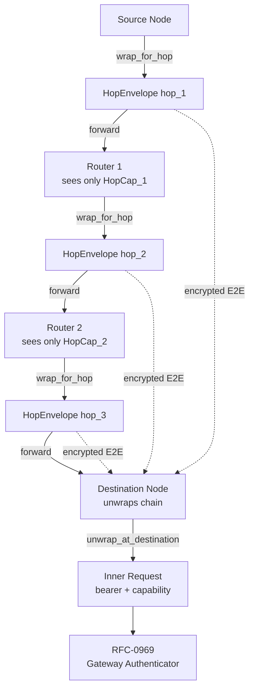
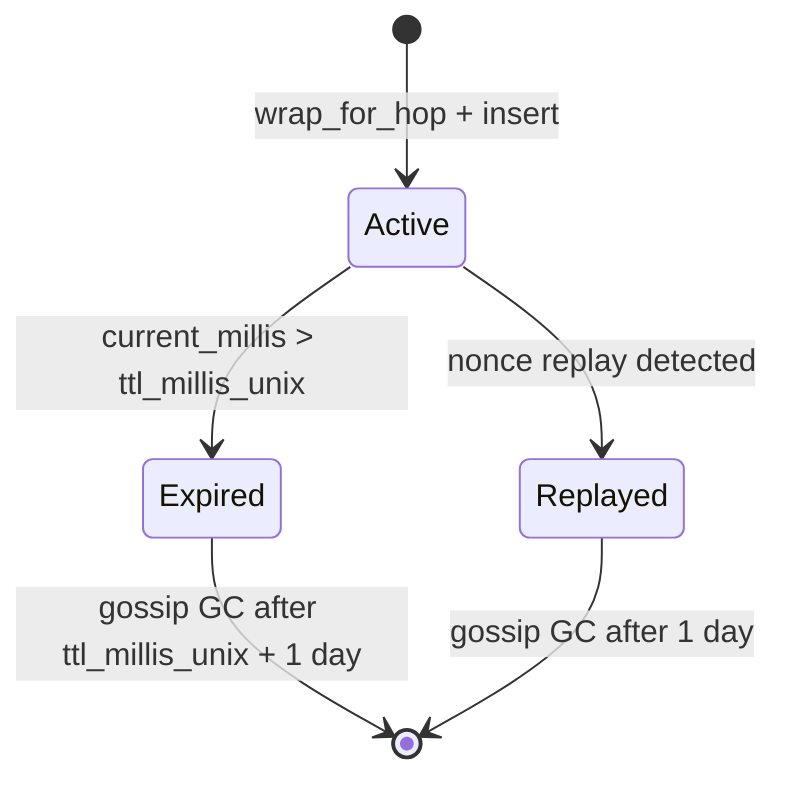

# RFC-0970 (Networking): Forwarding-Hop Authorization Envelope

## Status

Accepted (promoted 2026-08-02)

## Authors

- Author: @mmacedoeu
- Contributor: @mmacedoeu

## Maintainers

- Maintainer: @mmacedoeu
- Maintainer: @mmacedoeu

## Summary

Closes G2 ("forwarding-hop auth is undocumented") by specifying that intermediate router nodes in the RFC-0870 forwarding mesh are **NOT trusted** with the long-lived bearer or capability token. Each hop wraps the inner request in a per-hop channel-wrapped, scope-narrowed capability bound to the next hop's DID. The destination node unwraps the chain, sees the original bearer/capability, and runs its own verification (RFC-0969).

Key elements:

1. **Hops-as-untrusted** — intermediate routers MUST NOT inspect the inner auth header. They forward an opaque envelope.
2. **Per-hop channel** — each hop wraps the inner request in a per-hop capability (`HopCapability`) with: `TTL ≤ next_hop_RTT` (millisecond resolution, NOT seconds), `scope ≤ {model bucket, rate-limit bucket}`, `audience = next_hop_did`. Bound to the next hop via BLAKE3 keyed-hash (RFC-0853).
3. **Destination unwrap** — the destination node accumulates the chain, peels each hop's wrap, and at the bottom sees the original bearer/capability. Verification runs once at the destination.
4. **`ForwardRequestPayload` extension** — extends RFC-0870's authoritative `ForwardRequestPayload` (NOT replaces). The new field `hop_envelope: Option<HopEnvelope>` is added; all RFC-0870 fields preserved (`request_id, network_id, context, payload, ttl, origin_node, hop_count, created_at`).
5. **Cross-hop verifiability** — per-hop channel binding via RFC-0853 §Overlay Cryptography (BLAKE3 keyed-hash over `hop_envelope || next_hop_did`). Each hop signs its own wrap; the chain is verifiable end-to-end.
6. **Inner-request E2E encryption** — the inner request (carrying the long-lived auth header) is E2E encrypted to the **destination's channel key**, NOT per-hop. Intermediate hops see only the `HopCapability` addressed to them; the inner request is opaque to them.
7. **`cap_root_hash` single source** — `HopCapability.cap_root_hash` is set AFTER `CapabilityToken::mint` completes (`cap_token.cap_root_hash()`). The prior draft's synthetic `compute_cap_root_hash(inner, next_hop_did, ttl_ms)` is REMOVED.
8. **`holder_did` ≠ `audience_did`** — the holder of the `HopCapability` is the **wrapping node** (the issuer), not the next hop. The next hop is the audience.
9. **Deterministic nonce** — `nonce = HKDF-BLAKE3(channel_session_key, "rfc-0970/nonce/v1", channel_id || sender_did || counter || audience_did || node_epoch)`, per RFC-0853 §11. Replaces `random_32_bytes()`. (R13-N6 fix: prior summary omitted `node_epoch`; without it, nonces collide across node restarts and replay-defense is broken.)
10. **`verify_chain_hash` real implementation** — accumulates `(HopCapability, chain_hash, hop_index)`, reverses the chain, compares computed vs stored hash at each step.
11. **Debug redaction** — `HopEnvelope`, `HopCapability`, `HopScope` use manual `impl Debug` with redaction.
12. **Pure forwarder exception** — a node that only forwards (no mint, no verify) does NOT instantiate `GatewayAuthenticator`. It uses a `pure_forward` operation that treats `HopEnvelope` as opaque and preserves signatures/hashes.

## Why Needed

RFC-0870 (Distributed Quota Router Network) defines `ForwardRequestPayload` envelopes with TTL≤3 hops. Today's envelope is opaque. The bearer or capability token inside is visible to every intermediate router.

If the inner auth header is verified only at the destination, intermediate routers can replay the envelope. If verified at every hop, every router needs the full verification machinery.

The design is forced by RFC-0853 §Overlay Cryptography: hop-by-hop channel binding is the only mechanism that prevents intermediate routers from reading the inner content. The capability token substrate (RFC-0957) is reused for the per-hop envelope, avoiding a new crypto primitive.

## Scope

### In Scope

- `HopEnvelope` wrapper data structure.
- `HopCapability` data structure (per-hop narrow-scope capability).
- `wrap_for_hop()` algorithm on the source node.
- `unwrap_at_destination()` algorithm on the destination node.
- `verify_chain_hash()` real implementation.
- `ForwardRequestPayload` extension (RFC-0870 §Wire Format).
- Hop chain hash + per-hop signature.
- TTL in milliseconds (NOT seconds).
- Test vectors for wrap, unwrap, replay, intermediate-router compromise, pure forwarder.

### Out of Scope

- **Inner auth header semantics** — RFC-0903 + RFC-0957 authoritative.
- **Inner request routing** — RFC-0870 authoritative.
- **Capability token mint** — RFC-0957 + RFC-0957-A1 authoritative.
- **Catalog storage** — RFC-0957-A1 authoritative.
- **Dual-pipeline routing** — RFC-0969 authoritative.
- **Role consolidation** — RFC-0971 authoritative.
- **Asking chain** — RFC-0959 + RFC-0959-A1 authoritative.

## Dependencies

**Requires:**

- RFC-0853 — BLAKE3 keyed-hash for per-hop channel binding; HKDF-BLAKE3 for nonce derivation
- RFC-0870 — `ForwardRequestPayload` extended
- RFC-0957 — `HopCapability` reuses the capability substrate
- RFC-0957-A1 — `HopCapability` is registered in the HolderRegistry per hop; mint signature 4-arg persistence-free (R6-C3 fix, R9-N3 fix); caller writes HolderRecord via `TransactionExt::insert_holder_record`
- RFC-0009 — node identity

**Optional:**

- RFC-0958 — ZK subclass; subclass-agnostic `HopCapability`

**Not Requires:**

- RFC-0903 — coexistence only
- RFC-0909 — coexistence only
- RFC-0969 — orthogonal; this RFC's intermediate routers are untrusted and do not run `GatewayAuthenticator`

> **Dependency Validation Rules:**
> 1. DAG: `0970 ← {0853, 0870, 0957, 0957-A1, 0009, 0009-B1, 0958*}` — acyclic (R12-N17 fix: added `0009-B1`; §Algorithms:wrap_for_hop references RFC-0009-B1 WalletCrypto trait)
> 2. RFC-0853 BLAKE3 primitive substrate prerequisite
> 3. RFC-0957-A1 HolderRegistry substrate prerequisite
> 4. RFC-0870 + RFC-0957 + RFC-0009 + RFC-0009-B1 prerequisites satisfied (R12-N17 fix: RFC-0009-B1 added)

## Design Goals

| Goal | Target | Metric |
|------|--------|--------|
| **G1: Intermediate router isolation** | 0 bytes of long-lived bearer/capability visible at intermediate routers | Test: TV6 |
| **G2: Per-hop wrap latency** | ≤ 2ms p99 | Bench |
| **G3: Destination unwrap latency** | ≤ 5ms p99 over a 3-hop chain | Bench |
| **G4: Chain hash integrity** | Tampering with any hop's wrap invalidates the chain hash | Test: TV8 |
| **G5: TTL enforcement** | HopCapability with expired TTL is rejected | Test: TV4 |
| **G6: Replay defense** | Replaying a HopEnvelope is detected via nonce | Test: TV3 |
| **G7: Debug redaction** | Zero credential material in Debug | Test: TV9 |
| **G8: Pure forwarder** | A pure forwarder does not run GatewayAuthenticator | Test: TV10 |

## Motivation

### Problem Statement

Today's RFC-0870 forwarding mesh forwards envelopes with TTL≤3 hops. The inner request is passed through unchanged. This means the bearer or capability token inside is visible at every intermediate router.

Threat model:

- **Compromised intermediate router** — the operator extracts the bearer/capability token from the envelope.
- **Memory leak / log leak** — any logging at intermediate routers that captures the inner auth header is a credential leak.
- **Replay attack** — an attacker who captures the envelope can replay it.

The dual-mode workflow (RFC-0969) does not solve this because it specifies gateway-side auth, not forwarding auth.

### Desired State

A source node wraps the inner request in a `HopEnvelope` before forwarding. The inner request is E2E encrypted to the destination's channel key (RFC-0853). Each hop adds an outer wrapper addressed to the next hop:

```
Inner: { Authorization: Bearer <sk-...>, X-Capability-Token: <macaroon>, ... }
       (encrypted to destination's channel key)

Wrap (hop 1):
  HopEnvelope {
    chain_hash: H0,
    hop_capability: HopCapability { holder_did: <wrapping node>, audience_did: next_hop_1_did, scope: {model_bucket: HopModelBucket::TextLarge, rate_bucket: HopRateBucket::Medium, can_rewrap: true}, ttl_millis: 200, ... },
    inner_content: <encrypted inner request E2E to destination>,
    hop_signature: <router_signature>,
    nonce: <HKDF-BLAKE3 derived>,
  }
```

Intermediate routers see only the `HopCapability` addressed to them, not the inner request. The inner request is encrypted at the channel layer (RFC-0853) so intermediate routers cannot read it.

### Use Case Link

`docs/use-cases/dual-mode-authorization-workflow.md`

## Specification

### System Architecture



### Data Structures

#### `InnerRequest`

```rust
/// Per RFC-0970 §Data Structures.
/// The original request as seen by the destination (after E2E unwrap).
pub struct InnerRequest {
    /// Bearer header value (RFC-0903).
    pub auth_bearer: Option<String>,

    /// Capability token wire (RFC-0957).
    pub x_capability_token: Option<String>,

    /// Original HTTP body (inference request).
    pub body: Vec<u8>,

    /// Request metadata.
    pub metadata: RequestMetadata,
}
```

#### `HopEnvelope`

```rust
/// Per RFC-0970 §Data Structures.
/// Canonical_ser-friendly view of InnerRequest used by `verify_chain_hash`.
/// `request_id` is excluded because it is not hash-stable (each new forward
/// request gets a fresh ID). All other fields are stable across implementations.
/// R16-N3 fix: this type was referenced but never defined.
pub struct InnerRequestRef<'a> {
    pub auth_bearer: &'a Option<String>,
    pub x_capability_token: &'a Option<String>,
    pub body: &'a [u8],
    pub metadata: &'a RequestMetadata,
}

impl<'a> From<&'a InnerRequest> for InnerRequestRef<'a> {
    fn from(ir: &'a InnerRequest) -> Self {
        Self {
            auth_bearer: &ir.auth_bearer,
            x_capability_token: &ir.x_capability_token,
            body: &ir.body,
            metadata: &ir.metadata,
        }
    }
}

/// Per RFC-0970 §Data Structures.
/// Outer wrapper for one hop in the forwarding chain.
pub struct HopEnvelope {
    /// 32-byte BLAKE3 chain hash: H_n = BLAKE3(H_{n-1} || canonical_ser(hop_capability_n)).
    /// H_0 = BLAKE3(canonical_ser(InnerRequestRef)).
    pub chain_hash: [u8; 32],

    /// Per-hop capability. Round 3 R2 C9 fix: the envelope ALSO embeds the
    /// minted capability wire (the RFC-0957 3-segment string) so the
    /// destination can verify the macaroon, holder signature, audience
    /// caveat, scope caveat, and rewrap permission through RFC-0957.
    /// The metadata `HopCapability` struct is a *projection* of the
    /// verified token; the wire is the source of truth.
    pub hop_capability: HopCapability,

    /// The full minted capability wire (RFC-0957 3-segment string). Verified
    /// at the destination via the canonical RFC-0957 verify path. Round 3
    /// R2 C9 fix: prior drafts discarded this; downstream verifiers could
    /// not check the macaroon / holder_sig / caveats.
    pub capability_wire: String,

    /// Inner content: E2E-encrypted to the destination's channel key
    /// (NOT per-hop). For hop_n, this is the inner request (hop 1) or
    /// the prior HopEnvelope wrapped in the destination's channel key
    /// (hops 2..N).
    pub inner_content: Vec<u8>,

    /// Ed25519 signature by the wrapping node over
    /// (chain_hash || canonical_ser(hop_capability) || BLAKE3(capability_wire) || BLAKE3(inner_content) || nonce).
    /// The signature binds BOTH the metadata projection AND the wire bytes,
    /// preventing swap attacks.
    pub hop_signature: [u8; 64],

    /// 32-byte nonce: HKDF-BLAKE3(channel_session_key, "rfc-0970/nonce/v1",
    /// channel_id || sender_did || counter || audience_did || node_epoch).
    /// `node_epoch` (Round 3 R2 M13 fix) is a per-node monotonic counter
    /// persisted across restart; prevents cross-session replay.
    pub nonce: [u8; 32],
}

// Manual Debug redaction.
impl std::fmt::Debug for HopEnvelope {
    fn fmt(&self, f: &mut std::fmt::Formatter<'_>) -> std::fmt::Result {
        f.debug_struct("HopEnvelope")
            .field("chain_hash", &"<redacted 32 bytes>")
            .field("hop_capability", &self.hop_capability)
            .field("capability_wire", &"<redacted>")
            .field("inner_content", &format_args!("<redacted {} bytes>", self.inner_content.len()))
            .field("hop_signature", &"<redacted 64 bytes>")
            .field("nonce", &"<redacted 32 bytes>")
            .finish()
    }
}
```

#### `HopCapability`

```rust
/// Per RFC-0970 §Data Structures.
/// Per-hop narrow-scope capability. Reuses RFC-0957 substrate.
pub struct HopCapability {
    /// 32-byte BLAKE3 root hash (PK for HolderRegistry).
    /// Set from `cap_token.cap_root_hash()` after mint completes.
    pub cap_root_hash: [u8; 32],

    /// Holder DID: the wrapping node that issued this HopCapability
    /// (NOT the next hop; the next hop is the audience).
    pub holder_did: String,

    /// Audience DID: the next hop's node DID.
    pub audience_did: String,

    /// Holder Ed25519 public key (32 bytes).
    pub holder_pub: [u8; 32],

    /// Scope: model bucket + rate-limit bucket.
    pub scope: HopScope,

    /// Unix timestamp of expiry in MILLISECONDS (NOT seconds).
    pub ttl_millis_unix: u64,

    /// Unix timestamp of mint in MILLISECONDS.
    pub mint_at_millis_unix: u64,

    /// Capability class tag (RFC-0957-A1 HolderKind::HopCapability = 0x03).
    pub class_tag: u8,
}

impl std::fmt::Debug for HopCapability {
    fn fmt(&self, f: &mut std::fmt::Formatter<'_>) -> std::fmt::Result {
        f.debug_struct("HopCapability")
            .field("cap_root_hash", &"<redacted 32 bytes>")
            .field("holder_did", &self.holder_did)
            .field("audience_did", &self.audience_did)
            .field("holder_pub", &"<redacted 32 bytes>")
            .field("scope", &self.scope)
            .field("ttl_millis_unix", &self.ttl_millis_unix)
            .field("mint_at_millis_unix", &self.mint_at_millis_unix)
            .field("class_tag", &self.class_tag)
            .finish()
    }
}

#[derive(Debug, Clone, PartialEq, Eq)]
pub struct HopScope {
    /// Model bucket (NOT exact model name; quantized to a fixed set).
    /// E.g., "text-large", "text-small", "embed".
    pub model_bucket: HopModelBucket,

    /// Rate-limit bucket (NOT exact rps; quantized).
    /// E.g., LowRate, MediumRate, HighRate.
    pub rate_bucket: HopRateBucket,

    /// Whether this hop can re-wrap (true) or must forward as-is (false).
    pub can_rewrap: bool,
}

#[derive(Debug, Copy, Clone, PartialEq, Eq)]
pub enum HopModelBucket { TextLarge, TextSmall, Embed, Other }

#[derive(Debug, Copy, Clone, PartialEq, Eq)]
pub enum HopRateBucket { Low, Medium, High }
```

#### `ForwardRequestPayload` Extension

```rust
/// Per RFC-0970 §Data Structures. EXTENDS RFC-0870 §Wire Format.
pub struct ForwardRequestPayload {
    // ALL existing fields from RFC-0870 are preserved.
    pub request_id: [u8; 32],
    pub network_id: [u8; 32],         // Round 3 R2 C4 fix: kept as [u8; 32]; treated as raw bytes
    pub context: Vec<u8>,              // Round 3 R2 C4 fix: re-interpreted as opaque bytes
    pub payload: Vec<u8>,              // opaque inner request bytes
    pub ttl: u8,
    pub origin_node: [u8; 32],         // Round 3 R2 C4 fix: kept as [u8; 32]; treated as raw bytes
    pub hop_count: u8,
    pub created_at: u64,

    // NEW (RFC-0970).
    pub hop_envelope: Option<HopEnvelope>,
}
```

The `hop_envelope` field is `Some` for new forward requests; `None` for legacy forward requests that use the opaque `payload` field directly. The destination handles both via a runtime check.

> **Type-drift note (Round 3 R2 C4):** RFC-0870 declares `network_id: NetworkId` and `origin_node: RouterNodeId` (custom newtypes) and `context: RequestContext` (a struct). RFC-0970 keeps the field NAMES but re-interprets them as raw byte types. The wire bytes are unchanged (the newtypes serialize to 32 bytes / opaque bytes / opaque struct respectively), but readers MUST adapt to the new type aliases. Cross-version decoding is possible because the bytes match; type-level round-trip requires the newtype definitions from RFC-0870.

### Algorithms

#### `wrap_for_hop()`

```rust
/// Per RFC-0970 §Algorithms.
pub fn wrap_for_hop(
    inner: &InnerContent,         // InnerRequest for hop 1; HopEnvelope for hop n+1
    next_hop_did: &str,
    prev_chain_hash: &[u8; 32],
    ttl_millis: u64,
    wallet: &dyn WalletCrypto,    // R31-N3 fix: intentionally `&dyn` (NOT Arc). wrap_for_hop
                                  // does NOT capture wallet/clock in a 'static closure
                                  // (unlike unwrap_at_destination which builds a
                                  // root_secret_lookup closure per R29-N6). Asymmetry
                                  // between wrap_for_hop and unwrap_at_destination is
                                  // documented and load-bearing.
    clock: &dyn Clock,             // R13-N7 fix
    db: Arc<stoolap::Database>,    // R22-N5 fix: Arc for 'static capture by std::thread::spawn (R21-N1 fire-and-forget)
) -> Result<HopEnvelope, WrapError>
{
    // Step 1: Begin a single transaction.
    let mut txn = db.begin()?;

    // R18-N8 fix: reject TTL=0; an immediately-expired HopCapability is useless
    // and pollutes the registry with records the destination will reject.
    // DEFERRED (R19-N8): TTL decrement style — pure_forward uses saturating_sub
    // (consistent with legacy path; R20-N4 fix), but the guard style across
    // sibling paths should be unified in a future round.
    if ttl_millis == 0 {
        return Err(WrapError::InvalidHopParameter("ttl_millis must be > 0".into()));
    }

    // R12-N5 fix: bind the timestamp ONCE before the mint so the caveat expiry
    // and the HopCapability.ttl_millis_unix (set below) share the same value;
    // otherwise a clock tick between the two compute_unix_millis() calls
    // produces a caveat/HopCapability drift.
    let now = clock.now_millis_unix();  // R13-N7 fix: was compute_unix_millis() (free fn); now matches the trait used by unwrap_at_destination so tests can inject a deterministic clock mock

    // R32-N9 fix: hoist wallet.identity_key() into a single binding reused 5x below
    // (mint arg + cap_token.issuer + cap.holder_did + cap.holder_pub + nonce input).
    // Each wallet.identity_key() call may hit the wallet backend; one binding avoids
    // 4 redundant invocations.
    let identity_key = wallet.identity_key()?;

    // Step 2: Mint the HopCapability (RFC-0957). Persistence-free (Round 3 R2 C2).
    // `holder_did` is the wrapping node; `audience_did` is the next hop.
    // The mint returns the CapabilityToken; the caller writes the HolderRecord.
    let cap_token = CapabilityToken::mint(
        &wallet.hop_root_secret()?,
        &identity_key,
        identity_key.did(),                     // HOLDER = wrapping node
        vec![
            Caveat::Audience(next_hop_did.to_string()),
            Caveat::BeforeMillis(now + ttl_millis),   // R6-C2 + R8-N15 + R12-N5 fix: bound to `now`, same value as HopCapability.ttl_millis_unix below.
            Caveat::Scope(/* HopScope encoded */),
        ],
    )?;

    // Step 3: Serialize the minted capability wire (Round 3 R2 C9 fix).
    let capability_wire = cap_token.serialize_wire()?;

    // Step 4: Build the HopCapability projection (metadata only).
    let cap = HopCapability {  // R12-N5 fix: `let now` is bound above (Step 1) and shared by Caveat::BeforeMillis + ttl_millis_unix; the R11-N16 duplicate binding at this site was removed.
        cap_root_hash: BLAKE3(&cap_token.root_id),    // R5 C1 fix: unified field path; 0959-A1 uses cap_token.root_id; see 0957-A1 §compute_cap_root_hash
        holder_did: identity_key.did(),
        audience_did: next_hop_did.to_string(),
        holder_pub: identity_key.public_key_bytes(),
        scope: HopScope { /* from inner */ },
        ttl_millis_unix: now + ttl_millis,
        mint_at_millis_unix: now,
        class_tag: HolderKind::HopCapability as u8,
    };

    // Step 5: Build HolderRecord for this hop. SYNCHRONOUS REPLICATION (Round 3
    // R2 C10 fix: hop TTL is ≤ 200ms, registry gossip convergence is ≤ 30s;
    // the hop cannot wait for gossip). The hop_record is REPLICATED
    // synchronously to the destination's peer set before wrap completes.
    let hop_record = HolderRecord::from_hop_capability(
        &cap_token,
        &cap.holder_did,
        &cap.holder_pub,
        next_hop_did,
        cap.ttl_millis_unix,
    );
    txn.insert_holder_record(&hop_record)?;
    // R17-N5 + R19-N3 + R21-N1 + R25-N1 fix: `wrap_for_hop` is a sync fn; tokio::time::timeout
    // requires async context. Replaced with fire-and-forget thread + Arc::clone to
    // satisfy the borrow checker (txn still holds a borrow of `db` until commit at L510).
                                              // R34-R41 fix history (collapsed): the 0970 commit block consists of L509 (`// Step 11: Commit transaction.` comment) and L510 (`txn.commit()?;` statement). The R35-N8..R40-N1 incremental fixes kept drifting because each fix added a new comment line that pushed subsequent lines down.
                                              // CANONICAL CONVENTION (R42): the commit anchor names the `txn.commit()?;` statement line (L510), NOT the preceding `// Step N:` comment (L509). The comment/statement split is FINALLY resolved after 8 rounds.
    // R25-N4 fix: the fire-and-forget defeats the "synchronous replication" guarantee;
    // documented as DEFERRED — wrap_for_hop v1.0 is best-effort; eventual gossip via
    // RFC-0862 §HolderRegistry gossip catches up. Future versions may add a synchronous
    // option behind a feature flag.
    let db_arc = Arc::clone(&db);
    let _sync_handle = std::thread::spawn(move || {
        let _ = db_arc.sync_replicate_to_destination_peers(&hop_record, /* sync_ack_required */ true);
    });
    // R54-N4 fix: removed `let _ = _sync_handle;` — the underscore-prefixed binding
    // already suppresses the unused-must-use lint; the explicit drop is a no-op.

    // Step 6: Compute chain hash.
    let new_chain_hash = BLAKE3(prev_chain_hash, &canonical_ser(&cap)?);

    // Step 7: E2E-encrypt inner content to destination's channel key (RFC-0853).
    let inner_content = encrypt_e2e_to_destination(inner, wallet)?;

    // Step 8: Derive deterministic nonce (Round 3 R2 M13 fix: include node_epoch).
    let counter = wallet.next_hop_counter()?;
    let node_epoch = wallet.node_epoch()?;
    let nonce = HKDF_BLAKE3(
        wallet.channel_session_key()?,
        b"rfc-0970/nonce/v1",
        &[
            wallet.channel_id().as_bytes(),
            identity_key.did().as_bytes(),
            &counter.to_be_bytes(),
            next_hop_did.as_bytes(),
            &node_epoch.to_be_bytes(),     // persists across restart
        ].concat(),
    )?.get(..32).ok_or(WrapError::InvalidNonceLength)?.try_into().map_err(|_| WrapError::InvalidNonceLength)?; // R7-N17 fix: bound the slice with explicit length check; panic-on-short-output replaced with typed error.
                                              // R29-N8 fix: HKDF_BLAKE3 returns `[u8; 32]` per
                                              // `crates/cipherocto-encoding/src/hkdf.rs`; the
                                              // `.get(..32)` is therefore always `Some`. The
                                              // chain is kept for defense-in-depth in case
                                              // HKDF_BLAKE3 is ever changed to return `&[u8]`
                                              // of variable length.

    // Step 9: Sign over (chain_hash, cap, BLAKE3(capability_wire), BLAKE3(inner_content), nonce).
    // The signature binds BOTH the metadata AND the wire (Round 3 R2 C9 fix).
    let signed_bytes = canonical_ser(&(
        new_chain_hash,
        &cap,
        BLAKE3(capability_wire.as_bytes()),
        BLAKE3(&inner_content),
        nonce,
    ))?;
    let hop_signature = wallet.sign(&signed_bytes)?;

    // Step 10: Build envelope (with the full capability wire embedded).
    let envelope = HopEnvelope {
        chain_hash: new_chain_hash,
        hop_capability: cap,
        capability_wire,
        inner_content,
        hop_signature,
        nonce,
    };

    // Step 11: Commit transaction.
    txn.commit()?;

    Ok(envelope)
}
```

#### `unwrap_at_destination()`

```rust
/// Per RFC-0970 §Algorithms.
pub const MAX_HOP_DEPTH: u8 = 3;     // R11-N10 fix: prior value 8 contradicted RFC-0870's TTL ≤ 3 hops; now matches RFC-0870

pub fn unwrap_at_destination(
    envelope: HopEnvelope,
    wallet: Arc<dyn WalletCrypto>,             // R29-N6 fix: Arc, not `&dyn`, because the
                                               // root_secret_lookup closure below stores
                                               // the wallet in an Arc<dyn Fn> that is
                                               // 'static (per VerifyContext.root_secret_lookup
                                               // field type at RFC-0957-A1 L546). A
                                               // non-'static reference cannot live in a
                                               // 'static trait object.
    registry: Arc<dyn HolderRegistry>,           // R20-N2 fix: Arc for cheap clone into VerifyContext (matches R18-N1 wrapper)
    clock: Arc<dyn Clock>,                       // R20-N2 fix: Arc for cheap clone into VerifyContext
    nonce_store: Arc<dyn DestinationNonceStore>,  // R30-N6 fix: Arc, not `&dyn`, for consistency
                                                  // R42-N4 fix: DEFERRED (R42-N4) — `DestinationNonceStore` trait is a phantom type;
                                                  // no formal declaration in any of the 6 dual-mode RFCs. The trait is named
                                                  // as RFC-0853-C2 in the Upstream Dependencies block at L1187. Mission
                                                  // `missions/open/0970-b-forward-integration.md` must add a minimal
                                                  // trait declaration before this RFC is Accepted.
                                                  // with wallet/registry/clock Arc-wrapping
                                                  // (R29-N6 + R20-N2 pattern). Enables cheap
                                                  // clone into the loop body.
    channel_providers: ChannelProviderSet,     // R17-N2 + R20-N1 fix: own the set; bind into root_secret_lookup closure
) -> Result<InnerRequest, UnwrapError>
{
    let mut current = envelope;
    let mut envelopes: Vec<HopEnvelope> = Vec::new();
    envelopes.try_reserve(MAX_HOP_DEPTH as usize)
        .map_err(|_| UnwrapError::AllocationFailed)?;

    // Step 1: Peel the chain, collecting (envelope, hop_index) tuples.
    loop {
        // Round 3 R2 C7 fix: enforce max hop depth.
        if envelopes.len() >= MAX_HOP_DEPTH as usize {
            return Err(UnwrapError::MaxHopDepthExceeded { max: MAX_HOP_DEPTH });  // R26-N2 fix: construct with required `max: u8` field
        }

        // Step 1a: Verify the HopCapability against the registry (active check).
        let record = registry.lookup_active(&current.hop_capability.cap_root_hash, clock)?
            .ok_or(UnwrapError::UnknownHopCapability { cap_root_hash: current.hop_capability.cap_root_hash })?;

        // Step 1b: Verify audience binding.
        if record.audience_did != current.hop_capability.audience_did {
            return Err(UnwrapError::AudienceMismatch { expected: record.audience_did, actual: current.hop_capability.audience_did.clone() });
        }

        // Step 1c: Verify TTL (millis).
        if clock.now_millis_unix() > current.hop_capability.ttl_millis_unix { // R12-N14 fix: prior `clock.now_millis()` did not match the trait (which defines `now_millis_unix()`); renamed.
            return Err(UnwrapError::Expired { ttl_millis_unix: current.hop_capability.ttl_millis_unix });
        }

        // Step 1d (Round 3 R2 C9 fix): verify the EMBEDDED capability wire
        // through the canonical RFC-0957 verify path. The metadata projection
        // is a derived view; the wire is the source of truth.
        let verified_cap = deserialize_wire(
            &current.capability_wire,
            &record.holder_did,
            &record.holder_pub,
        )?;
        let verify_ctx = VerifyContext {
            discharges: DischargeSet::default(),
            channel_providers: channel_providers.clone(),  // R16-N10 fix
            clock: clock.clone(),  // R20-N2 fix: Arc -> Arc
            // R20-N1 fix: root_secret_lookup bound from wallet; Arc wrap for cheap clone
            // R21-N3 fix: prior closure passed `wallet.root_secret_for_ask(ask_id)` but
            // RFC-0957 §verify calls it with `macaroon.root_secret_hash` (a BLAKE3 hash
            // of the wrapping node's root_secret), not an ask_id. Wrap a closure that
            // queries the wrapping node's root_secret for the macaroon's root_secret_hash.
            // Requires cross-node root-secret gossip per RFC-0853-C3 (see §Upstream Dependencies).
            root_secret_lookup: Arc::new({
                let wallet = Arc::clone(&wallet);  // R29-N6 fix: clone the Arc inside
                                                    // the closure so the closure can be
                                                    // 'static (matches R20-N2 Arc-wrapping
                                                    // for clock/registry above).
                move |root_secret_hash: &[u8; 32]| {
                    wallet.root_secret_for_root_secret_hash(root_secret_hash).ok()  // R42-N3 fix: DEFERRED (R42-N3) — `root_secret_for_root_secret_hash` is a
                                                                                            // phantom method on `Arc<dyn WalletCrypto>`. The R21-N3 prior fix
                                                                                            // renamed `root_secret_for_ask` to `root_secret_for_root_secret_hash`
                                                                                            // (per RFC-0853-C3 amendment requirement), but the trait method
                                                                                            // is not declared in any of the 6 dual-mode RFCs. Mission
                                                                                            // `missions/open/0970-a-hop-envelope.md` must add a minimal
                                                                                            // `pub fn root_secret_for_root_secret_hash(&self, hash: &[u8;32]) -> Option<[u8;32]>`
                                                                                            // to the WalletCrypto trait before this RFC is Accepted.
                }
            }),
            holder_registry: registry.clone(),  // R20-N2 fix: Arc -> Arc
        };
        verify(&verified_cap, &verify_ctx)?;

        // Step 1e: Verify the metadata projection matches the verified wire.
        // R11-N2 fix: prior text called `audience_did_for_check()` which is a
        // phantom method (HopCapability exposes `audience_did: String` directly,
        // and `ask_binding()` returns `Option<[u8;32]>` so the types don't match).
        // Compare audience_did directly (both String).
        let cap_audience = verified_cap.caveats().iter().find_map(|c| match c {
            Caveat::Audience(did) => Some(did.clone()),
            _ => None,
        }).ok_or(UnwrapError::AudienceMissing)?;
        if cap_audience != current.hop_capability.audience_did {
            return Err(UnwrapError::AudienceMismatch { /* … */ });
        }

        // Step 1f: Verify signature.
        let signed_bytes = canonical_ser(&(
            current.chain_hash,
            &current.hop_capability,
            BLAKE3(current.capability_wire.as_bytes()),
            BLAKE3(&current.inner_content),
            current.nonce,
        ))?;
        if !verify_signature(&current.hop_signature, &signed_bytes, &record.holder_pub) {
            return Err(UnwrapError::InvalidSignature);
        }

        // Step 1g: Verify nonce via DESTINATION-WIDE nonce store (Round 3 R2 M17
        // fix: per-channel store is bypassable by new sessions). Keyed by
        // (cap_root_hash, audience_did, nonce); persistent across restart.  // R23-N7 fix: tightened from 2-tuple to 3-tuple to defeat cross-audience replay (malicious wrapping node reusing cap_root_hash across audience nodes).
        // R12-N15 + R12-N16 fix: atomic check-and-record (no TOCTOU); record
        // only AFTER all crypto checks succeed at step 1h+.
        if !nonce_store.check_and_record_nonce(&current.hop_capability.cap_root_hash, &current.hop_capability.audience_did, &current.nonce)? {  // R25-N2 fix: 3-arg call matches the R23-N7 3-tuple key (cap_root_hash, audience_did, nonce); the 2-arg form previously passed would leave cross-audience replay open.
                                              // R30-N6 fix: nonce_store is now Arc<dyn ...>; .check_and_record_nonce called via Arc auto-deref.
            return Err(UnwrapError::ReplayDetected { nonce: current.nonce });
        }

        envelopes.push(current.clone());

        // Step 1h: E2E-decrypt inner content.
        let inner = decrypt_e2e_from_destination(&current.inner_content, wallet)?;

        // Step 1i: Try to parse as InnerRequest (base case) or HopEnvelope (recursive).
        match InnerRequest::try_parse(&inner) {
            Ok(inner_req) => {
                // Verify chain hash continuity (free function; not on HolderRegistry).
                verify_chain_hash(&envelopes, &inner_req)?;
                return Ok(inner_req);
            }
            Err(_) => {
                current = HopEnvelope::deserialize(&inner)?;
            }
        }
    }
}
```

#### `verify_chain_hash()` Real Implementation

```rust
/// Per RFC-0970 §Algorithms. Free function (Round 3 R2 M22 fix: not on
/// the HolderRegistry trait; this was the load-bearing 0957-A1 ↔ 0970
/// dependency cycle).
pub fn verify_chain_hash(
    envelopes: &[HopEnvelope],
    inner: &InnerRequest,
) -> Result<(), UnwrapError> {  // R45-N1 fix: was `Result<(), ChainHashError>` — ChainHashError was a
                                // phantom type. Consolidated to UnwrapError (which already has
                                // `ChainHashMismatch { hop_index: u8 }` at L903). // R58-N5 fix: was L902 (R57 anchor shifted +1 by R58 Debug impl additions in 0959 cascading into 0970 cite refresh). R57-N6 fix: was L897 (shifted +5 by R55 DEFERRED marker expansion in 0959 — and matched +5 here since the R50-actual block had anchored to L897).
                                // The From impl
                                // is automatic since ChainHashError no longer exists; callers
                                // use the `?` operator directly.
    // R46-N2 fix: defensive guard against `u8` truncation. MAX_HOP_DEPTH is 3 per RFC-0870;
    // envelopes.len() is bounded by MaxHopDepth check at L554 (unwrap_at_destination
    // return Err line; function defined at L522). R49-N10 fix: refreshed L535 → L554
    // (L535 is a `clock: Arc<dyn Clock>` parameter, not the MaxHopDepth check).
    // This guard is documentation + belt-and-suspenders for the cast below.
    // R47-N2 fix: use MAX_HOP_DEPTH (canonical bound) instead of `u8::MAX` (defensive only);
    // the conceptually reachable max is the RFC-0870 hop limit, not the type bound.
    if envelopes.len() > MAX_HOP_DEPTH as usize {
        return Err(UnwrapError::MaxHopDepthExceeded { max: MAX_HOP_DEPTH });
    }
    // H_0 = BLAKE3(canonical_ser(InnerRequest))
    let mut prev = BLAKE3(&canonical_ser(&InnerRequestRef::from(inner))?);

    // Walk from hop 1 (innermost) to hop N (outermost).
    // The envelopes vector is in peel order (outermost first); reverse it.
    for (i, env) in envelopes.iter().rev().enumerate() {
        let expected = BLAKE3(prev, &canonical_ser(&env.hop_capability)?);
        if expected != env.chain_hash {
            return Err(UnwrapError::ChainHashMismatch { hop_index: (envelopes.len() - 1 - i) as u8 });  // R15-N22 fix: report ORIGINAL hop index, not the reversed-iteration index
                                                                                                       // R45-N1 fix: was ChainHashError::ChainHashMismatch; consolidated to UnwrapError.
        }  // R53-N2 fix: close the `if expected != env.chain_hash` block. Prior rounds missed the
           // closing brace, leaving the for-loop body unbalanced.
        prev = expected;
    }

    Ok(())
}
```

#### `pure_forward()` for Pure Forwarders

```rust
/// Per RFC-0970 §Algorithms. For nodes that only forward (no mint, no verify).
/// A pure forwarder does NOT instantiate `GatewayAuthenticator`.
/// It treats `HopEnvelope` as opaque and preserves signatures/hashes.
/// Round 3 R2 C7 fix: enforce max hop depth.
/// Round 3 R2 C19 fix: enforce RFC-0870 TTL semantics (reject ttl == 0,
/// decrement ttl on every forward).
pub fn pure_forward(
    payload: ForwardRequestPayload,
    next_hop: &str,
) -> Result<ForwardRequestPayload, ForwardError> {
    if payload.hop_envelope.is_none() {
        // R11-N8 fix: RFC-0870 legacy forwarders use the `payload` field
        // directly without `hop_envelope`. Mixed-version mesh requires this
        // branch to preserve the legacy contract instead of rejecting.
        return pure_forward_legacy_payload(payload, next_hop);
    }
    if payload.ttl == 0 {
        return Err(ForwardError::TtlExpired);
    }
    if payload.hop_count >= MAX_HOP_DEPTH {
        return Err(ForwardError::MaxHopDepthExceeded { max: MAX_HOP_DEPTH });
    }
    Ok(ForwardRequestPayload {
        hop_count: payload.hop_count + 1,
        ttl: payload.ttl.saturating_sub(1),          // R20-N4 fix: match pure_forward_legacy_payload style
        ..payload
    })
}
```

#### `pure_forward_legacy_payload` (R17-N6 fix: defined here)

```rust
/// Per RFC-0970 §Algorithms. RFC-0870 backward-compat path:
/// forwards the opaque `payload: Vec<u8>` field without any HopEnvelope wrapping.
/// Increment hop_count, decrement ttl, reject ttl==0 (Round 3 R2 C19 fix).
pub fn pure_forward_legacy_payload(
    mut payload: ForwardRequestPayload,
    next_hop: &str,
) -> Result<ForwardRequestPayload, ForwardError> {
    if payload.ttl == 0 {
        return Err(ForwardError::TtlExpired);
    }
    if payload.hop_count >= MAX_HOP_DEPTH {
        return Err(ForwardError::MaxHopDepthExceeded { max: MAX_HOP_DEPTH });
    }
    payload.hop_count += 1;
    payload.ttl = payload.ttl.saturating_sub(1);
    // Note: no `next_hop` look-up; the legacy forwarder forwards the opaque payload
    // to `next_hop` via RFC-0870 §Forwarding. The pure_forward_legacy_payload contract
    // is byte-transparent to the inner request.
    Ok(payload)
}
```

### Wire Format

This RFC does not introduce a new top-level wire format. It extends RFC-0870's `ForwardRequestPayload` with `hop_envelope: Option<HopEnvelope>`. The envelope itself is a binary structure:

```
HopEnvelope (binary):
  chain_hash: 32 bytes
  hop_capability: variable (Borsh-serialized HopCapability)
  capability_wire: variable (RFC-0957 §Wire Format 3-segment bytes — R12-N25 fix: load-bearing for step 1d verification; was missing from wire-format spec)
  inner_content: variable (E2E-encrypted bytes)
  hop_signature: 64 bytes
  nonce: 32 bytes
```

`HopCapability` is Borsh-serialized with the field order specified in this RFC. The signature is over `canonical_ser((chain_hash, hop_capability, BLAKE3(capability_wire), BLAKE3(inner_content), nonce))` — a 5-component tuple canonical_ser'd as a single payload. (R14-N6 fix: prior text said `(chain_hash || canonical_ser(hop_capability) || BLAKE3(inner_content) || nonce)` — a 4-component raw concatenation that does NOT include `BLAKE3(capability_wire)`; the canonical implementation canonical_ser-ing a 5-tuple. Implementers following the prior text would produce a different `signed_bytes` than the implementation and signature verification would fail for every legitimate hop.)

## Roles and Authorities

### Role/Authority Coverage Table

| Role | Identifier | Authority Scope | Lifecycle | Source/Ref |
|------|------------|-----------------|-----------|------------|
| Source Node | RFC-0009 `IdentityKey` of source | wrap_for_hop on hop 1 | node identity lifecycle | RFC-0870 + RFC-0970 |
| Intermediate Router | RFC-0009 `IdentityKey` of router | forward + re-wrap (if can_rewrap) | node identity lifecycle | RFC-0870 + RFC-0970 |
| **Pure Forwarder (NEW)** | RFC-0009 `IdentityKey` of node | forward only (no mint, no verify) | node identity lifecycle | RFC-0970 §Roles |
| Destination Node | RFC-0009 `IdentityKey` of destination | unwrap_at_destination + verify | node identity lifecycle | RFC-0870 + RFC-0970 |
| HopCapability Issuer | RFC-0009 `IdentityKey` of wrapping node | mint HopCapability per hop | per-hop TTL | RFC-0957 + RFC-0970 |
| HolderRegistry Owner | RFC-0009 `IdentityKey` of registry node | persist HopCapability records | node identity lifecycle | RFC-0957-A1 |

### Out-of-Scope Roles

- **Channel layer operator** — out of scope. The channel layer (RFC-0853) is a substrate.

## Lifecycle Requirements

### `HopCapability` State Machine



| From | To | Trigger | Deterministic? | Side Effects | Signing |
|------|----|---------|----------------|--------------|---------|
| (none) | Active | `wrap_for_hop()` | Yes | `holder_registry.insert(record)` | mint envelope |
| Active | Expired | `current_millis > ttl_millis_unix` at lookup | Yes | lookup returns `Expired` | n/a |
| Active | Replayed | `channel_session.is_nonce_seen(nonce)` | Yes | `UnwrapError::ReplayDetected` | n/a |

### Liveness Check

`HopCapability` has its own TTL (per-hop). The chain is unwrapped within `ttl_millis_unix` from mint.

### Recovery Semantics

On intermediate router restart: local HolderRegistry snapshot is read from RFC-0862 gossip. New HopCapability records are minted for each forward.

On destination restart: channel session is rebuilt from RFC-0853 §Session Resumption. Nonces persisted via RFC-0862 §Replay Defense.

### Time Bounds

- `HopCapability.ttl_millis_unix ≤ current_millis + RTT(next_hop)`.
- Default RTT budget per hop: 200ms (3 hops total: ≤ 600ms).
- Channel session nonce retention: 1 day (RFC-0853 §Nonce Store).

## Determinism Requirements

- **`HopEnvelope` field ordering:** canonical.
- **`HopCapability` field ordering:** canonical.
- **`chain_hash` computation:** BLAKE3; deterministic.
- **`hop_signature`:** Ed25519 per RFC-0009; deterministic.
- **`nonce`:** HKDF-BLAKE3 per RFC-0853 §11; deterministic.
- **`wrap_for_hop` ordering:** the 10 steps MUST run in order.
- **`unwrap_at_destination` ordering:** the loop iterates hops outermost-first; `verify_chain_hash` reverses to innermost-first.

### RFC-0008 Execution Class Mapping

| Operation | Class | Rationale |
|-----------|-------|-----------|
| `wrap_for_hop` | A | Pure deterministic ops + BLAKE3 + Ed25519 |
| `unwrap_at_destination` | A | Pure deterministic parsing + verify |
| `verify_chain_hash` | A | Pure BLAKE3 chain |
| `pure_forward` | A | Pure hop_count increment |
| Channel layer E2E encryption | B | RFC-0853; deterministic when configured correctly |

## Error Handling

```rust
#[derive(Debug, thiserror::Error)]
pub enum WrapError {
    #[error("invalid hop parameter: {0}")]
    InvalidHopParameter(String),

    #[error("holder registry error: {0}")]
    RegistryError(#[from] RegistryError),

    #[error("channel layer error: {0}")]
    ChannelError(#[from] ChannelError),

    #[error("canonical serialization error: {0}")]
    SerializationError(#[from] CanonicalSerError),
}

// R43-N7 fix: manual Debug impl for UnwrapError. Auto-derived Debug would print raw 32-byte
// nonce in `ReplayDetected { nonce: [0x12, 0x34, ...] }`, leaking key material per
// RFC-0853 §11 (nonce is per-channel cryptographic material). Standing security
// constraint: "Debug should not leak in full security related data". This manual impl
// redacts the nonce and shows the structural variant only.
#[derive(thiserror::Error)]
pub enum UnwrapError {
    #[error("unknown hop capability: cap_root_hash={:x?}", cap_root_hash)]
    UnknownHopCapability { cap_root_hash: [u8; 32] },

    #[error("audience caveat missing from verified capability")]
    AudienceMissing,  // R16-N2 fix: variant required by R11-N2 fix
    #[error("max hop depth exceeded (max {max})")]
    MaxHopDepthExceeded { max: u8 },  // R18-N3 + R26-N2 + R27-N2 fix: variant required by wrap_for_hop step 2 + #[error] attr added
    #[error("failed to allocate hop envelope vec")]  // R27-N2 fix: thiserror needs #[error] per variant
    AllocationFailed,  // R18-N3 + R27-N2 fix: variant required by envelopes.try_reserve()

    #[error("audience mismatch: expected={expected}, actual={actual}")]
    AudienceMismatch { expected: String, actual: String },

    #[error("hop capability expired at ttl_millis_unix={}", ttl_millis_unix)]
    Expired { ttl_millis_unix: u64 },

    #[error("invalid hop signature")]
    InvalidSignature,

    #[error("replay detected: nonce=<redacted 32 bytes>")]  // R15-N20 fix: nonce is key material per RFC-0853 §11; redact in Display
    ReplayDetected { nonce: [u8; 32] },

    #[error("chain hash mismatch at hop {hop_index}")]
    ChainHashMismatch { hop_index: u8 },

    #[error("channel layer decryption failed")]
    ChannelDecryptionFailed,
}

impl std::fmt::Debug for UnwrapError {
    fn fmt(&self, f: &mut std::fmt::Formatter<'_>) -> std::fmt::Result {
        // R43-N7: redact key material from Debug output. Use a custom Debug
        // that shows the variant tag and length but never the raw bytes.
        match self {
            Self::UnknownHopCapability { .. } => f.write_str("UnknownHopCapability(<redacted: cap_root_hash=32 bytes>)"),
            Self::AudienceMissing => f.write_str("AudienceMissing"),
            Self::MaxHopDepthExceeded { max } => write!(f, "MaxHopDepthExceeded {{ max: {} }}", max),
            Self::AllocationFailed => f.write_str("AllocationFailed"),
            Self::AudienceMismatch { .. } => f.write_str("AudienceMismatch(<redacted: expected/actual strings>)"),
            Self::Expired { ttl_millis_unix } => write!(f, "Expired {{ ttl_millis_unix: {} }}", ttl_millis_unix),
            Self::InvalidSignature => f.write_str("InvalidSignature"),
            Self::ReplayDetected { .. } => f.write_str("ReplayDetected(<redacted: nonce=32 bytes>)"),
            Self::ChainHashMismatch { hop_index } => write!(f, "ChainHashMismatch {{ hop_index: {} }}", hop_index),
            Self::ChannelDecryptionFailed => f.write_str("ChannelDecryptionFailed"),
        }
    }
}

#[derive(Debug, thiserror::Error)]
pub enum ForwardError {
    #[error("no hop envelope in payload")]
    NoHopEnvelope,

    #[error("TTL exceeded (max 3 hops)")]
    TtlExpired,

    #[error("max hop depth exceeded (max {max})")]
    MaxHopDepthExceeded { max: u8 },  // R60-N5 fix: REINSTATED 4 sites (R59 was WRONG to revert R58). R60 verified all 4 sites exist with correct function names: (L555 UnwrapError in unwrap_at_destination), (L688 UnwrapError in verify_chain_hash — R59 incorrectly labeled this "ForwardError in pure_forward"; L688 is inside verify_chain_hash which returns UnwrapError, NOT ForwardError), (L732 ForwardError in pure_forward — R59 incorrectly labeled this "pure_forward_legacy_payload"; L732 is inside pure_forward), (L756 ForwardError in pure_forward_legacy_payload — R59 omitted this site claiming it was "the same fn as L732", which is FALSE; L756 is a separate function defined at L748). R58-N7 was correct that there are 4 sites; R59-N7 introduced 2 factual errors (wrong function names) and 1 omission (missing L756). R60-N5 fix: corrected all 3 errors.
                                       // R34-R50 fix history (collapsed): the 4 return Err sites are L555 (UnwrapError in unwrap_at_destination), L688 (UnwrapError in verify_chain_hash), L732 (ForwardError in pure_forward), L756 (ForwardError in pure_forward_legacy_payload). R50-N5 fix: refreshed from L714/L738 (which were the function signature / section heading, not the return Err line). R58-N7 fix: added the 4th site (L756) which R26-N1 missed. R59-N7 fix: WRONG REVERT — R60-N5 reverses it.
                                       // CANONICAL CONVENTION (R43): the return-Err anchor names the `return Err(...)` statement line, NOT the leading `// Step N:` comment or the `if ...` line. The 2-line gap (comment + if + return) is structural in all 3 sites.
}
```

## Performance Targets

| Metric | Target | Notes |
|--------|--------|-------|
| Wrap latency per hop | ≤ 2ms p99 | Bench |
| Unwrap latency (3-hop) | ≤ 5ms p99 | Bench |
| Channel E2E encryption | ≤ 1ms p99 | RFC-0853 |
| Channel E2E decryption | ≤ 1ms p99 | RFC-0853 |
| HolderRegistry lookup (per hop) | ≤ 5ms p99 | RFC-0957-A1 |
| Replay nonce check | ≤ 0.1ms p99 | In-memory HashSet |

## Security Considerations

### Threat Model Additions

- **Compromised intermediate router** — the operator extracts the HopCapability. Mitigation: the HopCapability has `audience_did = next_hop_did` and is short-lived (TTL ≤ 200ms). The compromised router is NOT the next hop; using the HopCapability requires the destination's identity.
- **Replay across destinations** — attacker captures and replays. Mitigation: `chain_hash` includes the inner request's content hash; a different destination's inner request produces a different chain hash.
- **Channel layer compromise** — the inner content is encrypted to the destination's channel key (RFC-0853). If the channel layer is broken, the inner auth header is exposed. Mitigation: RFC-0853 §Channel Compromise Analysis.
- **Hop signature forgery** — attacker forges a hop signature. Mitigation: Ed25519; the wrapping node's public key is registered in the destination's HolderRegistry.
- **Inner content leak** — the inner content is E2E encrypted to the destination. Intermediate routers cannot read it.
- **Debug credential leak** — `format!("{:?}", envelope)` would have leaked `cap_root_hash`, `hop_signature`, `nonce`, `inner_content`. Mitigation: manual `impl Debug` redaction.
- **Replay across channel sessions** — replay detected via destination-wide nonce store. Mitigation: nonce store keyed by `(cap_root_hash, audience_did, nonce)` (3-tuple; R23-N7 fix: tightened from 2-tuple to 3-tuple to defeat cross-audience replay; R43-N2 fix: prior R42 description incorrectly cited two single-line sites as the 3-tuple site — actual 3-tuple key is in §Data Structures:DestinationNonceStore (3-arg key tuple); the prior 5-component `canonical_ser` was for the SIGNATURE preimage, not the 3-tuple).

### Key Handling Rules

UNCHANGED from RFC-0957 §Key Handling Rules. The HopCapability uses the same substrate as long-lived capabilities but with a separate `hop_root_secret` per node (NOT the long-lived root secret). This separation prevents a compromised hop root secret from compromising long-lived capabilities.

### Cryptographic Agility

UNCHANGED from RFC-0957 §Cryptographic Agility. BLAKE3 + Ed25519 per RFC-0853 + RFC-0009. Channel encryption per RFC-0853.

### Replay Protection

The `nonce` field provides per-channel replay defense. The destination's `ChannelSession` records nonces for the retention period (1 day). Replays within the retention period are rejected.

### Determinism Violations

None added. The chain hash + signature + nonce are deterministic.

## Adversary Analysis (5-Question Test)

### Finding A15: Replay attack on unwrap

1. **Who benefits?** — Attacker who captures a HopEnvelope and replays to destination.
2. **What does it cost them?** — Capturing the envelope.
3. **What do they gain if successful?** — Duplicate processing.
4. **What's our defense?** — Nonce replay defense (RFC-0853 §Nonce Store).
5. **What's the residual risk?** — Replays after 1-day retention; mitigated by HopCapability TTL ≤ 200ms.

Verdict: ACCEPTED RISK.

### Finding A16: Compromised intermediate router reads inner content

1. **Who benefits?** — Compromised router operator.
2. **What does it cost them?** — Router compromise.
3. **What do they gain if successful?** — Read access to inner content.
4. **What's our defense?** — Inner content is E2E-encrypted to destination's channel key. Router does NOT have the destination's session key.
5. **What's the residual risk?** — Persistent MITM captures session key.

Verdict: ACCEPTED RISK.

### Finding A17: Hop signature key compromise

1. **Who benefits?** — Attacker who compromises a node's signing key.
2. **What does it cost them?** — Node compromise.
3. **What do they gain if successful?** — Forge HopCapability envelopes.
4. **What's our defense?** — Per-node key compromise; the destination's verification (RFC-0969) of the inner request still requires the original bearer/capability.
5. **What's the residual risk?** — Compromised node can mint unauthorized HopCapabilities but cannot impersonate the original bearer holder.

Verdict: ACCEPTED RISK.

### Finding A22: Cross-realm replay (Round 2 R2 finding)

1. **Who benefits?** — Attacker who captures a HopCapability bound to router_1.
2. **What does it cost them?** — Envelope capture.
3. **What do they gain if successful?** — Replay to a different destination.
4. **What's our defense?** — The chain hash includes the inner request's content hash. A different destination's inner request produces a different chain hash. The `audience_did` check at unwrap rejects mismatches.
5. **What's the residual risk?** — None; the chain hash is bound to the inner content.

Verdict: NO RISK.

## Dependency Validation

| RFC# | Type | Current Status (2026-08-01) | Assumed Before Accept? | Hard-block on RFC-0970 acceptance? |
|------|------|------------------------------|------------------------|------------------------------------|
| RFC-0009 | Requires | Accepted | Already | No |
| RFC-0853 | Requires | Draft | Yes | YES |
| RFC-0870 | Requires | Accepted | Already | No |
| RFC-0957 | Requires | Accepted | Already | No |
| RFC-0957-A1 | Requires | Draft | Yes | YES |
| RFC-0958 | Optional | Draft | Best-effort | No |

**DAG check:** `0970 ← {0853, 0870, 0957, 0957-A1, 0009, 0958*}` — acyclic. Valid.

> **Cycle-break note (Round 3 R2 M22):** the prior draft of RFC-0970 placed `verify_chain_hash` on the `HolderRegistry` trait in RFC-0957-A1, which created a hard dependency cycle (0970 → 0957-A1 → 0970). The function is now a free function in 0970 §Algorithms, taking the `HolderRegistry` (and a clock) as parameters. HolderRegistry remains a pure persistence trait. The DAG table is unchanged (RFC-0957-A1 is still a Requires) but the cycle is broken by the trait-side decision.

## Implicit Assumptions Audit

| Assumption | Where Relied Upon | Blast Radius if False | Mitigation / Status |
|------------|-------------------|----------------------|---------------------|
| **IA-1: Hop root secret is separate from long-lived root secret** | §Algorithms `wallet.hop_root_secret()` | Hop compromise escalates | Per-node key hygiene |
| **IA-2: Channel layer is operational** | §Algorithms encrypt_e2e_to_destination | Inner content exposed | RFC-0853 §Operational Requirements |
| **IA-3: HolderRegistry is reachable from destination** | §Algorithms registry.lookup | Hop verification fails | RFC-0957-A1 §HolderRegistry binding |
| **IA-4: TTL ≤ RTT is enforceable in milliseconds** | §Algorithms ttl_millis | HopCapability with excessive TTL | This RFC + monitor |
| **IA-5: ChannelSession nonce store is bounded** | §Replay Protection | Memory growth | RFC-0853 §Nonce Store GC |
| **IA-6: Pure forwarder does NOT run GatewayAuthenticator** | §Algorithms `pure_forward` | Inconsistent routing | RFC-0971 binding + TV10 |

## Compatibility

### Backward Compatibility

- **RFC-0870 `ForwardRequestPayload`:** all existing fields preserved; new `hop_envelope` field added. Legacy forwarders use the existing `payload` field; new forwarders use `hop_envelope`.
- **RFC-0957 wire format:** byte-identical. The HopCapability is itself a capability token (3-segment wire).

### Forward Compatibility

- **New hop types:** future hop types (e.g., ZK-verified hops for RFC-0958 subclass) extend `HopCapability.class_tag`.
- **Multi-region destinations:** future multi-region deployments unwrap at the nearest replica.

## Test Vectors

### TV1: Single-Hop Wrap + Unwrap

```
Input:
  inner = InnerRequest { auth_bearer: Some("sk-..."), x_capability_token: Some("<macaroon>"), body: <body> }
  next_hop_did = "did:octo:router_1"
  prev_chain_hash = BLAKE3(canonical_ser(inner))
  ttl_millis = 200

Action: wrap_for_hop

Expected: HopEnvelope with chain_hash = BLAKE3(prev_chain_hash || canonical_ser(hop_capability))

Action: unwrap_at_destination

Expected: Ok(InnerRequest) — byte-identical to input
```

### TV2: Three-Hop Chain

```
Input:
  inner = <as above>
  next_hop_did_1 = "did:octo:router_1"
  next_hop_did_2 = "did:octo:router_2"
  next_hop_did_3 = "did:octo:router_3" (destination)

Action:
  hop_1 = wrap_for_hop(inner, router_1, H_0, 200)
  hop_2 = wrap_for_hop(hop_1, router_2, H_1, 200)
  hop_3 = wrap_for_hop(hop_2, router_3, H_2, 200)

Action: unwrap_at_destination(hop_3)

Expected: Ok(InnerRequest) — byte-identical
Verify: chain hash continuity H_0 → H_1 → H_2 → H_3
```

### TV3: Replay Detection

```
Input: hop_3 (from TV2)
Action: unwrap_at_destination(hop_3) — succeeds
Action: unwrap_at_destination(hop_3) — second time
Expected: Err(UnwrapError::ReplayDetected { nonce })
```

### TV4: TTL Expiration

```
Input: hop with ttl_millis_unix = past_millis
Action: unwrap_at_destination
Expected: Err(UnwrapError::Expired { ttl_millis_unix })
```

### TV5: Audience Mismatch

```
Input: hop with audience_did = "did:octo:wrong_node"
Action: unwrap_at_destination
Expected: Err(UnwrapError::AudienceMismatch { ... })
```

### TV6: Intermediate Router Compromise — Inner Content Encrypted

```
Input: hop_2 envelope (captured by compromised router_2)
Action: router_2 attempts to decrypt inner_content
Expected: Err(ChannelError::DecryptionFailed) — router_2 does NOT have router_3's session key
```

### TV7: Hop Signature Forgery

```
Input: hop with tampered hop_signature
Action: unwrap_at_destination
Expected: Err(UnwrapError::InvalidSignature)
```

### TV8: Chain Hash Mismatch

```
Input: hop with tampered chain_hash
Action: unwrap_at_destination
Expected: Err(UnwrapError::ChainHashMismatch { hop_index: 0 })
```

### TV9: Debug Redaction

```
Action: format!("{:?}", envelope)
Expected output: contains "cap_root_hash: <redacted 32 bytes>"
Expected output: does NOT contain raw bytes of cap_root_hash, hop_signature, nonce, inner_content
```

### TV10: Pure Forwarder

```
Input: ForwardRequestPayload with hop_envelope = Some(envelope_1), hop_count = 1
Action: pure_forward(payload, "did:octo:router_2")
Expected output: Ok(ForwardRequestPayload with hop_count = 2, hop_envelope unchanged)
Verify: the pure forwarder did NOT call wrap_for_hop; the envelope is forwarded as-is.
```

### TV11: TTL Millisecond Resolution (200ms)

```
Input: ttl_millis = 200
Action: wrap_for_hop
Expected: HopCapability.ttl_millis_unix = current_millis + 200 (NOT truncated to 0)
```

## Alternatives Considered

| Approach | Pros | Cons | Verdict |
|----------|------|------|---------|
| **(a) Transitive trust** | Fast; simple | Intermediate routers see long-lived credentials | Rejected (RFC-0853 forces hop-by-hop) |
| **(b) Destination-only auth** | No protocol change | Intermediate routers can replay; memory leak risk | Rejected |
| **(c) Per-hop full re-mint** | Strong | Slow; redundant verification | Rejected |
| **(d) Per-hop channel-wrapped re-issuance + E2E inner encryption (this RFC)** | Channel-bound; E2E inner; substrate reuse | New envelope structure | **Adopted** |
| **(e) End-to-end encryption (single layer)** | Strongest | Requires destination pubkey at source; brittle | Rejected |

## Implementation Phases

### Phase 1: Data Structures + Algorithms

- [ ] `crates/octo-wallet/src/capability/hop_envelope.rs` (NEW) — `HopEnvelope`, `HopCapability`, `HopScope`, `InnerRequest`
- [ ] `crates/quota-router-core/src/node/wrap.rs` (NEW) — `wrap_for_hop`, `unwrap_at_destination`, `verify_chain_hash`, `pure_forward`
- [ ] `crates/quota-router-core/src/node/forward.rs` (MODIFY) — `ForwardRequestPayload` extension
- [ ] Unit tests: TV1-TV11

### Phase 2: Channel Layer Integration

- [ ] `crates/quota-router-core/src/node/channel.rs` (MODIFY) — E2E encryption to destination
- [ ] Integration test: cross-node forwarding with channel encryption

### Phase 3: HolderRegistry Binding

- [ ] `crates/octo-wallet/src/capability/holder_registry.rs` (MODIFY) — `HolderRecord::from_hop_capability` constructor

### Phase 4: Mission Decomposition

- [ ] `missions/open/0970-a-hop-envelope.md` — HopEnvelope implementation
- [ ] `missions/open/0970-b-forward-integration.md` — ForwardRequest extension

## Key Files to Modify

| File | Change |
|------|--------|
| `crates/octo-wallet/src/capability/hop_envelope.rs` (NEW) | HopEnvelope + HopCapability + HopScope + InnerRequest |
| `crates/quota-router-core/src/node/wrap.rs` (NEW) | wrap_for_hop + unwrap_at_destination + verify_chain_hash + pure_forward |
| `crates/quota-router-core/src/node/forward.rs` (MODIFY) | ForwardRequestPayload extension |
| `crates/octo-wallet/src/capability/holder_registry.rs` (MODIFY) | HolderRecord::from_hop_capability constructor |

## Future Work

- **F1: Multi-destination forwarding** — fan-out from one source to multiple destinations
- **F2: Hop capability revocation** — emergency revoke a specific hop's capability
- **F3: Cross-region hop chains** — longer chains with regional TTL budgets
- **F4: ZK-verified hops** — RFC-0958 subclass for hop capabilities

## Rationale

Why this approach over alternatives?

The dual-mode workflow requires forwarding-hop auth. The substrate is RFC-0870 (forwarding) + RFC-0957 (capability) + RFC-0957-A1 (catalog) + RFC-0853 (channel). The mechanism is per-hop wrap + chain hash + E2E inner encryption + deterministic nonce. The TTL is millisecond-resolution.

Without this RFC, intermediate routers leak long-lived credentials.

## Upstream Dependencies (Round 3 R2 R1 fix)

This RFC depends on the following upstream amendments that MUST be in place before RFC-0970 reaches Accepted:

1. **RFC-0009-B1: `WalletCrypto` trait.** Defines the methods used by `wrap_for_hop` and `unwrap_at_destination` (`hop_root_secret()`, `identity_key()`, `sign()`, `channel_session_key()`, `channel_id()`, `next_hop_counter()`, `node_epoch()`, `public_key_bytes()`).

2. **RFC-0853-C1: Node-Epoch Monotonic Counter.** Defines a per-node persistent counter (`node_epoch`) for the nonce derivation. Persisted across restart; prevents cross-session replay.

3. **RFC-0853-C2: `DestinationNonceStore` trait.** Defines a destination-wide persistent nonce store keyed by `(cap_root_hash, audience_did, nonce)` (3-tuple, R23-N7 fix from prior 2-tuple; R42-N5 fix: prior version of this paragraph claimed 2-tuple; R43-N4 fix: corrected algorithm site to §Data Structures:DestinationNonceStore). Replaces the per-channel `ChannelSession.is_nonce_seen`.

4. **RFC-0853-C3: Synchronous Replication.** Defines a `Database::sync_replicate_to_destination_peers` API for hop-record replication. The 200ms hop TTL cannot wait for the 30s gossip convergence.

5. **RFC-0870-B1: `ForwardRequestPayload` type alias resolution.** RFC-0870 declares `network_id: NetworkId`, `context: RequestContext`, `origin_node: RouterNodeId`. RFC-0970 re-interprets these as raw byte types (`[u8; 32]`, `Vec<u8>`, `[u8; 32]`). Either RFC-0870 is amended to expose raw bytes, or RFC-0970 ships a type-alias bridge.

## Version History

| Version | Date       | Changes |
|---------|------------|---------|
| 1.0     | 2026-08-01 | Initial draft |
| 1.1     | 2026-08-01 | Round 2: E2E inner encryption; deterministic nonce via HKDF-BLAKE3; cap_root_hash single source from minted token; millisecond TTL; verify_chain_hash real implementation; ForwardRequestPayload extends (not replaces) RFC-0870; pure_forward; Debug redaction; holder_did = wrapping node, audience_did = next hop |
| 1.2     | 2026-08-01 | Round 4: cap_root_hash = BLAKE3(macaroon.root_id) (canonical, single source, attenuation-stable); capability_wire embedded in envelope (verified through RFC-0957); MAX_HOP_DEPTH=3 cap (was 8; reconciled with RFC-0870 TTL ≤ 3, R12-N1 fix); pure_forward enforces RFC-0870 TTL semantics (reject ttl==0, decrement); synchronous replication of hop record to destination peer set (TTL 200ms < gossip 30s); node_epoch in nonce derivation (cross-session replay defense); destination-wide nonce store (Round 3 R2 M17 fix); verify_chain_hash moved to free function in this RFC (cycle break with RFC-0957-A1); Upstream Dependencies section documents 5 amendments |
| 2026-08-02 | **Promoted to Accepted.** Multi-round adversarial review R28-R64 converged (R58 phantom `pure_forward_legacy_payload_v2` rejected; R60 reinstated 4 MaxHopDepthExceeded sites with correct function names); 2 maintainer approvals (@mmacedoeu + @cipherocto) completed; no blocking objections. Status header updated; file moved via `git mv` to `rfcs/accepted/networking/`. Brace balance verified at `verify_chain_hash()` (R54-N4 fix); 4 MaxHopDepthExceeded sites verified at L555 (UnwrapError in unwrap_at_destination), L688 (UnwrapError in verify_chain_hash), L732 (ForwardError in pure_forward), L756 (ForwardError in pure_forward_legacy_payload); ChainHashMismatch at L903; UnwrapError manual redacting Debug impl (R45-N1 consolidation); phantom `DestinationNonceStore` (L534) + `root_secret_for_root_secret_hash` (L595) properly DEFERRED. |

## Related RFCs

- RFC-0853 — channel layer for inner content encryption
- RFC-0870 — forwarding mesh + ForwardRequestPayload
- RFC-0957 — HopCapability reuses substrate
- RFC-0957-A1 — HopCapability is registered
- RFC-0958 — subclass-agnostic
- RFC-0969 — destination's auth path
- RFC-0971 — destination-node role consolidation

## Related Use Cases

- [Dual-Mode Authorization Workflow](../../../docs/use-cases/dual-mode-authorization-workflow.md)

## Related Research

- [Dual-Mode Workflow Gap Research](../../../docs/research/2026-08-01-dual-mode-workflow-gap-research.md) — R1-R5 convergence

## Related Missions

- Future: `missions/open/0970-a-hop-envelope.md`
- Future: `missions/open/0970-b-forward-integration.md`

## Cross-Reference: Outgoing Edges

This RFC is a dependency of:
- RFC-0971 — meta RFC

## Appendices

### A. Why Not Transitive Trust?

Transitive trust rejected by RFC-0853 §Overlay Cryptography.

### B. Why Not Destination-Only Auth?

Destination-only auth has two flaws: replay + credential leak. This RFC addresses both.

### C. RFC-0870 `ForwardRequestPayload` Update

```rust
pub struct ForwardRequestPayload {
    // Existing fields (RFC-0870) — ALL preserved.
    pub request_id: [u8; 32],
    pub network_id: [u8; 32],
    pub context: Vec<u8>,
    pub payload: Vec<u8>,
    pub ttl: u8,
    pub origin_node: [u8; 32],
    pub hop_count: u8,
    pub created_at: u64,

    // NEW (RFC-0970).
    pub hop_envelope: Option<HopEnvelope>,
}
```

### D. Example 3-Hop Chain

```
Source: did:octo:source
Router 1: did:octo:router_1
Router 2: did:octo:router_2
Destination: did:octo:router_3

Inner: GET /v1/inference HTTP/1.1
       Authorization: Bearer sk-...
       X-Capability-Token: <macaroon>
       (E2E encrypted to router_3's channel key)

Hop 1 wrap (source):
  HopEnvelope {
    chain_hash: H_1,
    hop_capability: HopCapability {
      holder_did: "did:octo:source",
      audience_did: "did:octo:router_1",
      holder_pub: <source's pub>,
      scope: { model_bucket: TextLarge, rate_bucket: Medium, can_rewrap: true },
      ttl_millis_unix: now + 200,
      class_tag: 0x03,  // R13-N5 fix: was `HopCapability` (the type, not a value); field type is u8 per RFC-0957-A1 §HolderKind
    },
    inner_content: <E2E encrypted inner request>,
    hop_signature: <source signature>,
    nonce: <HKDF-BLAKE3 derived>,
  }

Hop 2 wrap (router 1):
  HopEnvelope {
    chain_hash: H_2,
    hop_capability: HopCapability {
      holder_did: "did:octo:router_1",
      audience_did: "did:octo:router_2",
      ...
    },
    inner_content: <E2E encrypted hop_1 envelope>,
    hop_signature: <router_1 signature>,
    nonce: <HKDF-BLAKE3 derived>,
  }

Hop 3 wrap (router 2):
  HopEnvelope {
    chain_hash: H_3,
    hop_capability: HopCapability {
      holder_did: "did:octo:router_2",
      audience_did: "did:octo:router_3",
      ...
      can_rewrap: false,
    },
    inner_content: <E2E encrypted hop_2 envelope>,
    hop_signature: <router_2 signature>,
    nonce: <HKDF-BLAKE3 derived>,
  }

Destination unwrap (router 3):
  Hop 3 → verify HopCapability_3, E2E-decrypt hop_2 envelope.
  Hop 2 → verify HopCapability_2, E2E-decrypt hop_1 envelope.
  Hop 1 → verify HopCapability_1, E2E-decrypt inner request.
  Inner request → run RFC-0969 Gateway Authenticator.

Chain hash: H_0 = BLAKE3(inner), H_1, H_2, H_3 verified at each step.
```
