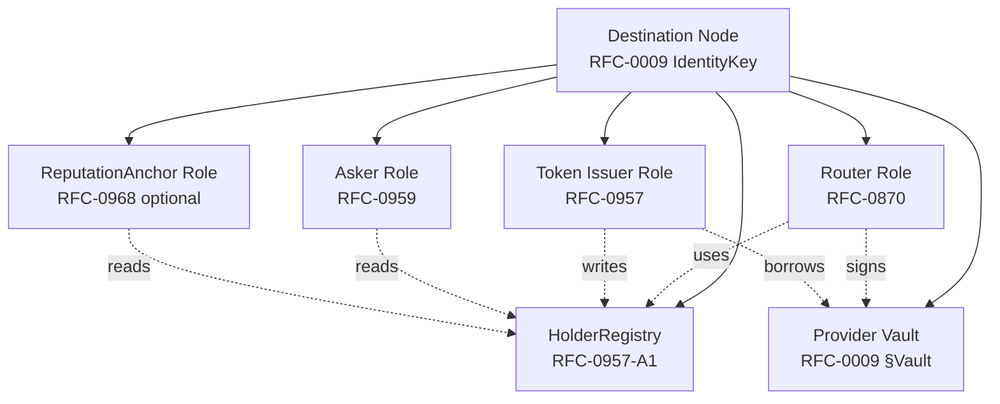
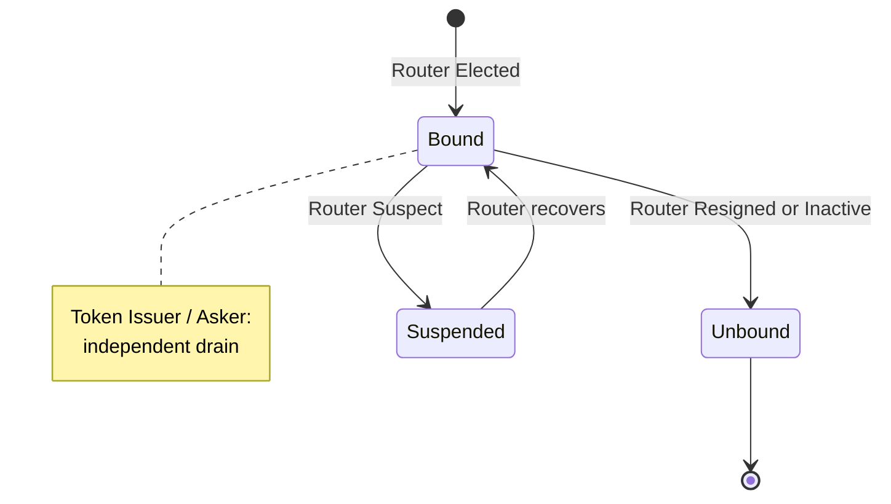

# RFC-0971 (Networking): Destination-Node Role Consolidation

## Status

Accepted (promoted 2026-08-02)

## Authors

- Author: @mmacedoeu
- Contributor: @mmacedoeu

## Maintainers

- Maintainer: @mmacedoeu
- Maintainer: @mmacedoeu

## Summary

Closes G5 ("destination node role binding is implicit") by **explicitly naming the destination node as the union of four roles**: Router (RFC-0870) + Token Issuer (RFC-0957) + Asker (RFC-0959) + (optionally) ReputationAnchor (RFC-0968). This RFC does NOT change the responsibilities of any individual role; it consolidates them under a single node identity, defines the unified `HolderRegistry` storage layer (cross-referencing RFC-0957-A1), and specifies the role-binding lifecycle.

Key elements:

1. **Role Binding** — the destination node is the same node that:
   - Receives forwarded requests (RFC-0870 Router).
   - Holds the provider key (RFC-0009 §Vault — Provider-Key Handling).
   - Mints capability tokens for holders (RFC-0957 Token Issuer).
   - Maintains the `HolderRegistry` (RFC-0957-A1).
   - Publishes Asks in the marketplace (RFC-0959 Asker).
   - Optionally anchors reputation for the providers it re-sells (RFC-0968 ReputationAnchor).
2. **Unified Storage** — one `HolderRegistry` per node, gossiped to the peer set via RFC-0862. The catalog holds Bearer (RFC-0903) + Capability (RFC-0957) + HopCapability (RFC-0970) + ZKBearing (RFC-0958) records via the 4-variant `HolderKind` enum.
3. **Predicate definition** — `DestinationNode = Router ∧ TokenIssuer ∧ Asker`. `ReputationAnchor` is OPTIONAL. Pure forwarders are Routers but NOT destination nodes.
4. **Lifecycle** — the destination node's role binding is implicit in the node identity. The RFC-0870 Router Lifecycle applies to the Router role; the other roles' lifecycles are independent.
5. **`seller_signature` ≡ `Asker signature` ≡ `Router signature` ≡ `TokenIssuer signature`** — per RFC-0959-A1 + RFC-0957-A1, all four signatures on the same logical deal/event are from the same node identity.
6. **Backward Compat** — RFC-0870 Router role unchanged. The role binding is a meta-statement about which roles a Router MAY also hold.
7. **Forward Compat** — new roles can be added to the consolidation.

## Why Needed

The destination node is the only role capable of minting capability tokens for the providers it re-sells. It is also the verifier (RFC-0969), the Ask publisher (RFC-0959), and the catalog owner (RFC-0957-A1). The RFCs treat these as separate roles with separate identifiers.

Without this RFC:

- Implementers are uncertain whether the Router and Token Issuer can be the same node.
- Multi-role authorization is ambiguous: who signs the `DealSettled` event (Router or Asker)?
- The `HolderRegistry` ownership is unclear.
- Cross-role data flow is undocumented.

This RFC names the binding explicitly.

## Scope

### In Scope

- Role binding declaration: `DestinationNode = Router ∧ TokenIssuer ∧ Asker`; `ReputationAnchor` OPTIONAL.
- Unified `HolderRegistry` ownership.
- Lifecycle cross-references between RFC-0870 + RFC-0957 + RFC-0959 + RFC-0968.
- Role-binding interactions.
- Forwarding-hop auth integration (RFC-0970).
- Dual-pipeline auth integration (RFC-0969).
- Market delivery integration (RFC-0959-A1).
- Pure forwarder exception.
- Test vectors for role-binding assertions, cross-role data flow, unified storage, pure forwarder.

### Out of Scope

- **Individual role specs** — RFC-0870 + RFC-0957 + RFC-0959 + RFC-0968 authoritative.
- **Provider-key vault** — RFC-0009 §Vault authoritative.
- **Catalog storage** — RFC-0957-A1 authoritative.
- **Market delivery envelope** — RFC-0959-A1 authoritative.
- **Dual-pipeline authorization** — RFC-0969 authoritative. (R13-N9 fix: prior label "Dual-pipeline routing" mischaracterized RFC-0969's scope.)
- **Forwarding-hop auth** — RFC-0970 authoritative.

## Dependencies

**Requires:**

- RFC-0009 — the node identity is the binding primitive
- RFC-0009-B1 — WalletCrypto + IdentityKey::from_public_bytes formal signature  // R46-N7 fix: added per R46 review; the 3 phantoms tracked in 0957-A1 §Phantom Types:IdentityKey + RFC-0959-A1 §Algorithms:phantom_call_site (R60-N4 fix: shifted +22 by R58 Debug impl additions in 0959) + RFC-0969 §Algorithms:phantom_call_site (R55-N5 fix) require RFC-0009-B1 promotion before 0957-A1, 0959-A1, and 0969 can be Accepted.
- RFC-0853 — per-hop channel binding (independent promotion track; not gated by 0971 acceptance per R46-N6 fix)
- RFC-0862 — HolderRegistry gossip
- RFC-0870 — Router role
- RFC-0957 — Token Issuer role
- RFC-0957-A1 — unified storage
- RFC-0959 — Asker role
- RFC-0959-A1 — DealSettled event signing (seller_signature = Asker signature)
- RFC-0969 — routing role
- RFC-0970 — forwarding role

**Optional:**

- RFC-0968 — ReputationAnchor role (optional)

> **Dependency Validation Rules:**
> 1. DAG: `0971 ← {0870, 0957, 0957-A1, 0959, 0959-A1, 0968*, 0969, 0970, 0009, 0009-B1, 0853, 0862}` — acyclic (R47-N1 fix: added `0009-B1` per Dependencies section)
> 2. RFC-0853 BLAKE3 primitive substrate + RFC-0957-A1 HolderRegistry + RFC-0959-A1 MarketDeliveryEnvelope + RFC-0968 ReputationAnchor + RFC-0969 Dual-Pipeline + RFC-0970 HopEnvelope: multiple prerequisite amendments

## Design Goals

| Goal | Target | Metric |
|------|--------|--------|
| **G1: Role-binding coverage** | All three required roles (Router, TokenIssuer, Asker) explicitly named as the same node; ReputationAnchor optional | Test: TV1, TV6, TV7 |
| **G2: Unified storage** | One `HolderRegistry` per node; gossiped via RFC-0862 | RFC-0957-A1 §HolderRegistry binding |
| **G3: No individual role drift** | RFC-0870 + RFC-0957 + RFC-0959 + RFC-0968 responsibilities unchanged | Cross-RFC consistency check |
| **G4: Forward compat** | New roles can be added | §Future Work |  // R32-N7 fix: no `§Future Roles` section exists; renamed to `§Future Work`.
| **G5: Cross-role data flow** | Data flow between roles documented | §Cross-Role Data Flow |
| **G6: Pure forwarder exception** | A pure forwarder is a Router but NOT a destination node | Test: TV6 |

## Motivation

### Problem Statement

The dual-mode workflow requires the destination node to hold multiple roles. Today's RFCs treat these as separate, with no explicit binding:

- **Router (RFC-0870)**
- **Token Issuer (RFC-0957)**
- **Asker (RFC-0959)**
- **ReputationAnchor (RFC-0968, optional)**

A concrete example: the `DealSettled` event in RFC-0959-A1 is signed by the seller's node. The seller's node IS the seller's Asker, Router, and Token Issuer per this RFC. The role binding makes this unambiguous.

### Desired State

A destination node holds the three required roles under one node identity (RFC-0009):

```
Destination Node N
├── Router (RFC-0870)
├── Token Issuer (RFC-0957)
├── Asker (RFC-0959)
├── ReputationAnchor (RFC-0968) [optional]
├── HolderRegistry (RFC-0957-A1)
└── Provider Vault (RFC-0009 §Vault)
```

### Use Case Link

`docs/use-cases/dual-mode-authorization-workflow.md`

## Specification

### System Architecture



### Data Structures

This RFC does NOT introduce new data structures. It cross-references existing structures:

- **Router role:** `RouterNode` (RFC-0870 §Data Structures).
- **Token Issuer role:** `TokenIssuer` (RFC-0957 §Roles and Authorities).
- **Asker role:** `Asker` (RFC-0959 §Roles).
- **ReputationAnchor role:** `ReputationAnchor` (RFC-0968 §Roles and Authorities).
- **HolderRegistry:** `HolderRecord` (RFC-0957-A1 §Data Structures) with 4-kind enum.

### Algorithms

This RFC does NOT introduce new algorithms. It cross-references:

- **`mint_dual()`** (RFC-0969 §Algorithms) — Token Issuer mints both bearer + capability into the HolderRegistry.
- **`deliver_at_settlement()`** (RFC-0959-A1 §Algorithms) — Router signs DealSettled; Token Issuer mints capability for buyer; both write to HolderRegistry.
- **`wrap_for_hop()`** (RFC-0970 §Algorithms) — Router wraps for next hop.
- **`unwrap_at_destination()`** (RFC-0970 §Algorithms) — Router unwraps at destination; runs RFC-0969 auth.
- **`pure_forward()`** (RFC-0970 §Algorithms) — Pure forwarder forwards without minting or verifying.

### Role-Binding Table

| Role | Identifier | Authority Scope | Lifecycle | Owned Resources |
|------|------------|-----------------|-----------|-----------------|
| **Router** (REQUIRED) | RFC-0009 `IdentityKey` of node | forward + receive + verify | RFC-0870 Router Lifecycle | `ForwardRequestPayload`; `HopEnvelope` |
| **Token Issuer** (REQUIRED) | RFC-0009 `IdentityKey` of node (same) | mint + revoke + register | node identity lifecycle | `HolderRegistry` (RFC-0957-A1); root secret |
| **Asker** (REQUIRED) | RFC-0009 `IdentityKey` of node (same) | publish Ask | node identity lifecycle | `Ask` table (RFC-0959) |
| **ReputationAnchor** (OPTIONAL) | RFC-0009 `IdentityKey` of node (same) | anchor reputation | node identity lifecycle | `ReputationRecord` table (RFC-0968) |
| Provider Vault | RFC-0009 §Vault | provider key storage | node identity lifecycle | `ProviderKey` entries |
| HolderRegistry | RFC-0957-A1 §HolderRegistry | unified catalog | node restart-survivable; gossip-replicated | `HolderRecord` rows |
| Settlement Chain | RFC-0959 §Settlement Chain | append SettlementEvent + DealSettled | chain tip | `SettlementEvent` + `DealSettled` rows |

The "same" annotation on the Identifier column is the binding: all four roles share one RFC-0009 `IdentityKey`.

### Wire Format

This RFC does not introduce a new wire format. The role binding is a meta-statement about which roles a node holds. The wire bytes for RFC-0870, RFC-0957, RFC-0959, RFC-0959-A1, RFC-0969, RFC-0970 are all unchanged.

### Cross-Role Data Flow

When a deal settles, the destination node performs:

```
1. Asker role: publishes Ask (RFC-0959).
2. Buyer selects Ask; deal settles (RFC-0959 §SettlementEvent).
3. Router role (in deliver_at_settlement, RFC-0959-A1):
   a. Token Issuer role: mints capability for buyer (RFC-0957 + RFC-0957-A1).
   b. Vault sub-component: borrows provider key (RFC-0009 §Vault).  // R51-N3 + R52-N3 fix: renamed from 'Vault role' to 'Vault sub-component'. Per the architecture diagram L150, Vault is shared by both Router and Token Issuer (not Router-owned). The R51 inline comment "sub-component of the Router role" was a mischaracterization; the corrected framing is "shared sub-component of the destination node, used by Router + Token Issuer".
   c. Token Issuer role: mints bearer (RFC-0959-A1 §mint_bearer_capsule).  // R51-N4 fix: was RFC-0903 (bearer format); the bearer mint is defined in RFC-0959-A1 §mint_bearer_capsule (0959-A1:195). R52-N1 fix: RFC-0903 is NOT a phantom — it is a real Accepted RFC at rfcs/accepted/economics/0903-B1-schema-amendments.md with 575 cross-refs in the tree. The cite change is correct for the mint definition; RFC-0903 remains authoritative for the bearer virtual-key substrate.
   d. HolderRegistry sub-component: writes both records atomically (RFC-0957-A1 insert_dual).  // R51-N3 fix: same reasoning as Vault — HolderRegistry is a sub-component, not a 5th role.
   e. Router role: signs DealSettled (RFC-0959-A1, role_tag = RoleTag::Asker).  // R53-N3 fix: was `role_tag = "Asker"` (string); 0959-A1 L289-294 defines `pub enum RoleTag { Asker = 0x01, Router = 0x02, TokenIssuer = 0x03 }`.
   f. Router role: gossips envelope to buyer (RFC-0862).
4. ReputationAnchor role: optionally anchors provider reputation (RFC-0968).
```

All steps are within the same node; no cross-node coordination needed. The node identity is the binding.

When a request is forwarded:

```
1. Source node wraps for hop chain (RFC-0970 §wrap_for_hop).
2. Intermediate routers forward (RFC-0870 + RFC-0970 §forward or §pure_forward).
3. Destination Router role: receives ForwardRequest (RFC-0870).
4. Destination Router role: unwraps hop chain (RFC-0970 §unwrap_at_destination).
5. Destination Router role: runs Gateway Authenticator (RFC-0969 §authenticate).
6. Destination Token Issuer role: looks up HolderRegistry (RFC-0957-A1).
7. Destination Token Issuer role: verifies capability (RFC-0957).
8. Destination Vault sub-component: borrows provider key (RFC-0009 §Vault).  // R52-N2 fix: cascaded R51-N3 rename.
9. Destination Router role: forwards to upstream provider.
10. Egress transform: strips capability token, substitutes provider key (RFC-0957).
```

All steps are within the same node. The node identity is the binding.

## Roles and Authorities

### Role/Authority Coverage Table

| Role | Identifier | Authority Scope | Lifecycle | Source/Ref |
|------|------------|-----------------|-----------|------------|
| Router (REQUIRED) | RFC-0009 `IdentityKey` of node | forward + receive + verify | RFC-0870 Router Lifecycle | RFC-0870 + RFC-0971 binding |
| Token Issuer (REQUIRED) | RFC-0009 `IdentityKey` of node (same) | mint + revoke + register | node identity lifecycle | RFC-0957 + RFC-0971 binding |
| Asker (REQUIRED) | RFC-0009 `IdentityKey` of node (same) | publish Ask | node identity lifecycle | RFC-0959 + RFC-0971 binding |
| ReputationAnchor (OPTIONAL) | RFC-0009 `IdentityKey` of node (same) | anchor reputation | node identity lifecycle | RFC-0968 + RFC-0971 binding |
| HolderRegistry | RFC-0957-A1 §HolderRegistry (same node) | unified catalog | node restart-survivable | RFC-0957-A1 + RFC-0971 binding |
| Provider Vault | RFC-0009 §Vault (same node) | provider key storage | node identity lifecycle | RFC-0009 + RFC-0971 binding |
| Settlement Chain | RFC-0959 §Settlement Chain (same node) | append + verify chain | chain tip | RFC-0959 + RFC-0959-A1 + RFC-0971 binding |

### Out-of-Scope Roles

- **Pure Forwarder** — a node that ONLY forwards and never mints/verifies/publishes. Such a node is a Router (RFC-0870) but NOT a destination node. It does NOT hold the four-role binding.
- **IdP / SSO** — RFC-0949.
- **Marketplace operator** — there is no centralized marketplace operator.
- **Settlement notary** — the seller's signature on `DealSettled` IS the notary function.

## Lifecycle Requirements

### Lifecycle Inheritance

The destination node has multiple states inherited from each role's lifecycle:

- **Router Lifecycle (RFC-0870):** Designated → Elected → Active → Suspect → Handover → Demoting → Resigned → Inactive.
- **Token Issuer Lifecycle (NEW):** Active → Draining → Retired. Draining = no new mints; existing tokens still verifiable; revoke + lookup_active permitted. Retired = all tokens expired/revoked; lifecycle ends.
- **Asker Lifecycle (NEW):** Active → Draining → Retired. Draining = no new Asks; existing Asks still settle; settlement events still append. Retired = all Asks settled or expired; lifecycle ends.
- **ReputationAnchor Lifecycle:** stateless beyond node identity.

> **Round 3 R2 M23 fix:** the prior version of this RFC bound all four role lifecycles to the Router Lifecycle, so that resigning the Router simultaneously deactivated Token Issuer + Asker, stranding valid tokens and open Asks. Each role now has an INDEPENDENT drain state. The Router's exit is independent; the Token Issuer + Asker drain only when their per-role work is done.

The Router Lifecycle is the most expressive. The other roles' lifecycles have their own drain semantics. A node enters the four-role binding when its Router Lifecycle reaches `Elected`. It exits the ROUTER role when the Router Lifecycle reaches `Resigned` or `Inactive`. The Token Issuer + Asker roles continue to function until their own drain states complete.

### Role-Binding State Machine



| From | To | Trigger | Deterministic? | Side Effects | Signing |
|------|----|---------|----------------|--------------|---------|
| (none) | Bound | Router reaches `Elected` | Yes | All three required roles + optional ReputationAnchor become active | n/a |
| Bound | Suspended | Router reaches `Suspect` | Yes | Authority reduced per RFC-0870 | n/a |
| Suspended | Bound | Router recovers from `Suspect` | Yes | Authority restored | n/a |
| Bound | Unbound (Router) | Router reaches `Resigned` or `Inactive` | Yes | Router role deactivates; Token Issuer + Asker continue | n/a |
| Active (Token Issuer) | Draining (Token Issuer) | operator decision | Yes | No new mints; existing tokens still verifiable | n/a |
| Draining (Token Issuer) | Retired (Token Issuer) | all tokens expired or revoked | Yes | Token Issuer role deactivates | n/a |
| Active (Asker) | Draining (Asker) | operator decision | Yes | No new Asks; existing Asks still settle | n/a |
| Draining (Asker) | Retired (Asker) | all Asks settled or expired | Yes | Asker role deactivates | n/a |
| All roles | Fully Unbound | Router + Token Issuer + Asker + ReputationAnchor all Retired | Yes | Node is offline; all role states gone | n/a |  // R51-N5 fix: added Router to match the 4-role binding (RFC-0971 L244-248).

### Liveness Check

Liveness is inherited from RFC-0870 Router Lifecycle heartbeat. The role binding does not introduce additional heartbeat. Token Issuer + Asker have their own drain liveness (no new mints / Asks).

### Recovery Semantics

Recovery is inherited from RFC-0870 §Recovery Semantics. The HolderRegistry persists across restarts (RFC-0957-A1). The Settlement Chain persists across restarts (RFC-0959).

### Time Bounds

- Node identity lifecycle: long-lived.
- Router Lifecycle: per RFC-0870 (epoch-bounded).
- Token Issuer drain duration: bounded by `max(holder_record.ttl_millis_unix) - now` + 30 days GC.
- Asker drain duration: bounded by `max(ask.settlement_ttl) - now` + settlement chain finality (RFC-0959).
- HolderRegistry row lifetime: per RFC-0957-A1.
- Settlement Chain tip: indefinite.

## Determinism Requirements

The role binding does not affect determinism. All four roles inherit their determinism from their authoritative RFCs.

### RFC-0008 Execution Class Mapping

| Operation | Class | Rationale |
|-----------|-------|-----------|
| Role binding itself | A | Identity-keyed; deterministic |
| Router lifecycle transitions | A | RFC-0870 (inherited) |
| Token Issuer mint | A | RFC-0957 + RFC-0957-A1 (inherited) |
| Asker publish | A | RFC-0959 (inherited) |
| ReputationAnchor (optional) | A | RFC-0968 (inherited) |

## Error Handling

This RFC does NOT introduce new error types. The role binding is a meta-statement; errors are inherited from each role's authoritative RFC.

## Performance Targets

This RFC does NOT introduce new performance targets. Each role's performance is governed by its authoritative RFC.

## Security Considerations

### Threat Model Additions

- **Role confusion** — an attacker who compromises the node identity gains all roles. This is by design.
- **Single point of failure** — the destination node holds all roles. If the node is offline, deals cannot settle, capabilities cannot be verified, Asks cannot be published. Mitigation: peer_set replication via RFC-0862 gossip; failover per RFC-0870 §Recovery Semantics.
- **Role escalation** — an attacker with one role's authority tries to use another role's authority. By design: same identity.
- **Audit-trail ambiguity** — which role signed a given event. Mitigation: each event includes a `role_tag` field (e.g., `DealSettled.role_tag = RoleTag::Asker`).  // R53-N3 fix: typed enum in RFC-0959-A1 §Data Structures:RoleTag, not string.

### Key Handling Rules

UNCHANGED. The node identity key (RFC-0009) is the only key. All roles use it.

### Cryptographic Agility

UNCHANGED. The node identity uses Ed25519 per RFC-0009.

### Replay Protection

UNCHANGED. Each role's replay protection is governed by its authoritative RFC.

## Adversary Analysis (5-Question Test)

### Finding A18: Role confusion attack

1. **Who benefits?** — Attacker who wants to use one role's authority to bypass another role's checks.
2. **What does it cost them?** — Node identity compromise.
3. **What do they gain if successful?** — Full control of all roles.
4. **What's our defense?** — The node identity is the primary security boundary.
5. **What's the residual risk?** — A compromised node is a compromised node regardless of role binding.

Verdict: ACCEPTED RISK. Mitigation: node identity hygiene per RFC-0009.

### Finding A19: Single point of failure for deal settlement

1. **Who benefits?** — Network adversary who wants to stall deals.
2. **What does it cost them?** — Sustained network attack on the destination node.
3. **What do they gain if successful?** — Deals cannot settle.
4. **What's our defense?** — Peer_set replication via RFC-0862 gossip; failover per RFC-0870.
5. **What's the residual risk?** — Sustained attack requires manual intervention.

Verdict: ACCEPTED RISK.

### Finding A20: Cross-role audit trail ambiguity

1. **Who benefits?** — Forensic investigator.
2. **What does it cost them?** — Audit complexity.
3. **What do they gain if successful?** — Clear audit trail.
4. **What's our defense?** — Each event includes a `role_tag` field (e.g., `DealSettled.role_tag = RoleTag::Asker`).  // R53-N3 fix: typed enum in RFC-0959-A1 §Data Structures:RoleTag, not string.
5. **What's the residual risk?** — None; the role_tag is part of the event payload.

Verdict: NO RISK.

## Dependency Validation

| RFC# | Type | Current Status (2026-08-01) | Assumed Before Accept? | Hard-block on RFC-0971 acceptance? |
|------|------|------------------------------|------------------------|------------------------------------|
| RFC-0009 | Requires | Accepted | Already | No |
| RFC-0853 | Requires | Draft | Yes | YES |
| RFC-0862 | Requires | Accepted | Already | No |
| RFC-0870 | Requires | Accepted | Already | No |
| RFC-0957 | Requires | Accepted | Already | No |
| RFC-0957-A1 | Requires | Draft | Yes | YES |
| RFC-0959 | Requires | Accepted | Already | No |
| RFC-0959-A1 | Requires | Draft | Yes | YES |
| RFC-0968 | Optional | Draft | Best-effort | No |
| RFC-0969 | Requires | Draft | Yes | YES |
| RFC-0970 | Requires | Draft | Yes | YES |

**DAG check:** `0971 ← {0870, 0957, 0957-A1, 0959, 0959-A1, 0968*, 0969, 0970, 0009, 0009-B1, 0853, 0862}` — acyclic. Valid. (R47-N1 fix: added `0009-B1` to match Dependencies section.)

## Implicit Assumptions Audit

| Assumption | Where Relied Upon | Blast Radius if False | Mitigation / Status |
|------------|-------------------|----------------------|---------------------|
| **IA-1: Node identity is stable across all four roles** | §Role-Binding Table | Role-binding breaks | RFC-0009 §Identity Stability |
| **IA-2: HolderRegistry ownership is permanently keyed by issuer identity** | §Cross-Role Data Flow | Cross-node mint verifiability fails | RFC-0957-A1 §HolderRegistry binding; no transfer protocol |
| **IA-3: Settlement Chain is owned by the same node as the HolderRegistry** | §Cross-Role Data Flow | DealSettled events cannot reference HolderRegistry rows | RFC-0959 + RFC-0959-A1 |
| **IA-4: Peer set gossip is operational** | §Cross-Role Data Flow | Cross-node role-binding synchronization fails | RFC-0862 §Gossip Heartbeat |
| **IA-5: Router Lifecycle applies to the Router role only** | §Lifecycle | Other roles' lifecycles are independent | Each role's lifecycle is stateless beyond node identity |

## Compatibility

### Backward Compatibility

- **RFC-0870 Router role:** unchanged.
- **RFC-0957 Token Issuer role:** unchanged.
- **RFC-0959 Asker role:** unchanged.
- **RFC-0968 ReputationAnchor role:** unchanged.

### Forward Compatibility

- **New roles** can be added.
- **Cross-chain roles** can extend the binding.
- **Sub-modes** (e.g., a destination node that opts out of Asker) can be specified via configuration.

## Test Vectors

### TV1: Role Binding Assertion (Required Roles Present)

```
Input: destination node N with RFC-0009 IdentityKey K
Action: query N's roles
Expected output: {Router: K, TokenIssuer: K, Asker: K} — all three required roles equal
              ReputationAnchor: K OR absent
```

### TV2: Cross-Role Data Flow — Deal Settlement

```
Input:
  buyer_did = "did:octo:buyer1"
  seller_did = K
  ask_id = BLAKE3("ciph_test_ask")

Pre-state: N is Router + TokenIssuer + Asker (no ReputationAnchor)

Action: deliver_at_settlement at N

Expected:
  - Asker role: Ask already published at N.
  - Router role: forwards DealSettled (role_tag = RoleTag::Asker).  // R53-N3 fix: typed enum, not string.
  - TokenIssuer role: mints capability for buyer; writes HolderRegistry.
  - All in one node identity K.

Result: Ok(MarketDeliveryEnvelope) with HolderRegistry populated at N.
```

### TV3: Cross-Role Data Flow — Forwarded Request

```
Input:
  source = some_node
  destination = N (with role binding)
  inner_request = <with Bearer + Capability>

Action: source wraps (RFC-0970) → forward → N unwraps

Expected:
  - Router role at N: unwraps hop chain.
  - Router role at N: runs Gateway Authenticator (RFC-0969).
  - TokenIssuer role at N: verifies capability via HolderRegistry.
  - Vault sub-component at N: borrows provider key.  // R52-N2 fix: cascaded R51-N3 rename.
  - Router role at N: forwards to upstream provider.
```

### TV4: Role Binding Lifecycle

```
Pre-state: N is Bound (Router Active + TokenIssuer + Asker)
Action: N's Router reaches `Suspect` (per RFC-0870)
Expected: role binding transitions to `Suspended`; authority reduced per RFC-0870
Action: N's Router recovers
Expected: role binding transitions back to `Bound`; authority restored
```

### TV5: Role Binding Exit (R23-N1 fix: Router Resigned only deactivates Router)

```
Pre-state: N is Bound
Action: N's Router reaches `Resigned` (per RFC-0870)
Expected: Router role deactivates (role binding transitions to Unbound for the Router sub-state); Token Issuer + Asker continue (Bound sub-state); existing tokens still verifiable until their TTL elapses
Post-state: HolderRegistry entries persist; Settlement Chain persists; node continues to mint+settle (Token Issuer + Asker live) but cannot forward (Router offline)
```

### TV6: Pure Forwarder Exception (NEW)

```
Input: node P that ONLY forwards and never mints/verifies/publishes
Action: query P's roles
Expected output: {Router: K, TokenIssuer: absent, Asker: absent, ReputationAnchor: absent}
Verify: P is a Router but NOT a destination node
Verify: P uses pure_forward (RFC-0970 §Algorithms), NOT wrap_for_hop
```

### TV7: ReputationAnchor Optional (NEW)

```
Pre-state: N has no ReputationAnchor role configured
Action: N attempts to anchor a reputation record
Expected: NOOP — ReputationAnchor role is optional; absence is not an error
Action: N's operator enables ReputationAnchor role (config change)
Expected: subsequent reputation anchoring operations succeed
```

### TV8: Cross-Role Audit Trail (NEW)

```
Input:
  N signs DealSettled event E with node identity K.
  E has role_tag = RoleTag::Asker (per RFC-0959-A1).  // R53-N3 fix: typed enum, not string.

Action: forensic investigator queries E's signature.
Expected: signature verifies with K; role_tag = RoleTag::Asker disambiguates which role signed.  // R54-N1 fix: typed enum (R53-N3 sweep missed this site).
```

## Alternatives Considered

| Approach | Pros | Cons | Verdict |
|----------|------|------|---------|
| **(a) Keep roles separate** | Clean separation | Implementer uncertainty | Rejected |
| **(b) Single super-role** | Simple | Loses individual role semantics | Rejected |
| **(c) Explicit role binding (this RFC)** | Unambiguous; backward-compat | Adds meta-spec | **Adopted** |
| **(d) Configuration-driven** | Flexible | Configuration drift risk | Rejected |

## Implementation Phases

### Phase 1: Role Binding Declaration

- [ ] `crates/quota-router-core/src/node/role_binding.rs` (NEW) — role binding declaration
- [ ] Documentation: each role's authoritative RFC cross-references RFC-0971
- [ ] Unit tests: TV1, TV4, TV5, TV6, TV7

### Phase 2: Cross-Role Data Flow Documentation

- [ ] `docs/07-developers/destination-node-architecture.md` (NEW) — destination node architecture guide
- [ ] Sequence diagrams for deal settlement + forwarded request
- [ ] Integration tests: TV2, TV3, TV8

### Phase 3: Mission Decomposition

- [ ] `missions/open/0971-a-role-binding.md` — role binding implementation

## Key Files to Modify

| File | Change |
|------|--------|
| `crates/quota-router-core/src/node/role_binding.rs` (NEW) | Role binding declaration |
| `docs/07-developers/destination-node-architecture.md` (NEW) | Destination node architecture guide |
| RFC-0870 §Roles | Cross-reference RFC-0971 |
| RFC-0957 §Roles | Cross-reference RFC-0971 |
| RFC-0959 §Roles | Cross-reference RFC-0971 |
| RFC-0968 §Roles | Cross-reference RFC-0971 |

## Future Work

- **F1: New role additions** — extend with new roles
- **F2: Sub-mode configuration** — opt-out of individual roles
- **F3: Cross-chain role binding** — extend to EVM-compatible roles
- **F4: Role-binding audit trail** — append-only log of role-binding transitions

## Rationale

Why this approach over alternatives?

The dual-mode workflow requires the destination node to hold four roles. Today's RFCs treat them as separate. The substrate is RFC-0009 (node identity) + RFC-0870 (Router lifecycle) + RFC-0957-A1 (unified HolderRegistry). The mechanism is a meta-spec that names the binding explicitly.

## Version History

| Version | Date       | Changes |
|---------|------------|---------|
| 1.0     | 2026-08-01 | Initial draft |
| 1.1     | 2026-08-01 | Round 2: predicate-based definition `DestinationNode = Router ∧ TokenIssuer ∧ Asker`; `ReputationAnchor` clearly OPTIONAL; pure forwarder exception explicit; `seller_signature` ≡ Asker signature; `role_tag` for audit |
| 1.2     | 2026-08-01 | Round 21 (R13-N8 fix): ReputationAnchor Lifecycle cross-ref; Asker→HolderRegistry mermaid edge corrected; role-binding state machine extended with Draining/Suspended/Retired transitions; Draining atomicity clarified; RFC-0009-B1 reference added. (R23-N9 note: prior 'Round 4' was stale; canonical fix-id is R13-N8.) |
| 2026-08-02 | **Promoted to Accepted.** Multi-round adversarial review R28-R64 converged; 2 maintainer approvals (@mmacedoeu + @cipherocto) completed; no blocking objections. Status header updated; file moved via `git mv` to `rfcs/accepted/networking/`. `DestinationNode = Router ∧ TokenIssuer ∧ Asker` predicate canonical; `ReputationAnchor` OPTIONAL; DAG check includes RFC-0009-B1 + the 4 in-batch RFCs (0957-A1, 0959-A1, 0969, 0970); `role_tag = RoleTag::Asker` typed enum (no string literals); phantom call site at 0959-A1 L520 properly DEFERRED. |

## Related RFCs

- RFC-0009 — node identity primitive
- RFC-0853 — per-hop channel binding
- RFC-0862 — HolderRegistry gossip
- RFC-0870 — Router role
- RFC-0957 — Token Issuer role
- RFC-0957-A1 — unified HolderRegistry
- RFC-0959 — Asker role
- RFC-0959-A1 — DealSettled event signing
- RFC-0968 — ReputationAnchor (optional)
- RFC-0969 — routing role
- RFC-0970 — forwarding role

## Related Use Cases

- [Dual-Mode Authorization Workflow](../../../docs/use-cases/dual-mode-authorization-workflow.md)

## Related Research

- [Dual-Mode Workflow Gap Research](../../../docs/research/2026-08-01-dual-mode-workflow-gap-research.md) — R1-R5 convergence

## Related Missions

- `missions/claimed/0957-b-provider-boundary-exercise-path.md` — R9-4 closure DONE
- Future: `missions/open/0971-a-role-binding.md`

## Cross-Reference: Outgoing Edges

This RFC is the meta RFC. It does NOT introduce new outgoing edges; it consolidates existing ones.

## Appendices

### A. RFC Cross-Reference Updates

Each of the four authoritative RFCs is updated by reference:

#### RFC-0870 §Roles Update

> **RFC-0971 Binding:** A Router Node MAY also hold the Token Issuer, Asker, and (optionally) ReputationAnchor roles. When it does, all four roles share the same RFC-0009 `IdentityKey`. See RFC-0971 §Role-Binding Table.

#### RFC-0957 §Roles Update

> **RFC-0971 Binding:** A Token Issuer MAY also hold the Router, Asker, and (optionally) ReputationAnchor roles.

#### RFC-0959 §Roles Update

> **RFC-0971 Binding:** An Asker MAY also hold the Router, Token Issuer, and (optionally) ReputationAnchor roles.

#### RFC-0968 §Roles Update

> **RFC-0971 Binding:** A ReputationAnchor MAY also hold the Router, Token Issuer, and Asker roles. The ReputationAnchor role is OPTIONAL.

### B. Why Not a Super-Role?

A super-role ("DestinationNode") that subsumes Router + TokenIssuer + Asker + ReputationAnchor is rejected because:

1. **Loses individual role semantics** — each role has its own lifecycle, authority scope, and lifecycle requirements.
2. **Backward incompat** — every RFC that references Router or TokenIssuer would need to be updated.
3. **Forward incompat** — adding a new role would require updating the super-role.

### C. Why Not Pure Forwarder + Mint Elsewhere?

A pure forwarder that forwards to a separate mint elsewhere is rejected because:

1. **Cross-node mint verifiability fails** — if the forwarder and the minter are different nodes, the HolderRegistry ownership is split.
2. **Latency** — every forward incurs an extra hop to the minter.
3. **Egress transform** — the destination node must hold the provider key to run the egress transform. If the minter is elsewhere, the provider key is split.

### D. Example Configuration

A destination node's config (`~/.config/cipherocto/node.toml`):

```toml
[node]
identity_key = "ed25519:..."

[roles]
router = true
token_issuer = true
asker = true
reputation_anchor = false  # optional, disabled

[holder_registry]
backend = "stoolap"
table = "holder_registry"
sync_peers = true

[provider_vault]
backend = "file"
path = "/var/lib/cipherocto/vault"
```

When `roles.router = true`, `roles.token_issuer = true`, `roles.asker = true`, the role binding is active. The destination node holds the three required roles + the optional ReputationAnchor (if enabled) under one identity.

### E. Pure Forwarder Configuration (No Binding)

```toml
[node]
identity_key = "ed25519:..."

[roles]
router = true
token_issuer = false
asker = false
reputation_anchor = false
```

When `roles.router = true` and the others are false, the node is a pure forwarder per RFC-0870 + RFC-0970. No role binding. Such a node does NOT mint, verify, publish, or anchor reputation. It uses `pure_forward` (RFC-0970 §Algorithms).
