# RFC-0008 (Process/Meta): Deterministic AI Execution Boundary

## Status

**Version:** 1.1 — Status header synced with §Version History v1.1 row per M37 corpus-wide sync check (prior header read 1.0; VH row added 2026-08-22 with R15 fix trail F-R15-PR-01 cascade HIGH defect closure)
**Status:** Accepted
**Date:** 2026-08-21
**Accepted on:** 2026-08-22 per user authorization (R3 closure of `docs/research/2026-08-21-vault-monetary-representation-redesign.md`)
**Promoted from:** `rfcs/planned/process/0008-deterministic-ai-execution-boundary.md` (87-line placeholder, no longer on disk; per BLUEPRINT.md §RFC Process)

> **Note:** This RFC was originally numbered RFC-0008 under the legacy numbering system. It remains at 0008 as it belongs to the Process/Meta category.

## Authors

- Author: @cipherocto

## Maintainers

- Maintainer: @cipherocto

## Summary

This RFC defines the strict boundary between deterministic protocol execution and probabilistic AI computation, ensuring consensus safety across all CipherOcto implementations. Every consensus-relevant operation MUST be assigned one of three execution classes — **Class A** (protocol-deterministic, consensus-critical), **Class B** (deterministic when configured correctly, proof-required for consensus), or **Class C** (probabilistic, explicitly excluded from consensus). Every other RFC MUST carry a §RFC-0008 Execution Class Mapping table listing its operations and the rationale for each class.

## Dependencies

**Requires:**

- RFC-0003 (Process/Meta): Deterministic Execution Standard — defines the global determinism rules this RFC instantiates via the Class A/B/C taxonomy.

**Optional:**

- RFC-0009 (Process/Meta): Identity Management — DID derivation is Class A; provides canonical signer keys for deterministic verification.

> **Dependency Validation Rules:**
> 1. Dependencies MUST form a DAG (no cycles)
> 2. All "Requires" RFCs MUST be listed as mission prerequisites
> 3. Optional dependencies MUST be documented separately from required
> 4. Dependencies on "Planned" RFCs MUST note the assumption they will be Accepted — N/A here; only RFC-0003 dep is Draft → Accepted-pending

## Design Goals

| Goal | Target | Metric |
| ---- | ------ | ------ |
| G1 | 100% RFC coverage of §RFC-0008 Execution Class Mapping | 95/95 accepted RFCs carry the table; 0% gap |
| G2 | Class A reproducibility | 10K random inputs replay identically across 2 independent nodes, byte-for-byte |
| G3 | Class B proof coverage | Every Class B operation in consensus-critical path has accompanying ZK proof verification per RFC-0958 + RFC-0965 |
| G4 | Class C explicit exclusion | Zero Class C operations in any consensus-relevant code path; Linter enforces |
| G5 | Classification auditability | Every Class A/B/C claim is reviewable against the canonical test vector suite in §Test Vectors |
| G6 | Migration smoothness | All 68 currently-missing RFCs (§Coverage Gap) gain the table via RFC-0008-A1..A68 in-place amendments without breaking consensus |

## Motivation

### Why this RFC exists

The CipherOcto protocol attempts the ambitious goal of deterministic AI execution within a verifiable protocol. Two independent implementations executing the same inputs MUST produce the same outputs at every consensus-relevant boundary, or consensus breaks.

Sources of nondeterminism that have broken prior attempts at consensus + AI integration:

- **Kernel ordering** — GPU kernels, attention reductions, parallel ops produce different sums across implementations due to FMA (fused multiply-add) accumulation order.
- **Floating-point behavior** — IEEE 754 has platform-dependent edge cases; `x86_64` vs `aarch64` can disagree on NaN payloads.
- **Parallel reduction ordering** — sum reductions on CUDA / ROCm / Metal diverge by GPU vendor.
- **Memory layout** — struct field padding, SIMD alignment, cache-line splitting.
- **Attention kernel implementations** — FlashAttention vs vanilla differs in cumulative floating-point error.
- **Hashing / serialization ambiguity** — undefined canonical form for nested types.
- **Random number generation** — non-seeded RNG breaks replay.

Without a boundary definition that is **explicit, testable, and enforceable**, consensus diverges between nodes, proof verification becomes unreliable, and cross-implementation compatibility breaks.

### Why a three-class taxonomy

A binary "deterministic / probabilistic" split loses information. The protocol needs three classes because:

- **Class A** operations are deterministic by construction; they may participate in consensus without proof.
- **Class B** operations are deterministic when configured correctly but require proof for consensus because their non-determinism surface is too large to audit statically (model inference on canonical kernels is the canonical example).
- **Class C** operations are non-deterministic by nature and MUST be excluded from any consensus-relevant path.

### Why every RFC must carry the mapping

If classification is optional, it drifts. If classification is centrally maintained, it rots. If every RFC author must declare the class of each operation with rationale, the discipline is enforced at the point of definition where context is freshest. Audit becomes mechanical.

## Roles and Authorities

> **The "Nothing should be implied" rule (specification layer):** Every actor that affects correctness, security, accountability, or consensus MUST be named with a stable identifier, a defined authority scope, and a typed lifecycle. Inference is a defect. Cross-reference: BLUEPRINT.md "Human vs Agent Roles" table.

### Role/Authority Coverage Table

| Role | Identifier | Authority Scope | Lifecycle | Source/Ref |
|------|------------|-----------------|-----------|------------|
| RFC Author | `@cipherocto` (per-RFC) | Draft RFC; declare execution classes for own operations | Per-RFC; stateless after RFC Accepted | BLUEPRINT.md §RFC Process (Author role) |
| RFC Maintainer | `@cipherocto` | Maintain RFC; update classifications when substrate changes | Per-RFC; persistent | BLUEPRINT.md §RFC Process (Maintainer role) |
| Class A Auditor | multi-round reviewer per BLUEPRINT.md §Adversarial Review Process | Verify Class A claims via §Test Vectors (10K replay) | Per-RFC-review; stateless | BLUEPRINT.md §RFC Acceptance Process |
| Class B Prover | ZK prover implementation per RFC-0958 + RFC-0965 | Generate proof for Class B operation in consensus path | Per-consensus-round | RFC-0958, RFC-0965 |
| Governance Downgrader | Maintainer board (2+ approvals) | Downgrade Class A → Class B (with rationale + ACCEPTED RISK deadline) | Per-amendment | BLUEPRINT.md §RFC Acceptance Process |
| Classification Enforcer | substrate linter (`crates/octo-policy/src/class_lint.rs`, future RFC; canonical post-mission 0206-006 landing; RFC-0008 v1.0 historical surface `octo-policy-core/...` superseded per RFC-0206 v3.3 substrate layer model) | Reject PR introducing Class C operation into consensus path | Persistent | this RFC §Implicit Assumptions Audit |

### ACCEPTED IMPLICIT ROLES

- **Implicit:** "Any developer adding code" — for every such developer, the discipline of declaring Class A/B/C on every new operation IS implicit.
  - **Rationale:** Listed in every RFC template per BLUEPRINT.md §RFC Process; obligation is documented.
  - **Deadline for explicit naming:** Closure = every accepted RFC carries the table (Goal G1).

## Specification

### System Architecture

```mermaid
graph TB
    subgraph Consensus["Consensus-critical path (Class A + Class B + Class B-proof)"]
        A1[Vault PK lookup<br/>RFC-0960 §2.6]
        A2[Transfer events append<br/>RFC-0960 §2.5]
        A3[Settlement arithmetic<br/>RFC-0959 §Algorithms §Compute cost]
        A4[Capability HMAC chain<br/>RFC-0957 + RFC-0965 §3.7]
        A5[DFP arithmetic<br/>RFC-0104 §Specification]
        A6[BLAKE3 hashing<br/>RFC-0009 §Roles and Authorities (BLAKE3 primitive)]
        A7[Canonical serialization<br/>RFC-0126]
        A8[Settlement verify-time<br/>RFC-0959 v2.1]
    end

    subgraph ProofBridge["Class B → Consensus via proof"]
        B1[Model inference canonical kernel<br/>RFC-0127]
        B2[Gossip deterministic ordering<br/>RFC-0862 §WriterElection Protocol]
        B3[MultiEnvelope composition<br/>RFC-0962 §7]
        B4[ZK capability verify<br/>RFC-0965 §3]
        P1[ZK proof generation<br/>RFC-0958]
        P2[Proof verification<br/>RFC-0965]
    end

    subgraph OutOfScope["Out of consensus (Class C)"]
        C1[Training]
        C2[Sampling]
        C3[Exploration]
        C4[Adaptive computation]
    end

    B1 --> P1 --> P2 --> A4
    B2 --> A4
    B3 --> A2

    C1 -. excluded .-> Consensus
    C2 -. excluded .-> Consensus
    C3 -. excluded .-> Consensus
    C4 -. excluded .-> Consensus
```

### Data Structures

```rust
/// Three-class taxonomy. Every RFC's §RFC-0008 Execution Class Mapping table
/// maps each operation to one of these variants with rationale.
#[repr(u8)]
#[derive(Copy, Clone, Debug, PartialEq, Eq, serde::Serialize, serde::Deserialize)]
pub enum ExecutionClass {
    /// Protocol-deterministic. Consensus-safe without proof.
    /// MUST be reproducible byte-for-byte across independent implementations.
    A = 0x00,
    /// Deterministic when configured correctly. Requires ZK proof (RFC-0958 + RFC-0965)
    /// for any consensus-relevant invocation.
    B = 0x01,
    /// Probabilistic. MUST NOT participate in any consensus-relevant path.
    /// Linter (`crates/octo-policy/src/class_lint.rs`) enforces exclusion.
    C = 0x02,
}

/// RFC-0008 §RFC-0008 Execution Class Mapping row.
pub struct ClassMappingRow {
    pub operation: String,           // e.g., "VaultStore::lookup_by_vault_id"
    pub class: ExecutionClass,
    pub rationale: String,            // ≤ 200 chars; cites substrate primitive + RFC dependency
}

/// RFC-0008 §RFC-0008 Execution Class Mapping table; required in every RFC.
pub struct ClassMapping {
    pub rows: Vec<ClassMappingRow>,
}
```

### Algorithms

#### 1. Classification assertion

```rust
/// Assert that `op` is classified as `claimed`. Called at the substrate entry
/// point for any operation participating in the consensus path. Class C is
/// rejected outright; Class B requires proof verification per RFC-0958.
pub fn assert_class(
    op: &Operation,
    claimed: ExecutionClass,
    ctx: &ClassAssertionContext,
) -> Result<(), ClassAssertionError> {
    if claimed == ExecutionClass::C && ctx.is_consensus_path() {
        return Err(ClassAssertionError::ClassCInConsensusPath {
            op: op.name.clone(),
        });
    }
    if claimed == ExecutionClass::B && ctx.is_consensus_path() && !ctx.has_proof_attached() {
        return Err(ClassAssertionError::ClassBRequiresProof {
            op: op.name.clone(),
        });
    }
    Ok(())
}
```

#### 2. Class A reproducibility check

```rust
/// Per RFC-0008 §Test Vectors: run operation on 2 independent nodes with the
/// same 10K input set + seeded RNG; outputs MUST be byte-for-byte identical.
pub fn verify_class_a_reproducibility(
    op: &Operation,
    inputs: &[Input],
    seed: [u8; 32],
    nodes: &[NodeId; 2],
) -> Result<(), ClassAError> {
    let mut outputs_a = Vec::with_capacity(inputs.len());
    let mut outputs_b = Vec::with_capacity(inputs.len());
    for input in inputs {
        outputs_a.push(op.execute_on(*nodes.first().unwrap(), input.clone(), seed)?);
        outputs_b.push(op.execute_on(*nodes.second().unwrap(), input.clone(), seed)?);
    }
    if outputs_a != outputs_b {
        return Err(ClassAError::ReproducibilityFailure {
            op: op.name.clone(),
            first_diff: outputs_a.iter().zip(&outputs_b)
                .position(|(a, b)| a != b)
                .unwrap_or(usize::MAX),
        });
    }
    Ok(())
}
```

#### 3. Class B proof attachment

```rust
/// Class B operations in consensus path MUST carry ZK proof per RFC-0958.
pub fn attach_class_b_proof(
    op: &Operation,
    witness: &Witness,
    proof_system: &dyn ProofSystem,
) -> Result<ProofEnvelope, ProofError> {
    let circuit = proof_system.circuit_for_op(op)?;
    let proof = proof_system.prove(&circuit, witness)?;
    Ok(ProofEnvelope {
        op_root: BLAKE3(op.name.as_bytes()),
        proof,
        verifier_key_id: circuit.verifier_key_id,
    })
}
```

### Lifecycle Requirements

> **Required for any RFC that defines an actor with more than one state** — this RFC defines the Class A/B/C taxonomy which IS a state machine (an operation's class can be downgraded by governance but not upgraded without re-implementation).

#### Class lifecycle state machine

```mermaid
stateDiagram-v2
    [*] --> Proposed : RFC author declares class
    Proposed --> ClassA : Class A Auditor verifies via §Test Vectors
    Proposed --> ClassB : Class B Prover attaches proof + Class A Auditor verifies determinism envelope
    Proposed --> ClassC : Reviewer confirms exclusion from consensus path
    ClassA --> ClassB : Governance downgrade (2+ maintainer approvals + ACCEPTED RISK deadline)
    ClassB --> ClassA : Re-implementation with deterministic kernel + Class A Auditor reverify (rare; requires RFC amendment)
    ClassC --> OutOfScope : Marker for explicit consensus exclusion
    ClassA --> Deprecated : RFC superseded
    ClassB --> Deprecated : RFC superseded
    OutOfScope --> Deprecated : RFC superseded
```



| From | To | Trigger | Deterministic? | Side Effects | Signing |
|------|----|---------|----------------|--------------|---------|
| Proposed | ClassA | `verify_class_a_reproducibility` passes for 10K inputs across 2 nodes | Yes | RFC Version History row added | RFC Maintainer |
| Proposed | ClassB | `attach_class_b_proof` succeeds + auditor accepts determinism envelope | Yes | RFC Version History row added; `class_b_proof_registry` updated | RFC Maintainer + Auditor |
| Proposed | ClassC | Reviewer confirms `is_consensus_path() == false` for all call sites | Yes | Linter rule added | RFC Maintainer |
| ClassA | ClassB | Governance downgrade with ACCEPTED RISK + 90-day deadline | Yes | Class B Prover must produce proof before deadline | 2 Maintainer approvals |
| ClassB | ClassA | New canonical kernel implemented + `verify_class_a_reproducibility` passes | Yes | Linter rule removed | RFC Maintainer + Auditor |
| ClassA / ClassB | Deprecated | RFC superseded by `Supersedes:` reference | Yes | RFC moved to `rfcs/archived/superseded/` | RFC Maintainer |

**Liveness check:** No heartbeat required — classification is event-driven per RFC amendment.

**Recovery semantics:** Misclassification detected → revert via RFC amendment; consumers re-classify at next substrate restart. Class C in consensus path = linter rejects PR; cannot land.

**Time bounds:** Class A → Class B downgrade carries 90-day ACCEPTED RISK deadline. Class B → Class A promotion carries same; the new kernel must be stable for 90 days before reclassification.

### Determinism Requirements

The classification scheme itself MUST be Class A. Specifically:

- `ExecutionClass` enum encoding is fixed (0x00/0x01/0x02); reordering is a hard fork.
- `ClassMappingRow` serialization is canonical BLAKE3 over the row fields; any deviation breaks verification.
- The linter rule for Class C exclusion is deterministic; fuzz-tested across all `crates/` per mission `0008-class-c-linter` (future).

### RFC-0008 Execution Class Mapping

Per BLUEPRINT.md template §RFC-0008 Execution Class Mapping — every RFC MUST include this table. This RFC itself carries the meta-mapping:

| Operation | Class | Rationale |
|-----------|-------|-----------|
| `ExecutionClass` enum discriminant | A | Fixed byte values; reordering is hard fork |
| `ClassMappingRow` canonical serialization | A | BLAKE3 over canonical field order; deterministic |
| `assert_class()` | A | Pure boolean check; deterministic |
| `verify_class_a_reproducibility()` | A | BLAKE3 + byte comparison; deterministic |
| `attach_class_b_proof()` | A | ZK proof generation per RFC-0958; deterministic circuit + witness |
| Classification audit (multi-round review) | A | Documented in RFC Version History; reviewer identity deterministic per RFC-0000 |
| Classification downgrade governance vote | A | 2+ maintainer approval; deterministic |
| Class C linter rule | A | Pure grep/AST match; deterministic |
| Model inference (RFC-0127) — canonical kernel | B | Deterministic when configured correctly; consensus requires ZK proof per RFC-0965 |
| Gossip message ordering (RFC-0862) | B | Deterministic with writer-election; consensus requires deterministic-ordering proof |
| MultiEnvelope composition (RFC-0962) | B | Deterministic per RFC-0962 §7; consensus requires completion proof |
| Training | C | Probabilistic by nature; explicitly excluded from consensus path |
| Sampling | C | Probabilistic by nature; explicitly excluded from consensus path |
| Exploration (agent behavior) | C | Probabilistic by nature; explicitly excluded from consensus path |
| Adaptive computation | C | Probabilistic by nature; explicitly excluded from consensus path |

> **Class C operations MUST be physically separated** — not by configuration, but by crate boundary. Future mission `0008-class-c-sandbox` will enforce this via dedicated crate `octo-ai-exploratory` with no consensus-path dependency direction.

### Error Handling

```rust
#[derive(thiserror::Error, Debug)]
pub enum ClassAssertionError {
    #[error("Class C operation {op} in consensus path; rejected")]
    ClassCInConsensusPath { op: String },

    #[error("Class B operation {op} in consensus path; requires proof per RFC-0958")]
    ClassBRequiresProof { op: String },

    #[error("Class A operation {op} failed reproducibility check at input {first_diff}")]
    ClassAError(ClassAError),

    #[error("Class B proof verification failed: {0}")]
    ClassBProofError(String),

    #[error("Unknown class claimed for operation {op}")]
    UnknownClass { op: String },
}

#[derive(thiserror::Error, Debug)]
pub enum ClassAError {
    #[error("Reproducibility failure at input {first_diff}")]
    ReproducibilityFailure { op: String, first_diff: usize },
    #[error("Seeded RNG mismatch: expected {expected:?} got {actual:?}")]
    SeededRngMismatch { expected: [u8; 32], actual: [u8; 32] },
}
```

## Performance Targets

| Metric | Target | Notes |
|--------|--------|-------|
| Class A assertion overhead | <1µs | Single boolean check; no allocation |
| Class B proof generation | <100ms | RFC-0958 circuit complexity dependent |
| Class B proof verification | <10ms | RFC-0965 verifier; aggregated for MultiEnvelope |
| Classification audit (per RFC) | <2 min | Reviewer review of Class Mapping table |
| Linter scan | <30s/crate | AST match for Class C in consensus path |

## Implicit Assumptions Audit

> **The "Nothing should be implied" rule (validation layer):** Every assumption the design relies upon that is not enforced by types, runtime validation, or test coverage MUST be listed here. Each MUST have blast radius and mitigation.

| Assumption | Where Relied Upon | Blast Radius if False | Mitigation / Status |
|------------|-------------------|----------------------|---------------------|
| Three-class taxonomy is sufficient | §Specification §Data Structures | Some operation may require a 4th class (e.g., Class D = "deterministic with bounded nondeterminism envelope"); reclassification would be global | [CONDITIONAL: requires future RFC-0008 amendment if a 4th class is needed; current v1.0 deemed sufficient for protocol state] |
| Class A reproducibility can be verified via 10K-input test | §Test Vectors | Some operation may pass 10K but fail at 1M; coverage insufficient | Property-based test with 1M inputs for high-stakes operations (settlement, capability); documented in mission `0008-property-test-suite` (future) |
| Class B proof generation is feasible for all Class B operations | §Specification §Algorithms | Some Class B operations may not have efficient circuit; force reclassification as Class C and exclude | RFC-0958 + RFC-0965 §3.7 WrappedOnly caveat depth bound (16) provides fallback |
| Class C operations can be physically separated by crate boundary | §RFC-0008 Execution Class Mapping footer | Class C code may leak into consensus path via shared crate dependency | Linter rule + crate-level `Cargo.toml` deny list per mission `0008-class-c-linter` (future) |
| Reviewers will not rubber-stamp Class A claims | §Lifecycle Requirements §ClassA transition | All operations become effectively unverified; consensus break risk | Multi-round adversarial review per BLUEPRINT.md §Adversarial Review Process; reviewer rotation |
| Class B → Class A promotion is rare | §Lifecycle Requirements | Frequent promotion means instability; substrate break risk | 90-day stability requirement before promotion; documented in §Lifecycle Requirements |
| All consensus-critical RFCs already declare their classes (or will via amendment) | §Coverage Gap below | Silent consensus break; undetected divergence | Mission `0008-execution-class-amendments` (NEW) addresses 68 missing RFCs |
| Test infrastructure for Class A reproducibility exists | §Test Vectors §1 | Cannot verify claims; only trust author | Mission `0008-reproducibility-fixture` (NEW) — multi-node harness; substrate dependency |

### Categories Audit

- **Operator trust** — RFC author must correctly classify; multi-round review mitigates.
- **Platform trust** — none; classification is platform-independent.
- **Time source** — none; classification has no time component.
- **Network partition** — none; classification is local.
- **Upgrade safety** — enum reordering is hard fork; semver-major required.
- **Configuration** — Class B requires explicit proof attachment; misconfig → linter error.
- **Identity stability** — none.
- **Resource availability** — Class B proof generation is the only resource-bound step; bounded by circuit complexity.

## Security Considerations

- **Consensus attacks** — Class C in consensus path = automatic linter reject; attacker cannot smuggle non-determinism through PR review.
- **Economic exploits** — Class B downgrade governance vote requires 2+ maintainer approvals + ACCEPTED RISK deadline; bypass = governance compromise.
- **Proof forgery** — Class B proof verification per RFC-0965 §3.7 WrappedOnly + RFC-0958 soundness error ≤ 2^-128.
- **Replay attacks** — N/A; classification is event-driven, not replayable.
- **Determinism violations** — covered by `verify_class_a_reproducibility`; failure = RFC amendment required.

## Adversary Analysis

> **The 5-Question Adversary Test:** For every design decision with security implications, enumerate: (1) who benefits from breaking it, (2) what it costs them, (3) what they gain if successful, (4) what's our defense and its cost to legitimate operation, (5) what's the residual risk and is it acceptable.

| Decision | Q1 Beneficiary | Q2 Cost to Attacker | Q3 Gain if Successful | Q4 Defense (cost to legit op) | Q5 Residual Risk |
|----------|----------------|---------------------|------------------------|------------------------------|------------------|
| Class A claim without reproducibility test | Malicious RFC author | Low (write RFC, mislabel operation) | Operation joins consensus with non-determinism; consensus splits at execution | Multi-round review with §Test Vectors; auditor must run 10K-input test | LOW — multi-round review catches |
| Class B claim without proof | RFC author hiding expensive ZK proof cost | Low (write RFC, skip proof attachment) | Expensive proof avoided; performance gain | Linter requires proof attachment; CI fails PR without | LOW — linter enforced |
| Class C operation in consensus path | RFC author who wants exploration in consensus | Medium (bypass crate boundary, exploit shared dep) | Probabilistic exploration drives consensus outcome; governance capture | Crate-level `Cargo.toml` deny list + linter; Class C sandbox crate (future) | MEDIUM — physical separation incomplete until mission `0008-class-c-sandbox` lands |
| Downgrade Class A → Class B without governance vote | Maintainer with governance key | High (requires quorum compromise) | Skip 90-day ACCEPTED RISK deadline; consensus-affecting reclassification | 2+ maintainer approvals required; audit log per RFC Version History | LOW — multi-sig mitigates |
| Class B → Class A promotion without re-implementation | Maintainer claiming new kernel | High (must implement + verify 10K + 1M tests) | Skip re-implementation cost | `verify_class_a_reproducibility` gates transition; 90-day stability requirement | LOW — verification gates |

## Economic Analysis

This RFC is Process/Meta and does not directly affect token economics. Indirectly:

- Class A operations are consensus-cheap (no proof overhead); majority of substrate operations.
- Class B operations carry proof generation cost; bounded by circuit complexity in RFC-0958 + RFC-0965.
- Class C operations are excluded; no consensus cost.

**Token Economics Reference:** N/A — no participation, staking, or governance economics.

## Compatibility

- **Backward:** v1.0 introduces the taxonomy; existing RFCs without the table are non-compliant. Mission `0008-execution-class-amendments` (NEW) closes the gap.
- **Forward:** future execution classes (Class D, etc.) require RFC-0008 amendment; reclassification of existing operations carries 90-day ACCEPTED RISK deadline.
- **Cross-implementation:** every CipherOcto node MUST implement the same `ExecutionClass` enum encoding (0x00/0x01/0x02); drift = hard fork.

## Test Vectors

### Class A reproducibility (canonical)

```text
INPUT: 10_000 random inputs x_i ∈ {0..2^64-1}, seed = [0x42; 32]
NODES: 2 independent nodes (NodeA, NodeB) running the SAME build
OP: VaultStore::lookup_by_vault_id(vault_id)

EXPECTED:
  for each i in 0..10_000:
    NodeA.execute(op, x_i, seed) == NodeB.execute(op, x_i, seed)
  outputs are byte-for-byte identical
```

### Class B proof attachment (canonical)

```text
INPUT: model inference output y ∈ [0,1]^768, witness w, circuit C_model
PROVER: ZK prover per RFC-0958 §3
EXPECTED:
  attach_class_b_proof(model_inference, w, C_model) → ProofEnvelope
  verifier.verify(proof, y) == Accept
```

### Class C linter reject (canonical)

```text
INPUT: PR adding `crate::training::gradient_step()` to `crates/octo-vault/src/lib.rs`
LINTER: crates/octo-policy/src/class_lint.rs
EXPECTED:
  PR blocked; error: "Class C operation in consensus-path crate; move to octo-ai-exploratory"
```

### Multi-round review audit (canonical)

```text
INPUT: RFC claiming Class A for "VaultStore::debit"
REVIEWER: per BLUEPRINT.md §Adversarial Review Process
EXPECTED:
  Reviewer runs verify_class_a_reproducibility per §Test Vectors §1
  If passes → Class A confirmed; Version History row added
  If fails → reject; RFC amendment required
```

## Alternatives Considered

| Approach | Pros | Cons |
| -------- | ---- | ---- |
| **Option A: Three-class taxonomy (this RFC)** | Captures Class B nuance (proof-bridged determinism); matches existing usage in RFC-0957-A1 + RFC-0959 + RFC-0969; multi-round review gates Class A | Some classification disputes inevitable; reviewer training required |
| Option B: Binary deterministic / probabilistic | Simpler; no Class B nuance | Forces Class B operations to be reclassified as Class C; loses model-inference consensus use case |
| Option C: Four-class taxonomy (add Class D = "bounded-nondeterminism envelope") | More granular | YAGNI; current protocol has no operation requiring Class D; complexity not justified |
| Option D: Centralized classification registry | Single source of truth | Upgrade-hostile (central enum per CLAUDE.md §Extension over enumeration); per-RFC mapping is fresher |
| Option E: No formal classification; rely on review intuition | Lowest overhead | Silent drift; consensus break risk; BLUEPRINT.md template requirement already establishes the discipline |

**Rationale for Option A:** Matches existing RFC corpus usage; aligns with BLUEPRINT.md template §RFC-0008 Execution Class Mapping requirement; closes the 68-RFC gap.

## Implementation Phases

### Phase 1: RFC-0008 Accepted

- [ ] Multi-round adversarial review per BLUEPRINT.md §Adversarial Review Process (minimum 7-day review window per §RFC Process)
- [ ] 2+ maintainer approvals per BLUEPRINT.md §RFC Acceptance Process
- [ ] RFC moved from `rfcs/draft/process/` to `rfcs/accepted/process/`

### Phase 2: Execution Class Amendment Sweep (NEW)

- [ ] Mission `0008-execution-class-amendments` filed at `missions/open/0008-execution-class-amendments.md`
- [ ] 68 currently-missing accepted RFCs gain §RFC-0008 Execution Class Mapping table (one RFC amendment per RFC; ~3-5 days)
- [ ] Each amendment RFC carries rationale per A/B/C taxonomy
- [ ] Class C operations physically separated to `octo-ai-exploratory` crate (mission `0008-class-c-sandbox`)

### Phase 3: Linter Enforcement

- [ ] Mission `0008-class-c-linter` filed at `missions/open/0008-class-c-linter.md`
- [ ] `crates/octo-policy/src/class_lint.rs` implements `assert_class` + `verify_class_a_reproducibility` CI integration
- [ ] CI gate: PR introducing Class C operation into consensus-path crate blocks merge

### Phase 4: Reproducibility Fixture (future)

- [ ] Mission `0008-reproducibility-fixture` filed
- [ ] Multi-node harness for 10K + 1M input property tests; runs per-RFC amendment
- [ ] CI gate: Class A claims verified via fixture before RFC Accept

### Phase 1.5: Substrate Redesign Cross-Reference (R13 fix F-R12-XR-RFC0008-PHASE-1-5-CROSSREF)

- [ ] RFC-0206 substrate redesign missions (per plan v1.1 §Mission layout) execute in this phase PRIOR to Phase 2 Execution Class Amendment Sweep
- [ ] Missions: 0206-011 (RFC amendment) → 0206-001 v3.0 (substrate newtype) → 0206-002 v3.0 + 0206-008 (TYPE renames) → 0206-003 v3.0 (trait moves) → 0206-009 + 0206-010 (adapter crates + fixtures)
- [ ] RFC-0008 §RFC-0008 Execution Class Mapping table for RFC-0206 + RFC-0967-A1 + RFC-0960 + RFC-0105 + RFC-0010 + RFC-0959 must be populated as part of Phase 2 sweep; pre-existing RFC-0008 entries referenced by research doc v3.7.2 §8.5 + §5.5 are the seed set
- [ ] Cross-RFC §RFC-0008 Execution Class Mapping tables in RFC-0206 v3.3 (per its trait-method-level §2.x ECM rows) + RFC-0967-A1 v1.5 §3 Execution Class Mapping are the AUTHORITATIVE Class A/B assignments post-Phase 1.5

## Key Files to Modify

| File | Change |
|------|--------|
| `rfcs/planned/process/0008-deterministic-ai-execution-boundary.md` → `rfcs/draft/process/0008-deterministic-ai-execution-boundary.md` | Promote to Draft; this RFC IS that promotion |
| `crates/octo-policy/src/class.rs` (NEW) | `ExecutionClass` enum + `ClassMappingRow` + `ClassMapping` |
| `crates/octo-policy/src/class_lint.rs` (NEW, Phase 3) | Linter for Class C exclusion |
| 68 RFC files (Phase 2) | Add §RFC-0008 Execution Class Mapping table |

## Future Work

- F1: Class D taxonomy if any operation requires bounded-nondeterminism envelope (no current candidate)
- F2: Class C sandbox crate `octo-ai-exploratory` for physical separation
- F3: Reproducibility fixture for 1M-input property tests
- F4: Automated classification suggestion tooling (read RFC draft + suggest Class A/B/C per operation based on substrate primitive lookup)

## Rationale

Why this RFC over alternatives:

1. **Taxonomy shape (A/B/C):** Matches existing corpus usage (RFC-0957-A1, RFC-0959, RFC-0969 all carry the table); closing the 68-RFC gap is mechanical, not design.
2. **Per-RFC mapping (not centralized):** Per CLAUDE.md §Extension over enumeration; classification drifts if centralized.
3. **Class B as proof-bridged determinism:** Captures the model-inference + gossip-with-writer-election + MultiEnvelope cases that are consensus-relevant but non-trivially deterministic.
4. **Class C physical separation:** Defense in depth — crate boundary + linter rule.
5. **Lifecycle with 90-day ACCEPTED RISK deadline:** Catches drift without blocking legitimate reclassification.

## Version History

| Version | Date | Changes |
|---------|------|---------|
| 1.1 | 2026-08-22 | **R15 fix trail (post-R15 cross-RFC consistency lens):** F-R15-PR-01 cascade (HIGH) — crate path correction propagated across §Data Structures (§RFC-0008 Execution Class Mapping column), §Test Vectors (Class A/B/C linter reject), §Implementation Phases (Phase 2 Execution Class Amendment Sweep), §Key Files to Modify (per mission 0206-006 + RFC-0206 v3.3 substrate layer model). Aligns with research doc §17 v3.10 + RFC-0967-A1 v1.6 + RFC-0206 v3.5 + RFC-0010 v1.9 R15 cascade. |
| 1.0 | 2026-08-21 | Initial Draft. Promoted from 87-line planned placeholder. Filled 18 BLUEPRINT.md mandatory sections: §Status, §Authors, §Maintainers, §Summary, §Dependencies, §Design Goals (G1-G6), §Motivation (Why this RFC + Why three-class + Why per-RFC), §Roles and Authorities (6 named roles + ACCEPTED IMPLICIT ROLES), §Specification (System Architecture Mermaid + Data Structures rust + Algorithms x3 + Lifecycle Requirements Mermaid + Determinism Requirements + §RFC-0008 Execution Class Mapping 15-row table + Error Handling), §Performance Targets, §Implicit Assumptions Audit (8 entries + 8 categories), §Security Considerations, §Adversary Analysis (5-Question Test x5 decisions), §Economic Analysis (N/A), §Compatibility, §Test Vectors (4 canonical), §Alternatives Considered (5 options + rationale), §Implementation Phases (4 phases), §Key Files to Modify, §Future Work (4 items), §Rationale (5 points). Closes the 68-RFC §RFC-0008 Execution Class Mapping gap (mission `0008-execution-class-amendments`).
| 1.0 | 2026-08-22 | R14 fix R12-LENS-RFC0008-PHANTOM-CARGO-PATH closure: replaced `octo-policy-core/...` phantom paths with canonical `crates/octo-policy/...` per mission 0206-006 (cipherocto-policy → octo-policy rename) + RFC-0206 v3.3 substrate layer model. |
| 1.0 | 2026-08-22 | R15 fix F-R15-PR-01 cascade: same crate path correction propagated across §Data Structures (L161), §Test Vectors (L451), §Implementation Phases (L497), §Key Files to Modify (L518, L519). |

## Related RFCs

### Requires

- RFC-0003 (Process/Meta): Deterministic Execution Standard — defines global determinism rules

### Provides foundation for (downstream dependents)

- RFC-0009 (Process/Meta): Identity Management — DID derivation is Class A
- RFC-0104 (Numeric/Math): Deterministic Fixed-Point — DFP arithmetic is Class A
- RFC-0105 (Numeric/Math): Deterministic Quant Arithmetic — DQA(12) is Class A
- RFC-0104 (DFP) + RFC-0105 (DQA) + RFC-0110 (BigInt) + RFC-0111 (Decimal) (Numeric/Math): Deterministic Numeric Tower — numeric tower is Class A
- RFC-0109 (Numeric/Math): Deterministic Linear Algebra — linear algebra canonical kernels
- RFC-0126 (Process/Meta): Deterministic Serialization — canonical serialization is Class A
- RFC-0127 (Process/Meta): Deterministic Kernel Library — model inference canonical kernels (Class B with proof)
- RFC-0128 (Process/Meta): Memory Layout Standard — memory layout is Class A
- RFC-0129 (Process/Meta): Deterministic RNG — seeded RNG is Class A
- RFC-0851 (Networking): Gateway Discovery Protocol — gossip deterministic ordering (Class B with proof)
- RFC-0862 (Networking): Stoolap Data Sync — writer-election ordering is Class B
- RFC-0903 (Economics): Pricing Engine — pricing arithmetic is Class A
- RFC-0957 (Economics): Capability Token Format — HMAC chain is Class A; mint is Class A
- RFC-0957-A1 (Economics): Holder Registry — PK lookup + revocation is Class A
- RFC-0959 (Economics): Ask Settlement Chain — settlement arithmetic is Class A
- RFC-0959-A1 (Economics): Market Delivery — server-side delivery is Class A
- RFC-0958 (Proof Systems): ZK Capability Subclass — proof generation is Class A circuit
- RFC-0960 (Economics): Grand Design — vault PK lookup is Class A; transfer_events append is Class A
- RFC-0962 (Economics): Resource Shard Routing — MultiEnvelope composition is Class B with completion proof
- RFC-0965 (Economics): ZK Capability Circuit — proof verification is Class A
- RFC-0967 (Economics): Policy Object Graph — policy lookup is Class A
- RFC-0969 (Economics): Dual Pipeline Authorization — dispatch table lookup is Class A
- RFC-0970 (Networking): Forwarding Hop Auth Envelope — chain hash verification is Class A
- RFC-0971 (Networking): Destination Node Role Consolidation — role determination is Class A

### Classification ambiguity resolved by this RFC

- All 20+ RFCs referencing RFC-0008 currently as `planned/` will resolve once RFC-0008 lands at Accepted.
- 68 accepted RFCs currently lacking §RFC-0008 Execution Class Mapping table gain it via mission `0008-execution-class-amendments`.

## Related Use Cases

- `docs/use-cases/decentralized-mission-execution.md` — depends on consensus-safe execution (Class A path)
- `docs/use-cases/agent-marketplace.md` — model inference consensus requires Class B with proof

## Appendices

### A. Classification dispute resolution procedure

When two RFCs claim different classes for the same operation:

1. Both authors + maintainers meet (async, RFC PR thread).
2. If agreement reached → chosen class declared in both RFC Version History.
3. If disagreement → Class A claim wins by default (safer); RFC carries ACCEPTED RISK with 90-day deadline to demonstrate Class A reproducibility.
4. If Class A reproducibility fails → automatic Class B downgrade with proof requirement per RFC-0958.
5. If Class B proof infeasible → Class C; operation excluded from consensus path.

### B. Coverage Gap (68 RFCs requiring §RFC-0008 Execution Class Mapping amendment)

Per audit 2026-08-21 — these accepted RFCs currently lack the table and require in-place amendment per mission `0008-execution-class-amendments` (Phase 2):

**Numeric (10):** RFC-0102, RFC-0109, RFC-0110, RFC-0111, RFC-0112, RFC-0113, RFC-0114, RFC-0126, RFC-0127, RFC-0128
**Storage (5):** RFC-0201, RFC-0202, RFC-0204, RFC-0205, RFC-0206
**Networking (5):** RFC-0850, RFC-0853, RFC-0863, RFC-0870, RFC-0970
**Economics (10):** RFC-0900, RFC-0903-C1, RFC-0903-B1, RFC-0932, RFC-0946, RFC-0947, RFC-0948, RFC-0949, RFC-0951, RFC-0952-0954 (range)

> **Deferred to Accept time** (currently `rfcs/draft/`): Agents (RFC-0410-0416, RFC-0450), AI Execution (RFC-0520-0523, RFC-0550, RFC-0555), Consensus (RFC-0740-0742), Proof Systems (RFC-0615, RFC-0616, RFC-0631, RFC-0650), Networking drafts (RFC-0854, RFC-0856, RFC-0858). The §RFC-0008 Execution Class Mapping table requirement applies at Accept per BLUEPRINT.md §RFC Process; mission `0008-execution-class-amendments` Phase 2 sweep re-tallies at first claim entry.

**Plus miscellaneous accepted RFCs not in the above categories.**

**Mission `0008-execution-class-amendments` scope:** one in-place amendment RFC per missing RFC; ~3-5 days wall-clock with parallelism across multiple authors.

### C. Class B operation catalog (current corpus)

| Operation | RFC | Proof System |
|-----------|-----|--------------|
| `HolderRegistry::sync_peers()` | RFC-0957-A1 | RFC-0862 §writer-election ordering |
| `MultiEnvelope.compose()` | RFC-0962 §7 | RFC-0962 §7 completion proof |
| `verify_capability_circuit()` | RFC-0965 | RFC-0958 + RFC-0965 §3.7 |
| `route_deterministic()` | RFC-0856 (draft) | RFC-0856 deterministic-route proof |

---

**Version:** 1.0
**Submission Date:** 2026-08-21
**Last Updated:** 2026-08-22
**Changes:**

- v1.0 (2026-08-21): Initial Draft. Promoted from planned. Filled 18 mandatory sections per BLUEPRINT.md template v1.3. Establishes three-class taxonomy (A/B/C); requires §RFC-0008 Execution Class Mapping table in every RFC; lifecycle state machine with 90-day ACCEPTED RISK deadline for downgrade; closes 68-RFC coverage gap via mission `0008-execution-class-amendments`.
- v1.0 (2026-08-22): R14 fix R12-LENS-RFC0008-PHANTOM-CARGO-PATH closure: replaced `octo-policy-core/...` phantom paths with canonical `crates/octo-policy/...` per mission 0206-006 (cipherocto-policy → octo-policy rename) + RFC-0206 v3.3 substrate layer model.
- v1.0 (2026-08-22): R15 fix F-R15-PR-01 cascade: same crate path correction propagated across §Data Structures (L161), §Test Vectors (L451), §Implementation Phases (L497), §Key Files to Modify (L518, L519).
- v1.0 (2026-08-22): Date frontmatter split into `Date: 2026-08-21` (Draft day) + `Accepted on: 2026-08-22` (Accept day) per BLUEPRINT.md §RFC Process audit-trail convention; promoted-from placeholder note clarified.
- v1.0 (2026-08-22): R18 lens 3 fix: Mermaid anchors corrected (RFC-0959 §2 → §Algorithms §Compute cost; RFC-0957 §Attenuation → bare RFC-0957 + RFC-0965 §3.7; RFC-0009 §Roles and Authorities (BLAKE3 primitive); RFC-0862 §writer-election → §WriterElection Protocol); §Implementation Phases L511 phantom anchor `RFC-0206 v3.3 §5` → trait-method-level §2.x; Appendix B Coverage Gap pruned of draft-only entries (Agents, AI Execution, Consensus, Proof Systems). Per `feedback_initiation_user_only`: NO push — local-only until user authorization.