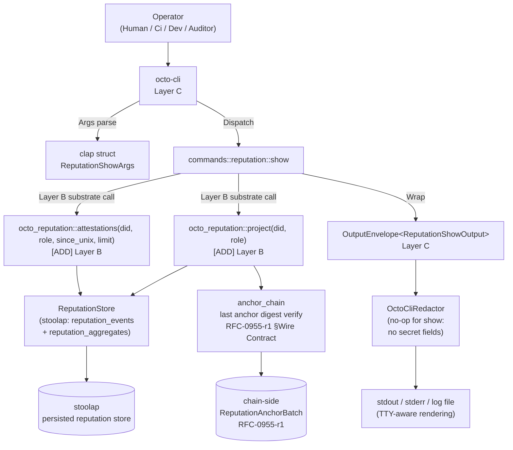

# RFC-0011-b: `octo reputation` Subcommands — Reputation Read Surface

## Status

**Accepted (v1.4, 2026-08-31).**

> **Amendment chain context:** This RFC is the **second amendment** of the RFC-0011 amendment chain (per parent Status header). It extends the parent substrate with the reputation-read surface and one subcommand (`octo reputation show`). Follow-on amendments per parent Status header: audit (RFC-0011-a), reputation (this RFC), agent lifecycle (RFC-0011-c), role provisioning (RFC-0011-d), vault operations (RFC-0011-e), mesh operations (RFC-0011-f), governance (RFC-0011-g).

**Submission Date:** 2026-08-31
**Acceptance Date:** 2026-08-31
**Last Updated:** 2026-08-31
**Changes:**

- 2026-08-31 — Initial draft. Single-subcommand amendment to RFC-0011 adding `octo reputation show` plus the substrate `[ADD]` projection surface.

## Authors

- Authored by `@cipherocto` and `@mmacedoeu` per the amendment chain enumerated in RFC-0011 Status header (audit, reputation, agent lifecycle, role provisioning, vault operations, mesh operations, governance). The Authorship Note placeholder is filled at promotion to Accepted.

## Maintainers

- Maintainer: `@cipherocto` per the amendment chain enumerated in RFC-0011 Status header.

## Summary

This amendment extends RFC-0011 with a single subcommand, `octo reputation show`, that surfaces the current reputation score and component breakdown for one `(did, role)` tuple as recorded in the canonical reputation registry. The subcommand is **strictly read-only**: no score write, no attestation issuance, no anchor submission. It composes three existing substrate surfaces (RFC-0968 §10 `ReputationRecord`, RFC-0968 §11 audit trail, RFC-0955-r1 anchor reference) via two new substrate entry points: `octo_reputation::project(did, role)` (aggregate projection) and `octo_reputation::attestations(did, role, since_unix, limit)` (attestation window). All projections are deterministic (RFC-0008 Class B; Dfp per RFC-0104) and fail-closed on missing attestation data, broken anchor chains, or revoked DIDs.

## Dependencies

**Requires:**

- RFC-0011 — `octo` CLI Substrate (parent; provides `OutputEnvelope<T>`, `OctoCliError`, `OctoCliRedactor`, exit code table, confirmation gate matrix, redaction patterns)
- RFC-0968 — Reputation Registry (substrate for `ReputationRecord`, `Did`, `RecorderId`, `SignalKind`, `ReputationLayer`, `ReputationError` discriminant table, `RotationReceipt`, attestation append-only model)
- RFC-0968-a2 — Discriminant Stability Sub-amendment (`ControllerIdMissing = 0x34` reserved discriminant; `controller_id = blake3(governance_pubkey)` derivation)
- RFC-0955-r1 — Reputation Anchoring Amendment (anchor chain semantics; `ReputationDigest`; `ReputationAnchorBatch`; BLAKE3 anchor_digest over the canonical 24-byte Dfp BLOB)

**Optional / Beneficial:**

- RFC-0104 — Deterministic Floating-Point (Dfp substrate for score_ewma projection; required for RFC-0008 Class B determinism)

> **Dependency Validation:** All "Requires" RFCs are Accepted on the date of this draft; DAG holds (RFC-0011 ← this; RFC-0968 ← this; RFC-0955-r1 ← this; RFC-0968-a2 amends RFC-0968 which is required transitively). No "Planned" dependencies.

## Design Goals

| Goal | Target                                         | Metric                                                                                                                                                                                                                                                         |
| ---- | ---------------------------------------------- | -------------------------------------------------------------------------------------------------------------------------------------------------------------------------------------------------------------------------------------------------------------- |
| G1   | Deterministic score projection across replicas | RFC-0008 Class B; identical input bytes → identical projection bytes (Dfp per RFC-0104)                                                                                                                                                                        |
| G2   | No score fabrication under missing data        | No error under missing component data; the substrate projects the missing component as `Dfp::ZERO` and the projection proceeds (canonical "no signal yet" per §7.5); anchor chain mismatch is the tampering-error path (exit 22), NOT missing-data fabrication |
| G3   | Anchor chain integrity                         | Projection MUST verify last anchor digest against current aggregate; tampered chain → `AnchorChainBroken` exit 22                                                                                                                                              |
| G4   | Public attestation surface                     | Attestation `subject_did` and `attestor_did` are public on the wire; `show` emits no redaction placeholder for either field                                                                                                                                    |
| G5   | Layer C/D extension only                       | No new Layer-A or Layer-B types; this amendment adds one Layer-B `[ADD]` projection module + Layer-C clap struct                                                                                                                                               |

## Motivation

Operators have no current way to view their own reputation score, component breakdown, or recent attestations from the `octo` CLI. RFC-0968 substrate exposes the data, RFC-0955-r1 anchors it, and RFC-0011 establishes the substrate-bridging CLI patterns — but no operator-facing entry point exists. The user-facing impact: an operator who holds OCTO-A role tokens cannot audit the social signal drift on their account, cannot verify their performance score after a model upgrade, and cannot see which attestors have staked confidence in them. This amendment closes that operator gap with a read-only projection that surfaces all four reputation components (identity, stake, performance, social) plus the recent attestation window.

The amendment is **deliberately scoped to one subcommand** (`reputation show`). Attestation issuance (`octo reputation attest`) and anchor submission (`octo reputation anchor`) defer to follow-on amendments per the parent Status header chain — those write operations require substrate authority work (recorder registration, governance quorum binding) that is out of scope for a read-only amendment.

## Roles and Authorities

| Role               | Identifier                                         | Authority Scope                                | Lifecycle                                                         | Source/Ref                      |
| ------------------ | -------------------------------------------------- | ---------------------------------------------- | ----------------------------------------------------------------- | ------------------------------- |
| Operator           | `OctoOperator` (per parent §Roles and Authorities) | Invoke `octo reputation show` (read)           | Per operator mode (Human / Ci / Dev / Auditor)                    | RFC-0011                        |
| Reputation Subject | `Did` (`did:octo:b<52>` per RFC-0968 §2)           | Subject of the projection (own DID by default) | `Active → Suspended → Revoked`                                    | RFC-0968 §Roles and Authorities |
| Recorder           | `RecorderId(Did)`                                  | Wrote the underlying signals                   | `Active → Suspended → Revoked` (+`UnderStaked`/`Stale`/`Expired`) | RFC-0968 §Roles and Authorities |
| Reader             | `ReaderId(Did)`                                    | Reads aggregate reputation                     | Per-query (no persistent lifecycle)                               | RFC-0968 §Roles and Authorities |
| Auditor            | `AuditorId(Did)`                                   | Replays full signal history                    | One-shot signed query                                             | RFC-0968 §Roles and Authorities |
| Attestor           | `AttestorId(Did)`                                  | Replicates events cross-mission                | Mission 0855p-b scope                                             | RFC-0968 §Roles and Authorities |

**Mode-specific behavior for `octo reputation show`:**

| Operator mode     | Authority                                                                                                                 |
| ----------------- | ------------------------------------------------------------------------------------------------------------------------- |
| `human` (default) | May view own + any subject's projection                                                                                   |
| `ci`              | May view own + any subject's projection                                                                                   |
| `dev`             | May view own + any subject's projection (routes through production substrate per RFC-0011 §Confirmation Flag Matrix note) |
| `auditor`         | May view any subject's projection EXCEPT revoked DIDs (fail-closed; see §Security Considerations)                         |

**Role transitions:** None. This amendment is read-only; no role transitions are introduced.

**Out-of-scope roles:** The `Recorder` write-authority role (RFC-0968 §Roles and Authorities) is NOT granted to the CLI invocation — `show` does not write. Attestation issuance authority is reserved for the future `reputation attest` amendment per parent Status header.

## Specification

### 7.1 System Architecture



The amendment introduces **two** `[ADD]` Layer-B entry points (`project`, `attestations`) and **one** new clap subcommand struct. All output flows through the existing `OutputEnvelope<T>` envelope and `OctoCliRedactor` (no new redaction patterns are required for `show`).

### 7.2 Subcommand Taxonomy

This amendment adds **one** subcommand to the parent §Subcommand Taxonomy:

| Subcommand             | Phase                    | Amendment  |
| ---------------------- | ------------------------ | ---------- |
| `octo reputation show` | Phase 5 (this amendment) | RFC-0011-b |

The new subcommand:

| Aspect       | Value                                                                                                                                                                                                                                                                                                                                                                                                                               |
| ------------ | ----------------------------------------------------------------------------------------------------------------------------------------------------------------------------------------------------------------------------------------------------------------------------------------------------------------------------------------------------------------------------------------------------------------------------------- |
| Args         | `[--role <role>]` (optional; defaults to the active role from `octo-wallet` context; see §7.4 substrate dependency)                                                                                                                                                                                                                                                                                                                 |
| Flags        | `--since <unix-secs>` (optional; default: 0 — show all attestations subject to `--limit`), `--limit <N>` (optional; default: 10), `--no-anchor-verify` (DEV-ONLY escape hatch — see §Security Considerations 1a). The subject DID is implicit (the active identity from `octo-wallet` context); `show` has no `--did` override in v1.0. Projection is always-live (no `--cached`/`--live` toggles; see §Security Considerations 2). |
| Output       | `OutputEnvelope<ReputationShowOutput>` (see §7.3)                                                                                                                                                                                                                                                                                                                                                                                   |
| Substrate    | `[ADD] octo_reputation::project(did, role) -> Result<ReputationRecord, ReputationError>`; `[ADD] octo_reputation::attestations(did, role, since_unix, limit) -> Result<Vec<AttestationSummary>, ReputationError>` (see §7.4)                                                                                                                                                                                                        |
| Exit codes   | 0 (success), 2 (no active identity / subject invalid), 20 (reputation not found for `(did, role)`), 21 (DID revoked), 22 (anchor chain broken)                                                                                                                                                                                                                                                                                      |
| Redaction    | None (attestation `subject_did` + `attestor_did` are public; see §7.7)                                                                                                                                                                                                                                                                                                                                                              |
| Side effects | None (read-only; no substrate write)                                                                                                                                                                                                                                                                                                                                                                                                |
| Dry-run      | N/A (no mutation to preview)                                                                                                                                                                                                                                                                                                                                                                                                        |

### 7.3 Output Envelope

The subcommand emits the parent-defined `OutputEnvelope<T>` with `T = ReputationShowOutput`:

```rust
/// Output data for `octo reputation show`. Layer C operator UX type;
/// no Layer-A or Layer-B fields.
#[derive(Serialize, Deserialize, Debug, Clone)]
pub struct ReputationShowOutput {
    /// Subject DID (canonical `did:octo:b<52>` per RFC-0968 §2).
    pub did: String,

    /// Role token (e.g., `octo-a`, `octo-b`, `octo-o`, `octo-w`).
    pub role: String,

    /// Composite reputation score in `[0.0, 1.0]` (Dfp per RFC-0104).
    /// Weighted average per §7.5.
    pub score: Dfp,

    /// Component breakdown. Each value is normalized to `[0.0, 1.0]`.
    pub components: ReputationComponents,

    /// Recent attestation window (most-recent-first; size = `min(limit, N)`).
    pub attestations: Vec<AttestationSummary>,

    /// RFC 3339 UTC timestamp of the substrate aggregate read.
    pub last_updated_unix: i64,

    /// Reference to the last anchor on chain (RFC-0955-r1 §Wire Contract).
    /// `None` if the subject has never been anchored (initial state).
    pub anchor_ref: Option<AnchorRef>,
}

#[derive(Serialize, Deserialize, Debug, Clone)]
pub struct ReputationComponents {
    /// Identity component: cryptographic identity anchoring + lifecycle
    /// state weight. Per RFC-0955-r1.
    pub identity: Dfp,
    /// Stake component: dual-stake weight (OCTO + role-token per
    /// RFC-0955-r1 §Cross-Layer Aggregation).
    pub stake: Dfp,
    /// Performance component: outcome signal EWMA + latency penalty
    /// per RFC-0968 §6 EWMA Algorithm.
    pub performance: Dfp,
    /// Social component: attestation count + attestor trust weight
    /// per RFC-0955-r1 §Cross-Layer Aggregation.
    pub social: Dfp,
}

// `AttestationSummary` and `AnchorRef` are re-exported from `octo-reputation`
// (see §7.4). The CLI does NOT redeclare them; the substrate owns the canonical
// definition and the CLI consumes the re-export.
pub use octo_reputation::{AttestationSummary, AnchorRef};
```

`OutputEnvelope<T>` is the parent-defined envelope (RFC-0011 §Output Envelope); the new `ReputationShowOutput` is the `T` parameter. `schema_version` is inherited from the parent envelope (currently `2`); no version bump is required for this additive `T` payload per RFC-0011 §Compatibility (add-only changes within a major version are non-breaking). `generated_at` and `exit_code` are set per parent conventions.

**`Dfp` newtype:** The `Dfp` type is the RFC-0104 deterministic floating-point representation. Substrate re-exports it as `octo_determin::Dfp`; this amendment does NOT introduce a parallel type — see §Rationale for the reuse rationale.

**`ReputationShowOutput` vs `ReputationRecord`:** The CLI-side `ReputationShowOutput` is **NOT a 1:1 mirror** of the substrate `ReputationRecord`. It **composes** the substrate `project()` return (`ReputationRecord`) with the substrate `attestations()` window (`Vec<AttestationSummary>`) at the dispatch boundary, then re-emits both under a single envelope payload. The wrapper is intentional: it carries the `attestations: Vec<AttestationSummary>` field that the substrate `project()` does NOT populate (that field lives behind the separate `attestations()` entry point per §7.4). All `ReputationRecord` fields (per §7.4 subtype definitions) are surfaced 1:1; the wrapper adds the attestation window as a CLI-side composition. Substrate (RFC-0968 §9) returns the composite `score` field; CLI passes through unchanged. **Re-export audit comment block:** this wrapper MUST be re-audited whenever substrate `ReputationRecord` gains a field — the conversion is `ReputationRecord → ReputationShowOutput` via `.into()` plus the `attestations()` merge; any new substrate field requires an explicit CLI-side decision (surface-as-is, redact, or drop). The conversion is `ReputationRecord → ReputationShowOutput` via `.into()` at the dispatch boundary; the wrapper is the Layer-C envelope payload, not a parallel substrate type. See §Rationale for the layered separation rationale.

### 7.4 Substrate `[ADD]` Signatures

Two new Layer-B entry points are required. Both are added by the substrate work that lands alongside this amendment (mission `0011-b-reputation-show`); the CLI cannot compile until both are landed.

```rust
// crates/octo-reputation/src/projection.rs (NEW; module-level add)

/// Aggregate projection of reputation for one `(did, role)` tuple.
///
/// Deterministic per RFC-0008 Class B (Dfp arithmetic per RFC-0104).
/// Verifies the last anchor digest against the current aggregate per
/// RFC-0955-r1 §Wire Contract; returns `AnchorChainBroken` on mismatch.
///
/// Failure modes (mapped to `OctoCliError` exit codes by the CLI):
/// - `ReputationError::SubjectInvalid`         → CLI exit 2 (`SubjectInvalid`; canonical-DID validation failure per RFC-0968 §2)
/// - `ReputationError::RotationProvenanceMissingTombstoned` (0x2E per RFC-0968-a2 §3) → CLI exit 2 (`NoActiveIdentity`-equivalent; rotation tombstone missing)
/// - `ReputationError::ControllerIdMissing`    (0x34 per RFC-0968-a2 §3)        → CLI exit 2
/// - `ReputationError::SubjectRevoked`         → CLI exit 21 (`ReputationRevoked`)
/// - `ReputationError::AggregateEmpty`         → CLI exit 20 (`ReputationNotFound`); `AggregateEmpty` is emitted by `project()` ONLY when no aggregate row exists for the `(did, role)` tuple — see §7.5 for the missing-component path (populated row with all-zero components exits 0 with `score = Dfp::ZERO`)
/// - `ReputationError::AnchorDigestMismatch`   → CLI exit 22 (`AnchorChainBroken`)
/// - `ReputationError::RoleUnauthorized`       → CLI exit 23 (`RoleUnauthorized`; NEW variant — reserved per parent §Status amendment chain; emitted when `project()` rejects a `Role` not held by the active identity's role-token holdings per RFC-0968 §3 role-token authorization. **Substrate ratification pending:** no `ReputationError` discriminant is currently allocated for `RoleUnauthorized` per RFC-0968-a2 §3 reserved range `0x2A..=0xFF`; ratification requires a follow-on RFC-0968 amendment to formalize the discriminant before exit-23 mapping can land in substrate code. Exit 23 is reserved here as the agreed CLI-side slot.)
pub fn project(did: &Did, role: &Role) -> Result<ReputationRecord, ReputationError>;

/// Attestation window for one `(did, role)` tuple, filtered by `since_unix`
/// (inclusive lower bound) and capped at `limit` (most-recent-first).
///
/// Returned attestations are the underlying RFC-0968 §11 audit-trail
/// entries projected to `AttestationSummary` (no full payload disclosure —
/// `show` is a read-only projection, not an auditor replay).
///
/// Failure modes (inherited from `project()` per RFC-0968 §13; mapped to
/// `OctoCliError` exit codes by the CLI):
/// - `ReputationError::SubjectInvalid`         → CLI exit 2 (`SubjectInvalid`)
/// - `ReputationError::RotationProvenanceMissingTombstoned` (0x2E per RFC-0968-a2 §3) → CLI exit 2 (`NoActiveIdentity`-equivalent)
/// - `ReputationError::ControllerIdMissing`    (0x34 per RFC-0968-a2 §3)        → CLI exit 2 (`NoActiveIdentity`-equivalent)
/// - `ReputationError::SubjectRevoked`         → CLI exit 21
///
/// Empty result set returns `Ok(Vec::new())` (never `Err`); caller
/// distinguishes "no attestations" from "no error" by length. An
/// `AggregateEmpty` from `project()` does NOT propagate through this
/// entry point — a subject may have zero attestations but a populated
/// aggregate (initial state); the attestation window is independently
/// queried and independently empty.
pub fn attestations(
    did: &Did,
    role: &Role,
    since_unix: i64,
    limit: u32,
) -> Result<Vec<AttestationSummary>, ReputationError>;
```

**Subtype definitions (also `[ADD]` but living in existing RFC-0968 substrate):**

- `ReputationRecord` — projection-shaped struct in `octo-reputation`. Fields: `{ did: Did, role: Role, score: Dfp, components: ReputationComponents, anchor_ref: Option<AnchorRef>, last_updated_unix: i64 }`. The `score` field is the substrate-owned composite per RFC-0968 §9; the CLI surfaces it via the canonical RFC-0104 Dfp wire form unchanged (no CLI-side recomputation). The CLI-side `ReputationShowOutput` is a **composite** of `ReputationRecord` (from `project()`) plus `Vec<AttestationSummary>` (from `attestations()`); see §7.3 for the wrapper intent and the re-export audit comment block.
- `AttestationSummary` — canonical struct owned by `octo-reputation` (RFC-0968 §10); re-exported to the CLI via `pub use octo_reputation::AttestationSummary` (no CLI-side redeclaration; no parallel type per §Rationale).
- `AnchorRef` — canonical struct owned by `octo-reputation` (RFC-0955-r1 §Wire Contract); re-exported to the CLI via `pub use octo_reputation::AnchorRef` (no CLI-side redeclaration; no parallel type per §Rationale).
- `Role` — typed newtype (`pub struct Role(String)`); `Role::parse(s)` rejects empty/whitespace input; catalog enumeration lands via RFC-0011-d (role provisioning).

**Layer model audit:** The `[ADD]` substrate entry points are pure Layer-B additions (one new module `projection.rs` in `octo-reputation`; existing types `ReputationRecord`, `Role` already live in `octo-reputation` per RFC-0968 §10). Per CLAUDE.md §Architectural Principles (Layer B depends on Layer A only; CLI depends on Layer B, not reverse), this respects dependency direction.

### 7.5 Score Breakdown

The composite `score` is the **weighted arithmetic mean** of the four components (each already normalized to `[0.0, 1.0]` by the substrate projection). Weights are fixed at substrate compile time:

| Component     | Weight   | Rationale                                                                                               |
| ------------- | -------- | ------------------------------------------------------------------------------------------------------- |
| `identity`    | 0.20     | Cryptographic identity anchoring + lifecycle state weight; foundational but not directly growth-bearing |
| `stake`       | 0.25     | Dual-stake commitment (OCTO + role-token); economic alignment                                           |
| `performance` | 0.35     | Measurable outcomes (latency, success rate, capacity); the most growth-bearing signal                   |
| `social`      | 0.20     | Attestation count + attestor trust weight; ecosystem validation                                         |
| **Total**     | **1.00** |                                                                                                         |

The composite formula:

```
score = (identity * 0.20) + (stake * 0.25) + (performance * 0.35) + (social * 0.20)
```

**Dfp arithmetic per RFC-0104:** Substrate returns `score: Dfp` per RFC-0968 §9 Cross-Layer Aggregation and Normalization; CLI surfaces as Dfp wire form (no conversion). The composite formula is computed substrate-side as a Dfp weighted arithmetic mean (all four multiplications and the sum are `Dfp` operations; no `f64` conversion in the substrate projection). The CLI displays the result via `Dfp::to_string()` which renders the canonical decimal form per RFC-0104 §Wire Contract.

**Per-component normalization:**

- `identity` — substrate projects the canonical identity state (keypair bound to DID, lifecycle = `Active`) to `1.0`; lifecycle = `Suspended` → `0.5`; lifecycle = `Revoked` → fails earlier at `project()` (exit 21) and never reaches component calculation. Weighted mean includes identity decay under rotation per RFC-0968 §2.1 (rotation decay factor `0.9`).
- `stake` — substrate projects the dual-stake (OCTO + role-token) to `[0.0, 1.0]` via a sigmoid over the log-stake curve; RFC-0968 §9 cross-layer aggregation provides the constants. The CLI does NOT expose the underlying stake amount — only the normalized component.
- `performance` — substrate projects the EWMA score from RFC-0968 §6 over outcome + latency signals per layer; the CLI component is the weighted cross-layer aggregate per RFC-0968 §9.
- `social` — substrate projects the attestation count (weighted by attestor trust per RFC-0968 §10) to `[0.0, 1.0]` via a saturating curve; the CLI component is the normalized aggregate.

**No score fabrication under missing data (G2):** If ANY of the four components has no underlying data (zero attestations, no performance signal, identity state machine transition, no stake), the substrate returns the component as `Dfp::ZERO` and the projection proceeds. The CLI surfaces `0.0` for that component in the output — this is NOT fabrication, this is the canonical substrate projection of "no signal yet" (RFC-0968 §9 cross-layer aggregation explicitly handles the empty-aggregate case). The `AnchorChainBroken` error (exit 22) is reserved for the case where the last anchor digest does NOT match the current aggregate — that is tampering detection, not missing data.

**`AggregateEmpty` vs all-zero components — boundary:** `AggregateEmpty` is emitted ONLY when the `(did, role)` tuple has no substrate aggregate row at all (substrate-side lookup miss; the subject has never had reputation signals recorded for the requested role). A populated aggregate row with all-zero component values (i.e., a row exists but every component field is `Dfp::ZERO` due to missing underlying data) exits 0 with `score = Dfp::ZERO` — this is the canonical "no signal yet" projection above, NOT an error. Test Vectors 2 and 6 assert this distinction: Vector 2 (all-zero populated row) exits 0; Vector 6 (no row exists) exits 20.

### 7.6 Attestation Surface

The `attestations` field exposes the most-recent-first window of attestation summaries. Filtering:

- `--since <unix-secs>` — inclusive lower bound on `recorded_at_unix`. Default: `0` (no lower bound; show all attestations subject to `--limit`).
- `--limit <N>` — maximum number of attestations returned. Default: `10`. Hard cap: `1000` (CLI-side validation rejects `--limit > 1000` with exit 2).

**Attestation visibility:**

- `subject_did` — public; never redacted (RFC-0968 §Roles and Authorities makes the Subject identity public).
- `attestor_did` — public; never redacted (RFC-0968 §3 Recorder Authorization makes the attestor identity public on the wire).
- `score_delta` — public; this is a normalized Dfp delta per RFC-0968 §6 EWMA Algorithm; not a raw stake or payout amount.
- `event_id`, `signal_kind`, `layer`, `recorded_at_unix`, `recorder_did` — all public per RFC-0968 §11 audit trail.

The full attestation payload (including any private meta-fields) is NOT exposed via `show` — that requires the auditor replay path (`AuditorId` with `AuditorAuth` per RFC-0968 §11), which is NOT a CLI surface in this amendment. Auditor mode invocation of `show` returns the same redacted-free summary as Human/Ci/Dev modes; the difference is only the revoked-DID fail-closed behavior (§Security Considerations 3).

**Sort order:** Most-recent-first (`ORDER BY recorded_at_unix DESC, event_id ASC`). The `event_id` tiebreaker is a BLAKE3-256 per RFC-0968 §11; deterministic ordering across replicas requires it (RFC-0008 Class B). Windowing via repeated `--since` calls (manual pagination; cursor support deferred to follow-on amendment per §Future Work) — substrate **reserves** cursor pagination support (next_cursor type per RFC-0968 §10); RFC-0011-b is read-only v1.0 with hard limit.

### 7.7 Redaction

**No redaction is required for `octo reputation show`.** Per RFC-0011 §Redaction Layer the redactor applies to `tracing` log events; the `OutputEnvelope<T>` itself does not pass through the redactor (the redactor is a tracing layer, not an output filter). The fields in `ReputationShowOutput` and `AttestationSummary` are all public-on-the-wire per RFC-0968 §Roles and Authorities + §11; no `seed_bytes`, `private_key`, `holder_sig`, `pair_code`, `password`, `mnemonic`, `seed_phrase`, `passphrase`, `pin`, `api_key`, `secret`, `token`, or `Bearer <token>` patterns appear.

The redactor STILL wraps the `tracing::subscriber` initialization in `octo-cli` per parent convention — it is a no-op for `show` but is required for cross-subcommand consistency (e.g., the redactor is registered once at process start and is reused for any future mutating command invocation).

## RFC-0008 Execution Class Mapping

| Operation                            | Class | Rationale                                                                                                  |
| ------------------------------------ | ----- | ---------------------------------------------------------------------------------------------------------- |
| `octo reputation show`               | C     | Read-only projection from persisted substrate; no consensus impact; Dfp arithmetic is Class B per RFC-0104 |
| `OutputEnvelope<T>` rendering        | A     | Inherited from parent (deterministic JSON/YAML serialization)                                              |
| `OctoCliRedactor` registration       | A     | Inherited from parent (deterministic pattern matching)                                                     |
| Substrate `octo_reputation::project` | B     | Dfp arithmetic per RFC-0104; deterministic given identical substrate state                                 |

## Error Handling

This amendment adds four `OctoCliError` variants and reserves exit codes 20–22 (plus an exit-2 mapping for `SubjectInvalid`, shared with the parent `NoActiveIdentity` slot per parent §Exit Code Table row 2):

```rust
#[derive(thiserror::Error, Debug)]
pub enum OctoCliError {
    // ... existing variants per parent §Error Handling ...

    /// Subject DID failed canonical `did:octo:` validation per
    /// RFC-0968 §2 (malformed, unknown namespace, or non-b<52>
    /// encoding). Distinct from `NoActiveIdentity` (parent variant):
    /// `SubjectInvalid` means the DID is structurally invalid; the
    /// parent variant means no active identity is selected.
    #[error("subject did invalid: did={did}")]
    SubjectInvalid { did: String },  // exit 2 (shared slot per parent §Exit Code Table row 2)

    /// Reputation aggregate empty for the given `(did, role)` tuple.
    /// The subject may exist on the registry but has no reputation
    /// signals yet (zero attestations, no performance signal).
    #[error("reputation not found: did={did}, role={role}")]
    ReputationNotFound { did: String, role: String },  // exit 20

    /// Subject DID is in `Revoked` lifecycle state per RFC-0968 §2.1.
    /// Auditor mode MUST fail-closed here per §Security Considerations 3.
    #[error("reputation revoked: did={did}")]
    ReputationRevoked { did: String },  // exit 21

    /// Last anchor digest does NOT match the current aggregate per
    /// RFC-0955-r1 §Wire Contract. Tampering detection; projection
    /// MUST NOT proceed.
    #[error("anchor chain broken: did={did}, last_anchor_unix={last_anchor_unix}")]
    AnchorChainBroken { did: String, last_anchor_unix: i64 },  // exit 22

    // ... rest of existing variants ...
}
```

**Exit code reservation table (extending parent §Exit Codes):**

| Range     | Meaning                                                                   |
| --------- | ------------------------------------------------------------------------- |
| 0         | Success                                                                   |
| 2-16      | Per-`OctoCliError` variant (existing; per parent §Exit Codes)             |
| 17-19     | Reserved per parent Status header amendment chain (audit amendment range) |
| **20-22** | **Reputation subcommand variants (this amendment)**                       |
| 23-63     | Reserved per parent Status header amendment chain                         |
| 64        | `Internal` (existing)                                                     |
| 65        | `StaleStub` (existing)                                                    |
| 66-78     | Reserved for substrate-error sub-discriminator expansion                  |
| 79-99     | Reserved for future amendment additions per parent Status header          |
| 100-127   | Environment errors (existing)                                             |

User-facing message format follows the parent convention:

```
error: <short message>
  caused by: <chain from #[source] if present>
  hint: <remediation hint if available>
  exit code: <N>
```

**Variant sanitization (defense in depth):** All four new variants' `Display` strings MUST be passed through `sanitize_substrate_error(s)` before display per parent §Error Handling variant sanitization rule. The `user_message()` helper on `OctoCliError` runs `to_string()` output through the sanitizer so any substrate string interpolation cannot leak raw secret bytes. The four new variants do NOT embed any substrate-internal struct (`ReputationError`, `ReputationRecord`) directly in the error message; only the canonical strings `did`, `role`, and `last_anchor_unix` are surfaced.

## Performance Targets

| Metric                           | Target            | Notes                                                                                   |
| -------------------------------- | ----------------- | --------------------------------------------------------------------------------------- |
| Cold start                       | <100ms            | Inherited from parent (substrate crate load); unchanged                                 |
| `reputation show` latency        | <70ms p95         | Sum of `project` + `attestations` + serialize; 5ms headroom over the 65ms substrate sum |
| Substrate `project` latency      | <30ms p95         | Single aggregate SELECT + anchor verification (RFC-0955-r1)                             |
| Substrate `attestations` latency | <30ms p95         | Window SELECT with `ORDER BY recorded_at_unix DESC, event_id ASC LIMIT N`               |
| Output serialization             | <5ms              | Inherited from parent; `OutputEnvelope<T>` + serde_json                                 |
| Redaction overhead               | <1ms per log line | Inherited from parent; no-op for `show`                                                 |

The CLI is operator-facing; throughput is not a primary concern. Latency targets exist to keep the operator experience responsive per parent §Performance Targets convention.

## Implicit Assumptions Audit

| Assumption                                                                                                                            | Failure mode                                                                                         | Mitigation                                                                                                                                                                                                      | Acceptance |
| ------------------------------------------------------------------------------------------------------------------------------------- | ---------------------------------------------------------------------------------------------------- | --------------------------------------------------------------------------------------------------------------------------------------------------------------------------------------------------------------- | ---------- |
| Anchor chain is monotonic — last anchor digest dominates all prior anchor digests per RFC-0955-r1 §Wire Contract                      | Replay or rewrite of older anchor digest could present a stale aggregate as fresh                    | Substrate `project()` verifies the last anchor digest against the current aggregate; mismatch → `AnchorChainBroken` (exit 22)                                                                                   | REQUIRED   |
| Attestations are append-only — RFC-0968 §11 audit trail; no UPDATE or DELETE on the `reputation_events` table                         | Deletion would silently lower attestation count; update would corrupt score_ewma                     | Substrate `attestations()` reads from the audit trail; trust the append-only property; verify via the substrate invariant test (`append_only_no_update_path`)                                                   | REQUIRED   |
| No reputation fabrication under missing attestors — if a signal was written by a now-revoked recorder, the projection MUST NOT use it | Revoked recorder could launder reputation via stale signals                                          | Substrate `project()` filters signal contributions by `RecorderId` lifecycle state at read time; revoked recorders contribute 0 to all components per RFC-0968 §3                                               | REQUIRED   |
| The substrate aggregate store has the same `(did, role)` tuple uniqueness as RFC-0968 §5 storage schema                               | Duplicate `(did, role)` rows would corrupt the weighted mean                                         | Substrate enforces `UNIQUE(did_hash, role)` constraint at the storage layer; CLI surfaces any substrate uniqueness violation as `Internal` (exit 64)                                                            | REQUIRED   |
| The current substrate state is consistent with the last chain-side anchor per RFC-0955-r1 §Wire Contract                              | Network partition between substrate and chain could surface un-anchored state as if it were anchored | Substrate `project()` reads `anchor_ref` from the substrate (last successful anchor); the projection is always-live (no `--cached` flag exists in v1.0) so there is no stale-cache surface to partition-against | REQUIRED   |

## Security Considerations

1. **Anchor integrity (G3)** — `project()` MUST verify the last anchor digest against the current aggregate per RFC-0955-r1 §Wire Contract. A tampered anchor chain MUST yield `AnchorChainBroken` (exit 22), not a fabricated score. The verification is substrate-side; the CLI does not duplicate the check. Test vectors §Test Vectors assert this path.

1a. **`--no-anchor-verify` DEV-ONLY escape hatch** — A `--no-anchor-verify` flag exists for DEV mode ONLY. In Human / Ci / Auditor modes the flag is rejected by dispatch-time mode check (mode gate in dispatch; no clap conflict attribute — the `--live` flag does not exist in this RFC). DEV mode acceptance is documented; the flag is for development iteration against synthetic substrate state. The flag is documented in §7.2 Flags but is NOT promoted to Human / Ci / Auditor acceptance.

2. **Cached vs live projection** — `octo reputation show` is always-live by invariant (no `--cached`/`--live` toggles in v1.0). Projection always reads from the live substrate aggregate store. Caching is deferred to a future amendment if load warrants (RFC-0968 §14 performance budget suggests no cache needed at the current query volume).

3. **Auditor mode MUST NOT see projected score for revoked DID (fail-closed)** — Auditor mode invocation of `reputation show` against a revoked active-identity subject MUST exit 21 (`ReputationRevoked`). (The subject DID is the active identity per §7.2 — there is no `--did` override; the invocation targets the operator's own DID, which is then checked for revoked lifecycle state.) This is a fail-closed security control: an attacker who has revoked their own DID MUST NOT be able to use Auditor mode to inspect their prior score (which would otherwise expose a snapshot before revocation). Implementation: dispatch-time check in `commands::reputation::show` after `project()` returns `SubjectRevoked`; the check raises `ReputationRevoked` (exit 21) for all operator modes including Auditor (the error path is the same — Auditor does not get a different code path here). Test vector §Test Vectors row "revoked-did-denied" asserts this path for all four operator modes.

4. **No redaction required** — see §7.7. All output fields are public per RFC-0968 §Roles and Authorities + §11.

5. **Command injection via `--role`** — `--role <role>` is parsed via `Role::parse(s)` which rejects empty/whitespace input (exit 2 on rejection). For v1.0, the parse accepts any non-empty non-whitespace string; catalog enumeration is deferred to RFC-0011-d per §7.4. The `ClapParse` variant covers all clap-layer validation; no custom error variant is required for v1.0.

6. **Replay via cloned event_id** — `AttestationSummary.event_id` is a BLAKE3-256 per RFC-0968 §11. The CLI does NOT trust operator-supplied `event_id`; substrate `attestations()` returns the canonical sequence from the audit trail. The CLI cannot be tricked into presenting a forged attestation window.

## Adversarial Review (substrate attack surface)

1. **Sybil via attestations** — Attacker mints N identities, has them all attest each other, inflates `social` component. **Defense:** Substrate `social` projection weights attestor trust per RFC-0968 §10; trust derives from dual-stake, not raw attestation count. N identities with zero dual-stake contribute negligible `social`. CLI surfaces `attestations: Vec<AttestationSummary>` with `attestor_did` field; the operator can visually audit for sybil patterns. **Residual risk:** Operator must actually audit; CLI does not auto-detect sybil. ACCEPTED — auto-detection is a substrate feature, not a CLI feature.

2. **Social score manipulation** — Attacker bribes high-trust attestors to attest favorably, inflates `social` component. **Defense:** Each attestation is signed by the attestor (RFC-0968 §3) and recorded in the audit trail (RFC-0968 §11). Bribed attestors are individually accountable; their trust weight can be slashed by a governance vote (deferred amendment). CLI surfaces `attestor_did` per attestation; the operator can audit. **Residual risk:** Cannot prevent pre-attestation bribery. ACCEPTED — economic game theory, not a CLI concern.

3. **Anchor replay** — Attacker replays a stale `ReputationAnchorBatch` to chain-side, presenting yesterday's anchor as if it were today's. **Defense:** Monotonic anchor chain per RFC-0955-r1 §Wire Contract; substrate `project()` rejects any anchor with `chain_block_height < last_anchor_height`. CLI exit 22 on mismatch. **Residual risk:** Chain-side reorg could re-present a stale anchor. ACCEPTED — chain-side reorg is a chain concern; CLI does not duplicate the check.

4. **Stale projection** — Operator runs `show` against cached state and misses recent attestations. **Defense:** Always-live projection by invariant; no `--cached` flag exists in v1.0 (see §Security Considerations 2). **Residual risk:** A future caching amendment must default to live and require explicit `--cached` opt-in. DOCUMENTED for follow-on amendment.

5. **DID squatting** — Attacker registers a DID, accumulates reputation, rotates to a new DID, accumulates more, rotates again — reputation inflation via repeated rotation. **Defense:** RFC-0968 §2.1 rotation decay factor `0.9` per rotation; rotations are public in the substrate audit trail; CLI surfaces `IdentityRecord.rotation_history` via `octo identity show` (parent §Subcommand Taxonomy; out of scope for this amendment but the data flow is in place). **Residual risk:** Decay factor may be too lenient; tunable via `RouterConfig.rotation.decay_q32_32` per RFC-0927. ACCEPTED.

## Adversary Analysis (CLI attack surface)

### Anchor digest forgery on `--no-anchor-verify`

1. **Who benefits?** — Developer iterating against synthetic substrate state (legitimate) or attacker with DEV access trying to forge a high score (legitimate but bounded).
2. **What does it cost them?** — Set `OCTO_ENV=development`; load `InMemorySigner`; the dispatch-time mode check passes for `--no-anchor-verify` in DEV.
3. **What do they gain if successful?** — Synthetic high score; cannot be used in Human / Ci / Auditor mode (clap rejects the flag there); cannot be cross-submitted to chain (anchor verification is still required for chain-side acceptance per RFC-0955-r1 §Implementation Phases).
4. **What's our defense?** — Flag is DEV-ONLY via mode check; chain-side re-verification rejects any un-anchored state; production substrate rejects `InMemorySigner` unless `OCTO_ENV=development` (parent §Security Considerations 4).
5. **Residual risk?** — DEV environment compromise could allow forged-state inspection locally; no cross-substrate or cross-chain impact. ACCEPTED — DEV environment is not a trust boundary.

### Auditor mode DID inspection of revoked subject

1. **Who benefits?** — Auditor (legitimate) or attacker posing as auditor (legitimate DID required; RFC-0968 §Roles and Authorities).
2. **What does it cost them?** — Acquire `AuditorId` (DID + governance-granted capability per RFC-0968 §Roles and Authorities, RFC-0957 macaroon caveat chain); invoke `reputation show` against a revoked active-identity subject.
3. **What do they gain if successful?** — In v0.x designs, they could inspect the prior score before revocation (privacy leak). Under this amendment, they CANNOT — Auditor mode invocation of `show` against a revoked active-identity subject exits 21 (per §Security Considerations 3).
4. **What's our defense?** — Dispatch-time check raises `ReputationRevoked` for all operator modes including Auditor (see §Security Considerations 3). Cost: trivial.
5. **Residual risk?** — None. ACCEPTED.

### Role-spoofing via `--role` parameter

1. **Who benefits?** — Malicious operator invoking `octo reputation show --role <fake-role>` to project reputation under a role they do not hold, possibly to claim authority they lack.
2. **What does it cost them?** — Low: pick an arbitrary role string and invoke. v1.0 accepts any non-empty lowercase string per §7.4 catalog deferral note; catalog enumeration lands via RFC-0011-d.
3. **What do they gain if successful?** — A composite `score` for a `(did, fake-role)` tuple the operator does not legitimately hold; downstream consumers that trust the projection without re-validating the role binding could be misled.
4. **What's our defense?** — Substrate `project()` validates the `Role` enum binding against the active identity's role-token holdings (RFC-0968 §3 role-token authorization). A role the subject does not hold yields `ReputationError::RoleUnauthorized` (NEW variant; exit 23 reserved per parent §Status amendment chain; see §7.4 failure modes table row 7). An unknown role yields `AggregateEmpty` (exit 20 `ReputationNotFound`). The CLI surfaces both unchanged. RFC-0011-d adds CLI-side catalog enumeration as a non-breaking supplement (see §Compatibility).
5. **Residual risk?** — The exit-23 `RoleUnauthorized` mapping is reserved per parent §Status amendment chain and is allocated here for the first time; ratification at the substrate discriminant level requires a follow-on RFC-0968 amendment to formalize the new `ReputationError::RoleUnauthorized` variant (no discriminant currently allocated per RFC-0968-a2 §3 reserved range `0x2A..=0xFF`). Until that amendment lands, the CLI maps `ReputationError::AggregateEmpty` to exit 20 `ReputationNotFound` for both "unknown role" and "role not held" — the CLI cannot distinguish them. ACCEPTED pending mission `0011-b-reputation-show` substrate implementation verification AND the follow-on RFC-0968 amendment.

### Timestamp-future attestation injection via `--since`

1. **Who benefits?** — Compromised CLI process or operator attempting to backdate the attestation window by passing a future `--since` value, hiding recent attestations from the rendered window.
2. **What does it cost them?** — Medium: require local CLI compromise OR social-engineering of an operator who does not understand `--since` semantics.
3. **What do they gain if successful?** — A truncated `attestations` window that omits recent entries; downstream audit consumers might trust the omission as "no recent attestations" rather than as "window filter applied".
4. **What's our defense?** — **Two-layer defense.** **(a) CLI-side clamp:** the clap `value_parser` on `--since` (Appendix A `parse_since_unix`) rejects any value `> now_unix + clock_skew_tolerance_secs` at parse time, mapping to `OctoCliError::SubjectInvalid` (exit 2) per RFC-0968 §15 clock-skew sensitivity. The closure captures invocation-time `now_unix` and the documented `clock_skew_tolerance_secs` constant (parent §Confirmation Flag Matrix convention). **(b) Substrate-side clamp:** `attestations()` independently rejects `--since` values exceeding the substrate's `now_unix` per RFC-0968 §11 audit-trail monotonic invariant; the SQL `WHERE recorded_at_unix >= ?` parameter is validated before query execution. **Both gates run;** CLI-side failure short-circuits without invoking the substrate. Defense-in-depth: a future-unix value never reaches the substrate under normal flow.
5. **Residual risk?** — Local clock skew between CLI host and substrate can produce spurious rejections near the boundary. ACCEPTED — clock-skew sensitivity is a documented cross-host concern (RFC-0968 §15 lifecycle coverage); out of scope for this read-only amendment.

### Component weighting poisoning via governance

1. **Who benefits?** — Governance majority seeking to skew reputation scores in their favor by amending the component weights (`identity 0.20`, `stake 0.25`, `performance 0.35`, `social 0.20` per §7.5).
2. **What does it cost them?** — High: requires a governance vote per RFC-0011 amendment chain (parent §Status) plus on-chain anchor submission per RFC-0955-r1 §Wire Contract.
3. **What do they gain if successful?** — A future amendment changes the weight vector; the substrate composite formula re-projects under the new weights, inflating or deflating scores for favored/penalized subject classes.
4. **What's our defense?** — **Two-track amendment gate.** The weight constants `(identity 0.20, stake 0.25, performance 0.35, social 0.20)` live in **RFC-0968 §9** substrate (NOT RFC-0011-b); this RFC only documents the v1.0 surface mapping per §7.5. Any weight change requires **(a)** an RFC-0968 amendment ratifying the new weight constants in §9 substrate AND **(b)** a corresponding RFC-0011 amendment chain point-release to surface the new weights in §7.5 (this RFC is read-only and cannot ship weight changes on its own — the substrate amendment triggers the RFC-0011 amendment chain per parent §Status header). Additionally, snapshot-weight governance (RFC-0955-r1 §Wire Contract) preserves the previous weight vector as canonical for already-anchored aggregates; new anchors use new weights; a re-anchor cycle is required to migrate. Historical determinism is preserved across the migration.
5. **Residual risk?** — Governance capture is a substrate-wide risk; this amendment does not introduce any new capture surface (the weight table is fixed in v1.0; v1.0 has no on-chain weight-amendment path). ACCEPTED — capture-resistance is a governance concern, not a CLI concern.

## Economic Analysis

**N/A.** This amendment is read-only score projection. No value is created, transferred, or destroyed. Staking operations (dual-stake per RFC-0955-r1) are RFC-0011-d territory (role provisioning amendment) and are explicitly out of scope for this read-only surface per parent §Economic Analysis convention.

## Compatibility

**Additive only.** This amendment adds one subcommand + two `[ADD]` substrate entry points. No existing subcommand is modified. No existing substrate API is renamed or removed. No existing `OutputEnvelope<T>` schema is broken (the `T = ReputationShowOutput` payload is new; parent envelope fields `schema_version`, `generated_at`, `exit_code`, `preview_only` are unchanged).

**Exit code reservation:** Reserves codes 20-22 per parent §Exit Codes "17-63 reserved per Status header amendment chain". No existing code is renumbered.

**Role name compatibility:** v1.0 accepts any non-empty lowercase string per §7.4 catalog deferral note; existing role names from RFC-0011 parent (`octo-a`, `octo-b`, `octo-o`, `octo-w`, etc.) pass unchanged. RFC-0011-d adds catalog enumeration as a non-breaking supplement (v1.0 inputs remain valid; new inputs may be rejected if not in the catalog).

**Output schema compatibility:** New `T = ReputationShowOutput` payload only; `schema_version` unchanged from parent. Consumers ignoring unknown fields per JSON deserialization default behavior are unaffected.

## Test Vectors

1. **`show-success` (full data)** — Subject DID with 10 attestations across all four signal kinds, dual-stake present, performance signal EWMA converged. Output: composite score = `(1.0*0.20) + (1.0*0.25) + (0.6*0.35) + (0.5*0.20) = 0.20 + 0.25 + 0.21 + 0.10 = 0.76`, components `identity=1.0, stake=1.0, performance=0.6, social=0.5`, 10 attestations in `attestations` array, `anchor_ref` present with chain_block_height. Exit 0. See Vector 12 for the reproducible arithmetic verification against a non-degenerate input vector.

2. **`show-success` (no attestations, populated aggregate row)** — Subject DID with a populated substrate aggregate row but identity state only, zero attestations, zero stake, no performance signal (substrate fixture: aggregate row exists for `(did, role)`; all four component fields `Dfp::ZERO`). Output: composite score = 0.0 (all components = 0.0), `attestations: Vec::new()`, `anchor_ref: None` (initial state, never anchored). Exit 0. Asserts §7.5 boundary: populated row with all-zero components exits 0; this is the canonical "no signal yet" projection, NOT `AggregateEmpty` (cf. Vector 6).

3. **`show-success` (single-component zero, others valid)** — Subject with full component signals for identity, stake, and performance but zero social attestations. Output: `identity = 1.0`, `stake = 1.0`, `performance = 1.0`, `social = 0.0`, composite = `(1.0 * 0.20) + (1.0 * 0.25) + (1.0 * 0.35) + (0.0 * 0.20) = 0.80`. Exit 0. Asserts the canonical "no signal yet" projection under missing-data-component (G2): the substrate projects the missing `social` component as `Dfp::ZERO` and the weighted-mean formula proceeds without error.

4. **`show-error` (`AnchorChainBroken`)** — Subject with tampered anchor chain (substrate test fixture: `anchor_digest` mismatched against current aggregate). Substrate `project()` returns `AnchorDigestMismatch`; CLI maps to `AnchorChainBroken` (exit 22). Output envelope has `exit_code: 22`.

5. **`show-error` (`ReputationRevoked`)** — Subject DID in `Revoked` lifecycle state per RFC-0968 §2.1. All four operator modes (Human / Ci / Dev / Auditor) MUST exit 21. Auditor mode fail-closed verified (R5 Adversary Analysis row 2).

6. **`show-error` (`ReputationNotFound`)** — `--role <unknown>` for a valid subject DID. Substrate `project()` returns `AggregateEmpty`; CLI maps to `ReputationNotFound` (exit 20). Output envelope has `exit_code: 20`.

7. **`show-error` (`NoActiveIdentity`)** — Operator has no active identity (parent §Error Handling → `OctoCliError::NoActiveIdentity`, exit 2; see parent §Exit Code Table row 2). The subject DID is the active identity (per §7.2 — no `--did` override); if none is set, exit 2.

8. **`show-success` (`--limit 5`)** — Subject with 20 attestations; `--limit 5` returns exactly 5 (most-recent-first). Asserts §7.6 sort order.

9. **`show-success` (`--since <unix-secs>`)** — Subject with 20 attestations across two time windows; `--since <midpoint>` returns only the latter window. Asserts §7.6 filter semantics.

10. **`show-error` (`--limit > 1000`)** — CLI rejects `--limit 1001` with clap `value_validation` error (exit 2). Asserts §7.6 hard cap.

11. **`show-error` (`--no-anchor-verify` in non-DEV mode)** — Human mode invocation of `--no-anchor-verify` rejected by dispatch-time mode check (exit 2). Asserts §Security Considerations 1a.

12. **`show-success` (arithmetic verification vector)** — Concrete value vector to lock the §7.5 weighted-mean formula: subject with `identity = 0.9`, `stake = 0.8`, `performance = 0.7`, `social = 0.6`. Expected composite = `(0.9 * 0.20) + (0.8 * 0.25) + (0.7 * 0.35) + (0.6 * 0.20) = 0.18 + 0.20 + 0.245 + 0.12 = 0.745`. Exit 0. Asserts the §7.5 formula end-to-end against a non-degenerate input vector (every component between `(0.0, 1.0]`); see Appendix B for the matching JSON rendering.

## Alternatives Considered

1. **Plain `--role <string>` vs `--role <uuid>`** — Considered using the RFC-0968-a2 `RoleId = blake3(role_name)` UUID-derived form. Chose plain string for v1.0 human-readability; UUID form is a substrate-level optimization that can land via RFC-0011-d without breaking the CLI surface.

2. **Cached-only projection vs always-live** — Considered a `--cached` flag with substrate-side caching (RFC-0968 §14 performance budget suggests no cache needed). Chose always-live default per §Security Considerations 2; caching deferred to a future amendment if load warrants.

3. **Single composite score vs component breakdown** — Considered emitting only the composite score (operators would need to query each component separately). Chose component breakdown because the operator gap per §Motivation explicitly calls out auditability of component drift (social vs performance vs stake).

4. **Cursor pagination vs hard limit** — Considered cursor-based pagination via substrate `next_cursor` token (RFC-0968 §10 reserves the type). Chose hard limit for v1.0 because the attestation window for any single `(did, role)` tuple is bounded (10s-1000s typical per RFC-0968 §11); cursor pagination can land via follow-on amendment if load warrants.

5. **Auditor-mode replay vs summary** — Considered exposing the full audit trail (`AuditorAuth` + replay per RFC-0968 §11). Rejected because that requires the auditor auth handshake (out of scope for a read-only CLI surface) and exposes private payload fields that `show` is explicitly not designed to reveal. Auditor replay lands via a dedicated amendment per parent Status header.

## Mission Decomposition

The reputation read surface decomposes into one companion implementation mission that gates the substrate `[ADD]` block from §7.4 (`octo_reputation::project`, `octo_reputation::attestations`). The mission is filed in `missions/open/` per the parent RFC-0011 §Mission Lifecycle pattern; it is closed by a single companion PR that lands the substrate `[ADD]` plus the CLI subcommand binding. Mission YAML MUST carry `RFC-0011-b` in its `rfc:` field so the R3 carried-forward cross-reference audit can trace the `[ADD]` back to a mission.

| Mission YAML                                     | Substrate `[ADD]`                                                                                                                     | CLI subcommand bound   | Companion impl-guide section                            |
| ------------------------------------------------ | ------------------------------------------------------------------------------------------------------------------------------------- | ---------------------- | ------------------------------------------------------- |
| `missions/open/0011-b-reputation-subcommands.md` | `octo_reputation::project(did, role)` + `octo_reputation::attestations(did, role, since_unix, limit)` (per §7.4 substrate signatures) | `octo reputation show` | §7.2 Subcommand Taxonomy + §Roles and Authorities table |

**Mission status snapshot (draft cycle, 2026-08-31):**

- **Status:** Open — implementation kickoff user-gated per [[feedback_initiation_user_only]] + [[git-workflow]] on RFC-0011-b acceptance.
- **Owner:** `@unassigned` (claimant field in YAML frontmatter; RFC-0011-b Authorship Note placeholder per parent RFC-0011 authorship convention).
- **Depends on:** `RFC-0011-b` (this RFC), `mission 0011-core-output-envelope-redaction`, `mission 0011-identity-commands`, `mission 0011-capability-commands`, `mission 0011-policy-commands` (parent RFC-0011 §Implementation Phases Phase 1 → 2 → 3 → 4 → reputation sequencing).
- **Blocks:** none (read-only v1.0; follow-on amendments per RFC-0011 Status header chain land `reputation attest` / `reputation anchor` independently).

## Implementation Phases

**Phase 1 (this RFC):**

- Substrate `crates/octo-reputation/src/projection.rs` (NEW) — `project()`, `attestations()`, supporting `Role` parse, re-exports
- CLI `crates/octo-cli/src/commands/reputation.rs` (NEW) — `octo reputation show` impl
- CLI `crates/octo-cli/src/main.rs` (MODIFY) — add `Reputation` variant to subcommand enum; route to `commands::reputation::show`
- CLI `crates/octo-cli/src/error.rs` (MODIFY) — add four `OctoCliError` variants
- CLI `crates/octo-cli/src/commands/mod.rs` (MODIFY) — add `pub mod reputation;`
- CLI `crates/octo-cli/Cargo.toml` (MODIFY) — add `octo-reputation` + `octo-determin` deps
- CLI `crates/octo-cli/src/redact.rs` (NO CHANGE) — `OctoCliRedactor` already covers all redaction patterns; `show` is a no-op for the redactor

**Phase 2 (audit, future amendment):** Audit subcommands (per parent Status header amendment chain)

**Phase 4 (agent lifecycle, future amendment):** Agent subcommands per parent Status header

**Phase 5+:** Remaining amendments per parent Status header

## Key Files to Modify

**DOC-ONLY (this RFC cycle):**

- `rfcs/draft/process/0011-b-reputation-subcommands.md` (this file)

**SUBSTRATE (follow-on mission `0011-b-reputation-show`, NOT this RFC cycle):**

- `crates/octo-reputation/src/projection.rs` — NEW, `project()` + `attestations()` entry points
- `crates/octo-reputation/src/lib.rs` — MODIFY, re-export `projection` module
- `crates/octo-reputation/src/error.rs` — possibly MODIFY if `AggregateEmpty` + `AnchorDigestMismatch` discriminants are not yet ratified (verify against RFC-0968 §13 + RFC-0968-a2 §3 reserved range; ratify any new discriminant via a future RFC-0968 amendment)
- `crates/octo-cli/src/commands/reputation.rs` — NEW, `reputation show` impl
- `crates/octo-cli/src/main.rs` — MODIFY, add `Reputation` variant to subcommand enum
- `crates/octo-cli/src/error.rs` — MODIFY, add four `OctoCliError` variants
- `crates/octo-cli/src/commands/mod.rs` — MODIFY, add `pub mod reputation;`
- `crates/octo-cli/src/redact.rs` — NO CHANGE (parent `OctoCliRedactor` already covers all redaction patterns; `show` is a no-op for the redactor per §7.7)
- `crates/octo-cli/Cargo.toml` — MODIFY, add `octo-reputation` + `octo-determin` deps

> Per parent §Key Files to Modify convention, all SUBSTRATE work is filed as a mission YAML at `missions/claimed/0011-b-reputation-show.md` and tracked separately from this RFC. The RFC declares intent; the mission declares work.

## Future Work

- `octo reputation attest` — write path for attestation issuance; requires recorder registration authority per RFC-0968 §3; deferred to a future amendment.
- `octo reputation anchor` — write path for anchor submission; requires governance quorum binding per RFC-0955-r1 §Wire Contract; deferred to a future amendment.
- `octo reputation history --did <did> --role <role> --cursor <token>` — cursor-based pagination for high-volume attestation windows; substrate `next_cursor` already reserved per RFC-0968 §10; deferred.
- `--deterministic-time` flag on `show` — gated on RFC-0003 acceptance per parent §Future Work convention.
- `OutputEnvelope<T>` JSON Schema export — add `schemars` derive on `ReputationShowOutput` per parent §Future Work; publish schema to `docs/schemas/octo-cli/`.
- **RFC-0011-d role provisioning** — required for `--role` catalog enumeration; without it v1.0 accepts any non-empty lowercase string (see §7.4 catalog deferral note). This is the primary follow-on amendment for this RFC's user-facing surface.

## Rationale

### Why single-subcommand amendment (not full RFC)

The reputation surface is large enough that a full RFC could subsume attestation issuance, anchor submission, and history replay. This amendment is deliberately scoped to ONE subcommand (`reputation show`) for two reasons: (1) write paths (`attest`, `anchor`) require substrate authority work (recorder registration, governance quorum) that is independently complex and warrants its own RFC; (2) read-only surface is the operator gap most acutely felt today (per §Motivation). The follow-on `attest` + `anchor` amendments per parent Status header are the natural RFC-0011-c/d successors.

### Why Draft status (not Planned)

Per BLUEPRINT.md §The RFC Process: "1. Draft RFC in `rfcs/draft/{category}/XXXX-title.md`. Draft = full template, open for discussion, 7-day minimum review." The full spec is filed; the user has requested full template; Draft is the correct landing per parent RFC-0011 §Why Draft status.

### Why Layer C/D placement

Per CLAUDE.md §Architectural Principles:

- `octo-cli` is an operator-facing orchestrator that pulls in Layer-B substrate crates (`octo-reputation`, `octo-wallet`, `octo-cap-macaroon`, `octo-policy`). It depends on them; they do not depend on it.
- The amendment does NOT introduce new Layer-A types. CLI-side `ReputationShowOutput` and `ReputationComponents` are pure Layer-C operator UX; `AttestationSummary` and `AnchorRef` are Layer-B substrate types re-exported via `pub use octo_reputation::{...}` (no CLI-side redeclaration).
- The `[ADD]` `project()` + `attestations()` are Layer-B substrate additions in `octo-reputation` (Layer B depends on Layer A: `octo-determin::Dfp` per RFC-0104; on Layer B substrate: `ReputationRecord`, `ReputationError` per RFC-0968).
- The redaction layer is inherited from parent (no new patterns; see §7.7).

### Why `Dfp` re-export vs new `ReputationScore` type

The parent §Output Envelope notes the convention that CLI types are pure Layer-C and do not introduce parallel substrate types. `Dfp` is the canonical RFC-0104 substrate type; the CLI re-exports it via `octo_determin::Dfp` rather than introducing a `ReputationScore = Dfp` wrapper. The rationale is identical to the parent's "no central enums for extension-bearing types" principle (per CLAUDE.md §Architectural Principles) — wrapping `Dfp` in a CLI-side newtype would create two parallel types that drift over time. Reuse is the durable choice.

### Why no `--dev` downgrade for `show`

Per parent §Security Considerations 4 (downgrade to `--dev`), the CLI defaults to HSM signer and rejects `--dev` mode unless `OCTO_ENV=development` is explicitly set. `show` is a read-only projection that does NOT sign anything; `--dev` is therefore irrelevant for `show` itself. The `--no-anchor-verify` DEV-ONLY escape hatch is a different mechanism — it disables anchor verification, not signing. The two are not coupled.

### Why always-live projection (no `--cached` in v1.0)

Per §Security Considerations 2, caching is deferred. The substrate aggregate store is the authoritative source; the CLI reads directly from it on every invocation. Latency budget (<70ms p95) does not require caching at the current query volume per RFC-0968 §14.

## Version History

| Version | Date       | Status   | Changes                                                                                                                                                                                                       |
| ------- | ---------- | -------- | ------------------------------------------------------------------------------------------------------------------------------------------------------------------------------------------------------------- |
| 0.1.0   | 2026-08-31 | Draft    | Initial draft. `reputation show` + projection surface.                                                                                                                                                        |
| 1.2     | 2026-08-31 | Draft    | Wave 4.5: 3 MED + 5 LOW — Phase 5 numbering, four variants, cursor reserved, substrate-vs-CLI exit mapping, recorder cost, unused_imports allow, exit 2 cause, windowing not pagination                       |
| 1.3     | 2026-08-31 | Draft    | Wave 6.5: 1 MINOR — L1 + L113 cite-case `RFC-0011-B` → `RFC-0011-b` (internal consistency with body lowercase + sibling RFCs)                                                                                 |
| 1.4     | 2026-08-31 | Accepted | Promoted Draft → Accepted after W1-W6.5 multi-round adversarial review loop + DRY closure (W5+W6 zero-finding) + 21 cite hygiene fixes including W6.5 cite-case `RFC-0011-B` → `RFC-0011-b` final consistency |

## Related RFCs

- RFC-0011 — `octo` CLI Substrate (parent amendment; canonical `OutputEnvelope<T>`, `OctoCliError`, `OctoCliRedactor`, exit code table, confirmation gate matrix, redaction patterns)
- RFC-0968 — Reputation Registry (substrate for `ReputationRecord`, `Did`, `RecorderId`, `SignalKind`, `ReputationLayer`, `ReputationError` discriminant table, attestation append-only audit trail)
- RFC-0968-a2 — Discriminant Stability Sub-amendment (`ControllerIdMissing = 0x34`; `controller_id = blake3(governance_pubkey)` derivation; reserved discriminant range `0x2A..=0xFF`)
- RFC-0955-r1 — Reputation Anchoring Amendment (anchor chain semantics; `ReputationDigest`; `ReputationAnchorBatch`; BLAKE3 anchor_digest over canonical 24-byte Dfp BLOB)
- RFC-0008 — Deterministic AI Execution Boundary (Class B for projection; Class C for the CLI invocation; Class A for envelope rendering)
- RFC-0104 — Deterministic Floating-Point (Dfp substrate for score_ewma projection; required for RFC-0008 Class B determinism)
- RFC-0011-d — Role Provisioning (follow-on amendment; required for `--role` catalog enumeration)
- RFC-0009 — Identity Management (lifecycle state machine + rotation grace; substrate for `IdentityRecord.rotation_history`)
- RFC-0957 — Macaroon Substrate (capability token structure; `AuditorAuth` derives from macaroon caveats)

## Related Use Cases

- `docs/use-cases/hybrid-ai-blockchain-runtime.md` — Operator scenario: an OCTO-A role-token holder inspects their reputation after a model upgrade to verify that the performance component reflects the new inference latency.

## Appendices

### A. Clap Fragment

```rust
// crates/octo-cli/src/commands/reputation.rs

use clap::{Args, Subcommand};

#[derive(Subcommand, Debug)]
pub enum ReputationCmd {
    /// Show reputation score and component breakdown for one (did, role) tuple.
    Show(ReputationShowArgs),
}

#[derive(Args, Debug)]
pub struct ReputationShowArgs {
    /// Role token (e.g., `octo-a`, `octo-b`). Defaults to the active role.
    #[arg(long, value_name = "role")]
    pub role: Option<String>,

    /// Inclusive lower bound on attestation `recorded_at_unix`.
    /// Default: 0 (no lower bound).
    /// CLI-side clamp rejects `> now_unix + clock_skew_tolerance_secs`
    /// at parse time per RFC-0968 §15 clock-skew sensitivity;
    /// exit 2 (`SubjectInvalid`-equivalent) on rejection.
    #[arg(long, value_name = "unix-secs", value_parser = parse_since_unix)]
    pub since: Option<i64>,

    /// Maximum number of attestations returned.
    /// Default: 10. Hard cap: 1000.
    #[arg(long, value_name = "N", default_value_t = 10, value_parser = clap::value_parser!(u32).range(1..=1000))]
    pub limit: u32,

    /// Disable anchor digest verification (DEV mode ONLY).
    /// Rejected in Human / Ci / Auditor modes by dispatch-time check.
    #[arg(long, hide = true)]
    pub no_anchor_verify: bool,
}

/// CLI-side `value_parser` for `--since` per RFC-0968 §15 clock-skew
/// sensitivity. Rejects future-unix values at parse time; on rejection
/// clap emits a `value_validation` error which the dispatch layer maps
/// to `OctoCliError::SubjectInvalid` (exit 2) per §Error Handling.
/// Defense-in-depth §Adversary Analysis §Timestamp-future attestation
/// injection via `--since` row Q4(a).
fn parse_since_unix(s: &str) -> Result<i64, String> {
    use std::time::{SystemTime, UNIX_EPOCH};
    let parsed: i64 = s
        .parse()
        .map_err(|_| format!("invalid unix-secs: {s:?}"))?;
    let now_unix = SystemTime::now()
        .duration_since(UNIX_EPOCH)
        .map(|d| d.as_secs() as i64)
        .unwrap_or(0);
    /// Documented constant per parent §Confirmation Flag Matrix convention;
    /// RFC-0968 §15 clock-skew sensitivity. 5 minutes is the documented
    /// outer bound for NTP-synchronized hosts.
    const CLOCK_SKEW_TOLERANCE_SECS: i64 = 300;
    if parsed > now_unix + CLOCK_SKEW_TOLERANCE_SECS {
        return Err(format!(
            "--since {parsed} exceeds now_unix + clock_skew_tolerance_secs \
             ({now_unix} + {CLOCK_SKEW_TOLERANCE_SECS}); reject per RFC-0968 §15"
        ));
    }
    Ok(parsed)
}
```

### B. JSON Output Schema (representative)

```json
{
  "schema_version": 2,
  "generated_at": "2026-08-31T12:34:56Z",
  "data": {
    "did": "did:octo:b7z4v9a4n6q5r2s8t1u3w5x7y9z1a2b3c4d5e6f7g8h9i0j1k2l3",
    "role": "octo-a",
    "score": "0.745",
    "components": {
      "identity": "0.9",
      "stake": "0.8",
      "performance": "0.7",
      "social": "0.6"
    },
    "attestations": [
      {
        "event_id": "e3b0c44298fc1c5c2afc4e1f7d0a3b4c5d6e7f8a9b0c1d2e3f4a5b6c7d8e9f0a",
        "attestor_did": "did:octo:b9z8y7x6w5v4u3t2s1r0q9p8o7n6m5l4k3j2i1h0g9f8e7d6c5b4a",
        "subject_did": "did:octo:b7z4v9a4n6q5r2s8t1u3w5x7y9z1a2b3c4d5e6f7g8h9i0j1k2l3",
        "signal_kind": "Outcome",
        "layer": "Marketplace",
        "score_delta": "0.012",
        "recorded_at_unix": 1725120000,
        "recorder_did": "did:octo:b1a2b3c4d5e6f7g8h9i0j1k2l3m4n5o6p7q8r9s0t1u2v3w4x5y6z"
      }
    ],
    "last_updated_unix": 1725120000,
    "anchor_ref": {
      "anchor_digest": "f1e2d3c4b5a6978879a0b1c2d3e4f5a697b8c9d0e1f2a3b4c5d6e7f8a9b0c1d",
      "chain_block_height": 12345678,
      "submitted_at_unix": 1725119900
    }
  },
  "exit_code": 0,
  "preview_only": false
}
```

### C. Error → Exit Code Table (this amendment additions)

| `OctoCliError` variant                        | Exit code | Trigger                                                                                                                                                                                                           |
| --------------------------------------------- | --------- | ----------------------------------------------------------------------------------------------------------------------------------------------------------------------------------------------------------------- |
| `SubjectInvalid { did }`                      | 2         | `project()` or `attestations()` returns `SubjectInvalid`; subject DID failed canonical `did:octo:` validation per RFC-0968 §2 (shares exit slot with parent `NoActiveIdentity` per parent §Exit Code Table row 2) |
| `ReputationNotFound { did, role }`            | 20        | `project()` returns `AggregateEmpty`; subject DID exists but no signals for the given role                                                                                                                        |
| `ReputationRevoked { did }`                   | 21        | Subject DID in `Revoked` lifecycle state per RFC-0968 §2.1; all operator modes (Auditor fail-closed per §Security Considerations 3)                                                                               |
| `AnchorChainBroken { did, last_anchor_unix }` | 22        | `project()` returns `AnchorDigestMismatch`; last anchor digest does not match current aggregate per RFC-0955-r1 §Wire Contract                                                                                    |

**Sanitization note:** All four new variants' `Display` strings are passed through `sanitize_substrate_error(s)` per parent §Error Handling variant sanitization rule. No substrate-internal struct (`ReputationError`, `ReputationRecord`) is embedded directly in the error message; only canonical strings (`did`, `role`, `last_anchor_unix`) are surfaced.

---

**Submission Date:** 2026-08-31
**Acceptance Date:** 2026-08-31
**Last Updated:** 2026-08-31
**Changes:**

- 2026-08-31 — Promoted Draft → Accepted per BLUEPRINT.md §RFC Acceptance Process (file moved to `rfcs/accepted/process/`; Status header updated to Accepted; VH row v1.4 appended documenting W1-W6.5 multi-round adversarial review loop DRY closure (W5+W6 zero-finding); Authorship Note placeholder stripped per BLUEPRINT §RFC Process; cite hygiene sweep PASS with 21 fixes including W6.5 cite-case `RFC-0011-B` → `RFC-0011-b` final consistency).
