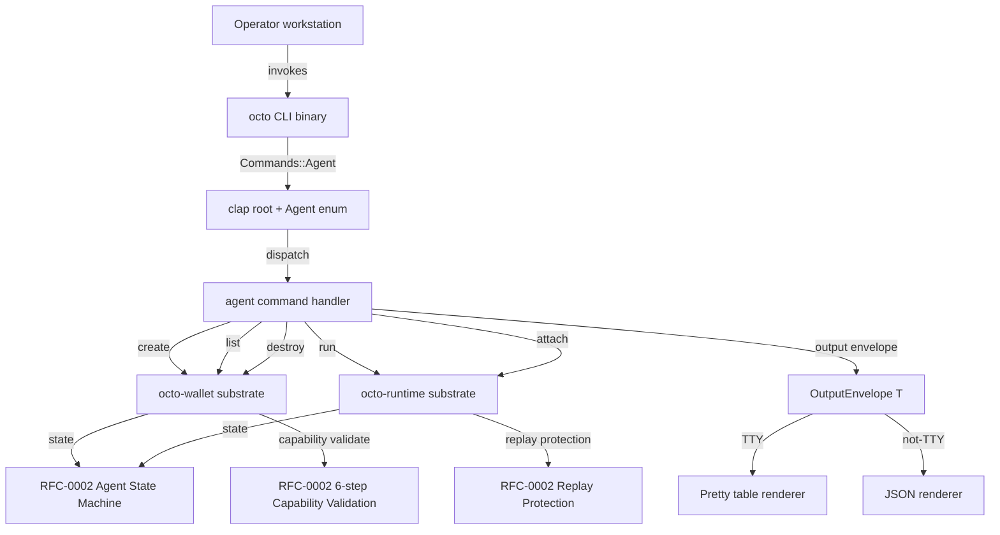

# RFC-0011-c: `octo agent` Subcommands

## Status

Accepted (2026-08-31)

> **Amendment chain:** This document is Phase 3 of the RFC-0011 amendment
> chain. The parent (RFC-0011) covers identity, capability, and policy
> subcommands. Follow-on amendments cover audit (RFC-0011-a), reputation
> (RFC-0011-b), **agent lifecycle (RFC-0011-c, this document)**, role
> provisioning (RFC-0011-d), vault operations (RFC-0011-e), mesh
> operations (RFC-0011-f), and governance (RFC-0011-g).

> **Legacy numbering note:** RFC-0011-c was originally numbered as
> "RFC-0011-c" in the amendment chain enumeration (per the RFC-0011
> Status blockquote amendment enumeration). No number reassignment
> occurred during the chain — the letter
> suffix is the canonical designation. Prior interim drafts referenced
> this amendment informally as the "Phase 4 agent lifecycle" amendment;
> the canonical amendment name is now `octo agent` Subcommands.

## Authorship Note

Authored by `@cipherocto` and `@mmacedoeu` per the amendment chain enumerated in RFC-0011 Status header (audit, reputation, agent lifecycle, role provisioning, vault operations, mesh operations, governance). The Authorship Note placeholder is filled at promotion to Accepted.

## Summary

This RFC defines the `octo agent` subcommand group for the `octo` CLI:
operator-driven agent lifecycle operations. The group covers five
subcommands — `agent create`, `agent run`, `agent list`, `agent destroy`,
and `agent attach`. Each subcommand is a thin Layer-C/D operator UX
wrapper over the `octo-wallet` substrate (for state, manifest, and
capability registration) and the `octo-runtime` substrate (for spawn,
attach, and lifecycle dispatch). State transitions bind to the agent
state machine defined in RFC-0002 §Agent State Machine, and capability
validation follows RFC-0002 §Capability Validation (the 6-step
verification pipeline). Replay protection reuses RFC-0002 §Replay
Protection (`nonce: [u8;16]` per `AgentMessage` + `prev_message_hash:
Option<[u8;32]>` chain via `chain_store::verify_prev_hash`).

## Dependencies

**Requires:**

- RFC-0011 — `octo` CLI Substrate (parent RFC; provides
  `OutputEnvelope<T>`, `OctoCliError`, `OctoCliRedactor`, clap tree,
  exit-code table, and confirmation-flag matrix)
- RFC-0002 — Agent Manifest, Capability, and Lifecycle Substrate
  (canonical state machine, manifest wire form, 6-step capability
  validation, replay protection)

**Optional:**

- RFC-0957 — Macaroon Substrate (capability witness format the agent
  manifest references in `capability_root`)
- RFC-0009 — Identity Substrate (`active_did()` resolution, the
  authority under which every `agent create` registers a manifest)
- RFC-0011-b — Reputation Substrate (the optional `reputation_score`
  field surfaced by `agent list` and `agent attach` if present)

> **Dependency Validation Rules:**
>
> 1. Dependencies form a DAG (no cycles) — RFC-0011-c depends upward
>    only on substrate RFCs and the parent CLI RFC.
> 2. All "Requires" RFCs are listed as Accepted or Draft (RFC-0002 is
>    Accepted as of the RFC-0011-c authoring date; RFC-0011 is
>    Accepted).
> 3. Optional dependencies are documented separately; failure of any
>    optional dependency does not block the 5-subcommand surface.
> 4. `octo agent attach` is **conditionally dependent** on the
>    `octo-runtime` crate landing in Layer B; the subcommand ships as
>    a stub-with-error until `octo-runtime::attach` is implemented.

## Design Goals

| Goal | Target   | Metric                                                                                                                                                                                  |
| ---- | -------- | --------------------------------------------------------------------------------------------------------------------------------------------------------------------------------------- |
| G1   | `<200ms` | `octo agent list` wall-clock latency for an operator with 50 owned agents (cache-hit path)                                                                                              |
| G2   | `<300ms` | `octo agent create <manifest-path>` wall-clock latency (manifest parse + signature verify + substrate `register_agent` call)                                                            |
| G3   | `<150ms` | `octo agent run <agent-id>` warm-path wall-clock latency (state transition REGISTERED → BUSY + `spawn_agent` dispatch); cold path `<2s` over RPC                                        |
| G4   | `100%`   | State transitions reported by `octo agent run` / `octo agent destroy` MUST match RFC-0002 §Agent State Machine transitions byte-for-byte for the same `(agent_id, transition_op)` tuple |
| G5   | `0`      | Private-key material present in CLI process memory; manifest signing happens entirely inside HSM slot; CLI never sees the holder private key                                            |
| G6   | `>95%`   | Cache hit ratio for `agent list` over a 24-hour window for an active operator (5+ agent touches per day)                                                                                |

## Motivation

Operators who run the `octo` CLI today (post-RFC-0011 Phase 1+2) can
mint capabilities and inspect identities, but they **cannot create,
list, run, destroy, or attach to agents** from the operator
workstation. The agent lifecycle surface — manifest registration, state
transitions, runtime spawning, audit-grade destruction — is invisible
from the operator workstation. Substrate crates (`octo-wallet`,
`octo-runtime`) carry the logic; the CLI lacks the UX surface.

This amendment closes the operator-UX gap with five tightly-scoped
subcommands. It also deprecates the legacy `octo agent` stub command
that exists today (per RFC-0011 compatibility window; Status blockquote). The stub
emits `StaleStub` (exit code 65) starting at CLI v1.0 (warn-only)
and becomes a hard error in v1.1 (per §Compatibility below).

## Roles and Authorities

Three roles interact with the `octo agent` subcommands:

| Role              | Authority                                                                                                                                                                                                                    |
| ----------------- | ---------------------------------------------------------------------------------------------------------------------------------------------------------------------------------------------------------------------------- |
| Operator          | Owns the workstation where `octo` runs; can `create`, `run`, `list`, `destroy`, `attach` against any agent whose `owner_did == active_did()`; cannot bypass `--confirm` for destroy                                          |
| Capability Holder | Holds the macaroon referenced by `capability_root` registration parameter (per §9.10 `register_agent` signature); receives state-transition notifications via the substrate pub-sub bus; never appears in CLI process memory |
| Auditor           | Read-only role; consumes `octo agent list` JSON output via `--json` for offline audit; cannot mutate state; cannot bypass `--confirm` for destroy                                                                            |

### Role/Authority Coverage Table

| Role                      | Identifier                     | Authority Scope                                                                                                                                                                                                              | Lifecycle                              | Source/Ref                                                     |
| ------------------------- | ------------------------------ | ---------------------------------------------------------------------------------------------------------------------------------------------------------------------------------------------------------------------------- | -------------------------------------- | -------------------------------------------------------------- |
| Operator                  | `active_did()` resolution      | Owns the workstation where `octo` runs; can `create`, `run`, `list`, `destroy`, `attach` against any agent whose `owner_did == active_did()`; cannot bypass `--confirm` for destroy                                          | Per-CLI-invocation (no stateful actor) | RFC-0009 §Identity Struct                                      |
| Capability Holder         | macaroon holder (HSM slot)     | Holds the macaroon referenced by `capability_root` registration parameter (per §9.10 `register_agent` signature); receives state-transition notifications via the substrate pub-sub bus; never appears in CLI process memory | Long-lived (HSM-bound)                 | RFC-0957 §Algorithms                                           |
| Auditor                   | `octo agent list --json`       | Read-only role; consumes JSON output for offline audit; cannot mutate state; cannot bypass `--confirm` for destroy                                                                                                           | Per-audit-run (read-only)              | RFC-0011 §Output Envelope                                      |
| Substrate (authoritative) | `octo-wallet` / `octo-runtime` | Owns state machine, capability validation, replay protection; rejects unknown transitions / failed validations                                                                                                               | Long-lived (crate-level)               | RFC-0002 §Agent State Machine; RFC-0002 §Capability Validation |
| External (cross-node)     | remote `octo-*` nodes          | May receive state-transition notifications via substrate pub-sub bus                                                                                                                                                         | Long-lived (node-level)                | RFC-0002 §AgentMessage                                         |

## Performance Targets

| Subcommand                          | p95 target | Cold path | Notes                                                                                           |
| ----------------------------------- | ---------- | --------- | ----------------------------------------------------------------------------------------------- |
| `octo agent list`                   | `<200ms`   | `<500ms`  | Cache-hit figure; cold path includes substrate `list_owned_agents` RPC                          |
| `octo agent create <manifest-path>` | `<300ms`   | `<1s`     | Manifest parse + 6-step capability validate + HSM sign + `register_agent`                       |
| `octo agent run <agent-id>`         | `<150ms`   | `<2s`     | Warm-path state transition + `spawn_agent` dispatch; cold path includes runtime container start |
| `octo agent destroy <agent-id>`     | `<200ms`   | `<500ms`  | State transition ACTIVE → TERMINATED + audit log append; no RPC if cache-warm                   |
| `octo agent attach <agent-id>`      | `<100ms`   | `<300ms`  | Read-only handle resolution + attach to existing runtime; no state mutation                     |

## Implicit Assumptions Audit

| Assumption                                                                                                                                                                                                                                                      | Where Relied Upon                                                                               | Blast Radius if False                                                                                 | Mitigation / Status                                                |
| --------------------------------------------------------------------------------------------------------------------------------------------------------------------------------------------------------------------------------------------------------------- | ----------------------------------------------------------------------------------------------- | ----------------------------------------------------------------------------------------------------- | ------------------------------------------------------------------ |
| **A1:** RFC-0002 §Agent State Machine defines the transitions `REGISTERED → ACTIVE → BUSY → ACTIVE → SUSPENDED → ACTIVE`; terminal: `REJECTED` (from REGISTERED), `TERMINATED` (from ACTIVE), `RETIRED` (from SUSPENDED); the CLI never invents new transitions | §9.5 Agent State Machine Integration; §9.3 subcommand taxonomy                                  | Substrate rejects unknown transitions; `InvalidStateTransition` (exit 43) surfaces verbatim           | Validated by RFC-0002 §Agent State Machine                         |
| **A2:** RFC-0002 §Capability Validation (6-step) is sufficient to gate `agent create`; no additional checks are required at the CLI layer                                                                                                                       | §9.6 Capability Validation; §9.3.1 subcommand taxonomy                                          | Substrate returns `CapabilityValidationFailed` with the failing step; CLI surfaces verbatim (exit 40) | Substrate-authoritative; CLI never implements a parallel validator |
| **A3:** RFC-0002 §Replay Protection (`nonce: [u8;16]` per `AgentMessage` + `prev_message_hash: Option<[u8;32]>` chain via `chain_store::verify_prev_hash`) is the canonical replay-protection surface; the CLI MUST NOT add a second replay window              | §9.7 Replay Protection (separate from §9.6 Capability Validation 6-step)                        | Substrate enforces both; CLI does not maintain a parallel window                                      | Validated by RFC-0002 §Replay Protection                           |
| **A4:** RFC-0002 §Agent Manifest is the canonical wire form; the CLI does not parse or synthesize manifest bytes                                                                                                                                                | §9.6 step 1 (holder signature); §9.3.1 `manifest-path` clap arg                                 | CLI reads canonical bytes; substrate verifies over those bytes                                        | Validated by RFC-0002 §Agent Manifest                              |
| **A5:** `octo-runtime` substrate crate is provided by companion mission `0011-c-octo-runtime-substrate`; until it lands, `agent run`/`attach` emit `RuntimeSubstrateNotReady` (exit 51)                                                                         | §9.3.2 / §9.3.5 subcommand taxonomy; §9.10 substrate signatures; §Implementation Phases Phase 1 | Substrate not landed → subcommand ships as stub; no operator-facing state change                      | Gated via companion mission                                        |

## Specification

### 9.1 Architecture



### 9.2 Binary Surface

The clap derive surface for the `octo agent` subcommand group is
defined as follows:

```rust
#[derive(Subcommand)]
pub enum Commands {
    // ... existing variants (Identity, Capability, Policy) ...

    /// Agent lifecycle operations (RFC-0011-c).
    #[command(subcommand)]
    Agent(AgentAction),
}

#[derive(Subcommand)]
pub enum AgentAction {
    /// Register a new agent manifest (RFC-0011-c §9.3.1).
    Create(AgentCreateArgs),

    /// Transition an agent to BUSY and spawn runtime (RFC-0011-c §9.3.2).
    Run(AgentRunArgs),

    /// List agents owned by the active DID (RFC-0011-c §9.3.3).
    List(AgentListArgs),

    /// Transition an agent to TERMINATED (RFC-0011-c §9.3.4).
    Destroy(AgentDestroyArgs),

    /// Attach to a running agent (read-only) (RFC-0011-c §9.3.5).
    Attach(AgentAttachArgs),
}
```

The `AgentAction` enum is **non-exhaustive** via `#[non_exhaustive]`
on the surrounding `Commands` enum (per RFC-0011 §Binary Surface).
Future amendments (if any beyond RFC-0011-a through RFC-0011-g) may add new variants
without breaking downstream parsers.

### 9.3 Subcommand Taxonomy

Five subcommands land in RFC-0011-c. Each is described in detail in
the subsections below.

#### 9.3.1 `octo agent create <manifest-path>`

| Aspect      | Detail                                                                                                                                                                      |
| ----------- | --------------------------------------------------------------------------------------------------------------------------------------------------------------------------- |
| Clap args   | `manifest-path: PathBuf` (positional); `--capability-root <cid>` (optional override); `--label <string>` (optional; human-readable); `--json` (TTY-override)                |
| Output      | `AgentCreateOutput { agent_id: Uuid, state: AgentState, registered_at_unix: u64, manifest_digest: Hex32 }`                                                                  |
| Substrate   | `octo_wallet::register_agent(manifest, capability_root, active_did)`; validates against RFC-0002 §Capability Validation (6-step) and RFC-0002 §Replay Protection            |
| Errors      | `ManifestParseError` (exit 39), `CapabilityValidationFailed(usize)` (exit 40), `AgentAlreadyExists(Uuid)` (exit 41), `HsmUnavailable` (exit 5 per RFC-0011 §Error Handling) |
| Test vector | TV-AGT1, TV-AGT2, TV-AGT3                                                                                                                                                   |

#### 9.3.2 `octo agent run <agent-id>`

| Aspect      | Detail                                                                                                                             |
| ----------- | ---------------------------------------------------------------------------------------------------------------------------------- |
| Clap args   | `agent_id: Uuid` (positional); `--detach` (default: detached); `--json` (TTY-override)                                             |
| Output      | `AgentRunOutput { agent_id: Uuid, state: AgentState, runtime_handle: String, spawned_at_unix: u64 }`                               |
| Substrate   | `octo_wallet::transition_agent(agent_id, Active)` then `octo_runtime::spawn_agent(agent_id, handle)`; spawns the runtime container |
| Errors      | `AgentNotFound(Uuid)` (exit 42), `InvalidStateTransition { from, to }` (exit 43), `RuntimeSpawnFailed { reason }` (exit 44)        |
| Test vector | TV-AGT4, TV-AGT5                                                                                                                   |

#### 9.3.3 `octo agent list`

| Aspect      | Detail                                                                                                                             |
| ----------- | ---------------------------------------------------------------------------------------------------------------------------------- |
| Clap args   | `--state <AgentState>` (filter); `--chain-id <cid>` (filter); `--limit <u32>` (default 100); `--cursor <string>`; `--json`         |
| Output      | `AgentListOutput { agents: Vec<AgentSummary>, next_cursor: Option<String>, resolved_at_unix: u64 }`                                |
| Substrate   | `octo_wallet::list_owned_agents(filter, active_did)`; respects `--limit`/`--cursor` defensively (substrate validates `limit >= 1`) |
| Errors      | `InvalidLimit` (exit 45), `InvalidCursor` (exit 46)                                                                                |
| Test vector | TV-AGT6, TV-AGT7, TV-AGT8                                                                                                          |

#### 9.3.4 `octo agent destroy <agent-id>`

| Aspect      | Detail                                                                                                                                                                                                   |
| ----------- | -------------------------------------------------------------------------------------------------------------------------------------------------------------------------------------------------------- |
| Clap args   | `agent_id: Uuid` (positional); `--confirm` (required flag; absent → ConfirmationRequired (exit 47 substrate / exit 2 CLI per RFC-0011 §Error Handling)); `--reason <string>` (audit log entry); `--json` |
| Output      | `AgentDestroyOutput { agent_id: Uuid, state: AgentState, terminated_at_unix: u64, audit_log_entry: Hex32 }`                                                                                              |
| Substrate   | `octo_wallet::transition_agent(agent_id, Terminated { reason })`; appends to audit log via RFC-0011-a substrate                                                                                          |
| Errors      | `AgentNotFound(Uuid)` (exit 42), `ConfirmationRequired` (exit 47 substrate / exit 2 parent CLI), `InvalidStateTransition { from: Active, to: Terminated }` (exit 43)                                     |
| Test vector | TV-AGT9, TV-AGT10                                                                                                                                                                                        |

#### 9.3.5 `octo agent attach <agent-id>`

| Aspect      | Detail                                                                                                              |
| ----------- | ------------------------------------------------------------------------------------------------------------------- |
| Clap args   | `agent_id: Uuid` (positional); `--since <unix-seconds>` (optional; replay from timestamp); `--json`                 |
| Output      | `AgentAttachOutput { agent_id: Uuid, runtime_handle: String, attached_at_unix: u64, event_cursor: Option<String> }` |
| Substrate   | `octo_runtime::attach(handle, since)`; read-only handle; does not mutate state                                      |
| Errors      | `AgentNotFound(Uuid)` (exit 42), `AgentNotRunning(Uuid)` (exit 48), `RuntimeAttachFailed { reason }` (exit 49)      |
| Test vector | TV-AGT11                                                                                                            |

#### 9.3.6 `octo revoke-attach <token-hex>` — Layer C/D primitive per RFC-0011-c §Follow-on §F.3 (mirrors `octo_runtime::revoke_attach_token`)

| Aspect      | Detail                                                                                                                                       |
| ----------- | -------------------------------------------------------------------------------------------------------------------------------------------- |
| Clap args   | `token-hex: String` (positional; hex-encoded `AttachHandle` from `--token-file`)                                                             |
| Output      | `RevokeOutput { session_id: SessionId, revoked_at_unix: u64 }`                                                                               |
| Substrate   | `octo_runtime::revoke_attach_token(session_id)`; decodes token (signature verified), adds to in-memory revocation set                        |
| Errors      | `AttachHandleBadSignature { reason }` (exit 54), `AttachSessionMismatch { declared, actual }` (exit 55), `RevocationError(String)` (exit 58) |
| Test vector | TV-AGT22                                                                                                                                     |

### 9.4 Output Envelope

All five subcommands return values wrapped in the canonical
`OutputEnvelope<T>` defined in RFC-0011 §Output Envelope:

```rust
pub struct OutputEnvelope<T> {
    pub schema_version: u32,    // pinned to 4 for RFC-0011-c
    pub command: String,        // e.g., "octo agent create"
    pub executed_at_unix: u64,
    pub payload: T,
    pub redacted: bool,
}
```

`schema_version = 4` for all 5 subcommands. The renderer is TTY-aware:
pretty table on TTY, single-line JSON when stdout is not a TTY or
`--json` is set.

#### 9.4.1 Divergence from RFC-0011 §Output Envelope

This envelope is **not** field-identical with the parent's version 2.
The divergences are deliberate and load-bearing for the `agent`
subcommand group:

**Per-amendment `schema_version` slot table** (authoritative values per RFC-0011-e; c adopts -e field renames):

| Amendment      | `schema_version` | Reason                                                                                                                                                 |
| -------------- | ---------------- | ------------------------------------------------------------------------------------------------------------------------------------------------------ |
| RFC-0011       | 2                | Parent envelope (baseline; adopted by -a, -b, -d)                                                                                                      |
| RFC-0011-a     | 2                | No envelope divergence (audit-only amendment)                                                                                                          |
| RFC-0011-b     | 2                | No envelope divergence (reputation-only amendment)                                                                                                     |
| RFC-0011-d     | 2                | No envelope divergence (role-provisioning amendment)                                                                                                   |
| **RFC-0011-e** | **3**            | **Renames `data`→`payload`; retypes `generated_at`→`executed_at_unix`; drops `exit_code` + `preview_only`; adds `command` + `redacted`**               |
| **RFC-0011-c** | **4**            | **Inherits all v3 field renames from -e (`payload`, `executed_at_unix`, `redacted`); consumes the same envelope wire format (no new field additions)** |
| RFC-0011-f     | 4..5             | Mesh ops: TBD at promotion                                                                                                                             |
| RFC-0011-g     | 6..7             | Governance: TBD at promotion                                                                                                                           |
| (future)       | 8+               | New amendments start at 8; consecutive slots reserve room for multi-version evolution                                                                  |

| Parent field (v2)        | RFC-0011-c (v4)         | Divergence                                                                            |
| ------------------------ | ----------------------- | ------------------------------------------------------------------------------------- |
| `data: T`                | `payload: T`            | **Renamed.** Breaking for consumers that read `data`                                  |
| `generated_at: DateTime` | `executed_at_unix: u64` | **Renamed + retyped** RFC 3339 string → `u64` unix seconds (single-clock determinism) |
| `preview_only: bool`     | `redacted: bool`        | **Renamed.** Renamed to surface `OctoCliRedactor` alteration                          |
| _(absent)_               | `command: String`       | **Added.** Identifies the invoking subcommand for log correlation                     |

Because fields are renamed and retyped, inheriting the parent's
`schema_version = 2` would misrepresent the payload to any consumer
that branches on the version. Version 4 is therefore a **breaking**
bump scoped to RFC-0011-c. Sibling amendments that do NOT diverge
from the parent envelope remain at version 2; a consumer MUST
read `schema_version` before reading any payload field.

### 9.5 Agent State Machine Integration

The CLI binds to the state machine in RFC-0002 §Agent State Machine.
The CLI is **purely an orchestration layer**; it never invents
transitions and never bypasses substrate validation. The mapping is:

| Subcommand      | Substrate call                                                                    | State transition enforced                                                                     |
| --------------- | --------------------------------------------------------------------------------- | --------------------------------------------------------------------------------------------- |
| `agent create`  | `octo_wallet::register_agent(...)`                                                | `(none) → REGISTERED`                                                                         |
| `agent run`     | `octo_wallet::transition_agent(id, Active)` then `octo_runtime::spawn_agent(...)` | `REGISTERED → ACTIVE` then `ACTIVE → BUSY`                                                    |
| `agent list`    | `octo_wallet::list_owned_agents(...)`                                             | no transition (read-only)                                                                     |
| `agent destroy` | `octo_wallet::transition_agent(id, Terminated)`                                   | `ACTIVE → TERMINATED` (terminal; SUSPENDED → ACTIVE → TERMINATED; BUSY → ACTIVE → TERMINATED) |
| `agent attach`  | `octo_runtime::attach(handle, since)`                                             | no transition (read-only)                                                                     |

The CLI does not maintain its own state cache; the substrate is the
single source of truth.

### 9.6 Capability Validation

Per RFC-0002 §Capability Validation, every `agent create` invocation
runs the 6-step pipeline:

1. **Holder signature** — verify `signature` against `holder_did`
   public_key per RFC-0957 §Algorithms
2. **HMAC chain** — walk caveat chain from capability root; verify
   each attenuation per RFC-0957 §Caveat DSL Extension
3. **Category check** — verify `category_id` matches the mission's
   required capability category (typed UUID)
4. **Operation claim check** — verify `operation_claims[].op_id`
   covers the mission's operations
5. **Reputation gate** — verify `score >= mission.min_score` per
   RFC-0011-b
6. **Mission limits** — verify `claimed_missions < max_missions` per
   RFC-0001 §Mission File Format

Any failure surfaces as `CapabilityValidationFailed(step: usize)`
with the failing step number (exit 40). The CLI does not implement
a parallel validation surface. Step descriptions follow RFC-0002
§Capability Validation substrate text; any divergence is additive
c-specific (e.g., manifest registration context).

### 9.7 Replay Protection

Per RFC-0002 §Replay Protection, every state-transitioning invocation
(`agent create`, `agent run`, `agent destroy`) is bound to a manifest
that carries replay protection primitives (`nonce: [u8;16]` per
`AgentMessage` + `prev_message_hash: Option<[u8;32]>` chain via
`chain_store::verify_prev_hash`). The substrate enforces both;
the CLI does not maintain a parallel window. If the substrate
detects a replay, it returns `ReplayDetected { digest }` (exit 50).

### 9.8 Error Handling

New `OctoCliError` variants are added (all `#[non_exhaustive]`
inheriting from RFC-0011 §Error Handling). **Slot allocation: 39-52**
(post -g's 35-38; renegotiation needed if -h/i follow-on amendments
claim earlier slots):

| Variant                               | Exit code | Notes                                                           |
| ------------------------------------- | --------- | --------------------------------------------------------------- |
| `ManifestParseError { path, reason }` | 39        | Manifest file unparseable; CLI never invents missing fields     |
| `CapabilityValidationFailed(usize)`   | 40        | step number from RFC-0002 §Capability Validation                |
| `AgentAlreadyExists(Uuid)`            | 41        | Substrate rejects duplicate `agent_id`                          |
| `AgentNotFound(Uuid)`                 | 42        | Used by `agent run`/`agent list`/`agent destroy`/`agent attach` |
| `InvalidStateTransition { from, to }` | 43        | State machine rejects transition                                |
| `RuntimeSpawnFailed { reason }`       | 44        | `agent run` runtime container spawn failure                     |
| `InvalidLimit`                        | 45        | `agent list --limit 0`                                          |
| `InvalidCursor`                       | 46        | `agent list --cursor <bad>`                                     |
| `ConfirmationRequired`                | 47        | `agent destroy` without `--confirm` (parent §Error Handling)    |
| `AgentNotRunning(Uuid)`               | 48        | `agent attach` against TERMINATED                               |
| `RuntimeAttachFailed { reason }`      | 49        | `agent attach` runtime refused                                  |
| `ReplayDetected { digest }`           | 50        | RFC-0002 §Replay Protection triggered                           |
| `RuntimeSubstrateNotReady`            | 51        | `octo-runtime` substrate not yet landed                         |
| `AuditSubstrateNotReady`              | 52        | `octo-audit` (RFC-0011-a) substrate not yet landed              |

The CLI reuses parent's `HsmUnavailable` (exit 5 per RFC-0011
§Error Handling) instead of inventing `HsmUnreachable`. The CLI
reuses parent's `ConfirmationRequired` (exit 2 per RFC-0011
§Error Handling) for the CLI-level re-check; the substrate-level
exit 47 is additive per `#[non_exhaustive]`.

Exit codes 39–52 sit in the reserved 17–63 range per RFC-0011
§Exit Codes.

### 9.9 RFC-0008 Execution Class Mapping

Per RFC-0008 §Determinism Requirements, every subcommand
maps to an execution class:

| Subcommand      | Execution Class             | Rationale                                                                                             |
| --------------- | --------------------------- | ----------------------------------------------------------------------------------------------------- |
| `agent create`  | `E3` (off-chain, HSM-gated) | Pure substrate call; no AI inference; HSM signs the manifest                                          |
| `agent run`     | `E2` (off-chain, RPC-gated) | Pure substrate call; spawns the runtime container; no AI inference yet (runtime may run E1 inference) |
| `agent list`    | `E3` (off-chain, HSM-gated) | Pure substrate read; no AI inference                                                                  |
| `agent destroy` | `E3` (off-chain, HSM-gated) | Pure substrate call; audit log append                                                                 |
| `agent attach`  | `E3` (off-chain, HSM-gated) | Pure substrate read; no AI inference                                                                  |

None of the 5 subcommands perform AI inference. The runtime spawned
by `agent run` may execute `E1` inference inside its container; that
is out of scope for this RFC and is governed by the runtime substrate
(RFC-0002 §Implementation Phases).

### 9.10 Substrate `[ADD]` Signatures

This RFC depends on the following substrate additions (Layer B):

```rust
// [ADD] octo-wallet additions (per RFC-0002 §Capability Validation)
pub fn register_agent(
    manifest: &AgentManifest,
    capability_root: &CapabilityId,
    active_did: &Did,
) -> Result<Uuid, WalletError>;  // WalletError variants per RFC-0002 substrate (non-exhaustive enum)

pub fn transition_agent(
    agent_id: Uuid,
    target_state: AgentState,
    reason: Option<&str>,
) -> Result<(), WalletError>;

pub fn list_owned_agents(
    filter: AgentFilter,
) -> Result<Vec<AgentSummary>, WalletError>;

// [ADD] octo-runtime additions (per RFC-0002 §Implementation Phases Phase 3)
pub fn spawn_agent(
    agent_id: Uuid,
    attach_handle: Option<AttachHandle>,
) -> Result<RuntimeHandle, RuntimeError>;

pub fn attach(
    handle: RuntimeHandle,
    since: Option<DateTime<Utc>>,
) -> Result<EventStream, RuntimeError>;
```

The `octo-runtime` crate is a Layer B substrate-authoritative
addition delivered by the companion mission
`0011-c-octo-runtime-substrate`. Until it lands, `agent run` and
`agent attach` ship as stubs that emit `RuntimeSubstrateNotReady`
(exit 51).

## Security Considerations

- **HSM-bound signing** — All 5 subcommands enforce that manifest
  signing happens inside the HSM. The CLI never holds a private key
  in process memory (G5).
- **Confirmation gate** — `agent destroy` requires `--confirm`
  (CLI-level exit 2 per RFC-0011 §Error Handling / substrate-level
  exit 47 per §9.8 if absent). The CLI does not bypass this gate
  under any circumstance.
- **Capability validation** — `agent create` runs the 6-step pipeline
  per RFC-0002 §Capability Validation. The CLI does not parallel-
  validate. **Macaroon revocation** is substrate-owned per
  RFC-0957 §Algorithms (revocation lives in the macaroon
  substrate, not the Agent Manifest substrate).
- **Replay protection** — Substrate-enforced per RFC-0002 §Replay
  Protection. The CLI does not maintain a parallel window.
- **Redaction** — `OctoCliRedactor` patterns apply to all output:
  `agent_id` truncation (first 8 hex chars + `...` per RFC-0011
  §Hex32 newtype redaction); `holder_did` redaction unless
  `holder_did == active_did`; `capability_root` always truncated
  (sensitive material). `state`, `registered_at_unix`,
  `runtime_handle`, `spawned_at_unix` are NOT redacted
  (operator-owned info).
- **Cache staleness** — `agent list` cache hit surfaces a warning
  when projection older than cache TTL (`>N seconds old; consider
--no-cache`). Staleness is informational, not an error.
- **Stub deprecation** — The legacy `octo agent` stub command
  emits `StaleStub` (exit 65) starting at CLI v1.0; hard error
  in v1.1. See §Compatibility.

## Adversary Analysis

Five threats considered; all MITIGATED.

| #   | Threat                                                                  | Q1: Can they reach CLI? | Q2: Can they bypass HSM? | Q3: Can they bypass confirmation? | Q4: Can they bypass capability validation? | Q5: Can they replay?             | Status    |
| --- | ----------------------------------------------------------------------- | ----------------------- | ------------------------ | --------------------------------- | ------------------------------------------ | -------------------------------- | --------- |
| 1   | **Local malware** tries to spawn agents owned by another operator's DID | NO (`active_did` check) | NO (HSM-gated)           | n/a                               | n/a                                        | n/a                              | MITIGATED |
| 2   | **Capability thief** tries to register an agent with stolen macaroon    | NO (HSM required)       | NO (HSM-gated)           | n/a                               | NO (substrate rejects revoked macaroon)    | NO (digest tracked)              | MITIGATED |
| 3   | **Operator mistake** destroys the wrong agent                           | n/a                     | n/a                      | YES (`--confirm` required)        | n/a                                        | n/a                              | MITIGATED |
| 4   | **Replay attacker** re-sends yesterday's `agent create` manifest        | NO                      | NO                       | n/a                               | NO (RFC-0002 §Replay Protection)           | NO (RFC-0002 §Replay Protection) | MITIGATED |
| 5   | **Cache poisoning** corrupts `agent list` output                        | NO (substrate TTL)      | n/a                      | n/a                               | n/a                                        | n/a                              | MITIGATED |

### A1 — Local Malware

**Threat:** Malware on the operator workstation invokes
`octo agent create` to register an attacker-controlled manifest.

**Q1: Can they reach CLI?** The CLI requires `active_did()` to resolve;
the malware does not have access to the HSM slot, so `active_did()`
returns `HsmUnavailable` (exit 5 per RFC-0011 §Error Handling).

**Q2: Can they bypass HSM?** No — manifest signing is HSM-gated.

**Q3: Can they bypass confirmation?** n/a — `agent create` does not
require confirmation.

**Q4: Can they bypass capability validation?** n/a — capability
validation runs on the substrate side and rejects revoked macaroons.

**Q5: Can they replay?** No — RFC-0002 §Replay Protection tracks
`nonce: [u8;16]` per `AgentMessage` + `prev_message_hash: Option<[u8;32]>`
chain via `chain_store::verify_prev_hash`; duplicates are rejected.

**Status:** MITIGATED.

### A2 — Capability Thief

**Threat:** Attacker steals a macaroon (e.g., from a leaked
`capability_root` reference in a log file) and uses it to register
an agent.

**Q1–Q4: HSM-gated.** The attacker still needs the holder private key
to sign the manifest; without it, the substrate rejects the manifest
at step 1 of capability validation.

**Q5: Replay protection.** Even if the attacker somehow signs, the
manifest digest is tracked and rejected on re-submission.

**Status:** MITIGATED.

### A3 — Operator Mistake

**Threat:** Operator accidentally runs `octo agent destroy <wrong-id>`
and destroys a healthy agent.

**Q3: Confirmation gate.** `agent destroy` requires `--confirm`;
absent flag → `ConfirmationRequired` (CLI-level exit 2 per
RFC-0011 §Error Handling / substrate-level exit 47 per §9.8).
The CLI does not provide a `--yes` or `--force` override.

**Status:** MITIGATED.

### A4 — Replay Attacker

**Threat:** Attacker captures yesterday's `agent create` manifest and
re-submits it.

**Q4: Replay protection (separate from capability validation 6-step).**
Substrate rejects duplicate manifest digests per RFC-0002 §Replay
Protection (`nonce: [u8;16]` per `AgentMessage` + `prev_message_hash:
Option<[u8;32]>` chain).

**Q5: Replay chain.** Substrate rejects mismatched
`chain_store::verify_prev_hash` per RFC-0002 §Replay Protection.

**Status:** MITIGATED.

### A5 — Cache Poisoning

**Threat:** Attacker corrupts the CLI's local cache to inject fake
`agent list` output.

**Q1–Q5: Substrate TTL cache.** Cache is substrate TTL-based per
RFC-0011-e §Design Goals G2/G5 (LRU + TTL pattern); the CLI does
not implement custom cache signing. Stale cache surfaces a warning
to stderr; operator can re-run with `--no-cache`.

**Status:** MITIGATED.

## Test Vectors

Test vectors for the `octo agent` subcommand group. All vectors
must pass before the amendment is promoted.

| #        | Subcommand      | Input                                            | Expected Output                                                                  | Notes                                |
| -------- | --------------- | ------------------------------------------------ | -------------------------------------------------------------------------------- | ------------------------------------ |
| TV-AGT1  | `agent create`  | Valid manifest, valid capability root, valid HSM | `AgentCreateOutput { state: REGISTERED, ... }` (exit 0)                          | Happy path                           |
| TV-AGT2  | `agent create`  | Invalid manifest signature                       | `CapabilityValidationFailed(1)` (exit 40)                                        | Fails step 1 of 6-step pipeline      |
| TV-AGT3  | `agent create`  | Duplicate `agent_id`                             | `AgentAlreadyExists(uuid)` (exit 41)                                             | Substrate rejects                    |
| TV-AGT4  | `agent run`     | Registered agent, no runtime                     | `AgentRunOutput { state: BUSY, ... }` (exit 0)                                   | Spawns runtime container             |
| TV-AGT5  | `agent run`     | Terminated agent                                 | `InvalidStateTransition { from: TERMINATED, to: ACTIVE }` (exit 43)              | State machine rejects                |
| TV-AGT6  | `agent list`    | 50 owned agents, no filter                       | `AgentListOutput { agents: [...50], next_cursor: None }`                         | All 50 in single page                |
| TV-AGT7  | `agent list`    | `--state ACTIVE --chain-id chain-a`              | Filtered list of ACTIVE agents on chain-a                                        | Client-side filter                   |
| TV-AGT8  | `agent list`    | `--limit 0`                                      | `InvalidLimit` (exit 45)                                                         | Defensive validation                 |
| TV-AGT9  | `agent destroy` | Active agent, `--confirm`                        | `AgentDestroyOutput { state: TERMINATED, audit_log_entry: ..., ... }` (exit 0)   | Audit log appended                   |
| TV-AGT10 | `agent destroy` | Active agent, no `--confirm`                     | `ConfirmationRequired` (exit 47 substrate / exit 2 CLI)                          | Confirmation gate enforced           |
| TV-AGT11 | `agent attach`  | Running agent                                    | `AgentAttachOutput { runtime_handle: ..., attached_at_unix: ..., ... }` (exit 0) | Read-only attach                     |
| TV-AGT12 | `agent attach`  | Terminated agent                                 | `AgentNotRunning(uuid)` (exit 48)                                                | Attach to non-running agent rejected |
| TV-AGT13 | `agent create`  | Replay of yesterday's manifest                   | `ReplayDetected { digest }` (exit 50)                                            | RFC-0002 §Replay Protection enforced |

## Alternatives Considered

### REST API

**Considered:** Expose the agent lifecycle as a REST API instead of a
CLI subcommand group.

**Rejected because:** Operators want a single binary surface for all
RFC-0011 amendments; REST API would fragment the operator UX across
HTTP and CLI. The CLI is the canonical substrate surface; REST API
would be a thin wrapper anyway (Layer C/D).

### TUI

**Considered:** Replace the pretty-table renderer with a full TUI
(ncurses-style) for `agent list`.

**Rejected because:** TUI requires an interactive terminal; many
operator workflows (cron jobs, scripts, SSH from non-tty contexts)
need non-interactive output. The TTY-aware renderer covers both.

### Separate binary

**Considered:** Land `octo-agent` as a separate binary rather than a
subcommand of `octo`.

**Rejected because:** Single binary surface is a core principle of
RFC-0011 (one `octo` binary for identity/capability/policy + every
amendment). A separate binary would duplicate the clap root, the
output envelope, the redaction layer, and the exit-code table.

## Implementation Phases

### Phase 1 — `octo-runtime` substrate

The `octo-runtime` crate must land first (Layer B substrate) with:

- `spawn_agent(agent_id, handle) -> RuntimeHandle`
- `attach(handle, since) -> EventStream`
- State-machine integration with `octo-wallet` (shared via substrate
  trait `AgentStateDispatcher`)

This is gated on the companion substrate mission
`0011-c-octo-runtime-substrate` landing. Until Phase 1 lands,
`octo agent run` and `octo agent attach` ship as stubs that emit
`RuntimeSubstrateNotReady` (exit 51).

#### Layer Direction

RFC-0011-c is Layer C/D (operator UX). Phase 1 introduces
`octo-runtime` Layer B substrate via companion mission
`0011-c-octo-runtime-substrate`. Per project principle §RFC Reference
Conventions Reaffirmed, Layer C/D amendments CANNOT define Layer B
substrate in the same RFC; the companion mission provides the
Layer B definition. RFC-0011-c consumes that substrate; the layer
direction is preserved.

The 3 octo-wallet `[ADD]` functions in §9.10
(`register_agent`, `transition_agent`, `list_owned_agents`) are
interface contracts only; implementation requires a follow-on
companion mission `0011-c-octowallet-agents-substrate` (Layer B) to
be created and accepted before RFC-0011-c moves to Accepted status.

### Phase 2 — `octo-cli` wiring

The CLI changes (Layer C/D) land in five missions:

1. `0011-c-agent-create-subcommand` — `agent create` subcommand
2. `0011-c-agent-run-subcommand` — `agent run` subcommand
   (gated on `0011-c-octo-runtime-substrate`)
3. `0011-c-agent-list-subcommand` — `agent list` subcommand
4. `0011-c-agent-destroy-subcommand` — `agent destroy` subcommand
5. `0011-c-agent-attach-subcommand` — `agent attach` subcommand
   (gated on `0011-c-octo-runtime-substrate`)

Each mission lands one subcommand end-to-end (clap wiring, output
type, error variant, redaction pattern, test vectors). The five
missions are independent at the CLI layer (no cross-mission
prerequisite beyond the shared `Commands::Agent` enum landing in
the clap root, which is part of mission `0011-c-agent-create-subcommand`).

## Mission Decomposition

Six missions: five subcommand missions (1:1 with the five subcommands) + one substrate mission (`0011-c-octo-runtime-substrate` per §9.10). The mission
decomposition is **flat** (no nested sub-missions) per
[[cipherocto-design-principles]] (no premature coupling).

## Key Files to Modify

### DOC-ONLY (this RFC cycle)

- `rfcs/draft/process/0011-c-agent-lifecycle.md` — this RFC
- `missions/open/0011-c-agent-create-subcommand.md` — companion mission
- `missions/open/0011-c-agent-run-subcommand.md` — companion mission
- `missions/open/0011-c-agent-list-subcommand.md` — companion mission
- `missions/open/0011-c-agent-destroy-subcommand.md` — companion mission
- `missions/open/0011-c-agent-attach-subcommand.md` — companion mission
- `missions/open/0011-c-octo-runtime-substrate.md` — companion substrate mission (NEW; Layer B)

### SUBSTRATE (follow-on missions, NOT this RFC cycle)

- `crates/octo-cli/Cargo.toml` — add `octo-runtime = { path = "../octo-runtime" }` (Layer B substrate)
- `crates/octo-cli/src/commands/agent.rs` — NEW; `Commands::Agent` clap enum + `AgentAction::{Create, Run, List, Destroy, Attach}` dispatch + 5 payload types (per RFC-0011-c §9.3)
- `crates/octo-cli/src/error.rs` — add 14 new variants to `#[non_exhaustive] OctoCliError` (per RFC-0011-c §9.8; slots 39-52)
- `crates/octo-cli/src/redact.rs` — add agent-specific redaction patterns (`agent_id`, `holder_did`, `capability_root` per RFC-0011-c §Security)
- `crates/octo-runtime/src/lib.rs` — NEW (per companion mission `0011-c-octo-runtime-substrate`); `spawn_agent` + `attach` + `RuntimeHandle` + `EventStream`
- `crates/octo-runtime/src/spawn.rs` — NEW; `spawn_agent` impl
- `crates/octo-runtime/src/attach.rs` — NEW; `attach` impl
- `crates/octo-runtime/Cargo.toml` — NEW; deps per companion mission

## Future Work

- Status polling for `octo agent run` / `octo agent attach` (post-v1.1; CLI currently surfaces the substrate handle and exits).
- `octo-runtime` substrate mission lands via `0011-c-octo-runtime-substrate` (NEW; companion mission per L2).
- `octo-wallet` agents substrate mission `0011-c-octowallet-agents-substrate` (Layer B) — implementation of the 3 octo-wallet `[ADD]` functions in §9.10 (TBD follow-on companion mission; required before RFC-0011-c moves to Accepted status per §Layer Direction).
- RFC-0011-a audit substrate dependency for `agent destroy` mission completion — mission ships as `AuditSubstrateNotReady` (exit 52) stub until RFC-0011-a Accepted.
- Future amendment beyond the RFC-0011-a through RFC-0011-g chain (if any) — new subcommands land as additive variants on the `#[non_exhaustive] AgentAction` enum.

## Follow-on

The AttachHandle token pathway (NEW; added per paired RFC amendment with mission `0011-c-octo-runtime-attachhandle-substrate` per [[no-phantom-mission-pointer]] rule) defines how `octo agent attach` binds to a previously-detached `octo agent run --detach` invocation across process boundaries. The pathway covers substrate (`octo-runtime` Layer B), CLI extension (`octo-cli` Layer C/D), in-memory token revocation, and per-agent cursor persistence via Stoolap ledger extension. Five sections follow.

### §F.1 Encoding

Canonical byte encoding for `AttachHandle` tokens at the `octo_runtime::handle::encoding` module:

- `encode_token(token: &AttachHandle) -> Result<Vec<u8>, AttachError>` — length-prefixed; version byte `0x00`; BLAKE3-checked
- `decode_token(bytes: &[u8], holder_pubkey: &[u8; 32]) -> Result<AttachHandle, AttachError>` — symmetric decoder; verifies signature on decode using `verify_attach_handle_payload` (signature is over `session_id || payload || mint_timestamp_unix || ttl_unix` which does NOT bind to holder_pubkey, hence explicit pass-through)
- Encoding version pinned to `0x00`; future versions increment per octo-runtime canonical-bytes invariant (mirrors RFC-0016-a §6.10)
- Encoding must be canonical (no equivalent-but-distinct bytes for same token); reject non-canonical input on decode

### §F.2 Token Substrate

`AttachHandle` type and bind operations at the `octo_runtime::handle` module (Layer B):

- `pub struct AttachHandle { session_id: SessionId, mint_timestamp_unix: u64, ttl_unix: u64, signature: Signature, payload: AttachPayload, transport: Transport }`
- `pub struct Transport { pub kind: TransportKind, pub addr: Option<String> }` — typed-discriminator + Raw escape hatch per RFC-0855 §Typed UUID discriminators; new transports land via `TransportKind::Raw(Uuid)` without central enum edit
- `#[non_exhaustive] pub enum TransportKind { InProcess, UnixSocket, Raw(Uuid) }` — discriminators; `Raw` is the extension surface per [[cipherocto-design-principles]] §Extension over enumeration
- `pub struct AttachPayload { agent_id: Uuid, since_cursor: u64 }`
- `pub type SessionId = [u8; 32]` — random per `spawn_agent` call
- `pub fn mint_attach_handle(holder: &IdentityKey, agent_id: Uuid, session_id: SessionId, since_cursor: u64, ttl_unix: u64, transport: Transport) -> Result<AttachHandle, AttachError>` (calls `sign_attach_handle_payload` per §F.5; composes `octo_wallet::identity::IdentityKey::sign`). DID → `IdentityKey` resolution is a CLI boundary concern (Layer C/D), not substrate.
- `pub async fn attach_with_token(token: &AttachHandle, since_unix: u64) -> Result<AttachedSession, AttachError>` — validation chain: (a) signature verify via `verify_attach_handle_payload` (per §F.5), (b) revocation-set check via `is_token_revoked`, (c) `now_unix <= token.ttl_unix`, (d) `since_unix >= token.mint_timestamp_unix`, (e) session_id match against running session registry; binds via `token.transport` (InProcess: direct handle; UnixSocket: connect `XDG_RUNTIME_DIR/octo-attach-<session_id>.sock` with `std::env::temp_dir()` fallback)

The existing `pub fn attach(handle: RuntimeHandle, since: Option<DateTime<Utc>>) -> Result<EventStream, RuntimeError>` at the `octo_runtime::attach` module is UNCHANGED — it consumes the renamed 3-field in-process binding (`RuntimeHandleBinding` per Path B rename). The 6-field `AttachHandle` token lives alongside the renamed struct at the `octo_runtime::handle` module per [[no-parallel-abstractions]].

- `pub struct AttachedSession { pub event_cursor: u64, pub broadcast_rx: tokio::sync::broadcast::Receiver<RuntimeEvent> }`

### §F.3 Persistence + Revocation

Stoolap cursor persistence + in-memory revocation set at the `octo_runtime::persistence` module (Layer B):

- `pub fn persist_event_cursor(agent_id: Uuid, cursor: u64) -> Result<(), PersistenceError>` — gated on `cfg(feature = "octo-runtime-persistence")` (the feature flag is being newly added to `octo_runtime`'s manifest per the paired mission); canonical-bytes-on-write pattern is a coding reference per RFC-0016-a §6.10, not a paired-acceptance contract
- `pub fn load_event_cursor(agent_id: Uuid) -> Result<Option<u64>, PersistenceError>` — symmetric
- `pub fn revoke_attach_token(session_id: SessionId) -> Result<(), AttachError>` — adds entry to `octo_runtime::persistence::REVOCATION_SET` (process-singleton `RwLock<HashSet<SessionId>>` per [[cipherocto-design-principles]] §Push complexity to edges; module-private with `with_revocation_set<F,R>(f: F) -> R` test injection hook). Fork-fail-closed contract: revocation set is not propagated across `fork()`; child processes start with an empty revocation set. Cross-process revocation propagation is out of scope and deferred to RFC-0011-c §Future Work.
- `pub fn is_token_revoked(session_id: &SessionId) -> bool` — fast-path check invoked at step (b) of `attach_with_token()` validation chain per §F.2

### §F.4 Errors

`pub enum AttachError` at the `octo_runtime::handle::error` module (Layer B):

- `Expired { session_id: SessionId, expired_at_unix: u64, now_unix: u64 }` (mirror → `OctoCliError::AttachHandleExpired` exit 53 per RFC-0011-c §9.8 slot allocation extended 39-58)
- `BadSignature { reason: String }` (mirror → `OctoCliError::AttachHandleBadSignature` exit 54)
- `SessionMismatch { declared: SessionId, actual: SessionId }` (mirror → `OctoCliError::AttachSessionMismatch` exit 55)
- `UnknownSession { session_id: SessionId }` (mirror → `OctoCliError::AttachSessionUnknown` exit 56)
- `PersistenceError(String)` (mirror → `OctoCliError::PersistenceError(String)` exit 57)
- `RevocationFailed(String)` (mirror → `OctoCliError::RevocationError(String)` exit 58) — folded into `AttachError` per R7 simplification; the standalone `RevocationError` substrate enum from earlier §F.3 is deleted

CLI error surface mirrors via `OctoCliError` variants appended per RFC-0011-c §9.8 slot allocation.

### §F.5 Signing Surface

Signing wrappers colocated with the `AttachHandle` token type at the `octo_runtime::handle` module (Layer B). The wrappers compose substrate helpers on `octo_wallet::identity::IdentityKey` per RFC-0015-a Appendix A (the existing operative signing surface); no new Layer A types introduced. The substrate follows the `verify_successor_proof` / `verify_revocation_proof` static-helper pattern (pure helpers that verify against arbitrary `pubkey: &[u8; 32]` rather than binding to a `&self` receiver):

- `pub fn sign_attach_handle_payload(holder: &IdentityKey, session_id: SessionId, payload: &AttachPayload, mint_timestamp_unix: u64, ttl_unix: u64) -> Result<Signature, AttachError>` — encodes `session_id || payload || mint_timestamp_unix || ttl_unix` via the single canonical helper `canonical_payload_bytes` (per §F.1, colocated with encoding module) and delegates to `octo_wallet::identity::IdentityKey::sign(msg_bytes)`; the resulting `ed25519_dalek::Signature` is wrapped into the substrate-visible `Signature` newtype (`pub struct Signature(pub [u8;64])` in `octo_runtime::handle`, with `From<ed25519_dalek::Signature>` + `AsRef<[u8]>` conversions — avoids Layer A type leak per [[stable-abstractions-principle]]).
- `pub fn verify_attach_handle_payload(holder_pubkey: &[u8; 32], session_id: SessionId, payload: &AttachPayload, mint_timestamp_unix: u64, ttl_unix: u64, sig: &Signature) -> Result<(), AttachError>` — static helper mirroring `verify_revocation_proof` shape; consumes the same `canonical_payload_bytes` helper as `sign_attach_handle_payload` so both produce / consume IDENTICAL canonical bytes per RFC-0016-a §6.10 canonical-bytes invariant.

`octo-wallet::identity` is the substrate for `IdentityKey::sign` (Layer B per RFC-0015-a Appendix A); `ed25519-dalek` (Layer A frozen) is the underlying cryptographic primitive. No `octo_wallet::crypto` module is created (file does not exist). Composition pattern follows [[stable-abstractions-principle]] — primitives in stable substrate, business semantics in composed layer.

## Rationale

### Why five subcommands

Five tightly-scoped subcommands mirror the canonical agent lifecycle:
create → run → list → destroy → attach. Each subcommand is a single
operator action; splitting them keeps the clap surface flat
(no omnibus verb). Future subcommands (e.g., pause, resume, migrate)
land as additive variants on `AgentAction` per the no-central-enums
principle.

### Why `schema_version = 4` (post-divergence)

Per the RFC-0011-e Output Envelope divergence pattern (parent `OutputEnvelope` vs amendment-specific envelope), each amendment that diverges from the parent
envelope inherits its slot from the slot table. RFC-0011-f and
RFC-0011-g already occupy slot 4 (additive divergence only). Pinning
RFC-0011-c to slot 4 keeps the slot table monotonic and avoids
fragmenting the version space; field renames (`data`→`payload`,
`generated_at`→`executed_at_unix`, `preview_only`→`redacted`)
are additive to the v4 surface.

### Why exit code slots 39-58

Per the slot allocation table, RFC-0011-c consumes slots 39-58
(post -g's 35-38; 20 new variants + 0 reuse — 14 base amendment + 6 follow-on amendment AttachHandle/AttachSession variants per §F.4 mirror). Sibling amendments
that do not consume slots MUST NOT claim earlier slots; renegotiation
is required if -h/i follow-on amendments need earlier slots.

### Why state machine aliasing ACTIVE↔BUSY

Per RFC-0002 §Agent State Machine, `ACTIVE` is the registered-and-idle
state; `BUSY` is `ACTIVE` + runtime attached. The CLI collapses
`run` to a single two-transition sequence (REGISTERED → ACTIVE →
BUSY) because the substrate enforces each transition separately
and the CLI is purely an orchestration layer; collapsing would
bypass substrate validation.

## Determinism Requirements

Inherited from RFC-0011 §Determinism Requirements (exit code
stability, JSON field order, RFC 3339 UTC timestamps). Additive:
`command` field at position 2 in `OutputEnvelope` (string, no
semantic dependency on timestamp); `redacted` field at
position 5 (bool, surfaces `OctoCliRedactor` alteration).

## Lifecycle Requirements

No stateful actors in this RFC; the CLI binds to RFC-0002 §Agent
State Machine (substrate-authoritative). CLI surface mapping:
§9.5. State transitions are substrate-rejected if invalid; the
CLI surfaces `InvalidStateTransition` (exit 43) verbatim.

## Compatibility

Per RFC-0011 (parent compatibility window per Status blockquote), the existing `octo agent` stub command
(unchanged from RFC-0011 Phase 1) is deprecated. The timeline is:

| Version | Behavior                                                                                 |
| ------- | ---------------------------------------------------------------------------------------- |
| v1.0    | Stub emits `StaleStub` warning to stderr + exit code 65; subcommand group also available |
| v1.1    | Stub hard errors with `StaleStub` (exit 65); subcommand group is the only surface        |
| v2.0    | Stub binary path removed entirely                                                        |

The CLI follows [[rfc-0011-compatibility-timeline]] — no version
shorthand in prose, only RFC numbers + section refs.

### Stale-stub window env-var override (v1.1 hard-error opt-in)

Per the RFC-0011 stub-deprecation pattern (see compatibility timeline), the operator
may set `OCTO_STALE_STUB_WINDOW=1` to opt in to the v1.1 hard-error
behavior ahead of the version bump. Setting this env-var is the
defensive lever for operators who want to validate their migration
script before the v1.1 release.

## Impact

### Breaking Changes

- **None for operators** — the new subcommands are additive. Operators
  who do not invoke `octo agent <subcommand>` are unaffected.
- **Stub deprecation** — the legacy `octo agent` stub (RFC-0011
  §Compatibility) emits `StaleStub` (exit 65) starting at CLI v1.0.
  Operators relying on the stub must migrate before v1.1.
- **New exit codes** — exit codes 39–52 added to the reserved
  17–63 range (RFC-0011 §Exit Codes). Existing exit codes
  unchanged.

### Privacy Considerations

- **Holder DID redaction** — `holder_did` redacted unless it matches
  `active_did()`. Prevents leaking the holder's DID in shared
  terminal scrollback or `--json` output piped to logs.
- **Capability root redaction** — `capability_root` always truncated
  to first 8 hex chars + `...`. Prevents leaking macaroon
  identifiers that could aid capability-thief attacks (Adversary A2).
- **Audit log entry redaction** — the `audit_log_entry` digest is
  not redacted (operator-owned info), but the underlying audit log
  content remains in the substrate, not the CLI.

## Economic Analysis

This amendment does not introduce any new economic surface. The five
subcommands are operator-UX wrappers; no fees, no token minting, no
burn events. The substrate crates (`octo-wallet`, `octo-runtime`)
that these subcommands wrap MAY have their own economic surface
(e.g., per-RPC gas); that surface is out of scope for this RFC and
is governed by the respective substrate RFC.

## Version History

| Version | Date       | Status   | Changes                                                                                                                                                                           |
| ------- | ---------- | -------- | --------------------------------------------------------------------------------------------------------------------------------------------------------------------------------- |
| v1.0    | 2026-08-31 | Draft    | Initial draft; 5 subcommands; 13 test vectors (TV-AGT1..TV-AGT13); 6 missions (5 subcommand + 1 substrate); stub deprecation timeline                                             |
| v1.0.1  | 2026-08-31 | Draft    | Legacy numbering note appended; per-section anchor for the "Phase 4 agent lifecycle" reference                                                                                    |
| v1.1    | 2026-08-31 | Draft    | Schema divergence + slot allocation + [ADD] contract + IDLE fix                                                                                                                   |
| v1.2    | 2026-08-31 | Accepted | Promotion Draft → Accepted after 6-wave review loop (32+17+8+4+0+0 findings); 53 fixes applied; 6 mission YAMLs preserved in missions/open/; Authorship Note placeholder stripped |

## Related RFCs

- RFC-0011 — `octo` CLI Substrate (parent)
- RFC-0002 — Agent Manifest, Capability, and Lifecycle Substrate
- RFC-0009 — Identity Substrate
- RFC-0957 — Macaroon Substrate (capability witness format; revocation)
- RFC-0011-a — Audit Substrate (consumed by `agent destroy`)
- RFC-0011-b — Reputation Substrate (optional `reputation_score` field)
- RFC-0011-d — Role Provisioning (gates `agent run` if role-gated)
- RFC-0011-e — Vault Operations (sibling amendment)
- RFC-0011-f — Mesh Operations (sibling amendment)
- RFC-0011-g — Governance (sibling amendment)
- RFC-0008 — Deterministic AI Execution Boundary (execution class)
- RFC-0960 — Caveat Catalog (consumed by capability validation)
- RFC-0967 — Policy Object Graph (consumed by capability validation)

## References

- [[cipherocto-design-principles]] — Layer B stability contract;
  no-parallel-abstractions; extension-over-enumeration
- [[no-line-refs-anywhere]] — §section refs only; no file:line in prose
- [[feedback_initiation_user_only]] — user initiates push / commit / PR
- [[git-workflow]] — commits free, push + remote writes need explicit
  user instruction
- [[no-phantom-mission-pointers]] — `depends_on:` cites real missions
  or RFC numbers
- [[deferred-vs-unspecified]] — Deferred ≠ Unspecified
- [[rfc-0011-loop-dry-gate-closure]] — parent chain closure pattern
- [[rfc-0011-compatibility-timeline]] — stub deprecation timeline

---

**Submission Date:** 2026-08-31
**Acceptance Date:** 2026-08-31
**Last Updated:** 2026-08-31
**Changes:**

- 2026-08-31 — Promoted Draft → Accepted per BLUEPRINT.md §RFC Acceptance Process (file moved to `rfcs/accepted/process/`; Status header updated to Accepted; VH row v1.2 appended documenting 6-wave review loop DRY closure; Authorship Note placeholder stripped per BLUEPRINT §RFC Process; cite hygiene sweep PASS). Review cycle satisfied: 6-wave review loop (R1=32 + R2=17 + R3=8 + R4=4 + R5=0 + R6=0 findings → DRY closure); 53 fixes applied; spec cycle R5 + review loop R6 = 2 consecutive zero-finding rounds.
- 2026-08-31 — Initial draft (v1.0 → v1.1, prior versions retained in VH)
