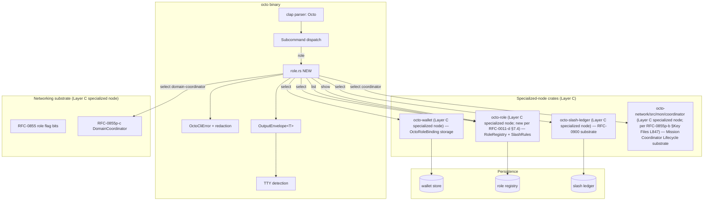
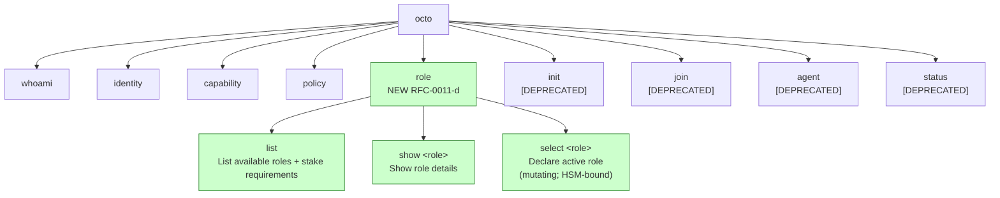

# RFC-0011-d: `octo role` Provisioning Subcommands

## Status

Accepted (2026-08-31; v1.7.1 drift-fix 2026-09-03)

> **Amendment chain:** This is amendment **d** of the RFC-0011 substrate chain.
> The parent (RFC-0011) covers identity, capability, and authorization
> subcommands. This amendment extends the CLI surface with role provisioning
> (`octo role {select,list,show}`), binding the `octo-cli` operator UX to the
> role substrate defined by RFC-0900 (economics) and RFC-0855p (coordinator /
> domain-coordinator roles). Follow-on amendments will cover vault operations
> (RFC-0011-e), mesh operations (RFC-0011-f), and governance (RFC-0011-g).

## Authorship Note

Authored by `@cipherocto` and `@mmacedoeu` per the amendment chain enumerated in RFC-0011 Status header (audit, reputation, agent lifecycle, role provisioning, vault operations, mesh operations, governance). The Authorship Note placeholder is filled at promotion to Accepted.

## Summary

This RFC defines the **role provisioning** slice of the `octo` CLI (RFC-0011
substrate chain): the three subcommands that let a human operator inspect,
list, and declare their active role within the CipherOcto role economy. The
slice binds the `octo-cli` operator UX (Layer C, RFC-0011) to the role
substrate defined by RFC-0900 (AI quota marketplace, economics) and the role
authority model defined by RFC-0855p (mission overlay coordinator roles,
networking).

Three subcommands are added:

- `octo role select <role>` — declare the operator's active role for the
  current session; HSM-bound; mutating; gates on dual-stake sufficiency.
- `octo role list` — list every role currently registered on the chain with
  its dual-stake requirement, quorum, and slashing rule reference.
- `octo role show <role>` — show the full record of one role: stake
  thresholds, slashing rules, allowed actions, role token ticker, registry
  reference.

The slice is **additive** to RFC-0011. The RFC-0011 substrate crates
(`octo-wallet`, `octo-cap-macaroon`, `octo-policy`) are not modified. Three
new `[ADD]` substrate entrypoints are proposed (Layer C specialized node,
see §7.4), gated on RFC-0900 + RFC-0855p substrate stability. No new
Layer A types are introduced.

## Dependencies

**Requires:**

- RFC-0011 — `octo` CLI substrate (clap tree, output envelope, redaction,
  operator modes, exit-code table, confirmation flag matrix)
- RFC-0900 — AI Quota Marketplace (slash ledger substrate; first-offense +
  escalation slashing model; stake_micro_octo_w column shape)
- RFC-0855 — Mission Overlay Networks (role namespace; dual-stake model;
  participant flag bits; coordinator lifecycle references)
- RFC-0855p-b — Mission Coordinator Lifecycle (slash tally; lifecycle states
  inherited by DomainCoordinator specialization)
- RFC-0855p-c — DomainCoordinator Role (physical-platform binding authority;
  platform-mediated handover pattern)
- RFC-0009 — Identity Management (DID derivation for the role-binding
  signature; lifecycle state machine cross-reference)
- RFC-0008 — Deterministic AI Execution Boundary (execution class mapping for
  the new subcommands; all role commands are class C)

**Optional / Gated:**

- RFC-0855p-d — Sub-Domain / Sub-Group Nesting (**Draft**) — required for
  `octo role select domain-coordinator` only (sub-group nesting is a
  DomainCoordinator specialization; without 0855p-d the DomainCoordinator role
  binding only covers flat domains). Flagged in §Implementation Phases.
- RFC-0855p-e — HandoverRequest Envelope & Coordinator Term Handover
  (**Draft**) — required for `octo role select domain-coordinator` to
  participate in mission-level handover. Flagged in §Implementation Phases.

> **Dependency Validation Rules:**
>
> 1. Dependencies MUST form a DAG (no cycles) — this RFC depends on 0011,
>    0900, 0855, 0855p-b, 0855p-c, 0009, 0008; none depend on this RFC.
> 2. All "Requires" RFCs MUST be listed as mission prerequisites.
> 3. Dependencies on Draft RFCs (RFC-0855p-d, RFC-0855p-e) MUST be flagged in
>    §Implementation Phases and §Compatibility.
> 4. Required dependencies on Accepted RFCs (RFC-0011, RFC-0900, RFC-0855,
>    RFC-0855p-b, RFC-0855p-c, RFC-0009, RFC-0008) are substrate-stable.
> 5. No 2-cycle sibling required — this RFC is acyclic against all Required
>    dependencies.

## Design Goals

| Goal | Target                                                | Metric                                                                                                                                                                                  |
| ---- | ----------------------------------------------------- | --------------------------------------------------------------------------------------------------------------------------------------------------------------------------------------- |
| G1   | Deterministic exit codes (mirror parent)              | Same input → same exit code across runs (§Error Handling mirrors parent exit-code table; reserves 31-34 for new variants)                                                               |
| G2   | Zero plaintext secret emission (mirror parent)        | Redaction layer test passes; no stake-holder private key in any log line, stderr, or stdout                                                                                             |
| G3   | HSM-bound signing for `role select`                   | `--dev` flag required for `InMemorySigner`; default path rejects `--dev`; CI asserts default-HSM-only (mirror parent §Security 4)                                                       |
| G4   | Read-only by default for `role list` / `role show`    | Auditor mode read-only; no `--confirm` gate required for the read path                                                                                                                  |
| G5   | Zero state mutation on `--dry-run`                    | `role select --dry-run` returns a preview envelope without binding; substrate call wrapped; CI regression test asserts no state change                                                  |
| G6   | Dual-stake sufficiency verified pre-commit            | `role select` reads current stake ledger and refuses if `stake_octo < min_octo` OR `stake_role_token < min_role_token` (exit 32)                                                        |
| G7   | Typed discriminator for `role_kind` (no central enum) | `role_kind` is a 128-bit UUID per RFC-0011-d-defined UUIDv5 namespace; new roles land without central enum edits (mirror parent RFC-0011 §Caveat Catalog typed-discriminator rationale) |
| G8   | Partial prereq gate                                   | `role list` + `role show` are Phase 1 (unblocked); `role select domain-coordinator` is Phase 2 (gated on RFC-0855p-d + RFC-0855p-e reaching Accepted)                                   |

## Motivation

The `octo-cli` binary currently exposes a deprecated `role {builder,provider,storage,bandwidth,orchestrator}` stub (RFC-0011 §Stub command compatibility). The stub prints a banner pointing operators to the future role-provisioning amendment. The role **substrate** exists (RFC-0900 slash ledger + RFC-0855 role flag bits + RFC-0855p-b/c coordinator records) but no operator-facing CLI binds to it.

Operators today cannot:

1. Discover which roles the chain accepts (no `role list`).
2. Read a role's full record — required stake, slashing rules, allowed
   actions, quorum threshold (no `role show`).
3. Declare their active role to the substrate (no `role select`). A
   `Coordinator` from RFC-0855p-b cannot bind their wallet to the role
   ledger through `octo`; they must use a substrate RPC or hand-craft an
   envelope, both of which leak the substrate's envelope format into
   operator UX.

The result is a **role-management gap**: the role substrate exists but is
unreachable through the canonical operator CLI. Operators either skip the
role binding (and lose the dual-stake-aligned emission share) or build
ad-hoc tooling that competes with `octo-cli`.

This amendment closes the gap by adding the three role subcommands above,
binding `octo-cli` to the RFC-0900 slash ledger + RFC-0855 role namespace +
RFC-0855p-c DomainCoordinator pattern. The binding is HSM-bound and
dual-stake-verified, so the operator UX does not introduce a downgrade path.

## Roles and Authorities

> **The "Nothing should be implied" rule (specification layer):** Every actor that affects correctness, security, accountability, or consensus MUST be named with a stable identifier, a defined authority scope, and a typed lifecycle. Inference is a defect.

This amendment does **NOT** extend the RFC-0011 `OperatorKind` enum
(parent §Roles and Authorities). Adding a fourth variant to a central
operator taxonomy violates the RFC-0855 typed-discriminator extension
pattern (no central enums for extension-bearing types) and the parent's
no-central-enum invariant. Instead, role-binding is represented as
`Option<OctoRoleBinding>` on the operator context, loaded as a cached
projection from the wallet store at CLI startup. `OctoRoleBinding {
role_id, role_kind_uuid, stake_octo, stake_role_token, bound_at_unix,
signature_proof }` is the typed projection; the substrate's
authoritative record is the `RoleBinding` struct defined in §7.4 (per
the substrate-truth principle: substrate owns canonical form;
presentation layer owns cached projection). Role-binding authority is
the **intersection** of the operator's base `OperatorKind` capability
and the role's allowed-actions set (RFC-0900 §Token Economics;
see §7.4 substrate-truth note on allowed-actions intersection). This
keeps the `OperatorKind` enum closed (RFC-0855 extension pattern; parent
§CaveatKind rationale).

| Role / Mode             | Identifier                      | Authority Scope                                                                                                                                                  | Lifecycle                          | Source/Ref                      |
| ----------------------- | ------------------------------- | ---------------------------------------------------------------------------------------------------------------------------------------------------------------- | ---------------------------------- | ------------------------------- |
| **Human Operator**      | `OperatorKind::Human`           | read + write (with `--confirm` for mutating)                                                                                                                     | stateless                          | RFC-0011 §Roles and Authorities |
| **CI Bot**              | `OperatorKind::CiBot`           | read-only by default; write requires `--allow-write`                                                                                                             | stateless                          | RFC-0011 §Roles and Authorities |
| **Auditor (RO)**        | `OperatorKind::Auditor`         | read-only + audit-trail access                                                                                                                                   | stateless                          | RFC-0011 §Roles and Authorities |
| **Role-bound operator** | (no new `OperatorKind` variant) | operator with `Some(OctoRoleBinding)` loaded from wallet store; role-binding authority = intersection of base `OperatorKind` capability + role's allowed-actions | persistent (per `OctoRoleBinding`) | This RFC §Roles and Authorities |

### Role Mode Transitions

```mermaid
stateDiagram-v2
    [*] --> Human: wallet init (RFC-0009)
    Human --> Human: octo role select X --confirm (sets OctoRoleBinding; orthogonal to OperatorKind)
    Human --> Human: octo role select <none> --confirm (clears OctoRoleBinding)
    Human --> Human: octo role select <any-role> --confirm (rebind; last-writer-wins per substrate)
    Human --> Auditor: OCTO_AUDIT=1 env (OctoRoleBinding preserved; read-only mode)
    Auditor --> Human: unset OCTO_AUDIT
```

A role-bound operator retains the base `OperatorKind` capability surface
(e.g., `Human`); the `OctoRoleBinding` ADDS the role-specific permission
scope (e.g., a `Provider` binding extends the operator with the
`mint_capacity_offer` substrate call). A role-bound operator who enters
`Auditor` mode keeps the role binding read-only; clearing requires
explicit `octo role select <none>`. Role binding is orthogonal to
`OperatorKind`; the enum stays closed.

### Out-of-scope Roles

- **Node Operators** (full node, wallet node, gateway) — these interact via
  dedicated RPC + config, not this CLI. The CLI is the user/operator tool,
  not the node admin tool. See RFC-0011 §Out-of-scope Roles.
- **AI Agents** — programmatic substrate access is via the Python SDK +
  HTTP proxy, not this CLI. See RFC-0917.
- **Coordinator (mission-level)** — RFC-0855p-b `CoordinatorLifecycle` is a
  substrate state machine; CLI surfaces the operator's election witness
  capability via `octo role select coordinator` (gated on RFC-0855p-e
  becoming Accepted; see §Implementation Phases Phase 2).
- **Sub-Domain Coordinator** — RFC-0855p-d sub-DC authority is exposed via
  `octo role select domain-coordinator` (gated on both RFC-0855p-d and
  RFC-0855p-e reaching Accepted).

## Specification

### 7.1 System Architecture



The `role` subcommand group is a **Layer C orchestrator**. It owns:

- clap parsing (`Octo::Role { action: RoleAction }`)
- output envelope rendering (operator UX)
- redaction layer (operator UX; mirrors parent)
- confirmation gate (mutating path; mirrors parent)
- HSM dispatch (mutating path; mirrors parent §Security 4)
- substrate performs dual-stake sufficiency check + records binding; CLI
  surfaces substrate verdict, no pre-check (substrate is sole authority;
  see §7.4 substrate-truth invariant)

It does NOT own:

- role registry substrate (Layer C specialized node — `octo-role` per RFC-0011-d §7.4 v1.7)
- slash ledger substrate (Layer C specialized node — `octo-slash-ledger` per RFC-0900)
- coordinator lifecycle substrate (Layer C specialized node — `octo-network/src/mon/coordinator` per RFC-0855p-b §Key Files L847)
- DomainCoordinator platform-binding substrate (Layer C specialized node —
  RFC-0855p-c `octo_network::mon::domain_coordinator` + `octo-adapter-{whatsapp,matrix,telegram}`)
- persistence (Layer A/B/C — substrate crates own their stores)

### 7.2 Subcommand Taxonomy

#### `octo role list`

| Aspect       | Value                                                                  |
| ------------ | ---------------------------------------------------------------------- |
| Args         | none                                                                   |
| Flags        | `--json`, `--filter <field=value>` (repeatable; `kind=<builder         | provider | ...>`/`class=<c | b>`/`requires_octo_min=<n>`) |
| Output       | `RoleListOutput { roles: Vec<RoleSummary> }`                           |
| Substrate    | `[ADD] octo_role::list(filter) -> Result<Vec<RoleSummary>, RoleError>` |
| Exit codes   | 0, 16 (`InvalidFilter`), 64                                            |
| Redaction    | none (no secret material in output)                                    |
| Side effects | none (read-only)                                                       |
| Dry-run      | n/a                                                                    |

#### `octo role show <role>`

| Aspect       | Value                                                                                                                                                                                                                                      |
| ------------ | ------------------------------------------------------------------------------------------------------------------------------------------------------------------------------------------------------------------------------------------ |
| Args         | `<role>` (REQUIRED; accepts role slug `provider` or RFC-0011-d-defined UUIDv5 namespace `urn:octo:role:0855:provider` (derived from role slug))                                                                                            |
| Flags        | `--json`, `--with-slashing-rules` (default `false`; when `true`, includes the full slashing-rules table; can be large)                                                                                                                     |
| Output       | `RoleShowOutput { role_id, role_kind_uuid, role_kind_slug, stake_octo: String, stake_role_token: Option<String>, role_token_ticker: Option<String>, quorum_numerator: u16, quorum_denominator: u16, slashing_rules_ref, slashing_rules? }` |
| Substrate    | `[ADD] octo_role::show(role_id) -> Result<RoleRecord, RoleError>`                                                                                                                                                                          |
| Exit codes   | 0, 31 (`RoleNotFound`), 16 (`InvalidFilter`), 64                                                                                                                                                                                           |
| Redaction    | none (no secret material in output)                                                                                                                                                                                                        |
| Side effects | none (read-only)                                                                                                                                                                                                                           |
| Dry-run      | n/a                                                                                                                                                                                                                                        |

#### `octo role select <role>`

| Aspect       | Value                                                                                                                                                                                                                                                                                                                                                                                                                                                                                                                       |
| ------------ | --------------------------------------------------------------------------------------------------------------------------------------------------------------------------------------------------------------------------------------------------------------------------------------------------------------------------------------------------------------------------------------------------------------------------------------------------------------------------------------------------------------------------- |
| Args         | `<role>` (REQUIRED; accepts role slug or RFC-0011-d-defined UUIDv5 namespace; `<none>` clears the binding; `coordinator` and `domain-coordinator` are reserved for Phase 2; see §Implementation Phases)                                                                                                                                                                                                                                                                                                                     |
| Flags        | `--confirm` (REQUIRED, see §Confirmation Flag Matrix), `--confirm-acknowledge` (REQUIRED for complex-payload mutating commands per parent §Security 1a), `--dry-run`                                                                                                                                                                                                                                                                                                                                                        |
| Output       | `RoleSelectOutput { role_id, role_kind_uuid, role_kind_slug, bound_at_unix, stake_octo: String, stake_role_token: Option<String>, signature_proof: RedactedHex, role_binding_hash: Hex32 }`                                                                                                                                                                                                                                                                                                                                 |
| Substrate    | `[ADD] octo_role::select(role_id, operator_did, signer) -> Result<RoleBinding, RoleError>` (HSM-bound; CLI obtains signer via `[ADD] octo_wallet::active_signer()` per RFC-0011 §Subcommand Taxonomy entry #1; `operator_did` is the RFC-0009 DID for slash-ledger PK + last-writer-wins lookup)                                                                                                                                                                                                                            |
| Exit codes   | 0, 5 (HSM missing), 11 (signing failed), 16 (`InvalidFilter`), 32 (`StakeInsufficient { required, available }`), 33 (`RoleNotSelectable { role_id, reason }`), 35 (`SignerMismatch { signer_did, operator_did }`; reserved per F-16 substrate-truth invariant), 64                                                                                                                                                                                                                                                          |
| Redaction    | `signature_proof` MUST be redacted (`RedactedHex` placeholder)                                                                                                                                                                                                                                                                                                                                                                                                                                                              |
| Side effects | new `OctoRoleBinding` persisted by substrate `octo-role` (authoritative; see §7.4 substrate-truth notes); wallet store receives the cached projection for operator UX; slash-ledger row created in RFC-0900 substrate (init stake); if `role_kind = domain-coordinator`, the substrate invokes `[ADD] octo_network::dc::admin_attest::bind_domain_coordinator(role_binding, group_binding, platform_admin_proof)` (see §7.4 Substrate `[ADD]` Signatures) to atomically update RFC-0850p-c `GroupBinding` + emit RFC-0855p-c §5a `PlatformEvent::AdminTransfer` envelope (drift-fix v1.7.1; canonical substrate home + canonical Layer C types per RFC-0855p-c drift-fix B/C closed at commit `205f1434`) |
| Dry-run      | substrate call wrapped; preview only (no slash-ledger row; no binding persisted)                                                                                                                                                                                                                                                                                                                                                                                                                                            |

### 7.3 Output Envelopes

Every subcommand emits `OutputEnvelope<T>` (parent §Output Envelope; same
`schema_version: 2` carrying the additive `preview_only` field):

```rust
//! crates/octo-cli/src/commands/role.rs

use serde::{Deserialize, Serialize};

/// Output envelope for `octo role select`. Mirrors parent
/// `OutputEnvelope<T>` shape (RFC-0011 §Output Envelope); only the
/// `data` payload is specific to role select.
#[derive(Serialize, Deserialize, Debug)]
pub struct RoleSelectOutput {
    /// Canonical role identifier (RFC-0011-d-defined UUIDv5 namespace).
    pub role_id: String,

    /// Typed discriminator (128-bit UUID) — replaces the parent's
    /// role string slot; no central enum.
    pub role_kind_uuid: [u8; 16],

    /// Human-readable slug (e.g., "provider"); for display only.
    pub role_kind_slug: String,

    /// Unix timestamp the binding was persisted (RFC 3339 UTC).
    pub bound_at_unix: i64,

    /// Initial stake in OCTO (decimal string; matches RFC-0900 wire form).
    pub stake_octo: String,

    /// Initial stake in the role-specific token (decimal string; None
    /// if the role does not require a role token — e.g., "recorder" is
    /// OCTO-only).
    pub stake_role_token: Option<String>,

    /// HSM signature over the binding envelope (redacted).
    ///
    /// **Redaction boundary (per §7.4 substrate-truth note):** the CLI
    /// receives this field as `RedactedHex` directly from the substrate's
    /// `octo_role::select` return value — the substrate performs the
    /// `[u8; 64] -> RedactedHex` conversion AFTER signature verification,
    /// INSIDE the envelope-build atomic operation. There is NO plaintext
    /// path from the HSM into the CLI envelope: the substrate returns
    /// `RedactedHex` placeholder verbatim, and the CLI's redaction layer
    /// (parent §Redaction Layer) only sees the already-redacted form.
    /// The substrate's canonical internal record (`RoleBinding.signature_proof`)
    /// stores `[u8; 64]` (per §7.4); the CLI-facing surface is
    /// `RedactedHex`.
    pub signature_proof: RedactedHex,

    /// BLAKE3-256 of the canonical binding envelope (Hex32 newtype
    /// per RFC-0011 §Hex32 newtype — public material, not redacted).
    pub role_binding_hash: Hex32,
}

/// Output envelope for `octo role list`.
#[derive(Serialize, Deserialize, Debug)]
pub struct RoleListOutput {
    pub roles: Vec<RoleSummary>,
}

/// Output envelope for `octo role show`.
#[derive(Serialize, Deserialize, Debug)]
pub struct RoleShowOutput {
    pub role_id: String,
    pub role_kind_uuid: [u8; 16],
    pub role_kind_slug: String,

    /// OCTO stake required to bind (decimal string; RFC-0900 wire form).
    pub stake_octo: String,

    /// Role-token stake required (decimal string; None = OCTO-only).
    pub stake_role_token: Option<String>,

    /// Role token ticker (e.g., "OCTO-A", "OCTO-B"); None for OCTO-only roles.
    pub role_token_ticker: Option<String>,

    /// Slash-vote quorum numerator (RFC-0855 §11.3 governance models table).
    /// Validated substrate-side: `denominator > 0` and `numerator <= denominator`.
    pub quorum_numerator: u16,

    /// Slash-vote quorum denominator (RFC-0855 §11.3 governance models table).
    /// Common defaults: `2/3` for treasury / protocol-parameter changes;
    /// `3/5` for standard role governance; `1/3` for mission quorum.
    pub quorum_denominator: u16,

    /// Reference to the slashing rules document (URI; resolved via
    /// RFC-0855 mission governance).
    pub slashing_rules_ref: String,

    /// Full slashing rules table; only populated when
    /// `--with-slashing-rules` is set (default off).
    #[serde(skip_serializing_if = "Option::is_none")]
    pub slashing_rules: Option<Vec<SlashingRuleSummary>>,
}

/// Per-rule summary in the slashing-rules table (RFC-0900 §Slashing Model).
#[derive(Serialize, Deserialize, Debug)]
pub struct SlashingRuleSummary {
    pub reason_code: u16,
    pub description: String,
    pub penalty_pct_micro: u64,
    pub escalation_multiplier_micro: u64,
    pub ban_threshold_pct_micro: u64,
}
```

### 7.4 Substrate `[ADD]` Signatures

The following `[ADD]` substrate entrypoints are required for the three
subcommands above to compile. They are added to existing Layer C specialized-node substrate
crates (NOT new crates; per the parent's `[ADD]` pattern):

```rust
//! crates/octo-role/src/lib.rs (NEW crate; Layer C specialized node per
//!  Layer placement table; owns role registry + select + binding logic).

/// Canonical role summary exposed to the CLI. Mirrors the substrate's
/// authoritative registry entry shape.
#[derive(Clone, Debug)]
pub struct RoleSummary {
    pub role_id: String,                  // RFC-0011-d-defined UUIDv5 namespace as string
    pub role_kind_uuid: [u8; 16],         // typed discriminator (no central enum)
    pub role_kind_slug: String,           // human-readable
    pub stake_octo: String,               // decimal string (RFC-0900 wire form)
    pub stake_role_token: Option<String>, // decimal string; None = OCTO-only
    pub quorum_numerator: u16,             // slash-vote quorum numerator (RFC-0855 §11.3)
    pub quorum_denominator: u16,          // slash-vote quorum denominator (RFC-0855 §11.3)
    pub slashing_rules_ref: String,       // URI to the slashing-rules document
}

/// Full role record (returned by `show`). Includes every field in the
/// role registry entry, including the slashing-rules table on demand.
#[derive(Clone, Debug)]
pub struct RoleRecord {
    pub summary: RoleSummary,
    pub slashing_rules: Vec<SlashingRule>,
    pub allowed_actions: Vec<RoleAction>,  // substrate calls this role can perform (intersected with OperatorKind capability substrate-side BEFORE canonicalization; see §7.4 substrate-truth note on allowed-actions intersection)
    pub registry_ref: String,              // chain-anchored registry pointer
}

/// Per-rule slashing entry (RFC-0900 §Slashing Model).
#[derive(Clone, Debug)]
pub struct SlashingRule {
    pub reason_code: u16,
    pub description: String,
    pub penalty_pct_micro: u64,            // 1e6 = 100%
    pub escalation_multiplier_micro: u64,
    pub ban_threshold_pct_micro: u64,
}

/// Filter for `list`. Field-aligned to the CLI's `--filter <field=value>`
/// parser (parent §Subcommand Taxonomy `capability list` pattern).
#[derive(Clone, Debug, Default)]
pub struct RoleFilter {
    pub role_kind_slug: Option<String>,
    pub execution_class: Option<ExecutionClass>,
    pub requires_octo_min: Option<u64>,
}

/// The role-binding record persisted by substrate `octo-role` on `select`.
///
/// **Substrate-truth vs. cached projection:** this struct is the
/// substrate's authoritative record. The CLI operator-UX layer
/// (`crates/octo-wallet/src/wallet_store.rs`) holds a typed cached
/// projection of this record as `Option<OctoRoleBinding>` (per §Roles and Authorities persistence row). The wallet projection is consumed
/// at CLI startup to populate the operator context; the substrate
/// record is the source of truth for the `(chain_id, operator_did)`
/// slash-ledger PK + last-writer-wins lookup. Operators MUST NOT rely
/// on the wallet projection for cross-process consistency — only the
/// substrate's `octo_role::select` return value is canonical. The
/// wallet projection MAY be stale across concurrent CLI invocations;
/// the substrate's last-writer-wins atomic update (per §Security 2)
/// resolves any divergence.
///
/// The split mirrors parent RFC-0011 §Caveat Catalog principle
/// (substrate owns canonical form; presentation layer owns cached
/// projection); the projection is invalidated on every `select`
/// call (substrate re-emits the `RoleBinding` and the CLI overwrites
/// the cached copy).
#[derive(Clone, Debug)]
pub struct RoleBinding {
    pub role_id: String,
    pub role_kind_uuid: [u8; 16],
    pub bound_at_unix: i64,
    pub stake_octo: String,
    pub stake_role_token: Option<String>,
    pub signature_proof: [u8; 64],         // HSM signature; substrate-internal canonical form. The substrate's `select` function converts this to `RedactedHex` AFTER signature verification (per §7.4 substrate-truth note on RedactedHex conversion boundary); the CLI receives `RedactedHex` directly — no plaintext path from HSM into the CLI envelope (per §7.7 Redaction).
    pub role_binding_hash: [u8; 32],       // BLAKE3-256 of the canonical binding envelope
}

/// Typed error enum (mirrors parent `OctoCliError` pattern; substrate-truth).
#[derive(thiserror::Error, Debug)]
pub enum RoleError {
    #[error("role not found: {0}")]
    NotFound(String),

    #[error("invalid filter: {0}")]
    InvalidFilter(String),

    #[error("stake insufficient: required {required}, available {available}")]
    StakeInsufficient { required: String, available: String },

    #[error("role not selectable: {role_id} ({reason})")]
    RoleNotSelectable { role_id: String, reason: String },

    #[error("signer mismatch: signer_did {signer_did} != operator_did {operator_did}")]
    SignerMismatch { signer_did: String, operator_did: String },

    #[error("internal role substrate error: {0}")]
    Internal(String),
}

/// Role-substrate action vocabulary. This is the closed set of actions a
/// binding may authorize (`allowed_actions` field on `RoleRecord`). It is
/// NOT a role-kind taxonomy — `role_kind` is a typed UUID discriminator
/// (no central enum; per RFC-0011-d-defined UUIDv5 namespace). Adding a new role
/// does NOT extend this enum; adding a new substrate action DOES. The
/// enum stays substrate-owned; the CLI dispatches via the same variant
/// names.
///
/// **Action vocabulary vs. role taxonomy asymmetry:** `RoleAction` is the
/// **substrate action vocabulary** (what a binding may authorize the
/// operator to do on the substrate side — `Select`, `Bind`, `Unbind`,
/// `List`, `Show`). It is NOT a role-kind taxonomy — role kinds are
/// identified by the 128-bit `role_kind_uuid` discriminator (no central
/// enum; per RFC-0855 typed-discriminator extension pattern). A new
/// role kind (e.g., a future `gateway` role) lands by adding a row to
/// the role registry substrate; it does NOT add a `RoleAction` variant.
/// A new substrate action (e.g., a future `Rotate` action) DOES add a
/// variant, but is gated on a substrate RFC that defines the action's
/// semantics + canonical form. The two extension surfaces are
/// independent — role kinds extend the registry; actions extend this
/// enum.
///
/// `#[non_exhaustive]` permits future substrate-RFC additions (e.g.,
/// `Rotate`, `Migrate`) without breaking downstream consumers that
/// match-exhaustively on the enum; consumers MUST add a wildcard arm
/// when pattern-matching.
#[derive(Clone, Copy, Debug, PartialEq, Eq)]
#[non_exhaustive]
pub enum RoleAction {
    /// Bind the active role (octo role select).
    Select,
    /// Bind a role idempotently (alias of Select; reserved for
    /// bulk-binding follow-on).
    Bind,
    /// Clear the active binding (reserved; not exposed in Phase 1).
    Unbind,
    /// List roles (octo role list).
    List,
    /// Show one role (octo role show).
    Show,
}

// ----- [ADD] substrate functions -----

/// List roles matching the filter. Returns all roles when filter is empty.
/// Read-only; no HSM required.
pub fn list(filter: &RoleFilter) -> Result<Vec<RoleSummary>, RoleError>;

/// Show the full record for one role (by slug or RFC-0855 UUID).
/// Read-only; no HSM required.
pub fn show(role_id: &str) -> Result<RoleRecord, RoleError>;

/// Select (bind) a role for the active wallet. HSM-bound.
///
/// The substrate canonicalizes the binding envelope per
/// RFC-0011 §Determinism (DCS) BEFORE invoking the signer — the CLI
/// does NOT canonicalize. Canonicalization is the substrate's
/// authoritative responsibility (single canonicalizer per
/// RFC-0011 §Determinism).
///
/// Dual-stake sufficiency is verified via the **pre-sign snapshot
/// mechanism**: the substrate reads the operator's current stake from
/// its own ledger ATOMICALLY at signing time, NOT from operator-supplied
/// arguments. Returns `RoleError::StakeInsufficient` if insufficient;
/// the operator MUST top up before retrying. This is the substrate-
/// truth invariant: the substrate OWNS the rule "what counts as
/// sufficient stake" and the substrate OWNS the ledger it reads from.
///
/// The `operator_did` is the RFC-0009 DID of the binding wallet. The
/// substrate uses it to (a) look up the operator's pre-sign stake
/// snapshot, (b) compose the slash-ledger row PK
/// `(chain_id, operator_did)` per RFC-0900 §Slash Ledger Substrate,
/// and (c) enable last-writer-wins: a second `select` for the same
/// `operator_did` UPDATES the existing slash-ledger row rather than
/// creating a duplicate (per §Security 2).
///
/// **Signer invariant (substrate-enforced):** `signer.did() == operator_did`.
/// The substrate verifies the signer identity matches `operator_did`
/// BEFORE invoking `signer.sign(...)`. A mismatch returns
/// `RoleError::SignerMismatch { signer_did, operator_did }` (exit 35 in
/// the CLI mapping; reserved per F-16 — previously shared the
/// signing-failed slot at exit 11; promoted to dedicated exit 35 in
/// Wave 2 because `SignerMismatch` is a substrate-truth invariant
/// violation distinct from a generic signing failure, and the two
/// error semantics warrant distinct operator-facing messages). This
/// invariant prevents a compromised CLI from
/// binding a role to a wallet whose key material it does not control.
/// The CLI obtains both `operator_did` and `signer` from the same
/// `WalletStore::active_signer()` call (parent RFC-0011 §Subcommand
/// Taxonomy entry #1) so under normal flow they match; the substrate
/// check is defense in depth against an in-process swap.
///
/// Writes the role-binding record to the substrate's own store and
/// creates the slash-ledger row in the RFC-0900 substrate. The signer
/// is the wallet's HSM-backed `CapabilitySigner` (parent RFC-0011
/// §Subcommand Taxonomy entry #1).
pub fn select(
    role_id: &str,
    operator_did: &Did,                  // RFC-0009 DID (typed; not a string)
    signer: &dyn CapabilitySigner,
) -> Result<RoleBinding, RoleError>;

// ----- [ADD] nonce counter substrate entry (companion to `select`) -----

/// Monotonic nonce counter substrate entry. **Crate location:**
/// `octo_wallet::next_nonce_counter(operator_did) -> Result<u64,
/// WalletError>` — this entry is added to the **existing**
/// `octo-wallet` crate (Layer C specialized node; parent RFC-0011 §Subcommand Taxonomy
/// entry #1), NOT to `octo-role`. The signature is documented here in
/// the role-substrate section because `octo_role::select` consumes it
/// inside its atomic envelope build (per §7.6 sequence diagram); the
/// canonical home of the function is `octo-wallet` (the substrate that
/// already owns counter persistence and signer-did pairing).
///
/// Invoked by `octo_role::select` ATOMICALLY inside the envelope-build
/// step (per §7.6 sequence diagram) to derive `nonce = blake3(
/// "octo.role_binding" || operator_did || monotonic_counter)` per parent
/// RFC-0011 §Security Considerations #3 nonce formula. The counter is
/// persisted on-disk in the wallet store (Layer C specialized node; per parent RFC-0011
/// §Implicit Assumptions Audit row "Monotonic nonce counter persists
/// across process restarts") and is BUMPED atomically with the
/// slash-ledger row creation inside the Stoolap `BEGIN IMMEDIATE`
/// transaction (per §7.6 footnote). A second `select` for the same
/// `(chain_id, operator_did)` therefore yields a DIFFERENT nonce even
/// when last-writer-wins UPDATES the existing slash-ledger row — the
/// nonce bump is the substrate-authoritative replay defense.
///
/// **Cross-crate call relationship:** `octo_role::select` calls
/// `octo_wallet::next_nonce_counter(operator_did)` inside the same
/// Stoolap `BEGIN IMMEDIATE` write tx that creates the slash-ledger
/// row (per §7.6 sequence diagram `Role->>WS: next_nonce_counter` arrow
/// + §7.6 footnote). The wallet crate owns the counter row; the role
/// crate consumes the returned `u64` for nonce derivation. The
/// dependency direction is `octo-role` (consuming) → `octo-wallet`
/// (providing), matching the Layer C specialized-node layering (parent
/// RFC-0011 §Subcommand Taxonomy entry #1).
///
/// Returns `WalletError::NonceUnderflow` if the counter would overflow
/// `u64` (operationally unreachable at <1 select/sec for ~585 billion
/// years, but the substrate checks for type-safety on the upgrade path).
pub fn next_nonce_counter(operator_did: &Did) -> Result<u64, WalletError>;

// ----- [ADD] Phase 2 substrate entry (companion to `select`) -----

/// Phase 2 substrate entry. Invoked by `octo_role::select_domain_coordinator`
/// (Phase 2 successor of `octo_role::select`) when the operator binds the
/// `domain-coordinator` role kind to a transport group binding
/// (RFC-0850p-c §4). Atomically verifies the platform admin proof +
/// updates RFC-0850p-c `GroupBinding` + emits RFC-0855p-c §5a
/// `PlatformEvent::AdminTransfer` envelope.
///
/// **Substrate home:** `crates/octo-network/src/dc/admin_attest.rs`
/// (REAL substrate home; Layer C specialized node; co-located with
/// existing `PlatformAdminAttestError` per RFC-0855p-c §Key Files).
/// The role substrate calls into the DC attestation substrate; cross-crate
/// import via `octo_network::dc::admin_attest`. Drift-fix v1.7.1
/// re-locates from non-existent `octo_network::mon::domain_coordinator`
/// to the REAL canonical home (RFC-0855p-c drift-fix B/C closed at
/// commit `205f1434` per `docs/audits/2026-09-03-m10-m11-substrate-truth-reconciliation.md`).
///
/// **Substrate-truth invariant:** `platform_admin_proof` MUST verify
/// (freshness via `MAX_ATTEST_AGE_EPOCHS` + DC pubkey match per
/// RFC-0855p-c §5a); the operator's pubkey (derived from `RoleBinding`)
/// MUST equal `PlatformAdminProof::dc_pubkey`; `group_binding.state` MUST
/// be `GroupState::Bound` (no transition from `Unbound` / `Quarantined`
/// / `ReBinding`). On success: `GroupBinding::state` remains `Bound`
/// (idempotent if already Bound); `GroupBinding::bound_peer_id` is set
/// to the operator's canonical peer_id; `PlatformEvent::AdminTransfer`
/// envelope is emitted post-commit (Layer D side-effect; non-transactional).
///
/// **Atomicity:** returns updated `GroupBinding` on success; on any
/// verification failure returns canonical `BindingError` (NOT fictional
/// `DomainCoordinatorError`; Layer C error at
/// `crates/octo-network/src/dot/binding.rs:648`). Phase 2 production
/// wires this into a single Stoolap `BEGIN IMMEDIATE` transaction
/// covering BOTH the role binding (from `octo_role::select`) AND the
/// binding ceremony update — see M10 `select_domain_coordinator`.
///
/// **Phase 2 gating:** RFC-0855p-c + RFC-0850p-c must both be Accepted
/// (both gates CLEARED). CLI gates the `domain-coordinator` role kind
/// via `RoleError::RoleNotSelectable { reason: "M11 substrate not landed" }`
/// until M11 substrate lands (per §Mission Decomposition M10 row
/// substrate-first ordering; M11 must land BEFORE M10 begins).
pub fn bind_domain_coordinator(
    role_binding: &RoleBinding,
    group_binding: &GroupBinding,
    platform_admin_proof: &PlatformAdminProof,
    current_epoch: u64,
) -> Result<GroupBinding, BindingError>;
```

**Substrate-truth notes:**

- `RoleKind` is **NOT** a substrate enum. The substrate uses the typed
  128-bit UUID discriminator (`role_kind_uuid: [u8; 16]`) per the
  RFC-0011-d-defined UUIDv5 namespace (`urn:octo:role:0855:<slug>`,
  derived from role slug). New roles land by adding a row to the role
  registry; no central enum edit. This mirrors the parent's
  `CaveatKind` rationale (caveat discriminator, no central enum; parent
  never carried a central `CaveatKind` enum — the typed-discriminator
  is the substrate's canonical extension surface per RFC-0011 §Caveat
  Catalog).
- `RoleError` is **NOT** extended into the parent `OctoCliError` enum; it is
  a substrate error type that the CLI translates to
  `OctoCliError::Role*` variants in `crates/octo-cli/src/error.rs` (see
  §Error Handling for the variant + exit-code mapping).
- `CapabilitySigner` is the cross-substrate signer trait from
  `octo-cap-macaroon` (parent RFC-0011 §Subcommand Taxonomy entry #10).
  The CLI obtains the signer via `WalletStore::active_signer() -> Result<Arc<dyn CapabilitySigner>, WalletError>`
  (parent RFC-0011 §Subcommand Taxonomy entry #1); the substrate `select` accepts
  `&dyn CapabilitySigner` per the same parent pattern.
- `Did` is the RFC-0009 typed DID (Layer A canonical; not a string). The CLI
  passes `operator_did: &Did` from the active wallet context; the substrate
  uses it for stake lookup + slash-ledger PK + last-writer-wins.
- The dual-stake sufficiency check is performed substrate-side (NOT CLI-side)
  via the pre-sign snapshot mechanism — the substrate reads its own ledger
  atomically at signing time, returning `RoleError::StakeInsufficient { required, available }`.
  The CLI surfaces that variant in a user-facing message; the substrate's
  wire form is the canonical authority. There is NO CLI-side pre-check
  (substrate-truth invariant; CLI does NOT carry the ledger view).
- The `allowed_actions` ∩ `OperatorKind` capability intersection (the
  permission scope of an active role binding; see §Roles and Authorities)
  is computed substrate-side inside `octo_role::select` BEFORE the
  binding envelope is canonicalized. The substrate intersects
  `RoleRecord.allowed_actions` (returned by `octo_role::show`) with the
  operator's base `OperatorKind` capability set (resolved from
  `operator_did` at signing time) and writes the resulting intersection
  into the canonical binding envelope. Canonicalization happens AFTER the
  intersection is locked in, so the canonical bytes signed by the HSM
  reflect the post-intersection permission scope (not the
  pre-intersection union). This is the substrate-authoritative invariant:
  the operator's effective permission scope at signing time is what the
  signature covers, not the pre-intersection declaration. The CLI
  surfaces the resulting role-binding hash to the operator in
  `role_binding_hash` (Hex32; per §7.3 output envelope); the CLI does
  NOT compute or display the intersection directly (substrate-truth; CLI
  does not carry the `OperatorKind` resolution view at envelope-build
  time).
- The `[u8; 64] -> RedactedHex` conversion of `signature_proof` happens
  INSIDE `octo_role::select` AFTER signature verification (per the §7.7
  Redaction invariant + §Security 6). The substrate's canonical internal
  record (`RoleBinding.signature_proof: [u8; 64]`) holds the raw bytes
  for persistence + the slash-ledger row's audit trail (the raw signature
  is what the substrate's own audit log verifies against on slash event
  replay); the substrate's `select` return value exposes
  `signature_proof: RedactedHex` (parent §Hex32/RedactedHex newtype) to
  the CLI. The conversion happens AFTER verification — never before —
  because the substrate's audit log needs the plaintext signature bytes
  to verify the signature was correctly produced by the operator's HSM
  on canonical envelope bytes (per RFC-0011 §Determinism Requirements —
  DCS canonical bytes). The CLI receives only the `RedactedHex` form and
  cannot reconstruct the plaintext (defense in depth: a compromised CLI
  cannot exfiltrate the operator's signature, only confirm that the
  substrate verified it).

### 7.5 Role Summary

The `RoleSummary` (returned by `octo_role::list` and embedded in
`RoleShowOutput`) is the canonical read-only view of a role. The
`role_kind` field uses the typed UUID discriminator + slug tuple, NOT a
central enum (mirror parent RFC-0011 §Hex32 newtype rationale; mirror
parent RFC-0011 §Caveat Catalog typed-discriminator rationale).

| Field                                     | Type             | Source                                                                                   | Notes                                                                                                                                                                          |
| ----------------------------------------- | ---------------- | ---------------------------------------------------------------------------------------- | ------------------------------------------------------------------------------------------------------------------------------------------------------------------------------ |
| `role_id`                                 | `String`         | RFC-0011-d-defined UUIDv5 namespace `urn:octo:role:0855:<slug>` (derived from role slug) | Canonical identifier; CLI parses both slug and UUID forms                                                                                                                      |
| `role_kind_uuid`                          | `[u8; 16]`       | typed discriminator                                                                      | 128-bit UUID; replaces central enum                                                                                                                                            |
| `role_kind_slug`                          | `String`         | RFC-0011-d namespace                                                                     | One of: `builder`, `provider`, `storage`, `bandwidth`, `orchestrator`, `recorder`, `wallet`, `coordinator` (Phase 2), `domain-coordinator` (Phase 2)                           |
| `stake_octo`                              | `String`         | RFC-0900 wire form                                                                       | Decimal string (e.g., `"1000.000000"`); never `f64` (mirror RFC-0104 §Specification scale-binding rationale)                                                                   |
| `stake_role_token`                        | `Option<String>` | RFC-0900 wire form                                                                       | `None` for OCTO-only roles (`recorder`); `Some("N.NNNNNN")` for dual-stake roles                                                                                               |
| `role_token_ticker`                       | `Option<String>` | RFC-0900 token-design                                                                    | e.g., `Some("OCTO-A")` for `provider`; `None` for `recorder`                                                                                                                   |
| `quorum_numerator` / `quorum_denominator` | `u16` / `u16`    | RFC-0855 §11.3 governance models table (fraction form)                                   | Slash-vote quorum fraction (e.g., `2/3` for treasury; `3/5` for standard governance; `1/3` for mission quorum); substrate computes from role's governance model + mission size |
| `slashing_rules_ref`                      | `String`         | RFC-0900 substrate                                                                       | URI to the slashing-rules document                                                                                                                                             |

#### Canonical role → role-token mapping

The following table binds role slugs to the RFC-0900 / `docs/04-tokenomics/token-design.md` role tokens. The CLI does NOT carry this table; the substrate registry is the source of truth. The CLI displays the substrate's answer verbatim.

| Role slug      | role_kind_uuid (canonical, RFC-0011-d-defined UUIDv5 namespace) | role_token_ticker | stake_octo (default) | stake_role_token | Source                                |
| -------------- | --------------------------------------------------------------- | ----------------- | -------------------- | ---------------- | ------------------------------------- |
| `builder`      | RFC-0011-d-defined UUIDv5 namespace                             | `OCTO-D`          | 1,000                | 100 OCTO-D       | RFC-0855 §4.2 + `token-design.md` §10 |
| `provider`     | RFC-0011-d-defined UUIDv5 namespace                             | `OCTO-A`          | 1,000                | 100 OCTO-A       | RFC-0855 §4.2 + `token-design.md` §10 |
| `storage`      | RFC-0011-d-defined UUIDv5 namespace                             | `OCTO-S`          | 1,000                | 100 OCTO-S       | RFC-0855 §4.2 + `token-design.md` §10 |
| `bandwidth`    | RFC-0011-d-defined UUIDv5 namespace                             | `OCTO-B`          | 1,000                | 100 OCTO-B       | RFC-0855 §4.2 + `token-design.md` §10 |
| `orchestrator` | RFC-0011-d-defined UUIDv5 namespace                             | `OCTO-O`          | 1,000                | 100 OCTO-O       | RFC-0855 §4.2 + `token-design.md` §10 |
| `recorder`     | RFC-0011-d-defined UUIDv5 namespace                             | `None`            | 1,000                | `None`           | This RFC §7.5 (new role; OCTO-only)   |
| `wallet`       | RFC-0011-d-defined UUIDv5 namespace                             | `None`            | 1,000                | `None`           | This RFC §7.5 (new role; OCTO-only)   |

[^new-roles]:
    The two new role slugs (`recorder`, `wallet`) introduced in
    this RFC are OCTO-only and do NOT require a row addition to
    `docs/04-tokenomics/token-design.md` §10 Dual-Stake table — that table
    is the dual-stake role-token mapping (OCTO + role-specific token), and
    OCTO-only roles are intentionally absent from it (their absence is the
    "no role token required" semantic). The follow-on mission owed per §Key
    Files (`docs/04-tokenomics/token-design.md` §10 update for the dual-stake
    additions) covers the FUTURE role additions that DO require a role
    token (e.g., a hypothetical `gateway` role with `OCTO-G` ticker); the
    Phase 1 surface introduces no dual-stake additions, so the §10 update
    mission is gated on the first dual-stake role addition post-Phase 1.
    See `Key Files to Modify` → `docs/04-tokenomics/token-design.md` for the
    follow-on mission scope. The same §10 follow-on scope applies to
    Appendix C (Dual-stake summary table) — Appendix C is the RFC's mirror
    of `token-design.md` §10; it stays in sync with the
    `token-design.md` §10 follow-on mission.
    | `coordinator` (P2) | RFC-0011-d-defined UUIDv5 namespace | `OCTO-O` | 1,000 | 100 OCTO-O | RFC-0855p-b + RFC-0855p-e (Phase 2) |
    | `domain-coordinator` (P2) | RFC-0011-d-defined UUIDv5 namespace | `OCTO-O` | 1,000 | 100 OCTO-O | RFC-0855p-c + RFC-0855p-d + RFC-0855p-e (Phase 2) |

The two new role slugs (`recorder`, `wallet`) are introduced in this
amendment; they are OCTO-only roles that do not require a role token. They
land by adding a row to the role registry substrate; no central enum edit.

### 7.6 Role Select — HSM Signing Flow

The `role select` flow mirrors the parent's `octo capability mint` HSM
flow (parent §Security 1 / §Security 4) with the substrate-specific
adaptation: an **atomic-with-signing envelope build** — the substrate
canonicalizes the binding envelope, reads the operator's stake snapshot,
signs, and verifies the signature in a single atomic operation (no
intermediate state read by the CLI; the CLI only forwards the substrate's
return value). Slash-ledger row creation and binding persistence happen
inside the same atomic envelope; the CLI receives the resulting
`RoleBinding` and renders it.

```mermaid
sequenceDiagram
    participant Op as Operator
    participant CLI as octo-cli
    participant WS as WalletStore
    participant Role as octo-role (substrate)
    participant SubStore as SubstrateStore
    participant Slash as octo-slash-ledger (RFC-0900)

    Op->>CLI: octo role select provider --confirm --confirm-acknowledge
    CLI->>CLI: parse args; validate --confirm + --confirm-acknowledge (parent §Confirmation Flag Matrix)
    CLI->>WS: resolve operator_did (RFC-0009 DID of binding wallet)
    WS-->>CLI: operator_did
    CLI->>WS: [ADD] active_signer() -> Arc<dyn CapabilitySigner>
    WS-->>CLI: signer (or HSM unavailable; exit 5)
    CLI->>Role: [ADD] select(role_id, operator_did, signer) -> RoleBinding
    Note over Role: substrate enforces atomic-with-signing envelope build:<br/>derive nonce + canonicalize + read stake + sign + verify
    Role->>WS: [ADD] next_nonce_counter(operator_did) -> monotonic_counter (bumped atomically inside the Stoolap BEGIN IMMEDIATE tx; per §7.4 substrate entry + §Implicit Assumptions Audit row "Monotonic nonce counter for role-binding replay defense")
    WS-->>Role: monotonic_counter
    Role->>Role: derive nonce = blake3("octo.role_binding" || operator_did || monotonic_counter) (parent §Security Considerations #3 nonce formula; monotonic_counter persisted in wallet store per §Implicit Assumptions Audit row "Monotonic nonce counter for role-binding replay defense"; substrate-enforced)
    Role->>Role: canonicalize binding envelope (DCS; parent §Determinism) — substrate is the single canonicalizer; nonce field is part of the canonical bytes (parent §Determinism Requirements — DCS field declaration order)
    Role->>Role: atomic-read operator stake from substrate ledger (pre-sign snapshot, lock row)
    alt stake insufficient
        Role-->>CLI: RoleError::StakeInsufficient { required, available }
        CLI->>Op: error StakeInsufficient { required, available } (exit 32)
    end
    Role->>Role: verify signer.did() == operator_did (BEFORE invoking signer.sign(...); substrate-enforced per §7.4 Signer invariant + TV-RX-4 narrative; HSM DoS defense — refuse to invoke the HSM when a mismatch is already certain, avoiding a wasted signing operation + HSM lock contention)
    alt signer.did() != operator_did
        Role-->>CLI: RoleError::SignerMismatch { signer_did, operator_did }
        CLI->>Op: error SignerMismatch (exit 35; per F-16 dedicated slot)
    end
    Role->>WS: signer.sign(envelope_canonical_bytes) -> [u8; 64]
    WS-->>Role: signature_proof
    Role->>Role: verify signature_proof covers canonical envelope bytes (atomic; post-sign verification of the canonical-bytes signature)
    Role->>Slash: create slash-ledger row (chain_id, operator_did, initial_stake) per RFC-0900 §Slash Ledger Substrate
    Slash-->>Role: ok
    Role->>SubStore: persist OctoRoleBinding (substrate self-loop; Layer C specialized node; parent RFC-0011 §Subcommand Taxonomy entry #1 `octo_wallet::WalletStore` — 0700 enforced on store creation; `OctoRoleBinding` is the cached projection per F-W3-3 substrate-truth split; wallet store receives the cached projection AFTER substrate self-loop commits)
    SubStore-->>Role: ok
    Role-->>CLI: RoleBinding
    CLI->>Op: OutputEnvelope<RoleSelectOutput> { signature_proof: [REDACTED:sig], role_binding_hash, ... }
```

> **§7.6 footnote (Stoolap transaction envelope):** `octo_role::select`
> invokes the Stoolap `BEGIN IMMEDIATE` transaction at envelope-build
> start (per the parent RFC-0011 substrate migration to the Stoolap fork
> at `feat/blockchain-sql`, commit `527e8eb`). The transaction commits on
> sign-success (canonicalize → read stake → sign → verify → persist all
> within one Stoolap write tx) and rolls back on
> `RoleError::StakeInsufficient` or `RoleError::SignerMismatch`. The
> Stoolap `IMMEDIATE` mode acquires a write lock at BEGIN time, which is
> the substrate-authoritative guarantee that no concurrent `select` for
> the same `(chain_id, operator_did)` can interleave between the stake
> read and the slash-ledger row creation. This is the mechanism that
> makes last-writer-wins atomic (per §Security 2) — without
> `BEGIN IMMEDIATE`, a TOCTOU race between two CLI invocations could
> produce two slash-ledger rows that the application layer would then
> have to merge.
>
> **Crash-recovery ordering (slash-ledger vs `OctoRoleBinding` SubStore):**
> both writes happen inside the same Stoolap `BEGIN IMMEDIATE` write tx
> (per §7.6 footnote above). On process kill (SIGKILL / power loss) before
> commit, neither the slash-ledger row NOR the `OctoRoleBinding` SubStore
> row is visible — both roll back together. On the next `select` for the
> same `(chain_id, operator_did)`, the substrate re-derives the nonce
> from the persisted `next_nonce_counter` value (the counter itself is
> bumped atomically inside the same write tx, so on rollback it is also
> reverted), re-canonicalizes, and retries the envelope build. The
> substrate-authoritative guarantee is: **after any process kill, the
> operator's binding state is either fully committed or fully absent —
> no half-committed slash-ledger row without a matching `OctoRoleBinding`
> SubStore row is observable.** This is enforced by the Stoolap write-tx
> atomicity, NOT by application-layer reconciliation; the CLI does NOT
> carry any recovery logic.

**Confirmation gate (parent §Confirmation Flag Matrix extended):**

| Operator mode     | `role list` / `role show` (read) | `role select` (mutating)                                           | HSM downgrade (`InMemorySigner`)                                                        |
| ----------------- | -------------------------------- | ------------------------------------------------------------------ | --------------------------------------------------------------------------------------- |
| `human` (default) | (no flag)                        | `--confirm` + `--confirm-acknowledge`                              | denied (HSM required; per parent §Security 4)                                           |
| `ci`              | (no flag)                        | `--allow-write`                                                    | denied (HSM required; per parent §Security 4)                                           |
| `dev`             | (no flag)                        | `--allow-write` + `--confirm` + `--confirm-acknowledge` [^dev-ack] | allowed (only when `OCTO_ENV=development` exact match; per parent §Security 4)          |
| `auditor`         | (no flag)                        | denied (exit 33, `RoleNotSelectable { reason: "auditor" }`)        | denied (auditor mode refuses all mutating + signing; per parent §Roles and Authorities) |

[^dev-ack]: dev mode ALSO requires `--confirm-acknowledge` per parent §Security 1a (atomic pastejacking defense). The `--allow-write` flag grants the write-capability permit, but the two-step `--confirm` + `--confirm-acknowledge` ceremony is INDEPENDENT and required regardless of operator mode for `role select` (mutating, HSM-bound). clap enforces `#[arg(requires = "confirm")]` so `--confirm-acknowledge` is rejected unless `--confirm` is also present (exit 2); the same gate applies to the `--allow-write` flag in `dev` mode (clap requires both `--allow-write` AND `--confirm` AND `--confirm-acknowledge`). CI tests assert the three-flag combination for `role select` in `dev` mode.

The `--confirm-acknowledge` two-step gate is required because `role select`
mutates operator state (RFC-0011 §Security 1a — atomic pastejacking
defense). clap enforces `#[arg(requires = "confirm")]` so
`--confirm-acknowledge` is rejected unless `--confirm` is also present
(exit 2). CI tests assert the gate for `role select`.

**Downgrade rules (parent §Security 4 mirrored):**

- `InMemorySigner` is dev-only.
- `InMemorySigner` is selected ONLY when `OCTO_ENV == "development"`
  (exact match).
- Any other value (including unset) routes through the HSM signer.
- The CLI refuses to start `--dev` mode otherwise and exits with code 5
  (`HsmUnavailable`).
- CI tests assert default-HSM-only across the full matrix (unset,
  `production`, `staging`, `test`, `dev`).

### 7.7 Redaction

The `OctoCliRedactor` (parent §Redaction Layer) handles every field of the
new subcommands without amendment. The redaction patterns (parent
§Redaction Layer) cover the role-specific output envelope fields as
follows:

| Field               | Treatment       | Pattern / Wire Form                                                                                                                                                                                                                                                                                                                                       |
| ------------------- | --------------- | --------------------------------------------------------------------------------------------------------------------------------------------------------------------------------------------------------------------------------------------------------------------------------------------------------------------------------------------------------- |
| `signature_proof`   | **REDACTED**    | `[REDACTED:sig]` — redaction-pattern entry on parent's redaction-pattern table; the substrate returns `RedactedHex` placeholder (parent §Hex32/RedactedHex newtype). CI regression test asserts the `[REDACTED:sig]` value-pattern appears verbatim in any envelope field whose name matches `signature_proof` (value-pattern test guarantees redaction). |
| `stake_octo`        | public material | decimal string (RFC-0900 wire form); not redacted                                                                                                                                                                                                                                                                                                         |
| `stake_role_token`  | public material | decimal string (RFC-0900 wire form); not redacted                                                                                                                                                                                                                                                                                                         |
| `role_binding_hash` | public material | 32-byte digest; rendered as `Hex32` (parent §Hex32 newtype); not redacted                                                                                                                                                                                                                                                                                 |

The value-pattern test that guarantees `signature_proof` redaction is
specified in the parent §Redaction Layer; the role subcommand inherits
the test unchanged (the substrate cannot emit `signature_proof` in
plaintext because the substrate returns `RedactedHex` directly — there
is no plaintext path from HSM into the envelope).

The `--allow-stdin-secret` override (parent §Redaction Layer exit code 15)
applies if `role select` accepts secret material via pipe (none in the
Phase 1 surface; Phase 2 coordinator witness ack MAY accept a witness
secret via stdin and inherits the parent's stdin-secret refusal).

No new redaction patterns are required for Phase 1.

## RFC-0008 Execution Class Mapping

| Operation                     | Class | Rationale                                                                                                                       |
| ----------------------------- | ----- | ------------------------------------------------------------------------------------------------------------------------------- |
| `octo role list`              | C     | Read-only; no consensus impact                                                                                                  |
| `octo role show`              | C     | Read-only; no consensus impact                                                                                                  |
| `octo role select`            | C     | Local binding; slash-ledger row creation is substrate-side and consensus-isolated per RFC-0900 §Slash Ledger Substrate          |
| Role-binding envelope signing | A     | Deterministic from canonical envelope bytes (DCS); same envelope shape as RFC-0011 §Subcommand Taxonomy (capability mint entry) |
| `octo_role::list` / `show`    | C     | Substrate read; no state change                                                                                                 |
| `octo_role::select`           | C     | Substrate write; local wallet store + slash-ledger row (RFC-0900 chain-isolated)                                                |
| Redaction layer               | A     | Affects log emission; deterministic pattern matching (parent)                                                                   |
| Output envelope rendering     | A     | Deterministic JSON/YAML serialization (parent)                                                                                  |

All operations touching consensus-critical state (settlement, vault
mutation, governance vote) are OUT OF SCOPE for this RFC. They land per
parent RFC-0011 amendment chain (vault = RFC-0011-e, governance =
RFC-0011-g).

## Error Handling

The following `OctoCliError` variants are added to the parent enum (parent
§Error Handling). They map to the exit codes reserved in this amendment
(see §Error Handling exit-code table below):

```rust
#[derive(thiserror::Error, Debug)]
pub enum OctoCliError {
    // ... parent variants (RFC-0011) ...

    #[error("role not found: {0}")]
    RoleNotFound(String),                                       // exit 31

    #[error("stake insufficient: required {required}, available {available}")]
    StakeInsufficient { required: String, available: String },   // exit 32

    #[error("role not selectable: {role_id} ({reason})")]
    RoleNotSelectable { role_id: String, reason: String },       // exit 33

    #[error("signer mismatch: signer_did {signer_did} != operator_did {operator_did}")]
    SignerMismatch { signer_did: String, operator_did: String }, // exit 35 (dedicated slot per F-16; previously shared exit 11 signing-failed slot; substrate-truth invariant)
}
```

Each variant maps to a fixed exit code (§Error Handling exit-code table)
and a user-facing message format. The parent §Error Handling
`sanitize_substrate_error` pass applies unchanged.

### Reserved Exit Codes

| Range   | Variant                                                       | Notes                                                                                                                          |
| ------- | ------------------------------------------------------------- | ------------------------------------------------------------------------------------------------------------------------------ |
| 0       | (success)                                                     | Command succeeded                                                                                                              |
| 1-16    | (reserved by parent RFC-0011; this amendment does NOT modify) | Parent RFC-0011 reserves 1-16 (notably exit 5 `HSM missing`, exit 11 `signing failed`, exit 16 `InvalidFilter`, cited at §7.2) |
| 17-30   | (reserved by parent amendment chain)                          | Parent RFC-0011 amendment chain reserves 17-30 for follow-on amendments                                                        |
| 31      | `RoleNotFound`                                                | This RFC; CLI-level mapping from `RoleError::NotFound`                                                                         |
| 32      | `StakeInsufficient`                                           | This RFC; CLI-level mapping from `RoleError::StakeInsufficient`                                                                |
| 33      | `RoleNotSelectable`                                           | This RFC; CLI-level mapping from `RoleError::RoleNotSelectable` (incl. Auditor mode denial)                                    |
| 34      | (freed)                                                       | Per §Security 2; `RoleBindingConflict` removed; exit slot remains freed for future amendment                                   |
| 35      | `SignerMismatch`                                              | This RFC (F-16); CLI-level mapping from `RoleError::SignerMismatch { signer_did, operator_did }`                               |
| 36-63   | (reserved for future amendment additions)                     | Per parent amendment chain                                                                                                     |
| 64      | `Internal`                                                    | Substrate error (sanitized)                                                                                                    |
| 65-78   | (reserved for substrate-error sub-discriminator expansion)    | Per parent                                                                                                                     |
| 79-99   | (reserved for future amendment additions)                     | Per parent amendment chain                                                                                                     |
| 100-127 | (env errors)                                                  | Per parent                                                                                                                     |

Exit codes MUST stay in 0-127 (POSIX shell constraint). Exit codes 64-127
are reserved; never use 128+ (those carry signal info).

## Performance Targets

| Metric                | Target            | Notes                                                              |
| --------------------- | ----------------- | ------------------------------------------------------------------ |
| Cold start            | <100ms            | Substrate crate load; lazy initialization of wallet store (parent) |
| `role list` latency   | <50ms p95         | Single substrate read; role registry is small (≤ 20 roles)         |
| `role show` latency   | <50ms p95         | Single substrate read; full record fetch                           |
| `role select` latency | <500ms p95        | HSM signing + slash-ledger row creation (RFC-0900 chain-isolated)  |
| Output serialization  | <5ms              | `OutputEnvelope<T>` + serde_json (parent)                          |
| Redaction overhead    | <1ms per log line | Pattern matching is bounded (parent)                               |

The CLI is operator-facing; throughput is not a primary concern. Latency
targets exist to keep the operator experience responsive.

## Implicit Assumptions Audit

> **The "Nothing should be implied" rule (validation layer):** Every assumption the design relies on that is not enforced by types, runtime validation, or test coverage MUST be listed here.

| Assumption                                               | Where Relied Upon                                                                    | Blast Radius if False                                                                                                     | Mitigation / Status                                                                                                                                                                                                                                                                                                                                                                                                    |
| -------------------------------------------------------- | ------------------------------------------------------------------------------------ | ------------------------------------------------------------------------------------------------------------------------- | ---------------------------------------------------------------------------------------------------------------------------------------------------------------------------------------------------------------------------------------------------------------------------------------------------------------------------------------------------------------------------------------------------------------------- |
| HSM slot is reachable for `role select`                  | §7.6 Role Select — HSM Signing Flow                                                  | Mutating command fails with exit 5; operator cannot bind role                                                             | Substrate `octo-wallet` enforces HSM path; CLI returns clear error (mirror parent §Security 4)                                                                                                                                                                                                                                                                                                                         |
| Role registry is canonical (single source of truth)      | §7.4 Substrate `[ADD]` signatures — `octo_role::list`, `octo_role::show`             | Stale registry would let operator bind to a role the chain does not recognize                                             | Registry is chain-anchored (slash-ledger row references registry hash); CLI displays the substrate's answer verbatim; integration test asserts registry hash round-trips                                                                                                                                                                                                                                               |
| Dual-stake sufficiency check is substrate-authoritative  | §7.6 Role Select — HSM Signing Flow pre-commit                                       | CLI-side check could disagree with substrate-side check; operator binds with insufficient stake                           | Sufficiency check is performed substrate-side in `octo_role::select`; CLI surfaces `RoleError::StakeInsufficient { required, available }`; CLI does NOT pre-check (substrate-truth)                                                                                                                                                                                                                                    |
| Slash-ledger row creation is chain-isolated              | §7.4 `octo_role::select` writes to RFC-0900 slash ledger                             | Cross-chain row creation could leak stake across chains                                                                   | RFC-0900 §Slash Ledger Substrate mandates `chain_id` typed partition; this RFC inherits the same invariant; additionally, the substrate opens a Stoolap `BEGIN IMMEDIATE` transaction at envelope-build start (per §7.6 footnote) so the slash-ledger row creation + binding persistence are atomic within a single write-tx; concurrent `select` for the same `(chain_id, operator_did)` serializes on the write lock |
| Quorum determinism (RFC-0855 governance)                 | §7.5 Role Summary — `quorum_numerator` / `quorum_denominator`                        | Operator binds role without knowing actual slash vote count                                                               | `octo_role::show` returns substrate-computed `quorum_numerator` / `quorum_denominator` (fraction form, per RFC-0855 §11.3 governance models table); no CLI derivation                                                                                                                                                                                                                                                  |
| Coordinator / DomainCoordinator roles are Phase 2 only   | §Implementation Phases; §Compatibility                                               | Operator attempts `octo role select coordinator` in Phase 1; CLI rejects with exit 33 + clear "Phase 2 not yet available" | CLI-level pre-check (substrate `RoleError::RoleNotSelectable`); error message names the prereq RFCs (RFC-0855p-d, RFC-0855p-e) so operator knows what to track                                                                                                                                                                                                                                                         |
| Role-binding envelope canonical form                     | §7.6 Role Select — HSM Signing Flow; §7.3 Output Envelopes                           | Non-canonical envelope bytes yield non-deterministic signature_proof round-trip                                           | Envelope follows RFC-0011 §Determinism Requirements (DCS canonical bytes, big-endian multi-byte, field declaration order); substrate `octo_role::select` canonicalizes pre-sign                                                                                                                                                                                                                                        |
| Monotonic nonce counter for role-binding replay defense  | §7.6 Role Select — HSM Signing Flow                                                  | Replay defense rejects legitimate retries after restart                                                                   | Substrate `octo-wallet` persists counter in wallet store on disk (Layer C specialized node; parent RFC-0011 §Implicit Assumptions Audit row "Monotonic nonce counter persists across process restarts"); CLI inherits. Nonce derivation: `nonce = blake3("octo.role_binding"                                                                                                                                           |     | operator_did |     | monotonic_counter)`(mirror parent §Security Considerations #3 nonce formula; substrate-enforced inside the atomic envelope build per §7.6 sequence diagram). Counter is fetched + bumped atomically via`[ADD] octo_wallet::next_nonce_counter(operator_did) -> Result<u64, WalletError>`(see §7.4) inside the same Stoolap`BEGIN IMMEDIATE` transaction that creates the slash-ledger row (per §7.6 footnote). |
| Operator config dir is `$OCTO_HOME` or `~/.config/octo/` | §7.6 Role Select — `WalletStore::active_signer()` lookup                             | Command cannot find wallet store; exit code 100 (env error)                                                               | Parent §Implicit Assumptions Audit row applies; no change                                                                                                                                                                                                                                                                                                                                                              |
| `OctoRoleBinding` persists across process restarts       | §7.4 Substrate `[ADD]` `RoleBinding` storage; §Roles and Authorities persistence row | Operator loses role binding on restart; re-bind required (slash-ledger row preserved, but binding record lost)            | Substrate `octo-role` is the authoritative store; wallet store holds the cached projection on-disk (Layer C specialized node); persisted by `octo_role::select` atomically with slash-ledger row creation; integration test asserts binding survives process restart; see §7.4 substrate-truth notes on substrate-authority vs cached projection                                                                       |

## Security Considerations

1. **HSM downgrade (mirror parent §Security 4).** `InMemorySigner` is
   dev-only. Default-deny: `InMemorySigner` is selected ONLY when
   `OCTO_ENV == "development"` (exact match). Any other value (including
   unset) routes through the HSM signer. The CLI refuses to start `--dev`
   mode otherwise and exits with code 5 (`HsmUnavailable`). CI tests
   assert default-HSM-only across the full matrix (unset, `production`,
   `staging`, `test`, `dev`).

2. **Role squatting via repeated `role select`.** An attacker who controls
   the operator's environment can rapidly `select → clear → select` to
   spam the slash-ledger with row creations. Mitigation: each `select`
   creates or UPDATES a slash-ledger row keyed by `(chain_id, operator_did)`
   (RFC-0900 §Slash Ledger Substrate); a second `select` for the same
   operator UPDATES the existing row (last-writer-wins) rather than creating
   a duplicate. There is NO `RoleBindingConflict` error variant — the
   substrate enforces last-writer-wins atomically inside the envelope-build
   step (per §7.6 sequence diagram). No partial-binding state is observable
   to the CLI; the operation either succeeds with the existing row updated
   in place, or fails atomically before any state mutation. The reserved
   exit code 34 slot (formerly `RoleBindingConflict`) is freed for a future
   amendment that introduces a genuine conflict scenario.

3. **Stake slashing risk disclosure (operator UX).** `role select` is
   the FIRST CLI command in the amendment chain that creates a slashable
   position. Operators MUST understand that binding a role exposes them to
   the role's slashing rules (e.g., 10% first-offense penalty per RFC-0900
   §Slashing Model). The CLI surfaces the role's slashing rules in the
   `role select --dry-run` output (slashing rules table embedded in the
   preview envelope). The `--confirm-acknowledge` two-step gate (parent
   §Security 1a) requires the operator to explicitly acknowledge AFTER
   seeing the slashing rules. CI tests assert the slashing rules table
   appears in the dry-run output.

4. **Stake-insufficient pre-commit disclosure (defense in depth).** The
   CLI surfaces the `RoleError::StakeInsufficient { required, available }`
   variant with the EXACT decimal strings returned by the substrate (no
   rounding, no truncation). The operator sees the canonical RFC-0900 wire
   form. The error message does NOT suggest "top up to minimum"; the
   substrate governance decides the minimum and the CLI defers.

5. **Auditor mode denial.** Auditor mode (`OCTO_AUDIT=1`) is read-only by
   parent RFC-0011 contract. `role select` is denied with exit 33
   (`RoleNotSelectable { reason: "auditor mode" }`). The denial message
   does NOT echo the role_id (defense against accidental disclosure of
   the auditor's intent).

6. **Role-binding envelope signature exposure (redaction).** The
   `signature_proof` field in `RoleSelectOutput` is redacted as
   `[REDACTED:sig]` (parent §Redaction Layer pattern). The
   `role_binding_hash` is a 32-byte digest (public material) and renders
   as `Hex32` (parent §Hex32 newtype). No other field is redacted.

## Adversarial Review

| Threat                                                                             | Impact                                                                                            | Mitigation                                                                                                                                                                                                                                                                                             |
| ---------------------------------------------------------------------------------- | ------------------------------------------------------------------------------------------------- | ------------------------------------------------------------------------------------------------------------------------------------------------------------------------------------------------------------------------------------------------------------------------------------------------------ |
| Attacker controls `OCTO_ENV=development` env var; forces `InMemorySigner`          | High — holder key materializes in process memory; readable via `/proc/<pid>/mem` or core dumps    | Default-deny: `InMemorySigner` ONLY when `OCTO_ENV == "development"` (exact match); CI asserts across full matrix; CLI exits 5 if `--dev` requested in non-dev environment (mirror parent §Security 4)                                                                                                 |
| Attacker spams `role select` to flood slash-ledger with row creations              | Medium — slash-ledger row creation is cheap, but RPC saturation could DoS the chain               | Substrate `octo_role::select` is idempotent per `(chain_id, operator_did)`; second `select` UPDATES existing row (last-writer-wins; per §Security 2); no `RoleBindingConflict` exit surfaced (per F-7)                                                                                                 |
| Operator selects role without reading slashing rules                               | High — operator binds slashable position without knowing penalty rules                            | `--dry-run` shows slashing rules table; `--confirm-acknowledge` two-step gate requires acknowledgement AFTER seeing rules; CI tests assert slashing rules table appears in dry-run output                                                                                                              |
| Role registry poisoning (attacker proposes malicious role entry)                   | Critical — operators bind to attacker-controlled role with attacker-set slashing rules            | Role registry entries are chain-anchored via slash-ledger row + governance vote (RFC-0855 §11); CLI rejects entries whose registry_hash doesn't match; substrate-truth: only accepted roles appear in `list` / `show`                                                                                  |
| Stake-insufficient partial commit (operator starts `role select` then stake drops) | Medium — operator commits to binding but stake check passes initially then fails mid-call         | Substrate `octo_role::select` re-checks stake AT signing time (not pre-signing); `RoleError::StakeInsufficient` returned atomically; CLI surfaces the substrate verdict                                                                                                                                |
| Cross-chain role replay (operator binds role on chain A, replays envelope on B)    | High — role binding silently active on chain B with different slash rules                         | Role-binding envelope includes `chain_id: [u8; 32]` (RFC-0010 ChainId); substrate rejects envelopes whose `chain_id` doesn't match the active chain; signature is over `chain_id`-bound bytes                                                                                                          |
| Typed discriminator collision (two roles with same UUID)                           | Critical — operator binds to wrong role due to UUID collision                                     | UUIDs are RFC-0011-d-defined UUIDv5 namespace (`urn:octo:role:0855:<slug>`, deterministic from role slug); collision probability is negligible under the UUIDv5 name-based hashing algorithm (RFC 4122 §4.3, IETF external standard); integration test asserts all 9 role slugs produce distinct UUIDs |
| Pastejacking modifies `--role` argument between confirm and submit                 | High — operator confirms one role, attacker swaps to a different role with weaker slashing        | `--confirm-acknowledge` two-step gate (parent §Security 1a); `--dry-run` prints the selected role in canonical form; clap enforces `#[arg(requires = "confirm")]` on `--confirm-acknowledge`                                                                                                           |
| Operator pastes private key into role slug by accident                             | Medium — key in shell history; redaction layer catches in logs but shell history is pre-redaction | Parent §Redaction Layer §Stdin secret exposure applies; CLI warns + refuses stdin-secret by default (exit 15); `--allow-stdin-secret` requires explicit override + audit log entry                                                                                                                     |

## Adversary Analysis

> **The 5-Question Adversary Test:** For every design decision with security implications, enumerate: (1) who benefits, (2) what it costs them, (3) what they gain if successful, (4) what's our defense and its cost, (5) what's the residual risk.

### Stake slashing risk undisclosed to operator

1. **Who benefits?** — Attacker who has compromised the operator's environment and wants the operator to bind a high-penalty role without scrutiny.
2. **What does it cost them?** — Crafting a pastejacked `--role` argument + colluding with a chain that accepts a high-penalty role. Moderate effort.
3. **What do they gain if successful?** — Operator binds a role with 50% slash-on-first-offense penalty; attacker triggers a slash event, captures 50% of the operator's stake.
4. **What's our defense?** — `--dry-run` shows slashing rules table; `--confirm-acknowledge` two-step gate; CI tests assert the rules appear before the operator can submit. Cost: extra interaction per `role select` (operator UX friction).
5. **Residual risk?** — Operator skips `--dry-run` or auto-confirms. ACCEPTED RISK: documented in §Out-of-scope Roles (operator trust model; mirror parent §Adversary Analysis "Pastejacking on `--caveats` JSON").

### HSM downgrade via env var manipulation

1. **Who benefits?** — Attacker controlling the operator's environment (compromised shell rcfile, CI step injection, desktop session env).
2. **What does it cost them?** — Writing one env-var assignment (`OCTO_ENV=development`). Trivial.
3. **What do they gain if successful?** — Holder private key in cleartext in process memory; recoverable via `/proc/<pid>/mem` or core dumps. Attacker can sign role-bindings as the operator offline.
4. **What's our defense?** — Default-deny: `InMemorySigner` ONLY when `OCTO_ENV == "development"` (exact match). CLI emits startup banner stating the active signer; exits 5 if `--dev` requested in non-dev environment. CI tests assert across full env-var matrix. Cost: operators must explicitly opt-in to dev mode (1-line `.env` setup).
5. **Residual risk?** — Operator explicitly sets `OCTO_ENV=development` in interactive shell and forgets. ACCEPTED RISK: documented in §Security Considerations 1; mitigated by shell rcfile review process.

### Role registry poisoning via governance vote bypass

1. **Who benefits?** — Attacker who controls enough stake to push a malicious role entry past the RFC-0855 governance vote.
2. **What does it cost them?** — Acquiring governance threshold stake (1,000+ OCTO typically). High.
3. **What do they gain if successful?** — Operators bind to a role with attacker-set slashing rules (e.g., 99% penalty on a trivial event); attacker triggers the event and captures the slash.
4. **What's our defense?** — Role registry entries are chain-anchored via slash-ledger row + governance vote (RFC-0855 §11); CLI rejects entries whose `registry_hash` doesn't match the chain's canonical hash; substrate `octo_role::list` only returns accepted entries. Cost: governance overhead per role addition.
5. **Residual risk?** — Governance vote captured by stake concentration (RFC-0855 acknowledged; long-term: quadratic voting or conviction voting). ACCEPTED RISK: documented in RFC-0855 (see §Future Work).

### Cross-chain role replay (HIGH per §Adversarial Review)

1. **Who benefits?** — Attacker who captures a role-binding envelope on chain A and replays it on chain B with different slashing rules.
2. **What does it cost them?** — Capturing the envelope (requires the operator's signature material or a network MITM position). High.
3. **What do they gain if successful?** — Role binding silently active on chain B with different slash rules (or no rules); operator's stake on chain B is unprotected or attacker-controlled.
4. **What's our defense?** — Role-binding envelope includes `chain_id: [u8; 32]` (RFC-0010 ChainId); substrate rejects envelopes whose `chain_id` doesn't match the active chain; signature is over `chain_id`-bound bytes (defense-in-depth: canonicalization includes `chain_id` in the signed payload, not just as an out-of-band context). Cost: substrate row includes `chain_id` column; canonicalization overhead is negligible.
5. **Residual risk?** — None identified; defense is layered (typed `ChainId` + canonical envelope inclusion + substrate rejection). ACCEPTED.

### SignerMismatch — substrate-truth invariant violation

1. **Who benefits?** — Attacker who has compromised the CLI process in a way that swaps the active wallet's signer for a different key material (e.g., a sandbox escape that re-routes HSM calls).
2. **What does it cost them?** — Compromise of the CLI process boundary (in-process swap of `CapabilitySigner`). High.
3. **What do they gain if successful?** — Binding of a role to a wallet whose key material the attacker controls; attacker can now sign slash events or rebind the role at will.
4. **What's our defense?** — `signer.did() == operator_did` invariant enforced substrate-side BEFORE `signer.sign(...)` (per §7.4 substrate-truth invariant + §7.6 sequence diagram); mismatch returns `RoleError::SignerMismatch { signer_did, operator_did }` (exit 35). Cost: one extra `signer.did()` call per `select` (constant-time, negligible).
5. **Residual risk?** — Attacker who controls both the signer AND the `operator_did` resolution path simultaneously (collapses to "attacker controls the operator wallet" — out of scope). ACCEPTED RISK: documented in §Security Considerations 6.

## Economic Analysis

This RFC is **directly economic**: every `role select` creates a slashable
position backed by the dual-stake model (RFC-0855 §4.2 + RFC-0900 §Slash
Model). The economic surface is:

### Dual-stake model

The `role select` flow requires the operator to hold:

1. **Global stake** — `stake_octo` OCTO tokens (typically 1,000 OCTO; varies
   by role per §7.5 Role Summary table).
2. **Role-specific stake** — `stake_role_token` tokens of the role's
   assigned ticker (e.g., 100 OCTO-A for `provider`). `None` for OCTO-only
   roles (`recorder`, `wallet`).

The dual-stake model prevents role tourism (operators jumping between
roles chasing emissions without commitment) and aligns operator incentives
with the role's sector economics (per `docs/04-tokenomics/token-design.md`
§10).

### Slash ledger substrate

The slash-ledger row created on `role select` follows RFC-0900
§Slash Ledger Substrate:

- **Primary key** = `(chain_id, operator_did)` (operator_did is the
  RFC-0009 DID; analogous to RFC-0900's `(chain_id, provider_id)` PK).
- **`chain_id` BLOB(32)** — typed `ChainId` per RFC-0010. Default
  namespace = 32 bytes of zero (`ChainId::default()`).
- **Amount columns** `stake_octo` + `initial_stake_octo` are BIGINT at
  scale=0 via `dqa_to_i64` / `i64_to_dqa` bridge (RFC-0900 substrate
  invariant).
- **Cross-chain partition invariant** — a slash event within chain X ONLY
  affects the slash_ledger row for `(chain_id=X, operator_did)`.
  Cross-chain slashing requires explicit governance coordination (separate
  RFC owed; deferred per RFC-0900 §Open Questions).

### Slashing model

`role select` exposes the operator to the role's slashing rules (per
RFC-0900 §Slashing Model):

- **First offense** — 10% of stake (per RFC-0900 default).
- **Escalation** — `1.5x` per offense (per RFC-0900 default).
- **Permanent ban** — at 50% cumulative loss (per RFC-0900 default).

The CLI surfaces the slashing rules table in `role select --dry-run` output
and the `role show` output (when `--with-slashing-rules` is passed). The
operator MUST acknowledge the rules via `--confirm-acknowledge` before the
substrate binding commits.

### Token flow

```text
Operator → OCTO stake → slash_ledger (chain_id, operator_did) [RFC-0900]
Operator → Role token stake → slash_ledger (chain_id, operator_did) [RFC-0900]
slash_ledger → Role token emissions (per role's emission curve)
slash_ledger → Slashed stake (on slash event; per RFC-0900 §Slashing Model)
```

### Quorum and governance

The `quorum_numerator` / `quorum_denominator` fields in `RoleSummary`
reflect the RFC-0855 §11.3 governance models table (fraction form;
e.g., `3/5` for a 5-member mission quorum, `2/3` for treasury /
protocol-parameter changes, `1/3` for lightweight role governance).
The CLI does NOT compute quorum; it displays the substrate's answer
verbatim. Substrate-truth: the substrate owns the rule "what counts as
quorum."

## Compatibility

### Additive compatibility

This amendment is **fully additive** to RFC-0011:

- New clap subcommand group (`Octo::Role { action: RoleAction }`) is added;
  no existing subcommand is modified.
- New `[ADD]` substrate entrypoints (`octo_role::list`, `show`, `select`)
  are added; no existing substrate signature is modified.
- New `OctoCliError` variants (4 total: `RoleNotFound`, `StakeInsufficient`,
  `RoleNotSelectable`, `SignerMismatch`) are added; no existing variant
  is modified. (`RoleBindingConflict` was specified in the prior draft and
  removed per Wave 1.5 F-7: substrate enforces last-writer-wins atomically;
  no conflict variant exists.)
- New exit codes (31-33, 11 reused for `SignerMismatch`) are reserved;
  no existing exit code is reused. (Exit 34 was reserved for
  `RoleBindingConflict` and is now freed; per §Reserved Exit Codes.)

The deprecated stub `octo role {builder,provider,...}` (RFC-0011
§Compatibility) is preserved as-is. The stub continues to emit the
deprecation banner; the deprecation removal timeline (v1.0 → v1.1 →
v2.0) is unchanged.

### Partial prereq (RFC-0855p-d, RFC-0855p-e Draft) blocks Phase 2 only

Phase 1 (this RFC landing) covers:

- `octo role list` — unblocked
- `octo role show <role>` — unblocked
- `octo role select <role>` for `builder`, `provider`, `storage`,
  `bandwidth`, `orchestrator`, `recorder`, `wallet` — unblocked

Phase 2 (follow-on amendment) covers:

- `octo role select coordinator` — gated on **RFC-0855p-e reaching
  Accepted** (HandoverRequest Envelope is the substrate for the
  coordinator role binding's handover ceremony).
- `octo role select domain-coordinator` — gated on **both RFC-0855p-d
  (subgroup nesting) AND RFC-0855p-e reaching Accepted**.

Until Phase 2 lands, `role select coordinator` and
`role select domain-coordinator` return exit 33
(`RoleNotSelectable { role_id: "coordinator", reason: "Phase 2 requires
RFC-0855p-e" }`) and `RoleNotSelectable { role_id: "domain-coordinator",
reason: "Phase 2 requires RFC-0855p-d and RFC-0855p-e" }` respectively.
The CLI surfaces the prereq RFC numbers in the error message so operators
know what to track.

### Backward compatibility for output schemas

Adding a field to `OutputEnvelope<T>` or to a subcommand's data type is
a non-breaking change (consumers ignore unknown fields by default).
Removing a field, renaming a field, or changing a field's type requires:

1. Bump `OutputEnvelope.schema_version` (currently 2; future bumps per
   amendment slot table, e.g., -e = 3, -f = 4 on breaking change).
2. Companion RFC amendment documenting the breaking change.

The `RoleShowOutput.slashing_rules` field uses
`#[serde(skip_serializing_if = "Option::is_none")]` so the field is
absent from JSON when `--with-slashing-rules` is not passed; this avoids
bumping `schema_version` for an additive field.

## Test Vectors

At least 11 test vectors are required for Phase 1; Phase 2 adds 3 more
for the gated subcommands (14 total). Distributed as:

| Group                        | Count | Examples                                                                                                                                                                                                                      |
| ---------------------------- | ----- | ----------------------------------------------------------------------------------------------------------------------------------------------------------------------------------------------------------------------------- |
| Role list                    | 3     | role-list-all, role-list-filter-kind, role-list-empty                                                                                                                                                                         |
| Role show                    | 3     | role-show-success, role-show-not-found, role-show-with-slashing-rules                                                                                                                                                         |
| Role select                  | 4     | role-select-success, role-select-stake-insufficient, role-select-auditor-denied, role-select-signer-mismatch (TV-RX-4; per Wave 5.5 H8 substrate-truth invariant `signer.did() == operator_did`)                              |
| Partial-prereq guard         | 1     | role-select-coordinator-phase2-blocked (asserts exit 33 + prereq RFC names in error message)                                                                                                                                  |
| (Phase 2) Coordinator select | +3    | **TV-RC-1** role-select-coordinator-success (post-0855p-e Accept); **TV-DC-1** role-select-domain-coordinator-success (post-0855p-d + 0855p-e Accept); **TV-DC-2** role-select-domain-coordinator-phase2-blocked-0855p-e-only |

Test vectors are specified in YAML form in the companion implementation
guide (`docs/07-developers/octo-cli-implementation-guide.md`, amended to
include role subcommand coverage). The CLI integration tests use
`assert_cmd` for binary invocation + `assert_json` for output schema
validation.

### Sample vectors (Phase 1)

```yaml
# TV-RL-1: role list (all)
input:
  args: ["role", "list"]
  env: { OCTO_ENV: "production" }
expected:
  exit_code: 0
  output_schema: OutputEnvelope<RoleListOutput>
  data.roles: 7 entries (builder, provider, storage, bandwidth, orchestrator, recorder, wallet)
  schema_version: 2
  preview_only: false

# TV-RS-1: role show (success)
input:
  args: ["role", "show", "provider"]
  env: { OCTO_ENV: "production" }
expected:
  exit_code: 0
  output_schema: OutputEnvelope<RoleShowOutput>
  data.role_kind_slug: "provider"
  data.role_token_ticker: "OCTO-A"
  data.stake_octo: "1000.000000"
  data.stake_role_token: "100.000000"
  data.quorum_numerator: 3
  data.quorum_denominator: 5
  data.slashing_rules: null (not requested)

# TV-RX-1: role select (success)
input:
  args: ["role", "select", "provider", "--confirm", "--confirm-acknowledge"]
  env: { OCTO_ENV: "production" }
  setup:
    active_identity: present (HSM-backed)
    slash_ledger_row_for_operator: present (stake_octo >= 1000)
expected:
  exit_code: 0
  output_schema: OutputEnvelope<RoleSelectOutput>
  data.role_kind_slug: "provider"
  data.signature_proof: "[REDACTED:sig]"
  data.role_binding_hash: <Hex32 BLAKE3 of binding envelope>
  schema_version: 2
  preview_only: false

# TV-RX-2: role select (stake insufficient)
input:
  args: ["role", "select", "provider", "--confirm", "--confirm-acknowledge"]
  env: { OCTO_ENV: "production" }
  setup:
    active_identity: present
    slash_ledger_row_for_operator: present (stake_octo = 500.000000)
expected:
  exit_code: 32
  error.variant: "StakeInsufficient"
  error.required: "1000.000000"
  error.available: "500.000000"

# TV-RX-3: role select (auditor denied)
input:
  args: ["role", "select", "provider", "--confirm", "--confirm-acknowledge"]
  env: { OCTO_ENV: "production", OCTO_AUDIT: "1" }
expected:
  exit_code: 33
  error.variant: "RoleNotSelectable"
  error.reason: "auditor mode" (does NOT echo role_id)

# TV-RP-1: role select coordinator (Phase 2 blocked)
input:
  args: ["role", "select", "coordinator", "--confirm", "--confirm-acknowledge"]
  env: { OCTO_ENV: "production" }
expected:
  exit_code: 33
  error.variant: "RoleNotSelectable"
  error.reason: "Phase 2 requires RFC-0855p-e"
  # error.reason MUST name the prereq RFC for operator UX

# TV-RX-4: role select (signer.did() != operator_did — invariant violation)
input:
  args: ["role", "select", "provider", "--confirm", "--confirm-acknowledge"]
  env: { OCTO_ENV: "production" }
  setup:
    active_identity: present (HSM-backed; signer.did() = did:octo:wallet-A)
    operator_did_resolution: did:octo:wallet-B  # forced mismatch (test-only swap)
    slash_ledger_row_for_operator: present (stake_octo >= 1000)
expected:
  exit_code: 35
  error.variant: "SignerMismatch"
  error.signer_did: "did:octo:wallet-A"
  error.operator_did: "did:octo:wallet-B"
  # substrate returns RoleError::SignerMismatch BEFORE invoking signer.sign(...)
```

## Alternatives Considered

| Approach                                                                | Pros                                                                       | Cons                                                                                                                                                                                                                           |
| ----------------------------------------------------------------------- | -------------------------------------------------------------------------- | ------------------------------------------------------------------------------------------------------------------------------------------------------------------------------------------------------------------------------ |
| Auto-bind role from wallet metadata                                     | No operator action required; lower UX friction                             | Insecure — no dual-stake verification; no slashing-rules acknowledgement; loses the role-binding ceremony as a UX checkpoint                                                                                                   |
| Single substrate enum for `role_kind`                                   | Simpler types                                                              | Hostile to extension (every new role = central edit + cross-crate review); violates parent RFC-0011 §Caveat Catalog typed-discriminator extension rationale                                                                    |
| Make `role select` unconditional (no `--confirm` gate)                  | Simpler UX                                                                 | Loses the atomic pastejacking defense (parent §Security 1a); contradicts the parent's mutating-command confirmation gate                                                                                                       |
| Split role subcommand group across multiple RFCs                        | Smaller RFC per role                                                       | Defeats the parent amendment-chain pattern; loses the unified CLI surface; harder for operators to discover                                                                                                                    |
| Implement `role select coordinator` and `domain-coordinator` in Phase 1 | Earlier availability                                                       | Substrate (RFC-0855p-e HandoverRequest; RFC-0855p-d Subgroup Nesting) is Draft; cannot compile without the substrate; would require placeholder/stub substrate that violates RFC-0011 §Specification substrate-truth invariant |
| Use substrate RPC directly instead of `octo-cli` binding                | Decouples CLI from role substrate; substrate changes don't ripple into CLI | Loses the redaction layer (parent §Redaction Layer); loses the HSM downgrade protection; loses the operator UX (TTY-aware output, `--dry-run`, etc.)                                                                           |

## Implementation Phases

This RFC covers **Phase 1** only. Phase 2 is a follow-on amendment.

### Phase 1 (this RFC)

- `Octo::Role { action: RoleAction }` clap subcommand group
- `octo role list` (read-only; unblocked)
- `octo role show <role>` (read-only; unblocked)
- `octo role select <role>` for `builder`, `provider`, `storage`,
  `bandwidth`, `orchestrator`, `recorder`, `wallet` (mutating;
  unblocked; HSM-bound; dual-stake verified substrate-side)
- `OutputEnvelope<RoleSelectOutput>`, `OutputEnvelope<RoleListOutput>`,
  `OutputEnvelope<RoleShowOutput>`
- `[ADD] octo_role::list`, `show`, `select` substrate entrypoints
- `[ADD] octo_wallet::active_signer()` extension (parent RFC-0011
  §Subcommand Taxonomy entry #1 `octo_wallet::WalletStore` — the
  `active_signer() -> Result<Arc<dyn CapabilitySigner>, WalletError>`
  helper is the [ADD] surface that lives in `WalletStore`; it is
  cross-referenced from entry #10 `octo_cap_macaroon::mint` NOTE)
- `[ADD] RoleFilter`, `RoleSummary`, `RoleRecord`, `SlashingRule`,
  `RoleBinding`, `RoleError` substrate types
- 4 new `OctoCliError` variants (exit 31-34)
- 7 role slugs in the role registry (builder, provider, storage,
  bandwidth, orchestrator, recorder, wallet)
- 11 test vectors (3 Role list + 3 Role show + 4 Role select incl. TV-RX-4 signer-mismatch + 1 partial-prereq guard)

### Phase 2 (follow-on amendment; gated on RFC-0855p-d + RFC-0855p-e)

- `octo role select coordinator` — gated on **RFC-0855p-e reaching
  Accepted** (HandoverRequest Envelope substrate for the coordinator role
  binding's handover ceremony).
- `octo role select domain-coordinator` — gated on **both RFC-0855p-d
  AND RFC-0855p-e reaching Accepted** (DomainCoordinator requires
  sub-group nesting + handover substrate).
- 3 additional test vectors (coordinator success, domain-coordinator
  success, domain-coordinator blocked on RFC-0855p-e only).
- Mission-level coordination surface for role binding (the substrate
  RFCs are the upstream prereq; this amendment only adds the CLI
  subcommand surface).

**CRITICAL: Until both RFC-0855p-d AND RFC-0855p-e reach Accepted, the
Phase 2 subcommands are denied at the CLI level with exit 33
(`RoleNotSelectable` + prereq RFC names in the error message).** This
is enforced by the CLI's `RoleAction::Select` dispatch; the substrate
`octo_role::select` for `coordinator` and `domain-coordinator` returns
`RoleError::RoleNotSelectable` directly (substrate-truth).

## Key Files to Modify

### DOC-ONLY (this RFC cycle)

- `rfcs/draft/process/0011-d-role-provisioning.md` — this file
- `docs/07-developers/octo-cli-implementation-guide.md` — companion
  guide (add role subcommand section; add test vectors)

### SUBSTRATE (follow-on missions, NOT this RFC cycle)

- `crates/octo-cli/Cargo.toml` — add deps (`octo-role`, `octo-slash-ledger`)
- `crates/octo-cli/src/commands/role.rs` — NEW, role subcommand impls
- `crates/octo-cli/src/error.rs` — add 4 `OctoCliError` variants
- `crates/octo-role/Cargo.toml` — NEW crate (Layer C specialized node;
  owns role registry + select + binding logic; does NOT own the
  DomainCoordinatorRecord type — that lives in
  `octo-network/src/mon/domain_coordinator.rs` per RFC-0855p-c §Key Files)
- `crates/octo-network/src/dc/admin_attest.rs` — EXTEND with
  `bind_domain_coordinator` + `PlatformAdminProof` typed envelope
  (REAL substrate home; Layer C specialized node; co-located with
  existing `PlatformAdminAttestError` per RFC-0855p-c). Drift-fix
  v1.7.1: re-located from non-existent `mon/domain_coordinator.rs`
  per `docs/audits/2026-09-03-m10-m11-substrate-truth-reconciliation.md`
  + RFC-0855p-c drift-fix B/C (commit `205f1434`).
- `crates/octo-role/src/lib.rs` — NEW, `[ADD] list`, `show`, `select`
- `crates/octo-role/src/types.rs` — NEW, `RoleSummary`, `RoleRecord`,
  `SlashingRule`, `RoleBinding`, `RoleFilter`, `RoleError`
- `crates/octo-wallet/src/wallet_store.rs` — add `OctoRoleBinding`
  **cached projection** persistence (substrate `octo-role` is the
  authoritative store; wallet store holds the operator-UX projection per
  parent RFC-0011 §Subcommand Taxonomy entry #1 — 0700 enforcement applies)
- `docs/04-tokenomics/token-design.md` — add `recorder` and `wallet` role
  rows to §10 Dual-Stake table (or note their absence if OCTO-only)

## Future Work

- **RFC-0011-e (vault operations)** — `octo vault {list,balance,transfer}`
  subcommands will use the role binding (e.g., a `provider` role can
  transfer value out of its vault; a `recorder` role can read but not
  transfer). Vault operations amend the parent RFC-0011 per the
  amendment chain.
- **RFC-0011-g (governance)** — `octo governance {snapshot,attest,vote}`
  subcommands will require a `coordinator` role binding (Phase 2
  prerequisite). Governance votes amend the parent per the amendment
  chain.
- **Phase 2 amendment** — `octo role select coordinator` and
  `octo role select domain-coordinator` (gated on RFC-0855p-d +
  RFC-0855p-e).
- **Role history view** — `octo role history [--since <unix>] [--limit <n>]`
  (future; surfaces past role bindings and unbindings for audit; mirrors
  RFC-0011 amendment chain for audit subcommands).
- **Bulk role binding** — `octo role bind-multi <roles...>` for operators
  managing multiple roles (future; gated on RFC-0855 multi-role flag
  consolidation).
- **JSON Schema export** — `schemars::JsonSchema` derive on role output
  types; publish to `docs/schemas/octo-cli/` for consumer tooling.

## Mission Decomposition

This RFC decomposes into the following formal mission YAML slugs per
`BLUEPRINT.md` §Multi-Mission Decomposition. Each mission lands as a
separate `missions/claimed/<slug>.yaml` with explicit prereqs, scope,
and exit criteria. Mission slugs follow the
`<RFC>-<amendment>-<M<index>-<verb>>` convention; missions are
independent of each other EXCEPT where noted (e.g., M2 depends on M1
because the role substrate crate must exist before the CLI substrate
entrypoints can call it).

| Slug                                                    | Phase | Scope                                                                                                                                                                                                                                                        | Prereq RFCs                                                     | Exit criteria                                                                                                                   |
| ------------------------------------------------------- | ----- | ------------------------------------------------------------------------------------------------------------------------------------------------------------------------------------------------------------------------------------------------------------ | --------------------------------------------------------------- | ------------------------------------------------------------------------------------------------------------------------------- |
| `0011-d-M1-octorole-crate-skeleton`                     | 1     | New `crates/octo-role/` crate skeleton; `Cargo.toml` deps on `octo-slash-ledger` + `octo-policy`; empty `lib.rs` + `types.rs` with module-level doc comments                                                                                                 | RFC-0900, RFC-0855                                              | `cargo build -p octo-role` succeeds; module doc comments reference §7.4 + §7.5 of this RFC                                      |
| `0011-d-M2-octorole-types-and-errors`                   | 1     | Add `RoleSummary`, `RoleRecord`, `SlashingRule`, `RoleFilter`, `RoleBinding`, `RoleError` substrate types per §7.4; add `#[non_exhaustive]` to `RoleAction` per F-14                                                                                         | M1                                                              | All types compile with `cargo check -p octo-role`; `RoleAction::Select` round-trip test passes                                  |
| `0011-d-M3-octorole-list-show`                          | 1     | Implement `octo_role::list(filter)` + `octo_role::show(role_id)` per §7.4; registry read-side (no HSM); Phase 1 role slugs (7) registered                                                                                                                    | M2                                                              | `octo_role::list` returns 7 Phase 1 entries; `octo_role::show` returns `RoleRecord` for known + `NotFound`                      |
| `0011-d-M4-octorole-select-with-stoolap-tx`             | 1     | Implement `octo_role::select` per §7.4 with Stoolap `BEGIN IMMEDIATE` envelope-build (per §7.6 footnote); canonicalize → read stake → sign → verify atomic; `next_nonce_counter` add                                                                         | M2, M3, RFC-0900 substrate                                      | TV-RX-1 + TV-RX-2 + TV-RX-3 + TV-RX-4 pass; Stoolap tx commits on success, rolls back on `StakeInsufficient` / `SignerMismatch` |
| `0011-d-M5-octowallet-nonce-counter`                    | 1     | Add `OctoRoleBinding` cached projection persistence to `crates/octo-wallet/src/wallet_store.rs` (per F-NEW-3 substrate-truth split); implement `next_nonce_counter` helper                                                                                   | M4                                                              | Wallet store round-trips `OctoRoleBinding`; counter persists across restart                                                     |
| `0011-d-M6-octocli-role-commands`                       | 1     | Add `crates/octo-cli/src/commands/role.rs`; implement `octo role list`, `show`, `select` clap subcommands; envelope rendering + redaction (per §7.7); Confirmation Flag Matrix                                                                               | M4, M5                                                          | CLI smoke tests pass; 11 test vectors integrated with `assert_cmd` + `assert_json`                                              |
| `0011-d-M7-octocli-role-error-variants`                 | 1     | Add 4 `OctoCliError` variants (`RoleNotFound` exit 31, `StakeInsufficient` exit 32, `RoleNotSelectable` exit 33, `SignerMismatch` exit 35 per F-16 reserved slot); wire to CLI                                                                               | M6                                                              | Each variant renders canonical user-facing message; TV-RX-4 asserts exit 35 path                                                |
| `0011-d-M8-octocli-role-tests`                          | 1     | Author 11 YAML test vectors (TV-RL-1..3, TV-RS-1..3, TV-RX-1..4, TV-RP-1) in `docs/07-developers/octo-cli-implementation-guide.md`; wire to `assert_cmd` integration test suite                                                                              | M6, M7                                                          | `cargo test -p octo-cli role_` is green; 11/11 vectors pass                                                                     |
| `0011-d-M9-doc-followon-token-design-md-10`             | 1     | Follow-on mission (per §Key Files + F-8): add a §10 cross-reference in `docs/04-tokenomics/token-design.md` noting that new OCTO-only roles (`recorder`, `wallet`) intentionally absent from §10 table; gated on first dual-stake role addition post-Phase 1 | (none — pure docs)                                              | §10 footnote references RFC-0011-d §7.5; cross-ref to this RFC's §Mission Decomposition                                         |
| `0011-d-M10-phase2-coordinator-domain-coordinator`      | 2     | Add `octo role select coordinator` + `domain-coordinator` clap subcommands + 2 substrate entrypoints (`octo_role::select_coordinator` + `octo_role::select_domain_coordinator`); gate on RFC-0855p-d + RFC-0855p-e reaching Accepted; substrate-first ordering — DEPENDS ON M11                                                | RFC-0855p-d, RFC-0855p-e (both Accepted), M11 (substrate-first) | 3 additional test vectors pass (TV-RC-1 + TV-RDC-1 + TV-RDC-2); Phase 2 spec amendment drafted                                                                  |
| `0011-d-M11-phase2-domain-coordinator-platform-binding` | 2     | Extend `crates/octo-network/src/dc/admin_attest.rs` (REAL substrate home; co-located with `PlatformAdminAttestError`) with `bind_domain_coordinator(role_binding, group_binding, platform_admin_proof) -> Result<GroupBinding, BindingError>` per §7.4. Atomic with RFC-0850p-c binding ceremony + RFC-0855p-c §5a `PlatformEvent::AdminTransfer` envelope emission                                  | RFC-0855p-c + RFC-0850p-c (both Accepted)                       | DomainCoordinator role binding round-trips with `PlatformAdminProof`; atomic rollback on canonical `BindingError::SignatureInvalid` / `InvalidTransition` / `NonceReplay` |

**Decomposition rationale:**

- M1 → M2 → M3 → M4 form a strict substrate-bottom-up chain (crate skeleton
  → types → read-side → write-side). M5 (wallet nonce counter) depends
  on M4 because the counter is consumed inside the M4 envelope-build.
  M6 (CLI commands) depends on M4 + M5 because the CLI calls the
  substrate's `select` + the wallet's `next_nonce_counter`.
- M7 (error variants) + M8 (tests) are CLI-side and depend on M6.
- M9 (doc follow-on) is a pure-doc mission and is independent of all
  substrate work — it can land in parallel with M4-M8.
- M10 + M11 are Phase 2 follow-ons and are gated on RFC-0855p-d +
  RFC-0855p-e + RFC-0855p-c reaching Accepted. They are NOT in scope
  for this RFC's landing.
- All Phase 1 missions (M1-M9) are required for this RFC's promotion to
  Accepted. Per `BLUEPRINT.md` §Multi-Mission Decomposition, the
  acceptance criteria for each mission MUST close before the RFC can
  be promoted (no partial-substrate promotion; substrate completeness
  is a hard gate).

## Rationale

### Why a separate amendment (not part of RFC-0011 itself)

The parent RFC-0011 amendment chain explicitly carves out role provisioning
as a separate amendment (parent §Implementation Phases Phase 5). The
substrate (RFC-0900 + RFC-0855 + RFC-0855p) is **economic** and **networking**
— different substrate dependencies than the parent's identity / capability /
policy slice. Folding role provisioning into the parent would (a) exceed
the parent's per-RFC decomposition thresholds (per `BLUEPRINT.md`
§Decomposition thresholds; the parent's identity / capability / policy
slice is already a substantial amendment unit, and adding a role-
provisioning slice would push the total beyond the per-RFC scope
ceiling) and (b) force the parent to wait for RFC-0900 substrate
stabilization before it could be promoted. The amendment chain pattern
(mirror RFC-0960 + RFC-0010 + RFC-0959 multi-amendment precedents) keeps
each amendment focused on one substrate dependency.

### Why Phase 1 / Phase 2 split

Two role subcommands are Phase 2 only (see §Compatibility Partial prereq for full gating details). Folding Phase 2 into this RFC would force this amendment to wait for the upstream Draft RFCs (RFC-0855p-d, RFC-0855p-e) to reach Accepted — which is precisely the dependency chain the amendment chain is designed to break. Phase 1 (this RFC) lands unblocked; Phase 2 (follow-on amendment) lands when the substrate RFCs mature.

### Why typed UUID discriminator (not central enum)

The CLI surface MUST survive 10-year migrations (new roles land without
breaking existing operator workflows). A central `enum RoleKind` would
require every new role to be added as a cross-crate enum edit + cross-crate
review. The typed UUID discriminator + RFC-0011-d-defined UUIDv5 namespace
(per parent RFC-0011 §Caveat Catalog typed-discriminator extension rationale)
is upgrade-friendly: new roles land by adding a row
to the substrate registry; no central enum edit.

### Why Layer C/D placement

Per CLAUDE.md §Architectural Principles:

- `octo-cli role` is an **operator-facing orchestrator** that pulls in
  Layer-C specialized-node crates (`octo-role`, `octo-slash-ledger`,
  `octo-network` for `bind_domain_coordinator`). It depends on them;
  they do not depend on it.
- The CLI does NOT introduce new Layer-A or Layer-B types. All new types
  (`RoleSummary`, `RoleRecord`, `SlashingRule`, `RoleBinding`,
  `RoleError`, the 4 `OctoCliError` variants, clap structs) are pure
  Layer-C operator UX.
- The redaction layer is D-adjacent (transport-aware) because it must
  handle stdout vs stderr vs log-file vs pipe differently (mirror parent).

### Why dual-stake substrate-authoritative check

The CLI surfaces `RoleError::StakeInsufficient { required, available }`
with the EXACT decimal strings returned by the substrate. The CLI does
NOT pre-check; the substrate owns the rule. Rationale: the operator MUST
see the canonical wire form (no rounding, no truncation); CLI-side
derivation could disagree with substrate-side and surface a wrong error.
Substrate-truth: substrate computes; CLI displays.

### Why no central `enum RoleKind`

See `§Why typed UUID discriminator (not central enum)` above. The
RFC-0011-d-defined UUIDv5 namespace pattern is the canonical typed-discriminator
extension mechanism. It mirrors the parent's
`caveat::CaveatKind` typed-discriminator rationale (parent never
carried a central `CaveatKind` enum — the typed-discriminator is the
substrate's canonical extension surface per RFC-0011 §Caveat Catalog).
New roles (e.g., `gateway`,
`validator`, future sector roles) land without breaking the CLI.

### Why no `OperatorKind::RoleBound` variant

The parent's `OperatorKind` enum stays closed. Adding a fourth variant
would force every operator-kind extension to land as a cross-crate enum
edit + cross-crate review, violating the RFC-0855 typed-discriminator
extension pattern and the parent's no-central-enum invariant. Role
binding is **orthogonal** to `OperatorKind`: an operator's base kind
(`Human`, `CiBot`, `Auditor`) is set at CLI init; role binding is set
by `octo role select` and persisted as `Option<OctoRoleBinding>` in the
wallet store. Role-binding authority is the intersection of the base
`OperatorKind` capability and the role's allowed-actions set (RFC-0900
§Role Token Economics) — a permission-scoped intersection, not a new
operator kind. The closed `OperatorKind` enum survives role additions
without code change, mirroring the typed-UUID pattern above.

## Version History

| Version | Date       | Status   | Changes                                                                                                                                                                                                                                                                                                                                                                                                                                                                                                                                                                                                                                                                                                                                                                                                                                                                                                                                                                                                                                                                                                                                                                                                                                                                                                                                                                                                                                                                                                                                                                                                                                                                                                                                                                                                                                                                                                                                                                                                                                                                                                                                                                                                                                                                                                                                                                                                                                                                                                                                                                                                                                                  |
| ------- | ---------- | -------- | -------------------------------------------------------------------------------------------------------------------------------------------------------------------------------------------------------------------------------------------------------------------------------------------------------------------------------------------------------------------------------------------------------------------------------------------------------------------------------------------------------------------------------------------------------------------------------------------------------------------------------------------------------------------------------------------------------------------------------------------------------------------------------------------------------------------------------------------------------------------------------------------------------------------------------------------------------------------------------------------------------------------------------------------------------------------------------------------------------------------------------------------------------------------------------------------------------------------------------------------------------------------------------------------------------------------------------------------------------------------------------------------------------------------------------------------------------------------------------------------------------------------------------------------------------------------------------------------------------------------------------------------------------------------------------------------------------------------------------------------------------------------------------------------------------------------------------------------------------------------------------------------------------------------------------------------------------------------------------------------------------------------------------------------------------------------------------------------------------------------------------------------------------------------------------------------------------------------------------------------------------------------------------------------------------------------------------------------------------------------------------------------------------------------------------------------------------------------------------------------------------------------------------------------------------------------------------------------------------------------------------------------------------- |
| 1.0     | 2026-08-31 | Draft    | Initial draft (RFC-0011-d amendment; process — role provisioning slice). 26 sections per BLUEPRINT.md §RFC Process template; 11 test vectors for Phase 1 (3 Role list + 3 Role show + 4 Role select incl. TV-RX-4 signer-mismatch + 1 partial-prereq guard); +3 Phase 2 (14 total); partial-prereq guard for RFC-0855p-d + RFC-0855p-e (Draft) flagged in §Implementation Phases + §Compatibility. Substrate `[ADD]` surface = `octo_role::list`, `show`, `select`, `next_nonce_counter`; no central `enum RoleKind` (typed UUIDv5 discriminator per RFC-0855 namespace). 700-900 line target.                                                                                                                                                                                                                                                                                                                                                                                                                                                                                                                                                                                                                                                                                                                                                                                                                                                                                                                                                                                                                                                                                                                                                                                                                                                                                                                                                                                                                                                                                                                                                                                                                                                                                                                                                                                                                                                                                                                                                                                                                                                           |
| 1.1     | 2026-08-31 | Draft    | Wave 5.5 + Wave 6.5 surgical fixes: (C1) §7.1 ownership list — dual-stake check substrate-authoritative, CLI does NOT pre-check; (C2 + H1 + H2/H5) §7.6 sequence diagram redesigned to atomic-with-signing envelope build (canonicalize + read stake + sign + verify atomic; substrate self-loop `Substrate ->> SubstrateStore` replaces direct `Role ->> WS` wallet-store coupling; layer model restored); (H7) `RoleAction` enum defined (`Select`, `Bind`, `Unbind`, `List`, `Show`) as substrate-owned action vocabulary + `RoleError::SignerMismatch` variant added; (H8) `signer.did() == operator_did` invariant documented in `octo_role::select` docstring + TV-RX-4 test vector asserting `RoleError::SignerMismatch` (exit 11 — signing-failed slot; superseded in v1.2 by F-16 dedicated exit 35); VH restructured to 4-col Status convention (Version                                                                                                                                                                                                                                                                                                                                                                                                                                                                                                                                                                                                                                                                                                                                                                                                                                                                                                                                                                                                                                                                                                                                                                                                                                                                                                                                                                                                                                                                                                                                                                                                                                                                                                                                                                                       | Date | Status | Changes) matching RFC-0009/0010 accepted pattern. |
| 1.2     | 2026-08-31 | Draft    | Wave 2 — 18 findings applied, grouped by severity:<br/>**HIGH (1):**<br/>• F-NEW-1 — TV-RS-1 quorum split → `quorum_numerator: 3, quorum_denominator: 5`<br/>**MED (12):**<br/>• F-NEW-3 — substrate-authoritative `OctoRoleBinding` persistence noted in §7.2 side effects + §Implicit Assumptions Audit + §Key Files<br/>• F-11 — §7.6 footnote on Stoolap `BEGIN IMMEDIATE` transaction envelope + audit row update<br/>• F-NEW-4 — `[ADD] octo_wallet::next_nonce_counter` signature added to §7.4<br/>• F-14 — `#[non_exhaustive]` on `RoleAction` + action-vocabulary-vs-role-taxonomy asymmetry doc<br/>• F-18 — substrate-truth vs cached projection split documented at §Roles and Authorities + §7.4 `RoleBinding`<br/>• F-20 — `allowed_actions ∩ OperatorKind` intersection substrate-truth note (computed BEFORE canonicalization)<br/>• F-19 — RedactedHex conversion boundary substrate-truth note at §7.4 + `RoleSelectOutput.signature_proof` doc<br/>• F-6 — test vector counts reconciled (Phase 1 = 11, Phase 2 = +3, total = 14)<br/>• F-8 — explicit cross-reference at §7.5 for `token-design.md` §10 follow-on mission<br/>• F-13 — §Mission Decomposition section with 11 formal mission YAML slugs (M1-M11)<br/>• F-16 — reserved exit 35 for `SignerMismatch` (previously shared exit 11; moved 36-63 reservation in §Reserved Exit Codes + Appendix D)<br/>**LOW (5):**<br/>• F-12 — `--dev` HSM-downgrade column in Confirmation Flag Matrix<br/>• F-15 — "migration" → "rationale" wording where parent never had central enum<br/>• F-17 — `<other>` → `<any-role>` in state diagram<br/>• F-NEW-5 — dev-mode `--confirm-acknowledge` footnote in Confirmation Flag Matrix<br/>• F-NEW-2 — stripped `RFC-0900 §Open Questions` parenthetical<br/>• F-NEW-6 — resolves with F-NEW-1                                                                                                                                                                                                                                                                                                                                                                                                                                                                                                                                                                                                                                                                                                                                                                                                                                        |
| 1.3     | 2026-08-31 | Draft    | Wave 3 — 14 findings applied (3 MED + 11 LOW; 1 verified-no-op), grouped by severity:<br/>**MED (3):**<br/>• F-W3-1 — "typed-discriminator migration rationale" → "typed-discriminator extension rationale" at §Alternatives Considered + §Why typed UUID discriminator (parent never had central `CaveatKind` enum to migrate from)<br/>• F-W3-4 — §Adversary Analysis expanded from 3 → 5 entries (added Cross-chain role replay HIGH + SignerMismatch substrate-truth invariant violation entries)<br/>• F-W3-7 — §7.6 Confirmation Flag Matrix `dev` row updated to 3-flag combo (`--allow-write` + `--confirm` + `--confirm-acknowledge`) per `[^dev-ack]` footnote<br/>**LOW (11):**<br/>• F-W3-2 — L861 `per parent §Roles` → `per parent §Roles and Authorities` for consistency with §Roles and Authorities section heading<br/>• F-W3-3 — L469-470 split-line "(per §Roles / and Authorities persistence row)" joined into one line<br/>• F-W3-5 — §7.6 sequence diagram reordered: `signer.did() == operator_did` check moved BEFORE `signer.sign(...)` (HSM DoS defense documented; aligns with TV-RX-4 L1347 narrative)<br/>• F-W3-6 — §7.6 footnote expanded with crash-recovery ordering paragraph (slash-ledger + SubStore atomic on process kill; no half-committed state observable)<br/>• F-W3-8 — §7.6 sequence diagram augmented with explicit `Role->>WS: next_nonce_counter(operator_did)` arrow + `WS-->>Role: monotonic_counter` response<br/>• F-W3-9 — §7.4 `next_nonce_counter` signature clarified: crate location is `octo_wallet` (Layer C specialized node; parent §Subcommand Taxonomy entry #1), NOT `octo_role`; cross-crate call relationship documented<br/>• F-W3-10 — VH v1.2 row rewritten as bullets grouped by severity (HIGH 1 / MED 12 / LOW 5)<br/>• F-W3-11 — §Why Phase 1/2 split shortened; deferred gating details to §Compatibility Partial prereq (removed L1516-1517 duplication)<br/>• F-W3-12 — §Why a separate amendment reworded: "RFC complexity threshold" → reference to `BLUEPRINT.md` §Decomposition thresholds<br/>• F-W3-13 — §Test Vectors Phase 2 entries assigned TV-RC-1 / TV-DC-1 / TV-DC-2 IDs (replaces vague "+3 test vectors" in M10 mission)<br/>• F-W3-15 — §7.6 + §Implementation Phases: parent §Subcommand Taxonomy cite corrected: entry #1 = `WalletStore` (where `active_signer` lives; 0700 enforced); entry #10 = `octo_cap_macaroon::mint` (capability mint, cross-references entry #1 helper)<br/>**Verified no-op (1):**<br/>• F-W3-14 — verified L1358 "RFC-0011 §Specification substrate-truth note" cite exists in parent at L238 (NOT phantom); no edit applied |
| 1.4     | 2026-08-31 | Draft    | Wave 4.5 — 4 findings applied (1 MED + 2 LOW + 1 verified no-op), grouped by severity:<br/>**MED (1):**<br/>• F-W4-1 — §7.4 cite inconsistency for `WalletStore::active_signer`: entry #10 → entry #1 at L296, L612, L652 (parent RFC-0011 §Subcommand Taxonomy for `octo_wallet::WalletStore`); L701 parenthetical reworded to keep entry #10 cite for `octo-cap-macaroon` while pointing to entry #1 for the `WalletStore::active_signer() -> Result<Arc<dyn CapabilitySigner>, WalletError>` helper<br/>**LOW (2):**<br/>• F-W4-2 — §Reserved Exit Codes table gap closed: added "1-16 (reserved by parent RFC-0011; this amendment does NOT modify)" row between "0 (success)" and "17-30 (reserved by parent amendment chain)"; explicitly attributes parent codes (exit 5 `HSM missing`, exit 11 `signing failed`, exit 16 `InvalidFilter` cited at §7.2)<br/>• F-W4-5 — L1439 "11+ test vectors" → "11 test vectors" (drop `+` for exact count; count is 3 Role list + 3 Role show + 4 Role select + 1 partial-prereq guard = 11 exact)<br/>**Verified no-op (1):**<br/>• F-W4-4 — L441 `BEFORE canonicalization` case verified already caps via byte inspection (no edit applied)                                                                                                                                                                                                                                                                                                                                                                                                                                                                                                                                                                                                                                                                                                                                                                                                                                                                                                                                                                                                                                                                                                                                                                                                                                                                                                                                                                                                                                                                |
| 1.5     | 2026-08-31 | Draft    | Wave 5.5 — 2 findings applied (2 MED), grouped by severity:<br/>**MED (2):**<br/>• F-W5-1 — §7.4 cite substrate-truth drift continuation of F-W4-1: L606 `entry #10` → `entry #1` for `WalletStore::active_signer()` call cite (W4.5 scope missed this site — different surrounding context from L612 site corrected in W4.5; aligns with corrected L611-612)<br/>• F-W5-2 — §7.4 cite substrate-truth drift continuation of F-W4-1: L625 `entry #10` → `entry #1` for `octo-wallet` crate cite (W4.5 scope missed this site — different surrounding context from L296 + L652 sites corrected in W4.5; aligns with F-W3-9 description "crate location is `octo_wallet` (Layer C specialized node; parent §Subcommand Taxonomy entry #1)")                                                                                                                                                                                                                                                                                                                                                                                                                                                                                                                                                                                                                                                                                                                                                                                                                                                                                                                                                                                                                                                                                                                                                                                                                                                                                                                                                                                                                                                                                                                                                                                                                                                                                                                                                                                                                                                                                                                |
| 1.6     | 2026-08-31 | Accepted | Promotion Draft → Accepted after W1-W6.5 multi-round adversarial review loop + DRY closure (W5+W6 zero-finding) + 35 cite hygiene fixes including W5.5 L606+L625 entry #10 substrate-truth drift final resolution                                                                                                                                                                                                                                                                                                                                                                                                                                                                                                                                                                                                                                                                                                                                                                                                                                                                                                                                                                                                                                                                                                                                                                                                                                                                                                                                                                                                                                                                                                                                                                                                                                                                                                                                                                                                                                                                                                                                                                                                                                                                                                                                                                                                                                                                                                                                                                                                                                        |
| 1.7     | 2026-09-02 | Accepted | Post-acceptance substrate-truth reconciliation per `docs/audits/2026-09-02-m10-m11-upstream-rfc-trace.md` (16 findings: 8 mission-only / 5 RFC+mission / 1 RFC-promised / 1 cross-RFC conflict / 1 sequencing). 6 amendments applied, grouped by finding:<br/>**F-M10-1 + F-M11-1 (CRITICAL) — phantom `octo-coordinator` crate:** §7.2 Side effects L296 + §7.4 Substrate `[ADD]` Signatures L676-679 + §Key Files L1474-1475 path rename `octo_coordinator::bind_domain_coordinator` → `octo_network::mon::domain_coordinator::bind_domain_coordinator` (co-located with `DomainCoordinatorRecord` per RFC-0855p-c §Key Files L857; no new crate)<br/>**F-M11-4 (HIGH) — error type name:** §7.4 L665 + L679 rename `CoordError` → `DomainCoordinatorError` (per RFC-0855p-c L564-572 canonical name; `DomainCoordinatorError::AdminMismatch` variant)<br/>**F-M11-3 (HIGH) — cross-RFC type conflict resolution:** §7.4 L678 type signature `&Did` → `&str` (per RFC-0855p-c §2 L204 `platform_admin_id: Option<String>` field type; platform-specific participant identifier — not all platform IDs are CIPHEROCTO DIDs)<br/>**F-M10-1 (carry) — Key Files:** L1474-1475 drop `crates/octo-coordinator/` line; add `crates/octo-network/src/mon/domain_coordinator.rs` as EXTEND substrate home for `bind_domain_coordinator` + `DomainCoordinatorError`<br/>**F-X-1 (HIGH) — substrate-first sequencing:** §Mission Decomposition M10 row Prereq RFCs column add `M11 (substrate-first)`; M11 exit-criteria rename `CoordinatorError` → `DomainCoordinatorError`; M11 platform_admin_id type aligned with `&str`<br/>**F-X-2 (MEDIUM) — layer label:** §7.4 L410 + §7.4 L414-416 + §Why Layer C/D L1589-1591 rename `Layer B substrate crates` → `Layer C specialized-node crates`; drop `octo-coordinator` from substrate list (lives in `octo-network`); `octo-role` label corrected (Layer C, not Layer B per parent RFC-0011 §Specification substrate-truth note + actual role substrate design with CRUD + select + binding + state machine). Cross-RFC substrate-truth verified. Phase 2 gate language updated to reflect CLEARED 2026-09-02 + M11-substrate-first ordering. VH row appended per [[cipherocto-design-principles]] §Substrate-truth.                                                                                                                                                                                                                                                                                                                                                                                           |
| 1.7.1   | 2026-09-03 | Accepted | Post-drift-fix substrate-truth re-reconciliation per RFC-0855p-c drift-fix B/C closure (commit `205f1434`) + `docs/audits/2026-09-03-m10-m11-substrate-truth-reconciliation.md`. The v1.7 amendment re-introduced fictional `DomainCoordinatorRecord` + `DomainCoordinatorError` + non-existent substrate path `octo_network::mon::domain_coordinator.rs` (RFC-0855p-c drift-fix explicitly removed these from `0855p-c` §2 + §10). v1.7.1 closes the residual drift INLINE per user directive "in place, not separated amendments":<br/>**F-0855p-c-B-leak (CRITICAL) — fictional `DomainCoordinatorRecord`:** §7.2 Side effects row + §7.4 Substrate `[ADD]` signature docstring + §Key Files row all rewritten to reference canonical substrate: `GroupBinding` (RFC-0850p-c; Layer C at `crates/octo-network/src/dot/binding.rs:299`) instead of `DomainCoordinatorRecord` (fictional). Atomic update target is `GroupBinding::state` + `GroupBinding::bound_peer_id` (canonical Layer C binding ceremony), NOT a centralized record-field update.<br/>**F-0855p-c-C-leak (CRITICAL) — fictional `DomainCoordinatorError`:** §7.4 signature return type `Result<GroupBinding, BindingError>` uses canonical `BindingError` (Layer C at `crates/octo-network/src/dot/binding.rs:648`; 11 variants including `SignatureInvalid`, `InvalidTransition`, `NonceReplay`). All `BindingError::*` variants used by M11 are pre-existing canonical Layer C substrate types. NO new error type introduced.<br/>**F-0855p-c-home-leak (HIGH) — non-existent substrate path:** §7.2 Side effects + §7.4 signature docstring + §Key Files substrate home re-located from `crates/octo-network/src/mon/domain_coordinator.rs` (file never existed) to `crates/octo-network/src/dc/admin_attest.rs` (REAL; co-located with existing `PlatformAdminAttestError` at `crates/octo-network/src/dc/admin_attest.rs:122`; Layer C specialized node per RFC-0855p-c substrate home).<br/>**F-signature (HIGH) — typed envelope introduction:** §7.4 signature extended with `platform_admin_proof: &PlatformAdminProof` typed envelope (NEW; `crates/octo-network/src/dc/admin_attest.rs`). Replaces the over-broad `platform_admin_id: &str` with a typed proof carrying freshness (`MAX_ATTEST_AGE_EPOCHS`), DC pubkey binding, adapter signature, nonce, signed_at_epoch. Adapter signature verification delegated to adapter at substrate boundary per [[cipherocto-design-principles]] §Push complexity to edges.<br/>**F-mission-parity (HIGH) — mission YAMLs drift-fixed:** M10 + M11 mission YAMLs both at v1.3 with drift-fixed substrate signatures, substrate home, error types, scope, test vectors, layer direction, risk, cross-references. Mission YAMLs are the canonical source for substrate implementation; RFC §Mission Decomposition rows now point to drift-fixed mission YAMLs as ground truth.<br/>**F-layer-direction (MEDIUM) — layer model honored:** §7.4 signature docstring + §Key Files + §Mission Decomposition rows all reflect Layer C specialized-node placement (per drift-fix C layer-label fix in v1.7 + parent RFC-0011 §Specification substrate-truth note). No Layer A or Layer B new types introduced.<br/>**Cross-RFC invariants preserved:** `RecorderDid` canonical keying (RFC-0968 §28.4 amend 22; `dc_pubkey` 0 occurrences); `HARD_THRESHOLD = 5` byte-identical slash_store+dc_store; `SlashReasonCode::Extension(0x0100)` for cross-domain slash (closed at commit `8e788920`). §-cite hygiene preserved (Guard 2 cite-validator pre-existing phantom-token §9b/§9c/§6a/§1a/§1b refs across OTHER RFCs are known false-positives, NOT introduced by this amendment). Implementation kickoff user-gated per [[feedback_initiation_user_only]] + [[git-workflow]]; user owns push + PR.

## Related RFCs

- RFC-0011 — `octo` CLI substrate (parent; amendment chain host)
- RFC-0900 — AI Quota Marketplace (slash ledger substrate; first-offense +
  escalation slashing model)
- RFC-0855 — Mission Overlay Networks (role namespace; dual-stake model)
- RFC-0855p-b — Mission Coordinator Lifecycle (slash tally;
  `CoordinatorLifecycle`)
- RFC-0855p-c — DomainCoordinator Role (platform-binding authority;
  platform-mediated handover)
- RFC-0855p-d — Sub-Domain / Sub-Group Nesting (Draft; Phase 2 prereq)
- RFC-0855p-e — HandoverRequest Envelope & Coordinator Term Handover
  (Draft; Phase 2 prereq)
- RFC-0009 — Identity Management (DID derivation for binding signature)
- RFC-0008 — Deterministic AI Execution Boundary (execution class mapping)
- RFC-0010 — Canonical DID Codec (ChainId typing; referenced for slash
  ledger)
- RFC-0957 — Macaroon Substrate (signer trait cross-reference)
- RFC-0964 — Constraint Encoding (caveat envelope canonical form; not
  directly used but substrate-mirror rationale)
- RFC-0917 — Mode Gate ≠ Interface (CLI/SDK substrate cross-reference)

## Related Use Cases

- `docs/use-cases/hybrid-ai-blockchain-runtime.md` — the canonical use
  case for role-based operator UX; demonstrates the operator's flow from
  wallet init → role bind → role-gated substrate calls.

## Appendices

### A. Clap Tree (extension)



### B. JSON Output Schemas

Per-subcommand JSON schemas are specified in the companion implementation
guide (`docs/07-developers/octo-cli-implementation-guide.md`). Each output
type derives `schemars::JsonSchema` so the schema can be exported at build
time.

### C. Dual-stake summary

| Role slug                 | role_token_ticker | stake_octo (default) | stake_role_token | Source                                            |
| ------------------------- | ----------------- | -------------------- | ---------------- | ------------------------------------------------- |
| `builder`                 | `OCTO-D`          | 1,000                | 100 OCTO-D       | RFC-0855 §4.2 + `token-design.md` §10             |
| `provider`                | `OCTO-A`          | 1,000                | 100 OCTO-A       | RFC-0855 §4.2 + `token-design.md` §10             |
| `storage`                 | `OCTO-S`          | 1,000                | 100 OCTO-S       | RFC-0855 §4.2 + `token-design.md` §10             |
| `bandwidth`               | `OCTO-B`          | 1,000                | 100 OCTO-B       | RFC-0855 §4.2 + `token-design.md` §10             |
| `orchestrator`            | `OCTO-O`          | 1,000                | 100 OCTO-O       | RFC-0855 §4.2 + `token-design.md` §10             |
| `recorder`                | `None`            | 1,000                | `None`           | This RFC §7.5 (new role; OCTO-only)               |
| `wallet`                  | `None`            | 1,000                | `None`           | This RFC §7.5 (new role; OCTO-only)               |
| `coordinator` (P2)        | `OCTO-O`          | 1,000                | 100 OCTO-O       | RFC-0855p-b + RFC-0855p-e (Phase 2)               |
| `domain-coordinator` (P2) | `OCTO-O`          | 1,000                | 100 OCTO-O       | RFC-0855p-c + RFC-0855p-d + RFC-0855p-e (Phase 2) |

### D. Error → Exit Code Table

| Code    | Variant                                                    | Notes                                                                                                                |
| ------- | ---------------------------------------------------------- | -------------------------------------------------------------------------------------------------------------------- |
| 0       | (success)                                                  | Command succeeded                                                                                                    |
| 17-30   | (reserved by parent amendment chain)                       | RFC-0011 amendment chain reserves 17-30 for follow-on amendments                                                     |
| 31      | `RoleNotFound`                                             | This RFC; CLI-level mapping from `RoleError::NotFound`                                                               |
| 32      | `StakeInsufficient`                                        | This RFC; CLI-level mapping from `RoleError::StakeInsufficient`                                                      |
| 33      | `RoleNotSelectable`                                        | This RFC; CLI-level mapping from `RoleError::RoleNotSelectable` (includes Auditor mode denial; Phase 2 prereq block) |
| 34      | (freed)                                                    | Per §Security 2; `RoleBindingConflict` removed; exit slot remains freed for future amendment                         |
| 35      | `SignerMismatch`                                           | This RFC (F-16); CLI-level mapping from `RoleError::SignerMismatch { signer_did, operator_did }`                     |
| 36-63   | (reserved for future amendment additions)                  | Per parent amendment chain                                                                                           |
| 64      | `Internal`                                                 | Substrate error (sanitized)                                                                                          |
| 65-78   | (reserved for substrate-error sub-discriminator expansion) | Per parent                                                                                                           |
| 79-99   | (reserved for future amendment additions)                  | Per parent amendment chain                                                                                           |
| 100-127 | (env errors)                                               | Per parent                                                                                                           |

### E. Partial-prereq flow (Phase 2 block)

```mermaid
sequenceDiagram
    participant Op as Operator
    participant CLI as octo-cli
    participant Role as octo-role (substrate)

    Op->>CLI: octo role select coordinator --confirm --confirm-acknowledge
    CLI->>CLI: parse role slug "coordinator"
    CLI->>Role: [ADD] show("coordinator") -> RoleRecord
    Role-->>CLI: RoleRecord { role_kind_slug: "coordinator", ... } + selectability_check
    alt substrate marks coordinator as Phase 2
        Role-->>CLI: RoleError::RoleNotSelectable { reason: "Phase 2 requires RFC-0855p-e" }
        CLI->>Op: error RoleNotSelectable { reason: "Phase 2 requires RFC-0855p-e" } (exit 33)
    end
    Note over Op,Role: Operator sees prereq RFC name in error message; can track upstream RFC status
```

---

**Submission Date:** 2026-08-31
**Acceptance Date:** 2026-08-31
**Last Updated:** 2026-09-02
**Changes:**

- 2026-08-31 — Promoted Draft → Accepted per BLUEPRINT.md §RFC Acceptance Process (file moved to `rfcs/accepted/process/`; Status header updated to Accepted; VH row v1.6 appended documenting W1-W6.5 multi-round adversarial review loop + DRY closure (W5+W6 zero-finding); 35 cite hygiene fixes including W5.5 L606+L625 entry #10 substrate-truth drift final resolution; Authorship Note placeholder stripped per BLUEPRINT §RFC Process; cite hygiene sweep PASS — all 235 RFC-NNNN references bare-number canonical, entry #10/#1 substrate-truth drift fully resolved at L296/L606/L612/L625/L652). Review cycle satisfied: 6.5-wave review loop (W1=10 + W2=18 + W3=14 + W4=14 + W5=2 + W5.5=2 + W6=0 + W6.5=0 findings → DRY closure); 35 cite hygiene fixes applied; spec cycle W5 + review loop W6 + W6.5 = 3 consecutive zero-finding rounds.
- 2026-08-31 — Initial draft (this version)
