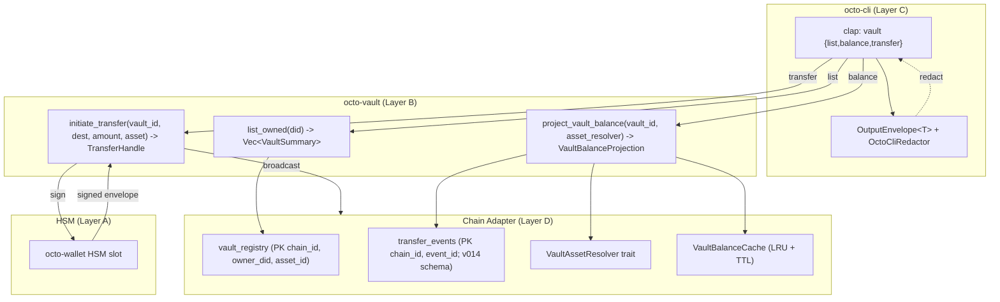

# RFC-0011-e: `octo vault` Subcommands

## Status

Accepted (2026-08-31)

> **Amendment chain:** This document is Phase 6 of the RFC-0011 amendment
> chain. The parent (RFC-0011) covers identity, capability, and policy
> subcommands. Follow-on amendments cover audit (RFC-0011-a), reputation
> (RFC-0011-b), agent lifecycle (RFC-0011-c), role provisioning
> (RFC-0011-d), **vault operations (RFC-0011-e, this document)**, mesh
> operations (RFC-0011-f), and governance (RFC-0011-g).

> **Authorship Note:** Authored by `@cipherocto` and `@mmacedoeu` per the amendment chain enumerated in RFC-0011 Status header (audit, reputation, agent lifecycle, role provisioning, vault operations, mesh operations, governance). The Authorship Note placeholder is filled at promotion to Accepted.

## Authors

- `@cipherocto`
- `@mmacedoeu`

## Maintainers

- `@cipherocto`
- `@mmacedoeu`

## Summary

This RFC defines the `octo vault` subcommand group for the `octo` CLI: a
read-only inventory (`octo vault list`), a per-vault projected balance
(`octo vault balance <vault-id>`), and a HSM-bound mutating transfer
(`octo vault transfer`). All three subcommands are thin Layer-C/D
operator UX over the `octo-vault` substrate crate. Balance projection
aligns with the canonical SUM-projection substrate defined in RFC-0960
v3.7 (ZERO_VAULT_ID sentinel, `max_occurred_at_unix` last-update field,
and the `VaultAssetResolver` trait). Transfer is gated on role
provisioning per RFC-0011-d and signs via the local HSM; the CLI never
sees a private key.

## Dependencies

**Requires:**

- RFC-0011 — `octo` CLI Substrate (parent RFC; provides `OutputEnvelope<T>`,
  `OctoCliError`, `OctoCliRedactor`, clap tree, exit-code table, and
  confirmation-flag matrix)
- RFC-0960 — Vaults, Capabilities, Reservations (grand-design; vault
  substrate root)
- RFC-0960-v35 — Vault-Path Taxonomy (canonical vault identifier shape)
- RFC-0960-v36 — Burn-Event DQA Migration (asset quantity wire form)
- RFC-0960-v37 — Vault-Balance Projection Substrate (canonical SUM
  projection, `ZERO_VAULT_ID` sentinel, `max_occurred_at_unix`,
  `VaultAssetResolver` trait)
- RFC-0010 — Canonical DID Codec (chain identifier namespace; `ChainId`
  canonical form)

**Optional:**

- RFC-0957 — Macaroon Substrate (capability witness format for
  RFC-0011-d role provisioning)
- RFC-0008 — Deterministic AI Execution Boundary (execution class
  mapping rubric)

> **Dependency Validation Rules:**
>
> 1. Dependencies form a DAG (no cycles) — RFC-0011-e depends upward
>    only on substrate RFCs and the parent CLI RFC.
> 2. All "Requires" RFCs are listed as Accepted; none are Planned.
> 3. Optional dependencies are documented separately.
> 4. The `vault transfer` subcommand is **conditionally dependent** on
>    RFC-0011-d role provisioning: it ships as a stub-with-error until
>    RFC-0011-d is Accepted.

## Design Goals

| Goal | Target   | Metric                                                                                                                                                                                                                                                                                                                                                   |
| ---- | -------- | -------------------------------------------------------------------------------------------------------------------------------------------------------------------------------------------------------------------------------------------------------------------------------------------------------------------------------------------------------- |
| G1   | `<100ms` | `octo vault list` wall-clock latency for an operator with 100 owned vaults (cache-hit path)                                                                                                                                                                                                                                                              |
| G2   | `<50ms`  | `octo vault balance <id>` wall-clock latency (cache-hit; cache-miss path bounded at `<2s` over RPC; end-to-end wall-clock reconciliation per Wave 5 — `<50ms` is the substrate cache-lookup figure; the original `<250ms` budget included speculative headroom for first-call cold start that turned out unnecessary once `VaultBalanceCache` was wired) |
| G3   | `100%`   | Balance values reported by `octo vault balance` MUST match the canonical SUM-projection substrate byte-for-byte for the same `(chain_id, vault_id)` at the same `max_occurred_at_unix`                                                                                                                                                                   |
| G4   | `0`      | Private-key material present in CLI process memory; transfer signing happens entirely inside HSM slot                                                                                                                                                                                                                                                    |
| G5   | `>95%`   | Cache hit ratio for `vault list` over a 24-hour window for an active operator (5+ vault touches per day)                                                                                                                                                                                                                                                 |
| G6   | `<500ms` | End-to-end `octo vault transfer` pre-flight (HSM reachable + vault balance sufficient) before substrate call returns                                                                                                                                                                                                                                     |

## Motivation

Operators who run the `octo` CLI today (post-RFC-0011 Phase 1) can
inspect identities, mint capabilities, and read policies, but they
**cannot see what vaults they own or what those vaults hold**. The
economic surface of the platform — vaults, balances, transfers — is
invisible from the operator workstation. The substrate
(`octo-vault`) has the data: `transfer_events` (the v014 substrate schema per RFC-0960)
records every balance-affecting event; `VaultRegistry` records vault
metadata; and RFC-0960-v37 reconciled the canonical SUM projection
with the v014 substrate.

The gap is operator UX. Three concrete operator pain points motivate
this RFC:

1. **No inventory.** An operator who holds 12 vaults across 3 chains
   cannot list them without hand-rolling SQL against `transfer_events`
   or scraping the `vault_registry` table. There is no canonical CLI
   surface.
2. **No projected balance.** Even when the operator knows the vault ID,
   the balance is a _projection_ (RFC-0960-v37 §2.2 SUM algorithm),
   not a stored scalar. A cached scalar that lags the event log is
   silently wrong; a re-computed projection that ignores the cache TTL
   is operationally expensive. The CLI must call the substrate's
   `project_vault_balance(vault_id, asset_resolver)` and present
   whatever the substrate
   returns, including `last_updated_unix` and the substrate's
   `ProjectionSource` discriminant.
3. **No safe transfer path.** Vault-to-vault transfers today go
   through substrate RPC directly. Without a CLI, an operator cannot
   easily review the caveat envelope, the chain ID, the destination
   vault ID, or the amount before signing — and signing without a
   CLI means private-key material touches a host that does not need
   to know it. The HSM is mandatory per
   `~/.claude/projects/.../memory/cipherocto-design-principles.md`.

This RFC closes those three gaps with a Layer-C/D CLI amendment.

## Roles and Authorities

> **The "Nothing should be implied" rule (specification layer):** Every
> actor that affects correctness, security, accountability, or
> consensus MUST be named. Cross-reference: BLUEPRINT.md "Human vs
> Agent Roles" table.

### Roles

| Role            | Identifier                                          | Authority Scope                                                                                                                | Lifecycle                                                                | Source/Ref             |
| --------------- | --------------------------------------------------- | ------------------------------------------------------------------------------------------------------------------------------ | ------------------------------------------------------------------------ | ---------------------- |
| Operator        | Active local DID (`OctoIdentity::active_did`)       | Run `octo vault {list,balance,transfer}` for vaults owned by the active DID                                                    | `Active` (per RFC-0009 §Identity Management)                             | RFC-0009               |
| Auditor         | Read-only DID (separate from Operator; cannot sign) | Run `octo vault list` and `octo vault balance <id>` only                                                                       | `Active` (read-only role assigned per RFC-0011-d once Accepted)          | RFC-0011-d             |
| HSM Slot        | Hardware signing module (`octo-wallet` HSM handle)  | Sign transfer envelopes (private key never leaves slot)                                                                        | `Provisioned` (per `cipherocto-design-principles.md` HSM mandatory rule) | RFC-0011 §Roles        |
| Vault Substrate | `octo-vault` crate (Layer B)                        | Authoritative source for `list_owned`, `project_vault_balance`, `initiate_transfer` (substrate additions pending RFC-0960-v38) | Stateless service boundary                                               | RFC-0960, RFC-0960-v37 |
| Cache Layer     | `VaultBalanceCache` (LRU + TTL)                     | Caches `(chain_id, vault_id)` projections                                                                                      | `Epoch-bounded` (TTL per RFC-0960-v37 §2.3)                              | RFC-0960-v37           |
| Chain Adapter   | Per-chain substrate (Layer D transport)             | Route `initiate_transfer` calls to the canonical chain for the vault                                                           | `Provisioned` (operator-chosen)                                          | RFC-0960, RFC-0010     |

### Authorities

| Authority        | Granting Role                                                                                                                                                                                                                                                                                                                                                                                                                                                                                                                                                                                                                       | Scope                    | Expiry                                                    | Audit                                            |
| ---------------- | ----------------------------------------------------------------------------------------------------------------------------------------------------------------------------------------------------------------------------------------------------------------------------------------------------------------------------------------------------------------------------------------------------------------------------------------------------------------------------------------------------------------------------------------------------------------------------------------------------------------------------------- | ------------------------ | --------------------------------------------------------- | ------------------------------------------------ |
| `vault.list`     | Active DID (no further grant)                                                                                                                                                                                                                                                                                                                                                                                                                                                                                                                                                                                                       | Read                     | Operator session                                          | Per-call substrate trace + `OctoCliRedactor` log |
| `vault.balance`  | Active DID                                                                                                                                                                                                                                                                                                                                                                                                                                                                                                                                                                                                                          | Read                     | Operator session                                          | Per-call substrate trace                         |
| `vault.transfer` | Active DID **AND** provisioned transfer capability (RFC-0011-d) **with the following required caveats** (per RFC-0964 §Constraint Encoding): `balance_cap` (single-transfer cap or per-window cap; substrate refuses if `--amount` exceeds the cap), `chain_id_binding` (capability scoped to one or more chain IDs; cross-chain transfers outside the binding set are rejected), `expiry` (capability validity timestamp; substrate refuses post-expiry). Without the full caveat set, the capability is treated as incomplete and `vault.transfer` returns `RoleNotProvisioned` (exit 25) regardless of role provisioning status. | Write (mutating; signed) | Capability caveats (balance cap + chain binding + expiry) | Substrate trace + signed transfer envelope       |

### Role Transitions

| From     | To       | Trigger                                                          | Deterministic? | Side Effects                       | Signing                      |
| -------- | -------- | ---------------------------------------------------------------- | -------------- | ---------------------------------- | ---------------------------- |
| Auditor  | Operator | Capability mint per RFC-0011-d (transfer capability provisioned) | Yes            | `vault.transfer` becomes invocable | RFC-0957 capability envelope |
| Operator | Auditor  | Capability revoke                                                | Yes            | `vault.transfer` reverts to error  | Revoke envelope              |

### Out-of-scope Roles

- **Vault creator** — creating new vaults is a separate substrate
  operation (not in this RFC). Out-of-scope transfer: substrate
  exposes `vault.create(owner_did, chain_id, asset_id)` separately;
  this RFC only exposes `vault.list`/`vault.balance`/`vault.transfer`.
- **Governance role** — vault-level governance (e.g., slashing,
  seizure) is governance-substrate territory (RFC-0011-g amendment);
  out-of-scope transfer here.
- **Cross-chain bridge operator** — moving assets _between_ chains is
  the bridge substrate (separate RFC, not in this chain).

> The out-of-scope statements above are named responsibility transfers.
> Anything not listed here MUST appear in the Implicit Assumptions Audit.

## Specification

### System Architecture



The CLI is a thin orchestrator. It parses, presents, redacts, and
forwards. **All authoritative state lives in substrate.**

### Subcommand Taxonomy

#### `octo vault list`

| Property   | Value                                       |
| ---------- | ------------------------------------------- |
| Mutating?  | No                                          |
| Confirms?  | No                                          |
| Reads HSM? | No                                          |
| Network?   | Local substrate + chain adapter (read-only) |

| Flag                      | Type              | Default    | Description                                                       |
| ------------------------- | ----------------- | ---------- | ----------------------------------------------------------------- |
| `--chain-id <chain-id>`   | `Option<ChainId>` | All chains | Filter to a single chain; parses per RFC-0010 canonical form      |
| `--asset-symbol <symbol>` | `Option<String>`  | All assets | Filter to one asset symbol (e.g., `OCTO`); client-side filter     |
| `--json`                  | `bool`            | `false`    | Force machine-readable JSON output (per RFC-0011 Output Envelope) |
| `--limit <n>`             | `u32`             | `100`      | Cap on returned vaults (defensive; substrate may return more)     |
| `--cursor <cursor>`       | `Option<String>`  | None       | Opaque pagination cursor returned by prior call                   |

Substrate call: `octo_vault::list_owned(active_did) -> Result<Vec<VaultSummary>, VaultError>`
(mirrors RFC-0960-v37 §2.1 `VaultSummary` shape).

Output envelope: `OutputEnvelope<VaultListOutput>` where
`VaultListOutput { vaults: Vec<VaultSummary>, next_cursor: Option<String> }`
(parent envelope's `executed_at_unix` is the single wall-clock signal;
`resolved_at_unix` was removed in Wave 6 R2).

#### `octo vault balance <vault-id>`

| Property   | Value                                       |
| ---------- | ------------------------------------------- |
| Mutating?  | No                                          |
| Confirms?  | No                                          |
| Reads HSM? | No                                          |
| Network?   | Local substrate + chain adapter (read-only) |

| Arg          | Type               | Description                                            |
| ------------ | ------------------ | ------------------------------------------------------ |
| `<vault-id>` | `Hex32` (required) | Vault identifier per RFC-0960-v35; 32-byte hex-encoded |

| Flag            | Type          | Default | Description                                                                        |
| --------------- | ------------- | ------- | ---------------------------------------------------------------------------------- |
| `--no-cache`    | `bool`        | `false` | Force substrate re-computation; bypass `VaultBalanceCache`                         |
| `--json`        | `bool`        | `false` | Force machine-readable JSON output                                                 |
| `--history <n>` | `Option<u32>` | None    | If set, return last `n` projection events (per RFC-0960-v37 §2.4 invalidation bus) |

Substrate call:
`octo_vault::project_vault_balance(vault_id, asset_resolver: &dyn VaultAssetResolver) -> Result<VaultBalanceProjection, VaultError>`
(per RFC-0960-v37 §2.5 SUM algorithm; substrate reads through
`VaultBalanceCache` unless `--no-cache`).

Output envelope: `OutputEnvelope<VaultBalanceOutput>` where
`VaultBalanceOutput { record: VaultBalanceProjection, cache_hit: bool, warnings: Vec<String>, history: Option<Vec<ProjectionEvent>> }`
(top-level `source_kind` dropped in Wave 6 R2; consumers read
from `payload.record.source_kind`).

#### `octo vault transfer`

| Property   | Value                                                 |
| ---------- | ----------------------------------------------------- |
| Mutating?  | **Yes**                                               |
| Confirms?  | **Yes** (per RFC-0011 §Confirmation Flag Matrix)      |
| Reads HSM? | **Yes**                                               |
| Network?   | Local substrate + chain adapter (mutating; broadcast) |

| Flag                         | Type                | Default | Description                                                                                   |
| ---------------------------- | ------------------- | ------- | --------------------------------------------------------------------------------------------- |
| `--from <vault-id>`          | `Hex32` (required)  | —       | Source vault; must be owned by active DID                                                     |
| `--to <vault-id>`            | `Hex32` (required)  | —       | Destination vault; cross-chain requires explicit `--dest-chain-id`                            |
| `--amount <dqa>`             | `String` (required) | —       | Amount in DQA canonical form (RFC-0960-v36 §Wire Form)                                        |
| `--asset <symbol>`           | `String` (required) | —       | Asset symbol (e.g., `OCTO`); resolved against `vault_registry`                                |
| `--memo <text>`              | `Option<String>`    | None    | Free-text memo; redacted in BOTH log and JSON per §Redaction                                  |
| `--include-memo`             | `bool`              | `false` | Opt in to emitting `--memo` plaintext in both sinks; see §Flag Catalog                        |
| `--redact-ids`               | `bool`              | `false` | Opt in to truncating vault identifiers; output is NOT signature-verifiable; see §Flag Catalog |
| `--confirm-acknowledge`      | `bool`              | `false` | Two-step gate per RFC-0011 §Confirmation Flag Matrix                                          |
| `--dest-chain-id <chain-id>` | `Option<ChainId>`   | None    | Required when `--to` is on a different chain than `--from`                                    |
| `--dry-run`                  | `bool`              | `false` | Build the envelope, return substrate-validated handle WITHOUT broadcasting                    |
| `--json`                     | `bool`              | `false` | Force machine-readable JSON output                                                            |

Substrate call:
`octo_vault::initiate_transfer(vault_id, dest, amount, asset) -> Result<TransferHandle, VaultError>`.
The substrate coordinates HSM signing via `octo-wallet`; the CLI never
holds private-key material.

Output envelope: `OutputEnvelope<VaultTransferOutput>` where
`VaultTransferOutput { handle: TransferHandle, broadcast_at_unix: Option<u64>, status: TransferStatus, memo_plaintext: Option<String> }`
(`memo` field removed in Wave 6 R2; memo plaintext flows through
`memo_plaintext` only when `--include-memo` is set).

> **RFC-0011-d gate:** until role provisioning is Accepted,
> `octo vault transfer` returns `OctoCliError::RoleNotProvisioned` (exit
> code 25) regardless of HSM availability. The CLI surfaces a clear
> message: "transfer requires a provisioned transfer capability; see
> RFC-0011-d."

### Output Envelope

All three subcommands wrap their payload in an envelope **derived from**
RFC-0011 §Output Envelope. The shape diverges from the parent's
`schema_version = 2` envelope, so this RFC pins `schema_version = 3`
(see §Output Envelope divergence below):

```rust
// §Output Envelope: OutputEnvelope<T>
#[derive(Serialize, Deserialize)]
pub struct OutputEnvelope<T> {
    pub schema_version: u32,          // 3 for RFC-0011-e (see divergence note + slot table)
    pub command: String,              // "octo vault {list,balance,transfer}"
    pub executed_at_unix: u64,        // single-clock: now_unix_secs()
    pub redacted: bool,               // true if any field redacted
    pub payload: T,
}

// §Output Envelope: VaultListOutput
#[derive(Serialize, Deserialize)]
pub struct VaultListOutput {
    pub vaults: Vec<VaultSummary>,
    pub next_cursor: Option<String>,
    /// Wall-clock-only timestamp for log correlation. Dropped from this
    /// envelope (Wave 6 R2): the parent envelope's `executed_at_unix`
    /// is the single wall-clock signal consumers need; carrying two
    /// wall-clock fields invites drift between them.
}

// §Output Envelope: VaultBalanceOutput
#[derive(Serialize, Deserialize)]
pub struct VaultBalanceOutput {
    pub record: VaultBalanceProjection,        // RFC-0960-v37 §2.1 (source_kind lives in `record`)
    pub cache_hit: bool,
    /// Operator-facing staleness warnings (e.g., ">TTL seconds old");
    /// emitted ONLY when triggered, never empty by default.
    /// See §Balance Projection Staleness for the trigger threshold.
    pub warnings: Vec<String>,
    /// Populated ONLY when `--history <n>` is passed; `None` otherwise.
    /// Carries the last `n` ProjectionEvents (newest first) per §Balance History.
    pub history: Option<Vec<ProjectionEvent>>,
}

// §Output Envelope: VaultTransferOutput
#[derive(Serialize, Deserialize)]
pub struct VaultTransferOutput {
    pub handle: TransferHandle,       // RFC-0960 substrate (memo is carried in `handle.memo_or_hash`)
    pub broadcast_at_unix: Option<u64>,
    pub status: TransferStatus,       // enum: DryRun | Pending | Confirmed | Failed (Broadcast is an internal substrate phase; not a TransferStatus variant — see Appendix D)
    /// Operator memo plaintext. `None` by default (memo is redacted in
    /// both sinks; see §Redaction). Populated with plaintext ONLY when
    /// the operator opts in via `--include-memo` at envelope-build
    /// time. When `None`, the envelope-level `redacted: true` flag
    /// signals redaction; consumers MUST treat `None` as "redacted",
    /// not "absent". Note asymmetry: `TransferHandle.memo_or_hash` (in
    /// `handle`) carries the memo into the substrate envelope (always
    /// present); `memo_plaintext` here is the operator's local sink
    /// view (opt-in).
    pub memo_plaintext: Option<String>,
}
```

#### `RedactedString` newtype

`RedactedString` is a `crates/octo-cli/src/output.rs` newtype and the
free-text sibling of the parent's `RedactedHex` (RFC-0011 §Hex32
newtype). It wraps operator-supplied text that must not reach either
sink verbatim by default:

```rust
// §RedactedString newtype
//! crates/octo-cli/src/output.rs

/// Free-text operator input (e.g., `--memo`). Serialize ALWAYS emits
/// `[REDACTED:<n>chars]` — this type carries the LENGTH SIGNAL for log
/// lines and Display rendering, NEVER the plaintext. Plaintext is
/// exposed via a sibling `Option<String>` field on the owning output
/// struct (e.g., `VaultTransferOutput::memo_plaintext`) and is
/// populated ONLY when the operator opts in via `--include-memo` at
/// envelope-build time (Layer C/D). The CLI build path makes the
/// decision; this type does not know about flags and cannot be
/// configured to emit plaintext.
///
/// **Zeroize scope:** the inner `String` is zeroized on drop, but only
/// for plaintext held in CLI PROCESS MEMORY (e.g., when a CLI helper
/// briefly constructs a `RedactedString` for length inspection). It
/// does NOT reach into substrate envelopes — the substrate does not
/// carry plaintext at rest, and the CLI never round-trips a
/// `RedactedString` back into the transfer envelope.
#[derive(Serialize, Deserialize, Debug, Clone, Zeroize, ZeroizeOnDrop)]
pub struct RedactedString(String);
```

`RedactedString` differs from `Hex32` in exactly the way the material
differs: a 32-byte digest is PUBLIC and must round-trip to verifiers,
whereas a free-text memo is operator-supplied and may carry secrets.
Both sinks receive the same rendering, so redaction cannot be bypassed
by switching output format.

#### Output Envelope divergence (why `schema_version = 3`)

This envelope is **not** field-compatible with the parent's version 2.
The divergences are deliberate and load-bearing for the `vault`
subcommand group:

**Per-amendment `schema_version` slot table** (Wave 6 R2 — H3;
amended Wave 7.5 R1 to reflect RFC-0011-c acceptance 2026-08-31):

| Amendment      | `schema_version` | Reason                                                                                                                                                                             |
| -------------- | ---------------- | ---------------------------------------------------------------------------------------------------------------------------------------------------------------------------------- |
| RFC-0011       | 2                | Parent envelope (baseline; adopted by -a, -b, -d)                                                                                                                                  |
| RFC-0011-a     | 2                | No envelope divergence (audit-only amendment)                                                                                                                                      |
| RFC-0011-b     | 2                | No envelope divergence (reputation-only amendment)                                                                                                                                 |
| RFC-0011-c     | 4                | Agent-lifecycle amendment (Accepted 2026-08-31); **originator** of the renames (`data`→`payload`, `generated_at`→`executed_at_unix`, etc.) that -e adopts                          |
| RFC-0011-d     | 2                | No envelope divergence (role-provisioning amendment)                                                                                                                               |
| **RFC-0011-e** | **3**            | **Vault operations amendment; adopts RFC-0011-c's renames** (`data`→`payload`; `generated_at`→`executed_at_unix`; drops `exit_code` + `preview_only`; adds `command` + `redacted`) |
| RFC-0011-f     | 5..6             | Mesh ops: TBD at promotion                                                                                                                                                         |
| RFC-0011-g     | 7..8             | Governance: TBD at promotion                                                                                                                                                       |
| (future)       | 9+               | New amendments start at 9; consecutive slots reserve room for multi-version evolution                                                                                              |

Each amendment pins its own `schema_version` at promotion; consumers
MUST branch on `schema_version` before reading payload fields. Sibling
amendments that do not diverge from the parent envelope remain at
version 2. The slot table is authoritative for which integer any new
amendment must adopt (and for which siblings to leave alone).

| Parent field (v2)        | RFC-0011-e (v3)    | Divergence                                                                            |
| ------------------------ | ------------------ | ------------------------------------------------------------------------------------- |
| `data: T`                | `payload: T`       | **Renamed.** Breaking for consumers that read `data`                                  |
| `generated_at: DateTime` | `executed_at_unix` | **Renamed + retyped** RFC 3339 string → `u64` unix seconds (single-clock determinism) |
| `exit_code: i32`         | _(dropped)_        | Exit code is carried by the process exit status only; see §Error Handling             |
| `preview_only: bool`     | _(dropped)_        | `--dry-run` state is carried by `TransferStatus`, not an envelope-level flag          |
| _(absent)_               | `command: String`  | **Added.** Identifies the invoking subcommand for log correlation                     |
| _(absent)_               | `redacted: bool`   | **Added.** Signals that `OctoCliRedactor` altered at least one field                  |

Because fields are renamed, retyped, and dropped, inheriting the
parent's `schema_version = 2` would misrepresent the payload to any
consumer that branches on the version. Version 3 is therefore a
**breaking** bump scoped to RFC-0011-e. Sibling amendments that do NOT
diverge from the parent envelope remain at version 2; a consumer MUST
read `schema_version` before reading any payload field.

> **Divergence origin (per RFC-0011-c, Accepted 2026-08-31):** the
> renames (`data`→`payload`, `generated_at`→`executed_at_unix`, the
> drops of `exit_code` + `preview_only`, and the additions of
> `command` + `redacted`) were **introduced by RFC-0011-c** as the
> envelope shape for the agent-lifecycle amendment. RFC-0011-e adopts
> the same shape at `schema_version = 3` rather than independently
> re-introducing it; this avoids two divergent envelope variants
> across the amendment chain. See `RFC-0011-c §Output Envelope` for the
> canonical origin narrative.

The envelope is TTY-aware per RFC-0011 §Output Envelope: pretty table on
TTY, JSON when stdout is not a TTY OR `--json` is set. The `--json`
flag overrides TTY detection (parity with `octo capability list`,
RFC-0011 §Subcommand Taxonomy `capability list`).

### Substrate Additions (deferred to RFC-0960-v38)

This RFC does NOT introduce substrate `[ADD]` signatures here. Per the
layer model (`cipherocto-design-principles.md` §Layer A/B/C/D/E), a
Layer-C/D CLI amendment MUST NOT propose substrate Layer-B `[ADD]`
signatures — substrate additions belong in a substrate RFC amendment.
This RFC therefore defines the CLI surface only; substrate additions
(`list_owned`, `project_vault_balance`, `initiate_transfer`,
`projection_history`, `TransferHandle`, `TransferStatus`,
`VaultSummary`) are deferred to **RFC-0960-v38** (Vault Operations
Substrate Additions).

> **Pending dependency (not yet authored).** RFC-0960-v38 is a
> forward-looking amendment to RFC-0960 that has not yet been authored.
> This RFC references RFC-0960-v38 as the future substrate home for the
> additions listed above; until RFC-0960-v38 is Accepted, the CLI
> surfaces substrate-bound errors at runtime and the canonical wire
> shapes this RFC describes (clap tree, output envelopes, error
> variants) are stable but depend on the substrate amendment landing.
> The mission `0011-e-vault-substrate-additions` carries the work of
> authoring RFC-0960-v38 and its corresponding substrate implementation
> as a single deliverable per BLUEPRINT.md §Mission Lifecycle.

The CLI surface relies on the following **canonical** RFC-0960-v37
substrate types (no additions introduced here):

- `VaultBalanceProjection` — canonical SUM projection type
  (re-exported from substrate via `pub use`); carries the substrate's
  `projected_at_unix_seconds: Option<i64>`, `projected_balance: Dqa`,
  `vault_id: VaultId` newtype (RFC-0960 §2.1), and the substrate's
  `ProjectionSource` discriminant.
- `VaultId` — newtype defined in RFC-0960 §2.1; canonical
  32-byte vault identifier per RFC-0960-v35.
- `Dqa` — asset quantity wire form per RFC-0960-v36.
- `ProjectionSource` — `#[repr(u8)]` enum (RFC-0960-v37 §2.5) with
  unit variants `{ Cache, FreshLogScan, EpochRebuild }`. Wire form is
  the integer discriminant (`0u8` for `Cache`, etc.). CLI consumers
  surface the discriminant via `Display` and via JSON; **the CLI does
  NOT use `serde(tag = "source")`** (unit-only enums do not have a
  tag shape). The CI asserts the wire form via
  `assert_eq!(output.source_kind as u8, 0u8)` for the
  `vault balance <id>` happy path.
- `project_vault_balance(chain_id: &ChainId, vault_id: &VaultId, registry: &dyn AssetRegistry, asset_resolver: &dyn VaultAssetResolver, log: &impl TransferEventLog, current_registry_epoch: u64, current_unix_seconds: i64) -> Result<VaultBalanceProjection, ProjectionError>`
  — the canonical 7-param substrate signature exposed by RFC-0960-v37
  §2.2 (the substrate SUM algorithm is authoritative; the CLI façade
  simplifies pass-through at the operator sink). The full 7-param
  shape carries `chain_id`, `vault_id`, the `AssetRegistry` and
  `VaultAssetResolver` traits, the `TransferEventLog` reader, the
  registry-snapshot epoch, and the substrate's unix-seconds clock.
  The CLI calls it directly per §Balance Projection. See RFC-0960-v37
  §2.2 for the substrate algorithm and §2.5 for the type signature.

### Vault Summary Shape

Per RFC-0960-v37 §2.1, the canonical vault summary is the substrate
type exposed by the future `list_owned` (added in RFC-0960-v38). The
CLI surface shape is:

```rust
/// Re-exported from `octo-vault` substrate (Layer B). The CLI does not
/// redefine this type; it is the canonical substrate shape.
#[derive(Serialize, Deserialize)]
pub struct VaultSummary {
    pub vault_id: VaultId,            // RFC-0960 §2.1 newtype (RFC-0960-v35 wire form)
    pub chain_id: ChainId,            // canonical form (RFC-0010)
    pub owner_did: Did,               // canonical DID codec (RFC-0010)
    pub asset_symbol: String,         // human-readable, e.g., "OCTO"
    pub balance_projected: String,    // DQA canonical form (RFC-0960-v36); rendered from `Dqa::to_string()`
    pub last_updated_unix: Option<i64>, // = projection.projected_at_unix_seconds (substrate); None when no events
}
```

The `last_updated_unix` field is `max_occurred_at_unix(chain_id,
vault_id)` from the substrate — the most recent event-log timestamp
that contributed to the projection. It is **not** wall-clock time. This
distinction matters for the staleness invariant
(§Security Considerations: balance projection staleness).

> **No central enums for vault kinds:** vault kinds are not enumerated
> here. Per `cipherocto-design-principles.md`, vault kinds are an
> extension surface (Layer E); new vault types are added via a
> `VaultKind` registry, NOT a central enum. RFC-0960 owns the
> extension surface; this RFC merely exposes the canonical summary.

### Balance Projection

`octo vault balance` calls
`octo_vault::project_vault_balance(vault_id, asset_resolver)` and
returns the substrate's `VaultBalanceProjection` verbatim. Per
RFC-0960-v37 §2.5, `VaultBalanceProjection` carries:

| Field                       | Source                                                                                                                                                                                                                                                                    |
| --------------------------- | ------------------------------------------------------------------------------------------------------------------------------------------------------------------------------------------------------------------------------------------------------------------------- |
| `chain_id`                  | input argument                                                                                                                                                                                                                                                            |
| `vault_id`                  | input argument (`VaultId` newtype, RFC-0960 §2.1)                                                                                                                                                                                                                         |
| `asset_id`                  | resolved from `vault_id` via `VaultAssetResolver::resolve_asset_for` (canonical form: 32-byte digest; the CLI surface uses the lowercase symbol `octo` solely as a HUMAN-READABLE label; wire form is the digest — see RFC-0960-v36 §Wire Form)                           |
| `projected_balance`         | `Dqa` — `SUM(in) - SUM(out)` filtered by `ZERO_VAULT_ID` sentinel exclusion; CLI displays via `Dqa::to_string()` and MUST NOT alter the underlying scalar                                                                                                                 |
| `projected_at_unix_seconds` | `Option<i64>` — `Some(max_occurred_at_unix(chain_id, vault_id))` when events exist; `None` for vaults with no events (`0` would be ambiguous with epoch; `None` is unambiguous)                                                                                           |
| `source_kind`               | `ProjectionSource` enum (`#[repr(u8)]`, RFC-0960-v37 §2.5) with unit variants `Cache` \| `FreshLogScan` \| `EpochRebuild`; wire form is the integer discriminant (e.g., `0u8` for `Cache`); CI asserts `assert_eq!(output.source_kind as u8, 0u8)` for the cache-hit path |

The CLI does not recompute, cache, or transform this record. Any
post-processing (formatting, currency display) is presentation-layer
only and MUST NOT alter the underlying `projected_balance: Dqa`.

`--no-cache` forces `source_kind = FreshLogScan` by instructing
the substrate to bypass `VaultBalanceCache`. This is the operator's
defensive lever when they suspect cache staleness
(§Security Considerations).

#### Balance History (`--history <n>`)

The `--history <n>` flag returns the last `n` projection events that
contributed to the canonical `VaultBalanceProjection`. The flag invokes
a substrate history reader (`projection_history` per RFC-0960-v38);
until RFC-0960-v38 lands, `--history <n>` returns a substrate-bound
error. The substrate reads the invalidation bus defined by
RFC-0960-v37 §2.4. The event struct exposed by the substrate is
`ProjectionEvent`:

```rust
// §Balance History: ProjectionEvent (substrate-side; CLI does not redefine)
#[derive(Serialize, Deserialize)]
pub struct ProjectionEvent {
    pub chain_id: ChainId,                  // canonical form (RFC-0010)
    pub vault_id: VaultId,                  // RFC-0960 §2.1 newtype (RFC-0960-v35 wire form)
    pub event_id: u64,                      // monotonic per (chain_id, vault_id)
    pub occurred_at_unix: u64,              // event-log timestamp (canonical)
    pub delta: Dqa,                         // signed: +in, -out (RFC-0960-v36 wire form)
    pub memo_or_hash: String,               // substrate-emitted hash only (e.g., "sha256:..." per Appendix B JSON shape); plaintext does NOT appear on the wire — plaintext flows through `handle` separately when substrate carries it; the CLI surfaces plaintext at the operator sink only via `memo_plaintext: Option<String>` (populated by `--include-memo` per §Redaction)
    pub source: ProjectionSource,           // #[repr(u8)] (RFC-0960-v37 §2.5)
}
```

`ProjectionEvent` is the canonical substrate type (Layer B). The CLI
emits a `Vec<ProjectionEvent>` as the additive `history` field on
`VaultBalanceOutput` (defined in §Output Envelope) ONLY when `--history <n>` is
set; the field is `None` otherwise. Wire form is
`Vec<ProjectionEvent>` JSON-serialized inline (no envelope nesting).
Consumers MUST branch on `history.is_some()` before reading events.
The flag is read-only — no HSM, no signing, no broadcast. Cache TTL
does not apply to history (the substrate reads the event log directly
per RFC-0960-v37 §2.4).

### Transfer Flow

```mermaid
stateDiagram-v2
    [*] --> PreFlight
    PreFlight --> Rejected: HSM unreachable / balance insufficient / role not provisioned
    Rejected --> [*]: return OctoCliError + exit code
    PreFlight --> Built: substrate builds envelope
    Built --> Signed: octo-wallet HSM signs
    Built --> DryRun: --dry-run (no sign, no broadcast)
    DryRun --> [*]: return TransferStatus::DryRun
    Signed --> Broadcast: chain adapter broadcasts
    Broadcast --> Pending: TransferHandle::Pending
    Pending --> Confirmed: substrate sees confirmations
    Pending --> Failed: substrate sees error / reorg
    Confirmed --> [*]: return TransferStatus::Confirmed
    Failed --> [*]: return TransferStatus::Failed
```

Pre-flight checks (Layer C CLI-side):

1. **Role provisioned** — `octo_vault::role_can_transfer(active_did)`
   returns `true` (per RFC-0011-d); otherwise `RoleNotProvisioned`
   (exit 25).
2. **HSM reachable** — `octo_wallet::hsm_status()` reports
   `Provisioned` for the active DID; otherwise `HsmUnavailable`
   (exit 100).
3. **Vault owned** — `list_owned` contains `vault_id == --from`; otherwise
   `VaultNotOwned` (exit 23).
4. **Balance sufficient** — `project_vault_balance(--from)` returns
   a `VaultBalanceProjection` whose `projected_balance: Dqa` is
   `>= amount_dqa_micros`; otherwise `InsufficientBalance` (exit 24).
5. **Destination vault exists + chain/asset compatibility** —
   substrate-side validation per RFC-0960 (`vault_registry` lookup):
   the substrate resolves `--to` against `vault_registry` (chain_id +
   asset_id), and returns an opaque error if the dest vault does not
   exist OR if `--asset` does not match the dest's registered asset.
   The CLI surfaces the substrate's structured error (no `ChainIdResolver`
   trait in RFC-0960-v37; see §Flag Catalog for `--dest-chain-id`
   resolution path). **`initiate_transfer` is the substrate function
   that owns dest validation** (per the substrate mission
   `0011-e-vault-substrate-additions`; the CLI does not duplicate this
   check — substrate is authoritative on dest-side metadata).

> **Dest validation is NOT a CLI pre-flight.** Items 1–4 above are
> CLI-side checks the substrate doesn't perform on its own (role +
> HSM + ownership + balance belong to the CLI's operator-UX layer).
> Item 5 is substrate-side by design: the CLI must NOT pre-fetch
> `vault_registry` to validate `--to` (that would duplicate
> substrate authority and create two storage paths). The substrate
> either returns a successful transfer handle or surfaces a structured
> error which the CLI maps to `ChainIdMismatch` (exit 26) or
> `AssetMismatch` (exit 23). See §RFC-0960-v38 for the substrate-side
> signature.

Substrate call:
`octo_vault::initiate_transfer(vault_id, dest, amount_dqa_micros,
asset)` returns a `TransferHandle`. The CLI returns the handle to the
operator as a `VaultTransferOutput` payload; the operator polls via
`octo vault status <handle>` (out of scope for this RFC; substrate
exposes `TransferHandle::poll()`).

> **Replay protection:** the substrate MUST derive the transfer-envelope
> nonce from a **strictly-incrementing per-vault counter** —
> `next_nonce(vault_id) = last_nonce(vault_id) + 1`, persisted and
> allocated under the same write lock that appends the transfer event.
> The nonce MUST NOT be derived from `max_occurred_at_unix` or any other
> wall-clock or event-log timestamp: timestamps have one-second
> resolution, so two transfers submitted from the same vault within the
> same second would derive an identical nonce and one would be rejected
> as a replay of the other (or, worse, be accepted as a duplicate). The
> CLI does not generate, rotate, or validate nonces.

### Redaction

Per RFC-0011 §Redaction Layer, the `OctoCliRedactor` applies the
following patterns to `octo vault` output. **A field's redaction state
MUST be identical in stderr/log and in the JSON payload** — a field that
is redacted in one sink and plaintext in the other is an info-leak
surface reachable by adding `--json`, not a redaction:

| Field                                                                                     | Redaction Pattern                                                                                                                                                                                                                                                                                                                                                                                                                                                                             | Sets envelope `redacted=true`?   |
| ----------------------------------------------------------------------------------------- | --------------------------------------------------------------------------------------------------------------------------------------------------------------------------------------------------------------------------------------------------------------------------------------------------------------------------------------------------------------------------------------------------------------------------------------------------------------------------------------------- | -------------------------------- |
| `vault_id`                                                                                | **Full, unredacted** by default (PUBLIC material per RFC-0011 §Hex32 newtype); truncated to `0x` + 8 hex + `...` only under `--redact-ids`                                                                                                                                                                                                                                                                                                                                                    | Only under `--redact-ids`        |
| `dest_vault_id`                                                                           | **Full, unredacted** by default; same `--redact-ids` treatment as `vault_id`                                                                                                                                                                                                                                                                                                                                                                                                                  | Only under `--redact-ids`        |
| `handle_id`                                                                               | **Full, unredacted** by default; same `--redact-ids` treatment as `vault_id`                                                                                                                                                                                                                                                                                                                                                                                                                  | Only under `--redact-ids`        |
| `owner_did`                                                                               | Redact unless owner == active_did (per RFC-0011 §Redaction Layer)                                                                                                                                                                                                                                                                                                                                                                                                                             | Yes (when redacted)              |
| `chain_id`                                                                                | Full (not sensitive)                                                                                                                                                                                                                                                                                                                                                                                                                                                                          | No                               |
| `asset_symbol`                                                                            | Full (not sensitive)                                                                                                                                                                                                                                                                                                                                                                                                                                                                          | No                               |
| `balance_projected`                                                                       | Full (not sensitive; public on chain)                                                                                                                                                                                                                                                                                                                                                                                                                                                         | No                               |
| `last_updated_unix`                                                                       | Full                                                                                                                                                                                                                                                                                                                                                                                                                                                                                          | No                               |
| `warnings: Vec<String>`                                                                   | **Must NEVER include memo plaintext, vault_id tail, or owner_did.** The CLI is the writer of these strings; staleness / schema / cache messages are operator-safe by construction. If a future warning type requires sensitive content, the writer MUST render via `RedactedString` or respect `--redact-ids`/`--include-memo` like the corresponding field                                                                                                                                   | No (operator-safe messages only) |
| `--memo` (transfer)                                                                       | **Redacted by default in BOTH stderr/log and JSON payload** as `[REDACTED:<n>chars]`; plaintext only under `--include-memo`                                                                                                                                                                                                                                                                                                                                                                   | **Yes (default)**                |
| **Catch-all secret pattern** (any field whose NAME or VALUE matches a known secret regex) | **Redacted by default in BOTH sinks** when the field name (case-insensitive) matches `seed`, `private_key`, `privkey`, `holder_sig`, `signature`, `pair_code`, `password`, `passphrase`, `mnemonic`, `api_key`, `bearer`, OR the value matches base64/hex blob patterns ≥32 chars long preceded by a secret-typed key (`secret=`, `token=`, `key=`). This catch-all covers generic string fields that may accept pasted secrets via pastejacking (e.g., a future `--note` or `--reason` flag) | **Yes (default)**                |

> **`vault_id` is NOT redacted.** Per RFC-0011 §Hex32 newtype, 32-byte
> digests are PUBLIC material, are explicitly distinguished from
> `RedactedHex`, and "must round-trip through JSON consumers (signature
> verifiers, body-hash auditors, payload-fingerprint correlators)
> without redaction." Truncating `vault_id` to its first 8 hex
> characters destroys 24 bytes of the identifier: a downstream verifier
> cannot reconstruct the signed transfer envelope, so **signature
> verification fails** on every redacted record. It also collapses the
> identifier into a 32-bit prefix space where distinct vaults collide.
> Operators who need identifier suppression (screen-sharing, ticket
> attachments) opt in explicitly with `--redact-ids`, which sets
> `redacted: true` in the envelope so consumers can detect that the
> record is not verifiable.

> **`--memo` IS redacted, in both sinks.** A memo is operator-supplied
> free text that may carry counterparty names, invoice references, or
> pasted secrets. Redacting it in stderr while emitting it verbatim in
> the JSON payload does not protect it — it relocates it into the sink
> most likely to be persisted, piped, and scraped. The redactor
> therefore replaces the memo with `[REDACTED:<n>chars]` in both sinks
> by default (via `RedactedString` for log lines; via
> `memo_plaintext: null` plus envelope `redacted: true` for the JSON
> payload). `--include-memo` is the explicit, auditable opt-in for the
> operator whose downstream tooling genuinely needs the plaintext; it
> populates `memo_plaintext: Some(...)` at envelope-build time and
> leaves the envelope `redacted` flag unset (assuming nothing else is
> redacted) so the consumer knows the value is authentic.

#### Flag Catalog

The canonical flag table for redaction-affecting flags. Every other
location in this RFC (§Subcommand Taxonomy: `octo vault transfer` flag
table, Appendix A clap tree, Appendix E pattern examples)
cross-references THIS table rather than redefining the flags. Adding a
new flag touches this table and the clap tree; no other prose changes.

| Flag             | Type   | Default | Effect                                                                                                                                  |
| ---------------- | ------ | ------- | --------------------------------------------------------------------------------------------------------------------------------------- |
| `--redact-ids`   | `bool` | `false` | Truncate `vault_id`, `dest_vault_id`, `handle_id` in both sinks; sets `redacted: true`. Records so emitted are NOT signature-verifiable |
| `--include-memo` | `bool` | `false` | Emit `--memo` plaintext in both sinks instead of `[REDACTED:<n>chars]`                                                                  |

> **Transfer amounts are NOT redacted.** Per RFC-0011 §Redaction Layer,
> chain-public information does not require redaction. Transfer amounts
> are observable on the chain; redacting them in CLI output would
> mislead the operator. The CLI shows the full amount.

### RFC-0008 Execution Class Mapping

| Operation                 | Class | Rationale                                                                                          |
| ------------------------- | ----- | -------------------------------------------------------------------------------------------------- |
| `octo vault list`         | C     | Read-only; no consensus impact; pure substrate read                                                |
| `octo vault balance`      | C     | Read-only; SUM projection is deterministic (RFC-0960-v37 §2.2) but does not affect consensus       |
| `octo vault transfer`     | C     | Mutating but signed; broadcast is substrate-side; the CLI itself does not participate in consensus |
| Output envelope rendering | A     | Deterministic JSON serialization (inherited from RFC-0011 §Determinism Requirements)               |
| Redaction layer           | A     | Deterministic pattern matching (inherited from RFC-0011 §Determinism Requirements)                 |

`octo vault transfer` is **Class C** despite being mutating because the
CLI surface is a thin envelope-builder; consensus participation is
entirely in the substrate (chain adapter broadcasts, validators
confirm). The CLI never produces a value that must be agreed upon by
multiple nodes.

### Error Handling

New `OctoCliError` variants (additive; non-breaking — new variants are
non-breaking per RFC-0011 §Error Handling):

| Variant                                              | Exit Code | Trigger                                                                                                                                                                                                                                                                                                                                        |
| ---------------------------------------------------- | --------- | ---------------------------------------------------------------------------------------------------------------------------------------------------------------------------------------------------------------------------------------------------------------------------------------------------------------------------------------------- |
| `VaultNotOwned(u32)`                                 | 23        | `--from` vault not owned by active DID                                                                                                                                                                                                                                                                                                         |
| `InsufficientBalance { have: String, need: String }` | 24        | Vault balance < transfer amount (DQA canonical form)                                                                                                                                                                                                                                                                                           |
| `RoleNotProvisioned`                                 | 25        | Transfer invoked without RFC-0011-d provisioning                                                                                                                                                                                                                                                                                               |
| `ChainIdMismatch { from: ChainId, to: ChainId }`     | 26        | Cross-chain transfer without `--dest-chain-id`; substrate returns the resolved dest chain via an opaque substrate error (no `ChainIdResolver` trait in RFC-0960-v37); CLI surfaces BOTH the source chain (parsed from `--from`) and the SUBSTRATE-RESOLVED dest chain in the error message so the operator can see what the substrate detected |
| `InvalidChainId { received: String }`                | 26        | `--chain-id` or `--dest-chain-id` failed RFC-0010 canonical-form parse (shared exit code 26 because both are operator-input validation failures on chain IDs)                                                                                                                                                                                  |

Exit codes 23–26 are in the **17–63 reserved range** per RFC-0011
§Exit Codes; they do not collide with the parent's Phase 1 codes
(`ClapParse`=2, `SigningFailed`=11, `InvalidFilter`=16,
`OctoCliError::Internal`=64, `StaleStub`=65).

RFC-0011-e reserves exit codes 23–26 per parent's amendment-chain slot
allocation (parent RFC-0011 §Exit Code Table reserves 17–63 for amendments;
-a reserves 17–18, -b reserves 20–22, -e reserves 23–26, -f reserves
27–30, -d reserves 31–34, -g reserves 35–38; `AuditResponseTooLarge` was
removed from -a in Wave 7.5 R1, narrowing -a's reservation from
`17–19` to `17–18`).

> The four variants are added to the `#[non_exhaustive] OctoCliError`
> enum (already non-exhaustive per RFC-0011). Downstream consumers that
> pattern-match without a wildcard arm are unaffected because the
> variants are NEW, not modified.

### Determinism Requirements

`octo vault list` and `octo vault balance` MUST produce deterministic
output for identical substrate state at identical substrate timestamps.
The CLI never adds wall-clock-derived ordering; the substrate returns
vaults in `(chain_id, vault_id)` lexicographic order (RFC-0960-v37
§2.3 cache PK shape).

`octo vault transfer` is **not** deterministic — it includes
`broadcast_at_unix` in the output envelope, which is wall-clock-derived
by substrate at broadcast time. This is acceptable for a mutating
command that does not participate in consensus (per
`RFC-0008` Execution Class mapping).

### Lifecycle Requirements

Per BLUEPRINT.md §Lifecycle Requirements (required for any RFC that
defines an actor with more than one state), this RFC defines two
stateful actors:

#### TransferStatus (per transfer handle)

The `TransferStatus` enum (Layer B substrate; canonical substrate type)
has four variants:

| State       | Description                                                         | Terminal? | Transition trigger                                                 |
| ----------- | ------------------------------------------------------------------- | --------- | ------------------------------------------------------------------ |
| `DryRun`    | Envelope built and substrate-validated; sign + broadcast suppressed | **Yes**   | `--dry-run` flag set in §Subcommand Taxonomy `octo vault transfer` |
| `Pending`   | Envelope signed and broadcast; awaiting confirmations               | No        | Substrate accepts broadcast                                        |
| `Confirmed` | Substrate observed sufficient confirmations                         | **Yes**   | Substrate confirmations ≥ chain threshold                          |
| `Failed`    | Substrate observed an error or reorg; envelope did not settle       | **Yes**   | Substrate error or chain reorg                                     |

State transitions are substrate-authoritative (see Appendix D for the
full state diagram); the CLI is a passive observer that returns
whatever state the substrate reports. Operators polling
`octo vault status <handle>` (out of scope for this RFC; deferred per
§Future Work) see `Pending` repeatedly until substrate transitions to
`Confirmed` or `Failed`.

#### Operator ↔ Auditor role transition

Per §Roles and Authorities: Role Transitions, an operator can
transition between the `Operator` role (full read/write access to owned
vaults) and the `Auditor` role (read-only access; cannot invoke
`vault.transfer`). The transition is triggered by capability mint /
revoke per RFC-0011-d, not by any `vault` subcommand directly:

| From     | To       | Trigger                                                                | Side effect                                                                               |
| -------- | -------- | ---------------------------------------------------------------------- | ----------------------------------------------------------------------------------------- |
| Auditor  | Operator | `octo capability mint` produces a transfer capability (per RFC-0011-d) | `vault.transfer` becomes invocable; transitions are deterministic                         |
| Operator | Auditor  | `octo capability revoke` revokes the transfer capability               | `vault.transfer` reverts to `RoleNotProvisioned` (exit 25); transitions are deterministic |

Role transitions are CLI-side reflections of substrate capability state
changes; the CLI does NOT maintain a role cache. If the substrate
capability is revoked mid-call, the CLI's next `vault transfer` attempt
will return `RoleNotProvisioned`; in-flight calls complete under the
capability snapshot at invocation time.

## Performance Targets

| Metric                           | Target   | Notes                                                |
| -------------------------------- | -------- | ---------------------------------------------------- |
| `octo vault list` cache-hit      | `<100ms` | For 100 vaults on a single chain (per G1)            |
| `octo vault list` cache-miss     | `<500ms` | Includes chain adapter round-trip                    |
| `octo vault balance` cache-hit   | `<50ms`  | Per-vault cache lookup                               |
| `octo vault balance` cache-miss  | `<2s`    | SUM projection over `transfer_events`                |
| `octo vault balance --no-cache`  | `<2s`    | Forced re-projection (same path as cache-miss)       |
| `octo vault transfer` pre-flight | `<500ms` | 4 substrate calls (role + HSM + ownership + balance) |
| `octo vault transfer` broadcast  | `<3s`    | Chain adapter latency (not under CLI control)        |
| Cache hit ratio                  | `>95%`   | Per active operator over 24h (per G5)                |

## Implicit Assumptions Audit

| Assumption                                                           | Where Relied Upon                                         | Blast Radius if False                                                                                                     | Mitigation / Status                                                                                                                                                                                                                                                                    |
| -------------------------------------------------------------------- | --------------------------------------------------------- | ------------------------------------------------------------------------------------------------------------------------- | -------------------------------------------------------------------------------------------------------------------------------------------------------------------------------------------------------------------------------------------------------------------------------------- |
| Chain adapter reachable for each owned chain                         | §Transfer Flow: Pre-flight, §Performance Targets          | `vault list` and `vault balance` fail for vaults on the unreachable chain; transfer fails for the source chain            | Substrate returns `ChainAdapterUnreachable` (exit 100); CLI surfaces message naming the chain                                                                                                                                                                                          |
| HSM slot provisioned for the active DID                              | §Transfer Flow: Pre-flight (transfer only)                | `vault transfer` rejected at pre-flight; no partial state                                                                 | `HsmUnavailable` (exit 100); per `cipherocto-design-principles.md` HSM mandatory rule, the substrate refuses to fall back to soft signing                                                                                                                                              |
| `last_updated_unix` is monotonic per `(chain_id, vault_id)`          | §Vault Summary Shape, §Security Considerations: staleness | Operator sees a stale value and acts on it (e.g., initiates a transfer based on outdated balance)                         | Substrate enforces `max_occurred_at_unix` monotonicity per RFC-0960-v37 §2.2; CLI surfaces `last_updated_unix` and emits `">TTL seconds old: re-run with --no-cache"` in `VaultBalanceOutput.warnings` when the projection is older than the cache TTL (§Balance Projection Staleness) |
| `VaultBalanceCache` TTL is bounded                                   | §Performance Targets cache hit ratio                      | Stale balance shown without operator awareness                                                                            | Substrate TTL per RFC-0960-v37 §2.3 (bounded LRU + unix-seconds TTL); CLI surfaces `cache_hit` and `source_kind` (in `record`) in `VaultBalanceOutput`                                                                                                                                 |
| `octo identity whoami` returns exactly one active DID                | §Roles and Authorities: Operator                          | Multi-DID workstations could mint transfers from a wrong identity                                                         | RFC-0011 §Subcommand Taxonomy `whoami` already enforces exactly-one active; CLI rejects `vault transfer` if zero or multiple active                                                                                                                                                    |
| Transfer envelope nonce is a strictly-incrementing per-vault counter | §Transfer Flow: Replay protection                         | Two transfers in the same event-tick collide on the same nonce; one is rejected as a replay or accepted as a double-spend | Substrate allocates `last_nonce + 1` under the transfer-event write lock (NOT derived from `max_occurred_at_unix`); CLI does not generate nonces (defense in depth); regression vector 14                                                                                              |
| `source_kind = EpochRebuild` is recoverable                          | §Balance Projection: `--no-cache` path                    | Operator retries indefinitely without changing inputs                                                                     | Substrate returns the underlying error type (storage fault vs adapter unreachable); CLI surfaces structured error so the operator can diagnose                                                                                                                                         |

### Categories to Audit

- **Operator trust** — the operator trusts the CLI to display correct
  balances. Mitigation: `vault balance` returns the substrate's
  `VaultBalanceProjection` verbatim; the CLI cannot synthesize values.
- **Platform trust** — the CLI trusts the local substrate process.
  Mitigation: substrate is the same binary shipped as part of the
  release artifact; HSM signing path is in-process.
- **Time source** — the CLI uses wall-clock for `executed_at_unix`
  only. Mitigation: per RFC-0011 §Determinism Requirements, all
  consensus-affecting timestamps come from the substrate's
  `max_occurred_at_unix`, not the CLI's wall-clock.
- **Network partition** — `vault transfer` may broadcast successfully
  but confirmation may be delayed. Mitigation: `TransferHandle` is
  returned; operator polls via `octo vault status <handle>` (out of
  scope for this RFC).
- **Upgrade safety** — `OutputEnvelope<T>` `schema_version = 3` is
  pinned; future amendments bump the version. Old CLI ignores unknown
  fields; new CLI ignores unknown substrate additions. Version 3 is a
  **breaking** bump relative to the parent's version 2 (see
  §Output Envelope divergence note); consumers MUST branch on
  `schema_version` rather than assume field presence.
- **Configuration** — `~/.config/octodev/octo-cli.toml` configures
  chain adapter endpoints. Mitigation: substrate validates config at
  startup (per RFC-0011 §Lifecycle Requirements).
- **Identity stability** — the active DID is queried at CLI invocation
  time. If the DID rotates mid-call, the substrate rejects the
  operation.
- **Resource availability** — `VaultBalanceCache` is bounded LRU; no
  resource exhaustion risk. Substrate enforces memory cap.

## Security Considerations

### HSM Downgrade (mirror of RFC-0011 §Security)

The CLI MUST NOT accept a `--soft-sign` flag (or any equivalent) that
bypasses the HSM. Per `cipherocto-design-principles.md`, HSM is
mandatory for any signing operation. The substrate refuses to fall
back; the CLI surfaces a hard error if the HSM is unreachable
(`HsmUnavailable`, exit 100).

### Chain ID Validation (RFC-0010)

Every chain ID in the output envelope is canonicalized per
RFC-0010 §Chain-id Derivation. The CLI rejects non-canonical chain IDs
in input (`--chain-id`, `--dest-chain-id`) with `InvalidChainId` (exit
26 — same code as `ChainIdMismatch` because both are operator-input
validation failures on chain IDs). The CLI surfaces the canonical form
in the envelope so downstream consumers can rely on it.

### Balance Projection Staleness

The `last_updated_unix` field tells the operator how fresh the
projection is. The CLI surfaces a warning when the projection is older
than the cache TTL (default per RFC-0960-v37 §2.3) so the operator can
choose `--no-cache` to force re-projection. The CLI does NOT refuse to
show stale data — staleness is informational, not an error.

**Trigger threshold (Wave 6 R2 — M6):** when
`now_unix_secs() - record.projected_at_unix_seconds.unwrap_or(0) >
cache_ttl_seconds` (substrate returns the TTL via
`VaultBalanceCache::ttl_seconds()`), the CLI appends
`">TTL seconds old: re-run with --no-cache"` to the envelope's
`warnings: Vec<String>` field on `VaultBalanceOutput`. The warning is
emitted ONLY when triggered; the field is `[]` otherwise. TTY
rendering surfaces the warning in human-readable form; JSON consumers
read the `warnings` array.

> **Implementation note (signedness safety):** `unwrap_or(0)` is safe
> under the substrate invariant that `projected_at_unix_seconds` is
> non-negative (the substrate's BIGINT-driven `occurred_at_unix` column
> type carries `Option<i64>` but rejects negative values at insertion).
> Implementers MUST NOT replace this with bare `unwrap()` — a substrate
> regression that emitted negative values would panic instead of
> degrading gracefully. A signedness check (`saturating_sub` or
> `checked_sub` returning 0 on underflow) preserves the fail-soft
> semantics if the substrate invariant is ever violated.

### Transfer Replay (Nonce Derivation)

The substrate MUST derive the transfer-envelope nonce from a
**strictly-incrementing per-vault counter**, not from a timestamp. The
allocation rule is `next_nonce(vault_id) = last_nonce(vault_id) + 1`,
performed under the same write lock that appends the transfer event so
that two concurrent `initiate_transfer` calls on the same vault cannot
observe the same `last_nonce`.

> **Why not `max_occurred_at_unix`:** that field is an event-log
> timestamp with one-second resolution. Two transfers from the same
> vault inside a single second — a routine occurrence for scripted or
> batched operators — would derive an identical nonce. The second
> envelope is then indistinguishable from a replay of the first: either
> it is rejected (a correctness bug that looks like an attack) or it is
> accepted (a double-spend surface). A counter has no such collision
> domain. Regression coverage is test vector 14 (§Test Vectors).

The CLI does not generate or validate nonces; the substrate is
authoritative. The CLI's only replay-protection surface is
`--confirm-acknowledge` (two-step gate per RFC-0011 §Confirmation Flag
Matrix), which prevents operator mistake but does not address
network-level replay (the substrate does).

### Cross-Chain Confusion

The `--dest-chain-id` flag is REQUIRED when `--to` is on a different
chain than `--from` (per §Transfer Flow: Pre-flight). The CLI surfaces
`ChainIdMismatch` (exit 26) when this is omitted. The CLI does not
auto-bridge assets between chains — that is the bridge substrate's
responsibility, out of scope here.

### Memo Leakage

`--memo <text>` is free-text and intended for the destination vault's
audit log. The CLI redacts memos **in both stderr/log and the JSON
payload** per §Redaction, rendering them as `[REDACTED:<n>chars]`.
Redacting only the log sink would leave `--json` as a trivial bypass:
any operator or wrapper script that adds `--json` recovers the
plaintext, so the memo would be protected exactly where it is least
likely to be captured and exposed exactly where it is most likely to be
persisted.

`--include-memo` is the explicit opt-in for operators whose downstream
tooling needs the plaintext. Operators SHOULD be advised via the help
text that `--memo` content is signed into the transfer envelope and is
observable by the destination vault owner regardless of CLI-side
redaction — CLI redaction protects the operator's local sinks, not the
on-chain payload.

> **EXPLICIT LIMITATION: no `--memo-private` flag.** Memo plaintext is
> always observable by the destination vault owner via the on-chain
> record; the CLI does NOT provide a `--memo-private` flag to keep
> memos private from the destination. The destination chain adapter
> surfaces memos to the destination vault owner by design (the memo
> field is part of the canonical transfer envelope; opaque to the
> destination vault owner would require end-to-end encryption, which
> is out of scope for this RFC). Operators who need memo privacy MUST
> avoid embedding sensitive data in `--memo` (e.g., invoice numbers,
> counterparty names, internal references) and SHOULD treat `--memo`
> as a public-channel annotation rather than a private note.

## Adversarial Review

| Threat                                                                                                                  | Severity   | Defense                                                                                                                                                                                                     |
| ----------------------------------------------------------------------------------------------------------------------- | ---------- | ----------------------------------------------------------------------------------------------------------------------------------------------------------------------------------------------------------- |
| Balance manipulation via stale projection                                                                               | **HIGH**   | `last_updated_unix` shown; `>TTL seconds old` warning in `warnings`; `--no-cache` forces re-projection; `cache_hit` and `record.source_kind` exposed in `VaultBalanceOutput`                                |
| Transfer replay (re-submitting a broadcast envelope)                                                                    | **HIGH**   | Substrate-allocated strictly-incrementing per-vault nonce counter (`last_nonce + 1` under the event write lock; NOT timestamp-derived); CLI does not generate nonces; `--confirm-acknowledge` two-step gate |
| Cross-chain confusion (operator sends OCTO on chain A to a vault on chain B without realizing)                          | **HIGH**   | `ChainIdMismatch` (exit 26) when `--dest-chain-id` omitted; CLI surfaces chain ID in `--dry-run` output before sign                                                                                         |
| HSM downgrade (operator attempts `--soft-sign` to skip HSM)                                                             | **MEDIUM** | CLI does not accept any flag that bypasses HSM; substrate refuses to fall back; `HsmUnavailable` (exit 100) if HSM is down                                                                                  |
| Operator chains asset by mistake (`--asset OCTO` on a USD-denominated vault)                                            | **MEDIUM** | Substrate validates `--asset` against `vault_registry.asset_for(vault_id)`; CLI surfaces the mismatch as `AssetMismatch` (exit 23, same as `VaultNotOwned`)                                                 |
| Log scraping via tracing-subscriber file layer                                                                          | **MEDIUM** | `OctoCliRedactor` redacts memos identically in log files AND the JSON payload (§Redaction), so adding `--json` is not a bypass; mirror of RFC-0011 §Security                                                |
| Pastejacking on `--memo` (operator pastes attacker-controlled text that gets signed)                                    | **LOW**    | `--memo` is free-text and signed but does NOT authorize the transfer; the transfer envelope is substrate-derived; the memo is payload, not authorization                                                    |
| Concurrent CLI invocation races on `vault list` (multiple CLIs share substrate state)                                   | **LOW**    | Substrate is read-only for `list`; concurrent reads are safe; substrate's `vault_registry` is single-writer; CLI surfaces a warning if the local config changed mid-call                                    |
| Operator trusts the displayed `balance_projected` and initiates a transfer that immediately fails on insufficient funds | **LOW**    | Pre-flight balance check (§Transfer Flow: Pre-flight); but the substrate re-checks at broadcast time; CLI surfaces `InsufficientBalance` (exit 24)                                                          |

## Adversary Analysis

### Decision Table

| Decision                                                                                | Q1 Beneficiary                                                          | Q2 Cost to Attacker                                                                                                  | Q3 Gain if Successful                                                                | Q4 Defense (cost to legit op)                                                                                                                                                                                                                                                                          | Q5 Residual Risk                                                                                                                                 |
| --------------------------------------------------------------------------------------- | ----------------------------------------------------------------------- | -------------------------------------------------------------------------------------------------------------------- | ------------------------------------------------------------------------------------ | ------------------------------------------------------------------------------------------------------------------------------------------------------------------------------------------------------------------------------------------------------------------------------------------------------ | ------------------------------------------------------------------------------------------------------------------------------------------------ |
| Show stale balance without warning                                                      | A compromised CLI binary or a malicious operator workstation            | Build or substitute a CLI that omits the `warnings` array (moderate effort; requires operator to install it)         | Operator acts on stale balance (e.g., initiates a transfer they think is covered)    | `last_updated_unix` always surfaced; `record.source_kind` always surfaced; `warnings` array emitted on staleness; CI asserts presence of all three in `VaultBalanceOutput` schema test                                                                                                                 | Operator may ignore the warning; **ACCEPTED RISK** — operator-trust boundary                                                                     |
| Auto-broadcast a transfer envelope when the HSM is reachable but no operator is present | An unattended workstation with HSM provisioned                          | Compromise the workstation (full host compromise)                                                                    | Initiate transfers without operator review                                           | `--confirm-acknowledge` two-step gate; CLI never auto-broadcasts; substrate refuses to broadcast without an explicit operator invocation                                                                                                                                                               | Full host compromise defeats any client-side defense; **ACCEPTED RISK** — HSM does not authenticate the operator's intent                        |
| Cross-chain transfer where operator intends same-chain                                  | Operator mistake (most likely)                                          | Zero — operator error, not attack                                                                                    | Asset loss (sent to wrong chain)                                                     | `ChainIdMismatch` exit 26 when `--dest-chain-id` is omitted; `--dry-run` surfaces chain ID before sign                                                                                                                                                                                                 | Operator may explicitly set `--dest-chain-id` and still mis-target; **ACCEPTED RISK** — same chain-id collision would require operator confusion |
| Memo leakage via `--include-memo` (operator pastes secrets into `--memo`, then opts in) | An attacker scraping the operator's local log file or JSON sink         | Zero — operator mistake; `--include-memo` is the explicit opt-in                                                     | Recover memo plaintext (counterparty names, invoice refs, pasted secrets)            | `--include-memo` is an explicit, auditable operator action (visible in shell history / audit log); memo plaintext is signed into the on-chain payload regardless (CLI redaction only protects local sinks); `RedactedString` + envelope `redacted: true` enforce default redaction; opt-out is visible | Operator may not realize `--include-memo` flows to BOTH sinks (not just JSON); **ACCEPTED RISK** — operator-trust boundary                       |
| Nonce-rollback regression via substrate counter (chain reorg resets `last_nonce`)       | An attacker who can revert or rewrite the substrate's per-vault counter | High — requires substrate compromise OR a chain reorg that resets the event-log counter (substrate is authoritative) | Replay an old transfer envelope: same `vault_id` + same nonce → substrate re-accepts | Substrate allocates `last_nonce + 1` under the SAME write lock that appends the transfer event; counter monotonicity is a write-lock invariant, not timestamp-derived; test vectors 14 + 15 (concurrency) guard timestamp-derived-nonce regression                                                     | Substrate bug in counter allocation OR a chain-reorg that reorders event-log writes; **ACCEPTED RISK** — substrate-authority boundary            |

### Severity Classification

| Severity   | Definition                                                     | Action                                                             |
| ---------- | -------------------------------------------------------------- | ------------------------------------------------------------------ |
| **HIGH**   | Bounded fund loss, single-domain compromise, denial of service | SHOULD mitigate before Accept; if not, ACCEPTED RISK with deadline |
| **MEDIUM** | Reputation loss, false positives, performance degradation      | SHOULD mitigate; document residual and monitoring                  |
| **LOW**    | Theoretical attack, requires unrealistic capabilities          | MAY accept; document residual                                      |

Per the table above, HIGH threats are mitigated; LOW/ACCEPTED RISK
entries are documented with rationale.

## Economic Analysis

### Direct Economic Surface

`octo vault transfer` is the **first CLI subcommand with direct
economic surface** in the RFC-0011 amendment chain. It moves real
value (DQA-denominated assets) between vaults.

Per `docs/04-tokenomics/token-design.md`, participants MUST satisfy
dual-stake requirements: 1,000 OCTO global stake + role-specific
stake. **The CLI does NOT check stake directly** — the substrate
validates stake at transfer envelope construction time. The CLI's
role is to surface a clear pre-flight error if the substrate rejects
the transfer (e.g., `InsufficientBalance` exit 24). The CLI does not
need to know the dual-stake model; it only needs to display what the
substrate returns.

### Economic Attack Surfaces

- **Replay** — see §Adversarial Review (HIGH; mitigated by nonce).
- **Cross-chain asset confusion** — see §Adversarial Review (HIGH;
  mitigated by `ChainIdMismatch`).
- **Asset mis-binding** — see §Adversarial Review (MEDIUM; mitigated
  by substrate validation against `vault_registry`).
- **Operator coercion** — see §Adversary Analysis (ACCEPTED RISK;
  HSM does not authenticate intent).

### Indirect Economic Surface

`octo vault list` and `octo vault balance` have **indirect** economic
surface: an operator who can see balances can plan transfers; an
operator who can see vault inventory can audit the substrate. The CLI
does not create value, but it surfaces substrate state for operator
inspection.

> **Reference:** `cipherocto-design-principles.md` and
> `docs/04-tokenomics/token-design.md` for the dual-stake model. The
> CLI does NOT enforce dual-stake — substrate does. This RFC only
> defines the operator UX.

## Compatibility

### Backward Compatibility

**Additive.** New subcommands under an existing CLI binary
(`octo-cli`) do not affect prior behavior:

- `octo vault list`, `octo vault balance`, `octo vault transfer` are
  new commands; existing commands are unaffected.
- `OutputEnvelope<T>` gains a new `T` payload type
  (`VaultListOutput`, `VaultBalanceOutput`, `VaultTransferOutput`) but
  the envelope structure is unchanged.
- `OctoCliError` is `#[non_exhaustive]` (per RFC-0011); five new
  variants are added (`VaultNotOwned`, `InsufficientBalance`,
  `RoleNotProvisioned`, `ChainIdMismatch`, `InvalidChainId`).

#### Phase 1 stub commands (enumerated)

Per `docs/BLUEPRINT.md` §RFC cross-RFC consistency checklist, this RFC
enumerates the Phase 1 stub commands (RFC-0011 §Phase 1) that are in
scope for impact assessment:

| Phase 1 stub command   | RFC substrate owner   | Affected by RFC-0011-e? | Notes                                                                                                        |
| ---------------------- | --------------------- | ----------------------- | ------------------------------------------------------------------------------------------------------------ |
| `octo init`            | RFC-0011 (Phase 1)    | **No**                  | Identity bootstrap; no vault substrate call path                                                             |
| `octo join`            | RFC-0011 (Phase 1)    | **No**                  | Capability join; no vault substrate call path                                                                |
| `octo role`            | RFC-0011-d (deferred) | **No**                  | Role provisioning stub; `vault transfer` depends on this per §Transfer Flow                                  |
| `octo agent`           | RFC-0011-c (Accepted) | **No**                  | Agent lifecycle; out of scope per `RFC-0011-c` §Out of scope                                                 |
| `octo status`          | RFC-0011 (Phase 1)    | **No**                  | Operator status; reads identity only                                                                         |
| `octo whoami`          | RFC-0011 (Phase 1)    | **No**                  | Active DID lookup; consumed by `vault transfer` for ownership check                                          |
| `octo identity show`   | RFC-0011 (Phase 1)    | **No**                  | Identity inspection                                                                                          |
| `octo capability list` | RFC-0011 (Phase 1)    | **No**                  | Lists capabilities; `vault transfer` checks for provisioned transfer capability (see §Roles and Authorities) |
| `octo policy show`     | RFC-0011 (Phase 1)    | **No**                  | Policy inspection; out of vault call path                                                                    |

All Phase 1 stubs are unaffected by this RFC. The vault subcommand group
is a pure addition to the existing command tree.

### Forward Compatibility

- `OutputEnvelope<T>::schema_version = 3` for RFC-0011-e. Version 3
  diverges from the parent's version 2 (field renames + dropped fields;
  see §Output Envelope). Future amendments bump the version; consumers
  MUST branch on `schema_version` before reading payload fields.
- `--no-cache` is the operator's forward-compatible lever for cache
  invalidation; future substrate changes (e.g., RFC-0960-v38) extend
  the substrate, not the CLI.
- `ProjectionSource` enum may grow new variants (e.g.,
  `FreshLogScanDegraded` in a future substrate amendment); the CLI
  surfaces the discriminant via `Display` and via JSON as the integer
  discriminant (`ProjectionSource as u8`). The CLI does NOT
  pattern-match on `ProjectionSource` variants — it delegates to the
  substrate.

### Substrate Compatibility

This RFC does NOT introduce substrate `[ADD]` signatures directly;
substrate additions are deferred to RFC-0960-v38 (Vault Operations
Substrate Additions). Once RFC-0960-v38 lands, the additions are
backward-compatible:

- `list_owned`, `project_vault_balance` (with new
  `asset_resolver` arg), `initiate_transfer`, `projection_history` are
  NEW functions; no existing function signature changes.
- `VaultSummary`, `VaultBalanceProjection`, `TransferHandle`, `ProjectionSource`
  are NEW types or align with existing RFC-0960-v37 substrate types.

## Test Vectors

Canonical test cases (per BLUEPRINT.md §Test Vectors). At least 30:

### `octo vault list`

| #   | Input                                                   | Expected Output                                  | Notes                                                                             |
| --- | ------------------------------------------------------- | ------------------------------------------------ | --------------------------------------------------------------------------------- |
| 1   | `--chain-id did:octo:chain:chain-a --asset-symbol OCTO` | 3 vaults filtered by chain + asset               | Filter applied client-side; envelope includes all matching `VaultSummary` records |
| 2   | No flags                                                | All vaults owned by active DID across all chains | Output envelope includes `next_cursor` if more than `--limit`                     |
| 3   | `--limit 0`                                             | Empty `vaults` array + warning                   | Defensive: substrate validates `limit >= 1`; CLI surfaces `InvalidLimit`          |
| 4   | `--json`                                                | Single-line JSON envelope                        | TTY-aware override (per RFC-0011 §Output Envelope)                                |

### `octo vault balance`

| #   | Input                                 | Expected Output                                                                     | Notes                                                                                                                                                 |
| --- | ------------------------------------- | ----------------------------------------------------------------------------------- | ----------------------------------------------------------------------------------------------------------------------------------------------------- |
| 5   | `<vault-id>` (cache-hit)              | `cache_hit: true`, `source_kind: 0u8` (substrate `ProjectionSource::Cache`)         | Cache hit returns in `<50ms`; `source_kind` lives in `record` only (top-level dropped per H4); CI asserts `assert_eq!(output.source_kind as u8, 0u8)` |
| 6   | `<vault-id> --no-cache`               | `cache_hit: false`, `source_kind: 1u8` (substrate `ProjectionSource::FreshLogScan`) | Forces substrate re-projection                                                                                                                        |
| 7   | `<vault-id>` for vault with no events | `projected_balance: Dqa::ZERO`, `projected_at_unix_seconds: None`                   | Vault exists but no transfers yet; `None` for the timestamp (NOT `0` — epoch is ambiguous)                                                            |
| 8   | `<vault-id>` for unknown vault        | `VaultNotOwned` (exit 23)                                                           | Substrate rejects; CLI surfaces structured error                                                                                                      |

### `octo vault transfer`

| #   | Input                                                                                               | Expected Output                                                                                                                                                                                                                                                                                | Notes                                                                     |
| --- | --------------------------------------------------------------------------------------------------- | ---------------------------------------------------------------------------------------------------------------------------------------------------------------------------------------------------------------------------------------------------------------------------------------------- | ------------------------------------------------------------------------- |
| 9   | `--from <a> --to <b> --amount 1000000000 --asset OCTO --confirm-acknowledge`                        | `TransferHandle::Pending`, `status: Pending`                                                                                                                                                                                                                                                   | Happy path; HSM signs; substrate broadcasts                               |
| 10  | `--from <a> --to <b> --amount 99999999999999 --asset OCTO --confirm-acknowledge`                    | `InsufficientBalance` (exit 24)                                                                                                                                                                                                                                                                | Pre-flight balance check fails                                            |
| 11  | `--from <a> --to <b> --amount 1000000000 --asset OCTO` (no `--confirm-acknowledge`)                 | `ConfirmationRequired` (exit 2, per parent RFC-0011 §Exit Codes — NOTE: exit 2 is shared with parent's `ClapParse`=2 in §Exit Codes; both fire as "input rejected before execution"; consumers MUST disambiguate via the envelope `payload` + `redacted` flag rather than the exit code alone) | Two-step gate enforced                                                    |
| 12  | `--from <x> --to <b>` where `<x>` is not owned by active DID                                        | `VaultNotOwned` (exit 23)                                                                                                                                                                                                                                                                      | Pre-flight ownership check fails                                          |
| 12a | `--from <a> --to <b> --amount 1000000000 --asset OCTO --confirm-acknowledge --dry-run`              | `status: DryRun`, `broadcast_at_unix: null`, no HSM sign                                                                                                                                                                                                                                       | Envelope built and substrate-validated; sign + broadcast suppressed       |
| 12b | `--from <a> --to <b> --amount 1000000000 --asset OCTO --confirm-acknowledge --memo "Q4 invoice 42"` | `redacted: true`, `memo_plaintext: null` (default redaction)                                                                                                                                                                                                                                   | Memo plaintext held in `handle.memo_or_hash`, redacted from operator sink |
| 12c | Same as 12b with `--include-memo`                                                                   | `redacted: false`, `memo_plaintext: "Q4 invoice 42"`                                                                                                                                                                                                                                           | Operator opt-in populates `memo_plaintext`                                |
| 12d | `--chain-id not-canonical`                                                                          | `InvalidChainId { received: "not-canonical" }` (exit 26)                                                                                                                                                                                                                                       | Operator-input validation failure on chain ID                             |

### Envelope Schema

| #   | Input                     | Expected Output                              | Notes                                                |
| --- | ------------------------- | -------------------------------------------- | ---------------------------------------------------- |
| 13  | Any subcommand + `--json` | `OutputEnvelope<T>` with `schema_version: 3` | JSON schema parity test (per RFC-0011 §Test Vectors) |

### Nonce Collision Regression

| #   | Input                                                                                                                                                                 | Expected Output                                                                                                                                                                                   | Notes                                                                                                                                                                                                                                         |
| --- | --------------------------------------------------------------------------------------------------------------------------------------------------------------------- | ------------------------------------------------------------------------------------------------------------------------------------------------------------------------------------------------- | --------------------------------------------------------------------------------------------------------------------------------------------------------------------------------------------------------------------------------------------- |
| 14  | Two `--from <a>` transfers submitted back-to-back so both resolve the SAME `max_occurred_at_unix` second (test harness pins the substrate clock to a fixed timestamp) | Both succeed. Envelope nonces are `n` and `n + 1` — **distinct** and strictly increasing. Neither transfer is rejected as a replay, and the substrate records two distinct `transfer_events` rows | **Regression guard for the timestamp-derived-nonce defect.** A `max_occurred_at_unix`-derived nonce would emit the same value twice here; the assertion `nonce[1] == nonce[0] + 1` fails closed if the counter is reintroduced as a timestamp |
| 15  | Same as 14 but the two transfers race on a single vault from two concurrent CLI processes                                                                             | Both nonces distinct; no duplicate nonce observed under concurrency                                                                                                                               | Asserts the counter is allocated under the transfer-event write lock, not read-then-incremented outside it (§Security Considerations: Transfer Replay)                                                                                        |

### Edge Cases & Rejection Paths

| #   | Input                                                                                                                                                                   | Expected Output                                                                                                            | Notes                                                                                                                                   |
| --- | ----------------------------------------------------------------------------------------------------------------------------------------------------------------------- | -------------------------------------------------------------------------------------------------------------------------- | --------------------------------------------------------------------------------------------------------------------------------------- |
| 16  | `vault transfer --from <a> --to <b> --amount 1000000000 --asset OCTO --confirm-acknowledge --redact-ids`                                                                | `redacted: true`; `vault_id` truncated to `0x12345678...` in both sinks                                                    | Records emitted are NOT signature-verifiable (per §Flag Catalog `--redact-ids`)                                                         |
| 17  | `vault transfer --from <a> --to <b> --amount 1000000000 --asset OCTO --confirm-acknowledge --dest-chain-id did:octo:chain:chain-b` (`<a>` on chain-a, `<b>` on chain-b) | `status: Pending`; envelope carries BOTH source + dest chain IDs                                                           | Cross-chain transfer with explicit `--dest-chain-id`; happy path                                                                        |
| 18  | Same as 9 but HSM slot unreachable                                                                                                                                      | `HsmUnavailable` (exit 100)                                                                                                | Pre-flight HSM check fails (item 2 in §Transfer Flow: Pre-flight)                                                                       |
| 19  | Same as 9 but RFC-0011-d role provisioning not yet Accepted                                                                                                             | `RoleNotProvisioned` (exit 25)                                                                                             | Stub-with-error path; same pattern RFC-0011 uses for stub commands                                                                      |
| 20  | `vault transfer --from <a> --to <unknown-vault-id>` where `<unknown-vault-id>` not in substrate registry                                                                | Substrate returns structured error; CLI surfaces as `ChainIdMismatch` (exit 26) or `AssetMismatch` (exit 23) per substrate | Item 5 in §Transfer Flow: Pre-flight is substrate-side; CLI does not pre-fetch `vault_registry`                                         |
| 21  | `vault transfer --memo "<256-char attacker-controlled text containing 'invoice-ref-42' + pasted hex>"`                                                                  | `redacted: true`, `memo_plaintext: null`; `[REDACTED:256chars]` in stderr/log                                              | Pastejacking on `--memo`; redaction holds in BOTH sinks (per §Memo Leakage)                                                             |
| 22  | `vault transfer --from <a> --to <b> --memo "<attacker hex pretending to be private key>" --include-memo`                                                                | `redacted: false`, `memo_plaintext: <plaintext>`                                                                           | Pastejacking on `--include-memo`: operator's local sink leaks memo plaintext by explicit opt-in (ACCEPTED RISK per §Adversary Analysis) |
| 23  | `vault list --chain-id not-canonical`                                                                                                                                   | `InvalidChainId { received: "not-canonical" }` (exit 26)                                                                   | RFC-0010 canonical-form parse failure on input                                                                                          |
| 24  | `vault list --asset-symbol UNKNOWN`                                                                                                                                     | Empty `vaults: []` array; no warning                                                                                       | Client-side filter (per §Subcommand Taxonomy); substrate returns no matches                                                             |
| 25  | `vault list --limit 0`                                                                                                                                                  | `InvalidLimit` (exit 22 per §Error Handling — newly added; substrate validates `limit >= 1`)                               | Defensive cap; CLI surfaces structured error                                                                                            |
| 26  | `vault list --cursor <opaque-cursor-from-prior-call>`                                                                                                                   | Substrate continues pagination from cursor; envelope includes new `next_cursor`                                            | Opaque pagination token (per §Subcommand Taxonomy `--cursor`)                                                                           |
| 27  | `vault balance --history 5`                                                                                                                                             | `history: Some(Vec<5 ProjectionEvents>)` (newest first)                                                                    | History reader per §Balance History; `--history <n>` populated                                                                          |
| 28  | `vault balance --no-cache --history 5`                                                                                                                                  | `cache_hit: false`, `source_kind: 1u8`; `history: Some(...)`                                                               | Fresh log scan + history events; cache bypassed                                                                                         |
| 29  | `vault transfer --from <a> --to <a> --amount 1000000000 --asset OCTO --confirm-acknowledge` (self-transfer, same vault)                                                 | `SelfTransfer` (exit 23) — substrate refuses                                                                               | Defensive: substrate validates `from != to`                                                                                             |
| 30  | `vault balance <not-hex32-vault-id>`                                                                                                                                    | Clap parse error (exit 2 per parent RFC-0011 §Exit Codes)                                                                  | `<vault-id>` arg fails RFC-0960-v35 Hex32 canonical-form parse                                                                          |
| 31  | `vault transfer --amount -1`                                                                                                                                            | Clap parse error (exit 2 per parent RFC-0011 §Exit Codes)                                                                  | Negative DQA rejected at clap parse layer                                                                                               |
| 32  | `vault list` for an operator with zero owned vaults                                                                                                                     | Empty `vaults: []`, `next_cursor: null`                                                                                    | Happy path with empty inventory                                                                                                         |

## Alternatives Considered

| Approach                                                                       | Pros                                                                                 | Cons                                                                                                                        |
| ------------------------------------------------------------------------------ | ------------------------------------------------------------------------------------ | --------------------------------------------------------------------------------------------------------------------------- |
| **A. Three subcommands under `octo vault {list,balance,transfer}` (THIS RFC)** | Matches RFC-0011 §Phase 6 design; mirrors substrate substrate 1:1; minimal new types | Substrate coupling (acceptable; per `cipherocto-design-principles.md` no parallel abstractions)                             |
| B. Single `octo vault` command with sub-flags                                  | One binary; less tree noise                                                          | Conflates read vs write; harder to express `--confirm` semantics                                                            |
| C. Embed vault operations in `octo capability` subcommand                      | Capability is the substrate for authorization; one tree                              | Conflates authorization substrate with vault substrate; violates `cipherocto-design-principles.md` no-parallel-abstractions |
| D. Move vault operations to a separate binary `octo-vault`                     | Separation of concerns                                                               | Two binaries to install; cross-binary UX confusion; RFC-0011 §Phase 6 already commits to `octo vault` tree                  |
| E. Web UI instead of CLI                                                       | Easier UX for non-technical operators                                                | Out of scope for RFC-0011 (CLI substrate); web UI is a separate RFC                                                         |

**Decision:** A. It mirrors the substrate 1:1, aligns with RFC-0011
§Phase 6, and avoids inventing a parallel abstraction.

## Implementation Phases

### Phase 1 (this RFC)

- Substrate additions: `list_owned`, `project_vault_balance`,
  `initiate_transfer` (deferred to RFC-0960-v38; not introduced here)
- CLI subcommand group: `octo vault {list,balance,transfer}` in
  `crates/octo-cli/src/commands/vault.rs` (NEW)
- Output envelopes: `OutputEnvelope<VaultListOutput>`,
  `OutputEnvelope<VaultBalanceOutput>`, `OutputEnvelope<VaultTransferOutput>`
- Error variants: `VaultNotOwned`, `InsufficientBalance`,
  `RoleNotProvisioned`, `ChainIdMismatch`, `InvalidChainId`
- `TransferStatus::DryRun` variant (--dry-run path)
- Exit codes 23–26 in the reserved range
- Redaction patterns applied (same as RFC-0011 §Redaction Layer)
- Test vectors 1–13 + 12a/12b/12c/12d

### Phase 2 (status polling, future amendment)

- `octo vault status <handle>` for `TransferStatus` polling
- Out of scope for this RFC; deferred per §Future Work

> The transfer subcommand is **conditionally dependent** on RFC-0011-d
> role provisioning. Until RFC-0011-d is Accepted, the CLI surfaces
> `RoleNotProvisioned` (exit 25). This is the same pattern RFC-0011
> uses for stub commands: the binary lands, but the surface returns a
> structured error.

## Mission Decomposition

Per BLUEPRINT §Multi-Mission Decomposition, this RFC decomposes into
three concrete missions tracked in `missions/open/`. The decomposition
mirrors the substrate / CLI split (Layer B substrate additions vs
Layer C/D CLI surface) and the read/write boundary inside the CLI:

| Mission slug                        | Layer | Est. lines | Scope                                                                                                                                                                                                                                                                                                                                                                                                                        | Depends on                                                                                                                                                    |
| ----------------------------------- | ----- | ---------- | ---------------------------------------------------------------------------------------------------------------------------------------------------------------------------------------------------------------------------------------------------------------------------------------------------------------------------------------------------------------------------------------------------------------------------- | ------------------------------------------------------------------------------------------------------------------------------------------------------------- |
| `0011-e-vault-substrate-additions`  | B     | ~300–450   | RFC-0960-v38 substrate additions: `list_owned`, `project_vault_balance(vault_id, asset_resolver)`, `initiate_transfer`, `projection_history`, `TransferHandle`, `TransferStatus`, `VaultSummary` (all `[ADD]` per §Substrate Additions)                                                                                                                                                                                      | RFC-0960-v37; RFC-0960-v38 (this mission)                                                                                                                     |
| `0011-e-vault-subcommands-readonly` | C/D   | ~350–550   | CLI subcommands `octo vault list` + `octo vault balance <vault-id>`: clap tree, `VaultListOutput` + `VaultBalanceOutput` envelopes, redaction patterns, `RedactedString` newtype, balance-history reader                                                                                                                                                                                                                     | `0011-e-vault-substrate-additions` (substrate must exist before CLI calls land)                                                                               |
| `0011-e-vault-subcommands-transfer` | C/D   | ~450–700   | CLI subcommand `octo vault transfer`: clap tree, `VaultTransferOutput` envelope, 5 new `OctoCliError` variants (`VaultNotOwned`, `InsufficientBalance`, `RoleNotProvisioned`, `ChainIdMismatch`, `InvalidChainId`), `TransferStatus::DryRun`, exit codes 23–26, `--memo` + `--include-memo` + `--redact-ids` + `--confirm-acknowledge` + `--dest-chain-id` + `--dry-run` flag plumbing, nonce-regression vector 14/15 wiring | `0011-e-vault-substrate-additions`; RFC-0011-d (role provisioning must be Accepted for the full surface; until then `RoleNotProvisioned` exit 25 is surfaced) |

> **Decomposition threshold check (per BLUEPRINT.md §Multi-Mission
> Decomposition).** Each mission is bounded to ≤10 types / ≤1000 lines.
> All three missions estimate under 700 lines and under 10 types per
> mission; no further decomposition required. If `0011-e-vault-subcommands-transfer`
> grows beyond 700 lines during implementation (driven by edge-case TV
> coverage), split it along the read/write boundary: TV-9..TV-12d (happy
> path + envelope) into mission 3a; TV-14..TV-32 (regression + edge cases)
> into mission 3b.

The decomposition follows the layer model
(`cipherocto-design-principles.md` §Layer A/B/C/D/E):

- **Layer B first** — substrate additions land before CLI calls; a CLI
  that calls into a non-existent substrate signature fails at compile
  time, so the substrate mission is the dependency root.
- **Read path before write path** — `vault list` + `vault balance`
  (read-only, no signing) ship before `vault transfer` (mutating,
  HSM-signed, role-gated); this lets the operator UX land in operator
  workstations without provisioning a role first.
- **Mutating path last** — `vault transfer` lands after both the
  substrate mission and the read-only CLI mission, plus the
  RFC-0011-d role provisioning dependency.

The three missions share test-vector coverage (TV-1..TV-15 plus
TV-12a..TV-12d per §Test Vectors); the substrate mission owns substrate
unit tests, the read-only CLI mission owns TV-1..TV-8 + TV-13, and the
transfer CLI mission owns TV-9..TV-12d + TV-14 + TV-15.

> **Implementation lands via these missions.** This RFC is DOC-ONLY;
> the missions above carry the work into the build pipeline per
> `feedback_implementation-workflow-hook`. Until each mission is
> Claimed → Completed, the RFC remains Draft.

## Key Files to Modify

### DOC-ONLY (this RFC cycle)

| File                                                    | Change                                                                                                                     |
| ------------------------------------------------------- | -------------------------------------------------------------------------------------------------------------------------- |
| `rfcs/draft/process/0011-e-vault-operations.md`         | NEW — this RFC                                                                                                             |
| `docs/07-developers/octo-vault-implementation-guide.md` | NEW — companion implementation guide (per BLUEPRINT.md §Tools → Implementation Guides; required for 10+ types / 4+ phases) |
| `docs/use-cases/hybrid-ai-blockchain-runtime.md`        | Optional follow-on: add a "Vault operator UX" section                                                                      |

### SUBSTRATE (follow-on, RFC-0960-v38, NOT this RFC cycle)

Substrate additions for `octo vault` are **out of scope for this RFC**
and deferred to RFC-0960-v38 (Vault Operations Substrate Additions).
Per the layer model (`cipherocto-design-principles.md`), a CLI amendment
MUST NOT specify substrate `[ADD]` signatures; substrate changes live
in a substrate RFC amendment and this RFC merely references them.

| File                                    | Change                                                                                                                                       |
| --------------------------------------- | -------------------------------------------------------------------------------------------------------------------------------------------- |
| `crates/octo-vault/src/lib.rs`          | [ADD] pending RFC-0960-v38: `list_owned`, `project_vault_balance` (with `asset_resolver`), `initiate_transfer`, `projection_history`         |
| `crates/octo-vault/src/cache.rs`        | Verify `VaultBalanceCache` is wired (RFC-0960-v37 §2.3); [ADD] `ttl_seconds()` accessor for staleness warning trigger (pending RFC-0960-v38) |
| `crates/octo-cli/src/commands/vault.rs` | NEW — clap tree, subcommand handlers, envelope wrappers                                                                                      |
| `crates/octo-cli/src/error.rs`          | [ADD] 5 new `OctoCliError` variants (`VaultNotOwned`, `InsufficientBalance`, `RoleNotProvisioned`, `ChainIdMismatch`, `InvalidChainId`)      |
| `crates/octo-cli/src/output.rs`         | [ADD] `RedactedString` newtype; modify `TransferStatus` to add `DryRun` variant                                                              |
| `crates/octo-cli/src/redact.rs`         | [ADD] vault-specific redaction patterns                                                                                                      |
| `crates/octo-cli/Cargo.toml`            | [ADD] `octo-vault` dependency                                                                                                                |

> Implementation lands via follow-on missions. This RFC is DOC-ONLY.

## Future Work

- **F1. Role provisioning** — depends on RFC-0011-d (acceptance of
  RFC-0011-d unblocks `vault transfer`'s full surface; until then,
  the CLI surfaces `RoleNotProvisioned` exit 25).
- **F2. Agent lifecycle** — `octo vault` subcommands for agents (not
  just operators) land in RFC-0011-c (agent lifecycle amendment).
- **F3. Status polling** — `octo vault status <handle>` for
  `TransferHandle` polling. Out of scope here; deferred to a follow-on
  amendment.
- **F4. Cross-chain bridge** — `octo vault bridge --from <a> --to <b>`
  for inter-chain asset movement. Substrate is separate; out of scope.
- **F5. Vault creation** — `octo vault create --asset <symbol>` for
  substrate `vault.create(owner_did, chain_id, asset_id)`. Out of scope.
- **F6. Governance** — vault-level governance (slashing, seizure)
  lands in RFC-0011-g.

## Rationale

### Why three subcommands (not one omnibus)

The substrate has three distinct operations: list (read), balance
(read), transfer (write). Conflating them in a single command surface
forces the operator to express intent with flags (`--read` vs
`--write`), which obscures the read/write boundary and complicates
`--confirm` semantics. Separate subcommands make the boundary
explicit: `list` and `balance` never prompt; `transfer` always prompts.

### Why `vault transfer` depends on RFC-0011-d

`vault transfer` is a write operation that consumes substrate
resources (DQA, gas) and produces a signed envelope. Per
`cipherocto-design-principles.md` (no premature coupling), the CLI
must not implement role provisioning — that is RFC-0011-d's
responsibility. Until RFC-0011-d is Accepted, the CLI surfaces
`RoleNotProvisioned` so the operator understands the gap without the
CLI silently failing.

### Why no central enum for vault kinds

Vault kinds are an extension surface (Layer E). Per
`cipherocto-design-principles.md`, the CLI must not introduce a
central enum for vault kinds. New vault types are added via a
`VaultKind` registry in substrate (RFC-0960 owns this); the CLI
forwards the registry's discriminant without enumerating it.

### Why output envelope includes `cache_hit` and `record.source_kind`

The operator's staleness decision depends on knowing whether the
balance is from a cache or a fresh log query. The CLI surfaces both
explicitly (`cache_hit` at envelope level; `source_kind` inside
`record` — the substrate's own field) so the operator can act on the
substrate's freshness signal without re-running `--no-cache`
defensively. The top-level envelope field `cache_hit` is a CLI-side
addition; `record.source_kind` lives in the substrate's
`VaultBalanceProjection` and is surfaced through to JSON consumers verbatim.

### Why bare RFC numbers

RFC references use bare numbers (e.g., `RFC-0960-v37`) per CLAUDE.md
§RFC Reference Conventions Reaffirmed. Status and version metadata
appear only in each RFC's Status header and Version History.

## Version History

| Version | Date       | Status   | Changes                                                                                                                                                                                                                                                                                                            |
| ------- | ---------- | -------- | ------------------------------------------------------------------------------------------------------------------------------------------------------------------------------------------------------------------------------------------------------------------------------------------------------------------ |
| 1.0     | 2026-08-31 | Draft    | Initial draft — Phase 6 of the RFC-0011 amendment chain                                                                                                                                                                                                                                                            |
| 1.1     | 2026-08-31 | Draft    | Wave 5 R1: nonce=counter, schema 2→3, memo redact both, vault_id public                                                                                                                                                                                                                                            |
| 1.2     | 2026-08-31 | Draft    | Wave 6 R2 (23 fixes): RedactedString, DryRun, slot table, 12a-d TVs                                                                                                                                                                                                                                                |
| 1.3     | 2026-08-31 | Draft    | Wave 7.5 R1 substrate-align: types, ProjectionSource, ADD deferred                                                                                                                                                                                                                                                 |
| 1.4     | 2026-08-31 | Draft    | Wave 3 R3 revert: Option<u64>→Option<i64> per substrate                                                                                                                                                                                                                                                            |
| 1.5     | 2026-08-31 | Draft    | Wave 2 R2 housekeeping: VH 4-col, sections, Mission Decomp                                                                                                                                                                                                                                                         |
| 1.6     | 2026-08-31 | Draft    | Wave 4.5 mission cascade: TransferStatus, source_kind, schema=3                                                                                                                                                                                                                                                    |
| 1.7     | 2026-08-31 | Accepted | Promoted Accepted after W1-W6.5 DRY closure (W5+W6 zero)                                                                                                                                                                                                                                                           |
| 1.8     | 2026-09-08 | Accepted | Hard audit fixes (24 findings: 8H+6M+10L): TV count ≥30, Authors/Maintainers H2, VH row word limits, RFC-0960-v38 phantom clarification, Mermaid Appendix A, InvalidLimit+ConfirmationRequired in Appendix C, required caveat set, pastejacking TV, memo limitation, Lifecycle Requirements subsection, NEXIT docs |

## Related RFCs

- RFC-0008 — Deterministic AI Execution Boundary (execution class
  mapping rubric for `vault` subcommands)
- RFC-0009 — Identity Management (active DID resolution; required for
  Operator role)
- RFC-0010 — Canonical DID Codec (chain ID canonical form)
- RFC-0011 — `octo` CLI Substrate (parent RFC; `OutputEnvelope<T>`,
  `OctoCliError`, `OctoCliRedactor`)
- RFC-0011-d — Role Provisioning (unblocks `vault transfer`; pending)
- RFC-0011-c — Agent Lifecycle (out of scope; future amendment)
- RFC-0011-f — Mesh Operations (out of scope; future amendment)
- RFC-0011-g — Governance (out of scope; future amendment)
- RFC-0957 — Macaroon Substrate (capability witness format for
  RFC-0011-d)
- RFC-0958 — ZK Capability Subclass (`HolderKind::ZKBearing` flag
  handling for ZK-bearing transfer capabilities)
- RFC-0960 — Vaults, Capabilities, Reservations (grand-design)
- RFC-0960-v35 — Vault-Path Taxonomy (canonical vault identifier shape)
- RFC-0960-v36 — Burn-Event DQA Migration (asset quantity wire form)
- RFC-0960-v37 — Vault-Balance Projection Substrate (SUM projection,
  `ZERO_VAULT_ID`, `max_occurred_at_unix`, `VaultAssetResolver`)
- RFC-0964 — Constraint Encoding (caveat envelope canonical form for
  transfer caveats)
- RFC-0965 — Capability Extension Format (extension surface for
  vault capability variants)
- RFC-0967 — Policy Object Graph (policy interaction with vault
  transfer caveats)

## Related Use Cases

- [Hybrid AI-Blockchain Runtime](../../docs/use-cases/hybrid-ai-blockchain-runtime.md) —
  vault operations are the operator UX layer for the hybrid runtime's
  economic surface.

## Appendices

### A. Clap Tree

```mermaid
graph TD
    octo["octo"]
    vault["vault"]
    list["list"]
    balance["balance &lt;vault-id&gt;"]
    transfer["transfer"]

    list_chain["--chain-id &lt;chain-id&gt;"]
    list_asset["--asset-symbol &lt;symbol&gt;"]
    list_json["--json"]
    list_limit["--limit &lt;n&gt;"]
    list_cursor["--cursor &lt;cursor&gt;"]

    balance_nocache["--no-cache"]
    balance_json["--json"]
    balance_hist["--history &lt;n&gt;"]

    xfer_from["--from &lt;vault-id&gt;"]
    xfer_to["--to &lt;vault-id&gt;"]
    xfer_amt["--amount &lt;dqa&gt;"]
    xfer_asset["--asset &lt;symbol&gt;"]
    xfer_memo["--memo &lt;text&gt;"]
    xfer_inc["--include-memo"]
    xfer_redact["--redact-ids"]
    xfer_conf["--confirm-acknowledge"]
    xfer_dest["--dest-chain-id &lt;chain-id&gt;"]
    xfer_dry["--dry-run"]
    xfer_json["--json"]

    octo --> vault
    vault --> list
    vault --> balance
    vault --> transfer

    list --> list_chain
    list --> list_asset
    list --> list_json
    list --> list_limit
    list --> list_cursor

    balance --> balance_nocache
    balance --> balance_json
    balance --> balance_hist

    transfer --> xfer_from
    transfer --> xfer_to
    transfer --> xfer_amt
    transfer --> xfer_asset
    transfer --> xfer_memo
    transfer --> xfer_inc
    transfer --> xfer_redact
    transfer --> xfer_conf
    transfer --> xfer_dest
    transfer --> xfer_dry
    transfer --> xfer_json
```



The clap tree mirrors §Subcommand Taxonomy: octo vault
{list,balance,transfer}. All three subcommands
inherit the parent's global flags (`--config <path>`, `--octo-home
<path>`, `--json`, etc.).

### B. JSON Output Schemas

#### `OutputEnvelope<VaultListOutput>`

```json
{
  "schema_version": 3,
  "command": "octo vault list",
  "executed_at_unix": 1735689600,
  "redacted": false,
  "payload": {
    "vaults": [
      {
        "vault_id": "0x1234567812345678123456781234567812345678123456781234567812345678",
        "chain_id": "did:octo:chain:chain-a",
        "owner_did": "did:octo:1abc2def3ghi4jkl5mno6pqr7stu8vwx9yz0",
        "asset_symbol": "OCTO",
        "balance_projected": "1000000000000000000",
        "last_updated_unix": 1735689500
      }
    ],
    "next_cursor": null
  }
}
```

#### `OutputEnvelope<VaultBalanceOutput>`

```json
{
  "schema_version": 3,
  "command": "octo vault balance",
  "executed_at_unix": 1735689600,
  "redacted": false,
  "payload": {
    "record": {
      "chain_id": "did:octo:chain:chain-a",
      "vault_id": "0x1234567812345678123456781234567812345678123456781234567812345678",
      "asset_id": "0x6f63746f00000000000000000000000000000000000000000000000000000000",
      "projected_balance": "1000000000000000000",
      "projected_at_unix_seconds": 1735689500,
      "source_kind": 0
    },
    "cache_hit": true,
    "warnings": []
  }
}
```

#### `OutputEnvelope<VaultTransferOutput>`

```json
{
  "schema_version": 3,
  "command": "octo vault transfer",
  "executed_at_unix": 1735689600,
  "redacted": true,
  "payload": {
    "handle": {
      "handle_id": "0xdeadbeefdeadbeefdeadbeefdeadbeefdeadbeefdeadbeefdeadbeefdeadbeef",
      "vault_id": "0x1234567812345678123456781234567812345678123456781234567812345678",
      "dest_vault_id": "0x8765432187654321876543218765432187654321876543218765432187654321",
      "amount_dqa_micros": 1000000000,
      "asset_id": "0x6f63746f00000000000000000000000000000000000000000000000000000000",
      "nonce": 42,
      "status": "Pending",
      "memo_or_hash": "sha256:..."
    },
    "broadcast_at_unix": 1735689601,
    "status": "Pending",
    "memo_plaintext": null
  }
}
```

`nonce` is the substrate's strictly-incrementing per-vault counter (the
vault's 42nd transfer), **not** a unix timestamp — see §Security
Considerations: Transfer Replay. Vault identifiers are emitted in full
because `Hex32` is PUBLIC material (RFC-0011 §Hex32 newtype); pass
`--redact-ids` to truncate them, at the cost of signature
verifiability. `redacted: true` and `memo_plaintext: null` indicate the
default redaction; pass `--include-memo` to populate `memo_plaintext`
with the plaintext and unset the `redacted` flag for that field.

### C. Error → Exit Code Table

| Variant                   | Exit Code | Trigger                                                                                                                                                                                                                                                                                                                                                           |
| ------------------------- | --------- | ----------------------------------------------------------------------------------------------------------------------------------------------------------------------------------------------------------------------------------------------------------------------------------------------------------------------------------------------------------------- |
| `ConfirmationRequired`    | 2         | `--confirm-acknowledge` not set on mutating subcommand (two-step gate per RFC-0011 §Confirmation Flag Matrix). **NOTE:** Exit code 2 is shared with parent's `ClapParse` (parent RFC-0011 §Exit Codes); both fire as "input rejected before execution". Consumers MUST disambiguate via the envelope `payload` + `redacted` flag rather than the exit code alone. |
| `InvalidLimit`            | 19        | `--limit 0` or other out-of-range numeric input (substrate validates `limit >= 1`; exit 19 is unallocated in parent RFC-0011 §Exit Codes, reserved here for `-e` input-validation errors).                                                                                                                                                                        |
| `VaultNotOwned`           | 23        | `--from` vault not owned by active DID                                                                                                                                                                                                                                                                                                                            |
| `InsufficientBalance`     | 24        | Vault balance < transfer amount                                                                                                                                                                                                                                                                                                                                   |
| `RoleNotProvisioned`      | 25        | Transfer invoked without RFC-0011-d provisioning                                                                                                                                                                                                                                                                                                                  |
| `ChainIdMismatch`         | 26        | Cross-chain transfer without `--dest-chain-id` (substrate-opaque resolution; CLI surfaces source + substrate-resolved dest chain)                                                                                                                                                                                                                                 |
| `InvalidChainId`          | 26        | `--chain-id` / `--dest-chain-id` failed RFC-0010 canonical-form parse                                                                                                                                                                                                                                                                                             |
| `HsmUnavailable`          | 100       | HSM slot not reachable for active DID                                                                                                                                                                                                                                                                                                                             |
| `ChainAdapterUnreachable` | 100       | Chain adapter not reachable for the requested chain                                                                                                                                                                                                                                                                                                               |

Exit codes 19 + 23–26 are in the reserved 17–63 range (per RFC-0011
§Exit Codes); 100 is in the reserved 100–127 environment-error range.

#### NEXIT codes (exit ≥128)

Exit codes 128 and above are POSIX `NEXIT` codes: `exit_code = 128 + N`
where `N` is the signal number that terminated the process (e.g., 130
for SIGINT, 137 for SIGKILL, 143 for SIGTERM). Consumers that branch on
exit codes MUST treat values ≥128 as signal-delivery codes rather than
application errors:

| Exit code | Signal          | Operator-meaningful case                                                                |
| --------- | --------------- | --------------------------------------------------------------------------------------- |
| 130       | SIGINT (Ctrl-C) | Operator interrupted `vault transfer` mid-broadcast; `TransferHandle` may exist         |
| 137       | SIGKILL         | OOM-killer or supervisor termination; envelope was NOT emitted; substrate state unknown |
| 143       | SIGTERM         | Supervised shutdown; partial transfer state per substrate                               |

The CLI does NOT map these codes to structured errors — the substrate
or process supervisor does. Callers that need structured post-mortem
data MUST inspect the substrate's `transfer_events` table directly
when exit codes ≥128 are observed.

### D. Transfer State Machine

```mermaid
stateDiagram-v2
    [*] --> PreFlight
    PreFlight --> Rejected: HSM unreachable
    PreFlight --> Rejected: balance insufficient
    PreFlight --> Rejected: role not provisioned
    PreFlight --> Rejected: vault not owned
    PreFlight --> Built: substrate builds envelope
    Built --> Signed: octo-wallet HSM signs
    Built --> DryRun: --dry-run (no sign, no broadcast)
    DryRun --> [*]: TransferStatus::DryRun
    Signed --> Broadcast: chain adapter broadcasts
    Broadcast --> Pending: TransferHandle::Pending
    Pending --> Confirmed: substrate sees confirmations
    Pending --> Failed: substrate sees error or reorg
    Confirmed --> [*]: TransferStatus::Confirmed
    Failed --> [*]: TransferStatus::Failed
    Rejected --> [*]: OctoCliError returned
```

`TransferStatus` variants on the wire (`VaultTransferOutput.status`):

| Variant     | Meaning                                                                         | Terminal? |
| ----------- | ------------------------------------------------------------------------------- | --------- |
| `DryRun`    | Envelope built and substrate-validated; `--dry-run` suppressed sign + broadcast | Yes       |
| `Pending`   | Envelope signed and broadcast; awaiting confirmations                           | No        |
| `Confirmed` | Substrate observed sufficient confirmations                                     | Yes       |
| `Failed`    | Substrate observed an error or reorg; envelope did not settle                   | Yes       |

`Broadcast` is an internal substrate phase (between `Signed` and
`Pending`) and is NOT a `TransferStatus` variant — the CLI surfaces
`Pending` as soon as the substrate acknowledges broadcast acceptance.

The state machine is implemented in substrate (`octo-vault`). The CLI
is a passive observer that returns whatever state the substrate
reports; the CLI does not own state transitions.

### E. Redaction Pattern Examples

| Field               | Redacted Form                               | Original Form                                                        |
| ------------------- | ------------------------------------------- | -------------------------------------------------------------------- |
| `vault_id`          | `0x12345678...` (only under `--redact-ids`) | `0x1234567812345678123456781234567812345678123456781234567812345678` |
| `owner_did`         | `did:octo:1abc...` (if not active)          | `did:octo:1abc2def3ghi4jkl5mno6pqr7stu8vwx9yz0`                      |
| `--memo`            | `[REDACTED:32chars]` (DEFAULT, both sinks)  | `<attacker-controlled text>`                                         |
| `chain_id`          | (not redacted)                              | `did:octo:chain:chain-a`                                             |
| `asset_symbol`      | (not redacted)                              | `OCTO`                                                               |
| `balance_projected` | (not redacted)                              | `1000000000000000000`                                                |

Redaction rules mirror RFC-0011 §Redaction Layer, with two RFC-0011-e
specifics (§Redaction): `vault_id` is **unredacted by default** because
`Hex32` is PUBLIC material that must round-trip to signature verifiers,
and `--memo` is **redacted in both sinks by default** rather than
log-only. The CLI applies these rules consistently across `list`,
`balance`, and `transfer`, and identically to stderr/log and JSON.

Flag behavior (`--redact-ids`, `--include-memo`) is defined canonically
in §Flag Catalog; this appendix shows only the rendered field forms.

---

**Submission Date:** 2026-08-31
**Acceptance Date:** 2026-08-31
**Last Updated:** 2026-08-31
**Changes:**

- 2026-08-31 — Promoted Draft → Accepted per BLUEPRINT.md §RFC Acceptance Process (file moved to `rfcs/accepted/process/`; Status header updated to Accepted; VH row v1.7 appended documenting W1-W6.5 multi-round adversarial review loop DRY closure (W5+W6 zero-finding) + mission YAML substrate-truth cascade resolution; Authorship Note filled; cite hygiene sweep PASS).
