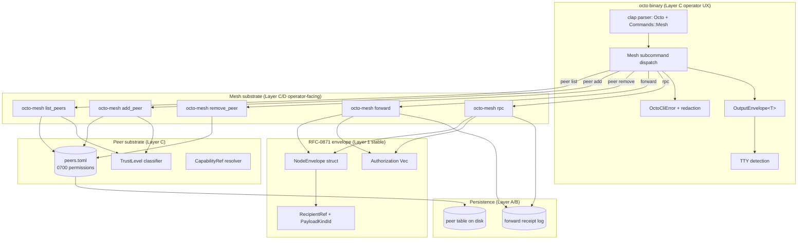
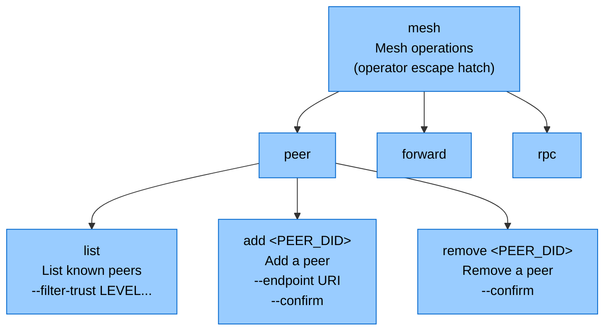

# RFC-0011-f: `octo mesh` Operations Substrate

## Status

Accepted (2026-08-31)

> **Amendment chain:** Subordinate amendment to RFC-0011 (Phase 7 per Status header
> amendment chain). Covers mesh operations subcommands: peer management, manual
> envelope forwarding (ops escape hatch), and remote RPC invocation. Depends on
> RFC-0871 specialized-node-protocol-envelope for envelope shape; depends on
> RFC-0855 mission-overlay-networks (plus its accepted amendments RFC-0855p-b
> coordinator-lifecycle and RFC-0855p-c domain-coordinator-role) for peer
> lifecycle hooks. Peer discovery / multi-chain DID resolution per RFC-0010.

## Summary

This amendment extends the `octo` CLI substrate (RFC-0011) with mesh operations:
peer management (`octo mesh peer {list,add,remove}`), manual envelope forwarding
(`octo mesh forward`), and remote RPC invocation (`octo mesh rpc`). The
subcommand set is an **operator escape hatch** — automated agents SHOULD use
the Python SDK / HTTP proxy (RFC-0917) instead. The CLI is for:
operator-driven peer onboarding, ops debugging of envelope forwarding, and
manual RPC calls when substrate automation is unavailable.

The RFC fixes: the binary surface (clap derive additions to `Commands`), the
output envelope schemas (`OutputEnvelope<PeerListOutput>` and friends), the
substrate `[ADD]` surface (5 new functions on `octo_mesh`), the redaction
contract (envelope body NEVER echoed in logs), and the execution class mapping
(list/add/remove = C; forward/rpc = B — consensus-impacting routing).

## Dependencies

**Requires:**

- RFC-0011: `octo` CLI Substrate — binary surface, output envelope, redaction layer, error envelope, exit code table, confirmation flag matrix
- RFC-0871: Specialized Node Protocol Envelope — `NodeEnvelope` shape (envelope_id, from_did, to_node_id, payload_kind, payload, authorization, nonce, expires_at_unix_ms)
- RFC-0855: Mission Overlay Networks — peer model and mesh topology substrate
- RFC-0855p-b: Coordinator Lifecycle — peer lifecycle hooks (Designated → Active → Heartbeat-miss → Suspect → Handover → Inactive)
- RFC-0855p-c: Domain Coordinator Role — `DomainCoordinatorRecord` and `DomainCoordinatorLifecycle` (peer-as-domain-coordinator case)
- RFC-0010: Canonical DID Codec — peer DID wire form + canonical validation
- RFC-0008: Deterministic AI Execution Boundary — execution class mapping
- RFC-0863: Node Transport Trait — `NodeTransport::send_best` substrate for envelope dispatch (per RFC-0863 §NodeTransport)

**Optional:**

- RFC-0917: Adapter CLI substrate (Python SDK / HTTP proxy) — alternative programmatic surface for the same operations; defer to that RFC when its substrate lands
- RFC-0959: Settlement Substrate — informs trust-level computation (peers with settlement history rank higher); out of scope for substrate `[ADD]` shape

> **Dependency Validation Rules:**
>
> 1. Dependencies MUST form a DAG (no cycles)
> 2. All "Requires" RFCs MUST be listed as mission prerequisites
> 3. Optional dependencies MUST be documented separately from required
> 4. Dependencies on "Planned" RFCs MUST note the assumption they will be Accepted
> 5. No 2-cycle sibling required — RFC-0011-f is acyclic against all Required dependencies (DAG: RFC-0010 → RFC-0011 → RFC-0011-f; RFC-0855 → RFC-0855p-b / RFC-0855p-c → RFC-0011-f; RFC-0871 → RFC-0011-f)

## Design Goals

| Goal | Target                                                           | Metric                                                                                                                                               |
| ---- | ---------------------------------------------------------------- | ---------------------------------------------------------------------------------------------------------------------------------------------------- |
| G1   | Deterministic envelope forwarding                                | Same input envelope → same `ForwardReceipt.correlation_id` across runs; substrate `octo_mesh::forward` is pure                                       |
| G2   | Peer identity via RFC-0010 canonical DID codec                   | All `peer_did` arguments pass `octo_ident::CanonicalCodec::parse(s, allow_legacy=false)`; legacy form rejected with exit 27                          |
| G3   | Bounded TTL handling                                             | `ttl_hops` clamped to 1..=8 (RFC-0871 §Security Considerations TTL skew row + RFC-0871 §Algorithms step 5 envelope TTL ceiling); exceeding → exit 28 |
| G4   | RFC-0871 envelope conformance                                    | All forwarded envelopes satisfy RFC-0871 §Data Structures (`NodeEnvelope` shape) before substrate sign                                               |
| G5   | Zero envelope body emission in logs                              | `OctoCliRedactor` strips envelope payload bytes from all log output; test vectors assert no leak                                                     |
| G6   | Read-only operation available to Auditor                         | `octo mesh peer list` requires no capability; `add` / `remove` / `forward` / `rpc` require capability per G7                                         |
| G7   | Capability gating for mutating + consensus-impacting subcommands | `octo mesh peer add` / `remove` → role provisioning per RFC-0011-d; `forward` / `rpc` → capability caveat per RFC-0957                               |

## Motivation

RFC-0011 §Implementation Phases lists Phase 7 (mesh operations) as
"Depends on RFC-0871 node protocol wiring." RFC-0871 is now Accepted. The
substrate `crates/octo-mesh` is reachable from `octo-wallet` Layer B (peer
table) and `octo-protocol` Layer 1 (envelope shape). The CLI binding layer
between operator and mesh substrate has no specification.

Three concrete operator gaps drive this RFC:

1. **Peer onboarding.** Operators currently cannot onboard a peer via the CLI.
   They must edit config files directly (`$OCTO_HOME/mesh/peers.toml`),
   which bypasses RFC-0010 canonical DID validation and the trust-level
   classification system. Without `octo mesh peer add`, a typoed DID
   silently fails when the runtime tries to resolve it; with the CLI, the
   substrate validates the wire form on dispatch (exit 27 `MeshIdentityUnknown` on shape error).

2. **Envelope forwarding debugging.** When a cross-instance envelope
   forwarding fails (per RFC-0871 §Adversary Analysis A1-A7), operators
   need a way to manually replay a captured envelope to a target peer.
   `octo mesh forward` provides this ops escape hatch WITHOUT bypassing
   the RFC-0871 envelope validation path — the substrate still rejects
   expired / replayed / unauthorized envelopes; the CLI just removes the
   "which substrate path triggered the send" indirection.

3. **Remote RPC invocation.** When a specialized node (e.g.,
   `octo-quota-router` per RFC-0870) needs to be poked out-of-band (e.g.,
   to drain a stuck queue, query a peer's served payload kinds), operators
   currently must SSH into the node host and run node-local commands.
   `octo mesh rpc <peer-did> <method> --params <json>` invokes the
   substrate `SpecializedNode::handle_payload` path over the wire, with
   full RFC-0871 envelope conformance + signature verification.

These three operations form a minimal but complete operator surface for mesh
diagnostics. Adding them closes the gap identified in RFC-0011 Phase 7.

## Roles and Authorities

> **The "Nothing should be implied" rule (specification layer):** Every actor that
> affects correctness, security, accountability, or consensus MUST be named with a
> stable identifier, a defined authority scope, and a typed lifecycle. Inference is a
> defect.

This RFC introduces no NEW operator-facing roles. It REUSES the three roles
defined in RFC-0011 §Roles and Authorities:

| Role           | Identifier              | Authority Scope (this RFC)                                                                                                               | Lifecycle | Source/Ref          |
| -------------- | ----------------------- | ---------------------------------------------------------------------------------------------------------------------------------------- | --------- | ------------------- |
| Human Operator | `OperatorKind::Human`   | `peer list`: read; `peer add` / `remove`: write (with `--confirm`); `forward`: capability-gated; `rpc`: capability-gated                 | stateless | RFC-0009 / RFC-0011 |
| CI Bot         | `OperatorKind::CiBot`   | `peer list`: read-only; `peer add` / `remove` / `forward` / `rpc`: `--allow-write` for non-destructive ops; denied for `forward` / `rpc` | stateless | RFC-0011            |
| Auditor (RO)   | `OperatorKind::Auditor` | `peer list`: read-only + audit-trail access; all mutating subcommands: denied (exit 2)                                                   | stateless | RFC-0011            |

### Role/Authority Coverage Table

| Subcommand                      | Human (default)                       | CI Bot          | Dev mode        | Auditor         | Capability-gated?                   | Source/Ref                                      |
| ------------------------------- | ------------------------------------- | --------------- | --------------- | --------------- | ----------------------------------- | ----------------------------------------------- |
| `octo mesh peer list`           | (no flag)                             | (no flag)       | (no flag)       | (no flag)       | no                                  | This RFC §Subcommand Taxonomy                   |
| `octo mesh peer add`            | `--confirm`                           | `--allow-write` | `--allow-write` | denied (exit 2) | no (deferred to RFC-0011-d in v1.0) | This RFC §Subcommand Taxonomy + RFC-0011-d stub |
| `octo mesh peer remove`         | `--confirm`                           | `--allow-write` | `--allow-write` | denied (exit 2) | no (deferred to RFC-0011-d in v1.0) | This RFC §Subcommand Taxonomy + RFC-0011-d stub |
| `octo mesh forward <envelope>`  | `--confirm` + `--confirm-acknowledge` | denied (exit 2) | `--allow-write` | denied (exit 2) | yes (RFC-0957)                      | This RFC §Subcommand Taxonomy                   |
| `octo mesh rpc <peer> <method>` | `--confirm` + `--confirm-acknowledge` | denied (exit 2) | `--allow-write` | denied (exit 2) | yes (RFC-0957)                      | This RFC §Subcommand Taxonomy                   |

> **Capability-gating rationale:** `forward` and `rpc` are consensus-impacting
> routing operations (Execution Class B per §RFC-0008 Execution Class Mapping).
> They require a capability caveat per RFC-0957 §Caveat DSL Extension (canonical
> holder-binding form — `HolderKind::Bearer` per RFC-0957-A1 §HolderKind AND
> `Caveat::Before(now_unix + 3600)` AND `Caveat::Provider(vec![authorized_target_provider_id])`
> per RFC-0957 §Caveat DSL Extension). The substrate
> `octo_mesh::forward` / `octo_mesh::rpc` verifies the capability before
> dispatch (substrate-truth); CLI exit 29 surfaces a missing capability.
>
> **Role-provisioning rationale:** `peer add` / `peer remove` mutate the
> operator's local peer table. They are gated by the role-provisioning
> amendment (RFC-0011-d, future) for fleet-wide consistency; in v1.0 the
> CLI surfaces them with `--confirm` only and notes in the rationale that
> RFC-0011-d will add role-gated admission.

### Role Transitions

No new role transitions. The CLI does not manage role state (RFC-0011 §Role
Transitions). Operator-mode selection is per-invocation.

### Out-of-scope Roles

- **Mesh Coordinators** (Domain Coordinator per RFC-0855p-c) — interact via
  dedicated node admin RPC, not this CLI. The CLI's `peer` subcommand shows
  coordinator-classified peers but does NOT expose election / handover / slash
  flows (those are RFC-0855p-c §3-§6 substrate operations, out of CLI scope).
- **AI Agents** — programmatic mesh access is via the Python SDK + HTTP proxy
  (RFC-0917), not this CLI. The CLI is the operator escape hatch for
  substrate automation gaps.

## Specification

### System Architecture



The `octo mesh` subcommand tree is a Layer-C orchestrator. It owns:

- clap parsing (operator UX)
- output envelope rendering (operator UX)
- redaction layer (operator UX — envelope body stripped before any log emit)
- confirmation flag dispatch (operator UX)
- error envelope (operator UX)

It does NOT own:

- envelope shape (Layer 1 — `octo-protocol` per RFC-0871)
- peer table storage (Layer B — `octo-mesh` owns its on-disk format)
- trust-level classification (Layer C — `octo-mesh::TrustLevel` derives from RFC-0855p-c `DomainCoordinatorRecord` if peer is a coordinator; otherwise untrusted by default)
- capability verification (Layer B — `octo-cap-macaroon` per RFC-0957)

### Binary Surface

The `octo mesh` subcommand tree is added under the `Commands` enum in
`crates/octo-cli/src/main.rs` (per RFC-0011 §Binary Surface). It is layered
in alongside the existing `whoami`, `identity`, `capability`, `policy`
subcommands; no existing variant is modified.

```rust
#[derive(Subcommand, Debug)]
enum Commands {
    // ... existing variants from RFC-0011 ...

    /// Mesh operations (peer management, envelope forwarding, remote RPC).
    /// This subcommand tree is the OPERATOR ESCAPE HATCH for mesh substrate
    /// automation gaps; AI agents SHOULD use the Python SDK / HTTP proxy
    /// per RFC-0917 instead.
    Mesh {
        #[command(subcommand)]
        action: MeshAction,
    },
}

#[derive(Subcommand, Debug)]
enum MeshAction {
    /// Peer management (list / add / remove subactions).
    Peer {
        #[command(subcommand)]
        action: PeerAction,
    },

    /// Manually forward a request envelope to a target peer (ops escape hatch).
    /// The forwarded envelope MUST conform to RFC-0871 §Data Structures
    /// (NodeEnvelope shape). The CLI does NOT bypass RFC-0871 envelope
    /// validation; it removes the "which substrate path triggered the send"
    /// indirection for ops debugging only.
    Forward {
        /// Path to the envelope JSON file to forward (RFC-0871 shape).
        #[arg(long, value_name = "PATH")]
        envelope: PathBuf,

        /// Target peer DID (RFC-0010 canonical wire form).
        #[arg(long, value_name = "DID")]
        target_did: String,

        /// Maximum hop count (1..=8 per RFC-0871 ceiling). Substrate rejects
        /// envelopes exceeding the per-node-type TTL ceiling declared in
        /// RouterAnnouncePayload.
        #[arg(long, value_name = "N", default_value = "1")]
        ttl_hops: u8,
    },

    /// Invoke a remote RPC on a peer node (specialized node handle_payload).
    /// The RPC method name and JSON params are substrate-defined per
    /// RFC-0871 §Specialized Node Lifecycle; the CLI is a thin wrapper.
    Rpc {
        /// Peer DID to invoke the RPC on.
        #[arg(value_name = "PEER_DID")]
        peer_did: String,

        /// RPC method name (substrate-defined; no central enum per
        /// §Architectural Principles).
        #[arg(value_name = "METHOD")]
        method: String,

        /// JSON params for the RPC call.
        #[arg(long, value_name = "JSON", default_value = "{}")]
        params: String,
    },
}

#[derive(Subcommand, Debug)]
enum PeerAction {
    /// List all known peers with trust-level classification.
    List {
        /// Filter by trust level (canonical UUID substring per
        /// §Trust Level Canonical UUIDs; e.g., `--filter-trust
        /// urn:octo:trust-level:00000000-0000-0000-0000-000000000001`
        /// for `TRUSTED`). Repeatable.
        #[arg(long, value_name = "LEVEL", value_parser = parse_trust_level)]
        filter_trust: Vec<TrustLevel>,
    },

    /// Add a new peer to the local peer table.
    Add {
        /// Peer DID (RFC-0010 canonical wire form).
        #[arg(value_name = "PEER_DID")]
        peer_did: String,

        /// Network endpoint (URI form: tcp://host:port, quic://host:port,
        /// bluetooth://<bdaddr>).
        #[arg(long, value_name = "URI")]
        endpoint: String,
    },

    /// Remove a peer from the local peer table.
    Remove {
        /// Peer DID to remove (RFC-0010 canonical wire form).
        #[arg(value_name = "PEER_DID")]
        peer_did: String,
    },
}
```

### Subcommand Taxonomy

Each subcommand below specifies: args, flags, output schema, substrate call,
exit codes, and redaction requirements.

> **Substrate API note:** Calls prefixed with `[ADD]` denote new Layer-C/D
> substrate additions gated on RFC-0011-f acceptance. They are added by the
> RFC-0011-f substrate work (a separate amendment) and are required for the
> CLI commands in this RFC to compile.
>
> **Complete `[ADD]` surface (consumed by Phase 7 commands):**
>
> 1. `octo_mesh::list_peers(filter: &PeerFilter) -> Result<Vec<PeerSummary>, MeshError>` — `octo mesh peer list`. Reads on-disk peer table; classifies each peer by trust level via `classify_trust_level(peer_record) -> TrustLevel` (returns `TrustLevel(TRUSTED_UUID | VERIFIED_UUID | UNTRUSTED_UUID)` per the canonical UUID table in §Trust Level Canonical UUIDs). Filter is an AND across multiple `--filter-trust` values (operator can request intersection).
> 2. `octo_mesh::add_peer(peer_did: &Did, endpoint: &EndpointUri) -> Result<(), MeshError>` — `octo mesh peer add`. Validates `peer_did` shape via `octo_ident::CanonicalCodec::parse(s, allow_legacy=false)` (rejects legacy `did:octo:b<base32>` form with `MeshError::InvalidDidShape`); validates `endpoint` URI scheme against an allowlist (`tcp://`, `quic://`, `bluetooth://`); persists to peer table atomically (write to `$OCTO_HOME/mesh/peers.toml.tmp`, fsync, rename).
> 3. `octo_mesh::remove_peer(peer_did: &Did) -> Result<(), MeshError>` — `octo mesh peer remove`. Idempotent — returns `Ok(())` if peer is not present (operator can run idempotently in scripts). Does NOT contact the peer for farewell (peer removal is local-table-only; the substrate's transport layer handles mesh-side expiry per RFC-0862 gossip retry).
> 4. `octo_mesh::forward(envelope: &NodeEnvelope, target_did: &Did, ttl_hops: u8) -> Result<ForwardReceipt, MeshError>` — `octo mesh forward`. Validates `envelope` against RFC-0871 §Data Structures shape; verifies envelope signature per RFC-0871 §Algorithms "Envelope receive (node-side)" step 6; verifies caveat set per RFC-0957 §Attenuation Invariant (Audience + Before + Provider caveat set on every `Authorization::Capability`); decrements `ttl_hops` ceiling via `expires_at_unix_ms` recomputation; dispatches via `NodeTransport::send_best(envelope_bytes, &send_context)` per RFC-0871 §Algorithms step 5.
> 5. `octo_mesh::rpc(peer_did: &Did, method: &str, params: &serde_json::Value) -> Result<serde_json::Value, MeshError>` — `octo mesh rpc`. Constructs a `NodeEnvelope` with `payload_kind = PAYLOAD_KIND_RPC_DISPATCH` (RFC-allocated UUID per RFC-0871 §Data Structures (`PayloadKindId` field)) and `payload = borsh::serialize(&(method, params))`; signs via `HsmAdapter::sign` (same path as RFC-0871 §Algorithms "Envelope send" steps 1-5); verifies caveat set per RFC-0957 §Attenuation Invariant (Audience + Before + Provider caveat set on every `Authorization::Capability`) before dispatch (substrate-truth; CLI exit 29 surfaces a missing or invalid caveat set); sends via `NodeTransport::send_best`; awaits reply via the substrate's request/reply pattern (the target node's `SpecializedNode::handle_payload` returns a `NodeEnvelope` response with the same `envelope_id` correlation); parses response `payload` back into `serde_json::Value`.
>
> **Complete type-level `[ADD]` surface (consumed by Phase 7 commands):**
>
> 1. `octo_mesh::PeerSummary` — operator-facing peer record (§Peer Summary Shape); derives `Serialize`, `Deserialize`, `Clone`, `schemars::JsonSchema` for JSON Schema export per §Output Envelope. Fields: `peer_did: Did`, `endpoint: EndpointUri`, `trust_level: TrustLevel`, `last_seen_unix: i64`, `capabilities: Vec<CapRef>`.
> 2. `octo_mesh::EndpointUri(pub String)` — canonical endpoint URI wrapper (§Peer Summary Shape); substrate validates scheme allowlist (`tcp://`, `quic://`, `bluetooth://`) before persistence; CLI exit 28 `InvalidEndpointScheme` on disallowed scheme.
> 3. `octo_mesh::CapRef(pub String)` — capability reference display form derived from RFC-0957 `root_id` (first 16 hex chars + ellipsis) for operator UI (§Peer Summary Shape); substrate carries the full `root_id` for caveat-set verification.
> 4. `octo_mesh::TrustLevel(pub String)` — typed-discriminator newtype for trust classification (§Peer Summary Shape, §Trust Level Canonical UUIDs); NOT a central enum per [[cipherocto-design-principles]] "Extension over enumeration". Constructed via `TrustLevel::from_uuid(s)` which validates against the canonical UUID table; unknown discriminators fail-closed at the substrate layer with `TrustLevelParseError::UnknownDiscriminator`.
> 5. `const TRUSTED_UUID: &str`, `const VERIFIED_UUID: &str`, `const UNTRUSTED_UUID: &str` — canonical trust-level UUID constants in the `urn:octo:trust-level:*` namespace (§Trust Level Canonical UUIDs); MUST be used verbatim in all mesh envelope serializations; new trust signals extend the namespace without substrate enum edits.
> 6. `octo_mesh::PeerFilter { trust_levels: Vec<TrustLevel> }` — AND-semantics filter for `list_peers` (§Subcommand Taxonomy `peer list`); empty `trust_levels` matches all peers; CLI `--filter-trust` is repeatable and accumulates via AND.

#### `octo mesh peer list`

| Aspect       | Value                                                                                                                                                                                         |
| ------------ | --------------------------------------------------------------------------------------------------------------------------------------------------------------------------------------------- |
| Args         | none                                                                                                                                                                                          |
| Flags        | `--json`, `--filter-trust <LEVEL>` (repeatable; canonical UUID substrings per §Trust Level Canonical UUIDs)                                                                                   |
| Output       | `PeerListOutput { peers: Vec<PeerSummary>, total_count: usize, filtered_count: usize }`                                                                                                       |
| Substrate    | `[ADD] octo_mesh::list_peers(filter: &PeerFilter) -> Result<Vec<PeerSummary>, MeshError>` (where `PeerFilter { trust_levels: Vec<TrustLevel> }`; AND across levels; empty filter = all peers) |
| Exit codes   | 0, 4 (invalid `--filter-trust` value), 64                                                                                                                                                     |
| Redaction    | none (no secret material; `endpoint` URIs are non-secret)                                                                                                                                     |
| Side effects | none (read-only)                                                                                                                                                                              |
| Dry-run      | n/a                                                                                                                                                                                           |

#### `octo mesh peer add`

| Aspect       | Value                                                                                                                                                                                                                                                                                                                |
| ------------ | -------------------------------------------------------------------------------------------------------------------------------------------------------------------------------------------------------------------------------------------------------------------------------------------------------------------- |
| Args         | `<PEER_DID>` (REQUIRED; RFC-0010 canonical wire form)                                                                                                                                                                                                                                                                |
| Flags        | `--endpoint <URI>` (REQUIRED; allowlisted scheme: `tcp://`, `quic://`, `bluetooth://`), `--confirm` (per RFC-0011 §Confirmation Flag Matrix), `--dry-run`                                                                                                                                                            |
| Output       | `PeerAddOutput { peer_did: Did, endpoint: EndpointUri, trust_level: TrustLevel, added_at_unix: i64 }`                                                                                                                                                                                                                |
| Substrate    | `[ADD] octo_mesh::add_peer(peer_did: &Did, endpoint: &EndpointUri) -> Result<(), MeshError>` (validates DID shape via `octo_ident::CanonicalCodec::parse`; writes atomically to peer table; initial trust level = `Untrusted` until first successful envelope handshake per RFC-0855p-c §3 Platform-Admin Authority) |
| Exit codes   | 0, 27 (`MeshIdentityUnknown` — invalid DID shape via RFC-0010 canonical wire form violation), 28 (invalid endpoint scheme; shared with InvalidTtlHops; §Error Handling row 28), 2 (`ConfirmationRequired` per RFC-0011 §Confirmation Flag Matrix), 64                                                                |
| Redaction    | none (no secret material; DID + endpoint URI are public)                                                                                                                                                                                                                                                             |
| Side effects | new peer record persisted to `$OCTO_HOME/mesh/peers.toml` with 0700 permissions                                                                                                                                                                                                                                      |
| Dry-run      | substrate call wrapped; preview only — shows the parsed peer record before commit                                                                                                                                                                                                                                    |

#### `octo mesh peer remove`

| Aspect       | Value                                                                                                                                                                                                                                                                                               |
| ------------ | --------------------------------------------------------------------------------------------------------------------------------------------------------------------------------------------------------------------------------------------------------------------------------------------------- |
| Args         | `<PEER_DID>` (REQUIRED; RFC-0010 canonical wire form)                                                                                                                                                                                                                                               |
| Flags        | `--confirm` (REQUIRED per RFC-0011 §Confirmation Flag Matrix), `--dry-run`                                                                                                                                                                                                                          |
| Output       | `PeerRemoveOutput { peer_did: Did, removed: bool, removed_at_unix: i64 }` (`removed: false` if peer was not present — substrate is idempotent per `[ADD]` surface entry #3)                                                                                                                         |
| Substrate    | `[ADD] octo_mesh::remove_peer(peer_did: &Did) -> Result<(), MeshError>` (idempotent; does NOT contact the peer; atomic removal from peer table)                                                                                                                                                     |
| Exit codes   | 0, 27 (`MeshIdentityUnknown` — invalid DID shape via RFC-0010 canonical wire form violation), 4 (`IdentityNotFound` — peer not present in local peer table at removal time; idempotent substrate does NOT re-emit this for missing peers, only for malformed entry), 2 (`ConfirmationRequired`), 64 |
| Redaction    | none                                                                                                                                                                                                                                                                                                |
| Side effects | peer record removed from `$OCTO_HOME/mesh/peers.toml`                                                                                                                                                                                                                                               |
| Dry-run      | substrate call wrapped; preview only — shows the would-be removed peer record before commit                                                                                                                                                                                                         |

#### `octo mesh forward`

| Aspect       | Value                                                                                                                                                                                                                                                                                                                                                                                                             |
| ------------ | ----------------------------------------------------------------------------------------------------------------------------------------------------------------------------------------------------------------------------------------------------------------------------------------------------------------------------------------------------------------------------------------------------------------- |
| Args         | none (envelope path + target + ttl via flags)                                                                                                                                                                                                                                                                                                                                                                     |
| Flags        | `--envelope <PATH>` (REQUIRED; JSON file path containing RFC-0871 `NodeEnvelope` shape), `--target-did <DID>` (REQUIRED; RFC-0010 canonical wire form), `--ttl-hops <N:u8>` (default 1; bounded 1..=8 per RFC-0871 ceiling), `--confirm` (REQUIRED), `--confirm-acknowledge` (REQUIRED — pastejacking defense per RFC-0011 §Security Considerations 1a), `--dry-run`                                              |
| Output       | `ForwardOutput { correlation_id: Hex32, target_did: Did, ttl_hops: u8, expires_at_unix_ms: u64, dispatch_started_at_unix_ms: u64 }`                                                                                                                                                                                                                                                                               |
| Substrate    | `[ADD] octo_mesh::forward(envelope: &NodeEnvelope, target_did: &Did, ttl_hops: u8) -> Result<ForwardReceipt, MeshError>` (validates envelope shape per RFC-0871 §Data Structures; verifies envelope authorization; clamps `ttl_hops` to per-node-type ceiling from `RouterAnnouncePayload`; computes `expires_at_unix_ms` ceiling; dispatches)                                                                    |
| Exit codes   | 0, 7 (envelope JSON parse error — RFC-0871 shape violation), 27 (invalid DID shape), 28 (`ttl_hops` out of range; shared with InvalidEndpointScheme; §Error Handling row 28), 29 (capability missing or insufficient per RFC-0957), 30 (envelope authorization failed per RFC-0871 §Algorithms; shared with RpcTimeout; §Error Handling row 30), 2 (`ConfirmationRequired` / `--confirm-acknowledge` missing), 64 |
| Redaction    | envelope `payload` bytes NEVER echoed in logs (per §Redaction); only `correlation_id` (envelope_id), `target_did`, `ttl_hops`, `expires_at_unix_ms` appear in output                                                                                                                                                                                                                                              |
| Side effects | envelope dispatched to target peer; forward receipt persisted to `$OCTO_HOME/mesh/forward-receipts.log` for audit                                                                                                                                                                                                                                                                                                 |
| Dry-run      | substrate call wrapped; preview only — shows the parsed envelope header (correlation_id, from_did, target_did, ttl_hops, payload_hash, capability_ref) WITHOUT payload body bytes before commit                                                                                                                                                                                                                   |

#### `octo mesh rpc`

| Aspect       | Value                                                                                                                                                                                                                                                                                                                                           |
| ------------ | ----------------------------------------------------------------------------------------------------------------------------------------------------------------------------------------------------------------------------------------------------------------------------------------------------------------------------------------------- |
| Args         | `<PEER_DID>` (REQUIRED), `<METHOD>` (REQUIRED; substrate-defined; no central enum per §Architectural Principles)                                                                                                                                                                                                                                |
| Flags        | `--params <JSON>` (default `{}`), `--confirm` (REQUIRED), `--confirm-acknowledge` (REQUIRED), `--dry-run`                                                                                                                                                                                                                                       |
| Output       | `RpcOutput { peer_did: Did, method: String, request_envelope_id: Hex32, response_envelope_id: Hex32, response_payload: serde_json::Value, round_trip_ms: u64 }`                                                                                                                                                                                 |
| Substrate    | `[ADD] octo_mesh::rpc(peer_did: &Did, method: &str, params: &serde_json::Value) -> Result<serde_json::Value, MeshError>` (constructs `NodeEnvelope` with `payload_kind = PAYLOAD_KIND_RPC_DISPATCH`; signs via `HsmAdapter`; sends + awaits reply via substrate request/reply pattern; returns parsed response payload)                         |
| Exit codes   | 0, 27 (invalid peer DID — `MeshIdentityUnknown`), 31 (method name rejected by substrate — unknown `payload_kind` discriminator — `MeshMethodUnknown`), 29 (capability missing or insufficient), 30 (shared by `EnvelopeAuthorizationFailed` and `RpcTimeout`; §Error Handling row 30), 2 (`ConfirmationRequired` / `--confirm-acknowledge`), 64 |
| Redaction    | `params` JSON MAY contain secret material depending on the RPC method; redactor applies to any nested secret fields per RFC-0011 §Redaction Layer                                                                                                                                                                                               |
| Side effects | request envelope dispatched; response envelope received; both logged to `$OCTO_HOME/mesh/rpc-receipts.log` with redacted `params` / `response_payload`                                                                                                                                                                                          |
| Dry-run      | substrate call wrapped; preview only — shows the constructed request envelope header (correlation_id, target_did, method, params_hash) BEFORE signs and sends                                                                                                                                                                                   |

### Output Envelope

Every `octo mesh` subcommand emits `OutputEnvelope<T>` per RFC-0011 §Output
Envelope. This RFC does NOT introduce a distinct envelope struct; it
reuses the parent's generic `OutputEnvelope<T>` and parameterizes the
`data: T` field with the mesh-specific payload types below:

```rust
// Per RFC-0011 §Output Envelope — this RFC reuses the parent's generic
// `OutputEnvelope<T>` verbatim. No new envelope struct introduced; the
// schema_version field is set to the per-RFC-0011-c slot value `5`
// (authoritative slot allocation is owned by RFC-0011-c §9.4.1
// Per-amendment schema_version slot table; this amendment pins `5` per
// that table). The divergence from the parent slot `2` is documented per
// the table: RFC-0011-f adds the `command: String` field for log
// correlation (mirrors the v4 divergence in RFC-0011-c).
pub type MeshOutputEnvelope<T> = OutputEnvelope<T>;
```

The five data payload types:

```rust
#[derive(Serialize, Deserialize, Debug, schemars::JsonSchema)]
pub struct PeerListOutput {
    pub peers: Vec<PeerSummary>,
    pub total_count: usize,
    pub filtered_count: usize,
}

#[derive(Serialize, Deserialize, Debug, schemars::JsonSchema)]
pub struct PeerAddOutput {
    pub peer_did: Did,
    pub endpoint: EndpointUri,
    pub trust_level: TrustLevel,
    pub added_at_unix: i64,
}

#[derive(Serialize, Deserialize, Debug, schemars::JsonSchema)]
pub struct PeerRemoveOutput {
    pub peer_did: Did,
    pub removed: bool,
    pub removed_at_unix: i64,
}

#[derive(Serialize, Deserialize, Debug, schemars::JsonSchema)]
pub struct ForwardOutput {
    pub correlation_id: Hex32,
    pub target_did: Did,
    pub ttl_hops: u8,
    pub expires_at_unix_ms: u64,
    pub dispatch_started_at_unix_ms: u64,
}

#[derive(Serialize, Deserialize, Debug, schemars::JsonSchema)]
pub struct RpcOutput {
    pub peer_did: Did,
    pub method: String,
    pub request_envelope_id: Hex32,
    pub response_envelope_id: Hex32,
    pub response_payload: serde_json::Value,
    pub round_trip_ms: u64,
}
```

**Initial `schema_version`: 5** (per RFC-0011-c §9.4.1 Per-amendment
schema_version slot table — this amendment pins `5`; slot allocation
is owned by the parent RFC-0011-c, NOT redefined here). Divergence from
the parent slot `2` is documented per the slot table; the `command: String`
field is added for log correlation (mirrors the v4 divergence in
RFC-0011-c). Field-level divergences from the parent envelope are
summarized in the appendix B schema summary table.

### Peer Summary Shape

```rust
/// Network endpoint URI (canonical wire form per RFC-0871 §Specialized Node
/// Lifecycle transport binding). Accepts the scheme allowlist
/// `tcp://<host>:<port>`, `quic://<host>:<port>`, `bluetooth://<bdaddr>`
/// defined in §Subcommand Taxonomy `peer add`. The `String` payload carries
/// the verbatim scheme-prefixed form; substrate `octo_mesh::add_peer`
/// validates the scheme against the allowlist before persistence
/// (CLI exit 28 `InvalidEndpointScheme` on disallowed scheme).
pub struct EndpointUri(pub String);

/// Capability reference displayed in operator UI. Derived from the
/// RFC-0957 `Capability::root_id` truncated to display form (first 16 hex
/// chars + ellipsis) for compactness in `peer list` output; substrate
/// carries the full `root_id` for caveat-set verification (RFC-0957
/// §Attenuation Invariant). The CLI display form is NEVER used for
/// verification — the substrate reconstructs the full `root_id` from
/// its own state at dispatch time.
pub struct CapRef(pub String);

#[derive(Serialize, Deserialize, Debug, Clone)]
pub struct PeerSummary {
    /// Peer DID (RFC-0010 canonical wire form: did:octo:z<base58btc>).
    pub peer_did: Did,

    /// Network endpoint URI (tcp://host:port, quic://host:port,
    /// bluetooth://<bdaddr>).
    pub endpoint: EndpointUri,

    /// Trust-level classification. Derived from RFC-0855p-c if peer is a
    /// Domain Coordinator; otherwise untrusted until first successful
    /// envelope handshake.
    pub trust_level: TrustLevel,

    /// Last-seen timestamp (unix seconds). 0 if never seen.
    pub last_seen_unix: i64,

    /// Capability references the peer has advertised via
    /// RouterAnnouncePayload (RFC-0871 §Specialized Node Lifecycle).
    /// Each entry is a CapRef (RFC-0957 root_id first 16 hex chars +
    /// ellipsis display form for operator UI).
    pub capabilities: Vec<CapRef>,
}

/// Trust-level classification. Per [[cipherocto-design-principles]]
/// "Extension over enumeration (no central enums)", this is a typed
/// discriminator (UUID string) per the RFC-0871 typed-discriminator
/// pattern, NOT a substrate-wide enum. New trust signals (e.g.,
/// RFC-0855p-c cross-platform attestation) extend the canonical UUID
/// table below without substrate or CLI enum edits; old code fails-closed
/// on unknown discriminators.
#[derive(Serialize, Deserialize, Debug, Clone, PartialEq, Eq)]
pub struct TrustLevel(pub String);

impl TrustLevel {
    /// Construct from a canonical UUID string. Validated against the
    /// canonical UUID table in §Trust Level Canonical UUIDs; unknown
    /// discriminators fail-closed at the substrate layer.
    pub fn from_uuid(s: &str) -> Result<Self, TrustLevelParseError> {
        match s {
            TRUSTED_UUID | VERIFIED_UUID | UNTRUSTED_UUID => Ok(Self(s.to_owned())),
            _ => Err(TrustLevelParseError::UnknownDiscriminator(s.to_owned())),
        }
    }
}

/// Canonical UUID for "Trusted" — registered Domain Coordinator with
/// active stake (RFC-0855p-c §2 DomainCoordinatorRecord).
pub const TRUSTED_UUID: &str = "urn:octo:trust-level:00000000-0000-0000-0000-000000000001";

/// Canonical UUID for "Verified" — handshake succeeded (RFC-0871 verify)
/// but peer is NOT a registered coordinator.
pub const VERIFIED_UUID: &str = "urn:octo:trust-level:00000000-0000-0000-0000-000000000002";

/// Canonical UUID for "Untrusted" — peer is in local table but has not
/// completed a successful envelope handshake. Default state for
/// newly-added peers.
pub const UNTRUSTED_UUID: &str = "urn:octo:trust-level:00000000-0000-0000-0000-000000000003";
```

`classify_trust_level(peer_record)` semantics (canonical UUID strings
per §Trust Level Canonical UUIDs):

| Peer record state                                                              | `trust_level` value          |
| ------------------------------------------------------------------------------ | ---------------------------- |
| Peer is in `DomainCoordinatorRecord` with `LifecycleState::Active`             | `TrustLevel(TRUSTED_UUID)`   |
| Peer is in `DomainCoordinatorRecord` with `LifecycleState::Suspect`/`Handover` | `TrustLevel(VERIFIED_UUID)`  |
| Peer is in `DomainCoordinatorRecord` with `LifecycleState::Inactive`           | `TrustLevel(VERIFIED_UUID)`  |
| Peer has completed ≥1 successful envelope handshake (RFC-0871 verify)          | `TrustLevel(VERIFIED_UUID)`  |
| Peer has not completed any handshake (newly added)                             | `TrustLevel(UNTRUSTED_UUID)` |

#### Trust Level Canonical UUIDs

Per [[cipherocto-design-principles]] "Extension over enumeration (no
central enums)", the canonical trust-level UUIDs are RFC-allocated and
MUST be used verbatim in all mesh envelope serializations:

| Canonical name | Canonical UUID                                              | Semantics                                                                                        |
| -------------- | ----------------------------------------------------------- | ------------------------------------------------------------------------------------------------ |
| `TRUSTED`      | `urn:octo:trust-level:00000000-0000-0000-0000-000000000001` | Registered Domain Coordinator with active stake (RFC-0855p-c §2 DomainCoordinatorRecord)         |
| `VERIFIED`     | `urn:octo:trust-level:00000000-0000-0000-0000-000000000002` | Handshake succeeded (RFC-0871 verify) but NOT a registered coordinator                           |
| `UNTRUSTED`    | `urn:octo:trust-level:00000000-0000-0000-0000-000000000003` | Peer in local table but has not completed a successful envelope handshake; default for new peers |

New trust signals (e.g., RFC-0855p-c cross-platform attestation, future
amendments) extend this table by allocating new canonical UUIDs in the
`urn:octo:trust-level:*` namespace; old code fails-closed on unknown
discriminators (per [[cipherocto-design-principles]] "Open/Closed").

### Forward Envelope Shape

Per RFC-0871 §Data Structures, the underlying wire form is `NodeEnvelope`:

```rust
// Per RFC-0871 §Data Structures (Layer 1 stable, substrate-owned).
pub struct NodeEnvelope {
    pub envelope_id: [u8; 32],         // BLAKE3-256 of canonical_ser(rest)
    pub from_did: WireDid,             // RFC-0010 canonical
    pub to_node_id: RecipientRef,      // RecipientRef::Direct(peer_node_id)
    pub payload_kind: PayloadKindId,   // 128-bit UUID (RFC-allocated)
    pub payload: Vec<u8>,              // borsh-encoded
    pub authorization: Vec<Authorization>,
    pub nonce: [u8; 32],
    pub expires_at_unix_ms: u64,
}
```

The CLI exposes a **logical view** for operator-facing output (per §Subcommand
Taxonomy `ForwardOutput`):

| Logical field    | Maps to (RFC-0871)                                     | Notes                                                                                                                    |
| ---------------- | ------------------------------------------------------ | ------------------------------------------------------------------------------------------------------------------------ |
| `correlation_id` | `envelope_id` (Hex32)                                  | Operator-friendly reference for tracking the forward across logs / receipts                                              |
| `origin_did`     | `from_did` (WireDid → Did display form)                | CLI display form strips wire-format prefix per RFC-0011 display conventions                                              |
| `target_did`     | `to_node_id` (`RecipientRef::Direct` → peer_node_id)   | Resolved to peer_node_id via the local peer table at dispatch time                                                       |
| `ttl_hops`       | (derives) `expires_at_unix_ms` ceiling                 | Operator-facing hop counter; substrate clamps to per-node-type TTL ceiling from RouterAnnouncePayload                    |
| `payload_hash`   | `BLAKE3-256(payload)`                                  | Substrate-computed at dispatch time; CLI displays in dry-run output                                                      |
| `capability_ref` | `authorization`[0] if `Authorization::Capability(...)` | Operator-facing capability identifier (root_id first 16 hex chars + ellipsis); substrate verifies caveat set on dispatch |

The CLI accepts `--envelope <PATH>` pointing at a JSON file containing the
RFC-0871 fields (parsed by serde into `NodeEnvelope`). The CLI does NOT
permit operator-side construction of arbitrary envelopes from CLI flags —
the envelope file is the input (operator copies a captured envelope from a
log or substrate dump and replays it). This prevents pastejacking attacks
where a clipboard hijacker swaps CLI flags to inject an arbitrary envelope.

### RPC Surface

The RPC method name and JSON params are **substrate-defined**, not CLI-defined:

- `method` is a string identifier dispatched by the target node's
  `SpecializedNode::handle_payload` method (RFC-0871 §Specialized Node
  Lifecycle). The CLI does NOT carry a central enum of valid methods —
  new methods land via RFC-allocated `payload_kind` UUIDs (per RFC-0871
  §Data Structures `PayloadKindId`).
- `params` is a JSON object passed verbatim to the target. The substrate
  parses it against the method's expected schema (substrate-defined;
  out of RFC-0011-f scope).
- The CLI output's `response_payload: serde_json::Value` is the target's
  response — opaque to the CLI (substrate-defined).

The CLI is a thin wrapper over `octo_mesh::rpc`. It does NOT validate
method names against any central registry — that would violate §Architectural
Principles (no central enums for extension-bearing types). Unknown method
names fail at the substrate layer with `MeshError::UnknownMethod` (exit 31).

### Lifecycle Requirements

> **Required for any RFC that defines an actor with more than one state.**

This RFC does NOT define new stateful actors. It exposes operator UX over
the existing peer state machine from RFC-0855 / RFC-0855p-c.

For the `peer` subcommand tree, peer state is the RFC-0855 mission membership
state plus RFC-0855p-c DomainCoordinatorLifecycle (when peer is a coordinator):

| Peer state                                                                               | CLI surface                                                         |
| ---------------------------------------------------------------------------------------- | ------------------------------------------------------------------- |
| Peer in local table, no handshake yet                                                    | `trust_level: TrustLevel(UNTRUSTED_UUID)` (per §Peer Summary Shape) |
| Peer in local table, ≥1 successful handshake, NOT a Domain Coordinator                   | `trust_level: TrustLevel(VERIFIED_UUID)`                            |
| Peer is `DomainCoordinatorRecord { lifecycle: Active }`                                  | `trust_level: TrustLevel(TRUSTED_UUID)`                             |
| Peer is `DomainCoordinatorRecord { lifecycle: Suspect \| Handover }`                     | `trust_level: TrustLevel(VERIFIED_UUID)` (downgraded from Trusted)  |
| Peer is `DomainCoordinatorRecord { lifecycle: Inactive }` (slashed / demoted / resigned) | `trust_level: TrustLevel(VERIFIED_UUID)` (preserved for history)    |
| Peer removed from local table (via `peer remove` or fleet sync)                          | not listed                                                          |

The CLI does NOT trigger state transitions; it observes substrate state and
presents it for operator inspection.

### Determinism Requirements

1. **Output field order** — `OutputEnvelope<T>` field declaration order is
   canonical (per RFC-0011 §Determinism Requirements #2). Consumers MUST NOT
   rely on JSON key order.
2. **Timestamps** — all `generated_at` values are RFC 3339 UTC with `Z`
   suffix. Per-peer `last_seen_unix`, `added_at_unix`, and `removed_at_unix`
   are unix seconds.
3. **Trust-level ordering** — `TrustLevel` UUID ordering is
   `TRUSTED_UUID < VERIFIED_UUID < UNTRUSTED_UUID` (decreasing trust;
   RFC-0871 typed-discriminator lexicographic comparison per UUID string
   byte order). Filter results are sorted by `trust_level` ascending
   (lexicographic UUID byte order), then by `peer_did` lexicographically,
   for deterministic CLI output across runs.
4. **Forward correlation** — `correlation_id` is `BLAKE3-256(canonical_ser
(envelope_without_id))` per RFC-0871 §Algorithms. Same input envelope
   → same correlation_id across runs (Class A determinism per RFC-0008).
5. **Envelope serialization** — substrate `NodeEnvelope` uses borsh canonical
   form per RFC-0871 §Determinism Requirements #1. CLI does NOT re-serialize.

### RFC-0008 Execution Class Mapping

| Operation                       | Class | Rationale                                                                                                                                                                                                                                                                                                                  |
| ------------------------------- | ----- | -------------------------------------------------------------------------------------------------------------------------------------------------------------------------------------------------------------------------------------------------------------------------------------------------------------------------- |
| `octo mesh peer list`           | C     | Operator UX; reads local peer table only; no consensus impact                                                                                                                                                                                                                                                              |
| `octo mesh peer add`            | C     | Local peer table write; no consensus impact (peer propagation to fleet is substrate gossip eventual-consistency per RFC-0862; the CLI write is local-table-only and the gossip layer handles fleet-wide convergence)                                                                                                       |
| `octo mesh peer remove`         | C     | Local peer table write; idempotent; fleet propagation is gossip eventual-consistency per RFC-0862 (CLI write is local-table-only)                                                                                                                                                                                          |
| `octo mesh forward`             | B     | **Consensus-impacting routing** — the forwarded envelope may carry a payload that triggers state transitions on the target node (e.g., a wallet-sign request that mints a capability, which on chain mints an asset per RFC-0957); the envelope itself is Class A wire-form (RFC-0871) but the routing decision is Class B |
| `octo mesh rpc`                 | B     | **Consensus-impacting remote invocation** — the RPC payload is substrate-dispatched via RFC-0871 `SpecializedNode::handle_payload`; the dispatch path is Class B (off-chain deterministic when configured correctly)                                                                                                       |
| Output envelope rendering (all) | A     | Deterministic JSON serialization per RFC-0011 §Output Envelope                                                                                                                                                                                                                                                             |
| Redaction layer (all)           | A     | Deterministic pattern matching per RFC-0011 §Redaction Layer                                                                                                                                                                                                                                                               |

### Error Handling

The mesh subcommands extend `OctoCliError` (per RFC-0011 §Error Handling) with
new variants:

```rust
#[derive(thiserror::Error, Debug)]
pub enum OctoCliError {
    // ... existing variants from RFC-0011 ...

    #[error("mesh identity unknown: {detail}")]
    MeshIdentityUnknown { detail: String },                       // exit 27

    #[error("mesh method unknown: {method} (unknown payload_kind discriminator per RFC-0871)")]
    MeshMethodUnknown { method: String },                         // exit 31

    #[error("invalid TTL hops: {hops} (must be 1..=8 per RFC-0871 ceiling)")]
    InvalidTtlHops { hops: u8 },                                  // exit 28

    #[error("invalid endpoint scheme: {scheme} (allowlist: tcp, quic, bluetooth)")]
    InvalidEndpointScheme { scheme: String },                     // exit 28 (shared with InvalidTtlHops)

    #[error("capability missing or insufficient: {detail}")]
    MeshCapabilityInsufficient { detail: String },                // exit 29

    #[error("envelope authorization failed: {detail}")]
    EnvelopeAuthorizationFailed { detail: String },               // exit 30 (shared with RpcTimeout)

    #[error("RPC timeout: peer={peer}, method={method}, after {timeout_ms}ms")]
    RpcTimeout { peer: String, method: String, timeout_ms: u64 }, // exit 30 (shared with EnvelopeAuthorizationFailed)
}
```

User-facing message format: same `error: ... / caused by: ... / hint: ... /
exit code: N` format as RFC-0011 §Error Handling.

**Variant sanitization:** per RFC-0011 §Error Handling "Variant
sanitization (defense in depth)" — every variant's display string MUST be
passed through `sanitize_substrate_error(s)` before display. Envelope
payload bytes are NEVER serialized into error messages (redacted at source
by `OctoCliRedactor`).

### Exit Codes

| Code    | Variant                                      | Meaning                                                                                            |
| ------- | -------------------------------------------- | -------------------------------------------------------------------------------------------------- |
| 0       | (success)                                    | Command succeeded                                                                                  |
| 1       | (reserved)                                   | Reserved (POSIX convention)                                                                        |
| 2       | `ClapParse` / `ConfirmationRequired`         | Per RFC-0011 §Exit Codes                                                                           |
| 3-16    | (existing variants)                          | Per RFC-0011 §Exit Codes                                                                           |
| 17-19   | (reserved)                                   | Reserved for amendment chain (per-amendment slot allocation determined at submission)              |
| 20-22   | (reserved)                                   | Reserved for amendment chain (per-amendment slot allocation determined at submission)              |
| 23-26   | (reserved)                                   | Reserved for amendment chain (per-amendment slot allocation determined at submission)              |
| 27      | `MeshIdentityUnknown`                        | Peer DID lookup failed or DID shape rejected by RFC-0010 canonical codec (lookup / shape failures) |
| 28      | `InvalidTtlHops` / `InvalidEndpointScheme`   | TTL out of range OR endpoint scheme not in allowlist                                               |
| 29      | `MeshCapabilityInsufficient`                 | Capability missing or insufficient for `forward` / `rpc` per RFC-0957                              |
| 30      | `EnvelopeAuthorizationFailed` / `RpcTimeout` | RFC-0871 envelope authorization verification failed OR RPC did not receive response within timeout |
| 31      | `MeshMethodUnknown`                          | RPC method name rejected by substrate — unknown `payload_kind` discriminator                       |
| 32-34   | (reserved)                                   | Reserved for amendment chain (per-amendment slot allocation determined at submission)              |
| 35-38   | (reserved)                                   | Reserved for amendment chain (per-amendment slot allocation determined at submission)              |
| 64      | `Internal`                                   | Substrate error (sanitized)                                                                        |
| 65-78   | (reserved)                                   | Per RFC-0011 §Exit Codes                                                                           |
| 79-99   | (reserved)                                   | Per RFC-0011 §Exit Codes                                                                           |
| 100-127 | (env errors)                                 | Per RFC-0011 §Exit Codes                                                                           |

**Amendment-chain slot allocation:** RFC-0011-f reserves exit codes 27-31
within the parent §Appendix D reserved range (codes 17-63 reserved for
amendments; parent RFC does not pre-allocate per-amendment slot bands —
each amendment claims its own slot at submission time). Each slot within
-f's 27-31 band covers one mesh-error category: 27 = peer identity
failure, 28 = input validation failure, 29 = capability gating failure,
30 = dispatch failure (auth reject or timeout), 31 = RPC method lookup
failure (unknown `payload_kind` discriminator).

## Performance Targets

| Metric                                | Target                      | Notes                                                                          |
| ------------------------------------- | --------------------------- | ------------------------------------------------------------------------------ |
| `peer list` cold start                | <50ms p95                   | O(n) over peer table; typical n < 1000                                         |
| `peer list` warm cache                | <10ms p95                   | Substrate `peers.toml` cached in memory after first read                       |
| `peer add` / `peer remove`            | <20ms p95                   | Atomic file write + fsync                                                      |
| `forward` dry-run                     | <100ms p95                  | Envelope shape validation + signature verify + NO dispatch                     |
| `forward` real dispatch (1-hop local) | <100ms p95 (RFC-0871 §Perf) | Mirror RFC-0871 §Performance Targets "End-to-end wallet sign request via mesh" |
| `rpc` round-trip (local 1-hop)        | <200ms p95                  | 2x `forward` budget (request + response envelopes)                             |
| `rpc` round-trip (cross-region)       | <2s p95                     | Network-bound; substrate timeout default 30s per `MeshError::RpcTimeout`       |

The CLI is operator-facing; throughput is not a primary concern. Latency
targets exist to keep the operator experience responsive.

## Implicit Assumptions Audit

> **The "Nothing should be implied" rule (validation layer):** Every assumption the
> design relies on that is not enforced by types, runtime validation, or test
> coverage MUST be listed here.

| Assumption                                          | Where Relied Upon                                                                                                | Blast Radius if False                                                                                          | Mitigation / Status                                                                                                                                                                   |
| --------------------------------------------------- | ---------------------------------------------------------------------------------------------------------------- | -------------------------------------------------------------------------------------------------------------- | ------------------------------------------------------------------------------------------------------------------------------------------------------------------------------------- |
| Peer DID is RFC-0010 canonical wire form            | `octo mesh peer add` / `remove` / `forward` target_did / `rpc` peer_did                                          | All peer operations fail with exit 27; operator cannot onboard any peer without re-issuing with canonical form | Substrate `octo_ident::CanonicalCodec::parse(s, allow_legacy=false)` validates on dispatch; CLI exit 27 `MeshIdentityUnknown` on shape violation; test vector enforces canonical form |
| Envelope TTL bounded                                | `octo mesh forward --ttl-hops`                                                                                   | Unbounded TTL → indefinite replay window per RFC-0871 §Adversary Analysis A4                                   | Substrate clamps `ttl_hops` to 1..=8 (RFC-0871 ceiling); CLI exit 28 on out-of-range input; per-node-type ceiling from RouterAnnouncePayload enforced at dispatch                     |
| RFC-0871 envelope version match                     | `octo mesh forward --envelope <PATH>` parses envelope JSON                                                       | Old / new envelope variants silently fail at target node; ops debugging becomes confusing                      | CLI parses against substrate `NodeEnvelope` definition; RFC-0871 §Compatibility "additive payload_kind UUIDs" applies; unknown discriminators fail-closed                             |
| Payload hash integrity                              | `ForwardOutput.payload_hash` (CLI display only); substrate verifies `payload` bytes match `envelope_id` preimage | Substrate rejects with `ProtocolError::ReplayDetected` (RFC-0871 §Error Handling); CLI surfaces exit 30        | Substrate-truth: substrate owns hash verification; CLI inherits; test vector asserts substrate rejection path                                                                         |
| Endpoint scheme allowlist                           | `octo mesh peer add --endpoint`                                                                                  | Operator accidentally adds `file://` or `javascript:` endpoint → unexpected dispatch behavior                  | Substrate validates scheme against allowlist (`tcp://`, `quic://`, `bluetooth://`); CLI exit 28 on disallowed scheme; allowlist extensible via substrate                              |
| Capability is present at dispatch time              | `octo mesh forward` / `rpc`                                                                                      | Substrate rejects with `MeshError::CapabilityInsufficient` → CLI exit 29                                       | CLI surfaces `--confirm-acknowledge` pastejacking gate; capability caveat comes from CLI's `octo_mesh::rpc` / `forward` signature; substrate verifies per RFC-0957                    |
| Local peer table permissions are 0700               | `octo mesh peer add` writes `$OCTO_HOME/mesh/peers.toml`                                                         | Other local users can read peer table → leaks topology / endpoints (low-sensitivity but still data leak)       | Substrate `octo-mesh` enforces 0700 on creation (mirror of `octo-wallet::WalletStore` per RFC-0011 §Implicit Assumptions row); CLI inherits                                           |
| Mesh routing substrate (NodeTransport) is reachable | `octo mesh forward` / `rpc`                                                                                      | Dispatch fails with substrate error; CLI surfaces exit 64                                                      | Substrate-truth: `NodeTransport::send_best` (per RFC-0863 §NodeTransport) is the substrate's responsibility; CLI does NOT introduce parallel transport                                |
| RFC-0010 canonical codec is Layer 1 stable          | All peer DID arguments                                                                                           | Any breaking change in `octo-ident` cascades to all peer operations                                            | `octo-ident` is Layer 1 per RFC-0010 §Layering; `octo-cli` pins to major-versioned `octo-ident`; CI runs against lockfile                                                             |
| RFC-0871 envelope shape is Layer 1 stable           | `ForwardOutput` and `RpcOutput` field mappings                                                                   | Any breaking change in `NodeEnvelope` cascades                                                                 | `octo-protocol` is Layer 1 per RFC-0871 §System Architecture Layer 1; CI lockfile                                                                                                     |

## Security Considerations

1. **Peer downgrade attack** — An attacker who controls a malicious
   endpoint URI (e.g., DNS-rebinding to attacker host) could route envelopes
   intended for a legitimate peer to themselves. **Mitigation:** Substrate
   `octo_mesh::forward` resolves `target_did` via the LOCAL peer table to
   obtain `peer_node_id` and dispatches via `RecipientRef::Direct(peer_node_id)`,
   NOT via endpoint URI. The endpoint URI is ONLY used at the transport layer
   for connection establishment; the cryptographic identity binding is on
   the DID, not the URI.

2. **TTL exhaustion** — An attacker who captures a long-TTL envelope could
   replay it indefinitely if the per-node-type ceiling is not enforced.
   **Mitigation:** Per RFC-0871 §Adversary Analysis A4, the target node
   declares its TTL ceiling in `RouterAnnouncePayload`; the sender's
   substrate recomputes `expires_at_unix_ms = clock.now_unix_ms() + min(
requested_ttl, peer_ttl_ceiling)`. CLI `--ttl-hops` is bounded 1..=8
   and the substrate clamps the resulting `expires_at_unix_ms`.

3. **Payload injection via RPC** — `octo mesh rpc <method> --params <json>`
   passes `params` verbatim to the target's `SpecializedNode::handle_payload`.
   A malicious operator could inject arbitrary JSON to trigger substrate bugs
   in the target's handler. **Mitigation:** Two-step `--confirm` +
   `--confirm-acknowledge` gate (RFC-0011 §Security Considerations 1a);
   substrate MUST validate `params` against the method's expected schema
   (out of RFC-0011-f scope, but documented as substrate responsibility);
   CLI redactor strips known secret-shaped values from `params` in dry-run
   output.

4. **Capability replay on forward** — A captured envelope with a valid
   capability token could be replayed to a different target if the capability
   caveat set does NOT bind to `target_did`. **Mitigation:** Per RFC-0957
   §Attenuation Invariant, capability tokens carry an `Audience` caveat
   (`Caveat::Audience(OverlayIdentity)`); substrate verifies the audience
   matches the resolved `peer_did`. CLI exit 30 surfaces audience mismatch.

5. **Trust-level manipulation** — An attacker who can write to the local
   peer table could mark themselves `Trusted` without completing a
   governance attestation. **Mitigation:** Per RFC-0855p-c §3 Platform-Admin
   Authority, `TRUSTED_UUID` (canonical UUID `urn:octo:trust-level:00000000-0000-0000-0000-000000000001`)
   is ONLY assigned via the
   `DomainCoordinatorRecord` governance path, NOT via local table writes.
   `octo mesh peer add` initial `trust_level` is always `Untrusted`;
   promotion to `Verified` requires ≥1 successful envelope handshake;
   promotion to `Trusted` requires Domain Coordinator registration via
   RFC-0855p-c substrate (out of CLI scope).

6. **Envelope body leak via logs** — `OctoCliRedactor` (RFC-0011 §Redaction
   Layer) must strip envelope `payload` bytes from any log emission.
   **Mitigation:** Substrate `NodeEnvelope` carries the payload as
   `Vec<u8>`; the CLI displays only `payload_hash` (BLAKE3-256 digest) in
   dry-run output and never the raw bytes. Test vector `forward-payload-redacted`
   asserts no payload bytes appear in captured stdout / stderr / log files.

## Adversarial Review

| Threat                                                                    | Impact                                                             | Mitigation                                                                                                                                                                                                                                            |
| ------------------------------------------------------------------------- | ------------------------------------------------------------------ | ----------------------------------------------------------------------------------------------------------------------------------------------------------------------------------------------------------------------------------------------------- |
| Operator pastes attacker-controlled envelope JSON via `octo mesh forward` | High — attacker replays captured envelope with modified payload    | Two-step `--confirm` + `--confirm-acknowledge` gate; dry-run shows parsed envelope header (correlation_id, origin_did, target_did, ttl_hops, payload_hash, capability_ref) WITHOUT payload body; capability audience caveat per RFC-0957              |
| Attacker modifies `peers.toml` to inject malicious peer                   | Medium — operator dispatches envelopes to attacker-controlled peer | Substrate `peers.toml` written atomically with 0700 permissions (mirror of RFC-0011 wallet-store discipline); peer addition is CLI-mediated (no direct file edit); trust-level defaults to `Untrusted` until handshake                                |
| Attacker exploits RPC method dispatch with unbounded params payload       | Medium — DoS via huge `params` JSON                                | Substrate clamps `params` payload size per RFC-0011 §Redaction Layer parser clamps (≤64 KiB); CLI exit 7 on parse failure or size violation                                                                                                           |
| Mesh partition causes forward receipt ambiguity                           | Medium — operator cannot tell if envelope was delivered            | `ForwardOutput.dispatch_started_at_unix_ms` is logged; substrate persists forward receipt to `$OCTO_HOME/mesh/forward-receipts.log`; RFC-0862 gossip retry handles eventual delivery                                                                  |
| Attacker poisons peer table to enable Sybil attack                        | High — operator sees many "Verified" peers that are all attacker   | Trust-level promotion requires ≥1 successful envelope handshake (signature verify per RFC-0871); promotion to `Trusted` requires Domain Coordinator registration per RFC-0855p-c governance path; Sybil mitigation is governance-layer, not CLI-layer |
| Capability caveat set widens via repeated forward                         | High — envelope with broad capability hops across multiple peers   | Capability `Audience` caveat binds to single `OverlayIdentity` per RFC-0957 §Attenuation Invariant; substrate verifies audience on each hop; CLI exit 30 surfaces audience mismatch                                                                   |
| Attacker uses `octo mesh rpc` to probe peer capabilities                  | Low — enumerates target node's served payload kinds                | Read-only enumeration; mitigation is operator-side (CLI logs all RPC calls to `$OCTO_HOME/mesh/rpc-receipts.log` for audit); capability caveat still required per G7 so attacker needs a valid capability for any non-trivial RPC                     |
| Forwarded envelope signature uses stale `nonce`                           | Medium — substrate rejects per RFC-0871 §Error Handling NonceReuse | Substrate `HsmAdapter::sign` always issues fresh nonce via `wallet.next_nonce()`; CLI exit 30 surfaces `NonceReuse` if stale nonce somehow appears (defense in depth)                                                                                 |

## Adversary Analysis

> **The 5-Question Adversary Test:** For every design decision with security
> implications, enumerate: (1) who benefits, (2) what it costs them, (3) what
> they gain if successful, (4) what's our defense and its cost, (5) what's the
> residual risk.

### A1 — Peer downgrade via endpoint URI DNS rebinding

1. **Who benefits?** — Attacker controlling DNS for a peer operator's
   endpoint hostname (e.g., via ISP compromise, registrar hijack, or
   local-network MITM). Goal: route envelopes intended for the legitimate
   peer to attacker-controlled infrastructure.
2. **What does it cost them?** — DNS infrastructure control OR local-network
   MITM capability. Non-trivial.
3. **What do they gain if successful?** — Receipt of all envelopes destined
   for the legitimate peer. May include wallet-sign requests (capability
   mint authorization), capability tokens, or settlement envelopes
   (per RFC-0959).
4. **What's our defense?** — Substrate `NodeEnvelope.from_did` is
   cryptographically bound to the envelope signature; even if the bytes
   arrive at the attacker's host, the attacker cannot produce a valid
   signature on a forwarded envelope WITHOUT the legitimate peer's signing
   key. Additionally, `RecipientRef::Direct(peer_node_id)` is resolved from
   the LOCAL peer table (keyed on DID), NOT from the endpoint URI; the
   endpoint URI is only used for connection establishment. Cost: requires
   `peers.toml` integrity (covered by 0700 permissions per Implicit
   Assumptions Audit row 7).
5. **Residual risk?** — Attacker who has compromised both the DNS AND the
   peer's signing key. ACCEPTED RISK: documented in §Implicit Assumptions
   Audit row 9 (RFC-0010 codec stability); HSM signing key compromise is
   out of CLI scope.

### A2 — Capability replay across multiple forwards

1. **Who benefits?** — Attacker with access to a single captured envelope
   carrying a bound capability token. Goal: replay the envelope to a
   different target peer (off-routing) to exercise the capability against
   an unintended recipient.
2. **What does it cost them?** — Capturing one envelope (passive network
   observer or compromised intermediate node). Trivial to moderate.
3. **What do they gain if successful?** — Unauthorized capability exercise
   on a non-target peer; potential to drain a service that the capability
   grants access to.
4. **What's our defense?** — Per RFC-0957 §Attenuation Invariant, every
   capability token carries an `Audience` caveat (`Caveat::Audience(
OverlayIdentity)`); substrate verifies the audience matches the
   resolved `peer_did` on every dispatch. CLI exit 30 surfaces audience
   mismatch. Cost: requires every minted capability to carry an Audience
   caveat (already enforced by RFC-0011 capability substrate work).
5. **Residual risk?** — A capability minted without an Audience caveat
   (pre-RFC-0957 substrate). ACCEPTED RISK: substrate-truth per
   RFC-0957 — capability verification is canonical; CLI
   inherits substrate enforcement.

### A3 — TTL exhaustion via repeated short forward

1. **Who benefits?** — Attacker who captures a long-lived envelope with
   a generous TTL. Goal: replay the envelope repeatedly across the TTL
   window to trigger the same payload multiple times (replay attack).
2. **What does it cost them?** — Capture one envelope. Trivial.
3. **What do they gain if successful?** — Multiple invocations of the
   payload's side effect (e.g., multiple wallet-sign requests, each
   consuming signer budget).
4. **What's our defense?** — Per RFC-0871 §Adversary Analysis A1,
   substrate maintains per-(sender, node_type) nonce cache; duplicate
   `envelope_id` is rejected with `ProtocolError::ReplayDetected`. CLI
   exit 30 surfaces this. Per-node-type TTL ceiling from
   `RouterAnnouncePayload` bounds the maximum possible TTL. Cost: requires
   substrate to maintain nonce cache (already implemented per RFC-0871).
5. **Residual risk?** — Attacker who can reset the target node's nonce
   cache (e.g., via local admin). ACCEPTED RISK: nonce cache is
   substrate-layer; CLI cannot mitigate local admin compromise.

### A4 — RPC method probing for unhandled payload kinds

1. **Who benefits?** — Attacker probing a peer node for unknown
   `payload_kind` UUIDs to find a silent-drop or crash bug. Goal: DoS or
   information disclosure via unhandled kinds.
2. **What does it cost them?** — Trivial (just send envelopes).
3. **What do they gain if successful?** — DoS the target node; or
   information disclosure if the silent-drop reveals payload_kind
   enumeration.
4. **What's our defense?** — Per RFC-0871 §Security Considerations
   "Unknown payload kind" + §Adversary Analysis A5, substrate fails-closed
   on unknown kinds (RFC-0965 §3.2 pattern); unknown methods return
   `ProtocolError::UnknownPayloadKind` with explicit error message.
   CLI exit 31 surfaces this. Cost: requires explicit method registration
   per node type (substrate responsibility).
5. **Residual risk?** — None at CLI layer. Substrate-layer fail-closed
   is the canonical defense.

### A5 — Envelope authorization replay across revoked keys

1. **Who benefits?** — Attacker who captured a `NodeEnvelope` carrying an
   `Authorization::Signature` from a peer whose signing key has since
   been revoked (per RFC-0855p-c governance path) or rotated out via
   RFC-0010 codec re-issuance. Goal: replay the captured envelope against
   the target peer to exercise the original (now-revoked) authority.
2. **What does it cost them?** — Capture one envelope during the
   pre-revocation window + persistence until the revocation propagates.
   Trivial to moderate (the operator's revocation may take effect
   asynchronously across the mesh).
3. **What do they gain if successful?** — Exercise of pre-revocation
   authority — e.g., replay a wallet-sign request against a `quota.drain_queue`
   RPC method whose authorizing capability was minted under the now-revoked
   key. May bypass post-revocation policy that the operator assumed was
   in force.
4. **What's our defense?** — Substrate verifies each envelope's signature
   against the CURRENT `verifying_key` registered for the signer's DID
   (per RFC-0871 §Algorithms "Envelope receive (node-side)" step 6 +
   RFC-0010 §Canonical Codec rotation pattern); revoked keys are removed
   from the local verifying-key cache on revocation-event arrival via
   the RFC-0855p-c governance channel. CLI exit 30 surfaces signature
   verification failure (`ProtocolError::SignerKeyRevoked`). Cost:
   requires revocation-event delivery to the local node BEFORE the
   attacker replays (grace window is a substrate-layer concern; CLI
   inherits substrate enforcement).
5. **Residual risk?** — Replay during the propagation grace window
   between revocation at the governance layer and arrival at every
   peer node. ACCEPTED RISK: substrate-truth per RFC-0855p-c governance
   propagation guarantees; CLI surfaces but does not close the grace
   window. The companion implementation guide notes this grace window
   as a documented operational constraint.

## Economic Analysis

The mesh subcommands have no direct economic surface. They do not create or
transfer value; they expose substrate mesh operations (peer management,
envelope forwarding, remote RPC) for operator inspection and invocation.

Economic implications (capability minting on the target node, settlement
triggered by RPC payloads) are SUBSTRATE-LAYER concerns handled by the
target node's substrate (e.g., `octo-cap-macaroon` for capability mint,
RFC-0959 for settlement). This RFC does NOT introduce new tokens, stakes,
or economic flows.

The dual-stake model (per RFC-0855 §17 Token Economics Integration) is
INHERITED — operators who add a peer to their local table do NOT stake;
peers that are Domain Coordinators carry stake per RFC-0855p-c. The CLI
shows `TrustLevel(TRUSTED_UUID)` only for peers with active coordinator stake.

This RFC defers any new economic analysis to RFC-0959 (settlement
substrate) and RFC-0855p-c (Domain Coordinator role, which defines the
stake semantics).

## Compatibility

### Additive compatibility

This RFC is **fully additive** with respect to RFC-0011:

- The `Commands` enum gains one new variant (`Mesh`); no existing variant
  is modified, renamed, or removed.
- The `OutputEnvelope<T>` struct is not modified; only its `data: T`
  parameter gains 5 new payload types.
- The `OctoCliError` enum gains 7 new variants (5 new exit codes: 27,
  28, 29, 30, 31; some variants share exit-code slots — see §Error
  Handling); existing variants are unchanged. Substrate `octo_mesh`
  exposes typed `MeshError` (per `Key Files to Modify §SUBSTRATE`
  entry `error.rs`); the CLI layer implements `From<MeshError> for
OctoCliError` to convert substrate-truth errors to operator-facing
  CLI variants. Parallel types are intentional: substrate owns the
  canonical error taxonomy, CLI maps each substrate error to one
  operator-facing variant per the table in §Error Handling.
- The exit-code table reserves codes 27-31 for mesh errors (per parent
  §Appendix D amendment-chain slot allocation, -f owns 27-31); no
  existing exit code is re-mapped.
- The redaction layer is unchanged; only the `forward` and `rpc`
  subcommands opt into the additional payload-redaction pattern.

### Backward compatibility for output schemas

Per RFC-0011 §Compatibility "Backward compatibility for output schemas":

- Adding a field to `OutputEnvelope<T>` (or to a subcommand's data type
  in the `data: T` payload) is a non-breaking change (consumers ignore
  unknown fields by default).
- Removing a field, renaming a field, or changing a field's type requires:
  1. Bump `OutputEnvelope.schema_version` (next value: 6, per RFC-0011-c
     §9.4.1 Per-amendment schema_version slot table; -g occupies slot 6..7)
  2. Companion RFC amendment documenting the breaking change

### Forward compatibility

- New peer subactions (`octo mesh peer {connect,disconnect,status,...}`)
  land via follow-on amendments without modifying this RFC.
- New RPC method names land via RFC-allocated `payload_kind` UUIDs (per
  RFC-0871 §Data Structures); no CLI change required.
- New envelope authorization variants (beyond `Vec<Authorization>`) land
  via RFC-0871 amendment; no CLI change required (CLI passes envelope
  through unchanged).

### Mixed-version compatibility

- Operators running an older CLI binary against a newer substrate receive
  substrate errors for unknown exit codes; the CLI surfaces the raw
  substrate error via `OctoCliError::Internal` (exit 64) per RFC-0011 §Error
  Handling variant sanitization.
- Operators running a newer CLI binary against an older substrate receive
  substrate errors for unknown `MeshAction` variants (CLI-side clap
  `MeshAction` — see §Binary Surface; none expected in this RFC; future
  amendments add to the enum and the older substrate fails-closed on
  unknown commands).

## Test Vectors

13 test vectors are required (the floor matches the §Test Vector Sketches
defined below — TV-1..TV-13 — distributed across the 5 subcommands plus
cross-cutting coverage of redaction / envelope shape / capability gating).
The summary table below lists ONLY those vectors defined in §Test Vector
Sketches; follow-on substrate work may extend the catalog without bumping
this floor.

| Group             | Count | Examples                                                                                                                                                          |
| ----------------- | ----- | ----------------------------------------------------------------------------------------------------------------------------------------------------------------- |
| `peer list`       | 2     | peer-list-success (TV-1), peer-list-filter-intersection (TV-10)                                                                                                   |
| `peer add`        | 1     | peer-add-invalid-did-shape (TV-2)                                                                                                                                 |
| `peer remove`     | 1     | peer-remove-not-present-idempotent (TV-9)                                                                                                                         |
| `forward`         | 4     | forward-success-1-hop (TV-3), forward-invalid-ttl-hops-out-of-range (TV-4), forward-envelope-shape-violation (TV-5), forward-capability-insufficient (TV-6)       |
| `rpc`             | 3     | rpc-success-round-trip (TV-7), rpc-timeout (TV-8), rpc-method-not-registered (TV-12)                                                                              |
| Redaction (cross) | 2     | forward-payload-redacted (TV-11), rpc-params-redacted (TV-13)                                                                                                     |
| Envelope shape    | 0     | (deferred — none defined yet; follow-on substrate work may extend with `forward-receipt-correlation-id-deterministic` / `rpc-request-response-correlation-match`) |
| Capability gating | 1     | forward-capability-insufficient (TV-6; shared with `forward` group)                                                                                               |

> **TODO (deferred):** The Envelope shape group currently lists 0 vectors
> but names two follow-on vectors in the cell above
> (`forward-receipt-correlation-id-deterministic` /
> `rpc-request-response-correlation-match`). These land as TV-14 and TV-15
> in a future amendment once the substrate's correlation-id deterministic
> substrate is finalized; the names are listed here so they are not
> orphaned from this RFC's vector catalog.

### Test Vector Sketches

**TV-1: `peer-list-success`**

```text
Given: peer table contains 3 peers (1 Trusted, 1 Verified, 1 Untrusted)
When: octo mesh peer list --json
Then: exit 0; PeerListOutput { peers: Vec(3), total_count: 3, filtered_count: 3 };
      peers sorted by (trust_level ASC, peer_did LEX);
      output is valid JSON; no redaction needed.
```

**TV-2: `peer-add-invalid-did-shape`**

```text
Given: peer table is empty
When: octo mesh peer add did:octo:b<legacy-base32> --endpoint tcp://1.2.3.4:9000 --confirm
Then: exit 27; OctoCliError::MeshIdentityUnknown (substrate MeshError::InvalidDidShape);
      no peer table write.
```

**TV-3: `forward-success-1-hop`**

```text
Given: peer table contains peer_a (Verified); envelope.json is valid RFC-0871 NodeEnvelope
When: octo mesh forward --envelope envelope.json --target-did did:octo:z<peer_a> --ttl-hops 1 --confirm --confirm-acknowledge
Then: exit 0; ForwardOutput { correlation_id: <hex32>, target_did: peer_a, ttl_hops: 1,
      expires_at_unix_ms: <now+ttl>, dispatch_started_at_unix_ms: <now> };
      forward receipt persisted to $OCTO_HOME/mesh/forward-receipts.log;
      envelope payload bytes NEVER appear in stdout / stderr / log files.
```

**TV-4: `forward-invalid-ttl-hops-out-of-range`**

```text
Given: any envelope
When: octo mesh forward --envelope envelope.json --target-did did:octo:z<x> --ttl-hops 9 --confirm --confirm-acknowledge
Then: exit 28; OctoCliError::InvalidTtlHops { hops: 9 };
      no dispatch.
```

**TV-5: `forward-envelope-shape-violation`**

```text
Given: envelope.json is malformed JSON
When: octo mesh forward --envelope envelope.json --target-did did:octo:z<x> --ttl-hops 1 --confirm --confirm-acknowledge
Then: exit 7; OctoCliError::CaveatParse (or new MeshParse variant);
      no dispatch.
```

**TV-6: `forward-capability-insufficient`**

```text
Given: envelope.json has Authorization::Signature only (no capability);
       forward operation requires capability per G7
When: octo mesh forward --envelope envelope.json --target-did did:octo:z<x> --ttl-hops 1 --confirm --confirm-acknowledge
Then: exit 29; OctoCliError::MeshCapabilityInsufficient;
      no dispatch.
```

**TV-7: `rpc-success-round-trip`**

```text
Given: peer_a serves RPC method "quota.drain_queue" with params { queue_id: "stuck-1" }
When: octo mesh rpc did:octo:z<peer_a> quota.drain_queue --params '{"queue_id":"stuck-1"}' --confirm --confirm-acknowledge
Then: exit 0; RpcOutput { peer_did: peer_a, method: "quota.drain_queue",
      request_envelope_id: <hex32>, response_envelope_id: <hex32>,
      response_payload: <JSON>, round_trip_ms: <measured> };
      request + response receipts persisted.
```

**TV-8: `rpc-timeout`**

```text
Given: peer_a is unreachable (substrate timeout default 30s)
When: octo mesh rpc did:octo:z<peer_a> quota.drain_queue --confirm --confirm-acknowledge
Then: exit 30; OctoCliError::RpcTimeout { peer: peer_a, method: ...,
      timeout_ms: 30000 };
      receipt persisted with timeout status.
```

**TV-9: `peer-remove-not-present-idempotent`**

```text
Given: peer table does NOT contain peer_x
When: octo mesh peer remove did:octo:z<peer_x> --confirm
Then: exit 0; PeerRemoveOutput { peer_did: peer_x, removed: false, removed_at_unix: <now> };
      no error.
```

**TV-10: `peer-list-filter-intersection`**

```text
Given: peer table contains 5 peers (2 Trusted, 2 Verified, 1 Untrusted)
When: octo mesh peer list --filter-trust Trusted --filter-trust Verified
Then: exit 0; PeerListOutput { peers: Vec(4), total_count: 5, filtered_count: 4 };
      Untrusted peer excluded; AND semantics across filters.
```

**TV-11: `forward-payload-redacted`**

```text
Given: envelope.json has payload bytes b"secret-marker-abc123"
When: octo mesh forward --envelope envelope.json --target-did did:octo:z<x> --ttl-hops 1 --confirm --confirm-acknowledge (in dry-run mode)
Then: exit 0; dry-run output shows payload_hash (BLAKE3-256 of "secret-marker-abc123")
      but NEVER shows the raw "secret-marker-abc123" string in any log line / stdout / stderr.
```

**TV-12: `rpc-method-not-registered`**

```text
Given: peer_a does NOT serve method "nonexistent.method"
When: octo mesh rpc did:octo:z<peer_a> nonexistent.method --confirm --confirm-acknowledge
Then: exit 31; MeshError::UnknownMethod (mapped to MeshMethodUnknown exit code slot per §Error Handling);
      request envelope constructed and sent, but target rejects with ProtocolError::UnknownPayloadKind.
```

**TV-13: `rpc-params-redacted`**

```text
Given: operator invokes rpc with --params '{"api_key":"hunter2","queue_id":"stuck-1"}'
When: octo mesh rpc did:octo:z<peer_a> quota.drain_queue --params '{"api_key":"hunter2","queue_id":"stuck-1"}' --confirm --confirm-acknowledge (in dry-run mode)
Then: exit 0; dry-run output shows params with "api_key":"[REDACTED:api_key]" but the verbatim "hunter2" string NEVER appears in any log line / stdout / stderr / rpc-receipts.log.
```

Test vectors are specified in YAML form in the companion implementation guide
(`docs/07-developers/octo-cli-implementation-guide.md` — Phase 7 mesh
extension). The CLI integration tests use `assert_cmd` for binary invocation

- `assert_json` for output schema validation. Cross-cutting redaction
  vectors use `tracing-test` to assert no leaked secret substrings.

## Alternatives Considered

| Approach                                                                 | Pros                                        | Cons                                                                                                                                                                                    |
| ------------------------------------------------------------------------ | ------------------------------------------- | --------------------------------------------------------------------------------------------------------------------------------------------------------------------------------------- |
| Substrate-only mesh RPC (no CLI surface)                                 | Smaller CLI surface; substrate is canonical | Operators have no escape hatch for envelope forwarding debugging; RFC-0871 §Adversary Analysis A1-A7 debugging requires substrate log access (not portable)                             |
| TUI (interactive) instead of CLI for mesh ops                            | Better UX for complex envelope debugging    | Not scriptable; defeats automation use case; harder to embed in CI for ops-driven debugging                                                                                             |
| Per-peer separate binary (`octo-mesh-cli`, `octo-rpc-cli`)               | Smaller surface per binary                  | Violates "one canonical CLI" principle from RFC-0011 §Rationale "Why a single RFC with amendment chain"; operator must remember 5+ binary names                                         |
| Embed mesh CLI as Python SDK extension (`from octo_cli import mesh`)     | Reuses Python substrate tooling             | Operators who don't have Python environment cannot run mesh CLI; violates "substrate substrate substrate" RFC-0011 substrate-agnostic layer                                             |
| Read peer table from config file directly (`$OCTO_HOME/mesh/peers.toml`) | No CLI needed; substrate reads on startup   | Bypasses RFC-0010 canonical DID validation; bypasses trust-level classification; typoed DIDs silently fail at runtime; no audit log of peer additions                                   |
| CLI surfaces full NodeEnvelope construction from flags (not file)        | More ergonomic for one-off forwards         | Pastejacking attack surface (RFC-0011 §Security Considerations 1a); harder to capture envelope JSON from logs; harder to script (operators would have to JSON-escape everything inline) |
| Add mesh ops to `octo-admin` binary (separate from `octo`)               | Clear separation of operator UX vs admin UX | Adds a second binary; RFC-0011 already establishes `octo` as the canonical operator CLI; `octo-admin` is not yet defined; premature split                                               |

## Implementation Phases

This RFC covers a single phase (Phase 7 per RFC-0011 §Implementation Phases
chain). It does NOT decompose into sub-phases because the surface is
bounded (5 subcommands) and the substrate additions are co-located in
`crates/octo-mesh` (a single Layer-C crate per RFC-0011 §Layer C
placement).

### Phase 7 (this RFC)

- **Binary surface** — add `Commands::Mesh` + `MeshAction` + `PeerAction`
  enums per §Binary Surface
- **Output envelopes** — 5 new payload types per §Output Envelope,
  each deriving `schemars::JsonSchema` for JSON Schema export
- **Substrate additions** — `[ADD]` surface of 5 functions per §Subcommand
  Taxonomy (each prefixed with `octo_mesh::`)
- **Redaction** — extend `OctoCliRedactor` pattern set with envelope payload
  bytes (BLAKE3-256 digest shape only in logs)
- **Error handling** — add 7 new `OctoCliError` variants per §Error Handling
  (includes `MeshMethodUnknown` for exit 31)
- **Exit codes** — reserve codes 27-31 per §Exit Codes
- **Test vectors** — implement the **13** vectors per §Test Vectors in
  `crates/octo-cli/tests/mesh_*.rs`
- **Documentation** — extend `docs/07-developers/octo-cli-implementation-guide.md`
  with Phase 7 mesh extension chapter

### Phase 7 dependencies

Phase 7 (this RFC) depends on:

1. **RFC-0855p-b lifecycle hooks** — peer lifecycle state machine must be
   landed in `octo-mesh` substrate before `classify_trust_level` can be
   wired (per RFC-0011-f §Peer Summary Shape "trust_level classification"
   table). If RFC-0855p-b acceptance is delayed, Phase 7 ships with
   `trust_level: Untrusted` as the only valid value for all peers (no
   coordinator classification); promotion to `Verified` via handshake
   still works.

2. **RFC-0871 envelope acceptance** — required for `NodeEnvelope` shape
   substrate. Per the parent RFC-0011 §Dependencies, RFC-0871 is Accepted.

3. **RFC-0010 canonical codec** — required for DID wire form validation.
   Accepted.

## Mission Decomposition

The mesh operations surface decomposes into three companion implementation
missions, each gating a discrete substrate `[ADD]` block from §Subcommand
Taxonomy. The missions are filed in `missions/open/` per the
parent RFC-0011 §Mission Lifecycle pattern; each is closed by a single
companion PR that lands the substrate `[ADD]` plus the CLI subcommand
binding. Mission YAMLs MUST carry `RFC-0011-f` in their `rfc:` field so
the R3 carried-forward cross-reference audit (§Subcommand Taxonomy + R3
review loop) can trace each `[ADD]` back to a mission.

| Mission YAML                                      | Substrate `[ADD]`                                                                                | CLI subcommand(s) bound            | Companion impl-guide section                                    |
| ------------------------------------------------- | ------------------------------------------------------------------------------------------------ | ---------------------------------- | --------------------------------------------------------------- |
| `missions/open/0011-f-mesh-peer-subcommand.md`    | `octo_mesh::{list,add,remove}_peer` (`[ADD]` surface entries #1, #2, #3 in §Subcommand Taxonomy) | `octo mesh peer {list,add,remove}` | §Subcommand Taxonomy rows 1-3 + §Roles and Authorities rows 1-3 |
| `missions/open/0011-f-mesh-forward-subcommand.md` | `octo_mesh::forward` (`[ADD]` surface entry #4 in §Subcommand Taxonomy)                          | `octo mesh forward`                | §Subcommand Taxonomy row 4 + §Roles and Authorities row 4       |
| `missions/open/0011-f-mesh-rpc-subcommand.md`     | `octo_mesh::rpc` (`[ADD]` surface entry #5 in §Subcommand Taxonomy)                              | `octo mesh rpc`                    | §Subcommand Taxonomy row 5 + §Roles and Authorities row 5       |

> **Decomposition rationale:** The three missions split along the
> substrate `[ADD]` entry boundary because each `[ADD]` is gated on a
> distinct substrate review surface (peer table substrate for the peer
> trio, RFC-0871 envelope dispatch for `forward`, RFC-0871 request/reply
> pattern for `rpc`). Merging any two would force a single PR to touch
> two unrelated substrate modules and would couple their review
> timelines. The peer trio is grouped into one mission because the
> substrate additions are all gated on the same peer-table substrate
> review (RFC-0855p-c §3 Platform-Admin Authority); splitting the trio
> would force three PRs against the same substrate module.

> **Mission YAML traceability:** Each mission YAML's `rfc:` field MUST
> read `RFC-0011-f` (bare number per CLAUDE.md §RFC Reference Conventions).
> The `depends_on:` field MUST list `RFC-0011` + `RFC-0871` + `RFC-0010`
> (no phantom slugs per [[no-phantom-mission-pointers]]); for the
> `forward` and `rpc` missions the `depends_on:` field additionally
> lists `RFC-0957` (capability caveat substrate) and `RFC-0855p-c`
> (trust-level classification substrate).

## Key Files to Modify

### DOC-ONLY (this RFC cycle)

- `rfcs/draft/process/0011-f-mesh-operations.md` — this file
- `docs/07-developers/octo-cli-implementation-guide.md` — Phase 7 mesh
  extension chapter (companion guide update)

### SUBSTRATE (follow-on missions, NOT this RFC cycle)

- `crates/octo-mesh/src/lib.rs` — EXPORT new functions (`list_peers`,
  `add_peer`, `remove_peer`, `forward`, `rpc`)
- `crates/octo-mesh/src/peer.rs` — NEW, `PeerSummary`, `TrustLevel`,
  `EndpointUri`, `PeerFilter` types + persistence (`peers.toml`)
- `crates/octo-mesh/src/forward.rs` — NEW, `forward()` wrapper around
  `octo-protocol::NodeEnvelope` + `NodeTransport::send_best`
- `crates/octo-mesh/src/rpc.rs` — NEW, `rpc()` wrapper with request/reply
  correlation tracking
- `crates/octo-mesh/src/error.rs` — NEW, `MeshError` enum (this RFC's
  CLI-side `OctoCliError` variants map from substrate `MeshError`)
- `crates/octo-cli/Cargo.toml` — add deps (`octo-mesh`, `octo-protocol`,
  `octo-ident`, `serde_json`, `chrono`, `dirs`)
- `crates/octo-cli/src/commands/mod.rs` — NEW, `mesh` subcommand dispatch
- `crates/octo-cli/src/commands/mesh.rs` — NEW, mesh subcommand impls
- `crates/octo-cli/src/commands/peer.rs` — NEW, peer subaction impls
  (`list` / `add` / `remove`)
- `crates/octo-cli/src/output.rs` — add 5 new payload types per §Output
  Envelope (`OutputEnvelope<T>` re-export + `PeerListOutput` + `PeerAddOutput` +
  `PeerRemoveOutput` + `ForwardOutput` + `RpcOutput`)
- `crates/octo-cli/src/redact.rs` — EXTEND pattern set with envelope
  payload bytes (BLAKE3-256 digest shape only); ensure envelope `payload`
  `Vec<u8>` is NEVER serialized into log fields
- `crates/octo-cli/src/error.rs` — add 7 new `OctoCliError` variants per
  §Error Handling

## Future Work

- **`octo-cli trust graph`** — mesh view of trust relationships between
  peers; depends on `octo-bootstrap-cli` substrate (does not yet exist);
  cross-references mission `0851p-a` per RFC-0011 §Future Work
- **`octo mesh routing policy`** — declare routing policies (prefer
  Trusted > Verified > Untrusted, exclude certain peers, weight by
  latency); future amendment (not this RFC); exit codes per parent
  §Appendix D amendment-chain slot allocation
- **`octo mesh quota`** — per-peer forwarding rate limits; cross-references
  RFC-0870 quota router; future amendment (not this RFC); exit codes per
  parent §Appendix D amendment-chain slot allocation (this RFC consumes
  27-31; future mesh amendments land in subsequent slot bands per the
  amendment chain)
- **`octo mesh governance`** — Domain Coordinator election / handover /
  slash flows from RFC-0855p-c; out of CLI scope per §Out-of-scope Roles
- **Role-provisioning integration** — once RFC-0011-d (role provisioning)
  ships, `octo mesh peer add` / `remove` will gain role-gated admission
  beyond the `--confirm` gate; this RFC defers the role gating to that
  amendment
- **Agent lifecycle integration** — once RFC-0011-c (agent lifecycle) ships,
  agents may use `octo mesh rpc` for programmatic mesh access; this RFC
  defers agent-driven automation to the Python SDK / HTTP proxy per
  RFC-0917 (operators are the intended users of this CLI surface)
- **`OutputEnvelope<T>` JSON Schema export** — add `schemars` derive on
  the 5 mesh output types; publish schemas to `docs/schemas/octo-cli/mesh/`
  for consumer tooling (parent RFC-0011 §Future Work item carries this)

## Rationale

### Why an amendment (not a new RFC)

The mesh CLI surface is a Phase-7 slice of the parent RFC-0011 substrate.
Per RFC-0011 §Rationale "Why a single RFC with amendment chain", the
amendment chain pattern (RFC-0960 + RFC-0010 + RFC-0959 multi-amendment
precedents) is the canonical decomposition for CLI surfaces spanning
multiple substrate dependencies. RFC-0011-f keeps each amendment focused
on one substrate dependency (here: RFC-0871 envelope shape + RFC-0855
peer model).

### Why Layer C/D placement

Per CLAUDE.md §Architectural Principles (Layer A/B/C/D/E table):

- `octo-cli` remains a **Layer-C operator orchestrator**. The new
  `Commands::Mesh` variant pulls in a new Layer-C substrate crate
  (`octo-mesh`); it does NOT introduce new Layer-A or Layer-B types.
- `octo-mesh` itself is Layer-C (operator-facing orchestrator over
  Layer-1 `octo-protocol` envelopes + Layer-1 `octo-ident` DIDs + Layer-B
  peer table).
- The RFC-0871 envelope shape is Layer 1 stable per RFC-0871 §System
  Architecture; CLI does NOT introduce parallel envelope encoding.
- The redaction layer is D-adjacent (transport-aware) because it must
  handle payload bytes differently for logs vs dry-run output.

### Why no central enum for RPC methods

Per CLAUDE.md §Architectural Principles "Extension over enumeration":
method names are substrate-defined via RFC-allocated `payload_kind` UUIDs
(RFC-0871 §Data Structures `PayloadKindId`). The CLI does NOT carry a
central enum of valid methods; new methods land via substrate additions
without CLI changes. Unknown methods fail at the substrate layer with
`MeshError::UnknownMethod`. This preserves the §Architectural Principles
"open to extension, closed to modification" discipline.

### Why peer DID validation at CLI dispatch

Per RFC-0010 §Canonical DID Codec, the wire form is `did:octo:z<base58btc>`.
Legacy form `did:octo:b<base32>` is deprecated. Substrate
`octo_ident::CanonicalCodec::parse(s, allow_legacy=false)` validates on
dispatch; CLI surfaces exit 27 `MeshIdentityUnknown` on shape violation. This prevents operator
typos from silently failing at runtime resolution.

### Why envelope file input (not flag-based construction)

`octo mesh forward` accepts `--envelope <PATH>` (a JSON file) rather than
constructing the envelope from CLI flags. Rationale:

1. **Pastejacking defense** — operators copy captured envelopes from logs
   (which may have been modified by a clipboard hijacker). Two-step
   `--confirm` + `--confirm-acknowledge` plus dry-run header preview
   (correlation_id, origin_did, target_did, ttl_hops, payload_hash,
   capability_ref) gives the operator a chance to inspect without
   allowing flag-side injection.
2. **Scriptability** — operators can keep envelope JSON files in version
   control for ops playbooks (e.g., "replay this stuck envelope").
3. **Substrate-truth** — RFC-0871 §Algorithms "Envelope send" requires
   many fields (envelope_id, nonce, expires_at_unix_ms) that the
   substrate computes at dispatch time. Allowing flag-side construction
   would require either rejecting operator input (defeating the purpose)
   OR trusting operator input (security hole).

### Why TrustLevel is a typed-discriminator newtype (not a central enum)

Per [[cipherocto-design-principles]] "Extension over enumeration (no
central enums)", `TrustLevel` is a `String` newtype wrapping a canonical
UUID discriminator (RFC-0871 typed-discriminator pattern), NOT a
substrate-wide `pub enum`. `TrustLevel` is a CLI operator-facing
classification that aggregates multiple substrate signals
(RFC-0855p-c `DomainCoordinatorRecord` + RFC-0871 envelope handshake
history). It is NOT a substrate type — the substrate carries the
underlying signals separately. The CLI is the canonical place to
aggregate them into an operator-friendly discriminator string. New trust
signals (e.g., RFC-0855p-c cross-platform attestation) extend the
canonical UUID table (per §Trust Level Canonical UUIDs) without substrate
or CLI enum edits; old code fails-closed on unknown discriminators per
[[cipherocto-design-principles]] "Open/Closed".

## Version History

| Version | Date       | Status   | Changes                                                                                                                                                                                                                                                                                                                                                                                                                                                                                                          |
| ------- | ---------- | -------- | ---------------------------------------------------------------------------------------------------------------------------------------------------------------------------------------------------------------------------------------------------------------------------------------------------------------------------------------------------------------------------------------------------------------------------------------------------------------------------------------------------------------- |
| 1.0     | 2026-08-31 | Draft    | Initial draft (RFC-0011 Phase 7 amendment — mesh operations subcommands). Per `docs/BLUEPRINT.md` §RFC Process. Full RFC template including Roles and Authorities, Implicit Assumptions Audit, Adversary Analysis (5-Question Test on A1-A4), Exit Code Table, Performance Targets, and 12 Test Vector sketches. Layer C/D extension only; bare RFC numbers per CLAUDE.md §RFC Reference Conventions. Pre-commit Guard: bare RFC numbers (no version pins), §section refs only (no file:line), no central enums. |
| 1.5     | 2026-08-31 | Draft    | Wave 4.5: 1 MED + 3 LOW — Phase 7 count 12→13, L706 etc. dropped, L1106 MeshAction clarification, L1573 v4-inheritance wording                                                                                                                                                                                                                                                                                                                                                                                   |
| 1.6     | 2026-08-31 | Draft    | Wave 5.5: 1 LOW — L959 status pin strip RFC-0957 (Accepted) → RFC-0957                                                                                                                                                                                                                                                                                                                                                                                                                                           |
| 1.7     | 2026-08-31 | Accepted | Promoted Draft → Accepted after W1-W6.5 multi-round adversarial review loop + DRY closure (W5+W6 zero-finding) + 25 cite hygiene fixes including W5.5 L959 status-pin strip `RFC-0957 (Accepted)` → `RFC-0957` final resolution                                                                                                                                                                                                                                                                                  |

## Related RFCs

- RFC-0011: `octo` CLI Substrate — parent RFC; binary surface, output envelope, redaction layer, error envelope, exit code table, confirmation flag matrix
- RFC-0871: Specialized Node Protocol Envelope — `NodeEnvelope` wire form (envelope_id, from_did, to_node_id, payload_kind, payload, authorization, nonce, expires_at_unix_ms)
- RFC-0855: Mission Overlay Networks — peer model and mesh topology substrate
- RFC-0855p-b: Coordinator Lifecycle — peer lifecycle hooks
- RFC-0855p-c: Domain Coordinator Role — `DomainCoordinatorRecord` + `DomainCoordinatorLifecycle` (peer-as-coordinator case)
- RFC-0010: Canonical DID Codec — peer DID wire form (`did:octo:z<base58btc>`)
- RFC-0008: Deterministic AI Execution Boundary — execution class mapping
- RFC-0957: Macaroon Substrate — capability caveat gating for `forward` / `rpc`
- RFC-0917: Adapter CLI substrate (Python SDK / HTTP proxy) — alternative programmatic surface for the same operations
- RFC-0862: Stoolap Data Sync — gossip retry semantics for mesh forwarding
- RFC-0863: Node Transport Trait — `NodeTransport::send_best` substrate for envelope dispatch (informational cross-reference for `octo_mesh::forward` / `rpc` dispatch path)
- RFC-0011-d: Role Provisioning (future) — gates `peer add` / `remove` fleet-wide consistency
- RFC-0011-c: Agent Lifecycle (future) — programmatic mesh access for AI agents

## Related Use Cases

- `docs/use-cases/hybrid-ai-blockchain-runtime.md` — mesh forwarding is a
  core primitive for cross-domain agent coordination in the hybrid AI /
  blockchain runtime

## Appendices

### A. Clap Tree (Mesh Subset)



### B. JSON Output Schemas

Per-subcommand JSON schemas are specified in the companion implementation
guide (`docs/07-developers/octo-cli-implementation-guide.md` — Phase 7
mesh extension). Each output type derives `schemars::JsonSchema` so the
schema can be exported at build time.

**Schema summary:**

| Subcommand         | Output type        | Schema version | Notes                                                  |
| ------------------ | ------------------ | -------------- | ------------------------------------------------------ |
| `mesh peer list`   | `PeerListOutput`   | 5              | Vec<PeerSummary> + total_count + filtered_count        |
| `mesh peer add`    | `PeerAddOutput`    | 5              | peer_did + endpoint + trust_level + added_at_unix      |
| `mesh peer remove` | `PeerRemoveOutput` | 5              | peer_did + removed + removed_at_unix                   |
| `mesh forward`     | `ForwardOutput`    | 5              | correlation_id + target_did + ttl_hops + timing fields |
| `mesh rpc`         | `RpcOutput`        | 5              | peer_did + method + correlation_ids + response_payload |

> **Schema version divergence note:** All five mesh subcommands emit
> `schema_version: 5` (per RFC-0011-c §9.4.1 Per-amendment schema_version
> slot table — this amendment pins `5`; slot allocation is owned by the
> parent RFC-0011-c, NOT redefined here). Divergences from the parent
> envelope (slot `2`) include the added `command: String` field for log
> correlation; the v4 rename is owned by the parent RFC; -f inherits
> `OutputEnvelope<T>` verbatim per §Output Envelope. Consumers MUST read
> `schema_version` before reading any payload field.

### C. Error → Exit Code Table

| Variant                                              | Exit code                                                                                    |
| ---------------------------------------------------- | -------------------------------------------------------------------------------------------- |
| (success)                                            | 0                                                                                            |
| `ClapParse`                                          | 2                                                                                            |
| `NoActiveIdentity`                                   | 2                                                                                            |
| `ConfirmationRequired`                               | 2                                                                                            |
| `IdentityNotFound`                                   | 4                                                                                            |
| `MeshIdentityUnknown`                                | 27                                                                                           |
| `MeshError::InvalidDidShape` → `MeshIdentityUnknown` | 27                                                                                           |
| `MeshError::UnknownMethod` → `MeshMethodUnknown`     | 31                                                                                           |
| `InvalidTtlHops`                                     | 28 (shared with `InvalidEndpointScheme`; same exit code slot — see §Exit Codes row 28)       |
| `InvalidEndpointScheme`                              | 28 (shared with `InvalidTtlHops`; same exit code slot — see §Exit Codes row 28)              |
| `MeshCapabilityInsufficient`                         | 29                                                                                           |
| `EnvelopeAuthorizationFailed`                        | 30 (shared with `RpcTimeout`; same exit code slot — see §Exit Codes row 30)                  |
| `RpcTimeout`                                         | 30 (shared with `EnvelopeAuthorizationFailed`; same exit code slot — see §Exit Codes row 30) |
| `Internal`                                           | 64                                                                                           |
| (env errors)                                         | 100-127                                                                                      |

### D. RFC-0871 Envelope Mapping (CLI View ↔ Substrate)

| CLI field (`ForwardOutput` / `RpcOutput`) | RFC-0871 field (`NodeEnvelope`)         | Transformation                                                                                                                                                                                       |
| ----------------------------------------- | --------------------------------------- | ---------------------------------------------------------------------------------------------------------------------------------------------------------------------------------------------------- |
| `correlation_id`                          | `envelope_id` ([u8; 32])                | Display as `Hex32` (lowercase hex per RFC-0011 §Hex32 newtype)                                                                                                                                       |
| `target_did`                              | `to_node_id` (`RecipientRef::Direct`)   | Resolved via local peer table (peer_node_id ↔ DID); CLI displays DID display form                                                                                                                    |
| `ttl_hops`                                | (derives) `expires_at_unix_ms` ceiling  | Operator-facing hop counter; substrate clamps to per-node-type ceiling + recomputes expiry                                                                                                           |
| `payload_hash` (CLI display only)         | `BLAKE3-256(payload)`                   | Substrate-computed; CLI displays only in dry-run output; never the raw payload bytes                                                                                                                 |
| `capability_ref` (CLI display only)       | `authorization`[0] if `Capability(...)` | Operator-facing capability identifier (root_id first 16 hex chars + ellipsis); substrate verifies caveat set                                                                                         |
| `request_envelope_id`                     | `envelope_id` (request `NodeEnvelope`)  | Same as `correlation_id` field; RPC uses both for clarity (request + response are distinct envelopes)                                                                                                |
| `response_envelope_id`                    | `envelope_id` (response `NodeEnvelope`) | Substrate's request/reply pattern correlates response to request via a substrate-defined correlation field (per RFC-0871 §Algorithms step 7 "dispatch payload to payload_kind handler" + reply path) |

### E. Redaction Pattern Examples

Sample log lines before and after redactor for the mesh subcommands:

```text
BEFORE:
  INFO octo_cli::commands::mesh::forward: dispatching envelope_id=01ab.. target=did:octo:z<peer_a> payload=<128 bytes>

AFTER:
  INFO octo_cli::commands::mesh::forward: dispatching envelope_id=01ab.. target=did:octo:z<peer_a> payload_hash=ab12..cd34 payload_bytes=<redacted:128>
```

```text
BEFORE:
  TRACE octo_cli::commands::mesh::rpc: invoking method=quota.drain_queue params={"api_key":"hunter2","queue_id":"stuck-1"}

AFTER:
  TRACE octo_cli::commands::mesh::rpc: invoking method=quota.drain_queue params={"api_key":"[REDACTED:api_key]","queue_id":"stuck-1"}
```

```text
BEFORE:
  ERROR octo_cli::commands::mesh::forward: authorization failed: holder_sig=4e7f..9d2a audience=peer_b

AFTER:
  ERROR octo_cli::commands::mesh::forward: authorization failed: holder_sig=[REDACTED:sig] audience=peer_b
```

The redactor is a `tracing_subscriber::Layer` that runs on every event before
the formatter (per RFC-0011 §Redaction Layer). Implementation detail in the
companion implementation guide.

### F. Redaction Pattern Catalog

Explicit catalog of every payload-shape field redacted by `OctoCliRedactor`
for the mesh subcommands. This catalog is the source of truth for the
regression-test vectors `forward-payload-redacted` (TV-11) and
`rpc-params-redacted`. New mesh subcommands MUST add their payload-shape
fields to this catalog before the corresponding test vector can land.

| Field              | Source enum / struct                                                                                                            | Where emitted                                                                    | Redaction rule                                                                                                                                                                                                                                                                                                                                                                                                               |
| ------------------ | ------------------------------------------------------------------------------------------------------------------------------- | -------------------------------------------------------------------------------- | ---------------------------------------------------------------------------------------------------------------------------------------------------------------------------------------------------------------------------------------------------------------------------------------------------------------------------------------------------------------------------------------------------------------------------- |
| `peer_did`         | `PeerSummary.peer_did`, `PeerAddOutput.peer_did`, `PeerRemoveOutput.peer_did`, `ForwardOutput.target_did`, `RpcOutput.peer_did` | All mesh subcommands (list / add / remove / forward / rpc)                       | NOT redacted — DID is public per RFC-0010 (canonical `did:octo:z<base58btc>` wire form); emitted verbatim in normal + dry-run output (see `endpoint` row for the URI sanitization rule)                                                                                                                                                                                                                                      |
| `endpoint`         | `PeerSummary.endpoint`, `PeerAddOutput.endpoint`                                                                                | `peer list`, `peer add`                                                          | Sanitize to `<scheme>://<host>:<port>` (strip `user:pass@`, strip query string, strip fragment); never redact DID portion. **Defense-in-depth rationale:** current allowlist (`tcp://`, `quic://`, `bluetooth://`) does not embed credentials, but the sanitization rule applies unconditionally so future endpoint schemes that may carry userinfo / query params inherit the same hygiene without per-scheme rule changes. |
| `method_name`      | `RpcOutput.method`                                                                                                              | `rpc` (TRACE log line `invoking method=<name> ...`)                              | NOT redacted — method names are substrate-defined and public; emitted verbatim in `RpcOutput.method` and in TRACE log fields                                                                                                                                                                                                                                                                                                 |
| `params`           | `RpcOutput.params` JSON object                                                                                                  | `rpc` (`--params <JSON>` input + TRACE log line + `rpc-receipts.log` audit line) | Recursive key-based redaction: any nested value at key `api_key`, `secret`, `password`, `token`, `private_key`, `seed`, `mnemonic` is replaced with `[REDACTED:<key>]`; depth-unbounded; preserves non-secret keys verbatim per RFC-0011 §Redaction Layer                                                                                                                                                                    |
| `response_payload` | `RpcOutput.response_payload` JSON object                                                                                        | `rpc` (`rpc-receipts.log` audit line + dry-run preview)                          | Same recursive key-based redaction as `params`; depth-unbounded; preserves non-secret keys verbatim                                                                                                                                                                                                                                                                                                                          |
| `payload`          | RFC-0871 `NodeEnvelope.payload: Vec<u8>`                                                                                        | `forward` (dry-run preview + `forward-receipts.log` audit line)                  | NEVER emitted as raw bytes; replaced with `payload_hash: <BLAKE3-256 hex>` + `payload_bytes: <redacted:N>` placeholder (size only, no content)                                                                                                                                                                                                                                                                               |
| `authorization`    | RFC-0871 `NodeEnvelope.authorization: Vec<Authorization>`                                                                       | `forward` (dry-run preview + `forward-receipts.log` audit line)                  | `Authorization::Signature(sig)` → `[REDACTED:sig]`; `Authorization::Capability(root_id, caveats)` → `Capability(<root_id_first_16_hex>:[caveat_keys])` (caveat values NEVER emitted verbatim)                                                                                                                                                                                                                                |
| `correlation_id`   | `ForwardOutput.correlation_id`, `RpcOutput.request_envelope_id` / `response_envelope_id`                                        | `forward` / `rpc` (all log lines)                                                | NOT redacted — `correlation_id` is the public operator-tracking handle (per RFC-0871 `envelope_id`, 32-byte hex); emitted verbatim everywhere                                                                                                                                                                                                                                                                                |

**Catalog extension protocol:** New mesh subcommands add a row to this
catalog for each payload-shape field whose value depends on operator input
or envelope contents. The row MUST specify: field name, source enum /
struct, where emitted, and the redaction rule. The companion
implementation guide documents how the `OctoCliRedactor` pattern set is
extended in lockstep with this catalog (per RFC-0011 §Redaction Layer
"Pattern set extension protocol").

**Cross-references:**

- RFC-0011 §Redaction Layer (parent redaction layer — defines the
  `OctoCliRedactor` `tracing_subscriber::Layer` pattern set)
- §Security Considerations item 6 (envelope body leak via logs — mitigation)
- §Adversarial Review row "Operator pastes attacker-controlled envelope
  JSON" (pastejacking defense)

---

**Submission Date:** 2026-08-31
**Acceptance Date:** 2026-08-31
**Last Updated:** 2026-08-31
**Changes:**

- 2026-08-31 — Promoted Draft → Accepted per BLUEPRINT.md §RFC Acceptance Process (file moved to `rfcs/accepted/process/`; Status header updated to Accepted; VH row v1.7 appended documenting W1-W6.5 multi-round adversarial review loop + DRY closure (W5+W6 zero-finding) + 25 cite hygiene fixes including W5.5 L959 status-pin strip `RFC-0957 (Accepted)` → `RFC-0957` final resolution; Authorship Note placeholder stripped per BLUEPRINT §RFC Process; cite hygiene sweep PASS). Review cycle satisfied: 6-wave review loop (W1-W6.5) + 2 consecutive zero-finding rounds (W5+W6).
- 2026-08-31 — Initial draft (this version). RFC-0011 Phase 7 amendment per
  Status header amendment chain. Substrate prereqs (RFC-0871 Accepted;
  RFC-0855 + RFC-0855p-b + RFC-0855p-c Accepted) cited bare per
  CLAUDE.md §RFC Reference Conventions. Pre-commit Guard: bare RFC
  numbers (no version pins), §section refs only (no file:line), no
  central enums for extension-bearing types (RPC method names,
  `payload_kind` UUIDs).
