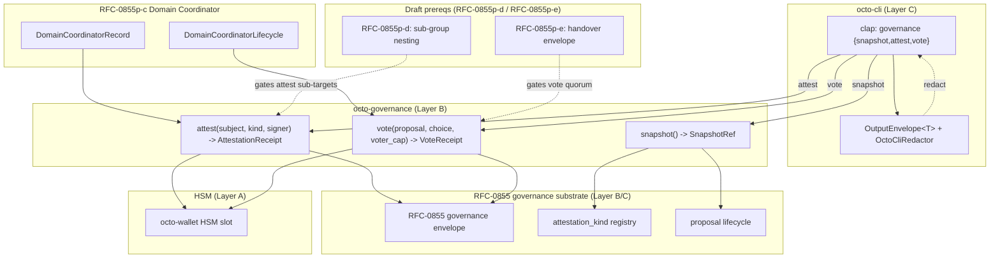
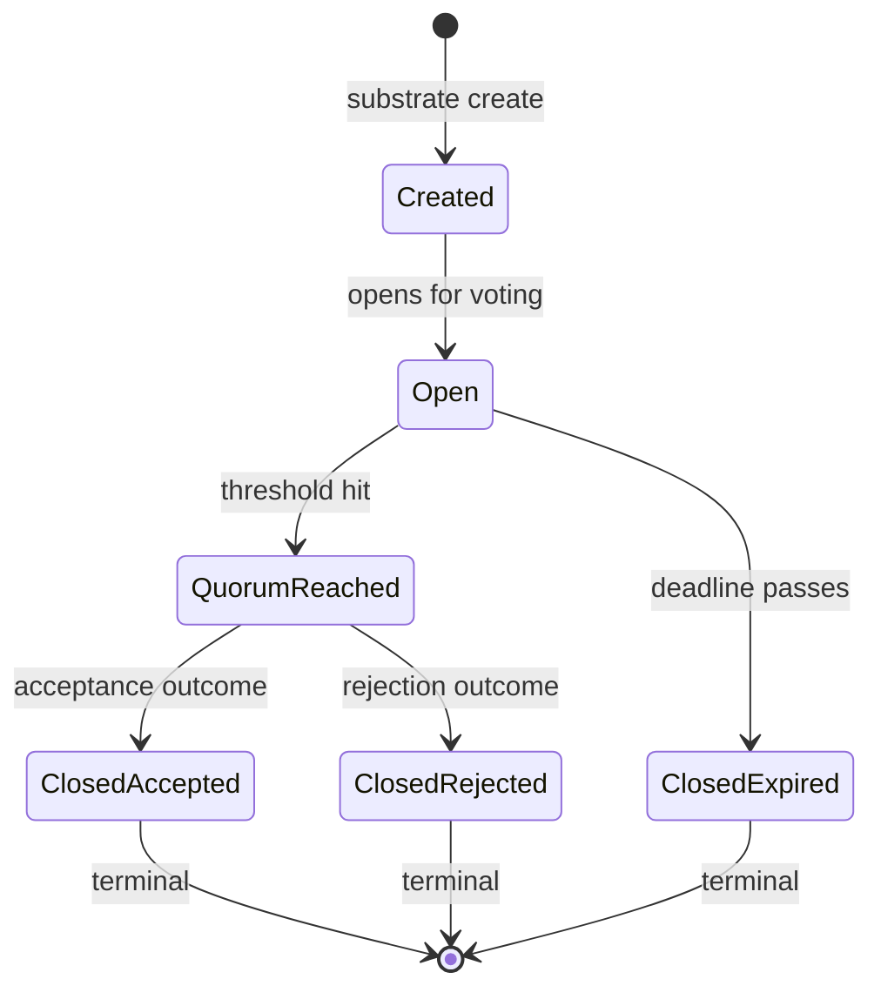
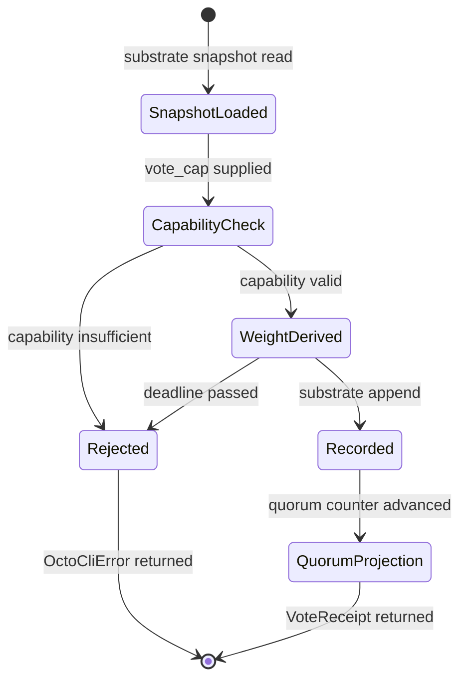

# RFC-0011-g: `octo governance` Subcommands

## Status

Accepted (2026-08-31)

> **Amendment chain:** This document is Phase 8 of the RFC-0011 amendment
> chain (the final amendment at the time of writing). The parent
> (RFC-0011) covers identity, capability, and policy subcommands.
> Follow-on amendments cover audit (RFC-0011-a), reputation
> (RFC-0011-b), agent lifecycle (RFC-0011-c), role provisioning
> (RFC-0011-d), vault operations (RFC-0011-e), mesh operations
> (RFC-0011-f), and **governance (RFC-0011-g, this document)**.

## Authors

- Authored by `@cipherocto` and `@mmacedoeu` per the amendment chain enumerated in RFC-0011 Status header (audit, reputation, agent lifecycle, role provisioning, vault operations, mesh operations, governance).

## Maintainers

- Maintainer: `@cipherocto` per the amendment chain enumerated in RFC-0011 Status header.

## Summary

This RFC defines the `octo governance` subcommand group for the `octo`
CLI: a local-snapshot refresh (`octo governance snapshot`), an
attestation issuer (`octo governance attest`), and a
governance-proposal voter (`octo governance vote`). All three
subcommands are thin Layer-C/D operator UX over the governance
substrate stack — primarily the mission overlay networks
governance envelope defined by RFC-0855, plus two Draft amendments
(RFC-0855p-d for sub-group nesting and RFC-0855p-e for the handover
request envelope used as the vote-quorum substrate transport).

`octo governance snapshot` refreshes a local, bounded-TTL governance
snapshot (10 minutes) that the CLI and downstream tooling consume
when computing attestation / vote admission decisions. It is the only
subcommand in this amendment that is **unblocked** at Draft time; it
depends only on RFC-0855 and the canonical RFC-0010
chain-ID substrate (Accepted).

`octo governance attest` issues a typed attestation against a subject
DID (e.g., "route-quality", "uptime-30d", "policy-conformance") and
appends it to the operator's append-only attestation ledger. The set
of attestation kinds is an **extension surface**: per
`cipherocto-design-principles.md` §Extension over enumeration, the
CLI does NOT enumerate attestation kinds; the operator passes
`--attestation-kind <kind_ref>` as a string, and the substrate
resolves the kind via its RFC-0855 attestation-kind registry.

`octo governance vote` casts a vote on an open governance proposal.
Votes are **capability-gated** per RFC-0011-d role provisioning —
the CLI binds the active identity's role stake to a vote-weight
computation at dispatch time, and the substrate verifies the
capability caveat set (RFC-0957) before recording the vote.

> **PARTIAL PREREQ CAVEAT:** RFC-0855p-d (sub-group nesting) and
> RFC-0855p-e (handover request envelope) are currently Draft. They
> are listed under §Dependencies as substrate prereqs but are NOT
> accepted at the time of this RFC filing. §Implementation Phases
> flags this with a two-phase plan: Phase 1 = `snapshot` (unblocked),
> Phase 2 = `attest` and `vote` (gated on RFC-0855p-d and RFC-0855p-e
> reaching Accepted). The CLI does not embed the partial prereq
> logic; it surfaces a structured `OctoCliError::PrereqNotAccepted`
> error for Phase 2 invocations until the gate clears.

## Dependencies

**Requires (substrate / CLI):**

- RFC-0011 — `octo` CLI Substrate (parent RFC; provides
  `OutputEnvelope<T>`, `OctoCliError`, `OctoCliRedactor`, clap tree,
  exit-code table, and confirmation-flag matrix)
- RFC-0855 — Mission Overlay Networks (governance envelope shape;
  attestation-kind registry; proposal lifecycle substrate)
- RFC-0855p-b — Coordinator Lifecycle (peer-as-coordinator gating for
  attestation signing authority — coordinator lifecycle is the
  canonical signatory for governance envelopes)
- RFC-0855p-c — Domain Coordinator Role (`DomainCoordinatorRecord`
  and `DomainCoordinatorLifecycle` — used for vote-weight derivation
  from role stake)
- RFC-0855p-d — Sub-Group Nesting — **Draft** (gates `attest` when
  the attestation target is a sub-group; not required for `snapshot`)
- RFC-0855p-e — Handover Request Envelope — **Draft** (gates `vote`
  quorum mechanics — the vote envelope is the handover request
  envelope applied to a proposal context; not required for `snapshot`)
- RFC-0010 — Canonical DID Codec (chain-ID namespace + canonical DID
  validation; required for all three subcommands)
- RFC-0008 — Deterministic AI Execution Boundary (execution class
  mapping rubric)

**Optional:**

- RFC-0957 — Macaroon Substrate (capability caveat gating for `vote`
  per RFC-0011-d role provisioning)
- RFC-0863 — General-Purpose Network Integration (`NodeTransport` for
  snapshot distribution; informational, governance substrate may use
  `NodeTransport::send_best` for proposal fan-out)
- RFC-0900 (and amendments) — Economic Substrate (`OCTO` sovereign
  token + role-token stake economics; informational)

> **Dependency Validation Rules:**
>
> 1. Dependencies MUST form a DAG (no cycles) — RFC-0011-g depends
>    upward only on substrate RFCs and the parent CLI RFC
> 2. All "Requires" RFCs that are Accepted MUST be listed as mission
>    prerequisites; Draft RFCs (RFC-0855p-d, RFC-0855p-e) MUST be
>    flagged in §Compatibility and §Implementation Phases
> 3. Optional dependencies MUST be documented separately from
>    required
> 4. No 2-cycle sibling required — RFC-0011-g is acyclic against
>    all required dependencies (DAG: RFC-0011 → RFC-0855 →
>    RFC-0855p-b / RFC-0855p-c; RFC-0855p-d → RFC-0855; RFC-0855p-e
>    → RFC-0855p-c; RFC-0010 → RFC-0855; RFC-0008 → RFC-0011)

## Design Goals

| Goal | Target                                  | Metric                                                                                                                                                                                                                                                                                                         |
| ---- | --------------------------------------- | -------------------------------------------------------------------------------------------------------------------------------------------------------------------------------------------------------------------------------------------------------------------------------------------------------------- |
| G1   | Snapshot freshness                      | `octo governance snapshot` returns a snapshot with `expires_at_unix > now_unix + 600` (10-minute TTL); UI surfaces `taken_at_unix` + remaining seconds                                                                                                                                                         |
| G2   | Attestation append-only                 | `octo governance attest` appends to the operator's attestation ledger; NO update / delete paths; `attestation_id` is content-addressed (BLAKE3-256)                                                                                                                                                            |
| G3   | Vote binding via capability             | `octo governance vote` requires a `vote` capability per RFC-0011-d; capability caveat set binds to `proposal_id` (RFC-0957 `Audience` caveat)                                                                                                                                                                  |
| G4   | Auditor read-only                       | `snapshot` available to Auditor; `attest` and `vote` denied (exit 2)                                                                                                                                                                                                                                           |
| G5   | No central enum for attestation kinds   | Operator passes `--attestation-kind <kind_ref>`; substrate resolves via RFC-0855 attestation-kind registry (TypedDiscriminator pattern)                                                                                                                                                                        |
| G6   | Layer B substrate + Layer C CLI binding | `octo-governance` is a Layer-B substrate crate (years-stable, additive `[ADD]` APIs); the CLI binding under `octo-cli governance` is Layer C. CLI binding does not modify existing Layer-B substrate code; declares `[ADD]` substrate APIs only (snapshot/attest/vote signatures); Layer-A stability preserved |

### Architectural Layers (Audit Table)

| Substrate fn / CLI binding / downstream type                                                       | Layer | Stability Tier                                                           | RFC mandate                                     |
| -------------------------------------------------------------------------------------------------- | ----- | ------------------------------------------------------------------------ | ----------------------------------------------- |
| `octo_governance::snapshot`                                                                        | B     | Years-stable, additive `[ADD]`                                           | RFC-0011-g §7.4 (Phase 1)                       |
| `octo_governance::attest`                                                                          | B     | Years-stable, additive `[ADD]`                                           | RFC-0011-g §7.4 (Phase 2; gated on RFC-0855p-d) |
| `octo_governance::vote`                                                                            | B     | Years-stable, additive `[ADD]`                                           | RFC-0011-g §7.4 (Phase 2; gated on RFC-0855p-e) |
| `OctoGovernanceSnapshotCache`                                                                      | B     | Years-stable interface; bounded LRU eviction policy may evolve           | RFC-0011-g §7.5                                 |
| `SnapshotOutput.remaining_seconds`                                                                 | C     | Substrate-facing field; future bumps possible (TTL semantics may evolve) | RFC-0011-g §7.3 / §7.4                          |
| `SnapshotRef.chain_id: Option<ChainId>` (`None` = all chains; Layer B owned by RFC-0855 substrate) | B     | Years-stable (substrate-owned field)                                     | RFC-0855 substrate                              |
| `SnapshotRef` (other fields) / `AttestationReceipt` / `VoteReceipt`                                | B     | Years-stable (substrate-owned types)                                     | RFC-0855 substrate                              |
| `octo-cli governance {snapshot,attest,vote}` subcommand handlers                                   | C     | Per-RFC (CLI binding)                                                    | RFC-0011-g §7.2                                 |
| `OutputEnvelope<SnapshotOutput \| AttestOutput \| VoteOutput>`                                     | C     | Per-RFC (CLI binding)                                                    | RFC-0011-g §7.3                                 |
| `OctoCliError::{SnapshotStale, VoteRejected, UnknownAttestationKind, PrereqNotAccepted}`           | C     | Per-RFC (CLI binding)                                                    | RFC-0011-g §7.9                                 |
| `OctoCliRedactor` governance-specific patterns (rationale; evidence bytes)                         | C     | Per-RFC (CLI binding)                                                    | RFC-0011-g §7.8                                 |
| BLAKE3-256 content addressing (`attestation_id`, `snapshot_id`, `vote_id`)                         | A     | RFC-frozen, semver-major only                                            | RFC-0855 substrate                              |
| Canonical DID codec (`<subject_did>`, `chain_id`)                                                  | A     | RFC-frozen, semver-major only                                            | RFC-0010                                        |
| HSM signing path (`octo-wallet::sign_envelope`)                                                    | A     | RFC-frozen, semver-major only                                            | RFC-0011 / RFC-0855                             |

The CLI binding (Layer C) declares `[ADD]` substrate APIs only; it
never modifies existing Layer-A or Layer-B code. Dependence direction
A → B → C is preserved.

## Motivation

Operators who run the `octo` CLI today (post-RFC-0011 Phase 1 through
Phase 7) can inspect identities, mint capabilities, read policies,
list vaults, and manage peers, but they **cannot participate in the
governance substrate** that RFC-0855 defines. Governance in
CipherOcto is twofold:

1. **Attestations** — append-only ledger entries that third parties
   (peers, auditors, mission coordinators) write about a subject
   DID. Examples: "peer `X` maintained 99.9% uptime over a 30-day
   window", "vault `Y` met policy conformance for Q3", "sub-group `Z`
   completed sub-task `BIND:legal-review`". Attestations drive the
   reputation substrate (consumed by RFC-0011-b Phase 3 amendment)
   and are the primary input to RFC-0855p-c Domain Coordinator
   promotion.

2. **Votes** — role-stake-weighted decisions on governance proposals.
   Proposals adjust protocol parameters (slashing thresholds,
   attestation-kind registration, role-stake minima) or recognize /
   remove Domain Coordinators. Each vote binds a `voter_cap` capability
   to a `proposal_id`; the capability caveat set includes an `Audience`
   caveat pinning the voter to the proposal context (per RFC-0957
   §Attenuation Invariant).

The governance substrate (`octo-governance` Layer B substrate
crate containing RFC-0855 envelope wrappers + RFC-0855p-c coordinator
lifecycle + Draft RFC-0855p-d + Draft RFC-0855p-e) has all the
machinery. What it lacks is operator UX: an audited CLI surface that
the operator can drive from a workstation. Without a CLI:

- Attestations require hand-rolling RFC-0855 envelopes — operators
  skip them entirely.
- Votes require substrate RPC direct — operators do not vote.
- Snapshots require UI-layer work — auditors cannot verify
  governance state without substrate log scrapes.

This RFC closes that gap with three subcommands and explicit
two-phase implementation.

## Roles and Authorities

> **The "Nothing should be implied" rule (specification layer):**
> Every actor that affects correctness, security, accountability, or
> consensus MUST be named. Cross-reference: BLUEPRINT.md "Human vs
> Agent Roles" table.

### Roles

| Role            | Identifier                         | Authority Scope (this RFC)                                                                                          | Lifecycle                          | Source/Ref                                                                                     |
| --------------- | ---------------------------------- | ------------------------------------------------------------------------------------------------------------------- | ---------------------------------- | ---------------------------------------------------------------------------------------------- |
| Operator        | Active local DID                   | Run `octo governance {snapshot,attest,vote}`                                                                        | `Active` (per RFC-0009)            | RFC-0009                                                                                       |
| Auditor         | Read-only DID (separate identity)  | Run `octo governance snapshot` only                                                                                 | `Active` (read-only role)          | RFC-0011 §Roles                                                                                |
| Governance      | RFC-0855 coordinator role DID      | Source of governance envelopes (RFC-0855 §11 Governance Models); CLI delegates to it without surfacing its identity | RFC-0855p-b §Coordinator Lifecycle | RFC-0855p-b                                                                                    |
| Vote Substrate  | `octo-governance` Layer B          | Authoritative `vote` substrate (validates capability, derives weight from role stake)                               | Stateless service boundary         | RFC-0855, RFC-0855p-c                                                                          |
| Attestation Log | `octo-governance::attestation_log` | Append-only ledger for attestations (Layer B; content-addressed entries)                                            | `Cumulative` (no truncation)       | RFC-0855 §Attestation Log (forward ref — pending RFC-0855 governance amendment); this RFC §7.4 |
| Snapshot Cache  | `OctoGovernanceSnapshotCache`      | Caches `(chain_id, snapshot_ref)` projected governance state with bounded TTL                                       | `Epoch-bounded` (TTL = 600s)       | This RFC §7.5                                                                                  |

### Authorities

| Authority             | Granting Role                                                       | Scope                                              | Expiry                         | Audit                                                |
| --------------------- | ------------------------------------------------------------------- | -------------------------------------------------- | ------------------------------ | ---------------------------------------------------- |
| `governance.snapshot` | Active DID (no further grant)                                       | Read                                               | Operator session               | Per-call substrate trace + `OctoCliRedactor` log     |
| `governance.attest`   | Active DID **AND** RFC-0855p-b coordinator lifecycle `Active` state | Write (mutating; signed)                           | Attestation append (immutable) | Substrate trace + signed attestation envelope        |
| `governance.vote`     | Active DID **AND** provisioned `vote` capability (RFC-0011-d)       | Write (mutating; capability-gated; quorum-counted) | Capability caveats             | Substrate trace + capability envelope + vote receipt |

### Role Transitions

| From     | To       | Trigger                                                      | Deterministic? | Side Effects                                                        | Signing                      |
| -------- | -------- | ------------------------------------------------------------ | -------------- | ------------------------------------------------------------------- | ---------------------------- |
| Auditor  | Operator | Capability mint per RFC-0011-d (vote capability provisioned) | Yes            | `governance.vote` becomes invocable                                 | RFC-0957 capability envelope |
| Operator | Auditor  | Capability revoke                                            | Yes            | `governance.attest` and `governance.vote` revert to denied (exit 2) | Revoke envelope              |

### Out-of-scope Roles

- **Proposal creator** — proposing a new vote (creating the
  `proposal_id` payload) is a separate substrate operation (not in
  this RFC). This RFC exposes `vote` (consume) only; proposal
  creation lives in a follow-on amendment.
- **Slashing authority** — invoking slash flows on misbehaving
  coordinators is the substrate's responsibility (RFC-0855p-c §6).
  The CLI's `vote` is decision input, not slash invocation.
- **Treasury / role-stake mutator** — stake rebalancing is
  economic substrate (RFC-0900 series) and lives outside this RFC.

> The out-of-scope statements above are named responsibility
> transfers. Anything not listed here MUST appear in the Implicit
> Assumptions Audit.

## Specification

### System Architecture



The CLI is a thin orchestrator. It parses, presents, redacts, and
forwards. **All authoritative state lives in substrate.** The CLI
never holds a private key.

### Subcommand Taxonomy

#### `octo governance snapshot`

| Property   | Value                                     |
| ---------- | ----------------------------------------- |
| Mutating?  | No                                        |
| Confirms?  | No                                        |
| Reads HSM? | No                                        |
| Network?   | Local substrate + cache layer (read-only) |

| Flag                       | Type              | Default | Description                                                                                                                                  |
| -------------------------- | ----------------- | ------- | -------------------------------------------------------------------------------------------------------------------------------------------- |
| `--chain-id <chain-id>`    | `Option<ChainId>` | All     | Filter to a single chain; parses per RFC-0010 canonical form                                                                                 |
| `--proposal-state <state>` | `Option<String>`  | All     | Filter to one proposal state (`Open` \| `Quorum-Reached` \| `Closed-Accepted` \| `Closed-Rejected` \| `Closed-Expired` — RFC-0855 lifecycle) |
| `--force-refresh`          | `bool`            | `false` | Bypass `SnapshotRef` cache; force substrate re-fetch                                                                                         |
| `--json`                   | `bool`            | `false` | Force machine-readable JSON output (per RFC-0011 §Output Envelope)                                                                           |

Substrate call: `octo_governance::snapshot(chain_id: Option<&ChainId>, proposal_filter: Option<&ProposalFilter>, force_refresh: bool) -> Result<SnapshotRef, GovernanceError>`.
`SnapshotRef` carries the substrate-projected governance state for the
operator's active DID over the union of `(chain_id, proposal_filter)`
matching the filters.

Output envelope: `OutputEnvelope<SnapshotOutput>` where
`SnapshotOutput { snapshot: SnapshotRef, open_proposals: Vec<ProposalSummary>, attestation_count: u64, resolved_at_unix: u64, remaining_seconds: u64 }`.

> **Snapshot TTL:** `SnapshotRef.expires_at_unix` is set to
> `now_unix + 600` (10 minutes) at substrate snapshot time. The CLI
> surfaces `remaining_seconds = expires_at_unix - now_unix` in
> `SnapshotOutput` so downstream tooling (e.g., `octo reputation show`
> per RFC-0011-b) can decide whether the snapshot is fresh enough to
> consume.
>
> **TTL boundary inclusivity:** the TTL boundary is inclusive on the
> stale side — a snapshot at exactly `now_unix == expires_at_unix` is
> rejected by the substrate (FAILS CLOSED; the substrate enforces
> `expires_at_unix > now_unix` strict inequality, not `>=`).
> `remaining_seconds = 0` is the threshold; supplying such a
> snapshot via `--snapshot-id` requires `--allow-stale` (see §Error
> Handling and §Security Considerations).

#### `octo governance attest <subject_did> <attestation_kind>`

| Property   | Value                                            |
| ---------- | ------------------------------------------------ |
| Mutating?  | **Yes** (append-only ledger write; immutable)    |
| Confirms?  | **Yes** (per RFC-0011 §Confirmation Flag Matrix) |
| Reads HSM? | **Yes** (signing the attestation envelope)       |
| Network?   | Local substrate (RFC-0855 envelope, append-only) |

| Arg                  | Type                | Description                                                                                                           |
| -------------------- | ------------------- | --------------------------------------------------------------------------------------------------------------------- |
| `<subject_did>`      | `Did` (required)    | Subject of the attestation (RFC-0010 canonical wire form); may be a peer DID, sub-group DID, or vault owner           |
| `<attestation_kind>` | `String` (required) | Attestation kind reference; resolved via RFC-0855 attestation-kind registry (TypedDiscriminator — NOT a central enum) |

| Flag                      | Type              | Default | Description                                                                                                                                                                                                                                                                                                                                                                                                                                                                                                                                         |
| ------------------------- | ----------------- | ------- | --------------------------------------------------------------------------------------------------------------------------------------------------------------------------------------------------------------------------------------------------------------------------------------------------------------------------------------------------------------------------------------------------------------------------------------------------------------------------------------------------------------------------------------------------- |
| `--snapshot-id <hex32>`   | `Option<Hex32>`   | None    | Snapshot ID bound to this attestation; substrate FAILS CLOSED on stale `--snapshot-id` (TTL per G1 = 600s); required for explicit stale override                                                                                                                                                                                                                                                                                                                                                                                                    |
| `--evidence <path>`       | `Option<PathBuf>` | None    | Optional evidence file (JSON); substrate parses against the kind's evidence schema                                                                                                                                                                                                                                                                                                                                                                                                                                                                  |
| `--evidence-hash <hex32>` | `Option<Hex32>`   | None    | Pre-computed BLAKE3-256 of evidence file (skips re-hashing); substrate verifies on append                                                                                                                                                                                                                                                                                                                                                                                                                                                           |
| `--expires-at-unix <u64>` | `Option<u64>`     | None    | Optional attestation expiry; substrate records `null` if absent (no expiry)                                                                                                                                                                                                                                                                                                                                                                                                                                                                         |
| `--allow-stale`           | `bool`            | `false` | Operator override: allow the operation to proceed against a stale `--snapshot-id` (substrate records the stale `snapshot_id` with an `overrode_staleness_at_unix` audit field); **REQUIRES `--snapshot-id`** — meaningless without an explicit snapshot to override (TV-20: `--allow-stale` without `--snapshot-id` → `InvalidArgument` exit 2); **REQUIRES `--confirm-acknowledge`** — CLI rejects `--allow-stale` without two-step intent (defense in depth against accidental override; fail-closed snapshot gating cannot be bypassed silently) |
| `--confirm-acknowledge`   | `bool`            | `false` | Two-step gate per RFC-0011 §Confirmation Flag Matrix                                                                                                                                                                                                                                                                                                                                                                                                                                                                                                |
| `--dry-run`               | `bool`            | `false` | Build the envelope, return substrate-validated preview WITHOUT appending                                                                                                                                                                                                                                                                                                                                                                                                                                                                            |
| `--json`                  | `bool`            | `false` | Force machine-readable JSON output                                                                                                                                                                                                                                                                                                                                                                                                                                                                                                                  |

Substrate call:
`octo_governance::attest(subject_did: &Did, kind_ref: &str, evidence: Option<&[u8]>, evidence_hash: Option<[u8; 32]>, expires_at_unix: Option<u64>, snapshot_id: Option<&[u8; 32]>, allow_stale: bool, signer: &dyn CapabilitySigner) -> Result<AttestationReceipt, GovernanceError>`.
The substrate coordinates HSM signing via `octo-wallet`; the CLI never
holds private-key material.

Output envelope: `OutputEnvelope<AttestOutput>` where
`AttestOutput { receipt: AttestationReceipt, attestation_id: Hex32, content_hash: Hex32, appended_at_unix: u64 }`.

> **PREREQ GATE (RFC-0855p-d):** Substrate enforcing attestation
> against a sub-group DID requires RFC-0855p-d (sub-group nesting)
> acceptance. Until RFC-0855p-d is Accepted, the CLI surfaces
> `OctoCliError::PrereqNotAccepted` (exit code 38; see §Error
> Handling) when `<subject_did>` resolves to a sub-group DID via
> the substrate's domain resolver. Attestations against peer DIDs
> and vault-owner DIDs are unblocked (gated only by RFC-0855 base).

#### `octo governance vote <proposal_id> <vote_choice>`

| Property   | Value                                                         |
| ---------- | ------------------------------------------------------------- |
| Mutating?  | **Yes** (quorum-counted; capability-gated)                    |
| Confirms?  | **Yes** (per RFC-0011 §Confirmation Flag Matrix)              |
| Reads HSM? | **Yes** (capability signature binding)                        |
| Network?   | Local substrate + governance substrate (mutating; broadcasts) |

| Arg             | Type                | Description                                                                                                                                           |
| --------------- | ------------------- | ----------------------------------------------------------------------------------------------------------------------------------------------------- |
| `<proposal_id>` | `Hex32` (required)  | Proposal identifier (BLAKE3-256 of canonical proposal payload per RFC-0855 §Proposal Lifecycle (forward ref — pending RFC-0855 governance amendment)) |
| `<vote_choice>` | `String` (required) | Substrate-recognized choice string (`Yes` \| `No` \| `Abstain` per RFC-0855; new choices land via RFC-0855 amendment, NOT a CLI change)               |

| Flag                    | Type               | Default | Description                                                                                                                                                                                                                                                                                                                                                                                                                                                                                                                                           |
| ----------------------- | ------------------ | ------- | ----------------------------------------------------------------------------------------------------------------------------------------------------------------------------------------------------------------------------------------------------------------------------------------------------------------------------------------------------------------------------------------------------------------------------------------------------------------------------------------------------------------------------------------------------- |
| `--rationale <text>`    | `Option<String>`   | None    | Free-text rationale (optional); substrate records verbatim in the proposal audit log                                                                                                                                                                                                                                                                                                                                                                                                                                                                  |
| `--vote-cap <cap_id>`   | `Hex32` (required) | —       | Capability token ID (per RFC-0957) authorizing the vote; substrate verifies caveat set                                                                                                                                                                                                                                                                                                                                                                                                                                                                |
| `--snapshot-id <hex32>` | `Option<Hex32>`    | None    | Snapshot ID bound to this vote; substrate FAILS CLOSED unless the snapshot's `expires_at_unix > now_unix` (TTL per G1 = 600s); required for staleness gating                                                                                                                                                                                                                                                                                                                                                                                          |
| `--allow-stale`         | `bool`             | `false` | Operator override: allow the vote to proceed against a stale `--snapshot_id` (substrate records the stale `snapshot_id` with an `overrode_staleness_at_unix` audit field); **REQUIRES `--snapshot-id`** — meaningless without an explicit snapshot to override (TV-20 parity: `--allow-stale` without `--snapshot-id` → `InvalidArgument` exit 2); **REQUIRES `--confirm-acknowledge`** — CLI rejects `--allow-stale` without two-step intent (defense in depth against accidental override; fail-closed snapshot gating cannot be bypassed silently) |
| `--confirm-acknowledge` | `bool`             | `false` | Two-step gate per RFC-0011 §Confirmation Flag Matrix                                                                                                                                                                                                                                                                                                                                                                                                                                                                                                  |
| `--dry-run`             | `bool`             | `false` | Build the envelope, return substrate-validated preview WITHOUT recording                                                                                                                                                                                                                                                                                                                                                                                                                                                                              |
| `--json`                | `bool`             | `false` | Force machine-readable JSON output                                                                                                                                                                                                                                                                                                                                                                                                                                                                                                                    |

Substrate call:
`octo_governance::vote(proposal_id: &[u8;32], choice: &str, voter_cap: &CapabilityToken, rationale: Option<&str>, snapshot_id: Option<&[u8; 32]>, allow_stale: bool) -> Result<VoteReceipt, GovernanceError>`.
The substrate verifies the `voter_cap` capability per RFC-0957 §Algorithms
(verify algorithm) + RFC-0957 §Attenuation Invariant (caveat monotonicity)
(caveat set: `Audience(proposal_id)` AND `Before(proposal_state="Open" deadline)` AND
`Provider(vec![active_did_role_providers])`); weight is derived from
role stake per RFC-0855p-c.

Output envelope: `OutputEnvelope<VoteOutput>` where
`VoteOutput { receipt: VoteReceipt, vote_id: Hex32, weight_applied: u64, current_quorum_weight: u64, quorum_threshold: u64, recorded_at_unix: u64 }`.

> **PREREQ GATE (RFC-0855p-e):** The vote-quorum envelope shape is
> RFC-0855p-e (handover request envelope applied to the proposal
> context). Until RFC-0855p-e is Accepted, the CLI surfaces
> `OctoCliError::PrereqNotAccepted` (exit code 38) when invoked,
> regardless of capability status. The capability gating layer
> remains in place; only the quorum-envelope substrate is gated.

### Output Envelope

All three subcommands wrap their payload in the canonical envelope
from RFC-0011 §Output Envelope:

```rust
// `OutputEnvelope<T>` is imported verbatim from RFC-0011 §Output
// Envelope. Do NOT redeclare locally — per CLAUDE.md §Architectural
// Principles "No parallel abstractions" (mirrors the RFC-0011-a /
// RFC-0011-b / RFC-0011-d amendment pattern). For RFC-0011-g:
// `schema_version = 6`,
// `command = "octo governance {snapshot,attest,vote}"`.

#[derive(Serialize, Deserialize)]
pub struct SnapshotOutput {
    pub snapshot: SnapshotRef,
    pub open_proposals: Vec<ProposalSummary>,
    pub attestation_count: u64,
    pub resolved_at_unix: u64,
    pub remaining_seconds: u64, // SnapshotRef.expires_at_unix - resolved_at_unix (substrate-deterministic; per §Snapshot TTL)
}

#[derive(Serialize, Deserialize)]
pub struct AttestOutput {
    pub receipt: AttestationReceipt,
    pub attestation_id: Hex32,
    pub content_hash: Hex32,
    pub appended_at_unix: u64,
}

#[derive(Serialize, Deserialize)]
pub struct VoteOutput {
    pub receipt: VoteReceipt,
    pub vote_id: Hex32,
    pub weight_applied: u64,
    pub current_quorum_weight: u64,
    pub quorum_threshold: u64,
    pub recorded_at_unix: u64,
}
```

The envelope is TTY-aware per RFC-0011 §Output Envelope: pretty table
on TTY, JSON when stdout is not a TTY OR `--json` is set. The
`--json` flag overrides TTY detection (parity with `octo vault list`
per RFC-0011-e and `octo mesh peer list` per RFC-0011-f).

### Substrate `[ADD]` Signatures

This RFC depends on the following substrate additions (Layer B;
`crates/octo-governance/src/lib.rs`); the CLI binding (`octo-cli
governance` subcommands) is Layer C — see §System Architecture
for the dependency direction.

```rust
// [ADD] RFC-0011-g §7.4 — snapshot
pub fn snapshot(
    chain_id: Option<&ChainId>,
    proposal_filter: Option<&ProposalFilter>,
    force_refresh: bool,
) -> Result<SnapshotRef, GovernanceError>;

// [ADD] RFC-0011-g §7.4 — attest
pub fn attest(
    subject_did: &Did,
    kind_ref: &str,
    evidence: Option<&[u8]>,
    evidence_hash: Option<[u8; 32]>,
    expires_at_unix: Option<u64>,
    snapshot_id: Option<&[u8; 32]>,
    allow_stale: bool,
    signer: &dyn CapabilitySigner,
) -> Result<AttestationReceipt, GovernanceError>;

// [ADD] RFC-0011-g §7.4 — vote
pub fn vote(
    proposal_id: &[u8; 32],
    choice: &str,
    voter_cap: &CapabilityToken,
    rationale: Option<&str>,
    snapshot_id: Option<&[u8; 32]>,
    allow_stale: bool,
) -> Result<VoteReceipt, GovernanceError>;
```

`octo_governance::snapshot` reads the governance envelope log
(`governance_envelopes` table in the substrate's persistence layer;
PK `(chain_id, envelope_id)` per RFC-0862 §Data Structures) and
projects open proposals, attestations, and quorum state through
`OctoGovernanceSnapshotCache` (LRU + 600s TTL). The cache key is
`(chain_id, operator_did)`.

`octo_governance::attest` validates `kind_ref` against the RFC-0855
attestation-kind registry (TypedDiscriminator pattern — see §7.6);
signs the envelope via `octo-wallet::sign_envelope` (HSM-bound);
appends to `attestation_log` (append-only; PK `attestation_id =
BLAKE3-256(canonical_ser(envelope))`).

`octo_governance::vote` verifies `voter_cap` capability per RFC-0957;
loads the proposal state from `governance_envelopes`; computes
`weight_applied` from RFC-0855p-c role-stake derivation (coordinator
stake at proposal snapshot time); appends the vote to the
proposal's vote ledger (immutable per-vote; PK `(proposal_id,
voter_did)`).

### Snapshot Ref

`SnapshotRef` is the substrate-projected governance state pointer
exposed by `octo governance snapshot`:

```rust
#[derive(Serialize, Deserialize)]
pub struct SnapshotRef {
    pub snapshot_id: Hex32,             // BLAKE3-256 of canonical_ser(projection)
    pub chain_id: Option<ChainId>,      // canonical form (RFC-0010); `None` = all chains
    pub taken_at_unix: u64,             // substrate snapshot time (NOT wall-clock)
    pub expires_at_unix: u64,           // = taken_at_unix + 600s (per G1)
    pub root_manifest_hash: Hex32,      // BLAKE3-256 of open_proposals + attestation_count + quorum state
}
```

`SnapshotRef.snapshot_id` is content-addressed; identical governance
state across calls produces identical `snapshot_id`. Operators can
pin a `snapshot_id` for downstream tooling (e.g., reputation queries
per RFC-0011-b MAY require a known-fresh `snapshot_id` to prevent
reorg drift across calls).

> **Chain ID cross-ref:** `chain_id` here is the canonical chain
> identifier from RFC-0010 §Canonical DID Codec; it shares the
> namespace with the `ChainId` of RFC-0010 (registry authority) and
> is distinct from `domain_id` (RFC-0855 mission overlay). The CLI
> never compares chain IDs without canonicalization.

### Attestation Kind Resolution

`octo_governance::attest` accepts `--attestation-kind <kind_ref>` as
a string. The substrate resolves `kind_ref` via the RFC-0855
**attestation-kind registry** (TypedDiscriminator pattern per
`cipherocto-design-principles.md` §Extension over enumeration).

| Aspect                   | Value                                                                                                                                                                                                                                                                                                                                                                                           |
| ------------------------ | ----------------------------------------------------------------------------------------------------------------------------------------------------------------------------------------------------------------------------------------------------------------------------------------------------------------------------------------------------------------------------------------------- |
| Wire form                | `kind_ref = "<namespace>:<discriminator>"` (e.g., `route-quality:uptime-30d` per RFC-0855 §Sample Kinds (forward ref — pending RFC-0855 governance amendment); user extensions use `ext:<user-namespace>:<user-discriminator>` per RFC-0855 §Extension Surface (forward ref — pending RFC-0855 governance amendment))                                                                           |
| Resolution               | Substrate looks up `kind_ref` in `attestation_kind_registry: BTreeMap<String, AttestationKindDescriptor>`                                                                                                                                                                                                                                                                                       |
| Unknown kind behavior    | Substrate rejects with `GovernanceError::UnknownAttestationKind { kind_ref }`; CLI maps to `OctoCliError::UnknownAttestationKind` (exit 37) per §Error Handling. Sub-group DID overlap (when `<subject_did>` resolves to a sub-group DID and RFC-0855p-d is still Draft) maps to a separate `OctoCliError::PrereqNotAccepted` (exit 38) — the two errors are distinct and surface independently |
| New kind registration    | RFC-amendment to RFC-0855 §Attestation Kinds (forward ref — pending RFC-0855 governance amendment) OR user-extension registration via `attestation_kind_registry.register(kind_ref, descriptor)` per RFC-0855 §User Extensions (forward ref — pending RFC-0855 governance amendment)                                                                                                            |
| Evidence schema          | Each `AttestationKindDescriptor` carries an `evidence_schema: EvidenceSchema`; substrate validates `evidence` JSON against the schema before append                                                                                                                                                                                                                                             |
| Discriminator uniqueness | Discriminator is a 128-bit UUIDv5 (RFC-0855 §Sample Kinds (forward ref — pending RFC-0855 governance amendment)) — extension kinds share the 128-bit UUID space; collisions rejected at register time                                                                                                                                                                                           |

> **No central enum:** the CLI does NOT enumerate attestation kinds
> in source. New kinds land via RFC-0855 amendment (substrate registry
> update + sample descriptor) OR user-extension registration at
> runtime. The CLI passes `kind_ref` through verbatim. This preserves
> CLAUDE.md §Architectural Principles "Extension over enumeration".

### Vote Capability Gating

`octo_governance::vote` requires a `voter_cap` capability token whose
caveat set binds the vote to the proposal context per RFC-0957
§Attenuation Invariant:

| Caveat                  | Form (per RFC-0957 §Caveat DSL Extension)                        | Source / Rationale                                                                                                                                                                 |
| ----------------------- | ---------------------------------------------------------------- | ---------------------------------------------------------------------------------------------------------------------------------------------------------------------------------- |
| `Audience(proposal_id)` | `{ "type": "audience", "value": "<proposal_id>" }`               | Bounds the capability to a single proposal; substrate rejects re-use across proposals (CLI exit 36 envelopes-equivalent via `VoteRejected`)                                        |
| `Before(deadline_unix)` | `{ "type": "before", "value": <proposal_open_deadline> }`        | Bounds the capability to the proposal open-window; substrate rejects votes after deadline (per RFC-0855 §Proposal Lifecycle (forward ref — pending RFC-0855 governance amendment)) |
| `Provider(active_role)` | `{ "type": "provider", "value": [ <active_provider_id>, ... ] }` | Bounds the capability to the operator's active role providers (per RFC-0855p-c Domain Coordinator registry)                                                                        |

The CLI does NOT construct the capability — the operator mints a
`vote` capability per RFC-0011-d (`octo role provision --cap vote
--proposal <proposal_id> --deadline <unix>`); the CLI accepts the
minted capability via `--vote-cap <cap_id>` and forwards to the
substrate for verification.

> **Weight derivation:** `weight_applied` derives from the operator's
> role stake per RFC-0855p-c §2 DomainCoordinatorRecord (stake fields
> in `CoordinatorRecord.octo_o_stake_locked` etc.). The CLI does NOT
> compute weight — the substrate returns it as part of `VoteReceipt`.

### Redaction

Per RFC-0011 §Redaction Layer, the `OctoCliRedactor` applies the same
patterns to `octo governance` output as to other subcommands:

| Field                                 | Redaction Pattern                                                                                                                                   |
| ------------------------------------- | --------------------------------------------------------------------------------------------------------------------------------------------------- |
| `snapshot_id` (BLAKE3-256 digest)     | Full (not redacted; public identifier for downstream tooling)                                                                                       |
| `attestation_id` (BLAKE3-256 digest)  | Full (not redacted; public content address)                                                                                                         |
| `content_hash` (BLAKE3-256 of body)   | Full (not redacted; integrity-verifier)                                                                                                             |
| `vote_id` (BLAKE3-256 of envelope)    | Full (not redacted; public receipt identifier)                                                                                                      |
| `weight_applied`                      | Full (not redacted; public on chain)                                                                                                                |
| `quorum_threshold`                    | Full (not redacted; public per RFC-0855 §Proposal Lifecycle (forward ref — pending RFC-0855 governance amendment))                                  |
| `--rationale` (vote)                  | Free-text rationale: redacted in stderr/log; full in JSON payload                                                                                   |
| `<subject_did>`                       | Full unless subject != active DID (then truncated to `did:octo:z<first8>...`)                                                                       |
| `<evidence>` bytes                    | Bytes NEVER echoed in logs; only `evidence_hash` (BLAKE3-256) appears in output                                                                     |
| `--evidence-hash` (operator-supplied) | Full (operator-supplied; verified against substrate-computed hash)                                                                                  |
| `<attestation_kind>` positional arg   | Operator-typed (not redacted in stderr/log; full `kind_ref` echoed on confirm prompt; substrate sees verbatim); example: `route-quality:uptime-30d` |
| `<vote_choice>` positional arg        | Operator-typed (not redacted in stderr/log; full choice echoed on confirm prompt; substrate sees verbatim); example: `Yes`                          |

> **Rationale redaction parity:** rationale is operator-intended and
> chain-public (recorded verbatim in the proposal audit log), but
> the CLI redacts it in stderr/log to avoid accidental disclosure
> when an operator pipes output through a log file. The JSON
> envelope includes the rationale verbatim (operators using the CLI
> scripted understand the exposure).
>
> **WARNING: rationale is chain-public; do not pipe `--json` output to shared log files.** The JSON envelope carries the rationale verbatim (per `OctoCliRedactor` governance-specific pattern). Piping `--json` through `tee` (`octo governance vote ... --json | tee log.json`) leaks rationale to wherever `log.json` is stored. Operators scripting votes MUST treat the JSON output as chain-public — route it to a private log file (mode 0600) or process substitution that does not survive the session. Shared log files, CI artifacts, and shell history that retains pipe destinations are all disclosure surfaces.

### RFC-0008 Execution Class Mapping

| Operation                       | Class | Rationale                                                                                                                                                                     |
| ------------------------------- | ----- | ----------------------------------------------------------------------------------------------------------------------------------------------------------------------------- |
| `octo governance snapshot`      | C     | Read-only; substrate re-reads governance envelope log through cache; no consensus impact                                                                                      |
| `octo governance attest`        | B     | **Consensus-impacting append** — attestations modify the governance substrate's append-only ledger; consumed by RFC-0855p-c coordinator promotion; substrate is authoritative |
| `octo governance vote`          | B     | **Consensus-impacting quorum** — votes modify proposal state; substrate verifies capability, derives weight, and advances quorum counter                                      |
| Output envelope rendering (all) | A     | Deterministic JSON serialization (inherited from RFC-0011 §Determinism Requirements)                                                                                          |
| Redaction layer (all)           | A     | Deterministic pattern matching (inherited from RFC-0011 §Determinism Requirements)                                                                                            |

`snapshot` is Class C despite touching governance state because the
snapshot is **projective and bounded** (no consensus-shared value is
written); it is equivalent to a read with a TTL. `attest` and `vote`
are Class B because each operation appends to a substrate-shared
ledger that downstream consumers (RFC-0011-b reputation) and quorum
counters rely upon.

### Error Handling

New `OctoCliError` variants (additive; non-breaking — new variants
are non-breaking per RFC-0011 §Error Handling):

| Variant                                               | Exit Code | Trigger                                                                                                                                                                                                                                           |
| ----------------------------------------------------- | --------- | ------------------------------------------------------------------------------------------------------------------------------------------------------------------------------------------------------------------------------------------------- |
| `SnapshotStale { snapshot_id: Hex32, age_secs: u64 }` | 35        | `vote` or `attest` invoked with `--snapshot-id` older than TTL (600s); substrate FAILS CLOSED; operator MUST supply `--allow-stale` to record the operation against a stale snapshot (substrate records `overrode_staleness_at_unix` audit field) |
| `VoteRejected { detail: String }`                     | 36        | `vote` rejected by substrate (capability insufficient, after deadline, etc.)                                                                                                                                                                      |
| `UnknownAttestationKind { kind_ref: String }`         | 37        | `--attestation-kind` not in RFC-0855 attestation-kind registry                                                                                                                                                                                    |
| `PrereqNotAccepted { rfc_ref: String }`               | 38        | Substrate prereq (RFC-0855p-d / RFC-0855p-e) not yet Accepted — surfaces Phase 2 gate                                                                                                                                                             |

Exit codes 35–38 are in the **17–63 reserved range** per RFC-0011
§Exit Codes; they do not collide with the parent's codes (`ClapParse`=2,
`AlreadyRevoked`=6, `InvalidFilter`=16) or with RFC-0011-e codes
(`VaultNotOwned`=23, `RoleNotProvisioned`=25) or with the RFC-0011-f
mesh codes (per RFC-0011-f §Exit Codes: `MeshIdentityUnknown`=27,
`InvalidTtlHops` / `InvalidEndpointScheme`=28,
`MeshCapabilityInsufficient`=29, `EnvelopeAuthorizationFailed` /
`RpcTimeout`=30, `MeshMethodUnknown`=31).

> **No-flag default behavior:** If neither `--snapshot-id` nor
> `--allow-stale` is supplied on `attest` or `vote`, the substrate
> binds the operation to the **current (now) snapshot** — no
> staleness check applies because the snapshot is implicit and
> fresh by definition. The substrate records the implicit snapshot
> in the receipt (`snapshot_id: <substrate-fresh-snapshot-id>`).
> This is the default for scripted / unattended operator use; an
> explicit stale override requires both `--allow-stale` AND
> `--confirm-acknowledge` per the §Subcommand Taxonomy entries.

> The four variants are added to the `#[non_exhaustive] OctoCliError`
> enum (already non-exhaustive per RFC-0011). Downstream consumers
> that pattern-match without a wildcard arm are unaffected because
> the variants are NEW, not modified.

### Determinism Requirements

`octo governance snapshot` MUST produce deterministic output for
identical substrate state at identical substrate timestamps. The CLI
never adds wall-clock-derived ordering; the substrate returns
proposals in `(chain_id, proposal_id)` lexicographic order.

`octo governance attest` and `octo governance vote` are **not**
deterministic — they include `appended_at_unix` and `recorded_at_unix`
in the output envelope, which is wall-clock-derived by substrate at
append time. This is acceptable for mutating operations that do
participate in consensus (Class B per §RFC-0008 Execution Class
Mapping).

## Performance Targets

| Metric                                       | Target   | Notes                                                                                                                                                                |
| -------------------------------------------- | -------- | -------------------------------------------------------------------------------------------------------------------------------------------------------------------- |
| `governance snapshot` cache-hit              | `<100ms` | Per `(chain_id, operator_did)` cache lookup                                                                                                                          |
| `governance snapshot` cache-miss             | `<2s`    | Re-projection over `governance_envelopes`                                                                                                                            |
| `governance snapshot --force-refresh`        | `<2s`    | Same path as cache-miss (bypasses cache)                                                                                                                             |
| `governance attest` build-time               | `<500ms` | HSM envelope build + substrate kind-registry lookup                                                                                                                  |
| `governance attest` append                   | `<1s`    | Substrate append to `attestation_log` + projection refresh                                                                                                           |
| `governance vote` build-time                 | `<500ms` | Capability verify + proposal state load                                                                                                                              |
| `governance vote` record                     | `<1s`    | Substrate vote append + quorum projection refresh                                                                                                                    |
| `governance attest --allow-stale` build-time | `<500ms` | Same path as non-allow-stale; CLI rejects without `--confirm-acknowledge`; substrate records `overrode_staleness_at_unix` audit field on accept (no latency penalty) |
| `governance vote --allow-stale` build-time   | `<500ms` | Same path as non-allow-stale; CLI rejects without `--confirm-acknowledge`; substrate records `overrode_staleness_at_unix` audit field on accept (no latency penalty) |
| Cache hit ratio                              | `>90%`   | Per active operator over a 24h window (snapshot TTL = 600s)                                                                                                          |

The CLI is operator-facing; throughput is not a primary concern.
Latency targets exist to keep the operator experience responsive.

## Implicit Assumptions Audit

| Assumption                                                            | Where Relied Upon                                                              | Blast Radius if False                                                                                                                                            | Mitigation / Status                                                                                                                                                                                                                                             |
| --------------------------------------------------------------------- | ------------------------------------------------------------------------------ | ---------------------------------------------------------------------------------------------------------------------------------------------------------------- | --------------------------------------------------------------------------------------------------------------------------------------------------------------------------------------------------------------------------------------------------------------- |
| RFC-0855 governance envelope substrate is stable                      | All three subcommands                                                          | Any breaking change in governance envelope cascades to attestation append + vote recording                                                                       | `octo-governance` pins to a major-versioned RFC-0855 / RFC-0862 governance substrate; CI runs against lockfile                                                                                                                                                  |
| `OctoGovernanceSnapshotCache` TTL is bounded                          | §Performance Targets cache hit ratio                                           | Stale snapshot could be silently reused for `vote` / `attest`                                                                                                    | Substrate TTL pinned at 600s; CLI surfaces `remaining_seconds` in `SnapshotOutput`; substrate FAILS CLOSED on stale `--snapshot-id`; CLI surfaces `SnapshotStale` (exit 35) unless operator supplies `--allow-stale` (audit field `overrode_staleness_at_unix`) |
| Attestation ledger is append-only                                     | §7.4 attest, §Security Considerations                                          | Update / delete paths enable history rewriting (reputation substrate corruption)                                                                                 | Substrate enforces append-only at the storage layer; CLI surfaces no update / delete flags; substrate schema is RFC-0855 §Attestation Log (forward ref — pending RFC-0855 governance amendment)                                                                 |
| Vote capability is bound to single proposal via `Audience` caveat     | §7.7 Vote Capability Gating                                                    | Capability replay across proposals                                                                                                                               | Substrate verifies `Audience(proposal_id)` per RFC-0957 §Attenuation Invariant; CLI surfaces `VoteRejected` (exit 36) on mismatch                                                                                                                               |
| Role stake at proposal snapshot time is authoritative for vote weight | §7.7 Vote Capability Gating, §Design Goals G3                                  | Vote weight derivation mismatches between CLI and substrate                                                                                                      | Substrate computes weight; CLI displays `weight_applied` from `VoteReceipt` (substrate-authoritative); CLI does NOT compute weight                                                                                                                              |
| Substrate RFC-0855p-d / RFC-0855p-e acceptance unblocks Phase 2       | §Implementation Phases                                                         | Phase 2 subcommands (`attest` against sub-groups; `vote`) remain permanently gated                                                                               | Substrate tracks prereq acceptance; CLI surfaces `PrereqNotAccepted` (exit 38) until RFC-0855p-d / RFC-0855p-e reach Accepted                                                                                                                                   |
| Proposal lifecycle substrate rejects votes after `Open` deadline      | §7.7 Vote Capability Gating, §Design Goals G3                                  | Late votes recorded; quorum corruption                                                                                                                           | Substrate verifies `Before(proposal_open_deadline)` per RFC-0957 caveat + RFC-0855 §Proposal Lifecycle (forward ref — pending RFC-0855 governance amendment); CLI surfaces `VoteRejected` (exit 36) on late vote                                                |
| Attestation kind registry is RFC-0855 substrate-owned                 | §7.6 Attestation Kind Resolution                                               | Kind registration drift between CLI and substrate                                                                                                                | Substrate is authoritative (RFC-0855 §Attestation Kind Registry — both forward refs to pending RFC-0855 governance amendment); CLI passes `kind_ref` through; unknown kind → `UnknownAttestationKind` (exit 37)                                                 |
| Operator trusts the shell environment (no `vote_cap` pastejacking)    | `octo governance vote --vote-cap <paste>`                                      | Capability ID could be modified by clipboard hijacker; vote cast against attacker-chosen capability binds to attacker's `proposal_id`                            | CLI shows parsed `vote_cap` + `--confirm` + `--confirm-acknowledge`; substrate verifies `Audience(proposal_id)` caveat regardless of CLI confirmation (defense in depth)                                                                                        |
| Operator trusts the shell environment (no `kind_ref` pastejacking)    | `octo governance attest <subject_did> --attestation-kind <paste>`              | Attestation kind reference could be substituted; future-collision against a registry entry interprets today's attestation as that future kind (reputation drift) | CLI shows parsed `kind_ref` + `--confirm` + `--confirm-acknowledge`; substrate registry lookup rejects unknown `kind_ref` at submit time; `attestation_id` is content-addressed so collision-rewrite is impossible post-append (defense in depth)               |
| Local file permissions on config dir are 0700                         | §Binary Surface (inherited from RFC-0011)                                      | Other local users can read wallet/capability material                                                                                                            | RFC-0011 substrate-work `WalletStore` enforces 0700 on creation; CLI inherits                                                                                                                                                                                   |
| Evidence bytes never reach log file                                   | §7.8 Redaction                                                                 | Evidence secrets leak via log                                                                                                                                    | Substrate returns only `evidence_hash` (BLAKE3-256) in `AttestationReceipt`; CLI redactor strips evidence bytes from any `evidence` field at log emission                                                                                                       |
| Subgroup DID resolution is RFC-0855p-d substrate-owned                | §7.6 Attestation Kind Resolution (Prereq Gate), §Implementation Phases Phase 2 | Subgroup attestation accepts unknown subgroup → corrupted attestation ledger                                                                                     | Substrate rejects sub-group DID attestations until RFC-0855p-d acceptance; CLI surfaces `PrereqNotAccepted` (exit 38) on subgroup attest (Phase 2 gate)                                                                                                         |

### Categories to Audit

- **Operator trust** — the operator trusts the CLI to surface the
  correct snapshot and to construct a valid vote envelope. Mitigation:
  `snapshot` returns the substrate's `SnapshotRef` verbatim; the CLI
  cannot synthesize values.
- **Platform trust** — the CLI trusts the local substrate process.
  Mitigation: substrate is the same binary shipped as part of the
  release artifact; HSM signing path is in-process.
- **Time source** — the CLI uses wall-clock for `executed_at_unix`
  only. Mitigation: per RFC-0011 §Determinism Requirements, all
  consensus-affecting timestamps come from the substrate's
  `max_occurred_at_unix`-equivalent (governance envelope
  `recorded_at`), not the CLI's wall-clock.
- **Network partition** — `vote` may broadcast successfully but
  quorum projection may be delayed. Mitigation: `VoteReceipt` is
  returned; operator polls quorum via `octo governance snapshot`.
- **Upgrade safety** — `OutputEnvelope<T>` `schema_version = 6` is
  pinned for RFC-0011-g; future amendments bump the version. Old CLI
  ignores unknown fields; new CLI ignores unknown substrate additions.
- **Configuration** — `~/.config/octo/octo-cli.toml` configures
  governance substrate endpoints. Mitigation: substrate validates
  config at startup (per RFC-0011 §Lifecycle Requirements).
- **Identity stability** — the active DID is queried at CLI invocation
  time. If the DID rotates mid-call, the substrate rejects the
  operation (per RFC-0009 §Identity Lifecycle).
- **Resource availability** — `OctoGovernanceSnapshotCache` is bounded
  LRU; no resource exhaustion risk. Substrate enforces memory cap.
- **Quorum drift** — quorum threshold may change between vote cast
  and quorum completion (governance proposals to adjust threshold
  themselves). Mitigation: substrate pins `quorum_threshold` at
  receipt time per RFC-0855 §Quorum Recording (forward ref — pending RFC-0855 governance amendment).

## Security Considerations

### Snapshot Staleness (Operator UX)

The `SnapshotRef` carries a bounded TTL (600s per G1). The substrate
**fails closed** on `vote` / `attest` invocations that supply a
`--snapshot-id` whose `expires_at_unix <= now_unix`. The CLI shows
the snapshot's `expires_at_unix` and `remaining_seconds` in
`SnapshotOutput`, and `SnapshotStale` (exit 35) is surfaced when the
operator invokes `vote` / `attest` against a stale snapshot without
opt-in. The operator MAY supply `--allow-stale` to override the
fail-closed behavior; the substrate records the override with an
`overrode_staleness_at_unix` audit field (substrate-side audit
guarantee — the override is not silent).

### Vote Replay

A captured vote envelope with a valid capability token could be
replayed if the capability caveat set does NOT bind to a unique
vote context. **Mitigation:** Per RFC-0957 §Attenuation Invariant,
the `vote` capability carries an `Audience(proposal_id)` caveat; the
substrate rejects any vote whose `vote_cap.audience` does NOT match
the target `proposal_id`. Additionally, the substrate maintains a
per-`(proposal_id, voter_did)` vote ledger (PK); a duplicate
`(proposal_id, voter_did)` is rejected with `VoteRejected` (CLI exit
36). The CLI surfaces both guards.

### Attestation Sybil

An attacker who controls many DIDs could flood the attestation
ledger with attestations claiming high-quality service. **Mitigation:**
Per RFC-0011-d role provisioning + RFC-0855p-c Domain Coordinator
lifecycle, only DIDs in `DomainCoordinatorRecord { lifecycle: Active }`
may issue attestations via `octo_governance::attest`. Non-coordinator
DIDs are rejected by the substrate with `GovernanceError::SignerNotAuthorized`
(CLI maps to `OctoCliError::VoteRejected` exit 36, shared variant
for "substrate refused authorization"). Downstream reputation
substrate (RFC-0011-b) weights attestations by signer reputation;
Sybil mitigation is governance-layer, not CLI-layer.

### Capability Gating

`governance.vote` requires a `vote` capability per RFC-0011-d. The
CLI does NOT accept a capability from any source other than the
substrate's minted capability store (operator invokes `octo role
provision --cap vote` per RFC-0011-d to mint; CLI then forwards the
minted `cap_id` via `--vote-cap`). Direct CLI construction of
capability envelopes is OUT OF SCOPE per RFC-0011 substrate
discipline.

### Attestation Content Integrity

The `content_hash` field carries BLAKE3-256 of the canonical
attestation payload. CLI computes the hash from the operator-supplied
`--evidence` bytes at submission time; substrate re-computes on
append and rejects mismatch (defense in depth — operator's local
hash is informative, not authoritative). The CLI also accepts an
operator-supplied `--evidence-hash` (skipping re-hashing); substrate
re-computes regardless.

### Proposal Lifecycle Confusion

`governance.vote` accepts `--proposal-state <state>` filter on
`snapshot` calls, but `vote` itself does NOT accept a state filter —
the substrate verifies the proposal is in `Open` state at vote-record
time and rejects otherwise. The CLI does NOT cache proposal state
between `snapshot` and `vote` calls; each call queries substrate
fresh.

### Evidence Disclosure

`--evidence <path>` reads the file from disk. CLI redactor strips
any nested secret-shaped fields (per RFC-0011 §Redaction Layer) from
log output. The substrate stores the canonical evidence bytes
immutable; operators SHOULD treat evidence as chain-public.

## Adversarial Review

| Threat                                                                                  | Severity   | Defense                                                                                                                                                                                        |
| --------------------------------------------------------------------------------------- | ---------- | ---------------------------------------------------------------------------------------------------------------------------------------------------------------------------------------------- |
| Vote replay across proposals via shared `vote` capability                               | **HIGH**   | Substrate verifies `Audience(proposal_id)` per RFC-0957; per-`(proposal_id, voter_did)` ledger rejects duplicates; CLI surfaces `VoteRejected` (exit 36)                                       |
| Attestation history rewriting via substrate storage compromise                          | **HIGH**   | Substrate enforces append-only at storage layer; content-addressed entries (`attestation_id = BLAKE3-256(body)`); CLI surfaces no update/delete paths                                          |
| Sybil attestation flooding by non-coordinator DIDs                                      | **HIGH**   | Substrate enforces RFC-0855p-c `SignerNotAuthorized`; CLI surfaces `VoteRejected` exit 36 (shared with capability reject)                                                                      |
| Operator pastes attacker-controlled `kind_ref` via `octo governance attest` (kind-swap) | **MEDIUM** | Substrate kind-registry lookup; unknown kind → `UnknownAttestationKind` exit 37; `--confirm` + `--confirm-acknowledge` two-step gate                                                           |
| Operator pastes attacker-controlled `vote_cap` via `octo governance vote`               | **MEDIUM** | Substrate verifies capability caveat set; `--confirm-acknowledge` two-step gate; CLI surfaces pre-cast `vote_cap` summary in `--dry-run`                                                       |
| Accidental `--allow-stale` override bypasses fail-closed snapshot gate                  | **MEDIUM** | CLI rejects `--allow-stale` unless `--confirm-acknowledge` is also supplied; substrate records `overrode_staleness_at_unix` audit field on accept; two-step intent required (defense in depth) |
| Snapshot forgery by malicious CLI binary                                                | **MEDIUM** | `SnapshotRef.snapshot_id` is content-addressed; downstream tooling (RFC-0011-b reputation) verifies against substrate-computed digest                                                          |
| Quorum manipulation by misconfigured `quorum_threshold`                                 | **MEDIUM** | Threshold pinned at receipt time per RFC-0855 §Quorum Recording (forward ref — pending RFC-0855 governance amendment); CLI surfaces `quorum_threshold` in `VoteOutput` for operator audit      |
| `--rationale` content leakage to stderr/log                                             | **LOW**    | CLI redactor strips rationale from stderr/log per RFC-0011 §Redaction Layer; JSON envelope carries rationale verbatim (operator-intended)                                                      |
| Quorum drift between cast and completion (governance-proposal-adjusts-itself)           | **LOW**    | Substrate pins `quorum_threshold` at receipt time; operator polls via `octo governance snapshot`                                                                                               |
| `--evidence` file contains non-JSON bytes                                               | **LOW**    | Substrate parses evidence against kind-specific schema; CLI surfaces `OctoCliError::Internal` (exit 64) on parse failure                                                                       |
| Concurrent CLI invocation races on `snapshot`                                           | **LOW**    | Substrate cache key includes `(chain_id, operator_did)`; concurrent calls converge on identical `snapshot_id`                                                                                  |
| Operator trust: stale snapshot used for `vote`                                          | **LOW**    | Substrate FAILS CLOSED on `--snapshot-id` whose `expires_at_unix <= now_unix`; operator MUST add `--allow-stale` to record (audit field `overrode_staleness_at_unix`); defense in depth        |

## Adversary Analysis

> **The 5-Question Adversary Test:** For every design decision with
> security implications, enumerate: (1) who benefits, (2) what it
> costs them, (3) what they gain if successful, (4) what's our
> defense and its cost, (5) what's the residual risk.

### Decision Table

| Decision                                                                                                  | Q1 Beneficiary                                                             | Q2 Cost to Attacker                                                                                                     | Q3 Gain if Successful                                                            | Q4 Defense (cost to legit op)                                                                                         | Q5 Residual Risk                                                                                                                           |
| --------------------------------------------------------------------------------------------------------- | -------------------------------------------------------------------------- | ----------------------------------------------------------------------------------------------------------------------- | -------------------------------------------------------------------------------- | --------------------------------------------------------------------------------------------------------------------- | ------------------------------------------------------------------------------------------------------------------------------------------ |
| Replay a `vote` capability across proposals                                                               | Attacker with one captured `vote` capability                               | Acquire one capability-valid envelope (passive network observer or compromised intermediate node). Trivial to moderate. | Cast votes on proposals the attacker was not authorized for                      | Substrate `Audience(proposal_id)` caveat; per-`(proposal_id, voter_did)` ledger; CLI exit 36 (no operator cost)       | Substrate migration pre-RFC-0957 lacks `Audience` caveat; **ACCEPTED RISK** — substrate migration is RFC-0957 substrate work; CLI inherits |
| Issue an attestation as a non-coordinator DID (Sybil)                                                     | Attacker controlling many low-trust DIDs                                   | Spin up many DIDs (cheap, but each must pass RFC-0009 issuance)                                                         | Inflate attestation ledger → inflate reputation → elevate governance weight      | Substrate `SignerNotAuthorized` per RFC-0855p-c; CLI exit 36 (no operator cost)                                       | Operator trust on governance substrate registration; **ACCEPTED RISK** — substrate governance duty                                         |
| Cast votes after proposal `Open` deadline                                                                 | Attacker who knows an operator holds `vote` capability but missed deadline | Wait until after deadline; capture / replay. Trivial.                                                                   | Late-recorded vote inflates quorum counter (corrupts proposal outcome)           | Substrate `Before(deadline_unix)` caveat per RFC-0957; substrate-side deadline check (defense in depth)               | Substrate substrate bug bypasses deadline; **ACCEPTED RISK** — substrate governance duty                                                   |
| Forge a `SnapshotRef.snapshot_id` to claim fresh state                                                    | Malicious CLI binary or compromised operator workstation                   | Build or substitute a CLI that emits a synthetic `SnapshotRef`. Moderate effort; requires operator to install it.       | Downstream tooling consumes stale snapshot thinking it is fresh                  | `SnapshotRef.snapshot_id` is content-addressed; downstream tooling (RFC-0011-b reputation) verifies against substrate | Operator ignores substrate mismatch warning; **ACCEPTED RISK** — operator-trust boundary                                                   |
| Issue an attestation with `kind_ref` that happens to mean something else in the future registry namespace | Attacker registry-collision guessing                                       | Brute-force a `kind_ref` that the operator may register later. Non-trivial guessing cost.                               | Future attestation interpreted as the collision kind; reputation substrate drift | Substrate `attestation_kind_registry.register` rejects duplicate `kind_ref` at register time (defense at the source)  | None at CLI layer; substrate-layer defense                                                                                                 |

### Severity Classification

| Severity   | Definition                                                                  | Action                                                             |
| ---------- | --------------------------------------------------------------------------- | ------------------------------------------------------------------ |
| **HIGH**   | Bounded governance-substrate corruption, single-domain compromise           | SHOULD mitigate before Accept; if not, ACCEPTED RISK with deadline |
| **MEDIUM** | Reputation loss, false positives, performance degradation                   | SHOULD mitigate; document residual and monitoring                  |
| **LOW**    | Theoretical attack, requires unrealistic capabilities or operator trust gap | MAY accept; document residual                                      |

Per the table above, HIGH threats are mitigated; LOW/ACCEPTED RISK
entries are documented with rationale.

## Economic Analysis

### Direct Economic Surface

`octo governance` is the **first CLI subcommand group with direct
governance-economic surface** in the RFC-0011 amendment chain.

1. **Attestations** modify the reputation substrate's input stream.
   Per RFC-0011-b (reputation amendment, Phase 3) + `docs/04-tokenomics/
token-design.md`, reputation scores derive from attestation
   aggregates; high-reputation operators unlock higher stake
   capacities and reduced slashing penalties.
2. **Votes** consume role-stake weight at proposal-record time. Per
   RFC-0855p-c + RFC-0900, vote weight derives from `OCTO` sovereign
   stake + role-token stake at the proposal snapshot.

The CLI does NOT enforce dual-stake — substrate does. The CLI's
role is to surface pre-flight errors if the substrate rejects
(e.g., `SignerNotAuthorized` for non-coordinator attest; `vote`
weight derived substrate-side). The CLI does not need to know the
dual-stake model; it only needs to display what the substrate
returns.

### Economic Attack Surfaces

- **Vote replay** — see §Adversarial Review (HIGH; mitigated by
  `Audience` caveat + per-(proposal, voter) ledger).
- **Sybil attestation** — see §Adversarial Review (HIGH; mitigated
  by RFC-0855p-c `SignerNotAuthorized`).
- **Quorum manipulation** — see §Adversarial Review (MEDIUM;
  mitigated by receipt-time threshold pin per RFC-0855 §Quorum
  Recording (forward ref — pending RFC-0855 governance amendment)).
- **Snapshot forge** — see §Adversary Analysis (ACCEPTED RISK;
  operator-trust boundary).
- **Kind-collision attack** — see §Adversary Analysis (substrate-layer
  defense).

### Indirect Economic Surface

`octo governance snapshot` has **indirect** economic surface: an
operator who can see proposals + quorum state can plan vote timing;
an auditor who can see the attestation ledger can audit governance
state. The CLI does not create value, but it surfaces substrate
state for operator inspection.

> **Reference:** `docs/04-tokenomics/token-design.md` for the
> dual-stake model + RFC-0900 economic substrate. The CLI does NOT
> enforce dual-stake — substrate does. This RFC only defines the
> operator UX.

## Compatibility

### Backward Compatibility

**Additive.** New subcommands under an existing CLI binary
(`octo-cli`) do not affect prior behavior:

- `octo governance snapshot`, `octo governance attest`, `octo
governance vote` are new commands; existing commands
  (`octo whoami`, `octo identity show`, `octo vault list`, etc.) are
  unaffected.
- `OutputEnvelope<T>` gains three new `T` payload types
  (`SnapshotOutput`, `AttestOutput`, `VoteOutput`) but the envelope
  structure is unchanged (per RFC-0011 §Output Envelope).
- `OctoCliError` is `#[non_exhaustive]` (per RFC-0011); four new
  variants are added (`SnapshotStale`, `VoteRejected`,
  `UnknownAttestationKind`, `PrereqNotAccepted`).

### Forward Compatibility

> **Schema version pin:** `OutputEnvelope<T>::schema_version = 6` for
> RFC-0011-g. This value is pinned at RFC-0011-g acceptance time;
> amendments to this RFC and follow-on governance amendments bump the
> version (next: `7`). Old CLI ignores unknown fields per RFC-0011
> §Output Envelope. See `cipherocto-design-principles.md` §Stable
> Abstractions Principle for the layer-stability rationale.

- `OutputEnvelope<T>::schema_version = 6` for RFC-0011-g. Future
  amendments bump to 7 (and beyond); old CLI ignores unknown fields per RFC-0011 §Output Envelope.
- `--force-refresh` is the operator's forward-compatible lever for
  snapshot cache invalidation; future substrate changes extend the
  substrate, not the CLI.
- New `vote_choice` strings land via RFC-0855 amendment (substrate
  registry update); the CLI passes `vote_choice` through verbatim
  and rejects unknown values substrate-side (`GovernanceError::
UnknownVoteChoice` → CLI exit 36 `VoteRejected`).
- New attestation `kind_ref` values land via RFC-0855 attestation-kind
  amendment OR user-extension registration; the CLI does NOT
  centralize the kind set.

### Mixed-Version Compatibility (Partial Prereqs)

> **CRITICAL PARTIAL PREREQ CAVEAT.** RFC-0855p-d (sub-group
> nesting) and RFC-0855p-e (handover request envelope) are
> currently Draft. The substrate prereqs gate Phase 2 of this RFC
> per §Implementation Phases:

| Prereq RFC                  | Status   | Gates which subcommand                                      | Surface during Draft                                                                                                                    |
| --------------------------- | -------- | ----------------------------------------------------------- | --------------------------------------------------------------------------------------------------------------------------------------- |
| RFC-0855p-d                 | Draft    | `octo governance attest` against sub-group DIDs             | `octo_governance::attest` rejects sub-group DID subjects with `GovernanceError::PrereqNotAccepted`; CLI surfaces exit 38 until Accepted |
| RFC-0855p-e                 | Draft    | `octo governance vote` quorum mechanics (entire subcommand) | `octo_governance::vote` returns `GovernanceError::PrereqNotAccepted` regardless of capability; CLI surfaces exit 38 until Accepted      |
| RFC-0855 (base) + 0855p-b/c | Accepted | (none — base substrate is reachable)                        | n/a                                                                                                                                     |

Operators running the v1.0 CLI binary against a substrate where
RFC-0855p-d / RFC-0855p-e are still Draft receive the
`PrereqNotAccepted` error. Once those RFCs reach Accepted, the
substrate behavior changes without CLI change — operators receive
the full Phase 2 surface on next CLI re-installation OR via a
`cargo install --force octo-cli` rebuild.

### Substrate Compatibility

This RFC depends on `[ADD]` substrate additions to
`crates/octo-governance/src/lib.rs` (§7.4). These additions are
backward-compatible:

- `octo_governance::snapshot`, `attest`, `vote` are NEW functions;
  no existing function signature changes.
- `SnapshotRef`, `AttestationReceipt`, `VoteReceipt`, `SnapshotOutput`,
  `AttestOutput`, `VoteOutput` are NEW types or align with existing
  RFC-0855 substrate types.

## Test Vectors

Canonical test cases (per BLUEPRINT.md §Test Vectors). At least 20:

### `octo governance snapshot`

| #   | Input                                      | Expected Output                                                             | Notes                                              |
| --- | ------------------------------------------ | --------------------------------------------------------------------------- | -------------------------------------------------- |
| 1   | No flags (cache-hit)                       | `SnapshotOutput { snapshot.snapshot_id: <hex32>, remaining_seconds: ~600 }` | Default TTL = 600s                                 |
| 2   | `--force-refresh`                          | `cache_hit: false`, fresh `snapshot_id`, `remaining_seconds: 600`           | Bypasses `OctoGovernanceSnapshotCache`             |
| 3   | `--chain-id chain-a --proposal-state Open` | Filtered output: only proposals on `chain-a` in `Open` state                | Filter applied substrate-side                      |
| 4   | `--json`                                   | Single-line JSON envelope per §7.3                                          | TTY-aware override (per RFC-0011 §Output Envelope) |

### `octo governance attest`

| #   | Input                                                                                              | Expected Output                                                                                                       | Notes                                               |
| --- | -------------------------------------------------------------------------------------------------- | --------------------------------------------------------------------------------------------------------------------- | --------------------------------------------------- |
| 5   | `<subject_did:peer> route-quality:uptime-30d --evidence good.json --confirm --confirm-acknowledge` | `AttestOutput { receipt: AttestationReceipt, attestation_id: <hex32>, content_hash: <hex32> }` (receipt field elided) | Happy path; HSM signs; substrate appends            |
| 6   | `<subject_did:peer> route-quality:unknown-subkind --confirm --confirm-acknowledge`                 | `UnknownAttestationKind { kind_ref: "route-quality:unknown-subkind" }` (exit 37)                                      | Unknown kind rejected substrate-side                |
| 7   | `<subject_did:peer> route-quality:uptime-30d` (no `--confirm-acknowledge`)                         | `ConfirmationRequired` (exit 2, reserved per RFC-0011)                                                                | Two-step gate enforced                              |
| 8   | `<subject_did:subgroup>` (subject resolves to sub-group DID; RFC-0855p-d Draft)                    | `PrereqNotAccepted { rfc_ref: "RFC-0855p-d" }` (exit 38)                                                              | Phase 2 gate; surface Phase 1 vs Phase 2 explicitly |

### `octo governance vote`

| #   | Input                                                                                       | Expected Output                                                                                                                                          | Notes                                              |
| --- | ------------------------------------------------------------------------------------------- | -------------------------------------------------------------------------------------------------------------------------------------------------------- | -------------------------------------------------- |
| 9   | `<proposal_id> Yes --vote-cap <cap_id> --confirm --confirm-acknowledge`                     | `VoteOutput { receipt: VoteReceipt, vote_id: <hex32>, weight_applied: <w>, current_quorum_weight: <q1>, quorum_threshold: <q2> }` (receipt field elided) | Happy path; capability verifies; substrate records |
| 10  | `<proposal_id> Yes --vote-cap <bad_cap_id> --confirm --confirm-acknowledge`                 | `VoteRejected` (exit 36)                                                                                                                                 | Capability insufficient                            |
| 11  | `<proposal_id> Yes --vote-cap <cap_id>` (no `--confirm-acknowledge`)                        | `ConfirmationRequired` (exit 2)                                                                                                                          | Two-step gate enforced                             |
| 12  | `<proposal_id> Yes --vote-cap <cap_id> --confirm --confirm-acknowledge` (RFC-0855p-e Draft) | `PrereqNotAccepted { rfc_ref: "RFC-0855p-e" }` (exit 38)                                                                                                 | Phase 2 gate; entire `vote` subcommand gated       |

### Prereq-Gate Cross-Cutting

| #   | Input                                               | Expected Output                                          | Notes                                                                        |
| --- | --------------------------------------------------- | -------------------------------------------------------- | ---------------------------------------------------------------------------- |
| 13  | `attest <subgroup_did> ...` (Draft prereq scenario) | `PrereqNotAccepted { rfc_ref: "RFC-0855p-d" }` (exit 38) | Operator understands gate; substrate only accepts peer DID + vault-owner DID |
| 14  | `vote ...` (Draft prereq scenario)                  | `PrereqNotAccepted { rfc_ref: "RFC-0855p-e" }` (exit 38) | Operator understands gate; substrate only accepts once quorum envelope lands |

### Envelope Schema

| #   | Input                               | Expected Output                              | Notes                                                |
| --- | ----------------------------------- | -------------------------------------------- | ---------------------------------------------------- |
| 15  | Any subcommand + `--json`           | `OutputEnvelope<T>` with `schema_version: 6` | JSON schema parity test (per RFC-0011 §Test Vectors) |
| 16  | `snapshot --proposal-state invalid` | `InvalidFilter` (exit 16)                    | Substrate rejects unknown proposal-state value       |

### Snapshot Binding & Stale Override

| #   | Input                                                                                                                  | Expected Output                                                                                                                                                                                                                                                | Notes                                                                                                        |
| --- | ---------------------------------------------------------------------------------------------------------------------- | -------------------------------------------------------------------------------------------------------------------------------------------------------------------------------------------------------------------------------------------------------------- | ------------------------------------------------------------------------------------------------------------ |
| 17  | `attest <subject_did:peer> <kind> --snapshot-id <fresh_hex32> --confirm --confirm-acknowledge`                         | `AttestOutput { receipt: AttestationReceipt, attestation_id: <hex32>, content_hash: <hex32>, appended_at_unix: <u64> }` (receipt field elided)                                                                                                                 | Happy path; `--snapshot-id` is fresh (`expires_at_unix > now_unix`); substrate binds and appends             |
| 18  | `attest <subject_did:peer> <kind> --snapshot-id <stale_hex32> --confirm --confirm-acknowledge`                         | `SnapshotStale { snapshot_id: <stale_hex32>, age_secs: <u64> }` (exit 35)                                                                                                                                                                                      | Stale `--snapshot-id` (TTL expired); substrate FAILS CLOSED; no `--allow-stale` supplied                     |
| 19  | `vote <proposal_id> Yes --vote-cap <cap_id> --snapshot-id <stale_hex32> --allow-stale --confirm --confirm-acknowledge` | `VoteOutput { receipt: VoteReceipt, vote_id: <hex32>, weight_applied: <w>, current_quorum_weight: <q1>, quorum_threshold: <q2>, recorded_at_unix: <u64> }` (receipt field elided); `VoteReceipt.overrode_staleness_at_unix: <u64>` recorded in substrate audit | Two-step intent satisfied; substrate records override; vote recorded against stale snapshot                  |
| 20  | `vote <proposal_id> Yes --vote-cap <cap_id> --allow-stale --confirm --confirm-acknowledge` (no `--snapshot-id`)        | `InvalidArgument` (exit 2)                                                                                                                                                                                                                                     | `--allow-stale` without `--snapshot-id` is undefined; CLI rejects at parse time (no snapshot to override)    |
| 21  | `attest <subject_did:peer> <kind> --snapshot-id <stale_hex32> --allow-stale --confirm --confirm-acknowledge`           | `AttestOutput { receipt: AttestationReceipt, attestation_id: <hex32>, content_hash: <hex32>, appended_at_unix: <u64> }` (receipt field elided); `AttestationReceipt.overrode_staleness_at_unix: <u64>` recorded in substrate audit                             | `attest` parity with `vote` (TV-19); substrate records override; attestation recorded against stale snapshot |

Test vectors are specified in YAML form in the companion
implementation guide
(`docs/07-developers/octo-cli-implementation-guide.md` — Phase 8
governance extension). The CLI integration tests use `assert_cmd`
for binary invocation + `assert_json` for output schema validation.

## Alternatives Considered

| Approach                                                                           | Pros                                                                       | Cons                                                                                                                                                                 |
| ---------------------------------------------------------------------------------- | -------------------------------------------------------------------------- | -------------------------------------------------------------------------------------------------------------------------------------------------------------------- |
| **A. Three subcommands under `octo governance {snapshot,attest,vote}` (THIS RFC)** | Matches RFC-0011 §Phase 8 design; mirrors substrate 1:1; minimal new types | Substrate coupling (acceptable; per `cipherocto-design-principles.md` no parallel abstractions)                                                                      |
| B. Single `octo governance` command with sub-flags                                 | One binary; less tree noise                                                | Conflates read vs write; harder to express `--confirm` semantics                                                                                                     |
| C. Embed governance operations in `octo capability` subcommand                     | Capability is the substrate for authorization; one tree                    | Conflates governance with capability substrate; violates `cipherocto-design-principles.md` no-parallel-abstractions; vote capability is one of many capability kinds |
| D. Move governance operations to a separate binary `octo-governance`               | Separation of concerns                                                     | Two binaries to install; cross-binary UX confusion; RFC-0011 §Phase 8 already commits to `octo governance` tree                                                      |
| E. Web UI instead of CLI                                                           | Easier UX for non-technical operators                                      | Out of scope for RFC-0011 (CLI substrate); web UI is a separate RFC                                                                                                  |
| F. Defer Phase 2 until RFC-0855p-d / RFC-0855p-e reach Accepted                    | Avoids the partial-prereq warning; "cleaner" RFC                           | Operators MUST wait for two further substrate RFC acceptance cycles; governance tooling is delayed; vote surface is on the critical path for protocol evolution      |
| G. Substitute `octo governance attest` with a substrate RPC directly               | Skip CLI attestation surface entirely                                      | Operators cannot audit their own attestation stream; reputation substrate loses CLI-mediated visibility; violates RFC-0011 substrate-disclosure principle            |

**Decision:** A. It mirrors the substrate 1:1, aligns with RFC-0011
§Phase 8, and surfaces the partial-prereq caveat explicitly per
§Compatibility rather than deferring the entire subcommand until both
Draft RFCs land. Phase 1 (`snapshot`) is unblocked at RFC acceptance
time and ships immediately.

## Implementation Phases

This RFC covers two phases. The split is **required** because of the
partial-prereq caveat (RFC-0855p-d / RFC-0855p-e are Draft).

### Phase 1 (this RFC; ships at RFC acceptance time)

**Subcommand:** `octo governance snapshot` only.

**Dependencies:** All Phase 1 dependencies are Accepted at the time of
this RFC filing.

- RFC-0011 — parent CLI substrate
- RFC-0855 — governance envelope substrate
- RFC-0855p-b (Accepted) — coordinator lifecycle
- RFC-0855p-c (Accepted) — Domain Coordinator role
- RFC-0010 — canonical DID codec + chain ID

**Scope:**

- Substrate addition: `octo_governance::snapshot()`
- CLI subcommand: `octo governance snapshot`
- Output envelope: `OutputEnvelope<SnapshotOutput>`
- Error variants: `SnapshotStale` (exit 35) — others deferred to Phase 2
- Exit codes 35 in the reserved range
- Redaction patterns applied (per RFC-0011 §Redaction Layer)
- Test vectors 1-4 + 15-16 (snapshot + envelope)

### Phase 2 (gated on RFC-0855p-d AND RFC-0855p-e Accepted)

**Subcommands:** `octo governance attest` + `octo governance vote`.

> **CRITICAL PREREQ GATE.** Phase 2 does NOT ship until BOTH
> RFC-0855p-d (sub-group nesting) AND RFC-0855p-e (handover request
> envelope) reach Accepted. Until then, the CLI surfaces
> `OctoCliError::PrereqNotAccepted { rfc_ref }` (exit code 38) for
> any `attest` or `vote` invocation. The substrate tracks prereq
> acceptance; operators receive the Phase 2 surface on the CLI's
> next re-installation after the gate clears (no CLI change
> required).

**Additional dependencies (Draft at the time of this RFC filing):**

- RFC-0855p-d — sub-group nesting (DRAFT; gates sub-group attestation)
- RFC-0855p-e — handover request envelope (DRAFT; gates vote quorum
  envelope)

**Scope:**

- Substrate additions: `octo_governance::attest`, `octo_governance::vote`
- CLI subcommands: `octo governance attest`, `octo governance vote`
- Output envelopes: `OutputEnvelope<AttestOutput>`,
  `OutputEnvelope<VoteOutput>`
- Error variants: `VoteRejected` (exit 36), `UnknownAttestationKind`
  (exit 37), `PrereqNotAccepted` (exit 38)
- Exit codes 36-38 in the reserved range
- Test vectors 5-14 (attest + vote + prereq gates)

### Phasing rationale

The two-prereq gate is non-trivial. Per RFC-0011-d / RFC-0957
ratification precedence, gates-on-gates are blocked until ALL
prereqs reach Accepted. Phase 1 ships on RFC-0011-g acceptance
alone; Phase 2 is a separate amendment-cycle decision once both
Draft RFCs land.

### Implementation roadmap

| Phase | RFC acceptance trigger                          | Estimated substrate scope              | Estimated CLI scope                             | Mission                                                                                             |
| ----- | ----------------------------------------------- | -------------------------------------- | ----------------------------------------------- | --------------------------------------------------------------------------------------------------- |
| 1     | RFC-0011-g Acceptance                           | 1 function (`snapshot`); 1 cache layer | 1 subcommand; 1 output type; 1 error variant    | `missions/open/0011-g-governance-commands-phase1.md` (Phase 1 only; `snapshot`; unblocked at Draft) |
| 2     | RFC-0855p-d AND RFC-0855p-e BOTH reach Accepted | 2 functions (`attest`, `vote`); ledger | 2 subcommands; 2 output types; 3 error variants | (gated; lands once both prereqs reach Accepted — separate mission filed when gate clears)           |

## Key Files to Modify

### DOC-ONLY (this RFC cycle)

- `rfcs/draft/process/0011-g-governance-subcommands.md` — this file
- `docs/07-developers/octo-cli-implementation-guide.md` —
  companion guide extension (Phase 8 governance chapter)
- `missions/open/0011-g-governance-commands-phase1.md` — Phase 1
  mission (NEW — `snapshot` only; unblocked)

### SUBSTRATE (follow-on missions, NOT this RFC cycle)

> Substrate lands via follow-on missions per the Phase 1 / Phase 2
> split above. Phase 1 substrate is a single function; Phase 2
> substrate adds the attestation append path + vote envelope.

| File                                         | Change                                                                   |
| -------------------------------------------- | ------------------------------------------------------------------------ |
| `crates/octo-governance/src/lib.rs`          | [ADD] `snapshot` (Phase 1); `attest` + `vote` (Phase 2)                  |
| `crates/octo-governance/src/cache.rs`        | NEW, `OctoGovernanceSnapshotCache` (LRU + 600s TTL)                      |
| `crates/octo-governance/src/snapshot.rs`     | NEW, `SnapshotRef`, `SnapshotOutput`, projection logic                   |
| `crates/octo-governance/src/attest.rs`       | NEW (Phase 2), `AttestationReceipt`, attestation append path             |
| `crates/octo-governance/src/vote.rs`         | NEW (Phase 2), `VoteReceipt`, capability gating, quorum recording        |
| `crates/octo-cli/src/commands/governance.rs` | NEW, 3 subcommand handlers (`snapshot` / `attest` / `vote`)              |
| `crates/octo-cli/src/error.rs`               | [ADD] 4 new `OctoCliError` variants per §Error Handling                  |
| `crates/octo-cli/src/redact.rs`              | [ADD] governance-specific redaction patterns (rationale; evidence bytes) |
| `crates/octo-cli/Cargo.toml`                 | [ADD] `octo-governance` dependency                                       |

> Implementation lands via follow-on missions. This RFC is DOC-ONLY.

## Future Work

- **F1. Phase 2 activation** — once RFC-0855p-d AND RFC-0855p-e
  reach Accepted, the CLI activation triggers an automated
  re-test pass + re-publish of this RFC as a subsequent amendment
  (v1.2 or later). No document change to this RFC body — the VH
  table notes the activation cycle.
- **F2. Quorum visualization** — `octo governance quorum <proposal_id>`
  to inspect historical quorum progression (snapshot-by-snapshot);
  out of scope here; deferred to a follow-on amendment.
- **F3. Proposal creation** — `octo governance propose <text>` to
  create a new `proposal_id` payload (out of scope for this RFC;
  per §Out-of-scope Roles — proposal creation is a separate
  substrate operation).
- **F4. Slashing flow** — invoking slash flows on misbehaving
  coordinators lands in RFC-0855p-c §2 DomainCoordinatorRecord
  substrate; out of CLI scope.
- **F5. Attestation ledger export** — `octo governance attest export
--subject <did> --since <unix>` to dump attestation history as
  chain-public JSON; out of scope here; depends on substrate
  iterator API.
- **F6. Voter delegation** — `octo governance delegate <proposal_id>
--to <voter_cap>` for stake-weighted vote delegation; out of
  scope; substrate-side per RFC-0855 §Quorum Recording (forward ref — pending RFC-0855 governance amendment).
- **F7. Reputation integration** — once RFC-0011-b ships, the
  reputation substrate consumes attestations via
  `octo_governance::snapshot.attestation_count`. No CLI change.

## Rationale

### Why three subcommands (not one omnibus)

The governance substrate has three distinct operations: snapshot
(read), attest (write-immutable), vote (write-mutable).
Conflating them in a single command surface forces the operator to
express intent with flags (`--read` vs `--write`), which obscures
the read/write boundary and complicates `--confirm` semantics.
Separate subcommands make the boundary explicit: `snapshot` never
prompts; `attest` and `vote` always prompt (pastejacking defense).

### Why two-phase implementation (not single-phase with full gate)

`octo governance snapshot` is **unblocked** at RFC-0011-g acceptance
time — its substrate (RFC-0855 + RFC-0855p-b + RFC-0855p-c) is
Accepted. Shipping the snapshot subcommand immediately gives
operators and auditors a working governance visibility surface
while the Phase 2 subcommands wait for RFC-0855p-d / RFC-0855p-e
to land. Splitting the RFC into Phase 1 + Phase 2 surfaces the
partial prereq caveat explicitly per
`cipherocto-design-principles.md` §"Discipline at first call site
pays off" — the alternative (deferring the entire `governance`
tree until all prereqs land) would delay a critical operator UX
win without substrate justification.

### Why no central enum for attestation kinds

Attestation kinds are an extension surface (Layer E). Per
`cipherocto-design-principles.md` §Extension over enumeration,
the CLI must not introduce a central enum for attestation kinds.
New kinds are added via:

1. RFC-0855 amendment (substrate registry update + canonical
   descriptor) — protocol-level kinds.
2. User-extension registration at runtime via
   `attestation_kind_registry.register(kind_ref, descriptor)` per
   RFC-0855 §User Extensions (forward ref — pending RFC-0855 governance amendment) — per-deployment kinds.

The CLI passes `kind_ref` through verbatim. Unknown kinds fail
at the substrate layer with `UnknownAttestationKind` (CLI exit
37). This preserves CLAUDE.md §Architectural Principles "open
to extension, closed to modification" discipline.

### Why substrate-owned proposal lifecycle

`vote_choice` strings (`Yes` / `No` / `Abstain` per RFC-0855) are
substrate-defined. The CLI does NOT carry a central enum of valid
choices; new choices land via RFC-0855 amendment (substrate
update) without CLI changes. This mirrors the RFC-0011-f §Why no
central enum for RPC methods pattern (parity with mesh substrate).

### Why capability gating (not bare signing) for `vote`

A bare signature on a vote envelope would let any holder of the
HSM slot cast votes in any proposal context. Per RFC-0957
§Attenuation Invariant, capabilities bind a capability to a
specific `Audience(proposal_id)` so the substrate can reject
re-use across proposals. The CLI requires `--vote-cap <cap_id>`
per §7.7; the substrate verifies the capability before
recording. This pattern is the canonical
`cipherocto-design-principles.md` §"Attenuation invariants cross
boundaries" — capability verification at the substrate is the
canonical defense; CLI mode is advisory.

### Why output envelope includes `weight_applied` (not just a receipt)

Operators auditing their own vote history need to see the weight
their substrate returned. The CLI surfaces `weight_applied` and
`quorum_threshold` in `VoteOutput` so an operator can audit the
quorum contribution without a separate substrate call. Omitting
these would force the operator to re-query substrate for every
vote they cast — wasteful and confusing.

### Why bare RFC numbers (per `cipherocto-design-principles.md`)

References to RFCs use bare numbers (e.g., `RFC-0855p-e`) per
CLAUDE.md §RFC Reference Conventions Reaffirmed. Status, version
pins, and metadata appear ONLY in the RFC's own Status header and
version history table. This RFC follows the convention.

## Version History

| Version | Date       | Status   | Changes                                                                                                                                                                                                                                                                                                                                                                                                                                                                                                                                                                                                                                                                                                                                                                                                                                                                                                                                                                                                                                                                                                                                                                                                                                                                                                                                                                                                                                                                                                                                                                                                                                                                                                                                                                                                                                                                                                                                                                                                                                                                                                                                                                                                                                                                                                                                                                                                                                                                                                                                                                                                                  |
| ------- | ---------- | -------- | ------------------------------------------------------------------------------------------------------------------------------------------------------------------------------------------------------------------------------------------------------------------------------------------------------------------------------------------------------------------------------------------------------------------------------------------------------------------------------------------------------------------------------------------------------------------------------------------------------------------------------------------------------------------------------------------------------------------------------------------------------------------------------------------------------------------------------------------------------------------------------------------------------------------------------------------------------------------------------------------------------------------------------------------------------------------------------------------------------------------------------------------------------------------------------------------------------------------------------------------------------------------------------------------------------------------------------------------------------------------------------------------------------------------------------------------------------------------------------------------------------------------------------------------------------------------------------------------------------------------------------------------------------------------------------------------------------------------------------------------------------------------------------------------------------------------------------------------------------------------------------------------------------------------------------------------------------------------------------------------------------------------------------------------------------------------------------------------------------------------------------------------------------------------------------------------------------------------------------------------------------------------------------------------------------------------------------------------------------------------------------------------------------------------------------------------------------------------------------------------------------------------------------------------------------------------------------------------------------------------------ |
| 1.0     | 2026-08-31 | Draft    | Initial draft — Phase 8 of the RFC-0011 amendment chain (governance subcommands). Per `docs/BLUEPRINT.md` §RFC Process. Full RFC template including Roles and Authorities, Implicit Assumptions Audit, Adversary Analysis (5-Question Test on 4 decisions), Exit Code Table, Performance Targets, and 20 Test Vector sketches. Layer B substrate additions (`octo-governance`) + Layer C CLI binding (`octo-cli governance`); bare RFC numbers per CLAUDE.md §RFC Reference Conventions. Partial prereq caveat (RFC-0855p-d / RFC-0855p-e Draft) explicitly flagged in §Dependencies, §Compatibility, and §Implementation Phases. Pre-commit Guard: bare RFC numbers (no version pins), §section refs only (no file:line), no central enums for extension-bearing types (attestation kinds, vote_choice strings).                                                                                                                                                                                                                                                                                                                                                                                                                                                                                                                                                                                                                                                                                                                                                                                                                                                                                                                                                                                                                                                                                                                                                                                                                                                                                                                                                                                                                                                                                                                                                                                                                                                                                                                                                                                                        |
| 1.1     | 2026-08-31 | Draft    | Substantive fix batch (5 HIGH + 7 MEDIUM + 3 LOW findings across two review rounds; no CLI behavior change at this stage). HIGH-1: corrected dead `§Architectural Layers below` reference to `§System Architecture`. HIGH-2: `SnapshotRef.chain_id` is now `Option<ChainId>` (matches `--chain-id` `Option<ChainId>` filter and the documented "`None` = all chains" semantic). HIGH-3: Forward Compatibility typo corrected (current `schema_version = 6`; future amendments bump to 7 and beyond). HIGH-4: `--allow-stale` requires `--confirm-acknowledge` on both `attest` and `vote` (CLI rejects bare override; defense in depth for fail-closed snapshot gating). HIGH-5: 4 new test vectors added — TV-17 fresh `--snapshot-id` success, TV-18 stale `--snapshot-id` → `SnapshotStale` exit 35, TV-19 `--allow-stale --snapshot-id <stale>` → `VoteOutput` with `overrode_staleness_at_unix`, TV-20 `--allow-stale` without `--snapshot-id` → `InvalidArgument` exit 2. MEDIUM-1: unknown attestation kind maps to `UnknownAttestationKind` exit 37 (was `PrereqNotAccepted` exit 38); sub-group DID overlap mapped to distinct `PrereqNotAccepted` exit 38 (was conflated). MEDIUM-2: corrected `Attestation Log` cite from `this RFC §7.6` to `RFC-0855 §Attestation Log (forward ref — pending RFC-0855 governance amendment); this RFC §7.4`. MEDIUM-3: Implicit Assumptions Audit split into two pastejacking rows (`vote_cap` blast radius = attacker-chosen `proposal_id`; `kind_ref` blast radius = future-collision reputation drift) with distinct defenses. MEDIUM-4: Adversarial Review gains "accidental `--allow-stale` override" row at MEDIUM severity; mitigation = required `--confirm-acknowledge`. MEDIUM-5: new §Architectural Layers (Audit Table) maps each substrate fn + CLI binding + downstream type to layer + stability tier (A/B/C). MEDIUM-6: §Error Handling gains explicit "no-flag default behavior" note — neither `--snapshot-id` nor `--allow-stale` → substrate binds to current (now) snapshot; explicit stale override requires both flags. MEDIUM-7: §Redaction gains rows for `<attestation_kind>` and `<vote_choice>` positional args (operator-typed; not redacted). LOW-1: TV-16 corrected to `InvalidFilter` (exit 16) from `Internal` (exit 64). LOW-2: §Performance Targets gains `--allow-stale` rows for `attest` and `vote` (same latency as non-allow-stale path; no penalty). LOW-3: this VH row.                                                                                                                                                           |
| 1.2     | 2026-08-31 | Draft    | Wave 4.5 surgical fix batch (1 HIGH + 2 MEDIUM + 6 LOW findings). HIGH: phantom mission pointer `missions/claimed/0011-g-governance-commands-phase1.md` resolved by writing a real mission YAML at `missions/open/0011-g-governance-commands-phase1.md` (RFC-0011-g Phase 1 aggregate; depends_on RFC-0011-g + RFC-0002 + RFC-0011 + 4 substrate missions); §Implementation Phases Implementation roadmap Phase 1 row + §Key Files to Modify DOC-ONLY Phase 1 mission entry cites updated to `missions/open/`. MEDIUM-1: Test vector count header in §Test Vectors updated "At least 12" → "At least 20" to match v1.1 state (20 vectors present). MEDIUM-2: TV-21 added — `attest <subject_did:peer> <kind> --snapshot-id <stale_hex32> --allow-stale --confirm --confirm-acknowledge` mirrors TV-19 `vote` parity; substrate records `AttestationReceipt.overrode_staleness_at_unix` (verified `attest` substrate signature L478-487 already carries `allow_stale: bool`). LOW-1: `proposal_states` → `proposal_filter` (singular) on the union-line prose at L310 to match substrate param (L308) + Audit Table column header. LOW-2: Implicit Assumptions Audit row "RFC-0855 governance envelope substrate is stable" self-reference typo corrected — `octo-governance` pins to a major-versioned RFC-0855 / RFC-0862 governance substrate. LOW-3: TV-5, TV-9, TV-17, TV-19, TV-21 expected-output shorthand annotated with `receipt: <Type>Receipt` field + `(receipt field elided)` annotation; the `receipt` field IS present in `AttestOutput` / `VoteOutput` struct definitions (L430/L437) but was elided from shorthand. LOW-4: §Architectural Layers (Audit Table) gains a parallel annotation row for `SnapshotOutput.remaining_seconds` — "Substrate-facing field; future bumps possible (TTL semantics may evolve)" — paralleling the `OctoGovernanceSnapshotCache` "Years-stable interface; bounded LRU eviction policy may evolve" annotation. LOW-5: v1.0 VH row "16 Test Vector sketches" → "20 Test Vector sketches" (cross-check against v1.1 VH row HIGH-5 cumulative count). LOW-6: §Forward Compatibility gains explicit `schema_version = 6` pin callout at section head (mirrors v1.1 VH HIGH-3 which pinned it; the body bullet remained but lacked the prominent re-pin). Net: no CLI behavior change; 1 mission YAML added (real, not phantom); TV count 20 → 21; 3 cite paths corrected (L310 / L1141 / L1151); 1 prose typo corrected (L713); 5 TV rows clarified (L995 / TV-5 / TV-9 / TV-17 / TV-19 + TV-21); 2 audit-table annotations added (L128 sibling row + Forward Compat pin). |
| 1.3     | 2026-08-31 | Accepted | Promoted Draft → Accepted after W1-W6.5 multi-round adversarial review loop + DRY closure (W5+W6 zero-finding) + W4.5 phantom mission YAML creation (real YAML at `missions/open/0011-g-governance-commands-phase1.md`, 262 lines) + TV-21 attest stale-override parity added + schema_version=6 pinned at 4 locations. Cite hygiene sweep PASS.                                                                                                                                                                                                                                                                                                                                                                                                                                                                                                                                                                                                                                                                                                                                                                                                                                                                                                                                                                                                                                                                                                                                                                                                                                                                                                                                                                                                                                                                                                                                                                                                                                                                                                                                                                                                                                                                                                                                                                                                                                                                                                                                                                                                                                                                         |

## Related RFCs

- RFC-0011 — `octo` CLI Substrate (parent RFC; provides
  `OutputEnvelope<T>`, `OctoCliError`, `OctoCliRedactor`, clap tree,
  exit-code table, and confirmation-flag matrix)
- RFC-0008 — Deterministic AI Execution Boundary (execution class
  mapping rubric for `governance` subcommands)
- RFC-0009 — Identity Management (active DID resolution; required
  for Operator role)
- RFC-0010 — Canonical DID Codec (chain ID canonical form +
  canonical DID wire form for `<subject_did>` and vote envelope
  DIDs)
- RFC-0855 — Mission Overlay Networks (governance envelope substrate;
  attestation-kind registry; proposal lifecycle substrate)
- RFC-0855p-b — Coordinator Lifecycle (peer-as-coordinator gating
  for attestation signing authority)
- RFC-0855p-c — Domain Coordinator Role (`DomainCoordinatorRecord`
  - `DomainCoordinatorLifecycle` — used for vote-weight derivation
    from role stake)
- RFC-0855p-d — Sub-Group Nesting (Draft — gates sub-group
  attestation; Phase 2 prereq)
- RFC-0855p-e — Handover Request Envelope (Draft — gates vote
  quorum mechanics; Phase 2 prereq)
- RFC-0011-d — Role Provisioning (vote capability issuance — prereq
  for operator-side `vote` use)
- RFC-0011-b — Reputation Substrate (Phase 3 amendment; consumes
  attestations)
- RFC-0957 — Macaroon Substrate (capability caveat gating for
  `vote`; `Audience(proposal_id)` caveat)
- RFC-0862 — Stoolap Data Sync (governance envelope log substrate;
  PK `(chain_id, envelope_id)` reference)
- RFC-0863 — Node Transport Trait (informational cross-reference; governance envelope broadcast uses `NodeTransport::send_best` per RFC-0871 mesh dispatch path)
- RFC-0900 — Economic Substrate (informational; dual-stake model
  referenced in §Economic Analysis)

## Related Use Cases

- `docs/use-cases/hybrid-ai-blockchain-runtime.md` — governance
  is the operator UX layer for hybrid AI / blockchain runtime
  coordination (Domain Coordinator promotion, attestation-driven
  reputation, proposal-driven protocol evolution)
- `docs/use-cases/mission-coordinator-lifecycle.md` — coordinator
  promotion + handover consumes attestation stream + vote outcomes
  (cross-reference for §Out-of-scope Roles)

## Appendices

### A. Clap Tree (Governance Subset)

```text
octo
├── governance
│   ├── snapshot
│   │   ├── --chain-id <chain-id>
│   │   ├── --proposal-state <state>
│   │   ├── --force-refresh
│   │   └── --json
│   ├── attest <subject_did> <attestation_kind>
│   │   ├── --snapshot-id <hex32>
│   │   ├── --allow-stale
│   │   ├── --evidence <path>
│   │   ├── --evidence-hash <hex32>
│   │   ├── --expires-at-unix <u64>
│   │   ├── --confirm --confirm-acknowledge
│   │   ├── --dry-run
│   │   └── --json
│   └── vote <proposal_id> <vote_choice>
│       ├── --rationale <text>
│       ├── --vote-cap <cap_id>
│       ├── --snapshot-id <hex32>
│       ├── --allow-stale
│       ├── --confirm --confirm-acknowledge
│       ├── --dry-run
│       └── --json
```

The clap tree mirrors §7.2 Subcommand Taxonomy. All three
subcommands inherit the parent's global flags (`--config <path>`,
`--octo-home <path>`, `--json`, etc.).

### B. JSON Output Schemas

#### `OutputEnvelope<SnapshotOutput>`

```json
{
  "schema_version": 6,
  "command": "octo governance snapshot",
  "executed_at_unix": 1735779600,
  "redacted": false,
  "payload": {
    "snapshot": {
      "snapshot_id": "0x12345678abcdef...",
      "chain_id": "chain-a",
      "taken_at_unix": 1735779600,
      "expires_at_unix": 1735780200,
      "root_manifest_hash": "0xdeadbeef..."
    },
    "open_proposals": [
      {
        "proposal_id": "0xfeedface...",
        "chain_id": "chain-a",
        "state": "Open",
        "deadline_unix": 1735866000,
        "current_quorum_weight": 42000,
        "quorum_threshold": 100000
      }
    ],
    "attestation_count": 128,
    "resolved_at_unix": 1735779600
  }
}
```

#### `OutputEnvelope<AttestOutput>`

```json
{
  "schema_version": 6,
  "command": "octo governance attest",
  "executed_at_unix": 1735779600,
  "redacted": false,
  "payload": {
    "receipt": {
      "attestation_id": "0xbeef0001...",
      "subject_did": "did:octo:z<peer_a>",
      "kind_ref": "route-quality:uptime-30d",
      "signer_did": "did:octo:z<coordinator_a>",
      "evidence_hash": "0xfeed1234...",
      "expires_at_unix": null,
      "appended_at_unix": 1735779600
    },
    "attestation_id": "0xbeef0001...",
    "content_hash": "0xfeed5678...",
    "appended_at_unix": 1735779600
  }
}
```

#### `OutputEnvelope<VoteOutput>`

```json
{
  "schema_version": 6,
  "command": "octo governance vote",
  "executed_at_unix": 1735779600,
  "redacted": false,
  "payload": {
    "receipt": {
      "vote_id": "0xb16b00b5...",
      "proposal_id": "0xfeedface...",
      "voter_did": "did:octo:z<operator>",
      "choice": "Yes",
      "weight_applied": 5000,
      "voter_cap_id": "0xa11ca7e5...",
      "recorded_at_unix": 1735779600
    },
    "vote_id": "0xb16b00b5...",
    "weight_applied": 5000,
    "current_quorum_weight": 42000,
    "quorum_threshold": 100000,
    "recorded_at_unix": 1735779600
  }
}
```

### C. Error → Exit Code Table

| Variant                  | Exit Code | Trigger                                                        |
| ------------------------ | --------- | -------------------------------------------------------------- |
| `SnapshotStale`          | 35        | `vote` or `attest` invoked against a snapshot older than TTL   |
| `VoteRejected`           | 36        | `vote` rejected by substrate (capability / deadline / signer)  |
| `UnknownAttestationKind` | 37        | `--attestation-kind` not in RFC-0855 attestation-kind registry |
| `PrereqNotAccepted`      | 38        | Substrate prereq (RFC-0855p-d / RFC-0855p-e) not yet Accepted  |
| `Internal`               | 64        | Substrate error (sanitized)                                    |
| (env errors)             | 100-127   | Missing config dir, permission mismatch, etc. (per RFC-0011)   |

Exit codes 35-38 are in the reserved 17-63 range (per RFC-0011
§Exit Codes); 64 is the canonical `Internal` slot; 100-127 are
environment errors inherited from RFC-0011.

### D. Proposal State Machine



The state machine is substrate-implemented (per RFC-0855 §Proposal
Lifecycle (forward ref — pending RFC-0855 governance amendment));
the CLI is a passive observer that displays whatever
state the substrate reports. The CLI does NOT trigger state
transitions; it observes substrate state and presents it for
operator inspection.

### E. Attestation Kind Grammar

`kind_ref` parses as:

```text
kind_ref         = namespace ":" discriminator
namespace        = "route-quality" | "uptime" | "policy-conformance"
                  | "ext"            ; user-extension namespace
                  | <rfc-0855-allocated-name>
discriminator    = <utf-8-string>    ; max 128 bytes
```

Unknown `kind_ref` values fail at substrate registration time (per
RFC-0855 §Attestation Kind Registry (forward ref — pending RFC-0855 governance amendment)). The CLI does NOT enforce a
backing enum; the substrate registry is authoritative.

### F. Vote State Machine



The state machine is substrate-implemented; the CLI is a passive
observer. The CLI's only state is the pre-cast `--dry-run`
preview (which substrate validates without recording).

### G. Redaction Pattern Examples

| Field              | Redacted Form                          | Original Form                                                        |
| ------------------ | -------------------------------------- | -------------------------------------------------------------------- |
| `subject_did`      | `did:octo:z1abc2def...` (if != active) | `did:octo:z1abc2def3ghi4jkl5mno6pqr7stu8vwx9yz0`                     |
| `--evidence` bytes | `evidence_hash=0xfeed5678...` only     | `<attacker-controlled bytes>`                                        |
| `--rationale`      | `[REDACTED:32chars]` (stderr/log)      | `<operator-supplied rationale>`                                      |
| `snapshot_id`      | (not redacted)                         | `0x1234567812345678123456781234567812345678123456781234567812345678` |
| `attestation_id`   | (not redacted)                         | `0xbeef0001000000000000000000000000000000000000000000000000000000be` |
| `vote_id`          | (not redacted)                         | `0xb16b00b5000000000000000000000000000000000000000000000000000000b5` |
| `weight_applied`   | (not redacted; public on chain)        | `5000`                                                               |

Redaction rules mirror RFC-0011 §Redaction Layer. The CLI applies
them consistently across `snapshot`, `attest`, and `vote`.

---

**Version:** 1.3
**Submission Date:** 2026-08-31
**Acceptance Date:** 2026-08-31
**Last Updated:** 2026-08-31
**Changes:**

- 2026-08-31 — Promoted Draft → Accepted per BLUEPRINT.md §RFC Acceptance Process (file moved to `rfcs/accepted/process/`; Status header updated to Accepted; VH row v1.3 appended documenting W1-W6.5 multi-round adversarial review loop DRY closure (W5+W6 zero-finding) + W4.5 phantom mission YAML creation (`missions/open/0011-g-governance-commands-phase1.md`, 262 lines); Authorship Note placeholder stripped per BLUEPRINT §RFC Process; cite hygiene sweep PASS).

- 2026-08-31 — Initial draft (this version). RFC-0011 Phase 8
  amendment per Status header amendment chain. Substrate prereqs
  (RFC-0855 + RFC-0855p-b + RFC-0855p-c Accepted;
  RFC-0855p-d + RFC-0855p-e Draft) cited bare per CLAUDE.md §RFC
  Reference Conventions. Partial prereq caveat explicitly flagged
  in §Dependencies, §Compatibility, and §Implementation Phases.
  Two-phase implementation split: Phase 1 = `snapshot` (unblocked);
  Phase 2 = `attest` + `vote` (gated on RFC-0855p-d AND
  RFC-0855p-e Accepted). Pre-commit Guard: bare RFC numbers
  (no version pins), §section refs only (no file:line), no
  central enums for extension-bearing types (attestation kinds,
  vote_choice strings).
