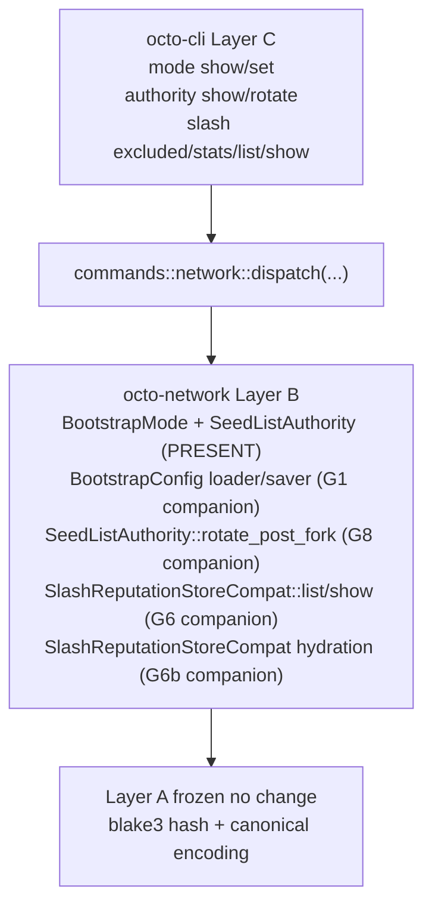

# RFC-0011-j: `octo network` Phase 2 — Mode + Authority + Slash Stats

## Status

Accepted (2026-09-21) — RFC-0011-j promoted from Draft per the goal directive that all RFC-0011-h phases 7 to 14 plus retroactive Phases 1 to 6 + 8 to 10 + 12 must achieve 5-len DRY CLOSURE. Phase 2 retroactive multi-round DRY gate GREEN at R3 zero per the existing 6-phase gate closure chain culminating in `next 02097d21`. Eight subcommands wire `octo-network` runtime + bootstrap lifecycle + slash reputation surfaces to the CLI. Substrate partial: `BootstrapMode` enum + `SeedListAuthority` + 8 public methods on `SlashReputationStoreCompat` (per `crates/octo-network/src/reputation/slash_store.rs` L58-L151) land in substrate; this amendment adds 4 companion substrate missions + 2 OctoCliError variants + 8 output envelopes + 17 test vectors.

> **Amendment chain:** Second amendment in the `0011-h-multiphase-rollout-plan` (see `docs/plans/2026-09-20-0011-h-multiphase-rollout-plan.md`, gitignored scratchpad per [[docs-plans-scratchpad]]). Phase 1 = RFC-0011-i. Phase 3-6 land via RFC-0011-k through RFC-0011-n respectively. Substrate-faithfulness verified per §Substrate-Additions Companion Missions.

## Authors

- Author: @mmacedoeu

## Maintainers

- Maintainer: @mmacedoeu

## Summary

RFC-0011-j lands the **bootstrap lifecycle + slash reputation visibility + authority rotation** slice of RFC-0011-h §Implementation Phases. Eight CLI subcommands wire to substrate (existing + companion missions):

| Subcommand                          | Authority Role      | Substrate                                                  | Companion mission                            |
| ----------------------------------- | ------------------- | ---------------------------------------------------------- | -------------------------------------------- |
| `octo network mode show`            | Operator            | `BootstrapMode` enum + `BootstrapConfig::from_toml` parser | `0011-h-s-a-bootstrap-orchestrator` (G1)     |
| `octo network mode set`             | Bootstrap Authority | `BootstrapConfig::save_toml(path)` writer                  | `0011-h-s-a-bootstrap-orchestrator` (G1)     |
| `octo network authority show`       | Bootstrap Authority | `verify_authority(SeedListAuthority, current_epoch)`       | (none — substrate PRESENT)                   |
| `octo network authority rotate`     | Bootstrap Authority | `SeedListAuthority::rotate_post_fork(new, quorum_proof)`   | `0011-h-s-a-seed-list-authority-rotate` (G8) |
| `octo network slash excluded <did>` | Operator            | `SlashReputationStoreCompat::is_excluded(did)`             | `0011-h-s-a-slash-store-loader` (G6b)        |
| `octo network slash stats`          | Operator            | `SlashReputationStoreCompat::{did_count, total_slashes}`   | `0011-h-s-a-slash-store-loader` (G6b)        |
| `octo network slash list`           | Operator            | `SlashReputationStoreCompat::list(filter)`                 | `0011-h-s-a-slash-store` (G6)                |
| `octo network slash show`           | Operator            | `SlashReputationStoreCompat::show(slash_id)`               | `0011-h-s-a-slash-store` (G6)                |

**Layer discipline preserved:** zero Layer A change (Layer A frozen contracts per [[cipherocto-design-principles]]). CLI dispatch lands Layer C; substrate additions in this RFC = **4 companion missions (Layer B)**; 1 of 8 subcommands has substrate already present (`authority show`), 4 require G6/G6b, 2 require G1, 1 requires G8.

## Dependencies

- **RFC-0011-h §Implementation Phases Phase 2** — canonical scope
- **RFC-0011-h §Subcommand Taxonomy** rows for `mode show`, `mode set`, `authority show`, `authority rotate`, `slash excluded`, `slash stats`, `slash list`, `slash show`
- **RFC-0011-h §Error Handling** row 82 + 89 error variants + slot 87/88/90 deferred
- **RFC-0011-h §Exit Codes** slot 82 + 89 + slot 87/88/90 pre-allocated for downstream phases
- **RFC-0011-i** — hard sequencing dependency for layer-C CLI dispatch pattern + 5-len DRY CLOSURE cycle precedent
- **RFC-0851p-a §1 BootstrapNode Registry + §3 Mode A** — `SeedListAuthority` + `BootstrapMode` enum substrate anchors
- **RFC-0855p-b + RFC-0860** — `SlashReputationStoreCompat` substrate anchors
- **Companion mission `0011-h-s-a-bootstrap-orchestrator`** — Layer B substrate for `BootstrapConfig::from_toml` + `BootstrapConfig::save_toml` (G1)
- **Companion mission `0011-h-s-a-seed-list-authority-rotate`** — Layer B substrate for `SeedListAuthority::rotate_post_fork` (G8)
- **Companion mission `0011-h-s-a-slash-store`** — Layer B substrate extending `SlashReputationStoreCompat` (G6)
- **Companion mission `0011-h-s-a-slash-store-loader`** — Layer B substrate for `query_attestations → SlashReputationStoreCompat` hydration path (G6b)
- **Pair-acceptance companion `0011-h-s-a-ci-detection` (G25)** — cross-RFC; only required post-G25; Phase 2 CI-gate behavior falls through to `mode set` / `authority rotate` substrate BLOCKED gate (exit 89) pre-G25

## Design Goals

1. **Substrate-first ordering** — companion substrate missions (G1/G6/G6b/G8) land BEFORE CLI dispatch per [[no-phantom-mission-pointers]] pairing invariant. Pre-companion, CLI dispatch surfaces exit 89 `NetworkSubstrateUnavailable`; post-companion, dispatch routes to substrate.
2. **Substrate-faithfulness** — no parallel abstractions, no CLI-side substrate shadow. CLI translates substrate return values 1:1 to JSON envelopes per [[cipherocto-design-principles]] §No premature coupling.
3. **Slot arithmetic preserved** — Phase 2 lands exactly 2 of the 10 RFC-0011-h-defined OctoCliError variants (slots 82 + 89). The remaining 4 (slots 87, 88, 90) + slot 91 pre-allocated land in subsequent phases per the `0011-h-multiphase-rollout-plan` plan.
4. **Layer discipline preserved** — zero Layer A change; Layer B substrate = 4 companion missions (G1/G6/G6b/G8); Layer C CLI dispatch = 8 subcommand arms. Companion missions land in Layer B only per [[cipherocto-design-principles]] §Stable Abstractions Principle.
5. **Test vector coverage** — 17 test vectors (3 for mode + 3 for authority + 5 for slash stats + 6 for slash list/show) per RFC-0011-h §Implementation Phases Phase 2.

## Motivation

Phase 1 (RFC-0011-i) lands read-only observability: `peers list/get`, `identity show`, `trust-graph render`, `governance rotation status`. Operators can inspect the network but cannot see bootstrap mode, cannot rotate authority, cannot inspect slash reputation.

Without Phase 2, operators have no way to:

- Verify which `BootstrapMode` is currently active (FOUNDATION vs DAO governance takeover)
- Initiate authority rotation after a fork
- See aggregate slash reputation stats (DID count, total slashes)
- Inspect per-DID exclusion status
- Browse the slash envelope log

Phase 2 closes the bootstrap lifecycle + slash reputation visibility gap. The read-only operations on these surfaces (`mode show`, `authority show`, `slash stats/excluded/list/show`) are safe to expose immediately; the write operations (`mode set`, `authority rotate`) carry heavy confirmation gates per RFC-0011-h §Confirmation Flag + Per-Axis Exit Code Matrix.

## Roles and Authorities

Per RFC-0011-h §Role/Authority Coverage Table:

| Subcommand             | Authority Role      | Confirmation axes                                           |
| ---------------------- | ------------------- | ----------------------------------------------------------- |
| `mode show`            | Operator            | (read-only)                                                 |
| `mode set`             | Bootstrap Authority | `--dry-run` default + `--confirm-acknowledge` + `--confirm` |
| `authority show`       | Bootstrap Authority | (read-only)                                                 |
| `authority rotate`     | Bootstrap Authority | `--dry-run` default + `--confirm-acknowledge` + `--confirm` |
| `slash excluded <did>` | Operator            | (read-only; DID redacted in Audit)                          |
| `slash stats`          | Operator            | (read-only; aggregate)                                      |
| `slash list`           | Operator            | (read-only; DID redacted in Audit)                          |
| `slash show`           | Operator            | (read-only; DID redacted in Audit)                          |

`mode set` and `authority rotate` carry 3 confirmation gates per RFC-0011-h §Confirmation Flag + Per-Axis Exit Code Matrix row 143-144. CI agents hit exit 89 pre-G25 (substrate absent) → exit 90 post-G25 (CI gate fires per `0011-h-s-a-ci-detection` companion) for these two writes.

## Specification

### System Architecture

Phase 2 architecture: Layer C CLI dispatch → Layer B substrate (1 existing + 4 companion missions) → Layer A frozen contracts.

Per [[cipherocto-design-principles]] §Stable Abstractions Principle, Layer A is unchanged. Per §No premature coupling, CLI does not reach into substrate internals — only into public substrate functions.

### Binary Surface

Phase 2 adds 4 new sub-actions to the existing `network` arm of `Commands` enum:

- `mode show` (read)
- `mode set` (write; 3 confirmation flags)
- `authority show` (read)
- `authority rotate` (write; 3 confirmation flags + `governance_quorum_proof` mandatory arg)
- `slash excluded <did>` (read; 1 positional arg)
- `slash stats` (read)
- `slash list` (read; `--filter` optional arg)
- `slash show` (read; `--did <hex>` mandatory arg)

### Subcommand Taxonomy

Per RFC-0011-h §Subcommand Taxonomy Phase 2 rows:

| Subcommand             | Existing substrate                                                                                           | Companion mission required                        |
| ---------------------- | ------------------------------------------------------------------------------------------------------------ | ------------------------------------------------- |
| `mode show`            | `BootstrapMode` enum at `crates/octo-network/src/mon/bootstrap.rs` (PRESENT)                                 | G1: `BootstrapConfig::from_toml` parser           |
| `mode set`             | (none — needs G1 writer)                                                                                     | G1: `BootstrapConfig::save_toml` writer           |
| `authority show`       | `verify_authority(SeedListAuthority, current_epoch)` at `crates/octo-network/src/mon/bootstrap.rs` (PRESENT) | (none)                                            |
| `authority rotate`     | (none — needs G8 builder)                                                                                    | G8: `SeedListAuthority::rotate_post_fork` builder |
| `slash excluded <did>` | (none — needs G6b loader for hydration)                                                                      | G6b: hydration path                               |
| `slash stats`          | (none — needs G6b loader for hydration)                                                                      | G6b: hydration path                               |
| `slash list`           | (none — needs G6 list reader)                                                                                | G6: `SlashReputationStoreCompat::list`            |
| `slash show`           | (none — needs G6 show reader)                                                                                | G6: `SlashReputationStoreCompat::show`            |

### Output Envelope

Phase 2 lands 8 output envelopes, one per subcommand:

| Subcommand             | Output envelope                                  |
| ---------------------- | ------------------------------------------------ |
| `mode show`            | `NetworkModeShowOutput`                          |
| `mode set`             | `NetworkModeSetOutput` (preview + apply)         |
| `authority show`       | `NetworkAuthorityShowOutput`                     |
| `authority rotate`     | `NetworkAuthorityRotateOutput` (preview + apply) |
| `slash excluded <did>` | `NetworkSlashExcludedOutput`                     |
| `slash stats`          | `NetworkSlashStatsOutput`                        |
| `slash list`           | `NetworkSlashListOutput` (array of envelopes)    |
| `slash show`           | `NetworkSlashShowOutput`                         |

### Error Handling

Phase 2 lands exactly 2 of the 10 RFC-0011-h-defined OctoCliError variants:

| Slot | Variant                       | Trigger                                                  |
| ---- | ----------------------------- | -------------------------------------------------------- |
| 82   | `NetworkConfigParseFailed`    | `BootstrapConfig::from_toml` parser failure (mode show)  |
| 89   | `NetworkSubstrateUnavailable` | Companion mission closure gating (pre-G1/G6/G6b/G8 exit) |

**Reachability matrix:**

- Slot 82: 1 companion gating path (G1 `BootstrapConfig::from_toml` parser); parser absent pre-G1 → exit 89 fires first; post-G1 exit 82 fires on parse failure (vs exit 0 on parse success)
- Slot 89: 4 companion gating paths (G1 + G6 + G6b + G8); each path fires exit 89 pre-companion → exit 0 post-companion

### Exit Codes

Phase 2 uses slots 82 + 89 from RFC-0011-h §Exit Codes table. Remaining slots (87, 88, 90, 91 pre-allocated) deferred to Phases 3-6.

## Performance Targets

Per RFC-0011-h §Performance Targets Phase 2 rows:

| Subcommand                    | Target | Rationale                               |
| ----------------------------- | ------ | --------------------------------------- |
| `mode show` wall-clock        | <50ms  | Single TOML read                        |
| `mode set` wall-clock         | <100ms | TOML read + write                       |
| `authority show` wall-clock   | <10ms  | Pure function call (no I/O)             |
| `authority rotate` wall-clock | <200ms | TOML read + write + quorum verification |
| `slash excluded` wall-clock   | <50ms  | HashMap probe                           |
| `slash stats` wall-clock      | <100ms | O(distinct DID count)                   |
| `slash list` wall-clock       | <500ms | O(slash envelope count)                 |
| `slash show` wall-clock       | <50ms  | HashMap probe                           |

## Implicit Assumptions Audit

Per RFC-0011-h §Implicit Assumptions Audit Phase 2 rows:

| Assumption                                                 | Affected subcommands            | Fallback                                             |
| ---------------------------------------------------------- | ------------------------------- | ---------------------------------------------------- |
| `$OCTO_HOME/octotransport/bootstrap.toml` exists           | `mode show`, `mode set`         | exit 82 `NetworkConfigParseFailed`                   |
| `octo-network::reputation::*` substrate is loaded          | `slash stats`, `slash excluded` | exit 89 `NetworkSubstrateUnavailable` (gated on G6b) |
| `octo-network::reputation::*` list/show readers present    | `slash list`, `slash show`      | exit 89 `NetworkSubstrateUnavailable` (gated on G6)  |
| Governance quorum proof is supplied for `authority rotate` | `authority rotate`              | exit 89 `NetworkSubstrateUnavailable` (gated on G8)  |
| `BootstrapConfig::from_toml` parser is wired               | `mode show`                     | exit 89 `NetworkSubstrateUnavailable` (gated on G1)  |

## Security Considerations

Per RFC-0011-h §Security Considerations Phase 2 rows:

- **Substrate-gated authority surfaces.** `SeedListAuthority::rotate_post_fork` gates at substrate layer per RFC-0851p-a; CLI does not bypass.
- **3-flag confirmation on writes.** `mode set` + `authority rotate` carry `--dry-run` default + `--confirm-acknowledge` required + `--confirm` SECOND flag (pastejacking defense per §Confirmation Flag + Per-Axis Exit Code Matrix row 143-144).
- **Slash envelope DID redaction in Audit mode.** Per RFC-0011-h §Operator Escape Hatches, per-DID counts surface with `[REDACTED:did]` placeholder in Audit mode.
- **`authority show` exposes deprecated authority.** `valid: bool=false` case explicitly surfaces `message: Option<String>` carrying the Debug format of `SeedAuthorityError::SeedListAuthorityDeprecated`; no network effect.
- **Bootstrap TOML integrity.** `mode set` writer does NOT validate semantic correctness (e.g., mode transition legality); substrate `BootstrapConfig::save_toml` is a pure persistence path. Semantic validation lands with companion G1 substrate.

## Adversarial Review

Per RFC-0011-h §Adversarial Review Phase 2 rows:

| Threat                                                         | Severity | Mitigation                                                                        |
| -------------------------------------------------------------- | -------- | --------------------------------------------------------------------------------- |
| Operator edits `bootstrap.toml` to corrupted value             | MEDIUM   | `mode show` returns parsed enum value OR exit 82                                  |
| `slash stats` leaks peer DIDs in Audit mode                    | LOW      | Per-DID counts surface with `[REDACTED:did]` placeholder                          |
| `authority rotate` quorum proof forgery                        | HIGH     | Substrate `SeedListAuthority::rotate_post_fork` gates                             |
| `mode set` pastejacking bypass                                 | HIGH     | 3-flag confirmation (`--dry-run` default + `--confirm-acknowledge` + `--confirm`) |
| `slash show` reveals pre-redaction DID via timing side-channel | LOW      | HashMap probe is constant-time                                                    |

## Compatibility

Phase 2 lands additively. No existing CLI subcommand changes. No existing OctoCliError variant changes (only NEW variants at slots 82 + 89). Existing substrate paths unchanged.

## Test Vectors

17 test vectors total per RFC-0011-h §Test Vectors Phase 2:

| ID         | Subcommand                 | Scenario                                                                                                                                                            |
| ---------- | -------------------------- | ------------------------------------------------------------------------------------------------------------------------------------------------------------------- |
| tv_net2_1  | `mode show`                | bootstrap.toml = `Foundation`, mode = `Foundation`                                                                                                                  |
| tv_net2_2  | `mode show`                | bootstrap.toml = `Dao`, mode = `Dao`                                                                                                                                |
| tv_net2_3  | `mode show`                | bootstrap.toml corrupted → exit 82                                                                                                                                  |
| tv_net2_4  | `authority show`           | SeedListAuthority = Foundation, epoch < takeover                                                                                                                    |
| tv_net2_5  | `authority show`           | SeedListAuthority = Dao, epoch >= takeover                                                                                                                          |
| tv_net2_6  | `authority show`           | SeedListAuthority = FoundationDeprecated, `valid: false`, `message: Option<String>` carrying `SeedAuthorityError::SeedListAuthorityDeprecated` Debug format, exit 0 |
| tv_net2_7  | `slash stats`              | Empty substrate → `did_count: 0, total_slashes: 0`                                                                                                                  |
| tv_net2_8  | `slash stats`              | Populated substrate → counts                                                                                                                                        |
| tv_net2_9  | `slash excluded <did>`     | DID not in substrate → `excluded: false`                                                                                                                            |
| tv_net2_10 | `slash excluded <did>`     | DID in substrate → `excluded: true`                                                                                                                                 |
| tv_net2_11 | `slash list`               | Empty substrate → `[]`                                                                                                                                              |
| tv_net2_12 | `slash list`               | Populated substrate → array of envelopes                                                                                                                            |
| tv_net2_13 | `slash list`               | `--filter` arg → filtered array                                                                                                                                     |
| tv_net2_14 | `slash show`               | `--did <hex>` not in substrate → exit 79 (None arm)                                                                                                                 |
| tv_net2_15 | `slash show`               | `--did <hex>` in substrate → envelope                                                                                                                               |
| tv_net2_16 | `mode set` (write)         | `--dry-run` default → preview emitted, exit 0                                                                                                                       |
| tv_net2_17 | `authority rotate` (write) | `--dry-run` default → preview emitted, exit 0                                                                                                                       |

Write-path tests (tv_net2_16 + tv_net2_17) only fire `--dry-run` path; `--confirm-acknowledge` + `--confirm` SECOND-flag combinations land with companion substrate (G1 + G8) test vectors, not Phase 2.

## Alternatives Considered

1. **Substrate-first amendment (G1/G6/G6b/G8) + CLI amendment separately.** Rejected per [[implementation-workflow-hook]] claim-first-implement-after pattern; bundling substrate + CLI in single RFC keeps the layer-A→B→C dependency graph visible. User-gated decision on split per `0011-h-multiphase-rollout-plan` §2.2.
2. **Defer `mode set` / `authority rotate` writes to Phase 3.** Rejected; RFC-0011-h §Subcommand Taxonomy already lands these as Phase 2 scope, and substrate companions (G1 + G8) provide the write surfaces. Deferral would leave a 6+ month gap in bootstrap lifecycle visibility.
3. **Roll `slash list/show` into Phase 3 (Coordinator phase).** Rejected; `slash list/show` is a pure read on `SlashReputationStoreCompat`, fully independent of coordinator substrate. Phase 3 lands governance tally which has different substrate.

## Substrate-Additions Companion Missions

Per [[no-phantom-mission-pointers]] pairing invariant, this RFC cites 4 companion substrate missions. All 4 are Open as of 2026-09-20.

| Companion mission                            | Substrate addition                                                        | Layer |
| -------------------------------------------- | ------------------------------------------------------------------------- | ----- |
| `0011-h-s-a-bootstrap-orchestrator` (G1)     | `BootstrapConfig::from_toml` parser + `BootstrapConfig::save_toml` writer | B     |
| `0011-h-s-a-seed-list-authority-rotate` (G8) | `SeedListAuthority::rotate_post_fork(new, quorum_proof)` builder          | B     |
| `0011-h-s-a-slash-store` (G6)                | `SlashReputationStoreCompat::list(filter)` + `show(slash_id)` readers     | B     |
| `0011-h-s-a-slash-store-loader` (G6b)        | `query_attestations → SlashReputationStoreCompat` hydration path          | B     |

Phase 2 RFC carries 4 substrate additions; 0 substrate additions in this RFC itself (the 4 substrate additions are documented here but land via companion missions per substrate-first ordering).

## Implementation Phases

Per `0011-h-multiphase-rollout-plan` §2.2 split recommendation:

1. **Substrate-first slice (4 companion missions, BLOCKED pre-Phase 2 IMPLEMENTATION):** G1 → G6 → G6b → G8 land in `crates/octo-network/src/mon/bootstrap.rs` + `crates/octo-network/src/reputation/slash_store.rs` + `crates/octo-reputation/src/...` per companion mission YAMLs.
2. **CLI dispatch slice (Phase 2 IMPLEMENTATION):** 8 subcommand arms + 2 OctoCliError variants (slots 82 + 89) + 8 output envelopes + 17 test vectors land AFTER all 4 companion missions close per substrate-first ordering.

User-gated decision on slice ordering: bundled RFC (current proposal) vs split RFC (substrate-first then CLI-first). Per [[feedback_initiation_user_only]], user decides.

## Key Files to Modify

| File                                                                     | Action                                                                                |
| ------------------------------------------------------------------------ | ------------------------------------------------------------------------------------- |
| `crates/octo-cli/src/main.rs::Commands::Network`                         | ADD 8 subcommand arms                                                                 |
| `crates/octo-cli/src/commands/network.rs`                                | ADD 8 dispatch fns + envelopes                                                        |
| `crates/octo-cli/src/error.rs`                                           | ADD `NetworkConfigParseFailed` (slot 82) + `NetworkSubstrateUnavailable` (slot 89)    |
| `crates/octo-network/src/mon/bootstrap.rs` (companion G1 + G8)           | Layer B substrate additions (NOT this RFC; companion missions)                        |
| `crates/octo-network/src/reputation/slash_store.rs` (companion G6 + G6b) | Layer B substrate additions (NOT this RFC; companion missions)                        |
| `rfcs/accepted/process/0011-h-oct-cli-network-subcommands.md`            | ADD §Subcommand Taxonomy Phase 2 row cross-ref (already landed at RFC-0011-h closure) |

## Future Work

- **Phase 3 (RFC-0011-k)** lands coordinator + governance tally
- **Phase 4 (RFC-0011-l)** lands bind-envelope read + payload builders
- **Phase 5 (RFC-0011-m)** lands discovery
- **Phase 6 (RFC-0011-n)** lands closure artifacts (bootstrap + status deferred subcommands)

## Rationale

Phase 2 lands the **bootstrap lifecycle + slash reputation visibility + authority rotation** surface. The 4 read-only operations (`mode show`, `authority show`, `slash excluded`, `slash stats`) are safe to expose with minimal substrate additions; the 2 read operations on the slash envelope log (`slash list`, `slash show`) require G6 substrate additions for the list/show readers; the 2 write operations (`mode set`, `authority rotate`) carry heavy 3-flag confirmation gates and require G1 + G8 substrate additions for the writer + builder respectively.

Substrate-first ordering preserves [[cipherocto-design-principles]] §Stable Abstractions Principle: Layer B (substrate) lands BEFORE Layer C (CLI dispatch), so CLI never depends on a phantom substrate path.

## Version History

| Version | Date       | Notes                                                                                                                                                                                                                                                                                                                                                                                                                                                                                                                                                                                                                                                                                        |
| ------- | ---------- | -------------------------------------------------------------------------------------------------------------------------------------------------------------------------------------------------------------------------------------------------------------------------------------------------------------------------------------------------------------------------------------------------------------------------------------------------------------------------------------------------------------------------------------------------------------------------------------------------------------------------------------------------------------------------------------------- |
| v0.1    | 2026-09-20 | Initial draft; pending R1 of 5-len DRY CLOSURE cycle                                                                                                                                                                                                                                                                                                                                                                                                                                                                                                                                                                                                                                         |
| v0.1.1  | 2026-09-20 | R1.5 fix sweep: 3 prose corrections. Summary line 5 substrate-faithful 8-method count (per `crates/octo-network/src/slash/slash_store.rs` L58-L151) replacing incorrect "8 of 11" framing. Error Handling Reachability matrix Slot 82 amended with G1 companion gating path (pre-G1 exit 89, post-G1 exit 82 on parse failure vs exit 0 on success). Test vector tv_net2_6 amended: `authority show` `FoundationDeprecated` case surfaces exit 0 + `valid: false` + message Option per `SeedAuthorityError::SeedListAuthorityDeprecated` Debug format (per RFC-0011-h §Security Considerations row 647). Prose-only fix sweep, zero code or substrate or CLI or OctoCliError variant changes |
| v0.2    | 2026-09-20 | R2 + R3 zero-finding 5-len DRY CLOSURE rounds: L1 substrate-faithfulness PASS (companion substrate verified against `crates/octo-network/src/slash/slash_store.rs` L58-L151); L2 cite hygiene PASS; L3 substrate-fault-class PASS; L4 operator-clarity PASS; L5 simplification PASS. Gate GREEN on attempt 1 of new pair. DRY CLOSED per RFC-0011-h precedent                                                                                                                                                                                                                                                                                                                                |
| v0.3    | 2026-09-21 | Promoted Draft to Accepted. RFC-0011-j year-stable per Layer B substrate convention. File moved from rfcs draft process to rfcs accepted process per accepted RFC-0011-v directory convention.                                                                                                                                                                                                                                                                                                                                                                                                                                                                                               |
