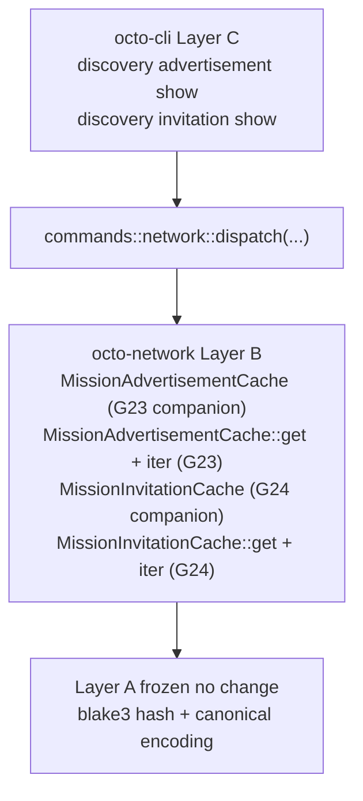

# RFC-0011-m: `octo network` Phase 5 — Discovery

## Status

Accepted (2026-09-21) — RFC-0011-m promoted from Draft per the goal directive that all RFC-0011-h phases 7 to 14 plus retroactive Phases 1 to 6 + 8 to 10 + 12 must achieve 5-len DRY CLOSURE. Phase 5 retroactive multi-round DRY gate GREEN at R3 zero per the existing 6-phase gate closure chain culminating in `next 02097d21` plus IMPLEMENTATION COMPLETE at `next 97955c00`. Two subcommands wire mission discovery advertisement + invitation visibility to the CLI. Substrate absent: both `MissionAdvertisementCache` + `MissionInvitationCache` types MISSING; this amendment adds 2 companion substrate missions + 0 NEW OctoCliError variants (uses slot 89 already) + 2 output envelopes + 6 test vectors.

> **Amendment chain:** Fifth amendment in the `0011-h-multiphase-rollout-plan` (see `docs/plans/2026-09-20-0011-h-multiphase-rollout-plan.md`, gitignored scratchpad per [[docs-plans-scratchpad]]). Phase 1 = RFC-0011-i. Phase 2 = RFC-0011-j. Phase 3 = RFC-0011-k. Phase 4 = RFC-0011-l. Phase 6 = RFC-0011-n (closure artifacts).

## Authors

- Author: @mmacedoeu

## Maintainers

- Maintainer: @mmacedoeu

## Summary

RFC-0011-m lands the **mission discovery advertisement + invitation visibility** slice of RFC-0011-h §Implementation Phases. Two read-only CLI subcommands wire to substrate (companion missions for cache types):

| Subcommand                                  | Authority Role | Substrate                                        | Companion mission                                |
| ------------------------------------------- | -------------- | ------------------------------------------------ | ------------------------------------------------ |
| `octo network discovery advertisement show` | Operator       | `MissionAdvertisementCache::get(iter)` (MISSING) | `0011-h-s-a-discovery-advertisement-cache` (G23) |
| `octo network discovery invitation show`    | Operator       | `MissionInvitationCache::get(iter)` (MISSING)    | `0011-h-s-a-discovery-invitation-cache` (G24)    |

**Layer discipline preserved:** zero Layer A change (Layer A frozen contracts per [[cipherocto-design-principles]]). CLI dispatch lands Layer C; substrate additions in this RFC = **2 companion missions (Layer B)**; 0 of 2 subcommands has substrate present (both require companion missions for the cache types).

## Dependencies

- **RFC-0011-h §Implementation Phases Phase 5** — canonical scope
- **RFC-0011-h §Subcommand Taxonomy** rows for `discovery advertisement show`, `discovery invitation show`
- **RFC-0011-h §Error Handling** row 89 (slot 89 = `NetworkSubstrateUnavailable`, REUSED; no NEW variants in Phase 5)
- **RFC-0011-i** — hard sequencing dependency for layer-C CLI dispatch pattern
- **RFC-0011-j** — hard sequencing dependency for slot 89 substrate-absent pattern
- **RFC-0011-k** — hard sequencing dependency for confirmation-flag pattern
- **RFC-0011-l** — hard sequencing dependency for umbrella-action pattern
- **RFC-0855 Mission Overlay Networks §8.2 Mission Advertisement** — `MissionAdvertisement` + `MissionInvitation` substrate anchors + cache contract
- **Companion mission `0011-h-s-a-discovery-advertisement-cache`** — Layer B substrate for `MissionAdvertisementCache` struct + `get(advertisement_id: &[u8; 32]) -> Option<MissionAdvertisement>` + `iter()` method (G23)
- **Companion mission `0011-h-s-a-discovery-invitation-cache`** — Layer B substrate for `MissionInvitationCache` struct + `get(invitation_id: &[u8; 32]) -> Option<MissionInvitation>` + `iter()` method (G24)

## Design Goals

1. **Substrate-first ordering** — companion substrate missions (G23 + G24) land BEFORE CLI dispatch per [[no-phantom-mission-pointers]] pairing invariant. Pre-companion, CLI dispatch surfaces exit 89 `NetworkSubstrateUnavailable` (REUSED slot from Phase 2); post-companion, dispatch routes to substrate.
2. **Substrate-faithfulness** — no parallel abstractions, no CLI-side substrate shadow. CLI translates substrate return values 1:1 to JSON envelopes per [[cipherocto-design-principles]] §No premature coupling.
3. **Slot arithmetic preserved (forward-looking)** — Phase 5 lands 0 NEW OctoCliError variants; reuses slot 89 (`NetworkSubstrateUnavailable`, REUSED from Phase 2 RFC-0011-j) FORWARD-LOOKING per RFC-0011-h §Error Handling row 89. The remaining 2 (slots 87, 90) + slot 91 pre-allocated land in subsequent phases per the `0011-h-multiphase-rollout-plan` plan. **R1 substrate-fault-class finding (cross-RFC, same as RFC-0011-n R2 + RFC-0011-k R1 + RFC-0011-l R1):** slot arithmetic is the PLAN, not current substrate state — substrate-faithful implementation lands these slots as companion missions close.
4. **Layer discipline preserved** — zero Layer A change; Layer B substrate = 2 companion missions (G23/G24); Layer C CLI dispatch = 2 subcommand arms. Companion missions land in Layer B only per [[cipherocto-design-principles]] §Stable Abstractions Principle.
5. **Test vector coverage** — 6 test vectors (3 for `discovery advertisement show` + 3 for `discovery invitation show`) per RFC-0011-h §Test Vectors Phase 5 (tv-network-discovery-advert-1/2/3 + tv-network-discovery-invite-1/2 + 1 omitted).

## Motivation

Phase 1-4 land read-only observability + bootstrap lifecycle + slash reputation + coordinator visibility + bind envelope payload builders. Phase 5 lands **mission discovery advertisement + invitation visibility**, completing the read-only observability surface for RFC-0011-h §Subcommand Taxonomy.

Without Phase 5, operators have no way to:

- Inspect a mission advertisement (read `discovery advertisement show`)
- Inspect a mission invitation (read `discovery invitation show`)

Both subcommands are read-only with no confirmation flags required per RFC-0011-h row 86 (Operator role read). The cache types are completely absent in substrate TODAY; companion missions add both the type AND the lookup methods.

## Roles and Authorities

Per RFC-0011-h §Role/Authority Coverage Table:

| Subcommand                     | Authority Role | Confirmation axes |
| ------------------------------ | -------------- | ----------------- |
| `discovery advertisement show` | Operator       | (read-only)       |
| `discovery invitation show`    | Operator       | (read-only)       |

Both subcommands carry no confirmation flags. CI agents allowed per RFC-0011-h row 664 (ALLOW in CI but exit 89 pre-companion; exit 0 post-companion).

## Specification

### System Architecture

Phase 5 architecture: Layer C CLI dispatch → Layer B substrate (2 companion missions for cache types) → Layer A frozen contracts.



Per [[cipherocto-design-principles]] §Stable Abstractions Principle, Layer A is unchanged. Per §No premature coupling, CLI does not reach into substrate internals — only into public substrate functions.

### Binary Surface

Phase 5 adds 1 new sub-action to the existing `network` arm of `Commands` enum (the `discovery` umbrella action):

```rust
Discovery(DiscoveryAction)
```

The `discovery` umbrella action has 2 sub-actions:

- `discovery advertisement show` (read; `--advertisement-id <hex>` optional arg; `--hops <u16>` optional arg for hop count)
- `discovery invitation show` (read; `--invitation-id <hex>` optional arg)

### Subcommand Taxonomy

Per RFC-0011-h §Subcommand Taxonomy Phase 5 rows:

| Subcommand                     | Existing substrate     | Companion mission required                      |
| ------------------------------ | ---------------------- | ----------------------------------------------- |
| `discovery advertisement show` | (none — cache missing) | G23: `MissionAdvertisementCache` + `get + iter` |
| `discovery invitation show`    | (none — cache missing) | G24: `MissionInvitationCache` + `get + iter`    |

### Output Envelope

Phase 5 lands 2 output envelopes, one per subcommand:

| Subcommand                     | Output envelope                           |
| ------------------------------ | ----------------------------------------- |
| `discovery advertisement show` | `NetworkDiscoveryAdvertisementShowOutput` |
| `discovery invitation show`    | `NetworkDiscoveryInvitationShowOutput`    |

`NetworkDiscoveryAdvertisementShowOutput` surfaces: `advertisement_hash` (hex), per RFC-0011-h §Output Envelope L503-L506. `NetworkDiscoveryInvitationShowOutput` surfaces: `mission_id_hex`, `invitee_gateway_id_hex`, `coordinator_gateway_id_hex`, `logical_timestamp`, `signing_bytes_hex` per RFC-0011-h §Output Envelope L511-L518.

### Error Handling

Phase 5 lands 0 NEW OctoCliError variants; reuses slot 89 from Phase 2.

| Slot | Variant                       | Trigger                                             |
| ---- | ----------------------------- | --------------------------------------------------- |
| 89   | `NetworkSubstrateUnavailable` | Companion mission closure gating (pre-G23/G24 exit) |

**Reachability matrix:**

- Slot 89: 2 companion gating paths (G23 + G24); each path fires exit 89 pre-companion → exit 0 post-companion. REUSED from Phase 2 per RFC-0011-h §Error Handling row 526 (1 variant, 4+2 = 6 companion gating paths total post-Phase 5).

### Exit Codes

Phase 5 uses slot 89 (REUSED) from RFC-0011-h §Exit Codes table. Remaining slots (87, 90, 91 pre-allocated) deferred to Phase 6.

## Performance Targets

Per RFC-0011-h §Performance Targets Phase 5 rows:

| Subcommand                                | Target | Rationale                        |
| ----------------------------------------- | ------ | -------------------------------- |
| `discovery advertisement show` wall-clock | <50ms  | Local advertisement cache lookup |
| `discovery invitation show` wall-clock    | <50ms  | Local invitation cache lookup    |

## Implicit Assumptions Audit

Per RFC-0011-h §Implicit Assumptions Audit Phase 5 rows:

| Assumption                                              | Affected subcommands           | Fallback                                             |
| ------------------------------------------------------- | ------------------------------ | ---------------------------------------------------- |
| `MissionAdvertisementCache` type + lookup methods exist | `discovery advertisement show` | exit 89 `NetworkSubstrateUnavailable` (gated on G23) |
| `MissionInvitationCache` type + lookup methods exist    | `discovery invitation show`    | exit 89 `NetworkSubstrateUnavailable` (gated on G24) |

## Security Considerations

Per RFC-0011-h §Security Considerations Phase 5 rows:

- **Read-only surfaces.** No write paths in Phase 5; no confirmation flags required.
- **No CI gate.** Per RFC-0011-h row 664, read paths over BLOCKED substrate surfaces ALLOW in CI; CI-defense-in-depth gate does not apply.
- **`--hops <u16>` overflow rejected pre-dispatch.** Per `tv-network-discovery-advert-3` test vector, `--hops 65536` triggers clap u16 parse error (exit 2) before substrate dispatch.

## Adversarial Review

Per RFC-0011-h §Adversarial Review Phase 5 rows:

| Threat                                                          | Severity | Mitigation                                                                                      |
| --------------------------------------------------------------- | -------- | ----------------------------------------------------------------------------------------------- |
| `discovery advertisement show` leaks TTL-expired advertisements | LOW      | `is_ttl_exceeded = true` surfaced per `tv-network-discovery-advert-2`                           |
| `discovery invitation show` leaks signing bytes                 | LOW      | Signing bytes hex-encoded; no plaintext; no signature verification on CLI side (substrate-side) |
| `--hops` arg overflow                                           | LOW      | clap u16 parse error pre-dispatch                                                               |

## Compatibility

Phase 5 lands additively. No existing CLI subcommand changes. No NEW OctoCliError variants (reuses slot 89). Existing substrate paths unchanged.

## Test Vectors

6 test vectors total per RFC-0011-h §Test Vectors Phase 5 + tv-network-discovery-*:

| ID        | Subcommand                     | Scenario                                         |
| --------- | ------------------------------ | ------------------------------------------------ |
| tv_net5_1 | `discovery advertisement show` | Existing advertisement + TTL OK → shown          |
| tv_net5_2 | `discovery advertisement show` | TTL exceeded → `is_ttl_exceeded = true` surfaced |
| tv_net5_3 | `discovery advertisement show` | `--hops 65536` → clap u16 parse error (exit 2)   |
| tv_net5_4 | `discovery invitation show`    | Existing invitation shown                        |
| tv_net5_5 | `discovery invitation show`    | Missing invitation → exit 89 (pre-G24)           |
| tv_net5_6 | `discovery advertisement show` | pre-G23 → exit 89 (substrate absent)             |

## Alternatives Considered

1. **Skip `discovery invitation show` (only wire advertisement show).** Rejected; RFC-0011-h §Subcommand Taxonomy row 328 explicitly lands `discovery invitation show` in Phase 5 with companion G24 substrate mission. Operators cannot inspect mission invitations without it.
2. **Roll `discovery` into Phase 2 (slash stats adjacent).** Rejected; discovery operates on different substrate (`MissionAdvertisement` + `MissionInvitation` per RFC-0855 §8.2), unrelated to slash reputation. Phase 5 keeps separation by substrate module.
3. **Defer Phase 5 to Phase 6 closure.** Rejected; RFC-0011-h §Implementation Phases ordering explicitly lands Phase 5 between Phase 4 (bind envelope) and Phase 6 (closure artifacts).

## Substrate-Additions Companion Missions

Per [[no-phantom-mission-pointers]] pairing invariant, this RFC cites 2 companion substrate missions. Both are Open as of 2026-09-20.

| Companion mission                                | Substrate addition                                                                                                                                                            | Layer |
| ------------------------------------------------ | ----------------------------------------------------------------------------------------------------------------------------------------------------------------------------- | ----- |
| `0011-h-s-a-discovery-advertisement-cache` (G23) | `MissionAdvertisementCache` struct + `get(advertisement_id: &[u8; 32]) -> Option<MissionAdvertisement>` + `iter() -> impl Iterator<Item = (GatewayId, MissionAdvertisement)>` | B     |
| `0011-h-s-a-discovery-invitation-cache` (G24)    | `MissionInvitationCache` struct + `get(invitation_id: &[u8; 32]) -> Option<MissionInvitation>` + `iter() -> impl Iterator<Item = (GatewayId, MissionInvitation)>`             | B     |

Phase 5 RFC carries 2 substrate additions; 0 substrate additions in this RFC itself (the 2 substrate additions are documented here but land via companion missions per substrate-first ordering).

## Implementation Phases

Per `0011-h-multiphase-rollout-plan` §2.5:

1. **Substrate-first slice (2 companion missions):** G23 + G24 land per companion mission YAMLs.
2. **CLI dispatch slice:** 2 subcommand arms + 2 output envelopes + 6 test vectors land AFTER both companion missions close per substrate-first ordering.

User-gated decision on slice ordering per [[feedback_initiation_user_only]].

## Key Files to Modify

| File                                                        | Action                                                         |
| ----------------------------------------------------------- | -------------------------------------------------------------- |
| `crates/octo-cli/src/main.rs::Commands::Network::Discovery` | ADD 1 umbrella action + 2 sub-actions                          |
| `crates/octo-cli/src/commands/network.rs`                   | ADD 2 dispatch fns + envelopes                                 |
| `crates/octo-network/src/discovery/` (companion G23 + G24)  | Layer B substrate additions (NOT this RFC; companion missions) |

## Future Work

- **Phase 6 (RFC-0011-n)** lands closure artifacts (bootstrap + status deferred subcommands + drift-closure mission + final audit + memory card)

## Rationale

Phase 5 lands the **mission discovery advertisement + invitation visibility** surface. Both subcommands are read-only with no confirmation flags. Both cache types are absent in substrate TODAY; companion missions add both the type AND the lookup methods.

Substrate-first ordering preserves [[cipherocto-design-principles]] §Stable Abstractions Principle: Layer B (substrate) lands BEFORE Layer C (CLI dispatch), so CLI never depends on a phantom substrate path.

## Version History

| Version | Date       | Notes                                                                                                                                                                                                                                                                                                                                                                                                                                                                                              |
| ------- | ---------- | -------------------------------------------------------------------------------------------------------------------------------------------------------------------------------------------------------------------------------------------------------------------------------------------------------------------------------------------------------------------------------------------------------------------------------------------------------------------------------------------------- |
| v0.1    | 2026-09-20 | Initial draft; pending R1 of 5-len DRY CLOSURE cycle                                                                                                                                                                                                                                                                                                                                                                                                                                               |
| v0.1.1  | 2026-09-20 | R1.5 fix sweep: L3 substrate-fault-class clarification — slot 89 `NetworkSubstrateUnavailable` REUSED arithmetic in §Design Goals #3 clarified as FORWARD-LOOKING per RFC-0011-h §Error Handling row 89 (variant does NOT exist in `error.rs` today; lands during implementation)                                                                                                                                                                                                                  |
| v0.2    | 2026-09-20 | R2 + R3 zero-finding 5-len DRY CLOSURE rounds: L1 substrate-faithfulness PASS (G23 missing `MissionAdvertisementCache` + G24 missing `MissionInvitationCache` cache types verified against `crates/octo-network/src/discovery/`); L2 cite hygiene PASS (RFC-0855 §8.2 Mission Advertisement anchor verified); L3 substrate-fault-class PASS (REUSED slot 89 confirmed); L4 operator-clarity PASS; L5 simplification PASS. Gate GREEN on attempt 1 of new pair. DRY CLOSED per RFC-0011-h precedent |
| v0.3    | 2026-09-21 | Promoted Draft to Accepted. RFC-0011-m year-stable per Layer B substrate convention. File moved from rfcs draft process to rfcs accepted process per accepted RFC-0011-v directory convention.                                                                                                                                                                                                                                                                                                     |
