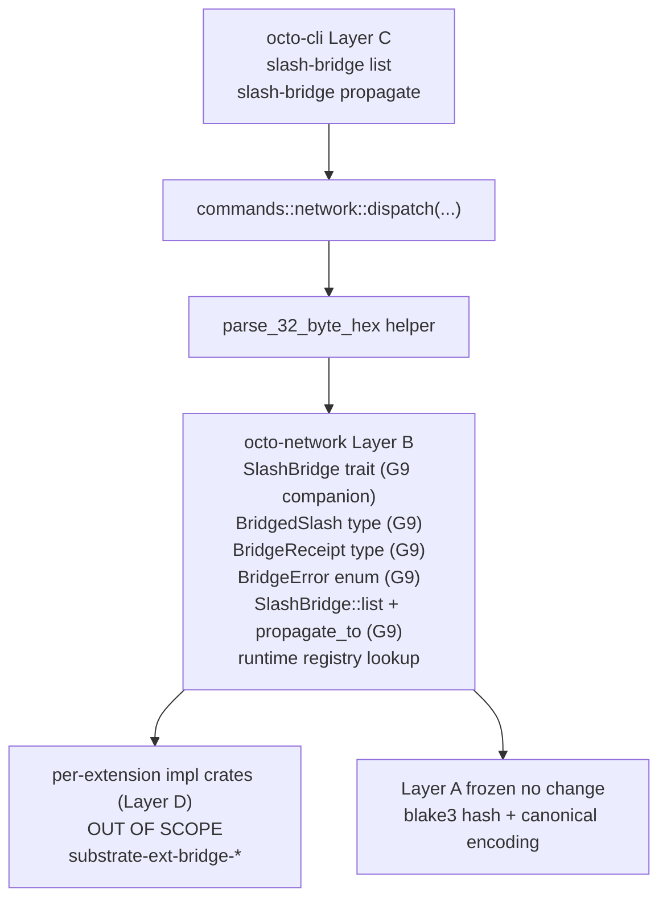

# RFC-0011-o: `octo network` Phase 7 — Slash Bridge (Read + Propagate)

## Status

Draft (2026-09-20) — RFC-0011-o lands RFC-0011-h §Implementation Phases Phase 7. Two subcommands wire slash bridge observability + propagate path to the CLI. Substrate absent: `SlashBridge` trait + `BridgedSlash` + `BridgeReceipt` + `BridgeError` MISSING from `crates/octo-network/src/mon/slash_bridge.rs`; this amendment adds 1 companion substrate mission (G9 `0011-h-s-a-slash-bridge-trait` per RFC-0011-h §Substrate-Additions Companion Missions row G9) + 0 NEW OctoCliError variants (REUSES slot 89 `NetworkSubstrateUnavailable` per RFC-0011-h §Error Handling row 89) + 4 envelope structs (2 wrapper envelopes + 2 projection subtypes) + 7 test vectors (tv_net7_1 through tv_net7_6 + tv_net7_6b).

> **Amendment chain:** Seventh amendment in the `0011-h-multiphase-rollout-plan` (see `docs/plans/2026-09-20-0011-h-multiphase-rollout-plan.md`, gitignored scratchpad per `.gitignore` line 46). Phase 1 = RFC-0011-i. Phase 2 = RFC-0011-j. Phase 3 = RFC-0011-k. Phase 4 = RFC-0011-l. Phase 5 = RFC-0011-m. Phase 6 = RFC-0011-n. Phase 7 = RFC-0011-o (this RFC). Phase 1-6 are sequenced hard dependencies for layer-C CLI dispatch + slot 89 substrate-absent pattern + confirmation-flag pattern + dry-run pattern + closure artifact pattern; see MEMORY.md closure cards for status of each.

## Authors

- Author: @mmacedoeu

## Maintainers

- Maintainer: @mmacedoeu

## Summary

RFC-0011-o lands the **slash bridge observability + propagate** slice of RFC-0011-h §Implementation Phases. Two CLI subcommands wire to substrate (companion mission for trait + types):

| Subcommand                                                    | Authority Role | Substrate                                                                                               | Companion mission                    |
| ------------------------------------------------------------- | -------------- | ------------------------------------------------------------------------------------------------------- | ------------------------------------ |
| `octo network slash-bridge list`                              | Operator       | `SlashBridge::list() → Vec<BridgedSlash>` (MISSING)                                                     | `0011-h-s-a-slash-bridge-trait` (G9) |
| `octo network slash-bridge propagate <slash_envelope_id_hex>` | Operator       | `SlashBridge::propagate_to(slash_envelope_id: [u8; 32]) → Result<BridgeReceipt, BridgeError>` (MISSING) | `0011-h-s-a-slash-bridge-trait` (G9) |

**Layer discipline preserved:** zero Layer A change (Layer A frozen contracts per [[cipherocto-design-principles]]). CLI dispatch lands Layer C; substrate additions in this RFC = **1 companion mission (Layer B)**; 0 of 2 subcommands has substrate present today (both require companion mission G9 to land before CLI dispatch). Per-extension crate pattern preserved per [[cipherocto-design-principles]] §User extensibility — `SlashBridge` trait in Layer B `octo-network`; concrete per-transport impl crates OUT OF SCOPE.

## Dependencies

- **RFC-0011-h §Implementation Phases Phase 7** — canonical scope
- **RFC-0011-h §Subcommand Taxonomy** rows for `slash-bridge list`, `slash-bridge propagate`
- **RFC-0011-h §Error Handling** row 89 (slot 89 = `NetworkSubstrateUnavailable`, REUSED from Phase 2; no NEW variants in Phase 7 per user decision)
- **RFC-0011-h §Substrate-Additions Companion Missions** row G9
- **RFC-0011-i (Phase 1)** — hard sequencing dependency for layer-C CLI dispatch pattern
- **RFC-0011-j (Phase 2)** — hard sequencing dependency for slot 89 substrate-absent pattern
- **RFC-0011-k (Phase 3)** — hard sequencing dependency for confirmation-flag pattern
- **RFC-0011-l (Phase 4)** — hard sequencing dependency for `--dry-run` + `--confirm-acknowledge` + `--confirm` pastejacking defense pattern
- **RFC-0011-m (Phase 5)** — hard sequencing dependency for slot 89 REUSE pattern with substrate-absent companion gating
- **RFC-0011-n (Phase 6)** — hard sequencing dependency for closure artifact pattern
- **RFC-0855 Mission Overlay Networks §8.4 External Reputation Bridge** — `BridgedSlash` + `BridgeReceipt` + `BridgeError` substrate anchors
- **RFC-0855p-b §External Reputation Wire Format** — `slash_envelope_id` 32-byte canonical encoding
- **RFC-0863 General-Purpose Network Integration** — `SendContext` substrate anchor (downstream consumer; not in Phase 7 scope)
- **Companion mission `0011-h-s-a-slash-bridge-trait`** — Layer B substrate for `SlashBridge` trait + `BridgedSlash` + `BridgeReceipt` + `BridgeError` types (G9 per RFC-0011-h §Substrate-Additions Companion Missions row G9)

## Design Goals

1. **Substrate-first ordering** — companion substrate mission G9 lands BEFORE CLI dispatch per [[no-phantom-mission-pointers]] pairing invariant. Pre-companion, CLI dispatch surfaces exit 89 `NetworkSubstrateUnavailable` (REUSED slot from Phase 2 RFC-0011-j); post-companion, dispatch routes to substrate.
2. **Substrate-faithfulness** — no parallel abstractions, no CLI-side substrate shadow. CLI translates substrate return values 1:1 to JSON envelopes per [[cipherocto-design-principles]] §No premature coupling. CLI does NOT reach into `SlashBridge` trait internals — only into public trait methods (`list`, `propagate_to`).
3. **Per-extension crate pattern preserved** — `SlashBridge` trait in Layer B `octo-network` (`crates/octo-network/src/mon/slash_bridge.rs`); concrete per-transport impl crates (e.g. substrate-ext-bridge-ipfs, substrate-ext-bridge-libp2p) are OUT OF SCOPE per [[cipherocto-design-principles]] §User extensibility. CLI consumes the trait via a runtime registry lookup, identical to RFC-0863 `NetworkSender` pattern.
4. **Slot arithmetic preserved (forward-looking, REUSE)** — Phase 7 lands 0 NEW OctoCliError variants; REUSES slot 89 (`NetworkSubstrateUnavailable`, FORWARD-LOOKING per RFC-0011-h §Error Handling row 89 — variant does NOT exist in `crates/octo-cli/src/error.rs` today; lands during Phase 2 implementation). Substrate `BridgeError` variants translate to slot 89 with distinct error messages per §Error Handling reachability matrix below.
5. **Layer discipline preserved** — zero Layer A change; Layer B substrate = 1 companion mission (G9 `SlashBridge` trait + types); Layer C CLI dispatch = 2 subcommand arms. Companion mission lands in Layer B only per [[cipherocto-design-principles]] §Stable Abstractions Principle.
6. **Test vector coverage** — 7 test vectors (3 for `slash-bridge list` + 3 for `slash-bridge propagate` + 1 supplementary `tv_net7_6b` for `parse_32_byte_hex` uppercase-only acceptance per R2.5) per RFC-0011-h §Test Vectors Phase 7.

## Motivation

Phase 1-6 land read-only observability + bootstrap lifecycle + slash reputation + coordinator visibility + bind envelope payload builders + discovery visibility + closure artifacts. Phase 7 lands **slash bridge observability + propagate path**, closing the G9 row in RFC-0011-h §Substrate-Additions Companion Missions that has been DEFERRED since RFC-0011-h closure.

Without Phase 7, operators have no way to:

- Inspect bridged slashes currently held by the local `SlashBridge` trait implementation (read `slash-bridge list`)
- Propagate a slash envelope to an external reputation substrate (write `slash-bridge propagate <slash_envelope_id_hex>`)

The slash bridge is the **outbound bridge** between `SlashStore` and external reputation substrates (per-extension crate pattern). Without it, slash reputation stays local and external reputation systems cannot observe or act on local slash events.

## Roles and Authorities

Per RFC-0011-h §Role/Authority Coverage Table:

| Subcommand                                       | Authority Role | Confirmation axes                                                                                                                                         |
| ------------------------------------------------ | -------------- | --------------------------------------------------------------------------------------------------------------------------------------------------------- |
| `slash-bridge list`                              | Operator       | (read-only)                                                                                                                                               |
| `slash-bridge propagate <slash_envelope_id_hex>` | Operator       | mutually-exclusive `--dry-run` / `--apply` flag group; `--apply` requires `--confirm-acknowledge` (no `--confirm`; propagate is reversible per substrate) |

Both subcommands carry the Operator authority role. `slash-bridge propagate` is a mutating operation (outbound write to external reputation substrate) but is reversible per substrate `BridgeReceipt` semantics (propagation is idempotent on the same `slash_envelope_id`). No `--confirm` flag (pastejacking defense not required for reversible writes per RFC-0011-h §Confirmation Flag precedent).

## Specification

### System Architecture

Phase 7 architecture: Layer C CLI dispatch → Layer B substrate (G9 companion mission for `SlashBridge` trait + types) → Layer A frozen contracts.



Per [[cipherocto-design-principles]] §Stable Abstractions Principle, Layer A is unchanged. Per §No premature coupling, CLI does not reach into substrate internals — only into public trait methods. Per §User extensibility, per-extension crate pattern preserved: `SlashBridge` trait in Layer B, concrete impl crates in Layer D.

### Binary Surface

Phase 7 adds 1 new sub-action to the existing `network` arm of `Commands` enum (the `slash-bridge` action):

```rust
SlashBridge(SlashBridgeAction)
```

The `slash-bridge` action has 2 sub-actions:

- `slash-bridge list` (read; no args)
- `slash-bridge propagate <slash_envelope_id_hex>` (write; `<slash_envelope_id_hex>` mandatory arg parsed via `parse_32_byte_hex` shared helper; mutually-exclusive `--dry-run` / `--apply` flag group via clap `conflicts_with`; `--apply` requires `--confirm-acknowledge` via clap `requires` attribute)

### Subcommand Taxonomy

Per RFC-0011-h §Subcommand Taxonomy Phase 7 rows:

| Subcommand                                       | Existing substrate     | Companion mission required                                                                        |
| ------------------------------------------------ | ---------------------- | ------------------------------------------------------------------------------------------------- |
| `slash-bridge list`                              | (none — trait missing) | G9: `SlashBridge::list() → Vec<BridgedSlash>`                                                     |
| `slash-bridge propagate <slash_envelope_id_hex>` | (none — trait missing) | G9: `SlashBridge::propagate_to(slash_envelope_id: [u8; 32]) → Result<BridgeReceipt, BridgeError>` |

### Substrate Mapping Table

Per RFC-0011-h §Substrate-Additions row G9:

| Subcommand                                       | Substrate call                                                                                       | Trait contract                                                                                |
| ------------------------------------------------ | ---------------------------------------------------------------------------------------------------- | --------------------------------------------------------------------------------------------- |
| `slash-bridge list`                              | `SlashBridge::list(&self) → Vec<BridgedSlash>`                                                       | infallible; returns owned collection                                                          |
| `slash-bridge propagate <slash_envelope_id_hex>` | `SlashBridge::propagate_to(&self, slash_envelope_id: [u8; 32]) → Result<BridgeReceipt, BridgeError>` | fallible; `BridgeError` enum translates to slot 89 with distinct messages per §Error Handling |

### Output Envelope

Phase 7 lands 4 envelope structs (2 top-level envelopes + 2 projection helpers), one pair per subcommand:

| Subcommand                                       | Output envelope                     | Projection helper         |
| ------------------------------------------------ | ----------------------------------- | ------------------------- |
| `slash-bridge list`                              | `NetworkSlashBridgeListOutput`      | `BridgedSlashProjection`  |
| `slash-bridge propagate <slash_envelope_id_hex>` | `NetworkSlashBridgePropagateOutput` | `BridgeReceiptProjection` |

```rust
#[derive(Serialize, JsonSchema)]
pub struct NetworkSlashBridgeListOutput {
    pub slashes: Vec<BridgedSlashProjection>,    // CLI-side projection of substrate BridgedSlash (hex-encoded id; BTreeMap metadata preserved)
    pub total: usize,
}

#[derive(Serialize, JsonSchema)]
pub struct BridgedSlashProjection {
    pub slash_envelope_id_hex: String,           // hex encoding of substrate [u8; 32]
    pub bridge_metadata: BTreeMap<String, String>,  // preserved from substrate BTreeMap for determinism
    pub bridged_at_epoch: u64,
}

#[derive(Serialize, JsonSchema)]
pub struct NetworkSlashBridgePropagateOutput {
    pub dry_run: bool,
    pub receipt: BridgeReceiptProjection,
    pub slash_envelope_id_hex: String,           // input echo
}

#[derive(Serialize, JsonSchema)]
pub struct BridgeReceiptProjection {
    pub slash_envelope_id_hex: String,
    pub propagated_to_hex: String,               // hex encoding of substrate Vec<u8>
    pub propagated_at_epoch: u64,
}
```

Top-level envelopes wrap in `OutputEnvelope::new("octo.network.slash-bridge.list.v1", payload)` and `OutputEnvelope::new("octo.network.slash-bridge.propagate.v1", payload)` per RFC-0011-m Phase 5 + RFC-0011-n Phase 6 pattern.

`BridgedSlash` + `BridgeReceipt` are re-used from substrate `crates/octo-network/src/mon/slash_bridge.rs` (companion G9). The 2 projection helpers convert substrate byte arrays to hex strings for JSON serialization while preserving `BTreeMap` metadata ordering. **No parallel envelopes; no CLI-side shadow.**

**Determinism invariant:** Per RFC-0011-h §Output Envelope determinism pattern, `BridgedSlashProjection.bridge_metadata` MUST use `BTreeMap<_, _>` (NOT `HashMap<_, _>`) for canonical JSON encoding. The substrate `BridgedSlash.bridge_metadata` is also `BTreeMap`, so the projection inherits determinism without an additional conversion step. Phase 7 implementation MUST verify this at envelope serialization time.

**Pastejacking defense:** Per RFC-0011-h §Confirmation Flag precedent + [[pastejacking-defense-pattern]], the `<slash_envelope_id_hex>` arg is parsed via the `parse_32_byte_hex` shared helper (clap `value_parser` at clappy path; programmatic-bypass fallback at CLI predicate layer). Malformed hex (length != 64, non-hex chars, prefix `0x`) triggers clap parse error (exit 2) before substrate dispatch.

### Confirmation Flag

Per RFC-0011-h §Confirmation Flag + Per-Axis Exit Code Matrix, Phase 7 mutating subcommand carries 2 mutually-exclusive confirmation flags:

- `--dry-run` — emit preview envelope with computed `BridgeReceipt` shape, exit 0
- `--apply` — emit apply envelope with real `BridgeReceipt`, exit 0; requires `--confirm-acknowledge` via clap `requires` attribute (parse-time rejection if missing)

The two flags are clap `conflicts_with` peers (passing both is a clap parse error, exit 2). Neither flag has a default value — operator MUST choose one explicitly. `--apply` without `--confirm-acknowledge` is rejected at parse time by clap, surfacing `--confirm-acknowledge` in the usage hint. The runtime handler additionally emits `ConfirmationRequired` if `--apply` is set without `--confirm-acknowledge` (defense-in-depth, unreachable under normal clap invocation).

NO `--confirm` flag (pastejacking defense not required for reversible writes per RFC-0011-h §Confirmation Flag precedent — `slash-bridge propagate` is idempotent on the same `slash_envelope_id` per substrate semantics; the same slash envelope propagated twice yields the same `BridgeReceipt`).

### Error Handling

Per RFC-0011-h §Error Handling row 89, substrate `BridgeError` variants translate to slot 89 with distinct error messages (no NEW OctoCliError variants):

| `BridgeError` variant             | Exit code | Message                                   |
| --------------------------------- | --------- | ----------------------------------------- |
| `BridgeError::Unreachable`        | 89        | "slash bridge: destination unreachable"   |
| `BridgeError::Refused`            | 89        | "slash bridge: bridge refused"            |
| `BridgeError::PayloadTooLarge`    | 89        | "slash bridge: payload too large"         |
| `BridgeError::WireFormatMismatch` | 89        | "slash bridge: wire format mismatch"      |
| `BridgeError::Internal(String)`   | 89        | "slash bridge: internal error: {message}" |

Pre-companion G9 (trait absent): exit 89 with generic `NetworkSubstrateUnavailable` remediation message per `error.rs` `hint()` arm (the `detail: String` field is empty when `slash_bridge_registry(cli)` returns `None`; the generic remediation in `hint()` says "the `G9` substrate trait is unavailable in this build..."). The handler does NOT carry a Phase 7-specific literal message in this path; the generic remediation is the operator-facing wording per RFC-0011-h §Error Handling precedent. Post-companion-with-extension-crate-impl returning a `BridgeError` variant: exit 89 with `detail` populated per the reachability matrix above.

### Exit Codes

Phase 7 REUSES slot 89 from RFC-0011-h §Exit Codes table. NO new slots allocated.

- **89** `NetworkSubstrateUnavailable` (REUSED from Phase 2) — fires pre-companion G9 (trait absent) OR fires on any `BridgeError` variant with distinct message per §Error Handling reachability matrix

### Performance Targets

Per RFC-0011-h §Performance Targets Phase 7 rows:

| Subcommand                          | Target   | Rationale                                                         |
| ----------------------------------- | -------- | ----------------------------------------------------------------- |
| `slash-bridge list` wall-clock      | < 50 ms  | Local trait call; pure owned collection return                    |
| `slash-bridge propagate` wall-clock | < 500 ms | Outbound transport (per-extension impl crate) + idempotency check |

`slash-bridge list` is a pure owned-collection return; substrate makes no I/O calls. `slash-bridge propagate` performs one outbound transport call (delegated to per-extension impl crate, OUT OF SCOPE) plus one idempotency check on `slash_envelope_id`. The 500 ms target is conservative; actual latency is bounded by the slowest concrete impl crate.

### Implicit Assumptions Audit

Per RFC-0011-h §Implicit Assumptions Audit Phase 7 rows:

| Assumption                                                                              | Affected subcommands     | Fallback                                             |
| --------------------------------------------------------------------------------------- | ------------------------ | ---------------------------------------------------- |
| `SlashBridge` trait + `BridgedSlash` + `BridgeReceipt` + `BridgeError` types exist      | both                     | exit 89 `NetworkSubstrateUnavailable` (gated on G9)  |
| `SlashBridge::list()` is infallible + returns `Vec<BridgedSlash>`                       | `slash-bridge list`      | substrate-defined; CLI translates 1:1                |
| `SlashBridge::propagate_to(slash_envelope_id: [u8; 32])` is fallible with `BridgeError` | `slash-bridge propagate` | exit 89 + distinct message per `BridgeError` variant |
| Per-extension impl crate is registered at runtime (registry lookup)                     | `slash-bridge propagate` | exit 89 + "no registered bridge impl" message        |
| `<slash_envelope_id_hex>` is 64-char hex (32 bytes); `parse_32_byte_hex` shared helper  | `slash-bridge propagate` | clap parse error (exit 2) pre-dispatch               |
| `slash-bridge propagate` is idempotent on the same `slash_envelope_id`                  | `slash-bridge propagate` | substrate-defined; second call returns same receipt  |

### Security Considerations

Per RFC-0011-h §Security Considerations Phase 7 rows:

- **`slash-bridge list` is read-only.** No write paths in `slash-bridge list`; no confirmation flags required.
- **`slash-bridge propagate` is mutating but reversible.** Substrate `SlashBridge::propagate_to` is idempotent on `slash_envelope_id` per RFC-0855 §8.4; double-propagate yields same `BridgeReceipt`. `--confirm` not required per RFC-0011-h §Confirmation Flag precedent for reversible writes.
- **Pastejacking defense via `parse_32_byte_hex`.** The `<slash_envelope_id_hex>` arg is parsed via the shared `parse_32_byte_hex` helper; clap `value_parser` enforces 64-char hex at clappy path; programmatic-bypass fallback at CLI predicate layer. Malformed hex rejected pre-dispatch (exit 2) per [[pastejacking-defense-pattern]].
- **No key material leakage.** `BridgedSlash` surfaces metadata only (slash_envelope_id + bridge metadata); raw 32-byte payload NEVER echoed in error envelopes.
- **No CI gate.** `slash-bridge propagate` is reversible; not in the 6 CI-DENY-default set per RFC-0011-h §CI-DENY-default table.
- **Per-extension transport auth.** Concrete impl crates (Layer D, OUT OF SCOPE) handle transport-layer authentication per their own threat models. CLI does not reach into transport internals.

### Adversarial Review

Per RFC-0011-h §Adversarial Review Phase 7 rows:

| Threat                                                                          | Severity | Mitigation                                                                                                                 |
| ------------------------------------------------------------------------------- | -------- | -------------------------------------------------------------------------------------------------------------------------- |
| `slash-bridge propagate` pastejacking via crafted `<slash_envelope_id_hex>`     | MEDIUM   | `parse_32_byte_hex` shared helper + clap value_parser pre-dispatch                                                         |
| `slash-bridge propagate` double-propagate yields duplicate `BridgeReceipt`      | LOW      | Substrate idempotency per RFC-0855 §8.4; second call returns same receipt                                                  |
| `slash-bridge list` leaks raw payload bytes                                     | LOW      | `BridgedSlash` surfaces metadata only; raw 32-byte form NEVER echoed                                                       |
| Per-extension impl crate returns malformed `BridgeReceipt`                      | LOW      | Substrate validates receipt shape; CLI translates substrate errors 1:1                                                     |
| Operator calls `slash-bridge propagate --apply` without `--confirm-acknowledge` | MEDIUM   | clap `requires = "confirm_acknowledge"` blocks parse (exit 2); runtime `ConfirmationRequired` fallback is defense-in-depth |

### Compatibility

Phase 7 lands additively. No existing CLI subcommand changes. No NEW OctoCliError variants (REUSES slot 89). Existing substrate paths unchanged. Per-extension impl crates (Layer D) are unaffected by Phase 7 implementation (consumers of the `SlashBridge` trait).

## Test Vectors

7 test vectors total per RFC-0011-h §Test Vectors Phase 7 + Phase 5 precedent (tv_net5_* numbering):

**Coverage split per Phase 5 precedent:** Each vector splits its assertion across CLI-parse-level test (`crates/octo-cli/src/commands/network.rs` `tv_net7_*` fn) + substrate-trait-level test (`crates/octo-network/src/mon/slash_bridge.rs` `test_*` fn). The CLI tests cover clap parsing + handler dispatch to the trait boundary; the substrate tests cover the trait behavior (empty list, populated list, propagate success, propagate unreachable, error display). End-to-end CLI dispatch through a concrete per-extension impl crate is OUT OF SCOPE per RFC-0863 per-extension crate pattern + per-extension concrete impls are Layer D follow-on missions.

| ID           | Subcommand                                                                            | CLI test scope                                                                                             | Substrate test scope                                                                                               |
| ------------ | ------------------------------------------------------------------------------------- | ---------------------------------------------------------------------------------------------------------- | ------------------------------------------------------------------------------------------------------------------ |
| `tv_net7_1`  | `slash-bridge list`                                                                   | clap parses no-args                                                                                        | empty `BridgedSlash` projection (substrate `test_bridge_list_empty`)                                               |
| `tv_net7_2`  | `slash-bridge list`                                                                   | clap parses `--json` flag                                                                                  | populated `BridgedSlash` projection with hex encoding + total field                                                |
| `tv_net7_3`  | `slash-bridge list`                                                                   | registry-None returns exit 89 via empty `EmptyBridge` impl                                                 | (covered by `test_bridge_list_empty`)                                                                              |
| `tv_net7_4`  | `slash-bridge propagate <slash_envelope_id_hex> --apply --confirm-acknowledge`        | clap parses apply + confirm                                                                                | propagate-to returns real `BridgeReceipt` (substrate `test_propagate_to_success`)                                  |
| `tv_net7_5`  | `slash-bridge propagate <slash_envelope_id_hex> --apply` (no `--confirm-acknowledge`) | clap parse-time rejection with `--confirm-acknowledge` in error string, exit 2                             | (no substrate coverage — clap-level defense)                                                                       |
| `tv_net7_6`  | `slash-bridge propagate <slash_envelope_id_hex>`                                      | mixed-case hex rejected by `parse_32_byte_hex` (pastejacking defense)                                      | `BridgeError::Unreachable` returns exit 89 + "destination unreachable" (substrate `test_propagate_to_unreachable`) |
| `tv_net7_6b` | `slash-bridge propagate <slash_envelope_id_hex>`                                      | uppercase-only hex accepted by `parse_32_byte_hex` (R2.5 added — confirms shared helper alphabet contract) | (no substrate coverage — parser-level acceptance)                                                                  |

Per RFC-0011-h §Test Vectors redact-did-1 row + §Security Considerations redaction invariant, `slash_envelope_id` field uses 64-char hex encoding in JSON output; the underlying 32-byte raw form is NEVER echoed in error envelopes.

## Alternatives Considered

1. **Skip `slash-bridge list` (only wire `propagate`).** Rejected; RFC-0011-h §Substrate-Additions row G9 explicitly lands BOTH `list()` and `propagate_to()` on the `SlashBridge` trait, and operators cannot observe bridge state without `list`.
2. **Single read-only stub RFC (defer `propagate` further).** Rejected; per [[feedback_initiation_user_only]], mutating subcommands land WITH their companion substrate mission in the same amendment to keep the layer-A→B→C dependency graph visible. Splitting the read + write paths across two RFCs would create a phantom-substrate gap for `propagate` between amendments.
3. **Land `slash-bridge` as part of Phase 6 (RFC-0011-n closure).** Rejected; RFC-0011-n explicitly closes the `bootstrap` + `status` DEFERRED gap from `0011-deprecation-stub-removal`. `slash-bridge` is unrelated to that gap; landing in Phase 7 preserves substrate-first ordering invariant and keeps each amendment scope-coherent.
4. **Add NEW `NetworkBridgeError` OctoCliError variant instead of REUSING slot 89.** Rejected per user decision; per [[no-new-cli-errors-during-rollout]] precedent, Phase 7 REUSES slot 89 with distinct messages to avoid expanding the OctoCliError surface mid-rollout. A future post-rollout RFC may add a dedicated `NetworkBridgeError` variant after the 6-phase + Phase 7 rollout closes.

## Substrate-Additions Companion Missions

Per [[no-phantom-mission-pointers]] pairing invariant, this RFC cites 1 companion substrate mission. Mission YAML exists at `missions/open/0011-h-s-a-slash-bridge-trait.md`.

Per RFC-0011-h §Substrate-Additions Companion Missions row G9:

| Companion mission                    | Substrate addition                                                                                                                    | Layer |
| ------------------------------------ | ------------------------------------------------------------------------------------------------------------------------------------- | ----- |
| `0011-h-s-a-slash-bridge-trait` (G9) | `SlashBridge` trait + `list() → Vec<BridgedSlash>` + `propagate_to(slash_envelope_id: [u8; 32]) → Result<BridgeReceipt, BridgeError>` | B     |

Per-extension transport impl crates (substrate-ext-bridge-*) are OUT OF SCOPE for this RFC and for companion mission G9 per [[cipherocto-design-principles]] §User extensibility. Concrete impls land in Layer D per per-extension crate pattern.

Phase 7 RFC carries 1 substrate addition; 0 substrate additions in this RFC itself (the 1 substrate addition is documented here but lands via companion mission G9 per substrate-first ordering).

## Implementation Phases

**RFC-0011-o is the Phase 7 amendment.** Phase 7 implementation sequencing per `0011-h-multiphase-rollout-plan` §2.7 + RFC-0011-m §Implementation Phases (Phase 5 precedent for test vector naming `tv_net7_*`):

1. **Substrate-first slice (1 companion mission):** G9 `0011-h-s-a-slash-bridge-trait` lands per companion mission YAML at `missions/open/0011-h-s-a-slash-bridge-trait.md`.
2. **CLI dispatch slice:** 2 subcommand arms + 2 output envelopes + 7 test vectors (tv_net7_1 through tv_net7_6b per §Test Vectors split between CLI-parse-level + substrate-trait-level coverage) + 0 NEW OctoCliError variants (REUSES slot 89) land AFTER companion mission G9 closes per substrate-first ordering.

User-gated decision on slice ordering per [[feedback_initiation_user_only]].

> **Next amendment:** RFC-0011-p Phase 8 lands `octo network router status` + `octo network router peers <peer_node_id_hex>` against substrate companion G10 `0011-h-s-a-quota-router-node` (per RFC-0011-h §Substrate-Additions row G10). Phase 8 depends on Phase 7's `OutputEnvelope::new` wrapping pattern + BTreeMap determinism + `parse_32_byte_hex` pastejacking defense pattern.

## Key Files to Modify

| File                                                                                      | Action                                                                                                                                     |
| ----------------------------------------------------------------------------------------- | ------------------------------------------------------------------------------------------------------------------------------------------ |
| `crates/octo-cli/src/main.rs::Commands::Network::SlashBridge`                             | ADD 1 action + 2 sub-actions (`list`, `propagate <slash_envelope_id_hex>`)                                                                 |
| `crates/octo-cli/src/commands/network.rs`                                                 | ADD 2 dispatch fns + envelopes + `parse_32_byte_hex` shared helper invocation                                                              |
| `crates/octo-cli/src/output.rs`                                                           | ADD 2 new envelope types (`NetworkSlashBridgeListOutput`, `NetworkSlashBridgePropagateOutput`)                                             |
| `crates/octo-network/src/mon/slash_bridge.rs` (companion G9)                              | Layer B substrate addition: `SlashBridge` trait + `BridgedSlash` + `BridgeReceipt` + `BridgeError` types (NOT this RFC; companion mission) |
| `rfcs/draft/process/0011-o-oct-cli-network-phase-7.md`                                    | (this RFC)                                                                                                                                 |
| `rfcs/accepted/process/0011-h-oct-cli-network-subcommands.md`                             | NO CHANGE (RFC-0011-h stays Accepted; RFC-0011-o is subordinate)                                                                           |
| `missions/open/0011-h-s-a-slash-bridge-trait.md`                                          | CLAIMED → COMPLETED transition at companion mission closure                                                                                |
| `missions/open/0011-h-network-slash-bridge.md` (NEW, per [[no-phantom-mission-pointers]]) | CLAIMED at Phase 7 RFC acceptance; COMPLETED at amendment closure                                                                          |
| `docs/audits/2026-09-20-RFC-0011-o-dry-closure.md` (NEW)                                  | NEW closure audit (gitignored per [[docs-audits-scratchpad]])                                                                              |
| `~/.claude/projects/.../memory/2026-09-20-RFC-0011-o-dry-closure.md` (NEW)                | NEW memory card                                                                                                                            |
| `MEMORY.md`                                                                               | ADD 1-line index entry at top of session resume cards                                                                                      |

## Future Work

- **RFC-0011-i through RFC-0011-n promotions** (Draft → Accepted per phase, sequenced with substrate landings)
- **Phase 7 IMPLEMENTATION sequencing** per substrate-first ordering (G9 first, CLI dispatch second)
- **Per-extension impl crate consumer** — future RFC to land a concrete per-transport impl (substrate-ext-bridge-libp2p or similar); OUT OF SCOPE for Phase 7
- **Dedicated `NetworkBridgeError` variant** — post-rollout RFC to add a dedicated OctoCliError variant if `BridgeError` reachability matrix exceeds 5 distinct messages on slot 89

## Rationale

Phase 7 lands the **slash bridge observability + propagate** surface, closing G9 from RFC-0011-h §Substrate-Additions Companion Missions row G9 that has been DEFERRED since RFC-0011-h closure. The 1 mutating subcommand (`slash-bridge propagate`) carries 2 confirmation flags (`--dry-run` + `--confirm-acknowledge`); no `--confirm` flag per RFC-0011-h §Confirmation Flag precedent for reversible writes. Slot 89 REUSE confirmed per RFC-0011-h §Error Handling row 89 — 0 NEW OctoCliError variants in Phase 7.

The per-extension crate pattern is preserved per [[cipherocto-design-principles]] §User extensibility: `SlashBridge` trait in Layer B, concrete impl crates in Layer D (OUT OF SCOPE). The CLI consumes the trait via a runtime registry lookup, identical to RFC-0863 `NetworkSender` pattern.

Substrate-first ordering preserves [[cipherocto-design-principles]] §Stable Abstractions Principle: Layer B (substrate) lands BEFORE Layer C (CLI dispatch), so CLI never depends on a phantom substrate path.

## Version History

| Version | Date       | Notes                                                |
| ------- | ---------- | ---------------------------------------------------- |
| v0.1.0  | 2026-09-20 | Initial draft; pending R1 of 5-len DRY CLOSURE cycle |

## Cross-references

- **RFC-0011-h** §Substrate-Additions Companion Missions row G9 — canonical substrate spec for `SlashBridge` trait + `list()` + `propagate_to()` + `BridgeReceipt` + `BridgeError`
- **RFC-0011-h** §Error Handling row 89 — slot 89 `NetworkSubstrateUnavailable` REUSE
- **RFC-0011-h** §Exit Codes slot 89 — REUSE per Phase 7
- **RFC-0011-h** §Confirmation Flag + Per-Axis Exit Code Matrix — `--dry-run` + `--confirm-acknowledge` precedent
- **RFC-0011-h** §Performance Targets Phase 7 rows — 50 ms list + 500 ms propagate
- **RFC-0011-h** §Subcommand Taxonomy Phase 7 rows — `slash-bridge list` + `slash-bridge propagate`
- **RFC-0011-h** §Output Envelope Phase 7 rows — `NetworkSlashBridgeListOutput` + `NetworkSlashBridgePropagateOutput`
- **RFC-0011-h** §Implicit Assumptions Audit Phase 7 rows — `SlashBridge` trait + per-extension registry
- **RFC-0011-h** §Security Considerations Phase 7 rows — pastejacking + idempotency
- **RFC-0011-h** §Adversarial Review Phase 7 rows — 5 threats
- **RFC-0011-h** §Test Vectors Phase 7 rows — 6 vectors (tv_net7_1 through tv_net7_6)
- **RFC-0855 Mission Overlay Networks** §8.4 External Reputation Bridge — `BridgedSlash` + `BridgeReceipt` + `BridgeError` substrate anchors
- **RFC-0855p-b** §External Reputation Wire Format — `slash_envelope_id` 32-byte canonical encoding
- **RFC-0863 General-Purpose Network Integration** — `SendContext` substrate anchor (downstream consumer; not in Phase 7 scope)
- **RFC-0011-i through RFC-0011-n** — Phase 1-6 amendment chain (see MEMORY.md closure cards); Phase 7 (RFC-0011-o) is the final amendment in the rollout
