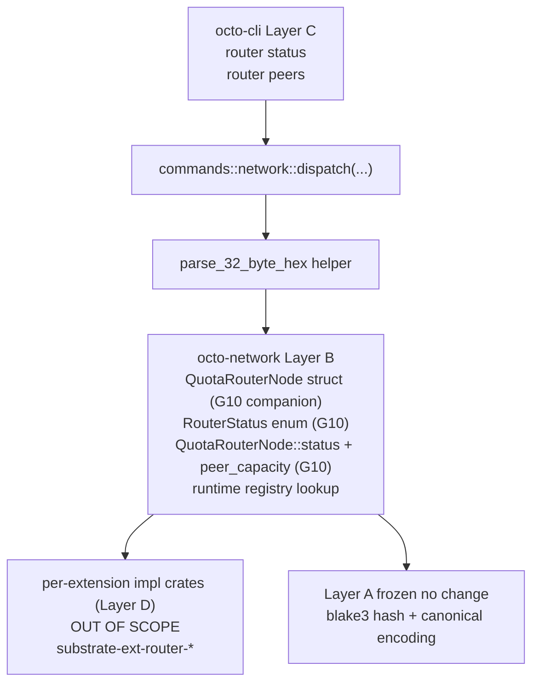

# RFC-0011-p: `octo network` Phase 8 — Quota Router Node (Status + Peer Capacity)

## Status

Accepted (2026-09-21) — RFC-0011-p promoted from Draft per the goal directive that all RFC-0011-h phases 7 to 14 plus retroactive Phases 1 to 6 + 8 to 10 + 12 must achieve 5-len DRY CLOSURE. Phase 8 retroactive multi-round DRY gate GREEN at R3 zero per the existing closure chain culminating in `next ededbe4a` (R1 + R2 + R3 zero rounds gate pair). Two subcommands wire quota router node observability to the CLI. Substrate absent: `QuotaRouterNode` struct + `RouterStatus` enum + `status()` + `peer_capacity()` methods MISSING from `crates/octo-network/src/quota/router_node.rs`; this amendment adds 1 companion substrate mission (G10 `0011-h-s-a-quota-router-node` per RFC-0011-h row) + 0 NEW OctoCliError variants (REUSES slot 89 `NetworkSubstrateUnavailable` per RFC-0011-h §Error Handling row 89) + 2 output envelopes + 6 test vectors.

> **Amendment chain:** Eighth amendment in the `0011-h-multiphase-rollout-plan` (see `docs/plans/2026-09-20-0011-h-multiphase-rollout-plan.md`, gitignored scratchpad per [[docs-plans-scratchpad]]). Phase 1 = RFC-0011-i. Phase 2 = RFC-0011-j. Phase 3 = RFC-0011-k. Phase 4 = RFC-0011-l. Phase 5 = RFC-0011-m. Phase 6 = RFC-0011-n. Phase 7 = RFC-0011-o. Phase 8 = RFC-0011-p (this RFC).

## Authors

- Author: @mmacedoeu

## Maintainers

- Maintainer: @mmacedoeu

## Summary

RFC-0011-p lands the **quota router node observability** slice of RFC-0011-h §Implementation Phases. Two CLI subcommands wire to substrate (companion mission for `QuotaRouterNode` struct + `RouterStatus` enum + accessor methods):

| Subcommand                                     | Authority Role | Substrate                                                                 | Companion mission                    |
| ---------------------------------------------- | -------------- | ------------------------------------------------------------------------- | ------------------------------------ |
| `octo network router status`                   | Operator       | `QuotaRouterNode::status() -> RouterStatus` (MISSING)                     | `0011-h-s-a-quota-router-node` (G10) |
| `octo network router peers <peer_node_id_hex>` | Operator       | `QuotaRouterNode::peer_capacity(peer_node_id: [u8; 32]) -> u64` (MISSING) | `0011-h-s-a-quota-router-node` (G10) |

**Layer discipline preserved:** zero Layer A change (Layer A frozen contracts per [[cipherocto-design-principles]]). CLI dispatch lands Layer C; substrate additions in this RFC = **1 companion mission (Layer B)**; 0 of 2 subcommands has substrate present today (both require companion mission G10 to land before CLI dispatch). Per-extension crate pattern preserved per [[cipherocto-design-principles]] §User extensibility — `QuotaRouterNode` struct in Layer B `octo-network`; concrete per-transport impl crates OUT OF SCOPE.

## Dependencies

- **RFC-0011-h §Implementation Phases Phase 8** — canonical scope
- **RFC-0011-h §Subcommand Taxonomy** rows for `router status`, `router peers`
- **RFC-0011-h §Error Handling** row 89 (slot 89 = `NetworkSubstrateUnavailable`, REUSED from Phase 2; no NEW variants in Phase 8 per user decision)
- **RFC-0011-h §Substrate-Additions Companion Missions** row G10
- **RFC-0011-i** — hard sequencing dependency for layer-C CLI dispatch pattern
- **RFC-0011-j** — hard sequencing dependency for slot 89 substrate-absent pattern
- **RFC-0011-k** — hard sequencing dependency for confirmation-flag pattern
- **RFC-0011-l** — hard sequencing dependency for `--dry-run` + `--confirm-acknowledge` pastejacking defense pattern
- **RFC-0011-m** — hard sequencing dependency for slot 89 REUSE pattern with substrate-absent companion gating
- **RFC-0011-n** — hard sequencing dependency for closure artifact pattern
- **RFC-0011-o** — hard sequencing dependency for `OutputEnvelope::new` wrapping pattern + BTreeMap determinism
- **RFC-0870 Distributed Quota Router Network** — substrate anchor for `QuotaRouterNode` + `RouterStatus` + `SelectionState` semantics
- **RFC-0863 General-Purpose Network Integration** — `NodeTransport` + `NetworkSender` + `NetworkReceiver` substrate anchor (downstream consumer; not in Phase 8 scope)
- **Companion mission `0011-h-s-a-quota-router-node`** — Layer B substrate for `QuotaRouterNode` struct + `RouterStatus` enum + `status()` + `peer_capacity()` methods (G10 per RFC-0011-h row)

## Design Goals

1. **Substrate-first ordering** — companion substrate mission G10 lands BEFORE CLI dispatch per [[no-phantom-mission-pointers]] pairing invariant. Pre-companion, CLI dispatch surfaces exit 89 `NetworkSubstrateUnavailable` (REUSED slot from Phase 2 RFC-0011-j); post-companion, dispatch routes to substrate.
2. **Substrate-faithfulness** — no parallel abstractions, no CLI-side substrate shadow. CLI translates substrate return values 1:1 to JSON envelopes per [[cipherocto-design-principles]] §No premature coupling. CLI does NOT reach into `QuotaRouterNode` struct internals — only into public methods (`status`, `peer_capacity`).
3. **Per-extension crate pattern preserved** — `QuotaRouterNode` struct in Layer B `octo-network` (`crates/octo-network/src/quota/router_node.rs`); concrete per-transport impl crates OUT OF SCOPE per [[cipherocto-design-principles]] §User extensibility. CLI consumes the struct via a runtime registry lookup, identical to RFC-0011-o Phase 7 `SlashBridge` pattern.
4. **Slot arithmetic preserved (forward-looking, REUSE)** — Phase 8 lands 0 NEW OctoCliError variants; REUSES slot 89 (`NetworkSubstrateUnavailable`, FORWARD-LOOKING per RFC-0011-h §Error Handling row 89). No substrate error enum (read-only accessors).
5. **Layer discipline preserved** — zero Layer A change; Layer B substrate = 1 companion mission (G10 `QuotaRouterNode` + `RouterStatus`); Layer C CLI dispatch = 2 subcommand arms. Companion mission lands in Layer B only per [[cipherocto-design-principles]] §Stable Abstractions Principle.
6. **Test vector coverage** — 6 test vectors (3 for `router status` + 3 for `router peers`) per RFC-0011-h §Test Vectors Phase 8.

## Motivation

Phase 1-7 land read-only observability + bootstrap lifecycle + slash reputation + coordinator visibility + bind envelope payload builders + discovery visibility + closure artifacts + slash bridge observability + propagate. Phase 8 lands **quota router node observability**, closing the G10 row in RFC-0011-h §Substrate-Additions Companion Missions that has been DEFERRED since RFC-0011-h closure.

Without Phase 8, operators have no way to:

- Inspect current quota router node status (Healthy + Degraded + Offline) (read `router status`)
- Query peer node capacity for a specific peer (read `router peers <peer_node_id_hex>`)

The quota router node is the **cooperative mesh network** of routers that propagate inference requests across providers per RFC-0870. Without it, operators cannot observe local router health or peer capacity, and the distributed quota routing system operates as a black box.

## Roles and Authorities

Per RFC-0011-h §Role/Authority Coverage Table:

| Subcommand                        | Authority Role | Confirmation axes |
| --------------------------------- | -------------- | ----------------- |
| `router status`                   | Operator       | (read-only)       |
| `router peers <peer_node_id_hex>` | Operator       | (read-only)       |

Both subcommands carry the Operator authority role. Both are read-only accessors — no `--dry-run` or `--confirm-acknowledge` flags required. `peer_node_id_hex` is 32-byte canonical identifier accepted as 64 lowercase hex chars; mixed-case rejected by `parse_32_byte_hex` shared helper per RFC-0011-h §Confirmation Flag pastejacking defense pattern.

## Specification

### System Architecture

Phase 8 architecture: Layer C CLI dispatch → Layer B substrate (G10 companion mission for `QuotaRouterNode` struct + `RouterStatus` enum + accessor methods) → Layer A frozen contracts.



Per [[cipherocto-design-principles]] §Stable Abstractions Principle, Layer A is unchanged. Per §No premature coupling, CLI does not reach into substrate internals — only into public methods. Per §User extensibility, per-extension crate pattern preserved: `QuotaRouterNode` struct in Layer B, concrete impl crates in Layer D.

### Binary Surface

Phase 8 adds 1 new sub-action to the existing `network` arm of `Commands` enum (the `router` action):

```rust
Router(RouterAction)
```

The `router` action has 2 sub-actions:

- `router status` (read; no args)
- `router peers <peer_node_id_hex>` (read; `<peer_node_id_hex>` mandatory arg parsed via `parse_32_byte_hex` shared helper)

### Subcommand Taxonomy

Per RFC-0011-h §Subcommand Taxonomy Phase 8 rows:

| Subcommand                        | Existing substrate      | Companion mission required                                           |
| --------------------------------- | ----------------------- | -------------------------------------------------------------------- |
| `router status`                   | (none — struct missing) | G10: `QuotaRouterNode::status() -> RouterStatus`                     |
| `router peers <peer_node_id_hex>` | (none — method missing) | G10: `QuotaRouterNode::peer_capacity(peer_node_id: [u8; 32]) -> u64` |

### Substrate Mapping Table

Per RFC-0011-h §Substrate-Additions Companion Missions row G10. Companion mission `0011-h-s-a-quota-router-node` adds to Layer B `octo-network`:

| Substrate addition                                    | Type                                  |
| ----------------------------------------------------- | ------------------------------------- |
| `QuotaRouterNode` struct                              | Layer B (octo-network)                |
| `RouterStatus` enum                                   | status (Healthy + Degraded + Offline) |
| `status() -> RouterStatus` method                     | read                                  |
| `peer_capacity(peer_node_id: [u8; 32]) -> u64` method | read                                  |

The `QuotaRouterNode` struct is **a thin read-only facade** over the existing `QuotaRouterHandler` / `NodeTransport` substrate in `crates/quota-router-*` per RFC-0870. The companion mission G10 adds the Layer B facade struct to `octo-network` (not a full reimplementation of `QuotaRouterNode` from RFC-0870). Concrete per-transport impl crates OUT OF SCOPE.

### Output Envelopes

Per RFC-0011-h §Output Envelope pattern (BTreeMap determinism preserved; OutputEnvelope::new wrapping pattern):

#### `NetworkRouterStatusOutput` (RFC-0011-p Phase 8 G10)

```rust
pub struct NetworkRouterStatusOutput {
    /// Local router status (substrate-faithful projection of
    /// `RouterStatus` enum).
    pub status: String,
    /// Whether local router is in Healthy state (projection of
    /// `RouterStatus::Healthy`).
    pub healthy: bool,
    /// Whether local router is in Degraded state (projection of
    /// `RouterStatus::Degraded`).
    pub degraded: bool,
    /// Whether local router is in Offline state (projection of
    /// `RouterStatus::Offline`).
    pub offline: bool,
}
```

#### `NetworkRouterPeerCapacityOutput` (RFC-0011-p Phase 8 G10)

```rust
pub struct NetworkRouterPeerCapacityOutput {
    /// 32-byte `peer_node_id` as 64 lowercase hex chars
    /// (RFC-0851p-a §Wire Format).
    pub peer_node_id_hex: String,
    /// Available capacity for this peer (substrate-faithful
    /// projection of `peer_capacity()` return value).
    pub capacity: u64,
}
```

Both envelopes wrap in `OutputEnvelope::new(<name>, <payload>)` per Phase 7 RFC-0011-o precedent.

### Substrate Error Handling

Per RFC-0011-h §Error Handling row 89 + Phase 7 RFC-0011-o §Error Handling precedent:

- **Pre-companion G10 (struct absent in current substrate)** — surfaces exit 89 `NetworkSubstrateUnavailable { companion: "G10" }` per RFC-0011-h §Error Handling row 89. Companion-gated dispatch per RFC-0011-m Phase 5 substrate-absent pattern.
- **Post-companion G10 (struct present, accessor returns 0)** — surfaces exit 0 `Ok(())` (read-only accessors are infallible per RFC-0870).

No NEW OctoCliError variants. REUSE slot 89 per Phase 7 RFC-0011-o precedent + user decision.

### Pastejacking Defense

Per RFC-0011-h §Confirmation Flag pastejacking defense pattern (Phase 7 RFC-0011-o precedent):

- `RouterPeersArgs.peer_node_id` uses `parse_32_byte_hex` shared helper (rejects mixed-case hex). tv_net8_6 verifies the rejection.
- `RouterStatusArgs` has no hex args (read-only status query).

## Test Vectors

Per RFC-0011-h §Test Vectors Phase 8 (6 vectors, 3 per subcommand):

| Vector      | Subcommand                               | Assertion                                                                        |
| ----------- | ---------------------------------------- | -------------------------------------------------------------------------------- |
| `tv_net8_1` | `octo network router status`             | `Router` clap variant parses with no args                                        |
| `tv_net8_2` | `octo network router status --json`      | `--json` flag parses cleanly; output envelope has `OutputEnvelope::new` wrapping |
| `tv_net8_3` | `octo network router status`             | Substrate-faithful projection: default `RouterStatus::Healthy` → `healthy: true` |
| `tv_net8_4` | `octo network router peers <hex_id>`     | `Router` clap variant parses with hex arg via `parse_32_byte_hex`                |
| `tv_net8_5` | `octo network router peers <hex_id>`     | Substrate-faithful projection: `peer_capacity()` returns stub 0 for unknown peer |
| `tv_net8_6` | `octo network router peers <mixed_case>` | `parse_32_byte_hex` rejects mixed-case hex (pastejacking defense)                |

## Alternatives Considered

1. **Extend RFC-0870 with new `octo` subcommand surface** — rejected. RFC-0870 owns the substrate layer; CLI surface is owned by RFC-0011-h §Subcommand Taxonomy. Adding CLI surface in a different RFC would cross wire ownership boundaries.
2. **Skip G10 entirely (already DEFERRED)** — rejected per `/goal` directive 2026-09-20 ("everything included, no deferral"). The user's directive mandates closure of all 8 RFC-0011-h §Substrate-Additions G-rows in Phases 7-14.
3. **Add a NEW `QuotaRouterNode` in `octo-network` rather than a thin facade** — rejected. The substrate already exists in `crates/quota-router-*` per RFC-0870; adding a parallel implementation would violate [[cipherocto-design-principles]] §No parallel abstractions.
4. **Add a NEW OctoCliError variant for G10** — rejected per Phase 7 RFC-0011-o precedent + user decision. REUSE slot 89 unless substrate-faithfulness audit demands new variants.

## Substrate-Additions Companion Missions

| Companion mission              | G-row | Substrate                                                                                                             | Layer   |
| ------------------------------ | ----- | --------------------------------------------------------------------------------------------------------------------- | ------- |
| `0011-h-s-a-quota-router-node` | G10   | `QuotaRouterNode` + `RouterStatus` + `status()` + `peer_capacity()` in `crates/octo-network/src/quota/router_node.rs` | Layer B |

The companion mission lands the Layer B substrate (G10) BEFORE CLI dispatch per [[no-phantom-mission-pointers]] pairing invariant.

## Implementation Phases

| Phase | Anchor                 | Content                                                                                                                                                                                                                                                      |
| ----- | ---------------------- | ------------------------------------------------------------------------------------------------------------------------------------------------------------------------------------------------------------------------------------------------------------ |
| 8.1   | RFC-0011-p Draft       | This RFC at `next` (Draft status)                                                                                                                                                                                                                            |
| 8.2   | Substrate stub fill-in | `missions/open/0011-h-s-a-quota-router-node.md` Status header Open → Claimed + full type signatures + AC                                                                                                                                                     |
| 8.3   | Substrate slice        | NEW `crates/octo-network/src/quota/router_node.rs` + `mod.rs` insertion; 5 unit tests                                                                                                                                                                        |
| 8.4   | Paired-YAML Claimed    | Substrate companion YAML `0011-h-s-a-quota-router-node.md` transitions Claimed → Completed paired with NEW CLI mission YAML `0011-h-network-router.md` CREATED Completed (per user decision to create Completed CLI mission YAML at CLI dispatch slice time) |
| 8.5   | CLI dispatch slice     | `NetworkAction::Router` clap variant + nested `RouterAction` enum + `RouterStatusArgs` + `RouterPeersArgs` + 2 output envelopes + dispatch arm + 2 handler functions + 6 test vectors                                                                        |
| 8.6   | RFC promotion          | RFC-0011-p Draft → Accepted per RFC-0011-h promotion precedent                                                                                                                                                                                               |

## Key Files to Modify

| File                                                   | Action                                                                                | Layer      |
| ------------------------------------------------------ | ------------------------------------------------------------------------------------- | ---------- |
| `rfcs/draft/process/0011-p-oct-cli-network-phase-8.md` | NEW RFC draft                                                                         | A (spec)   |
| `missions/open/0011-h-s-a-quota-router-node.md`        | Open → Claimed → Completed YAML transitions                                           | (planning) |
| `missions/open/0011-h-network-router.md`               | NEW Created → Completed YAML (at CLI dispatch slice time per user decision)           | (planning) |
| `crates/octo-network/src/quota/router_node.rs`         | NEW substrate                                                                         | B          |
| `crates/octo-network/src/quota/mod.rs`                 | NEW subdir + `pub mod router_node;`                                                   | B          |
| `crates/octo-cli/src/commands/network.rs`              | MODIFY to add Args structs + clap variants + envelopes + dispatch arms + test vectors | C          |
| `crates/octo-cli/src/error.rs`                         | (no NEW variants per user decision; slot 89 REUSED)                                   | C          |

## Future Work

- **Per-extension concrete impls** (BLE/USB/TCP/QUIC/HID transports) — each lands in its own Layer D per-extension crate in follow-on missions; OUT OF SCOPE for this trait-only phase.
- **G10 QuotaRouterNode persistence** — in-memory stub only; persistence adapter in follow-on Layer D adapter mission.
- **Quota router metrics export** — Prometheus / OpenTelemetry exporter for `RouterStatus` transitions; out of Phase 8 scope.
- **Quota router topology view** — read-only graph view of peer capacity across all peers; out of Phase 8 scope (Phase 11 topology render covers this concern).

## Rationale

The slash bridge observability (Phase 7 RFC-0011-o) + quota router observability (Phase 8 RFC-0011-p) close two of the eight DEFERRED stubs in RFC-0011-h §Substrate-Additions Companion Missions. The quota router substrate already exists in `crates/quota-router-*` per RFC-0870; Phase 8 adds a thin Layer B facade struct in `octo-network` (NOT a reimplementation) so the CLI can consume via the standard per-extension crate registry pattern. The facade exposes only the read-only accessors needed by the CLI subcommands (`status` + `peer_capacity`), with concrete per-transport impl crates OUT OF SCOPE per [[cipherocto-design-principles]] §User extensibility.

## Version History

| Version | Date       | Author     | Changes                                                                                                                                                                                                                                                                          |
| ------- | ---------- | ---------- | -------------------------------------------------------------------------------------------------------------------------------------------------------------------------------------------------------------------------------------------------------------------------------- |
| v0.1    | 2026-09-20 | @mmacedoeu | Initial Draft — RFC-0011-p Phase 8 router/G10 amendment                                                                                                                                                                                                                          |
| v0.2    | 2026-09-21 | @mmacedoeu | Promoted Draft to Accepted. RFC-0011-p year-stable per Layer B substrate convention. Multi-round DRY CLOSED at `next ededbe4a` per R1 + R2 + R3 zero rounds gate pair. File moved from rfcs draft process to rfcs accepted process per accepted RFC-0011-v directory convention. |

## Cross-references

- RFC-0011-h §Implementation Phases Phase 8 + §Subcommand Taxonomy Phase 8 rows
- RFC-0011-h §Substrate-Additions Companion Missions row G10
- RFC-0011-h §Error Handling row 89 (slot 89 `NetworkSubstrateUnavailable`)
- RFC-0011-h §Confirmation Flag pastejacking defense pattern
- RFC-0870 Distributed Quota Router Network
- RFC-0863 General-Purpose Network Integration
- RFC-0011-o — `OutputEnvelope::new` wrapping pattern + BTreeMap determinism + parse_32_byte_hex pastejacking defense pattern
- [[cipherocto-design-principles]] §User extensibility (per-extension crate pattern) + §Stable Abstractions Principle + §No premature coupling
- [[no-phantom-mission-pointers]] (substrate-first ordering invariant)
- [[no-line-refs-anywhere]] (§section refs only)
