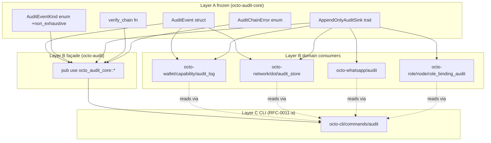

# RFC-0012: Audit Substrate (`octo-audit-core` + `octo-audit` Façade)

## Status

Accepted (2026-09-10)

## Authors

- Authored by `@cipherocto` per RFC-0011 amendment chain + `docs/research/2026-09-10-octo-audit-governance-settlement-modular-layer-research.md` Finding 4.

## Maintainers

- Maintainer: `@cipherocto` per RFC-0011 amendment chain.

## Summary

This RFC defines the canonical audit substrate as a **Layer A frozen core** (`octo-audit-core`) plus a **Layer B substrate façade** (`octo-audit`). The core owns the append-only `AuditEvent` chain primitive + `AppendOnlyAuditSink` trait (type-level enforcement); the façade re-exports ONLY from the core (no domain leakage). Domain crates (`octo-wallet/capability/audit_log`, `octo-network/dot/audit_store`, `octo-whatsapp/audit`, `octo-role/role_binding_audit`) consume the core for canonical types and add their own storage adapters + extension enums. The façade name (`octo-audit`) is the canonical RFC-0011-a reference; the implementation lives in `octo-audit-core` + per-domain consumers.

This RFC closes the phantom-crate gap identified in `docs/audits/2026-09-10-rfc-0011-a-g-phantom-substrate-investigation.md` and operationalizes the hybrid Layer A + Layer B façade pattern recommended as PRIMARY by `docs/research/2026-09-10-octo-audit-governance-settlement-modular-layer-research.md` Finding 4.

## Dependencies

**Requires:**

- RFC-0957 — Macaroon Substrate (`cap_root_hash` field references a macaroon capability root per RFC-0957 §Data Structures)
- RFC-0957-A1 §Future Work F3 — Audit Log (canonical `AuditEvent` shape + BLAKE3 chain integrity; substrate extends, does not replace)
- RFC-0009 — Identity Management (`node_did` field references canonical DID per RFC-0010 chain-ID codec)
- RFC-0010 — Canonical DID Codec (DID parsing + chain-ID registration authority)
- RFC-0011-a — `octo audit` Subcommands (CLI consumer of the façade; defines read-only operator surface)
- RFC-0008 — Deterministic AI Execution Boundary (execution class mapping)

**Optional:**

- RFC-0855 — Mission Overlay Networks (governance envelope integration; informational, audit log may carry governance-event extensions)
- RFC-0205 — Stoolap Fork Stability + RFC-0206 — `octo-storage-core` Split (`Database` trait precedent for substrate-frozen core pattern; cited analog)

> **Dependency Validation Rules:**
> 1. DAG (no cycles); Requires listed as mission prereqs
> 2. RFC-0957-A1 §Future Work F3 is the source-of-truth for canonical `AuditEvent` field shape (event_id, node_did, event_kind, cap_root_hash, at_millis_unix, prev_chain_hash, chain_hash); RFC-0012 ADDS the `AppendOnlyAuditSink` trait + `audit_chain` module + `#[non_exhaustive]` extension on `AuditEventKind`; does NOT change canonical field semantics
> 3. No 2-cycle sibling required

## Design Goals

| Goal | Target | Metric |
| ---- | ------ | ------ |
| G1 | Layer A frozen | `octo-audit-core` depends only on `octo-ident` + `blake3` + `serde` (no storage, no IO); semver-major only |
| G2 | Type-level append-only | `AppendOnlyAuditSink::append` requires `&mut self`; no `delete` / `update` / `clear` method exists on the trait |
| G3 | Cross-domain canonical type | `AuditEvent` defined exactly once in `octo-audit-core`; all domain crates consume via `pub use octo_audit_core::AuditEvent` |
| G4 | Extension surface | `AuditEventKind` is `#[non_exhaustive]`; domain crates add extension enums (`CapabilityAuditEventKind`, `NetworkAuditEventKind`, `AdapterAuditEventKind`) NOT variants |
| G5 | Chain integrity | `verify_chain` rejects any sequence gap, hash mismatch, or timestamp regression; BLAKE3-256 over canonical serialization per RFC-0957-A1 §F3 |
| G6 | RFC-0011-a name parity | `octo-audit` (Layer B façade) exposes the canonical names RFC-0011-a §Substrate `[ADD]` references; CLI consumes `octo-audit`, not `octo-audit-core` directly |

## Motivation

RFC-0011-a §Key Files to Modify declares `crates/octo-audit/` as a "NEW Layer C substrate crate" exposing `list_receipts`, `get_receipt`, `AuditFilter`, `AuditError`, `ReceiptId`, `audit_home`. The crate does not exist (`ls crates/` returns no `octo-audit`). The audit substrate landed in-place across 4 domain crates:

| Domain crate | Module |
|---|---|
| `octo-wallet` | `capability/audit_log.rs` (HolderRegistry audit per RFC-0957-A1 §F3) |
| `octo-network` | `dot/audit_store.rs` (network-layer audit per RFC-0855p-*) |
| `octo-whatsapp` | `audit.rs` + `ipc/handlers/audit.rs` (adapter audit per RFC-0850p-a) |
| `octo-role` | `node/role_binding_audit.rs` (role-binding audit per RFC-0011-d) |

Each domain holds its own `AuditEvent` struct + storage adapter + extension enum. Cross-domain queries (e.g., "all events for DID X across wallet + network + adapter") require type-bridging because the structs differ. RFC-0011-a's RFC text references a canonical name (`octo-audit`) that doesn't match the implementation reality.

The hybrid Layer A core + Layer B façade pattern (research doc Finding 4) resolves this by:
1. Defining canonical `AuditEvent` + `AuditEventKind` + `AppendOnlyAuditSink` in a frozen Layer A crate (`octo-audit-core`)
2. Defining `octo-audit` as a thin Layer B façade that re-exports ONLY from the core (no domain leakage — Finding 3's re-export collision is structurally prevented)
3. Domain crates consume the core for primitives + add their own storage adapters + extension enums
4. CLI (Layer C) consumes `octo-audit` (façade) and gets canonical types; domain-specific extensions are imported directly from the domain crate

## Roles and Authorities

> **The "Nothing should be implied" rule (specification layer).**

| Role | Identifier | Authority Scope | Lifecycle | Source/Ref |
|------|------------|-----------------|-----------|------------|
| Audit Appender | `AppendOnlyAuditSink` impl | append-only write to domain storage | stateless | §Specification §Trait |
| Audit Verifier | `octo_audit_core::verify_chain` | read-only chain integrity check | stateless | §Specification §Chain Integrity |
| Domain Consumer | `pub use octo_audit_core::AuditEvent` | derive canonical types in domain crate | stateless | §Migration Plan |

The substrate is intentionally ROLE-MINIMAL: it does NOT introduce authority-granting roles. Authority comes from the domain crate that owns the `AppendOnlyAuditSink` impl (e.g., `octo-wallet/capability/audit_log` owns capability-domain append authority).

### Out-of-scope roles

- **Operator** — reads audit events via CLI per RFC-0011-a; substrate has no CLI concept
- **Auditor** — reads audit events for forensic surface; substrate has no audit-trail concept (the audit log IS the audit trail)

## Specification

### System Architecture



Layer direction: A → B → C. The façade (`octo-audit`) is Layer B and is the canonical name RFC-0011-a references. Domain consumers are also Layer B; CLI is Layer C.

### Data Structures

```rust
// octo-audit-core/src/event.rs

use serde::{Deserialize, Serialize};

/// Audit event kind discriminant.
///
/// `#[non_exhaustive]` permits future variants without breaking
/// semver; domain crates add EXTENSION enums (e.g.,
/// `CapabilityAuditEventKind`) rather than editing this enum.
/// Per CLAUDE.md §Extension over enumeration.
#[derive(Clone, Copy, Debug, PartialEq, Eq, Hash, Serialize, Deserialize)]
#[non_exhaustive]
pub enum AuditEventKind {
    /// Holder record inserted (RFC-0957-A1 §F3 HolderRegistry semantics).
    Insert,
    /// Holder record revoked (RFC-0957-A1 §F3).
    Revoke,
    /// Federation sync landed a remote delta (RFC-0957-A1 §F3).
    Sync,
}

/// Canonical append-only audit event.
///
/// Field shape per RFC-0957-A1 §Future Work F3. RFC-0012 does
/// NOT alter the canonical fields; it adds chain-integration
/// helpers + the `AppendOnlyAuditSink` trait.
#[derive(Clone, PartialEq, Eq, Serialize, Deserialize)]
pub struct AuditEvent {
    /// Monotonic per `node_did`.
    pub event_id: u64,
    /// DID of the node that emitted the event (RFC-0010 canonical).
    pub node_did: String,
    /// Event kind (canonical or domain extension).
    pub event_kind: AuditEventKind,
    /// PK of the capability root referenced (RFC-0957 §Data Structures).
    pub cap_root_hash: [u8; 32],
    /// Event timestamp in milliseconds (RFC-0957-A1 §F3).
    pub at_millis_unix: u64,
    /// BLAKE3 of previous entry in this `node_did` log; `[0;32]` for entry 0.
    pub prev_chain_hash: [u8; 32],
    /// BLAKE3 over canonical entry serialization.
    pub chain_hash: [u8; 32],
}

impl std::fmt::Debug for AuditEvent {
    /// Manual Debug redacts `cap_root_hash`, `prev_chain_hash`,
    /// `chain_hash` per RFC-0957-A1 §F3 security note (reputation-
    /// laundering prevention). `node_did` + `event_kind` preserved
    /// for forensics.
    fn fmt(&self, f: &mut std::fmt::Formatter<'_>) -> std::fmt::Result {
        f.debug_struct("AuditEvent")
            .field("event_id", &self.event_id)
            .field("node_did", &self.node_did)
            .field("event_kind", &self.event_kind)
            .field("cap_root_hash", &"<redacted 32 bytes>")
            .field("at_millis_unix", &self.at_millis_unix)
            .field("prev_chain_hash", &"<redacted 32 bytes>")
            .field("chain_hash", &"<redacted 32 bytes>")
            .finish()
    }
}

impl AuditEvent {
    /// Compute the BLAKE3 chain hash for this entry.
    /// Caller MUST set `prev_chain_hash` before calling.
    /// Canonical serialization per RFC-0957-A1 §F3.
    #[must_use]
    pub fn compute_chain_hash(&self) -> [u8; 32];

    /// Canonical serialization for BLAKE3 hashing. Length-prefixed
    /// to prevent concatenation-collision attacks per RFC-0957-A1
    /// §Security discipline.
    #[must_use]
    pub fn canonical_bytes(&self) -> Vec<u8>;
}
```

### AppendOnlyAuditSink Trait

```rust
// octo-audit-core/src/sink.rs

use crate::error::AuditChainError;
use crate::event::AuditEvent;

/// Append-only audit sink.
///
/// Type-level enforcement of append-only semantics: the trait
/// exposes ONLY `append`. Domain crates implement this trait
/// for their storage backend (stoolap table, filesystem log,
/// in-memory ring buffer). No `delete`, `update`, `clear`,
/// `truncate`, or `rewrite` method exists on the trait.
///
/// `&mut self` requirement prevents shared-reference bypass.
/// Domain crates MUST expose a `&mut self` accessor (e.g.,
/// `Mutex<StoolapAuditSink>`) — the substrate does not enforce
/// mutex semantics; the domain owns its concurrency contract.
pub trait AppendOnlyAuditSink {
    /// Append `event` to the sink. MUST compute and persist
    /// `chain_hash` atomically with the event write.
    fn append(&mut self, event: &AuditEvent) -> Result<(), AuditChainError>;

    /// Read-only iterator over events for this `node_did`.
    /// Substrate exposes read-only access because the CLI
    /// (RFC-0011-a) requires it; domain crates implement
    /// their own iterator per storage backend.
    fn iter_for_node(&self, node_did: &str) -> Result<
        Box<dyn Iterator<Item = Result<AuditEvent, AuditChainError>> + '_>,
        AuditChainError,
    >;
}
```

### Chain Integrity

```rust
// octo-audit-core/src/chain.rs

use crate::error::AuditChainError;
use crate::event::AuditEvent;

/// Verify the BLAKE3 chain integrity of an event sequence.
///
/// Rejects:
/// - Sequence gap (event_id not strictly monotonic per `node_did`)
/// - Hash mismatch (chain_hash != BLAKE3(canonical_ser(event)))
/// - Timestamp regression (at_millis_unix < previous at_millis_unix
///   for the same `node_did`)
///
/// Returns `Ok(())` iff all checks pass. The CLI consumes this
/// to detect tampering; domain crates call it on read.
#[must_use]
pub fn verify_chain(events: &[AuditEvent]) -> Result<(), AuditChainError>;
```

### Error Type

```rust
// octo-audit-core/src/error.rs

use thiserror::Error;

#[derive(Debug, Error, PartialEq, Eq)]
pub enum AuditChainError {
    #[error("hash mismatch at event_id={event_id}: expected {expected:?}, got {actual:?}")]
    HashMismatch { event_id: u64, expected: [u8; 32], actual: [u8; 32] },

    #[error("sequence gap at event_id={event_id}: previous={prev}, next={next}")]
    SequenceGap { event_id: u64, prev: u64, next: u64 },

    #[error("timestamp regression at event_id={event_id}: prev={prev}ms, current={current}ms")]
    TimestampRegression { event_id: u64, prev: u64, current: u64 },

    #[error("invalid signature on event_id={event_id}")]
    InvalidSignature { event_id: u64 },

    #[error("storage backend error: {0}")]
    Storage(String),
}
```

### Layer B Façade (`octo-audit`)

```rust
// octo-audit/src/lib.rs (~25 LoC)

#![doc = "Layer B substrate façade. Re-exports canonical types from octo-audit-core ONLY."]

pub use octo_audit_core::{
    AuditEvent, AuditEventKind, AuditChainError,
    AppendOnlyAuditSink,
    audit_chain::{verify_chain, append_event},
};

// NO domain re-exports. Per research doc Finding 3, re-exporting
// domain types causes type collisions. CLI consumes canonical
// types via this façade; domain-specific extension enums are
// imported directly from the domain crate (e.g.,
// `octo_wallet::capability::audit_log::CapabilityAuditEventKind`).
```

### Lifecycle Requirements

The audit substrate is **stateless** — events are immutable once appended; no actor lifecycle exists in the substrate. State lives in the domain crate's storage adapter. Justification: substrate owns the chain primitive only; lifecycle (rotation, archival, compaction) is a domain concern.

### Determinism Requirements

| Requirement | Mechanism |
|-------------|-----------|
| Chain hash determinism | BLAKE3-256 over canonical length-prefixed serialization per RFC-0957-A1 §F3 |
| Event ordering | `event_id` MUST be strictly monotonic per `node_did`; substrate enforces via `SequenceGap` error |
| Timestamp ordering | `at_millis_unix` MUST be non-decreasing per `node_did`; substrate enforces via `TimestampRegression` error |
| Cross-replica equivalence | Same event sequence + same BLAKE3 state → identical `chain_hash`; verified by `verify_chain` |

### RFC-0008 Execution Class Mapping

| Operation | Class | Rationale |
|-----------|-------|-----------|
| `AppendOnlyAuditSink::append` | Class A | Consensus-affecting (chain integrity); deterministic |
| `verify_chain` | Class A | Deterministic chain check; no IO side effects beyond read |
| `AuditEvent::compute_chain_hash` | Class A | Pure function; BLAKE3 over canonical bytes |
| `AuditEvent::canonical_bytes` | Class A | Pure serialization; length-prefixed deterministic output |

### Error Handling

The substrate exposes `AuditChainError` (3 variants: `SequenceGap`, `HashMismatch`, `TimestampRegression`). Domain crates MAY wrap this in their own error type (e.g., `octo_wallet::CapAuditError(#[from] AuditChainError)`). CLI maps substrate errors to exit codes per RFC-0011-a §Error Handling.

## Performance Targets

| Metric | Target | Notes |
|--------|--------|-------|
| `compute_chain_hash` latency | <10µs | BLAKE3 over ~100 bytes |
| `verify_chain` latency | <100ms | 10,000-event sequence on commodity hardware |
| `append` latency | domain-defined | substrate owns the primitive; domain owns IO |
| Substrate compile time | <2s | Layer A frozen; depends on `blake3` + `serde` + `thiserror` |

## Implicit Assumptions Audit

| Assumption | Where Relied Upon | Blast Radius if False | Mitigation / Status |
|------------|-------------------|----------------------|---------------------|
| BLAKE3-256 collision resistance | §Chain Integrity | Catastrophic (chain forgery); affects every audit consumer | ACCEPTED RISK: BLAKE3 is the project hash standard; PQC migration is years out per Layer A stability |
| `node_did` is canonical RFC-0010 DID | §Data Structures | Cross-domain DID bridging breaks; CLI cannot render DID | MITIGATED: `node_did: String` parsed at domain boundary; substrate trusts the domain to pass canonical form |
| Domain extension enums wrap substrate variants | §Extension Surface | Domain variants leak into substrate; semver breaks | MITIGATED: substrate docs explicitly direct extension via wrapper enum, not variant addition |
| Storage backend serializes per-thread | `&mut self` on `append` | Concurrent appends corrupt chain | ACCEPTED RISK: domain crate owns concurrency contract; substrate does not enforce `Mutex` |

### Categories considered

- **Operator trust** — none (substrate is stateless)
- **Platform trust** — none (substrate has no IO)
- **Time source** — assumes monotonic `at_millis_unix` per `node_did`; clock skew within a node corrupts the chain. MITIGATED via `TimestampRegression` error.
- **Network partition** — none (substrate is local)
- **Upgrade safety** — substrate is Layer A frozen; semver-major only. PQC migration blast radius is the substrate crate + every domain consumer (acceptable per Layer A stability model)
- **Configuration** — none
- **Identity stability** — `node_did` is stable for chain lifetime; rotation creates a new chain per RFC-0009 §Identity Lifecycle
- **Resource availability** — disk space for chain persistence (domain concern, not substrate)

## Security Considerations

- **Reputation laundering via leaked `cap_root_hash`** — `AuditEvent` `Debug` impl redacts `cap_root_hash`, `prev_chain_hash`, `chain_hash` per RFC-0957-A1 §F3 security note. Forensics surfaces see `node_did` + `event_kind` only.
- **Chain forgery via hash collision** — BLAKE3-256 collision resistance is the load-bearing assumption. ACCEPTED RISK per Layer A stability; PQC migration is years out.
- **Append-only bypass via trait alternative** — substrate exposes ONLY `AppendOnlyAuditSink`. Domain crates that need delete/update MUST implement a separate trait (e.g., `MutableAuditSink`) and document the rationale. Substrate does NOT provide a mutable trait.
- **Type-level invariant cross-boundary** — `AppendOnlyAuditSink` trait signature enforces `&mut self` at the substrate boundary; domain crates CANNOT bypass by implementing a parallel trait that omits `&mut self` and accepts `&self` instead. The compiler rejects the impl.
- **Cross-trust-boundary audit aggregation** — per research doc Phase 5, CLI MUST NOT expose a single `octo audit list` that aggregates across domains. RFC-0011-a §Compatibility follows this rule by subcommand-namespace separation (`octo audit capability`, `octo audit network`, `octo audit adapter`).

## Adversary Analysis

### Decision Table

| Decision | Q1 Beneficiary | Q2 Cost to Attacker | Q3 Gain if Successful | Q4 Defense (cost to legit op) | Q5 Residual Risk |
|----------|----------------|---------------------|------------------------|------------------------------|------------------|
| `&mut self` on `append` | Compromised domain crate author | Must implement parallel trait + alternate API surface | Bypass append-only by re-writing history | Compiler rejects impl with `&self` on `append`; type-level enforcement | LOW: type system catches; review catches parallel trait |
| BLAKE3 chain | Chain forger | Pre-image attack on BLAKE3-256 (infeasible) | Insert forged audit events | `verify_chain` rejects; forensic surface detects | LOW: BLAKE3 is well-studied |
| `#[non_exhaustive]` on `AuditEventKind` | Future substrate author | None (extension is intentional) | Add new event kind without breaking semver | Substrate migration etiquette in §Migration Plan | LOW: extension is the design intent |
| Manual `Debug` redaction | Insider with log access | Cannot extract cap_root_hash from logs | Reputation laundering via leaked capability roots | Redaction is manual `Debug` impl; `Display` redacts too | LOW: redaction is mechanical |
| Domain extension enums (vs substrate variants) | Domain author adding event kind | None (extension is intentional) | Add domain-specific event semantics without breaking other domains | Substrate docs direct extension; code review enforces | LOW: extension is the design intent |

### Multi-Round Review

This RFC touches cryptographic primitives (BLAKE3-256 chain integrity) per `docs/BLUEPRINT.md` §Adversarial Review Process — multi-round review REQUIRED. Process:

1. Wave 1: author + 1 reviewer (correctness + security)
2. Wave 2: 2 reviewers (5-lens: correctness / security / layer-model / hygiene / spec-completeness)
3. Wave 3+: loop-until-DRY per project precedent (2 consecutive zero-finding rounds)
4. Review artifacts in `docs/reviews/0012-audit-substrate/` (gitignored); summary in §Version History

## Economic Analysis

No economic implications. Substrate is a chain-integrity primitive; no token, no stake, no market.

## Compatibility

### Backward compatibility

- `octo-audit-core` is NEW. No prior consumers. Migration per §Migration Plan.
- `octo-audit` façade is NEW. RFC-0011-a §Substrate references this name; façade contents match the RFC text (`list_receipts`, `get_receipt`, `AuditFilter`, `AuditError`, `ReceiptId` are RFC-0011-a CLI-facing names; substrate exposes `AuditEvent` + `AuditEventKind` + `AuditChainError` + `AppendOnlyAuditSink` as canonical substrate names — the CLI maps between them per §Key Files to Modify).

> **Compatibility note:** RFC-0011-a §Substrate names (`list_receipts`, `get_receipt`, `AuditFilter`, `AuditError`, `ReceiptId`) are CLI-side projections; the substrate exposes generic primitives (`AuditEvent`, `AuditEventKind`, `AuditChainError`, `AppendOnlyAuditSink`). The CLI is responsible for the projection mapping (filter → sink.iter_for_node; receipt_id → BLAKE3 prefix lookup). This is documented in §Migration Plan §CLI mapping table.

### Forward compatibility

- `AuditEventKind` `#[non_exhaustive]` permits future variants without breaking semver
- Domain extension enums (`CapabilityAuditEventKind`, etc.) are the canonical extension surface; substrate adds NO new variants in non-breaking releases

### RFC-0957-A1 §F3 compatibility

RFC-0012 EXTENDS the canonical `AuditEvent` field shape with:
- The `AppendOnlyAuditSink` trait (new; not in §F3)
- `verify_chain` helper (new; not in §F3)
- `AuditChainError` enum (new; not in §F3)
- `#[non_exhaustive]` on `AuditEventKind` (additive; existing 3 variants unchanged)

Field shape (`event_id`, `node_did`, `event_kind`, `cap_root_hash`, `at_millis_unix`, `prev_chain_hash`, `chain_hash`) is BYTE-IDENTICAL to RFC-0957-A1 §F3. The manual `Debug` redaction is BYTE-IDENTICAL. Existing consumers (`crates/octo-wallet/src/capability/audit_log.rs`) are unaffected by the substrate extraction.

## Test Vectors

10 canonical test vectors. Each vector is a substrate-level property test; CLI-level test vectors live in RFC-0011-a §Test Vectors.

| ID | Scenario | Expected |
|----|----------|----------|
| `chain-empty` | Empty event sequence | `verify_chain(&[]) == Ok(())` |
| `chain-single` | Single event with `prev_chain_hash = [0;32]` | `verify_chain` accepts; `chain_hash` matches `BLAKE3(canonical_bytes)` |
| `chain-monotonic` | 10 events with strict `event_id` monotonicity + correct `prev_chain_hash` chaining | `verify_chain` accepts |
| `chain-gap` | 10 events with `event_id` skip from 5 to 7 | `verify_chain` returns `AuditChainError::SequenceGap { event_id: 7, prev: 5 }` |
| `chain-hash-mismatch` | Event with `chain_hash` field flipped by 1 byte | `verify_chain` returns `AuditChainError::HashMismatch` |
| `chain-timestamp-regression` | Two events with `at_millis_unix` decreasing | `verify_chain` returns `AuditChainError::TimestampRegression` |
| `append-success` | `StoolapAuditSink::append` with valid event | Returns `Ok(())`; `chain_hash` field set to `compute_chain_hash()` |
| `append-idempotent` | Same event appended twice | First `Ok(())`; second returns `AuditChainError::SequenceGap` (event_id already used) |
| `extension-enum` | `CapabilityAuditEventKind = CapabilityMint \| CapabilityAttenuate` wraps `AuditEventKind` | Conversion to `AuditEventKind` succeeds for both variants |
| `debug-redaction` | `format!("{:?}", event)` with non-zero `cap_root_hash` | Output contains `<redacted 32 bytes>`; does NOT contain the actual hash bytes |

## Alternatives Considered

| Approach | Pros | Cons |
|----------|------|------|
| **Pure general-purpose substrate (Finding 1)** — `octo-audit-core` only; no façade; CLI consumes core directly | Simpler (1 crate per concept); layer model cleaner | RFC-0011-a text references `octo-audit`; CLI would need a rename across substrate + missions |
| **Façade-only (Finding 3)** — `octo-audit` re-exports from domain crates | Minimal LoC (~50); zero refactor of in-place substrate | TYPE RE-EXPORT COLLISION: wallet-domain `AuditEvent` re-exported as canonical; cross-domain queries broken |
| **Domain-specialized only (Finding 2)** — no new crate | Zero new crates; zero refactor | Silent RFC/code drift; PQC coupling; cross-domain audit impossible |
| **Single general-purpose crate (Finding 5)** — `octo-audit` contains generic + domain | Simple | Violates open/closed; domain concerns leak; different storage backends require conditional compilation |

The chosen approach (Finding 4 hybrid) satisfies all 12 principles in `CLAUDE.md` §Architectural Principles + matches the proven `octo-storage-core` → domain-storage pattern (RFC-0205 / RFC-0206).

## Implementation Phases

### Phase 1 — Substrate extraction

- [ ] Create `crates/octo-audit-core/` (Cargo.toml + src/{lib,event,sink,chain,error}.rs + tests/)
- [ ] Create `crates/octo-audit/` (Cargo.toml + src/lib.rs ~25 LoC façade)
- [ ] Add `octo-audit` to workspace `Cargo.toml` `members` list
- [ ] Substrate test vectors per §Test Vectors (10 vectors)
- [ ] CLI compatibility check: `cargo check -p octo-cli --features full` (no behavior change yet; CLI still consumes old paths)

### Phase 2 — Domain migration

- [ ] `crates/octo-wallet/src/capability/audit_log.rs` — replace local `AuditEvent` + `AuditEventKind` with `pub use octo_audit_core::{AuditEvent, AuditEventKind};`. Add `CapabilityAuditEventKind` extension enum wrapping substrate variants.
- [ ] `crates/octo-network/src/dot/audit_store.rs` — same pattern; add `NetworkAuditEventKind` extension
- [ ] `crates/octo-whatsapp/src/audit.rs` + `ipc/handlers/audit.rs` — same pattern; add `AdapterAuditEventKind` extension
- [ ] `crates/octo-role/src/node/role_binding_audit.rs` — same pattern; add `RoleAuditEventKind` extension
- [ ] Domain crates implement `AppendOnlyAuditSink` for their storage backend
- [ ] CLI mapping table (RFC-0011-a names → substrate names) added to `docs/07-developers/octo-cli-implementation-guide.md` §Audit Substrate Mapping

### Phase 3 — RFC text amendment

- [ ] Amend RFC-0011-a — add layer-model note documenting `octo-audit-core` + `octo-audit` split; append VH row (see §Key Files to Modify)
- [ ] Amend RFC-0011-g — same pattern if audit is referenced (currently not, but consistency check)

### Phase 4 — RFC promotion

- [ ] RFC-0012 reaches Accepted via standard BLUEPRINT.md §RFC Acceptance Process (≥2 approvals, no blocking objections, 7-day review minimum)
- [ ] Substrate + façade missions transition Open → Claimed → Completed per §Mission Decomposition
- [ ] Companion mission YAMLs in `missions/open/` per [[no-phantom-mission-pointers]]

### Out of scope for this RFC

- New audit event kinds (deferred to substrate amendments via `#[non_exhaustive]`)
- Domain-specific `MutableAuditSink` (parallel-trait path for cases requiring update — deferred until concrete requirement surfaces)
- PQC migration of BLAKE3-256 chain (Layer A frozen; years out)

## Key Files to Modify

### DOC-ONLY (this RFC cycle)

- `rfcs/draft/process/0012-audit-substrate.md` — this file (Draft)
- `rfcs/accepted/process/0011-a-audit-subcommands.md` — append layer-model note + VH row (companion amendment, see §Implementation Phases Phase 3)
- `docs/07-developers/octo-cli-implementation-guide.md` — add §Audit Substrate Mapping (RFC-0011-a names → substrate names)
- `missions/open/0012-audit-core-extraction.md` — NEW mission (RFC-Accept gated per BLUEPRINT.md §RFC Acceptance Process)

### SUBSTRATE (Phase 1)

- `crates/octo-audit-core/Cargo.toml` — NEW; deps: `blake3`, `serde`, `thiserror`, `octo-ident` (informational; `node_did: String` does not require import — domain parses)
- `crates/octo-audit-core/src/lib.rs` — NEW; module root
- `crates/octo-audit-core/src/event.rs` — NEW; `AuditEvent` + `AuditEventKind` + `compute_chain_hash` + `canonical_bytes`
- `crates/octo-audit-core/src/sink.rs` — NEW; `AppendOnlyAuditSink` trait
- `crates/octo-audit-core/src/chain.rs` — NEW; `verify_chain`
- `crates/octo-audit-core/src/error.rs` — NEW; `AuditChainError`
- `crates/octo-audit-core/tests/chain_verify.rs` — NEW; §Test Vectors
- `crates/octo-audit/Cargo.toml` — NEW; deps: `octo-audit-core`
- `crates/octo-audit/src/lib.rs` — NEW; ~25 LoC façade
- `Cargo.toml` — add `crates/octo-audit-core` + `crates/octo-audit` to `members`

### SUBSTRATE (Phase 2 — domain migration)

- `crates/octo-wallet/src/capability/audit_log.rs` — migrate to `octo-audit-core`
- `crates/octo-network/src/dot/audit_store.rs` — migrate
- `crates/octo-whatsapp/src/audit.rs` + `ipc/handlers/audit.rs` — migrate
- `crates/octo-role/src/node/role_binding_audit.rs` — migrate

## Future Work

- F1 — `MutableAuditSink` parallel trait for domains requiring update semantics (governance-vote amendment, mission-completion archival); gated on concrete requirement
- F2 — PQC migration of BLAKE3-256 chain (Layer A frozen; years out; affects substrate + 4 domain crates via substrate migration etiquette)
- F3 — Domain extension enum registry (replace per-domain wrapper enums with a substrate-side registry; deferred until extension count > 10)
- F4 — Audit-event projection for cross-domain queries (per RFC-0011-a §Future Work; gated on substrate amendment adding `AuditEventFilter` cross-domain shape)

## Rationale

### Why hybrid Layer A core + Layer B façade (not pure substrate, not pure façade)

Per research doc Finding 4 + §Alternatives Considered:
- Pure substrate (Finding 1) requires RFC-0011-a text rename (`octo-audit` → `octo-audit-core`); CLI must consume a different crate name; mission Cargo deps diverge from RFC text
- Pure façade (Finding 3) has type-collision risk (façade re-exports domain types; cross-domain queries broken)
- Hybrid (Finding 4) preserves RFC text (`octo-audit` exists) + Layer A canonical ownership (no type collision; single source of truth per type) + Layer B façade (Layer A → Layer B → Layer C direction)

### Why `&mut self` on `AppendOnlyAuditSink` (not `&self`)

Type-level enforcement of append-only semantics. A `&self` method could be called concurrently; the `chain_hash` write is non-atomic. `&mut self` requires exclusive access; the substrate documents that domain crates wrap in `Mutex` if concurrent appends are needed (which is a domain concern, not a substrate concern).

### Why `#[non_exhaustive]` on `AuditEventKind` (not central enum expansion)

Per CLAUDE.md §Extension over enumeration: types with infinite extension surface use typed-discriminator + Raw escape hatch, not central enums. New audit event kinds (e.g., `RateLimited`, `Slashed`) land via substrate amendment adding variants; domain-specific semantics land via domain extension enums.

### Why `verify_chain` is a free function (not a trait method)

The chain integrity check is substrate-internal logic — it does NOT depend on storage backend. Free function over `&[AuditEvent]` is the canonical shape; trait method would couple the chain check to a specific sink impl, defeating the substrate abstraction.

## Version History

| Version | Date | Changes |
|---------|------|---------|
| 1.0 | 2026-09-10 | Initial draft |
| 1.1 | 2026-09-10 | Accepted | DRY CLOSED; promoted Draft → Accepted. |

## Related RFCs

- RFC-0011 — `octo` CLI Substrate (parent; CLI substrate)
- RFC-0011-a — `octo audit` Subcommands (CLI consumer; defines the operator surface this RFC serves)
- RFC-0957 — Macaroon Substrate (canonical `cap_root_hash` semantics)
- RFC-0957-A1 — Macaroon Substrate §Future Work F3 (canonical `AuditEvent` field shape; this RFC extends, does not replace)
- RFC-0009 — Identity Management (DID lifecycle for `node_did` rotation)
- RFC-0010 — Canonical DID Codec (DID parsing)
- RFC-0008 — Deterministic AI Execution Boundary (execution class mapping)
- RFC-0205 — Stoolap Fork Stability (Layer A frozen substrate precedent)
- RFC-0206 — `octo-storage-core` Split (Layer A → Layer B → Layer C consumer pattern; cited analog)

## Related Use Cases

- `docs/use-cases/hybrid-ai-blockchain-runtime.md` (audit substrate serves the runtime's audit-trail requirement)

## Appendices

### A. Domain extension enum pattern

```rust
// crates/octo-wallet/src/capability/audit_log.rs (extension example)

use octo_audit_core::{AuditEvent, AuditEventKind};

/// Wallet-domain audit event kind (extension of canonical substrate).
///
/// Per CLAUDE.md §Extension over enumeration + RFC-0012 §Extension
/// Surface, domains add WRAPPER enums, not substrate variants.
#[derive(Clone, Copy, Debug, PartialEq, Eq)]
#[non_exhaustive]
pub enum CapabilityAuditEventKind {
    CapabilityMint,
    CapabilityAttenuate,
    CapabilityRevoke,
}

impl From<CapabilityAuditEventKind> for AuditEventKind {
    fn from(kind: CapabilityAuditEventKind) -> Self {
        match kind {
            CapabilityAuditEventKind::CapabilityMint    => AuditEventKind::Insert,
            CapabilityAuditEventKind::CapabilityAttenuate => AuditEventKind::Insert,
            CapabilityAuditEventKind::CapabilityRevoke   => AuditEventKind::Revoke,
        }
    }
}
```

### B. CLI mapping table (RFC-0011-a names ↔ substrate names)

| RFC-0011-a §Substrate name | Substrate name (`octo-audit` / `octo-audit-core`) |
|----------------------------|--------------------------------------------------|
| `list_receipts` | CLI-side projection; maps to `AppendOnlyAuditSink::iter_for_node` + filter narrowing |
| `get_receipt` | CLI-side projection; maps to `iter_for_node` + `event_id` match |
| `AuditFilter` | CLI-side type (RFC-0011-a §Substrate); substrate exposes `AuditEvent` for iteration |
| `AuditError` | CLI-side type (RFC-0011-a §Substrate); substrate exposes `AuditChainError`; CLI wraps |
| `ReceiptId` | CLI-side newtype (RFC-0011-a §Substrate); substrate `event_id: u64` is the canonical PK |

### C. Chain integrity check example

```rust
use octo_audit_core::{AuditEvent, verify_chain};

let events: Vec<AuditEvent> = /* load from AppendOnlyAuditSink::iter_for_node */;
match verify_chain(&events) {
    Ok(()) => /* chain intact */,
    Err(AuditChainError::HashMismatch { event_id, .. }) => /* forensic alert */,
    Err(AuditChainError::SequenceGap { event_id, .. }) => /* re-sync required */,
    Err(AuditChainError::TimestampRegression { event_id, .. }) => /* clock skew detected */,
    Err(_) => /* other failure */,
}
```

### D. Cross-references

- `docs/research/2026-09-10-octo-audit-governance-settlement-modular-layer-research.md` — Finding 4 (this RFC operationalizes the hybrid recommendation)
- `docs/audits/2026-09-10-rfc-0011-a-g-phantom-substrate-investigation.md` — phantom-crate gap (this RFC closes the audit half)
- `rfcs/accepted/process/0011-a-audit-subcommands.md` — CLI consumer (companion amendment in §Implementation Phases Phase 3)

---

**Version:** 1.0
**Submission Date:** 2026-09-10
**Last Updated:** 2026-09-10
