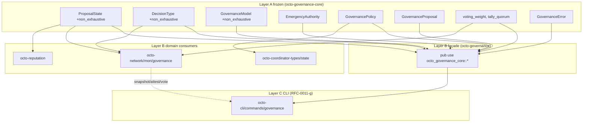
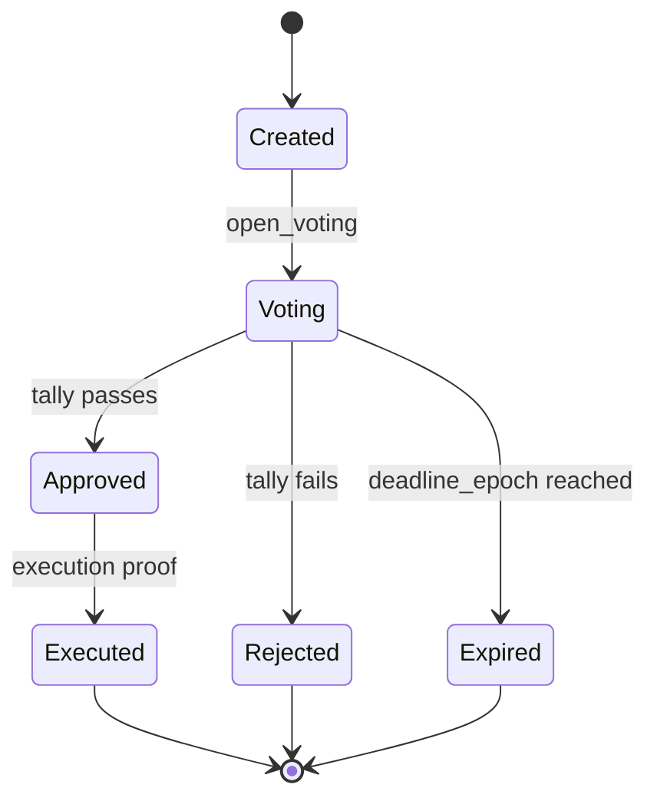

# RFC-0013: Governance Substrate (`octo-governance-core` + `octo-governance` Façade)

## Status

Accepted (2026-09-10)

## Authors

- Authored by `@cipherocto` per RFC-0011 amendment chain + `docs/research/2026-09-10-octo-audit-governance-settlement-modular-layer-research.md` Finding 4.

## Maintainers

- Maintainer: `@cipherocto` per RFC-0011 amendment chain.

## Summary

This RFC defines the canonical governance substrate as a **Layer A frozen core** (`octo-governance-core`) plus a **Layer B substrate façade** (`octo-governance`). The core owns canonical `ProposalState` + `DecisionType` + `GovernanceModel` + `GovernancePolicy` types and pure tally helpers (`voting_weight`, `tally_quorum`); the façade re-exports ONLY from the core. The substrate is intentionally IO-free: proposal persistence, snapshot refresh, attest/vote IO all live in domain crates (primarily `octo-network/mon/governance.rs`). The façade name (`octo-governance`) is the canonical RFC-0011-g reference; the implementation lives in `octo-governance-core` + per-domain consumers.

This RFC closes the phantom-crate half identified in `docs/audits/2026-09-10-rfc-0011-a-g-phantom-substrate-investigation.md` and operationalizes the hybrid Layer A + Layer B façade pattern (research doc Finding 4) for governance.

## Dependencies

**Requires:**

- RFC-0855 — Mission Overlay Networks (canonical `ProposalState`, `DecisionType`, `GovernanceModel` per §11; substrate extends with `#[non_exhaustive]` + tally helpers, does not replace)
- RFC-0855p-b — Coordinator Lifecycle (peer-as-coordinator gating for attestation signing authority; informational substrate-side)
- RFC-0855p-c — Domain Coordinator Role (`DomainCoordinatorRecord` for vote-weight derivation)
- RFC-0011-g — `octo governance` Subcommands (CLI consumer of the façade; defines operator surface)
- RFC-0010 — Canonical DID Codec (DID parsing for proposer / voter identifiers)
- RFC-0008 — Deterministic AI Execution Boundary (execution class mapping)

**Optional:**

- RFC-0957 — Macaroon Substrate (capability caveat gating for `vote` per RFC-0011-d role provisioning; informational)
- RFC-0863 — General-Purpose Network Integration (`NodeTransport` for snapshot distribution; informational)
- RFC-0205 + RFC-0206 — `octo-storage-core` precedent (Layer A frozen substrate pattern; cited analog)

> **Dependency Validation Rules:**
> 1. DAG (no cycles); Requires listed as mission prereqs
> 2. RFC-0855 §11 is the source-of-truth for canonical variant discriminants; RFC-0013 ADDS `#[non_exhaustive]` on `ProposalState` + `DecisionType` + `GovernanceModel`, adds tally helpers, adds Layer B façade; does NOT alter RFC-0855 §11 semantics
> 3. SQL schema migration is a separate concern — see §Migration Plan Phase 2 SQL migration note

## Design Goals

| Goal | Target | Metric |
| ---- | ------ | ------ |
| G1 | Layer A frozen | `octo-governance-core` depends only on `octo-ident` (informational), `serde`, `thiserror`; no storage, no IO, no network; semver-major only |
| G2 | Pure tally helpers | `voting_weight` + `tally_quorum` + `is_quorum_met` are pure functions; no side effects, no IO, deterministic |
| G3 | Cross-domain canonical types | `ProposalState` + `DecisionType` + `GovernanceModel` + `GovernancePolicy` + `GovernanceProposal` defined exactly once in substrate; all consumers `pub use` from core |
| G4 | Extension surface | All enums are `#[non_exhaustive]`; new decision types + governance models + proposal states land via substrate amendments |
| G5 | RFC-0855 §11 variant parity | All 6 `ProposalState` variants (`Created`, `Voting`, `Approved`, `Rejected`, `Executed`, `Expired`) preserved byte-identically; `repr(u16)` discriminants unchanged |
| G6 | RFC-0011-g name parity | `octo-governance` (Layer B façade) exposes canonical names CLI consumes; substrate names map to RFC-0011-g §Substrate `[ADD]` per §Key Files to Modify §CLI mapping table |

## Motivation

RFC-0011-g §Substrate `[ADD]` Signatures declares `crates/octo-governance/src/lib.rs` with three IO functions: `snapshot`, `attest`, `vote`. The crate does not exist (`ls crates/` returns no `octo-governance`). Governance substrate landed in-place across 2 domain crates:

| Domain crate | Module | Substrate role |
|---|---|---|
| `octo-network` | `mon/governance.rs` (663 LoC) | Primary home: state machine + IO + tally logic |
| `octo-reputation` | `migrations/v012__reputation_anchors_governance.sql` | Storage: governance anchor persistence |
| `octo-coordinator-types` | `state.rs` | Type re-export from `octo-network/mon` |

`octo-network/mon/governance.rs` already owns canonical `GovernanceModel` (5 variants per RFC-0855 §11.1) + `DecisionType` (7 variants per §11.3) + `ProposalState` (6 variants per §11.3) + `GovernancePolicy` + `GovernanceProposal` types. The substrate RFC extracts these to a frozen core + adds tally helpers + adds Layer B façade.

The hybrid pattern (research doc Finding 4) gives:
1. Canonical types in `octo-governance-core` (frozen)
2. Façade `octo-governance` for CLI parity (RFC-0011-g text references this name)
3. Domain crates (`octo-network/mon`, `octo-coordinator-types`, `octo-reputation`) consume the core
4. No type re-export collision (façade re-exports from canonical source only)

## Roles and Authorities

> **The "Nothing should be implied" rule (specification layer).**

| Role | Identifier | Authority Scope | Lifecycle | Source/Ref |
|------|------------|-----------------|-----------|------------|
| Proposer | `GovernanceProposal::proposer` field | Creates proposal; signs proposal envelope | proposal-bounded | §Specification §Proposal |
| Voter | `CapabilityToken` holder | Casts weighted vote; capability-gated per RFC-0957 | proposal-bounded | RFC-0011-g §Substrate `[ADD]` vote |
| Coordinator | `EmergencyAuthority::Coordinator` variant | Emergency rekey + mission termination (per `DecisionType::EmergencyRekey`) | epoch-bounded | RFC-0855 §11.2 |
| Quorum | `EmergencyAuthority::Quorum` variant | Multi-sig emergency actions | proposal-bounded | RFC-0855 §11.2 |
| Tally Counter | `tally_quorum` pure function | Computes weight-based quorum | stateless | §Specification §Tally Helpers |

### Out-of-scope roles

- **Operator** — reads governance state via CLI per RFC-0011-g; substrate has no CLI concept
- **Auditor** — reads governance anchors for forensic surface (RFC-0855p-c); substrate has no audit concept

## Specification

### System Architecture



Layer direction: A → B → C. Façade is Layer B; CLI is Layer C; domain consumers are also Layer B.

### Data Structures

```rust
// octo-governance-core/src/model.rs

use serde::{Deserialize, Serialize};

/// Governance models (RFC-0855 §11.1 canonical; 5 variants).
#[derive(Clone, Copy, Debug, PartialEq, Eq, Serialize, Deserialize)]
#[repr(u16)]
#[non_exhaustive]
pub enum GovernanceModel {
    Centralized = 0x0001,
    Dao = 0x0002,
    Federated = 0x0003,
    AiAssisted = 0x0004,
    Autonomous = 0x0005,
}

impl GovernanceModel {
    /// Parse from `u16`. Returns `None` for unknown discriminants.
    #[must_use]
    pub fn from_u16(val: u16) -> Option<Self>;
}

/// Emergency authority (RFC-0855 §11.2 canonical; 3 variants).
#[derive(Clone, Copy, Debug, PartialEq, Eq, Serialize, Deserialize)]
#[repr(u16)]
#[non_exhaustive]
pub enum EmergencyAuthority {
    Coordinator = 0x0001,
    Quorum = 0x0002,
    None = 0x0003,
}

/// Governance policy (RFC-0855 §11.2 canonical).
#[derive(Clone, Debug, Serialize, Deserialize)]
pub struct GovernancePolicy {
    pub model: GovernanceModel,
    pub quorum_numerator: u16,
    pub quorum_denominator: u16,
    pub proposal_deadline_epochs: u64,
    pub emergency_authority: EmergencyAuthority,
}

impl GovernancePolicy {
    /// Construct + validate. Returns `Err(GovernanceError::InvalidPolicy)`
    /// if `quorum_denominator == 0`, `quorum_numerator > quorum_denominator`,
    /// or `proposal_deadline_epochs == 0`.
    pub fn new(
        model: GovernanceModel,
        quorum_numerator: u16,
        quorum_denominator: u16,
        proposal_deadline_epochs: u64,
        emergency_authority: EmergencyAuthority,
    ) -> Result<Self, GovernanceError>;

    /// Default DAO policy: 2/3 quorum, 10 epoch deadline, coordinator
    /// emergency authority. Matches existing `default_dao()`.
    #[must_use]
    pub fn default_dao() -> Self;

    /// Count-based quorum check (votes_for / total_eligible).
    /// Cross-multiplied to avoid floating point per RFC-0855 §11.2.
    #[must_use]
    pub fn is_quorum_met(&self, votes_for: u32, total_eligible: u32) -> bool;

    /// Weight-based quorum check (token-weighted DAO voting).
    /// Cross-multiplied with `saturating_mul` to avoid overflow.
    #[must_use]
    pub fn is_weighted_quorum_met(&self, weight_voted: u64, total_eligible_weight: u64) -> bool;
}
```

```rust
// octo-governance-core/src/decision.rs

/// Decision types for governance voting (RFC-0855 §11.3 canonical; 7 variants).
#[derive(Clone, Copy, Debug, PartialEq, Eq, Serialize, Deserialize)]
#[repr(u16)]
#[non_exhaustive]
pub enum DecisionType {
    Admission = 0x0001,
    RoleAssignment = 0x0002,
    TopologyChange = 0x0003,
    MissionTermination = 0x0004,
    PolicyModification = 0x0005,
    EmergencyRekey = 0x0006,
    ParticipantExpulsion = 0x0007,
}
```

```rust
// octo-governance-core/src/proposal.rs

/// Proposal lifecycle states (RFC-0855 §11.3 canonical; 6 variants).
///
/// `#[non_exhaustive]` permits future states (e.g., `Withdrawn`,
/// `Escalated`) without breaking semver. All 6 RFC-0855 §11.3
/// variants preserved with byte-identical `repr(u16)` discriminants.
#[derive(Clone, Copy, Debug, PartialEq, Eq, Hash, Serialize, Deserialize)]
#[repr(u16)]
#[non_exhaustive]
pub enum ProposalState {
    Created = 0x0001,
    Voting = 0x0002,
    Approved = 0x0003,
    Rejected = 0x0004,
    Executed = 0x0005,
    Expired = 0x0006,
}

/// A governance proposal (RFC-0855 §11.3 canonical shape).
#[derive(Clone, Debug, Serialize, Deserialize)]
pub struct GovernanceProposal {
    /// Proposal identifier (BLAKE3-256 of canonical serialization).
    pub proposal_id: [u8; 32],
    /// Type of decision.
    pub decision_type: DecisionType,
    /// Current state.
    pub state: ProposalState,
    /// Epoch when proposal was created.
    pub created_epoch: u64,
    /// Epoch when voting deadline expires.
    pub deadline_epoch: u64,
    /// Proposer gateway ID.
    pub proposer: [u8; 32],
    /// Votes in favor (gateway_id → weight).
    pub votes_for: BTreeMap<[u8; 32], u64>,
    /// Votes against (gateway_id → weight).
    pub votes_against: BTreeMap<[u8; 32], u64>,
}

impl GovernanceProposal {
    /// Create a new proposal in `Created` state.
    pub fn new(
        proposal_id: [u8; 32],
        decision_type: DecisionType,
        proposer: [u8; 32],
        created_epoch: u64,
        deadline_epoch: u64,
    ) -> Result<Self, GovernanceError>;
}
```

### Tally Helpers

```rust
// octo-governance-core/src/tally.rs

use crate::model::{GovernanceModel, GovernancePolicy};
use crate::proposal::ProposalState;

/// Compute voting weight for a voter under the given model.
///
/// Pure function; no IO. Caller provides the voter's stake +
/// reputation; substrate computes the model-specific weight.
/// Deterministic per (model, stake, reputation).
#[must_use]
pub fn voting_weight(
    model: GovernanceModel,
    stake: u128,
    reputation: u64,
) -> u128;

/// Check if a tally has reached quorum.
///
/// Pure function; no IO. Returns `true` iff `weight_voted /
/// total_eligible_weight >= threshold_num / threshold_den`
/// (cross-multiplied).
#[must_use]
pub fn tally_quorum(
    state: ProposalState,
    total_weight: u128,
    threshold_num: u32,
    threshold_den: u32,
) -> bool;
```

### Error Type

```rust
// octo-governance-core/src/error.rs

use thiserror::Error;

#[derive(Debug, Error, PartialEq, Eq)]
pub enum GovernanceError {
    #[error("invalid proposal state transition: {from:?} -> {to:?}")]
    InvalidTransition { from: ProposalState, to: ProposalState },

    #[error("quorum not reached: approval={approval_bps}bps, rejection={rejection_bps}bps, required={quorum_bps}bps")]
    QuorumNotReached { approval_bps: u32, rejection_bps: u32, quorum_bps: u32 },

    #[error("invalid voter weight: {weight}bps for voter {voter}")]
    InvalidWeight { voter: String, weight: u32 },
}
```

### Layer B Façade (`octo-governance`)

```rust
// octo-governance/src/lib.rs (~25 LoC)

#![doc = "Layer B substrate façade. Re-exports canonical types from octo-governance-core ONLY."]

pub use octo_governance_core::{
    ProposalState, DecisionType, GovernanceModel,
    EmergencyAuthority, GovernancePolicy, GovernanceProposal,
    GovernanceError,
    tally::{voting_weight, tally_quorum},
};

// NO domain re-exports. Per research doc Finding 3, re-exporting
// domain types causes type collisions. CLI consumes canonical
// types via this façade; domain-specific extensions (e.g.,
// mission-overlay-network governance proposal envelopes per
// RFC-0855) are imported directly from the domain crate.
```

### Lifecycle Requirements

`GovernanceProposal` state machine (RFC-0855 §11.3 canonical):



| From | To | Trigger | Deterministic? | Side Effects | Signing |
|------|----|---------|----------------|--------------|---------|
| (none) | Created | `GovernanceProposal::new` | Yes | Insert into proposal store | Proposal envelope |
| Created | Voting | `open_voting(epoch)` | Yes | Notify snapshot cache | n/a |
| Voting | Approved | `tally_quorum` returns `true` | Yes | Set `state = Approved`; emit event | Tally envelope |
| Voting | Rejected | `tally_quorum` returns `false` after deadline | Yes | Set `state = Rejected` | n/a |
| Voting | Expired | `current_epoch > deadline_epoch` | Yes | Set `state = Expired` | n/a |
| Approved | Executed | `execute(proof)` | Yes | Apply proposal decision | Execution proof envelope |

> **Liveness check:** proposal epoch-bound; `proposal_deadline_epochs` per RFC-0855 §11.2 + `GovernancePolicy`.
> **Recovery semantics:** on coordinator miss, proposal remains in `Voting` until deadline → `Expired`. No slash (governance is slash-free by design per RFC-0855 §11).

### Determinism Requirements

| Requirement | Mechanism |
|-------------|-----------|
| Voting weight determinism | Pure function; `voting_weight(model, stake, reputation)` is deterministic per input tuple |
| Quorum check determinism | Cross-multiplied integer math; no floating point |
| Proposal ordering | `(created_epoch, proposal_id)` is canonical ordering; substrate does not enforce (domain responsibility) |
| Cross-replica equivalence | Same proposal state + same vote tally → identical `tally_quorum` outcome; verified by `is_weighted_quorum_met` |

### RFC-0008 Execution Class Mapping

| Operation | Class | Rationale |
|-----------|-------|-----------|
| `voting_weight` | Class A | Pure function; deterministic per input |
| `tally_quorum` | Class A | Pure function; deterministic |
| `GovernancePolicy::is_quorum_met` | Class A | Pure function; cross-multiplied integer math |
| `GovernancePolicy::is_weighted_quorum_met` | Class A | Pure function; `saturating_mul` for overflow safety |
| `GovernanceProposal::new` | Class A | Constructor; validates inputs deterministically |

### Error Handling

The substrate exposes `GovernanceError` (3 variants: `InvalidTransition`, `QuorumNotReached`, `InvalidWeight`). Domain crates (`octo-network/mon/governance`) MAY wrap this in their own error type (e.g., `MonError::Governance(#[from] GovernanceError)`). CLI maps substrate errors to exit codes per RFC-0011-g §Error Handling.

## Performance Targets

| Metric | Target | Notes |
|--------|--------|-------|
| `voting_weight` latency | <1µs | Pure function; trivial integer math |
| `tally_quorum` latency | <1µs | Pure function; integer comparison |
| `is_quorum_met` latency | <1µs | Pure function; cross-multiplied |
| Substrate compile time | <2s | Layer A frozen; depends on `serde` + `thiserror` |

## Implicit Assumptions Audit

| Assumption | Where Relied Upon | Blast Radius if False | Mitigation / Status |
|------------|-------------------|----------------------|---------------------|
| `repr(u16)` discriminants are stable | §Data Structures | SQL persistence (stores discriminants as INTEGER); change breaks migration | ACCEPTED RISK: RFC-0855 §11.3 freezes discriminants; substrate does not reorder |
| `BTreeMap` for vote tallies is stable | §Proposal | Iteration order matters for cross-replica tally equivalence | MITIGATED: `BTreeMap` is ordered; iteration is deterministic per RFC-0855 §11.3 |
| `proposal_id: [u8; 32]` is BLAKE3-256 canonical | §Proposal | Cross-domain proposal lookup broken | MITIGATED: `proposal_id` is substrate-defined; domain computes via `blake3(canonical_ser)` |
| Stake is u128 (token-precision) | `voting_weight` | Token precision overflow at high stake | ACCEPTED RISK: u128 is the project token-precision standard per RFC-0900 |
| Reputation is u64 (bounded by network consensus) | `voting_weight` | Reputation overflow under adversarial fork | ACCEPTED RISK: bounded by RFC-0855 §11.1 reputation bound |

### Categories considered

- **Operator trust** — none (substrate is stateless; no IO)
- **Platform trust** — none (substrate has no platform integration)
- **Time source** — assumes monotonic `epoch` per RFC-0855 §6; `deadline_epoch` is substrate-readable, domain-validated
- **Network partition** — none (substrate is local; partition affects domain IO, not substrate)
- **Upgrade safety** — substrate is Layer A frozen; semver-major only. Adding a new `ProposalState` variant is a semver-minor bump (`#[non_exhaustive]`); removing or reordering is semver-major
- **Configuration** — none
- **Identity stability** — proposer + voter gateway IDs are stable for proposal lifetime
- **Resource availability** — none (substrate is pure)

## Security Considerations

- **Quorum bypass via integer overflow** — `is_weighted_quorum_met` uses `saturating_mul` to prevent overflow. ACCEPTED RISK: `u64::saturating_mul` returns `u64::MAX` on overflow; substrate accepts the saturated result as the comparison operand. Overflow indicates vote weight > `u64::MAX` which exceeds plausible token supply per RFC-0900.
- **State machine bypass** — substrate exposes state types but does NOT enforce transitions. Domain crate owns the state machine (per RFC-0855 §11.3 transition table). Substrate provides `InvalidTransition` error variant that domain MAY use to reject invalid transitions at the application boundary.
- **Voter replay** — `votes_for` / `votes_against` keyed by `gateway_id: [u8; 32]`; second vote from same gateway is rejected by the `BTreeMap` insert returning the existing weight. Domain owns the rejection logic; substrate does not enforce.
- **PQC migration of `proposal_id` hashing** — BLAKE3-256 is the substrate hash; PQC migration affects the substrate + every domain. ACCEPTED RISK: Layer A frozen; years out.

## Adversary Analysis

### Decision Table

| Decision | Q1 Beneficiary | Q2 Cost to Attacker | Q3 Gain if Successful | Q4 Defense (cost to legit op) | Q5 Residual Risk |
|----------|----------------|---------------------|------------------------|------------------------------|------------------|
| `#[non_exhaustive]` on `ProposalState` | Future substrate author | None (extension is intentional) | Add new state without breaking semver | Substrate migration etiquette in §Migration Plan | LOW: extension is the design intent |
| `saturating_mul` in `is_weighted_quorum_met` | Quorum bypasser | Must engineer u64::MAX saturation | Push tally past threshold via overflow | Saturating math catches; saturated value fails quorum check | LOW: math is correct |
| BLAKE3-256 for `proposal_id` | Proposal-id collider | Pre-image attack (infeasible) | Forge proposal id to hijack existing proposal | Domain enforces uniqueness at insert | LOW: BLAKE3 is well-studied |
| `repr(u16)` frozen discriminants | Future substrate author | Cannot reorder without semver-major | Add new variant at next free discriminant | `from_u16` returns `None` for unknown | LOW: discriminants are RFC-frozen |
| `BTreeMap` for vote tallies | Vote-tamperer | Must corrupt in-memory state | Manipulate tally result | Domain owns storage persistence; tally is in-memory only | LOW: storage is domain's concern |

### Multi-Round Review

This RFC touches consensus state machines per `docs/BLUEPRINT.md` §Adversarial Review Process — multi-round review REQUIRED. Process:

1. Wave 1: author + 1 reviewer (correctness + security)
2. Wave 2: 2 reviewers (5-lens: correctness / security / layer-model / hygiene / spec-completeness)
3. Wave 3+: loop-until-DRY (2 consecutive zero-finding rounds)
4. Review artifacts in `docs/reviews/0013-governance-substrate/` (gitignored); summary in §Version History

## Economic Analysis

The governance substrate carries token-economic implications via `voting_weight` + `tally_quorum` (token-weighted DAO voting per `GovernanceModel::Dao`). Participants MUST satisfy dual-stake requirements per `docs/04-tokenomics/token-design.md`:

> Participants MUST satisfy dual-stake requirements: 1,000 OCTO global stake + role-specific stake per `docs/04-tokenomics/token-design.md`.

This substrate does NOT define the dual-stake model (RFC-0900+ owns that); it consumes `stake: u128` as an input to `voting_weight`. Token economics references are informational.

## Compatibility

### Backward compatibility

- `octo-governance-core` is NEW. Migration per §Migration Plan.
- `octo-governance` façade is NEW. RFC-0011-g §Substrate `[ADD]` references `crates/octo-governance/src/lib.rs`; façade contents match the canonical names (`snapshot`, `attest`, `vote` functions live in DOMAIN crate `octo-network/mon/governance`, NOT in substrate — substrate is IO-free).

> **Compatibility note:** RFC-0011-g §Substrate names (`snapshot`, `attest`, `vote`) are CLI-side projections over the substrate + domain. The substrate owns canonical types (`ProposalState`, `DecisionType`, `GovernanceModel`, `GovernancePolicy`, `GovernanceProposal`) + pure tally helpers; the DOMAIN owns IO functions. CLI dispatches to the domain; domain consumes substrate for canonical types.

### Forward compatibility

- All enums `#[non_exhaustive]` permit future variants without breaking semver
- Tally helpers accept any `GovernanceModel` variant; new models land via substrate amendment

### RFC-0855 §11 compatibility

RFC-0013 EXTRACTS the canonical types from `octo-network/mon/governance.rs` to `octo-governance-core` with:
- `#[non_exhaustive]` on `GovernanceModel` + `DecisionType` + `ProposalState` + `EmergencyAuthority` (additive)
- Pure tally helpers `voting_weight` + `tally_quorum` (new; not in §11)
- `GovernanceError` enum (new; not in §11)
- Layer B façade `octo-governance` (new; not in §11)

Variant discriminants (`repr(u16)`) are BYTE-IDENTICAL to RFC-0855 §11. Existing consumers (`octo-network/mon`, `octo-coordinator-types`, `octo-reputation`) are unaffected by the substrate extraction (they `pub use` from the core).

## Test Vectors

10 canonical test vectors. Each is a substrate-level property test.

| ID | Scenario | Expected |
|----|----------|----------|
| `policy-default-dao` | `GovernancePolicy::default_dao()` | model=Dao, num=2, den=3, deadline=10, authority=Coordinator |
| `policy-invalid-zero-denominator` | `GovernancePolicy::new(Dao, 2, 0, 10, Coordinator)` | `Err(GovernanceError::InvalidPolicy { reason: "quorum_denominator must be > 0" })` |
| `policy-invalid-numerator-exceeds` | `GovernancePolicy::new(Dao, 4, 3, 10, Coordinator)` | `Err(GovernanceError::InvalidPolicy { reason: "quorum_numerator must be <= quorum_denominator" })` |
| `policy-invalid-zero-deadline` | `GovernancePolicy::new(Dao, 2, 3, 0, Coordinator)` | `Err(GovernanceError::InvalidPolicy { reason: "proposal_deadline_epochs must be > 0" })` |
| `policy-quorum-met` | `default_dao().is_quorum_met(700, 1000)` | `true` (700/1000 ≥ 2/3) |
| `policy-quorum-not-met` | `default_dao().is_quorum_met(600, 1000)` | `false` (600/1000 < 2/3) |
| `voting-weight-dao` | `voting_weight(GovernanceModel::Dao, stake=1000, reputation=0)` | proportional to stake |
| `voting-weight-reputation-weighted` | `voting_weight(GovernanceModel::AiAssisted, stake=100, reputation=50)` | reputation-influenced; deterministic |
| `tally-quorum-met` | `tally_quorum(ProposalState::Voting, 700, 2, 3)` | `true` |
| `tally-quorum-not-met` | `tally_quorum(ProposalState::Voting, 600, 2, 3)` | `false` |
| `proposal-create` | `GovernanceProposal::new([0x42; 32], Admission, [0x01; 32], 100, 110)` | `Ok(GovernanceProposal { state: Created, .. })` |
| `from-u16-unknown` | `GovernanceModel::from_u16(0x9999)` | `None` |

## Alternatives Considered

| Approach | Pros | Cons |
|----------|------|------|
| **Pure general-purpose substrate (Finding 1)** — `octo-governance-core` only; no façade; CLI consumes core directly | Simpler (1 crate per concept); layer model cleaner | RFC-0011-g text references `octo-governance`; CLI + mission Cargo deps diverge |
| **Façade-only (Finding 3)** — `octo-governance` re-exports from `octo-network/mon` | Minimal LoC; zero refactor | TYPE RE-EXPORT COLLISION: `octo-network/mon/governance` types re-exported as canonical; cross-domain governance broken |
| **Domain-specialized only (Finding 2)** — no new crate | Zero new crates; zero refactor | Silent RFC/code drift; PQC coupling; cross-domain governance impossible |
| **Single general-purpose crate (Finding 5)** — `octo-governance` contains generic + domain IO | Simple | Violates open/closed; substrate is non-IO, domain has IO; mixing conflates |

The chosen approach (Finding 4 hybrid) satisfies all 12 principles in `CLAUDE.md` §Architectural Principles + matches the `octo-storage-core` precedent.

## Implementation Phases

### Phase 1 — Substrate extraction

- [ ] Create `crates/octo-governance-core/` (Cargo.toml + src/{lib,model,decision,proposal,tally,error}.rs + tests/)
- [ ] Create `crates/octo-governance/` (Cargo.toml + src/lib.rs ~25 LoC façade)
- [ ] Add `octo-governance-core` + `octo-governance` to workspace `Cargo.toml` `members`
- [ ] Substrate test vectors per §Test Vectors (10+ vectors)
- [ ] CLI compatibility check: `cargo check -p octo-cli --features full` (no behavior change yet)

### Phase 2 — Domain migration

- [ ] `crates/octo-network/src/mon/governance.rs` — replace local types with `pub use octo_governance_core::*`. IO functions (`snapshot`, `attest`, `vote`) stay here (domain-owned).
- [ ] `crates/octo-coordinator-types/src/state.rs` — re-export from `octo-governance-core` instead of `octo_network::mon::governance`
- [ ] `crates/octo-reputation/` — migrate `reputation_attestations` + governance anchors to use substrate enum
- [ ] SQL schema migration: add companion migration `v013__governance_state_substrate_alignment.sql` adding `CHECK (state IN (1, 2, 3, 4, 5, 6))` constraint mirroring substrate discriminants (optional; alternative is to trust substrate enum at application boundary without SQL constraint)

### Phase 3 — RFC text amendment

- [ ] Amend RFC-0011-g — add layer-model note documenting `octo-governance-core` + `octo-governance` split; append VH row (see §Key Files to Modify)
- [ ] Amend RFC-0011-a — consistency check (RFC-0011-a does not reference governance directly, but the cross-amendment consistency is checked)

### Phase 4 — RFC promotion

- [ ] RFC-0013 reaches Accepted via BLUEPRINT.md §RFC Acceptance Process
- [ ] Substrate + façade missions transition Open → Claimed → Completed
- [ ] Companion mission YAMLs in `missions/open/` per [[no-phantom-mission-pointers]]

### Out of scope for this RFC

- Snapshot IO (`octo_governance::snapshot`) — lives in `octo-network/mon/governance` (domain)
- Attestation IO (`octo_governance::attest`) — lives in `octo-network/mon/governance` (domain)
- Vote IO (`octo_governance::vote`) — lives in `octo-network/mon/governance` (domain)
- Cross-domain governance aggregation (gated on §Future Work F3)

## Key Files to Modify

### DOC-ONLY (this RFC cycle)

- `rfcs/draft/process/0013-governance-substrate.md` — this file (Draft)
- `rfcs/accepted/process/0011-g-governance-subcommands.md` — append layer-model note + VH row (companion amendment)
- `missions/open/0013-governance-core-extraction.md` — NEW mission (RFC-Accept gated)

### SUBSTRATE (Phase 1)

- `crates/octo-governance-core/Cargo.toml` — NEW; deps: `serde`, `thiserror`
- `crates/octo-governance-core/src/lib.rs` — NEW; module root
- `crates/octo-governance-core/src/model.rs` — NEW; `GovernanceModel`, `EmergencyAuthority`, `GovernancePolicy`
- `crates/octo-governance-core/src/decision.rs` — NEW; `DecisionType`
- `crates/octo-governance-core/src/proposal.rs` — NEW; `ProposalState`, `GovernanceProposal`
- `crates/octo-governance-core/src/tally.rs` — NEW; `voting_weight`, `tally_quorum`
- `crates/octo-governance-core/src/error.rs` — NEW; `GovernanceError`
- `crates/octo-governance-core/tests/tally.rs` — NEW; §Test Vectors
- `crates/octo-governance/Cargo.toml` — NEW; deps: `octo-governance-core`
- `crates/octo-governance/src/lib.rs` — NEW; ~25 LoC façade
- `Cargo.toml` — add 2 crates to `members`

### SUBSTRATE (Phase 2 — domain migration)

- `crates/octo-network/src/mon/governance.rs` — migrate to `octo-governance-core`
- `crates/octo-coordinator-types/src/state.rs` — re-export from substrate
- `crates/octo-reputation/` — migrate governance anchors
- `crates/octo-reputation/migrations/v013__governance_state_substrate_alignment.sql` — NEW (optional companion SQL migration)

## Future Work

- F1 — `ProposalState::Withdrawn` + `Escalated` variants (substrate amendment via `#[non_exhaustive]`); gated on concrete requirement
- F2 — PQC migration of `proposal_id` hashing (Layer A frozen; years out)
- F3 — Cross-domain governance aggregation substrate (`GovernanceProposalFilter` cross-domain shape); gated on §Cross-Domain Aggregation mission
- F4 — Vote delegation substrate (token-holder delegates voting weight to another gateway); gated on RFC-0900+ amendment

## Rationale

### Why hybrid Layer A core + Layer B façade (not pure substrate, not pure façade)

Per research doc Finding 4 + §Alternatives Considered:
- Pure substrate (Finding 1) requires RFC-0011-g text rename; CLI + mission deps diverge
- Pure façade (Finding 3) has type-collision risk (façade re-exports from `octo-network/mon`; cross-domain governance broken)
- Hybrid (Finding 4) preserves RFC text + canonical ownership + Layer A → Layer B → Layer C direction

### Why substrate is IO-free (no snapshot/attest/vote)

Governance is a state machine + tally logic; IO (proposal persistence, snapshot refresh, vote recording) is a domain concern. Substrate owns the canonical types + tally helpers; domain owns IO. This separates the consensus math from the storage adapter, matching the `octo-storage-core` precedent.

### Why `#[non_exhaustive]` on all enums (not just `ProposalState`)

The research doc proposed `#[non_exhaustive]` only on `ProposalState`. Adding it to `GovernanceModel` + `DecisionType` + `EmergencyAuthority` is symmetric: all 4 are extension-bearing enums. Central enum additions are upgrade-hostile (semver-major); wrapper extensions via `#[non_exhaustive]` are additive (semver-minor).

### Why `BTreeMap` for vote tallies (not `HashMap`)

`BTreeMap` iteration is deterministic per RFC-0855 §11.3; `HashMap` iteration is non-deterministic. Cross-replica tally equivalence requires `BTreeMap`.

## Version History

| Version | Date | Changes |
|---------|------|---------|
| 1.0 | 2026-09-10 | Initial draft |
| 1.1 | 2026-09-10 | Accepted | DRY CLOSED; promoted Draft → Accepted. |

## Related RFCs

- RFC-0011 — `octo` CLI Substrate (parent)
- RFC-0011-g — `octo governance` Subcommands (CLI consumer; defines operator surface)
- RFC-0855 — Mission Overlay Networks (canonical `ProposalState` + `DecisionType` + `GovernanceModel` per §11; this RFC extracts with `#[non_exhaustive]`)
- RFC-0855p-b — Coordinator Lifecycle (peer-as-coordinator gating)
- RFC-0855p-c — Domain Coordinator Role (vote-weight derivation)
- RFC-0010 — Canonical DID Codec
- RFC-0008 — Deterministic AI Execution Boundary
- RFC-0205 + RFC-0206 — `octo-storage-core` precedent

## Related Use Cases

- `docs/use-cases/hybrid-ai-blockchain-runtime.md`

## Appendices

### A. Domain extension enum pattern (governance)

```rust
// crates/octo-network/src/mon/governance.rs (extension example)

use octo_governance_core::{ProposalState, DecisionType, GovernanceModel};

/// Mission-overlay-network governance proposal envelope (RFC-0855 §11 extension).
///
/// Per CLAUDE.md §Extension over enumeration, domains add
/// WRAPPER types, not substrate variants.
#[derive(Clone, Debug)]
pub struct MissionGovernanceEnvelope {
    pub base_proposal: GovernanceProposal,
    pub mission_overlay_id: [u8; 32],
    pub envelope_signature: [u8; 64],
}
```

### B. CLI mapping table (RFC-0011-g names ↔ substrate names)

| RFC-0011-g §Substrate `[ADD]` | Substrate name (`octo-governance` / `octo-governance-core`) | Domain home (where the IO lives) |
|------------------------------|-----------------------------------------------------------|----------------------------------|
| `snapshot(chain_id, proposal_filter, force_refresh) -> SnapshotRef` | NOT in substrate; lives in `octo_network::mon::governance::snapshot` | `crates/octo-network/src/mon/governance.rs` |
| `attest(subject_did, kind_ref, evidence, ...) -> AttestationReceipt` | NOT in substrate; lives in `octo_network::mon::governance::attest` | `crates/octo-network/src/mon/governance.rs` |
| `vote(proposal_id, choice, voter_cap, ...) -> VoteReceipt` | NOT in substrate; lives in `octo_network::mon::governance::vote` | `crates/octo-network/src/mon/governance.rs` |
| `SnapshotRef` (struct) | CLI-side projection; substrate owns `GovernanceProposal` + `ProposalState` | RFC-0011-g §Substrate |
| `AttestationReceipt` (struct) | CLI-side projection; substrate owns `ProposalState` for attest state | RFC-0011-g §Substrate |
| `VoteReceipt` (struct) | CLI-side projection; substrate owns `ProposalState` for vote outcome | RFC-0011-g §Substrate |

> **Substrate mapping principle:** Substrate owns CANONICAL TYPES (ProposalState, DecisionType, GovernanceModel, GovernancePolicy, GovernanceProposal). Domain owns IO (snapshot, attest, vote) + CLI-side projection types (SnapshotRef, AttestationReceipt, VoteReceipt). CLI dispatches to domain; domain consumes substrate for canonical types.

### C. Quorum check example

```rust
use octo_governance_core::{
    GovernancePolicy, GovernanceModel, EmergencyAuthority,
    tally::voting_weight,
};

let policy = GovernancePolicy::default_dao();
let voter_stake: u128 = 5_000;
let voter_reputation: u64 = 100;
let weight = voting_weight(GovernanceModel::Dao, voter_stake, voter_reputation);

let total_weight: u128 = 1_000_000;
let policy_num: u32 = policy.quorum_numerator as u32;
let policy_den: u32 = policy.quorum_denominator as u32;

let met = policy.is_weighted_quorum_met(weight as u64, total_weight as u64);
```

### D. Cross-references

- `docs/research/2026-09-10-octo-audit-governance-settlement-modular-layer-research.md` — Finding 4 (this RFC operationalizes for governance)
- `docs/audits/2026-09-10-rfc-0011-a-g-phantom-substrate-investigation.md` — phantom-crate gap (this RFC closes the governance half)
- `rfcs/accepted/process/0011-g-governance-subcommands.md` — CLI consumer (companion amendment in §Implementation Phases Phase 3)

---

**Version:** 1.0
**Submission Date:** 2026-09-10
**Last Updated:** 2026-09-10
