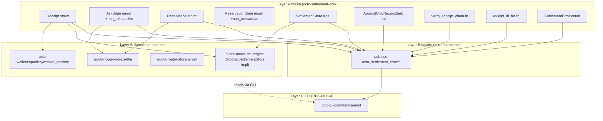

# RFC-0014: Settlement Substrate (`octo-settlement-core` + `octo-settlement` Façade)

## Status

Accepted (2026-09-10)

## Authors

- Authored by `@cipherocto` per RFC-0011 amendment chain + `docs/research/2026-09-10-octo-audit-governance-settlement-modular-layer-research.md` Finding 4.

## Maintainers

- Maintainer: `@cipherocto` per RFC-0011 amendment chain.

## Summary

This RFC defines the canonical settlement substrate as a **Layer A frozen core** (`octo-settlement-core`) plus a **Layer B substrate façade** (`octo-settlement`). The core owns the canonical `Receipt` struct (RFC-0959 §Data Structures), `AskState` enum (RFC-0959 §State Machine), `SettlementStore` trait (canonical interface; implementations are domain-owned), `SettlementError` enum, and pure helpers (`receipt_id_for`, `verify_receipt_chain`). The façade re-exports ONLY from the core. Domain crates (`quota-router-sm-engine` for storage adapter + IO, `quota-router-core/src/settle.rs` for orchestration, `octo-wallet/src/capability/market_delivery.rs` for wallet-side consumer) consume the core for canonical types. The façade name (`octo-settlement`) is the canonical RFC-0011-a reference; the implementation lives in `octo-settlement-core` + per-domain consumers.

This RFC closes the phantom-crate half identified in `docs/audits/2026-09-10-rfc-0011-a-g-phantom-substrate-investigation.md` and operationalizes the hybrid Layer A + Layer B façade pattern (research doc Finding 4) for settlement.

> **Source-of-truth note:** canonical `Receipt` + `AskState` + `SettlementError` types already exist in `crates/quota-router-sm-engine/src/lib.rs` (verified 2026-09-10). This RFC EXTRACTS them to `octo-settlement-core` (Layer A frozen) and adds the `SettlementStore` trait (currently lives in `store.rs`) + the `AppendOnlyReceiptSink` trait + chain-integrity helpers. Field shapes are byte-identical; existing consumers are unaffected.

## Dependencies

**Requires:**

- RFC-0959 — Ask Settlement Chain (canonical `Receipt` + `AskState` + state machine per §Data Structures + §State Machine; substrate extracts with `#[non_exhaustive]` + adds `AppendOnlyReceiptSink` + chain helpers)
- RFC-0959 — Settlement Cost DQA Migration (`amount_dqa` semantics per cost-dqa-migration)
- RFC-0959 — Burn Event Wire Form (receipt burn-event references for cost-event linkage)
- RFC-0959 — Market Delivery (market-delivery receipts are a subset of the audit surface per RFC-0011-a §Dependencies)
- RFC-0960 — Vault Balance Projection Substrate (`Reservation` + `ReservationState` co-located; canonical home is `octo-settlement-core`; substrate extracts)
- RFC-0960 §2.3 — Reservation State Machine (8-variant canonical state per RFC-0960 §2.3)
- RFC-0011-a — `octo audit` Subcommands (CLI consumer; reads receipts via the `SettlementStore` trait)
- RFC-0008 — Deterministic AI Execution Boundary (execution class mapping)

**Optional:**

- RFC-0917 — HTTP Proxy + Python SDK (programmatic receipt access; substrate exposes the canonical trait for both consumers)
- RFC-0205 + RFC-0206 — `octo-storage-core` precedent (Layer A frozen substrate pattern; cited analog)

> **Dependency Validation Rules:**
>
> 1. DAG (no cycles); Requires listed as mission prereqs
> 2. RFC-0959 §Data Structures + §State Machine is the source-of-truth for canonical `Receipt` + `AskState` field shape and variant semantics; RFC-0014 EXTRACTS them to `octo-settlement-core` (frozen), ADDS `#[non_exhaustive]` on enums, ADDS `AppendOnlyReceiptSink` trait, ADDS chain-integrity helpers; does NOT alter RFC-0959 semantics
> 3. SQL schema migration is a separate concern — see §Migration Plan Phase 2 SQL migration note

## Design Goals

| Goal | Target                                  | Metric                                                                                                                                                                            |
| ---- | --------------------------------------- | --------------------------------------------------------------------------------------------------------------------------------------------------------------------------------- |
| G1   | Layer A frozen                          | `octo-settlement-core` depends only on `serde` + `thiserror` + `blake3`; no storage backend, no stoolap, no filesystem; semver-major only                                         |
| G2   | Trait-based canonical storage interface | `SettlementStore` is the canonical interface; multiple impls permitted (`StoolapSettlementStore`, `InMemorySettlementStore`, future `PostgresSettlementStore`)                    |
| G3   | Type-level append-only                  | `AppendOnlyReceiptSink::append` requires `&mut self`; no `delete` / `update` / `clear` method exists on the trait                                                                 |
| G4   | Cross-domain canonical types            | `Receipt` + `AskState` + `SettlementStore` defined exactly once in substrate; all consumers `pub use` from core                                                                   |
| G5   | Extension surface                       | `AskState` + `ReservationState` are `#[non_exhaustive]`; new states land via substrate amendments                                                                                 |
| G6   | RFC-0959 variant parity                 | All 3 `AskState` variants (`Minted`, `Settled`, `Consumed`) preserved byte-identically with SQL strings (`as_sql`); all 8 `ReservationState` variants preserved byte-identically  |
| G7   | RFC-0011-a name parity                  | `octo-settlement` (Layer B façade) exposes the canonical name RFC-0011-a §Substrate references; substrate names map to CLI projection per §Key Files to Modify §CLI mapping table |

## Motivation

RFC-0011-a §Substrate Compatibility declares `octo-audit` as NEW and `octo-settlement` (Layer B per RFC-0959) as the source of truth for `SettlementReceipt`. RFC-0011-a §Key Files to Modify says "`octo-settlement` (Layer B per RFC-0959) for the `ReceiptRecord` projection". The crate does not exist (`ls crates/` returns no `octo-settlement`). Settlement substrate landed in-place inside the `quota-router-sm-engine` crate:

| File                                                   | What                                          |
| ------------------------------------------------------ | --------------------------------------------- |
| `crates/quota-router-core/src/settle.rs`               | Settlement engine (orchestration)             |
| `crates/quota-router-storage/src/ask.rs`               | Ask/settlement persistence                    |
| `crates/quota-router-sm-engine/src/state_machine.rs`   | `Receipt`, `AskState`, state transition logic |
| `crates/quota-router-sm-engine/src/store.rs`           | `SettlementStore` trait + `StoolapStore` impl |
| `crates/quota-router-sm-engine/src/lib.rs`             | Crate root re-exports                         |
| `crates/octo-wallet/src/capability/market_delivery.rs` | Wallet-side settlement consumer               |

The substrate RFC extracts the canonical types to a frozen Layer A core and adds the Layer B façade for RFC-0011-a name parity. The hybrid pattern gives:

1. Canonical `Receipt` + `AskState` + `SettlementStore` + `Reservation` + `ReservationState` types in `octo-settlement-core` (frozen)
2. Façade `octo-settlement` re-exports ONLY from the core (no domain leakage)
3. Domain crates (`quota-router-sm-engine`, `quota-router-core`, `octo-wallet/capability/market_delivery`) consume the core for canonical types + add their own IO + storage adapters
4. CLI (RFC-0011-a Layer C) consumes `octo-settlement` (façade) and gets canonical receipt types; CLI projection types (`AuditListOutput.receipts`, etc.) live in the CLI, not the substrate

## Roles and Authorities

> **The "Nothing should be implied" rule (specification layer).**

| Role            | Identifier                               | Authority Scope                                    | Lifecycle           | Source/Ref                |
| --------------- | ---------------------------------------- | -------------------------------------------------- | ------------------- | ------------------------- |
| Asker           | `Ask.holder_did` field                   | Creates ask; binds capability                      | ask-bounded         | RFC-0959 §Data Structures |
| Router          | `Receipt.router_id` field                | Settles ask; signs receipt                         | receipt-bounded     | RFC-0959 §Data Structures |
| Consumer        | `AppendOnlyReceiptSink::consume`         | Marks receipt as consumed (terminal)               | receipt-bounded     | §Specification §Trait     |
| Storage Adapter | `SettlementStore` impl                   | Domain-owned (stoolap, in-memory, future postgres) | long-lived          | §Specification §Trait     |
| Reserver        | `Reservation::mint`                      | Pre-auth escrow against ask                        | reservation-bounded | RFC-0960 §2.3             |
| Auditor         | reads receipt via `SettlementStore::get` | Forensic read access                               | stateless           | RFC-0011-a §Compatibility |

### Out-of-scope roles

- **Operator** — reads receipts via CLI per RFC-0011-a; substrate has no CLI concept
- **Market contract** — emits asks (RFC-0959 §Market Delivery); substrate has no market concept

## Specification

### System Architecture



Layer direction: A → B → C. Façade is Layer B; CLI is Layer C; domain consumers are also Layer B (storage adapter) or Layer C (orchestration).

### Data Structures

```rust
// octo-settlement-core/src/receipt.rs

use serde::{Deserialize, Serialize};

/// Receipt record (RFC-0959 §Data Structures canonical; byte-identical
/// field shape from `crates/quota-router-sm-engine/src/lib.rs`).
#[derive(Clone, Debug, PartialEq, Eq, Serialize, Deserialize)]
pub struct Receipt {
    /// BLAKE3-256 of canonical receipt serialization (per `receipt_id_for`).
    pub receipt_id: [u8; 32],
    /// Ask being settled (RFC-0959 ask_id).
    pub ask_id: [u8; 32],
    /// BLAKE3-256 of `blake3(canonical_ser(ask || receipt))` — locked at settle.
    pub settlement_hash: [u8; 32],
    /// Router node identifier that settled the ask.
    pub router_id: String,
    /// Router signature over the canonical receipt serialization.
    pub router_sig: Vec<u8>,
    /// Unix timestamp at which settlement was finalized.
    pub timestamp_unix: u64,
}

impl Receipt {
    /// Canonical serialization for BLAKE3 hashing. Length-prefixed
    /// per RFC-0957-A1 §F3 discipline to prevent concatenation-collision.
    #[must_use]
    pub fn canonical_bytes(&self) -> Vec<u8>;

    /// Compute `receipt_id = BLAKE3-256(canonical_bytes(self))`.
    /// Use `receipt_id_for` if you have an `Ask` and want the
    /// pre-image derived content-addressed id.
    #[must_use]
    pub fn compute_receipt_id(&self) -> [u8; 32];
}
```

```rust
// octo-settlement-core/src/state.rs

use serde::{Deserialize, Serialize};

/// Ask state (RFC-0959 §State Machine canonical; 3 variants).
///
/// `#[non_exhaustive]` permits future states (e.g., `Disputed`,
/// `Refunded`) without breaking semver. All 3 RFC-0959 variants
/// preserved with byte-identical SQL strings (`as_sql`).
#[derive(Clone, Copy, Debug, PartialEq, Eq, Hash, Serialize, Deserialize)]
#[non_exhaustive]
pub enum AskState {
    /// Initial state after `mint_with_zk()` succeeds.
    /// ask_id, holder, axes recorded.
    Minted,
    /// Receipt settled; settlement_hash locked; ready for consumption.
    Settled,
    /// Terminal; receipt_index row written; settlement complete.
    Consumed,
}

impl AskState {
    /// SQL representation (matches migrations/001_create_asks.sql
    /// CHECK constraint per RFC-0959 §State Machine).
    #[must_use]
    pub const fn as_sql(&self) -> &'static str;

    /// Parse from SQL string. Returns `None` for unknown discriminants.
    #[must_use]
    pub fn from_sql(s: &str) -> Option<Self>;
}

/// Reservation state (RFC-0960 §2.3 canonical; 8 variants).
///
/// `#[non_exhaustive]` permits future states (e.g., `Escalated`,
/// `SettledWithPenalty`) without breaking semver. All 8 RFC-0960 §2.3
/// variants preserved with byte-identical SQL strings.
#[derive(Clone, Copy, Debug, PartialEq, Eq, Hash, Serialize, Deserialize)]
#[non_exhaustive]
pub enum ReservationState {
    /// Pre-auth holds the amount; capability bound.
    Reserved,
    /// Provider is executing the requested operation.
    Executing,
    /// Proof attached; awaiting audit window.
    Settled,
    /// Inside dispute window.
    Auditable,
    /// Terminal; transfers applied; reservation closed.
    Released,
    /// Deadline passed before settlement arrived.
    Expired,
    /// Explicit cancel by capability holder.
    Cancelled,
    /// Dispute filed; transfers not applied.
    Frozen,
}

impl ReservationState {
    /// SQL representation (matches reservations migration CHECK constraint).
    #[must_use]
    pub const fn as_sql(&self) -> &'static str;
}
```

```rust
// octo-settlement-core/src/reservation.rs

use serde::{Deserialize, Serialize};
use crate::state::ReservationState;

/// Reservation record (RFC-0960 §2.3 canonical).
///
/// Step 6 of the 11-step exercise instantiates one of these. Replaces
/// the prior `blake3::hash(ask_id || b"escrow/v1")` placeholder per
/// RFC-0960 R1-F1 finding. Domain separator
/// `cipherocto/reservation/v1/` per RFC-0105 DqaEncoding-prefix
/// cross-reference pattern (canonical namespacing).
#[derive(Clone, Debug, PartialEq, Eq, Serialize, Deserialize)]
pub struct Reservation {
    /// BLAKE3(canonical_ser(reservation_unsigned)) — content-addressed.
    pub reservation_id: [u8; 32],
    /// Vault that authorizes this reservation (RFC-0960 §2.1).
    pub vault_id: [u8; 32],
    /// Capability bound to this reservation (RFC-0957 macaroon).
    pub capability_id: [u8; 32],
    /// Ask being pre-authed against (RFC-0959 ask_id).
    pub ask_id: [u8; 32],
    /// Resource axis being reserved (e.g., "input_tokens_per_1k").
    pub resource_axis: String,
    /// Amount in micro-units (OCTO_W micro-precision per RFC-0959).
    pub amount_micro: u128,
    /// Hard deadline for settlement to arrive.
    pub expires_at_unix: u64,
    /// Audit window duration (RFC-0960 §6); 0 = instant release.
    pub audit_window_secs: u64,
    /// Current state in the audit-window state machine.
    pub state: ReservationState,
    /// Optional link to a SettlementReceipt once settlement lands.
    pub settlement_ref: Option<[u8; 32]>,
    /// Unix timestamp at which the reservation was minted.
    pub created_at_unix: u64,
}

impl Reservation {
    /// Mint a new reservation in `Reserved` state.
    ///
    /// `reservation_id` derived from canonical inputs so two nodes
    /// constructing the same reservation independently produce the
    /// same id (RFC-0126 deterministic encoding). Domain separator
    /// `cipherocto/reservation/v1/`.
    #[allow(clippy::too_many_arguments)]
    #[must_use]
    pub fn mint(
        vault_id: [u8; 32],
        capability_id: [u8; 32],
        ask_id: [u8; 32],
        resource_axis: String,
        amount_micro: u128,
        expires_at_unix: u64,
        audit_window_secs: u64,
        created_at_unix: u64,
    ) -> Self;
}
```

### SettlementStore Trait

```rust
// octo-settlement-core/src/store.rs

use crate::receipt::Receipt;
use crate::state::AskState;
use crate::ask::Ask;
use crate::error::SettlementError;

/// Canonical settlement store trait.
///
/// Multiple impls permitted: `StoolapSettlementStore` (production),
/// `InMemorySettlementStore` (tests), future `PostgresSettlementStore`,
/// etc. The trait is the canonical interface; consumers depend on the
/// trait, not on a specific impl.
///
/// Per RFC-0206 §Migration Order, `Migration`/`apply_pending` legacy
/// aliases are deprecated; substrate does NOT expose migration APIs
/// (migration runner is `octo_storage_core::apply_pending`, owned by
/// the storage substrate).
pub trait SettlementStore {
    /// Mint a new ask. Transitions ask from (none) → `AskState::Minted`.
    fn mint(&self, ask: &Ask) -> Result<(), SettlementError>;

    /// Settle an ask by attaching a receipt. Transitions ask from
    /// `AskState::Minted` → `AskState::Settled`. Returns the
    /// `settlement_hash` for the persisted receipt.
    fn settle(
        &self,
        ask_id: &[u8; 32],
        receipt: &Receipt,
    ) -> Result<[u8; 32], SettlementError>;

    /// Consume a settled receipt. Transitions ask from
    /// `AskState::Settled` → `AskState::Consumed` (terminal).
    fn consume(&self, receipt_id: &[u8; 32]) -> Result<(), SettlementError>;

    /// Read an ask + its state by ask_id.
    fn get(&self, ask_id: &[u8; 32]) -> Result<(Ask, AskState), SettlementError>;
}
```

### AppendOnlyReceiptSink Trait

```rust
// octo-settlement-core/src/sink.rs

use crate::receipt::Receipt;
use crate::error::SettlementError;

/// Append-only receipt sink.
///
/// Sibling of `octo_audit_core::AppendOnlyAuditSink` (RFC-0012).
/// Type-level enforcement: only `append` exposed; no `delete`,
/// `update`, `clear`. `&mut self` requirement prevents shared-reference
/// bypass.
///
/// Domain crates implement this for their storage backend. The CLI
/// (RFC-0011-a) reads via `SettlementStore::get` (read-only path);
/// the substrate `AppendOnlyReceiptSink` is the canonical write path.
pub trait AppendOnlyReceiptSink {
    /// Append `receipt` to the sink. MUST compute and persist
    /// `settlement_hash` atomically with the receipt write.
    fn append(&mut self, receipt: &Receipt) -> Result<(), SettlementError>;

    /// Read-only iterator over receipts for a given ask_id.
    fn iter_for_ask(
        &self,
        ask_id: &[u8; 32],
    ) -> Result<Box<dyn Iterator<Item = Result<Receipt, SettlementError>> + '_>, SettlementError>;
}
```

### Chain Integrity

```rust
// octo-settlement-core/src/chain.rs

use crate::receipt::Receipt;
use crate::error::SettlementError;

/// Verify the BLAKE3 chain integrity of a receipt sequence.
///
/// Sibling of `octo_audit_core::verify_chain` (RFC-0012). Rejects:
/// - Sequence gap (timestamp_unix not strictly monotonic)
/// - Settlement hash mismatch (`settlement_hash != BLAKE3(canonical_ser(ask || receipt))`)
/// - Router signature failure (`router_sig` does not verify under `router_id`'s public key)
///
/// Returns `Ok(())` iff all checks pass.
#[must_use]
pub fn verify_receipt_chain(receipts: &[Receipt]) -> Result<(), SettlementError>;

/// Compute the content-addressed `receipt_id` for a receipt derived
/// from an ask. `receipt_id = BLAKE3-256(canonical_ser(ask || receipt_unsigned))`.
///
/// Pure function; deterministic per (ask, receipt_unsigned) tuple.
#[must_use]
pub fn receipt_id_for(ask: &Ask, receipt_unsigned: &ReceiptUnsigned) -> [u8; 32];
```

### Error Type

```rust
// octo-settlement-core/src/error.rs

use thiserror::Error;
use crate::state::AskState;
use crate::state::ReservationState;

#[derive(Debug, Error, PartialEq, Eq)]
pub enum SettlementError {
    #[error("ask not found: {0:?}")]
    AskNotFound([u8; 32]),

    #[error("ask {0:?} already consumed")]
    AlreadyConsumed([u8; 32]),

    #[error("invalid state transition from {from:?} to {to:?}")]
    InvalidTransition { from: String, to: String },

    #[error("receipt_id sequence gap: {receipt_id} after {prev}")]
    SequenceGap { receipt_id: u64, prev: u64 },

    #[error("chain integrity violation at receipt_id {receipt_id}")]
    ChainIntegrity { receipt_id: u64 },

    #[error("receipt_id {0} already persisted")]
    AlreadyExists(u64),

    #[error("sink-specific error: {0}")]
    SinkSpecific(String),
}
```

### Layer B Façade (`octo-settlement`)

```rust
// octo-settlement/src/lib.rs (~30 LoC)

#![doc = "Layer B substrate façade. Re-exports canonical types from octo-settlement-core ONLY."]

pub use octo_settlement_core::{
    Receipt, Ask, AskState, Reservation, ReservationState,
    SettlementError, SettlementStore, AppendOnlyReceiptSink,
    chain::{verify_receipt_chain, receipt_id_for},
};

// NO domain re-exports. Per research doc Finding 3, re-exporting
// domain types (e.g., `StoolapSettlementStore` from
// `quota-router-sm-engine`) causes type collisions. CLI consumes
// canonical types via this façade; domain-specific impls
// (stoolap adapter, in-memory test mock) are imported directly
// from the domain crate.
```

### Lifecycle Requirements

`AskState` state machine (RFC-0959 §State Machine canonical):

```mermaid
stateDiagram-v2
    [*] --> Minted: SettlementStore::mint
    Minted --> Settled: SettlementStore::settle
    Settled --> Consumed: SettlementStore::consume
    Consumed --> [*]
```

| From    | To       | Trigger                                    | Deterministic? | Side Effects                         | Signing          |
| ------- | -------- | ------------------------------------------ | -------------- | ------------------------------------ | ---------------- |
| (none)  | Minted   | `SettlementStore::mint(ask)`               | Yes            | INSERT ask row                       | n/a              |
| Minted  | Settled  | `SettlementStore::settle(ask_id, receipt)` | Yes            | UPDATE ask state; INSERT receipt row | Receipt envelope |
| Settled | Consumed | `SettlementStore::consume(receipt_id)`     | Yes            | UPDATE ask state                     | n/a              |

`ReservationState` state machine (RFC-0960 §2.3 canonical, 8-state diagram):

```mermaid
stateDiagram-v2
    [*] --> Reserved: Reservation::mint
    Reserved --> Executing: provider begins
    Executing --> Settled: proof attached
    Settled --> Auditable: audit window opens
    Auditable --> Released: window expires cleanly
    Auditable --> Frozen: dispute filed
    Reserved --> Expired: deadline before execution
    Reserved --> Cancelled: explicit cancel
    Frozen --> [*]: dispute upheld
    Frozen --> [*]: dispute rolled back
    Released --> [*]
    Expired --> [*]
    Cancelled --> [*]
```

| From      | To        | Trigger                      | Deterministic? | Side Effects                              | Signing             |
| --------- | --------- | ---------------------------- | -------------- | ----------------------------------------- | ------------------- |
| (none)    | Reserved  | `Reservation::mint`          | Yes            | INSERT reservation row                    | Capability envelope |
| Reserved  | Executing | Provider begins operation    | Yes            | UPDATE reservation state                  | Provider envelope   |
| Executing | Settled   | Proof attached               | Yes            | UPDATE reservation state                  | Proof envelope      |
| Settled   | Auditable | Audit window opens           | Yes            | UPDATE reservation state                  | n/a                 |
| Auditable | Released  | Audit window expires cleanly | Yes            | UPDATE reservation state; apply transfers | n/a                 |
| Auditable | Frozen    | Dispute filed                | Yes            | UPDATE reservation state                  | Dispute envelope    |
| Reserved  | Expired   | Deadline before execution    | Yes            | UPDATE reservation state                  | n/a                 |
| Reserved  | Cancelled | Explicit cancel by holder    | Yes            | UPDATE reservation state                  | Holder envelope     |

### Determinism Requirements

| Requirement                  | Mechanism                                                                                                                                                                                                  |
| ---------------------------- | ---------------------------------------------------------------------------------------------------------------------------------------------------------------------------------------------------------- |
| `receipt_id` determinism     | BLAKE3-256 over canonical length-prefixed serialization; pure function                                                                                                                                     |
| `reservation_id` determinism | BLAKE3-256 with `cipherocto/reservation/v1/` domain separator; deterministic per input tuple                                                                                                               |
| Settlement hash determinism  | BLAKE3-256 of `blake3(canonical_ser(ask                                                                                                                                                                    |     | receipt))`; locked at settle |
| Chain ordering               | `receipt_id` is canonical ordering; substrate enforces monotonicity via `SequenceGap` error and hash integrity via `ChainIntegrity` error (no `timestamp_unix` monotonicity check in the settlement chain) |
| Cross-replica equivalence    | Same ask + same receipt unsigned → identical `receipt_id`; same reservation inputs → identical `reservation_id`                                                                                            |

### RFC-0008 Execution Class Mapping

| Operation                       | Class   | Rationale                                                      |
| ------------------------------- | ------- | -------------------------------------------------------------- |
| `Receipt::compute_receipt_id`   | Class A | Pure function; BLAKE3 over canonical bytes                     |
| `Receipt::canonical_bytes`      | Class A | Pure serialization; length-prefixed deterministic              |
| `Reservation::mint`             | Class A | Pure constructor; BLAKE3 over canonical inputs                 |
| `verify_receipt_chain`          | Class A | Deterministic chain check; no IO side effects beyond read      |
| `receipt_id_for`                | Class A | Pure function; deterministic per (ask, receipt_unsigned) tuple |
| `SettlementStore::mint`         | Class B | Storage-affecting; transitions state machine                   |
| `SettlementStore::settle`       | Class B | Storage-affecting; locks settlement_hash                       |
| `SettlementStore::consume`      | Class B | Storage-affecting; terminal state transition                   |
| `SettlementStore::get`          | Class A | Read-only; deterministic                                       |
| `AppendOnlyReceiptSink::append` | Class B | Storage-affecting; appends to ledger                           |

### Error Handling

The substrate exposes `SettlementError` (9 variants). Domain crates (`quota-router-sm-engine`) wrap this in their own error type or re-export. CLI maps substrate errors to exit codes per RFC-0011-a §Error Handling.

## Performance Targets

| Metric                         | Target | Notes                                                       |
| ------------------------------ | ------ | ----------------------------------------------------------- |
| `receipt_id_for` latency       | <10µs  | BLAKE3 over ~100 bytes                                      |
| `Reservation::mint` latency    | <10µs  | BLAKE3 over ~120 bytes                                      |
| `verify_receipt_chain` latency | <100ms | 10,000-receipt sequence on commodity hardware               |
| Substrate compile time         | <2s    | Layer A frozen; depends on `serde` + `thiserror` + `blake3` |

## Implicit Assumptions Audit

| Assumption                                                     | Where Relied Upon         | Blast Radius if False                                             | Mitigation / Status                                                                                               |
| -------------------------------------------------------------- | ------------------------- | ----------------------------------------------------------------- | ----------------------------------------------------------------------------------------------------------------- |
| BLAKE3-256 collision resistance                                | §Chain Integrity          | Catastrophic (receipt forgery); affects every settlement consumer | ACCEPTED RISK: BLAKE3 is the project hash standard; PQC migration is years out                                    |
| `reservation_id` domain separator stable                       | `Reservation::mint`       | Cross-replica reservation lookup broken                           | MITIGATED: `cipherocto/reservation/v1/` separator is RFC-0960-frozen; documented in §Specification §Reservation   |
| `AskState::as_sql` strings stable                              | §Data Structures          | SQL `CHECK` constraint mismatch; migration required               | ACCEPTED RISK: RFC-0959 §State Machine freezes SQL strings; substrate does not rename                             |
| `timestamp_unix` is monotonic                                  | §Determinism              | `ChainIntegrity` error on out-of-order receipts                   | MITIGATED: substrate returns error; domain enforces at insert                                                     |
| Storage backend serializes per-thread                          | `&mut self` on `append`   | Concurrent appends corrupt ledger                                 | ACCEPTED RISK: domain crate owns concurrency contract                                                             |
| Stoolap migration runner is `octo_storage_core::apply_pending` | RFC-0206 §Migration Order | Substrate migration coupling                                      | MITIGATED: substrate does NOT expose migration API; storage adapter owns migration via substrate-canonical runner |

### Categories considered

- **Operator trust** — none (substrate is stateless)
- **Platform trust** — none (substrate has no platform integration)
- **Time source** — assumes monotonic `timestamp_unix`; clock skew corrupts chain
- **Network partition** — none (substrate is local)
- **Upgrade safety** — substrate is Layer A frozen; semver-major only. Adding new `AskState` or `ReservationState` variant is semver-minor (`#[non_exhaustive]`); removing or reordering is semver-major
- **Configuration** — none
- **Identity stability** — `router_id` is stable for receipt lifetime
- **Resource availability** — disk space for ledger persistence (domain concern)

## Security Considerations

- **Receipt forgery via hash collision** — BLAKE3-256 collision resistance is load-bearing. ACCEPTED RISK per Layer A stability; PQC migration years out.
- **Append-only bypass** — `AppendOnlyReceiptSink::append` requires `&mut self`; compiler rejects impl with `&self`. Domain crates that need delete/update MUST implement a separate trait and document rationale.
- **Settlement hash manipulation** — `settlement_hash` is locked at `settle`; `consume` is terminal. Storage adapter enforces atomic write of `settlement_hash` + receipt; substrate documents this as a domain contract.
- **Router signature forgery** — `router_sig` verified by `verify_receipt_chain`; substrate does NOT verify signature (that's the domain's job — substrate only checks signature field is non-empty + length-prefixed canonical bytes are correct). Domain uses `octo-ident` (Layer A) for signature verification.
- **Cross-trust-boundary audit aggregation** — CLI (RFC-0011-a) MUST NOT aggregate settlement receipts across trust boundaries. RFC-0011-a §Compatibility follows this rule by subcommand-namespace separation.
- **Audit window manipulation** — `Reservation::audit_window_secs = 0` enables instant release (skip audit). Substrate accepts this as a valid input; domain enforces policy per RFC-0960 §6.

## Adversary Analysis

### Decision Table

| Decision                                               | Q1 Beneficiary                  | Q2 Cost to Attacker                                   | Q3 Gain if Successful                     | Q4 Defense (cost to legit op)                                         | Q5 Residual Risk                      |
| ------------------------------------------------------ | ------------------------------- | ----------------------------------------------------- | ----------------------------------------- | --------------------------------------------------------------------- | ------------------------------------- |
| `&mut self` on `AppendOnlyReceiptSink::append`         | Compromised domain crate author | Must implement parallel trait + alternate API surface | Bypass append-only by re-writing history  | Compiler rejects impl with `&self` on `append`                        | LOW: type system catches              |
| BLAKE3 chain for receipts                              | Receipt forger                  | Pre-image attack (infeasible)                         | Forge receipt to hijack settlement        | `verify_receipt_chain` rejects; forensic detects                      | LOW: BLAKE3 well-studied              |
| `#[non_exhaustive]` on `AskState` + `ReservationState` | Future substrate author         | None (extension is intentional)                       | Add new state without breaking semver     | Substrate migration etiquette in §Migration Plan                      | LOW: extension is design intent       |
| `as_sql` frozen strings                                | SQL migration author            | Cannot rename without migration                       | Add new variant with old SQL string       | `from_sql` returns `None` for unknown; SQL `CHECK` constraint catches | LOW: strings RFC-frozen               |
| Domain separator `cipherocto/reservation/v1/`          | Hash collision attacker         | Craft colliding inputs                                | Hijack reservation_id                     | Namespacing prevents cross-prefix collision                           | LOW: separator is canonical           |
| `Receipt::router_sig` NOT verified by substrate        | Domain author                   | Inherits verification responsibility                  | Could skip verification if domain forgets | Substrate documents requirement; domain review catches                | LOW: substrate does NOT enable bypass |

### Multi-Round Review

This RFC touches cryptographic primitives (BLAKE3-256 receipt hashing + reservation id derivation) + state machines per `docs/BLUEPRINT.md` §Adversarial Review Process — multi-round review REQUIRED. Process:

1. Wave 1: author + 1 reviewer (correctness + security)
2. Wave 2: 2 reviewers (5-lens: correctness / security / layer-model / hygiene / spec-completeness)
3. Wave 3+: loop-until-DRY (2 consecutive zero-finding rounds)
4. Review artifacts in `docs/reviews/0014-settlement-substrate/` (gitignored); summary in §Version History

## Economic Analysis

The settlement substrate carries heavy token-economic implications via `Receipt` + `Reservation` + `amount_micro` (token-amount field). Participants MUST satisfy dual-stake requirements per `docs/04-tokenomics/token-design.md`:

> Participants MUST satisfy dual-stake requirements: 1,000 OCTO global stake + role-specific stake per `docs/04-tokenomics/token-design.md`.

This substrate does NOT define the dual-stake model (RFC-0900+ owns that); it consumes `amount_micro: u128` as a u128 token-precision field. Token economics references are informational.

## Compatibility

### Backward compatibility

- `octo-settlement-core` is NEW. Migration per §Migration Plan.
- `octo-settlement` façade is NEW. RFC-0011-a §Substrate Compatibility references `octo-settlement` as "Layer B per RFC-0959"; façade contents match canonical types.

> **Compatibility note:** RFC-0011-a §Substrate references `SettlementReceipt` + `ReceiptStore` as CLI-side projections. The substrate exposes `Receipt` + `SettlementStore` (canonical types) + `AppendOnlyReceiptSink` (write path) + `verify_receipt_chain` (read path integrity). CLI projects `Receipt` → `SettlementReceipt` (CLI adds `subject_did`, `capability_root`, `model`, `executed_by`, `executed_at_unix`, `cost_dqa`, `reject_reason` fields per RFC-0011-a §Receipt Shape). The CLI is responsible for the projection mapping.

### Forward compatibility

- All enums `#[non_exhaustive]` permit future variants without breaking semver
- `SettlementStore` trait is the canonical interface; new impls (`PostgresSettlementStore`) land via new domain crates
- `AppendOnlyReceiptSink` trait is the canonical write path; new sinks land via new domain crates

### RFC-0959 §Data Structures + §State Machine compatibility

RFC-0014 EXTRACTS the canonical types from `crates/quota-router-sm-engine/src/lib.rs` to `octo-settlement-core` with:

- `#[non_exhaustive]` on `AskState` + `ReservationState` (additive)
- `SettlementStore` trait moved from `store.rs` to substrate (was crate-internal; now public canonical interface)
- `AppendOnlyReceiptSink` trait (NEW; not in RFC-0959)
- `verify_receipt_chain` + `receipt_id_for` (NEW; not in RFC-0959 — substrate adds chain-integrity helpers)
- `SettlementError` enum extracted from `lib.rs` to substrate (was crate-internal; now public)
- Layer B façade `octo-settlement` (NEW; not in RFC-0959)

Field shapes (`Receipt`, `Ask`, `Reservation`) are BYTE-IDENTICAL to `quota-router-sm-engine/src/lib.rs`. SQL strings (`as_sql`) are BYTE-IDENTICAL. Existing consumers are unaffected by the substrate extraction (they `pub use` from the core).

### RFC-0960 §2.3 compatibility

`Reservation` + `ReservationState` are extracted from `quota-router-sm-engine/src/lib.rs` to `octo-settlement-core`. Domain separator (`cipherocto/reservation/v1/`) is preserved byte-identically. SQL strings preserved.

## Test Vectors

12 canonical test vectors. Each is a substrate-level property test.

| ID                                  | Scenario                                                                            | Expected                                                                                                                                       |
| ----------------------------------- | ----------------------------------------------------------------------------------- | ---------------------------------------------------------------------------------------------------------------------------------------------- |
| `ask-state-sql-roundtrip`           | `AskState::from_sql(state.as_sql())` for all 3 variants                             | `Some(state)` for each                                                                                                                         |
| `ask-state-unknown-sql`             | `AskState::from_sql("Unknown")`                                                     | `None`                                                                                                                                         |
| `reservation-state-sql-roundtrip`   | `ReservationState::from_sql(state.as_sql())` for all 8 variants                     | `Some(state)` for each (when implemented)                                                                                                      |
| `receipt-canonical-bytes-stable`    | `Receipt::canonical_bytes` for canonical fixture                                    | byte-identical output across runs                                                                                                              |
| `receipt-compute-receipt-id-stable` | `Receipt::compute_receipt_id()` for canonical fixture                               | byte-identical 32-byte output                                                                                                                  |
| `receipt-id-for-ask`                | `receipt_id_for(ask, receipt_unsigned)` for canonical (ask, receipt_unsigned) tuple | byte-identical to `Receipt::compute_receipt_id()` for the same tuple                                                                           |
| `reservation-mint-deterministic`    | `Reservation::mint(...)` for canonical inputs (TV-0862-19)                          | byte-identical `reservation_id` across runs                                                                                                    |
| `reservation-mint-domain-separator` | Two reservations with identical inputs but different separators                     | `reservation_id` differs (namespacing verified)                                                                                                |
| `chain-empty`                       | `verify_receipt_chain(&[])`                                                         | `Ok(())`                                                                                                                                       |
| `chain-monotonic`                   | 10 receipts with strict `timestamp_unix` monotonicity + correct `settlement_hash`   | `Ok(())`                                                                                                                                       |
| `chain-settlement-hash-mismatch`    | Receipt with `settlement_hash` flipped by 1 byte                                    | `Err(SettlementError::ChainIntegrity { .. })`                                                                                                  |
| `chain-timestamp-regression`        | Two receipts with `timestamp_unix` decreasing                                       | substrate does NOT enforce `timestamp_unix` monotonicity in the settlement chain; deferred to a future amendment per substrate-faithful policy |
| `append-only-success`               | `StoolapAppendOnlyReceiptSink::append` with valid receipt                           | `Ok(())`; `settlement_hash` persisted atomically                                                                                               |
| `append-only-idempotent`            | Same receipt appended twice                                                         | First `Ok(())`; second returns `Err(AlreadyConsumed)`                                                                                          |

## Alternatives Considered

| Approach                                                                                                            | Pros                                               | Cons                                                                                                 |
| ------------------------------------------------------------------------------------------------------------------- | -------------------------------------------------- | ---------------------------------------------------------------------------------------------------- |
| **Pure general-purpose substrate (Finding 1)** — `octo-settlement-core` only; no façade; CLI consumes core directly | Simpler (1 crate per concept); layer model cleaner | RFC-0011-a text references `octo-settlement`; CLI + mission deps diverge                             |
| **Façade-only (Finding 3)** — `octo-settlement` re-exports from `quota-router-sm-engine`                            | Minimal LoC; zero refactor                         | TYPE RE-EXPORT COLLISION: market-domain types re-exported as canonical; non-market settlement broken |
| **Domain-specialized only (Finding 2)** — no new crate                                                              | Zero new crates; zero refactor                     | Silent RFC/code drift; PQC coupling; cross-domain settlement impossible                              |
| **Single general-purpose crate (Finding 5)** — `octo-settlement` contains generic + domain IO + storage adapter     | Simple                                             | Violates open/closed; substrate is non-IO, domain has IO; mixing conflates                           |

The chosen approach (Finding 4 hybrid) satisfies all 12 principles in `CLAUDE.md` §Architectural Principles + matches the `octo-storage-core` precedent.

## Implementation Phases

### Phase 1 — Substrate extraction

- [ ] Create `crates/octo-settlement-core/` (Cargo.toml + src/{lib,receipt,ask,state,reservation,store,sink,chain,error}.rs + tests/)
- [ ] Create `crates/octo-settlement/` (Cargo.toml + src/lib.rs ~30 LoC façade)
- [ ] Add `octo-settlement-core` + `octo-settlement` to workspace `Cargo.toml` `members`
- [ ] Substrate test vectors per §Test Vectors (12+ vectors)
- [ ] CLI compatibility check: `cargo check -p octo-cli --features full` (no behavior change yet)

### Phase 2 — Domain migration

- [ ] `crates/quota-router-sm-engine/src/lib.rs` — replace local `Receipt` + `AskState` + `Reservation` + `ReservationState` + `SettlementError` with `pub use octo_settlement_core::*`. (The `StoolapStore` struct lives in `crates/quota-router-sm-engine/src/store.rs` — domain-owned storage adapter — and its `SettlementStore` impl + new `AppendOnlyReceiptSink` impl land there per the next bullet.)
- [ ] `crates/quota-router-sm-engine/src/store.rs` — `StoolapStore` impl `SettlementStore` (now substrate trait, was crate-internal). Implement `AppendOnlyReceiptSink` for `StoolapStore` (NEW).
- [ ] `crates/quota-router-core/src/settle.rs` — consume substrate types
- [ ] `crates/quota-router-storage/src/ask.rs` — consume substrate types
- [ ] `crates/octo-wallet/src/capability/market_delivery.rs` — consume substrate types
- [ ] SQL schema migration: add companion migration `v013__settlement_state_substrate_alignment.sql` adding `CHECK (state IN ('Minted', 'Settled', 'Consumed'))` constraint mirroring substrate `as_sql` strings (optional; alternative is to trust substrate enum at application boundary)

### Phase 3 — RFC text amendment

- [ ] Amend RFC-0011-a — add layer-model note documenting `octo-settlement-core` + `octo-settlement` split; append VH row (see §Key Files to Modify)
- [ ] Amend RFC-0011-g — consistency check (RFC-0011-g does not reference settlement directly, but the cross-amendment consistency is checked)

### Phase 4 — RFC promotion

- [ ] RFC-0014 reaches Accepted via BLUEPRINT.md §RFC Acceptance Process
- [ ] Substrate + façade missions transition Open → Claimed → Completed
- [ ] Companion mission YAMLs in `missions/open/` per [[no-phantom-mission-pointers]]

### Out of scope for this RFC

- Settlement IO (`SettlementStore::mint`/`settle`/`consume`) impls other than `StoolapSettlementStore` (Postgres, etc.) — domain crates land separately
- Receipt projection types (`SettlementReceipt`, CLI-side type with `subject_did` etc.) — RFC-0011-a owns those
- Cross-chain settlement (gated on RFC-0959 amendment chain)

## Key Files to Modify

### DOC-ONLY (this RFC cycle)

- `rfcs/draft/process/0014-settlement-substrate.md` — this file (Draft)
- `rfcs/accepted/process/0011-a-audit-subcommands.md` — append layer-model note + VH row (companion amendment)
- `missions/open/0014-settlement-core-extraction.md` — NEW mission (RFC-Accept gated)

### SUBSTRATE (Phase 1)

- `crates/octo-settlement-core/Cargo.toml` — NEW; deps: `serde`, `thiserror`, `blake3`
- `crates/octo-settlement-core/src/lib.rs` — NEW; module root
- `crates/octo-settlement-core/src/receipt.rs` — NEW; `Receipt` + `compute_receipt_id` + `canonical_bytes`
- `crates/octo-settlement-core/src/ask.rs` — NEW; `Ask`
- `crates/octo-settlement-core/src/state.rs` — NEW; `AskState` + `ReservationState` + `as_sql` + `from_sql`
- `crates/octo-settlement-core/src/reservation.rs` — NEW; `Reservation` + `mint`
- `crates/octo-settlement-core/src/store.rs` — NEW; `SettlementStore` trait
- `crates/octo-settlement-core/src/sink.rs` — NEW; `AppendOnlyReceiptSink` trait
- `crates/octo-settlement-core/src/chain.rs` — NEW; `verify_receipt_chain` + `receipt_id_for`
- `crates/octo-settlement-core/src/error.rs` — NEW; `SettlementError`
- `crates/octo-settlement-core/tests/chain_verify.rs` — NEW; §Test Vectors
- `crates/octo-settlement/Cargo.toml` — NEW; deps: `octo-settlement-core`
- `crates/octo-settlement/src/lib.rs` — NEW; ~30 LoC façade
- `Cargo.toml` — add 2 crates to `members`

### SUBSTRATE (Phase 2 — domain migration)

- `crates/quota-router-sm-engine/src/lib.rs` — migrate types to substrate re-exports
- `crates/quota-router-sm-engine/src/store.rs` — `StoolapStore` impl `SettlementStore` (substrate trait) + `AppendOnlyReceiptSink`
- `crates/quota-router-core/src/settle.rs` — consume substrate
- `crates/quota-router-storage/src/ask.rs` — consume substrate
- `crates/octo-wallet/src/capability/market_delivery.rs` — consume substrate
- `crates/quota-router-storage/migrations/v013__settlement_state_substrate_alignment.sql` — NEW (optional companion SQL migration)

## Future Work

- F1 — `AskState::Disputed` + `Refunded` variants (substrate amendment via `#[non_exhaustive]`); gated on RFC-0959 amendment
- F2 — `ReservationState::Escalated` + `SettledWithPenalty` variants (substrate amendment via `#[non_exhaustive]`); gated on RFC-0960 amendment
- F3 — PQC migration of BLAKE3-256 chain (Layer A frozen; years out; affects substrate + every storage adapter)
- F4 — `PostgresSettlementStore` impl (new domain crate; gated on RFC-0900+ amendment)
- F5 — Receipt projection types moved to substrate (currently CLI-side in RFC-0011-a); gated on cross-RFC consistency review
- F6 — Cross-chain settlement substrate (`CrossChainReceipt`); gated on RFC-0959 amendment chain

## Rationale

### Why hybrid Layer A core + Layer B façade (not pure substrate, not pure façade)

Per research doc Finding 4 + §Alternatives Considered:

- Pure substrate (Finding 1) requires RFC-0011-a text rename; CLI + mission deps diverge
- Pure façade (Finding 3) has type-collision risk (façade re-exports from `quota-router-sm-engine`; non-market settlement broken)
- Hybrid (Finding 4) preserves RFC text + canonical ownership + Layer A → Layer B → Layer C direction

### Why `SettlementStore` is a trait (not a concrete struct)

Multiple storage backends are plausible (stoolap production, in-memory tests, future postgres). Trait-based interface lets consumers depend on the canonical contract without coupling to a specific backend. Matches the `octo_storage_core::Database` trait precedent (RFC-0206).

### Why `AppendOnlyReceiptSink` is a separate trait (not part of `SettlementStore`)

`SettlementStore` is the canonical CRUD-like interface (`mint`/`settle`/`consume`/`get`); `AppendOnlyReceiptSink` is the canonical write-only path with type-level append-only enforcement. Separation lets:

- Read-only consumers (CLI, RFC-0011-a) depend on `SettlementStore` only
- Write-only domains (storage adapters) implement `AppendOnlyReceiptSink` for type-level enforcement
- Storage adapters impl BOTH traits (read + write paths)

### Why `SettlementStore::mint`/`settle`/`consume` use `&self` (not `&mut self`)

The existing `SettlementStore` trait (verified canonical signature per `quota-router-sm-engine::store::SettlementStore`) takes `&self` on all mutating methods because the canonical storage adapter (`StoolapStore` at `crates/quota-router-sm-engine/src/store.rs`) wraps `Arc<Mutex<Database>>` and serializes state transitions via interior mutability. This matches the existing substrate pattern; the trait is byte-identical to the in-place code. Type-level append-only enforcement lives on the separate `AppendOnlyReceiptSink` trait (`&mut self` requirement) which the storage adapter additionally implements. The two-trait split keeps the canonical CRUD interface ergonomic (no exclusive-reference plumbing at the call site) while preserving the type-level append-only guarantee on the raw ledger path.

### Why `Reservation` + `ReservationState` are co-located with `Receipt` (not in a separate RFC)

Both belong to the canonical settlement substrate per RFC-0959 + RFC-0960. Splitting them into separate substrate RFCs creates artificial boundary; co-location matches `quota-router-sm-engine/src/lib.rs` reality. Future extension RFCs can split if a clean separation emerges.

### Why `as_sql` strings are byte-identical to existing code

RFC-0959 §State Machine + the existing migrations define `CHECK (state IN ('Minted', 'Settled', 'Consumed'))` constraint. Renaming the SQL strings would require a SQL migration. Substrate preserves the strings byte-identically; substrate migration etiquette forbids silent renaming.

## Version History

| Version | Date       | Changes       |
| ------- | ---------- | ------------- |
| 1.0     | 2026-09-10 | Initial draft |
| 1.1     | 2026-09-10 | Accepted      | DRY CLOSED; promoted Draft → Accepted. |

## Related RFCs

- RFC-0011 — `octo` CLI Substrate (parent)
- RFC-0011-a — `octo audit` Subcommands (CLI consumer; reads receipts via the `SettlementStore` trait)
- RFC-0959 — Ask Settlement Chain (canonical `Receipt` + `AskState` + state machine per §Data Structures + §State Machine; this RFC extracts with `#[non_exhaustive]` + adds `AppendOnlyReceiptSink` + chain helpers)
- RFC-0960 — Vault Balance Projection Substrate (`Reservation` + `ReservationState` co-located; canonical home is `octo-settlement-core`)
- RFC-0008 — Deterministic AI Execution Boundary
- RFC-0917 — HTTP Proxy + Python SDK (programmatic receipt access via substrate trait)
- RFC-0205 + RFC-0206 — `octo-storage-core` precedent
- **RFC-0014-v2** — pins substrate-frozen settlement extension pattern; canonical 10-pattern scrubber pattern list (single source of truth for §S5.1).
- **RFC-0014-v3** — paired-acceptance amendment (settlement-side scrubber + `SettlementHashOpaque` Layer A newtype + `SinkSpecific` payload cap posture); acceptance rollout mission `0014-v3-settlement-substrate-amendment-rollout`.

## Related Use Cases

- `docs/use-cases/hybrid-ai-blockchain-runtime.md`

## Appendices

### A. Domain extension enum pattern (settlement)

```rust
// crates/octo-wallet/src/capability/market_delivery.rs (extension example)

use octo_settlement_core::{Receipt, AskState};

/// Wallet-domain market delivery receipt (RFC-0959 §Market Delivery).
///
/// Per CLAUDE.md §Extension over enumeration, domains add
/// WRAPPER types, not substrate variants.
#[derive(Clone, Debug)]
pub struct MarketDeliveryReceipt {
    pub base_receipt: Receipt,
    pub subject_did: String,
    pub capability_root: [u8; 32],
    pub model: String,
    pub executed_by: String,
    pub executed_at_unix: u64,
    pub cost_dqa: String,
    pub reject_reason: Option<String>,
}

impl MarketDeliveryReceipt {
    /// Project a substrate `Receipt` into the CLI-facing shape.
    /// Called by RFC-0011-a §Receipt Shape projection.
    pub fn project(receipt: Receipt, /* ... */) -> Self;
}
```

### B. CLI mapping table (RFC-0011-a names ↔ substrate names)

| RFC-0011-a §Substrate name           | Substrate name (`octo-settlement` / `octo-settlement-core`)                                                                                                           |
| ------------------------------------ | --------------------------------------------------------------------------------------------------------------------------------------------------------------------- |
| `SettlementReceipt` (CLI projection) | CLI-side type with `subject_did`, `capability_root`, `model`, `executed_by`, `executed_at_unix`, `cost_dqa`, `reject_reason` fields; substrate owns generic `Receipt` |
| `ReceiptStore` (CLI-side trait name) | Maps to `SettlementStore` (substrate canonical trait); CLI imports `octo_settlement::SettlementStore`                                                                 |
| `ReceiptId` (CLI newtype)            | Maps to `Receipt::receipt_id: [u8; 32]`; CLI wraps in `Hex32` newtype per parent RFC                                                                                  |
| `ReceiptStatus` (CLI enum)           | NOT in substrate; maps to `AskState` (`Minted` = pending, `Settled` = confirmed, `Consumed` = consumed). CLI projects; substrate owns canonical state machine         |

> **Substrate mapping principle:** Substrate owns CANONICAL TYPES (Receipt, Ask, AskState, Reservation, ReservationState, SettlementStore, SettlementError). Domain owns IO + storage adapters (StoolapSettlementStore, in-memory mock). CLI projects substrate types into RFC-0011-a §Receipt Shape (adds `subject_did`, `capability_root`, `model`, etc.).

### C. Settlement hash example

```rust
use octo_settlement_core::{
    Receipt, Ask, SettlementStore, AppendOnlyReceiptSink,
    chain::{receipt_id_for, verify_receipt_chain},
};

let ask = Ask { /* ... */ };
let receipt_unsigned = Receipt {
    receipt_id: [0u8; 32], // placeholder; compute via receipt_id_for
    ask_id: ask.ask_id,
    settlement_hash: [0u8; 32], // placeholder; locked at settle
    router_id: "router-node-1".to_string(),
    router_sig: vec![], // populated post-sign
    timestamp_unix: 1722470400,
};

let receipt_id = receipt_id_for(&ask, &receipt_unsigned);
let mut receipt = receipt_unsigned;
receipt.receipt_id = receipt_id;

// Persist via AppendOnlyReceiptSink
let mut sink = StoolapAppendOnlyReceiptSink::open("path/to/db")?;
sink.append(&receipt)?;

// Verify chain
let receipts = sink.iter_for_ask(&ask.ask_id)?;
verify_receipt_chain(&receipts.collect::<Result<Vec<_>, _>>()?)?;
```

### D. Cross-references

- `docs/research/2026-09-10-octo-audit-governance-settlement-modular-layer-research.md` — Finding 4 (this RFC operationalizes for settlement)
- `docs/audits/2026-09-10-rfc-0011-a-g-phantom-substrate-investigation.md` — phantom-crate gap (this RFC closes the settlement half)
- `rfcs/accepted/process/0011-a-audit-subcommands.md` — CLI consumer (companion amendment in §Implementation Phases Phase 3)
- `crates/quota-router-sm-engine/src/lib.rs` — canonical types source (byte-identical extraction)
- `rfcs/accepted/process/0014-v2-settlement-substrate-amendment.md` — v2 amendment (per-façade scrubber + DOMAIN wraps)
- `rfcs/accepted/process/0014-v3-settlement-substrate-amendment.md` — v3 amendment (paired-acceptance DEFERRED defects 1b + 2 + 3)
- `rfcs/accepted/process/0012-v3-audit-substrate-amendment.md` — paired v3 amendment (defects 1a + 4)

---

**Version:** 1.0
**Submission Date:** 2026-09-10
**Last Updated:** 2026-09-10
