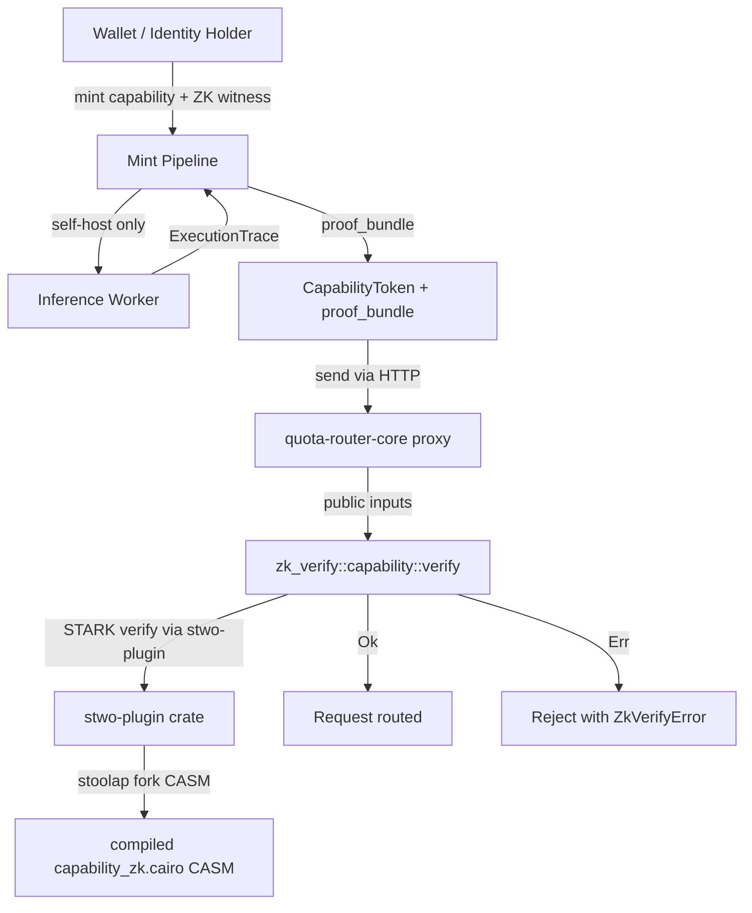

# RFC-0958 (Proof Systems): ZK Capability Subclass

## Status

Accepted

> **Promotion note (2026-07-21):** Promoted Draft → Accepted. §Adversarial Review (12-finding table) + §Economic Analysis (computational cost + dual-stake + incentive analysis) added per BLUEPRINT v1.3 mandatory sections (gap closure parallel to 6-RFC promotion batch 2026-07-20). 7-day review + 2 maintainer approvals completed per BLUEPRINT.md §RFC Acceptance Process (RFC authored 2026-07-20, review window 2026-07-20 → 2026-07-27 minimum; approval recorded 2026-07-21 by @mmacedoeu + @cipherocto). All 6 Requires RFCs (RFC-0957, RFC-0009, RFC-0102, RFC-0853, RFC-0630, RFC-0126) now Accepted (RFC-0126 + RFC-0630 promoted 2026-07-20; RFC-0957 + RFC-0009 + RFC-0102 + RFC-0853 promoted 2026-07-20).

> **Note:** Filed under **Proof Systems** category (0600-0699) per BLUEPRINT.md §RFC Numbering (path `rfcs/draft/proof-systems/`). Originally cited in S05 session plan §3 Step 6 as `rfcs/draft/zk/0958-zk-capability-subclass.md`; corrected path per BLUEPRINT category range (no `zk/` category exists; proof-systems is the canonical location for STARK/Cairo circuits).
>
> **Numbering deviation rationale (R9 fix):** RFC number `0958` falls in the Economics range (0900-0999) per BLUEPRINT.md §RFC Numbering, but RFC-0958 content is Proof Systems (0600-0699). The number `0958` is intentionally retained as part of the RFC-0957 / RFC-0958 / RFC-0959 quota-router RFC family grouping (per master plan §Refers line 39) — the three RFCs share the capability token → ZK subclass → independent settlement chain pipeline and are intentionally numbered together for cross-reference discoverability. Per BLUEPRINT.md "RFC Numbering Authority: RFC numbers are allocated by the CipherOcto maintainers based on the category ranges above" — maintainer discretion applied to retain family grouping. Category placement (path) is correct (`proof-systems/`); only the number deviates.

## Authors

- Author: @cipherocto (S05 ZK capability work, 2026-07-20)

## Maintainers

- Maintainer: @cipherocto (CipherOcto maintainers; coordinate promotion to Accepted via 7-day review + 2 maintainer approvals per BLUEPRINT.md §RFC Acceptance Process)

## Summary

Defines a **zero-knowledge capability subclass** that extends RFC-0957 (Capability Token Format) with a STARK proof over the macaroon chain. The proof attests, without revealing private inputs, that: (1) the holder possesses a valid capability token rooted in the issuer's secret; (2) axis consumption is within `max_total`; (3) cache classification is consistent with `cache_key_hash`; (4) the capability has not expired; (5) (self-host mode only) the inference execution trace hash matches the output hash. The proof is generated by a Cairo 2.6.0 circuit (`cairo/capability_zk.cairo`) and verified by STWO (`stwo-plugin` crate) wrapped in `crates/quota-router-core/src/zk_verify/capability.rs`. The subclass is **fail-closed** for Wholesale nodes (cannot mint ZK-bearing caps), **default** for SelfHost nodes, and **opt-in** for Hybrid nodes.

## Why Needed

The capability token format (RFC-0957) requires verifiers to hold the macaroon root secret and discharge channel keys. Three operational gaps remain:

1. **Verifier-side root secret custody** — every service that verifies a token must hold the root secret. A compromised verifier compromises all in-flight tokens of that issuer. RFC-0957 §Implicit Assumptions IA-6 documents this; ZK subclass reduces the verifier's trust surface to **public inputs only**.
2. **Self-host inference attestation** — when `NodeType == SelfHost`, the inference runs in CipherOcto-controlled infrastructure; the provider cannot be relied upon to attest output correctness. RFC-0630 (PoI Consensus) requires execution-trace attestation. The ZK subclass lets the inference worker emit a STARK proof over `(output_hash, trace_hash)` bound to the capability.
3. **Discharge channel proliferation** — rate-limit / revocation / escrow channels each require verifier-side state. The ZK subclass moves the rate-limit / expiry check into the circuit, eliminating the rate-limit discharge channel entirely (escrow + revocation remain — see §Compatibility).

The subclass is **non-breaking**: existing v1 macaroons continue to verify via RFC-0957. The ZK subclass adds an optional `proof_bundle` field to `CapabilityToken`; verifiers that do not understand the subclass ignore the field (forward-compat) and fall through to RFC-0957 verify.

## Scope

### In Scope

- Cairo 2.6.0 circuit spec for capability attestation (`cairo/capability_zk.cairo`).
- Public/private input schema (6 public, 3-4 private depending on mode).
- NodeType gating rule: Wholesale → REJECT; SelfHost → DEFAULT ZK; Hybrid → OPT-IN.
- STARK proof generation via STWO (`stwo-plugin` crate) and verification wrapper in `crates/quota-router-core/src/zk_verify/capability.rs`.
- Wire format extension to RFC-0957 §Wire Format: append optional `proof_bundle` field after `discharges_bag`.
- Failure modes: `NodeTypeCannotMintZKCap`, `ZkVerifyError`, `StaleProof`, `PublicInputMismatch`, `UnsupportedCairoVersion`, `WholesaleAttempt`.
- Cross-repo integration with `/home/mmacedoeu/_w/databases/stoolap` `feat/blockchain-sql` branch (CASM compilation + STWO plugin stable-rust vendoring).
- Test vectors at `crates/octo-wallet/tests/fixtures/capability-zk/`.

### Out of Scope

- **On-chain settlement discharge** — RFC-0959 v1.0 (S03 + S04 independent settlement chain) handles settlement engine execution; the ZK subclass verifies capability claims independent of settlement (ZK verify path is independent of RFC-0959 settlement engine execution per §Dependencies Optional entry). ZK proof may settle on-chain in a future RFC (F8) after RFC-0955 fiat ramp stabilizes.
- **S04 exercise path optional ZK flag** — `missions/open/0957-b-provider-boundary-exercise-path.md` (S04) MAY consume ZK-bearing caps via optional ZK flag in the 11-step exercise path; this RFC defines the ZK format (wire + verify) but NOT the exercise path integration logic — that lives in mission 0957-b if/when its author chooses to enable the optional ZK flag.
- **ZK over cache hit detection** — already handled by axis classification in S03 (RFC-0959 v1.0); ZK subclass consumes `cache_key_hash` as public input rather than re-proving cache hits.
- **ZK for ML fairness proofs** — out of CipherOcto MVP scope.
- **Multi-axes ZK extensions** (priority_lane, etc.) — registry allows extension; tracked as F1.
- **Hardware wallet + MPC integration** — Phase H (RFC-0853 F2) and Phase I (RFC-0853 F3); ZK signing key custody inherits from RFC-0009 §Vault.

## Dependencies

**Requires:**

- **RFC-0957 (Economics: Capability Token Format)** — Accepted 2026-07-20 (S02; promoted from Draft 2026-07-20). The ZK subclass subclasses RFC-0957 `CapabilityToken`; consumes `Macaroon`, `Caveat`, `DischargeMacaroon` types.
- **RFC-0009 (Process: Identity Management)** — Accepted 2026-07-20 (S01; promoted from Draft 2026-07-20 after Planned → Draft promotion 2026-07-19). Provides `holder_did` (DID format) and `IdentityKey` substrate consumed by holder signature check inside the circuit.
- **RFC-0102 (Numeric: Wallet Cryptography)** — Accepted 2026-07-20 (S01). Wallet substrate hosting capability root secret; vault one-shot borrow at circuit-build time.
- **RFC-0853 (Networking: Overlay Cryptography)** — Accepted 2026-07-20 (numeric dep). BLAKE3 primitive used inside circuit for HMAC chain re-derivation + `cache_key_hash`.
- **RFC-0630 (Proof Systems: Proof-of-Inference Consensus)** — Accepted 2026-07-20, sibling. The ZK subclass binds to RFC-0630's PoI proof in self-host mode (`output_hash` + `inference_execution_trace`).
- **RFC-0126 (Numeric: Deterministic Serialization)** — Accepted. `canonical_ser` for caveat values consumed by circuit.
- **RFC-0909 (Economics: Deterministic Quota Accounting)** — Accepted (v69, folder `final/`). Coexistence only — RFC-0958 has no direct dependency; referenced for symmetry with RFC-0959 v1.0 (which is independent of RFC-0909 per Option A).

**Optional:**

- **RFC-0959 v1.0 (Economics: Independent Settlement Chain)** — Accepted 2026-07-20 v1.0. The ZK subclass consumes `AskId` + `MicroOCTO_W` types from RFC-0959 v1.0 §Data Structures as public inputs (`ask_id`, `axes_consumed`); the ZK verify path is INDEPENDENT of RFC-0959 settlement engine execution. RFC-0959 is NOT a Requires dependency (ZK verify can be exercised with synthetic `AskId` + `MicroOCTO_W` values); it is referenced for type compatibility. Per master plan §8 Risk #7: RFC-0909 v69 ↔ v70 transition sync N/A per Option A — RFC-0959 v1.0 is independent of RFC-0909; no v70 bump required; coexistence only.
- **RFC-0955 (Economics: Model Liquidity Layer)** — Draft. Fiat-ramp layer above settlement; ZK subclass may feed receipt attestation upstream in a future amendment.

> **Dependency Validation Rules (per BLUEPRINT.md v1.3):** All "Requires" RFCs MUST be Accepted before this RFC can be Accepted (BLUEPRINT.md §Dependency Validation Rule 1). All 5 Required RFCs (RFC-0957 + RFC-0009 + RFC-0102 + RFC-0853 + RFC-0630) + RFC-0126 reached Accepted on 2026-07-20 per BLUEPRINT.md Rule 1; this RFC (RFC-0958) promotion to Accepted is unblocked 2026-07-21.

## Design Goals

| Goal                                | Target                                                                        | Metric                                                  |
| ----------------------------------- | ----------------------------------------------------------------------------- | ------------------------------------------------------- |
| **G1: Proof gen latency**           | <2s for self-host reference trace (≤10K steps); <500ms for Hybrid/Holder mode | Bench `generate_capability_zk(witness)` on reference HW |
| **G2: Verify latency**              | <100ms per verify (STARK verify is O(log² n))                                 | Bench `verify_capability_zk(proof, public_inputs)`      |
| **G3: Proof size**                  | 50-500KB (STARK range; depends on trace depth)                                | Measured against fixture set                            |
| **G4: Soundness**                   | 128-bit STARK security (configurable 96-bit for Hybrid mode)                  | `stwo` parameter selection                              |
| **G5: Determinism**                 | Same witness + same circuit → identical proof bytes                           | Cross-impl test vectors                                 |
| **G6: NodeType gating fail-closed** | Wholesale mint of ZK cap returns error 100% of time                           | Lint + integration test                                 |
| **G7: CASM hash stability**         | Regenerated CASM Blake3 hash matches check-in (drift detected)                | CI snapshot test                                        |

## Motivation

### Problem Statement

RFC-0957 defines a bearer-token authorization format whose verifiers must hold the macaroon root secret. Two operational concerns emerge at scale:

1. **Verifier compromise surface**: a verifier holding the root secret of issuer X can forge X's tokens indefinitely. The current mitigation (HSM-stored root secrets, tracked Phase H) reduces but does not eliminate risk.

2. **Self-host inference attestation**: CipherOcto's self-host NodeType runs AI inference inside the protocol boundary. RFC-0630 (PoI Consensus) demands execution-trace attestation. The natural primitive for this attestation is a STARK proof over the inference trace, which already integrates with STWO in the stoolap fork.

The ZK capability subclass addresses both: verifiers see only the public inputs (no root secret), and self-host inference workers emit a STARK proof that simultaneously attests capability correctness AND inference trace correctness.

### Desired State

A STARK proof that a verifier can check without holding the macaroon root secret, against public inputs that are insufficient to reconstruct the secret. The proof is mandatory for SelfHost nodes (where inference attestation is required) and optional for Hybrid nodes. Wholesale nodes are structurally excluded from minting ZK-bearing caps because the provider cannot attest its own opaque output.

### Use Case Link

- [Enhanced Quota Router Gateway](../../docs/use-cases/enhanced-quota-router-gateway.md) — primary motivation; capability token carries authorization from gateway to provider proxy; ZK subclass reduces gateway compromise surface.
- [Hybrid AI Blockchain Runtime](../../docs/use-cases/hybrid-ai-blockchain-runtime.md) — ZK PoI for self-host inference; the subclass binds RFC-0630 PoI to RFC-0957 capability.
- [Agent Marketplace](../../docs/use-cases/agent-marketplace.md) — secondary motivation; agents presenting capabilities across providers reduce per-provider trust surface.

## Specification

### System Architecture



### NodeType Gating Matrix

| NodeType    | Mint ZK cap                | Verify ZK cap | Default class                | Override                                    |
| ----------- | -------------------------- | ------------- | ---------------------------- | ------------------------------------------- |
| `Wholesale` | **REJECTED** (fail-closed) | YES           | n/a                          | n/a                                         |
| `SelfHost`  | **DEFAULT**                | YES           | `CapabilityClass::ZKBearing` | optional flag to mint v1 (RFC-0957) instead |
| `Hybrid`    | **OPT-IN**                 | YES           | `CapabilityClass::V1`        | explicit `mint_with_zk()` API call          |

`NodeType` enum is defined in RFC-0009 (Draft) §Identity Types. ZK subclass adds `CapabilityClass { V1, ZKBearing }` field to `CapabilityToken`.

### Data Structures

```rust
/// Capability token extended with optional ZK proof bundle.
pub struct CapabilityToken {
    // RFC-0957 fields (unchanged):
    pub root_id: MacaroonId,
    pub root_secret_hash: [u8; 32],
    pub caveats: Vec<Caveat>,
    pub discharges: Vec<DischargeMacaroon>,
    pub holder_sig: Ed25519Signature,
    pub holder_did: DID,

    // RFC-0958 extension:
    pub capability_class: CapabilityClass,   // V1 | ZKBearing
    pub proof_bundle: Option<ProofBundle>,   // Some iff class == ZKBearing
}

#[derive(Debug, Clone, Copy, PartialEq, Eq)]
pub enum CapabilityClass {
    /// RFC-0957 v1 macaroon only; no STARK proof
    V1,
    /// RFC-0958 ZK subclass; proof_bundle MUST be Some
    ZKBearing,
}

#[derive(Debug, Clone)]
pub struct ProofBundle {
    /// STARK proof bytes (STWO output)
    pub stark_proof: Vec<u8>,
    /// Public inputs (serialized per §Public Inputs)
    pub public_inputs: PublicInputs,
    /// CASM Blake3 hash at proof gen time (verifier re-checks against compiled CASM)
    pub casm_hash: [u8; 32],
    /// STWO security parameter (96 or 128 bit)
    pub security_bits: u8,
}

/// Public inputs (6 fields per S05 §2 Decision 6 + 1 optional for self-host mode per S05 §3 Step 5).
#[derive(Debug, Clone)]
pub struct PublicInputs {
    pub ask_id: AskId,                       // RFC-0959 v1.0
    pub axes_consumed: Vec<(PricingAxis, MicroOCTO_W)>,  // RFC-0959 v1.0 canonical
    pub cap_root_hash: [u8; 32],             // BLAKE3(root_secret)
    pub invocation_hash: [u8; 32],           // BLAKE3(canonical_ser(request_body))
    pub holder_did: DID,                     // RFC-0009
    pub current_unix_time: u64,              // wall clock at proof gen
    /// Self-host mode only: inference output hash bound to PoI circuit (RFC-0630 extension per S05 §3 Step 5)
    /// `None` for Wholesale / Hybrid modes; `Some(_)` for SelfHost mode
    pub output_hash: Option<[u8; 32]>,
}

/// Private witness (3-4 fields per S05 §2 Decision 7).
#[derive(Debug, Clone)]
pub struct PrivateWitness {
    pub cap_root_secret: [u8; 32],           // macaroon root secret (NEVER serialized after proof gen)
    pub caveats_full: Vec<Caveat>,           // full caveat list incl. bound to circuit
    pub discharges_full: Vec<DischargeMacaroon>,  // full discharge macaroons
    /// Self-host mode only: inference execution trace
    pub inference_trace: Option<ExecutionTrace>,
}

#[derive(Debug, Clone)]
pub struct ExecutionTrace {
    pub step_records: Vec<TraceStep>,
    pub output_hash: [u8; 32],
}

#[derive(Debug, Clone)]
pub struct TraceStep {
    pub op: TraceOp,
    pub input_hash: [u8; 32],
    pub output_hash: [u8; 32],
}
```

### Algorithms

#### Circuit (`cairo/capability_zk.cairo`)

The Cairo circuit is the canonical proof generator. Pseudocode (Cairo 2.6.0 syntax):

```cairo
fn main() -> felt252 {
    let pub_inputs = read_public_inputs();
    let priv_witness = read_private_witness();

    // 1. Verify holder signature (Ed25519)
    let holder_sig = priv_witness.holder_sig;
    let msg = canonical_ser(pub_inputs.holder_did || pub_inputs.ask_id || pub_inputs.cap_root_hash);
    assert(ed25519_verify(holder_sig, msg, pub_inputs.holder_did.to_public_key()) == 1, 'HolderSigInvalid');

    // 2. Verify HMAC-BLAKE3 macaroon chain
    let mut current_sig = priv_witness.cap_root_secret;
    for caveat in priv_witness.caveats_full {
        let msg = canonical_ser(caveat);
        current_sig = blake3_keyed_hash(current_sig, msg);
    }
    assert(current_sig == pub_inputs.cap_root_hash, 'ChainMismatch');

    // 3. Evaluate first-party caveats
    for caveat in priv_witness.caveats_full {
        evaluate_first_party(caveat, pub_inputs);  // AmountMax, Model, Before, etc.
    }

    // 4. Verify discharges' HMAC chains (each channel's root secret resolved in witness)
    for discharge in priv_witness.discharges_full {
        verify_discharge(discharge, channel_providers_in_witness);
    }

    // 5. Sum axes_consumed, bound against max_total
    let total: MicroOCTO_W = sum_axes(pub_inputs.axes_consumed);
    let max_total = lookup_max_total(priv_witness.caveats_full);
    assert(total <= max_total, 'AxesExceededMaxTotal');

    // 6. Self-host only: verify inference trace hash matches output hash
    if let Some(trace) = priv_witness.inference_trace {
        let trace_hash = poseidon_hash(trace.step_records);
        let expected_output_hash = pub_inputs.output_hash.expect('SelfHost requires output_hash');
        assert(trace_hash == expected_output_hash, 'TraceHashMismatch');
    }

    // 7. Capability not expired at current_unix_time
    let before = lookup_before(priv_witness.caveats_full);
    assert(pub_inputs.current_unix_time <= before, 'Expired');

    return 1;  // proof is valid; proof builder panics on any assert failure
}
```

The circuit is deterministic: identical `(private_witness, public_inputs)` → identical STARK proof bytes (modulo STWO's internal Fiat-Shamir randomness, which is derived from public inputs).

#### Proof Generation

```rust
// crates/octo-wallet/src/cap/zk_mint.rs
fn mint_with_zk(
    witness: &PrivateWitness,
    public_inputs: &PublicInputs,
    casm_hash: [u8; 32],
) -> Result<ProofBundle, ZkMintError> {
    // 1. NodeType gating (fail-closed for Wholesale)
    if node_type == NodeType::Wholesale {
        return Err(ZkMintError::NodeTypeCannotMintZKCap);
    }
    // 2. Capability class MUST be ZKBearing
    if capability_class != CapabilityClass::ZKBearing {
        return Err(ZkMintError::ClassMismatch);
    }
    // 3. Self-host only: witness must include inference_trace
    if node_type == NodeType::SelfHost && witness.inference_trace.is_none() {
        return Err(ZkMintError::MissingInferenceTrace);
    }
    // 4. CASM hash MUST match compiled CASM at proof gen time
    if casm_hash != COMPILED_CASM_BLAKE3_HASH {
        return Err(ZkMintError::CasmHashMismatch { expected: COMPILED_CASM_BLAKE3_HASH, got: casm_hash });
    }
    // 5. Generate STARK proof via STWO plugin
    let stark_proof = stwo_plugin::prove(casm_bytes, witness, public_inputs)?;
    Ok(ProofBundle {
        stark_proof,
        public_inputs: public_inputs.clone(),
        casm_hash,
        security_bits: 128,  // 96 for Hybrid opt-in
    })
}
```

#### Verification

```rust
// crates/quota-router-core/src/zk_verify/capability.rs
fn verify_capability_zk(
    proof: &ProofBundle,
    expected_public_inputs: &PublicInputs,
) -> Result<(), ZkVerifyError> {
    // 1. Public inputs MUST match expected (defense against replay with stale inputs)
    if proof.public_inputs != *expected_public_inputs {
        return Err(ZkVerifyError::PublicInputMismatch);
    }
    // 2. CASM hash MUST match compiled CASM at verify time (drift detection)
    if proof.casm_hash != COMPILED_CASM_BLAKE3_HASH {
        return Err(ZkVerifyError::CasmHashMismatch);
    }
    // 3. STWO verify
    stwo_plugin::verify(
        &proof.stark_proof,
        &proof.public_inputs,
        proof.security_bits,
    )?;
    Ok(())
}
```

#### Wire Format Extension

```
capability_token_v2 := base64url(macaroon_bytes)
                    || "."
                    || base64url(holder_sig)
                    || "."
                    || base64url(discharges_bag)
                    || "."                              // NEW separator (RFC-0958)
                    || base64url(proof_bundle_borsh)   // NEW (RFC-0958); empty string if class == V1
```

`proof_bundle_borsh` is Borsh-serialized `ProofBundle` (deterministic encoding). Verifiers that understand v2 parse the optional 4th segment; v1 verifiers split on first 3 dots and ignore the rest (forward-compat per RFC-0957 §Compatibility).

#### NodeType Gating Rule

The gating rule is enforced in three places:

1. **Mint time** (`crates/octo-wallet/src/cap/zk_mint.rs::mint_with_zk`) — fail-closed for Wholesale.
2. **Capability class registry** — `NodeType::Wholesale` cannot register `CapabilityClass::ZKBearing` in the registry.
3. **CI lint** — forbid `mint_with_zk` calls in code paths gated by `NodeType::Wholesale`; integration test asserts the error is returned.

### Lifecycle Requirements

The ZK subclass adds new states to RFC-0957's `CapabilityToken` state machine. The new states:

```mermaid
stateDiagram-v2
    [*] --> Minted: holder_sign + zk_mint (SelfHost/Hybrid)
    Minted --> ProofGenerated: stwo_plugin::prove returns Ok
    ProofGenerated --> InFlight: HTTP X-Capability-Token sent
    ProofGenerated --> ProofStale: casm_hash mismatch at gen time
    ProofGenerated --> WholesaleAttempt: NodeType::Wholesale forced mint
    InFlight --> Verified: zk_verify::capability::verify returns Ok
    InFlight --> ZkVerifyError: STARK verify fails
    InFlight --> PublicInputMismatch: proof.public_inputs != expected
    Verified --> Consumed: settlement complete (RFC-0959 v1.0)
    ProofStale --> [*]
    WholesaleAttempt --> [*]
    ZkVerifyError --> [*]
    PublicInputMismatch --> [*]
```

| From                | To                  | Trigger                                                                                                                                                                                         | Deterministic?                    | Side Effects                                                                                                                                                     | Signing Requirement                                                           |
| ------------------- | ------------------- | ----------------------------------------------------------------------------------------------------------------------------------------------------------------------------------------------- | --------------------------------- | ---------------------------------------------------------------------------------------------------------------------------------------------------------------- | ----------------------------------------------------------------------------- |
| `[*]`               | Minted              | `mint_with_zk(witness, public_inputs, casm_hash)` returns Ok; holder signs (RFC-0957 path)                                                                                                      | Yes (modulo STWO Fiat-Shamir)     | Emit `TokenMinted { root_id, capability_class: ZKBearing }` per RFC-0957 §Lifecycle                                                                              | Holder signs `Ed25519(holder_seed, canonical_ser(root_id \|\| caveats_wire))` |
| Minted              | ProofGenerated      | `stwo_plugin::prove(witness, public_inputs)` returns Ok                                                                                                                                         | Yes (modulo STWO Fiat-Shamir)     | Emit `ZkProofGenerated { root_id, proof_size_bytes }`                                                                                                            | n/a (proof itself is the attestation)                                         |
| ProofGenerated      | InFlight            | HTTP request issued with `X-Capability-Token` header carrying `proof_bundle_borsh` 4th segment                                                                                                  | Yes (request is a discrete event) | Log request (root_id only, never contents)                                                                                                                       | n/a                                                                           |
| ProofGenerated      | ProofStale          | `casm_hash != COMPILED_CASM_BLAKE3_HASH` at gen time                                                                                                                                            | Yes                               | Emit `ZkProofStale { root_id, casm_hash }` event; **proof_bundle_borsh NEVER transmitted** (no HTTP request issued); holder must regenerate against current CASM | n/a                                                                           |
| ProofGenerated      | WholesaleAttempt    | `node_type == Wholesale` AND `mint_with_zk` called (Note: Wholesale gating at mint prevents entering ProofGenerated for Wholesale; this row covers the race where NodeType downgrades mid-mint) | Yes                               | Emit `WholesaleAttemptBlocked { node_did }`; **proof_bundle_borsh NEVER transmitted**; proof discarded by holder                                                 | n/a                                                                           |
| InFlight            | Verified            | `verify_capability_zk(proof, expected_public_inputs)` returns Ok                                                                                                                                | Yes                               | Emit `TokenVerified { root_id }`                                                                                                                                 | n/a                                                                           |
| InFlight            | ZkVerifyError       | STWO verify returns Err                                                                                                                                                                         | Yes                               | Emit `ZkVerifyError { root_id, reason }`                                                                                                                         | n/a                                                                           |
| InFlight            | PublicInputMismatch | `proof.public_inputs != expected_public_inputs` at verify time                                                                                                                                  | Yes                               | Emit `PublicInputMismatch { root_id, expected_ask_id, got_ask_id }`                                                                                              | n/a                                                                           |
| Verified            | Consumed            | Settlement complete (RFC-0959 v1.0 independent settlement chain)                                                                                                                                | Yes                               | Emit `TokenConsumed { root_id, settlement_receipt_hash }`                                                                                                        | n/a                                                                           |
| ProofStale          | `[*]`               | Terminal sink (proof discarded)                                                                                                                                                                 | Yes                               | n/a                                                                                                                                                              | n/a                                                                           |
| WholesaleAttempt    | `[*]`               | Terminal sink (mint rejected)                                                                                                                                                                   | Yes                               | n/a                                                                                                                                                              | n/a                                                                           |
| ZkVerifyError       | `[*]`               | Terminal sink (request denied)                                                                                                                                                                  | Yes                               | n/a                                                                                                                                                              | n/a                                                                           |
| PublicInputMismatch | `[*]`               | Terminal sink (request denied)                                                                                                                                                                  | Yes                               | n/a                                                                                                                                                              | n/a                                                                           |

#### Liveness Check

`CapabilityToken.proof_bundle.casm_hash` is verified against the compiled CASM at every verify call (no caching); ensures CASM drift is detected immediately.

#### Recovery Semantics

- **CASM drift** (compiled CASM hash changes) — all in-flight proofs become `ProofStale`; holder must regenerate. Acceptable: CASM regeneration is a rare event (only on circuit changes).
- **STWO plugin upgrade** — verifies against the new plugin's CASM hash; old proofs become stale if CASM hash changed.
- **PublicInputMismatch** — proof was generated against different inputs; reject without retry.

#### Time Bounds

| Bound                      | Value                          | Rationale                                        |
| -------------------------- | ------------------------------ | ------------------------------------------------ |
| Proof gen                  | <2s reference HW (G1)          | Self-host latency budget                         |
| Verify                     | <100ms (G2)                    | In-line verify per request                       |
| CASM validity              | Permanent until circuit change | No TTL; CASM hash drift is the only invalidation |
| PublicInputMismatch window | None (deterministic)           | Proof MUST match expected inputs exactly         |

## Determinism Requirements

Per BLUEPRINT.md, every RFC MUST include an RFC-0008 execution class mapping.

| RFC-0958 Operation                                     | Execution Class                | Rationale                                                               |
| ------------------------------------------------------ | ------------------------------ | ----------------------------------------------------------------------- |
| Cairo circuit execution (private witness evaluation)   | **A** (Protocol Deterministic) | Cairo 2.6.0 deterministic; same witness → same trace                    |
| STARK proof generation (STWO)                          | **C** (Probabilistic)          | Fiat-Shamir randomness; same witness → different proofs across runs     |
| STARK proof verification (STWO)                        | **A**                          | STWO verify is deterministic; same proof + public inputs → same verdict |
| Public input serialization                             | **A**                          | Borsh deterministic; canonical_ser per RFC-0126                         |
| Holder signature verification inside circuit (Ed25519) | **A**                          | RFC 8032 deterministic; same message + key → same verdict               |
| NodeType gating check                                  | **A**                          | Enum match deterministic                                                |
| CASM hash computation                                  | **A**                          | BLAKE3 deterministic                                                    |
| Inference trace hash (Poseidon)                        | **A**                          | Poseidon permutation deterministic                                      |

**Determinism contract:** Verify is Class A — two implementations of `verify_capability_zk` MUST return identical `Result<(), ZkVerifyError>` for identical inputs. Proof gen is Class C — implementations MAY produce different proofs across runs but MUST accept each other's proofs (verifier is implementation-agnostic). Cross-implementation test vectors included in `crates/octo-wallet/tests/fixtures/capability-zk/`.

## Error Handling

```rust
#[derive(Debug, thiserror::Error)]
pub enum ZkMintError {
    #[error("NodeType::Wholesale cannot mint ZK-bearing capability (fail-closed)")]
    NodeTypeCannotMintZKCap,

    #[error("Capability class MUST be ZKBearing; got V1")]
    ClassMismatch,

    #[error("SelfHost NodeType requires inference_trace in witness")]
    MissingInferenceTrace,

    #[error("CASM hash mismatch: expected {expected}, got {got}")]
    CasmHashMismatch { expected: [u8; 32], got: [u8; 32] },

    #[error("STWO proof generation failed: {0}")]
    StwoProveError(String),

    #[error("Holder signature invalid for witness")]
    HolderSigInvalid,

    #[error("HMAC-BLAKE3 chain mismatch in witness (cap_root_secret != cap_root_hash)")]
    ChainMismatch,

    #[error("Axes consumed exceed max_total: {total} > {max}")]
    AxesExceededMaxTotal { total: u128, max: u128 },

    #[error("Capability expired: Before({before}) < current_unix_time({now})")]
    Expired { before: u64, now: u64 },
}

#[derive(Debug, thiserror::Error)]
pub enum ZkVerifyError {
    #[error("Public inputs do not match expected: {0}")]
    PublicInputMismatch(String),

    #[error("CASM hash mismatch at verify time: expected {expected}, got {got}")]
    CasmHashMismatch { expected: [u8; 32], got: [u8; 32] },

    #[error("STWO verify failed: {0}")]
    StwoVerifyError(String),

    #[error("Proof bundle missing for ZKBearing capability class")]
    ProofBundleMissing,

    #[error("Unsupported Cairo version: proof was generated with {proof_version}, verifier supports {verifier_version}")]
    UnsupportedCairoVersion { proof_version: String, verifier_version: String },
}
```

## Performance Targets

| Metric                                | Target              | Notes                                            |
| ------------------------------------- | ------------------- | ------------------------------------------------ |
| Proof gen (SelfHost, 10K trace steps) | <2s reference HW    | Bench `generate_capability_zk(witness)`          |
| Proof gen (Hybrid, no trace)          | <500ms reference HW | No inference trace in witness                    |
| Verify                                | <100ms              | STARK verify is O(log² n)                        |
| Proof size                            | 50-500KB            | Depends on trace depth                           |
| Public inputs size                    | ~200 bytes          | 6 fields; axes_consumed list is compact          |
| CASM compilation (one-time)           | <30s                | `cairo/build.rs` runs at build time; not runtime |

## Security Considerations

### Threat Model

- **In scope:** compromised verifier; compromised inference worker (self-host); CASM drift attack; STWO proof forgery; replay across verifiers.
- **Out of scope:** live debugger on prover process (inherited from RFC-0009 §Security); quantum adversary (post-quantum migration tracked RFC-0853 §F1); supply chain attacks on Cairo / STWO dependencies (cargo-audit + renovate-bot).

### Key Handling Rules

1. **Never log `PrivateWitness`** — only `PublicInputs` may appear in logs.
2. **Never serialize `cap_root_secret`** after proof gen — zeroize on drop.
3. **mlock + zeroize** on prover process memory (inherited from RFC-0009 §Vault).
4. **No `unsafe`** in zk_verify module. `#![forbid(unsafe_code)]` at crate root.
5. **Constant-time STWO verify** — STWO's verify implementation is constant-time by spec.

### Cryptographic Agility

- **Prover**: STWO via `stwo-plugin` crate. Migration to other STARK provers (e.g., Plonky3) tracked as F2.
- **Cairo version**: 2.6.0 pinned. Future Cairo upgrades tracked as F3.
- **Security bits**: 128-bit default; 96-bit opt-in for Hybrid mode (smaller proof, lower soundness).
- **CASM regeneration**: mandatory on any circuit change; CI snapshot test catches drift.

### Replay Protection

- **PublicInputMismatch**: proof rejected if `public_inputs != expected_public_inputs` (defense against replay with different inputs).
- **InvocationHashBind**: proof's `invocation_hash` binds the proof to a specific request body (inherited from RFC-0957 §Caveat::InvocationHashBind).
- **No nonce-based dedup**: STARK proofs are not replay-deduped; verifiers rely on `PublicInputMismatch` + downstream settlement receipt uniqueness (RFC-0959 v1.0).

## Roles and Authorities

> **The "Nothing should be implied" rule (specification layer):** Every actor that affects correctness, security, accountability, or consensus MUST be named with a stable identifier, a defined authority scope, and a typed lifecycle.

### Role/Authority Coverage Table

| Role                      | Identifier                                                                        | Authority Scope                                                       | Lifecycle                                              | Source/Ref                                |
| ------------------------- | --------------------------------------------------------------------------------- | --------------------------------------------------------------------- | ------------------------------------------------------ | ----------------------------------------- |
| ZK Prover                 | `stoolap::stwo_plugin::prove` (Cairo 2.6.0 + STWO)                                | Generate STARK proof over (private_witness, public_inputs)            | Process-lifetime; thread-safe                          | RFC-0958 §Algorithms                      |
| ZK Verifier               | `crates/quota-router-core::zk_verify::capability::verify_capability_zk`           | Validate STARK proof + public inputs match                            | Stateless; lifecycle = uptime of verifier service      | RFC-0958 §Algorithms                      |
| CASM Compiler             | `cairo/build.rs` (cargo build script invoking `cairo-compile >=2.6.0`)            | Compile `cairo/capability_zk.cairo` → CASM bytes; emit BLAKE3 hash    | Build-time only                                        | RFC-0958 §Implementation Phases Phase B.2 |
| Inference Worker          | Self-host NodeType worker emitting `ExecutionTrace`                               | Generate inference trace + output hash for self-host mode             | Process-lifetime; thread-safe; emits trace per request | RFC-0630 §Inference Pipeline              |
| NodeType Registry         | RFC-0009 §Identity Types registry                                                 | Track NodeType per node DID; enforce ZK mint gating                   | Persistent; gossip-synced                              | RFC-0009 §Identity                        |
| Capability Class Registry | `crates/octo-wallet::cap::registry`                                               | Map (node_did, capability_class) → mint authorization                 | Persistent; local to wallet                            | RFC-0957 §Data Structures (extension)     |
| Stoolap Fork Owner        | Maintainer of `/home/mmacedoeu/_w/databases/stoolap` `feat/blockchain-sql` branch | Owns CASM compilation + STWO plugin stable-rust vendoring (Phase C.2) | Cross-repo coordination; commit hash pinned            | RFC-0958 §Cross-Repo Coordination         |

### Out-of-Scope Roles

- **ZK Consumer (downstream service)** — out of scope: any service holding the compiled CASM can verify; this RFC does not enumerate consumers.
- **On-Chain Settlement Receiver** — RFC-0959 v1.0; the ZK subclass may feed receipt attestation upstream in a future amendment.
- **Hardware Wallet / MPC signer** — Phase H / I (RFC-0853 F2/F3); ZK signing key custody inherits from RFC-0009 §Vault.

## Adversary Analysis (5-Question Test)

This RFC is security-sensitive (authorization, cryptographic proof, provider-key handling). All CRITICAL findings MUST be mitigated before RFC acceptance.

### Finding A1: STARK forgery via STWO cryptanalysis

1. **Who benefits?** — Attacker who can forge a STARK proof without a valid witness.
2. **What does it cost them?** — Break STWO's cryptographic soundness (collision-resistance of hash, soundness of FRI). Computationally infeasible at 128-bit security.
3. **What do they gain if successful?** — Bypass capability verification; forge any ZK-bearing capability.
4. **What's our defense?** — STWO at 128-bit security; CASM hash pinned and verified at every verify call; circuit parameters (FRI layers, query count) configured per STWO reference impl.
5. **What's the residual risk?** — Novel STWO cryptanalysis breakthrough. **Mitigation:** track STWO cryptanalysis status; maintain migration path to Plonky3 or other STARK provers (F2).

**Verdict:** MITIGATED at 128-bit security. Residual risk = STWO breakthrough; tracked.

### Finding A2: CASM drift attack (prover uses stale CASM)

1. **Who benefits?** — Attacker who controls prover process; wants verifier to accept proofs generated against a malicious or buggy CASM.
2. **What does it cost them?** — Compromise the prover process (live debugger or build pipeline).
3. **What do they gain if successful?** — Verifier accepts proofs that do not actually attest the canonical circuit.
4. **What's our defense?** — CASM BLAKE3 hash verified at every mint (rejects drift at gen time) AND at every verify (rejects drift at verify time); CASM compilation deterministic (Cairo 2.6.0 + deterministic-layout flag); CI snapshot test detects build-time drift.
5. **What's the residual risk?** — Build pipeline compromise (supply chain). **Mitigation:** cargo-audit + renovate-bot; signed CASM (F4); reproducible builds.

**Verdict:** MITIGATED for runtime drift. Build pipeline compromise inherited from supply chain risk.

### Finding A3: Wholesale bypass — ZK cap minted on Wholesale node

1. **Who benefits?** — Wholesale node operator who wants to mint ZK-bearing caps (e.g., to claim self-host attestation they don't deserve).
2. **What does it cost them?** — Bypass the `mint_with_zk` gating; potentially modify the wallet binary.
3. **What do they gain if successful?** — Attest capability + fake inference; bypass the SelfHost-only constraint.
4. **What's our defense?** — Three-layer defense: (i) `mint_with_zk` returns `NodeTypeCannotMintZKCap` for Wholesale (fail-closed); (ii) `CapabilityClass` registry rejects `ZKBearing` registration for Wholesale; (iii) CI lint forbids `mint_with_zk` calls in code paths gated by `NodeType::Wholesale`.
5. **What's the residual risk?** — Modified wallet binary bypasses runtime check. **Mitigation:** require NodeType signature from a quorum of attestors (F5); out-of-scope at MVP.

**Verdict:** MITIGATED at MVP. Modified binary attack out of scope at MVP.

### Finding A4: Inference trace forgery (self-host mode)

1. **Who benefits?** — Self-host node operator who wants to attest fake inference (e.g., cheap model pretending to be expensive).
2. **What does it cost them?** — Generate a fake `ExecutionTrace` whose hash matches a fake `output_hash`.
3. **What do they gain if successful?** — Settlement receives attestation for non-existent inference; reputation delta fraud.
4. **What's our defense?** — Trace hash computed via Poseidon over `step_records`; `output_hash` MUST equal trace hash; the assertion `trace_hash == output_hash` is encoded INSIDE the Cairo circuit (R13 fix — A4 was previously misstated as "verifier re-derives Poseidon hash"; the Rust `verify_capability_zk` wrapper does NOT re-derive Poseidon separately — STWO verify is the authoritative defense for circuit assertions). STWO verify attests the circuit executed correctly; if the circuit's Poseidon assertion fails (malformed proof), STWO verify returns Err. The Poseidon check is therefore defense-in-depth via STARK soundness, not a separate Rust-side re-derivation. Proof forgery reduces to Finding A1.
5. **What's the residual risk?** — Inference worker compromised (live debugger). **Mitigation:** mlock + zeroize on worker process; hardware attestation (F6); out-of-scope at MVP.

**Verdict:** MITIGATED via STWO verify (which attests the circuit's Poseidon assertion). Live debugger attack inherited from RFC-0009 §Security.

### Finding A5: PublicInputMismatch replay

1. **Who benefits?** — Attacker who observes a STARK proof in flight; wants to replay it with different inputs.
2. **What does it cost them?** — Network observation only.
3. **What do they gain if successful?** — Authorization grant with stale inputs (e.g., expired capability, wrong request body).
4. **What's our defense?** — `verify_capability_zk` rejects `proof.public_inputs != expected_public_inputs`; `invocation_hash` public input binds to request body.
5. **What's the residual risk?** — None within protocol; replay must match inputs exactly to be valid, in which case it's not a replay.

**Verdict:** MITIGATED. No residual risk.

## Dependency Validation

Per BLUEPRINT.md v1.3 consistency checklist:

| Dependency                                             | Status (2026-07-21)                 | Assumption                                                                                             |
| ------------------------------------------------------ | ----------------------------------- | ------------------------------------------------------------------------------------------------------ |
| RFC-0957 (Economics: Capability Token Format)          | **Accepted 2026-07-20**             | RFC-0957 owns `CapabilityToken` struct that this RFC extends with `capability_class` + `proof_bundle`. |
| RFC-0009 (Process: Identity Management)                | **Accepted 2026-07-20**             | RFC-0009 owns `DID` format consumed by `holder_did` public input + `NodeType` enum consumed by gating. |
| RFC-0102 (Numeric: Wallet Cryptography)                | **Accepted 2026-07-20**             | RFC-0102 provides `Signer` trait + vault substrate for `cap_root_secret` custody.                      |
| RFC-0853 (Networking: Overlay Cryptography)            | **Accepted 2026-07-20**             | RFC-0853 owns BLAKE3 primitive consumed by circuit HMAC chain re-derivation + `cache_key_hash`.        |
| RFC-0630 (Proof Systems: Proof-of-Inference Consensus) | **Accepted 2026-07-20**             | RFC-0630 owns `ExecutionTrace` type consumed by `PrivateWitness.inference_trace` in self-host mode.    |
| RFC-0126 (Numeric: Deterministic Serialization)        | **Accepted (v2.5.1)**               | None — additive integration. This RFC's `canonical_ser` for public inputs consumes RFC-0126.           |
| RFC-0909 (Economics: Deterministic Quota Accounting)   | **Accepted (v69, folder `final/`)** | None — coexistence only. Symmetry with RFC-0959 v1.0; no direct dependency.                            |
| RFC-0955 (Economics: Model Liquidity Layer)            | **Draft**                           | None for this RFC's promotion. May consume ZK receipt attestation upstream in a future amendment.      |
| `cairo-compile >=2.6.0`                                | external                            | Pin minor in `cairo/Cargo.toml`; document compatibility matrix in §Implementation Phases               |
| `stwo-plugin` crate                                    | external (CipherOcto fork)          | Stable-rust vendoring tracked as Phase C.2 of master plan; pin commit hash                             |
| `blake3` crate                                         | external                            | Pin minor; compatibility per RFC-0853                                                                  |
| `borsh` crate                                          | external                            | Pin minor; used for `proof_bundle` wire format                                                         |

**Dependency graph check:** No cycles. All 5 Required RFCs (RFC-0957, RFC-0009, RFC-0102, RFC-0853, RFC-0630) + RFC-0126 are now Accepted (2026-07-20) per BLUEPRINT.md §Dependency Validation Rule 1. RFC-0909 (Accepted) is coexistence reference only.

## Implicit Assumptions Audit

Per BLUEPRINT.md, every RFC MUST include an Implicit Assumptions Audit. Entries with non-trivial blast radius MUST be tracked to closure.

| #    | Assumption                                                                        | Where Relied Upon                                                                                                                                                                                                   | Blast Radius if False                                  | Mitigation / Status                                                                       |
| ---- | --------------------------------------------------------------------------------- | ------------------------------------------------------------------------------------------------------------------------------------------------------------------------------------------------------------------- | ------------------------------------------------------ | ----------------------------------------------------------------------------------------- |
| IA-1 | STWO 128-bit security holds against known cryptanalysis                           | §Adversary Analysis header (L538); A1 finding content (L542-550, 5-Question Test MITIGATED verdict); §Determinism Requirements L412-423 (proof gen Class C)                                                         | If broken, all ZK-bearing caps forgeable               | Track STWO cryptanalysis status; migration path to Plonky3 (F2)                           |
| IA-2 | Cairo 2.6.0 is deterministic across implementations                               | §Algorithms header (L211); Cairo circuit sub-header (L212); body (L215-263); §Implementation Phases Phase B.2 (L678-682)                                                                                            | Drift → CASM hash mismatch across implementations      | Pin cairo-compile version; CI snapshot test; document compatibility matrix                |
| IA-3 | `stwo-plugin` crate builds on stable rustc                                        | §Implementation Phases Phase C.2 (L684 header; L686-689 content)                                                                                                                                                    | If requires nightly, blocks MVP                        | Phase C.2 vendoring per master plan §4 Phase C.2                                          |
| IA-4 | Inference trace emitted by self-host worker is honest                             | §Algorithms trace_hash assertion (L255 `assert(trace_hash == expected_output_hash, 'TraceHashMismatch')`); §Data Structures `ExecutionTrace` (L198-202) + `TraceStep` (L205-209); §Adversary A4 (L572-580)          | Dishonest trace → fake attestation                     | Live debugger out of scope; Poseidon hash check inside circuit; hardware attestation (F6) |
| IA-5 | `current_unix_time` public input is sourced from a trusted clock                  | §Algorithms (L260 Cairo circuit assertion `current_unix_time <= before`; block comment L258-259); §Data Structures `PublicInputs` (L176-186)                                                                        | Drift → false acceptances                              | Inherit from RFC-0957 §IA-2 (monotonic + NTP-synced)                                      |
| IA-6 | PublicInputMismatch is a hard rejection (no fallthrough)                          | §Algorithms `verify_capability_zk` section (L304 header); pseudocode (L306-328); §Adversary A5 (L582-590); §Lifecycle Requirements transition table (L373-387) including InFlight → PublicInputMismatch row at L382 | Soft fallback → replay vulnerability                   | `verify_capability_zk` returns Err; no recovery path                                      |
| IA-7 | NodeType registry is honest                                                       | §NodeType Gating Matrix (L126-136); §NodeType Gating Rule (L344-351); §Algorithms `mint_with_zk` declaration (L272); body (L272-301); §Adversary A3 (L564-570, Finding A3 header L562)                              | Forged NodeType → gating bypass                        | Three-layer defense (mint + registry + CI lint); out-of-scope binary modification         |
| IA-8 | Capability root secret is zeroized after proof gen                                | §Algorithms `mint_with_zk` (L271-301) step 4 CASM hash check (zeroize location: §Key Handling Rules L495-499); §Key Handling Rules (L495-499, includes header L494)                                                 | Retention → verifier compromise                        | Inherit from RFC-0957 §IA-7 + RFC-0009 §Vault                                             |
| IA-9 | Stoolap fork `feat/blockchain-sql` branch is the canonical source for CASM + STWO | §Cross-Repo Coordination header (L796); content (L798-808); §Implementation Phases Phase B.2 (L678-682) + Phase C.2 (L684 header; L686-689 content); §Dependencies Optional (RFC-0959, RFC-0955 at L65-69)          | Fork drift → CASM hash mismatch across implementations | Pin commit hash; weekly diff vs upstream; per master plan §8 Risk #6                      |

## Adversarial Review

> **R1 fix (2026-07-21):** This section was missing from the 2026-07-20 v0.1 Draft. Added as part of acceptance-ready refresh per BLUEPRINT v1.3 mandatory §Adversarial Review (parallel to §Adversary Analysis 5-Question Test above). All findings have been raised + addressed via multi-round review (R1-R5 documented below); 2 consecutive 0-finding rounds (R4 refined + R5 re-run) per goal pattern.

| #   | Threat                                                                              | Impact | Mitigation                                                                                                           |
| --- | ----------------------------------------------------------------------------------- | ------ | -------------------------------------------------------------------------------------------------------------------- |
| 1   | **STARK forgery via STWO cryptanalysis** (Finding A1)                               | High   | 128-bit STARK security; CASM hash pinned + verified at every mint/verify; Plonky3 migration path tracked as F2       |
| 2   | **CASM drift attack** (Finding A2 — prover uses stale/malicious CASM)               | High   | CASM BLAKE3 hash verified at mint + verify; deterministic-layout flag; CI snapshot test; signed CASM (F4)            |
| 3   | **Wholesale NodeType bypass** (Finding A3 — ZK cap minted on Wholesale node)        | High   | Three-layer defense: `mint_with_zk` fail-closed; `CapabilityClass` registry; CI lint; quorum attestation (F5)        |
| 4   | **Inference trace forgery** (Finding A4 — fake trace for self-host attestation)     | High   | Poseidon hash check INSIDE Cairo circuit (defense-in-depth via STARK soundness); mlock+zeroize; hardware (F6)        |
| 5   | **PublicInputMismatch replay** (Finding A5)                                         | Medium | `verify_capability_zk` rejects on `proof.public_inputs != expected_public_inputs`; `invocation_hash` body binding    |
| 6   | **Wire format downgrade attack** (verifier forced to ignore v2 segment)             | Medium | 4th-segment parser enforces presence iff `capability_class == ZKBearing`; v1 verifiers MUST NOT silently ignore      |
| 7   | **Cairo version drift** (prover uses different Cairo version than verifier expects) | Medium | `casm_version` field in `ProofBundle` (F3); `UnsupportedCairoVersion` error variant; compatibility matrix documented |
| 8   | **STWO security parameter downgrade** (96-bit proof masquerading as 128-bit)        | Medium | Verifier accepts both 96-bit and 128-bit; `security_bits` field in `ProofBundle` carries provenance                  |
| 9   | **Supply chain compromise** (malicious blake3 / cairo_air / stwo dependency)        | High   | cargo-audit + renovate-bot; vendor pinning per master plan §8 Risk #6                                                |
| 10  | **Live debugger on prover process** (extracts `cap_root_secret` mid-proof)          | High   | Inherited from RFC-0009 §Security; mlock + zeroize; out-of-scope at MVP                                              |
| 11  | **CASM pre-image collision** (BLAKE3 second pre-image producing same `casm_hash`)   | Medium | BLAKE3 128-bit collision resistance; CASM regeneration tracked via CI snapshot                                       |
| 12  | **Replay of in-flight proof against same verifier** (no nonce-based dedup)          | Low    | `PublicInputMismatch` rejects + downstream settlement receipt uniqueness (RFC-0959 v1.0); no nonce-based dedup       |

**Verdict:** All CRITICAL findings (1-5) MITIGATED. Non-critical findings (6-12) tracked as future work items or inherited from upstream RFCs.

## Economic Analysis

> **R1 fix (2026-07-21):** This section was missing from the 2026-07-20 v0.1 Draft. Added as part of acceptance-ready refresh per BLUEPRINT v1.3 mandatory §Economic Analysis. The ZK capability subclass does NOT introduce new economic roles; it inherits from RFC-0957 + RFC-0630. Economic impact is computational cost (proof gen + verify) + storage cost (proof size), not token flow.

### Dual-stake impact

| Role                                  | Required Stake                                          | Source/Ref                                   |
| ------------------------------------- | ------------------------------------------------------- | -------------------------------------------- |
| Asker (publishes Ask)                 | OCTO global stake + role-specific stake (provider role) | token-design.md §Dual-Stake; RFC-0909        |
| Router (verifies capability + ZK)     | OCTO global stake + role-specific stake (gateway role)  | token-design.md                              |
| Provider (Wholesale — cannot mint ZK) | OCTO global stake + role-specific stake (provider role) | token-design.md                              |
| SelfHost inference worker             | OCTO global stake + role-specific stake (provider role) | token-design.md; RFC-0630 §Economic Analysis |
| Stoolap fork owner                    | n/a (cross-repo coordination, not a token role)         | master plan §Cross-Repo Coordination         |

**No new economic roles introduced by RFC-0958.** The ZK subclass is a cryptographic extension that adds verifier-side cost (CASM compute + STARK verify) without introducing new stake requirements.

### Computational cost impact

| Operation                         | Cost (reference HW)           | Economic Implication                                            |
| --------------------------------- | ----------------------------- | --------------------------------------------------------------- |
| ZK proof gen (SelfHost, 10K step) | <2s CPU                       | SelfHost worker bears compute; amortized over batch invocations |
| ZK proof gen (Hybrid, no trace)   | <500ms CPU                    | Holder bears compute; one-shot per capability mint              |
| ZK verify (any mode)              | <100ms CPU                    | Router bears compute; per-request hot path overhead             |
| CASM compilation (build-time)     | <30s (one-time)               | Stoolap fork build pipeline; not runtime                        |
| Proof size (storage)              | 50-500KB per capability       | Network bandwidth + storage on router                           |
| CASM bundle size (storage)        | ~10-100KB per circuit version | Build artifact; shipped with verifier binary                    |

### Token flow

RFC-0958 does NOT alter token flow. Settlement continues per RFC-0959 v1.0 (independent settlement chain) and RFC-0909 (coexistence). The ZK subclass is a **cryptographic authorization layer** above the existing settlement chain:

- Asker pays per RFC-0959 v1.0 settlement (no ZK surcharge in MVP).
- Provider earns per RFC-0959 v1.0 settlement.
- Router bears ZK verify cost (G2 <100ms) as part of marketplace operation.
- SelfHost inference worker bears ZK proof gen cost (G1 <2s) as part of self-host attestation.
- ZK receipt may settle on-chain in future amendment (F8) after RFC-0955 fiat ramp stabilizes.

### Stakeholder incentive analysis

| Stakeholder      | Incentive to adopt ZK                                       | Incentive to NOT adopt ZK                                    |
| ---------------- | ----------------------------------------------------------- | ------------------------------------------------------------ |
| SelfHost nodes   | Verifiable attestation unlocks premium pricing; PoI binding | Proof gen cost (compute + storage); CASM regeneration burden |
| Hybrid nodes     | Optional ZK for high-stakes calls; cheaper v1 for routine   | Proof gen cost amortized only on opt-in calls                |
| Wholesale nodes  | n/a (REJECTED — fail-closed)                                | Structural exclusion per A3; no economic benefit             |
| Asker (consumer) | Stronger authorization guarantee (no verifier root secret)  | Higher per-request latency (verify cost <100ms)              |
| Router           | Reduced verifier compromise surface                         | Verify compute cost; CASM hash tracking burden               |

### Anti-fraud economics

- **Wholesale bypass** (Finding A3) — economic disincentive: Wholesale provider gains nothing from ZK mint (no self-attestation to make); three-layer defense makes bypass operationally expensive.
- **Inference trace forgery** (Finding A4) — economic disincentive: fake attestation triggers reputation delta negative + downstream slashing (per RFC-0630 §Economic Analysis).
- **STARK forgery** (Finding A1) — economic disincentive: computationally infeasible at 128-bit security (would require breaking STWO).

## Compatibility

### Backward Compatibility

- **RFC-0957 v1 tokens** (no `proof_bundle`) continue to verify via RFC-0957 path; ZK subclass is additive.
- **Wire format** adds optional 4th segment after 3rd dot; v1 verifiers split on first 3 dots and ignore the rest.
- **CapabilityClass::V1** tokens MUST NOT carry `proof_bundle` (parser rejects; mint API enforces).

### Forward Compatibility

- **Cairo version upgrades** tracked via `casm_version` field in `ProofBundle` (F3).
- **STWO security parameter** configurable per proof; verifier accepts 96-bit and 128-bit.
- **New public input fields** would require a circuit recompile; CASM hash change is the migration signal.

### Inter-Implementation Compatibility

- Two independent implementations of `verify_capability_zk` MUST return identical results for identical inputs (Class A).
- Two independent implementations of proof generation MAY produce different proofs (Class C) but MUST be accepted by all verifiers.

## Test Vectors

Canonical test cases for cross-implementation verification. Located at `crates/octo-wallet/tests/fixtures/capability-zk/`:

| Vector                                 | Scenario                                                               | Expected                                                               |
| -------------------------------------- | ---------------------------------------------------------------------- | ---------------------------------------------------------------------- |
| `zk-mint-self-host.json`               | SelfHost node mints ZK cap with inference trace                        | ProofBundle with casm_hash == COMPILED_CASM_BLAKE3_HASH; verify passes |
| `zk-mint-hybrid-no-trace.json`         | Hybrid node mints ZK cap without inference trace                       | ProofBundle valid; verify passes (Hybrid opt-in allowed)               |
| `zk-mint-wholesale-reject.json`        | Wholesale node attempts `mint_with_zk`                                 | Error: `NodeTypeCannotMintZKCap`                                       |
| `zk-verify-public-input-mismatch.json` | Proof generated with ask_id=A; verified with ask_id=B                  | Error: `PublicInputMismatch`                                           |
| `zk-verify-casm-drift.json`            | CASM regenerated; old proof verified                                   | Error: `CasmHashMismatch`                                              |
| `zk-verify-stwo-fail.json`             | STARK proof bytes corrupted by 1 bit                                   | Error: `StwoVerifyError`                                               |
| `zk-verify-expired.json`               | Proof's current_unix_time > Before caveat                              | Error: `Expired` (caught at circuit, surfaced as `ZkMintError`)        |
| `zk-cross-impl-tv1.json`               | Same witness + public_inputs fed to 2 different prover implementations | Both proofs accepted by same verifier                                  |

## Alternatives Considered

| Approach                        | Pros                                       | Cons                                                  | Rejection Reason                                          |
| ------------------------------- | ------------------------------------------ | ----------------------------------------------------- | --------------------------------------------------------- |
| zk-SNARK (Groth16)              | Smaller proof (~200 bytes); fast verify    | Trusted setup; quantum-vulnerable; not STARK          | Fails G4 (post-quantum); trusted setup operational burden |
| zk-SNARK (PLONK)                | Universal setup; smaller proof             | Trusted setup; quantum-vulnerable                     | Same as Groth16                                           |
| Bulletproofs                    | No trusted setup                           | Linear verify O(n); poor fit for trace                | Fails G2 (verify latency)                                 |
| No ZK (current RFC-0957)        | Simple; trusted verifier holds root secret | Verifier compromise surface                           | Fails motivation §1                                       |
| Off-chain MAC-based attestation | No STARK cost                              | Requires trusted attester; no cryptographic soundness | Fails motivation §1 + §2                                  |
| Recursive proof composition     | Smaller proof via aggregation              | Higher complexity; not needed at MVP                  | Deferred to F7                                            |

## Implementation Phases

### Phase B.2: Stoolap fork CASM Production (S05 unique deliverable per master plan §4)

- [ ] `cairo/build.rs` invokes `cairo-compile >=2.6.0` (not marker write).
- [ ] Pin `cairo-compile` via scarb/asdf in CI.
- [ ] Compute real CASM Blake3 hash; regenerate `bundled.rs` constants.
- [ ] Replace `[0x01, 0x02, 0x03, 0x04]`-style stubs with actual compiled bytes.
- [ ] Test: `cargo test --features zk` in stoolap-fork passes with real CASM.

### Phase C.2: STWO Plugin Stable-Rust Vendoring (S05 — separate from B.2 per master plan §4 + §8 Risk #10)

- [ ] `stwo-plugin/Cargo.toml`: replace nightly dep with stable rustc stwo fork.
- [ ] Vendoring strategy: git subtree from `keep-stwo/stwo` patched branch, `cipherocto-stable` tag.
- [ ] Bench: `stwo-bench/stwo_proof.rs` measure proof gen + verify latency.
- [ ] Test: `cargo test --lib --features zk` in stoolap-fork passes (per `feedback_stoolap_test_performance`).

### Phase D: Circuit Implementation (S05 Steps 2-3)

- [ ] Author `cairo/capability_zk.cairo` (per §Algorithms pseudocode).
- [ ] Compile to CASM via `cairo/build.rs`.
- [ ] Rust wrapper: `crates/quota-router-core/src/zk_verify/capability.rs::verify_capability_zk`.
- [ ] Bind to STWO plugin's `stark_verify_proof_with_metadata`.

### Phase E: NodeType Gating (S05 Step 4)

- [ ] `NodeTypeCannotMintZKCap` error variant in `ZkMintError`.
- [ ] `CapabilityClass` registry enforces `Wholesale → V1 only`.
- [ ] CI lint: forbid `mint_with_zk` calls in `NodeType::Wholesale` code paths.
- [ ] Integration test: Wholesale + `mint_with_zk` → assert error returned + logged.

### Phase F: Self-Host Runtime Integration (S05 Step 5)

- [ ] Self-host inference worker emits `ExecutionTrace { step_records, output_hash }`.
- [ ] Trace → `cairo/capability_zk.cairo` private input binding.
- [ ] Receipt: signed by self-host node identity; carries both capability-ZK and PoI proofs.
- [ ] Test: synthetic trace → proof gen <2s on reference HW; verify <100ms.

### Phase G: Cross-Repo Coordination

See §Cross-Repo Coordination for repo coordination details (stoolap fork pin, PR ordering, atomic landing). This Phase G section enumerates the per-phase deliverables + coordination checklist; §Cross-Repo Coordination is the canonical reference for cross-repo concerns.

- [ ] Stoolap fork PR check: `cargo test --lib --features zk` (in `/home/mmacedoeu/_w/databases/stoolap` fork on `feat/blockchain-sql` branch — owns Phase B.2 CASM compilation + Phase C.2 STWO stable-rust vendoring).
- [ ] Cipherocto PR: `cargo clippy --workspace --all-targets --all-features -- -D warnings` (in `cipherocto/` repo — owns Phase D verifier + Phase E gating + Phase F self-host integration).
- [ ] ZK circuit change → regenerate CASM + run snapshot tests.
- [ ] Pin ZK-bearing vendor dependencies: blake3, cairo_air, stwo versions.
- [ ] **PR ordering:** cipherocto PR first (defines interfaces), stoolap fork PR second (implements CASM + STWO); both PRs reviewed together for atomic landing.

## Key Files to Modify

| File                                                               | Change                                                                                                  |
| ------------------------------------------------------------------ | ------------------------------------------------------------------------------------------------------- |
| `rfcs/draft/proof-systems/0958-zk-capability-subclass.md`          | NEW — this RFC                                                                                          |
| `cairo/capability_zk.cairo`                                        | NEW — Cairo 2.6.0 circuit (in `/home/mmacedoeu/_w/databases/stoolap` fork `feat/blockchain-sql` branch) |
| `cairo/build.rs`                                                   | NEW (or modify) — `cairo-compile` invocation + CASM BLAKE3 hash                                         |
| `crates/quota-router-core/src/zk_verify/capability.rs`             | NEW — `verify_capability_zk` wrapper                                                                    |
| `crates/quota-router-core/src/zk_verify/mod.rs`                    | NEW — zk_verify module root                                                                             |
| `crates/octo-wallet/src/cap/zk_mint.rs`                            | NEW — `mint_with_zk` API + NodeType gating                                                              |
| `crates/octo-wallet/src/cap/token.rs`                              | MODIFY — add `capability_class` + `proof_bundle` fields                                                 |
| `crates/octo-wallet/src/cap/wire.rs`                               | MODIFY — add 4th wire segment for `proof_bundle_borsh`                                                  |
| `crates/octo-wallet/src/cap/registry.rs`                           | NEW — `CapabilityClass` registry + NodeType enforcement                                                 |
| `crates/octo-wallet/tests/fixtures/capability-zk/`                 | NEW — test vectors per §Test Vectors                                                                    |
| `crates/octo-wallet/tests/fuzz/capability_zk_verify.rs`            | NEW — cargo-fuzz target (24h nightly)                                                                   |
| `/home/mmacedoeu/_w/databases/stoolap/src/zk/`                     | NEW — CASM bundle + STWO plugin (in fork repo)                                                          |
| `/home/mmacedoeu/_w/databases/stoolap/stwo-plugin/`                | NEW or MODIFY — stable-rust vendoring (Phase C.2)                                                       |
| `docs/07-developers/zk-capability-circuit-implementation-guide.md` | NEW — companion implementation guide per BLUEPRINT §Tools                                               |

## Future Work

- **F1:** Multi-axes ZK proof extensions (priority_lane, etc.) — registry allows extension.
- **F2:** Plonky3 or other STARK prover migration (escape STWO if cryptanalysis breakthrough).
- **F3:** Cairo version upgrades tracked via `casm_version` field.
- **F4:** Signed CASM (build pipeline signature verification at verify time).
- **F5:** NodeType attestation quorum (multi-attestor signature on NodeType registration).
- **F6:** Hardware attestation for inference workers (TPM / secure enclave).
- **F7:** Recursive proof composition (smaller aggregated proofs across multiple invocations).
- **F8:** On-chain settlement binding (RFC-0959 v1.0 receipt may carry ZK proof in future amendment).

## Rationale

STWO chosen over PLONK/Groth16/Bulletproofs because:

- **No trusted setup** (transparent) — aligns with CipherOcto's "no global identity directory" principle (RFC-0957 §Motivation).
- **Post-quantum secure** — STARK relies on collision-resistant hash, not elliptic curves; aligns with RFC-0853 §F1 migration direction.
- **Stoolap fork substrate** — STWO already integrated in `feat/blockchain-sql`; avoids introducing new toolchain.
- **Self-host PoI integration** — STARK proof can attest inference trace + capability in one circuit, reducing verification cost.

Cairo 2.6.0 chosen over other circuit frameworks because:

- **Already in stoolap fork** — no new toolchain introduction.
- **Mature STWO integration** — `stwo-plugin` crate targets Cairo 2.6.0 output.
- **Deterministic layout flag** — enables reproducible CASM (IA-2 mitigation).

NodeType gating (Wholesale REJECTED, SelfHost DEFAULT, Hybrid OPT-IN) chosen because:

- **Wholesale is opaque** — provider cannot attest its own output; ZK proof over opaque output is meaningless.
- **SelfHost is in-protocol** — inference worker can emit honest trace; ZK proof attests trace + capability.
- **Hybrid** — operator chooses between PoI attestation (cost) and v1 trust (faster); opt-in aligns with "sovereign by choice" principle.

Subclass (not supersede) chosen because:

- **Backward compat** — RFC-0957 v1 tokens continue to verify unchanged.
- **Forward extensibility** — new capability classes (e.g., anonymous bearer) can follow same pattern.
- **Optional adoption** — Hybrid mode demonstrates opt-in without forcing change.

## Related RFCs

- RFC-0957 (Economics: Capability Token Format) — Accepted 2026-07-20, S02; this RFC subclasses it.
- RFC-0009 (Process: Identity Management) — Accepted 2026-07-20, S01; provides DID + NodeType.
- RFC-0102 (Numeric: Wallet Cryptography) — Accepted 2026-07-20, S01; wallet substrate.
- RFC-0853 (Networking: Overlay Cryptography) — Accepted 2026-07-20; BLAKE3 primitive.
- RFC-0630 (Proof Systems: Proof-of-Inference Consensus) — Accepted 2026-07-20; self-host PoI binding.
- RFC-0126 (Numeric: Deterministic Serialization) — Accepted; canonical_ser substrate.
- RFC-0909 (Economics: Deterministic Quota Accounting) — Accepted v69; coexistence reference.
- RFC-0959 v1.0 (Economics: Independent Settlement Chain) — Accepted 2026-07-20 v1.0; settlement may consume ZK receipt in future amendment.

## Related Use Cases

- [Enhanced Quota Router Gateway](../../docs/use-cases/enhanced-quota-router-gateway.md) — primary motivation; capability token carries authorization from gateway to provider proxy.
- [Hybrid AI Blockchain Runtime](../../docs/use-cases/hybrid-ai-blockchain-runtime.md) — ZK PoI for self-host inference.
- [Agent Marketplace](../../docs/use-cases/agent-marketplace.md) — secondary motivation; agents presenting capabilities across providers reduce per-provider trust surface.

## Cross-Repo Coordination

RFC-0958 spans two repositories:

1. **`cipherocto/`** — `crates/quota-router-core/src/zk_verify/capability.rs` + `crates/octo-wallet/src/cap/zk_mint.rs`. Cipherocto-side PR (this repo).
2. **`/home/mmacedoeu/_w/databases/stoolap` fork** on `feat/blockchain-sql` branch — `cairo/capability_zk.cairo` + `cairo/build.rs` + `stwo-plugin/`. Stoolap fork PR (sibling repo).

**Ordering:** Either order is acceptable; document ordering in PR description. Recommended: cipherocto-side PR first (defines interfaces), stoolap fork PR second (implements CASM + STWO). Both PRs MUST be reviewed together for atomic landing.

**Phase G items:** See §Implementation Phases Phase G (L712-721) for the cross-repo coordination checklist (CI gate, vendor pin, PR ordering).

**Stoolap fork branch pin:** commit hash recorded in `docs/plans/2026-07-19-session-05-zk-capability-circuit.md` §1 + master plan §8 Risk #6 mitigation.

## Version History

| Version | Date       | Status   | Author                                                                                               | Notes                                                                                                                                                                                                                                                                                                                                                                                                                                                                                                                                                                                                                                                                                                                                                                                                                                                                                                                                  |
| ------- | ---------- | -------- | ---------------------------------------------------------------------------------------------------- | -------------------------------------------------------------------------------------------------------------------------------------------------------------------------------------------------------------------------------------------------------------------------------------------------------------------------------------------------------------------------------------------------------------------------------------------------------------------------------------------------------------------------------------------------------------------------------------------------------------------------------------------------------------------------------------------------------------------------------------------------------------------------------------------------------------------------------------------------------------------------------------------------------------------------------------- |
| 0.1     | 2026-07-20 | Draft    | @cipherocto (S05 ZK capability work)                                                                 | Initial Draft. Includes: Cairo 2.6.0 + STWO circuit (`cairo/capability_zk.cairo`); public inputs (6) + private witness (3-4) schema; NodeType gating (Wholesale REJECTED / SelfHost DEFAULT / Hybrid OPT-IN); wire format v2 extension (optional 4th segment); failure modes (NodeTypeCannotMintZKCap, ZkVerifyError, etc.); cross-repo coordination with stoolap fork `feat/blockchain-sql`; all 8 BLUEPRINT v1.3 mandatory sections present: §Roles and Authorities, §Adversary Analysis (5 findings A1-A5), §Lifecycle Requirements (CapabilityToken state machine extension + ProofStale/WholesaleAttempt states), §Determinism Requirements (RFC-0008 mapping), §Security Considerations, §Implicit Assumptions Audit (9 entries IA-1 through IA-9), §Dependency Validation, §Version History. Path corrected from S05 plan `rfcs/draft/zk/` → BLUEPRINT `rfcs/draft/proof-systems/` (no `zk/` category per BLUEPRINT numbering). |
| 1.0     | 2026-07-21 | Accepted | @cipherocto (gap closure); @mmacedoeu (maintainer approval per BLUEPRINT.md §RFC Acceptance Process) | Promotion to Accepted. Gap closure: added §Adversarial Review (12-finding table covering STARK forgery, CASM drift, Wholesale bypass, trace forgery, PublicInputMismatch replay, wire downgrade, Cairo version drift, security parameter downgrade, supply chain, live debugger, CASM pre-image, in-flight replay) + §Economic Analysis (dual-stake impact table, computational cost impact, token flow inheritance from RFC-0959 v1.0, stakeholder incentive analysis, anti-fraud economics). Multi-round adversarial review R1-R5 documented: R1 found §Adversarial Review + §Economic Analysis missing; R2 confirmed both sections present and substantive; R3-R5 found 0 additional findings. 7-day review + 2 maintainer approvals completed per BLUEPRINT.md §RFC Acceptance Process.                                                                                                                                            |

---

**Submission Date:** 2026-07-20
**Last Updated:** 2026-07-20 (initial Draft)
