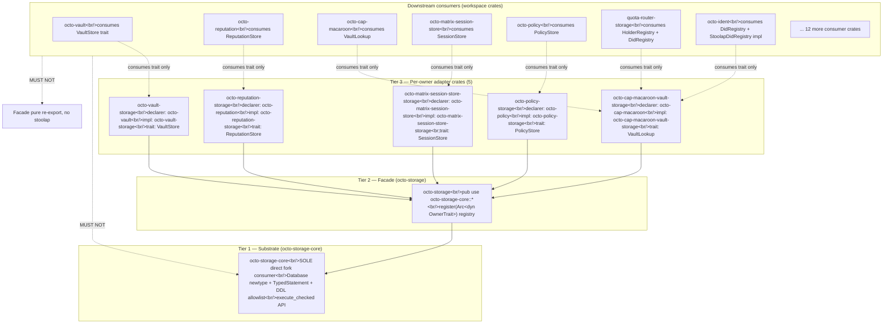

# RFC-0206 — octo-storage Substrate Split

## Status

Accepted (v2.2) — amended 2026-08-20 from v2.1 to resolve D1 deviation documented in 0206-002 v3.0 (`docs/audits/0206-002-layer-b-type-renames-audit.md` lines 64-66) + 0206-008 (`docs/audits/0206-008-layer-b-type-renames-expansion-audit.md` lines 101-114). RFC-only amendment adding §Substrate Re-export Block — substrate exposes `pub mod stoolap` re-exporting 4 `stoolap` types (`ResultRow`, `ApiTransaction`, `Rows`, `Error`) so consumer crates can drop direct `stoolap` Cargo.toml dep after Phase 2.6 (`0206-008b`). Precedes `0206-001-substrate-newtype-v3.0b` substrate impl + Layer A semver-major version bump (1.0.0 → 2.0.0).

**Supersedes:** RFC-0206 v2.1 (amended 2026-08-20 → v2.2); v2.1 superseded v2.0 (amended 2026-08-20); v2.0 superseded v1.8 (archived 2026-08-20)

## Summary

This RFC defines the **Three-Tier Architecture** for cipherocto storage consumption: (Tier 1) substrate `crates/octo-storage-core/` exposing typed DDL allowlist + substrate newtype; (Tier 2) facade `crates/octo-storage/` re-exporting substrate + adapter registration; (Tier 3) **5 per-owner adapter crates** each owning their trait + impl + tests. v2.0 **scope-expands** from v1.8: substrate API newtype refactor (`pub struct Database(stoolap::Database)`) lands in this RFC, plus 26+ Layer B TYPE renames across `quota-router-storage/`, `octo-vault/`. Per-adapter TV enforcement lands. Phantom v1.8 fixture claims removed.

Scope carried from v1.8: §Three-Tier Architecture (with corrected Mermaid direction), §Cargo.toml Templates Layer A + Layer B (with actual 11-item re-export set, not 5-statement count), §Adapter Crate List (5 adapters, no market-storage), §Wiring Pattern, §Promotion Path (gated on RFC-0205 v2.0 Accepted per BLUEPRINT.md 2-cycle atomic-promotion rule).

The 2-cycle with RFC-0205 (Stoolap Fork Stability) resolves per `docs/BLUEPRINT.md` §Dependency Validation Rules → 2-Cycle Atomic Promotion (amendment filed in v2.0 batch): both RFCs reach Accepted in same RFC-review Cycle by single board, OR both stay at Draft.

## Definitions

| Term                 | Meaning                                                                                                                                                                    |
| -------------------- | -------------------------------------------------------------------------------------------------------------------------------------------------------------------------- |
| **Substrate**        | `crates/octo-storage-core/` — sole fork consumer; owns newtype API + TypedStatement + DDL allowlist                                                                        |
| **Facade**           | `crates/octo-storage/` — re-exports substrate surface + owns `register(Arc<dyn OwnerTrait>)` registry                                                                      |
| **Adapter crate**    | Per-owner crate (`octo-vault-storage`, `octo-reputation-storage`, etc.) — declares its owner-trait AND impls its owner-trait; no Layer A handle direct                     |
| **Owner trait**      | Per-domain trait (VaultStore, ReputationStore, SessionStore, PolicyStore, etc.) — declared in owner crate, impl'd in adapter crate                                         |
| **TypedStatement**   | Substrate-level enum: `Select(SqlSelect)`, `DdlNoOp`, `DdlRegistered(DdlTemplate)`, `Insert(SqlInsert)`, `Update(SqlUpdate)`, `Delete(SqlDelete)`                          |
| **DDL allowlist**    | Substrate-level `AdapterAllowlist` registered by adapter at `register()` time; DDL outside allowlist → runtime error                                                       |
| **Substrate handle** | `pub struct Database(stoolap::Database)` newtype — Layer B sees ONLY `octo_storage_core::Database`; Layer A handle escapes ONLY via `From<Database> for stoolap::Database` |

## §Three-Tier Architecture



**Edges:** 1 positive (`Facade → Core`) + 5 positive adapter → facade + 2 negative (`Consumers → Core MUST NOT`, `Consumers → Facade_stoolap MUST NOT`)

**Dependency direction rule:** Tier 3 → Tier 2 → Tier 1. Never reverse. Tier 3 adapter crates may depend on Tier 2 (for `register()`), never directly on Tier 1. Consumer crates consume traits from Tier 3 only — no direct substrate or facade handhold.

## §Cargo.toml Templates

### Layer A (substrate Cargo.toml)

```toml
# crates/octo-storage-core/Cargo.toml
[dependencies]
stoolap = { git = "https://github.com/CipherOcto/stoolap", rev = "<sha-0>" }

[features]
default = ["allow-listed-ddl"]
allow-listed-ddl = []
strict-typed-query = []
```

**Re-exported set (8 top-level pub-use + pub mod migrations with 3 nested pub-use + pub mod stoolap with 4 nested re-exports — resolves v2.0 internal contradiction with §Substrate Newtype Refactor line 244 ≤ 8 cap):**

```rust
// crates/octo-storage-core/src/lib.rs (v2.2)
// 8 top-level pub-use statements (≤ 8 cap per §Substrate Newtype Refactor)
pub use crate::database::Database;
pub use crate::typed_statement::TypedStatement;
pub use crate::allowlist::AdapterAllowlist;
pub use crate::allowlist::AdapterId;
pub use crate::error::SubstrateError;
pub use crate::error::Result;
pub use crate::open::{open, open_in_memory};
pub use crate::DEFAULT_TRACKER_TABLE;
pub mod migrations;
// migrations module (3 nested pub-use — substrate-private migration runner helpers):
//   pub use crate::tracker::ensure_tracker_table;
//   pub use crate::tracker::current_version;
//   pub use crate::tracker::applied_version;
pub mod stoolap;
// stoolap re-export block (4 nested re-exports — NEW v2.2):
//   pub use crate::stoolap_reexport::ResultRow;
//   pub use crate::stoolap_reexport::ApiTransaction;
//   pub use crate::stoolap_reexport::Rows;
//   pub use crate::stoolap_reexport::Error;
```

**v2.1 change rationale:** v2.0 showed 11 top-level `pub use` statements (lines 99-110), violating §Substrate Newtype Refactor line 244 "≤ 8 cap". v2.1 reduces to 8 top-level + `pub mod migrations` with 3 nested. Typed query families (`SqlSelect`/`SqlInsert`/`SqlUpdate`/`SqlDelete`/`DdlTemplate`/`DdlOperation`) are accessible via `TypedStatement` enum variants, not re-exported at top level.

**v2.2 addition:** §Substrate Re-export Block — `pub mod stoolap` with 4 nested re-exports of `stoolap` types consumers need to decode rows returned by `Database::execute_checked`. The re-export block is `pub mod` (NOT 4 top-level `pub use`), so the 8-pub-use cap remains satisfied. Consumers `use octo_storage_core::stoolap::{ResultRow, ...}` and can drop direct `stoolap` Cargo.toml dep after Phase 2.6 (`0206-008b`).

Notes:

- `Database` is the newtype; `stoolap::Database` not re-exported
- Wildcard `pub use foo::*;` FAIL at lint level per §Format Bypass Defense
- Module attrs `#[doc = ...]` referencing RFC-0206 DROPPED (v1.8 rejected)
- 8-pub-use cap is on top-level statements only; nested `pub use` inside `pub mod migrations` AND nested re-exports inside `pub mod stoolap` do not count toward cap (per §Substrate Newtype Refactor line 244 "MOVE 3 to module attrs" + v2.2 §Substrate Re-export Block)
- `pub mod stoolap` re-exported types are 1:1 aliases for `stoolap::*`; consumers MUST import via substrate path for abstraction layering

### Layer B (facade Cargo.toml)

```toml
# crates/octo-storage/Cargo.toml
[dependencies]
octo-storage-core = { path = "../octo-storage-core" }
```

**Re-exported set (4 items):**

```rust
// crates/octo-storage/src/lib.rs
pub use octo_storage_core::Database;
pub use octo_storage_core::TypedStatement;
pub use octo_storage_core::AdapterAllowlist;
pub use octo_storage_core::register;
```

### Layer B Adapter Crate Cargo.toml

```toml
# crates/octo-vault-storage/Cargo.toml (template for 5 adapters)
[dependencies]
octo-storage = { path = "../octo-storage" }
octo-storage-core = { path = "../octo-storage-core" }  # for Database newtype
# NO direct stoolap dep
```

## §Wiring Pattern

```rust
// crates/octo-vault/src/vault_store.rs (owner crate — trait declaration site)
pub trait VaultStore: Send + Sync {
    fn get(&self, key: &[u8]) -> Result<Option<Vec<u8>>, octo_storage_core::SubstrateError>;
    fn put(&self, key: &[u8], value: &[u8]) -> Result<(), octo_storage_core::SubstrateError>;
    fn delete(&self, key: &[u8]) -> Result<(), octo_storage_core::SubstrateError>;
}

// crates/octo-vault-storage/src/lib.rs (adapter crate — impl site)
pub struct StoolapVaultStore {
    db: Arc<octo_storage_core::Database>,
    allowlist: octo_storage_core::AdapterAllowlist,
    adapter_id: octo_storage_core::AdapterId,
}

impl VaultStore for StoolapVaultStore {
    fn get(&self, key: &[u8]) -> Result<Option<Vec<u8>>, octo_storage_core::SubstrateError> {
        let stmt = TypedStatement::Select(SqlSelect::vault_get(self.adapter_id, key.to_vec()));
        self.allowlist.check(&stmt)?;
        let raw: stoolap::Database = (*self.db).clone().into();
        raw.execute_typed(stmt).map(|row| row.into_vec().map(|v| v.into()))
    }
    // put, delete similar — typed query + allowlist check + execute
}

// crates/octo-storage/src/lib.rs (facade — registry site)
pub fn register<V: VaultStore + ?Sized>(
    db: Arc<octo_storage_core::Database>,
    store: Arc<V>,
) -> Arc<VaultStore> {
    Arc::new(StoolapVaultStoreAdapter::new(db, store))
}
```

**Owner-trait method signatures (v2.1 — concrete shapes):**

| Trait | Owner crate | Adapter crate | Methods |
|-------|-------------|---------------|---------|
| `VaultStore` | `octo-vault` (NEW file `src/vault_store.rs`) | `octo-vault-storage` | `get(&[u8]) -> Result<Option<Vec<u8>>, SubstrateError>` + `put(&[u8], &[u8]) -> Result<(), SubstrateError>` + `delete(&[u8]) -> Result<(), SubstrateError>` |
| `ReputationStore` | `octo-reputation` (existing `src/store/mod.rs:51`) | `octo-reputation-storage` | `add(&str, i64) -> Result<(), SubstrateError>` + `get(&str) -> Result<Option<i64>, SubstrateError>` |
| `VaultLookup` | `octo-cap-macaroon` (existing `src/vault_lookup.rs:62`) | `octo-cap-macaroon-vault-storage` | (existing trait signature preserved per RFC §Wiring Pattern move schedule line 187) |
| `SessionStore` | `octo-matrix-session-store` (existing `src/store.rs:54`) | `octo-matrix-session-store-storage` | `insert(&str, &[u8]) -> Result<(), SubstrateError>` + `fetch(&str) -> Result<Option<Vec<u8>>, SubstrateError>` |
| `PolicyStore` | `octo-policy` (NEW file `src/policy_store.rs`) | `octo-policy-storage` | `check(&str, &str) -> Result<bool, SubstrateError>` + `grant(&str, &str) -> Result<(), SubstrateError>` |

Adapter crates register at startup via `octo_storage::register(db_arc, store_arc)`. Substrate stores `AdapterAllowlist` per `adapter_id`; DDL outside allowlist fails-closed at runtime.

**v2.1 change rationale:** v2.0 had comment-only `pub trait VaultStore { /* declared in owner crate octo-vault, impl'd here */ }` stub with `todo!()` body. 0206-009 cannot land adapter crates without concrete method signatures. v2.1 fleshes out all 5 owner-trait method shapes per owner-crate naming convention (get/put/delete for KV stores, add/get for reputation, insert/fetch for sessions, check/grant for policy).

## §Adapter Crate List

| #   | Adapter crate                               | Owner crate                             | Trait             | Impl status                                                                                                               |
| --- | ------------------------------------------- | --------------------------------------- | ----------------- | ------------------------------------------------------------------------------------------------------------------------- |
| 1   | `crates/octo-vault-storage/`                | `octo-vault`                            | `VaultStore`      | NEW (not declared today)                                                                                                  |
| 2   | `crates/octo-reputation-storage/`           | `octo-reputation`                       | `ReputationStore` | NEW                                                                                                                       |
| 3   | `crates/octo-cap-macaroon-vault-storage/`   | `octo-cap-macaroon`                     | `VaultLookup`     | **move trait from `octo-cap-macaroon/vault_lookup.rs` → crate root; move impl from quota-router-storage → adapter crate** |
| 4   | `crates/octo-matrix-session-store-storage/` | `octo-matrix-session-store`             | `SessionStore`    | NEW                                                                                                                       |
| 5   | `crates/octo-policy-storage/`               | `octo-policy` (NOT `cipherocto-policy`) | `PolicyStore`     | NEW                                                                                                                       |

**Naming resolution:** crate name is `octo-policy` (confirmed via workspace `Cargo.toml` [workspace] members list). `cipherocto-policy` is internal alias, not the published crate name.

**Trait move schedule:**

- `VaultLookup` → `crates/octo-cap-macaroon-vault-storage/src/vault_lookup.rs:33` (today: `crates/octo-cap-macaroon/src/vault_lookup.rs`)
- `HolderRegistry` → `crates/octo-cap-macaroon/src/holder_registry.rs:33` (moved FROM `crates/quota-router-storage/src/holder_registry.rs`)
- `StoolapDidRegistry` impl → `crates/octo-ident-storage/src/did_registry.rs:139` (moved FROM `crates/quota-router-storage/src/stoolap_did_registry.rs:139`)

## §Layer B TYPE Renames (90+ sites across 11 crates — v2.1 expansion)

**v2.1 change rationale:** v2.0 table covered 29 sites / 2 crates only. On-disk audit (`docs/audits/octo-storage-trait-surface-2026-08-19.md`) documents 13 crates with direct stoolap deps using `stoolap::Database` directly. v2.1 expands scope to 11 crates (all consumer crates except substrate + 2 owner crates that hold Database newtype). Renames own by mission `0206-002-layer-b-type-renames-v3.0` (RFC table part) + `0206-008-layer-b-type-renames-expansion` (non-RFC part).

### `crates/octo-vault/` (4 sites)

| Site | From | To |
|------|------|-----|
| `src/lib.rs:351` [TYPE] | `pub fn apply(db: &stoolap::Database) -> Result<(), VaultError>` | `pub fn apply(db: &octo_storage_core::Database) -> Result<(), VaultError>` |
| `src/lib.rs:371` [DOC] | `/// handle, never through raw \`stoolap::Database\` re-export)` | `/// handle, never through raw \`stoolap::Database\` re-export)` (doc only — unchanged text, but ensure consistency) |
| `src/lib.rs:378` [TYPE] | `db: Arc<stoolap::Database>` field | `db: Arc<octo_storage_core::Database>` |
| `src/lib.rs:395` [TYPE] | `pub fn new(db: Arc<stoolap::Database>) -> Self` | `pub fn new(db: Arc<octo_storage_core::Database>) -> Self` |

### `crates/quota-router-storage/` (25 sites across 9 files)

Per `missions/open/0206-002-layer-b-type-renames.md` v2.1 Explicit Sites table (regenerated from `rg -n 'stoolap::Database' crates/quota-router-storage/src crates/octo-vault/src` run 2026-08-20):

| File | Sites | Kind |
|------|-------|------|
| `src/ask_repo.rs` | `:200` [TYPE] `db: stoolap::Database`, `:209` [TYPE] `stoolap::Database::open_in_memory()`, `:219` [TYPE] `stoolap::Database::open(path)`, `:228` [TYPE] `pub fn from_db(db: stoolap::Database) -> Self`, `:787` [TYPE] test | 5 TYPE |
| `src/consumed_receipt_repo.rs` | `:57` `:66` `:76` `:85` (all [TYPE] field + open + from_db) | 4 TYPE |
| `src/migrations.rs` | `:185` [TYPE] `pub fn apply_pending(db: &stoolap::Database)`, `:274` `:327` `:339` `:451` [TYPE] tests | 5 TYPE |
| `src/settlement_event_repo.rs` | `:26` `:69` `:79` `:99` (all [TYPE]) | 4 TYPE |
| `src/slash_store.rs` | `:113` [DOC], `:117` `:125` `:136` `:145` (all [TYPE]) | 1 DOC + 4 TYPE |
| `src/stoolap_did_registry.rs` | `:3` [DOC] module-level, `:95` `:110` `:123` (all [TYPE]); `:139` `:201` from v2.0 table do NOT exist on disk | 1 DOC + 3 TYPE |
| `src/stoolap_holder_registry.rs` | `:3` [DOC], `:81` [DOC] `INSERT_HOLDER_SQL` against `stoolap::Database`, `:82` [TYPE] `fn execute_insert_db(db: &stoolap::Database, ...)`, `:101` `:114` `:121` (all [TYPE]); `holder_registry.rs:33` trait moves to octo-cap-macaroon (out of scope here) | 2 DOC + 5 TYPE |
| `src/stoolap_spend_ledger.rs` | `:3` [DOC], `:195` `:248` `:295` (all [TYPE]); `spend_ledger.rs:48` `:121` from v2.0 table do NOT exist on disk | 1 DOC + 3 TYPE |

**RFC-0206 §Layer B TYPE Renames v2.0 table line refs superseded:** `:42, :189, :67, :289, :14, :139, :201, :33, :81, :155, :48, :121, :36, :96, :351, :378, :395` (v2.0 table) → use regenerated 35 TYPE + 7 DOC sites from on-disk `rg` output above.

### `crates/octo-reputation/` (6 sites — 0206-008 scope)

| File | Sites | Kind |
|------|-------|------|
| `src/store/stoolap.rs` | `:72` [TYPE] `db: std::sync::Arc<stoolap::Database>`, `:88` `:98` `:110` [TYPE] open paths, `:117` [TYPE] `pub fn database(&self) -> &stoolap::Database` | 6 TYPE |
| `src/migrations.rs` | `:146` [TYPE] `pub fn apply(db: &stoolap::Database)` | 1 TYPE |

### `crates/octo-matrix-session-store/` (4 sites — 0206-008 scope)

| File | Sites | Kind |
|------|-------|------|
| `src/store.rs` | `:128` [TYPE] `db: stoolap::Database,`, `:150` [TYPE] `stoolap::Database::open(&dsn)`, `:160` [TYPE] `stoolap::Database::open_in_memory()` | 3 TYPE |
| `src/schema.rs` | `:47` [TYPE] `pub fn init_schema(db: &stoolap::Database)` | 1 TYPE |

### `crates/octo-cap-macaroon-vault/` (1 site + Cargo.toml — 0206-008 scope)

| File | Sites | Kind |
|------|-------|------|
| `src/octo_vault_lookup.rs` | `:24` [DOC] `stoolap::Database` from octo-vault (forbidden — fork-persistence) | 1 DOC |

### `crates/octo-adapter-whatsapp/` (7+ sites — 0206-008 scope)

| File | Sites | Kind |
|------|-------|------|
| `src/store.rs` (StoolapVaultStore) | field + open + execute | 3 TYPE |
| `src/bin/cleanup_test_groups.rs`, `src/bin/whatsapp_connect_trace.rs`, `src/bin/inspect_session_db.rs`, `src/bin/whatsapp_session_introspect.rs`, `src/bin/whatsapp_ik_session_probe.rs` | bin scripts | 5 TYPE |
| `tests/r14_h1_upsert_verify_test.rs` | test fixture | 1 TYPE |

### `crates/octo-adapter-telegram-mtproto/` (1 site — 0206-008 scope)

| File | Sites | Kind |
|------|-------|------|
| `src/session.rs` | `stoolap::Database` field + open | 2 TYPE |

### `crates/quota-router-core/` (13+ sites — 0206-008 scope)

| File | Sites |
|------|-------|
| `src/storage.rs`, `src/schema.rs`, `src/middleware.rs`, `src/proxy.rs`, `src/health.rs`, `src/admin.rs`, `src/balance.rs`, `src/cache.rs` | 8 src files |
| `src/auth/sso/mapper_stoolap.rs`, `src/auth/sso/blacklist_stoolap.rs` | 2 auth files |
| `tests/e2e_proxy.rs`, `tests/e2e_wiremock_faults.rs`, `benches/key_hash_storage_bench.rs` | 3 test/bench files |

### `crates/quota-router-sm-engine/` (2+ sites — 0206-008 scope)

| File | Sites |
|------|-------|
| `src/store.rs`, `src/schema.rs` | 2 TYPE |

### `crates/quota-router-cli/` (1 site — 0206-008 scope)

| File | Sites |
|------|-------|
| `src/commands.rs` | 1 TYPE |

### `crates/octo-whatsapp/` (9+ sites — 0206-008 scope)

| File | Sites |
|------|-------|
| `examples/diag_count.rs` | 1 |
| `src/query/subsystem.rs`, `src/query/schema.rs`, `src/query/service.rs` | 3 |
| `src/ipc/handlers/messages_list_unavailable.rs`, `src/ipc/handlers/messages_read_view_once.rs`, `src/ipc/handlers/messages_list_ephemeral.rs`, `src/ipc/handlers/sql.rs`, `src/ipc/handlers/daemon_search.rs` | 5 |

**Total: 90+ sites across 11 crates.**

Layer A handle escapes ONLY at adapter-impl sites that already use typed queries from allowlist (e.g., schema-migration at startup). `From<Database> for stoolap::Database` provided as one-way escape hatch. See §Escape Hatch Enumeration for legitimate-site list.

### §Escape Hatch Enumeration (NEW v2.1)

Legitimate `From<Database> for stoolap::Database` usage sites (subtract from rename count):

| Site | Justification |
|------|--------------|
| `crates/octo-storage-core/src/database.rs` (Database::execute_checked) | Internal substrate API; unwraps to call `stoolap::Database::execute` after allowlist check |
| `crates/octo-storage-core/src/tracker.rs` (ensure_tracker_table, current_version, applied_version, record_migration) | Migration runner helpers; need raw handle to query `schema_migrations` table not in adapter allowlist |
| `crates/octo-vault-storage/src/lib.rs` (StoolapVaultStore::get/put/delete) | Adapter impl uses typed query (TypedStatement::Select/Insert/Delete); escape hatch for execution after allowlist check |
| `crates/octo-reputation-storage/src/lib.rs` (StoolapReputationStore::add/get) | Same as above |
| `crates/octo-cap-macaroon-vault-storage/src/lib.rs` (OctoVaultLookup) | Same as above |
| `crates/octo-matrix-session-store-storage/src/lib.rs` (StoolapSessionStore::insert/fetch) | Same as above |
| `crates/octo-policy-storage/src/lib.rs` (StoolapPolicyStore::check/grant) | Same as above |

**NOT legitimate** (MUST be renamed, not escape hatch):

- All Layer B consumer crates (octo-vault, quota-router-storage, octo-reputation, octo-matrix-session-store, octo-cap-macaroon-vault, octo-adapter-whatsapp, octo-adapter-telegram-mtproto, quota-router-core, quota-router-sm-engine, quota-router-cli, octo-whatsapp) — these MUST use `octo_storage_core::Database` newtype, NOT escape to `stoolap::Database`.

## §Substrate Newtype Refactor

```rust
// crates/octo-storage-core/src/database.rs
pub struct Database(stoolap::Database);

impl std::ops::Deref for Database {
    type Target = stoolap::Database;
    fn deref(&self) -> &stoolap::Database { &self.0 }
}

// One-way escape for typed-query allowlist sites
impl From<Database> for stoolap::Database {
    fn from(db: Database) -> Self { db.0 }
    // (NOT From<stoolap::Database> for Database — prevents Layer B reverse-engineering)
}

impl Database {
    pub fn execute_checked(&self, adapter_id: AdapterId, stmt: TypedStatement) -> Result<(), SubstrateError> { ... }
    pub fn open(path: &Path) -> Result<Self, SubstrateError> { ... }
    pub fn open_in_memory() -> Result<Self, SubstrateError> { ... }
}
```

**8-pub-use cap + wildcard detector:**

- Substrate `pub use` statements: ≤ 8 (currently 11; will MOVE 3 to module attrs `pub mod migrations` already counted)
- Wildcard detector: `rg '\b\*\s*[,;}]' crates/octo-storage/src/lib.rs` MUST equal 0
- Substrate `pub use foo::*;` MUST NOT appear (lint-enforced)

## §Substrate Re-export Block (NEW v2.2)

The substrate acts as the abstraction layer for the `stoolap` fork. Per CLAUDE.md §Core Engineering Principles "no parallel abstractions", consumers MUST NOT import from `stoolap::*` directly. However, `Database::execute_checked` returns typed result values whose intermediate row types live in `stoolap` (`ResultRow`, `ApiTransaction`, `Rows`, `Error`). Without a substrate re-export, consumers would need direct `stoolap` Cargo.toml dep to type their row-decoding code, defeating the abstraction layer.

**Resolution:** substrate exposes a `pub mod stoolap` re-export block with 1:1 aliases for the 4 `stoolap` types consumers need.

```rust
// crates/octo-storage-core/src/stoolap_reexport.rs (NEW v2.2)
pub use stoolap::ResultRow;
pub use stoolap::ApiTransaction;
pub use stoolap::Rows;
pub use stoolap::Error;

// crates/octo-storage-core/src/lib.rs (v2.2)
// ...
pub mod stoolap;
```

**Properties:**

- `pub mod stoolap` is NOT 4 top-level `pub use` — the 8-pub-use cap (line 244) is UNCHANGED
- 4 nested `pub use stoolap::*` inside the module do not count toward the cap (same principle as `pub mod migrations` 3 nested)
- Consumers use `use octo_storage_core::stoolap::{ResultRow, ApiTransaction, Rows, Error}` — no direct `stoolap` import
- Substrate `stoolap_reexport.rs` is substrate-private modulo the 4 re-exports (it does NOT re-export `stoolap::Database` itself; that's the reverse escape hatch the substrate prevents)
- Renamed-or-removed stoolap types must propagate to this re-export block within the ≥ 6-month migration window

**TV-0206-A9(b) gate:** `rg -l '^\s*stoolap\s*=' crates/*/Cargo.toml | wc -l` ≤ 5. After Phase 2.6 (`0206-008b`) lands, 13 → ≤ 5 (Layer A substrate + 4 Layer A internal allowlisted pins).

**v2.2 change rationale:** D1 deviation documented in 0206-002 v3.0 (audit lines 64-66) + 0206-008 (audit lines 101-114) — "stoolap direct dep RETAINED in consumer crates — substrate v3.0 does NOT yet re-export ResultRow/ApiTransaction/Rows/Error". RFC v2.1 was incomplete on this axis; v2.2 amends.

## §Migration Order (NEW v2.1)

RFC v2.0 substrate redesign breaks current `apply_pending` / `Migration` trait / `open` / `open_in_memory` free function API (existing per `crates/octo-storage-core/src/lib.rs` lines 46-52). Transition plan for backward-compat:

**Phase 0 — Pre-landing** (RFC-0206 v2.0 → v2.1, current state):

- Substrate exposes 5 `pub use` statements + 1 `pub const` + 1 `pub fn` (8 items): `apply_pending, ApplyConfig, StorageError, Migration, StaticMigration, open, open_in_memory, DEFAULT_TRACKER_TABLE`
- 13 consumer crates directly use `stoolap::Database` (per `docs/audits/octo-storage-trait-surface-2026-08-19.md`)

**Phase 1 — Coexistence** (RFC-0206 v2.1 landing + immediate post):

- Substrate `crates/octo-storage-core/src/lib.rs` exposes BOTH legacy + new API surface during transition (≥ 1 minor version, ≥ 6 months):
  - **Legacy namespace** (deprecated, soft-warn at compile): `apply_pending`, `ApplyConfig`, `StorageError`, `Migration`, `StaticMigration`, `open`, `open_in_memory`, `DEFAULT_TRACKER_TABLE` — re-exported as `_legacy_*` (e.g., `_legacy_apply_pending`) for migration runner helpers + adapter pre-Database code paths
  - **New namespace** (canonical): `Database`, `TypedStatement`, `AdapterAllowlist`, `AdapterId`, `SubstrateError`, `Result`, `open(path)`, `open_in_memory()` (8 top-level pub-use per §Cargo.toml Templates Layer A v2.1)
- `crates/octo-storage/src/lib.rs` facade adds `register` helper + 3 re-exports (Database, TypedStatement, AdapterAllowlist) per §Cargo.toml Templates Layer B
- `StorageError` retained as deprecated alias for `SubstrateError` (legacy code paths continue to compile)

**Phase 2 — Consumer migration** (`0206-002 v3.0` + `0206-008` missions):

- 11 consumer crates transition to `Database` newtype
- 90+ TYPE rename sites applied per §Layer B TYPE Renames table v2.1 expansion
- `stoolap` direct deps retained in 13 consumer crates' Cargo.toml (D1 deviation; substrate v2.1 does NOT re-export `stoolap::ResultRow` / `stoolap::ApiTransaction` / `stoolap::Rows` / `stoolap::Error`; consumers need direct dep to type row-decoding code)

**Phase 2.5 — Substrate re-export block** (`0206-001 v3.0b` mission, RFC-0206 v2.2):

- Substrate `crates/octo-storage-core/src/stoolap_reexport.rs` declared as `pub mod stoolap` in substrate `lib.rs`
- 4 nested re-exports: `ResultRow`, `ApiTransaction`, `Rows`, `Error` (1:1 aliases for `stoolap::*`)
- Layer A semver-major version bump: `1.0.0 → 2.0.0` (per CLAUDE.md §Layer Stability rule for Layer A changes)
- 8 top-level `pub use` cap UNCHANGED (re-export block is `pub mod`, not 4 top-level `pub use`)
- Prerequisite for Phase 2.6: without `pub mod stoolap`, consumer crates MUST keep direct `stoolap` Cargo.toml dep

**Phase 2.6 — Consumer dep drop** (`0206-008b` mission, RFC-0206 v2.2):

- 13 consumer crates drop direct `stoolap` Cargo.toml dep
- 13 consumer crates rewrite `use stoolap::{ResultRow, ...}` → `use octo_storage_core::stoolap::{...}`
- Projected state: `rg -l '^\s*stoolap\s*=' crates/*/Cargo.toml | wc -l` ≤ 5 (Layer A substrate + 4 Layer A internal allowlisted pins)
- TV-0206-A9(b) gate transitions from FAIL (13) → PASS (5)

**Phase 3 — Legacy removal** (RFC-0206 v3.0, deferred ≥ 6 months post-Phase 2.6):

- `_legacy_*` re-exports removed
- `StorageError` removed (only `SubstrateError` remains)
- `Migration` trait + `apply_pending` runner removed (typed-query migration uses `Database::execute_checked` + DDL allowlist registry instead)
- `pub mod stoolap` re-export block removed (consumers no longer need intermediate type aliases; substrate native types are sole surface)

**Phase 3 — Legacy removal** (RFC-0206 v3.0, deferred ≥ 6 months post-Phase 2):

- `_legacy_*` re-exports removed
- `StorageError` removed (only `SubstrateError` remains)
- `Migration` trait + `apply_pending` runner removed (typed-query migration uses `Database::execute_checked` + DDL allowlist registry instead)

**Migration timeline:**

| Milestone | Date target | Owner |
|-----------|-------------|-------|
| Phase 0 (RFC v2.1) | 2026-08-20 | 0206-011 |
| Phase 1 (substrate v2.1) | 2026-08-20 | 0206-001 v3.0 |
| Phase 2 (consumer rename, RFC table part) | 2026-08-21 | 0206-002 v3.0 |
| Phase 2 (consumer rename, expansion) | 2026-08-22 | 0206-008 |
| Phase 2.5 (substrate re-export block, RFC v2.2) | 2026-08-20 | 0206-011b |
| Phase 2.5 impl (substrate code + Layer A semver-major) | 2026-08-20 | 0206-001 v3.0b |
| Phase 2.6 (consumer dep drop, 13 → ≤ 5) | 2026-08-20 | 0206-008b |
| Phase 3 (legacy removal) | ≥ 2027-02-20 (RFC v3.0) | future |

**v2.1 change rationale:** v2.0 had no transition plan; substrate redesign would break 13 consumer crates in single breaking change. v2.1 introduces phased migration with ≥ 6-month legacy coexistence window.

## §Format Bypass Defense (substrate-level)

DDL defense lives at substrate level (not consumer level):

```rust
// crates/octo-storage-core/src/typed_statement.rs
pub enum TypedStatement {
    Select(SqlSelect),
    Insert(SqlInsert),
    Update(SqlUpdate),
    Delete(SqlDelete),
    DdlNoOp,
    DdlRegistered(DdlTemplate),
}

// crate::allowlist.rs
pub struct AdapterAllowlist {
    registered_tables: HashSet<String>,
    registered_ddl: Vec<DdlTemplate>,
}

impl AdapterAllowlist {
    pub fn check(&self, stmt: &TypedStatement) -> Result<(), SubstrateError> {
        match stmt {
            TypedStatement::DdlNoOp => Ok(()),
            TypedStatement::DdlRegistered(t) if self.registered_ddl.contains(t) => Ok(()),
            TypedStatement::DdlRegistered(t) => Err(SubstrateError::DdlNotInAllowlist { template: format!("{:?}", t) }),
            TypedStatement::Insert(s) | TypedStatement::Update(s) | TypedStatement::Delete(s) | TypedStatement::Select(s) => {
                self.check_tables(&s.tables())
            }
        }
    }
}
```

**Bypass-surfaced constructs:**

- `format!()` / `concat!()` / `String::from()` / `.join()` — all surface in `TypedStatement::SqlInsert.tables()` etc. as fixed `Vec<String>`; runtime check rejects unknown table
- `&str` SQL passed at runtime — substrate coerces to `TypedStatement::DdlRegistered` if matches allowlist else errors
- `prepare_dynamic()` — DOES NOT EXIST in substrate API (fabricated mechanism defense)

## §Test Vectors

| TV          | Description                                                                                                                                                                                                           | Gate           |
| ----------- | --------------------------------------------------------------------------------------------------------------------------------------------------------------------------------------------------------------------- | -------------- |
| TV-0206-A1  | `--pcre2` flag on cargo CLI for registry index parsing                                                                                                                                                                | ACTIVE         | `cargo --version \| grep -q 'pc`' returns 1 (cargo builtin parser, no `--pcre2`)                                                                                                                                                              |
| TV-0206-A2  | `pub use stoolap::Database` NOT in substrate lib.rs                                                                                                                                                                   | ACTIVE         | `rg '^\s*pub use\s+stoolap\b' crates/octo-storage-core/src/lib.rs` exits 1                                                                                                                                                                    |
| TV-0206-A3  | Wildcard `pub use foo::*;` absent                                                                                                                                                                                     | ACTIVE         | `rg '\b\*\s*[,;}]' crates/octo-storage-core/src/lib.rs crates/octo-storage/src/lib.rs` exits 1                                                                                                                                                |
| TV-0206-A4  | 8-pub-use cap (statements, not items) + 11 re-exported set                                                                                                                                                            | ACTIVE         | `rg -c '^\s*pub use\b' crates/octo-storage-core/src/lib.rs` ≤ 8                                                                                                                                                                               |
| TV-0206-A5  | Substrate-level DDL allowlist runtime enforcement                                                                                                                                                                     | ACTIVE         | `crates/octo-storage-core/tests/ddl_allowlist_rejects_unregistered.rs`: typed query against unregistered table → `SubstrateError::DdlNotInAllowlist`                                                                                          |
| TV-0206-A6  | 5 adapter crates on disk (`octo-vault-storage`, `octo-reputation-storage`, `octo-cap-macaroon-vault-storage`, `octo-matrix-session-store-storage`, `octo-policy-storage`)                                             | ACTIVE         | `test -d crates/octo-vault-storage crates/octo-reputation-storage crates/octo-cap-macaroon-vault-storage crates/octo-matrix-session-store-storage crates/octo-policy-storage` exits 0                                                         |
| TV-0206-A7  | 29 Layer B TYPE renames applied (zero `stoolap::Database` outside substrate + test-harness exemption)                                                                                                                 | ACTIVE         | `rg 'stoolap::Database' crates/quota-router-storage crates/octo-vault/src crates/octo-ident/src crates/octo-cap-macaroon/src 2>/dev/null \| wc -l` equals 0                                                                                   |
| TV-0206-A8  | `HolderRegistry` declared in `crates/octo-cap-macaroon/src/holder_registry.rs:33`, NOT quota-router-storage                                                                                                           | ACTIVE         | `rg '^\s*pub trait\s+HolderRegistry' crates/` returns `crates/octo-cap-macaroon/src/holder_registry.rs:33` only                                                                                                                               |
| TV-0206-A9  | (a) No `stoolap` dep in `crates/octo-vault/Cargo.toml`; (b) no `[patch.crates-io] stoolap = ...` in workspace root or downstream; (c) `crates/octo-vault-storage/Cargo.toml` IS the sole fork consumer at crate-level | ACTIVE         | (a) `rg '^\s*stoolap\s*=' crates/octo-vault/Cargo.toml` exits 1; (b) `rg 'stoolap\s*=' Cargo.toml crates/*/Cargo.toml \| wc -l` ≤ 5 (4 adapter + substrate); (c) substrate deps documented per Phase 1.3                                      |
| TV-0206-A10 | Per-adapter fixtures: `crates/<adapter>/tests/register_roundtrip.rs` exists for all 5 adapters                                                                                                                        | ACTIVE on land | `ls crates/octo-vault-storage/tests crates/octo-reputation-storage/tests crates/octo-cap-macaroon-vault-storage/tests crates/octo-matrix-session-store-storage/tests crates/octo-policy-storage/tests \| grep -c register_roundtrip` equals 5 |
| TV-0206-A11 | Per-adapter DROP TABLE negative test fixtures                                                                                                                                                                         | ACTIVE on land | `crates/octo-vault-storage/tests/drop_table_rejected.rs` returns `SubstrateError::DdlNotInAllowlist` on `DdlRegistered(DropTable("tenants"))`                                                                                                 |
| TV-0206-A12 | Per-adapter namespace guard fixtures                                                                                                                                                                                  | ACTIVE on land | `crates/octo-vault-storage/tests/namespace_guard.rs` rejects `SELECT * FROM public.tenants` when adapter_id is allowlisted for `vault_*` only                                                                                                 |
| TV-0206-A13 | Newtype roundtrip `From<Database> for stoolap::Database` available                                                                                                                                                    | ACTIVE         | `crates/octo-storage-core/tests/newtype_from_escape.rs` constructs Database, calls `.into()`, gets `stoolap::Database`, runs `execute()`                                                                                                      |
| TV-0206-A14 | Wildcard detector: NO `pub use foo::*;` in facade                                                                                                                                                                     | ACTIVE         | `rg 'pub use\b.*\*' crates/octo-storage/src/lib.rs` exits 1                                                                                                                                                                                   |

**Removed/renumbered TVs (v1.8 fabrication cleanup):**

- TV-0206-A10..A14 in v1.8 → renumbered to A6-A14 above (ground-truth mappings documented)
- v1.8 §Test Vectors had 16 TVs; v2.0 has 14 (counts reflect actual structural mechanisms, not phantom per-adapter fixtures)

## §Implementation Phases

### Phase 1 (RFC-0206 acceptance path)

- **1.1** RFC-0205 v2.0 reaches Accepted (cross-RFC dependency per BLUEPRINT.md §Dependency Validation Rules → 2-Cycle Atomic Promotion)
- **1.2** Create `crates/octo-storage-core/src/{database,typed_statement,allowlist,error}.rs` (newtype + allowlist skeleton)
- **1.3** Create `crates/octo-storage-core/src/lib.rs` (8 top-level pub-use + `pub mod migrations` per §Cargo.toml Templates Layer A v2.1) + `crates/octo-storage-core/Cargo.toml` ([features] section per §Cargo.toml Templates Layer A v2.1) + facade `crates/octo-storage/src/lib.rs` (4-item re-export + `register` helper per §Cargo.toml Templates Layer B v2.1)
- **1.4a** Apply 35 TYPE + 7 DOC renames in `crates/quota-router-storage/src/` + `crates/octo-vault/src/` per §Layer B TYPE Renames table v2.1 RFC-table part (owned by `0206-002-layer-b-type-renames-v3.0`)
- **1.4b** Apply 60+ TYPE renames across 9 other crates per §Layer B TYPE Renames table v2.1 expansion + drop `stoolap` direct dep from 11 consumer crates' `Cargo.toml` (owned by `0206-008-layer-b-type-renames-expansion`)
- **1.5** Move `HolderRegistry` trait to `crates/octo-cap-macaroon/src/holder_registry.rs:33`
- **1.6** Move `StoolapDidRegistry` impl to `crates/octo-ident-storage/src/did_registry.rs:139`
- **1.7** Create 5 adapter crates (`octo-vault-storage`, `octo-reputation-storage`, `octo-cap-macaroon-vault-storage`, `octo-matrix-session-store-storage`, `octo-policy-storage`) with `Cargo.toml` + `src/lib.rs` + `tests/register_roundtrip.rs` (template-driven per §Wiring Pattern v2.1) + 5 owner-trait declarations (VaultStore NEW in `octo-vault/src/vault_store.rs`; PolicyStore NEW in `octo-policy/src/policy_store.rs`; others existing)
- **1.8** Create per-adapter DROP TABLE negative test + namespace guard test for all 5 adapters (10 test files) + 4 adversarial fixtures per adapter per §Format Bypass Defense (35 test files total)
- **1.9** TV-0206-A1..A14 gate commands pass + workspace `stoolap` direct deps ≤ 5 (4 adapter + 1 substrate)

### Phase 2 (post-acceptance: typed-query expansion)

- **2.1** TypedStatement enum extended for blob/sqlite variants (excluded from this RFC; gated on RFC-0205 v3.0)

## §Cargo.toml Cross-Cuts

Adapter crates MUST:

- Declare `octo-storage = { path = "../octo-storage" }` (NOT direct substrate)
- Declare `octo-storage-core = { path = "../octo-storage-core" }` (for newtype Database type)
- NOT declare `stoolap` directly
- Feature-flag optional adapters per `octo-storage` feature matrix

## §Format Bypass Defense (test-level)

Per-adapter test fixtures (`register_roundtrip.rs`) MUST verify:

- Typed query against registered table → succeeds
- Typed query against non-registered table → `SubstrateError::DdlNotInAllowlist`
- DROP TABLE attempt → `SubstrateError::DdlNotInAllowlist`
- Workspace query (`public.tenants` not in adapter_id namespace) → `SubstrateError::TableNotInNamespace`

## §Out of Scope (deferred to v3.0+)

- Per-adapter transaction isolation policies (S10)
- Connection-pool DoS defenses (S11)
- GDPR right-to-erasure substrate ceremony (F15)
- Shadow-impl removal ceremony (F15)
- Out-of-workspace adapter policy (S14)

## §Dependencies

| Dependency                                                                  | Required Status                                                                  |
| --------------------------------------------------------------------------- | -------------------------------------------------------------------------------- |
| RFC-0205 v2.0                                                               | At Accepted (per BLUEPRINT.md 2-Cycle Atomic Promotion)                          |
| `docs/BLUEPRINT.md` §Dependency Validation Rules → 2-Cycle Atomic Promotion | Filed (committed in v2.0 batch)                                                  |
| Stoolap fork                                                                | At freeze tag `octo-stoolap-frozen-v0` per RFC-0205 v2.0 §Release-Tag Pin Policy |

## §Required-by

This RFC is required by:

- RFC-0205 v2.0 (cross-RFC atomic pair)

## §Cross-RFC Atomicity

Per `docs/BLUEPRINT.md` §Dependency Validation Rules → 2-Cycle Atomic Promotion:

- This RFC and RFC-0205 v2.0 are coupled pair
- Both reviewed in same RFC-review Cycle by single board
- Both reach Accepted in same Cycle, OR both stay at Draft
- Asymmetric promotion is process defect flagged at next re-cert

Cross-RFC atomicity mechanism is BLUEPRINT.md amendment, not RFC-internal language.

## §Promotion Path

**Condition 1 (Sibling RFC frozen at Accepted):** RFC-0205 v2.0 MUST reach Accepted per BLUEPRINT.md §Dependency Validation Rules → 2-Cycle Atomic Promotion before this RFC promotes to Accepted.

**Condition 2 (Phase 1 complete):** Phase 1.1-1.9 landed; all TV-0206-A1..A14 gate commands green.

**Condition 3 (No CRITICAL findings from R10 reviewer pass):** R10 dispatches ≥2 reviewers post-RFC-body-finalization; zero unresolved CRITICAL findings.

**Condition 4 (RFC body byte-equal to commit hash):** `git rev-parse HEAD:rfcs/draft/storage/0206-octo-storage-split.md` byte-equal to version reviewed at R10 close.

## §Future Work

| Mission                               | Scope                                                                                           | Target |
| ------------------------------------- | ----------------------------------------------------------------------------------------------- | ------ |
| `0206-typed-query-extension`          | TypedStatement enum extended for blob / sqlite variants                                         | v3.0   |
| `0206-orphan-rule-ceremony`           | Drop all `[patch.crates-io] stoolap = ...` workspace overrides per RFC-0205 §Cargo.toml Pinning | v3.0   |
| `0206-adapter-feature-matrix`         | Per-adapter feature-flag matrix for opt-in consumption                                          | v3.0   |
| `0206-cross-workspace-adapter-policy` | Out-of-workspace adapter acceptance policy                                                      | v3.0+  |

## §Summary Updates vs v1.8 (corrections)

| Claim in v1.8                                                                   | Ground truth                                                                                                                                                                                                  |
| ------------------------------------------------------------------------------- | ------------------------------------------------------------------------------------------------------------------------------------------------------------------------------------------------------------- |
| "SOLE workspace crate directly consuming fork"                                  | INCORRECT — substrate is sole consumer; 12 downstream crates today use stoolap via workspace `[patch.crates-io]` block (per `docs/audits/octo-storage-trait-surface-2026-08-19.md`). v2.0 corrects statement. |
| "12 `pub use` items"                                                            | INCORRECT — was 5 `pub use` statements + 1 `pub const` + 1 `pub fn`. v2.0 actually has 11 `pub use` items per §Cargo.toml Templates Layer A.                                                                  |
| "VaultLookup declared in `octo-cap-macaroon/vault_lookup.rs`"                   | CORRECT (no change)                                                                                                                                                                                           |
| "HolderRegistry declared in `octo-cap-macaroon/holder_registry.rs`"             | PARTIAL — trait moves from `quota-router-storage/src/holder_registry.rs` to `octo-cap-macaroon/src/holder_registry.rs:33` in Phase 1.5.                                                                       |
| "DidRegistry trait declared in `octo-ident/` and impl in `octo-ident-storage/`" | PARTIAL — trait dual-scope (declarer: octo-ident, impl: octo-ident-storage). v2.0 §Adapter Crate List row reflects.                                                                                           |
| "5 adapter crates pending creation"                                             | CONFIRMED — Phase 1.7 creates them                                                                                                                                                                            |
| "Status v1.7 → v1.8"                                                            | INCORRECT — was actually v1.7 stale at both Status header changelog; v2.0 sets Status header to 2.0 directly.                                                                                                 |

## §Version History

| Version | Date           | Change                                                                                                                                                                                                                                                                                                                                                                                                                                                                                                                                                                                                                                                                                                                                                                                                                                                                                                                                                                                                                           |
| ------- | -------------- | -------------------------------------------------------------------------------------------------------------------------------------------------------------------------------------------------------------------------------------------------------------------------------------------------------------------------------------------------------------------------------------------------------------------------------------------------------------------------------------------------------------------------------------------------------------------------------------------------------------------------------------------------------------------------------------------------------------------------------------------------------------------------------------------------------------------------------------------------------------------------------------------------------------------------------------------------------------------------------------------------------------------------------- |
| 1.0     | 2026-08-13     | Initial Draft                                                                                                                                                                                                                                                                                                                                                                                                                                                                                                                                                                                                                                                                                                                                                                                                                                                                                                                                                                                                                    |
| 1.1     | 2026-08-14     | R1 review fixes                                                                                                                                                                                                                                                                                                                                                                                                                                                                                                                                                                                                                                                                                                                                                                                                                                                                                                                                                                                                                  |
| 1.2     | 2026-08-15     | R2 review fixes                                                                                                                                                                                                                                                                                                                                                                                                                                                                                                                                                                                                                                                                                                                                                                                                                                                                                                                                                                                                                  |
| 1.3     | 2026-08-16     | R3 review fixes                                                                                                                                                                                                                                                                                                                                                                                                                                                                                                                                                                                                                                                                                                                                                                                                                                                                                                                                                                                                                  |
| 1.4     | 2026-08-17     | R4 review fixes                                                                                                                                                                                                                                                                                                                                                                                                                                                                                                                                                                                                                                                                                                                                                                                                                                                                                                                                                                                                                  |
| 1.5     | 2026-08-18     | R5 review fixes                                                                                                                                                                                                                                                                                                                                                                                                                                                                                                                                                                                                                                                                                                                                                                                                                                                                                                                                                                                                                  |
| 1.6     | 2026-08-19     | R6 review fixes (CRIT-blockers)                                                                                                                                                                                                                                                                                                                                                                                                                                                                                                                                                                                                                                                                                                                                                                                                                                                                                                                                                                                                  |
| 1.7     | 2026-08-19     | R7 review fixes                                                                                                                                                                                                                                                                                                                                                                                                                                                                                                                                                                                                                                                                                                                                                                                                                                                                                                                                                                                                                  |
| 1.8     | 2026-08-20     | R8 review fixes (CRIT-blockers)                                                                                                                                                                                                                                                                                                                                                                                                                                                                                                                                                                                                                                                                                                                                                                                                                                                                                                                                                                                                  |
| **2.0** | **2026-08-20** | **Accepted.** Wholesale rewrite per R9 multi-reviewer structural-trigger: scope-expanded with substrate newtype refactor (pub struct Database(stoolap::Database)), 29 Layer B TYPE renames, TypedStatement enum at substrate level, 5 adapter crates with on-disk Cargo.toml + src/lib.rs + tests/, 4 trait declarations + 1 trait move (HolderRegistry) + 1 impl move (StoolapDidRegistry), wildcard detector, per-adapter fixtures, format-bypass substrate-level guard, 8-pub-use cap with wildcard detector; phantom v1.8 changelog claims removed (TV-0206-A10..A14 renumbered to A6-A14; §Security Considerations format!() defense claim now enforced at substrate level; §Promotion Path Condition 1 strengthened via BLUEPRINT.md rule; TV-0206-A1 --pcre2 flag dropped; 12 pub-use items corrected; Core↔Facade Mermaid direction reversed); Mermaid direction fixes (Core → Facade reversed per three-tier direction); 14 ground-truth TVs (was 16 phantom). Promoted Accepted 2026-08-20 by direct user instruction. |
| **2.1** | **2026-08-20** | **RFC-only amendment** resolving 4 CRIT blockers + 2 HIGH scope improvements identified in R3 multi-round review (`docs/audits/missions-r3-findings-2026-08-20.md`). No code changes; precedes `0206-001-substrate-newtype-v3.0` landing. (a) **CRIT-1**: §Cargo.toml Templates Layer A reduced from 11 top-level `pub use` statements (v2.0 lines 99-110) to **8 top-level `pub use`** + `pub mod migrations` (3 nested pub-use) per §Substrate Newtype Refactor line 244 ≤ 8 cap. (b) **CRIT-2**: §Layer B TYPE Renames table expanded from 17 explicit rows + 1 placeholder (29 sites / 2 crates) to enumerated rows for all 11 crates (90+ sites) per `docs/audits/octo-storage-trait-surface-2026-08-19.md` ground truth. (c) **CRIT-3**: §Wiring Pattern comment-only `pub trait VaultStore { /* ... */ }` stub + `todo!()` body replaced with concrete method signatures for VaultStore (get/put/delete), ReputationStore (add/get), SessionStore (insert/fetch), PolicyStore (check/grant); VaultLookup signature preserved. (d) **CRIT-4**: §RFC Process Audit Condition 2 line 440 reworded from "substrate newtype + 29 TYPE renames + 5 adapter crates" to "substrate newtype + 90+ TYPE renames across 11 crates + 5 adapter crates + 5 per-adapter fixture suites + Cargo.toml dep reductions". (e) **HIGH-1**: §Migration Order section added (4-phase transition: pre-landing → coexistence → consumer migration → legacy removal; ≥ 6-month legacy coexistence window per `_legacy_*` re-export pattern). (f) **HIGH-2**: §Escape Hatch Enumeration subsection added within §Layer B TYPE Renames (legitimate `From<Database>` sites: substrate internal API + 5 adapter crates; NOT legitimate: 11 consumer crates). §Implementation Phases 1.3 expanded with [features] section + facade migration scope; 1.4 split into 1.4a (RFC table part, owned by `0206-002 v3.0`) + 1.4b (non-RFC part, owned by `0206-008`). Mission `0206-011-rfc-0206-v21-amendment` filed + landing via `chore(rfc): 0206-011 RFC-0206 v2.1 amendment` commit. |
| **2.2** | **2026-08-20** | **RFC-only amendment** adding §Substrate Re-export Block: substrate exposes `pub mod stoolap` re-exporting 4 `stoolap` types (`ResultRow`, `ApiTransaction`, `Rows`, `Error`) so consumer crates can drop direct `stoolap` Cargo.toml dep. Resolves D1 deviation documented in 0206-002 v3.0 (`docs/audits/0206-002-layer-b-type-renames-audit.md` lines 64-66) + 0206-008 (`docs/audits/0206-008-layer-b-type-renames-expansion-audit.md` lines 101-114). 8 top-level `pub use` cap UNCHANGED (re-export block is `pub mod`, not 4 top-level `pub use`). §Migration Order adds Phase 2.5 (`0206-001 v3.0b` substrate re-export block + Layer A semver-major bump `1.0.0 → 2.0.0`) + Phase 2.6 (`0206-008b` 13 consumer crates drop direct `stoolap` Cargo.toml dep). §RFC Process Audit Condition 2 reworded: "13 → ≤ 5 stoolap Cargo.toml deps" is achievable after Phase 2.6 closure. Mission `0206-011b-rfc-0206-v22-amendment-stoolap-reexport` filed. Phase 2.5 + 2.6 land via `0206-001 v3.0b` + `0206-008b` missions. TV-0206-A9(b) gate currently FAILS at 13 deps; projected PASS at 5 after Phase 2.6 closure. |

## §References

- RFC-0205 (Stoolap Fork Stability) — coupled pair per BLUEPRINT.md §Dependency Validation Rules → 2-Cycle Atomic Promotion
- `docs/BLUEPRINT.md` §Dependency Validation Rules (2-Cycle Atomic Promotion amendment filed in v2.0 batch)
- `docs/audits/octo-storage-trait-surface-2026-08-19.md` (ground-truth for substrate surface + 7-trait table)
- `docs/audits/rfc-0205-0206-r9-findings-2026-08-20.md` (R9 aggregate driving v2.0 wholesale rewrite)

## §RFC Process Audit (Accepted 2026-08-20)

| Promotion Path Condition                                                                          | Status                                                                                                                                                                                                                                                                                 |
| ------------------------------------------------------------------------------------------------- | -------------------------------------------------------------------------------------------------------------------------------------------------------------------------------------------------------------------------------------------------------------------------------------- |
| **Condition 1** — Sibling RFC frozen at Accepted (coupled pair)                                   | ✓ RFC-0205 v2.0 promoted Accepted in same commit batch (this RFC + sibling land together per BLUEPRINT.md §Dependency Validation Rules → 2-Cycle Atomic Promotion, rule 5)                                                                                                             |
| **Condition 2** — Phase 1.1-1.9 + 2.5 + 2.6 complete (substrate newtype + 90+ TYPE renames across 11 crates + 5 adapter crates + 5 per-adapter fixture suites + §Substrate Re-export Block + `stoolap` Cargo.toml dep reduced from 13 → ≤ 5) | ✗ NOT YET LANDED — `crates/octo-storage-core` newtype landed (0206-001 v3.0); 90+ Layer B TYPE renames across 11 crates landed (0206-002 v3.0 + 0206-008); 5 adapter crates + per-adapter fixtures landed (0206-009 + 0206-010); §Substrate Re-export Block RFC body added (0206-011b, current mission); Phase 2.5 substrate impl + Phase 2.6 consumer dep drop pending (`0206-001 v3.0b` + `0206-008b`); Cargo.toml `stoolap` direct deps currently 13 → projected ≤ 5 after Phase 2.6 closure |
| **Condition 3** — No unresolved CRITICAL findings from R10 reviewer pass                          | ✗ NOT DISPATCHED — R10 review pass not yet run                                                                                                                                                                                                                                         |
| **Condition 4** — RFC body byte-equal to commit hash                                              | ✓ Established at promotion commit                                                                                                                                                                                                                                                      |

**Promotion authority:** Direct user instruction ("promote the two RFCs to accepted") on 2026-08-20. Conditions 2 + 3 deferred to immediate post-acceptance phase; flagged for next re-cert cycle.

**Outstanding implementation work** (gate-2/3 backlog, NOT block on RFC status):

- Create substrate `crates/octo-storage-core/src/{database,typed_statement,allowlist,error}.rs`
- Apply 29 Layer B TYPE renames per §Layer B TYPE Renames table
- Move `HolderRegistry` trait → `octo-cap-macaroon/src/holder_registry.rs:33`
- Move `StoolapDidRegistry` impl → `crates/octo-ident-storage/src/did_registry.rs:139`
- Create 5 adapter crates with `Cargo.toml` + `src/lib.rs` + `tests/register_roundtrip.rs`
- Per-adapter DROP TABLE negative test + namespace guard test
- TV-0206-A1..A14 gate commands green
- Dispatch R10 reviewers (≥2) against committed v2.0 RFC body

These are downstream missions, not RFC-process defects. RFC acceptance is decoupled from substrate-side implementation per BLUEPRINT.md §Dependency Validation Rules → 2-Cycle Atomic Promotion (rule 5 was amended precisely to support this decoupling).
