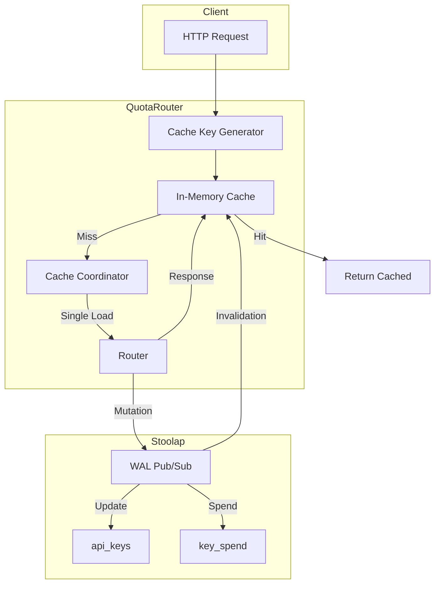

# RFC-0906 (Economics): Response Caching

## Status

Draft (v3) - Comprehensive update based on LiteLLM analysis and existing implementation

## Authors

- Author: @cipherocto

## Summary

Define the response caching system for the quota router to reduce costs, improve latency, and enable offline operation. Based on LiteLLM's caching architecture with Stoolap as the persistence layer.

## Dependencies

**Requires:**

- RFC-0913: Stoolap Pub/Sub for Cache Invalidation (Accepted)
- RFC-0914: Stoolap-Only Quota Router Persistence (Draft)

**Optional:**

- RFC-0900 (Economics): AI Quota Marketplace Protocol
- RFC-0901 (Economics): Quota Router Agent Specification
- RFC-0904: Real-Time Cost Tracking (for cache savings metrics)

## Existing Implementation

### Current State (cache.rs)

The quota-router-core already has a stub implementation at `crates/quota-router-core/src/cache.rs`:

```rust
// Cache module for handling invalidation events from WAL pub/sub
use stoolap::pubsub::{DatabaseEvent, PubSubEventType};

pub struct CacheInvalidation;

impl CacheInvalidation {
    pub fn new() -> Self { Self }

    pub fn handle_event(&self, event: &DatabaseEvent) {
        match event.pub_sub_type() {
            PubSubEventType::KeyInvalidated => {
                tracing::debug!("Key invalidated event received");
                // TODO: Invalidate key cache
            }
            PubSubEventType::BudgetUpdated => {
                tracing::debug!("Budget updated event received");
                // TODO: Refresh budget cache
            }
            PubSubEventType::RateLimitUpdated => {
                tracing::debug!("Rate limit updated event received");
                // TODO: Refresh rate limit cache
            }
            PubSubEventType::SchemaChanged => {
                tracing::debug!("Schema changed event received");
                // TODO: Clear all caches on schema change
            }
            PubSubEventType::CacheCleared => {
                tracing::debug!("Cache cleared event received");
                // TODO: Clear all caches
            }
        }
    }
}
```

This provides the foundation - the pub/sub event types are already defined in stoolap:
- `KeyInvalidated`
- `BudgetUpdated`
- `RateLimitUpdated`
- `SchemaChanged`
- `CacheCleared`

## LiteLLM Analysis

Based on analysis of `/home/mmacedoeu/_w/ai/litellm/`:

### Cache Types Supported by LiteLLM

| Type | Description | Quota Router |
|------|-------------|--------------|
| In-Memory | Local process cache | ✅ Implement (priority) |
| Disk | File-based cache | Future |
| Redis | External cache | ❌ Not needed (per RFC-0914) |
| Redis Semantic | Embedding-based | Future |
| Qdrant Semantic | Vector similarity | Future |
| S3 | AWS S3 bucket | Future |
| GCS | Google Cloud Storage | Future |
| Azure Blob | Azure storage | Future |

### LiteLLM Cache API (Reference)

From `litellm/caching/caching.py`:

```python
class Cache:
    def __init__(
        self,
        type: Optional[LiteLLMCacheType] = LiteLLMCacheType.LOCAL,
        mode: Optional[CacheMode] = CacheMode.default_on,
        host: Optional[str] = None,
        port: Optional[str] = None,
        password: Optional[str] = None,
        namespace: Optional[str] = None,
        ttl: Optional[float] = None,
        default_in_memory_ttl: Optional[float] = None,
        default_in_redis_ttl: Optional[float] = None,
        # ... more params
    )
```

### Base Cache Interface

From `litellm/caching/base_cache.py`:

```python
class BaseCache(ABC):
    def set_cache(self, key, value, **kwargs):
        raise NotImplementedError

    async def async_set_cache(self, key, value, **kwargs):
        raise NotImplementedError

    async def async_set_cache_pipeline(self, cache_list, **kwargs):
        pass

    def get_cache(self, key, **kwargs):
        raise NotImplementedError

    async def async_get_cache(self, key, **kwargs):
        raise NotImplementedError

    async def batch_cache_write(self, key, value, **kwargs):
        raise NotImplementedError

    async def disconnect(self):
        raise NotImplementedError

    async def test_connection(self) -> dict:
        raise NotImplementedError
```

### In-Memory Cache Implementation

From `litellm/caching/in_memory_cache.py`:

```python
class InMemoryCache(BaseCache):
    def __init__(
        self,
        max_size_in_memory: Optional[int] = 200,
        default_ttl: Optional[int] = 600,  # 10 minutes
        max_size_per_item: Optional[int] = 1024,  # 1MB
    ):
        self.max_size_in_memory = max_size_in_memory or 200
        self.default_ttl = default_ttl or 600
        self.max_size_per_item = max_size_per_item or 1024
        self.cache_dict: dict = {}
        self.ttl_dict: dict = {}
        self.expiration_heap: list[tuple[float, str]] = []
```

Key features:
- Max size limit (200 items default)
- TTL with expiration heap for efficient cleanup
- Size limit per item (1MB default)
- Synchronous and async methods

### Cache Stampede Prevention

From `litellm/proxy/common_utils/cache_coordinator.py`:

LiteLLM implements an `EventDrivenCacheCoordinator` to prevent cache stampede:

```python
class EventDrivenCacheCoordinator:
    """
    Coordinates a single in-flight load per logical resource to prevent cache stampede.
    """

    async def get_or_load(
        self,
        cache_key: str,
        cache: AsyncCacheProtocol,
        load_fn: Callable[[], Awaitable[T]],
    ) -> Optional[T]:
        # First request: loads data, caches it, signals waiters
        # Other requests: wait for signal, then read from cache
```

Pattern:
1. First request acquires lock, loads data, caches it, signals waiters
2. Concurrent requests wait for signal, then read from cache
3. Prevents thundering herd on cache miss

### Cache Types Enum

From `litellm/types/caching.py`:

```python
class LiteLLMCacheType(str, Enum):
    LOCAL = "local"
    REDIS = "redis"
    REDIS_SEMANTIC = "redis-semantic"
    S3 = "s3"
    DISK = "disk"
    QDRANT_SEMANTIC = "qdrant-semantic"
    AZURE_BLOB = "azure-blob"
    GCS = "gcs"
```

### Supported Call Types

```python
CachingSupportedCallTypes = Literal[
    "completion",
    "acompletion",
    "embedding",
    "aembedding",
    "atranscription",
    "transcription",
    "atext_completion",
    "text_completion",
    "arerank",
    "rerank",
    "responses",
    "aresponses",
]
```

### Dynamic Cache Control

```python
DynamicCacheControl = TypedDict(
    "DynamicCacheControl",
    {
        "ttl": Optional[int],           # Cache duration in seconds
        "namespace": Optional[str],      # Cache namespace
        "s-maxage": Optional[int],       # Shared max age
        "no-cache": Optional[bool],     # Don't use cache
        "no-store": Optional[bool],      # Don't store in cache
    },
)
```

## Why Needed

Response caching reduces:

- **Costs** - Avoid repeated API calls for same prompts
- **Latency** - Serve cached responses instantly
- **Rate limits** - Reduce API calls to providers
- **Offline operation** - Serve cached responses when provider is down

## Scope

### In Scope (v1)

1. **In-Memory Cache** - Primary cache layer
   - LRU eviction
   - TTL support
   - Size limits

2. **Cache Key Generation**
   - SHA256 hash of normalized request
   - Include: provider, model, messages, params
   - Exclude: non-deterministic fields

3. **TTL Configuration**
   - Default TTL
   - Per-model TTL
   - Per-request TTL override

4. **Cache Invalidation**
   - Manual invalidation (by key, model, all)
   - Automatic via RFC-0913 pub/sub
   - Budget/rate-limit changes trigger invalidation

5. **Cache Statistics**
   - Hit/miss counters
   - Latency metrics

### Out of Scope (v1)

- Distributed cache (future)
- Cache warming (future)
- Semantic caching (future)
- Disk cache (future)

## Design Goals

| Goal | Target | Metric |
|------|--------|--------|
| G1 | <1ms cache hit | Read latency |
| G2 | 50%+ cache hit rate | Cache efficiency |
| G3 | Configurable TTL | Flexibility |
| G4 | Atomic updates | Consistency |
| G5 | Cache stampede prevention | Concurrency safety |

## Architecture



### Cache Flow

1. **Request arrives** → Generate cache key from normalized request
2. **Check cache** → In-memory LRU cache lookup
3. **Cache hit** → Return cached response immediately
4. **Cache miss** → Cache coordinator prevents stampede
5. **Load data** → Route to provider
6. **Response received** → Store in cache with TTL
7. **Mutation occurs** → Publish invalidation event via WAL pub/sub

## Specification

### Cache Configuration

```rust
#[derive(Clone, Debug, Deserialize, Serialize)]
pub struct CacheConfig {
    /// Enable caching (default: true)
    pub enabled: bool,
    /// Default TTL in seconds (default: 600)
    pub default_ttl_secs: u64,
    /// Maximum items in memory (default: 200)
    pub max_size: usize,
    /// Maximum size per item in KB (default: 1024)
    pub max_size_per_item_kb: usize,
    /// TTL by model
    pub ttl_by_model: HashMap<String, u64>,
    /// Cache by parameters
    pub cache_by: Vec<String>,
    /// Don't cache these parameters
    pub no_cache_params: Vec<String>,
}
```

### Cache Entry

```rust
#[derive(Clone, Debug, Serialize, Deserialize)]
pub struct CacheEntry {
    /// Cache key (hash)
    pub key: String,
    /// Original request hash for debugging
    pub request_hash: String,
    /// Provider (e.g., "openai", "anthropic")
    pub provider: String,
    /// Model name
    pub model: String,
    /// Cached response
    pub response: CachedResponse,
    /// Created at timestamp
    pub created_at: i64,
    /// TTL in seconds
    pub ttl_secs: u64,
    /// Hit count
    pub hit_count: u32,
}

#[derive(Clone, Debug, Serialize, Deserialize)]
pub struct CachedResponse {
    /// Response content
    pub content: String,
    /// Usage statistics
    pub usage: Usage,
    /// Finish reason
    pub finish_reason: String,
    /// Model that generated response
    pub model: String,
    /// Additional metadata
    pub metadata: Option<HashMap<String, String>>,
}
```

### Cache Key Generation

```rust
pub fn generate_cache_key(
    provider: &str,
    model: &str,
    messages: &[Message],
    params: &HashMap<String, serde_json::Value>,
) -> String {
    let normalized = NormalizedRequest {
        provider: provider.to_string(),
        model: model.to_string(),
        messages: normalize_messages(messages),
        params: normalize_params(params),
    };

    let serialized = serde_json::to_string(&normalized).unwrap();
    let hash = sha256(serialized.as_bytes());

    format!("cache:{}:{}", provider, hex::encode(&hash[..8]))
}

fn normalize_messages(messages: &[Message]) -> Vec<NormalizedMessage> {
    messages
        .iter()
        .map(|m| NormalizedMessage {
            role: m.role.clone(),
            content: m.content.clone(),
            // Ignore: name, tool_calls, etc.
        })
        .collect()
}

fn normalize_params(params: &HashMap<String, serde_json::Value>) -> HashMap<String, serde_json::Value> {
    // Remove non-deterministic fields
    // Normalize values
}
```

### Cache Coordinator (Stampede Prevention)

```rust
use tokio::sync::Mutex;
use std::collections::HashMap;

pub struct CacheCoordinator {
    in_flight: Arc<Mutex<HashMap<String, Arc<tokio::sync::Semaphore>>>>,
}

impl CacheCoordinator {
    pub async fn get_or_load<F, Fut, T>(
        &self,
        key: String,
        load_fn: F,
    ) -> Result<Option<T>, CacheError>
    where
        F: FnOnce() -> Fut,
        Fut: Future<Output = Result<T, CacheError>>,
    {
        // Check if load is already in progress
        // If yes, wait for it
        // If no, acquire permit, load, cache, signal waiters
    }
}
```

### Cache Invalidation

```rust
pub trait CacheInvalidation {
    /// Invalidate specific cache key
    fn invalidate(&self, key: &str) -> Result<(), CacheError>;

    /// Invalidate all entries for a model
    fn invalidate_model(&self, model: &str) -> Result<(), CacheError>;

    /// Invalidate by API key (budget changed)
    fn invalidate_key(&self, key_id: &str) -> Result<(), CacheError>;

    /// Clear all cache
    fn clear_all(&self) -> Result<(), CacheError>;
}
```

### Stoolap Schema

```sql
-- Cache entries table
CREATE TABLE IF NOT EXISTS cache_entries (
    cache_key TEXT PRIMARY KEY,
    request_hash TEXT NOT NULL,
    provider TEXT NOT NULL,
    model TEXT NOT NULL,
    response TEXT NOT NULL,  -- JSON serialized
    created_at INTEGER NOT NULL,
    ttl_secs INTEGER NOT NULL,
    hit_count INTEGER DEFAULT 0,
    UNIQUE(request_hash, provider, model)
);

CREATE INDEX idx_cache_entries_model ON cache_entries(model);
CREATE INDEX idx_cache_entries_created_at ON cache_entries(created_at);

-- Cache statistics table
CREATE TABLE IF NOT EXISTS cache_stats (
    id TEXT PRIMARY KEY,
    hits INTEGER DEFAULT 0,
    misses INTEGER DEFAULT 0,
    evictions INTEGER DEFAULT 0,
    last_updated INTEGER NOT NULL
);
```

## API Endpoints

```rust
// Cache management
DELETE /api/cache/{cache_key}  // Invalidate specific entry
DELETE /api/cache/model/{model} // Invalidate model cache
DELETE /api/cache/key/{key_id}  // Invalidate by API key
DELETE /api/cache               // Clear all cache
GET   /api/cache/stats         // Get cache statistics
POST  /api/cache/clear          // Clear cache with options
```

## LiteLLM Compatibility

Match LiteLLM's caching parameters:

| LiteLLM Parameter | Quota Router | Notes |
|-------------------|--------------|-------|
| `cache: true` | `cache.enabled: true` | Enable caching |
| `type: "redis"` | `type: "stoolap"` | Use Stoolap |
| `ttl` | `default_ttl_secs` | Default TTL |
| `namespace` | (implicit) | Provider prefix |
| `cache_by` | `cache_by` | Parameters to include |
| `no_cache_params` | `no_cache_params` | Parameters to exclude |
| `max_size_in_memory` | `max_size` | Max items |

## Implementation Phases

### Phase 1: In-Memory Cache (Priority)
- Basic LRU cache with TTL
- Cache key generation
- Per-request TTL override

### Phase 2: Stoolap Persistence
- Cache entries table
- Cache stats table
- Serialization/deserialization

### Phase 3: Pub/Sub Integration
- Connect to RFC-0913 WAL pub/sub
- Handle invalidation events
- Budget/rate-limit change triggers

### Phase 4: Cache Coordinator
- Implement stampede prevention
- Concurrent request handling

### Phase 5: Statistics & Monitoring
- Hit/miss metrics
- Latency tracking
- Cache efficiency reports

## Key Files

| File | Change |
|------|--------|
| `crates/quota-router-core/src/cache.rs` | Expand existing stub |
| `crates/quota-router-core/src/cache/key.rs` | New - key generation |
| `crates/quota-router-core/src/cache/coordinator.rs` | New - stampede prevention |
| `crates/quota-router-core/src/cache/config.rs` | New - cache settings |
| `crates/quota-router-core/src/cache/storage.rs` | New - Stoolap persistence |
| `crates/quota-router-core/src/schema.rs` | Add cache tables |

## Future Work

- F1: Distributed cache (multiple router instances)
- F2: Cache warming (prefetch popular requests)
- F3: Semantic caching (embedding-based)
- F4: Disk cache persistence
- F5: Cache analytics dashboard

## Rationale

Response caching is important for:

1. **Cost reduction** - Avoid duplicate API calls
2. **Latency improvement** - Instant responses on cache hit
3. **Rate limit conservation** - Fewer provider calls
4. **Offline support** - Serve cached when provider down
5. **LiteLLM migration** - Match caching features

---

**Created:** 2026-03-12
**Updated:** 2026-03-15
**Related Use Case:** Enhanced Quota Router Gateway
**Related Research:** LiteLLM Analysis and Quota Router Comparison
