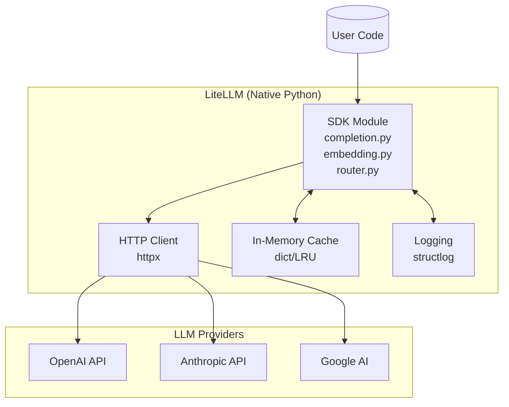
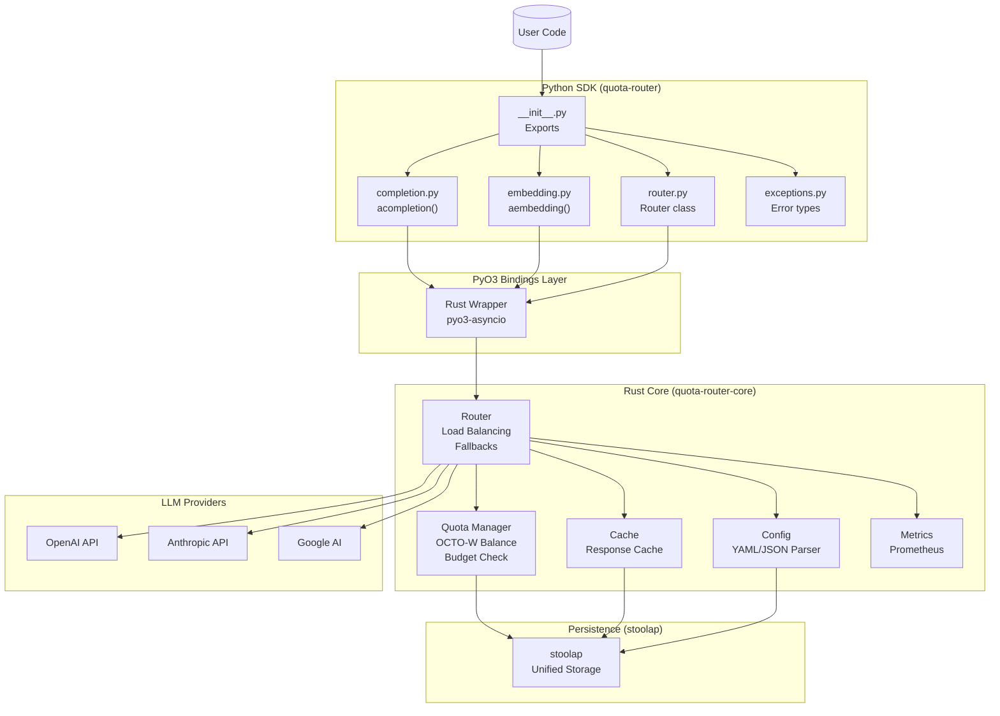
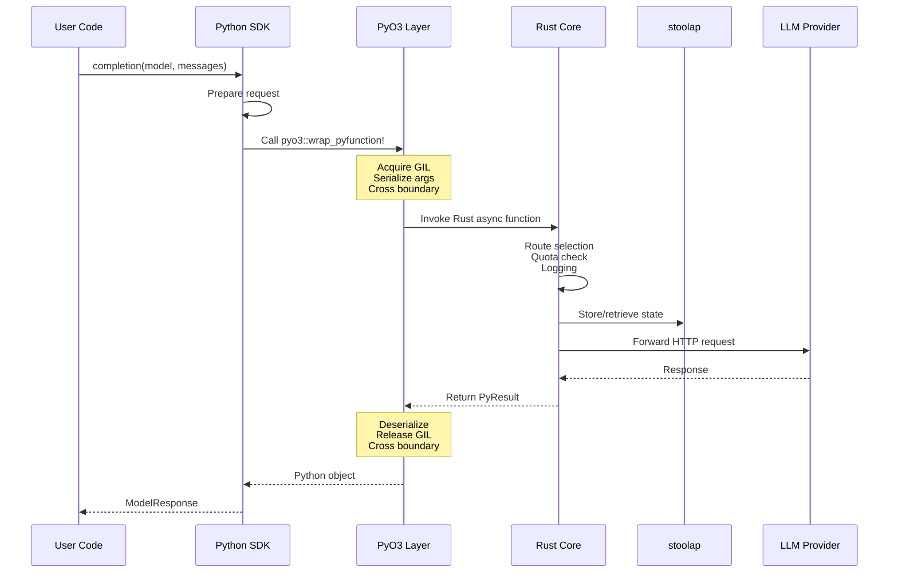

# RFC-0908 (Economics): Python SDK and PyO3 Bindings

## Status

Review

## Authors

- Author: @cipherocto

## Summary

Define the Python SDK bindings (via PyO3) for the Rust quota-router implementation, enabling drop-in replacement for LiteLLM users.

## Dependencies

**Requires:**


**Optional:**

- RFC-0900 (Economics): AI Quota Marketplace Protocol
- RFC-0901 (Economics): Quota Router Agent Specification
- RFC-0902: Multi-Provider Routing and Load Balancing
- RFC-0903: Virtual API Key System
- RFC-0907: Configuration Management
- RFC-0904: Real-Time Cost Tracking
- RFC-0905: Observability and Logging
- RFC-0906: Response Caching

## Why Needed

The quota-router must provide Python bindings to:

- **Enable drop-in replacement** - Users swap `litellm` → `quota_router`
- **Support Python ecosystem** - Dominant language for AI/ML
- **Framework compatibility** - LangChain, LlamaIndex integrations
- **Developer adoption** - Familiar Python API

## Scope

### In Scope

- PyO3 bindings for Rust core
- Python SDK package (pip installable)
- CLI wrapper (Python)
- Error handling parity with LiteLLM

### Out of Scope

- Other language bindings (Go, JS, etc.)
- Framework-specific integrations (future)

## Design Goals

| Goal | Target | Metric |
|------|--------|--------|
| G1 | <10ms function call overhead | Latency |
| G2 | 100% LiteLLM API compatibility | Test coverage |
| G3 | pip installable | PyPI package |
| G4 | Type hints | mypy pass |

## Specification

### Python Package Structure

```python
# quota_router/
# ├── __init__.py          # Main exports
# ├── completion.py        # completion(), acompletion()
# ├── embedding.py         # embedding(), aembedding()
# ├── router.py            # Router class
# ├── exceptions.py        # Exception parity
# └── config.py            # Config handling
```

### Core Exports

```python
# __init__.py
from quota_router.completion import completion, acompletion
from quota_router.embedding import embedding, aembedding
from quota_router.router import Router
from quota_router.exceptions import (
    AuthenticationError,
    RateLimitError,
    BudgetExceededError,
    ProviderError,
)
from quota_router import config, routing

# Version
__version__ = "0.1.0"

# Alias for LiteLLM compatibility
# Users can do: import quota_router as litellm
litellm = sys.modules[__name__]
```

### Function Signatures (LiteLLM Compatible)

```python
# completion() - must match litellm signature
async def acompletion(
    model: str,
    messages: List[Dict[str, str]],
    *,
    # Optional params (same as litellm)
    temperature: Optional[float] = None,
    max_tokens: Optional[int] = None,
    top_p: Optional[float] = None,
    n: Optional[int] = None,
    stream: Optional[bool] = False,
    stop: Optional[Union[str, List[str]]] = None,
    presence_penalty: Optional[float] = None,
    frequency_penalty: Optional[float] = None,
    user: Optional[str] = None,
    # quota-router specific
    api_key: Optional[str] = None,
    **kwargs
) -> ModelResponse:

# Sync version
def completion(
    model: str,
    messages: List[Dict[str, str]],
    **kwargs
) -> ModelResponse:
    return asyncio.run(acompletion(model, messages, **kwargs))
```

### Router Class

```python
class Router:
    def __init__(
        self,
        model_list: List[Dict],
        *,
        # Routing settings
        routing_strategy: str = "least-busy",
        fallbacks: Optional[List[Dict]] = None,

        # Cache settings
        cache: bool = False,
        cache_params: Optional[Dict] = None,

        # Other settings
        set_verbose: bool = False,
        **kwargs
    ):
        ...

    async def acompletion(
        self,
        model: str,
        messages: List[Dict[str, str]],
        **kwargs
    ) -> ModelResponse:
        ...

    def completion(
        self,
        model: str,
        messages: List[Dict[str, str]],
        **kwargs
    ) -> ModelResponse:
        ...
```

### Error Handling (LiteLLM Compatible)

```python
# exceptions.py - match litellm exceptions
class AuthenticationError(Exception): ...
class RateLimitError(Exception): ...
class BudgetExceededError(Exception): ...
class ProviderError(Exception): ...
class TimeoutError(Exception): ...
class InvalidRequestError(Exception): ...
```

### Configuration Compatibility

```python
# Load config (match litellm)
import quota_router as litellm

# Set global settings (match litellm)
litellm.drop_params = True
litellm.set_verbose = False

# Use environment variables (match litellm)
os.environ["OPENAI_API_KEY"] = "sk-..."
```

### CLI Commands (Match LiteLLM)

```bash
# Start proxy (match litellm CLI)
quota-router --config config.yaml
# or
litellm --config config.yaml

# With alias
ln -s /usr/local/bin/quota-router /usr/local/bin/litellm
```

## Architecture

### LiteLLM: Native Python Architecture



### quota-router: Rust + PyO3 Architecture



### Data Flow: Python to Rust via PyO3



### Key Differences

| Aspect | LiteLLM (Python) | quota-router (Rust+PyO3) |
|--------|------------------|-------------------------|
| Core Logic | Pure Python | Rust (performance) |
| Async Runtime | Python asyncio | Rust tokio |
| Cache | Python dict/LRU | Rust+l |
| Quota Check | Python | Rust (fast) |
| Provider Calls | httpx | reqwest (Rust) |
| Persistence | Redis/PostgreSQL | stoolap |

### PyO3 Implementation Notes

### Rust → Python Binding Strategy

```rust
// src/lib.rs - PyO3 module
use pyo3::prelude::*;

#[pyfunction]
async fn acompletion(
    py: Python,
    model: String,
    messages: Vec<PyMessage>,
    // ... params
) -> PyResult<Py<PyAny>> {
    // Call Rust async runtime
    // Return Python object
}

#[pymodule]
fn quota_router(py: Python, m: &PyModule) -> PyResult<()> {
    m.add_function(wrap_pyfunction!(acompletion, m)?)?;
    // ... other functions
    Ok(())
}
```

### Performance Considerations

- Use `pyo3-asyncio` for async Python → async Rust bridging
- Minimize Python ↔ Rust conversions
- Use `GIL` release for long-running operations
- Consider `arrow-py` for data passing

## LiteLLM Compatibility

> **Critical:** Must be 100% compatible with LiteLLM's Python API.

Users should be able to:
```python
# Replace litellm with quota_router
- import litellm
+ import quota_router as litellm

# Or use directly
+ import quota_router as qr

# Both should work identically
response = litellm.completion(model="gpt-4", messages=[...])
```

## Package Distribution

```toml
# pyproject.toml
[project]
name = "quota-router"
version = "0.1.0"
description = "AI Gateway with OCTO-W integration"
requires-python = ">=3.9"

dependencies = [
    "httpx>=0.24.0",
    "pydantic>=2.0",
]

[project.optional-dependencies]
dev = [
    "pytest",
    "mypy",
]
```

## Key Files to Modify

### New Crates

| Crate | Description |
|-------|-------------|
| `crates/quota-router-core/` | Core library (moved from CLI + proxy) |
| `crates/quota-router-pyo3/` | PyO3 Python bindings |

### quota-router-core (`crates/quota-router-core/`)

| File | Change |
|------|--------|
| `src/lib.rs` | Re-export core modules |
| `src/balance.rs` | Moved from CLI |
| `src/providers.rs` | Moved from CLI |
| `src/config.rs` | Moved from CLI |
| `src/proxy.rs` | Moved from CLI - OpenAI-compatible proxy |

### quota-router-pyo3 (`crates/quota-router-pyo3/`)

| File | Change |
|------|--------|
| `Cargo.toml` | New - PyO3 bindings |
| `src/lib.rs` | New - Python module |
| `src/exceptions.rs` | New - LiteLLM-compatible exceptions |
| `src/completion.rs` | New - completion binding |

### Updated CLI (`crates/quota-router-cli/`)

| File | Change |
|------|--------|
| `Cargo.toml` | Depend on quota-router-core |
| `src/lib.rs` | Re-export from core |
| Remove `src/balance.rs` | Moved to core |
| Remove `src/providers.rs` | Moved to core |
| Remove `src/config.rs` | Moved to core |
| Remove `src/proxy.rs` | Moved to core |

### Python SDK (`python/quota_router/`)

| File | Change |
|------|--------|
| `__init__.py` | New - Package init |
| `completion.py` | New - SDK functions |
| `router.py` | New - Router class |

## Future Work

- F1: Type stubs (.pyi) for IDE support
- F2: LangChain integration
- F3: LlamaIndex integration
- F4: Auto-migration script (litellm → quota_router)

## Rationale

Python SDK is critical for:

1. **Drop-in replacement** - Core requirement for LiteLLM migration
2. **Ecosystem adoption** - Python dominates AI/ML
3. **Framework integration** - LangChain, LlamaIndex use LiteLLM
4. **Developer experience** - Familiar API, minimal learning curve

---

**Planned Date:** 2026-03-12
**Related Use Case:** Enhanced Quota Router Gateway
**Related Research:** LiteLLM Analysis and Quota Router Comparison
