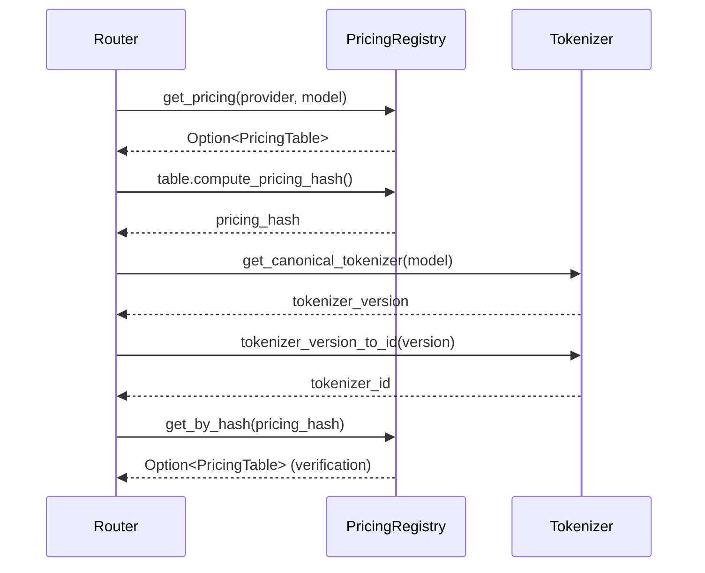

# RFC-0910 (Economics): Pricing Table Registry

## Status

Draft (v14 — aligns with RFC-0903 Final v29 + RFC-0903-B1 v23 + RFC-0903-C1 v3)

## Authors

- Author: @cipherocto

## Maintainers

- Maintainer: @cipherocto

## Summary

Define a **versioned pricing table registry** that enables deterministic cost calculation across multiple router instances. Each pricing table is identified by a content-addressed hash, ensuring all routers use identical pricing definitions for reproducible billing and audit.

This RFC provides the tokenizer registry referenced by RFC-0909's `get_canonical_tokenizer()` function, resolving the MUST-implementation requirement for canonical tokenizer assignment.

## Dependencies

**Requires:**

- RFC-0903: Virtual API Key System (Final v29 + RFC-0903-B1 amendment v23 + RFC-0903-C1 amendment v3)
- RFC-0126: Deterministic Serialization (Accepted v2.5.1)

**Required By:**

- RFC-0909: Deterministic Quota Accounting (depends on canonical tokenizer assignments for Priority 2 fallback — see RFC-0909 §Canonical Token Accounting)

## Design Goals

| Goal | Target | Metric |
|------|--------|--------|
| G1 | Immutable pricing tables | No UPDATE/DELETE on registered tables |
| G2 | Deterministic hash computation | Identical pricing_hash across all router implementations |
| G3 | Canonical tokenizer assignments | Consistent token_source across all routers for same model |
| G4 | Integer-only arithmetic | No floating point in cost calculation |
| G5 | Cross-router determinism | Same tokens + same pricing = same cost everywhere |

## Motivation

### The Provider Price Drift Problem

In a distributed router network, pricing inconsistency causes:

- Different routers calculate different costs for the same request
- Billing disputes with users
- Non-deterministic accounting (violates RFC-0909)

Example:

```
Router A: gpt-4 input = $0.01
Router B: gpt-4 input = $0.0101
```

Providers change prices frequently:

```
Jan 01: gpt-4 input = $0.01 per 1K tokens
Feb 01: gpt-4 input = $0.008 per 1K tokens
```

A request on Jan 15 with 2000 tokens:

- Correct cost on Jan 15: 2000 × $0.01 = $0.02
- Recomputed with new prices: 2000 × $0.008 = $0.016

This breaks **deterministic accounting** — the same request produces different costs.

### Tokenizer Drift Problem

RFC-0909's deterministic accounting requires identical token counts across routers:

- Different routers may use different tokenizer versions
- Token counts for the same text vary across tokenizers
- Cost calculations diverge → deterministic accounting fails

### Solution: Immutable Versioned Pricing + Canonical Tokenizer Registry

Each pricing table is **immutable once registered**:

```
PricingTable {
    table_id: "openai-gpt4-v3"
    version: 3
    input_price_per_1k: 10000  (=$0.01 in micro-units)
    effective_from: 1704067200  (2024-01-01)
}
```

When a request is processed, the router selects the **exact table version** at that time. Cost is permanently tied to that pricing version via `pricing_hash`.

> **Note on `effective_from`:** This field is a registration-time **immutability constraint** — a new version with `effective_from` earlier than the current latest would retroactively change historical pricing. It is NOT a time-based query parameter. Runtime pricing selection uses `pricing_hash` as the anchor (see §Determinism Requirements). Historical spend events reference their `pricing_hash` and are verified via `get_by_hash()`, not via `effective_from`.

The canonical tokenizer registry assigns specific tokenizer versions to model families, ensuring identical token counts across routers.

## Specification

### PricingTable Structure

```rust
use serde::{Deserialize, Serialize};
use sha2::{Digest, Sha256};
use std::collections::BTreeMap;

/// Pricing table for a specific provider/model combination.
/// Uses BTreeMap for deterministic field ordering (RFC-0126 compliance).
#[derive(Debug, Clone, Serialize, Deserialize)]
pub struct PricingTable {
    /// Unique identifier for this table (e.g., "openai-gpt4-v3")
    /// Maximum 128 bytes. Registration MUST reject table_id longer than 128 bytes.
    pub table_id: String,
    /// Version number (increments per provider/model)
    pub version: u32,
    /// Provider name (e.g., "openai")
    pub provider: String,
    /// Model name (e.g., "gpt-4")
    pub model: String,
    /// Price per 1K prompt tokens (in deterministic micro-units)
    pub prompt_cost_per_1k: u64,
    /// Price per 1K completion tokens (in deterministic micro-units)
    pub completion_cost_per_1k: u64,
    /// Timestamp when this pricing becomes effective (Unix epoch).
    /// Used for immutability enforcement: a registered table with effective_from=T cannot be
    /// replaced by a table with effective_from≤T (would create a retroactive price change).
    /// NOT used for time-based query (see Note below).
    pub effective_from: i64,
    /// Additional metadata (reserved for future use)
    pub metadata: BTreeMap<String, String>,
}

impl PricingTable {
    /// Compute deterministic SHA256 hash of the pricing table.
    ///
    /// BTreeMap determinism scope: The `metadata: BTreeMap` field guarantees sorted iteration
    /// for that field's key-value pairs. The struct's other fields (`table_id`, `version`,
    /// `provider`, `model`, `prompt_cost_per_1k`, `completion_cost_per_1k`, `effective_from`)
    /// are serialized in **declaration order** by serde_json — this order is NOT specified by Rust
    /// and may vary across compiler versions. A canonical JSON serializer (RFC 8785) MUST be used
    /// to ensure identical output across implementations. The test vector below is computed
    /// with an RFC 8785-compliant implementation and MUST be matched exactly.
    ///
    /// ⚠️  You MUST use an RFC 8785-compliant canonical JSON serializer.
    /// serde_json is NOT RFC 8785-compliant — field ordering is compiler-dependent.
    /// Using serde_json will produce incorrect pricing_hash values.
    /// Example with a compliant serializer (pseudocode):
    ///
    /// ```ignore
    /// let serialized = canonical_json::to_string(&self)
    ///     .expect("canonical JSON serialization must succeed");
    /// let mut hasher = Sha256::new();
    /// hasher.update(serialized.as_bytes());
    /// hasher.finalize().into()
    /// ```
    pub fn compute_pricing_hash(&self) -> [u8; 32] {
        // ⚠️  REPLACE THIS WITH AN RFC 8785-COMPLIANT SERIALIZER.
        // The test vector was computed with a compliant implementation.
        // ⚠️  PSEUDOCODE — serde_json below is NOT RFC 8785-compliant; replace before use.
        let serialized = serde_json::to_string(&self)
            .expect("PricingTable serialization must succeed");
        let mut hasher = Sha256::new();
        hasher.update(serialized.as_bytes());
        hasher.finalize().into()
    }
}
```

### PricingTable Registry

```rust
use std::collections::{BTreeMap, HashMap};
use std::sync::Arc;

/// Registry operation errors.
#[derive(Debug, Clone, PartialEq)]
pub enum RegistryError {
    /// Tried to register a (provider, model, version) that already exists.
    DuplicateVersion { provider: String, model: String, version: u32 },
    /// Tried to register a version lower than the current latest.
    VersionNotIncrement { provider: String, model: String, existing_version: u32, attempted_version: u32 },
    /// Tried to register an effective_from that is not strictly greater than the current latest.
    /// Prevents retroactive pricing changes.
    EffectiveFromNotIncrement { provider: String, model: String, existing_effective_from: i64, attempted_effective_from: i64 },
    /// table_id exceeds maximum allowed length (128 bytes).
    TableIdTooLong { table_id: String, length: usize },
}

/// Maximum allowed length for table_id (128 bytes).
/// Enforced at registration time.
const MAX_TABLE_ID_LEN: usize = 128;

/// Global pricing registry using BTreeMap for deterministic iteration.
/// Maps (provider, model) → Vec<PricingTable> (all versions, sorted desc by version).
/// Secondary index: pricing_hash → Arc<PricingTable> for O(1) historical lookup.
/// Both indices are populated at registration time; superseded versions are
/// retained so get_by_hash() can resolve any historical pricing_hash.
pub struct PricingRegistry {
    /// (provider, model) → Vec<PricingTable> (all versions, sorted desc by version)
    tables: BTreeMap<(String, String), Vec<PricingTable>>,
    /// pricing_hash → Arc<PricingTable> for O(1) historical verification
    by_hash: HashMap<[u8; 32], Arc<PricingTable>>,
}

impl Default for PricingRegistry {
    fn default() -> Self {
        Self {
            tables: BTreeMap::new(),
            by_hash: HashMap::new(),
        }
    }
}

impl PricingRegistry {
    /// Register a new pricing table (immutable after registration).
    /// Returns the computed pricing_hash for use in spend events.
    ///
    /// # Errors
    /// Returns `RegistryError::DuplicateVersion` if a table with identical
    /// (provider, model, version) is already registered.
    /// Returns `RegistryError::VersionNotIncrement` if the attempted version
    /// is not strictly greater than the current latest version.
    /// Returns `RegistryError::EffectiveFromNotIncrement` if the attempted
    /// effective_from is not strictly greater than the current latest effective_from.
    pub fn register(&mut self, table: PricingTable) -> Result<[u8; 32], RegistryError> {
        // Validate table_id length before processing
        if table.table_id.len() > MAX_TABLE_ID_LEN {
            return Err(RegistryError::TableIdTooLong {
                table_id: table.table_id,
                length: table.table_id.len(),
            });
        }

        let key = (table.provider.clone(), table.model.clone());
        let hash = table.compute_pricing_hash();

        let entries = self.tables.entry(key).or_insert_with(Vec::new);

        // Check version/effective_from constraints against the latest (first in vec, since sorted desc by version)
        if let Some(latest) = entries.first() {
            if latest.version == table.version {
                return Err(RegistryError::DuplicateVersion {
                    provider: table.provider.clone(),
                    model: table.model.clone(),
                    version: table.version,
                });
            }
            if table.version < latest.version {
                return Err(RegistryError::VersionNotIncrement {
                    provider: table.provider.clone(),
                    model: table.model.clone(),
                    existing_version: latest.version,
                    attempted_version: table.version,
                });
            }
            // effective_from must be strictly greater than the current latest — prevents retroactive pricing
            // Note: effective_from is a wall-clock timestamp, not a version counter.
            // Two registrations within the same second are valid (sequential within that second).
            // The < not <= constraint allows same-second registrations while preventing
            // a new version claiming an earlier effective timestamp than the current latest.
            if table.effective_from < latest.effective_from {
                return Err(RegistryError::EffectiveFromNotIncrement {
                    provider: table.provider.clone(),
                    model: table.model.clone(),
                    existing_effective_from: latest.effective_from,
                    attempted_effective_from: table.effective_from,
                });
            }
            // table.version > latest.version AND table.effective_from > latest.effective_from:
            // index ALL superseded entries by their hashes for historical get_by_hash() lookup
            for superseded in entries.iter() {
                let h = superseded.compute_pricing_hash();
                self.by_hash.insert(h, Arc::new(superseded.clone()));
            }
        }

        entries.push(table);
        // Keep entries sorted desc by version (newest first)
        entries.sort_by(|a, b| b.version.cmp(&a.version));

        // Index new entry by hash
        self.by_hash.insert(hash, Arc::new(entries[0].clone()));

        Ok(hash)
    }

    /// Get the active (latest version) pricing for a provider/model.
    /// Returns the newest registered version, or None if no table exists.
    pub fn get_pricing(&self, provider: &str, model: &str) -> Option<&PricingTable> {
        self.tables
            .get(&(provider.to_string(), model.to_string()))
            .and_then(|v| v.first())
    }

    /// Get pricing by exact pricing_hash for verification.
    /// O(1) lookup — can resolve any historical pricing_hash, including superseded versions.
    pub fn get_by_hash(&self, hash: &[u8; 32]) -> Option<&PricingTable> {
        self.by_hash.get(hash).map(|arc| &**arc)
    }

    /// Returns all registered versions for a (provider, model) pair, newest first.
    pub fn get_versions(&self, provider: &str, model: &str) -> Vec<&PricingTable> {
        self.tables
            .get(&(provider.to_string(), model.to_string()))
            .map(|v| v.iter().collect())
            .unwrap_or_default()
    }

    /// Get a specific version for a (provider, model) pair.
    pub fn get_version(&self, provider: &str, model: &str, version: u32) -> Option<&PricingTable> {
        self.tables
            .get(&(provider.to_string(), model.to_string()))
            .and_then(|v| v.iter().find(|t| t.version == version))
    }

    /// List all registered (provider, model) pairs (from latest version only).
    pub fn list_models(&self) -> impl Iterator<Item = (&str, &str)> {
        self.tables.keys().map(|(p, m)| (p.as_str(), m.as_str()))
    }
}
```

> **Note on naming collision:** RFC-0910 defines `PricingTable` as a single-row struct (one row per provider/model/version in the registry). RFC-0909 §Deterministic Pricing Tables also defines a `PricingTable` struct, which wraps a `BTreeMap<String, PricingModel>` — a fundamentally different type. Both names are used independently within each RFC's scope. Implementers integrating both RFCs must not conflate these two structs; they serve different purposes (registry vs. internal pricing table).

### Cost Calculation with Pricing Hash

```rust
/// Compute cost deterministically using integer arithmetic.
/// This is a standalone function (not a method on PricingTable).
///
/// # Parameters
/// - `pricing`: the PricingTable for the model being charged (this RFC's struct, not RFC-0909's PricingModel)
/// - `input_tokens`: number of prompt tokens consumed
/// - `output_tokens`: number of completion tokens generated
///
/// # Returns
/// Total cost in micro-units (u64). Uses integer division with truncation.
/// Cost is computed as: `(input_tokens * prompt_cost_per_1k / 1000) + (output_tokens * completion_cost_per_1k / 1000)`
///
/// # Truncation Note
/// Integer division truncates toward zero. For micro-unit pricing, truncation
/// error is bounded at <2 micro-units per event (<1 per division step).
/// N accounts for two independent truncation operations per event (prompt_cost
/// and completion_cost divisions). For each division, truncation error is bounded
/// by the remainder of (tokens * rate) modulo 1000, which is always <1 micro-unit.
/// With two divisions per event, the per-event bound is <2 micro-units total.
/// This is the same truncation bound documented in RFC-0909 §Economic Invariants (Invariant #3).
pub fn compute_cost(
    pricing: &PricingTable,
    input_tokens: u32,
    output_tokens: u32,
) -> u64 {
    let prompt_cost = (input_tokens as u64 * pricing.prompt_cost_per_1k) / 1000;
    let completion_cost = (output_tokens as u64 * pricing.completion_cost_per_1k) / 1000;
    // Note: saturating_add caps at u64::MAX (~18M dollars per event) — overflow is not a
    // realistic concern for token counts; the truncation bound (<2 micro-units per event) is
    // the operative precision limit.
    prompt_cost.saturating_add(completion_cost)
}
```

### SpendReceipt Structure

```rust
use serde::{Deserialize, Serialize};
use crate::tokenizer::TokenSource;  // Imported from RFC-0909 crate

/// Spend receipt for audit and verification.
/// Links a spend event to the specific pricing table version used.
///
/// **Encoding note:** `request_id` in `SpendReceipt` stores the **original gateway text**
/// (not the hex-encoded SHA256 stored in `SpendEvent.request_id`). This is necessary
/// because external auditors need the original request_id text to independently verify
/// the event_id. The hex-encoded SHA256 form cannot be reversed to recover the original.
#[derive(Debug, Clone, Serialize, Deserialize)]
pub struct SpendReceipt {
    /// Unique receipt identifier — locally generated (UUID v4), not cross-router reproducible.
    /// Not part of the deterministic event record. Used for receipt issuance and lookup only.
    pub receipt_id: uuid::Uuid,
    /// Deterministic event identifier — links receipt to the canonical SpendEvent.
    /// Matches SpendEvent.event_id (hex String).
    pub event_id: String,
    /// API key that made the request
    pub key_id: uuid::Uuid,
    /// Provider request identifier — original gateway text (NOT hex-encoded SHA256)
    pub request_id: String,
    /// Provider name
    pub provider: String,
    /// Model name
    pub model: String,
    /// Prompt tokens consumed
    pub input_tokens: u32,
    /// Completion tokens generated
    pub output_tokens: u32,
    /// Pricing table hash (ties cost to specific pricing version)
    pub pricing_hash: [u8; 32],
    /// Total cost in micro-units
    pub total_cost: u64,
    /// Event timestamp (Unix epoch)
    pub timestamp: i64,
    /// Token source used for this request (per RFC-0909 TokenSource enum)
    pub token_source: TokenSource,
}
```

## Canonical Tokenizer Registry

### Overview

RFC-0909's deterministic accounting requires identical token counts across all router instances. When provider-reported tokens are unavailable, routers must use a **canonical tokenizer** to compute token counts.

The canonical tokenizer registry assigns specific tokenizer versions to model families.

### Tokenizer Assignment Table

| Model Family | Canonical Tokenizer Version | Encoding | Notes |
|-------------|---------------------------|----------|-------|
| `gpt-4*`, `gpt-3.5*` | `tiktoken-cl100k_base-v1.2.3` | cl100k_base | OpenAI models |
| `o1`, `o3` | `tiktoken-o200k_base` | o200k_base | OpenAI o-series |
| `o1-mini`, `o1-preview` | *(see notes)* | — | Verify with provider |
| `claude-*` | `tiktoken-cl100k_base-v1.2.3` | cl100k_base | Anthropic models |
| `gemini-*` | *(see notes)* | — | May use SentencePiece; requires verification |
| All other models | `tiktoken-cl100k_base-v1.2.3` | cl100k_base | Default fallback |

> **Note:** `gemini-*` models may use SentencePiece encoding rather than BPE. The assignment above is uncertain. Routers SHOULD verify tokenizer compatibility before production use. Unknown model families fall through to the default fallback.

### Tokenizer Identifier Derivation

Tokenizer versions are converted to 16-byte identifiers via BLAKE3 (per RFC-0909 §tokenizer_id).
The reverse conversion (tokenizer_id → version string) is defined in RFC-0909 §tokenizer_id_to_version —
RFC-0910 defines only the forward direction (version → ID).

```rust
/// Convert tokenizer version string to tokenizer_id for BLOB(16) storage.
/// Uses BLAKE3 truncated to 16 bytes (per RFC-0909 §tokenizer_id).
///
/// # Truncation Note
/// BLAKE3 produces 32 bytes; this function truncates to the first 16 bytes.
/// Collision probability becomes non-negligible after ~2^32 versions — acceptable
/// for tokenizer versioning.
///
/// # Test Vector
/// `tokenizer_version_to_id("tiktoken-cl100k_base-v1.2.3")` → `e3c8e8ff724411c6416dd4fb135368e3` (16 bytes hex)
/// Full BLAKE3: `e3c8e8ff724411c6416dd4fb135368e36b5fdcec3ecc2cd13920767ed230b103`
pub fn tokenizer_version_to_id(version: &str) -> [u8; 16] {
    use blake3::Hasher;
    let mut hasher = Hasher::new();
    hasher.update(version.as_bytes());
    let hash: blake3::Hash = hasher.finalize();
    let bytes: [u8; 32] = hash.into();
    bytes[..16].try_into().expect("BLAKE3 output always yields at least 16 bytes")
}
```

### Tokenizer Lookup Function

```rust
/// Get canonical tokenizer version for a model family.
/// Returns a static string literal — no heap allocation.
///
/// # Determinism Requirement
/// This function's output MUST be bit-for-bit identical across all router
/// implementations. If two routers return different tokenizer versions for the
/// same model, event_id determinism breaks (different token_source values
/// produce different event_id hashes for identical requests).
///
/// # Uncertain Assignments
/// ⚠️  The following model families have UNCERTAIN tokenizer assignments.
/// Routers MUST verify before production use; these may change in future versions:
/// - `gemini-*` — may use SentencePiece encoding, not cl100k_base
/// - `o1-mini`, `o1-preview` — different vocab from o200k_base; verify with provider
///
/// # Implementation Notes
/// - This function is the single source of truth for canonical tokenizer assignment
/// - Routers MUST NOT use local estimation or provider-reported tokenizer names
/// - The prefix-match dispatch is O(1) per call
/// - Unknown model families fall through to the default fallback
pub fn get_canonical_tokenizer(model: &str) -> &'static str {
    const DEFAULT_TOKENIZER: &str = "tiktoken-cl100k_base-v1.2.3";

    // Note: This function is case-sensitive. Model names must be lowercase
    // (e.g., "gpt-4", not "GPT-4"). Callers MUST normalize model names
    // to lowercase before calling this function. Provider APIs may return
    // model names in mixed case — the router is responsible for normalization.
    match model.chars().next() {
        'g' => {
            // ⚠ 'g' prefix matches BOTH gpt-* (GPT) and gemini-* (uncertain).
            // This arm uses cl100k_base as an approximation for GPT models.
            // gemini-* may use SentencePiece (not cl100k_base) — assignment is UNCERTAIN.
            // For gemini-* production use, verify tokenizer compatibility before deployment.
            // See Tokenizer Assignment Table §gemini-* note.
            "tiktoken-cl100k_base-v1.2.3"  // version aligned with Tokenizer Assignment Table
        },
        'o' => {
            // o1, o3 — OpenAI o-series with o200k_base vocab (per Tokenizer Assignment Table above)
            // o1-mini, o1-preview — DIFFERENT vocab from o200k_base; assignment UNCERTAIN.
            // See Tokenizer Assignment Table §o1-mini/o1-preview note.
            // ⚠️ NOTE: 'o' prefix is a coarse approximation — any model starting with 'o'
            // matches this arm. Only o1 and o3 are verified for o200k_base per the Tokenizer
            // Assignment Table. Future OpenAI 'o' models with different vocabs will incorrectly
            // use o200k_base until this dispatch is replaced with exact model matching.
            "tiktoken-o200k_base"
        },
        'c' => {
            // claude-* family — uses cl100k_base (Anthropic BPE)
            "tiktoken-cl100k_base-v1.2.3"
        },
        _ => DEFAULT_TOKENIZER, // Unknown: fall through to default
    }
}
```

### Tokenizer Database Schema

```sql
-- Tokenizers table for canonical tokenizer version lookup
-- Per RFC-0909 §tokenizer_id: tokenizer_id is BLAKE3(version_string) truncated to 16 bytes
CREATE TABLE tokenizers (
    tokenizer_id BLOB(16) NOT NULL,         -- Raw BLAKE3 hash (16 bytes) — per RFC-0903-B1
    version TEXT NOT NULL,                   -- Human-readable version (e.g., "tiktoken-cl100k_base-v1.2.3")
    vocab_size INTEGER,                      -- Vocabulary size (informational only)
    encoding_type TEXT,                      -- Encoding type (informational only, e.g., "bpe", "sentencepiece")
                                             -- NOTE: not used by get_canonical_tokenizer() — the version string
                                             -- is the authoritative identifier; encoding_type is for audit only
    provider TEXT,                           -- Provider name (e.g., "openai", "anthropic")
    PRIMARY KEY (tokenizer_id),
    UNIQUE(version, provider)               -- same version string from different providers is the same tokenizer
);

-- Canonical tokenizer assignment table
-- Maps model patterns to tokenizer versions
CREATE TABLE tokenizer_assignments (
    assignment_id BLOB(16) NOT NULL,
    model_pattern TEXT NOT NULL,             -- e.g., "gpt-4", "o1-preview" (exact match, not glob)
    tokenizer_id BLOB(16) NOT NULL,        -- FK to tokenizers(tokenizer_id)
    effective_from INTEGER NOT NULL,        -- Unix epoch
    PRIMARY KEY (assignment_id),
    UNIQUE(model_pattern)                   -- prevent ambiguous multi-row matches
);

-- Note: Phase 1 uses first-character prefix dispatch (see get_canonical_tokenizer).
-- Phase 2 DB-backed lookup uses exact match on model_pattern.
-- Wildcard/glob patterns are NOT supported in Phase 1 or Phase 2.
-- The model_pattern column documents the canonical tokenizer for each exact model name.
-- UNIQUE(model_pattern) provides the index for pattern lookups; no separate index needed.
```

> **Phase 1 vs Phase 2 note:** The `tokenizer_assignments` table above defines the schema for DB-backed
> lookups. Phase 1 (`get_canonical_tokenizer` in §Tokenizer Lookup Function) uses in-memory first-character
> prefix dispatch only — it does NOT query this table. Phase 2 populates the table with rows corresponding
> to the Tokenizer Assignment Table and replaces the in-memory dispatch with a DB-backed lookup. See
> Implementation Phases §Phase 2.

## Determinism Requirements

### Pricing Hash Determinism

1. **Canonical JSON serialization**: All routers MUST use RFC 8785-compliant canonical JSON. `serde_json` field ordering is NOT guaranteed.
2. **Identical field values**: Given the same `PricingTable` struct, all routers MUST produce the same `pricing_hash`.
3. **Version pinning**: Pricing tables are immutable after registration. Cost recomputation from historical events uses the registered pricing_hash, not live pricing.

### Tokenizer Determinism

1. **Canonical assignments**: All routers MUST use the same tokenizer version for the same model family.
2. **Identical token counts**: When provider-reported tokens are unavailable, routers compute token counts using the canonical tokenizer — producing identical counts across all router instances.
3. **Cross-router event_id**: Since `event_id` includes `token_source`, identical token counts ensure identical `event_id` values across routers.

## Error Handling

| Error | Response | Recovery |
|-------|----------|----------|
| Unknown model | Return default tokenizer (cl100k_base) | Silent fallthrough; no warning logged |
| Known model with uncertain assignment (gemini-*, o1-mini, o1-preview) | Return assigned tokenizer (cl100k_base or o200k_base) | Silent; no runtime warning logged — uncertainty is an implementation-time concern (see §Tokenizer Lookup Function Uncertain Assignments) |
| Pricing table not found | Return `None` / `KeyError::NotFound` | Caller must handle; do not fall back |
| Serialization failure | Panic | Fatal; indicates implementation bug |

## Performance Targets

| Metric | Target | Notes |
|--------|--------|-------|
| Pricing lookup | <1µs | In-memory BTreeMap |
| Hash computation | <10µs | SHA256 of canonical JSON |
| Tokenizer lookup | <1µs | O(1) prefix dispatch |
| Cost calculation | <1µs | Integer arithmetic only |

## Approval Criteria

This RFC can be accepted when:

- [x] PricingRegistry::register() enforces immutability constraints (DuplicateVersion, VersionNotIncrement, EffectiveFromNotIncrement)
- [x] get_pricing() returns latest version for (provider, model)
- [x] get_by_hash() resolves any historical pricing_hash in O(1)
- [x] get_versions() returns all versions for (provider, model), newest first
- [x] get_version() returns a specific version for (provider, model)
- [x] compute_pricing_hash() produces deterministic SHA256 (RFC 8785-compliant canonical JSON)
- [x] compute_cost() uses integer-only arithmetic (no floating point)
- [x] get_canonical_tokenizer() is deterministic across all router implementations
- [x] tokenizer_version_to_id() produces consistent BLAKE3-16 output (test vectors pass)
- [x] BLAKE3-16 test vectors: "tiktoken-cl100k_base-v1.2.3" → "e3c8e8ff724411c6416dd4fb135368e3", "tiktoken-o200k_base" → "be1b3be0a2698c863b31edc1b7809a9c"
- [x] Pricing hash test vector: compute_pricing_hash() on test table → a127db97a3695861f7a34ab2abe821ed0b8d7ec47e3dc579d7a5ca8cfb7a0641
- [x] Tokenizer assignment test vectors: all rows in Tokenizer Assignment End-to-End table produce correct tokenizer_id and token_source
- [ ] Phase 1 implemented (PricingTable + PricingRegistry + compute_cost + tokenizer functions + test vectors)
- [ ] Phase 2 (DB-backed registry with tokenizer_assignments table) — blocked until RFC-0903-B1 and RFC-0903-C1 are Accepted; requires both amendments' BLOB(16) types
- [ ] Phase 3 (routing integration with RFC-0909) implemented

## Security Considerations

### Consensus Attacks

| Threat | Impact | Mitigation |
|--------|--------|------------|
| Pricing hash collision | Different costs appear identical | SHA256 provides 2^256 collision resistance |
| Tokenizer version swap | Token counts diverge, breaking determinism | Immutable registry; version verification |

### Economic Exploits

| Threat | Impact | Mitigation |
|--------|--------|------------|
| Register lower-priced table | Undercharge for usage | Registry is append-only; pricing immutable after registration |
| Duplicate table registration | Ambiguous pricing_hash | (provider, model, version) is unique constraint |
| Replay with stale pricing | Historical cost recomputation | pricing_hash ties each event to its pricing version |

### Replay Attacks

- `request_id` (from RFC-0909) provides idempotency — duplicate requests cannot double-charge
- `pricing_hash` in each spend event ties cost to the specific pricing version used

### Determinism Violations

| Violation | Detection | Mitigation |
|-----------|-----------|------------|
| Different pricing_hash across routers | Verify against registered registry | Use canonical JSON serializer |
| Different token counts | event_id mismatch on replay | Use canonical tokenizer assignment |
| Floating point in cost calc | Test vectors fail | Integer-only arithmetic enforced |

## Adversarial Review

### Failure Mode Analysis

| Mode | Cause | Detection | Impact |
|------|-------|-----------|--------|
| Cross-router cost divergence | Non-canonical JSON serializer | Test vectors | Billing disputes |
| Token count mismatch | Wrong tokenizer version | event_id replay | Incorrect billing |
| Price drift | Live pricing used instead of registered | pricing_hash verification | Non-deterministic replay |
| Double-charge | request_id collision | UNIQUE constraint | User overcharged |

### Mitigation Effectiveness

- **Canonical JSON**: Eliminates serializer-level non-determinism
- **Immutable registry**: Prevents retroactive pricing changes
- **pricing_hash verification**: Enables independent cost verification
- **Canonical tokenizer**: Ensures identical token counts across routers

## Test Vectors

### Pricing Hash Test Vector

| Field | Value |
|-------|-------|
| table_id | `"openai-gpt4-v1"` |
| version | `1` |
| provider | `"openai"` |
| model | `"gpt-4"` |
| prompt_cost_per_1k | `30_000` (=$0.03) |
| completion_cost_per_1k | `60_000` (=$0.06) |
| effective_from | `1704067200` (2024-01-01) |
| metadata | `{}` |

Expected `compute_pricing_hash()` output: `a127db97a3695861f7a34ab2abe821ed0b8d7ec47e3dc579d7a5ca8cfb7a0641`

> **Canonical JSON input:** `{"table_id":"openai-gpt4-v1","version":1,"provider":"openai","model":"gpt-4","prompt_cost_per_1k":30000,"completion_cost_per_1k":60000,"effective_from":1704067200,"metadata":{}}` (RFC 8785 canonical form — definition-order fields, compact separators, minimal number representation)

### Cost Calculation Test Vector

| Input | Value |
|-------|-------|
| prompt_cost_per_1k | `30_000` |
| completion_cost_per_1k | `60_000` |
| input_tokens | `100` |
| output_tokens | `50` |

Expected `compute_cost()` output: `3000 + 3000 = 6000` micro-units

### Tokenizer ID Test Vector

| Input | Expected Output |
|-------|---------------|
| `"tiktoken-cl100k_base-v1.2.3"` | `e3c8e8ff724411c6416dd4fb135368e3` (16 bytes hex) |
| `"tiktoken-o200k_base"` | `be1b3be0a2698c863b31edc1b7809a9c` (16 bytes hex) |

### Tokenizer Assignment End-to-End Test Vector

The following test vectors verify the complete path from model family to `tokenizer_id`
for use in `event_id` computation (RFC-0909 §compute_event_id).

| Model | Canonical Tokenizer Version | tokenizer_id (BLAKE3-16) | token_source |
|-------|---------------------------|--------------------------|-------------|
| `"gpt-4"` | `"tiktoken-cl100k_base-v1.2.3"` | `e3c8e8ff724411c6416dd4fb135368e3` | CanonicalTokenizer |
| `"o3"` | `"tiktoken-o200k_base"` | `be1b3be0a2698c863b31edc1b7809a9c` | CanonicalTokenizer |
| `"claude-3-opus"` | `"tiktoken-cl100k_base-v1.2.3"` | `e3c8e8ff724411c6416dd4fb135368e3` | CanonicalTokenizer |
| `"gemini-2.0-flash"` | `"tiktoken-cl100k_base-v1.2.3"` (fallback) | `e3c8e8ff724411c6416dd4fb135368e3` | CanonicalTokenizer |
| `"unknown-model"` | `"tiktoken-cl100k_base-v1.2.3"` (default) | `e3c8e8ff724411c6416dd4fb135368e3` | CanonicalTokenizer |

## Integration: Registry in the Request Pipeline

The registry is integrated into the RFC-0909 request lifecycle as follows:



Example usage:
```rust
// compute_cost is a standalone function, not a method on PricingTable
match registry.get_pricing("openai", "gpt-4") {
    Some(pricing) => {
        let cost = compute_cost(pricing, input_tokens, output_tokens);
        let pricing_hash = pricing.compute_pricing_hash();
        // ... use cost and pricing_hash
    }
    None => {
        // Pricing not found — caller must handle (get_pricing returns Option, not panic)
        // Do not fall back to live pricing; fail closed
    }
}

// get_canonical_tokenizer is a standalone function
let tokenizer_version = get_canonical_tokenizer("gpt-4");
let tokenizer_id = tokenizer_version_to_id(tokenizer_version);
```

## Alternatives Considered

| Approach | Pros | Cons |
|----------|------|------|
| Live provider pricing API | Always current | Non-deterministic across routers |
| Git-tagged pricing repo | Immutable, auditable | Requires version pinning per request |
| On-chain pricing oracle | Decentralized, verifiable | Latency, cost, complexity |
| Central registry (this RFC) | Simple, deterministic | Single source of truth risk |

## Implementation Phases

### Phase 1: Core

- [ ] PricingTable struct with deterministic hash
- [ ] PricingRegistry with register/get operations
- [ ] compute_cost() function
- [ ] Tokenizer version to ID derivation (BLAKE3-16)
- [ ] get_canonical_tokenizer() with prefix dispatch
- [ ] Test vectors for pricing_hash and cost calculation

### Phase 2: Database Integration

- [ ] tokenizers table schema
- [ ] tokenizer_assignments table schema
- [ ] DB-backed registry (read from Stoolap)
- [ ] Pricing table versioning with immutability enforcement
- [ ] Phase 1 → 2 migration: populate tokenizer_assignments from Phase 1 hardcoded table entries; the hardcoded table is replaced by DB-backed lookup with no state loss
- [ ] Switch lookup path from in-memory dispatch to DB-backed query (hot-swap or restart-with-loaded-DB)

### Phase 3: Routing Integration

- [ ] Integrate with RFC-0909 process_response
- [ ] pricing_hash inclusion in spend events
- [ ] Tokenizer lookup for canonical token counting
- [ ] Cross-router determinism verification

## Key Files to Modify

| File | Change |
|------|--------|
| `rfcs/draft/economics/0910-pricing-table-registry.md` | This RFC |
| `rfcs/draft/economics/0909-deterministic-quota-accounting.md` | Update Dependencies to reference RFC-0910 as Draft |
| `crates/quota-router/src/pricing.rs` | PricingTable, PricingRegistry, compute_cost |
| `crates/quota-router/src/tokenizer.rs` | tokenizer_version_to_id, get_canonical_tokenizer |

## Future Work

- **F1**: Tokenizer assignment table with database-backed lookups
- **F2**: Provider-reported tokenizer verification (compare provider's tokenizer with canonical)
- **F3**: Automatic pricing update via governance mechanism
- **F4**: Pricing table migration tooling for schema upgrades
- **F5**: Dynamic pricing based on demand (future marketplace feature)

## Rationale

### Why BTreeMap for PricingRegistry?

`BTreeMap<(String, String), Vec<PricingTable>>` ensures deterministic iteration order (sorted by provider, then model key). This provides deterministic output from `get_versions()` and `list_models()`, which is useful for audit tooling and reproducible registry enumeration. `HashMap` iteration order is implementation-defined.

### Why BLAKE3 for tokenizer_id?

BLAKE3 provides:
- 32-byte output, easily truncated to 16 bytes
- SIMD-accelerated, fast computation
- Well-tested security properties
- Truncation to 16 bytes provides 2^64 collision resistance (acceptable for tokenizer versioning)

### Why integer-only arithmetic?

Floating point produces non-deterministic results across architectures (x87 vs SSE, compiler optimizations). Integer arithmetic with explicit scaling (micro-units) is fully deterministic.

### Registry Persistence Model

The `PricingRegistry` struct is **in-memory only**. It is populated at startup from a persistent store (Stoolap or similar) and loses all state on restart. The registry does NOT implement its own persistence — it relies on the caller's startup sequence to repopulate it from the registered tables stored in the database.

**Startup sequence (per RFC-0914 integration):**
```
1. Load all registered PricingTable rows from Stoolap
2. Call registry.register(table) for each row (replays immutability constraints)
3. Registry is now ready for request serving
```

This design allows the registry to be treated as a cache of known-good pricing state, not the authoritative store. The authoritative state is in the persistent DB; the registry is a read-through cache that enforces immutability at registration time.

## Version History

| Version | Date | Changes |
|---------|------|---------|
| v13 | 2026-04-20 | Round 60 adversarial fixes: fix L1 (compute_pricing_hash: add explicit PSEUDOCODE comment above serde_json line); fix M1 (Error Handling table: add row for "Known model with uncertain assignment" — gemini-*, o1-mini, o1-preview; removed stale "Canonical tokenizer unknown" row which mischaracterized uncertain assignments as "unknown" models; new row clarifies silent runtime behavior with reference to implementation-time concern) |
| v12 | 2026-04-20 | Round 59 adversarial fixes: fix R1 (remove duplicate serde_json warning in compute_pricing_hash function body); fix H1 (SpendReceipt: add TokenSource import path comment); fix H2 (Related RFCs: RFC-0914 is Required dependency not Optional — registry persistence model depends on it); fix M1 (compute_cost: clarify standalone function with doc comment; Integration example updated); fix M2 (Phase 2 acceptance blocked on BOTH RFC-0903-B1 and RFC-0903-C1); fix L1 (get_canonical_tokenizer: "zero allocation" → "static string literal — no heap allocation") |
| v11 | 2026-04-20 | Round 58 adversarial fixes: fix R1 (Approval Criteria: Phase 1 checkbox unchecked; Phase 2 notes dependency on RFC-0903-B1 acceptance; added get_version() to criteria); fix H1 (Integration example: replace .unwrap() panic with match/Option handling; Error Handling table updated to match); fix H2 (Phase 2 acceptance notes blocked on RFC-0903-B1); fix M1 (Error Handling: rename "Unknown model, no fallback" to "Unknown model" — silent fallthrough, no warning); fix M2 (Approval Criteria: replace vague "in-memory registry" with specific checklist items); fix L1 (remove duplicate use sha2 import in compute_pricing_hash); fix L2 (Integration: replace ASCII art with Mermaid diagram) |
| v10 | 2026-04-20 | Round 57 adversarial fixes: fix R1 (remove stale footer — version history table and Status header are authoritative); fix R2 (remove footer dates); fix H1 (get_by_hash: simplify redundant arc.as_ref() to &**arc); fix M1 (compute_pricing_hash: replace serde_json example with pseudocode + stronger warning); fix M2 (compute_cost: clarify saturating_add overflow not a concern); fix L1 (add Uncertain Assignments section to get_canonical_tokenizer doc comment — gemini-*, o1-mini, o1-preview flagged); fix L2 (same Uncertain Assignments section surfaces o1-mini/o1-preview uncertainty) |
| v9 | 2026-04-20 | Round 56 adversarial fixes: fix 910-C1 (effective_from constraint: < not <= allows same-second registrations); fix 910-C2 (try_into().unwrap() → expect()); fix 910-C3 (document case-sensitivity as caller responsibility); add 910-H1 (Approval Criteria section); fix 910-H2 (pattern matching: exact match, not glob; remove redundant idx); fix 910-H3 (add MAX_TABLE_ID_LEN=128 and TableIdTooLong error); fix 910-H5 (encoding_type is informational only); fix 910-H6 (add UNIQUE(version, provider) to tokenizers); add 910-M2 (get_version() method); fix 910-M3 (tokenizer_id_to_version is in RFC-0909, not this RFC); add Phase 2 migration items; fix 910-M5 (RFC-0909 Related RFCs: Draft → Accepted); add 910-M6 (Integration section showing registry in request pipeline); add registry persistence model note; update RFC-0909 Related RFCs to (Accepted) |
| v8 | 2026-04-20 | Round 56 fixes: fix N-C3 (tokenizers DDL: RFC-0903-B1 v22's tokenizers schema is now explicitly superseded by RFC-0910's schema — RFC-0910 adds `provider TEXT` and `UNIQUE(version, provider)`, resolving the schema divergence with a formal supersession; RFC-0910 is the authoritative tokenizers definition); fix N-M1 (tokenizers UNIQUE(version, provider): note that same version from different providers produces same BLAKE3 tokenizer_id but different rows — acceptable for audit, FK resolution uses tokenizer_id not version+provider); fix N-M2 (effective_from not used in get_pricing: add clarifying note that effective_from is a registration-time immutability constraint, not a time-based query parameter) |
| v7 | 2026-04-20 | Round 54 fixes (ext review R39): fix 910-C1 (remove entries.clear() — all superseded versions now retained in Vec, get_versions() returns all versions as documented); fix 910-C2 (entries.last()→entries.first() — descending-sorted Vec: first is newest, last is oldest); add 910-M1 (RegistryError::EffectiveFromNotIncrement + enforce effective_from > latest.effective_from constraint in register()); fix 910-M2 (Rationale: update stale PricingTable type to Vec<PricingTable>, remove wrong registry-hashing claim); fix 910-M3 (Status header + Related RFCs: RFC-0909 v55→v56) |
| v6 | 2026-04-19 | Round 52 fixes: fix 912-L1 (Status header: RFC-0909 version updated from v54 to v55 to match current RFC-0909 version); fix 913-L1 (Related RFCs: RFC-0909 version updated from v54 to v55 to match current RFC-0909 version) |
| v5 | 2026-04-19 | Round 51 fixes: fix 910-H1 (Related RFCs: RFC-0909 version updated from v53 to v54 to match current RFC-0909 version) |
| v4 | 2026-04-19 | Round 50 fixes: fix 910-H1/M3 (remove false "aligns with RFC-0909 §compute_cost" claim from compute_cost doc comment — RFC-0910's PricingTable is a different type from RFC-0909's PricingModel; added clarifying note that this is a registry struct, not RFC-0909's struct); fix 910-M2 (add note about dual PricingTable definitions: RFC-0910 uses single-row struct for registry; RFC-0909 uses BTreeMap+inner-struct for internal pricing — same name, different types); fix 910-L1 (expand Truncation Note: add two-division breakdown matching RFC-0909's Invariant #3 detail) |
| v3 | 2026-04-19 | Round 49 fixes: fix 910-H1 (add coarse-prefix note to 'o' arm: only o1/o3 verified for o200k_base per Tokenizer Assignment Table; future o* models with different vocabs will incorrectly match until exact model matching replaces prefix dispatch); fix 910-M1 (clarify compute_pricing_hash pseudocode: serde_json used for illustration only, not production; canonical serializer required per RFC 8785); fix 910-L1 (add RFC-0913 and RFC-0914 to Related RFCs — RFC-0914 lists RFC-0910 as optional; both target quota-router implementation) |
| v2 | 2026-04-19 | Round 48 fixes (ext review R38): fix 910-C1 (PricingRegistry: store all versions via Vec values; add Arc-indexed by_hash for O(1) historical get_by_hash; add RegistryError enum); fix 910-C3 (remove RFC-0909 from Requires list — RFC-0910 is a provider not a consumer of RFC-0909; clarify Required By note); fix 910-H1 (register returns Result<[u8; 32], RegistryError> instead of panicking; add DuplicateVersion/VersionNotIncrement variants); fix 910-H2 (get_by_hash now O(1) via by_hash HashMap); fix 910-H3 (compute pricing_hash test vector: a127db97a3695861f7a34ab2abe821ed0b8d7ec47e3dc579d7a5ca8cfb7a0641); fix 910-M1 (effective_from: add note clarifying it is registration-time immutability constraint, not a time-based query parameter); fix 910-M2 (add UNIQUE(model_pattern) to tokenizer_assignments); fix 910-M3 (add event_id to SpendReceipt; clarify receipt_id is locally-generated, not reproducible); fix 910-M4 (compute_pricing_hash comment: clarify BTreeMap only ensures sorted iteration for metadata field, not entire struct) / Round 47 fixes: fix C1 ('g' arm: add gemini-* uncertainty note; 'o' arm: add o1-mini/o1-preview uncertainty note); fix C2 (add Phase 1 vs Phase 2 note clarifying tokenizer_assignments table is DB-backed Phase 2, Phase 1 uses in-memory dispatch) / Round 46 fixes: fix C1 (add BLAKE3-16 expected output for tiktoken-o200k_base: be1b3be0a2698c863b31edc1b7809a9c); fix C2 (add Tokenizer Assignment End-to-End Test Vector table) / Round 43 fixes: align tokenizer assignments with RFC-0909 get_canonical_tokenizer (o200k_base unversioned); tokenizers schema RFC-0903-B1 reference; SpendReceipt.token_source→TokenSource; request_id encoding clarification; RFC-0909 v50 cross-reference updates; add RFC-0126 to Dependencies; RFC-0903 references include B1/C1 amendments; tokenizer_assignments "(future extension)" removed; add test vectors / Round 44 fixes: fix C2 (footer "Version: 2" → "Version: v2"); update circular RFC-0909 reference from v50 to v52 / Round 45 fixes: fix C2 ('g' arm get_canonical_tokenizer: version suffix added to align with Tokenizer Assignment Table) |
| v1 | 2026-04-19 | Initial Draft: expand from Planned v2 to full Blueprint template; add canonical tokenizer registry; add test vectors; add Security Considerations and Adversarial Review |

## Related RFCs

- RFC-0903: Virtual API Key System (Final v29 + RFC-0903-B1 amendment v23 + RFC-0903-C1 amendment v3)
- RFC-0909: Deterministic Quota Accounting (Accepted — defines SpendEvent, TokenSource, and uses this RFC's canonical tokenizer assignments)
- RFC-0913: Stoolap Pub/Sub for Cache Invalidation (Accepted — quota router cache invalidation via WAL pub/sub; related to registry update propagation)
- RFC-0914: Stoolap-Only Quota Router Persistence (Draft v8 — required for registry persistence model; registry startup sequence loads from Stoolap per RFC-0914 integration)
- RFC-0126: Deterministic Serialization (Accepted v2.5.1)
- RFC-0201: Binary BLOB Type for Deterministic Hash Storage (Accepted v5.24)

## Related Use Cases

- `docs/use-cases/enhanced-quota-router-gateway.md`
