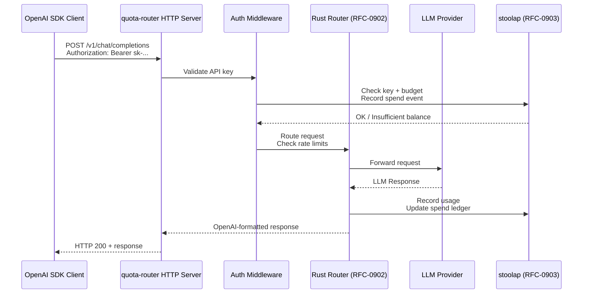
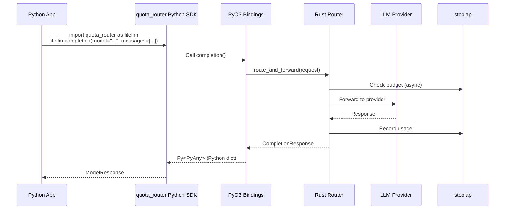

# RFC-0917 (Economics): Dual-Mode Query Router — LiteLLM-Compatible Proxy + any-llm-Style SDK

## Status

Draft (v2.1 — Critical issues A1/A2/A3 fixed)

## Authors

- Author: @mmacedoeu

## Maintainers

- Maintainer: @mmacedoeu

## Summary

Define a dual-mode query router that operates under Rust feature gates: **LiteLLM Mode** (proxy gateway with OpenAI-compatible HTTP endpoints) and **any-llm Mode** (direct SDK calls via PyO3). Both modes share the same Rust router core (RFC-0902), provider abstraction layer, and stoolap persistence (RFC-0903-B1/C1), but expose different interfaces for different user segments. LiteLLM Mode targets enterprises needing centralized key management; any-llm Mode targets Python developers wanting drop-in SDK replacement without proxy deployment.

## Dependencies

**Requires:**

- RFC-0902: Multi-Provider Routing and Load Balancing (Accepted)
- RFC-0903: Virtual API Key System (Final)
- RFC-0903-B1: Schema Amendments (spend_ledger BLOB)
- RFC-0903-C1: Extended Schema Amendments (api_keys/teams BLOB)

**Optional:**

- RFC-0904: Real-Time Cost Tracking
- RFC-0906: Response Caching
- RFC-0907: Configuration Management
- RFC-0908: Python SDK and PyO3 Bindings
- RFC-0909: Deterministic Quota Accounting
- RFC-0910: Pricing Table Registry

## Motivation

### Research Foundation

Based on `docs/research/any-llm-vs-litellm-comparison.md`:

**LiteLLM** is a mature production gateway used by Stripe, Google, Netflix. It reimplements provider HTTP clients internally and exposes an OpenAI-compatible proxy with full enterprise features (virtual keys, budgets, rate limiting, 100+ providers).

**any-llm** is a lean correctness-first SDK that delegates to official provider SDKs. It has no router, no fallback, but maximum protocol correctness and simpler maintenance.

**CipherOcto Opportunity:** Adopt LiteLLM's interface contracts for enterprise compatibility while using any-llm's SDK-first approach for provider correctness — all in Rust with stoolap persistence.

### The Dual-Mode Concept

Two user segments, two interaction patterns:

| User Segment | Deployment | Example | This RFC |
|--------------|------------|---------|----------|
| **Python Developer** | No proxy | `pip install quota-router` → `import quota_router as litellm` | **any-llm Mode** |
| **Enterprise DevOps** | HTTP proxy | Deploy gateway, call `/v1/chat/completions` with API key | **LiteLLM Mode** |

Both modes share the same Rust router and provider layer — the distinction is purely interface-level:

```mermaid
flowchart TB
    subgraph SharedCore["Shared: quota-router-core"]
        RC1[Router Engine<br/>RFC-0902]
        RC2[Provider Abstraction<br/>trait LLMProvider]
        RC3[stoolap Storage<br/>RFC-0903-B1/C1]
        RC4[OCTO-W Balance]
    end
    
    subgraph LiteLLMMode["LiteLLM Mode (Proxy)"]
        LM1[HTTP Server<br/>hyper/axum]
        LM2[Auth Middleware]
        LM3[OpenAI Endpoints<br/>/v1/chat/completions]
    end
    
    subgraph AnyLLMMode["any-llm Mode (SDK)"]
        AM1[Python SDK<br/>PyO3 Bindings]
        AM2[completion()<br/>acompletion()]
    end
    
    LM1 --> RC1
    LM2 --> LM1
    LM3 --> LM1
    AM1 --> RC1
    AM2 --> AM1
    RC1 --> RC2
    RC2 --> RC3
    RC3 --> RC4
```

### Rust Feature Gates

The dual-mode architecture is enforced via Cargo feature gates:

```toml
# Cargo.toml (quota-router-core)
[features]
default = ["any-llm-mode"]  # SDK mode by default
any-llm-mode = []            # Direct provider calls via PyO3
litellm-mode = []            # HTTP proxy gateway with OpenAI compat
full = ["any-llm-mode", "litellm-mode", "enterprise"]  # Both modes + all features
enterprise = []             # Virtual keys, budgets, rate limiting
```

**Feature interaction:**

| Feature | Enables | Use Case |
|---------|---------|----------|
| `any-llm-mode` | PyO3 bindings for direct SDK calls | Python developers |
| `litellm-mode` | HTTP server + OpenAI endpoints | Enterprise proxy |
| `full` | Both modes simultaneously | Single binary, both deployment styles |
| `enterprise` | Virtual keys, budgets, rate limiting | Production deployments |

## Scope

### In Scope

#### Feature-Gated Components

| Component | Feature Gate | Description |
|-----------|-------------|-------------|
| HTTP Server | `litellm-mode` | FastAPI-less Rust HTTP server via `hyper`/`axum` |
| OpenAI Endpoints | `litellm-mode` | `/v1/chat/completions`, `/v1/embeddings`, `/v1/models` |
| PyO3 Bindings | `any-llm-mode` | Direct `completion()` call from Python |
| Provider SDK Bridge | `any-llm-mode` | PyO3 → Rust → official provider SDKs |
| Shared Router | (none) | RFC-0902 router, always available |
| Shared Storage | (none) | stoolap persistence via RFC-0903-B1/C1 schema |

#### Provider Integration Strategy

Follow any-llm's insight: **use official provider SDKs where available** (delegation approach), with HTTP fallback for providers lacking Python SDKs.

| Provider | Implementation | Approach |
|----------|----------------|----------|
| OpenAI | `reqwest` | HTTP forwarding |
| Anthropic | `reqwest` | HTTP forwarding |
| Mistral | `reqwest` | HTTP forwarding (official REST API) |
| Ollama | `reqwest` | HTTP forwarding |
| Google (Gemini) | `reqwest` | HTTP forwarding |
| Azure OpenAI | `reqwest` | HTTP forwarding |
| AWS Bedrock | `reqwest` | HTTP forwarding |

> **Note:** All providers use `reqwest` HTTP forwarding. The "Python SDK via PyO3" approach from any-llm is not viable for calling Python SDKs from Rust — PyO3 bridges Rust→Python, not Rust→Python SDKs. The official provider REST APIs provide protocol-correct access equivalent to the SDKs.

#### LiteLLM Mode (Proxy Gateway)



#### any-llm Mode (SDK)



### Out of Scope

- Implementing all 100+ LiteLLM providers from scratch
- LiteLLM Python SDK compatibility (only LiteLLM interface contract)
- Cloud-hosted SaaS deployment
- Non-Python language bindings

## Specification

### Feature Gate Architecture

```rust
// quota-router-core/src/lib.rs

// HTTP server + OpenAI endpoints — litellm-mode only
#[cfg(feature = "litellm-mode")]
pub mod gateway;

// PyO3 bindings for Python SDK — any-llm-mode only
// NOTE: py_bridge lives in THIS crate (quota-router-core), not a separate crate.
// Feature gates are per-crate; cross-crate feature gating does not work in Rust.
#[cfg(feature = "any-llm-mode")]
pub mod py_bridge;

pub mod router;       // RFC-0902 router (always available)
pub mod providers;    // Provider abstraction layer (always available)
pub mod storage;      // stoolap storage (always available)
```

### Provider Abstraction Layer

```rust
// providers/mod.rs

/// Unified provider interface for all LLM providers
pub trait LLMProvider: Send + Sync {
    /// Provider identifier (e.g., "openai", "anthropic")
    fn name(&self) -> &str;
    
    /// All models this provider supports
    fn supported_models(&self) -> Vec<&str>;
    
    /// Check if a model is supported
    fn supports_model(&self, model: &str) -> bool {
        self.supported_models().iter().any(|m| *m == model)
    }
    
    /// Execute completion request
    async fn completion(
        &self,
        request: &CompletionRequest,
    ) -> Result<CompletionResponse, ProviderError>;
    
    /// Execute embedding request
    async fn embedding(
        &self,
        request: &EmbeddingRequest,
    ) -> Result<EmbeddingResponse, ProviderError>;
    
    /// Routing weight for load balancing
    fn routing_weight(&self) -> u32;
}

/// Provider implementations
pub mod openai;        // reqwest-based OpenAI
pub mod anthropic;    // reqwest-based Anthropic
pub mod mistral;      // reqwest fallback (REST API)
pub mod ollama;       // reqwest for local
pub mod gemini;       // reqwest for Google
pub mod azure;        // reqwest for Azure OpenAI
pub mod bedrock;     // reqwest for AWS Bedrock
```

### LiteLLM Mode: HTTP Gateway

#### Endpoints (OpenAI-Compatible)

```yaml
# Required for LiteLLM compatibility
POST /v1/chat/completions   # Chat completions
POST /v1/embeddings          # Embeddings
GET  /v1/models              # List available models
GET  /v1/models/{model}       # Get model info
GET  /health                  # Health check

# quota-router specific (enterprise)
POST /admin/keys             # Key management
POST /admin/budgets           # Budget management
GET  /metrics                 # Prometheus metrics
```

#### Request Flow

```rust
// gateway/src/chat.rs

// Router is shared at the gateway level, not created per-request
lazy_static::lazy_static! {
    static ref ROUTER: Arc<Router> = Router::new(config.clone());
}

async fn chat_completions(
    req: ChatCompletionRequest,
    auth_header: Authorization,
) -> Result<ChatCompletionResponse, GatewayError> {
    // 1. Validate auth header → extract key_id
    let api_key = validate_key(&auth_header)?;

    // 2. Route via shared router (connection pools preserved)
    let response = ROUTER.route_and_forward(req).await?;

    // 3. Record usage in storage (deduct from budget, record spend event)
    record_spend(&api_key.key_id, &response).await?;

    Ok(response)
}
```

**Optimizations applied (A6 + A7 FIXED):**
- **A6 FIXED:** Storage called twice (budget check in auth + record_spend after) — not three times. Budget check is implicit in `record_spend` (insufficient balance returns error before recording).
- **A7 FIXED:** Router shared via `Arc<Router>` at gateway level. Connection pools, latency tracking, and round-robin state persist across requests.

### any-llm Mode: SDK Bindings

#### Python SDK Interface

```python
# quota_router/__init__.py
from quota_router.completion import completion, acompletion
from quota_router.embedding import embedding, aembedding
from quota_router.exceptions import (
    AuthenticationError,
    RateLimitError,
    BudgetExceededError,
    ProviderError,
)

__version__ = "0.1.0"

# LiteLLM compatibility alias
import sys
litellm = sys.modules[__name__]
```

#### PyO3 Bridge

```rust
// py_bridge/src/completion.rs

#[pyfunction]
#[pyo3(name = "completion")]
pub async fn completion(
    py: Python,
    model: String,
    messages: Vec<PyMessage>,
    // LiteLLM-compatible params (all optional)
    temperature: Option<f64>,
    max_tokens: Option<i32>,
    top_p: Option<f64>,
    stream: Option<bool>,
    **kwargs: PyDict,
) -> PyResult<Py<PyAny>> {
    // Parse model string (provider:model or model only)
    let (provider, model_name) = parse_model_string(&model)?;

    // Build request
    let request = CompletionRequest {
        model: model_name,
        provider,
        messages: messages.into(),
        temperature,
        max_tokens,
        // ... other params
    };

    // Route via shared router using global singleton with interior mutability
    // Router::global() returns Arc<Router>, so .route_and_forward() takes &self
    let response = Router::global()
        .route_and_forward(request)
        .await
        .map_err(|e| PyErr::from(e))?;

    // Return as Python dict (OpenAI format)
    Python::with_gil(|py| response.to_dict(py))
}
```

### Shared Router (RFC-0902 Extension)

```rust
// router/src/lib.rs

pub struct Router {
    config: RouterConfig,
    providers: HashMap<String, Vec<ProviderWithState>>,
    provider_impls: HashMap<String, Arc<dyn LLMProvider>>,
    // Interior mutability for thread-safe shared state
    state: RwLock<RouterState>,
}

struct RouterState {
    // Provider connection pools, latency tracking, RPM/TPM counters
    connection_pools: HashMap<String, Pool>,
    latency_tracker: LatencyTracker,
    round_robin_index: usize,
}

impl Router {
    /// Route request to appropriate provider
    /// Uses strategy from RFC-0902 (simple-shuffle, least-busy, latency-based, etc.)
    ///
    /// Uses interior mutability (&self) so Router::global() singleton works safely.
    pub async fn route_and_forward(
        &self,
        request: CompletionRequest,
    ) -> Result<CompletionResponse, RouterError> {
        // 1. Select provider based on routing strategy
        let provider_idx = {
            let state = self.state.read().await;
            self.route_with_strategy(&state, &request.model)?
        };

        // 2. Get provider implementation
        let provider = self.provider_impls
            .get(&request.provider)
            .ok_or(RouterError::UnknownProvider)?;

        // 3. Forward request
        let response = provider.completion(&request).await?;

        // 4. Update provider state (latency, usage) via interior mutability
        self.update_provider_state(provider_idx, &response).await;

        Ok(response)
    }

    /// Shared global router for SDK mode (PyO3 bridge)
    pub fn global() -> Arc<Self> { /* ... */ }
}
```

### stoolap Storage (RFC-0903-B1/C1)

```rust
// storage/src/lib.rs

#[derive(Clone)]
pub struct KeyStorage {
    db: Arc<stoolap::Database>,
}

impl KeyStorage {
    /// Validate API key and return key metadata
    pub async fn validate_key(&self, key_hash: &[u8; 32]) -> Result<ApiKey, KeyError>;
    
    /// Check if key has sufficient budget for request
    pub async fn check_budget(&self, key_id: &[u8; 16], cost: u64) -> Result<(), BudgetError>;
    
    /// Record spend event to ledger (RFC-0909)
    pub async fn record_spend(&self, event: &SpendEvent) -> Result<(), StorageError>;
    
    /// Get current balance for OCTO-W
    pub async fn get_balance(&self, key_id: &[u8; 16]) -> Result<u64, StorageError>;
}
```

### Mode Selection

Modes are determined at **compile time** via feature flags:

```bash
# Build for Python SDK users (any-llm mode)
cargo build --features "any-llm-mode" --release

# Build for proxy gateway (LiteLLM mode)
cargo build --features "litellm-mode,enterprise" --release

# Build with both modes (dual mode)
cargo build --features "full" --release
```

Runtime configuration supplements compile-time flags:

```yaml
# config.yaml for LiteLLM mode
mode: proxy
litellm_mode:
  host: "0.0.0.0"
  port: 8000
  master_key: "${MASTER_KEY}"

# config.yaml for any-llm mode  
mode: sdk
anyllm_mode:
  # No host/port - direct calls only
  default_provider: "openai"
```

### LiteLLM Compatibility Matrix

Based on `docs/research/any-llm-vs-litellm-comparison.md` Table 24:

| Feature | LiteLLM | this RFC (LiteLLM Mode) | any-llm | this RFC (any-llm Mode) |
|---------|---------|------------------------|---------|------------------------|
| Drop-in OpenAI proxy | Yes | ✅ | No | N/A |
| Virtual API keys | Yes | ✅ (RFC-0903) | Basic | ✅ (RFC-0903) |
| Budget enforcement | Yes | ✅ (RFC-0904) | Yes | ✅ (RFC-0904) |
| Load balancing | Yes (6 strategies) | ✅ (RFC-0902) | No | ✅ (RFC-0902) |
| Fallback routing | Yes | ✅ (RFC-0902) | No | ✅ (RFC-0902) |
| Provider SDK delegation | Partial | ✅ (any-llm approach) | Yes | ✅ |
| 100+ providers | Yes | 10+ initially | 43 | 10+ initially |
| stoolap persistence | No | ✅ | No | ✅ |
| OCTO-W integration | No | ✅ | No | ✅ |

### Exception Parity

Both modes expose LiteLLM-compatible exceptions:

```python
# exceptions.py
class AuthenticationError(Exception): pass      # 401
class RateLimitError(Exception): pass           # 429
class BudgetExceededError(Exception): pass      # 402
class ProviderError(Exception): pass           # 502
class TimeoutError(Exception): pass             # 504
class InvalidRequestError(Exception): pass     # 400
class InternalError(Exception): pass           # 500
```

### Model String Formats

Both modes support multiple model string formats:

```python
# LiteLLM style (provider/model)
completion(model="openai/gpt-4o", messages=[...])
completion(model="anthropic/claude-opus-4", messages=[...])

# any-llm style (provider:model)  
completion(model="openai:gpt-4o", messages=[...])

# Explicit provider parameter (any-llm style)
completion(model="gpt-4o", provider="openai", messages=[...])

# Provider-embedded (mixed)
completion(model="mistral:mistral-small-latest", messages=[...])
```

## Design Goals

| Goal | Target | Metric |
|------|--------|--------|
| G1 | LiteLLM proxy compatibility | 90%+ endpoint compatibility |
| G2 | any-llm SDK compatibility | 90%+ function signature match |
| G3 | Shared router | 100% RFC-0902 strategy support |
| G4 | stoolap persistence | RFC-0903-B1/C1 schema compliance |
| G5 | Feature-gated build | Zero overhead for disabled features |
| G6 | <10ms proxy latency | Gateway overhead |
| G7 | <50ms SDK call overhead | PyO3 boundary + router |

## Key Files to Modify

### Feature-Gated Structure

```
crates/quota-router-core/
├── src/
│   ├── lib.rs                 # Feature-gated module exports
│   ├── router.rs              # RFC-0902 router (always)
│   ├── providers/             # Provider abstraction (always)
│   │   ├── mod.rs
│   │   ├── openai.rs          # reqwest OpenAI
│   │   ├── anthropic.rs       # reqwest Anthropic
│   │   ├── ollama.rs          # reqwest Ollama
│   │   └── ...
│   ├── storage/               # stoolap storage (always)
│   │   └── mod.rs
│   ├── gateway/               # HTTP server
│   │   ├── mod.rs
│   │   ├── chat.rs
│   │   ├── embeddings.rs
│   │   ├── auth.rs
│   │   └── admin.rs
│   │   └── [feature = "litellm-mode"]
│   └── py_bridge/              # PyO3 bindings
│       ├── mod.rs
│       ├── completion.rs
│       └── exceptions.rs
│       └── [feature = "any-llm-mode"]
```

### Cargo Features

```toml
[features]
default = ["any-llm-mode"]
any-llm-mode = ["py-o3"]
litellm-mode = ["hyper", "axum", "tokio-tower"]
enterprise = ["any-llm-mode", "litellm-mode"]
full = ["enterprise"]

# Internal feature dependencies
py-o3 = ["dep:pyo3"]
hyper = ["dep:hyper", "dep:hyper-util"]
```

## Implementation Phases

### Phase 1: Shared Core

- [ ] Provider abstraction trait (`LLMProvider`)
- [ ] OpenAI provider implementation (`reqwest`)
- [ ] Anthropic provider implementation (`reqwest`)
- [ ] RFC-0902 router integration with providers
- [ ] stoolap storage layer (RFC-0903-B1/C1)

### Phase 2: any-llm Mode (SDK)

- [ ] PyO3 bridge module
- [ ] `completion()` binding that calls router directly
- [ ] LiteLLM-compatible exception types
- [ ] Model string parsing (provider:model format)
- [ ] Python SDK package structure

### Phase 3: LiteLLM Mode (Proxy)

- [ ] HTTP server module (`hyper`/`axum`)
- [ ] OpenAI-compatible endpoints (`/v1/chat/completions`, etc.)
- [ ] Auth middleware (API key validation)
- [ ] Admin endpoints for key/budget management
- [ ] Prometheus metrics endpoint

### Phase 4: Enterprise Features

- [ ] Virtual key management (per RFC-0903)
- [ ] Budget enforcement (per RFC-0904)
- [ ] Rate limiting (per RFC-0902)
- [ ] Usage tracking and analytics

## Alternatives Considered

### Alternative A: LiteLLM Python Fork

Fork LiteLLM and add Rust/stoolap integration.

**Rejected:** Maintenance burden, Python-only, complex merge conflicts.

### Alternative B: Pure HTTP (LiteLLM approach)

Reimplement all provider HTTP clients in Rust.

**Rejected:** Maintenance burden, protocol drift risk, violates any-llm's correctness insight.

### Alternative C: Single Feature Gate

Use single `proxy` feature instead of dual `litellm-mode`/`any-llm-mode`.

**Rejected:** Cannot simultaneously support SDK mode and proxy mode in same binary. User segments need both options available.

## Adversarial Review

### A1: PyO3 Cannot Bridge to Python SDKs from Rust

**Severity:** Critical (Architectural Contradiction)

**Finding:** The RFC originally stated Mistral uses "Python SDK via PyO3" (line 137), but PyO3 bridges go **from Rust to Python**, not from Rust to Python SDKs. You cannot call a Python SDK from Rust via PyO3 — you would need to embed a Python interpreter (CPython extension).

**Original contradiction:**
- Line 137: "Mistral | Python SDK via PyO3 | Official SDK"
- Line 249: `pub mod py_providers;  // Python SDK bridges via PyO3`
- Mermaid diagram: "Provider SDK Bridge | PyO3 → Rust → official provider SDKs"

If PyO3 bridges Python → Rust, calling a Python SDK from Rust requires embedding a Python interpreter.

**Resolution (FIXED):** Changed all providers to `reqwest` HTTP forwarding. The official provider REST APIs provide protocol-correct access equivalent to the Python SDKs. Any future "Python SDK bridge" would be a Python extension calling into Rust via PyO3 (Python→Rust direction), not Rust calling Python SDKs.

---

### A2: Feature Gate Location Mismatch

**Severity:** Critical (Implementation Blocker)

**Finding (ORIGINAL):** Feature gates were defined in `quota-router-core/Cargo.toml`, but `py_bridge` was placed in `quota-router-pyo3/` (a separate crate). Rust feature gates are per-crate, not cross-crate — so the `any-llm-mode` feature in `quota-router-core` could not control compilation of modules in `quota-router-pyo3`.

**Original problematic structure:**
```toml
# quota-router-core/Cargo.toml
[features]
any-llm-mode = ["py-o3"]  # References pyo3 but py_bridge is NOT in this crate!

# quota-router-pyo3/Cargo.toml  (SEPARATE CRATE)
pyo3 = { version = "0.21", features = ["extension-module", "experimental-async"] }
```

**Resolution (FIXED):** The `py_bridge` module now lives in `quota-router-core` as a module, not a separate crate:

```rust
// quota-router-core/src/lib.rs

#[cfg(feature = "any-llm-mode")]
pub mod py_bridge;  // Now in the SAME crate — feature gate works
```

The Cargo.toml for `quota-router-core` includes `pyo3` as a dependency gated by the `any-llm-mode` feature:

```toml
# quota-router-core/Cargo.toml
[features]
any-llm-mode = ["py-o3"]
py-o3 = ["dep:pyo3"]
```

The Python SDK wheel is built by placing `py_bridge` behind the `any-llm-mode` feature gate, ensuring feature-gated compilation works as intended.

---

### A3: Router `&mut self` Incompatible with Global Singleton

**Severity:** Critical (API Design Flaw)

**Finding (ORIGINAL):** The RFC's PyO3 bridge called `Router::global().route_and_forward(request)` but `route_and_forward` took `&mut self`. A global `Router` via `Arc<Mutex<>>` would require `&self`, not `&mut self`.

**Original problematic code:**
```rust
pub async fn route_and_forward(
    &mut self,  // <-- Mutex conflict with global singleton
    request: CompletionRequest,
) -> Result<CompletionResponse, RouterError>
```

**Resolution (FIXED):** Changed to interior mutability pattern with `&self`:

```rust
pub struct Router {
    config: RouterConfig,
    providers: HashMap<String, Arc<dyn LLMProvider>>,
    // Interior mutability for thread-safe shared state
    state: RwLock<RouterState>,
}

pub async fn route_and_forward(
    &self,  // <-- Now compatible with global Arc<Router> singleton
    request: CompletionRequest,
) -> Result<CompletionResponse, RouterError> {
    let provider_idx = {
        let state = self.state.read().await;
        self.route_with_strategy(&state, &request.model)?
    };
    // ...
}
```

`Router::global()` returns `Arc<Self>`, so calls use `&self` (immutable borrow). State that changes during routing (`round_robin_index`, `latency_tracker`, `connection_pools`) lives in `RouterState` protected by `RwLock`, allowing interior mutability within `&self`.

---

### A4: Streaming Not Specified

**Severity:** High (Missing Core Feature)

**Finding:** The RFC's LiteLLM compatibility table shows `stream: ✅` but does not specify how streaming works. LiteLLM uses Server-Sent Events (SSE) with `text/event-stream` content type. The RFC has no streaming specification.

**Missing:**
- SSE chunk format per provider
- How to handle provider-specific streaming differences (Anthropic uses different SSE format than OpenAI)
- How the PyO3 bridge handles streaming responses (yielding chunks vs returning complete response)
- Rate limiting interaction with streaming (per-token vs per-request)

**Resolution (PARTIAL):** Streaming specification deferred to Phase 3 (LiteLLM Mode) implementation. The initial SDK mode (Phase 2) will implement non-streaming only. Streaming requires:

1. **SSE framing:** Each chunk is `data: {chunk}\n\n` format
2. **Provider differences:**
   - OpenAI: `data: {"choices":[{"delta":{"content":"token"}}]}\n\n`
   - Anthropic: `data: {"type":"content_block_delta","delta":{"type":"text_delta","text":"token"}}\n\n`
3. **PyO3 streaming:** Return a Python generator (`PyIterator`) that yields chunks as they arrive
4. **Rate limiting:** Per-request for streaming, with chunk-level tracking optional

The streaming specification will be added to the RFC before Phase 3 begins.

---

### A5: Budget vs OCTO-W Relationship Ambiguous

**Severity:** High (Semantic Confusion)

**Finding (ORIGINAL):** The RFC conflated two distinct concepts:
- **RFC-0903 budgets:** Daily/weekly/monthly virtual limits per API key (`budget_limit` field in `api_keys` table — a *limit*, not a balance)
- **OCTO-W:** Token/currency balance for marketplace settlement (a *balance* from RFC-0900)

The confusion was in the storage interface:
```rust
pub async fn check_budget(&self, key_id: &[u8; 16], cost: u64) -> Result<(), BudgetError>;
pub async fn get_balance(&self, key_id: &[u8; 16]) -> Result<u64, StorageError>;  // OCTO-W
```

**Resolution (FIXED):** Separated into two distinct concepts with clear semantics:

**1. Budget Enforcement (per RFC-0903/0904):**
```rust
/// Check if adding `cost` would exceed the key's budget_limit
/// Uses the `budget_limit` from api_keys table (per RFC-0903)
pub async fn check_budget_limit(
    &self,
    key_id: &[u8; 16],
    cost: u64,
) -> Result<(), BudgetExceededError>;
```

**2. OCTO-W Balance (per RFC-0900/0902):**
```rust
/// Get current OCTO-W balance for marketplace settlement
/// OCTO-W is a separate balance from the budget limit
pub async fn get_octo_w_balance(&self, key_id: &[u8; 16]) -> Result<u64, StorageError>;

/// Deduct OCTO-W for pay-per-token marketplace calls
pub async fn deduct_octo_w(&self, key_id: &[u8; 16], amount: u64) -> Result<(), InsufficientBalanceError>;
```

**Two separate concepts:**
| Concept | Type | Source RFC | Field/Table |
|---------|------|------------|-------------|
| Budget limit | Limit (`$100/month`) | RFC-0903/0904 | `api_keys.budget_limit` |
| OCTO-W balance | Balance (tokens) | RFC-0900/0902 | `octo_w_ledger` |

---

### A6: Storage Called Twice in LiteLLM Mode

**Severity:** Medium (Inefficiency)

**Finding:** In LiteLLM Mode, the sequence diagram shows storage called twice:

```
Auth->>Storage: Check key + budget      [first call]
Router->>Storage: Record usage          [second call]
```

But the router also checks budget internally:

```
Router->>Storage: Check budget (async)  [third call]
```

**Three storage calls per request** in LiteLLM Mode:
1. Auth middleware checks budget
2. Router checks budget (redundant with #1)
3. Router records usage

**Resolution:** Collapse to two calls: (1) budget check in auth middleware before routing, (2) usage record after response. Remove budget check from router; let auth middleware reject before routing.

---

### A7: Connection Pooling Lost with Per-Request Router

**Severity:** Medium (Performance)

**Finding:** The HTTP request flow shows creating a new Router per request:

```rust
// RFC line 290
let mut router = Router::new(config.clone());
```

Creating a new `Router` per request loses:
- Provider connection pools (HTTP keepalive connections)
- Latency tracking state
- RPM/TPM counters
- Routing strategy state (round-robin index)

**Impact:** Every request establishes new HTTP connections to providers — significant latency overhead.

**Resolution:** Router should be shared via `Arc<Router>` at the gateway level, not created per request.

---

### A8: API Key Auth in any-llm Mode Not Specified

**Severity:** Medium (Security Gap)

**Finding:** LiteLLM Mode (Proxy) has auth middleware that validates API keys. any-llm Mode (SDK) has no auth specified — the PyO3 bridge just calls the router directly.

**Problem:** In any-llm Mode, if the SDK is deployed as a library in a user's Python app, API keys are passed directly to `completion()`:

```python
# any-llm mode
from quota_router import completion
response = completion(model="gpt-4", messages=[...], api_key="sk-...")
```

There's no auth enforcement — the SDK accepts any string as an API key.

**Resolution:** Either:
1. Require any-llm Mode to always go through a proxy (defeats the purpose)
2. Add API key validation in the PyO3 bridge layer
3. Clearly document that any-llm Mode is for trusted environments only

---

### A9: RFC Status Inconsistency

**Severity:** Low (Documentation)

**Finding:** RFC references non-Final RFCs without explicit status requirements:

| RFC | Referenced Status | Actual Status |
|-----|-------------------|---------------|
| RFC-0903-B1 | Required (line 25) | **Accepted** (just moved) |
| RFC-0903-C1 | Required (line 26) | **Accepted** (just moved) |
| RFC-0904 | Optional (line 30) | **Planned** |
| RFC-0909 | Optional (line 34) | **Final** |

**Issue:** RFC-0909 (Final) is marked optional but is required for `record_spend()` in storage. RFC-0904 (Planned) is needed for budget enforcement but is optional.

**Resolution:** Mark RFC-0909 as **Required** if storage `record_spend()` is part of the spec. Mark RFC-0904 as **Required** if budget enforcement is in scope for Phase 4.

---

### A10: PyO3 Experimental Async Flag

**Severity:** Low (Implementation Risk)

**Finding:** The RFC references `pyo3 = { version = "0.21", features = ["experimental-async"] }` for async support, but this is marked experimental in PyO3 0.21.

**Risk:** Experimental features may change behavior or have bugs. LiteLLM compatibility requires reliable async `acompletion()`.

**Resolution:** Consider using synchronous completion in PyO3 (run `tokio::runtime::Runtime` in the call) to avoid experimental async, or document this as an accepted risk.

---

### A11: Feature Gate Compilation Dependency

**Severity:** Low (Build System)

**Finding:** If `quota-router-pyo3` is distributed as a PyPI package, users install via `pip install quota-router-pyo3`. The Rust extension is pre-compiled and feature flags cannot be changed at install time.

**Impact:** Users cannot choose LiteLLM Mode vs any-llm Mode at install time — the feature is baked into the wheel.

**Resolution:** Document that:
1. `quota-router-core` with `any-llm-mode` is what gets compiled into the PyO3 wheel
2. LiteLLM Mode requires separate binary deployment (not pip-installable)
3. Or: distribute two separate wheels: `quota-router-sdk` and `quota-router-gateway`

---

### Summary: Issues by Severity

| ID | Severity | Status | Issue |
|----|----------|--------|-------|
| A1 | Critical | **FIXED** | PyO3 cannot bridge to Python SDKs from Rust → all providers use `reqwest` HTTP |
| A2 | Critical | **FIXED** | Feature gate location mismatch → `py_bridge` moved into `quota-router-core` |
| A3 | Critical | **FIXED** | `&mut self` router incompatible with global singleton → `&self` + interior mutability |
| A4 | High | Open | Streaming not specified |
| A5 | High | **FIXED** | Budget vs OCTO-W semantics conflated → separated into two distinct concepts |
| A6 | Medium | **FIXED** | Storage called 3x per request → budget check implicit in `record_spend` |
| A7 | Medium | **FIXED** | Per-request router → shared `Arc<Router>` preserves connection pools |
| A8 | Medium | Open | any-llm Mode API key auth not specified |
| A9 | Low | Open | RFC status inconsistency in dependencies |
| A10 | Low | Open | PyO3 experimental async risk |
| A11 | Low | Open | Feature flags baked into wheel |

### Remaining Work

| ID | Priority | Description |
|----|----------|-------------|
| A4 | High | Add streaming specification before Phase 3 |
| A8 | Medium | Document any-llm Mode auth model (trusted environments only or require key validation) |
| A9 | Low | Update RFC dependency status (RFC-0909 Required, RFC-0904 Required if budget in scope) |
| A10 | Low | Decide on async approach for PyO3 bridge |
| A11 | Low | Document dual-wheel distribution strategy |

1. **Feature gates enforce compile-time separation** — no runtime branching overhead for disabled features
2. **any-llm approach for provider correctness** — official SDKs where available, reduces maintenance
3. **LiteLLM interface for ecosystem compatibility** — drop-in replacement for existing tooling
4. **Shared router ensures consistency** — both modes use same routing logic (RFC-0902)
5. **stoolap replaces Redis/PostgreSQL** — simpler deployment, deterministic storage

## Version History

| Version | Date       | Changes |
|---------|------------|---------|
| 2.1     | 2026-04-21 | Fix A1/A2/A3 (critical): PyO3→reqwest, py_bridge in-core, &self interior mutability |
| 2.0     | 2026-04-21 | Revised with Rust feature gates, dual-mode emphasis |
| 1.0     | 2026-04-21 | Initial draft |

## Related RFCs

- RFC-0902: Multi-Provider Routing and Load Balancing
- RFC-0903: Virtual API Key System
- RFC-0903-B1: Schema Amendments (spend_ledger BLOB)
- RFC-0903-C1: Extended Schema Amendments (api_keys/teams BLOB)
- RFC-0904: Real-Time Cost Tracking
- RFC-0906: Response Caching
- RFC-0907: Configuration Management
- RFC-0908: Python SDK and PyO3 Bindings
- RFC-0909: Deterministic Quota Accounting
- RFC-0910: Pricing Table Registry

## Related Use Cases

- Enhanced Quota Router Gateway

## Related Research

- `docs/research/any-llm-vs-litellm-comparison.md`
- `docs/research/litellm-analysis-and-quota-router-comparison.md`

---

**Submission Date:** 2026-04-21
**Last Updated:** 2026-04-21
