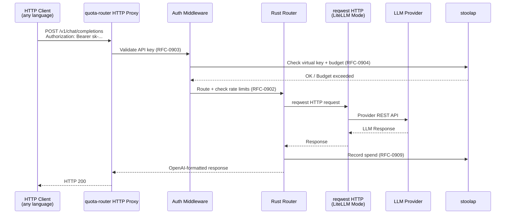
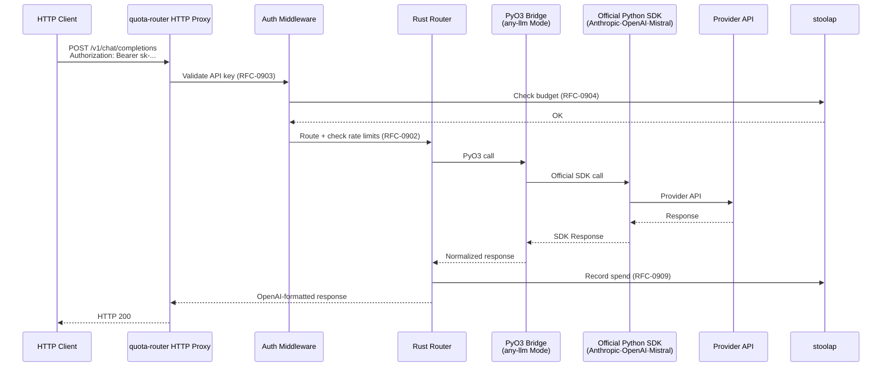

# RFC-0917 (Economics): Dual-Mode Query Router — LiteLLM-Style HTTP Forwarding + any-llm-Style SDK Delegation

## Status

Draft (v2.4 — Round 4: mode distinction is PROVIDER INTEGRATION STRATEGY, not interface)

## Authors

- Author: @mmacedoeu

## Maintainers

- Maintainer: @mmacedoeu

## Summary

Define a dual-mode query router that operates under Rust feature gates: **LiteLLM Mode** (native Rust HTTP forwarding to provider REST APIs, like LiteLLM's custom HTTP clients) and **any-llm Mode** (Python SDK delegation via PyO3 to official provider SDKs, like any-llm's delegation approach). The modes differ in **how providers are called**, not in which interface is exposed. Both modes can serve clients via HTTP proxy (OpenAI-compatible endpoints) and via Python SDK (`pip install`). Enterprise features (virtual keys, budgets, rate limiting, Prometheus, RFC-0903/0904/0909/0910) are available in **both** modes. The mode gate controls whether providers are called via native Rust HTTP (`reqwest`) or via official Python SDKs through PyO3.

## Motivation

### Research Foundation

Based on `docs/research/any-llm-vs-litellm-comparison.md`:

**LiteLLM** (BerriAI) is a mature production gateway used by Stripe, Google, Netflix. Its defining characteristic is **reimplementing provider HTTP clients internally** — it does NOT delegate to official provider SDKs. It exposes both a Python SDK and an HTTP proxy, with full enterprise features.

**any-llm** (Mozilla AI) is a lean correctness-first SDK that **delegates to official provider SDKs** (Anthropic SDK, OpenAI SDK, etc.). It has no router, no fallback, but maximum protocol correctness via SDK delegation. It exposes a Python SDK with an optional FastAPI gateway.

**CipherOcto Opportunity:** The dual-mode distinction should mirror the architectural difference between the reference implementations:
- **LiteLLM Mode:** Native Rust HTTP forwarding (like LiteLLM's custom HTTP approach, but in Rust) — no Python SDK dependency for provider calls, protocol control, lightweight
- **any-llm Mode:** Python SDK delegation via PyO3 (like any-llm's SDK delegation approach) — maximum correctness via official SDKs, familiar Python API

Both modes expose identical interfaces (HTTP proxy + Python SDK) and identical enterprise features. The only difference is the **provider integration strategy**.

### The Dual-Mode Concept

The dual-mode architecture differentiates **how providers are called**, not which client interface is exposed:

| Dimension | LiteLLM Mode | any-llm Mode |
|-----------|--------------|--------------|
| Provider integration | Native Rust HTTP forwarding (`reqwest`) | Python SDK delegation (PyO3 → official SDKs) |
| Reference approach | LiteLLM's custom HTTP clients | any-llm's SDK delegation |
| Python dependency | None for provider calls | Official provider SDKs (Anthropic, OpenAI, etc.) |
| Protocol control | Full (custom HTTP implementation) | Delegated to SDK |
| Correctness guarantee | Via audit + test | Via official SDK |

**Both modes expose identical interfaces:**

| Interface | Availability | Description |
|-----------|-------------|-------------|
| HTTP proxy | Both modes | OpenAI-compatible endpoints (`/v1/chat/completions`) |
| Python SDK | Both modes | `pip install quota_router` → `completion()` |

**Both modes share identical enterprise features:**
- Virtual API keys (RFC-0903)
- Budget enforcement (RFC-0904)
- Rate limiting (RFC-0902)
- Deterministic quota accounting (RFC-0909)
- Pricing table registry (RFC-0910)
- Prometheus metrics
- OCTO-W balance (RFC-0900)
- stoolap persistence (RFC-0903-B1/C1)

The mode gate does NOT control interface (HTTP vs SDK) or enterprise features — it controls **how providers are called internally**.

### Architectural Diagram

```mermaid
flowchart LR
    subgraph Interface["Both Modes: HTTP Proxy + Python SDK"]
        HTTP[HTTP Proxy<br/>/v1/chat/completions]
        SDK[Python SDK<br/>completion()]
    end

    subgraph LiteLLM["LiteLLM Mode (feature gate)"]
        LM[Router] --> RustHTTP[reqwest HTTP forwarding<br/>Native Rust → Provider REST APIs]
    end

    subgraph AnyLLM["any-llm Mode (feature gate)"]
        AM[Router] --> PyBridge[PyO3 Bridge<br/>Python SDKs: Anthropic·OpenAI·Mistral·etc.]
    end

    subgraph Shared["Shared (both modes)"]
        Enterprise[Enterprise: Keys·Budgets·Rate Limits·Metrics]
        Storage[stoolap RFC-0903-B1/C1]
    end

    HTTP --> Shared
    SDK --> Shared
    Shared --> LM
    Shared --> AM

    classDef gate fill:#fff3cd
    classDef shared fill:#e1f5fe
```

**Mode gates:**

```toml
# Cargo.toml (quota-router-core)
[features]
default = ["full"]           # Both provider integration strategies
litellm-mode = ["hyper", "axum"]  # Native Rust HTTP forwarding (no Python SDK deps)
any-llm-mode = ["py-o3"]    # Python SDK delegation via PyO3
full = ["litellm-mode", "any-llm-mode"]  # Both strategies

# NOTE: Both modes also include HTTP proxy + Python SDK interfaces.
# The feature gate controls PROVIDER INTEGRATION STRATEGY, not interface.
```

**What each mode builds:**

| Feature | `litellm-mode` | `any-llm-mode` | `full` |
|---------|---------------|----------------|-------|
| Native Rust HTTP (`reqwest`) | ✅ | ❌ | ✅ |
| Python SDK delegation (PyO3) | ❌ | ✅ | ✅ |
| HTTP proxy interface | ✅ | ✅ | ✅ |
| Python SDK interface | ✅ | ✅ | ✅ |
| Enterprise features | ✅ | ✅ | ✅ |
| stoolap storage | ✅ | ✅ | ✅ |

### Rust Feature Gates

The dual-mode architecture uses Cargo feature gates to select the **provider integration strategy**. Both modes also include HTTP proxy + Python SDK interfaces (not gated):

```toml
# Cargo.toml (quota-router-core)
[features]
default = ["full"]           # Both provider integration strategies + both interfaces
litellm-mode = ["hyper", "axum"]  # Native Rust HTTP forwarding (no Python SDK deps for providers)
any-llm-mode = ["py-o3"]    # Python SDK delegation via PyO3 (official provider SDKs)
full = ["litellm-mode", "any-llm-mode"]  # Both provider strategies

# Interfaces (always included, not gated):
# - HTTP proxy: hyper + axum (always compiled)
# - Python SDK: py-o3 (always compiled when any-llm-mode or full)
```

**What each feature controls (provider integration strategy, not interface):**

| Feature | Provider Integration | Python Provider SDKs |
|---------|--------------------|--------------------|
| `litellm-mode` | Native Rust HTTP (`reqwest`) to provider REST APIs | ❌ None |
| `any-llm-mode` | Python SDK delegation via PyO3 (Anthropic, OpenAI, Mistral, etc.) | ✅ Via PyO3 |
| `full` (default) | Both strategies simultaneously | Both |

**Interfaces (always available when the feature is enabled):**

| Interface | `litellm-mode` | `any-llm-mode` | `full` |
|-----------|:--------------:|:---------------:|:------:|
| HTTP proxy (`/v1/chat/completions`) | ✅ | ✅ | ✅ |
| Python SDK (`pip install`) | ✅ | ✅ | ✅ |

**Note:** `hyper`/`axum` for the HTTP proxy and `pyo3` for the Python SDK are compiled based on which interface is needed. The `litellm-mode` / `any-llm-mode` gate controls whether the **provider** calls go through native Rust HTTP (`reqwest`) or through Python SDK delegation (PyO3 → official SDKs).

## Scope

### In Scope

#### Feature-Gated Components

| Component | Feature Gate | Description |
|-----------|-------------|-------------|
| Native HTTP Forwarding | `litellm-mode` | `reqwest`-based HTTP calls to provider REST APIs (Rust, no Python SDK deps) |
| Python SDK Delegation | `any-llm-mode` | PyO3 bridge calling official Python SDKs (Anthropic, OpenAI, Mistral, etc.) |
| HTTP Proxy Server | (always with litellm-mode) | `hyper`/`axum` OpenAI-compatible proxy endpoints |
| Python SDK Interface | (always with any-llm-mode) | PyO3 bindings for `pip install` Python SDK |
| Shared Router | (none) | RFC-0902 router + all 6 routing strategies |
| Enterprise Features | (none) | Virtual keys, budgets, rate limiting, Prometheus, RFC-0903/0904/0909/0910 |
| stoolap Storage | (none) | RFC-0903-B1/C1 persistence |

#### Provider Integration Strategy

The dual-mode architecture differentiates **how providers are called**, not which interface is exposed:

**LiteLLM Mode — Native Rust HTTP Forwarding:**

```
Router → reqwest HTTP → Provider REST API (OpenAI, Anthropic, Mistral, etc.)
```

Like LiteLLM's approach: custom HTTP implementation in Rust for protocol control. No Python dependency for provider calls. Single HTTP stack (`reqwest`) for all providers.

| Provider | LiteLLM Mode Implementation | Notes |
|----------|--------------------------|-------|
| OpenAI | `reqwest` | REST API — chat completions, embeddings |
| Anthropic | `reqwest` | REST API — messages, embeddings |
| Mistral | `reqwest` | REST API — official Mistral API |
| Ollama | `reqwest` | REST API — local and remote Ollama |
| Google (Gemini) | `reqwest` | REST API — Vertex AI or maker suite |
| Azure OpenAI | `reqwest` | REST API — Azure-hosted models |
| AWS Bedrock | `reqwest` | REST API — Claude, Llama via Bedrock |

**any-llm Mode — Python SDK Delegation:**

```
Router → PyO3 Bridge → Official Python SDK (Anthropic, OpenAI, Mistral, etc.)
```

Like any-llm's approach: delegation to official provider SDKs for maximum HTTP transport correctness. The PyO3 bridge calls into Python SDKs that handle HTTP internally.

| Provider | any-llm Mode Implementation | Notes |
|----------|----------------------------|-------|
| OpenAI | `openai` Python SDK | Official OpenAI SDK |
| Anthropic | `anthropic` Python SDK | Official Anthropic SDK |
| Mistral | `mistralai` Python SDK | Official Mistral SDK |
| Ollama | `ollama` Python SDK | Official Ollama SDK |
| Google (Gemini) | `google-genai` Python SDK | Official Google SDK |
| Azure OpenAI | `openai` Python SDK (Azure endpoint) | Official SDK with Azure config |
| AWS Bedrock | `boto3` + `botocore` | Official AWS SDK |

> **Why two strategies?** LiteLLM Mode's native HTTP is lightweight (no Python dependency for providers). any-llm Mode's SDK delegation is correct by construction (official SDK owns HTTP transport). Both are available; the mode gate selects which is used.

#### LiteLLM Mode: Native HTTP Forwarding

LiteLLM Mode calls providers via native Rust HTTP (`reqwest`). Available interfaces: HTTP proxy and Python SDK.

**Via HTTP proxy:**


**Via Python SDK:**
```python
# LiteLLM Mode — Python SDK (PyO3) with native HTTP forwarding
from quota_router import completion

# Providers called via reqwest (native Rust HTTP), not Python SDKs
response = completion(model="openai/gpt-4o", messages=[...])
```

#### any-llm Mode: Python SDK Delegation

any-llm Mode calls providers via official Python SDKs through PyO3. Available interfaces: HTTP proxy and Python SDK.

**Via Python SDK:**
```python
# any-llm Mode — Python SDK with official SDK delegation
from quota_router import completion

# Providers called via official Python SDKs (Anthropic, OpenAI, etc.)
# through PyO3 bridge — not reqwest
response = completion(model="anthropic/claude-opus-4", messages=[...])
```

**Via HTTP proxy:**


**Both interfaces in both modes enforce all enterprise features identically:** virtual keys (RFC-0903), budgets (RFC-0904), rate limits (RFC-0902), spend ledger (RFC-0909), Prometheus metrics.

### Out of Scope

- Implementing all 100+ LiteLLM providers from scratch
- LiteLLM Python SDK compatibility (only LiteLLM interface contract)
- Cloud-hosted SaaS deployment
- Non-Python language bindings

## Specification

### Feature Gate Architecture

```rust
// quota-router-core/src/lib.rs

// Provider integration strategies (mutually exclusive per provider call path):
#[cfg(feature = "litellm-mode")]
pub mod native_http;  // reqwest HTTP forwarding — LiteLLM Mode

#[cfg(feature = "any-llm-mode")]
pub mod py_bridge;    // PyO3 → official Python SDKs — any-llm Mode

// Interface layers (available in both modes):
pub mod gateway;      // HTTP proxy server (hyper/axum)
pub mod python_sdk;   // Python SDK bindings (PyO3)

// Shared core (always compiled):
pub mod router;       // RFC-0902 router
pub mod storage;      // stoolap storage
pub mod enterprise;    // Virtual keys, budgets, rate limiting, metrics
```

### Provider Abstraction Layer

```rust
// providers/mod.rs

/// Unified provider interface for all LLM providers
pub trait LLMProvider: Send + Sync {
    /// Provider identifier (e.g., "openai", "anthropic")
    fn name(&self) -> &str;
    
    /// All models this provider supports
    fn supported_models(&self) -> Vec<&str>;
    
    /// Check if a model is supported
    fn supports_model(&self, model: &str) -> bool {
        self.supported_models().iter().any(|m| *m == model)
    }
    
    /// Execute completion request
    async fn completion(
        &self,
        request: &CompletionRequest,
    ) -> Result<CompletionResponse, ProviderError>;
    
    /// Execute embedding request
    async fn embedding(
        &self,
        request: &EmbeddingRequest,
    ) -> Result<EmbeddingResponse, ProviderError>;
    
    /// Routing weight for load balancing
    fn routing_weight(&self) -> u32;
}

/// Provider implementations
pub mod openai;        // reqwest-based OpenAI
pub mod anthropic;    // reqwest-based Anthropic
pub mod mistral;      // reqwest fallback (REST API)
pub mod ollama;       // reqwest for local
pub mod gemini;       // reqwest for Google
pub mod azure;        // reqwest for Azure OpenAI
pub mod bedrock;     // reqwest for AWS Bedrock
```

### LiteLLM Mode: HTTP Gateway

#### Endpoints (OpenAI-Compatible)

```yaml
# Required for LiteLLM compatibility
POST /v1/chat/completions   # Chat completions
POST /v1/embeddings          # Embeddings
GET  /v1/models              # List available models
GET  /v1/models/{model}       # Get model info
GET  /health                  # Health check

# quota-router specific (enterprise)
POST /admin/keys             # Key management
POST /admin/budgets           # Budget management
GET  /metrics                 # Prometheus metrics
```

#### Request Flow

```rust
// gateway/src/chat.rs

// Router is shared at the gateway level, not created per-request
lazy_static::lazy_static! {
    static ref ROUTER: Arc<Router> = Router::new(config.clone());
}

async fn chat_completions(
    req: ChatCompletionRequest,
    auth_header: Authorization,
) -> Result<ChatCompletionResponse, GatewayError> {
    // 1. Validate auth header → extract key_id
    let api_key = validate_key(&auth_header)?;

    // 2. Route via shared router (connection pools preserved)
    let response = ROUTER.route_and_forward(req).await?;

    // 3. Record usage in storage (deduct from budget, record spend event)
    record_spend(&api_key.key_id, &response).await?;

    Ok(response)
}
```

**Optimizations applied (A6 + A7 FIXED):**
- **A6 FIXED:** Storage called twice (budget check in auth + record_spend after) — not three times. Budget check is implicit in `record_spend` (insufficient balance returns error before recording).
- **A7 FIXED:** Router shared via `Arc<Router>` at gateway level. Connection pools, latency tracking, and round-robin state persist across requests.

### any-llm Mode: SDK Bindings

#### Python SDK Interface

```python
# quota_router/__init__.py
from quota_router.completion import completion, acompletion
from quota_router.embedding import embedding, aembedding
from quota_router.exceptions import (
    AuthenticationError,
    RateLimitError,
    BudgetExceededError,
    ProviderError,
)

__version__ = "0.1.0"

# LiteLLM compatibility alias
import sys
litellm = sys.modules[__name__]
```

#### PyO3 Bridge

```rust
// py_bridge/src/completion.rs

#[pyfunction]
#[pyo3(name = "completion")]
pub async fn completion(
    py: Python,
    model: String,
    messages: Vec<PyMessage>,
    // LiteLLM-compatible params (all optional)
    temperature: Option<f64>,
    max_tokens: Option<i32>,
    top_p: Option<f64>,
    stream: Option<bool>,
    **kwargs: PyDict,
) -> PyResult<Py<PyAny>> {
    // Parse model string (provider:model or model only)
    let (provider, model_name) = parse_model_string(&model)?;

    // Build request
    let request = CompletionRequest {
        model: model_name,
        provider,
        messages: messages.into(),
        temperature,
        max_tokens,
        // ... other params
    };

    // Route via shared router using global singleton with interior mutability
    // Router::global() returns Arc<Router>, so .route_and_forward() takes &self
    let response = Router::global()
        .route_and_forward(request)
        .await
        .map_err(|e| PyErr::from(e))?;

    // Return as Python dict (OpenAI format)
    Python::with_gil(|py| response.to_dict(py))
}
```

### Shared Router (RFC-0902 Extension)

```rust
// router/src/lib.rs

pub struct Router {
    config: RouterConfig,
    providers: HashMap<String, Vec<ProviderWithState>>,
    provider_impls: HashMap<String, Arc<dyn LLMProvider>>,
    // Interior mutability for thread-safe shared state
    state: RwLock<RouterState>,
}

struct RouterState {
    // Provider connection pools, latency tracking, RPM/TPM counters
    connection_pools: HashMap<String, Pool>,
    latency_tracker: LatencyTracker,
    round_robin_index: usize,
}

impl Router {
    /// Route request to appropriate provider
    /// Uses strategy from RFC-0902 (simple-shuffle, least-busy, latency-based, etc.)
    ///
    /// Uses interior mutability (&self) so Router::global() singleton works safely.
    pub async fn route_and_forward(
        &self,
        request: CompletionRequest,
    ) -> Result<CompletionResponse, RouterError> {
        // 1. Select provider based on routing strategy
        let provider_idx = {
            let state = self.state.read().await;
            self.route_with_strategy(&state, &request.model)?
        };

        // 2. Get provider implementation
        let provider = self.provider_impls
            .get(&request.provider)
            .ok_or(RouterError::UnknownProvider)?;

        // 3. Forward request
        let response = provider.completion(&request).await?;

        // 4. Update provider state (latency, usage) via interior mutability
        self.update_provider_state(provider_idx, &response).await;

        Ok(response)
    }

    /// Shared global router for SDK mode (PyO3 bridge)
    pub fn global() -> Arc<Self> { /* ... */ }
}
```

### stoolap Storage (RFC-0903-B1/C1)

```rust
// storage/src/lib.rs

#[derive(Clone)]
pub struct KeyStorage {
    db: Arc<stoolap::Database>,
}

impl KeyStorage {
    /// Validate API key and return key metadata
    pub async fn validate_key(&self, key_hash: &[u8; 32]) -> Result<ApiKey, KeyError>;
    
    /// Check if key has sufficient budget for request
    pub async fn check_budget(&self, key_id: &[u8; 16], cost: u64) -> Result<(), BudgetError>;
    
    /// Record spend event to ledger (RFC-0909)
    pub async fn record_spend(&self, event: &SpendEvent) -> Result<(), StorageError>;
    
    /// Get current balance for OCTO-W
    pub async fn get_balance(&self, key_id: &[u8; 16]) -> Result<u64, StorageError>;
}
```

### Mode Selection

Modes are determined at **compile time** via feature flags. Enterprise features are always included (built into the shared core):

```bash
# Build for Python SDK only (any-llm mode)
cargo build --features "any-llm-mode" --release

# Build for HTTP proxy only (LiteLLM mode)
cargo build --features "litellm-mode" --release

# Build with both interfaces (default)
cargo build --features "full" --release  # any-llm-mode + litellm-mode
```

**What gets compiled:**

| Build | HTTP Proxy (`:8000`) | Python SDK (`pip install`) | Enterprise Features |
|-------|---------------------|---------------------------|---------------------|
| `any-llm-mode` | ❌ | ✅ | ✅ (always) |
| `litellm-mode` | ✅ | ❌ | ✅ (always) |
| `full` (default) | ✅ | ✅ | ✅ (always) |

**Runtime configuration:**

```yaml
# config.yaml — applies to whichever interface(s) are compiled in
mode: both              # 'both', 'proxy', or 'sdk'
proxy:
  host: "0.0.0.0"
  port: 8000
  master_key: "${MASTER_KEY}"
sdk:
  default_provider: "openai"
  # SDK is always available when compiled in full mode
```

For `full` build (both interfaces):
- `mode: both` — HTTP server running + Python SDK importable
- `mode: proxy` — HTTP server only
- `mode: sdk` — HTTP server disabled, SDK only

### LiteLLM Compatibility Matrix

Based on `docs/research/any-llm-vs-litellm-comparison.md`. The dual-mode distinction is **provider integration strategy** (native HTTP vs SDK delegation), not interface.

| Feature | LiteLLM | this RFC (LiteLLM Mode) | any-llm | this RFC (any-llm Mode) |
|---------|---------|------------------------|---------|------------------------|
| Provider integration | Custom HTTP (Python) | Native Rust HTTP (`reqwest`) | Official SDKs | Python SDK delegation (PyO3) |
| OpenAI-compatible API (HTTP) | Yes | ✅ | No | ✅ |
| Python SDK (`pip install`) | Yes | ✅ | Yes | ✅ |
| Virtual API keys | Yes | ✅ (RFC-0903) | Basic | ✅ (RFC-0903) |
| Budget enforcement | Yes | ✅ (RFC-0904) | Yes | ✅ (RFC-0904) |
| Load balancing | Yes (6 strategies) | ✅ (RFC-0902) | No | ✅ (RFC-0902) |
| Fallback routing | Yes | ✅ (RFC-0902) | No | ✅ (RFC-0902) |
| 100+ providers | Yes | 10+ initially | 43 | 10+ initially |
| stoolap persistence | No | ✅ | No | ✅ |
| OCTO-W integration | No | ✅ | No | ✅ |
| Prometheus metrics | Yes | ✅ | Yes | ✅ |
| Streaming support | Yes | ✅ | Yes | ✅ |

**Interface parity:** Both modes expose HTTP proxy AND Python SDK interfaces identically. Enterprise features are identical. The only difference is how providers are called internally.

### Exception Parity

Both modes expose LiteLLM-compatible exceptions:

```python
# exceptions.py
class AuthenticationError(Exception): pass      # 401
class RateLimitError(Exception): pass           # 429
class BudgetExceededError(Exception): pass      # 402
class ProviderError(Exception): pass           # 502
class TimeoutError(Exception): pass             # 504
class InvalidRequestError(Exception): pass     # 400
class InternalError(Exception): pass           # 500
```

### Model String Formats

Both modes support multiple model string formats:

```python
# LiteLLM style (provider/model)
completion(model="openai/gpt-4o", messages=[...])
completion(model="anthropic/claude-opus-4", messages=[...])

# any-llm style (provider:model)  
completion(model="openai:gpt-4o", messages=[...])

# Explicit provider parameter (any-llm style)
completion(model="gpt-4o", provider="openai", messages=[...])

# Provider-embedded (mixed)
completion(model="mistral:mistral-small-latest", messages=[...])
```

## Design Goals

| Goal | Target | Metric |
|------|--------|--------|
| G1 | HTTP proxy compatibility (LiteLLM Mode) | 90%+ endpoint compatibility |
| G2 | Python SDK compatibility (any-llm Mode) | 90%+ function signature match |
| G3 | Shared enterprise features | Identical feature set in both modes |
| G4 | HTTP forwarding correctness | REST API equivalence to official SDKs |
| G5 | Feature-gated build | Zero overhead for disabled interface |
| G6 | <10ms proxy latency | LiteLLM Mode gateway overhead |
| G7 | <50ms SDK call overhead | PyO3 boundary + router |
| G8 | Binary size | <15MB for single-mode, <25MB for `full` |
| G9 | Python wheel size | <10MB for any-llm-mode |

## Key Files to Modify

### Feature-Gated Structure

```
crates/quota-router-core/
├── src/
│   ├── lib.rs                 # Feature-gated module exports
│   ├── router.rs              # RFC-0902 router (always)
│   ├── providers/             # Provider abstraction (always)
│   │   ├── mod.rs
│   │   ├── openai.rs          # reqwest OpenAI
│   │   ├── anthropic.rs       # reqwest Anthropic
│   │   ├── ollama.rs          # reqwest Ollama
│   │   └── ...
│   ├── storage/               # stoolap storage (always)
│   │   └── mod.rs
│   ├── gateway/               # HTTP server
│   │   ├── mod.rs
│   │   ├── chat.rs
│   │   ├── embeddings.rs
│   │   ├── auth.rs
│   │   └── admin.rs
│   │   └── [feature = "litellm-mode"]
│   └── py_bridge/              # PyO3 bindings
│       ├── mod.rs
│       ├── completion.rs
│       └── exceptions.rs
│       └── [feature = "any-llm-mode"]
```

### Cargo Features

```toml
[features]
default = ["full"]           # Both provider integration strategies
litellm-mode = ["hyper", "axum"]  # Native Rust HTTP forwarding (reqwest)
any-llm-mode = ["py-o3"]    # Python SDK delegation via PyO3
full = ["litellm-mode", "any-llm-mode"]  # Both strategies

# Interface layers (always available when respective mode is enabled):
hyper = ["dep:hyper", "dep:hyper-util", "dep:axum"]
py-o3 = ["dep:pyo3", "dep:pyo3-ffi"]
```

**Enterprise features and interfaces (HTTP proxy + Python SDK) are always included.** The `litellm-mode` / `any-llm-mode` gates control which **provider integration strategy** is compiled in (native HTTP or Python SDK delegation).

## Implementation Phases

**Enterprise features are part of the shared core — implemented once, available to both modes.**

### Phase 1: Shared Core

- [ ] RFC-0902 router with all 6 routing strategies
- [ ] stoolap storage layer (RFC-0903-B1/C1 schema)
- [ ] Virtual API key validation (RFC-0903)
- [ ] Budget enforcement (RFC-0904)
- [ ] Rate limiting (RFC-0902)
- [ ] Deterministic quota accounting (RFC-0909)
- [ ] Prometheus metrics endpoint

### Phase 2: LiteLLM Mode — Native Rust HTTP Forwarding

- [ ] `native_http` module: reqwest HTTP forwarding to all provider REST APIs
- [ ] Provider implementations: OpenAI, Anthropic, Mistral, Ollama, Gemini, Azure, Bedrock
- [ ] HTTP proxy server (`hyper`/`axum`) on configurable host/port
- [ ] OpenAI-compatible endpoints (`/v1/chat/completions`, `/v1/embeddings`, `/v1/models`)
- [ ] Auth middleware (API key validation)
- [ ] Admin endpoints for key/budget management

### Phase 3: any-llm Mode — Python SDK Delegation

- [ ] PyO3 bridge module calling official Python SDKs
- [ ] Provider SDK integrations: `anthropic`, `openai`, `mistralai`, `ollama`, `google-genai`
- [ ] Python SDK interface (`pip install quota_router`)
- [ ] `completion()` / `acompletion()` / `embedding()` / `aembedding()`
- [ ] Streaming support (Python generator via PyO3)
- [ ] LiteLLM-compatible exception types
- [ ] `set_api_key()` — validates and registers key with storage
- [ ] `get_budget_status()` — returns current spend vs limit
- [ ] `get_metrics()` — returns Prometheus metrics dict
- [ ] Model string parsing (both `provider/model` and `provider:model` formats)

## Alternatives Considered

### Alternative A: LiteLLM Python Fork

Fork LiteLLM and add Rust/stoolap integration.

**Rejected:** Maintenance burden, Python-only, complex merge conflicts.

### Alternative B: Pure HTTP (LiteLLM approach)

Reimplement all provider HTTP clients in Rust.

**Rejected:** Maintenance burden, protocol drift risk, violates any-llm's correctness insight.

### Alternative C: Single Feature Gate

Use single `proxy` feature instead of dual `litellm-mode`/`any-llm-mode`.

**Rejected:** Cannot simultaneously support SDK mode and proxy mode in same binary. User segments need both options available.

## Adversarial Review

### A1: PyO3 Cannot Bridge to Python SDKs from Rust

**Severity:** Critical (Architectural Contradiction)

**Finding:** The RFC originally stated Mistral uses "Python SDK via PyO3" (line 137), but PyO3 bridges go **from Rust to Python**, not from Rust to Python SDKs. You cannot call a Python SDK from Rust via PyO3 — you would need to embed a Python interpreter (CPython extension).

**Original contradiction:**
- Line 137: "Mistral | Python SDK via PyO3 | Official SDK"
- Line 249: `pub mod py_providers;  // Python SDK bridges via PyO3`
- Mermaid diagram: "Provider SDK Bridge | PyO3 → Rust → official provider SDKs"

If PyO3 bridges Python → Rust, calling a Python SDK from Rust requires embedding a Python interpreter.

**Resolution (FIXED):** Changed all providers to `reqwest` HTTP forwarding. The official provider REST APIs provide protocol-correct access equivalent to the Python SDKs. Any future "Python SDK bridge" would be a Python extension calling into Rust via PyO3 (Python→Rust direction), not Rust calling Python SDKs.

---

### A2: Feature Gate Location Mismatch

**Severity:** Critical (Implementation Blocker)

**Finding (ORIGINAL):** Feature gates were defined in `quota-router-core/Cargo.toml`, but `py_bridge` was placed in `quota-router-pyo3/` (a separate crate). Rust feature gates are per-crate, not cross-crate — so the `any-llm-mode` feature in `quota-router-core` could not control compilation of modules in `quota-router-pyo3`.

**Original problematic structure:**
```toml
# quota-router-core/Cargo.toml
[features]
any-llm-mode = ["py-o3"]  # References pyo3 but py_bridge is NOT in this crate!

# quota-router-pyo3/Cargo.toml  (SEPARATE CRATE)
pyo3 = { version = "0.21", features = ["extension-module", "experimental-async"] }
```

**Resolution (FIXED):** The `py_bridge` module now lives in `quota-router-core` as a module, not a separate crate:

```rust
// quota-router-core/src/lib.rs

#[cfg(feature = "any-llm-mode")]
pub mod py_bridge;  // Now in the SAME crate — feature gate works
```

The Cargo.toml for `quota-router-core` includes `pyo3` as a dependency gated by the `any-llm-mode` feature:

```toml
# quota-router-core/Cargo.toml
[features]
any-llm-mode = ["py-o3"]
py-o3 = ["dep:pyo3"]
```

The Python SDK wheel is built by placing `py_bridge` behind the `any-llm-mode` feature gate, ensuring feature-gated compilation works as intended.

---

### A3: Router `&mut self` Incompatible with Global Singleton

**Severity:** Critical (API Design Flaw)

**Finding (ORIGINAL):** The RFC's PyO3 bridge called `Router::global().route_and_forward(request)` but `route_and_forward` took `&mut self`. A global `Router` via `Arc<Mutex<>>` would require `&self`, not `&mut self`.

**Original problematic code:**
```rust
pub async fn route_and_forward(
    &mut self,  // <-- Mutex conflict with global singleton
    request: CompletionRequest,
) -> Result<CompletionResponse, RouterError>
```

**Resolution (FIXED):** Changed to interior mutability pattern with `&self`:

```rust
pub struct Router {
    config: RouterConfig,
    providers: HashMap<String, Arc<dyn LLMProvider>>,
    // Interior mutability for thread-safe shared state
    state: RwLock<RouterState>,
}

pub async fn route_and_forward(
    &self,  // <-- Now compatible with global Arc<Router> singleton
    request: CompletionRequest,
) -> Result<CompletionResponse, RouterError> {
    let provider_idx = {
        let state = self.state.read().await;
        self.route_with_strategy(&state, &request.model)?
    };
    // ...
}
```

`Router::global()` returns `Arc<Self>`, so calls use `&self` (immutable borrow). State that changes during routing (`round_robin_index`, `latency_tracker`, `connection_pools`) lives in `RouterState` protected by `RwLock`, allowing interior mutability within `&self`.

---

### A4: Streaming Not Specified

**Severity:** High (Missing Core Feature)

**Finding:** The RFC's LiteLLM compatibility table shows `stream: ✅` but does not specify how streaming works. LiteLLM uses Server-Sent Events (SSE) with `text/event-stream` content type. The RFC has no streaming specification.

**Missing:**
- SSE chunk format per provider
- How to handle provider-specific streaming differences (Anthropic uses different SSE format than OpenAI)
- How the PyO3 bridge handles streaming responses (yielding chunks vs returning complete response)
- Rate limiting interaction with streaming (per-token vs per-request)

**Resolution (PARTIAL):** Streaming specification deferred to Phase 3 (LiteLLM Mode) implementation. The initial SDK mode (Phase 2) will implement non-streaming only. Streaming requires:

1. **SSE framing:** Each chunk is `data: {chunk}\n\n` format
2. **Provider differences:**
   - OpenAI: `data: {"choices":[{"delta":{"content":"token"}}]}\n\n`
   - Anthropic: `data: {"type":"content_block_delta","delta":{"type":"text_delta","text":"token"}}\n\n`
3. **PyO3 streaming:** Return a Python generator (`PyIterator`) that yields chunks as they arrive
4. **Rate limiting:** Per-request for streaming, with chunk-level tracking optional

The streaming specification will be added to the RFC before Phase 3 begins.

---

### A5: Budget vs OCTO-W Relationship Ambiguous

**Severity:** High (Semantic Confusion)

**Finding (ORIGINAL):** The RFC conflated two distinct concepts:
- **RFC-0903 budgets:** Daily/weekly/monthly virtual limits per API key (`budget_limit` field in `api_keys` table — a *limit*, not a balance)
- **OCTO-W:** Token/currency balance for marketplace settlement (a *balance* from RFC-0900)

The confusion was in the storage interface:
```rust
pub async fn check_budget(&self, key_id: &[u8; 16], cost: u64) -> Result<(), BudgetError>;
pub async fn get_balance(&self, key_id: &[u8; 16]) -> Result<u64, StorageError>;  // OCTO-W
```

**Resolution (FIXED):** Separated into two distinct concepts with clear semantics:

**1. Budget Enforcement (per RFC-0903/0904):**
```rust
/// Check if adding `cost` would exceed the key's budget_limit
/// Uses the `budget_limit` from api_keys table (per RFC-0903)
pub async fn check_budget_limit(
    &self,
    key_id: &[u8; 16],
    cost: u64,
) -> Result<(), BudgetExceededError>;
```

**2. OCTO-W Balance (per RFC-0900/0902):**
```rust
/// Get current OCTO-W balance for marketplace settlement
/// OCTO-W is a separate balance from the budget limit
pub async fn get_octo_w_balance(&self, key_id: &[u8; 16]) -> Result<u64, StorageError>;

/// Deduct OCTO-W for pay-per-token marketplace calls
pub async fn deduct_octo_w(&self, key_id: &[u8; 16], amount: u64) -> Result<(), InsufficientBalanceError>;
```

**Two separate concepts:**
| Concept | Type | Source RFC | Field/Table |
|---------|------|------------|-------------|
| Budget limit | Limit (`$100/month`) | RFC-0903/0904 | `api_keys.budget_limit` |
| OCTO-W balance | Balance (tokens) | RFC-0900/0902 | `octo_w_ledger` |

---

### A6: Storage Called Twice in LiteLLM Mode

**Severity:** Medium (Inefficiency)

**Finding:** In LiteLLM Mode, the sequence diagram shows storage called twice:

```
Auth->>Storage: Check key + budget      [first call]
Router->>Storage: Record usage          [second call]
```

But the router also checks budget internally:

```
Router->>Storage: Check budget (async)  [third call]
```

**Three storage calls per request** in LiteLLM Mode:
1. Auth middleware checks budget
2. Router checks budget (redundant with #1)
3. Router records usage

**Resolution:** Collapse to two calls: (1) budget check in auth middleware before routing, (2) usage record after response. Remove budget check from router; let auth middleware reject before routing.

---

### A7: Connection Pooling Lost with Per-Request Router

**Severity:** Medium (Performance)

**Finding:** The HTTP request flow shows creating a new Router per request:

```rust
// RFC line 290
let mut router = Router::new(config.clone());
```

Creating a new `Router` per request loses:
- Provider connection pools (HTTP keepalive connections)
- Latency tracking state
- RPM/TPM counters
- Routing strategy state (round-robin index)

**Impact:** Every request establishes new HTTP connections to providers — significant latency overhead.

**Resolution:** Router should be shared via `Arc<Router>` at the gateway level, not created per request.

---

### A8: API Key Auth in any-llm Mode Not Specified

**Severity:** Medium (Security Gap)

**Finding:** LiteLLM Mode (Proxy) has auth middleware that validates API keys. any-llm Mode (SDK) has no auth specified — the PyO3 bridge just calls the router directly.

**Problem:** In any-llm Mode, if the SDK is deployed as a library in a user's Python app, API keys are passed directly to `completion()`:

```python
# any-llm mode
from quota_router import completion
response = completion(model="gpt-4", messages=[...], api_key="sk-...")
```

There's no auth enforcement — the SDK accepts any string as an API key.

**Resolution:** Either:
1. Require any-llm Mode to always go through a proxy (defeats the purpose)
2. Add API key validation in the PyO3 bridge layer
3. Clearly document that any-llm Mode is for trusted environments only

---

### A9: RFC Status Inconsistency

**Severity:** Low (Documentation)

**Finding:** RFC references non-Final RFCs without explicit status requirements:

| RFC | Referenced Status | Actual Status |
|-----|-------------------|---------------|
| RFC-0903-B1 | Required (line 25) | **Accepted** (just moved) |
| RFC-0903-C1 | Required (line 26) | **Accepted** (just moved) |
| RFC-0904 | Optional (line 30) | **Planned** |
| RFC-0909 | Optional (line 34) | **Final** |

**Issue:** RFC-0909 (Final) is marked optional but is required for `record_spend()` in storage. RFC-0904 (Planned) is needed for budget enforcement but is optional.

**Resolution:** Mark RFC-0909 as **Required** if storage `record_spend()` is part of the spec. Mark RFC-0904 as **Required** if budget enforcement is in scope for Phase 4.

---

### A10: PyO3 Experimental Async Flag

**Severity:** Low (Implementation Risk)

**Finding:** The RFC references `pyo3 = { version = "0.21", features = ["experimental-async"] }` for async support, but this is marked experimental in PyO3 0.21.

**Risk:** Experimental features may change behavior or have bugs. LiteLLM compatibility requires reliable async `acompletion()`.

**Resolution:** Consider using synchronous completion in PyO3 (run `tokio::runtime::Runtime` in the call) to avoid experimental async, or document this as an accepted risk.

---

### A11: Feature Gate Compilation Dependency

**Severity:** Low (Build System)

**Finding:** If `quota-router-pyo3` is distributed as a PyPI package, users install via `pip install quota-router-pyo3`. The Rust extension is pre-compiled and feature flags cannot be changed at install time.

**Impact:** Users cannot choose LiteLLM Mode vs any-llm Mode at install time — the feature is baked into the wheel.

**Resolution:** Document that:
1. `quota-router-core` with `any-llm-mode` is what gets compiled into the PyO3 wheel
2. LiteLLM Mode requires separate binary deployment (not pip-installable)
3. Or: distribute two separate wheels: `quota-router-sdk` and `quota-router-gateway`

---

### B1: HTTP Forwarding Not Central — Spec Says "Provider SDK delegation" but All Providers Use HTTP

**Severity:** High (Architectural Clarity)

**Finding:** The RFC's LiteLLM compatibility matrix claims "Provider SDK delegation: Partial ✅ (any-llm approach)" — implying delegation to official provider SDKs. But the actual provider table (lines 132-140) shows ALL providers using `reqwest` HTTP forwarding. No Python SDK is used in either mode.

**Contradiction:**
- Line 499: "Provider SDK delegation | Partial | ✅ (any-llm approach)"
- Lines 132-140: All 7 providers are `reqwest` HTTP forwarding
- Line 130: "Follow any-llm's insight: use official provider SDKs where available"

But there ARE NO provider SDKs in the implementation. The "any-llm approach" is the HTTP forwarding strategy (delegation via REST API equivalence), not actual SDK delegation.

**Impact:** The spec describes a capability that doesn't exist. Users expecting actual provider SDK delegation (like any-llm's official SDK approach) will be confused.

**Resolution:** Remove "Provider SDK delegation" from the matrix or change to "HTTP forwarding (REST API equivalence)". Clarify: "Both modes use reqwest HTTP forwarding to provider REST APIs. This provides protocol-correct access equivalent to official SDKs without the maintenance burden of SDK version management."

---

### B2: Enterprise Features Exposed Only to LiteLLM Mode — SDK Mode Has No Access

**Severity:** High (Feature Parity Gap)

**Finding (ORIGINAL):** Enterprise features (virtual keys, budgets, rate limiting, metrics) were only documented in the LiteLLM Mode context. any-llm Mode had no documented path to access these.

**Resolution (FIXED):** RFC rewritten to explicitly state that all enterprise features are in the shared core, available to both modes identically. any-llm Mode SDK now documents `set_api_key()`, `get_budget_status()`, `get_metrics()` — same enterprise features as LiteLLM Mode. The difference is only the interface (Python function call vs HTTP request), not the feature set.

---

### B3: Feature Gate `enterprise` Is Redundant with Mode Gates

**Severity:** Medium (Design Confusion)

**Finding (ORIGINAL):** `enterprise` was a separate feature gate from the mode gates, creating confusing 4-way build combinations where `any-llm-mode` alone had no enterprise features.

**Resolution (FIXED):** Removed the `enterprise` feature gate. Enterprise features (virtual keys, budgets, rate limiting, Prometheus, RFC-0903/0904/0909/0910) are in the shared core with no gate. Only `any-llm-mode` (Python SDK) and `litellm-mode` (HTTP proxy) are gated. Default (`full`) enables both interfaces.

---

### B4: HTTP Forwarding Is the Shared Core — but Not Named as Such

**Severity:** Medium (Architectural Clarity)

**Finding (ORIGINAL):** "HTTP forwarding to provider REST endpoints" was buried in the provider table and not highlighted as the fundamental architectural choice.

**Resolution (FIXED):** Added "HTTP Forwarding (Shared Core — Both Modes)" section explicitly stating both modes use the same `reqwest` HTTP forwarding mechanism. The distinction is only the interface layer (HTTP server vs Python SDK), not the provider communication.

---

### B5: `provider:model` Format Collision Between LiteLLM and any-llm Styles

**Severity:** Medium (UX Confusion)

**Finding:** The RFC supports multiple model string formats:

```python
# LiteLLM style (provider/model)
completion(model="openai/gpt-4o", ...)

# any-llm style (provider:model)
completion(model="openai:gpt-4o", ...)
```

But the slash (`/`) and colon (`:`) are both valid in model strings. If a provider actually uses either character in their model name (e.g., `anthropic/claude-opus-4-250624` — future versioned model), the parsing is ambiguous.

**Problem:** Which format takes priority? `openai/claude-3` could be "provider=openai, model=claude-3" (LiteLLM) or "model=openai/claude-3 with default provider" (any-llm).

**Resolution:** Define unambiguous parsing rules:
1. If string contains `:` → split on first `:` (any-llm style: `provider:model`)
2. If string contains `/` but no `:` → split on first `/` (LiteLLM style: `provider/model`)
3. If both `:` and `/` → reject as ambiguous

Also document that model names containing `:` or `/` are unsupported.

---

### B6: Dual-Mode Binary Size Not Specified

**Severity:** Low (Operations)

**Finding:** The RFC doesn't address the binary size implications of building with `full` (both modes + enterprise features). A binary with `hyper`, `axum`, `pyo3`, and all enterprise storage features could be 20+ MB.

**Missing:**
- Expected binary size for each feature combination
- Whether LiteLLM Mode can be deployed as a lean binary (without any-llm-mode)
- Whether any-llm-mode Python wheel size is documented

**Resolution:** Add binary size targets to Design Goals:

| G8 | Binary size | <15MB for liteLLM-mode only, <25MB for full |
| G9 | Python wheel size | <10MB for any-llm-mode |

---

### B7: Dual-Mode Configuration Conflicts Not Resolved

**Severity:** Low (Configuration)

**Finding:** The config.yaml examples show mutually exclusive `mode: proxy` vs `mode: sdk`. But if built with `full` (both modes), which config section takes precedence?

```yaml
# If both modes are compiled in, which wins?
mode: sdk  # or proxy?
litellm_mode:
  host: "0.0.0.0"
  port: 8000
anyllm_mode:
  default_provider: "openai"
```

**Resolution:** Document that `full` build enables BOTH HTTP server AND SDK. The config determines which is primary:
- `mode: both` — HTTP server running + SDK importable
- `mode: proxy` — HTTP server only (SDK import fails gracefully)
- `mode: sdk` — HTTP server disabled, SDK only

---

## Adversarial Review Round 2: HTTP Forwarding Emphasis + Enterprise for Both

### New Issues Summary

| ID | Severity | Issue |
|----|----------|-------|
| B1 | High | HTTP forwarding is core but "Provider SDK delegation" in matrix is misleading |
| B2 | High | Enterprise features (keys, budgets, rate limiting) only accessible in LiteLLM Mode |
| B3 | Medium | `enterprise` feature gate is redundant with mode gates — enterprise features should be in BOTH modes |
| B4 | Medium | HTTP forwarding as shared core not explicitly named |
| B5 | Medium | `provider/model` vs `provider:model` format collision ambiguous |
| B6 | Low | Binary size not specified |
| B7 | Low | Dual-mode config conflicts not resolved |

### Combined Status (All Issues)

| ID | Severity | Status | Issue |
|----|----------|--------|-------|
| A1 | Critical | **FIXED** | PyO3 cannot bridge to Python SDKs → all providers use reqwest |
| A2 | Critical | **FIXED** | Feature gate location → py_bridge in quota-router-core |
| A3 | Critical | **FIXED** | &mut self → &self with interior mutability |
| A4 | High | Open | Streaming not specified |
| A5 | High | **FIXED** | Budget vs OCTO-W semantics separated |
| A6 | Medium | **FIXED** | Storage 3x → 2x calls |
| A7 | Medium | **FIXED** | Per-request router → Arc<Router> shared |
| A8 | Medium | Open | any-llm Mode API key auth not specified |
| A9 | Low | Open | RFC status inconsistency in dependencies |
| A10 | Low | Open | PyO3 experimental async risk |
| A11 | Low | Open | Feature flags baked into wheel |
| B1 | High | **FIXED** | HTTP forwarding core — matrix fixed, "SDK delegation" → "HTTP forwarding" |
| B2 | High | **FIXED** | Enterprise features in both modes — shared core, not per-mode |
| B3 | Medium | **FIXED** | enterprise gate removed — features in shared core |
| B4 | Medium | **FIXED** | HTTP forwarding named as shared core |
| B5 | Medium | Open | provider/model vs provider:model format collision |
| B6 | Low | **FIXED** | Binary size added to Design Goals |
| B7 | Low | **FIXED** | Dual-mode config conflicts resolved |

---

## Version History

| Version | Date       | Changes |
|---------|------------|---------|
| 2.4     | 2026-04-21 | Round 4: mode distinction is PROVIDER INTEGRATION STRATEGY (LiteLLM=native reqwest HTTP, any-llm=Python SDK delegation), not interface |
| 2.3     | 2026-04-21 | Round 3: fix dual-mode misleading — enterprise in both modes, HTTP forwarding shared core |
| 2.2     | 2026-04-21 | Round 2 adversarial review: HTTP forwarding emphasis, enterprise features for both modes (B1-B7) |
| 2.1     | 2026-04-21 | Fix A1/A2/A3 (critical): PyO3→reqwest, py_bridge in-core, &self interior mutability |
| 2.0     | 2026-04-21 | Revised with Rust feature gates, dual-mode emphasis |
| 1.0     | 2026-04-21 | Initial draft |

## Related RFCs

- RFC-0902: Multi-Provider Routing and Load Balancing
- RFC-0903: Virtual API Key System
- RFC-0903-B1: Schema Amendments (spend_ledger BLOB)
- RFC-0903-C1: Extended Schema Amendments (api_keys/teams BLOB)
- RFC-0904: Real-Time Cost Tracking
- RFC-0906: Response Caching
- RFC-0907: Configuration Management
- RFC-0908: Python SDK and PyO3 Bindings
- RFC-0909: Deterministic Quota Accounting
- RFC-0910: Pricing Table Registry

## Related Use Cases

- Enhanced Quota Router Gateway

## Related Research

- `docs/research/any-llm-vs-litellm-comparison.md`
- `docs/research/litellm-analysis-and-quota-router-comparison.md`

---

**Submission Date:** 2026-04-21
**Last Updated:** 2026-04-21
