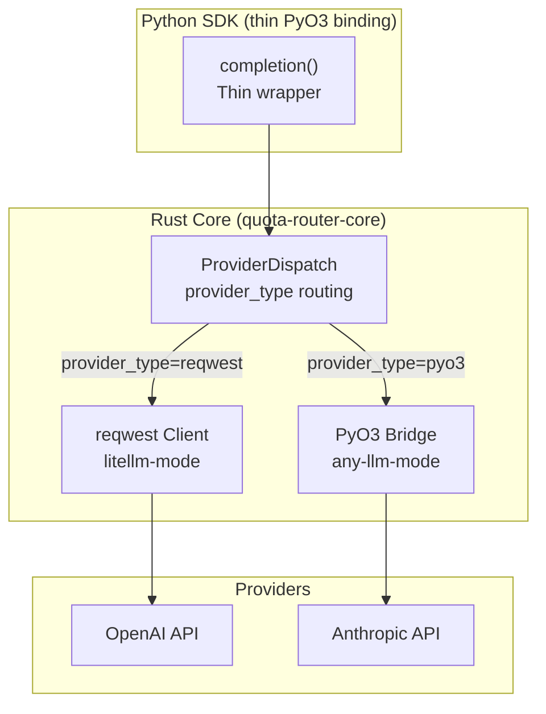

# RFC-0923 (Economics): Dynamic Provider Routing — Phase 2 Unified SDK

## Status

Draft (v1.0 — 2026-04-29)

**ARCHITECTURAL CONSTRAINT: Rust-owns-all-heavy-lifting. ALL heavy lifting (routing, caching, telemetry, concurrency, state management) MUST be in Rust core. Dynamic provider routing is a Rust-core feature that selects between reqwest (litellm-mode) and PyO3 (any-llm-mode) at runtime based on a per-request parameter. The Python SDK is a thin PyO3 binding only — no routing logic in Python.**

## Authors

- Author: @mmacedoeu

## Maintainers

- Maintainer: @mmacedoeu

## Summary

Define Phase 2 dynamic provider routing: a single unified SDK that supports both litellm-mode (reqwest direct HTTP) and any-llm-mode (PyO3 Python SDK) concurrently via a per-request `provider_type` parameter. This replaces the compile-time feature gate with runtime selection.

## Dependencies

**Requires:**

- RFC-0917: Dual-Mode Query Router (Accepted)
- RFC-0921: litellm-mode Provider Integration (reqwest) (Draft)
- RFC-0922: any-llm-mode Provider Integration (PyO3) (Draft)
- RFC-0902: Multi-Provider Routing and Load Balancing (Accepted)
- RFC-0904: Real-Time Cost Tracking (Accepted)

**Optional:**

- RFC-0903: Virtual API Key System (Accepted)
- RFC-0910: Pricing Table Registry (Accepted)

## Why Needed

Phase 1 provides separate builds (litellm-mode, any-llm-mode, full) with compile-time feature gates. This is limiting for users who want:

- **Single deployment** serving both LiteLLM-style and any-llm-style requests
- **Runtime provider selection** — same code path, different provider integration
- **Gradual migration** — switch provider integration without recompiling

Phase 2 provides dynamic routing at runtime: a single SDK binary that routes requests to either reqwest or PyO3 based on a per-request parameter.

## Scope

### In Scope

- Per-request `provider_type` parameter for runtime integration selection
- Unified completion function with provider_type dispatch
- Rust-core router that selects reqwest or PyO3 based on provider_type
- Dynamic loading of Python SDKs (lazy import for any-llm-mode)
- Feature parity between both modes (same routing strategies, budgets, etc.)

### Out of Scope

- Multi-tenancy (separate from provider routing)
- Automatic provider selection based on model name (that's routing strategy)
- Language bindings beyond Python SDK (JS, Go, etc.)

## Specification

### Architecture



### provider_type Parameter

Add `provider_type: Optional[str]` to all completion functions:

```python
def completion(
    model: str,
    messages: List[Dict],
    *,
    provider_type: Optional[str] = None,  # NEW: "reqwest" | "pyo3" | None (auto)
    provider: Optional[str] = None,  # Existing: provider name
    api_key: Optional[str] = None,
    **kwargs,
) -> CompletionResponse:
    """
    Route completion request.

    provider_type controls which integration to use:
    - "reqwest": Direct HTTP via Rust reqwest (litellm-mode style)
    - "pyo3": Python SDK via PyO3 (any-llm-mode style)
    - None: Auto-select based on provider (default)

    When provider_type=None and provider is specified:
    - Anthropic, Google, Mistral → "pyo3" (use official Python SDK)
    - OpenAI (non-Anthropic) → "reqwest" (use direct HTTP)
    """
```

### Auto-Selection Logic

When `provider_type=None`, the dispatcher auto-selects based on provider:

```rust
pub fn select_provider_type(provider: &str, model: &str) -> ProviderType {
    match provider {
        // Use PyO3 for providers with official Python SDKs
        "anthropic" | "google" | "mistral" | "deepinfra" | "groq" => ProviderType::PyO3,
        // Use reqwest for OpenAI-compatible APIs (direct HTTP)
        "openai" | "ollama" | "sambanova" | "azure" => ProviderType::Reqwest,
        // Default to reqwest for unknown providers
        _ => ProviderType::Reqwest,
    }
}
```

### Unified Dispatcher

```rust
pub enum ProviderType {
    Reqwest,
    PyO3,
}

pub struct ProviderDispatcher {
    reqwest_client: reqwest::Client,
    pyo3_bridge: PyO3Bridge,
}

impl ProviderDispatcher {
    pub async fn completion(
        &self,
        provider_type: Option<ProviderType>,
        model: &str,
        messages: &[Message],
        params: &CompletionParams,
    ) -> Result<CompletionResponse, ProviderError> {
        // Auto-select if not specified
        let ptype = provider_type.unwrap_or_else(|| {
            self.select_provider_type(params.provider.as_deref().unwrap_or("openai"), model)
        });

        match ptype {
            ProviderType::Reqwest => {
                self.reqwest_client.completion(model, messages, params).await
            }
            ProviderType::PyO3 => {
                self.pyo3_bridge.completion(model, messages, params).await
            }
        }
    }
}
```

### PyO3 Lazy Loading

In Phase 2 full builds, Python SDKs are only imported when first needed (lazy loading):

```rust
pub struct PyO3Bridge {
    python_sdk_bridge: Option<Py<PyAny>>,  // Lazily initialized
}

impl PyO3Bridge {
    pub async fn completion(&mut self, ...) -> Result<CompletionResponse, ProviderError> {
        // Lazy load Python SDK on first use
        if self.python_sdk_bridge.is_none() {
            self.python_sdk_bridge = Some(self.load_python_sdk_bridge()?);
        }
        // Call Python SDK via PyO3
        self.call_python_sdk(self.python_sdk_bridge.as_ref().unwrap(), ...).await
    }

    fn load_python_sdk_bridge(&self) -> PyResult<Py<PyAny>> {
        Python::with_gil(|py| {
            Ok(py.import("quota_router_python_sdk_bridge")?.into())
        })
    }
}
```

### RustRouterHandle for Python SDK Delegation

Phase 2 introduces `RustRouterHandle` — a PyO3-exposed handle to Rust-core routing for Python SDK users:

```python
class RustRouterHandle:
    """PyO3 handle to Rust-core router. Replaces Python Router in Phase 2."""

    def __init__(self, config: Dict, routing_strategy: str = "simple-shuffle"):
        """Initialize Rust-core router via PyO3."""
        ...

    async def acompletion(
        self,
        model: str,
        messages: List[Dict],
        **kwargs
    ) -> CompletionResponse:
        """Route via Rust core — all routing, caching, telemetry in Rust."""
        ...

    def _select_deployment(self, model: str) -> int:
        """Rust-core deployment selection."""
        ...

    def _record_spend(self, idx: int, tokens: int) -> None:
        """Rust-core spend recording."""
        ...
```

This replaces the Phase 1 Python Router class. Rust core handles ALL routing, state, caching, telemetry.

### Feature Parity Matrix

Both provider_type modes must have feature parity:

| Feature | reqwest | pyo3 |
|---------|---------|------|
| Routing strategies (RFC-0902) | ✅ | ✅ |
| Budget enforcement (RFC-0904) | ✅ | ✅ |
| Deterministic quota (RFC-0909) | ✅ | ✅ |
| Pricing table (RFC-0910) | ✅ | ✅ |
| Rate limiting (RFC-0902) | ✅ | ✅ |
| Prometheus metrics | ✅ | ✅ |
| OCTO-W balance (RFC-0900) | ✅ | ✅ |
| Virtual API keys (RFC-0903) | ✅ (HTTP only) | ✅ (HTTP only) |
| stoolap persistence | ✅ | ✅ |

## Version History

| Version | Date       | Changes |
| ------- | ---------- | ------- |
| 1.0     | 2026-04-29 | Initial draft |

## Related RFCs

- RFC-0917: Dual-Mode Query Router
- RFC-0921: litellm-mode Provider Integration (reqwest)
- RFC-0922: any-llm-mode Provider Integration (PyO3)
- RFC-0902: Multi-Provider Routing and Load Balancing

---

**Submission Date:** 2026-04-29
**Last Updated:** 2026-04-29
