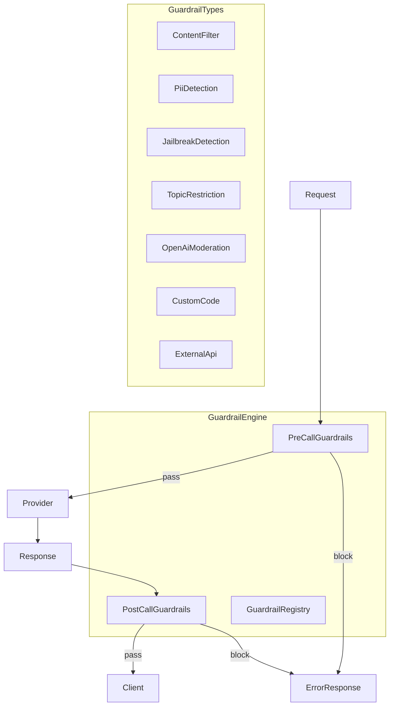

# RFC-0946 (Economics): Guardrails Framework

## Status

Draft

## Authors

- Author: @cipherocto

## Maintainers

- Maintainer: @cipherocto

## Summary

Define a guardrails framework for content filtering, safety checks, and policy enforcement on AI API requests and responses. Provides a plugin-based architecture with pre-call and post-call hooks, matching LiteLLM's guardrail interface for drop-in compatibility.

## Dependencies

**Requires:**

- RFC-0936 (Economics): Pre-call Checks
- RFC-0903 (Economics): Virtual API Key System

**Optional:**

- RFC-0905 (Economics): Observability and Logging (for guardrail event logging)
- RFC-0934 (Economics): Budget Management & Spend Tracking (for cost-aware guardrails)

## Design Goals

| Goal | Target | Metric |
|------|--------|--------|
| G1 | <5ms overhead | Per-guardrail latency (built-in) |
| G2 | <50ms overhead | Per-guardrail latency (external API) |
| G3 | Zero false positives on clean content | Accuracy |
| G4 | Plugin architecture | New guardrail = new impl, no core changes |

## Motivation

LiteLLM provides 30+ guardrail integrations (Aporia, Bedrock, Lakera, Presidio, etc.) with a unified config interface. quota-router has no guardrail support — requests pass through unchecked.

**LiteLLM guardrail model:**
- `guardrails` config block in proxy config
- Each guardrail has: `guardrail_name`, `guardrail` (type), `mode` (pre_call/post_call/during_call/logging_only), `litellm_params`
- Supported types: aporia, bedrock, lakera, presidio, openai_moderation, custom_code, and 25+ more
- Guardrails run as hooks in the request/response pipeline

**quota-router needs parity** for enterprise adoption: content filtering, PII detection, jailbreak detection, topic restriction, and custom guardrails.

## Specification

### 1. Architecture



### 2. Core Types

```rust
// config.rs

/// Guardrail event hook — when to run the guardrail
#[derive(Debug, Clone, Serialize, Deserialize, PartialEq)]
#[serde(rename_all = "snake_case")]
pub enum GuardrailMode {
    PreCall,      // Before sending to provider
    PostCall,     // After receiving response
    DuringCall,   // During streaming (for chunk-level checks)
    LoggingOnly,  // Log violations but don't block
}

/// Action to take when guardrail detects a violation
#[derive(Debug, Clone, Serialize, Deserialize, PartialEq)]
#[serde(rename_all = "snake_case")]
pub enum GuardrailAction {
    Block,     // Reject request with error
    Warn,      // Log warning, allow through
    Log,       // Silent logging only
    Mask,      // Replace sensitive content with redaction markers
    Transform, // Apply custom transformation
}

/// Top-level guardrail configuration (matches LiteLLM format)
#[derive(Debug, Clone, Serialize, Deserialize)]
pub struct GuardrailConfig {
    pub guardrail_name: String,
    pub guardrail: String,  // Guardrail type: "content_filter", "pii_detection", etc.
    pub mode: GuardrailMode,
    #[serde(default)]
    pub default_on: bool,
    #[serde(default)]
    pub logging_only: Option<bool>,
    #[serde(default)]
    pub enabled_roles: Option<Vec<String>>,  // "system", "assistant", "user"
    #[serde(flatten)]
    pub params: GuardrailParams,
}

/// Type-specific guardrail parameters
#[derive(Debug, Clone, Serialize, Deserialize)]
#[serde(tag = "guardrail", rename_all = "snake_case")]
pub enum GuardrailParams {
    ContentFilter(ContentFilterParams),
    PiiDetection(PiiDetectionParams),
    JailbreakDetection(JailbreakDetectionParams),
    TopicRestriction(TopicRestrictionParams),
    OpenAiModeration(OpenAiModerationParams),
    CustomCode(CustomCodeParams),
    ExternalApi(ExternalApiParams),
}

/// Content filter: keyword blocking, regex patterns, categories
#[derive(Debug, Clone, Serialize, Deserialize)]
pub struct ContentFilterParams {
    #[serde(default)]
    pub blocked_words: Option<Vec<BlockedWord>>,
    #[serde(default)]
    pub patterns: Option<Vec<ContentPattern>>,
    #[serde(default)]
    pub categories: Option<Vec<String>>,  // "harmful", "bias", "sexual", "violence"
    #[serde(default)]
    pub severity_threshold: Option<String>,  // "high", "medium", "low"
}

#[derive(Debug, Clone, Serialize, Deserialize)]
pub struct BlockedWord {
    pub keyword: String,
    pub action: GuardrailAction,
    #[serde(default)]
    pub description: Option<String>,
}

#[derive(Debug, Clone, Serialize, Deserialize)]
pub struct ContentPattern {
    pub pattern_type: String,  // "prebuilt" or "regex"
    #[serde(default)]
    pub pattern_name: Option<String>,
    #[serde(default)]
    pub pattern: Option<String>,  // regex or prebuilt name
    pub action: GuardrailAction,
}

/// PII detection: entity types, actions
#[derive(Debug, Clone, Serialize, Deserialize)]
pub struct PiiDetectionParams {
    #[serde(default)]
    pub entities: Option<Vec<String>>,  // "CREDIT_CARD", "EMAIL_ADDRESS", "US_SSN", etc.
    #[serde(default)]
    pub action: Option<GuardrailAction>,  // Block or Mask
    #[serde(default)]
    pub categories: Option<Vec<String>>,  // "General", "Finance", "USA", "UK", etc.
    #[serde(default)]
    pub score_threshold: Option<f64>,
}

/// Jailbreak detection: prompt injection, role manipulation
#[derive(Debug, Clone, Serialize, Deserialize)]
pub struct JailbreakDetectionParams {
    #[serde(default)]
    pub threshold: Option<f64>,  // 0.0-1.0 confidence threshold
    #[serde(default)]
    pub action: Option<GuardrailAction>,
}

/// Topic restriction: allowed/blocked topics
#[derive(Debug, Clone, Serialize, Deserialize)]
pub struct TopicRestrictionParams {
    #[serde(default)]
    pub allowed_topics: Option<Vec<String>>,
    #[serde(default)]
    pub blocked_topics: Option<Vec<String>>,
    #[serde(default)]
    pub action: Option<GuardrailAction>,
}

/// OpenAI Moderation API integration
#[derive(Debug, Clone, Serialize, Deserialize)]
pub struct OpenAiModerationParams {
    #[serde(default)]
    pub api_base: Option<String>,
    #[serde(default)]
    pub api_key: Option<String>,
    #[serde(default)]
    pub model: Option<String>,  // "text-moderation-latest"
    #[serde(default)]
    pub categories: Option<Vec<String>>,
}

/// Custom code guardrail (Python-like eval)
#[derive(Debug, Clone, Serialize, Deserialize)]
pub struct CustomCodeParams {
    pub code: String,  // Must define `apply_guardrail(request, response) -> GuardrailResult`
}

/// External API guardrail (generic webhook)
#[derive(Debug, Clone, Serialize, Deserialize)]
pub struct ExternalApiParams {
    pub api_url: String,
    #[serde(default)]
    pub api_key: Option<String>,
    #[serde(default)]
    pub timeout_ms: Option<u64>,
    #[serde(default)]
    pub headers: Option<HashMap<String, String>>,
    #[serde(default)]
    pub unreachable_fallback: Option<String>,  // "fail_closed" or "fail_open"
}
```

### 3. Guardrail Trait

```rust
// guardrails/mod.rs

use async_trait::async_trait;

/// Result of a guardrail check
#[derive(Debug, Clone)]
pub enum GuardrailResult {
    Pass,
    Block { reason: String, guardrail_name: String },
    Mask { original: String, masked: String, guardrail_name: String },
    Warn { reason: String, guardrail_name: String },
}

/// Guardrail trait — all guardrails implement this
#[async_trait]
pub trait Guardrail: Send + Sync {
    /// Guardrail name (for logging)
    fn name(&self) -> &str;

    /// Guardrail mode
    fn mode(&self) -> GuardrailMode;

    /// Check request (pre-call)
    async fn check_request(&self, request: &CompletionRequest) -> GuardrailResult {
        GuardrailResult::Pass  // Default: no-op
    }

    /// Check response (post-call)
    async fn check_response(&self, request: &CompletionRequest, response: &CompletionResponse) -> GuardrailResult {
        GuardrailResult::Pass  // Default: no-op
    }

    /// Check streaming chunk (during-call)
    async fn check_chunk(&self, request: &CompletionRequest, chunk: &str) -> GuardrailResult {
        GuardrailResult::Pass  // Default: no-op
    }
}
```

### 4. Guardrail Registry

```rust
// guardrails/registry.rs

use std::collections::HashMap;
use std::sync::{Arc, LazyLock, RwLock};

pub type GuardrailFactory = fn(&GuardrailParams) -> Result<Box<dyn Guardrail>, GuardrailError>;

static GUARDRAIL_REGISTRY: LazyLock<RwLock<HashMap<String, GuardrailFactory>>> =
    LazyLock::new(|| RwLock::new(HashMap::new()));

pub fn init_guardrails() {
    let mut registry = GUARDRAIL_REGISTRY.write().unwrap();
    registry.insert("content_filter".into(), content_filter_factory);
    registry.insert("pii_detection".into(), pii_detection_factory);
    registry.insert("jailbreak_detection".into(), jailbreak_detection_factory);
    registry.insert("topic_restriction".into(), topic_restriction_factory);
    registry.insert("openai_moderation".into(), openai_moderation_factory);
    registry.insert("custom_code".into(), custom_code_factory);
    registry.insert("external_api".into(), external_api_factory);
}

pub fn create_guardrail(config: &GuardrailConfig) -> Result<Box<dyn Guardrail>, GuardrailError> {
    let registry = GUARDRAIL_REGISTRY.read().unwrap();
    let factory = registry.get(&config.guardrail)
        .ok_or_else(|| GuardrailError::UnknownType(config.guardrail.clone()))?;
    factory(&config.params)
}
```

### 5. Guardrail Engine

```rust
// guardrails/engine.rs

pub struct GuardrailEngine {
    pre_call: Vec<Box<dyn Guardrail>>,
    post_call: Vec<Box<dyn Guardrail>>,
    during_call: Vec<Box<dyn Guardrail>>,
    logging_only: Vec<Box<dyn Guardrail>>,
}

impl GuardrailEngine {
    pub fn from_configs(configs: &[GuardrailConfig]) -> Result<Self, GuardrailError> {
        let mut engine = Self {
            pre_call: Vec::new(),
            post_call: Vec::new(),
            during_call: Vec::new(),
            logging_only: Vec::new(),
        };

        for config in configs {
            if !config.default_on {
                continue;  // Skip disabled guardrails
            }
            let guardrail = create_guardrail(config)?;
            match config.mode {
                GuardrailMode::PreCall => engine.pre_call.push(guardrail),
                GuardrailMode::PostCall => engine.post_call.push(guardrail),
                GuardrailMode::DuringCall => engine.during_call.push(guardrail),
                GuardrailMode::LoggingOnly => engine.logging_only.push(guardrail),
            }
        }

        Ok(engine)
    }

    /// Run pre-call guardrails. Returns Ok(()) if all pass, Err if blocked.
    pub async fn check_request(&self, request: &CompletionRequest) -> Result<(), GuardrailError> {
        for guardrail in &self.pre_call {
            match guardrail.check_request(request).await {
                GuardrailResult::Pass => continue,
                GuardrailResult::Block { reason, guardrail_name } => {
                    return Err(GuardrailError::Blocked {
                        guardrail: guardrail_name,
                        reason,
                    });
                }
                GuardrailResult::Mask { original, masked, guardrail_name } => {
                    // Apply masking to request (mutate in place)
                    // This requires request to be mutable
                }
                GuardrailResult::Warn { reason, guardrail_name } => {
                    warn!("Guardrail warning: {} - {}", guardrail_name, reason);
                }
            }
        }
        Ok(())
    }

    /// Run post-call guardrails. Returns Ok(()) if all pass, Err if blocked.
    pub async fn check_response(
        &self,
        request: &CompletionRequest,
        response: &CompletionResponse,
    ) -> Result<(), GuardrailError> {
        for guardrail in &self.post_call {
            match guardrail.check_response(request, response).await {
                GuardrailResult::Pass => continue,
                GuardrailResult::Block { reason, guardrail_name } => {
                    return Err(GuardrailError::Blocked {
                        guardrail: guardrail_name,
                        reason,
                    });
                }
                GuardrailResult::Warn { reason, guardrail_name } => {
                    warn!("Guardrail warning: {} - {}", guardrail_name, reason);
                }
                _ => {}
            }
        }
        Ok(())
    }
}
```

### 6. Built-in Guardrails

#### Content Filter

```rust
// guardrails/content_filter.rs

pub struct ContentFilterGuardrail {
    name: String,
    blocked_words: Vec<BlockedWord>,
    patterns: Vec<CompiledPattern>,
    categories: Vec<String>,
}

#[async_trait]
impl Guardrail for ContentFilterGuardrail {
    fn name(&self) -> &str { &self.name }
    fn mode(&self) -> GuardrailMode { GuardrailMode::PreCall }

    async fn check_request(&self, request: &CompletionRequest) -> GuardrailResult {
        let content = request.messages.iter()
            .map(|m| m.content.as_str())
            .collect::<Vec<_>>()
            .join(" ");

        // Check blocked words
        for word in &self.blocked_words {
            if content.to_lowercase().contains(&word.keyword.to_lowercase()) {
                return match word.action {
                    GuardrailAction::Block => GuardrailResult::Block {
                        reason: format!("Blocked word detected: {}", word.keyword),
                        guardrail_name: self.name.clone(),
                    },
                    GuardrailAction::Mask => GuardrailResult::Mask {
                        original: content.clone(),
                        masked: content.replace(&word.keyword, "[REDACTED]"),
                        guardrail_name: self.name.clone(),
                    },
                    _ => GuardrailResult::Warn {
                        reason: format!("Blocked word detected: {}", word.keyword),
                        guardrail_name: self.name.clone(),
                    },
                };
            }
        }

        // Check patterns
        for pattern in &self.patterns {
            if pattern.regex.is_match(&content) {
                return match pattern.action {
                    GuardrailAction::Block => GuardrailResult::Block {
                        reason: format!("Pattern matched: {}", pattern.name),
                        guardrail_name: self.name.clone(),
                    },
                    GuardrailAction::Mask => GuardrailResult::Mask {
                        original: content.clone(),
                        masked: pattern.regex.replace_all(&content, "[REDACTED]").to_string(),
                        guardrail_name: self.name.clone(),
                    },
                    _ => GuardrailResult::Warn {
                        reason: format!("Pattern matched: {}", pattern.name),
                        guardrail_name: self.name.clone(),
                    },
                };
            }
        }

        GuardrailResult::Pass
    }
}
```

#### PII Detection

```rust
// guardrails/pii_detection.rs

pub struct PiiDetectionGuardrail {
    name: String,
    entities: Vec<String>,
    action: GuardrailAction,
    score_threshold: f64,
}

#[async_trait]
impl Guardrail for PiiDetectionGuardrail {
    fn name(&self) -> &str { &self.name }
    fn mode(&self) -> GuardrailMode { GuardrailMode::PreCall }

    async fn check_request(&self, request: &CompletionRequest) -> GuardrailResult {
        // Use regex-based PII detection (no external dependency)
        // Patterns for: EMAIL, PHONE, CREDIT_CARD, SSN, IP_ADDRESS
        let content = request.messages.iter()
            .map(|m| m.content.as_str())
            .collect::<Vec<_>>()
            .join(" ");

        let detections = detect_pii(&content, &self.entities, self.score_threshold);

        if detections.is_empty() {
            return GuardrailResult::Pass;
        }

        match self.action {
            GuardrailAction::Block => GuardrailResult::Block {
                reason: format!("PII detected: {:?}", detections.iter().map(|d| &d.entity_type).collect::<Vec<_>>()),
                guardrail_name: self.name.clone(),
            },
            GuardrailAction::Mask => {
                let mut masked = content.clone();
                for detection in &detections {
                    masked = masked.replace(&detection.text, &format!("[{}]", detection.entity_type));
                }
                GuardrailResult::Mask {
                    original: content,
                    masked,
                    guardrail_name: self.name.clone(),
                }
            }
            _ => GuardrailResult::Warn {
                reason: format!("PII detected: {:?}", detections),
                guardrail_name: self.name.clone(),
            },
        }
    }
}
```

#### External API Guardrail

```rust
// guardrails/external_api.rs

pub struct ExternalApiGuardrail {
    name: String,
    api_url: String,
    api_key: Option<String>,
    client: reqwest::Client,
    timeout: Duration,
    unreachable_fallback: String,  // "fail_closed" or "fail_open"
}

#[async_trait]
impl Guardrail for ExternalApiGuardrail {
    fn name(&self) -> &str { &self.name }
    fn mode(&self) -> GuardrailMode { GuardrailMode::PreCall }

    async fn check_request(&self, request: &CompletionRequest) -> GuardrailResult {
        let body = serde_json::json!({
            "request": {
                "messages": request.messages,
                "model": request.model,
            }
        });

        let mut req = self.client.post(&self.api_url)
            .timeout(self.timeout)
            .json(&body);

        if let Some(ref key) = self.api_key {
            req = req.bearer_auth(key);
        }

        match req.send().await {
            Ok(resp) if resp.status().is_success() => {
                let result: ExternalApiResult = resp.json().await.unwrap_or(ExternalApiResult { action: "pass".into(), reason: None });
                match result.action.as_str() {
                    "block" => GuardrailResult::Block {
                        reason: result.reason.unwrap_or_else(|| "External API blocked".into()),
                        guardrail_name: self.name.clone(),
                    },
                    "mask" => GuardrailResult::Warn {
                        reason: result.reason.unwrap_or_else(|| "External API masked".into()),
                        guardrail_name: self.name.clone(),
                    },
                    _ => GuardrailResult::Pass,
                }
            }
            Ok(resp) => {
                warn!("External guardrail API error: {}", resp.status());
                match self.unreachable_fallback.as_str() {
                    "fail_open" => GuardrailResult::Pass,
                    _ => GuardrailResult::Block {
                        reason: format!("External guardrail API error: {}", resp.status()),
                        guardrail_name: self.name.clone(),
                    },
                }
            }
            Err(e) => {
                error!("External guardrail unreachable: {}", e);
                match self.unreachable_fallback.as_str() {
                    "fail_open" => GuardrailResult::Pass,
                    _ => GuardrailResult::Block {
                        reason: format!("External guardrail unreachable: {}", e),
                        guardrail_name: self.name.clone(),
                    },
                }
            }
        }
    }
}
```

### 7. Proxy Integration

```rust
// proxy.rs

impl ProxyState {
    /// Run guardrails before forwarding to provider
    pub async fn run_pre_call_guardrails(
        &self,
        request: &CompletionRequest,
    ) -> Result<(), ProxyError> {
        if let Some(ref engine) = self.guardrail_engine {
            engine.check_request(request).await
                .map_err(|e| match e {
                    GuardrailError::Blocked { guardrail, reason } => {
                        ProxyError::GuardrailBlocked { guardrail, reason }
                    }
                    _ => ProxyError::Internal(e.to_string()),
                })?;
        }
        Ok(())
    }

    /// Run guardrails after receiving response
    pub async fn run_post_call_guardrails(
        &self,
        request: &CompletionRequest,
        response: &CompletionResponse,
    ) -> Result<(), ProxyError> {
        if let Some(ref engine) = self.guardrail_engine {
            engine.check_response(request, response).await
                .map_err(|e| match e {
                    GuardrailError::Blocked { guardrail, reason } => {
                        ProxyError::GuardrailBlocked { guardrail, reason }
                    }
                    _ => ProxyError::Internal(e.to_string()),
                })?;
        }
        Ok(())
    }
}
```

### 8. Configuration

```yaml
guardrails:
  - guardrail_name: "content-filter-default"
    guardrail: "content_filter"
    mode: "pre_call"
    default_on: true
    blocked_words:
      - keyword: "hack"
        action: "block"
        description: "Block hacking-related content"
      - keyword: "exploit"
        action: "warn"
    patterns:
      - pattern_type: "prebuilt"
        pattern_name: "credit_card"
        action: "mask"
    categories:
      - "harmful"
      - "violence"
    severity_threshold: "medium"

  - guardrail_name: "pii-detection"
    guardrail: "pii_detection"
    mode: "pre_call"
    default_on: true
    entities:
      - "CREDIT_CARD"
      - "EMAIL_ADDRESS"
      - "US_SSN"
    action: "mask"
    categories:
      - "General"
      - "USA"

  - guardrail_name: "jailbreak-detection"
    guardrail: "jailbreak_detection"
    mode: "pre_call"
    default_on: true
    threshold: 0.8
    action: "block"

  - guardrail_name: "custom-content-policy"
    guardrail: "custom_code"
    mode: "pre_call"
    default_on: true
    code: |
      def apply_guardrail(request, response):
          # Custom logic here
          for msg in request.messages:
              if "forbidden_topic" in msg.content.lower():
                  return {"action": "block", "reason": "Forbidden topic detected"}
          return {"action": "pass"}

  - guardrail_name: "external-safety-api"
    guardrail: "external_api"
    mode: "pre_call"
    default_on: true
    api_url: "https://safety-api.example.com/check"
    api_key: "${SAFETY_API_KEY}"
    timeout_ms: 5000
    unreachable_fallback: "fail_closed"
```

### 9. Error Handling

```rust
#[derive(Debug, thiserror::Error)]
pub enum GuardrailError {
    #[error("Guardrail '{guardrail}' blocked request: {reason}")]
    Blocked { guardrail: String, reason: String },

    #[error("Unknown guardrail type: {0}")]
    UnknownType(String),

    #[error("Guardrail configuration error: {0}")]
    Config(String),

    #[error("External guardrail API error: {0}")]
    ExternalApi(String),

    #[error("Guardrail timeout: {0}")]
    Timeout(String),
}
```

## Performance Targets

| Metric | Target | Notes |
|--------|--------|-------|
| Latency (built-in) | <5ms | Per guardrail, regex-based |
| Latency (external API) | <50ms | Per guardrail, HTTP call |
| Latency (total pipeline) | <20ms | 4 built-in guardrails |
| Throughput | >10k/s | Single node, all guardrails enabled |
| Memory | <10MB | Guardrail engine + compiled patterns |

## Security Considerations

| Threat | Impact | Mitigation |
|--------|--------|------------|
| Guardrail bypass via encoding | High | Normalize Unicode, decode base64 before checks |
| Regex DoS (ReDoS) | Medium | Compile patterns with timeout, limit complexity |
| External API manipulation | High | Validate responses, use fail_closed default |
| PII leakage in logs | High | Mask PII in guardrail log output |
| Custom code injection | Critical | Sandbox custom code execution (no file/network access) |

## Adversarial Review

| Threat | Impact | Mitigation |
|--------|--------|------------|
| Unicode bypass | High | Normalize to NFC before matching |
| Homoglyph attacks | Medium | Strip diacritics, normalize visually similar chars |
| Split-message bypass | Medium | Concatenate all messages before checking |
| Role manipulation | Medium | Check all enabled_roles, not just "user" |
| Guardrail ordering attack | Low | Document that order matters, first-match wins |

## Economic Analysis

Guardrails add value for enterprise customers:
- **Compliance:** PII detection for GDPR/HIPAA
- **Safety:** Content filtering for responsible AI
- **Cost control:** Topic restriction to prevent misuse
- **Audit:** Logging-only mode for monitoring

External API guardrails create a marketplace opportunity (RFC-0900): third-party guardrail providers can offer services via the guardrail plugin interface.

## Compatibility

**LiteLLM compatibility:** Configuration format matches LiteLLM's `guardrails` config block. Users can migrate by copying their guardrail config. Supported types map to LiteLLM's `SupportedGuardrailIntegrations`:

| quota-router | LiteLLM | Notes |
|--------------|---------|-------|
| content_filter | litellm_content_filter | Built-in, no external deps |
| pii_detection | presidio | Simplified Presidio-compatible interface |
| jailbreak_detection | lakera | Regex-based, no external API |
| topic_restriction | custom_code | Configurable topic lists |
| openai_moderation | openai_moderation | Direct API integration |
| custom_code | custom_code | Same interface |
| external_api | generic_guardrail_api | Webhook-based |

## Test Vectors

```rust
#[cfg(test)]
mod tests {
    #[test]
    fn test_content_filter_blocks_keyword() {
        let config = GuardrailConfig {
            guardrail_name: "test".into(),
            guardrail: "content_filter".into(),
            mode: GuardrailMode::PreCall,
            default_on: true,
            params: GuardrailParams::ContentFilter(ContentFilterParams {
                blocked_words: Some(vec![BlockedWord {
                    keyword: "hack".into(),
                    action: GuardrailAction::Block,
                    description: None,
                }]),
                patterns: None,
                categories: None,
                severity_threshold: None,
            }),
        };

        let engine = GuardrailEngine::from_configs(&[config]).unwrap();
        let request = make_request("How to hack a system");

        assert!(engine.check_request(&request).await.is_err());
    }

    #[test]
    fn test_pii_detection_masks_email() {
        let config = pii_config(vec!["EMAIL_ADDRESS"], GuardrailAction::Mask);
        let engine = GuardrailEngine::from_configs(&[config]).unwrap();
        let request = make_request("Contact me at user@example.com");

        // Should mask the email
        let result = engine.check_request(&request).await;
        // Verify masked content
    }

    #[test]
    fn test_guardrail_passes_clean_content() {
        let engine = default_engine();
        let request = make_request("What is the capital of France?");

        assert!(engine.check_request(&request).await.is_ok());
    }
}
```

## Alternatives Considered

| Approach | Pros | Cons |
|----------|------|------|
| Python-only guardrails (via PyO3) | Access to Presidio, Lakera SDKs | Adds Python dependency for all users |
| External-only (all via API) | Simple, no built-in logic | Latency, availability, cost |
| Rust-only built-in | Fast, no external deps | Can't match all LiteLLM integrations |
| **Hybrid (chosen)** | Built-in + external API plugins | More complex, but best of both worlds |

## Implementation Phases

### Phase 1: Core Framework

- [ ] GuardrailConfig, GuardrailParams types in config.rs
- [ ] Guardrail trait in guardrails/mod.rs
- [ ] GuardrailRegistry with LazyLock pattern
- [ ] GuardrailEngine with pre/post/during-call pipelines
- [ ] Proxy integration (run_pre_call_guardrails, run_post_call_guardrails)

### Phase 2: Built-in Guardrails

- [ ] ContentFilterGuardrail (keywords, patterns, categories)
- [ ] PiiDetectionGuardrail (regex-based, no external deps)
- [ ] JailbreakDetectionGuardrail (pattern-based detection)
- [ ] TopicRestrictionGuardrail (allowed/blocked topics)

### Phase 3: External Integrations

- [ ] ExternalApiGuardrail (generic webhook)
- [ ] OpenAiModerationGuardrail (direct API)
- [ ] CustomCodeGuardrail (sandboxed eval)

### Phase 4: Advanced

- [ ] During-call (streaming) guardrails
- [ ] Guardrail metrics (RFC-0905 integration)
- [ ] Per-key guardrail overrides (RFC-0903 integration)
- [ ] Guardrail result caching (same input = same result)

## Key Files to Modify

| File | Change |
|------|--------|
| `crates/quota-router-core/src/config.rs` | Add GuardrailConfig, GuardrailParams, all param types |
| `crates/quota-router-core/src/guardrails/mod.rs` | New — Guardrail trait, GuardrailResult, GuardrailError |
| `crates/quota-router-core/src/guardrails/registry.rs` | New — GuardrailRegistry, init_guardrails() |
| `crates/quota-router-core/src/guardrails/engine.rs` | New — GuardrailEngine |
| `crates/quota-router-core/src/guardrails/content_filter.rs` | New — ContentFilterGuardrail |
| `crates/quota-router-core/src/guardrails/pii_detection.rs` | New — PiiDetectionGuardrail |
| `crates/quota-router-core/src/guardrails/jailbreak_detection.rs` | New — JailbreakDetectionGuardrail |
| `crates/quota-router-core/src/guardrails/external_api.rs` | New — ExternalApiGuardrail |
| `crates/quota-router-core/src/proxy.rs` | Add guardrail calls in request/response pipeline |
| `crates/quota-router-core/src/lib.rs` | Export guardrails module |

## Future Work

- F1: Presidio integration (Python-based PII detection via PyO3)
- F2: Lakera integration (external API for jailbreak detection)
- F3: Bedrock Guardrails integration
- F4: Aporia integration
- F5: Guardrail marketplace (RFC-0900 integration)
- F6: Guardrail analytics dashboard
- F7: Per-team guardrail policies (RFC-0934 integration)

## Rationale

**Why hybrid (built-in + external)?**
- Built-in guardrails: zero latency, no external deps, works offline
- External API guardrails: access to sophisticated models (Lakera, Presidio)
- Matches LiteLLM's architecture: some guardrails are built-in, most are external integrations

**Why trait-based registry?**
- Same pattern as native_http and py_bridge (proven in 0917-f)
- New guardrails = new impl, no core changes
- Testable in isolation

## Version History

| Version | Date | Changes |
|---------|------|---------|
| v1 | 2026-05-17 | Initial draft |

## Related RFCs

- RFC-0936 (Economics): Pre-call Checks
- RFC-0903 (Economics): Virtual API Key System
- RFC-0905 (Economics): Observability and Logging
- RFC-0900 (Economics): AI Quota Marketplace Protocol

## Related Use Cases

- [Enhanced Quota Router Gateway](../../docs/use-cases/enhanced-quota-router-gateway.md)

## Appendices

### A. LiteLLM Guardrail Integrations Reference

Full list of LiteLLM's `SupportedGuardrailIntegrations`:

aporia, bedrock, dynamoai, guardrails_ai, lakera, lakera_v2, presidio, hide-secrets, hiddenlayer, aim, pangea, crowdstrike_aidr, lasso, pillar, grayswan, panw_prisma_airs, azure/prompt_shield, azure/text_moderations, model_armor, openai_moderation, noma, noma_v2, tool_permission, zscaler_ai_guard, javelin, enkryptai, ibm_guardrails, litellm_content_filter, mcp_security, onyx, promptguard, prompt_security, generic_guardrail_api, qualifire, custom_code, semantic_guard, mcp_end_user_permission, block_code_execution, akto, mcp_jwt_signer, llm_as_a_judge

### B. PII Entity Types Reference

Full list of supported PII entity types (matching LiteLLM's Presidio integration):

**General:** CREDIT_CARD, CRYPTO, DATE_TIME, EMAIL_ADDRESS, IBAN_CODE, IP_ADDRESS, NRP, LOCATION, PERSON, PHONE_NUMBER, MEDICAL_LICENSE, URL

**USA:** US_BANK_NUMBER, US_DRIVER_LICENSE, US_ITIN, US_PASSPORT, US_SSN

**UK:** UK_NHS, UK_NINO

**International:** ES_NIF, ES_NIE, IT_FISCAL_CODE, IT_DRIVER_LICENSE, IT_VAT_CODE, IT_PASSPORT, IT_IDENTITY_CARD, PL_PESEL, SG_NRIC_FIN, SG_UEN, AU_ABN, AU_ACN, AU_TFN, AU_MEDICARE, IN_PAN, IN_AADHAAR, IN_VEHICLE_REGISTRATION, IN_VOTER, IN_PASSPORT, FI_PERSONAL_IDENTITY_CODE
