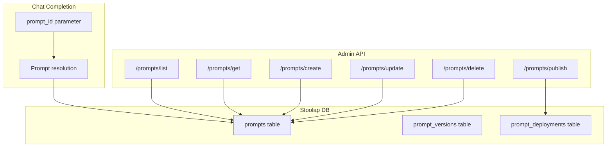

# RFC-0948 (Economics): Prompt Management System

## Status

Draft

## Authors

- Author: @cipherocto

## Maintainers

- Maintainer: @cipherocto

## Summary

Define a prompt management system for storing, versioning, and deploying prompt templates. Enables enterprise users to manage prompts centrally, track versions, and integrate with chat completions via `prompt_id` parameter. Provides LiteLLM-compatible prompt management interface for drop-in replacement compatibility.

## Dependencies

**Requires:**

- RFC-0914 (Economics): Stoolap-Only Persistence Layer
- RFC-0903 (Economics): Virtual API Key System (for prompt-key association)

**Optional:**

- RFC-0904 (Economics): Real-Time Cost Tracking (for prompt-level spend)
- RFC-0905 (Economics): Observability and Logging (for prompt usage metrics)

## Design Goals

| Goal | Target | Metric |
|------|--------|--------|
| G1 | <5ms | Prompt retrieval latency |
| G2 | >1000 | Prompts per workspace |
| G3 | <1s | Prompt version rollback |
| G4 | 100% | LiteLLM API compatibility |

## Motivation

### Problem 1: No Centralized Prompt Management

Enterprise users managing AI applications need centralized prompt storage. Currently, prompts are hardcoded in application code or stored in external systems (Git, databases). This creates:

- Version drift across environments
- No audit trail for prompt changes
- Difficult A/B testing of prompt variations
- No integration with cost tracking per prompt

### Problem 2: LiteLLM Parity

LiteLLM provides prompt template management via its SDK. For quota-router to be a drop-in replacement, it must offer equivalent functionality:

- `litellm.prompt_management.create_prompt()`
- `litellm.prompt_management.get_prompt()`
- `litellm.prompt_management.list_prompts()`

### Problem 3: Prompt-Provider Coupling

Different providers may require different prompt formats (system messages, function calling syntax). A prompt management system can abstract these differences, enabling provider-agnostic prompt definitions.

## Specification

### System Architecture



### Data Structures

#### Prompt

```rust
/// Stored prompt template
struct Prompt {
    /// Unique prompt identifier (UUID)
    id: Uuid,
    /// Human-readable prompt name (unique per workspace)
    name: String,
    /// Optional description
    description: Option<String>,
    /// Current production version
    current_version: SemVer,
    /// Associated virtual key ID (None = global)
    key_id: Option<Uuid>,
    /// Creation timestamp
    created_at: DateTime<Utc>,
    /// Last update timestamp
    updated_at: DateTime<Utc>,
    /// Tags for organization
    tags: Vec<String>,
}
```

#### PromptVersion

```rust
/// Versioned prompt template
struct PromptVersion {
    /// Version identifier (major.minor.patch)
    version: SemVer,
    /// Parent prompt ID
    prompt_id: Uuid,
    /// Template content with variable placeholders
    template: String,
    /// Template variables (name, type, default, required)
    variables: Vec<TemplateVariable>,
    /// Provider-specific overrides
    provider_overrides: HashMap<String, ProviderPromptOverride>,
    /// Whether this version is published
    published: bool,
    /// Version creation timestamp
    created_at: DateTime<Utc>,
}
```

#### TemplateVariable

```rust
/// Variable in a prompt template
struct TemplateVariable {
    /// Variable name (alphanumeric + underscore)
    name: String,
    /// Variable type
    var_type: VariableType,
    /// Default value (if optional)
    default: Option<String>,
    /// Whether this variable is required
    required: bool,
    /// Description for documentation
    description: Option<String>,
}

enum VariableType {
    String,
    Number,
    Boolean,
    Json,
}
```

#### ProviderPromptOverride

```rust
/// Provider-specific prompt formatting
struct ProviderPromptOverride {
    /// How to format system messages
    system_format: Option<SystemFormat>,
    /// Custom function calling syntax
    function_format: Option<FunctionFormat>,
    /// Max tokens override for this provider
    max_tokens_override: Option<u32>,
}
```

### Template Syntax

Templates use double-brace syntax for variable substitution:

```text
You are a {{role}} assistant specializing in {{domain}}.

User query: {{query}}

Respond in {{format}} format.
```

Variables:
- `{{variable_name}}` — required variable
- `{{variable_name:=default}}` — variable with default
- `{{variable_name?}}` — optional variable (omitted if not provided)

### Algorithms

#### Prompt Resolution

```rust
/// Resolve a prompt template with variable substitution
async fn resolve_prompt(
    prompt_id: Uuid,
    version: Option<SemVer>,
    variables: HashMap<String, String>,
    provider: &str,
) -> Result<ResolvedPrompt, PromptError> {
    // 1. Fetch prompt (specific version or current)
    let prompt = fetch_prompt(prompt_id, version).await?;

    // 2. Validate all required variables provided
    validate_variables(&prompt.variables, &variables)?;

    // 3. Apply variable substitution
    let mut content = prompt.template.clone();
    for var in &prompt.variables {
        let value = variables.get(&var.name)
            .or(var.default.as_ref())
            .ok_or(PromptError::MissingVariable(var.name.clone()))?;
        content = content.replace(&format!("{{{{{}}}}}", var.name), value);
    }

    // 4. Apply provider-specific overrides
    if let Some(override_) = prompt.provider_overrides.get(provider) {
        content = apply_provider_override(content, override_);
    }

    Ok(ResolvedPrompt {
        content,
        prompt_id,
        version: prompt.version,
        resolved_at: Utc::now(),
    })
}
```

#### Version Rollback

```rust
/// Rollback prompt to a previous version
async fn rollback_prompt(
    prompt_id: Uuid,
    target_version: SemVer,
) -> Result<(), PromptError> {
    // 1. Verify target version exists
    let version = fetch_version(prompt_id, target_version).await?;

    // 2. Create new version as copy of target
    let new_version = create_version_from(prompt_id, &version).await?;

    // 3. Update prompt's current_version
    update_prompt_current_version(prompt_id, new_version.version).await?;

    // 4. Audit log
    log_rollback(prompt_id, target_version, new_version.version).await?;

    Ok(())
}
```

### Determinism Requirements

Prompt resolution MUST be deterministic:

1. Variable substitution order: alphabetical by variable name
2. Template rendering: no random elements
3. Version resolution: exact version match (no semver ranges)

This ensures identical prompts produce identical outputs across instances.

### Error Handling

| Error Code | Description | Recovery |
|------------|-------------|----------|
| `PROMPT_NOT_FOUND` | Prompt ID doesn't exist | Check ID, create if needed |
| `VERSION_NOT_FOUND` | Requested version doesn't exist | Check version, list available |
| `MISSING_VARIABLE` | Required variable not provided | Provide variable or default |
| `INVALID_TEMPLATE` | Template syntax error | Fix template syntax |
| `DUPLICATE_NAME` | Prompt name already exists | Use different name |
| `VERSION_CONFLICT` | Concurrent version update | Retry with fresh read |

### API Endpoints

#### List Prompts

```http
GET /prompts/list?key_id={optional}&tags={optional}
Authorization: Bearer {api_key}

Response:
{
  "prompts": [
    {
      "id": "uuid",
      "name": "customer-support",
      "description": "Customer support assistant",
      "current_version": "1.2.0",
      "tags": ["support", "production"],
      "created_at": "2026-05-17T00:00:00Z"
    }
  ],
  "total": 42
}
```

#### Get Prompt

```http
GET /prompts/{prompt_id}?version={optional}
Authorization: Bearer {api_key}

Response:
{
  "id": "uuid",
  "name": "customer-support",
  "current_version": "1.2.0",
  "template": "You are a {{role}} assistant...",
  "variables": [...],
  "versions": ["1.0.0", "1.1.0", "1.2.0"]
}
```

#### Create Prompt

```http
POST /prompts/create
Authorization: Bearer {api_key}

{
  "name": "customer-support",
  "description": "Customer support assistant",
  "template": "You are a {{role}} assistant specializing in {{domain}}.",
  "variables": [
    {
      "name": "role",
      "type": "string",
      "required": true
    },
    {
      "name": "domain",
      "type": "string",
      "required": true
    }
  ],
  "tags": ["support"]
}

Response:
{
  "id": "uuid",
  "version": "1.0.0"
}
```

#### Update Prompt

```http
PUT /prompts/{prompt_id}
Authorization: Bearer {api_key}

{
  "template": "Updated template...",
  "version_bump": "minor",
  "description": "Updated description"
}

Response:
{
  "version": "1.1.0"
}
```

#### Delete Prompt

```http
DELETE /prompts/{prompt_id}
Authorization: Bearer {api_key}

Response:
{
  "deleted": true,
  "versions_deleted": 3
}
```

#### Publish Version

```http
POST /prompts/{prompt_id}/publish
Authorization: Bearer {api_key}

{
  "version": "1.2.0"
}

Response:
{
  "published": true,
  "previous_live": "1.1.0"
}
```

### Chat Completion Integration

Add `prompt_id` parameter to chat completion requests:

```http
POST /v1/chat/completions
Authorization: Bearer {api_key}

{
  "model": "gpt-4o",
  "prompt_id": "uuid",
  "prompt_variables": {
    "role": "customer support",
    "domain": "e-commerce"
  },
  "messages": [
    {"role": "user", "content": "How do I return an item?"}
  ]
}
```

Resolution flow:
1. Fetch prompt by `prompt_id` (or `prompt_name`)
2. Resolve template with `prompt_variables`
3. Inject resolved content as system message
4. Prepend to `messages` array
5. Forward to provider

## Performance Targets

| Metric | Target | Notes |
|--------|--------|-------|
| Prompt retrieval | <5ms | From stoolap cache |
| Variable substitution | <1ms | Template rendering |
| Version rollback | <1s | DB update + cache invalidation |
| Concurrent prompts | >1000 | Per workspace |

## Security Considerations

| Threat | Impact | Mitigation |
|--------|--------|------------|
| Prompt injection via variables | High | Variable sanitization, max length limits |
| Unauthorized prompt access | Medium | Key-based access control via RFC-0903 |
| Prompt exfiltration | Medium | Audit logging, rate limiting |
| Template DoS (deeply nested) | Low | Template depth limit (max 10 levels) |

### Variable Sanitization

```rust
fn sanitize_variable(value: &str, var_type: &VariableType) -> Result<String, PromptError> {
    match var_type {
        VariableType::String => {
            // Remove control characters, limit length
            let cleaned = value.chars()
                .filter(|c| !c.is_control())
                .take(10_000)
                .collect();
            Ok(cleaned)
        }
        VariableType::Number => {
            value.parse::<f64>()
                .map(|n| n.to_string())
                .map_err(|_| PromptError::InvalidVariableType)
        }
        VariableType::Boolean => {
            match value.to_lowercase().as_str() {
                "true" | "1" | "yes" => Ok("true".into()),
                "false" | "0" | "no" => Ok("false".into()),
                _ => Err(PromptError::InvalidVariableType),
            }
        }
        VariableType::Json => {
            serde_json::from_str::<serde_json::Value>(value)
                .map(|_| value.to_string())
                .map_err(|_| PromptError::InvalidVariableType)
        }
    }
}
```

## Adversarial Review

| Threat | Impact | Mitigation |
|--------|--------|------------|
| Prompt name squatting | Medium | Namespacing by key_id |
| Version history exhaustion | Low | Max 100 versions per prompt |
| Circular variable references | Low | Template parser rejects self-references |
| Concurrent version conflicts | Medium | Optimistic locking with version check |

## Economic Analysis

Prompt management adds value to enterprise tier:

- **Cost attribution**: Track spend per prompt version
- **A/B testing**: Compare cost/quality across prompt variations
- **Audit compliance**: Full version history for regulated industries

## Compatibility

### LiteLLM API Compatibility

Must implement these LiteLLM-compatible interfaces:

```python
# Python SDK (via quota_router)
from quota_router import prompt_management

# Create
prompt = prompt_management.create_prompt(
    name="customer-support",
    template="You are a {{role}} assistant...",
    variables=[{"name": "role", "required": True}]
)

# Get
prompt = prompt_management.get_prompt(prompt_id="uuid")

# List
prompts = prompt_management.list_prompts(tags=["production"])

# Update
prompt_management.update_prompt(
    prompt_id="uuid",
    template="Updated...",
    version_bump="minor"
)

# Delete
prompt_management.delete_prompt(prompt_id="uuid")
```

### Backward Compatibility

- Existing chat completion endpoints unchanged
- `prompt_id` is optional parameter
- No breaking changes to current API

## Test Vectors

### Template Resolution

```rust
#[test]
fn test_template_resolution() {
    let template = "You are a {{role}} assistant specializing in {{domain}}.";
    let variables = HashMap::from([
        ("role".into(), "customer support".into()),
        ("domain".into(), "e-commerce".into()),
    ]);

    let resolved = resolve_template(template, &variables).unwrap();
    assert_eq!(resolved, "You are a customer support assistant specializing in e-commerce.");
}
```

### Version Rollback

```rust
#[test]
fn test_version_rollback() {
    // Create prompt with versions 1.0.0, 1.1.0, 1.2.0
    let prompt_id = create_test_prompt();

    // Rollback to 1.0.0
    rollback_prompt(prompt_id, SemVer::new(1, 0, 0)).await.unwrap();

    // Verify current version is now 1.0.0 copy (1.0.1 or similar)
    let prompt = get_prompt(prompt_id).await.unwrap();
    assert_eq!(prompt.current_version.major, 1);
}
```

## Alternatives Considered

| Approach | Pros | Cons |
|----------|------|------|
| Git-based storage | Native versioning | Requires external dependency |
| Redis caching | Fast retrieval | Adds infrastructure dependency |
| File-based storage | Simple | No concurrent access, no versioning |
| External service (Langfuse) | Feature-rich | Not self-contained, latency |

**Chosen:** Stoolap-only storage matches RFC-0914 persistence strategy, provides versioning via DB rows, and keeps zero external dependencies.

## Implementation Phases

### Phase 1: Core Storage

- [ ] Create `prompts` and `prompt_versions` tables in stoolap
- [ ] Implement CRUD operations
- [ ] Template parser with variable substitution
- [ ] Basic admin API endpoints

### Phase 2: Versioning & Deployment

- [ ] SemVer version management
- [ ] Publish/rollback operations
- [ ] Version history tracking
- [ ] Audit logging

### Phase 3: Integration

- [ ] `prompt_id` parameter in chat completions
- [ ] Provider-specific overrides
- [ ] Python SDK `prompt_management` module
- [ ] LiteLLM-compatible interface

### Phase 4: Enterprise Features

- [ ] Prompt-level cost tracking
- [ ] A/B testing support
- [ ] Prompt templates library
- [ ] Bulk import/export

## Key Files to Modify

| File | Change |
|------|--------|
| `crates/quota-router-core/src/prompts/mod.rs` | New - prompt management module |
| `crates/quota-router-core/src/prompts/store.rs` | New - stoolap storage |
| `crates/quota-router-core/src/prompts/template.rs` | New - template parser |
| `crates/quota-router-core/src/prompts/version.rs` | New - version management |
| `crates/quota-router-core/src/admin.rs` | Add prompt endpoints |
| `crates/quota-router-core/src/proxy.rs` | Add prompt_id resolution |
| `crates/quota-router-core/src/config.rs` | Add prompt config |
| `crates/quota-router-python/src/prompt_management.rs` | New - Python SDK |

## Future Work

- F1: Prompt analytics (usage count, avg latency, cost)
- F2: Prompt sharing across workspaces
- F3: Prompt templates marketplace
- F4: AI-assisted prompt optimization
- F5: Multi-modal prompt support (images, audio)

## Rationale

**Why Stoolap-only?** Matches RFC-0914 persistence strategy. No Redis/PostgreSQL dependency. Single-file deployment.

**Why SemVer?** Industry standard for versioning. Enables clear communication of breaking vs non-breaking changes.

**Why template variables?** Enables prompt reuse across contexts. Reduces prompt proliferation.

## Version History

| Version | Date | Changes |
|---------|------|---------|
| v1 | 2026-05-17 | Initial draft |

## Related RFCs

- RFC-0903 (Economics): Virtual API Key System
- RFC-0904 (Economics): Real-Time Cost Tracking
- RFC-0905 (Economics): Observability and Logging
- RFC-0914 (Economics): Stoolap-Only Persistence Layer

## Related Use Cases

- Enhanced Quota Router Gateway

## Appendices

### A. Database Schema

```sql
CREATE TABLE prompts (
    id BLOB(16) PRIMARY KEY,
    name TEXT NOT NULL,
    description TEXT,
    current_version_major INTEGER NOT NULL,
    current_version_minor INTEGER NOT NULL,
    current_version_patch INTEGER NOT NULL,
    key_id BLOB(16),
    tags TEXT,  -- JSON array
    created_at INTEGER NOT NULL,
    updated_at INTEGER NOT NULL,
    UNIQUE(name, key_id)
);

CREATE TABLE prompt_versions (
    prompt_id BLOB(16) NOT NULL,
    version_major INTEGER NOT NULL,
    version_minor INTEGER NOT NULL,
    version_patch INTEGER NOT NULL,
    template TEXT NOT NULL,
    variables TEXT NOT NULL,  -- JSON array
    provider_overrides TEXT,  -- JSON object
    published INTEGER NOT NULL DEFAULT 0,
    created_at INTEGER NOT NULL,
    PRIMARY KEY (prompt_id, version_major, version_minor, version_patch),
    FOREIGN KEY (prompt_id) REFERENCES prompts(id)
);
```

### B. LiteLLM Interface Mapping

| LiteLLM Method | quota-router Endpoint |
|----------------|----------------------|
| `create_prompt()` | `POST /prompts/create` |
| `get_prompt()` | `GET /prompts/{id}` |
| `list_prompts()` | `GET /prompts/list` |
| `update_prompt()` | `PUT /prompts/{id}` |
| `delete_prompt()` | `DELETE /prompts/{id}` |
| `publish_prompt()` | `POST /prompts/{id}/publish` |

---

**Draft Date:** 2026-05-17
**Status:** Draft
**Next Step:** Community review, then Accepted → create missions
