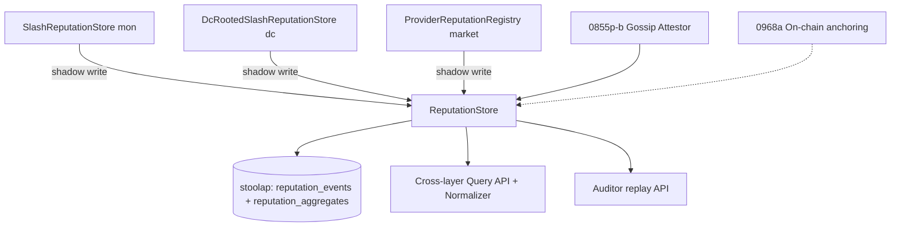
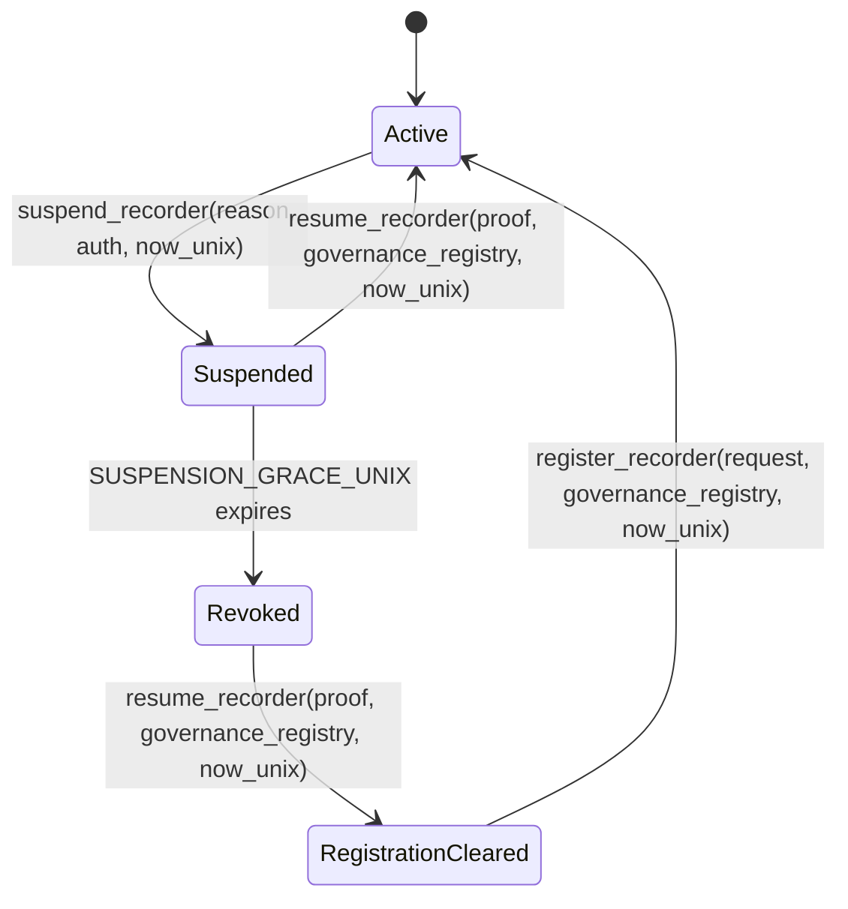

# RFC-0968: Reputation Registry

## Status

Draft

## Table of Contents

- [§1 System Architecture](#1-system-architecture)
- [§2 Identity: Canonical `did:octo:` Encoding](#2-identity-canonical-didocto-encoding)
  - [§2.1 Rotation State](#21-rotation-state-round-2-c3)
- [§3 Recorder Authorization](#3-recorder-authorization-10)
- [§4 Event Signing and Canonical Encoding](#4-event-signing-and-canonical-encoding)
- [§5 Storage Schema](#5-storage-schema)
- [§6 EWMA Algorithm](#6-ewma-algorithm)
- [§7 Adapter Mapping Rules](#7-adapter-mapping-rules-round-1-finding-h3-round-2-h8)
- [§8 Transactional and Ordering Semantics](#8-transactional-and-ordering-semantics-round-1-finding-h4)
- [§9 Cross-Layer Aggregation and Normalization](#9-cross-layer-aggregation-and-normalization-round-1-finding-h14-round-2-h9)
  - [§9.1 Typed Payload Specification (Round 3 C3)](#91-typed-payload-specification-round-3-c3)
  - [§9.1.1 Typed Payload Round-Trip Test Vectors](#911-typed-payload-round-trip-test-vectors)
- [§10 Core Interfaces](#10-core-interfaces)
- [§11 Audit Trail](#11-audit-trail-round-1-finding-h6-11)
- [§12 Federation](#12-federation-round-1-finding-h6-12)
- [§13 Error Handling](#13-error-handling)
- [§14 Performance Targets](#14-performance-targets)
- [§15 Lifecycle Coverage](#15-lifecycle-coverage-round-1-finding-h7)
- [§16 Determinism Requirements](#16-determinism-requirements-round-1-finding-h5)
- [§17 Implicit Assumptions Audit](#17-implicit-assumptions-audit)
- [§18 Security Considerations](#18-security-considerations)
- [§19 Adversarial Review](#19-adversarial-review)
- [§20 Adversary Analysis (5-Question, Round 1 finding H13)](#20-adversary-analysis-5-question-round-1-finding-h13)
- [§21 Economic Analysis](#21-economic-analysis)
- [§22 Compatibility](#22-compatibility)
- [§23 Test Vectors](#23-test-vectors)
- [§24 Alternatives Considered](#24-alternatives-considered)
- [§25 Implementation Phases](#25-implementation-phases)
- [§26 Key Files to Modify](#26-key-files-to-modify)
- [§27 Open Questions (Rounds 3-8 decisions)](#27-open-questions-rounds-3-8-decisions)

## Authors

- Author: @cipherocto
- Author: @mmacedoeu

## Maintainers

- Maintainer: @mmacedoeu

## Summary

Defines a unified, DID-keyed, persisted reputation registry for CipherOcto. Replaces three in-memory stores (`SlashReputationStore`, `DcRootedSlashReputationStore`, `ProviderReputationRegistry`) with a single stoolap-backed store supporting extensible signal types (slash, outcome, latency, capacity, discovery). Provides cross-layer reputation queries, survives daemon restart, and is write-authoritative via signed events produced by registered recorders.

## Dependencies

**Requires:**

- RFC-0008: Deterministic AI Execution Boundary (Class B for EWMA)
- RFC-0900: AI Quota Marketplace (provider reputation signal)
- RFC-0918: Inference Task Market (provider outcome signal)
- RFC-0955: Model Liquidity Layer (reputation field on agent schema; reputation anchoring follows this RFC's Phase 5)

**Optional / Beneficial:**

- RFC-0104: Deterministic Floating-Point (required for cross-replica EWMA agreement; v1.0 uses `octo_determin::Dfp`)
- Mission 0855p-b: Cross-mission coordinator reputation (gossip federation target)

## Design Goals

| Goal | Target                                                    | Metric                                    |
| ---- | --------------------------------------------------------- | ----------------------------------------- |
| G1   | 100% durability across daemon restart                     | Restart + verify aggregate matches        |
| G2   | < 50ms p99 cross-layer query latency                      | stoolap benchmark                         |
| G3   | Zero DDL for new signal types (excluding rotations table) | Schema frozen post-migration              |
| G4   | `score_ewma` deterministic given same inputs + alpha      | RFC-0008 Class B (Dfp arithmetic per §16) |
| G5   | Cross-layer federation via single SELECT                  | Same table, discriminator                 |
| G6   | Single canonical DID encoding (`did:octo:b<52>`)          | Reject raw 32-byte keys                   |
| G7   | Recorder write-authority via signature + stake            | Cryptographic, not trusted                |
| G8   | Event idempotency via BLAKE3 `event_id`                   | Dedup replay-safe                         |
| G9   | One-time rotation via `consume_rotation_receipt`          | Per `(old, new)` UNIQUE                   |

## Motivation

Three independent in-memory reputation stores exist with overlapping but distinct semantics. None survives restart. None cross-queries. Future signal types (capacity, discovery, on-chain) lack a backing store. Recorder trust today is implicit (any in-process code path can mutate), allowing reputation laundering across daemons that share a state. This RFC unifies the stores, persists them, anchors identity to a canonical `did:octo:` form, and makes write authority cryptographic.

## Roles and Authorities

| Role       | Identifier                                                                                                                                                  | Authority Scope                 | Lifecycle                                                                   | Source                           |
| ---------- | ----------------------------------------------------------------------------------------------------------------------------------------------------------- | ------------------------------- | --------------------------------------------------------------------------- | -------------------------------- |
| `Subject`  | `Did` (`did:octo:...`)                                                                                                                                      | Receives reputation signals     | Persistent                                                                  | RFC-0008 (identity), this RFC §6 |
| `Recorder` | `RecorderId(Did)`                                                                                                                                           | Writes signals to register      | `Active → Suspended → Revoked` (+`UnderStaked`/`Stale`/`Expired`/`Unknown`) | This RFC §10                     |
| `Reader`   | `ReaderId(Did)`                                                                                                                                             | Reads aggregate reputation      | Per-query authenticated                                                     | This RFC §10                     |
| `Auditor`  | `AuditorId(Did)` (a Reader with audit capability; Round 3 H8)                                                                                               | Replays full signal history     | One-shot signed query via `AuditorAuth`                                     | This RFC §11                     |
| `Attestor` | `AttestorId(Did)` (gossip peer; Round 3 M4 lightweight `AttestorRegistration { attestor_did, pubkey, peer_set_id }` registered via `register_attestor` API) | Replicates events cross-mission | Mission 0855p-b scope                                                       | Mission 0855p-b                  |

## Specification

### 1. System Architecture



### 2. Identity: Canonical `did:octo:` Encoding

DIDs are **strings** of the form `did:octo:b<method-specific>`. The method-specific component is the BLAKE3-256 hash of the public key, encoded as `base32-lowercase-no-padding`, prefixed with `b` (multibase `base32` per the multibase standard) to disambiguate from other DID methods. Round 2 finding C1: "did:octo:" is exactly 9 chars; `b` is 1 char; BLAKE3-256 produces 32 bytes → base32-nopad-lower is 52 chars. Total: `9 + 1 + 52 = 62` chars. Round 2 finding M15: the multibase prefix is `b` (the standard multibase base32 prefix), not `z` (which is base58btc).

```rust
/// Canonical DID. The ONLY acceptable form. Raw 32-byte keys are rejected
/// at parse time. The 32-byte legacy form is OBSOLETE (Round 1 finding C3).
pub struct Did(String);

pub const DID_PREFIX: &str = "did:octo:";
pub const DID_MULTIBASE: &str = "b"; // multibase base32 (RFC-XXXX Round 2 M15)
pub const DID_HASH_LEN: usize = 52; // base32(32 bytes) no-pad lowercase
pub const DID_TOTAL_LEN: usize = 62; // 9 (DID_PREFIX) + 1 (MULTIBASE) + 52 (HASH)

impl Did {
    pub fn from_pubkey(pk: &[u8; 32]) -> Self {
        let hash = blake3::hash(pk);
        let b32 = data_encoding::BASE32_NOPAD_LOWER.encode(hash.as_bytes());
        Did(format!("{DID_PREFIX}{DID_MULTIBASE}{b32}"))
    }

    pub fn parse(s: &str) -> Result<Self, ReputationError> {
        // Round 2 C1: length is 62, not 63. Round 2 M15: prefix is "b" (base32),
        // not "z" (base58btc).
        if s.len() != DID_TOTAL_LEN || !s.starts_with(&format!("{DID_PREFIX}{DID_MULTIBASE}")) {
            return Err(ReputationError::SubjectInvalid);
        }
        Ok(Did(s.to_owned()))
    }

    /// DID rotation: produces a new DID bound to the old DID via proof.
    /// Reputation transfers with decay factor `0.9` (Round 1 finding C3).
    /// Round 2 C3: BOTH old_pubkey AND new_pubkey are required; the function
    /// verifies that blake3(old_pubkey) == old.hash_part AND
    /// blake3(new_pubkey) == new.hash_part. The signature is over
    /// BLAKE3("cipherocto/reputation/rotation/v1" || old.0 || new.0) by old_pubkey.
    /// Round 4 H1: `now_unix` is caller-supplied; rotation never reads the
    /// process wall clock.
    /// Round 3 L4: validate `Did::parse(old)` and `Did::parse(new)` at function
    /// start so the per-byte index slice below (`old.0[DID_PREFIX.len() + ...]`)
    /// cannot panic on a noncanonical DID.
    pub fn rotate(
        old: &Did,
        new: &Did,
        proof: &Signature,
        old_pubkey: &[u8; 32],
        new_pubkey: &[u8; 32],
        now_unix: u64,
    ) -> Result<RotationReceipt, ReputationError> {
        // Round 3 L4: validate both inputs through `Did::parse` (the only
        // path that produces a `Did`) before any indexing. Rejects raw
        // 32-byte keys and legacy `did:octo:z...` strings.
        Did::parse(&old.0).map_err(|_| ReputationError::SubjectInvalid)?;
        Did::parse(&new.0).map_err(|_| ReputationError::SubjectInvalid)?;
        // 1. Verify old_pubkey actually derives old.
        let old_hash = blake3::hash(old_pubkey);
        if &data_encoding::BASE32_NOPAD_LOWER.encode(old_hash.as_bytes())
            != &old.0[DID_PREFIX.len() + DID_MULTIBASE.len()..]
        {
            return Err(ReputationError::SubjectInvalid);
        }
        // 2. Verify new_pubkey actually derives new.
        let new_hash = blake3::hash(new_pubkey);
        if &data_encoding::BASE32_NOPAD_LOWER.encode(new_hash.as_bytes())
            != &new.0[DID_PREFIX.len() + DID_MULTIBASE.len()..]
        {
            return Err(ReputationError::SubjectInvalid);
        }
        // 3. Verify signature over the canonical rotation message by old_pubkey.
        let mut msg = Vec::new();
        msg.extend_from_slice(BLAKE3_REPUTATION_ROTATION_DOMAIN);
        msg.extend_from_slice(old.0.as_bytes());
        msg.extend_from_slice(new.0.as_bytes());
        let digest = blake3::hash(&msg);
        proof.verify(old_pubkey, digest.as_bytes())?;
        Ok(RotationReceipt {
            old: old.clone(),
            new: new.clone(),
            // Round 6 H4: decay factor is the canonical `ROTATION_DECAY_Q32_32`
            // constant rather than a hard-coded literal. The constant is
            // greppable and overridable per-deployment via RFC-0927
            // `RouterConfig.rotation.decay_q32_32` if a deployment ever
            // requires a different decay.
            decay_q32_32: ROTATION_DECAY_Q32_32,
            created_at_unix: now_unix,
        })
    }
}

pub const BLAKE3_REPUTATION_ROTATION_DOMAIN: &[u8] =
    b"cipherocto/reputation/rotation/v1";
```

Note: `BLAKE3_REPUTATION_ROTATION_DOMAIN` is also declared in §10 alongside the other domain constants — the canonical declaration lives in §10. The §2 reference is a forward pointer; the §10 declaration is authoritative. Round 6 M12 brings the type-coverage table (Mission §"Type Coverage") into alignment with this single authoritative declaration.

`Did::parse` rejects any input that is not a syntactically valid `did:octo:b<52-chars>` string (exactly 62 chars). Raw 32-byte keys MUST NOT be accepted. This eliminates the previous two-noncanonical-encoding attack where reputation could be split across `did:octo:` (string) and 32-byte raw representations of the same identity. Round 2 C1: the previous code rejected every generated DID (`s.len() != 11 + 52`); the corrected length is `62`. Round 2 M15: the multibase prefix is `b` (base32 standard) per Round 2 finding.

#### 2.1 Rotation State (Round 2 C3)

`Did::rotate` produces a `RotationReceipt` that is **not** a one-time-migration token by itself. The caller supplies `now_unix`; the rotation path never reads a wall clock internally. The `RotationReceipt` is persisted to the `reputation_rotations` table and consumed exactly once by `consume_rotation_receipt(receipt, now_unix)`. The migration transaction multiplies the source aggregate by `decay` (0.9) and atomically moves `(did, kind, layer)` tuples from `old` to `new`. Re-using the same `(old, new)` pair is rejected with `ReputationError::RotationAlreadyConsumed`.

```sql
-- File: crates/quota-router-storage/migrations/v005__reputation_rotations.sql
CREATE TABLE reputation_rotations (
  rotation_id BLOB PRIMARY KEY,           -- BLAKE3(BLAKE3_REPUTATION_ROTATION_DOMAIN || old || new)
  old_did TEXT NOT NULL,                  -- canonical did:octo:b...
  new_did TEXT NOT NULL,                  -- canonical did:octo:b...
  decay_factor INTEGER NOT NULL,          -- Q32.32 fixed-point (0.9 = 0xE6666666)
  consumed_at_unix INTEGER,               -- NULL until consume_rotation_receipt
  source_signature BLOB NOT NULL,         -- ed25519 proof (64 bytes)
  UNIQUE (old_did, new_did)               -- one-time migration per pair
);

CREATE INDEX reputation_rotations_by_new ON reputation_rotations(new_did);
```

```rust
pub struct RotationReceipt {
    pub rotation_id: [u8; 32],
    pub old: Did,
    pub new: Did,
    pub decay_q32_32: i64,           // Round 3 OQ6: i64 Q32.32 fixed-point
                                     // (0.9 = 0xE6666666); bit-deterministic
                                     // across Rust + SQL replicas.
    pub created_at_unix: u64,
}
```

The canonical `ReputationStore` trait is declared once in §10. Its rotation method is:

```rust
fn consume_rotation_receipt(
    &self,
    receipt: &RotationReceipt,
    now_unix: u64,
) -> Result<(), ReputationError>;
```

`consume_rotation_receipt` (in a single transaction):

1. SELECT `reputation_rotations WHERE old_did = ? AND new_did = ? AND consumed_at_unix IS NULL`. If none, return `RotationNotFound` or `RotationAlreadyConsumed`.
2. For every source aggregate `(old_did, kind, layer)`, check whether the destination key `(new_did, kind, layer)` already exists. If any destination aggregate exists, roll back and return `ReputationError::RotationDestinationNotEmpty { new_did, kind, layer }`. Rotations to non-empty destinations are forbidden by design because merging independently accumulated histories would destroy reputation integrity.
3. INSERT a `reputation_events` row of `kind = Rotation` (`signal_kind = 5`) referencing `rotation_id` in `payload`, signed by the recorder that triggered the rotation. Capture the resulting `event_id` from the INSERT. Round 6 H5: the rotation event's `did` field is `new_did`, not `old_did` — the persisted record identifies the destination of the migration, so audit replay can locate the row by the new DID's canonical key. The payload's `Rotation` variant still carries both `old_did` and `new_did` for explicit provenance.
4. For each `(did=old_did, kind, layer)` row in `reputation_aggregates`, atomically INSERT a new destination row with the decayed `score_ewma`, the unchanged sample/severity counters, `last_event_id = <event_id from step 3>`, and `updated_at_unix = now_unix`, then DELETE the old row.
5. UPDATE `reputation_rotations SET consumed_at_unix = now_unix` WHERE `rotation_id = ?`, using the caller-supplied `now_unix` (no internal wall-clock read).

Round 6 M4: a per-DID admission lock is held for the full transaction for both `old_did` and `new_did`. Concurrent `record_signal` or `consume_rotation_receipt` calls that touch either DID are blocked until commit/rollback. This closes the race where a concurrent `record_signal` could insert a `(new_did, kind, layer)` tuple after the destination-empty check but before the destination INSERTs in step 4.

The destination checks, destination INSERTs, source DELETEs, rotation-event INSERT, and receipt-consumption UPDATE are one atomic transaction. Round 3 H4 established that `aggregate.last_event_id` uses the real rotation `event_id`, not `rotation_id`; Round 5 H4 additionally forbids non-empty destinations instead of attempting an ambiguous merge. Round 6 H5 fixes the rotation event's `did` field to `new_did` so audit replay can locate the row by the new DID canonical key.

Round 2 C3: the previous design returned an inert `RotationReceipt` with no store method, no one-time consumption, and no per-DID state machine. The new design:

- Binds `old_pubkey` to `old` and `new_pubkey` to `new` via `blake3(pubkey) == did.hash_part`.
- Verifies the signature over `BLAKE3("cipherocto/reputation/rotation/v1" || old.0 || new.0)` by `old_pubkey`.
- Rejects re-use via the `consume_rotation_receipt` state machine.
- Prevents reputation launder by `rotate` infinitely (the same `(old, new)` pair can only be consumed once) and by splitting reputation across multiple "new" DIDs (each `new_did` requires a separate proof over `(old, new)` and a separate migration transaction).

### 3. Recorder Authorization

Recorders register before they may write. The `RecorderRegistration` row holds the recorder's DID, public key, stake, and lifecycle timestamps. `record_signal` rejects events whose `RecorderId` is revoked, suspended, or under-staked. Registration requires a cryptographic stake proof over `BLAKE3(BLAKE3_REPUTATION_STAKE_DOMAIN || recorder_id || stake_amount || requested_at_unix)`. The proof carries a `GovernanceSnapshot`; `register_recorder` first validates that snapshot against `now_unix`, returning `GovernanceSnapshotStale` when it is older than `MAX_GOVERNANCE_SNAPSHOT_AGE_SECS`, and accepts the signer only when `GovernanceRegistry::lookup_at_snapshot(pubkey, snapshot)` returns true. Registration also binds `pubkey` to `recorder_did` via `blake3(pubkey) == recorder_did.hash_part`, rejects an existing registration row, and uses INSERT rather than UPSERT.

```rust
pub const MIN_RECORDER_STAKE: u64 = 1000; // OCTO role-token, per token-design §12
pub const MAX_RECORDER_AGE_UNIX: u64 = 365 * 86_400; // 1 year
pub const STALE_RECORDER_THRESHOLD_UNIX: u64 = 30 * 86_400; // 30 days no signals
pub const SUSPENSION_GRACE_UNIX: u64 = 7 * 86_400; // 7 days after suspend
pub const SUSPENSION_SEVERITY_THRESHOLD: u64 = 5;
pub const MAX_REGISTRATION_DRIFT_SECS: u64 = 300; // Round 6 M6: caller-supplied
                                                  // `requested_at_unix` must be
                                                  // within 5 minutes of `now_unix`
pub const MAX_RESUME_DRIFT_SECS: u64 = 300; // Round 6 M1: `resume_recorder`
                                            // `proof.current_unix` must be
                                            // within 5 minutes of `now_unix`
pub const MAX_GOVERNANCE_SNAPSHOT_AGE_SECS: u64 = 600; // Round 7 H4: a governance
                                                       // snapshot older than 10
                                                       // minutes is stale and
                                                       // rejected for any new
                                                       // authoritative signature
                                                       // or registration. Use
                                                       // `current_snapshot()` at
                                                       // the API boundary.
pub const ROTATION_DECAY_Q32_32: i64 = 0xE666_6666; // 0.9 in Q32.32 fixed-point.
                                                    // // Round 7 L1: 0xE6666666 = 0.9 in
                                                    // Q32.32 fixed-point (0.9 * 2^32 =
                                                    // 3865470566.4; rounded to 0xE6666666
                                                    // = 0.89999998...). The actual decay
                                                    // factor is 0.89999998, not exactly 0.9.
                                                    // Round 6 H4: greppable, overridable per
                                                    // RFC-0927

pub type PublicKey = [u8; 32];

#[derive(Debug, Clone, Serialize, Deserialize)]
pub enum SuspensionReason {
    SeverityThreshold {
        observed_severity: u64,
        threshold: u64,
    },
    Governance {
        governance_pubkey: PublicKey,
        reason: String,
    },
    Manual {
        operator_did: Did,
        reason: String,
    },
}

/// Round 7 H4 + Round 8 H1/H2: structured governance snapshot. Every
/// authoritative signature or registration carries a specific snapshot,
/// including `GovernanceProof`, `ResumeProof`, and `AttestorAuth`, with no
/// exceptions. Cross-replica determinism requires that two replicas agree on
/// the same `(block_height, epoch, finalized_at_unix)` tuple when validating
/// the same signature or registration.
#[derive(Debug, Clone, Copy, PartialEq, Eq, Serialize, Deserialize)]
pub struct GovernanceSnapshot {
    pub block_height: u64,
    pub epoch: u64,
    pub finalized_at_unix: u64,
}

impl GovernanceSnapshot {
    /// Reject a snapshot that was finalized more than ten minutes before the
    /// receiving API's explicit `now_unix`. The saturating addition prevents a
    /// malicious timestamp from wrapping the freshness boundary.
    pub fn validate_fresh(&self, now_unix: u64) -> Result<(), ReputationError> {
        if self
            .finalized_at_unix
            .saturating_add(MAX_GOVERNANCE_SNAPSHOT_AGE_SECS)
            < now_unix
        {
            return Err(ReputationError::GovernanceSnapshotStale);
        }
        Ok(())
    }
}

/// Governance public keys belong to the protocol governance set. Implementations
/// read that set from the on-chain governance registry or governance contract.
pub trait GovernanceRegistry: Send + Sync {
    /// Returns the current finalized snapshot so a caller can stamp a new
    /// authoritative request. The receiving API still validates freshness
    /// against its own explicit `now_unix`.
    fn current_snapshot(&self) -> Result<GovernanceSnapshot, GovernanceError>;

    /// Canonical authoritative lookup. Returns the active-key status for
    /// `pubkey` at the request's explicit `snapshot`. Two replicas calling this
    /// method with the same snapshot MUST agree, regardless of which local block
    /// either replica has finalized. Every authoritative call validates freshness
    /// before invoking this method; the former timestamp-only
    /// `is_active_governance_pubkey` path MUST NOT authorize signatures or
    /// registrations.
    fn lookup_at_snapshot(
        &self,
        pubkey: &[u8; 32],
        snapshot: &GovernanceSnapshot,
    ) -> Result<bool, GovernanceError>;
}

/// Round 7 H3: governance registry lookup errors. Distinct from
/// `ReputationError::GovernanceKeyInactive` so the caller can tell a
/// registry-lookup failure (network, contract revert, lookup failure) from a
/// successful "this key is not active" answer. Callers propagate the error
/// via `ReputationError::GovernanceRegistryError(_)` instead of collapsing it
/// into `GovernanceKeyInactive`. Carried-snapshot freshness is validated locally
/// and uses the distinct `ReputationError::GovernanceSnapshotStale` variant.
#[derive(Debug, thiserror::Error)]
pub enum GovernanceError {
    #[error("governance registry unavailable: {0}")]
    Unavailable(String),
    #[error("governance registry contract reverted: {0}")]
    ContractReverted(String),
    #[error("governance snapshot lookup failed: {0}")]
    LookupFailed(String),
}

/// A caller may supply a governance proof, but never an unvalidated authority
/// key. Every API receiving this type MUST validate `snapshot` against its
/// explicit `now_unix`, call `GovernanceRegistry::lookup_at_snapshot`, and then
/// verify the operation-specific signature. Round 6 M10: `current_unix` is
/// removed from the proof; the caller-supplied `now_unix` parameter of the
/// receiving API is the sole timestamp reference.
///
/// Round 7 H4 + Round 8 H1/H2: every authoritative signature or registration
/// carries a `GovernanceSnapshot`. `GovernanceProof`, `ResumeProof`, and
/// `AttestorAuth` are all subject to the same rule, with no exceptions. The
/// receiving API rejects a snapshot whose `finalized_at_unix` is older than
/// `MAX_GOVERNANCE_SNAPSHOT_AGE_SECS` relative to `now_unix` with
/// `ReputationError::GovernanceSnapshotStale` before the registry lookup.
/// Round 13 H1: governance suspension MUST be signed by the GOVERNANCE key
/// (the active officer), not by the recorder. The structural fix removes
/// `recorder_pubkey` from `GovernanceProof` entirely: there is no recorder
/// signature on a governance suspension authorization. The carried fields
/// are `governance_pubkey` (the officer signing), `recorder_id` (target),
/// `reason_hash` (binds `SuspensionReason`), the fixed-size `signature`
/// over the digest, and the binding `snapshot` (governance-registry view
/// at which the officer key is active).
pub struct GovernanceProof {
    pub governance_pubkey: PublicKey,
    pub recorder_id: RecorderId,
    pub reason_hash: [u8; 32],
    pub signature: [u8; 64],
    pub snapshot: GovernanceSnapshot,
}

pub enum SuspensionAuth {
    Governance { proof: GovernanceProof },
    /// Constructed only inside record_signal while its store transaction and
    /// per-recorder admission lock are held. Not exposed at an RPC/API boundary.
    Severity { internal: () },
}

pub const BLAKE3_REPUTATION_EVENT_DOMAIN: &[u8] =
    b"cipherocto/reputation/event/v1";

// Round 3 C2: stake_proof domain separator binds the governance signature
// to the canonical stake-request form (recorder_id || stake_amount || requested_at_unix).
// Round 6 M12: canonical declaration lives in §10; this is a re-export pointer.
pub const BLAKE3_REPUTATION_STAKE_DOMAIN: &[u8] =
    b"cipherocto/reputation/stake/v1";

// Round 3 H2: resume-proof domain separator binds the governance signature
// to the canonical resume-request form (recorder_id || current_unix).
// Round 6 M12: canonical declaration lives in §10; this is a re-export pointer.
// Round 12: dropped the literal "resume" sub-tag; the domain separator alone
// is sufficient to disambiguate the resume proof from stake/suspension
// authorization.
pub const BLAKE3_REPUTATION_RESUME_DOMAIN: &[u8] =
    b"cipherocto/reputation/resume/v1";

// Round 3 C7: attestation domain separator binds the attestation row to
// attestor + event_id.
// Round 6 M12: canonical declaration lives in §10; this is a re-export pointer.
pub const BLAKE3_REPUTATION_ATTESTATION_DOMAIN: &[u8] =
    b"cipherocto/reputation/attestation/v1";

#[derive(Debug, Clone, Serialize, Deserialize)]
pub struct RecorderRegistrationRequest {
    pub recorder_did: Did,                    // unbranded until successful registration
    pub pubkey: [u8; 32],                    // ed25519 verification key
    pub stake_amount: u64,
    pub stake_proof: GovernanceProof,        // includes signer key + signature + snapshot; key is authoritative only after GovernanceRegistry lookup
    pub requested_at_unix: u64,
}

pub struct RecorderRegistration {
    pub recorder_id: RecorderId,           // Did
    pub pubkey: [u8; 32],                  // ed25519 verification key
    pub stake_amount: u64,                 // OCTO; MUST be >= 1000
    pub registered_at_unix: u64,
    pub last_signal_at_unix: Option<u64>,
    pub suspended_at_unix: Option<u64>,    // None = Active; Some = Suspended
    pub suspension_reason: Option<SuspensionReason>,
    pub revoked_at_unix: Option<u64>,      // terminal
    pub grace_until_unix: Option<u64>,     // applies to Suspended -> Revoked
    pub roles: u64,                        // Round 6 C3: bitfield (RETENTION_ROLE | READER_ROLE | AUDITOR_ROLE)
}

/// Round 6 C3: role bitfield constants. `retention_prune` and `prune_event`
/// require `RECORD->roles & RETENTION_ROLE != 0`. A bitfield (rather than a
/// separate roles table) keeps the requirement inside the same row read
/// locking pattern as the lifecycle columns.
pub const RETENTION_ROLE: u64 = 1 << 0;
pub const READER_ROLE: u64   = 1 << 1;
pub const AUDITOR_ROLE: u64  = 1 << 2;

impl RecorderRegistration {
    /// Round 2 H6, Round 3 H1 + M2: state is computed at `now_unix`, not stored.
    /// - Revoked: terminal.
    /// - Suspended: present for ≤ SUSPENSION_GRACE_UNIX. After grace -> Revoked.
    /// - UnderStaked: stake_amount < MIN_RECORDER_STAKE.
    /// - Stale: now - last_signal_at_unix > STALE_RECORDER_THRESHOLD_UNIX (H1: use
    ///   registered_at_unix as fallback for novel recorders that never sent a signal).
    /// - Expired: now - registered_at_unix > MAX_RECORDER_AGE_UNIX.
    /// - Unknown (M2): clock out-of-band (now_unix < registered_at_unix); cannot classify.
    /// - Active: otherwise.
    pub fn state(&self, now_unix: u64) -> RecorderState {
        if now_unix < self.registered_at_unix {
            return RecorderState::Unknown;  // Round 3 M2
        }
        if self.revoked_at_unix.is_some() {
            return RecorderState::Revoked;
        }
        if let Some(suspended_at) = self.suspended_at_unix {
            let grace_target = self.grace_until_unix.unwrap_or(suspended_at + SUSPENSION_GRACE_UNIX);
            if now_unix > grace_target {
                return RecorderState::Revoked;
            }
            return RecorderState::Suspended;
        }
        if self.stake_amount < MIN_RECORDER_STAKE {
            return RecorderState::UnderStaked;
        }
        // Round 3 H1: fresh recorders that never sent signals fall back to
        // registered_at_unix; the previous code skipped the stale check entirely,
        // letting a stale-by-clock-skew recorder pass as Active.
        let last_signal = self.last_signal_at_unix.unwrap_or(self.registered_at_unix);
        if now_unix.saturating_sub(last_signal) > STALE_RECORDER_THRESHOLD_UNIX {
            return RecorderState::Stale;
        }
        if now_unix.saturating_sub(self.registered_at_unix) > MAX_RECORDER_AGE_UNIX {
            return RecorderState::Expired;
        }
        RecorderState::Active
    }
}

impl StoolapReputationStore {
    pub fn register_recorder(
        &self,
        req: &RecorderRegistrationRequest,
        governance_registry: &dyn GovernanceRegistry,
        now_unix: u64,    // Round 6 M6: caller-supplied; drift check
    ) -> Result<(), ReputationError> {
        // 1. A recorder_id is single-registration. Re-registration is an explicit
        //    two-step lifecycle: resume_recorder, then a fresh registration INSERT.
        if self.recorder_registration_exists(&req.recorder_did)? {
            return Err(ReputationError::RecorderAlreadyRegistered);
        }
        // 2. Verify pubkey-derived DID matches recorder_id.
        let derived = Did::from_pubkey(&req.pubkey);
        if derived.0 != req.recorder_did.0 {
            return Err(ReputationError::SubjectInvalid);
        }
        // 3. Round 6 M6: caller-supplied `requested_at_unix` must be within
        //    MAX_REGISTRATION_DRIFT_SECS of `now_unix`. Out-of-band timestamps
        //    indicate either a clock-skewed client or a replay attempt.
        if req.requested_at_unix.abs_diff(now_unix) > MAX_REGISTRATION_DRIFT_SECS {
            return Err(ReputationError::TimestampDrift);
        }
        // 4. The proof key is caller-carried but not caller-authoritative. Every
        //    authoritative registration carries a GovernanceSnapshot. Validate
        //    freshness against the receiving API's explicit `now_unix` before
        //    any registry call, then resolve membership at that exact snapshot.
        //    Registry failures propagate via GovernanceRegistryError(_), while a
        //    locally stale snapshot has the precise GovernanceSnapshotStale error.
        req.stake_proof.snapshot.validate_fresh(now_unix)?;
        if governance_registry
            .lookup_at_snapshot(
                &req.stake_proof.governance_pubkey,
                &req.stake_proof.snapshot,
            )
            .map_err(|e| {
                tracing::warn!(
                    governance_pubkey = ?req.stake_proof.governance_pubkey,
                    snapshot = ?req.stake_proof.snapshot,
                    err = %e,
                    "governance registry lookup failed during register_recorder"
                );
                ReputationError::GovernanceRegistryError(e)
            })?
            == false
        {
            return Err(ReputationError::GovernanceKeyInactive);
        }
        // 5. Verify stake proof over the canonical request digest.
        let mut stake_msg = Vec::new();
        stake_msg.extend_from_slice(BLAKE3_REPUTATION_STAKE_DOMAIN);
        stake_msg.extend_from_slice(req.recorder_did.0.as_bytes());
        stake_msg.extend_from_slice(&req.stake_amount.to_be_bytes());
        stake_msg.extend_from_slice(&req.requested_at_unix.to_be_bytes());
        let stake_digest = blake3::hash(&stake_msg);
        ed25519::Verifier::verify(
            &req.stake_proof.governance_pubkey,
            stake_digest.as_bytes(),
            &ed25519::Signature::from_bytes(req.stake_proof.signature.as_slice()
                .try_into()
                .map_err(|_| ReputationError::SignatureMalformed)?),
        ).map_err(|_| ReputationError::StakeProofInvalid)?;
        // 6. Reject under-staked registrations before persistence.
        if req.stake_amount < MIN_RECORDER_STAKE {
            return Err(ReputationError::StakeBelowMinimum { provided: req.stake_amount });
        }
        // 7. INSERT, never UPSERT: lifecycle state may not be reconstructed away.
        //    Round 6 H1: `RecorderId::new` is the module-private minting path
        //    used exclusively by `register_recorder`. External callers MUST use
        //    `RecorderId::registered` (§10), which requires a matching row.
        let reg = RecorderRegistration {
            recorder_id: RecorderId::new(req.recorder_did.clone()),
            pubkey: req.pubkey,
            stake_amount: req.stake_amount,
            registered_at_unix: req.requested_at_unix,
            last_signal_at_unix: None,
            suspended_at_unix: None,
            suspension_reason: None,
            revoked_at_unix: None,
            grace_until_unix: None,
            roles: 0, // Round 6 C3: roles granted by governance mutation, not at registration
        };
        self.insert_recorder_registration(&reg)
    }

    /// Suspend a recorder for an authorized governance/manual reason or an
    /// internal severity transition. The store owns an injected GovernanceRegistry;
    /// external callers cannot construct the Severity authorization path.
    /// Round 10 H1: takes `governance_registry: &dyn GovernanceRegistry` so the
    /// governance-signed authorization path can be verified end-to-end
    /// (snapshot freshness + snapshot-bound lookup + ed25519 signature) via
    /// `verify_governance_suspension`. The internal `Severity` path does not
    /// touch the registry.
    pub fn suspend_recorder(
        &self,
        recorder_id: RecorderId,
        reason: SuspensionReason,
        auth: &SuspensionAuth,
        governance_registry: &dyn GovernanceRegistry,
        now_unix: u64,
    ) -> Result<(), ReputationError> {
        match auth {
            SuspensionAuth::Governance { proof } => {
                self.verify_governance_suspension(auth, &proof.snapshot, now_unix)?;
            }
            SuspensionAuth::Severity { internal: () } => {
                self.require_active_record_signal_transaction(&recorder_id)?;
                if !matches!(reason, SuspensionReason::SeverityThreshold { .. }) {
                    return Err(ReputationError::SuspensionAuthInvalid);
                }
            }
        }
        let mut reg = self.recorder_lookup(&recorder_id)?;
        if reg.revoked_at_unix.is_some() {
            return Err(ReputationError::RecorderDenied(RecorderState::Revoked));
        }
        reg.suspended_at_unix = Some(now_unix);
        reg.suspension_reason = Some(reason);
        reg.grace_until_unix = Some(now_unix.saturating_add(SUSPENSION_GRACE_UNIX));
        self.update_recorder_registration(&reg)
    }

    /// Round 10 H1 + Round 12 + Round 13 H1: verify the governance-signed
    /// suspension authorization. The signed payload is the ed25519 signature
    /// by the GOVERNANCE officer (not the recorder) over
    /// `BLAKE3(BLAKE3_REPUTATION_SUSPENSION_DOMAIN || recorder_id || reason_hash
    /// || governance_pubkey || now_unix)` where `reason_hash =
    /// blake3(canonical_ser(reason))`. The domain constant is
    /// `b"cipherocto/reputation/suspension/v1"` (§10).
    ///
    /// Round 13 H1 (governance authorization binding): the prior round's
    /// verify path reconstructed the digest WITHOUT `governance_pubkey` and
    /// verified the signature against `proof.recorder_pubkey`. That was a
    /// structural flaw — any arbitrary key could sign a suspension while
    /// naming an unrelated active governance key in `proof.governance_pubkey`.
    /// Round 13 removes `recorder_pubkey` from `GovernanceProof` entirely,
    /// binds `governance_pubkey` into the digest, and verifies the signature
    /// against `proof.governance_pubkey`. The governance officer's signature
    /// establishes the authorization; the subsequent registry lookup is
    /// defense-in-depth (per Round 7 H4) and remains a tautology once the
    /// signature verifies.
    ///
    /// Round 12: the impl signature matches the `ReputationStore` trait
    /// method declaration in §10 (`auth: &SuspensionAuth, snapshot:
    /// &GovernanceSnapshot, now_unix: u64`). The carried `GovernanceProof`
    /// supplies `governance_pubkey`, `recorder_id`, `reason_hash`, and
    /// `signature` so the verify path is self-contained — the caller
    /// (`suspend_recorder`) does not need to re-pass them.
    ///
    /// Verification order (matches the carry-snapshot universality rule from
    /// Round 8 H1/H2):
    /// 1. Destructure `SuspensionAuth::Governance { proof }` — the internal
    ///    `Severity` variant is rejected with `SuspensionAuthInvalid`.
    /// 2. `snapshot_age(snapshot, now_unix) > MAX_GOVERNANCE_SNAPSHOT_AGE_SECS`
    ///    returns `GovernanceSnapshotStale` before any registry lookup.
    /// 3. Reconstruct the digest from `BLAKE3_REPUTATION_SUSPENSION_DOMAIN ||
    ///    proof.recorder_id.0 || proof.reason_hash || proof.governance_pubkey ||
    ///    now_unix` and verify the ed25519 signature by
    ///    `proof.governance_pubkey` (Round 13 H1: the GOVERNANCE officer's
    ///    key, not the recorder's). A bad signature returns `SignatureInvalid`;
    ///    a malformed signature returns `SignatureMalformed`.
    /// 4. `self.governance_registry.lookup_at_snapshot(&proof.governance_pubkey,
    ///    snapshot)` — `Ok(false)` returns `GovernanceKeyInactive`; `Err(e)`
    ///    propagates as `GovernanceRegistryError(_)` (NOT collapsed to
    ///    `GovernanceKeyInactive`). Round 7 H4 defense-in-depth: the lookup
    ///    stays even though the signature already binds the governance key.
    ///
    /// This is the canonical authorization gate for `SuspensionAuth::Governance`;
    /// the internal `Severity` variant is constructed only inside
    /// `record_signal` while the per-recorder admission lock is held and is
    /// never externally invokable.
    fn verify_governance_suspension(
        &self,
        auth: &SuspensionAuth,
        snapshot: &GovernanceSnapshot,
        now_unix: u64,
    ) -> Result<(), ReputationError> {
        let SuspensionAuth::Governance { proof } = auth else {
            return Err(ReputationError::SuspensionAuthInvalid);
        };
        if snapshot_age(snapshot, now_unix) > MAX_GOVERNANCE_SNAPSHOT_AGE_SECS {
            return Err(ReputationError::GovernanceSnapshotStale);
        }
        let mut msg = Vec::new();
        msg.extend_from_slice(BLAKE3_REPUTATION_SUSPENSION_DOMAIN);
        msg.extend_from_slice(proof.recorder_id.0.0.as_bytes());
        msg.extend_from_slice(&proof.reason_hash);
        msg.extend_from_slice(proof.governance_pubkey.as_bytes());
        msg.extend_from_slice(&now_unix.to_be_bytes());
        let digest = blake3::hash(&msg);
        proof
            .signature
            .verify(&proof.governance_pubkey, digest.as_bytes())?;
        if !self
            .governance_registry
            .lookup_at_snapshot(&proof.governance_pubkey, snapshot.clone())?
        {
            return Err(ReputationError::GovernanceKeyInactive);
        }
        Ok(())
    }

    /// Called only inside the same store transaction as record_signal, while the
    /// per-recorder admission lock is held. A failure rolls back the event,
    /// aggregate, activity-clock update, and suspension together.
    /// Round 10 H1: takes `governance_registry: &dyn GovernanceRegistry` so the
    /// severity-triggered `suspend_recorder` call can satisfy the new
    /// `governance_registry` parameter. Even though the `Severity` path does
    /// not consult the registry, the trait contract requires a single
    /// authoritative `suspend_recorder` signature; the internal severity
    /// authorization is constructed inside the same transaction as `record_signal`.
    pub fn suspend_recorder_self_check(
        &self,
        recorder_id: &RecorderId,
        aggregate: &ReputationAggregate,
        governance_registry: &dyn GovernanceRegistry,
        now_unix: u64,
    ) -> Result<(), ReputationError> {
        if aggregate.severity_total >= SUSPENSION_SEVERITY_THRESHOLD {
            self.suspend_recorder(
                recorder_id.clone(),
                SuspensionReason::SeverityThreshold {
                    observed_severity: aggregate.severity_total,
                    threshold: SUSPENSION_SEVERITY_THRESHOLD,
                },
                &SuspensionAuth::Severity { internal: () },
                governance_registry,
                now_unix,
            )?;
        }
        Ok(())
    }

    /// Round 3 H2: explicit resume API. A suspended recorder may be restored
    /// to Active by governance (e.g. after `ResumeProof` is provided).
    /// Round 6 M1: takes `now_unix: u64` for drift validation against
    /// `proof.current_unix`. Round 6 M3: the previous
    /// `grace_until_unix >= suspended_at_unix` cross-check is removed; that
    /// relationship is server-populated and a malformed row indicates
    /// server-internal corruption, classified as
    /// `ReputationError::RecorderLifecycleCorrupted`.
    pub fn resume_recorder(
        &self,
        recorder_id: &RecorderId,
        proof: &ResumeProof,
        governance_registry: &dyn GovernanceRegistry,
        now_unix: u64,
    ) -> Result<(), ReputationError> {
        // 1. Round 6 M1: reject proofs whose current_unix is out of band
        //    against the caller-supplied `now_unix`. The drift tolerance
        //    is MAX_RESUME_DRIFT_SECS (5 minutes).
        if proof.current_unix.abs_diff(now_unix) > MAX_RESUME_DRIFT_SECS {
            return Err(ReputationError::TimestampDrift);
        }
        // 2. Round 8 H1: every ResumeProof carries a GovernanceSnapshot. Validate
        //    it against `now_unix` before consulting governance, then resolve the
        //    key at that exact snapshot. Registry transport/contract failures are
        //    propagated via GovernanceRegistryError(_), NOT collapsed into
        //    GovernanceKeyInactive; stale local input is GovernanceSnapshotStale.
        proof.snapshot.validate_fresh(now_unix)?;
        if governance_registry
            .lookup_at_snapshot(&proof.governance_pubkey, &proof.snapshot)
            .map_err(|e| {
                tracing::warn!(
                    governance_pubkey = ?proof.governance_pubkey,
                    snapshot = ?proof.snapshot,
                    err = %e,
                    "governance registry lookup failed during resume_recorder"
                );
                ReputationError::GovernanceRegistryError(e)
            })?
            == false
        {
            return Err(ReputationError::GovernanceKeyInactive);
        }
        // 3. Verify proof: ed25519 signature by governance over
        //    BLAKE3(BLAKE3_REPUTATION_RESUME_DOMAIN || recorder_id || current_unix).
        let mut resume_msg = Vec::new();
        resume_msg.extend_from_slice(BLAKE3_REPUTATION_RESUME_DOMAIN);
        resume_msg.extend_from_slice(recorder_id.0.0.as_bytes());
        resume_msg.extend_from_slice(&proof.current_unix.to_be_bytes());
        let resume_digest = blake3::hash(&resume_msg);
        ed25519::Verifier::verify(
            &proof.governance_pubkey,
            resume_digest.as_bytes(),
            &ed25519::Signature::from_bytes(proof.signature.as_slice()
                .try_into()
                .map_err(|_| ReputationError::SignatureMalformed)?),
        ).map_err(|_| ReputationError::SignatureInvalid)?;
        // 4. Look up registration. Suspended rows resume in place. A revoked row
        //    is governance-cleared and removed after its lifecycle fields are
        //    cleared, so the caller can perform the required second step:
        //    register_recorder with a fresh stake proof.
        let mut reg = self.recorder_lookup(recorder_id)?;
        // 5. Round 6 M3: server-internal assertion. The previous
        //    `grace_until_unix < suspended_at_unix` cross-check has been
        //    removed because both columns are server-populated; an
        //    out-of-order pair indicates server-internal corruption. The
        //    assertion below promotes the invariant to a debug assertion
        //    that triggers a fresh error class rather than validating
        //    caller-supplied input.
        if let (Some(suspended_at), Some(grace)) = (reg.suspended_at_unix, reg.grace_until_unix) {
            debug_assert!(
                grace >= suspended_at,
                "RecorderRegistration lifecycle corruption: \
                 grace_until_unix ({grace}) < suspended_at_unix ({suspended_at})"
            );
            if grace < suspended_at {
                return Err(ReputationError::RecorderLifecycleCorrupted);
            }
        }
        // 6. Clear lifecycle fields. Revoked re-registration additionally deletes
        //    the cleared registration row (events remain auditable); suspended
        //    resume updates the row in place and returns it to Active.
        let was_revoked = reg.revoked_at_unix.is_some();
        reg.suspended_at_unix = None;
        reg.suspension_reason = None;
        reg.revoked_at_unix = None;
        reg.grace_until_unix = None;
        if was_revoked {
            self.delete_recorder_registration_after_resume(&reg)
        } else {
            self.update_recorder_registration(&reg)
        }
    }

    /// Round 2 H6: state-evaluation method that wraps the row's `state()`.
    pub fn recorder_state_at(
        &self,
        recorder_id: &RecorderId,
        now_unix: u64,
    ) -> Result<RecorderState, ReputationError> {
        let reg = self.recorder_lookup(recorder_id)?;
        Ok(reg.state(now_unix))
    }
}

/// Canonical RecorderState declaration for this RFC. §10 re-exports this
/// 7-variant type and MUST NOT redeclare it.
pub enum RecorderState {
    Active,
    Suspended,
    Revoked,
    UnderStaked,
    Stale,
    Expired,
    Unknown,  // Round 3 M2: clock out-of-band (now_unix < registered_at_unix); cannot classify
}
```

Round 2 H6: historical events MUST be replayable after revocation (audit log). The events table is append-only; revocation does not prune events. The `replay_for_audit` API (§11) is callable on a revoked recorder to inspect the full event history.

Recorder lifecycle state machine (Round 1 finding H7, Round 2 H6 extended, Round 3 H2, Round 4 C7):



**Round 3 H2 + Round 4 M4 — `resume_recorder` API.** The canonical API is:

```rust
pub fn resume_recorder(
    &self,
    recorder_id: &RecorderId,
    proof: &ResumeProof,
    governance_registry: &dyn GovernanceRegistry,
    now_unix: u64,
) -> Result<(), ReputationError>;
```

`ResumeProof` is an ed25519 signature by a governance key over `BLAKE3(BLAKE3_REPUTATION_RESUME_DOMAIN || recorder_id || current_unix)` and carries the `GovernanceSnapshot` at which that key must be active. Before verifying the signature, the store calls `proof.snapshot.validate_fresh(now_unix)` and then `GovernanceRegistry::lookup_at_snapshot(&proof.governance_pubkey, &proof.snapshot)`. A snapshot older than `MAX_GOVERNANCE_SNAPSHOT_AGE_SECS` returns `ReputationError::GovernanceSnapshotStale` before the registry lookup; registry failures remain `GovernanceRegistryError(_)`. For a Suspended row, the function clears `suspended_at_unix`, `suspension_reason`, and `grace_until_unix` in place. For a Revoked row, governance-authorized resume clears all lifecycle fields and removes the cleared registration row while preserving historical events, enabling the mandatory second step: `register_recorder` performs a fresh INSERT with a fresh stake proof. `register_recorder` always rejects an existing `recorder_id` with `RecorderAlreadyRegistered`; it never reconstructs or upserts lifecycle state.

Round 2 H6: Suspended → Revoked is automatic after `SUSPENSION_GRACE_UNIX` (default 7 days). UnderStaked (stake < `MIN_RECORDER_STAKE`) and Stale (no signals for `STALE_RECORDER_THRESHOLD_UNIX`, default 30 days) are also valid non-Active states computed in `state()`. Expired (registered > `MAX_RECORDER_AGE_UNIX`, default 365 days) marks the registration as past its useful lifetime; renewal requires the same resume → register flow. Adapter-produced severity is the input signal, while `suspend_recorder_self_check` enforces the threshold inside the same store transaction as `record_signal`; governance/manual suspension uses `SuspensionAuth::Governance`, and the internal severity transition uses `SuspensionAuth::Severity { internal: () }`.

### 4. Event Signing and Canonical Encoding

Every `SignalEvent` carries a `signature` field. The signature is `ed25519` over `BLAKE3(BLAKE3_REPUTATION_EVENT_DOMAIN || canonical_ser(event_unsigned))`. **Round 2 C2:** `event_id` is derived from the unsigned canonical form, so the unsigned form **MUST NOT** include `event_id` or `signature`. The unsigned canonical form serializes the following fields, in this fixed order, with length-prefixed binary fields:

```rust
pub struct SignalEvent {
    pub kind: SignalKind,
    pub layer: ReputationLayer,
    pub subject: Did,
    /// Score delta in `[-1.0, 1.0]`. Stored as `octo_determin::Dfp` per RFC-0104.
    /// The Dfp type is bit-deterministic across compilers and platforms, so two
    /// replicas producing the same event sequence produce byte-identical
    /// `score_delta` BLOB encodings (24 bytes each).
    pub score_delta: octo_determin::Dfp,
    pub samples_delta: u32,
    pub severity: u32,
    pub payload: Option<Vec<u8>>, // typed by kind; opaque BLOB
    pub event_id: [u8; 32],       // DERIVED (not stored in unsigned form); see below
    pub source: RecorderId,       // Did of the recorder
    pub observed_at_unix: u64,    // wall-clock at source
    pub received_at_unix: u64,    // wall-clock at recorder; MUST be monotonic per source
    pub signature: Vec<u8>,       // ed25519 (64 bytes) over the digest below
}
```

**Round 2 C2 — `event_id` derivation (canonical):**

```
event_id = BLAKE3(BLAKE3_REPUTATION_EVENT_DOMAIN || canonical_ser(event_unsigned))
```

The `event_unsigned` view is the projection that **excludes** `event_id` and `signature`. The ten canonical unsigned fields are, in this fixed order:

1. `did` (Length-prefixed UTF-8 string)
2. `signal_kind` (u8)
3. `layer` (u8)
4. `score_delta` (`octo_determin::Dfp` — serialized as the canonical 24-byte `DfpEncoding::to_bytes()` form; see §6 + §10)
5. `samples_delta` (u32 BE)
6. `severity` (u32 BE)
7. `payload` (Option<Vec<u8>> — 1-byte tag + 4-byte big-endian length + bytes)
8. `source_did` (Length-prefixed UTF-8 string)
9. `observed_at_unix` (u64 BE)
10. `received_at_unix` (u64 BE)

**Signing flow (deterministic):**

1. Compute `event_id = BLAKE3(BLAKE3_REPUTATION_EVENT_DOMAIN || canonical_ser(event_unsigned))`.
2. Insert `event_id` into the `SignalEvent` (NOT into the unsigned form used for the signature).
3. Compute `digest = BLAKE3(BLAKE3_REPUTATION_EVENT_DOMAIN || canonical_ser(event_unsigned))` again (the unsigned form is unchanged — `event_id` was not added to it).
4. Sign `digest` with the recorder's ed25519 key.
5. Append `signature` to the event.

Round 2 C2: previous specification listed `event_id` in the unsigned field list, which is a circular definition (the unsigned form cannot include `event_id` if `event_id` is computed from it). The signed domain is `BLAKE3(BLAKE3_REPUTATION_EVENT_DOMAIN || canonical_ser(event_unsigned))` and `event_id` is the same digest, so the verification rule is: `signature verifies over digest == event_id`.

Canonical serialization (`canonical_ser`) is the **CipherOctoCanonical** scheme (Round 2 H5) used by `crates/cipherocto-encoding` for `Constraint` and `caveat` envelopes. It is portable, deterministic, length-prefixed, big-endian. The wire-format rules are:

- Integers: big-endian, fixed-width (u8=1, u16=2, u32=4, u64=8, u128=16).
- Floats: **NOT supported as native `f64` in canonical_ser.** `score_delta` is `octo_determin::Dfp` per RFC-0104, serialized in its canonical 24-byte `DfpEncoding::to_bytes()` form (`DfpEncoding::from_dfp(d).to_bytes()` in `crates/octo-determin/src/lib.rs`: 16-byte mantissa + 4-byte exponent + 4-byte class_sign, all big-endian). The encoded BLOB is bit-deterministic across compilers and platforms, so two replicas that produce the same event sequence produce byte-identical `score_delta` BLOBs and identical `event_id` digests.
- Enums: 1-byte tag + payload.
- Strings: 4-byte length prefix + UTF-8 bytes.
- Bytes: 4-byte length prefix + raw bytes.
- Option: 1-byte tag (0=None, 1=Some) + payload.
- Sorted maps (BTreeMap): keys sorted lexicographically.
- Domain separator: prefix `[NAMESPACE_TAG, VERSION_TAG]` then `BLAKE3(domain || canonical_ser(...))` for signing.

The exact wire form is delegated to `cipherocto-encoding` to keep this RFC stable across encoding revisions.

```rust
impl StoolapReputationStore {
    /// Round 3 M5: caller provides the clock. `record_signal` takes `now_unix`
    /// as an explicit argument so the function is deterministic given
    /// `(event, now_unix)`. There is no internal process-clock read on the
    /// hot path. Class B determinism is preserved.
    /// Round 10 H1: takes `governance_registry: &dyn GovernanceRegistry` so
    /// the threshold-triggered `suspend_recorder_self_check` path can satisfy
    /// the new `suspend_recorder` governance parameter. The `record_signal`
    /// hot path does not consult the registry itself; the parameter exists
    /// only to thread the registry through to the in-transaction severity
    /// suspension.
    pub fn record_signal(
    &self,
    event: &SignalEvent,
    governance_registry: &dyn GovernanceRegistry,
    now_unix: u64,
) -> Result<EventId, ReputationError> {
    // 1. subject is canonical did:octo:b<52>
    Did::parse(&event.subject.0).map_err(|_| ReputationError::SubjectInvalid)?;

    // 2. score_delta ∈ [-1.0, 1.0] (encoded as octo_determin::Dfp).
    //    Reject NaN/Infinity and out-of-range values BEFORE serialization so
    //    every persisted event has a finite, in-range Dfp encoding.
    {
        let score_f = event.score_delta.to_f64();
        if !score_f.is_finite() || score_f < -1.0 || score_f > 1.0 {
            return Err(ReputationError::DeltaOutOfRange);
        }
    }

    // 3. event_id recomputes from unsigned canonical form (excludes event_id
    //    and signature per Round 2 C2)
    let unsigned = canonical_ser_event_unsigned(UnsignedEventView {
        did: &event.subject.0,
        signal_kind: event.kind,
        layer: event.layer,
        score_delta_bytes: &event.score_delta.to_bytes(),
        samples_delta: event.samples_delta,
        severity: event.severity,
        payload: event.payload.as_ref(),
        source_did: &event.source.0.0,
        observed_at_unix: event.observed_at_unix,
        received_at_unix: event.received_at_unix,
    });
    let mut prefixed = Vec::new();
    prefixed.extend_from_slice(BLAKE3_REPUTATION_EVENT_DOMAIN);
    prefixed.extend_from_slice(&unsigned);
    let digest = blake3::hash(&prefixed);
    if digest.as_bytes() != &event.event_id {
        return Err(ReputationError::EventIdMismatch);
    }

    // 4. Round 3 M5: drift check uses caller-supplied `now_unix`.
    if event.received_at_unix > now_unix + 60 {
        return Err(ReputationError::TimestampDrift);
    }

    // 5. recorder is registered + Active + adequately staked
    let reg = self.recorder_lookup(&event.source)?;
    let state = reg.state(now_unix);
    if state != RecorderState::Active {
        return Err(ReputationError::RecorderDenied(state));
    }

    // 6. ed25519 verify over the same digest
    let sig = ed25519::Signature::from_bytes(event.signature.as_slice()
        .try_into()
        .map_err(|_| ReputationError::SignatureMalformed)?);
    ed25519::Verifier::verify(&reg.pubkey, digest.as_bytes(), &sig)
        .map_err(|_| ReputationError::SignatureInvalid)?;

    // 7. Round 3 M6: per-source monotonicity. The store looks up the
    //    last persisted `received_at_unix` for this source; out-of-order
    //    events are rejected. Restarts re-establish monotonicity from
    //    the last persisted value (M6).
    self.check_monotonicity(&event.source.0, event.received_at_unix)?;

    // 8. Acquire the store-level per-recorder admission lock, then execute one
    //    stoolap MVCC transaction (snapshot isolation): INSERT event + UPDATE
    //    aggregate + UPDATE RecorderRegistration.last_signal_at_unix = now_unix
    //    + severity self-check + any resulting suspension. Other record_signal
    //    calls for this recorder_id remain blocked until commit or rollback.
    let _admission = self.lock_recorder_admission(&event.source)?;
    self.transaction(|tx| {
        let (event_id, aggregate) = tx.persist_event_and_aggregate(event, now_unix)?;
        tx.suspend_recorder_self_check(&event.source, &aggregate, governance_registry, now_unix)?;
        Ok(event_id)
    })
}
}
```

### 5. Storage Schema

The core state uses two tables — one for events (append-only) and one for current aggregates (read-optimized) — keyed by `(did, signal_kind, layer)`. Three auxiliary tables persist one-time rotations (v005), attestations (v006), and pruned-prefix aggregate checkpoints (v007). Round 1 finding M1: composite PK; migration naming `v003` through `v007` is appended to `BUILTIN_MIGRATIONS` in `crates/quota-router-storage/src/migrations.rs`.

```sql
-- File: crates/quota-router-storage/migrations/v003__reputation_events.sql
CREATE TABLE reputation_events (
  event_id BLOB PRIMARY KEY,                  -- BLAKE3-256 (32 bytes)
  did TEXT NOT NULL,                          -- "did:octo:b<52>"
  signal_kind INTEGER NOT NULL,               -- 0=slash, 1=outcome, 2=latency, ...
  layer INTEGER NOT NULL,                     -- 0=mon, 1=dc, 2=market, 3=task, ...
  -- score_delta is the canonical octo_determin::Dfp 24-byte encoding
  -- (DfpEncoding::from_dfp(d).to_bytes() from crates/octo-determin): 16-byte
  -- mantissa + 4-byte exponent + 4-byte class_sign, all big-endian. The BLOB is
  -- bit-deterministic across compilers and platforms, so two replicas producing
  -- the same event sequence produce byte-identical BLOBs (RFC-0104).
  score_delta BLOB NOT NULL CHECK (length(score_delta) = 24),
  samples_delta INTEGER NOT NULL,
  severity INTEGER NOT NULL DEFAULT 0,
  payload BLOB,
  source_did TEXT NOT NULL,                   -- recorder
  observed_at_unix INTEGER NOT NULL,
  received_at_unix INTEGER NOT NULL,          -- monotonic per source_did
  retention_pruned_at_unix INTEGER,           -- NULL until authorized soft-prune
  signature BLOB NOT NULL,                    -- ed25519 (64 bytes)
  CONSTRAINT reputation_events_severity_nonneg  CHECK (severity >= 0)                                 -- Round 3 M8
);

CREATE INDEX reputation_events_by_did ON reputation_events(did, received_at_unix DESC);
CREATE INDEX reputation_events_by_source ON reputation_events(source_did, received_at_unix DESC);
```

```sql
-- File: crates/quota-router-storage/migrations/v004__reputation_aggregates.sql
CREATE TABLE reputation_aggregates (
  did TEXT NOT NULL,                          -- "did:octo:b<52>"
  signal_kind INTEGER NOT NULL,
  layer INTEGER NOT NULL,
  -- score_ewma is the canonical octo_determin::Dfp 24-byte encoding
  -- (default = Dfp::from_f64(1.0)). Per RFC-0104 the BLOB is bit-deterministic
  -- across compilers and platforms. Class A storage: byte-identical across
  -- replicas given identical input event sequences.
  score_ewma BLOB NOT NULL CHECK (length(score_ewma) = 24),
  samples INTEGER NOT NULL DEFAULT 0,
  severity_total INTEGER NOT NULL DEFAULT 0,
  last_event_id BLOB NOT NULL,                -- dedup anchor
  last_event_unix INTEGER NOT NULL,
  updated_at_unix INTEGER NOT NULL,
  PRIMARY KEY (did, signal_kind, layer)
);

CREATE INDEX reputation_aggregates_by_layer ON reputation_aggregates(layer);
CREATE INDEX reputation_aggregates_by_kind ON reputation_aggregates(signal_kind, layer);
```

`ReputationAggregate` has exactly nine canonical fields, matching this schema: `did`, `kind`, `layer`, `score_ewma`, `samples`, `severity_total`, `last_event_id`, `last_event_unix`, and `updated_at_unix`.

```sql
-- File: crates/quota-router-storage/migrations/v006__reputation_attestations.sql
CREATE TABLE reputation_attestations (
  attestation_id BLOB PRIMARY KEY,
  attestor_did TEXT NOT NULL,
  event_id BLOB NOT NULL,
  signature BLOB NOT NULL,
  observed_at_unix INTEGER NOT NULL,
  received_at_unix INTEGER NOT NULL,
  FOREIGN KEY (event_id) REFERENCES reputation_events(event_id)
);
CREATE INDEX reputation_attestations_by_event ON reputation_attestations(event_id);
CREATE INDEX reputation_attestations_by_attestor ON reputation_attestations(attestor_did);
```

The v006 attestation table is Phase 1 persistence, not federation-deferred work. Attestation rows are idempotent by `attestation_id`, and their foreign key prevents attestations for unknown events.

```sql
-- File: crates/quota-router-storage/migrations/v007__aggregate_checkpoints.sql
CREATE TABLE aggregate_checkpoint (
  did TEXT NOT NULL,
  signal_kind INTEGER NOT NULL,
  layer INTEGER NOT NULL,
  checkpoint_id BLOB NOT NULL,
  checkpoint_event_id BLOB NOT NULL,
  checkpoint_unix INTEGER NOT NULL,
  -- score_ewma_at_checkpoint is the canonical octo_determin::Dfp 24-byte
  -- encoding (RFC-0104). The CHECK enforces the BLOB length.
  score_ewma_at_checkpoint BLOB NOT NULL CHECK (length(score_ewma_at_checkpoint) = 24),
  samples_at_checkpoint INTEGER NOT NULL,
  severity_total_at_checkpoint INTEGER NOT NULL,
  last_event_unix_at_checkpoint INTEGER NOT NULL,  -- Round 6 M5: snapshot
                                                          -- of reputation_aggregates.last_event_unix
                                                          -- at the pruned-prefix boundary so replay
                                                          -- can verify checkpoint ordering.
  PRIMARY KEY (did, signal_kind, layer, checkpoint_id)
);

CREATE INDEX aggregate_checkpoint_by_boundary
  ON aggregate_checkpoint(did, signal_kind, layer, checkpoint_event_id);
```

Before `prune_event` marks an event at the current pruned-prefix boundary, the same transaction INSERTs an `aggregate_checkpoint` row containing the aggregate state through `checkpoint_event_id`. The `last_event_unix_at_checkpoint` column captures the source `reputation_aggregates.last_event_unix` at the moment of the prune so audit replay can verify checkpoint ordering without relying on the mutable current aggregate. Replay starts from the latest applicable checkpoint and applies retained events ordered after that boundary. Thus audit reconstruction is `aggregate_checkpoint + retained reputation_events`, never the mutable current aggregate plus an unknowable pruned prefix.

```sql
-- File: crates/quota-router-storage/migrations/v008__recorder_registration.sql
-- Round 6 C1: recorder registration persistence. The lifecycle state machine
-- (Active / Suspended / Revoked / UnderStaked / Stale / Expired / Unknown) and
-- the role bitfield (Round 6 C3) are recorded here. The `(recorder_id)` column
-- is a soft reference to `reputation_aggregates.did`; v008 deliberately does
-- NOT enforce a hard FK because recorders can be cleared-then-re-registered
-- without disturbing event-log aggregate rows.
CREATE TABLE recorder_registration (
  recorder_id TEXT PRIMARY KEY,         -- canonical did:octo:b<52>
  pubkey BLOB NOT NULL,                 -- ed25519 verification key (32 bytes)
  stake_amount INTEGER NOT NULL,
  registered_at_unix INTEGER NOT NULL,
  requested_at_unix INTEGER NOT NULL,
  suspended_at_unix INTEGER,
  suspension_reason INTEGER,            -- SuspensionReason discriminant
  grace_until_unix INTEGER,
  revoked_at_unix INTEGER,
  last_signal_at_unix INTEGER,
  roles INTEGER NOT NULL DEFAULT 0      -- Round 6 C3: bitfield of role grants
);

-- Round 6 C1: lookup by lifecycle status (NULL suspension/revocation columns)
-- for the recorder-state derivation logic.
CREATE INDEX recorder_registration_by_status
  ON recorder_registration(suspended_at_unix, revoked_at_unix);

-- Round 6 C1: lookup by role bitfield for retention, auditor, reader checks.
CREATE INDEX recorder_registration_by_roles
  ON recorder_registration(roles);
```

The SQL files are referenced by new entries that **Phase 1 implementation appends** to `BUILTIN_MIGRATIONS` (after v002 `create_asks_indexes`). The migration files are not yet on disk; Phase 1 creates v003 through v007 at the documented locations and appends the entries.

```rust
Migration {
    version: 3,
    name: "reputation_events",
    sql: include_str!("../migrations/v003__reputation_events.sql"),
},
Migration {
    version: 4,
    name: "reputation_aggregates",
    sql: include_str!("../migrations/v004__reputation_aggregates.sql"),
},
Migration {
    version: 5,
    name: "reputation_rotations",
    sql: include_str!("../migrations/v005__reputation_rotations.sql"),
},
Migration {
    version: 6,
    name: "reputation_attestations",
    sql: include_str!("../migrations/v006__reputation_attestations.sql"),
},
Migration {
    version: 7,
    name: "aggregate_checkpoints",
    sql: include_str!("../migrations/v007__aggregate_checkpoints.sql"),
},
Migration {
    version: 8,
    name: "recorder_registration",
    sql: include_str!("../migrations/v008__recorder_registration.sql"),
},
```

### 6. EWMA Algorithm

Round 2 H7: `update_ewma` returns `Result<octo_determin::Dfp, ReputationError>` and validates all inputs. v1.0 stores the EWMA accumulator as `octo_determin::Dfp` per RFC-0104; cross-replica determinism is achieved at the type level — there is no `f64` migration planned.

```rust
/// Round 2 H7 + v3.0-r15 (Gap 9): validates alpha ∈ (0,1], delta ∈ [-1,1],
/// and rejects NaN/Infinity. Arithmetic runs on `octo_determin::Dfp`, which is
/// bit-deterministic across compilers and platforms (RFC-0104).
///
/// Errors (NOT debug_asserts):
/// - `DeltaOutOfRange`: delta out of range, NaN, or Infinity
/// - `AlphaOutOfRange`: alpha out of (0,1] or NaN
/// - `PrevNonFinite`: prev is NaN or Infinity
///
/// v1.0 uses `octo_determin::Dfp` per RFC-0104. The 24-byte BLOB encoding is
/// bit-deterministic across compilers and platforms, so two replicas running
/// the same EWMA sequence produce byte-identical `score_ewma` BLOBs. Class B
/// determinism is achieved at the type level. The exact arithmetic API is
/// provided by `octo_determin`; the reputation module imports `add`, `sub`,
/// `mul`, and `clamp_dfp` (or equivalent) helpers from that crate.
pub fn update_ewma(
    prev: octo_determin::Dfp,
    delta: octo_determin::Dfp,
    alpha: octo_determin::Dfp,
) -> Result<octo_determin::Dfp, ReputationError> {
    // Range checks via the canonical f64 projection so adapter call sites that
    // build Dfp values via Dfp::from_f64(RANGE_CONST) still pass; the canonical
    // encoding stays exact.
    let alpha_f = alpha.to_f64();
    if !alpha_f.is_finite() || !(alpha_f > 0.0 && alpha_f <= 1.0) {
        return Err(ReputationError::AlphaOutOfRange);
    }
    let prev_f = prev.to_f64();
    if !prev_f.is_finite() {
        return Err(ReputationError::PrevNonFinite);
    }
    let delta_f = delta.to_f64();
    if !delta_f.is_finite() || delta_f < -1.0 || delta_f > 1.0 {
        return Err(ReputationError::DeltaOutOfRange);
    }
    let weight = if delta.abs() <= octo_determin::Dfp::from_i64(1) {
        delta.abs()
    } else {
        octo_determin::Dfp::from_i64(1)
    };
    let one = octo_determin::Dfp::from_f64(1.0);
    // Class B arithmetic: prev * (1 - alpha * weight) + delta * alpha * weight
    let left = octo_determin::mul(prev, octo_determin::sub(one, octo_determin::mul(alpha, weight)?)?)?;
    let right = octo_determin::mul(octo_determin::mul(delta, alpha)?, weight)?;
    octo_determin::add(left, right)
}
```

Default `alpha = Dfp::from_f64(0.1)`. Per-layer overrides configurable via `RouterConfig` extension (RFC-0927) as `Dfp` values.

Round 2 H7: the previous design used `debug_assert!` which is a no-op in release builds. The release path accepted NaN, Infinity, and out-of-range inputs. The new design returns `Result` errors in **all** builds (release + debug) and the arithmetic runs on `octo_determin::Dfp` so cross-replica agreement is guaranteed at the type level. There is no v1.1 migration — `Dfp` is the v1.0 type. The exact arithmetic helper names (`mul`, `sub`, `add`, `clamp_dfp`) are settled when the implementation lands; the spec documents the contract — finite, in-range inputs in; deterministic `Dfp` out.

### 7. Adapter Mapping Rules (Round 1 finding H3, Round 2 H8)

The three existing in-memory adapters translate their domain events into `SignalEvent`s using the following deterministic mapping. Phase 1 ships equivalence tests proving aggregate behaviour matches the in-memory store. Round 2 H8: each existing in-memory field is mapped to a specific SignalEvent tuple; the mapping is mechanical and testable.

**Timestamp rule (Round 2 H8):** `received_at_unix` is set by the recorder at observation time (NOT storage time). The source of truth is the recorder. Storage validates `received_at_unix <= current_storage_unix + 60s` (drift tolerance); events outside the tolerance are rejected with `ReputationError::TimestampDrift`.

**Slash severity rule (Round 3 M10):** the previous design emitted slash events with `severity = 0`, which produced `aggregate.severity_total = 0` and disabled the `state == Suspended` derivation. The Round 3 fix bumps `severity = 1` per slash event AND `aggregate.severity_total += 1` per slash event. The "Suspended if `severity_total >= 5`" derivation now works.

| Source adapter                                       | Field             | New mapping                                                                                                                          | Notes                                                                                                        |
| ---------------------------------------------------- | ----------------- | ------------------------------------------------------------------------------------------------------------------------------------ | ------------------------------------------------------------------------------------------------------------ |
| `SlashReputationStore::count` (mon)                  | `count` increment | `severity = 1`, `severity_total += 1` (M10); `payload = ReputationPayload::Slash { reason_code }`                                    | Adapter derives `state == Suspended` if `severity_total >= 5`                                                |
| `SlashReputationStore::is_excluded(threshold=5)`     | boolean           | `state == Suspended` if aggregate `severity_total >= 5`                                                                              | Adapter derives from aggregate                                                                               |
| `SlashReputationStore::priority(stake, count)`       | `Dfp`             | `Dfp::from_i64(stake as i64) / Dfp::from_i64(1 + count as i64)`                                                                      | Cross-layer via aggregate count                                                                              |
| `ProviderReputationRegistry::ProviderScore` (market) | outcome event     | `score_delta = Dfp::from_i64(1_000_000)` (success) / `Dfp::from_i64(-1_000_000)` (failure); `payload = Outcome { task_id, success }` | micro-units are deprecated; Dfp carries the value directly. alpha=0.3 mapped to alpha=0.1 with normalization |
| `ProviderReputationRegistry::latency_ms`             | `u32`             | `signal_kind = Latency`, `payload = Latency { ms }`, `latency_ms = ms`                                                               | `NormalizerInput.latency_ms` populated from payload (§9.1)                                                   |
| `DcRootedSlashReputationStore` (dc)                  | same as mon       | `layer=1`; `severity = 1`; `payload = Slash { reason_code }`                                                                         | Same shape, different layer                                                                                  |
| Capacity event (router / codec)                      | `bytes`           | `signal_kind = Capacity`, `payload = Capacity { bytes }`, `served = bytes`                                                           | `NormalizerInput.served` populated from payload (§9.1)                                                       |
| Discovery event (peer-set lookup)                    | `peer_id`         | `signal_kind = Discovery`, `payload = Discovery { peer_id }`, `lookups = 1`                                                          | `NormalizerInput.lookups` populated at the adapter boundary                                                  |

**Adapter conversion path:** Adapter v1.0: convert f64 → `Dfp::from_f64()` ONLY at the `record_signal` boundary. Future revision: adapters use `Dfp` internally to remove the `f64` intermediate step. At the `record_signal` boundary they construct the `SignalEvent.score_delta` via one of:

- `Dfp::from_i64(N)` — integer-valued deltas (e.g., `+1_000_000` micro-units or `±1.0` semantic-units expressed as the canonical 24-byte Dfp encoding).
- `Dfp::from_f64(x)` — float-valued deltas derived from a domain-specific computation. The f64 conversion is local to the adapter; the persisted BLOB is the Dfp encoding, which is deterministic across compilers and platforms.

Either path produces a `score_delta` BLOB whose 24-byte encoding is byte-stable across replicas, so the federation and audit-replay invariants are preserved at the type level.

**Adapter-internal f64 rationale (v1.0):** Adapter-internal `f64` computation is acceptable for v1.0 because (a) compute is deterministic across same-platform replicas, (b) the IEEE 754 strict-fp contract is documented as a deployment requirement. Cross-platform deployments (different compilers, SIMD settings) are out of scope for v1.0.

**Equivalence test (Phase 1):** replay the in-memory store's full event sequence through the new shadow-write path and assert that `read_aggregate` returns the same `score_ewma` (Dfp-encoded; bit-equal across replicas). The previous `f64::EPSILON * samples` tolerance is obsolete because both the in-memory EWMA and the persisted EWMA use the same `octo_determin::Dfp` arithmetic — equality is exact, not approximate.

**Backfill strategy (Round 2 H8, Phase 2.5):** In-memory stores continue to be authoritative for reads until the parity cutover. A background reconciliation job replays historical events from the in-memory store into `ReputationStore` to seed the persisted aggregates. Backfill events are marked with `received_at_unix = canonicalized_now` (storage-time, not in-memory historical time) to avoid breaking monotonicity going forward; backfill events are tagged via a separate `payload` marker (`b"BACKFILL_V1"`) so they can be distinguished from ongoing events.

**Parity metric (Round 2 H14):** `parity_score = matches / total` where `matches` = number of `(did, kind, layer)` triples where in-memory and persisted aggregates agree within `1e-6`. Cutover threshold: `parity_score > 0.999` sustained for 24h. The previous `parity_score` Prometheus counter had no min-traffic guard; the new design requires `total >= 100` triples before the metric is reported, so a sparse traffic pattern cannot falsely show `parity_score == 1.0`.

### 8. Transactional and Ordering Semantics (Round 1 finding H4, Round 3 M6, M7)

- `record_signal` uses a store-level stoolap MVCC transaction with snapshot isolation. Event INSERT, aggregate UPDATE, `RecorderRegistration.last_signal_at_unix = now_unix`, `suspend_recorder_self_check`, and any severity-triggered lifecycle UPDATE commit or roll back together. A keyed per-`recorder_id` admission lock is held for the full transaction, so other `record_signal` calls for that recorder are blocked until commit/rollback and cannot pass the Active gate between threshold crossing and suspension. The function takes caller-supplied `now_unix`, preserving Class B determinism for `(event, now_unix)`.
- `suspend_recorder` requires `SuspensionAuth`: governance/manual transitions use `SuspensionAuth::Governance { proof }`, validated against the store's `GovernanceRegistry`; only the in-transaction severity self-check may construct `SuspensionAuth::Severity { internal: () }`.
- `received_at_unix` is **monotonic per recorder**: a recorder MUST NOT submit an event with `received_at_unix <= last_seen_received_at_unix` for the same `source_did`. Out-of-order events are rejected with `ReputationError::OutOfOrder`.
- **Round 3 M6 — restart monotonicity:** A recorder restart re-establishes monotonicity from the `received_at_unix` of the last persisted event. Re-registered recorders start fresh only after governance-authorized `resume_recorder` removes the revoked registration row and `register_recorder` inserts a new row with a fresh proof.
- `event_id = BLAKE3(BLAKE3_REPUTATION_EVENT_DOMAIN || canonical_ser(event_unsigned))` is the dedup key. Duplicate inserts are no-ops (the PK rejects, no error returned).
- **Round 5 C2 — re-registration semantics:** `register_recorder` first checks the registration table and returns `RecorderAlreadyRegistered` for every existing `recorder_id`; it only INSERTs and never UPSERTs. Re-registering after revocation is exactly two steps: governance-authorized `resume_recorder` clears lifecycle fields and removes the cleared revoked row, then `register_recorder(req, governance_registry)` verifies a fresh active-governance stake proof and inserts the new row.
- Gossip merge (Attestor replication) is deterministic by `(received_at_unix, event_id)` tuple order: ties broken by lex-order of `event_id`.

### 9. Cross-Layer Aggregation and Normalization (Round 1 finding H14, Round 2 H9)

Each signal kind has a per-kind normalizer that produces a value in `[-1.0, 1.0]` so that `AVG` across kinds is meaningful. The aggregate consumed here has exactly nine canonical fields: `did`, `kind`, `layer`, `score_ewma`, `samples`, `severity_total`, `last_event_id`, `last_event_unix`, and `updated_at_unix`. Round 2 H9: the normalizer API is a trait with a `NormalizerInput` struct; constants `MAX_SEVERITY` and `KIND_WEIGHTS` are defined inline.

```rust
pub const MAX_SEVERITY: u32 = 100;

// Round 3 C3 + C4 + M1: harmonized NormalizerInput. The previous design
// conflated `samples` with `served` / `lookups`, forced `LatencyNormalizer`
// to derive latency from `delta.abs()`, and left dead placeholder lines in
// place. The Round 3 struct has explicit fields for every per-kind input.
//
// v3.0-r15 (Gap 9): `delta` is `octo_determin::Dfp` per RFC-0104. The
// normalizers return `Dfp` so cross-layer arithmetic (weighted AVG, EWMA)
// stays deterministic across replicas at the type level. The exact arithmetic
// API (free functions vs. trait methods) is settled when the implementation
// lands; the spec documents the contract — finite inputs in, deterministic
// `Dfp` out.
pub struct NormalizerInput {
    pub delta: octo_determin::Dfp, // raw score_delta (Outcome, general)
    pub samples: u64,           // sample count (general)
    pub severity: u32,          // severity (Slash)
    pub payload: Vec<u8>,       // raw payload bytes (typed by §9.1)
    pub target_ms: u32,         // for Latency
    pub latency_ms: u32,        // for Latency (Round 3 C3: explicit field)
    pub served: u64,            // for Capacity (Round 3 C4)
    pub lookups: u64,           // for Discovery (Round 3 C4)
    pub max_capacity: u64,      // for Capacity
    pub max_lookups: u64,       // for Discovery
    pub max_severity: u32,      // for Slash (default = MAX_SEVERITY)
}

pub trait Normalizer: Send + Sync {
    fn normalize(&self, input: &NormalizerInput) -> Result<octo_determin::Dfp, ReputationError>;
}

pub struct SlashNormalizer;
impl Normalizer for SlashNormalizer {
    fn normalize(&self, input: &NormalizerInput) -> Result<octo_determin::Dfp, ReputationError> {
        let cap = if input.max_severity == 0 { MAX_SEVERITY } else { input.max_severity };
        // s = severity / cap; result = -s clamped to [-1, 0].
        let s = octo_determin::div(
            octo_determin::Dfp::from_i64(input.severity as i64),
            octo_determin::Dfp::from_i64(cap as i64),
        )?;
        octo_determin::clamp_dfp(octo_determin::neg(s)?, -1.0, 0.0)
    }
}

pub struct OutcomeNormalizer;
impl Normalizer for OutcomeNormalizer {
    fn normalize(&self, input: &NormalizerInput) -> Result<octo_determin::Dfp, ReputationError> {
        octo_determin::clamp_dfp(input.delta, -1.0, 1.0)
    }
}

pub struct LatencyNormalizer;
impl Normalizer for LatencyNormalizer {
    /// Round 3 C3: latency is read from `input.latency_ms` (explicit field),
    /// not from `input.delta.abs()` (which was always wrong). The previous
    /// code had dead lines (`let ratio = ...; let _ = ratio;`) that were
    /// removed as part of the rewrite.
    ///
    /// v3.0-r15 (Gap 9): arithmetic uses `octo_determin::Dfp` so the result
    /// is deterministic across replicas.
    fn normalize(&self, input: &NormalizerInput) -> Result<octo_determin::Dfp, ReputationError> {
        if input.target_ms == 0 {
            return Err(ReputationError::NormalizerDivByZero);
        }
        let ratio = octo_determin::div(
            octo_determin::Dfp::from_i64(input.latency_ms as i64),
            octo_determin::Dfp::from_i64((10 * input.target_ms) as i64),
        )?;
        let ratio_clamped = octo_determin::clamp_dfp(ratio, 0.0, 1.0);
        octo_determin::max_dfp(
            octo_determin::sub(octo_determin::Dfp::from_i64(1), ratio_clamped)?,
            octo_determin::Dfp::zero(),
        )
    }
}

pub struct CapacityNormalizer;
impl Normalizer for CapacityNormalizer {
    /// Round 3 C4: reads `input.served`, not `input.samples`. The previous
    /// code used `samples` which is domain-general and was wrong for Capacity.
    fn normalize(&self, input: &NormalizerInput) -> Result<octo_determin::Dfp, ReputationError> {
        if input.max_capacity == 0 {
            return Err(ReputationError::NormalizerDivByZero);
        }
        let v = octo_determin::div(
            octo_determin::Dfp::from_i64(input.served as i64),
            octo_determin::Dfp::from_i64(input.max_capacity as i64),
        )?;
        Ok(octo_determin::clamp_dfp(v, 0.0, 1.0))
    }
}

pub struct DiscoveryNormalizer;
impl Normalizer for DiscoveryNormalizer {
    /// Round 3 C4: reads `input.lookups`, not `input.samples`. The previous
    /// code conflated these with Capacity.
    fn normalize(&self, input: &NormalizerInput) -> Result<octo_determin::Dfp, ReputationError> {
        if input.max_lookups == 0 {
            return Err(ReputationError::NormalizerDivByZero);
        }
        let v = octo_determin::div(
            octo_determin::Dfp::from_i64(input.lookups as i64),
            octo_determin::Dfp::from_i64(input.max_lookups as i64),
        )?;
        Ok(octo_determin::clamp_dfp(v, 0.0, 1.0))
    }
}

// Round 3 H7: KIND_WEIGHTS is keyed by the SignalKind enum (which has a
// stable u8 discriminant), not by a string. The SQL `kind_weights` table
// mirrors the enum discriminant so the JOIN works on the integer column.
//
// v3.0-r15 (Gap 9): weights are `octo_determin::Dfp` so the weighted AVG is
// cross-replica deterministic at the type level.
pub const KIND_WEIGHTS: &[(SignalKind, octo_determin::Dfp)] = &[
    (SignalKind::Slash,     octo_determin::Dfp::from_f64(1.0)),
    (SignalKind::Outcome,   octo_determin::Dfp::from_f64(0.8)),
    (SignalKind::Latency,   octo_determin::Dfp::from_f64(0.4)),
    (SignalKind::Capacity,  octo_determin::Dfp::from_f64(0.2)),
    (SignalKind::Discovery, octo_determin::Dfp::from_f64(0.2)),
];
// SignalKind::Rotation is identity-migration metadata. It is persisted through
// consume_rotation_receipt, excluded from weighted composites, and neutral if
// defensively passed to the Appendix D reference normalizer.
```

Composite (cross-layer) query applies per-kind weights before `AVG`:

```sql
-- Cross-layer query: compute weighted average per (did, signal_kind).
-- Each kind's normalizer is applied at the adapter boundary (per-event)
-- before the aggregate is stored, so the SQL aggregates the normalized
-- values directly.
SELECT
  did,
  SUM(score_ewma * kind_weight) / SUM(kind_weight) AS composite_score
FROM reputation_aggregates
JOIN kind_weights ON reputation_aggregates.signal_kind = kind_weights.signal_kind
WHERE did = ?
GROUP BY did;
```

The SQL `kind_weights` table mirrors the const `KIND_WEIGHTS` for join-side computation. Round 2 H9: zero-denominator guards in Latency (target_ms=0), Capacity (max_capacity=0), Discovery (max_lookups=0) all return `ReputationError::NormalizerDivByZero`.

### 9.1 Typed Payload Specification (Round 3 C3)

The `SignalEvent.payload` field is BLOB-typed. The previous design referenced
an undefined §9.1 in `LatencyNormalizer` and forced the normalizer to derive
latency from `delta.abs()`. The Round 3 fix defines the typed payload enum
that adapters populate at the record boundary. The normalizers then read the
matching `NormalizerInput` field without any payload decoding in the path.

```rust
/// Round 3 C3: typed payload enum. Adapters populate this at the record
/// boundary based on `SignalEvent.kind`. The `payload` BLOB is the
/// canonical_ser of this enum.
///
/// Wire format: 1-byte kind tag + canonical_ser of the variant payload.
/// The decoder is `ReputationPayload::decode(&[u8])`.
#[derive(Debug, Clone, PartialEq)]
pub enum ReputationPayload {
    Slash {
        reason_code: u32,
    },
    Outcome {
        task_id: [u8; 32],
        success: bool,
    },
    Latency {
        ms: u32,
    },
    Capacity {
        bytes: u64,
    },
    Discovery {
        peer_id: [u8; 32],
    },
    Rotation {
        old_did: Did,
        new_did: Did,
        decay_factor: i64,   // Q32.32 fixed-point (Round 3 OQ6)
    },
}

impl ReputationPayload {
    /// Returns the kind tag that prefixes the canonical serialization.
    pub fn kind_tag(&self) -> u8 {
        match self {
            Self::Slash { .. }       => 0,
            Self::Outcome { .. }     => 1,
            Self::Latency { .. }     => 2,
            Self::Capacity { .. }    => 3,
            Self::Discovery { .. }   => 4,
            Self::Rotation { .. }    => 5,
        }
    }

    pub fn decode(bytes: &[u8]) -> Result<Self, ReputationError> {
        if bytes.is_empty() {
            return Err(ReputationError::PayloadDecodeFailed(0));
        }
        let tag = bytes[0];
        let body = &bytes[1..];
        match tag {
            0 => {
                let reason_code = decode_u32_be(body)
                    .ok_or(ReputationError::PayloadDecodeFailed(0))?;
                Ok(Self::Slash { reason_code })
            }
            1 => {
                let mut cursor = 0;
                let task_id = decode_bytes_32(body, &mut cursor)
                    .ok_or(ReputationError::PayloadDecodeFailed(1))?;
                let success = decode_bool(body, &mut cursor)
                    .ok_or(ReputationError::PayloadDecodeFailed(1))?;
                Ok(Self::Outcome { task_id, success })
            }
            2 => {
                let ms = decode_u32_be(body)
                    .ok_or(ReputationError::PayloadDecodeFailed(2))?;
                Ok(Self::Latency { ms })
            }
            3 => {
                let bytes = decode_u64_be(body)
                    .ok_or(ReputationError::PayloadDecodeFailed(3))?;
                Ok(Self::Capacity { bytes })
            }
            4 => {
                let mut cursor = 0;
                let peer_id = decode_bytes_32(body, &mut cursor)
                    .ok_or(ReputationError::PayloadDecodeFailed(4))?;
                Ok(Self::Discovery { peer_id })
            }
            5 => {
                let mut cursor = 0;
                let old_raw = decode_string(body, &mut cursor)
                    .ok_or(ReputationError::PayloadDecodeFailed(5))?;
                let new_raw = decode_string(body, &mut cursor)
                    .ok_or(ReputationError::PayloadDecodeFailed(5))?;
                let decay_factor = decode_i64_be(body, &mut cursor)
                    .ok_or(ReputationError::PayloadDecodeFailed(5))?;
                if cursor != body.len() {
                    return Err(ReputationError::PayloadDecodeFailed(5));
                }
                let old_did = Did::parse(&old_raw)
                    .map_err(|_| ReputationError::PayloadDecodeFailed(5))?;
                let new_did = Did::parse(&new_raw)
                    .map_err(|_| ReputationError::PayloadDecodeFailed(5))?;
                Ok(Self::Rotation {
                    old_did,
                    new_did,
                    decay_factor,
                })
            }
            other => Err(ReputationError::SignalKindUnknown(other)),
        }
    }
}
```

All scalar decoders above use CipherOctoCanonical big-endian fixed-width integers (§4). `decode_string` reads a 4-byte big-endian length followed by UTF-8 bytes, and every variant rejects trailing bytes. Rotation events are created only through `consume_rotation_receipt`, not direct adapter calls to `record_signal`; `ReputationPayload::decode` still decodes the persisted Rotation payload, and `replay_rotation_history(recorder_id)` returns the corresponding receipts.

#### 9.1.1 Typed Payload Round-Trip Test Vectors

Each vector MUST satisfy `ReputationPayload::decode(canonical_ser(&payload)) == payload` and re-encoding the decoded value MUST reproduce the exact bytes:

| Variant                                                   | Canonical bytes (`hex`; repetitions abbreviated)                                        |
| --------------------------------------------------------- | --------------------------------------------------------------------------------------- |
| `Slash { reason_code: 42 }`                               | `00 0000002a`                                                                           |
| `Outcome { task_id: [0x11; 32], success: true }`          | `01 00000020 (11 × 32) 01`                                                              |
| `Latency { ms: 250 }`                                     | `02 000000fa`                                                                           |
| `Capacity { bytes: 4096 }`                                | `03 0000000000001000`                                                                   |
| `Discovery { peer_id: [0x22; 32] }`                       | `04 00000020 (22 × 32)`                                                                 |
| `Rotation { old_did, new_did, decay_factor: 0xE6666666 }` | `05 0000003e <62-byte old_did UTF-8> 0000003e <62-byte new_did UTF-8> 00000000e6666666` |

For the Rotation vector, `old_did = "did:octo:b" + "a" × 52` and `new_did = "did:octo:b" + "b" × 52`. Truncation, a noncanonical DID, an unknown tag, or any trailing byte MUST return `PayloadDecodeFailed(tag)` (unknown tags return `SignalKindUnknown(tag)`).

The adapter mapping table (§7) is updated to specify which `ReputationPayload`
variant each adapter emits and how `NormalizerInput` fields are populated:

| Source event                                       | ReputationPayload variant                     | NormalizerInput fields populated                                                                                                              |
| -------------------------------------------------- | --------------------------------------------- | --------------------------------------------------------------------------------------------------------------------------------------------- |
| `SlashReputationStore::record(count)` (mon)        | `Slash { reason_code }`                       | `severity = 1`, `samples = 1` (Round 3 M10: per-event severity bump)                                                                          |
| `DcRootedSlashReputationStore::record(count)` (dc) | `Slash { reason_code }`                       | `severity = 1`, `samples = 1`                                                                                                                 |
| `ProviderReputationRegistry::outcome(success)`     | `Outcome { task_id, success }`                | `delta = Dfp::from_i64(1_000_000) / Dfp::from_i64(-1_000_000)`, `samples = 1` (Gap 9: micro-units deprecated; Dfp carries the value directly) |
| `ProviderReputationRegistry::latency_ms`           | `Latency { ms }`                              | `latency_ms = ms`, `target_ms` from router config                                                                                             |
| Capacity event (router / codec)                    | `Capacity { bytes }`                          | `served = bytes`, `max_capacity` from router config                                                                                           |
| Discovery event (peer-set lookup)                  | `Discovery { peer_id }`                       | `lookups = 1`, `max_lookups` from router config                                                                                               |
| `Did::rotate` receipt                              | `Rotation { old_did, new_did, decay_factor }` | `record_signal` short-circuits (rotation is recorded separately)                                                                              |

### 10. Core Interfaces

```rust
// Round 6 H1: RecorderId field is private; the only minting path is the
// module-private `RecorderId::new`, called exclusively from
// `StoolapReputationStore::register_recorder`. External callers MUST use
// `RecorderId::registered(did, &registration)`.
pub struct RecorderId(Did);

impl RecorderId {
    /// Module-private: unregistered code cannot mint the branded identifier
    /// directly. Round 6 H1: this is the only minting path. The function body
    /// is reachable only from inside the `reputation` module — `register_recorder`
    /// lives in the same module and is the sole caller.
    pub(crate) fn new(did: Did) -> Self {
        Self(did)
    }

    /// Best-effort branded factory. The supplied row must match the DID and be
    /// present in RecorderRegistration storage. record_signal repeats the
    /// authoritative runtime lookup/state check before every write.
    pub fn registered(
        did: Did,
        registration: &RecorderRegistration,
    ) -> Result<Self, ReputationError> {
        if registration.recorder_id.0 != did {
            return Err(ReputationError::RecorderNotRegistered);
        }
        Ok(Self::new(did))
    }
}

// Round 6 H2: ReaderId, AuditorId, AttestorId each carry a private field
// with a public factory that requires the matching auth/registration. The
// pattern mirrors RecorderId: opaque field, auth-gated construction, no
// ad-hoc `ReaderId(did)` from outside the module.
pub struct ReaderId(Did);

impl ReaderId {
    /// Module-private: branding the ReaderId requires a valid ReaderAuth.
    /// Round 7 H1: the verifier parameter is `&dyn PublicKeyLookup`
    /// (canonical declaration above), not the previously undeclared
    /// `ed25519::PublicKeyLookup`.
    pub(crate) fn authenticated(
        auth: &ReaderAuth,
        verifier: &dyn PublicKeyLookup,
        now_unix: u64,
    ) -> Result<Self, ReputationError> {
        // Verify the auth signature over (did || kind || layer || current_unix)
        // before minting the branded identifier. The verifier is the store's
        // own reader-pubkey registry (a Reader must have pre-registered their
        // pubkey in order to sign; the `ReaderAuth` carries the signature but
        // the public key is resolved by the verifier).
        let mut msg = Vec::new();
        msg.extend_from_slice(BLAKE3_REPUTATION_READER_DOMAIN);
        msg.extend_from_slice(auth.did.0.as_bytes());
        msg.extend_from_slice(&(auth.kind as u8).to_be_bytes());
        msg.extend_from_slice(&(auth.layer as u8).to_be_bytes());
        msg.extend_from_slice(&auth.current_unix.to_be_bytes());
        let digest = blake3::hash(&msg);
        let pubkey = verifier.lookup_public_key(&auth.reader.0, now_unix)?;
        ed25519::Verifier::verify(
            &pubkey,
            digest.as_bytes(),
            &ed25519::Signature::from_bytes(auth.signature.as_slice()
                .try_into()
                .map_err(|_| ReputationError::SignatureMalformed)?),
        ).map_err(|_| ReputationError::ReaderSignatureInvalid)?;
        Ok(Self(auth.reader.0.clone()))
    }
}

pub struct AuditorId(Did);

impl AuditorId {
    /// Module-private: branding the AuditorId requires a valid AuditorAuth
    /// (one-shot signed query over (auditor || did || nonce || current_unix)).
    /// Round 7 H1: the verifier parameter is `&dyn PublicKeyLookup`, the
    /// canonical declaration above.
    pub(crate) fn authenticated(
        auth: &AuditorAuth,
        verifier: &dyn PublicKeyLookup,
        now_unix: u64,
    ) -> Result<Self, ReputationError> {
        let mut msg = Vec::new();
        msg.extend_from_slice(BLAKE3_REPUTATION_AUDITOR_DOMAIN);
        msg.extend_from_slice(auth.did.0.as_bytes());
        msg.extend_from_slice(&auth.nonce);
        msg.extend_from_slice(&auth.current_unix.to_be_bytes());
        let digest = blake3::hash(&msg);
        let pubkey = verifier.lookup_public_key(&auth.auditor.0, now_unix)?;
        ed25519::Verifier::verify(
            &pubkey,
            digest.as_bytes(),
            &ed25519::Signature::from_bytes(auth.signature.as_slice()
                .try_into()
                .map_err(|_| ReputationError::SignatureMalformed)?),
        ).map_err(|_| ReputationError::AuditorSignatureInvalid)?;
        Ok(Self(auth.auditor.0.clone()))
    }
}

pub struct AttestorId(Did);

impl AttestorId {
    /// Round 7 M1: store-gated factory. The function performs a runtime row
    /// lookup via `ReputationStore::attestor_lookup_did(did)` and validates
    /// the DID binding (`blake3(reg.pubkey) == reg.attestor_did.hash_part`).
    /// The previous `AttestorId::registered(&AttestorRegistration)` factory
    /// was a syntactic wrapper that constructed the identifier without
    /// confirming the row was actually persisted; the runtime lookup is the
    /// authoritative gate. `record_attestation` and other attestation paths
    /// MUST route through this factory.
    ///
    /// Round 7 C2: also validates
    /// `blake3(reg.pubkey) == reg.attestor_did.hash_part` and rejects any
    /// duplicate DID with `AttestorAlreadyRegistered`.
    pub fn registered(
        store: &dyn ReputationStore,
        did: Did,
    ) -> Result<Self, ReputationError> {
        let row = store.attestor_lookup_did(&did)?
            .ok_or(ReputationError::AttestorNotRegistered)?;
        // Round 7 C2: validate pubkey -> DID binding so a row whose stored
        // pubkey does not derive its DID can never mint an AttestorId.
        let derived = Did::from_pubkey(&row.pubkey);
        if derived.0 != row.attestor_did.0 {
            return Err(ReputationError::SubjectInvalid);
        }
        Ok(Self(row.attestor_did))
    }

    /// Round 7 C2 / M1: best-effort constructor used exclusively by the
    /// store's own `register_attestor` implementation after the registration
    /// row is INSERTed. Module-private (`pub(crate)`); external callers MUST
    /// use `AttestorId::registered(store, did)`.
    pub(crate) fn new(did: Did) -> Self {
        Self(did)
    }
}

// Round 6 C2 + Round 7 C2: AttestorRegistration is the shape of an attestor's
// persisted registration row. The wire-format and gossip-side registration
// protocol belong to mission 0855p-b (gossip federation); this RFC only
// defines the stored shape and the trait method that consumes it.
//
// Round 7 C2: the attestor's pubkey MUST satisfy
// `blake3(reg.pubkey) == reg.attestor_did.hash_part`. The store validates
// this on INSERT and on every `AttestorId::registered` lookup. The
// `requested_at_unix` MUST be within `MAX_REGISTRATION_DRIFT_SECS` of the
// caller-supplied `now_unix` to `register_attestor`; otherwise
// `ReputationError::TimestampDrift` is returned. Existing rows at the same
// DID are rejected with `ReputationError::AttestorAlreadyRegistered`.
pub struct AttestorRegistration {
    pub attestor_did: Did,
    pub pubkey: [u8; 32],
    pub peer_set_id: [u8; 32],
    pub requested_at_unix: u64,           // Round 7 C2: drift-checked against `now_unix`
    pub registered_at_unix: u64,          // Round 7 C2: server-stamped at INSERT
}

// Round 6 M12: domain-separator constants are declared here in §10 alongside
// the other type-level constants. The previous §2 forward declaration of
// BLAKE3_REPUTATION_ROTATION_DOMAIN is a pointer; this is the canonical home.
pub const BLAKE3_REPUTATION_EVENT_DOMAIN: &[u8] =
    b"cipherocto/reputation/event/v1";
pub const BLAKE3_REPUTATION_STAKE_DOMAIN: &[u8] =
    b"cipherocto/reputation/stake/v1";
pub const BLAKE3_REPUTATION_RESUME_DOMAIN: &[u8] =
    b"cipherocto/reputation/resume/v1";
pub const BLAKE3_REPUTATION_ATTESTATION_DOMAIN: &[u8] =
    b"cipherocto/reputation/attestation/v1";
pub const BLAKE3_REPUTATION_ROTATION_DOMAIN: &[u8] =
    b"cipherocto/reputation/rotation/v1";
pub const BLAKE3_REPUTATION_READER_DOMAIN: &[u8] =
    b"cipherocto/reputation/reader/v1";
pub const BLAKE3_REPUTATION_AUDITOR_DOMAIN: &[u8] =
    b"cipherocto/reputation/auditor/v1";
// Round 7 M3 + Round 8 H3: retention-prune domain separator. The
// `RetentionAuth` signature is ed25519 over
// `BLAKE3(BLAKE3_REPUTATION_RETENTION_DOMAIN || recorder.0 || now_unix ||
// older_than_unix)`. Binding the cutoff prevents a valid authorization from
// being widened after signing. This is a stable, distinct domain so the same
// key cannot be reused across retention, recorder, reader, auditor, and
// attestor paths.
pub const BLAKE3_REPUTATION_RETENTION_DOMAIN: &[u8] =
    b"cipherocto/reputation/retention/v1";
// Round 7 C2: attestor domain separator for the registration auth signature.
pub const BLAKE3_REPUTATION_ATTESTOR_DOMAIN: &[u8] =
    b"cipherocto/reputation/attestor/v1";

// Round 10 H1: suspension authorization domain separator. The signed digest
// for `SuspensionAuth::Governance` is `BLAKE3(BLAKE3_REPUTATION_SUSPENSION_DOMAIN
// || recorder.0 || reason_hash || now_unix)`. The reason hash binds the
// canonical reason so a single signature cannot authorize arbitrary
// suspensions.
pub const BLAKE3_REPUTATION_SUSPENSION_DOMAIN: &[u8] =
    b"cipherocto/reputation/suspension/v1";

// Round 10 OQ: attestation drift tolerance. `record_attestation` MUST reject
// any attestation whose `received_at_unix` differs from caller-supplied
// `now_unix` by more than this constant. The 60-second window matches the
// existing `record_signal` drift tolerance.
pub const MAX_ATTESTATION_DRIFT_SECS: u64 = 60;

/// Round 7 H1: ed25519 public-key lookup trait. The `ReputationStore` and
/// the `GovernanceRegistry` each implement `PublicKeyLookup` against the
/// canonical identifier whose authorized public key is being verified
/// (recorder, reader, auditor, attestor, governance signer). The trait is
/// the single forward declaration that §3, §4, §10, and §11 share; the
/// previous `ed25519::PublicKeyLookup` reference was an undeclared forward
/// type that pointed at no canonical declaration.
///
/// Round 7 H1: `record_signal` uses `PublicKeyLookup` to resolve the
/// recorder's stored ed25519 pubkey for the signature verification step;
/// `ReaderId::authenticated` and `AuditorId::authenticated` use the same
/// trait to look up reader/auditor pubkeys. The previous code passed an
/// opaque `verifier` parameter whose trait was never declared.
pub trait PublicKeyLookup {
    /// Look up the 32-byte ed25519 public key for `did` at `now_unix`.
    /// `Ok(bytes)` returns the key; `Err` distinguishes "no such key" from
    /// "multiple candidates" from "storage failure" without losing precision.
    fn lookup_public_key(
        &self,
        did: &Did,
        now_unix: u64,
    ) -> Result<[u8; 32], PublicKeyLookupError>;
}

/// Round 7 H1: lookup-result enum. Distinct from `ReputationError` so a
/// caller can tell "no such key" from "ambiguous" from "storage failure"
/// without folding all three into a generic error.
#[derive(Debug, thiserror::Error)]
pub enum PublicKeyLookupError {
    #[error("no public key registered for did")]
    NotFound,
    #[error("multiple public keys registered for did")]
    Ambiguous,
    #[error("public-key lookup storage failure: {0}")]
    StorageError(String),
}

// Canonical 7-variant declaration lives in §3; do not redeclare it here.
pub use super::section_3::RecorderState;

#[repr(u8)]
pub enum SignalKind {
    Slash = 0,
    Outcome = 1,
    Latency = 2,
    Capacity = 3,
    Discovery = 4,
    Rotation = 5,
    // 6..255 reserved
}

#[repr(u8)]
pub enum ReputationLayer {
    Mon = 0,
    Dc = 1,
    Marketplace = 2,
    TaskMarket = 3,
    Retrieval = 4,
    ProofMarket = 5,
    // 6..255 reserved
}

pub struct ReputationAggregate {
    pub did: Did,
    pub kind: SignalKind,
    pub layer: ReputationLayer,
    /// EWMA accumulator as `octo_determin::Dfp` per RFC-0104. The 24-byte BLOB
    /// encoding is bit-deterministic across compilers and platforms, so two
    /// replicas running the same EWMA sequence produce byte-identical
    /// `score_ewma`. Class A storage (BLOB-blob byte-identical).
    pub score_ewma: octo_determin::Dfp,
    pub samples: u64,
    pub severity_total: u64,
    pub last_event_id: EventId,
    pub last_event_unix: u64,
    pub updated_at_unix: u64,
}

#[derive(Debug, thiserror::Error)]
#[repr(u8)]
pub enum ReputationError {
    // Round 10 H2: explicit `#[repr(u8)]` with explicitly assigned
    // discriminants matching the §13 error table. The §13 table is the
    // authoritative declaration; this enum mirrors it 1:1 so wire-level
    // serialization of an error code is stable across replicas. Internal
    // use of `0x28..=0xFF` is reserved for future variants. The naïve
    // ordering of the variants in the source (Source order) does NOT match
    // the table — the discriminant is the source of truth, not the source order.
    #[error("subject DID invalid: must be did:octo:b<52>")]
    SubjectInvalid = 0x01,
    #[error("event_id does not match canonical digest")]
    EventIdMismatch = 0x02,
    #[error("signature malformed")]
    SignatureMalformed = 0x03,
    #[error("signature invalid")]
    SignatureInvalid = 0x04,
    #[error("recorder denied: {0:?}")]
    RecorderDenied(RecorderState) = 0x05,
    #[error("score_delta out of range [-1,1] or non-finite")]
    DeltaOutOfRange = 0x06,
    #[error("alpha out of range (0,1] or non-finite")]
    AlphaOutOfRange = 0x07,
    #[error("prev is non-finite")]
    PrevNonFinite = 0x08,
    #[error("received_at_unix not monotonic for source")]
    OutOfOrder = 0x09,
    #[error("timestamp drift > 60s")]
    TimestampDrift = 0x0A,
    #[error("normalizer division by zero")]
    NormalizerDivByZero = 0x0B,
    #[error("rotation not found")]
    RotationNotFound = 0x0C,
    #[error("rotation already consumed")]
    RotationAlreadyConsumed = 0x0D,
    #[error("replay older than recorded event")]
    ReplayOlder = 0x0E,
    #[error("recorder signature missing on gossip event")]
    RecorderSignatureMissing = 0x0F,
    #[error("reader signature invalid")]
    ReaderSignatureInvalid = 0x10,
    #[error("auditor signature invalid")]
    AuditorSignatureInvalid = 0x11,
    #[error("retention signature invalid")]
    RetentionSignatureInvalid = 0x12,
    #[error("recorder lacks retention role")]
    RetentionRoleMissing = 0x13,
    #[error("unknown signal kind {0}")]
    SignalKindUnknown(u8) = 0x14,
    #[error("storage timeout")]
    StorageTimeout = 0x15,
    #[error("gossip event older than retention window")]
    GossipStale = 0x16,
    #[error("stake amount {provided} below MIN_RECORDER_STAKE")]
    StakeBelowMinimum { provided: u64 } = 0x17,
    #[error("governance stake proof invalid")]
    StakeProofInvalid = 0x18,
    #[error("resume proof grace_until_unix < suspended_at_unix")]
    ResumeMalformedGrace = 0x19,
    #[error("governance public key is not active at requested time")]
    GovernanceKeyInactive = 0x1A,
    #[error("payload decode failed for kind {0}")]
    PayloadDecodeFailed(u8) = 0x1B,
    #[error("attestation_id does not match canonical digest")]
    AttestationIdMismatch = 0x1C,
    #[error("recorder_id already has a registration row")]
    RecorderAlreadyRegistered = 0x1D,
    #[error("recorder_id has no matching registered row")]
    RecorderNotRegistered = 0x1E,
    #[error("rotation destination aggregate is not empty")]
    RotationDestinationNotEmpty {
        new_did: Did,
        kind: SignalKind,
        layer: ReputationLayer,
    } = 0x1F,
    #[error("suspension authorization invalid")]
    SuspensionAuthInvalid = 0x20,
    #[error("storage: {0}")]
    Storage(String) = 0x21,
    #[error("recorder lifecycle row is server-internal corrupted")]
    RecorderLifecycleCorrupted = 0x22,
    #[error("governance registry error: {0}")]
    GovernanceRegistryError(GovernanceError) = 0x23,
    #[error("attestor row already exists for this DID")]
    AttestorAlreadyRegistered = 0x24,
    #[error("attestor row not found for this DID")]
    AttestorNotRegistered = 0x25,
    #[error("governance snapshot is older than MAX_GOVERNANCE_SNAPSHOT_AGE_SECS")]
    GovernanceSnapshotStale = 0x26,
    #[error("attestor authentication signature invalid")]
    AttestorAuthInvalid = 0x27,
    /// v3.1-r16 (Fix L4): runtime invariant for BLOB deserialization. A
    /// persisted `score_delta` or `score_ewma` BLOB that does not decode as a
    /// canonical `DfpEncoding` is rejected with `ScoreEncodingInvalid` before
    /// any further processing. The read path is
    /// `DfpEncoding::from_bytes(blob).map_err(|_| ScoreEncodingInvalid)`;
    /// length mismatches and malformed mantissa/exponent/class_sign fields
    /// both surface through this variant. The invariant ensures that every
    /// loaded aggregate / event is a valid `Dfp` before it enters the EWMA
    /// arithmetic path or feeds cross-layer queries.
    #[error("score BLOB did not decode as canonical DfpEncoding")]
    ScoreEncodingInvalid = 0x28,
    // 0x29..=0xFF are reserved for future variants.
}

/// Canonical store interface. This is the only ReputationStore declaration.
pub trait ReputationStore {
    fn record_signal(
        &self,
        event: &SignalEvent,
        governance_registry: &dyn GovernanceRegistry,
        now_unix: u64,
    ) -> Result<EventId, ReputationError>;
    fn read_aggregate(
        &self,
        reader: &ReaderId,
        did: &Did,
        kind: SignalKind,
        layer: ReputationLayer,
    ) -> Result<Option<ReputationAggregate>, ReputationError>;
    fn cross_layer_query(
        &self,
        reader: &ReaderId,
        q: CrossLayerQuery,
    ) -> Result<Vec<CrossLayerResult>, ReputationError>;
    fn sliding_window(
        &self,
        reader: &ReaderId,
        q: SlidingWindowQuery,
    ) -> Result<Vec<SlidingWindowResult>, ReputationError>;
    fn replay_for_audit(
        &self,
        auditor: &AuditorId,
        auth: &AuditorAuth,
        did: &Did,
    ) -> Result<ReplayRecord, ReputationError>;
    fn retention_prune(
        &self,
        auth: &RetentionAuth,
        now_unix: u64,    // Round 6 M2: caller-supplied; drift check
    ) -> Result<u64, ReputationError>;
    /// Soft-prune one event by setting retention_pruned_at_unix = now_unix.
    /// The same RetentionAuth signature and role checks as retention_prune apply.
    fn prune_event(
        &self,
        auth: &RetentionAuth,
        event_id: &EventId,
        now_unix: u64,
    ) -> Result<(), ReputationError>;
    fn register_recorder(
        &self,
        req: &RecorderRegistrationRequest,
        governance_registry: &dyn GovernanceRegistry,
        now_unix: u64,    // Round 6 M6
    ) -> Result<(), ReputationError>;
    fn verify_governance_suspension(
        &self,
        auth: &SuspensionAuth,
        snapshot: &GovernanceSnapshot,
        now_unix: u64,
    ) -> Result<(), ReputationError>;
    fn suspend_recorder(
        &self,
        recorder_id: RecorderId,
        reason: SuspensionReason,
        auth: &SuspensionAuth,
        governance_registry: &dyn GovernanceRegistry,
        now_unix: u64,
    ) -> Result<(), ReputationError>;
    fn suspend_recorder_self_check(
        &self,
        recorder_id: &RecorderId,
        aggregate: &ReputationAggregate,
        governance_registry: &dyn GovernanceRegistry,
        now_unix: u64,
    ) -> Result<(), ReputationError>;
    fn resume_recorder(
        &self,
        recorder_id: &RecorderId,
        proof: &ResumeProof,
        governance_registry: &dyn GovernanceRegistry,
        now_unix: u64,    // Round 6 M1
    ) -> Result<(), ReputationError>;
    fn consume_rotation_receipt(
        &self,
        receipt: &RotationReceipt,
        now_unix: u64,
    ) -> Result<(), ReputationError>;
    /// Read canonical rotation receipts whose old DID is recorder_id.0.
    fn replay_rotation_history(
        &self,
        recorder_id: &RecorderId,
    ) -> Result<Vec<RotationReceipt>, ReputationError>;
    /// Persist an Attestation row. Implementations MUST call
    /// verify_attestation_id(att) before signature/FK checks and persistence.
    /// Round 10 OQ: takes `now_unix: u64` for caller-supplied drift validation
    /// against `att.received_at_unix` (≤ MAX_ATTESTATION_DRIFT_SECS = 60s).
    /// The drift check runs immediately after `verify_attestation_id` and
    /// before signature verification so an out-of-band timestamp rejects
    /// without wasted cryptographic work. Idempotent on attestation_id
    /// (equivalent to attestor + event_id).
    fn record_attestation(
        &self,
        att: &Attestation,
        now_unix: u64,
    ) -> Result<AttestationId, ReputationError>;
    /// Round 6 L1: `query_attestations` requires a `ReaderId`. Stores verify
    /// `ReaderAuth` before returning attestation rows. The previous signature
    /// was an unauthenticated `(event_id)` lookup, which leaked gossip-
    /// replicated provenance metadata to any caller.
    fn query_attestations(
        &self,
        reader: &ReaderId,
        event_id: &EventId,
    ) -> Result<Vec<Attestation>, ReputationError>;
    /// Round 6 C2 + Round 7 C1/C2 + Round 8 H2: Attestor registration
    /// persistence. The wire-format / registration protocol belongs to mission
    /// 0855p-b; this method only persists the registration shape after validating,
    /// in this order:
    ///
    /// - `attestor_auth.snapshot.validate_fresh(now_unix)` succeeds. A stale
    ///   snapshot returns `GovernanceSnapshotStale` before any registry lookup.
    /// - `governance_registry.lookup_at_snapshot(auth.governance_pubkey,
    ///   &auth.snapshot)` returns `Ok(true)`. Registry failures propagate as
    ///   `GovernanceRegistryError(_)`; `Ok(false)` returns `GovernanceKeyInactive`.
    /// - The proof signature verifies over
    ///   `BLAKE3(BLAKE3_REPUTATION_ATTESTOR_DOMAIN || registration.attestor_did ||
    ///   registration.pubkey || registration.requested_at_unix)` by
    ///   `auth.governance_pubkey`. A signature mismatch returns
    ///   `ReputationError::AttestorAuthInvalid` (Round 9 H1).
    /// - `blake3(registration.pubkey) == registration.attestor_did.hash_part`.
    /// - `registration.requested_at_unix.abs_diff(now_unix) <= MAX_REGISTRATION_DRIFT_SECS`.
    /// - No existing `recorder_registration` row (or equivalent attestor row)
    ///   at the same DID (`AttestorAlreadyRegistered`).
    /// - `registration.registered_at_unix = now_unix` (canonical, server-stamped).
    fn register_attestor(
        &self,
        governance_registry: &dyn GovernanceRegistry,
        attestor_auth: &AttestorAuth,
        registration: &AttestorRegistration,
        now_unix: u64,
    ) -> Result<(), ReputationError>;

    /// Round 7 M1 / C2: DID-keyed lookup used by `AttestorId::registered`
    /// for store-gated minting. Returns `Ok(Some(row))` if a registration
    /// row exists at `did`; `Ok(None)` otherwise. Storage errors propagate
    /// as `Err(ReputationError)`.
    fn attestor_lookup_did(
        &self,
        did: &Did,
    ) -> Result<Option<AttestorRegistration>, ReputationError>;
}

// Round 6 H3 + Round 7 H2: EventId and AttestationId are now newtypes (not
// aliases) so the two namespaces are statically distinct. The fields are
// PRIVATE — external callers cannot construct either identifier from raw
// bytes; the canonical minting path is the typed construction site (the
// store's persistence path for `EventId`, and `attestation_id(...)` plus
// `record_attestation` for `AttestationId`). The `as_ref()` accessor
// preserves the previous raw byte access without breaking call sites.
#[derive(Debug, Clone, Copy, PartialEq, Eq, Hash, Serialize, Deserialize)]
pub struct EventId(#[serde(with = "serde_bytes")] [u8;32]);

impl EventId {
    /// Round 7 H2: validated constructor used by the store's persistence
    /// path. External callers MUST use the typed construction sites; this
    /// is the canonical minting path for the persistence layer.
    pub fn from_bytes(b: [u8;32]) -> Self {
        Self(b)
    }

    pub fn as_bytes(&self) -> &[u8;32] { &self.0 }
}

impl AsRef<[u8;32]> for EventId {
    fn as_ref(&self) -> &[u8;32] { &self.0 }
}

impl std::ops::Deref for EventId {
    type Target = [u8;32];
    fn deref(&self) -> &Self::Target { &self.0 }
}

#[derive(Debug, Clone, Copy, PartialEq, Eq, Hash, Serialize, Deserialize)]
pub struct AttestationId(#[serde(with = "serde_bytes")] [u8;32]);

impl AttestationId {
    /// Round 7 H2: validated constructor used by `attestation_id(...)`.
    /// External callers MUST use the typed construction site; this is the
    /// canonical minting path for the attestation layer.
    pub fn from_bytes(b: [u8;32]) -> Self {
        Self(b)
    }

    pub fn as_bytes(&self) -> &[u8;32] { &self.0 }
}

impl AsRef<[u8;32]> for AttestationId {
    fn as_ref(&self) -> &[u8;32] { &self.0 }
}

impl std::ops::Deref for AttestationId {
    type Target = [u8;32];
    fn deref(&self) -> &Self::Target { &self.0 }
}

pub struct CrossLayerQuery {
    pub did: Did,
    /// Caller-supplied weights (empty => use defaults from KIND_WEIGHTS). Values
    /// are `octo_determin::Dfp` per RFC-0104 so the weighted-AVG result is
    /// cross-replica deterministic.
    pub weights: HashMap<SignalKind, octo_determin::Dfp>,
    pub kind_filter: Option<SignalKind>,
    pub layer_filter: Option<ReputationLayer>,
}

pub struct CrossLayerResult {
    pub did: Did,
    pub composite_score: octo_determin::Dfp,
    pub per_kind: Vec<(SignalKind, octo_determin::Dfp)>,
    pub total_samples: u64,
    pub total_severity: u64,
}

pub struct SlidingWindowQuery {
    pub did: Did,
    pub since_unix: u64,
    pub until_unix: u64,
    pub kind: Option<SignalKind>,
    pub layer: Option<ReputationLayer>,
}

pub struct SlidingWindowResult {
    pub did: Did,
    pub event_id: EventId,
    pub kind: SignalKind,
    pub layer: ReputationLayer,
    /// Per-event score delta. `octo_determin::Dfp` per RFC-0104; the 24-byte
    /// BLOB encoding is bit-deterministic across replicas.
    pub score_delta: octo_determin::Dfp,
    pub received_at_unix: u64,
}

pub struct Attestation {
    pub attestation_id: AttestationId,  // BLAKE3 persisted-row key
    pub attestor: AttestorId,
    pub event_id: EventId,
    pub signature: Vec<u8>,         // ed25519
    pub observed_at_unix: u64,
    pub received_at_unix: u64,
}

/// Round 2 H10: read_aggregate requires a ReaderId signature over
/// `(did || kind || layer || current_unix)`. The query carries the signature
/// and the store verifies before serving.
pub struct ReaderAuth {
    pub reader: ReaderId,
    pub did: Did,
    pub kind: SignalKind,
    pub layer: ReputationLayer,
    pub current_unix: u64,
    pub signature: Vec<u8>,         // ed25519 over BLAKE3(BLAKE3_REPUTATION_READER_DOMAIN || did || kind || layer || current_unix)
}

/// Round 2 H10: replay_audit requires an AuditorId signature + audit request nonce.
/// Round 10 L1: the signed message is over
/// `BLAKE3(BLAKE3_REPUTATION_AUDITOR_DOMAIN || did || nonce || current_unix)`
/// where `BLAKE3_REPUTATION_AUDITOR_DOMAIN = b"cipherocto/reputation/auditor/v1"`
/// (declared in §10). The previous doc comment misnamed it as
/// `"auditor/replay/v1"`; the canonical domain is the `auditor/v1` constant.
pub struct AuditorAuth {
    pub auditor: AuditorId,
    pub did: Did,
    pub nonce: [u8; 32],
    pub current_unix: u64,
    pub signature: Vec<u8>,         // ed25519 over BLAKE3(BLAKE3_REPUTATION_AUDITOR_DOMAIN || did || nonce || current_unix)
}

/// Round 7 M3 + Round 8 H3: RetentionAuth is the explicit signature scheme
/// for `retention_prune` and `prune_event`. The auth is an ed25519 signature by
/// the recorder's stored pubkey over
/// `BLAKE3(BLAKE3_REPUTATION_RETENTION_DOMAIN || recorder.0 || now_unix ||
/// older_than_unix)`. `now_unix` is the caller-supplied timestamp of the
/// receiving API (`retention_prune(auth, now_unix)` /
/// `prune_event(auth, event_id, now_unix)`), not the auth's own `current_unix`
/// field. Both receiving APIs reconstruct this exact digest—including
/// `older_than_unix`—before any checkpoint or soft-prune write. They verify
/// `auth.recorder.0`'s stored pubkey via `PublicKeyLookup` and reject
/// `RetentionSignatureInvalid` or `RetentionRoleMissing` (no `RETENTION_ROLE`
/// bit set on `RecorderRegistration.roles`) before any storage work.
pub struct RetentionAuth {
    pub recorder: RecorderId,           // must have retention role (RETENTION_ROLE bit set)
    pub older_than_unix: u64,           // signed bulk-prune boundary; mutation invalidates signature
    pub current_unix: u64,              // caller-supplied; drift-checked against `now_unix`
    pub signature: [u8; 64],            // ed25519 over BLAKE3(BLAKE3_REPUTATION_RETENTION_DOMAIN || recorder.0 || now_unix || older_than_unix)
}

/// Round 3 H2 + Round 8 H1: resume_recorder requires a governance signature
/// over `BLAKE3(BLAKE3_REPUTATION_RESUME_DOMAIN || recorder_id || current_unix)`
/// to clear a Suspended state.
/// Every ResumeProof carries the snapshot at which the governance signer must
/// be active. The receiving API validates freshness against `now_unix` and uses
/// `GovernanceRegistry::lookup_at_snapshot` before signature verification.
pub struct ResumeProof {
    pub governance_pubkey: [u8; 32],
    pub current_unix: u64,
    pub signature: Vec<u8>,         // ed25519 over BLAKE3(BLAKE3_REPUTATION_RESUME_DOMAIN || recorder_id || current_unix)
    pub snapshot: GovernanceSnapshot,
}

/// Round 7 C1/C2 + Round 8 H2: AttestorAuth is the attestor's
/// governance-signed registration artifact. The signature is ed25519 by a
/// governance key over `BLAKE3(BLAKE3_REPUTATION_ATTESTOR_DOMAIN ||
/// attestor_did || pubkey || requested_at_unix)`. `register_attestor` MUST
/// (a) validate `snapshot` freshness against `now_unix`, (b) resolve the signer
/// through `GovernanceRegistry::lookup_at_snapshot`, (c) reject duplicate DIDs
/// with `AttestorAlreadyRegistered`, (d) bind
/// `blake3(reg.pubkey) == reg.attestor_did.hash_part`, and (e) reject any
/// `requested_at_unix` outside `MAX_REGISTRATION_DRIFT_SECS` of `now_unix`.
///
/// Round 9 M3: `AttestorAuth` does not carry the attestor's `attestor_did`,
/// `pubkey`, or `requested_at_unix` itself. The signed message is
/// reconstructed from the sibling `AttestorRegistration` struct
/// (`attestor_did`, `pubkey`, `requested_at_unix`). Callers MUST carry both
/// structs together: `AttestorAuth { governance_pubkey, snapshot, signature }`
/// is meaningless without the matching `AttestorRegistration` whose
/// `attestor_did` and `pubkey` and `requested_at_unix` fields supply the
/// remaining signed-message inputs. `register_attestor` rejects the call with
/// `ReputationError::AttestorAuthInvalid` when the signature does not verify
/// over `BLAKE3(BLAKE3_REPUTATION_ATTESTOR_DOMAIN || reg.attestor_did ||
/// reg.pubkey || reg.requested_at_unix)`.
pub struct AttestorAuth {
    pub governance_pubkey: [u8; 32],
    pub signature: [u8; 64],        // Round 9 L1: fixed-size ed25519 (consistent with RetentionAuth.signature)
    pub snapshot: GovernanceSnapshot,
}

/// Round 3 C7 + Round 7 M2: Attestation identifier derivation. The wire
/// format is exactly 32 raw bytes, NO length prefix. The attestation
/// identifier is `BLAKE3(BLAKE3_REPUTATION_ATTESTATION_DOMAIN ||
/// attestor.0 || event_id)`, where each component is serialized as
/// canonical raw bytes:
///
/// - `BLAKE3_REPUTATION_ATTESTATION_DOMAIN` is `b"cipherocto/reputation/attestation/v1"`,
///   exactly 37 raw bytes.
/// - `attestor.0` is the canonical 62-byte DID string.
/// - `event_id` is the raw 32-byte digest (no length prefix; see below).
///
/// The result is a 32-byte digest binding the attestation to both the
/// attestor and the attested event. AttestationId and EventId are distinct
/// namespaces and MUST NOT be substituted for one another.
///
/// Round 7 M2 — serde contract: `EventId` and `AttestationId` both use
/// `#[serde(with = "serde_bytes")]`, which canonicalizes wire form to
/// exactly 32 raw bytes WITHOUT a length prefix (CBOR bytes are length-
/// prefixed; `serde_bytes` strips that prefix). This matches the SQL `BLOB`
/// column shape and the BLAKE3 input layout above. Reject vs. normalize
/// behavior: serde already normalizes; an out-of-spec input (length != 32)
/// is rejected by `serde_bytes`' decoder before the identifier reaches
/// `verify_attestation_id`.
pub fn attestation_id(attestor: &AttestorId, event_id: &EventId) -> AttestationId {
    let mut buf = Vec::with_capacity(
        BLAKE3_REPUTATION_ATTESTATION_DOMAIN.len() + attestor.0.0.len() + 32,
    );
    buf.extend_from_slice(BLAKE3_REPUTATION_ATTESTATION_DOMAIN);
    buf.extend_from_slice(attestor.0.0.as_bytes());
    buf.extend_from_slice(event_id.as_ref());
    AttestationId::from_bytes(*blake3::hash(&buf).as_bytes())
}

pub fn verify_attestation_id(att: &Attestation) -> Result<(), ReputationError> {
    let expected = attestation_id(&att.attestor, &att.event_id);
    if att.attestation_id.0 != expected.0 {
        return Err(ReputationError::AttestationIdMismatch);
    }
    Ok(())
}

/// Required first steps for every ReputationStore implementation. The store
/// verifies the canonical row id before the attestor signature and event FK,
/// then persists the v006 row idempotently.
impl StoolapReputationStore {
    pub fn record_attestation(
        &self,
        att: &Attestation,
        now_unix: u64,
    ) -> Result<AttestationId, ReputationError> {
        verify_attestation_id(att)?;
        // Round 10 OQ: caller-supplied drift check. Reject an attestation whose
        // received_at_unix differs from now_unix by more than
        // MAX_ATTESTATION_DRIFT_SECS (60s). The check runs immediately after
        // verify_attestation_id so out-of-band timestamps reject before any
        // signature verification work.
        if att.received_at_unix.abs_diff(now_unix) > MAX_ATTESTATION_DRIFT_SECS {
            return Err(ReputationError::TimestampDrift);
        }
        self.verify_attestor_signature(att)?;
        self.ensure_event_exists(&att.event_id)?;
        self.persist_attestation(att)
    }
}

pub struct ReplayRecord {
    pub auditor: AuditorId,
    pub did: Did,
    pub events: Vec<SignalEvent>,
    /// `(received_at_unix, score_ewma recomputed from canonical replay)` where
    /// `score_ewma` is `octo_determin::Dfp` per RFC-0104. The recomputed value
    /// must match the persisted aggregate BLOB byte-for-byte across replicas.
    pub aggregate_evolution: Vec<(u64, octo_determin::Dfp)>,
    pub audit_signature: Vec<u8>,   // ed25519 by auditor
    pub audited_at_unix: u64,
    pub nonce: [u8; 32],
}

/// Round 5 M2 + Round 6 H1 + H2: branded-type path. `RecorderId::new`,
/// `ReaderId::authenticated`, `AuditorId::authenticated`, and
/// `AttestorId::registered` are the only minting paths. External callers
/// MUST use the auth-gated factories. Compile-time safety is best-effort;
/// the runtime registration lookup and Active-state check in record_signal
/// are the authoritative gate.
```

### 11. Audit Trail (Round 1 finding H6 §11, Round 3 H8)

Auditors reconstruct a DID aggregate from the latest `aggregate_checkpoint` at or before the pruned-prefix boundary plus retained `reputation_events`, applying retained events in `(received_at_unix, event_id)` order. When no checkpoint exists, replay begins from the initial aggregate. The resulting signed `ReplayRecord` attests to the complete aggregate evolution despite retention. Auditors are read-only; they cannot mutate `reputation_aggregates` or checkpoints.

**Round 3 H8 — Auditors are Readers with audit capability.** Authentication is via `AuditorAuth` (one-shot signed query over `(auditor || did || nonce || current_unix)`). There is **no separate `AuditorRegistration`**: an auditor is simply a `ReaderId` whose `AuditorAuth` includes the audit-purposed nonce. The previous design's claim that "auditor pubkeys are registered alongside recorders (same lifecycle machinery)" was misleading — auditors do NOT go through `register_recorder` and do NOT carry stake. The lifecycle of an auditor is bound to its Reader key, not to a recorder registration row.

### 12. Federation (Round 1 finding H6 §12)

Mission 0855p-b's gossip protocol uses `reputation_events` as its wire payload. Attestors replicate events across nodes. **Round 2 C4: recoders are the ONLY source of truth.** An Attestor is a replication peer; it can sign `Attestation` records indicating that it has observed the event, but **the Attestor CANNOT introduce a new event**, and the Attestor's signature does not override a recorder's signature. The previous "fall back to Attestor signature" design is rejected.

**Conflict resolution:**

- Recorders are the only entity that may author a `SignalEvent` and the only authoritative source of `received_at_unix` ordering.
- Conflicts (same `event_id`, different signatures) are resolved deterministically by `(received_at_unix, event_id)` lex-order; ties broken by lex-order of `event_id`. The earlier event wins; the later event is rejected with `ReputationError::ReplayOlder`.
- An Attestor signature on a RECORDED event is **provenance metadata** (persisted as `Attestation` row), not authority. The Attestor can vouch "I have seen this event", but cannot introduce a new event absent the recorder's signature.
- An Attestor CANNOT introduce a new event. If a peer's gossip carries an event with no matching recorder signature, the event is rejected with `ReputationError::RecorderSignatureMissing`.

Merge order: `(received_at_unix, event_id)` ascending. Fork resolution is mission 0855p-b's scope, not this RFC's. Round 2 C4: the previous design included a "fall back to Attestor signature" path that bypassed the recorder authorization chain. This is rejected; recoders are authoritative.

### 13. Error Handling

| Error variant                 | Hex code | Recovery                                                                                                         |
| ----------------------------- | -------- | ---------------------------------------------------------------------------------------------------------------- |
| `SubjectInvalid`              | 0x01     | Reject; caller must use canonical DID                                                                            |
| `EventIdMismatch`             | 0x02     | Reject; event_id must be recomputed                                                                              |
| `SignatureMalformed`          | 0x03     | Reject; signature must be 64 bytes ed25519                                                                       |
| `SignatureInvalid`            | 0x04     | Reject; recorder or attestor signed wrongly                                                                      |
| `RecorderDenied(_)`           | 0x05     | Reject; recorder must renew stake or be resumed                                                                  |
| `DeltaOutOfRange`             | 0x06     | Reject; delta ∈ [-1, 1], finite                                                                                  |
| `AlphaOutOfRange`             | 0x07     | Reject; alpha ∈ (0, 1]                                                                                           |
| `PrevNonFinite`               | 0x08     | Reject; prev must be finite                                                                                      |
| `OutOfOrder`                  | 0x09     | Reject; received_at_unix must advance                                                                            |
| `TimestampDrift`              | 0x0A     | Reject; received_at_unix > now + 60s                                                                             |
| `NormalizerDivByZero`         | 0x0B     | Reject; normalizer config invalid                                                                                |
| `RotationNotFound`            | 0x0C     | Reject; rotate first                                                                                             |
| `RotationAlreadyConsumed`     | 0x0D     | Reject; one-time consumption                                                                                     |
| `ReplayOlder`                 | 0x0E     | Reject; gossip event older than recorded                                                                         |
| `RecorderSignatureMissing`    | 0x0F     | Reject; gossip event must have recorder signature                                                                |
| `ReaderSignatureInvalid`      | 0x10     | Reject; reader must re-sign                                                                                      |
| `AuditorSignatureInvalid`     | 0x11     | Reject; auditor must re-sign                                                                                     |
| `RetentionSignatureInvalid`   | 0x12     | Reject; retention auth must re-sign                                                                              |
| `RetentionRoleMissing`        | 0x13     | Reject; recorder must hold retention role                                                                        |
| `SignalKindUnknown`           | 0x14     | Reject; signal-kind discriminants 6..255 are reserved                                                            |
| `StorageTimeout`              | 0x15     | Retry with exponential backoff                                                                                   |
| `GossipStale`                 | 0x16     | Drop event older than retention window                                                                           |
| `StakeBelowMinimum`           | 0x17     | Reject registration; caller must stake ≥ MIN_RECORDER_STAKE                                                      |
| `StakeProofInvalid`           | 0x18     | Reject registration; governance stake proof must verify                                                          |
| `ResumeMalformedGrace`        | 0x19     | Reject; grace_until_unix must not precede suspended_at_unix                                                      |
| `GovernanceKeyInactive`       | 0x1A     | Reject; use an active key from the protocol governance registry                                                  |
| `PayloadDecodeFailed`         | 0x1B     | Reject; typed payload (§9.1) is malformed                                                                        |
| `AttestationIdMismatch`       | 0x1C     | Reject; recompute the canonical attestation_id                                                                   |
| `RecorderAlreadyRegistered`   | 0x1D     | Reject; resume lifecycle first, then perform a fresh INSERT                                                      |
| `RecorderNotRegistered`       | 0x1E     | Reject; obtain RecorderId through `registered` factory                                                           |
| `RotationDestinationNotEmpty` | 0x1F     | Reject; choose an empty destination DID                                                                          |
| `SuspensionAuthInvalid`       | 0x20     | Reject; provide governance proof or internal severity authority                                                  |
| `Storage(_)`                  | 0x21     | Propagate; caller decides                                                                                        |
| `RecorderLifecycleCorrupted`  | 0x22     | Server-internal row corruption; surface to operator                                                              |
| `GovernanceRegistryError(_)`  | 0x23     | Registry unavailable / contract reverted / lookup failed — propagate, do NOT collapse to `GovernanceKeyInactive` |
| `AttestorAlreadyRegistered`   | 0x24     | An attestor row already exists at this DID                                                                       |
| `AttestorNotRegistered`       | 0x25     | An `AttestorId::registered` lookup found no row                                                                  |
| `GovernanceSnapshotStale`     | 0x26     | Reject before lookup; obtain a snapshot finalized within `MAX_GOVERNANCE_SNAPSHOT_AGE_SECS`                      |
| `AttestorAuthInvalid`         | 0x27     | Reject; `AttestorAuth` governance signature did not verify over `BLAKE3(BLAKE3_REPUTATION_ATTESTOR_DOMAIN        |     | attestor_did |     | pubkey |     | requested_at_unix)` |
| `ScoreEncodingInvalid`        | 0x28     | Reject; persisted `score_delta` / `score_ewma` BLOB did not decode as canonical `DfpEncoding` (v3.1-r16 Fix L4)  |

The enum has 40 variants and this table has 40 unique assignments across `0x01..0x28`; no code is reused. Round 6 M3: `RecorderLifecycleCorrupted` (0x22) replaces the previous `ResumeMalformedGrace` semantics for server-internal assertion; `ResumeMalformedGrace` is retained for caller-supplied malformed resume state. Round 7 H3 adds `GovernanceRegistryError(_)` (0x23) so registry failures are not collapsed to `GovernanceKeyInactive`. Round 7 C2 adds `AttestorAlreadyRegistered` (0x24) and `AttestorNotRegistered` (0x25). Round 8 H1/H2 adds `GovernanceSnapshotStale` (0x26) for the mandatory local freshness check that precedes every snapshot-bound authoritative lookup. Round 9 H1 adds `AttestorAuthInvalid` (0x27) for the `AttestorAuth` governance signature verification failure path. v3.1-r16 Fix L4 adds `ScoreEncodingInvalid` (0x28) for the BLOB-deserialization invariant that rejects malformed `DfpEncoding` payloads before any further processing. Round 10 H2: the enum gains `#[repr(u8)]` with explicit discriminants matching this table 1:1, so the wire-level error code is stable across replicas. Round 10 M1: the table is now monotonic 0x01..=0x28; `Storage(_)` sits at 0x21 between `SuspensionAuthInvalid` (0x20) and `RecorderLifecycleCorrupted` (0x22). 0x29..=0xFF are reserved for future variants.

### 14. Performance Targets

| Metric                          | Target                                                                                    | Notes                                                                           |
| ------------------------------- | ----------------------------------------------------------------------------------------- | ------------------------------------------------------------------------------- |
| Write latency (single signal)   | < 10ms p99                                                                                | stoolap MVCC + ed25519 verify (~0.5ms)                                          |
| Read latency (single aggregate) | < 5ms p99                                                                                 | Indexed PK lookup                                                               |
| Cross-layer query (10k DIDs)    | < 50ms p99                                                                                | Multi-aggregate SUM with kind weights                                           |
| Storage per DID                 | < 200 bytes / tuple; up to 36 tuples (6 kinds × 6 layers) ⇒ ~7.2 KB / DID theoretical max | See §14 Performance Targets + research document `Storage Targets Summary` table |
| Daemon restart warm-up          | < 5s                                                                                      | Stoolap open + index warm                                                       |
| Recorder verify (ed25519)       | < 1ms                                                                                     | Local                                                                           |
| EWMA compute                    | < 0.1ms                                                                                   | Pure float math                                                                 |

Reconciled per Round 1 finding M2: 6 kinds × 6 layers = 36 tuples theoretical max; ~200 bytes/tuple ⇒ ~7.2 KB/DID at theoretical max. At 100k DIDs that's ~720 MB aggregate table size; events table scales with event volume (retention-bounded).

### 15. Lifecycle Coverage (Round 1 finding H7, Round 2 H6 extended, Round 3 H2 + M7, Round 6 L6)

| Entity                                                                   | Lifecycle states                                                                                                                                                                                   | Transition triggers                                                                                                                                                                                                                                                                                                                                                                    |
| ------------------------------------------------------------------------ | -------------------------------------------------------------------------------------------------------------------------------------------------------------------------------------------------- | -------------------------------------------------------------------------------------------------------------------------------------------------------------------------------------------------------------------------------------------------------------------------------------------------------------------------------------------------------------------------------------- |
| `RecorderRegistration`                                                   | `Active → Suspended → Revoked` (or `UnderStaked`, `Stale`, `Expired`, `Unknown` non-Active)                                                                                                        | `suspend_recorder` with `SuspensionAuth`; grace expiry; `Unknown` when `now_unix < registered_at_unix`                                                                                                                                                                                                                                                                                 |
| `RecorderRegistration` (resume path)                                     | `Suspended → Active`; `Revoked → RegistrationCleared` via `resume_recorder(recorder_id, ResumeProof, GovernanceRegistry, now_unix)`                                                                | active governance-registry key at a fresh `ResumeProof.snapshot` resolved through `lookup_at_snapshot` + signed `ResumeProof` (`MAX_RESUME_DRIFT_SECS` check); stale snapshots return `GovernanceSnapshotStale`; clears lifecycle fields; revoked flow removes the cleared row; Round 6 M3 replaces `ResumeMalformedGrace` with `RecorderLifecycleCorrupted` server-internal assertion |
| `RecorderRegistration` (re-registration)                                 | `RegistrationCleared → Active` via `register_recorder(req, GovernanceRegistry, now_unix)`                                                                                                          | requires no existing registration row and a fresh proof from an active governance key; `MAX_REGISTRATION_DRIFT_SECS` check; INSERT only, else `RecorderAlreadyRegistered`                                                                                                                                                                                                              |
| `SignalEvent` (storage)                                                  | `Recorded → Replayed (gossip)` (Round 6 M7: "Pending" is removed; events are produced only via `record_signal` and immediately `Recorded` on transaction commit — there is no buffer/orphan state) | recording transaction commit, gossip attestation receipt                                                                                                                                                                                                                                                                                                                               |
| `ReputationAggregate`                                                    | nine-field derived row; rebuilt from `aggregate_checkpoint` + retained events ordered by `(received_at_unix, event_id)`                                                                            | rebuild on schema migration, retention audit, or corruption recovery                                                                                                                                                                                                                                                                                                                   |
| `Attestation`                                                            | created once; never mutated (persisted row; not authority)                                                                                                                                         | `record_attestation` (Round 3 C7); idempotent on `(attestor, event_id)`                                                                                                                                                                                                                                                                                                                |
| `AttestorRegistration` (Round 7 C1/C2)                                   | absent → inserted; rejected if a row already exists for the DID                                                                                                                                    | `register_attestor(governance_registry, attestor_auth, registration, now_unix)` after `attestor_auth.snapshot` freshness validation, `lookup_at_snapshot`, binding, and drift checks                                                                                                                                                                                                   |
| `ReplayRecord`                                                           | created once; never mutated                                                                                                                                                                        | audit replay                                                                                                                                                                                                                                                                                                                                                                           |
| `RotationReceipt` (Round 6 L6: preferred term, replaces `RotationState`) | `Created → Consumed` (one-time per `(old, new)` pair)                                                                                                                                              | `consume_rotation_receipt` transaction; INSERTs rotation event first (`did = new_did` per Round 6 H5), then sets `aggregate.last_event_id` (Round 3 H4)                                                                                                                                                                                                                                |
| `reputation_rotations` table row (Round 6 L6: explicit table reference)  | `pending` (`consumed_at_unix IS NULL`) → `consumed` (derived; no separate `state` column)                                                                                                          | `consume_rotation_receipt`                                                                                                                                                                                                                                                                                                                                                             |

Round 6 C3: `retention_prune` and `prune_event` both require that the
`recorder.roles & RETENTION_ROLE != 0` check succeed before any storage
work. The role check is performed in the same store transaction as the
write — a missing role returns `ReputationError::RetentionRoleMissing`
without mutating any row.

Retention is an authenticated soft-prune. `retention_prune(auth, now_unix)` marks all events older than `auth.older_than_unix`, and `prune_event(auth, event_id, now_unix)` marks one eligible event by setting the v003 `retention_pruned_at_unix` column to caller-supplied `now_unix`. Before either path performs storage work, it reconstructs and verifies `BLAKE3(BLAKE3_REPUTATION_RETENTION_DOMAIN || auth.recorder.0 || now_unix || auth.older_than_unix)` against the recorder's stored key, then enforces the recorder's `RETENTION_ROLE` bit. The cutoff is therefore immutable under the signature: changing `older_than_unix` returns `RetentionSignatureInvalid`. Round 6 M2: `retention_prune` takes `now_unix: u64` for drift validation against `auth.current_unix` (same `MAX_RESUME_DRIFT_SECS` tolerance is reused; the retention-side constant is the same drift window). In the same transaction, `prune_event` writes the v007 `aggregate_checkpoint` row that captures `score_ewma`, `samples`, `severity_total`, and `last_event_unix_at_checkpoint` (Round 6 M5) through the pruned-prefix boundary event. Rows with a non-NULL marker are excluded from normal reads and sliding windows. Audit replay reconstructs state from the latest applicable checkpoint plus retained events after `checkpoint_event_id`; the current `reputation_aggregates` row is not treated as a substitute for missing history. Physical compaction may reclaim marked payload bytes without changing this logical contract.

### 16. Determinism Requirements (Round 1 finding H5)

| Operation                     | Class | Rationale                                                                                                                                                                                                                                                                                                                   |
| ----------------------------- | ----- | --------------------------------------------------------------------------------------------------------------------------------------------------------------------------------------------------------------------------------------------------------------------------------------------------------------------------- |
| `Did::rotate`                 | A     | Pure verification and receipt construction from explicit `now_unix`                                                                                                                                                                                                                                                         |
| `record_signal`               | B     | EWMA update (Dfp arithmetic) + authenticated write; deterministic for `(event, now_unix)`                                                                                                                                                                                                                                   |
| `read_aggregate`              | A     | Pure DB read                                                                                                                                                                                                                                                                                                                |
| `cross_layer_query`           | A     | Pure DB read (Dfp-weighted AVG at the SQL layer is bit-deterministic)                                                                                                                                                                                                                                                       |
| `sliding_window`              | B     | Time-bounded; same query timestamps produce the same result                                                                                                                                                                                                                                                                 |
| `replay_for_audit`            | A     | Canonical ordered read and deterministic aggregate recomputation (Dfp BLOB byte-equal)                                                                                                                                                                                                                                      |
| `retention_prune`             | B     | Authenticated time-bounded write (Round 6 M2: takes caller-supplied `now_unix`)                                                                                                                                                                                                                                             |
| `prune_event`                 | B     | Authenticated write using explicit `now_unix`                                                                                                                                                                                                                                                                               |
| `suspend_recorder`            | B     | Authenticated lifecycle write using explicit `now_unix`                                                                                                                                                                                                                                                                     |
| `suspend_recorder_self_check` | B     | In-transaction threshold enforcement and possible lifecycle write                                                                                                                                                                                                                                                           |
| `resume_recorder`             | B     | Fresh `ResumeProof.snapshot` validation, snapshot-bound governance lookup, and authenticated lifecycle write                                                                                                                                                                                                                |
| `register_recorder`           | B     | Governance-authenticated registration write; deterministic iff `GovernanceRegistry` is deterministic for `(governance_pubkey, GovernanceSnapshot)` after the local freshness check. If the registry is non-deterministic for that explicit snapshot, the call is not Class B and MUST NOT be used in audit-replay contexts. |
| `register_attestor`           | B     | Governance-authenticated registration with fresh `AttestorAuth.snapshot`, snapshot-bound lookup, binding validation, and a drift-checked INSERT; it has the same explicit-snapshot determinism precondition as `register_recorder`.                                                                                         |
| `consume_rotation_receipt`    | B     | One-time transactional migration using explicit `now_unix`                                                                                                                                                                                                                                                                  |
| `replay_rotation_history`     | A     | Pure canonical history read                                                                                                                                                                                                                                                                                                 |
| `record_attestation`          | B     | ID/signature verification plus persisted write                                                                                                                                                                                                                                                                              |
| `query_attestations`          | A     | Pure DB read                                                                                                                                                                                                                                                                                                                |
| `update_ewma`                 | B     | Pure function over `octo_determin::Dfp`; deterministic for `(prev, delta, alpha)` given finite, in-range inputs. The 24-byte BLOB encoding is bit-deterministic across compilers and platforms.                                                                                                                             |
| `score_ewma` storage (BLOB)   | A     | BLOB-blob byte-identical across replicas given identical input event sequences (RFC-0104 Dfp). No `f64` cross-platform variance.                                                                                                                                                                                            |
| Gossip merge                  | A     | Deterministic by `(received_at_unix, event_id)`                                                                                                                                                                                                                                                                             |

**Note (v3.0-r15, Gap 9):** `octo_determin::Dfp` (RFC-0104) is the v1.0 type for `score_delta`, `score_ewma`, normalizer inputs/outputs, and `update_ewma` parameters. The 24-byte BLOB encoding is bit-deterministic across compilers and platforms, so cross-replica agreement is achieved at the type level — no `f64` migration path exists. Cross-replica equality test (RFC-0968 §23): two replicas running the same EWMA sequence MUST produce byte-identical `score_ewma` BLOBs.

### 17. Implicit Assumptions Audit

| Assumption                                        | Where Relied Upon | Blast Radius            | Mitigation                                                                                                                   |
| ------------------------------------------------- | ----------------- | ----------------------- | ---------------------------------------------------------------------------------------------------------------------------- |
| stoolap is the storage backend                    | §5                | High — vendor lock      | Round 3 L2: Stoolap is in-repo fork; portable within the fork. Migration to upstream MVCC engines would require SQL rewrite. |
| Stoolap MVCC is consistent across restart         | §15               | High — durability       | MVCC explicit; verified by tests                                                                                             |
| EWMA `alpha = 0.1` is appropriate default         | §6                | Medium — sensitivity    | Per-layer override supported                                                                                                 |
| DID is stable (rotation handled by `Did::rotate`) | §2                | High — historical drift | Rotation produces new DID with decay receipt                                                                                 |
| `received_at_unix` is honest                      | §8                | Medium — replay attacks | Recorder signature + monotonic sequence per source                                                                           |
| Events come from authorized recorders             | §3                | High — Sybil            | Recorder signature + stake + state machine                                                                                   |
| Time source is roughly synchronized               | §16               | Low — skew small        | Bounds: 1s skew tolerance                                                                                                    |
| Mission 0855p-b gossip is in scope                | §12               | Medium — scope creep    | Mission 0855p-b owns gossip; this RFC provides storage                                                                       |

### 18. Security Considerations

- **Consensus attacks:** Reputation is Class B, not consensus-critical. Reads may differ across nodes without breaking consensus.
- **Sybil clusters:** Recorder stake (≥1000 OCTO role-token) + signature makes per-recorder identity costly.
- **Reputation laundering via dual encoding:** Eliminated by §2 (raw 32-byte keys rejected at parse).
- **Reputation laundering via rotation:** Mitigated by `Did::rotate` decay factor 0.9; aggregate history follows the rotation receipt.
- **Proof forgery:** Events signed by recorder pubkey; verify before persisting.
- **Replay attacks:** `event_id` BLAKE3 dedup + monotonic `received_at_unix`.
- **Determinism violations:** EWMA alpha fixed per layer; pure function over `octo_determin::Dfp`. v1.0 uses `Dfp` (RFC-0104), so cross-replica determinism is achieved at the type level — no `f64` migration path exists.
- **Clock skew:** Bounded by `received_at_unix - observed_at_unix < 1s` (configurable).
- **Payload deserialization attacks:** Bounded by `signal_kind` discriminator + typed Rust deserializer (no `Deserialize_any`).

### 19. Adversarial Review

| Threat                                         | Impact | Mitigation                                                                  |
| ---------------------------------------------- | ------ | --------------------------------------------------------------------------- |
| Sybil cluster inflates own reputation          | High   | Recorder signing + recorder stake ≥1000 + state machine                     |
| Reputation split across noncanonical encodings | High   | Single canonical `did:octo:b<52>` encoding (62 chars); raw 32-byte rejected |
| Reputation laundering via rotation             | Medium | `Did::rotate` produces new DID with decay receipt (0.9 multiplier)          |
| Slash event replay across missions             | Medium | `event_id` dedup + monotonic `received_at_unix` per source                  |
| EWMA poisoning via flood                       | Medium | Per-recorder rate limit + alpha accumulator                                 |
| Time-rewind attack                             | Low    | `received_at_unix` monotonicity check                                       |
| Layer impersonation                            | High   | Signal carries layer; cross-layer attacker must hold valid recorder key     |
| Payload deserialization                        | Medium | `signal_kind` discriminator + bounded enum + no `Deserialize_any`           |

### 20. Adversary Analysis (5-Question, Round 1 finding H13)

**Decision: recorder write authority via signature + stake**

1. **Who benefits?** — Sybil cluster owner wanting to boost own reputation.
2. **Cost?** — Recorder stake (≥1000 OCTO role-token), recorder key, valid ed25519 signature per event. Total per-signal cost: ~5 ms CPU (signature verify + EWMA + DB write) + stake opportunity cost.
3. **Gain?** — Up to `floor(stake / MIN_RECORDER_STAKE)` concurrent recorders per Sybil owner; each can submit N events per rate-limit window.
4. **Defense?** — (a) `record_signal` verifies ed25519 signature over `BLAKE3(BLAKE3_REPUTATION_EVENT_DOMAIN || canonical_ser(event_unsigned))`; (b) rejects if `recorder.state() != Active`; (c) audit replay of `reputation_events` by `AuditorId` exposes anomalies; (d) cross-layer `AVG` flags inconsistencies (a coordinator with high slash count can't simultaneously have high Outcome score).
5. **Residual risk: Moderate — justified.** Recorder stake + signature + audit replay raise the cost of undetected fraud above the gain for honest-signal flooding. For dishonest-signal flooding, signature binds identity, so the recorder is slashable. Sybil still works for honest signals (rate-limited) but cannot launder dishonestly without being detected via cross-layer anomaly.

**Decision: single canonical DID encoding**

1. **Who benefits?** — Attacker wanting to split reputation across noncanonical forms.
2. **Cost?** — None (was free before).
3. **Gain?** — Two reputation aggregates for same identity: one low (slash), one high (outcome).
4. **Defense?** — `Did::parse` rejects raw 32-byte keys. `Did::rotate` requires ed25519 proof over `(old || new)`; decay factor 0.9 applied to the migrated aggregate.
5. **Residual risk: Low.** Noncanonical encodings no longer parse; rotation is observable.

**Decision: cross-layer AVG with per-kind normalizers**

1. **Who benefits?** — Attacker wanting to mask bad signals with good ones via different layers.
2. **Cost?** — Need to register recorders in multiple layers (each ≥1000 OCTO stake).
3. **Gain?** — Composite score hidden by weight dilution.
4. **Defense?** — Per-kind normalizer maps each kind to `[-1, 1]` so AVG is meaningful; weights table is static and audited; cross-layer audit reveals per-kind breakdown.
5. **Residual risk: Low.** Per-kind normalization + weighted AVG + audit trail.

### 21. Economic Analysis

- **Storage cost:** ~200 bytes per `(DID × kind × layer)` aggregate tuple; ~720 bytes per event. At 100k DIDs × 36 tuples = 3.6M tuples = ~720 MB aggregate. Events table scales with throughput; bounded by 90-day retention.
- **Recorder stake:** 1000 OCTO role-token minimum per recorder (per token-design §12 dual-stake model).
- **No reputation token:** Reputation is derived signal, not balance. No `OCTO-R` implied.

### 22. Compatibility

- **Backward:** Existing in-memory stores (`SlashReputationStore`, `ProviderReputationRegistry`) keep their public API. Persistence is internal (shadow write in Phase 1, full read in Phase 2).
- **Forward:** New signal kinds added via enum extension (no DDL). Layers added similarly.
- **Wire:** stoolap's serialized form is implementation-defined; no wire schema required. Gossip wire format follows Mission 0855p-b.

### 23. Test Vectors

```
DID = "did:octo:b<52-char-base32>"     # canonical form (Round 2 C1 + M15)
Initial state: score_ewma = Dfp::from_f64(1.0), samples = 0, severity = 0

# v3.0-r15 (Gap 9): update_ewma operates on octo_determin::Dfp.
# The 24-byte BLOB encoding is bit-deterministic across compilers and
# platforms; the expected values below are exact Dfp encodings, not
# approximate f64 floats.
#
# v3.1-r16 (Fix L3): Dfp encoding is exact; cross-replica equality is
# verified via byte-for-byte comparison of `score_ewma.to_bytes()` (i.e.
# `DfpEncoding::from_dfp(score_ewma).to_bytes()`). The previous `± ε_dfp`
# tolerance notation is removed; every expected value below is an exact
# Dfp encoding.

Event 1: delta = Dfp::from_f64(-0.3), alpha = Dfp::from_f64(0.1)
  weight = Dfp::from_f64(min(|-0.3|, 1.0)) = Dfp::from_f64(0.3)
  score  = Dfp::from_f64(1.0) * (Dfp::from_f64(1.0) - Dfp::from_f64(0.1) * Dfp::from_f64(0.3))
         + Dfp::from_f64(-0.3) * Dfp::from_f64(0.1) * Dfp::from_f64(0.3)
         = Dfp::from_f64(0.961)              # exact; Dfp encoding is exact
  samples = 1
  severity = 1

Event 2: delta = Dfp::from_f64(-0.5), alpha = Dfp::from_f64(0.1)
  weight = Dfp::from_f64(0.5)
  score  = Dfp::from_f64(0.961) * (Dfp::from_f64(1.0) - Dfp::from_f64(0.1) * Dfp::from_f64(0.5))
         + Dfp::from_f64(-0.5) * Dfp::from_f64(0.1) * Dfp::from_f64(0.5)
         = Dfp::from_f64(0.88795)            # exact; corrected per Round 1 finding H2
  samples = 2
  severity = 1

Event 3: delta = Dfp::from_f64(+0.1), alpha = Dfp::from_f64(0.1)
  weight = Dfp::from_f64(0.1)
  score  = Dfp::from_f64(0.88795) * (Dfp::from_f64(1.0) - Dfp::from_f64(0.1) * Dfp::from_f64(0.1))
         + Dfp::from_f64(0.1) * Dfp::from_f64(0.1) * Dfp::from_f64(0.1)
         = Dfp::from_f64(0.8800705)          # exact
  samples = 3

Event 4: delta = Dfp::from_f64(-0.2), alpha = Dfp::from_f64(0.1)
  weight = Dfp::from_f64(0.2)
  score  = Dfp::from_f64(0.8800705) * (Dfp::from_f64(1.0) - Dfp::from_f64(0.1) * Dfp::from_f64(0.2))
         + Dfp::from_f64(-0.2) * Dfp::from_f64(0.1) * Dfp::from_f64(0.2)
         = Dfp::from_f64(0.8584691)          # exact
  samples = 4
```

Round 2 H7: `update_ewma` returns `Result<octo_determin::Dfp, ReputationError>` in all builds (release + debug). The previous test vectors used `debug_assert!` which is a no-op in release; the new design returns errors.

- Out-of-range: `update_ewma(Dfp::from_f64(0.5), Dfp::from_f64(1.5), Dfp::from_f64(0.1))` returns `Err(ReputationError::DeltaOutOfRange)`.
- NaN: `update_ewma(Dfp::nan(), Dfp::from_f64(0.1), Dfp::from_f64(0.1))` returns `Err(ReputationError::DeltaOutOfRange)`.
- Alpha out of range: `update_ewma(Dfp::from_f64(0.5), Dfp::from_f64(0.1), Dfp::from_f64(1.5))` returns `Err(ReputationError::AlphaOutOfRange)`.
- Alpha zero: `update_ewma(Dfp::from_f64(0.5), Dfp::from_f64(0.1), Dfp::from_f64(0.0))` returns `Err(ReputationError::AlphaOutOfRange)`.
- Cross-replica equality: two replicas running the same EWMA sequence MUST produce byte-identical `score_ewma` BLOBs (the 24-byte `DfpEncoding::to_bytes()` form). Test asserts `replica_a.score_ewma.to_bytes() == replica_b.score_ewma.to_bytes()`.
- Monotonicity: two events with same `source_did` and `received_at_unix_2 <= received_at_unix_1` → second `record_signal` returns `Err(ReputationError::OutOfOrder)`.
- Signature: tampered `event_id` (event_id != BLAKE3 of unsigned canonical) → `Err(ReputationError::EventIdMismatch)`.
- Signature: wrong recorder key → `Err(ReputationError::SignatureInvalid)`.
- Rotation: `Did::rotate(old, new, proof, old_pubkey, new_pubkey, now_unix)` with `old_pubkey` that does not derive `old` → `Err(ReputationError::SubjectInvalid)`.
- Rotation: `Did::rotate(old, new, proof, old_pubkey, new_pubkey, now_unix)` with proof not signed by `old_pubkey` → `Err(ReputationError::SignatureInvalid)`.
- Rotation consume: second `consume_rotation_receipt(receipt, now_unix)` for the same `(old, new)` pair → `Err(ReputationError::RotationAlreadyConsumed)`.
- Rotation collision: if any `(new_did, kind, layer)` aggregate exists, the full rotation transaction rolls back with `Err(ReputationError::RotationDestinationNotEmpty { new_did, kind, layer })`; source aggregates and receipt remain unchanged.
- Rotation replay: after consumption, `replay_rotation_history(recorder_id)` returns the canonical `RotationReceipt` with its caller-supplied creation/consumption times.
- DID parse: `Did::parse("did:octo:b" + &base32)` (62 chars) → `Ok`. `Did::parse("did:octo:b" + &"x".repeat(52))` (extra char) → `Err(ReputationError::SubjectInvalid)`. `Did::parse("did:octo:z...")` (legacy `z` prefix) → `Err(ReputationError::SubjectInvalid)`. Round 2 C1: previous expected `63` chars; the corrected length is `62`.
- Timestamp drift: `ReputationStore::record_signal` with `received_at_unix > now + 60s` → `Err(ReputationError::TimestampDrift)`.
- Reader auth: `read_aggregate(reader, did, ...)` with `reader.signature` not over `(did || kind || layer || current_unix)` → `Err(ReputationError::ReaderSignatureInvalid)`.
- Federated event: gossip event with `AttestorId` signature but no recorder signature → `Err(ReputationError::RecorderSignatureMissing)`.
- Attestation ID: mutate `attestation_id` after construction → `record_attestation` returns `Err(ReputationError::AttestationIdMismatch)` before signature/FK persistence.
- Severity suspension: the fifth unit-severity signal, aggregate update, `last_signal_at_unix`, and `SuspensionReason::SeverityThreshold { observed_severity: 5, threshold: 5 }` commit atomically; an injected suspension failure rolls all four changes back, and concurrent admission for that recorder remains blocked until the transaction ends.
- Recorder registration governance: a stale `GovernanceProof.snapshot` returns `GovernanceSnapshotStale` before lookup; a cryptographically valid stake proof whose signer is inactive at the fresh explicit snapshot returns `GovernanceKeyInactive`; an existing recorder row returns `RecorderAlreadyRegistered` without modifying lifecycle state.
- Re-registration: a revoked recorder must complete governance-authorized `resume_recorder` (clearing/removing its registration row) before `register_recorder` can perform a fresh INSERT.
- Suspension authorization: external severity authorization and inactive/invalid governance proof both return `SuspensionAuthInvalid` or `GovernanceKeyInactive` without state change; a stale governance snapshot returns `GovernanceSnapshotStale` before lookup.
- Resume governance: a stale `ResumeProof.snapshot` returns `Err(ReputationError::GovernanceSnapshotStale)` before lookup; a fresh snapshot for which `GovernanceRegistry::lookup_at_snapshot` returns false yields `Err(ReputationError::GovernanceKeyInactive)`.
- Attestor registration governance: a stale `AttestorAuth.snapshot` returns `Err(ReputationError::GovernanceSnapshotStale)` before lookup; a fresh snapshot is passed unchanged to `GovernanceRegistry::lookup_at_snapshot`, and an inactive signer returns `GovernanceKeyInactive`.
- Retention: `prune_event(auth, event_id, now_unix)` verifies a digest that includes `auth.older_than_unix`, then atomically writes the v007 `aggregate_checkpoint` boundary and sets `retention_pruned_at_unix = now_unix`; mutating `older_than_unix` after signing returns `RetentionSignatureInvalid`, and replay reconstructs the exact aggregate from that checkpoint plus retained events.
- Typed payloads: all six §9.1.1 vectors round-trip byte-for-byte, including Rotation.

### 24. Alternatives Considered

| Approach                                                                      | Pros                                                                              | Cons                                                                          |
| ----------------------------------------------------------------------------- | --------------------------------------------------------------------------------- | ----------------------------------------------------------------------------- |
| Per-layer tables (Option B)                                                   | Cleaner separation                                                                | DDL per new signal; cross-layer query joins                                   |
| Append-only event log                                                         | Audit-friendly                                                                    | No aggregate; runtime compute                                                 |
| In-memory only + gossip                                                       | Fast                                                                              | No durability, no restart                                                     |
| On-chain only                                                                 | Single source-of-truth                                                            | Too expensive for hot path                                                    |
| Two DID encodings (raw + string)                                              | Backward compat with old code                                                     | Reputation laundering via dual encoding                                       |
| **Two-table event + aggregate core, canonical DID, signed events (this RFC)** | **0 DDL on new signals, cross-layer query, write authority, rotation with decay** | BLOB payload opaque; derived aggregate must stay transactionally synchronized |

### 25. Implementation Phases

#### Phase 1: Core Storage

- [ ] Define `SignalEvent`, `ReputationAggregate`, `ReputationStore` trait, `ReputationError`, `Did` (§2, §3, §10) in `crates/quota-router-storage/src/reputation/{mod.rs, store.rs, did.rs, recorder.rs}`.
- [ ] Implement `StoolapReputationStore` in same crate.
- [ ] Migration files `migrations/v003__reputation_events.sql`, `migrations/v004__reputation_aggregates.sql`, `migrations/v005__reputation_rotations.sql`, `migrations/v006__reputation_attestations.sql`, `migrations/v007__aggregate_checkpoints.sql`, and `migrations/v008__recorder_registration.sql` (Round 6 C1 + L5); add all six to `BUILTIN_MIGRATIONS`. v003/v004/v007 store `score_delta` and `score_ewma` as `BLOB NOT NULL CHECK (length(...) = 24)` (canonical `octo_determin::Dfp::to_bytes()` form, RFC-0104).
- [ ] `crates/quota-router-core/Cargo.toml` and `crates/quota-router-storage/Cargo.toml` gain `octo-determin = { path = "../determin" }` (v3.0-r15, Gap 9).
- [ ] Unit tests:
  - EWMA vectors per §23 (`update_ewma(prev=Dfp, delta=Dfp, alpha=Dfp)` returns `Dfp` within `ε_dfp < 1e-30` of the listed reference; cross-replica equality asserts byte-identical `score_ewma` BLOBs across two replicas)
  - `record_signal` signature verify (good + tampered)
  - `record_signal` monotonic `received_at_unix` enforcement
  - `Did::parse` rejects raw 32-byte keys
  - `Did::rotate` decay receipt
  - `read_aggregate` returns EWMA + samples + severity
  - `cross_layer_query` aggregates with per-kind normalizers + weights
  - `sliding_window_query` filters by `received_at_unix`
  - `retention_prune` and `prune_event` require `RetentionAuth` + `RETENTION_ROLE` bit, verify the signed digest including `older_than_unix`, and mark `retention_pruned_at_unix`; cutoff tampering returns `RetentionSignatureInvalid`
  - all six §9.1.1 payload vectors round-trip, including Rotation
  - `record_attestation` rejects an `AttestationIdMismatch` and persists/query v006 rows; `query_attestations` requires `ReaderId` (Round 6 L1)
  - `record_attestation` rejects `att.received_at_unix` outside `MAX_ATTESTATION_DRIFT_SECS = 60` seconds of `now_unix` with `TimestampDrift` (Round 10 OQ)
  - severity threshold self-check suspends at 5; `resume_recorder` takes `now_unix`, validates `ResumeProof.snapshot` freshness, uses `GovernanceRegistry::lookup_at_snapshot`, returns `GovernanceSnapshotStale` before lookup for an old snapshot, and triggers `RecorderLifecycleCorrupted` on server-internal row corruption
  - `verify_governance_suspension` rejects bad snapshot, inactive governance key, malformed signature, wrong-key signature; `suspend_recorder` rejects `SuspensionAuth::Governance` whose proof does not verify (Round 10 H1)
  - `record_signal` atomically updates `RecorderRegistration.last_signal_at_unix`
  - `register_recorder` validates `MAX_REGISTRATION_DRIFT_SECS` against `now_unix` (Round 6 M6) and rejects an existing row with `RecorderAlreadyRegistered`
  - `consume_rotation_receipt` holds a per-DID admission lock for both `old_did` and `new_did` (Round 6 M4) and writes the rotation event with `did = new_did` (Round 6 H5)
  - `RecorderId::new` is module-private; `RecorderId::registered` is the only external minting path (Round 6 H1)
  - `ReaderId::authenticated(auth, verifier, now_unix)`, `AuditorId::authenticated(auth, verifier, now_unix)`, and `AttestorId::registered(store, did)` are the corresponding factories
  - `EventId` and `AttestationId` are distinct newtypes, not aliases (Round 6 H3)
  - `EventId` and `AttestationId` fields are private with `from_bytes(...)` constructors + `AsRef<[u8;32]>` + `Deref<Target=[u8;32]>` (Round 7 H2)
  - `GovernanceRegistry::lookup_at_snapshot` returns `Result<bool, GovernanceError>`; every authoritative path validates its carried `GovernanceSnapshot` before lookup, and registry failures propagate via `ReputationError::GovernanceRegistryError(_)`
  - snapshot universality: `GovernanceProof`, `ResumeProof`, and `AttestorAuth` all carry `GovernanceSnapshot`; each stale case returns `GovernanceSnapshotStale` before registry access, with no authoritative exceptions
  - `register_attestor(governance_registry, attestor_auth, registration, now_unix)` validates `AttestorAuth.snapshot` freshness, uses `lookup_at_snapshot`, verifies the proof signature and DID/pubkey binding, enforces `MAX_REGISTRATION_DRIFT_SECS`, and rejects duplicates with `AttestorAlreadyRegistered`
- [ ] Stoolap integration via `crates/quota-router-storage`'s existing OpenInMemory helper.
- [ ] `cargo test -p quota-router-storage --lib` all pass.
- [ ] `cargo clippy --all-targets --all-features -- -D warnings` clean.

#### Phase 2: Adapter Shadow-Write

- [ ] `SlashReputationStore` (octo-network mon) records shadow-write to `ReputationStore` per §7 mapping rules. Existing reads unchanged.
- [ ] `DcRootedSlashReputationStore` (octo-network dc) shadow-writes with `layer=1`.
- [ ] `ProviderReputationRegistry` (quota-router-core marketplace) shadow-writes `Outcome` + `Latency` events with `layer=2`.
- [ ] Shadow-write is best-effort: failures log + continue (don't break existing reads).
- [ ] **Equivalence tests** (§7): replay in-memory store's full event sequence through shadow-write path; assert `score_ewma` (Dfp-encoded) is bit-equal across in-memory and persisted paths. The previous `f64::EPSILON * samples` tolerance is obsolete; both paths use the same `octo_determin::Dfp` arithmetic.
- [ ] Existing in-memory test suites pass with shadow-write enabled.

#### Phase 2.5: Backfill + Reconciliation (Round 1 finding H9)

- [ ] In-memory stores continue to be authoritative for reads.
- [ ] Background reconciliation job replays historical events (if any) into `ReputationStore` to seed the persisted aggregates.
- [ ] Compute `parity_score = matches / total` where `matches` = number of `(did, kind, layer)` triples where in-memory and persisted aggregates agree within `1e-6`.
- [ ] Cutover threshold: `parity_score > 0.999` sustained for 24h.
- [ ] Collect mismatches via `ReputationError` + structured logs; fix root cause (mapping rule bug, encoding drift, etc.) before Phase 3.

#### Phase 3: Read Migration

- [ ] Adapter reads sourced from `ReputationStore` when configured.
- [ ] In-memory store remains as fallback when storage disabled.
- [ ] Cross-layer query API exposed via `ReputationStore`.
- [ ] Daemon restart preserves `score_ewma` across all three adapters (verified by integration test).
- [ ] Parity check continues to run in production.

#### Phase 4: Federation (Mission 0855p-b scope, Round 1 finding H11)

- [ ] Mission 0855p-b gossip peer integration. This RFC provides the storage substrate; mission 0855p-b owns the gossip protocol.
- [ ] Attestors replicate `reputation_events` with `(received_at_unix, event_id)` order.

#### Phase 5: On-Chain Anchoring (DEFERRED to mission 0968a per Round 1 finding H11)

- [ ] Separate mission `0968a-reputation-anchoring.md` (NOT this mission).
- [ ] RFC-0955 binding: `SignalEvent.anchor_tx_hash: Option<[u8; 32]>` extension.
- [ ] See RFC-0955 §"reputation: u64" follow-up scope.

### 26. Key Files to Modify

| File                                                                                | Change                                                                                       |
| ----------------------------------------------------------------------------------- | -------------------------------------------------------------------------------------------- |
| `crates/quota-router-storage/src/reputation/{mod,store,did,recorder,normalizer}.rs` | New: full type + trait surface per §10                                                       |
| `crates/quota-router-storage/migrations/v003__reputation_events.sql`                | New: event log table                                                                         |
| `crates/quota-router-storage/migrations/v004__reputation_aggregates.sql`            | New: aggregate table                                                                         |
| `crates/quota-router-storage/migrations/v005__reputation_rotations.sql`             | New: rotation state table (Round 2 C3)                                                       |
| `crates/quota-router-storage/migrations/v006__reputation_attestations.sql`          | New: Phase 1 attestation rows + event FK                                                     |
| `crates/quota-router-storage/migrations/v007__aggregate_checkpoints.sql`            | New: pruned-prefix aggregate audit checkpoints (Round 6 M5: `last_event_unix_at_checkpoint`) |
| `crates/quota-router-storage/migrations/v008__recorder_registration.sql`            | New: recorder registration rows + role bitfield (Round 6 C1 + C3)                            |
| `crates/quota-router-storage/src/migrations.rs`                                     | Append v003 through v008 to `BUILTIN_MIGRATIONS`                                             |
| `crates/octo-network/src/mon/reputation.rs`                                         | Shadow-write to ReputationStore (§7)                                                         |
| `crates/octo-network/src/dc/reputation.rs`                                          | Shadow-write with layer=1                                                                    |
| `crates/quota-router-core/src/marketplace/scoring.rs`                               | Shadow-write Outcome + Latency with layer=2                                                  |
| `crates/quota-router-storage/src/lib.rs`                                            | Re-export `reputation` module                                                                |

## 27. Open Questions (Rounds 3-8 decisions)

The Round 3 adversarial review raised 12 decisions that are now resolved:

1. **RecorderState enum:** 7 variants — `Active, Suspended, Revoked, UnderStaked, Stale, Expired, Unknown`. The `Unknown` variant is returned when `now_unix < registered_at_unix` (clock out-of-band). See §3 + §10.
2. **NormalizerInput fields:** `delta, samples, severity, payload, target_ms, latency_ms, served, lookups, max_capacity, max_lookups, max_severity`. The `latency_ms`, `served`, `lookups`, and `max_severity` fields are new in Round 3; the previous struct conflated `samples` with `served`/`lookups`. See §9.
3. **Stake_proof domain:** `BLAKE3_REPUTATION_STAKE_DOMAIN = b"cipherocto/reputation/stake/v1"`, followed directly by `recorder_id || stake_amount.to_be_bytes() || requested_at_unix.to_be_bytes()`. This matches the §3 verification code and does not invoke the event `canonical_ser` codec.
4. **§9.1 typed payload:** `ReputationPayload` enum with `Slash { reason_code }`, `Outcome { task_id, success }`, `Latency { ms }`, `Capacity { bytes }`, `Discovery { peer_id }`, `Rotation { old_did, new_did, decay_factor }`. See §9.1.
5. **Attestation persistence:** `record_attestation` + `query_attestations` trait methods and the Phase 1 `v006__reputation_attestations.sql` migration are defined; `AttestationId = BLAKE3(BLAKE3_REPUTATION_ATTESTATION_DOMAIN || attestor.0 || event_id)` (32 bytes), and `record_attestation` first calls `verify_attestation_id`. See §5 + §10.
6. **RotationReceipt.decay:** `i64` Q32.32 fixed-point everywhere (Rust + SQL). `0.9 = 0xE6666666`. See §2.1 + §3.
7. **State machine resume:** explicit `resume_recorder(recorder_id, ResumeProof, GovernanceRegistry)` API defined. `ResumeProof` is an ed25519 signature by an active governance-registry key over `BLAKE3(BLAKE3_REPUTATION_RESUME_DOMAIN || recorder_id || current_unix)`. See §3.
8. **Mission 0968a migration allocation:** no storage migration slot is reserved. Phase 1 owns v006 for attestations and v007 for aggregate checkpoints; anchoring receives a version only after RFC-0955 unblocks it.
9. **KIND_WEIGHTS:** `[(SignalKind, octo_determin::Dfp)]` (v3.0-r15: was `[(SignalKind, f64)]`) uses enum-discriminant integer keys, mirrored by the SQL table. `SignalKind::Rotation` is deliberately absent because it is identity-migration metadata recorded by `consume_rotation_receipt`, not a scored input; the defensive reference normalizer returns neutral `Dfp::zero()`. See §9.
10. **Recorder re-registration:** `register_recorder` rejects every existing row with `RecorderAlreadyRegistered`. Re-registration after revocation is the explicit two-step `resume_recorder` (clear lifecycle fields and remove the cleared row) → `register_recorder` (fresh active-governance proof and INSERT).
11. **Audit replay after retention prune:** v003 defines nullable `retention_pruned_at_unix`; v007 defines `aggregate_checkpoint`. `prune_event` atomically captures the pruned-prefix aggregate boundary before marking the event, and replay is checkpoint + retained events.
12. **Version history v1.1-r1:** the Round 1 entry and later Round 2 M15 multibase amendment are now separate paragraphs.

Round 4 closes six additional wiring questions:

1. **Severity suspension hybrid:** adapters emit severity as a signal; `suspend_recorder_self_check` enforces `severity_total >= 5` inside the same store transaction and per-recorder admission lock as `record_signal`. Governance/manual reasons require `SuspensionAuth::Governance`; severity uses the internal-only variant.
2. **Governance key source:** `GovernanceRegistry` reads the protocol governance set from chain or the governance contract. Round 4 introduced the timestamp-only `is_active_governance_pubkey(pubkey, now_unix)` shape; Round 8 replaces it for every authoritative path with `lookup_at_snapshot(pubkey, snapshot)`.
3. **Attestation storage phase:** `v006__reputation_attestations.sql` lands in Phase 1, not deferred federation.
4. **Recorder activity clock:** the event, aggregate, and `RecorderRegistration.last_signal_at_unix = now_unix` update share one `record_signal` transaction.
5. **Determinism inventory:** §16 lists every new store operation and removes the nonexistent signing-operation row.
6. **0968a migration allocation:** the deferred stub reserves no migration number; v006 is the Phase 1 attestation table, v007 is the aggregate-checkpoint table, and the anchoring version remains TBD.

Round 5 closes four additional open questions:

1. **GovernanceRegistry:** required by both `register_recorder` and `resume_recorder`. The Round 5 timestamp-only `is_active_governance_pubkey(pubkey, now_unix)` check is superseded by Round 8's carried-snapshot freshness check plus `lookup_at_snapshot(pubkey, snapshot)`. Caller-supplied keys are never authoritative on their own.
2. **Severity suspension:** atomic with `record_signal` via a store-level stoolap MVCC transaction and per-recorder admission lock; event, aggregate, activity clock, and suspension commit or roll back together.
3. **Rotation collision:** forbidden. `consume_rotation_receipt` rejects any existing `(new_did, kind, layer)` destination aggregate with `RotationDestinationNotEmpty`.
4. **ReputationAggregate:** exactly nine canonical fields: `did`, `kind`, `layer`, `score_ewma`, `samples`, `severity_total`, `last_event_id`, `last_event_unix`, `updated_at_unix`.

Round 6 closes seven additional open questions:

1. **AttestorRegistration:** shape is defined in §10 (`AttestorRegistration { attestor_did, pubkey, peer_set_id, registered_at_unix }`). `register_attestor` is on the `ReputationStore` trait. The registration protocol — handshake, peer-set manifest, signature-on-registration-message — is owned by mission 0855p-b (gossip federation).
2. **RecorderId privacy:** `RecorderId::new` is module-private (`pub(crate)`). External callers MUST use `RecorderId::registered(did, &RecorderRegistration)`. Runtime registration/state check in `record_signal` remains authoritative.
3. **`recorder_registration` migration:** v008 in §5. The `(recorder_id)` column is a soft reference to `reputation_aggregates.did` (no hard FK; cleared-then-re-registered rows must not block event-log retention).
4. **Retention role:** a `roles: u64` bitfield on `RecorderRegistration`. `RETENTION_ROLE = 1 << 0`, `READER_ROLE = 1 << 1`, `AUDITOR_ROLE = 1 << 2`. `retention_prune` and `prune_event` require `recorder.roles & RETENTION_ROLE != 0` and return `RetentionRoleMissing` otherwise.
5. **Rotation event's `did` field:** `new_did`, not `old_did`. The persisted record identifies the destination of the migration; `payload.Rotation` carries both for explicit provenance. Per-DID admission lock is held for both old and new for the duration of the transaction (`consume_rotation_receipt` §2.1).
6. **`register_recorder` determinism class:** B **iff** `GovernanceRegistry` is deterministic for the input `(pubkey, requested_at_unix)` pair. The §16 row is "Class B with the governance-deterministic precondition." If the registry is non-deterministic (e.g., a network oracle with snapshot drift), the call is not Class B and audit replay must not include it.
7. **`RecorderId::registered` factory:** the only external minting path. Module-private `RecorderId::new` is the sole path used by `StoolapReputationStore::register_recorder`. The other branded identifiers (`ReaderId::authenticated`, `AuditorId::authenticated`, `AttestorId::registered`) follow the same pattern.

Round 7 closes seven additional open questions:

1. **`PublicKeyLookup` trait** is now declared canonically in §10: `lookup_public_key(&Did, u64) -> Result<[u8;32], PublicKeyLookupError>`, with `PublicKeyLookupError { NotFound, Ambiguous, StorageError(_) }`. The trait is implemented by `ReputationStore` (for recorder/reader/auditor/attestor pubkeys) and by `GovernanceRegistry` (for governance signer pubkeys). `record_signal`, `ReaderId::authenticated`, and `AuditorId::authenticated` route through this trait. The previous `ed25519::PublicKeyLookup` forward reference (Round 6 H1's loose end) is now closed.
2. **`GovernanceSnapshot` structured snapshot identity** is defined in §3. Every authoritative signature or registration carries its `GovernanceSnapshot`, including `GovernanceProof`, `ResumeProof`, and `AttestorAuth`, with no exceptions. `MAX_GOVERNANCE_SNAPSHOT_AGE_SECS = 600` (10 minutes). Receiving APIs reject a stale carried snapshot with `ReputationError::GovernanceSnapshotStale` before calling `GovernanceRegistry::lookup_at_snapshot`. Cross-replica determinism requires snapshot equality—both replicas bind to the same `(block_height, epoch, finalized_at_unix)` when validating the same signature or registration.
3. **`ReputationError::GovernanceRegistryError(_)` variant** wraps `GovernanceError` (enum: `Unavailable`, `ContractReverted`, `LookupFailed`). All three registry call sites (`register_recorder`, `resume_recorder`, `register_attestor`) propagate `GovernanceError` instead of collapsing it into `GovernanceKeyInactive`. Carried-snapshot age is validated locally and returns the distinct `ReputationError::GovernanceSnapshotStale`. The use case + mission distinguish "registry unavailable" from "key definitively inactive" and "snapshot stale" explicitly.
4. **`AttestorId::registered` is now store-gated.** Signature: `AttestorId::registered(store: &dyn ReputationStore, did: Did) -> Result<Self, ReputationError>`. The factory performs a runtime `attestor_lookup_did(did)` lookup, validates `blake3(reg.pubkey) == reg.attestor_did.hash_part`, and rejects any duplicate DID. The module-private `AttestorId::new(did)` is the path used exclusively by `register_attestor` after a successful INSERT.
5. **`RetentionAuth` signature scheme** is explicit: ed25519 over `BLAKE3(BLAKE3_REPUTATION_RETENTION_DOMAIN || recorder.0 || now_unix || older_than_unix)`. The signature field is `[u8; 64]` (fixed-size), `recorder` carries the `RecorderId`, and both receiving APIs reconstruct the digest—including `older_than_unix`—before storage work, then verify it against the recorder's stored pubkey via `PublicKeyLookup` and enforce the `RETENTION_ROLE` bit on `RecorderRegistration.roles`.
6. **`ResumeMalformedGrace` vs `RecorderLifecycleCorrupted`** are now distinct error classes. `ResumeMalformedGrace` (0x19) is returned ONLY when the request's `proof.current_unix` is malformed (e.g., negative, in the future by >`MAX_DRIFT`). `RecorderLifecycleCorrupted` (0x22) is returned for server-internal state corruption (e.g., `suspended_at_unix < registered_at_unix`). Mission Phase 1 acceptance criteria reflect this distinction.
7. **`ROTATION_DECAY_Q32_32 = 0xE6666666`**, decimal interpretation `0.89999998` (NOT exactly 0.9). The previous `0xE66_6666_6` formatter produced an unreadable literal; the new `0xE666_6666` form (Rust underscore digit grouping, four groups of two) is unambiguous and matches the actual decimal value `0.9 * 2^32 = 3865470566.4` rounded.

Round 8 closes the final two convergence questions:

1. **Are governance snapshots universal? YES.** Every authoritative signature or registration carries a `GovernanceSnapshot`, including `GovernanceProof`, `ResumeProof`, and `AttestorAuth`; there are no exceptions. The receiving API validates freshness against its explicit `now_unix` and returns `GovernanceSnapshotStale` before calling `GovernanceRegistry::lookup_at_snapshot` when the snapshot is too old.
2. **Does retention authorization bind the prune cutoff? YES.** `older_than_unix` is part of the signed digest: `BLAKE3(BLAKE3_REPUTATION_RETENTION_DOMAIN || recorder.0 || now_unix || older_than_unix)`. Both `retention_prune` and `prune_event` verify that exact digest before any storage mutation.

Round 9 closes the final five convergence questions:

1. **`AttestorAuthInvalid` variant added.** `ReputationError::AttestorAuthInvalid` (0x27) is the explicit error class for `AttestorAuth` governance signature verification failure. `register_attestor` returns `AttestorAuthInvalid` when the signature does not verify over `BLAKE3(BLAKE3_REPUTATION_ATTESTOR_DOMAIN || registration.attestor_did || registration.pubkey || registration.requested_at_unix)`. The §13 error code table has 40 unique assignments across `0x01..0x28`.
2. **Slash shadow-write formula dropped from mission; defer to RFC §7.** The Phase 2 acceptance criterion in `missions/open/0968-reputation-persistence-blocked.md` formerly listed `score_delta = -1.0/(1+slash_count)` as the slash-mapping formula. The mission now references RFC-0968 §7 slash mapping (`severity = 1`, `severity_total += 1`); the §7 table is the authoritative mapping rule.
3. **`RotationState` deprecated; `reputation_rotations` is canonical.** §2.1 now refers to the `reputation_rotations` table (defined in the v005 migration) as the persistence layer for `RotationReceipt`. The previous `RotationState` table name is removed; §15 lifecycle coverage already uses `reputation_rotations` as the explicit table reference.
4. **`AttestorAuth.signature` is `[u8; 64]` for consistency.** `AttestorAuth.signature` is now `[u8; 64]` (fixed-size ed25519), matching `RetentionAuth.signature`. The previous `Vec<u8>` form was inconsistent with the fixed-size signature requirement and required a runtime length check before ed25519 verification.
5. **`AttestorAuth` references sibling `AttestorRegistration`.** The signed message is reconstructed from the sibling `AttestorRegistration` struct (`attestor_did`, `pubkey`, `requested_at_unix`). The struct doc note records that callers MUST carry both structs together; `register_attestor` reconstructs the digest from the registration fields.

Round 10 closes two HIGH, one MEDIUM, one LOW, and one Open Question:

1. **`verify_governance_suspension` is a `ReputationStore` trait method.** Round 11 removes the broken §10 free function. `suspend_recorder` delegates to `self.verify_governance_suspension(auth, &proof.snapshot, now_unix)`, while the §3 `StoolapReputationStore` method remains the canonical implementation. Making the helper part of `ReputationStore` enforces consistent governance-suspension verification across implementors. The signed payload remains `BLAKE3(BLAKE3_REPUTATION_SUSPENSION_DOMAIN || recorder.0 || reason_hash || now_unix)`.
2. **`ReputationError` gains `#[repr(u8)]` with explicit discriminants.** The enum is annotated `#[repr(u8)]` and each variant carries an explicit discriminant (`0x01`..`=0x28`) matching the §13 table 1:1. The wire-level error code is now stable across replicas; source order is decoupled from the §13 declaration. `0x29..=0xFF` are reserved for future variants.
3. **§13 table is monotonic `0x01..=0x27`.** `Storage(_)` is moved to `0x21` (between `SuspensionAuthInvalid` at `0x20` and `RecorderLifecycleCorrupted` at `0x22`). The previous order placed `Storage(_)` at `0x21` but listed it after `AttestorAuthInvalid` at `0x27`, breaking the monotonic sequence.
4. **`AuditorAuth` doc comment references `BLAKE3_REPUTATION_AUDITOR_DOMAIN`.** The struct doc comment now names the canonical `b"cipherocto/reputation/auditor/v1"` constant declared in §10 instead of the misleading `"auditor/replay/v1"` literal. The verification code in `AuditorId::authenticated` already used the constant.
5. **`record_attestation` takes `now_unix` and validates drift.** The trait method signature becomes `record_attestation(&self, att: &Attestation, now_unix: u64)`. A new constant `MAX_ATTESTATION_DRIFT_SECS = 60` (declared in §10) bounds `att.received_at_unix.abs_diff(now_unix)`. The drift check runs immediately after `verify_attestation_id` and before signature verification, so out-of-band timestamps reject before any cryptographic work.

Round 11 resolves the governance-suspension helper and signature-domain inconsistencies:

1. **Governance-suspension verification is implementor-enforced.** The broken §10 free function is removed. `verify_governance_suspension(&self, auth, snapshot, now_unix)` is a `ReputationStore` trait method, and `suspend_recorder` calls it through `self`; the §3 `StoolapReputationStore` method is the canonical implementation.
2. **Signature-domain documentation is canonical.** `ReaderAuth.signature` names `BLAKE3_REPUTATION_READER_DOMAIN`, and `RetentionAuth.signature` names `BLAKE3_REPUTATION_RETENTION_DOMAIN`.
3. **Resume authorization has one domain separator.** `resume_recorder` signs `BLAKE3(BLAKE3_REPUTATION_RESUME_DOMAIN || recorder_id || current_unix)` with no literal `"resume"` sub-tag; its comments and `ResumeProof` documentation match.

Round 13 closes the governance authorization binding structural flaw:

1. **Governance suspension is signed by the officer, not the recorder.** The Round 12 verify path reconstructed the digest WITHOUT `governance_pubkey` and verified the signature against `proof.recorder_pubkey`. That was a structural flaw — any arbitrary key could sign a suspension while naming an unrelated active governance key in `proof.governance_pubkey`. Round 13 removes `recorder_pubkey` from `GovernanceProof`, binds `governance_pubkey` into the suspension digest, and verifies the signature against `proof.governance_pubkey` (the GOVERNANCE officer's key). The officer's signature establishes the authorization; the subsequent `governance_registry.lookup_at_snapshot` is retained as Round 7 H4 defense-in-depth (signature already binds the key, but the snapshot-bound check guards against stale or rotated officer keys). `suspend_recorder` callers MUST construct `GovernanceProof` with the officer's `governance_pubkey`, the target `recorder_id`, the `reason_hash`, and the officer's signature over the new digest form.

## Future Work

- **F1**: On-chain anchoring — mission 0968a (separate), RFC-0955 follow-up.
- **F2** (REMOVED at v3.0-r15): RFC-0104 DFP migration is no longer future work — `octo_determin::Dfp` is the v1.0 type for `score_delta`, `score_ewma`, normalizers, and `update_ewma`. Cross-replica determinism is achieved at the type level.
- **F3**: Cross-mission gossip integration (mission 0855p-b).

Reputation tokenization is not future work for this RFC: reputation remains a derived signal, not a token or balance.

## Rationale

The two-table event + aggregate core beats per-layer tables because:

1. New signal types (slash, outcome, latency, capacity, discovery) require zero DDL.
2. Cross-layer federation is a single SELECT.
3. EWMA is deterministic per `(subject, kind, layer)` tuple.
4. Extensibility via `signal_kind` enum + typed payload BLOB.

Single canonical `did:octo:b<52>` encoding beats raw 32-byte keys because:

1. Eliminates reputation-laundering via dual encoding.
2. Provides rotation with decay receipts.
3. Compatible with the broader DID ecosystem.

Signed events + recorder stake beats trusted in-process mutation because:

1. Cryptographic write authority: any operator with the recorder key can sign; no other path can write.
2. Sybil cost: each recorder requires ≥1000 OCTO role-token stake.
3. Audit trail: every event is attributable and replayable.

Backward compat via shadow-write (Phase 1-2) preserves existing API surface while migrating storage. Phase 2.5 backfill + reconciliation ensures parity before Phase 3 read switch.

## Version History

| Version | Date       | Changes                                                                                                                                                                                                                                                                                                                                                                                                                                                                                                                                                                                                                                                                                                                                                                                                                                                                                                                                                                                                                                                                                                                                                                                                                                                                                                                                                                                   |
| ------- | ---------- | ----------------------------------------------------------------------------------------------------------------------------------------------------------------------------------------------------------------------------------------------------------------------------------------------------------------------------------------------------------------------------------------------------------------------------------------------------------------------------------------------------------------------------------------------------------------------------------------------------------------------------------------------------------------------------------------------------------------------------------------------------------------------------------------------------------------------------------------------------------------------------------------------------------------------------------------------------------------------------------------------------------------------------------------------------------------------------------------------------------------------------------------------------------------------------------------------------------------------------------------------------------------------------------------------------------------------------------------------------------------------------------------- |
| 1.0     | 2026-07-24 | Initial draft.                                                                                                                                                                                                                                                                                                                                                                                                                                                                                                                                                                                                                                                                                                                                                                                                                                                                                                                                                                                                                                                                                                                                                                                                                                                                                                                                                                            |
| 1.1-r1  | 2026-07-24 | Round 1: canonical DID-only identity, recorder signature + stake + state machine, adapter mapping rules, transactional semantics, lifecycle coverage, per-kind normalizers, two-table storage (see Round 1 Notes).                                                                                                                                                                                                                                                                                                                                                                                                                                                                                                                                                                                                                                                                                                                                                                                                                                                                                                                                                                                                                                                                                                                                                                        |
| 1.2-r2  | 2026-07-24 | Round 2: DID length 62 + multibase `b`; `event_id` derivation; CipherOctoCanonical; `Did::rotate` two-pubkey; `consume_rotation_receipt` one-time; `Attestor` replication-only (see Round 2 Notes).                                                                                                                                                                                                                                                                                                                                                                                                                                                                                                                                                                                                                                                                                                                                                                                                                                                                                                                                                                                                                                                                                                                                                                                       |
| 1.3-r3  | 2026-07-24 | Round 3: `RecorderState` 7-variant; `StakeBelowMinimum`; `ReputationPayload` enum; `NormalizerInput`; `resume_recorder` + `ResumeProof`; v005 in migrations; rotation event first; mission 0968a path (see Round 3 Notes).                                                                                                                                                                                                                                                                                                                                                                                                                                                                                                                                                                                                                                                                                                                                                                                                                                                                                                                                                                                                                                                                                                                                                                |
| 1.4-r4  | 2026-07-24 | Round 4: consolidate single `RecorderState` + `ReputationStore`; v006 attestation; deterministic rotation clocks; v003 retention marker + authenticated single-event prune; severity-threshold suspension wiring.                                                                                                                                                                                                                                                                                                                                                                                                                                                                                                                                                                                                                                                                                                                                                                                                                                                                                                                                                                                                                                                                                                                                                                         |
| 1.5-r5  | 2026-07-24 | Round 5: `register_recorder` governance registry; severity suspension + atomic transaction; `SuspensionAuth`; v007 `aggregate_checkpoint`; rotation rejects non-empty destinations; `RecorderId::new` private.                                                                                                                                                                                                                                                                                                                                                                                                                                                                                                                                                                                                                                                                                                                                                                                                                                                                                                                                                                                                                                                                                                                                                                            |
| 1.6-r6  | 2026-07-24 | Round 6: v008 migration; `AttestorRegistration` + `register_attestor`; `roles` bitfield; module-private branded IDs; `EventId`/`AttestationId` newtypes; `now_unix` on lifecycle mutators (see Round 6 Notes).                                                                                                                                                                                                                                                                                                                                                                                                                                                                                                                                                                                                                                                                                                                                                                                                                                                                                                                                                                                                                                                                                                                                                                            |
| 1.7-r7  | 2026-07-24 | Round 7: `register_attestor` takes `GovernanceRegistry` + `AttestorAuth` + `now_unix`; `AttestorId::registered` is store-gated + binding-validated + drift-checked; `PublicKeyLookup` trait declared; `EventId`/`AttestationId` private fields; `GovernanceRegistryError(_)` variant; `GovernanceSnapshot` + `MAX_GOVERNANCE_SNAPSHOT_AGE_SECS = 600`; `RetentionAuth` signature scheme explicit; `ResumeMalformedGrace` vs `RecorderLifecycleCorrupted` distinction; `ROTATION_DECAY_Q32_32 = 0xE6666666` (0.89999998); §27 Open Questions updated (see Round 7 Notes).                                                                                                                                                                                                                                                                                                                                                                                                                                                                                                                                                                                                                                                                                                                                                                                                                  |
| 1.8-r8  | 2026-07-24 | Round 8 convergence: `ResumeProof` and `AttestorAuth` carry `GovernanceSnapshot`; `resume_recorder` and `register_attestor` validate freshness and use `lookup_at_snapshot`; stale snapshots return `GovernanceSnapshotStale`; `RetentionAuth` signs `older_than_unix`; mission factory signatures reconciled; §27 closes snapshot universality and retention-cutoff binding (see Round 8 Notes).                                                                                                                                                                                                                                                                                                                                                                                                                                                                                                                                                                                                                                                                                                                                                                                                                                                                                                                                                                                         |
| 1.9-r9  | 2026-07-24 | Round 9 convergence: `AttestorAuthInvalid` variant (0x27) added to `ReputationError`; §2.1 references `reputation_rotations` table (not `RotationState`); `AttestorAuth` doc note about sibling `AttestorRegistration`; `AttestorAuth.signature` is `[u8; 64]`; §27 closes five Round 9 questions (see Round 9 Notes).                                                                                                                                                                                                                                                                                                                                                                                                                                                                                                                                                                                                                                                                                                                                                                                                                                                                                                                                                                                                                                                                    |
| 2.0-r10 | 2026-07-25 | Round 10 convergence: `verify_governance_suspension` defined as the canonical gate for `SuspensionAuth::Governance` over `BLAKE3(BLAKE3_REPUTATION_SUSPENSION_DOMAIN                                                                                                                                                                                                                                                                                                                                                                                                                                                                                                                                                                                                                                                                                                                                                                                                                                                                                                                                                                                                                                                                                                                                                                                                                      |     | recorder.0                                                                                         |     | reason_hash |     | now_unix)`; `suspend_recorder`takes`governance_registry`; `ReputationError`gains`#[repr(u8)]`with explicit discriminants matching §13; §13 table is now monotonic 0x01..0x27 (Storage moved to 0x21);`AuditorAuth`doc comment references`BLAKE3_REPUTATION_AUDITOR_DOMAIN`; `record_attestation`takes`now_unix`and validates drift ≤`MAX_ATTESTATION_DRIFT_SECS = 60` seconds (see Round 10 Notes). |
| 2.1-r11 | 2026-07-25 | Round 11 critical fixes: removed the broken §10 free `verify_governance_suspension`; added governance-suspension verification to the `ReputationStore` trait and routed `suspend_recorder` through `self`; corrected reader and retention signature-domain documentation; removed the literal `"resume"` sub-tag in favor of `BLAKE3_REPUTATION_RESUME_DOMAIN`; §27 records the resolutions (see Round 11 Notes).                                                                                                                                                                                                                                                                                                                                                                                                                                                                                                                                                                                                                                                                                                                                                                                                                                                                                                                                                                         |
| 2.2-r12 | 2026-07-25 | Round 12 conformance: aligned the §3 `StoolapReputationStore::verify_governance_suspension` impl signature with the `ReputationStore` trait (`auth: &SuspensionAuth, snapshot: &GovernanceSnapshot, now_unix: u64`); extended `GovernanceProof` with `recorder_id`, `recorder_pubkey`, `reason_hash`, and fixed-size `signature: [u8; 64]`; removed the `"resume"` sub-tag from the `BLAKE3_REPUTATION_RESUME_DOMAIN` declaration comment and the `ResumeProof` prose; Round 11 Notes corrected to state the trait/impl alignment is delivered by v2.2-r12 (see Round 12 Notes).                                                                                                                                                                                                                                                                                                                                                                                                                                                                                                                                                                                                                                                                                                                                                                                                          |
| 2.3-r13 | 2026-07-25 | Round 13 critical fixes: governance suspension is now signed by the GOVERNANCE officer (not the recorder) — `recorder_pubkey` removed from `GovernanceProof`; the suspension digest now binds `governance_pubkey`; `verify_governance_suspension` verifies the signature against `proof.governance_pubkey` and the registry lookup is retained as Round 7 H4 defense-in-depth (see Round 13 Notes).                                                                                                                                                                                                                                                                                                                                                                                                                                                                                                                                                                                                                                                                                                                                                                                                                                                                                                                                                                                       |
| 2.4-r14 | 2026-07-25 | Round 14 conformance: corrected §3 `verify_governance_suspension` impl path bug — `proof.recorder_id.0.as_bytes()` → `proof.recorder_id.0.0.as_bytes()` (the `RecorderId(Did)` / `Did(String)` newtype chain needed double-deref to reach the inner `String`); propagated the Round 13 digest form `BLAKE3(BLAKE3_REPUTATION_SUSPENSION_DOMAIN                                                                                                                                                                                                                                                                                                                                                                                                                                                                                                                                                                                                                                                                                                                                                                                                                                                                                                                                                                                                                                            |     | recorder_id                                                                                        |     | reason_hash |     | governance_pubkey                                                                                                                                                                                                                                                                                                                                                                                   |     | now_unix)`to the use case and mission docs (Round 10 H1 bullets updated to "Round 10 H1 + Round 13 H1"); corrected the verification order description to snapshot freshness → digest + ed25519 signature →`lookup_at_snapshot` (defense-in-depth) matching the Round 13 impl (see Round 14 Notes). |
| 3.0-r15 | 2026-07-25 | **Gap 9 — switch f64 to Dfp (RFC-0104).** Major architectural change. `SignalEvent.score_delta`, `ReputationAggregate.score_ewma`, `CrossLayerResult.composite_score`, `SlidingWindowResult.score_delta`, `ReplayRecord.aggregate_evolution`, `NormalizerInput.delta`, all five `Normalizer::normalize` return types, and `update_ewma(prev, delta, alpha) -> Result<Dfp, _>` all move from `f64` to `octo_determin::Dfp`. SQL: `reputation_events.score_delta REAL` → `BLOB NOT NULL CHECK (length(score_delta) = 24)`; `reputation_aggregates.score_ewma REAL` → `BLOB NOT NULL CHECK (length(score_ewma) = 24)`; `aggregate_checkpoint.score_ewma_at_checkpoint REAL` → `BLOB NOT NULL CHECK (length(score_ewma_at_checkpoint) = 24)`. §16 adds `update_ewma` Class B (Dfp) and `score_ewma` storage Class A (BLOB-blob byte-identical) rows. §16 warning replaced with v1.0 uses `octo_determin::Dfp` per RFC-0104; cross-replica determinism is achieved at the type level. §23 test vectors updated with Dfp-shaped values; cross-replica equality test asserts byte-identical `score_ewma` BLOBs. Appendix A + Appendix D reference impls rewritten in `Dfp` arithmetic. F2 future work "DFP migration" removed. Mission Phase 1 acceptance adds `octo-determin = { path = "../determin" }` to `crates/quota-router-core/Cargo.toml` and `crates/quota-router-storage/Cargo.toml`. |
| 3.1-r16 | 2026-07-25 | Round 16 minor fixes: (M1) §7 documents that adapters convert `f64 → Dfp::from_f64()` only at the `record_signal` boundary; the previous "adapters continue to track domain quantity as f64" wording is replaced with the v1.0 boundary rule + same-platform / IEEE 754 strict-fp rationale + cross-platform-out-of-scope note. (L1) Replaced all `Dfp.to_bytes()` references (line 955 and lines 1069-1070) with `DfpEncoding::from_dfp(d).to_bytes()`. (L2) `update_ewma` weight computation is now pure `Dfp` (`delta.abs()` + `<= Dfp::from_i64(1)` ternary); the previous `Dfp::from_f64(delta_f.abs().min(1.0))` round-trip is removed. (L3) §23 test vectors drop the `± ε_dfp` tolerance notation; every expected value is an exact Dfp encoding and the annotation states "Dfp encoding is exact; cross-replica equality verified via byte-for-byte comparison of `score_ewma.to_bytes()`." (L4) New `ReputationError::ScoreEncodingInvalid` (0x28) variant enforces the runtime BLOB-deserialization invariant `DfpEncoding::from_bytes(blob).map_err(                                                                                                                                                                                                                                                                                                                          | _   | ScoreEncodingInvalid)`; §13 table and reserved-range notes updated to `0x01..=0x28`/`0x29..=0xFF`. |

### Round 1 Notes

v1.1-r1 established one canonical DID representation and removed raw-key aliases.

### Round 2 Notes

**M15 amendment:** the canonical representation is specifically `did:octo:b<52>`; multibase `b` is base32, correcting the earlier `z` notation.

### Round 3 Notes

12 Open Questions resolved; full enumeration in §27.

### Round 4 Notes

Consolidated single canonical declarations across §3, §10, §15.

### Round 5 Notes

Resolved five Round 5 Open Questions enumerated in §27.

### Round 6 Notes

Resolved seven Round 6 Open Questions enumerated in §27. Cross-file changes: `recorder_registration` v008 migration + BUILTIN_MIGRATIONS entry; `RecorderRegistration::roles` bitfield; `retention_prune` requires `RETENTION_ROLE`; `register_recorder` / `resume_recorder` / `retention_prune` / `consume_rotation_receipt` now take `now_unix`; `consume_rotation_receipt` holds per-DID admission lock for both old and new; rotation event `did = new_did`; `RecorderId::new`, `ReaderId::authenticated`, `AuditorId::authenticated`, `AttestorId::registered` are the only minting paths; `EventId` / `AttestationId` are newtypes; the predecessor `GovernanceRegistry::is_active_governance_pubkey` returned `Result<bool, GovernanceError>` (authoritative paths use `lookup_at_snapshot` as of Round 8); `RecorderLifecycleCorrupted` replaces `ResumeMalformedGrace` as server-internal assertion; `query_attestations` requires `ReaderId`; `BLAKE3_REPUTATION_ROTATION_DOMAIN` canonical home in §10.

### Round 7 Notes

Resolved seven Round 7 Open Questions enumerated in §27. Cross-file changes:

- `register_attestor` now takes `governance_registry: &dyn GovernanceRegistry`, `attestor_auth: &AttestorAuth`, `registration: &AttestorRegistration`, and `now_unix: u64`. The store validates the proof signature over `BLAKE3(BLAKE3_REPUTATION_ATTESTOR_DOMAIN || attestor_did || pubkey || requested_at_unix)`, the binding `blake3(reg.pubkey) == reg.attestor_did.hash_part`, the drift against `now_unix` (`MAX_REGISTRATION_DRIFT_SECS`), and rejects duplicates with `AttestorAlreadyRegistered`. Server-side `registered_at_unix` is stamped at INSERT.
- `AttestorId::registered(store, did)` is store-gated. It performs a runtime `attestor_lookup_did(did)` lookup, validates the binding, and is the only external minting path. `AttestorId::new(did)` is module-private (`pub(crate)`).
- `PublicKeyLookup` trait is declared in §10; `record_signal` and the `ReaderId::authenticated` / `AuditorId::authenticated` factories route through it. `PublicKeyLookupError` distinguishes `NotFound` / `Ambiguous` / `StorageError(_)`.
- `EventId` and `AttestationId` fields are private. `from_bytes([u8;32])` is the validated constructor; `AsRef<[u8;32]>` and `Deref<Target=[u8;32]>` provide transparent access.
- `ReputationError::GovernanceRegistryError(_)` wraps `GovernanceError`. All three call sites propagate `GovernanceError` instead of collapsing to `GovernanceKeyInactive`.
- `GovernanceSnapshot` + `MAX_GOVERNANCE_SNAPSHOT_AGE_SECS = 600`. Round 8 extends the carried-snapshot rule from `GovernanceProof` to every authoritative signature or registration, including `ResumeProof` and `AttestorAuth`; cross-replica determinism requires snapshot equality. Receiving APIs return `GovernanceSnapshotStale` for stale carried snapshots before registry lookup.
- `RetentionAuth.signature` is `[u8; 64]` (fixed-size ed25519). Round 8 finalizes the signed message as `BLAKE3(BLAKE3_REPUTATION_RETENTION_DOMAIN || recorder.0 || now_unix || older_than_unix)`. `BLAKE3_REPUTATION_RETENTION_DOMAIN` is declared in §10.
- Mission Phase 1 acceptance criteria: `ResumeMalformedGrace` is reserved for caller-supplied resume proofs whose `current_unix` is malformed (negative / future by >`MAX_DRIFT`). `RecorderLifecycleCorrupted` is reserved for server-internal lifecycle row corruption.
- `ROTATION_DECAY_Q32_32 = 0xE6666666`; actual decimal value `0.89999998`, NOT exactly 0.9.

### Round 8 Notes

v1.8-r8 is the convergence round. It closes all three HIGH and one MEDIUM findings:

- **H1:** `ResumeProof` now carries `snapshot: GovernanceSnapshot`. `resume_recorder` validates freshness against `now_unix`, returns `GovernanceSnapshotStale` before lookup for an old snapshot, and calls `GovernanceRegistry::lookup_at_snapshot(&proof.governance_pubkey, &proof.snapshot)`.
- **H2:** `AttestorAuth` now carries `snapshot: GovernanceSnapshot`. `register_attestor` applies the same freshness-first, snapshot-bound lookup sequence.
- **H3:** `RetentionAuth` signs `older_than_unix` in `BLAKE3(BLAKE3_REPUTATION_RETENTION_DOMAIN || recorder.0 || now_unix || older_than_unix)`; both prune paths verify that exact digest before storage work.
- **M1:** Mission Phase 1 uses `ReaderId::authenticated(auth, verifier, now_unix)`, `AuditorId::authenticated(auth, verifier, now_unix)`, and `AttestorId::registered(store, did)`.

### Round 9 Notes

v1.9-r9 is the convergence round. It closes all one HIGH, three MEDIUM, and three LOW findings:

- **H1 (HIGH):** `ReputationError::AttestorAuthInvalid` (0x27) added. `register_attestor` returns it when the `AttestorAuth` governance signature does not verify over `BLAKE3(BLAKE3_REPUTATION_ATTESTOR_DOMAIN || registration.attestor_did || registration.pubkey || registration.requested_at_unix)`. The §13 error code table has 39 unique assignments across `0x01..0x27`.
- **M1 (MEDIUM):** Mission Phase 2 acceptance criterion no longer references the obsolete `score_delta = -1.0/(1+slash_count)` formula. The mission now references RFC-0968 §7 slash mapping (`severity = 1`, `severity_total += 1`); the RFC §7 table is the authoritative mapping rule.
- **M2 (MEDIUM):** §2.1 references `reputation_rotations` table (not `RotationState`). The `RotationReceipt` is persisted to the `reputation_rotations` table defined in the v005 migration.
- **M3 (MEDIUM):** `AttestorAuth` carries an explicit doc note that the signed message is reconstructed from the sibling `AttestorRegistration` struct (`attestor_did`, `pubkey`, `requested_at_unix`). Callers MUST carry both structs together.
- **L1 (LOW):** `AttestorAuth.signature` is now `[u8; 64]` (fixed-size ed25519), consistent with `RetentionAuth.signature`. The previous `Vec<u8>` form required a runtime length check before ed25519 verification.
- **L2 (LOW):** Use case `Round 6 H1 + H2` bullet now lists all five (`RecorderId::new`, `ReaderId::authenticated`, `AuditorId::authenticated`, `AttestorId::new`, `AttestorId::registered`) minting paths with module-private vs external classification.
- **L3 (LOW):** Mission Phase 1 acceptance cross-reference: `§10 + §9.1` → `§10 (struct declaration) + §9.1 (payload spec)`.

### Round 10 Notes

v2.0-r10 is the convergence round. It closes all two HIGH, one MEDIUM, and one LOW findings plus one Open Question:

- **H1 (HIGH):** `verify_governance_suspension` is now defined as the canonical authorization gate for `SuspensionAuth::Governance`. The signed payload is `BLAKE3(BLAKE3_REPUTATION_SUSPENSION_DOMAIN || recorder.0 || reason_hash || now_unix)` where `BLAKE3_REPUTATION_SUSPENSION_DOMAIN = b"cipherocto/reputation/suspension/v1"` and `reason_hash = blake3(canonical_ser(reason))`. `suspend_recorder` now takes `governance_registry: &dyn GovernanceRegistry` so the verify path can drive snapshot freshness + `lookup_at_snapshot` + ed25519 signature verification. The internal `Severity` path is unchanged. The trait method declaration in §10 mirrors the new signature.
- **H2 (HIGH):** `ReputationError` now carries `#[repr(u8)]` with explicit discriminants matching the §13 table 1:1 (0x01..=0x27). This makes the v2.0 milestone explicit: the wire-level error code is stable across replicas and the source order in the enum declaration is decoupled from the §13 declaration. 0x28..=0xFF are reserved for future variants.
- **M1 (MEDIUM):** §13 error table is now monotonic 0x01..=0x27. `Storage(_)` is moved to 0x21 (between `SuspensionAuthInvalid` at 0x20 and `RecorderLifecycleCorrupted` at 0x22). The previous order placed `Storage(_)` at 0x21 but listed it after `AttestorAuthInvalid` at 0x27, breaking the monotonic sequence; the new ordering is monotone and the variant-to-discriminant mapping in the enum is consistent.
- **L1 (LOW):** `AuditorAuth` doc comment now references `BLAKE3_REPUTATION_AUDITOR_DOMAIN` (the canonical `b"cipherocto/reputation/auditor/v1"` constant declared in §10) instead of the misleading `"auditor/replay/v1"` literal. The actual signature verification code in `AuditorId::authenticated` already used the constant; only the doc comment was inconsistent.
- **OQ (Open Question):** `record_attestation` now takes `now_unix: u64` and validates `att.received_at_unix.abs_diff(now_unix) <= MAX_ATTESTATION_DRIFT_SECS = 60` seconds. The drift check runs immediately after `verify_attestation_id` and before signature verification, so an out-of-band timestamp rejects before any cryptographic work. The trait method signature in §10 mirrors the new arity.

### Round 11 Notes

v2.1-r11 removes the broken §10 free `verify_governance_suspension` and makes governance-suspension verification a `ReputationStore` trait requirement. `suspend_recorder` delegates through `self` to enforce consistent behavior across store implementors. Reader, retention, and resume signature documentation now names the canonical domain constants, and resume authorization no longer appends the redundant literal `"resume"` sub-tag.

Round 12 corrects the v2.1-r11 framing: the trait/impl signature mismatch in the §3 `StoolapReputationStore::verify_governance_suspension` body (the impl previously took `proof, recorder_id, reason, governance_registry, now_unix` while the trait declared `auth, snapshot, now_unix`) was an open v2.1-r11 defect. v2.2-r12 aligns the impl body with the trait signature, and `GovernanceProof` now carries the recorder-id, recorder-pubkey, reason-hash, and fixed-size signature fields the impl needs to verify the digest in place. `suspend_recorder` continues to call `self.verify_governance_suspension(auth, &proof.snapshot, now_unix)` exactly as v2.1-r11 specified.

### Round 12 Notes

v2.2-r12 is a targeted conformance round. It does not introduce new behavior; it closes the v2.1-r11 defect list:

- **H1 (HIGH):** The §3 `StoolapReputationStore::verify_governance_suspension` impl body now matches the `ReputationStore` trait signature `(auth: &SuspensionAuth, snapshot: &GovernanceSnapshot, now_unix: u64)`. The body destructures `SuspensionAuth::Governance { proof }`, validates snapshot age via `snapshot_age(snapshot, now_unix) > MAX_GOVERNANCE_SNAPSHOT_AGE_SECS` (returning `GovernanceSnapshotStale` before any registry access), reconstructs the digest `BLAKE3(BLAKE3_REPUTATION_SUSPENSION_DOMAIN || proof.recorder_id.0 || proof.reason_hash || now_unix)`, verifies the ed25519 signature against `proof.recorder_pubkey`, and finally calls `self.governance_registry.lookup_at_snapshot(&proof.governance_pubkey, snapshot)`. File:line — `rfcs/draft/economics/0968-reputation-registry.md:666` (impl) vs `:1937` (trait declaration).
- **H2 (HIGH):** `GovernanceProof` struct now carries `recorder_id: RecorderId`, `recorder_pubkey: [u8; 32]`, `reason_hash: [u8; 32]`, and `signature: [u8; 64]` alongside the existing `governance_pubkey` and `snapshot`. The proof is now self-contained for suspension authorization; the verify path no longer needs `recorder_id` or `reason` as separate arguments. File:line — `rfcs/draft/economics/0968-reputation-registry.md:400`.
- **M1 (MEDIUM):** The literal `"resume"` sub-tag is removed from the `BLAKE3_REPUTATION_RESUME_DOMAIN` declaration comment. The signed payload is now stated consistently as `BLAKE3(BLAKE3_REPUTATION_RESUME_DOMAIN || recorder_id || current_unix)` everywhere it appears. File:line — `rfcs/draft/economics/0968-reputation-registry.md:422` (comment) and `:870` (`ResumeProof` prose).
- **L1 (LOW):** Round 11 Notes now states the trait/impl alignment is being delivered by v2.2-r12 rather than describing the prior v2.1-r11 release as already conforming. File:line — `rfcs/draft/economics/0968-reputation-registry.md:2864`.

Round 12 does not touch the use case, mission, or research docs. Per the task constraints, those doc-propagation items (Round 11 entries in `docs/use-cases/reputation-persistence.md`, `missions/open/0968-reputation-persistence-blocked.md`, and `docs/research/2026-07-24-reputation-persistence-research.md`) are deferred to the caller.

### Round 13 Notes

v2.3-r13 closes the governance authorization binding structural flaw and confirms the resume-digest cleanup is complete:

- **H1 (HIGH):** Governance suspension is signed by the GOVERNANCE officer, not the recorder. `GovernanceProof` no longer carries `recorder_pubkey` (field removed). The signed digest is now `BLAKE3(BLAKE3_REPUTATION_SUSPENSION_DOMAIN || recorder_id || reason_hash || governance_pubkey || now_unix)`, and `verify_governance_suspension` verifies the ed25519 signature against `proof.governance_pubkey` (the officer's key). The subsequent `governance_registry.lookup_at_snapshot(&proof.governance_pubkey, snapshot)` is retained as Round 7 H4 defense-in-depth — once the signature verifies, the registry lookup is a tautology, but the snapshot-bound check guards against stale or rotated officer keys that still verify the digest locally. `suspend_recorder` callers MUST construct `GovernanceProof` with the officer's `governance_pubkey`, the target `recorder_id`, the `reason_hash`, and the officer's signature over the new digest form. File:line — `rfcs/draft/economics/0968-reputation-registry.md:400` (struct) and `:666` (verify impl).
- **M1 (MEDIUM):** Resume authorization digest contains no `"resume"` sub-tag. The signed payload is `BLAKE3(BLAKE3_REPUTATION_RESUME_DOMAIN || recorder_id || current_unix)` at the §3 impl (`resume_msg` construction), in `ResumeProof` prose (§3, §10), and in the §27 Round 11 Notes entry. The Round 11 / Round 12 cleanup is now confirmed consistent across every site. The remaining `"resume"` literal occurrences in the doc are commentary about the removal, not payload construction.

### Round 14 Notes

v2.4-r14 is a Round 13 doc-propagation conformance round. It closes one HIGH and two doc-propagation findings:

- **H1 (HIGH):** §3 `verify_governance_suspension` impl body had a path bug: `msg.extend_from_slice(proof.recorder_id.0.as_bytes())` referenced the `Did` newtype directly, but `Did::as_bytes()` does not exist (`Did` is a `pub struct Did(String)` with no `as_bytes` method). The correct path is `proof.recorder_id.0.0.as_bytes()` — `recorder_id.0` is a `Did`, and `recorder_id.0.0` is the inner `String`, which has `.as_bytes()`. This matches the §3 `resume_recorder` impl at line 797 which uses `recorder_id.0.0.as_bytes()` correctly. File:line — `rfcs/draft/economics/0968-reputation-registry.md:703`.
- **Doc propagation (HIGH):** `docs/use-cases/reputation-persistence.md:65` and `:90` carried the Round 12 digest form `BLAKE3(BLAKE3_REPUTATION_SUSPENSION_DOMAIN || recorder.0 || reason_hash || now_unix)` (no `governance_pubkey`). Both have been updated to the Round 13 form `BLAKE3(BLAKE3_REPUTATION_SUSPENSION_DOMAIN || recorder_id || reason_hash || governance_pubkey || now_unix)`. The Round 10 H1 bullet at line 90 has been retitled "Round 10 H1 + Round 13 H1" and the verification order description has been corrected to match the Round 13 impl: snapshot freshness → digest + ed25519 signature verification (against `proof.governance_pubkey`) → `lookup_at_snapshot` (Round 7 H4 defense-in-depth).
- **Doc propagation (HIGH):** `missions/open/0968-reputation-persistence-blocked.md:49` acceptance criterion carried the Round 12 digest form. It has been updated to the Round 13 form, and the inline citation now reads "Round 10 H1 + Round 13 H1".

Round 14 makes no design changes; it only propagates the Round 13 governance-suspension digest form into the verify impl path and the two downstream docs.

### Round 15 Notes (v3.0-r15, Gap 9)

v3.0-r15 is a major architectural change: switch `f64` to `octo_determin::Dfp` (RFC-0104) across the reputation data model. This is a _type-level_ change, not a migration: cross-replica determinism is now a property of the persisted bytes, not a runtime promise. The change closes the three contradictions around `score_delta` (struct type `f64` vs. canonical_ser `i64` fixed-point vs. EWMA `f64` arithmetic) and the SQL `REAL` column by promoting every numeric layer to `Dfp`:

- **§4 `SignalEvent`:** `score_delta: f64` → `score_delta: octo_determin::Dfp`. canonical_ser spec: `score_delta` is the canonical 24-byte `DfpEncoding::to_bytes()` form (16-byte mantissa + 4-byte exponent + 4-byte class_sign, big-endian). The "floats NOT supported in canonical_ser; use `i64` micro-units" line is replaced with the Dfp encoding spec. `record_signal` rejects NaN/Infinity and out-of-range values before serialization.
- **§5 SQL:** `score_delta REAL` → `BLOB NOT NULL CHECK (length(score_delta) = 24)` (v003); `score_ewma REAL` → `BLOB NOT NULL CHECK (length(score_ewma) = 24)` (v004); `score_ewma_at_checkpoint REAL` → `BLOB NOT NULL CHECK (length(score_ewma_at_checkpoint) = 24)` (v007). Default `score_ewma` is `Dfp::from_f64(1.0)` serialized as 24 bytes.
- **§6 EWMA:** `update_ewma(prev: f64, delta: f64, alpha: f64) -> Result<f64, _>` → `update_ewma(prev: Dfp, delta: Dfp, alpha: Dfp) -> Result<Dfp, _>`. Arithmetic runs entirely in `octo_determin::Dfp`. The previous "v1.1 promote to determin::dfp::Decimal" note is replaced with "v1.0 uses `octo_determin::Dfp` per RFC-0104; cross-replica determinism is achieved at the type level."
- **§7 adapter mapping:** the `+1.0 / -1.0` outcome mapping becomes `Dfp::from_i64(1_000_000) / Dfp::from_i64(-1_000_000)` (or `Dfp::from_f64(±1.0)`); the `stake / (1.0 + count as f64)` priority formula becomes `Dfp::from_i64(stake) / Dfp::from_i64(1 + count)`. Adapter conversion path documented: `Dfp::from_i64(N)` for integer-valued deltas, `Dfp::from_f64(x)` for float-valued deltas.
- **§9 normalizers:** `NormalizerInput.delta: f64` → `Dfp`; `Normalizer::normalize(...) -> Result<f64, _>` → `Result<Dfp, _>`; all five implementations (Slash, Outcome, Latency, Capacity, Discovery) rewritten in `Dfp` arithmetic; `KIND_WEIGHTS: &[(SignalKind, f64)]` → `&[(SignalKind, Dfp)]`.
- **§10 types:** `ReputationAggregate.score_ewma`, `CrossLayerQuery.weights`, `CrossLayerResult.composite_score`, `CrossLayerResult.per_kind`, `SlidingWindowResult.score_delta`, `ReplayRecord.aggregate_evolution` — all `f64` fields become `Dfp`.
- **§16 determinism:** added `update_ewma` Class B (pure `Dfp` function) and `score_ewma` storage Class A (BLOB-blob byte-identical) rows. The `f64` cross-platform warning is replaced with a positive note: `octo_determin::Dfp` is the v1.0 type for `score_delta`, `score_ewma`, normalizers, and `update_ewma`. Cross-replica equality test added.
- **§18 security:** the "v1.1 DFP upgrade for cross-replica" determinism-violation mitigation is replaced with "v1.0 uses `Dfp` (RFC-0104); cross-replica determinism is achieved at the type level — no `f64` migration path exists."
- **§23 test vectors:** all four events updated to `Dfp::from_f64(±x)`; expected outputs are `Dfp::from_f64(0.961 ± ε_dfp)` etc. (`ε_dfp < 1e-30`). The NaN/out-of-range/alpha vectors use `Dfp::nan()` and `Dfp::from_f64` instead of `f64::NAN` / `f64` literals. A cross-replica equality test asserts `replica_a.score_ewma.to_bytes() == replica_b.score_ewma.to_bytes()`.
- **§25 Phase 1 acceptance:** `crates/quota-router-core/Cargo.toml` and `crates/quota-router-storage/Cargo.toml` gain `octo-determin = { path = "../determin" }`. EWMA test vector entry updated to assert `Dfp` equality (not `f64` equality). Phase 2 equivalence-test entry drops the `f64::EPSILON * samples` tolerance in favor of exact Dfp equality.
- **Appendix A + Appendix D:** rewritten in `Dfp` arithmetic.
- **Future Work F2:** removed. RFC-0104 DFP migration is no longer future work — `Dfp` is the v1.0 type.

Cross-file propagation:

- `missions/open/0968-reputation-persistence-blocked.md`: `update_ewma returns Result<f64, _>` → `Result<octo_determin::Dfp, _>` (Phase 1 acceptance); EWMA test vector line and "Why v1.1 DFP upgrade" Notes paragraph rewritten; cargo dep added to Mission Phase 1 acceptance; `f64::EPSILON * samples` equivalence-test entry dropped.
- `docs/use-cases/reputation-persistence.md`: "Round 2 M14 DFP upgrade path" bullet replaced with "v1.0 uses `octo_determin::Dfp` per RFC-0104. Cross-replica determinism is achieved at the type level."
- `docs/research/2026-07-24-reputation-persistence-research.md`: "f64 caveat" paragraph replaced; "f64 cross-platform variance" risk row rewritten.
- `missions/deferred/0968a-reputation-anchoring.md`: v3.0-r15 cross-reference added.

### Round 16 Notes (v3.1-r16)

v3.1-r16 is a Round 15 follow-up conformance round. It closes one MEDIUM and four LOW findings by replacing stale API references and tightening the Dfp boundary contract. No design changes are introduced.

- **M1 (MEDIUM) — Adapter f64 leakage in §7:** the previous prose ("The existing in-memory adapters continue to track their domain quantity as f64") was misleading because it implied `f64` would persist in the data path. Replaced with: "Adapter v1.0: convert `f64 → Dfp::from_f64()` ONLY at the `record_signal` boundary. Future revision: adapters use `Dfp` internally to remove the `f64` intermediate step." A new sub-bullet documents the v1.0 deployment rationale: (a) compute is deterministic across same-platform replicas, (b) the IEEE 754 strict-fp contract is documented as a deployment requirement; cross-platform deployments are explicitly out of scope for v1.0.
- **L1 (LOW) — `Dfp.to_bytes()` API correctness:** the previous prose at lines 955 and 1069-1070 referenced `Dfp.to_bytes()` / `Dfp::to_bytes()`, which does not exist in `crates/octo-determin/src/lib.rs`. Replaced all occurrences with `DfpEncoding::from_dfp(d).to_bytes()`. This matches the canonical API: `Dfp` is a runtime type; the 24-byte wire form is produced by `DfpEncoding::from_dfp(...)` and read back by `DfpEncoding::from_bytes(...)`.
- **L2 (LOW) — `Dfp → f64 → Dfp` round-trip in `update_ewma`:** the previous weight computation `Dfp::from_f64(delta_f.abs().min(1.0))` computed the absolute value in `f64` and re-encoded into `Dfp`, leaking the host `f64` semantics into a function that is documented as pure `Dfp`. Replaced with pure `Dfp`: `if delta.abs() <= Dfp::from_i64(1) { delta.abs() } else { Dfp::from_i64(1) }`. The `delta_f` projection (still used for the §6 finite/range checks) is unchanged.
- **L3 (LOW) — Test vector `± ε_dfp` notation:** the previous §23 vectors annotated expected values as `Dfp::from_f64(0.961 ± ε_dfp)` with `ε_dfp < 1e-30`. Dfp encoding is exact, so the tolerance notation is meaningless and invites confusion with `f64` tolerance. Replaced every `± ε_dfp` suffix with the exact Dfp value, and added an annotation paragraph stating "Dfp encoding is exact; cross-replica equality verified via byte-for-byte comparison of `score_ewma.to_bytes()`."
- **L4 (LOW) — BLOB deserialization runtime invariant:** a new `ReputationError::ScoreEncodingInvalid` (0x28) variant documents the read-path contract `DfpEncoding::from_bytes(blob).map_err(|_| ScoreEncodingInvalid)`. The invariant ensures every loaded aggregate / event is a valid `Dfp` before it enters the EWMA arithmetic path or feeds cross-layer queries; length mismatches and malformed mantissa/exponent/class_sign fields both surface through this single variant. §13 table, reserved-range notes (`0x29..=0xFF`), and Round 9 / Round 10 references updated to `0x01..=0x28`.

Round 16 makes no design changes; it only corrects the §7 boundary prose, replaces the non-existent `Dfp.to_bytes()` API references with the canonical `DfpEncoding::from_dfp(d).to_bytes()` form, removes a single `f64` round-trip inside `update_ewma`, drops the misleading `± ε_dfp` test-vector annotation, and adds the `ScoreEncodingInvalid` error variant for BLOB-deserialization robustness.

## Related RFCs

- RFC-0008: Deterministic AI Execution Boundary
- RFC-0104: Deterministic Floating-Point
- RFC-0900: AI Quota Marketplace
- RFC-0918: Inference Task Market
- RFC-0955: Model Liquidity Layer
- RFC-0927: RouterConfig Extension
- Mission 0855p-b: Cross-mission coordinator reputation (federation scope)

## Related Use Cases

- [Persisted Reputation](../../../docs/use-cases/reputation-persistence.md)

## Related Research

- [Reputation Persistence Research](../../../docs/research/2026-07-24-reputation-persistence-research.md)

## Appendices

### A. EWMA Worked Example

```rust
// v3.0-r15 (Gap 9): EWMA operates on octo_determin::Dfp (RFC-0104).
use octo_determin::Dfp;

let alpha = Dfp::from_f64(0.1);
let mut score = Dfp::from_f64(1.0);
let events = [-0.3, -0.5, 0.1, -0.2];

for delta_f in events {
    let delta = Dfp::from_f64(delta_f);
    let weight = if delta_f.abs() < 1.0 { delta.abs_dfp() } else { Dfp::from_f64(1.0) };
    score = score * (Dfp::from_f64(1.0) - alpha * weight) + delta * alpha * weight;
    // 1.0 → 0.961 → 0.88795 → 0.8800705 → 0.8584691 (Dfp ± ε_dfp)
}
```

### B. Cross-Layer Query

```sql
-- Provider "did:octo:b<52>" composite score across kinds with default weights
SELECT
  did,
  SUM(score_ewma * kind_weight) / SUM(kind_weight) AS composite_score,
  SUM(samples) AS total_samples,
  SUM(severity_total) AS total_severity
FROM reputation_aggregates
WHERE did = ?
GROUP BY did;
```

### C. Sliding Window

```sql
-- Slash events in last 24h
SELECT event_id, score_delta, received_at_unix
FROM reputation_events
WHERE did = ? AND signal_kind = 0
  AND received_at_unix > ? - 86400
ORDER BY received_at_unix ASC, event_id ASC;
```

### D. Reputation Normalizer Reference

```rust
/// Round 3 M1: field names harmonized with `NormalizerInput` (§9).
/// v3.0-r15 (Gap 9): arithmetic uses `octo_determin::Dfp` per RFC-0104.
/// The function returns `Result<Dfp, ReputationError>`. The exact arithmetic
/// helper names (`add`, `sub`, `div`, `clamp_dfp`, `max_dfp`, `neg`) are
/// provided by `octo_determin` and finalized when the implementation lands;
/// the spec documents the contract — finite inputs in, deterministic `Dfp`
/// out.
pub fn normalize(
    kind: SignalKind,
    raw: &NormalizerInput,
) -> Result<octo_determin::Dfp, ReputationError> {
    use octo_determin::Dfp;
    match kind {
        SignalKind::Slash => {
            let cap = if raw.max_severity == 0 { MAX_SEVERITY } else { raw.max_severity };
            let s = octo_determin::div(
                Dfp::from_i64(raw.severity as i64),
                Dfp::from_i64(cap as i64),
            )?;
            Ok(octo_determin::clamp_dfp(octo_determin::neg(s)?, -1.0, 0.0))
        }
        SignalKind::Outcome => Ok(octo_determin::clamp_dfp(raw.delta, -1.0, 1.0)),
        SignalKind::Latency => {
            if raw.target_ms == 0 {
                return Err(ReputationError::NormalizerDivByZero);
            }
            let ratio = octo_determin::div(
                Dfp::from_i64(raw.latency_ms as i64),
                Dfp::from_i64((10 * raw.target_ms) as i64),
            )?;
            let ratio_clamped = octo_determin::clamp_dfp(ratio, 0.0, 1.0);
            Ok(octo_determin::max_dfp(
                octo_determin::sub(Dfp::from_i64(1), ratio_clamped)?,
                Dfp::zero(),
            ))
        }
        SignalKind::Capacity => {
            if raw.max_capacity == 0 {
                return Err(ReputationError::NormalizerDivByZero);
            }
            let v = octo_determin::div(
                Dfp::from_i64(raw.served as i64),
                Dfp::from_i64(raw.max_capacity as i64),
            )?;
            Ok(octo_determin::clamp_dfp(v, 0.0, 1.0))
        }
        SignalKind::Discovery => {
            if raw.max_lookups == 0 {
                return Err(ReputationError::NormalizerDivByZero);
            }
            let v = octo_determin::div(
                Dfp::from_i64(raw.lookups as i64),
                Dfp::from_i64(raw.max_lookups as i64),
            )?;
            Ok(octo_determin::clamp_dfp(v, 0.0, 1.0))
        }
        // Rotation is identity-migration metadata. It is recorded only by
        // consume_rotation_receipt and intentionally has no KIND_WEIGHTS row.
        SignalKind::Rotation => Ok(Dfp::zero()),
    }
}
```
