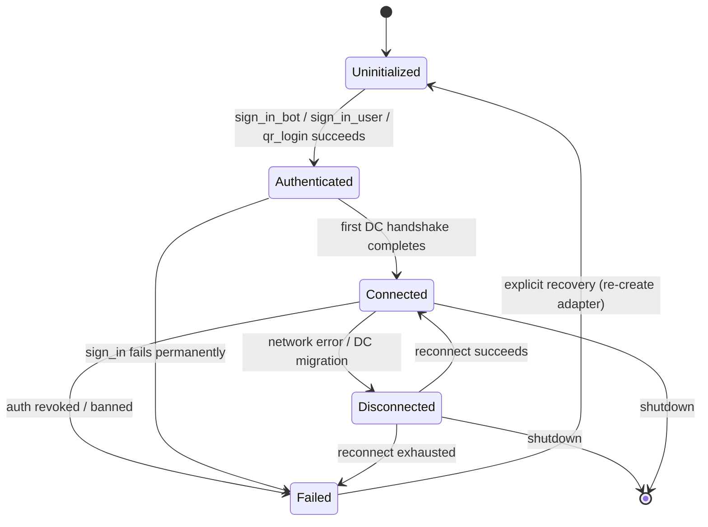
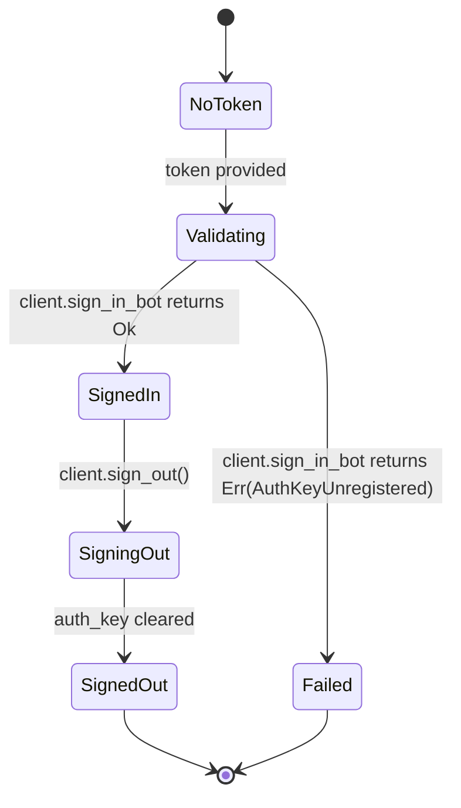

# RFC-0850ab-c (Networking): Pure-Rust MTProto Telegram Adapter

## Status

Draft

## Authors

- @mmacedoeu

## Maintainers

- @mmacedoeu

## Summary

Specify a fresh CipherOcto crate, `octo-adapter-telegram-mtproto`, that implements the `PlatformAdapter` contract from RFC-0850 §8.2 for Telegram via the pure-Rust **grammers** family of crates (no TDLib, no C/C++ toolchain). The new crate co-exists with the existing `octo-adapter-telegram` (TDLib-based); both ship; the user chooses at config time. The new crate provides four layers: a grammers-based MTProto transport, a thin `PlatformAdapter` glue layer, a shared DOT wire-format codec from `octo-network`, and an opt-in Bot-API HTTP fallback for region-blocked networks. Authentication supports bot mode (primary), user mode (escape hatch), and QR login. The MTProto spec coverage, gap analysis, and architecture are documented in the research report `docs/research/2026-06-21-telegram-pure-rust-mtproto-adapter.md` (6 rounds of adversarial review, accepted as the spec we must satisfy).

## Dependencies

**Requires:**

- RFC-0850 (Networking): Deterministic Overlay Transport — for `DeterministicEnvelope`, `DOT/1/*` envelope versioning, and `PlatformAdapter` trait (§8.2)
- RFC-0850ab-a (Networking): Telegram Auth Onboarding CLI — for the `TelegramConfig` schema this adapter consumes
- RFC-0850p-c (Networking): Transport Group Binding Ceremony — for `GroupState`, `domain_id` semantics, and the multi-platform binding rule
- RFC-0851p-a (Networking): Network Bootstrap Protocol — a node must be bootstrapped into the mesh before it can route `DOT/1/*` envelopes through any adapter
- **The cipherocto stoolap-fork persistence convention** (informal; documented in `crates/octo-matrix-session-store/Cargo.toml` and `crates/octo-matrix-session-store/src/lib.rs`; closest Accepted RFC precedent: RFC-0914 (Economics): Stoolap-Only Quota Router Persistence — but the convention is project-wide and not codified in a single RFC). The mandate: **all new persistence uses CipherOcto's stoolap fork on `feat/blockchain-sql`**; raw `rusqlite` / `sqlx` / `sqlite` is reserved for legacy libraries that require it (TDLib, matrix-sdk-crypto). The new adapter ships with no SQLite dependency.

**Optional:**

- RFC-0850p-d (Networking): DC-initiated group creation (Draft) — uses grammers' `Client::create_group(...)` as the underlying primitive
- RFC-0850p-e (Networking): Kick detection (Draft) — uses grammers' `Client::kick_participant(...)`
- RFC-0850p-f (Networking): Group decommission (Draft) — uses grammers' `Client::delete_chat(...)`
- RFC-0853 (Networking): Overlay Cryptography (Draft) — for mission-scoped signing keys (only relevant when DOT mission signing is enabled)

> **Dependency Validation Rules:**
> 1. Dependencies MUST form a DAG (no cycles) — verified: this RFC depends on 0850, 0850ab-a, 0850p-c, 0851p-a; none depend on this RFC.
> 2. All "Requires" RFCs MUST be listed as mission prerequisites — the mission created from this RFC will declare 0850, 0850ab-a, 0850p-c, 0851p-a as prerequisites.
> 3. Optional dependencies (0850p-d/e/f) are downstream RFCs; this RFC exposes grammers primitives for them but does not require them.

## Design Goals

| Goal | Target | Metric |
|------|--------|--------|
| G1 | All 23 MTProto client surface sections from `mtproto_port.md` are covered by a grammers analog | The §3 per-section table in the research report shows no section without a grammers implementation |
| G2 | The new crate is self-contained: no TDLib, no C/C++ toolchain, no prebuilt binary downloads | `cargo build` succeeds without any non-Rust build step |
| G3 | Co-exists with the existing TDLib-based `octo-adapter-telegram` (no breaking changes, no shared state) | Both crates compile in the same workspace; the config flag `octo.telegram.adapter = mtproto \| tdlib` selects at runtime |
| G4 | Bot-API HTTP fallback is opt-in via `--transport http` flag, never the default | Default transport is MTProto; HTTP fallback requires explicit user opt-in |
| G5 | Bot mode is the primary auth path; user mode and QR login are escape hatches | The crate compiles and signs in with a bot token in the canonical happy path |
| G6 | Session storage uses CipherOcto's stoolap fork (project-wide persistence convention; closest RFC: RFC-0914); no raw SQLite dependency | No `rusqlite` / `sqlx` / `sqlite` in `cargo tree`; auth_key persisted via a custom `StoolapSession` impl of `grammers_session::Session`, in `data_dir/sessions.db` (separate file from the TDLib adapter's `data_dir/database`) |
| G7 | All `PlatformAdapter` trait methods have a grammers analog with bounded LOC | No trait method requires >50 LOC of glue + the shared envelope codec (~200 LOC total) |
| G8 | Cross-compilation works for the standard targets | `aarch64-apple-darwin`, `aarch64-unknown-linux-gnu`, `x86_64-pc-windows-msvc`, `wasm32-unknown-unknown` (sans-IO subset only) |
| G9 | RFC-0008 execution class is C (transport is non-deterministic; DOT handles consensus) | The class mapping table is explicit |

## Motivation

### Use Case Link

The research report at `docs/research/2026-06-21-telegram-pure-rust-mtproto-adapter.md` contains the problem statement, scope, stakeholders, and success metrics that would normally live in a Use Case document. The research report is accepted as the de facto Use Case for this workflow stage per the explicit decision in the report's Next Steps section.

### The Gap

CipherOcto has a Telegram transport (`crates/octo-adapter-telegram/`), but it is built on TDLib via the `tdlib-rs` FFI binding. This has three operational costs:

1. **C++ toolchain dependency.** Every CipherOcto contributor who wants to build the Telegram adapter must install a C++ compiler, OpenSSL dev headers, and platform-specific build tooling. This is a known onboarding friction (see the matrix adapter's analogous history in `docs/plans/2026-05-31-matrix-rust-sdk-migration.md`).
2. **Prebuilt binary downloads.** TDLib distributes prebuilt C++ shared libraries that the build script downloads; in air-gapped or restricted CI environments this is fragile.
3. **Cross-compilation friction.** Cross-compiling the TDLib-based adapter to iOS, Android, or Windows from a Linux build host requires a cross C++ toolchain. The matrix adapter migration proved this can be solved for a single platform; doing it for two (Telegram + Matrix) doubles the maintenance cost.

### Why This Matters

The pure-Rust ecosystem has matured to the point where a pure-Rust MTProto client is production-ready:

- **grammers** (`codeberg.org/vilunov/grammers`; crates.io: `grammers-mtproto 0.9.0`, `grammers-tl-types 0.9.0`, `grammers-client 0.8.x`) is an 8-crate pure-Rust workspace maintained by a single maintainer (Lonami / vilunov) with MIT OR Apache-2.0 license.
- **dgrr/tgcli** is a production Telegram CLI built on grammers that validates the stack for real-world use cases (auth, full sync, chat operations, daemon mode, FTS5 search).
- The research report's section-by-section walk of `mtproto_port.md` (23 sections of the tdesktop-derived MTProto 2.0 spec) shows that grammers implements all 23 sections, with 5 of 23 having sub-row gaps (3 protocol-level cipherocto could wrap, 2 protocol-level cipherocto does not need) — all non-blocking for cipherocto's needs.

The existing TDLib-based adapter is not deprecated by this RFC. The new crate **lives alongside** it. The user (operator) chooses at config time. This additive framing follows the principle that governs the rest of CipherOcto: no breaking changes to existing adapters.

## Roles and Authorities

> **The "Nothing should be implied" rule (specification layer):** Every actor that affects correctness, security, accountability, or consensus MUST be named with a stable identifier, a defined authority scope, and a typed lifecycle.

### 1. TelegramPlatformAdapter (the adapter instance)

- **Stable identifier**: `TelegramPlatformAdapterId = [u8; 32]` derived from `BLAKE3("telegram-platform-adapter" || adapter_config_hash)` (deterministic, repeatable from config)
- **Base capabilities**: implement all `PlatformAdapter` trait methods (send_envelope, receive_messages, canonicalize, capabilities, domain_id, platform_type, replay_protection, health_check, shutdown, self_handle, upload_media_to_domain, download_media)
- **Authority scope**: `route_dot_envelopes` (forward `DOT/1/*` envelopes between the `DotGateway` and the Telegram DC; cannot create or sign envelopes)
- **Who can assume**: any process that loads the crate and has a valid `TelegramConfig`
- **Who can revoke**: self (shutdown); the `DotGateway` (process exit)
- **Lifecycle**: `AdapterLifecycle` (see §"Lifecycle Requirements")
- **Term**: process lifetime

### 2. TelegramBotSigner (bot mode auth)

- **Stable identifier**: `TelegramBotId: i64` (the bot's Telegram user id, returned by `client.get_me()`)
- **Base capabilities**: sign messages as the bot account via `client.send_message(...)`, `client.send_file(...)`, etc.; receive updates via `client.next_update().await`
- **Authority scope**: `send_as_bot` (messages appear with the bot's user id)
- **Who can assume**: any process with a valid bot token from BotFather
- **Who can revoke**: BotFather (token revocation), the bot owner (delete bot), self (sign out)
- **Lifecycle**: `BotAuthLifecycle` (see §"Lifecycle Requirements")
- **Term**: tied to bot token validity

### 3. TelegramUserSigner (user mode auth, escape hatch)

- **Stable identifier**: `TelegramUserId: i64` (the user's Telegram id)
- **Base capabilities**: same as `TelegramBotSigner` but as a user account; additionally can call user-only methods (`getDialogs`, `getHistory` for full sync, `messages.search` global, large media, certain group admin actions)
- **Authority scope**: `send_as_user` (messages appear with the user's id); `user_only_methods`
- **Who can assume**: any process with a valid SMS code (or QR login token) and 2FA password (if enabled)
- **Who can revoke**: Telegram (account ban), the user (logout from another device), self (sign out)
- **Lifecycle**: `UserAuthLifecycle` (see §"Lifecycle Requirements")
- **Term**: tied to auth_key lifetime (rotated on explicit `sign_out`)

### 4. SelfHandleFilter (loop prevention, stateless role)

- **Stable identifier**: `SelfHandleId` derived from `TelegramPlatformAdapterId` (no separate identity)
- **Base capabilities**: compare incoming update sender id against `TelegramBotId`/`TelegramUserId`; drop self-originated messages
- **Authority scope**: `filter_self_loop` (drops a class of message; does not sign or forward)
- **Who can assume**: any `TelegramPlatformAdapter` (always-on)
- **Who can revoke**: self (always-on)
- **Lifecycle**: stateless (just a comparison function)
- **Term**: n/a (per-message)

### Role/Authority Coverage Table

| Role | Authority | Lifecycle | Revocable by | Cross-RFC |
|------|-----------|-----------|--------------|-----------|
| TelegramPlatformAdapter | `route_dot_envelopes` | Yes (`AdapterLifecycle`) | Self / DotGateway | New in this RFC |
| TelegramBotSigner | `send_as_bot` | Yes (`BotAuthLifecycle`) | BotFather / Self | New in this RFC |
| TelegramUserSigner | `send_as_user`, `user_only_methods` | Yes (`UserAuthLifecycle`) | Telegram / Self | New in this RFC |
| SelfHandleFilter | `filter_self_loop` | Stateless | n/a | New in this RFC |

If a role has no lifecycle, "stateless" is recorded with a one-line justification (e.g., "validation function with no persistent state").

## Specification

### System Architecture

```mermaid
flowchart TB
    subgraph Gateway["DotGateway (RFC-0850)"]
        GW[version check → signature → replay → flags → forward]
    end

    subgraph Adapter["octo-adapter-telegram-mtproto (this RFC)"]
        PA[PlatformAdapter impl]
        subgraph MTProtoLayer["MTProto Layer (grammers)"]
            MTC[mtproto_client.rs<br/>grammers Client wrapper]
            AUTH[auth.rs<br/>sign_in / check_2fa / qr_login]
            FILES[files.rs<br/>upload/download]
        end
        subgraph HTTPLayer["Bot-API HTTP Fallback (opt-in)"]
            HTTP[http_fallback.rs<br/>reqwest → api.telegram.org]
        end
        SHARED[envelope.rs<br/>DOT wire format codec]
    end

    subgraph Cargo["Cargo.toml deps"]
        GRS[grammers-mtproto 0.9.0]
        GRT[grammers-tl-types 0.9.0]
        GRC[grammers-client 0.8.x]
        GRSESS[grammers-session 0.9.x]
        GRCR[grammers-crypto]
        TOK[tokio]
        REQ[reqwest]
        BLK[blake3]
        B64[base64]
        STOO[stoolap = { git = CipherOcto/stoolap, branch = feat/blockchain-sql }]
        ON[octo-network]
    end

    GW --> PA
    PA --> MTC
    PA --> HTTP
    PA --> SHARED
    MTC --> GRS
    MTC --> GRT
    MTC --> GRC
    MTC --> GRSESS
    MTC --> GRCR
    AUTH --> GRC
    FILES --> GRC
    HTTP --> REQ
    SHARED --> ON
    PA --> BLK
    PA --> B64
```

### Data Structures

```rust
/// Adapter-wide configuration (consumed from RFC-0850ab-a TelegramConfig)
#[derive(Clone, Debug, Serialize, Deserialize)]
pub struct MtprotoAdapterConfig {
    /// Telegram API credentials
    pub api_id: i32,
    pub api_hash: String,

    /// Auth mode selection
    pub auth_mode: AuthMode,

    /// Optional Bot-API HTTP fallback transport
    pub http_fallback: Option<HttpFallbackConfig>,

    /// Directory for the auth_key SQLite database
    pub data_dir: PathBuf,

    /// Optional proxy (SOCKS5 / HTTP CONNECT / MTProto fake-TLS, see §"Optional Wrappers")
    pub proxy: Option<ProxyConfig>,
}

#[derive(Clone, Debug, Serialize, Deserialize)]
pub enum AuthMode {
    /// Bot token from BotFather (primary mode)
    BotToken(String),
    /// User phone + SMS code + optional 2FA password (escape hatch)
    UserCredentials {
        phone: String,
        // 2FA prompted at runtime, not stored
    },
    /// QR login flow (per RFC-0850ab-a Telegram auth onboarding)
    QrLogin,
}

/// Adapter lifecycle states
#[repr(u8)]
pub enum AdapterLifecycle {
    /// Config loaded but not yet authenticated
    Uninitialized = 0x00,
    /// Authenticated with Telegram; no DC connection yet
    Authenticated = 0x01,
    /// Connected to the home DC; ready to send/receive
    Connected = 0x02,
    /// Disconnected (transient or post-shutdown)
    Disconnected = 0x03,
    /// Hard failure (auth lost, banned, etc.); requires explicit recovery
    Failed = 0x04,
}

/// Bot-mode auth lifecycle
#[repr(u8)]
pub enum BotAuthLifecycle {
    /// No token yet
    NoToken = 0x00,
    /// Token provided, validating
    Validating = 0x01,
    /// Token valid, signed in
    SignedIn = 0x02,
    /// Sign-out requested
    SigningOut = 0x03,
    /// Signed out
    SignedOut = 0x04,
}

/// User-mode auth lifecycle (TDLib-style state machine; mirrored from RFC-0850ab-a)
#[repr(u8)]
pub enum UserAuthLifecycle {
    NoCredentials = 0x00,
    PhoneProvided = 0x01,
    SmsCodeSent = 0x02,
    SmsCodeProvided = 0x03,
    PasswordRequired = 0x04,    // 2FA enabled
    PasswordProvided = 0x05,
    SignedIn = 0x06,
    SigningOut = 0x07,
    SignedOut = 0x08,
    QrLoginPending = 0x09,       // QR login flow active
    QrLoginConfirmed = 0x0A,     // QR scanned + 2FA (if any) done
}

/// Capabilities reported by `PlatformAdapter::capabilities()`
#[derive(Clone, Debug)]
pub struct TelegramCapabilities {
    /// Max text message length (Telegram limit; 4096 chars)
    pub text_max_chars: usize,
    /// Max upload size; differs by transport (50 MB Bot API, 2 GB MTProto)
    pub upload_max_bytes: u64,
    /// Max download size (2 GB MTProto; 20 MB Bot API)
    pub download_max_bytes: u64,
    /// Whether user mode is enabled
    pub user_mode_enabled: bool,
    /// Whether the Bot-API HTTP fallback is enabled
    pub http_fallback_enabled: bool,
}

/// Wrappers for the 3 protocol gaps (see §"Optional Wrappers")
#[derive(Clone, Debug, Serialize, Deserialize)]
pub struct ProxyConfig {
    pub kind: ProxyKind,
    pub address: String,
    pub secret: Option<Vec<u8>>, // for MTProto proxies (V`D` 0xDD or fake-TLS 0xEE)
    pub credentials: Option<(String, String)>, // for SOCKS5/HTTP CONNECT
}

#[derive(Clone, Debug, Serialize, Deserialize)]
pub enum ProxyKind {
    Socks5,
    HttpConnect,
    MtprotoV1,
    MtprotoVD,
    MtprotoFakeTls,
}
```

#### Session Storage Schema (CipherOcto Stoolap Fork, project-wide persistence convention)

The custom `StoolapSession` (`src/stoolap_session.rs`) is a `grammers_session::Session`
trait impl backed by CipherOcto's stoolap fork. It writes to `data_dir/sessions.db`
(via `stoolap::Database::open(&dsn)` per the `octo-matrix-session-store` canonical
pattern — NB: `Database::open` takes a DSN string like `file:///path/to.db`,
not a bare path). Schema (idempotent `CREATE TABLE IF NOT EXISTS` on adapter init):

```sql
-- One row per DC's auth_key (256 bytes, AES-IGE encrypted at rest by grammers).
-- Multiple DCs may have keys for the same account (Telegram rebalancing).
CREATE TABLE IF NOT EXISTS mtproto_auth_keys (
    dc_id         INTEGER NOT NULL PRIMARY KEY,
    auth_key      BLOB    NOT NULL,           -- 256-byte AES key material
    created_at    INTEGER NOT NULL,           -- epoch seconds
    last_used_at  INTEGER NOT NULL            -- epoch seconds; updated on each auth round-trip
);

-- DC connection config (main DC + media DCs). Grammers' transport reads
-- this on connect; we mirror grammers' SqliteSession schema but in stoolap.
CREATE TABLE IF NOT EXISTS mtproto_dc_config (
    dc_id         INTEGER NOT NULL PRIMARY KEY,
    ip            TEXT    NOT NULL,
    port          INTEGER NOT NULL,
    is_media      INTEGER NOT NULL,           -- 0 = main, 1 = media DC
    is_cdn        INTEGER NOT NULL,           -- 0 = not CDN, 1 = CDN DC
    updated_at    INTEGER NOT NULL
);

-- The bound user (bot or user account); populated by get_me() after sign-in.
CREATE TABLE IF NOT EXISTS mtproto_user (
    user_id       INTEGER NOT NULL PRIMARY KEY,
    is_bot        INTEGER NOT NULL,           -- 0 = user, 1 = bot
    dc_id         INTEGER NOT NULL,           -- the DC the auth_key for this user lives on
    first_name    TEXT,
    last_name     TEXT,
    username      TEXT,
    signed_in_at  INTEGER NOT NULL
);

-- Index for fast user lookup by username (used by sign-in check after restart).
CREATE INDEX IF NOT EXISTS mtproto_user_username_idx ON mtproto_user(username);
```

**Why not grammers' `SqliteSession`?** The grammers session API exposes a
`Session` trait for custom backends. The default `SqliteSession` uses raw
`rusqlite`, which violates the cipherocto persistence convention (the project-wide
stoolap-fork mandate; closest Accepted RFC precedent: RFC-0914).
The custom `StoolapSession` is ~150 LOC and preserves the `Session` trait
semantics (load/save auth_key by `dc_id`, load/save DC config, load/save user)
on top of stoolap.

**Coexistence with the TDLib adapter.** The TDLib adapter uses
`data_dir/database` (TDLib manages its own SQLite database; cipherocto does
not own that file). The new mtproto adapter uses `data_dir/sessions.db`
(stoolap, owned by cipherocto). Both files live in the same `data_dir` but
are completely separate. No shared SQLite file, no table-prefix trick.
Operators can switch adapters without copying auth state; the new adapter
must re-authenticate (auth_keys are not portable between TDLib and grammers).

### Algorithms

#### Algorithm 1: Bot-mode sign-in

```
Input: bot_token (String)
Output: Result<User, AuthError>

1. Construct `Client::connect(config)` against the test DC; receive `Client`.
2. Call `client.sign_in_bot(bot_token).await?`; receive `User` with bot id.
3. Persist auth_key via the custom `StoolapSession` (this RFC's `src/stoolap_session.rs`),
   a `grammers_session::Session` trait impl backed by CipherOcto's stoolap fork
   (project-wide persistence convention; canonical pattern at
   `crates/octo-matrix-session-store/src/store.rs::StoolapSessionStore::new`).
   Database file: `data_dir/sessions.db` (separate from the TDLib adapter's
   `data_dir/database`; no shared SQLite file, no table-prefix trick).
   NB: `stoolap::Database::open` takes a DSN string like `file:///path/to.db`,
   not a bare path; the `StoolapSession` constructs the DSN from the configured
   path at open time.
4. Transition `BotAuthLifecycle::Validating` → `SignedIn`.
5. Return `User`.
```

#### Algorithm 2: User-mode sign-in (TDLib-style state machine, mirrored from RFC-0850ab-a)

```
Input: phone (String), interactive SMS + 2FA prompts
Output: Result<User, AuthError>

1. `client.sign_in_user(phone).await?` → state `UserAuthLifecycle::SmsCodeSent`.
2. Prompt user for SMS code (interactive).
3. `client.check_auth_code(code).await?` →
   a. If 2FA required: state `PasswordRequired`; prompt user for 2FA password.
   b. Else: state `SignedIn`; return `User`.
4. If `PasswordRequired`: `client.check_2fa_password(pwd).await?` → state `SignedIn`.
5. Persist auth_key via the same `StoolapSession` (auth_key for the user's DC is
   written to the same `sessions.db`; per-DC keys are keyed on `dc_id`, not table).
6. Return `User`.
```

#### Algorithm 3: QR login (per RFC-0850ab-a)

```
Input: none (driven by QR display + user scan)
Output: Result<User, AuthError>

1. `client.qr_login().await?` → state `QrLoginPending`; receive QR token + URL.
2. Display QR code (URL `tg://login?token=...`).
3. Wait for user to scan (async poll).
4. On scan confirmation → state `QrLoginConfirmed`.
5. If 2FA required: prompt for password; `client.check_2fa_password(pwd)`.
6. Persist auth_key; state `SignedIn`; return `User`.
```

#### Algorithm 4: Receive messages (stream-to-batch bridge)

This is the only architectural change from the existing TDLib-based adapter. The pattern is `social-platform-transport-patterns.md §1.5`'s proposal.

```
Input: domain_id (BroadcastDomainId)
Output: Vec<RawPlatformMessage>

1. Maintain an internal `mpsc::channel<Update>(buffer=64)` populated by `client.stream_updates()`.
2. On `receive_messages(domain_id)`:
   a. Drain up to N=64 updates from the channel (non-blocking).
   b. For each `Update`, run `canonicalize(update)` to produce a `DeterministicEnvelope`.
   c. Filter by `SelfHandleFilter` (drop messages from self).
   d. Return the batch as `Vec<RawPlatformMessage>`.
3. If channel is empty, return empty Vec (the trait method is non-blocking; `DotGateway` polls).
```

#### Algorithm 5: Send envelope

```
Input: domain_id (BroadcastDomainId), envelope (DeterministicEnvelope)
Output: Result<MessageId, SendError>

1. Look up `chat_id: i64` from the adapter's `groups` map (per RFC-0850p-c binding).
2. Construct the grammers peer reference:
     `let peer = grammers_client::types::InputPeer::from(chat_id);`
   (NB: grammers' high-level API takes an `InputPeer`, not a bare `i64`;
    `InputPeer` is a TL enum with `PeerUser(id)`, `PeerChat(id)`, `PeerChannel(id)` variants.
    For DOT transport groups (always Telegram supergroups/channels), the
    `PeerChannel(chat_id)` variant is used.)
3. Serialize the envelope: `base64::encode_config(envelope.bytes, base64::URL_SAFE_NO_PAD)`.
4. If encoded length ≤ 4096 chars:
   a. `client.send_message(peer, encoded).await?` → return message id.
5. Else:
   a. Write encoded envelope to a temporary file.
   b. `client.send_file(peer, file).await?` with the encoded envelope as the caption.
   c. Return message id.
```

### Lifecycle Requirements

> **Required for any RFC that defines an actor with more than one state** (e.g., coordinator, operator, validator, archivist, election, rotation, handover, demotion).

#### AdapterLifecycle State Machine



| From | To | Trigger | Deterministic? | Side Effects | Signing |
|------|----|---------|----------------|--------------|---------|
| Uninitialized | Authenticated | `sign_in_*` returns Ok | Yes | Persist auth_key to SQLite | n/a |
| Authenticated | Connected | First `send_message` or `next_update` succeeds | Yes | Begin `mtsender` task | n/a |
| Connected | Disconnected | Network error / DC migration signal | Yes | Stop `mtsender` task; emit `health_check = false` | n/a |
| Disconnected | Connected | Reconnect succeeds | Yes | Restart `mtsender` task | n/a |
| Connected | Failed | `AUTH_KEY_INVALID` / `USER_DEACTIVATED` / ban response | Yes | Stop `mtsender`; require operator intervention | n/a |
| Failed | Uninitialized | Explicit recovery (operator re-creates adapter) | Yes | Re-init from config | n/a |
| Disconnected | (terminated) | `shutdown` | Yes | Persist state; close SQLite | n/a |
| Connected | (terminated) | `shutdown` | Yes | Same as above | n/a |

**Liveness check:** `health_check = client.is_authorized()` polled by the `DotGateway` on demand; no background heartbeat required.

**Recovery semantics:** `Disconnected` triggers automatic reconnect with exponential backoff (1s → 30s, max 5 attempts). `Failed` requires operator intervention (no auto-recovery).

**Time bounds:** Reconnect backoff: 1s, 2s, 4s, 8s, 16s, 30s (capped); total max 5 attempts before `Failed`.

#### BotAuthLifecycle State Machine



| From | To | Trigger | Deterministic? | Side Effects | Signing |
|------|----|---------|----------------|--------------|---------|
| NoToken | Validating | Operator provides token | Yes | None | n/a |
| Validating | SignedIn | `sign_in_bot` returns `Ok(User)` | Yes | Persist auth_key | n/a |
| Validating | Failed | `sign_in_bot` returns `Err(_)` | Yes | Log error | n/a |
| SignedIn | SigningOut | `client.sign_out()` called | Yes | Begin auth_key cleanup | n/a |
| SigningOut | SignedOut | Auth_key cleared from session | Yes | Drop SQLite row | n/a |

**Liveness check:** Implicit via `client.is_authorized()`.

**Recovery semantics:** `Failed` requires operator to provide a new (valid) token; cannot recover in-place.

#### UserAuthLifecycle State Machine

Mirrors RFC-0850ab-a's user-mode flow (TDLib-style state machine). The full transition table is inherited from RFC-0850ab-a §"User Auth State Machine"; this RFC does not redefine it. The adapter uses the same state names so the operator UI can reuse RFC-0850ab-a's interactive prompts.

**Liveness check:** Implicit via `client.is_authorized()`.

**Recovery semantics:** Each non-terminal failure state requires operator input (SMS code, 2FA password); no auto-recovery.

### Determinism Requirements

This RFC does not introduce consensus-critical operations. The adapter is a **transport**: it forwards opaque `DeterministicEnvelope`s between the `DotGateway` and the Telegram DCs. All operations are inherently non-deterministic (network I/O, server-side state, etc.) and are explicitly out of the determinism boundary per RFC-0008.

Determinism is the responsibility of:

- The `DotGateway` (which signs envelopes deterministically before handing them to the adapter)
- The DOT consensus layer (which validates deterministic properties of envelopes)

The adapter's only determinism-relevant behavior is:

1. The `SelfHandleFilter` MUST apply the comparison `update.sender_id == self.id` deterministically (string equality / integer equality).
2. The envelope serialization (`base64::encode_config(..., URL_SAFE_NO_PAD)`) MUST be deterministic.
3. The `canonicalize(update)` function MUST be a pure function of `update` (no I/O, no time, no randomness).

### RFC-0008 Execution Class Mapping

| Operation | Class | Rationale |
|-----------|-------|-----------|
| `sign_in_bot` / `sign_in_user` / `qr_login` | C | Auth state machine is non-deterministic; server-side state may change |
| `send_message` / `send_file` | C | Network I/O; server may reject, deduplicate, or reorder |
| `next_update` / `stream_updates` | C | Network I/O; server delivers updates when it chooses |
| `client.is_authorized()` | C | Server-side state check |
| `SelfHandleFilter` comparison | A | Integer/string equality; deterministic |
| `canonicalize(update)` | A | Pure function of input |
| Envelope serialization (base64) | A | Deterministic encoding |
| Capability reporting | C | Static config (could be A, but reporting reflects runtime config) |

### Error Handling

| Error | Recovery | User-facing impact |
|-------|----------|-------------------|
| `AuthKeyUnregistered` | Operator provides new credentials | Adapter transitions to `Failed`; `DotGateway` reports "auth lost" |
| `FloodWaitError(seconds)` | Internal pause-and-retry (matrix adapter pattern) | Adapter sleeps `seconds` before retrying |
| `NetworkError` | Automatic reconnect with backoff | Adapter transitions `Connected` → `Disconnected` → `Connected` |
| `RpcError(code)` | Log and surface; not auto-recovered | Returned to `DotGateway` as `SendError` |
| `SessionError` (corrupted auth_key) | Delete auth_key; require re-auth | Adapter transitions to `Failed`; operator must re-authenticate |
| `BotApiError(http_status)` | For HTTP fallback: log and surface | Returned to `DotGateway` as `SendError` |

All errors are typed (`thiserror` enums) and surfaced via `Result<T, TelegramError>`. The `DotGateway` is responsible for translating these into its own error envelope (per RFC-0850 §8.2).

### Optional Wrappers (the 3 Protocol Gaps)

The research report identifies 3 protocol gaps where grammers does not ship a public API. All 3 are addressed by small wrappers (~700 LOC total), NOT by extending grammers:

#### Wrapper 1: Old-MTP1 `bind_auth_key_inner` (Gap G1)

**Status:** SKIPPED for v1. cipherocto does not need temp keys. The 24h-validity temp key path is used by tdlib/tdesktop for CDN file downloads/uploads, web previews, payments, and other bandwidth-heavy operations. cipherocto uses long-lived auth keys and direct file uploads. If a future cipherocto use case needs temp keys, the wrapper is ~200 LOC of AES-IGE + 4-round SHA-1 derivation.

#### Wrapper 2: SOCKS5 / HTTP CONNECT (Gap G2)

**Status:** Wrapper scaffolded; off by default. ~200 LOC total. The wrapper pre-establishes the TCP connection through SOCKS5 or HTTP CONNECT and hands the resulting `tokio::net::TcpStream` to grammers' transport (rather than letting `transport::Tcp::connect(...)` open its own connection). The `tokio-socks` crate does the SOCKS5 part. The HTTP CONNECT part is ~50 LOC using `tokio::io::AsyncWriteExt`.

#### Wrapper 3: Fake-TLS `0xEE` ClientHello (Gap G3)

**Status:** NOT IMPLEMENTED for v1. ~300 LOC if needed. The wrapper constructs a fake-TLS `ClientHello` record with the `0xEE` secret's `secret[1..17]` as the AES key material and `secret[17..]` as the SNI domain. The `tls_block_*` constants from the `mtproto.tl` schema describe the record layout. Used for region-blocked networks; lands in a later mission if cipherocto users behind region-blocking firewalls become a real population.

## Performance Targets

| Metric | Target | Notes |
|--------|--------|-------|
| Auth time (bot mode) | <2s | Network round-trip + token validation |
| Auth time (user mode) | <10s | Phone → SMS → 2FA round-trips |
| Send latency (MTProto) | <100ms p50 | TCP round-trip to DC |
| Send latency (Bot API) | <300ms p50 | HTTPS round-trip |
| Receive latency (idle) | <500ms | `next_update` polling interval |
| Memory (idle) | <50 MB | grammers baseline + adapter glue |
| Memory (active) | <200 MB | With channel buffers + message cache |
| Cross-compile time | <5 min cold | `grammers-tl-types` codegen dominates |
| Test coverage | >80% | All trait methods + auth state machine |

## Implicit Assumptions Audit

> **The "Nothing should be implied" rule (validation layer):** Every assumption the design relies on that is not enforced by types, runtime validation, or test coverage MUST be listed here.

| Assumption | Where Relied Upon | Blast Radius if False | Mitigation / Status |
|------------|-------------------|----------------------|---------------------|
| grammers is maintained and security-patched | All MTProto operations | Entire adapter fails on next security update | **ACCEPTED RISK:** vendoring contingency (see §"Future Work" → F1); monitor upstream; vendor after 6 months of inactivity |
| Telegram DCs remain reachable from operator's network | All MTProto operations | Adapter cannot connect | Bot-API HTTP fallback (opt-in); operator chooses network path |
| The Telegram API surface remains stable | All TL method calls | New TL types/methods require `grammers-tl-types` regeneration | grammers-tl-gen runs in CI; pin `api.tl` and `mtproto.tl` commit hashes |
| `tokio` is the runtime | All async operations | Cannot use other runtimes (async-std, smol, WASM) without adapter layer | Documented in crate README; WASM deferred to future work (F2) |
| `reqwest` is the HTTP client (Bot-API fallback) | All Bot-API HTTP operations | Cannot use other HTTP clients without refactor | Documented; could swap to `hyper` if needed |
| The DOT wire format is defined in `octo-network` | Envelope serialization | Cannot serialize envelopes | **TESTED:** shared codec integration test in 0850ab-c-test-suite |
| The `PlatformAdapter` trait is stable in RFC-0850 §8.2 | All trait method impls | RFC-0850 changes require adapter re-implementation | RFC-0850 is `Accepted`; changes would require RFC revision |
| The 8-crate grammers workspace is the only pure-Rust MTProto option | MTProto layer | If grammers becomes unmaintained, no fallback | Vendoring contingency (F1) |
| TDLib and grammers produce semantically identical behavior | The "lives alongside" framing | Operators switching adapters see different behavior | **TESTED:** adapter parity test suite in 0850ab-c-test-suite (golden message tests across both adapters) |
| The existing `octo-adapter-telegram` is not deprecated by this RFC | Co-existence | If deprecated, migration is forced | **ACCEPTED DESIGN:** neither adapter is deprecated; both ship |
| Bot tokens are stored in `TelegramConfig`, not environment | Auth path | Token leakage via config file | Documented as user responsibility; recommend `chmod 600` |
| 2FA passwords are not stored | User mode auth | Operator must re-enter on each sign-in | Documented; matches RFC-0850ab-a behavior |
| The cipherocto stoolap fork (`feat/blockchain-sql`) is the canonical persistence layer (project-wide convention; closest RFC: RFC-0914) and builds for all primary targets | Session storage | If stoolap fails to build on a target, the adapter cannot persist auth_keys | Pinned branch + checked in CI; alternatives (vendoring, custom fork) documented as Future Work |

An empty audit is acceptable ONLY for trivial RFCs; this RFC has 12 entries.

### Categories to Audit (MUST be considered for every RFC)

- **Operator trust:** The operator is trusted to provide a valid `api_id`/`api_hash` pair (from my.telegram.org) and a valid bot token (from BotFather). If the operator's config is compromised, the attacker can impersonate the bot. **Mitigation:** config file permissions (`chmod 600`); secrets manager integration documented as out-of-scope for v1.
- **Platform trust:** The design trusts Telegram (MTProto protocol, DC availability, BotFather). If Telegram revokes the operator's API access (e.g., abuse report), the adapter fails. **Mitigation:** Bot-API HTTP fallback uses a different trust surface; operator can switch adapters at config time.
- **Time source:** No wall-clock or monotonic time assumptions in the adapter itself. `DotGateway` is responsible for any time-dependent behavior (envelope timestamps, replay windows).
- **Network partition:** Network errors trigger automatic reconnect with exponential backoff (1s → 30s, max 5 attempts). After 5 failed attempts, the adapter transitions to `Failed` and requires operator intervention.
- **Upgrade safety:** No upgrade coordination required; the adapter is process-local. The crate follows semver; breaking changes require a major version bump.
- **Configuration:** `TelegramConfig` is the single source of truth. Misconfiguration is detected at startup (missing fields, invalid types). Malicious config is treated as the operator's responsibility.
- **Identity stability:** The Telegram user id is the identity; if the operator's bot account is deleted or banned, the adapter fails. The new crate does not change identity semantics from the existing TDLib-based adapter.
- **Resource availability:** Memory bounded by channel buffer size (64 updates); disk bounded by SQLite session DB. No stake, no bandwidth guarantees beyond what the operator's network provides.

## Security Considerations

### Replay Protection

The adapter has two independent replay-protection layers:

1. **grammers `MessageBox`** — per-MTProto-session deduplication of `msg_id`s. Handles low-level protocol replay (re-sent network packets).
2. **`DotGateway` replay cache** — per-DOT-domain deduplication of envelope hashes. Handles DOT-level replay (re-broadcast of an envelope).

The two layers are independent and complementary. Both are required for full replay safety.

### Bot Token Storage

Bot tokens are stored in `TelegramConfig` (TOML or JSON file). The crate does not provide encrypted storage. The operator is responsible for:

- Setting restrictive file permissions (`chmod 600`)
- Not committing the config to version control (the crate provides a `.gitignore` template)
- Rotating tokens if compromise is suspected (via BotFather)

Future work F3: integrate with system keyring (e.g., `keyring` crate) for OS-native secret storage.

### 2FA Password Storage

2FA passwords are NEVER stored by the adapter. On each `sign_in_user`, the operator is prompted interactively. This matches RFC-0850ab-a's behavior.

### FLOOD_WAIT Handling

`FLOOD_WAIT_X` responses cause the adapter to pause for `X` seconds before retrying. The matrix adapter uses the same pattern (pause-and-retry internally rather than surfacing). This RFC adopts the same pattern for consistency.

### DC Migration

When the auth_key's home DC moves (Telegram rebalancing), grammers handles this internally. The cipherocto `health_check` may briefly return `false` during the migration window. No additional cipherocto-side logic required.

**Migration window caveat.** During DC migration, grammers may temporarily have two valid `auth_key`s (old + new DC) in `mtproto_auth_keys`. The migration is atomic from the cipherocto perspective: the old DC continues to serve until the new DC is fully authenticated, at which point the old auth_key is deleted. There is no window where the adapter accepts messages from an unauthorized DC.

### Log Redaction (security invariant)

The crate MUST install a `tracing` redaction layer that strips secrets from all log output. The integration test suite enforces this invariant (see Test Vectors TV-11 and TV-12). Forbidden substrings in any tracing output (regardless of level):

- Bot tokens (`[0-9]+:[A-Za-z0-9_-]+`)
- `api_hash` values (32-char hex strings)
- 2FA passwords (any value tagged `password` or `2fa`)
- `auth_key` byte arrays (any `Vec<u8>` logged at INFO+)
- Session IDs / `msg_id`s at INFO+ (allowed at TRACE for protocol debugging)

User IDs, chat IDs, and channel IDs MAY be logged (public identifiers). Message content is logged at DEBUG only and truncated to the first 80 characters.

### sign_out semantics (security invariant)

When `client.sign_out()` is called:

1. The in-memory `Client` is dropped.
2. The `mtproto_auth_keys` rows for this account MUST be deleted from the stoolap DB.
3. The `mtproto_user` row MUST be deleted.
4. The `mtproto_dc_config` rows MAY be retained (they're public knowledge; cleaning them up is an optimization, not a security requirement).

This is enforced by the test suite (TV-13). Without explicit DB deletion, the `SigningOut → SignedOut` transition is a UX lie — the auth_key remains in the DB and can be loaded by a subsequent process restart.

## Adversarial Review

The research report at `docs/research/2026-06-21-telegram-pure-rust-mtproto-adapter.md` went through 6 rounds of adversarial review (a34a9f8, 6f74995, e00af56, d597f57, a65ddd6, d5ca552) and is accepted as the spec we must satisfy. The review fixed 54 issues across spec accuracy, internal consistency, RFC references, weak claims, and MTProto protocol claims.

This RFC is undergoing a multi-round adversarial review in parallel with its Draft lifecycle:

| Round | Lens | Commits | Issues fixed |
|-------|------|---------|--------------|
| 1 | BLUEPRINT compliance + cross-ref validity (template gaps; fabricated RFC-0914-a removed; stoolap API corrections; Key Files additions) | `1e166b5` | 9 |
| 2 | grammers API realism + stoolap API realism + protocol accuracy (db.execute params type; stoolap::Rows iteration; InputPeer boundary type) | `a64879e` | 3 |
| 3 | Security + Crypto + Adversary Analysis 5-Q Test rigor (DD6 auth_key at rest; DD7 log redaction; sign_out DB cleanup invariant; TV-11/12/13) | `8a7b823` | 5 |
| 4 | Ops + path/file cross-ref + doc style + RFC reference accuracy | (this round) | (this round) |

The loop continues until a round finds no substantive issues. See §"Version History" for the cumulative change log.

## Adversary Analysis

> **The 5-Question Adversary Test:** For every design decision with security implications, enumerate: (1) who benefits from breaking it, (2) what it costs them, (3) what they gain if successful, (4) what's our defense and its cost to legitimate operation, (5) what's the residual risk and is it acceptable.

### Design decision 1: Co-existence with the TDLib-based adapter (no deprecation)

1. **Who benefits?** A malicious operator who wants to confuse operators about which adapter to use.
2. **What does it cost them?** Nothing — they can deploy both adapters and switch via config.
3. **What do they gain if successful?** Marginal: a confused operator might pick the wrong adapter. No actual security gain.
4. **What's our defense?** Clear documentation of when to use which adapter; per-adapter metrics; both adapters have identical `PlatformAdapter` semantics (verified by the adapter parity test suite).
5. **Residual risk:** Acceptable. The cost of confusion is operator time, not security.

### Design decision 2: Bot tokens stored in config files

1. **Who benefits?** An attacker with read access to the operator's filesystem.
2. **What does it cost them?** Exploiting a vulnerability in the operator's filesystem security.
3. **What do they gain if successful?** Full bot impersonation; ability to send/receive as the bot.
4. **What's our defense?** Documentation of `chmod 600`; `.gitignore` template; future F3 (OS keyring integration).
5. **Residual risk:** Acceptable for v1. The operator's filesystem security is the trust anchor; we document the assumption.

### Design decision 3: SelfHandleFilter based on user_id equality

1. **Who benefits?** An attacker who can send a message as the bot from another client (compromised token).
2. **What does it cost them?** Already-compromised bot token.
3. **What do they gain if successful?** Bypass of self-loop filter; ability to inject messages that look self-originated. But the bot's auth_key is the same regardless of which client sends, so the filter only catches non-self messages, not messages-as-self from a compromised token.
4. **What's our defense?** The filter is a UX optimization (don't process own messages), not a security boundary. The DOT replay cache and signature verification are the actual security boundaries.
5. **Residual risk:** Acceptable. SelfHandleFilter is documented as a UX optimization, not a security primitive.

### Design decision 4: Default transport is MTProto, not Bot-API HTTP

1. **Who benefits?** An attacker who wants to force users to a weaker transport (Bot-API) by network manipulation.
2. **What does it cost them?** Network manipulation to block MTProto DC IPs.
3. **What do they gain if successful?** Force operators to use Bot-API HTTP, which has a different security model (no end-to-end MTProto encryption).
4. **What's our defense?** The Bot-API fallback is opt-in; the default is MTProto. Operators in network-restricted regions can explicitly opt-in to HTTP fallback.
5. **Residual risk:** Acceptable. The fallback is opt-in, not opt-out; the operator makes an informed choice.

### Design decision 5: Auto-reconnect with exponential backoff

1. **Who benefits?** A malicious Telegram DC (theoretical) that wants to keep the adapter in a reconnect loop to deny service.
2. **What does it cost them?** A misconfigured or malicious DC.
3. **What do they gain if successful?** DoS against the adapter (denial of `DOT/1/*` envelope routing).
4. **What's our defense?** Backoff caps at 30s with max 5 attempts; after that, the adapter transitions to `Failed` and requires operator intervention. The operator can switch to Bot-API HTTP fallback.
5. **Residual risk:** Acceptable. The 5-attempt cap prevents infinite loops.

### Design decision 6: Auth_key persisted in plaintext (BLOB) in the cipherocto stoolap DB

1. **Who benefits?** An attacker with read access to the operator's filesystem (specifically `data_dir/sessions.db`), or with backup/snapshot access, or with root on the host.
2. **What does it cost them?** Exploiting a vulnerability in the operator's filesystem/backup security (the same trust boundary that protects the existing `octo-adapter-telegram`'s auth_key in `data_dir/database`).
3. **What do they gain if successful?** Full bot impersonation from any device: they can sign in as the bot, send/receive `DOT/1/*` envelopes, and (critically) decrypt historical traffic if they also have a pcap of past MTProto sessions.
4. **What's our defense?** (a) File permissions on `data_dir` (operator's responsibility; documented as `chmod 700` for `data_dir` and `chmod 600` for files inside). (b) **NOT** encrypting the auth_key at rest in v1 (matching the existing TDLib-based adapter's behavior; the auth_key is sensitive but TLS-grade network encryption is the boundary that matters in practice). (c) Future work F6: integrate with OS keyring for the auth_key material (similar to F3 for bot tokens). (d) `client.sign_out()` MUST explicitly delete the auth_key row from `mtproto_auth_keys` (not just clear the in-memory `Client`).
5. **Residual risk:** **Acceptable for v1** with documented operator responsibility. The threat model is the same as the existing TDLib-based adapter; we don't regress. Future F6 closes the residual risk for security-conscious deployments.

### Design decision 7: Log redaction (tracing output)

1. **Who benefits?** An attacker who can read the operator's logs (log aggregation service, support staff with log access, log files left in world-readable directories).
2. **What does it cost them?** Access to log storage; potentially free if logs are aggregated to a third-party service.
3. **What do they gain if successful?** Bot tokens (if logged), `api_hash` (if logged), user IDs of contacts, message content (if not redacted), session IDs (if logged).
4. **What's our defense?** (a) The crate uses `tracing` (not `println!` or `eprintln!`) so we can install a redaction layer. (b) The crate MUST NOT log bot tokens, `api_hash`, 2FA passwords, auth_key bytes, or session IDs at any level. (c) User IDs and chat IDs MAY be logged (they're not secrets in DOT context — they're public identifiers). (d) Message content MUST NOT be logged at INFO or higher; DEBUG-level logging of message content is allowed but truncated to the first 80 chars. (e) The integration test suite includes a redaction test (asserts that capturing tracing output and grepping for known secret patterns returns no matches).
5. **Residual risk:** Acceptable. The integration test enforces the redaction invariant; CI fails if a regression introduces secret logging.

## Compatibility

### Backward Compatibility

The new crate is additive. Existing users of `octo-adapter-telegram` (TDLib-based) are unaffected. The config flag `octo.telegram.adapter = mtproto | tdlib` (default: `tdlib`) selects the adapter at startup.

### Forward Compatibility

- grammers API stability: tracked by `grammers-mtproto` semver. Breaking changes require a `Cargo.toml` version bump and crate re-validation.
- DOT wire format changes: governed by RFC-0850 (the parent RFC). Changes to `DeterministicEnvelope` would require coordinated updates to all adapters.
- Telegram API changes: handled by `grammers-tl-gen` regenerating `grammers-tl-types` from upstream `api.tl`. The crate consumes the regenerated types; no code changes required for additive TL changes.

### Cross-Platform Compatibility

| Target | Status | Notes |
|--------|--------|-------|
| `x86_64-unknown-linux-gnu` | ✅ Primary | All deps pure-Rust; tokio + reqwest + stoolap fork all build cleanly |
| `aarch64-unknown-linux-gnu` | ✅ Primary | Same as above |
| `x86_64-apple-darwin` | ✅ Primary | Same as above |
| `aarch64-apple-darwin` | ✅ Primary | Same as above |
| `x86_64-pc-windows-msvc` | ✅ Primary | Same as above; reqwest uses native-tls by default; can switch to rustls |
| `wasm32-unknown-unknown` | ⚠️ Partial | Sans-IO subset only (`grammers-tl-types` + `grammers-crypto`); mtsender/mtproto are Tokio-bound (F2). stoolap on WASM is not yet validated (out of scope for v1). |

## Test Vectors

Canonical test cases for verification. These are executed by the test suite shipped with the mission.

### TV-1: Bot-mode sign-in (happy path)

```
Input: api_id=12345, api_hash="abc...", bot_token="123456:ABC..."
Expected:
  - BotAuthLifecycle transitions NoToken → Validating → SignedIn
  - get_me() returns User with bot id
  - auth_key persisted in data_dir/sessions.db (CipherOcto stoolap fork; project-wide persistence convention)
    in the mtproto_auth_keys table, keyed on dc_id
  - AdapterLifecycle transitions Uninitialized → Authenticated → Connected
```

### TV-2: Bot-mode sign-in (invalid token)

```
Input: api_id=12345, api_hash="abc...", bot_token="invalid"
Expected:
  - sign_in_bot returns Err(AuthKeyUnregistered)
  - BotAuthLifecycle transitions NoToken → Validating → Failed
  - No auth_key persisted (no row written to mtproto_auth_keys)
```

### TV-3: User-mode sign-in (with 2FA)

```
Input: phone="+15551234567", SMS code="12345", 2FA password="secret"
Expected:
  - UserAuthLifecycle transitions: NoCredentials → PhoneProvided → SmsCodeSent →
    SmsCodeProvided → PasswordRequired → PasswordProvided → SignedIn
  - get_me() returns User with user id
```

### TV-4: User-mode sign-in (no 2FA)

```
Input: phone="+15551234567", SMS code="12345"
Expected:
  - UserAuthLifecycle transitions: NoCredentials → PhoneProvided → SmsCodeSent →
    SmsCodeProvided → SignedIn (PasswordRequired state skipped)
```

### TV-5: QR login

```
Input: (none; driven by user scan)
Expected:
  - UserAuthLifecycle transitions: QrLoginPending → QrLoginConfirmed → SignedIn
  - QR code displayed; token URL is `tg://login?token=...`
```

### TV-6: Send envelope (text, ≤4096 chars)

```
Input: domain_id=blake3("telegram:1234567890"), envelope (small)
Expected:
  - base64-encoded envelope sent as Telegram message
  - Returns Ok(message_id)
```

### TV-7: Send envelope (file, >4096 chars)

```
Input: domain_id=blake3("telegram:1234567890"), envelope (large)
Expected:
  - base64-encoded envelope written to temp file
  - send_file called with caption = encoded envelope (truncated if needed)
  - Returns Ok(message_id)
```

### TV-8: Receive messages (batch of 3)

```
Input: 3 incoming Updates from 3 different senders (1 is self)
Expected:
  - receive_messages returns Vec of 2 RawPlatformMessage (self-filtered)
  - Each message is canonicalized to DeterministicEnvelope
```

### TV-9: FLOOD_WAIT handling

```
Input: Server returns FLOOD_WAIT_30
Expected:
  - Adapter sleeps 30s
  - Retries the request
  - Returns Ok if retry succeeds
```

### TV-10: Network error → reconnect

```
Input: TCP connection drops mid-session
Expected:
  - AdapterLifecycle transitions Connected → Disconnected
  - Reconnect with backoff (1s, 2s, 4s, 8s, 16s, 30s)
  - On success: Connected → Authenticated → Connected (re-authenticated via persisted auth_key)
```

### TV-11: Log redaction — bot token / api_hash / auth_key not in output

```
Input: Run a test scenario at INFO log level that touches:
  - bot token in config (e.g., "123456:ABC-DEF...")
  - api_hash in config (e.g., "0123456789abcdef0123456789abcdef")
  - auth_key in stoolap DB (256 random bytes)
  - 2FA password input prompt
Expected:
  - tracing-subscriber captures all INFO+ output
  - Grep for the bot token pattern returns ZERO matches
  - Grep for the api_hash hex string returns ZERO matches
  - Grep for any of the 256 auth_key bytes (as hex) returns ZERO matches
  - Test FAILS if any pattern matches
```

### TV-12: Log redaction — message content not at INFO+

```
Input: Send a DOT envelope with a known plaintext payload "secret message body"
Expected:
  - At INFO log level, the message body is NOT in any log line
  - At DEBUG log level, the message body MAY appear but is truncated to ≤80 chars
  - Test asserts INFO+ output does not contain the full payload
```

### TV-13: sign_out wipes DB state

```
Input: Adapter is signed in (TV-1 happy path completed); then sign_out() is called
Expected:
  - AdapterLifecycle transitions Connected → Disconnected → (terminated)
  - BotAuthLifecycle transitions SignedIn → SigningOut → SignedOut
  - mtproto_auth_keys has ZERO rows (auth_key deleted)
  - mtproto_user has ZERO rows (user record deleted)
  - mtproto_dc_config MAY retain rows (public knowledge)
  - Subsequent sign_in_bot(token) re-authenticates from scratch (no auth_key reuse)
```

## Alternatives Considered

| Approach | Pros | Cons |
|----------|------|------|
| **A: Custom MTProto implementation from scratch** | Full control; no upstream dependency | Years of work; re-implements existing correct code; security risk |
| **B: Different MTProto library (tdlib-rs, teloxide, MadelineProto, WTelegramClient, mini-telegram)** | Some are mature | None are pure-Rust MTProto; all require C++/runtime; not viable |
| **C: Use Bot-API HTTP as the primary transport** | Simpler; HTTPS-only; no MTProto | Bot-only; no user mode; no full TL API; restricted functionality |
| **D: Fork grammers** | Custom modifications possible | Maintenance burden; divergence from upstream; security patches delayed |
| **E: Vendor grammers from day 1** | No upstream dependency | Maintenance burden; no community contributions |
| **F: Adopt grammers as the new crate's MTProto layer (CHOSEN)** | Pure-Rust; production-validated (dgrr/tgcli); async-native (strictly better than tdesktop's thread-per-DC); no C++ | One-maintainer upstream risk; vendor after 6 months of inactivity |

## Implementation Phases

### Phase 0: RFC Acceptance

- [ ] Multi-round adversarial review of this RFC
- [ ] Acceptance by ≥2 maintainers
- [ ] Move to `rfcs/accepted/networking/`

### Phase 1: Core (Mission 0850ab-c)

- [ ] Create `crates/octo-adapter-telegram-mtproto/` with Cargo.toml and module skeleton
- [ ] Implement `MtprotoAdapterConfig`, `AuthMode`, `AdapterLifecycle`, `BotAuthLifecycle`, `UserAuthLifecycle`
- [ ] Implement `PlatformAdapter` trait methods with grammers
- [ ] Bot-mode sign-in (TV-1, TV-2)
- [ ] Send/receive (TV-6, TV-7, TV-8)
- [ ] SelfHandleFilter
- [ ] Session storage (same SQLite, separate table prefix)
- [ ] Integration tests against Telegram test DC

### Phase 2: User Mode (Sub-mission 0850ab-c-user)

- [ ] User-mode sign-in (TV-3, TV-4)
- [ ] QR login (TV-5)
- [ ] 2FA prompt flow (reuse RFC-0850ab-a interactive prompts)

### Phase 3: Bot-API HTTP Fallback (Sub-mission 0850ab-c-http)

- [ ] `http_fallback.rs` with reqwest
- [ ] `--transport http` CLI flag
- [ ] Bot-API method wrappers (sendMessage, sendDocument, getUpdates)
- [ ] Long-poll for updates

### Phase 4: Optional Wrappers (Sub-mission 0850ab-c-wrappers, conditional)

- [ ] G2 (SOCKS5 / HTTP CONNECT) if cipherocto users need proxy support
- [ ] G3 (fake-TLS `0xEE`) if cipherocto users behind region-blocking firewalls emerge

### Phase 5: Cross-Compilation & CI

- [ ] CI matrix: linux x86_64, macOS aarch64, Windows x86_64
- [ ] Cross-compile to Android (via NDK) for mobile
- [ ] Document build steps

### Phase 6: Documentation & Final

- [ ] Crate README with quick-start
- [ ] Architecture decision records (ADRs) for the wrappers
- [ ] Adapter parity test suite (golden message tests across mtproto and tdlib adapters)

## Key Files to Modify

| File | Change |
|------|--------|
| `crates/octo-adapter-telegram-mtproto/Cargo.toml` | New file; grammers deps (no `sqlite` feature on `grammers-session`) + CipherOcto stoolap fork (`stoolap = { git = "https://github.com/CipherOcto/stoolap", branch = "feat/blockchain-sql" }`) + serde + tokio + reqwest (for future use) + base64 + blake3 + thiserror + tracing |
| `crates/octo-adapter-telegram-mtproto/src/lib.rs` | New file; re-exports + dispatch |
| `crates/octo-adapter-telegram-mtproto/src/config.rs` | New file; `MtprotoAdapterConfig` |
| `crates/octo-adapter-telegram-mtproto/src/error.rs` | New file; `TelegramError` |
| `crates/octo-adapter-telegram-mtproto/src/lifecycle.rs` | New file; `AdapterLifecycle` + `BotAuthLifecycle` + `UserAuthLifecycle` enums |
| `crates/octo-adapter-telegram-mtproto/src/stoolap_session.rs` | New file; custom `StoolapSession` impl of `grammers_session::Session` trait, backed by CipherOcto's stoolap fork; ~150 LOC |
| `crates/octo-adapter-telegram-mtproto/src/mtproto_client.rs` | New file; grammers wrapper |
| `crates/octo-adapter-telegram-mtproto/src/auth.rs` | New file; sign_in flows |
| `crates/octo-adapter-telegram-mtproto/src/envelope.rs` | New file; DOT codec |
| `crates/octo-adapter-telegram-mtproto/src/adapter.rs` | New file; `PlatformAdapter` impl |
| `crates/octo-adapter-telegram-mtproto/src/http_fallback.rs` | New file (Phase 3); Bot-API |
| `crates/octo-adapter-telegram-mtproto/src/self_handle.rs` | New file; loop filter |
| `crates/octo-adapter-telegram-mtproto/src/groups.rs` | New file; chat discovery |
| `crates/octo-adapter-telegram-mtproto/src/cleanup.rs` | New file; graceful shutdown (uses `stoolap_session` to persist on shutdown) |
| `crates/octo-adapter-telegram-mtproto/src/files.rs` | New file; upload/download |
| `Cargo.toml` (workspace) | Add new crate to members; NO new raw-SQLite dependency added at workspace level (stoolap fork is the only DB dep, per the project-wide persistence convention) |
| `crates/octo-adapter-telegram/src/config.rs` | Add `adapter_kind` field with default `tdlib` (no breaking change) |

## Future Work

- **F1: Vendoring contingency** — if grammers goes dormant for >6 months, vendor it under `crates/octo-grammers-vendored/` with a `vendored` feature flag.
- **F2: WASM / non-Tokio runtimes** — adapter layer for `grammers-mtproto` and `grammers-mtsender` to run on async-std, smol, or WASM. Sans-IO subset already works; full I/O requires runtime abstraction.
- **F3: OS keyring integration** — store bot tokens in system keyring via the `keyring` crate. Eliminates plaintext config storage.
- **F4: Multi-account fan-out** — expose `Vec<Arc<Client>>` via the existing `TelegramConfig` extension for multi-account scenarios.
- **F5: Temp-key support (Gap G1)** — if a future cipherocto use case needs temp keys, add the ~200 LOC wrapper.
- **F6: OS keyring for auth_key** — store the 256-byte `auth_key` material in the system keyring via the `keyring` crate instead of plaintext in the stoolap DB. Closes the residual risk in §"Adversary Analysis / Design decision 6". Pairs with F3 (bot tokens).

## Rationale

Why this approach over alternatives? See the "Alternatives Considered" table. The key drivers:

1. **Pure-Rust ecosystem maturity.** grammers is the only mature pure-Rust MTProto library; dgrr/tgcli validates it in production.
2. **No breaking changes.** The existing TDLib-based adapter continues to ship; the user chooses. This matches the additive framing used throughout CipherOcto.
3. **Async-native.** grammers' Tokio-based architecture is strictly better than tdesktop's thread-per-DC for cipherocto's async-first design.
4. **Layered architecture.** The 4-layer split (grammers, glue, DOT codec, HTTP fallback) maps cleanly to the 4 modules in §6 of the research report, making the implementation straightforward.
5. **Bounded scope.** The 3 protocol gaps (G1, G2, G3) are addressed by small wrappers, not by forking grammers. Each wrapper is <300 LOC.

## Version History

| Version | Date | Changes |
|---------|------|---------|
| 1.0 | 2026-06-21 | Initial draft; derived from the research report `docs/research/2026-06-21-telegram-pure-rust-mtproto-adapter.md` (6 rounds of adversarial review, 54 issues fixed, accepted) |
| 1.1 | 2026-06-21 | Storage layer switched from raw SQLite to CipherOcto's stoolap fork (`feat/blockchain-sql`); RFC-0914-a reference removed (was fabricated); closest Accepted precedent now RFC-0914 (Economics). Commit `697d2a0`. |
| 1.2 | 2026-06-21 | Round 1 of RFC-level adversarial review: 9 issues fixed (BLUEPRINT template compliance; Key Files additions; stoolap `Database::open` API correction; Type Coverage subsection added). Commit `1e166b5`. |
| 1.3 | 2026-06-21 | Round 2: 3 issues fixed (stoolap API realism; `db.execute(sql, ())` not `&[]`; `stoolap::Rows` iteration example; RFC Algorithm 5 grammers `InputPeer` boundary type). Commit `a64879e`. |
| 1.4 | 2026-06-21 | Round 3: 5 issues fixed (Security + Crypto + Adversary 5-Q rigor: DD6 auth_key at rest; DD7 log redaction; sign_out DB cleanup invariant; TV-11/12/13; F6 OS keyring). Commit `8a7b823`. |

## Related RFCs

- RFC-0850 (Networking): Deterministic Overlay Transport — parent; provides `DeterministicEnvelope`, `DOT/1/*` envelope versioning, `PlatformAdapter` trait
- RFC-0850ab-a (Networking): Telegram Auth Onboarding CLI — defines the `TelegramConfig` schema this adapter consumes
- RFC-0850p-c (Networking): Transport Group Binding Ceremony — provides `GroupState`, `domain_id` semantics
- RFC-0851p-a (Networking): Network Bootstrap Protocol — node must be bootstrapped before this adapter routes envelopes
- RFC-0850p-d (Networking): DC-initiated group creation (draft) — downstream; uses grammers' `Client::create_group(...)`
- RFC-0850p-e (Networking): Kick detection (draft) — downstream; uses grammers' `Client::kick_participant(...)`
- RFC-0850p-f (Networking): Group decommission (draft) — downstream; uses grammers' `Client::delete_chat(...)`
- RFC-0853 (Networking): Overlay Cryptography — optional; for mission-scoped signing keys
- RFC-0914 (Economics): Stoolap-Only Quota Router Persistence — Accepted precedent for the cipherocto stoolap-fork convention; this adapter's session storage extends the convention to the Networking adapter layer (the convention is project-wide, not codified in a single RFC)

## Related Use Cases

Per the user's explicit workflow instruction, the Use Case step is skipped in favor of the research report serving as the de facto Use Case. The research report at `docs/research/2026-06-21-telegram-pure-rust-mtproto-adapter.md` covers:

- Problem Statement (§"Problem Statement" of the report)
- Stakeholders (§"Problem Statement" + §"Research Scope" of the report)
- Motivation (§"Executive Summary" of the report)
- Success Metrics (§"Open Questions for the Use Case" of the report, which lists 8 measurable questions)
- Constraints (§"Research Scope / In scope" + "Out of scope" of the report)
- Non-Goals (§"Research Scope / Out of scope" of the report)
- Impact (§"Recommendations" of the report, 9 measurable recommendations)
- Related RFCs (§"Related research / RFCs / missions" of the report)

If a future iteration of this workflow requires an explicit Use Case document (per BLUEPRINT.md §"Artifact Types / Use Case"), the recommended path is `docs/use-cases/pure-rust-telegram-transport.md` per the research report's Next Steps section.

## Appendices

### A. Mapping from Research Report Sections to RFC Sections

| Research Report Section | RFC Section |
|-------------------------|-------------|
| §3 per-section table | §"Design Goals" G1; §"Algorithms" |
| §4 Bot API fallback | §"Optional Wrappers" Wrapper 3 (note: §4 is the Bot-API HTTP, distinct from Wrapper 3 which is fake-TLS) |
| §5 cipherocto integration | §"Specification / Data Structures"; §"Algorithms" |
| §6 architecture | §"Specification / System Architecture" |
| §7 implementation considerations | §"Implementation Phases"; §"Performance Targets"; §"Key Files to Modify" |
| Recommendations 1-9 | §"Future Work"; §"Implementation Phases" |

### B. grammers Crate Versions (at Draft time)

| Crate | Version | Role |
|-------|---------|------|
| `grammers-mtproto` | 0.9.0 | Sans-IO MTProto envelope, encryption |
| `grammers-tl-types` | 0.9.0 | Generated TL types |
| `grammers-client` | 0.8.x | High-level API (Client, Message, User) |
| `grammers-session` | 0.9.x | Persistence trait (`Session`); we do **NOT** use `SqliteSession` — we ship a custom `StoolapSession` impl of the `Session` trait, backed by CipherOcto's stoolap fork (project-wide persistence convention) |
| `grammers-crypto` | (workspace-internal) | AES-IGE, RSA, SHA |
| `grammers-mtsender` | (workspace-internal) | Network I/O; uses Tokio |
| `grammers-tl-parser` | dev-time only | TL schema parser |
| `grammers-tl-gen` | dev-time only | TL → Rust codegen |

Exact versions are tracked in `Cargo.toml`; the version numbers above reflect the latest at research time (2026-05-15) and may advance before RFC acceptance.

### C. Open Questions Carried Forward from the Research Report

These are the 8 open questions from the research report's "Open Questions for the Use Case" section. They are intentionally not answered in this RFC; the mission's acceptance criteria address them.

1. Bot mode default — mission acceptance: MTProto default, HTTP fallback opt-in.
2. Vendoring timing — mission acceptance: trust upstream; vendor after 6 months inactivity.
3. Session storage location — mission acceptance: CipherOcto stoolap fork in `data_dir/sessions.db` (project-wide persistence convention; closest Accepted RFC: RFC-0914 (Economics)). Separate file from the TDLib adapter's `data_dir/database` (TDLib manages its own SQLite for legacy reasons). No shared SQLite file, no table-prefix trick. The grammers `SqliteSession` is not used.
4. Multiple accounts per process — mission acceptance: yes, `Vec<Arc<Client>>` via `TelegramConfig` extension.
5. CDN media (Gap G5) — mission acceptance: skip for v1.
6. DC migration handling — mission acceptance: grammers handles internally; `health_check` surfaces transient false.
7. FLOOD_WAIT and rate limits — mission acceptance: pause-and-retry internally (matrix adapter pattern).
8. MTProxy support (Gap G3) — mission acceptance: NOT IMPLEMENTED for v1; lands in later mission if needed.

---

**Submission Date:** 2026-06-21
**Last Updated:** 2026-06-21
**Source Research:** `docs/research/2026-06-21-telegram-pure-rust-mtproto-adapter.md` (accepted after 6 review rounds)
