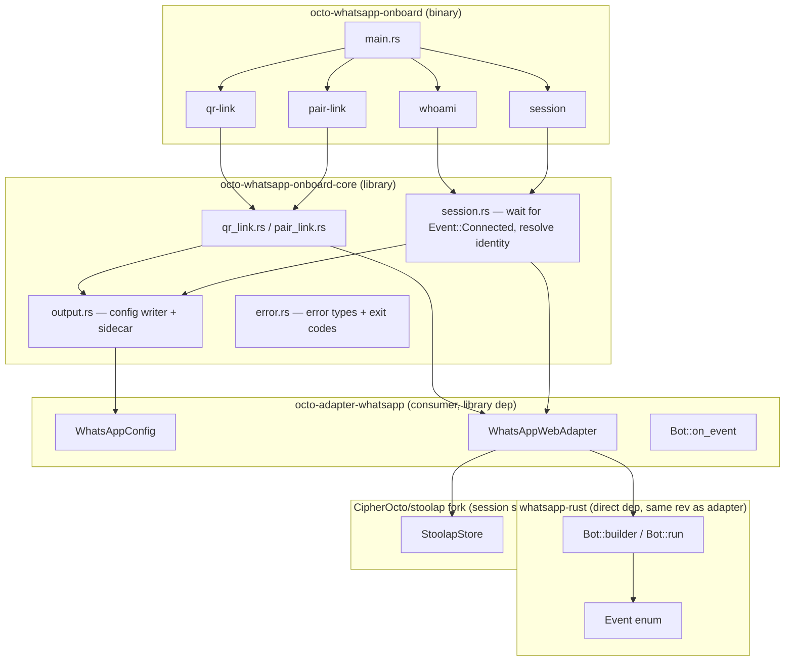
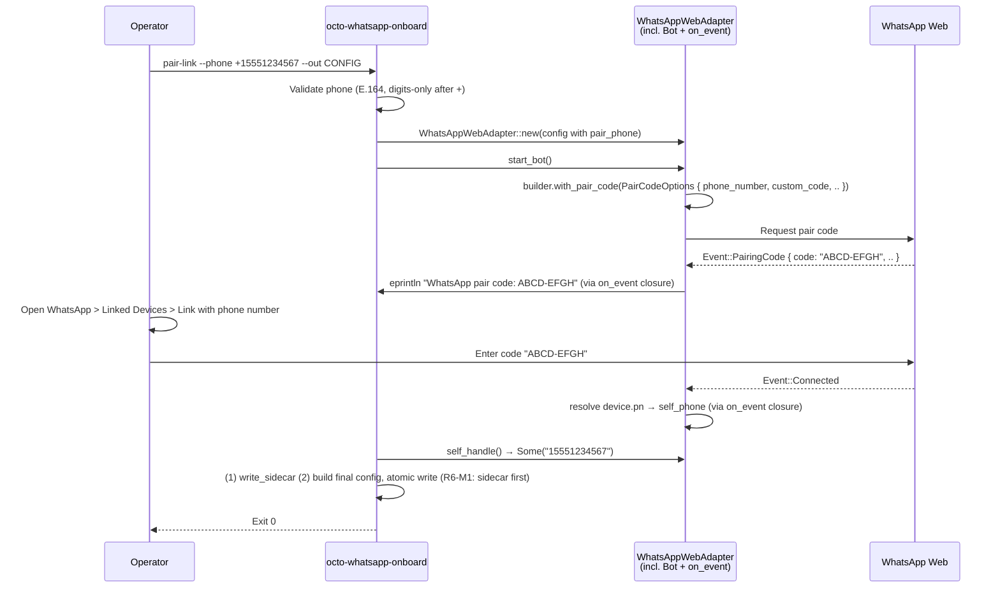

# RFC-0850p-a (Networking): WhatsApp Auth Onboarding CLI

## Status

Draft (2026-06-12)

## Authors

- @mmacedoeu

## Maintainers

- @mmacedoeu

## Summary

Define a standalone CLI binary (`octo-whatsapp-onboard`) and companion library (`octo-whatsapp-onboard-core`) that authenticate a CipherOcto operator against WhatsApp Web via the `whatsapp-rust` protocol crate, capture the resulting session, and write a JSON config file consumable by `octo-adapter-whatsapp` without modification. Covers QR-code linking, pair-code linking, session verification (`whoami`), and session management (list, verify, remove). Mirrors the `octo-matrix-onboard` and `octo-telegram-onboard` architectures, adapted to WhatsApp's event-driven `Bot::on_event` model.

## Dependencies

**Requires:**

- Mission 0850p: DOT WhatsApp Adapter (Implemented) — the `WhatsAppConfig` schema this tool produces, and the `WhatsAppWebAdapter` runtime methods (`start_bot`, `run_reconnect_loop`, `self_handle`)
- RFC-0850: Deterministic Overlay Transport, §8.1 (Platform Adapters)

**Optional (architectural references):**

- Mission 0850h-a: Matrix Auth Onboarding — binary+core split, clap surface, redaction layer, exit code table
- Mission 0850ab-a: Telegram Auth Onboarding — same pattern, different SDK (TDLib state machine vs. whatsapp-rust event stream)

## Design Goals

| Goal | Target | Metric |
|------|--------|--------|
| G1 | Standalone auth without gateway | `octo-whatsapp-onboard qr-link` exits 0 without loading adapter cdylib |
| G2 | Interactive QR pairing in terminal | QR rendered as unicode half-block; scan completion drives `Event::Connected` |
| G3 | Pair-code linking as alternative to QR | `octo-whatsapp-onboard pair-link --phone +15551234567` issues a 6-char code via the WhatsApp Web protocol |
| G4 | Config produced is adapter-compatible | `WhatsAppConfig::validate()` passes on output JSON (or deserialize round-trip succeeds, see §Schema Compatibility) |
| G5 | No plaintext secrets in CLI logs | tracing redaction layer test passes; PII (resolved phone, custom pair code) never emitted unredacted |
| G6 | Exit codes distinguish failure classes | 7 distinct exit codes (0-6) matching the matrix/telegram table |
| G7 | Session verification without re-pairing | `whoami` works on persisted stoolap session database |

## Motivation

### Problem Statement

WhatsApp is the second-largest CipherOcto adapter by transport priority (after Matrix), yet has zero onboarding tooling. The adapter (`octo-adapter-whatsapp`, 1746 lines, 13 unit tests) is **Implemented** (Mission 0850p) and the `WhatsAppWebAdapter::start_bot()` method already prints QR codes to stderr on `Event::PairingQrCode { code, .. }` (adapter.rs:239-247) and pair codes on `Event::PairingCode { code, .. }` (adapter.rs:248-251). However:

1. The current QR rendering goes to **stderr via `eprintln!`**, not through a structured CLI surface with exit codes, force-overwrite semantics, or atomic writes.
2. There is no `whoami` subcommand — the only way to verify a session is to start the adapter and inspect logs.
3. There is no multi-account support — operators managing multiple WhatsApp business lines have no tool to enumerate, verify, or remove sessions.
4. There is no session-meta sidecar for fast `list` — `session list` would otherwise have to start a TDLib-style client per directory.
5. The `pair_phone` / `pair_code` / `ws_url` knobs on `WhatsAppConfig` are not surfaced via CLI; operators have to hand-edit JSON.

The core insight: `WhatsAppWebAdapter::start_bot()` is **already the auth flow**. The onboard tool's job is to wrap that flow with a CLI surface (exit codes, atomic config write, redaction, subcommand dispatch) and emit a config the adapter can consume unchanged.

### Architectural Difference from Telegram/Matrix

| Aspect | Telegram (0850ab-a) | Matrix (0850h-a) | WhatsApp (0850p-a, this RFC) |
|--------|---------------------|------------------|-------------------------------|
| Auth model | TDLib state machine (`WaitPhoneNumber` → `WaitCode` → `WaitPassword` → `Ready`) | SDK callbacks (`client.login_username`) + OIDC listener + QR rendezvous | Event stream (`Bot::on_event` emits `PairingQrCode` / `PairingCode` / `Connected` / `LoggedOut`) |
| Secret material | bot_token, api_hash, phone, 2FA password | access_token, refresh_token, password | stoolap session DB (Signal noise_key, identity_key, prekeys, signed_prekeys) |
| Auth modes | 2 (bot, user) | 4 (password, OIDC, SSO, QR) | 2 (QR link, pair-code link) |
| Session persistence | TDLib SQLite in `data_dir/` | Matrix session via `client.restore_session(MatrixAuth::UserSession { ... })` | stoolap DB in `session_path` |
| Adapter restart | Adapter re-opens `data_dir`; TDLib reloads session from disk | Adapter re-opens `MatrixAuth::UserSession` from JSON | Adapter re-opens `session_path`; whatsapp-rust reloads Signal state from stoolap |
| Identity extraction | `tdlib_rs::functions::get_me()` | `client.session_meta()` + `client.session_tokens()` | `Event::Connected` + `device.pn` resolution (adapter.rs:226-237) |
| Per-operator config knobs | api_id, api_hash, verifying_key | refresh_token, passphrase (0850h-b) | pair_phone, pair_code, ws_url, groups |

**Key consequence:** WhatsApp has **no equivalent of `WaitCode`** or `WaitPassword`. There is no stdin reading in the interactive loop. The terminal loop is the QR code (operator scans with their phone) or a 6-character pair code (operator types in WhatsApp > Linked Devices). After that, the CLI blocks on the event stream until `Event::Connected` (success) or `Event::LoggedOut` (failure).

## Specification

### System Architecture



### Crate Split

The binary/core split follows the `octo-matrix-onboard` and `octo-telegram-onboard` pattern:

| Crate | Type | Purpose |
|-------|------|---------|
| `octo-whatsapp-onboard` | binary | CLI surface (clap), dispatches to core |
| `octo-whatsapp-onboard-core` | lib | Auth flows, session extraction, output writing |

**Rationale:** Same as 0850h-a / 0850ab-a. The core library is reusable by integration tests, CI scripts, and a future session-rotation daemon.

**Adapter reuse pattern:** Unlike Telegram (which reuses the adapter's `UserAuth` for user-mode decisions — adapter/auth.rs), WhatsApp reuses the **adapter's `WhatsAppWebAdapter` runtime directly**. The onboard core does not call `Bot::on_event` itself; it constructs a `WhatsAppWebAdapter`, calls `start_bot().await`, and observes identity via `self_handle()`. The QR/pair-code rendering is already done by the adapter's event handler (adapter.rs:239-251) — the CLI just needs to ensure that handler is plumbed.

**Why not bypass the adapter?** The `Bot::on_event` closure is the only sanctioned place to receive `Event::PairingQrCode` and `Event::PairingCode`. Constructing a raw `Bot::builder()` in the onboard core would reimplement the storage backend, transport factory, http client, and device-props override — and any drift from the adapter's choices would produce sessions the adapter cannot load. Reusing `WhatsAppWebAdapter::start_bot()` guarantees the session is created with the same parameters the adapter will use to load it.

### CLI Surface

```
octo-whatsapp-onboard
├── qr-link              — Render QR code in terminal, wait for phone scan
│   ├── --session-path <DIR>      (default: ~/.local/share/octo/whatsapp/default.session.db)
│   ├── --ws-url <URL>            (test/proxy; or $OCTO_WHATSAPP_WS_URL)
│   ├── --groups <ID,ID,ID>       (initial group IDs to monitor; default: empty. R2-L1: accepts digits-only `120363012345678901` OR full JID `120363012345678901@g.us`; the adapter's `group_to_jid` normalizes either form on receive. R2-L2: comma-separated; whitespace trimmed; empty entries rejected; duplicates NOT deduplicated.)
│   ├── --out <PATH>              (OutputArgs: flatten target; default: ~/.config/octo/whatsapp.json)
│   ├── --stdout                  (OutputArgs: conflicts_with out)
│   ├── --force                   (OutputArgs: requires out)
│   ├── --timeout <SECS>          (default: 300, how long to wait for Event::Connected)
│   └── --verbose                 (DEBUG-level tracing)
│
├── pair-link            — Issue a 6-character pair code via the WhatsApp Web protocol
│   ├── --session-path <DIR>      (default: ~/.local/share/octo/whatsapp/default.session.db)
│   ├── --phone <E164>            (required; or $OCTO_WHATSAPP_PHONE; e.g. +15551234567)
│   ├── --pair-code <CODE>        (optional custom code; or $OCTO_WHATSAPP_PAIR_CODE)
│   ├── --ws-url <URL>            (test/proxy; or $OCTO_WHATSAPP_WS_URL)
│   ├── --groups <ID,ID,ID>       (as qr-link; same parsing rules per R2-L1/R2-L2)
│   ├── --out <PATH>              (OutputArgs: flatten target; same defaults)
│   ├── --stdout                  (OutputArgs: conflicts_with out)
│   ├── --force                   (OutputArgs: requires out)
│   ├── --timeout <SECS>          (default: 300)
│   └── --verbose
│
├── whoami               — Verify existing session (30s hardcoded timeout per R5-H2; R8-L1)
│   ├── --config <PATH>           (load WhatsAppConfig JSON)
│   └── --verbose
│   # Future: --store <PATH> for multi-account session store (Phase 2)
│
├── session
│   ├── list                     — Show known session databases
│   │   └── --base-dir <DIR>     (default: ~/.local/share/octo/whatsapp/)
│   ├── verify <DB-PATH>         — Check if a session DB has a valid Signal session
│   └── remove <DB-PATH>         — Delete a session DB (with confirmation)
│
└── version
```

**Subcommand naming rationale:** `qr-link` and `pair-link` (verb form) are preferred over `login qr` / `login pair` (noun form, Matrix-style) because WhatsApp has only two modes and the verb form is more discoverable for an operator who doesn't know which mode to pick. The verb names are consistent with the `run_*` functions in `modes/` (`qr_link::run`, `pair_link::run`).

### Auth Flow: qr-link

```mermaid
sequenceDiagram
    participant Op as Operator
    participant CLI as octo-whatsapp-onboard
    participant Adapter as WhatsAppWebAdapter<br/>(incl. Bot + on_event)
    participant WA as WhatsApp Web
    participant SP as StoolapStore

    Op->>CLI: qr-link --session-path DIR --out CONFIG
    CLI->>CLI: Validate inputs (session_path dir created mode 0700)
    CLI->>CLI: Build WhatsAppConfig stub { session_path, groups, ... }
    CLI->>Adapter: WhatsAppWebAdapter::new(config)
    CLI->>Adapter: start_bot()
    Adapter->>SP: StoolapStore::new(session_path) (init schema)
    Adapter->>Adapter: builder.build().await
    Adapter->>Adapter: bot.run().await → BotHandle
    Adapter->>WA: WS connect + noise handshake
    WA-->>Adapter: Event::PairingQrCode { code, .. }
    Adapter->>CLI: eprintln QR (unicode half-block via qrcode crate; via on_event closure)
    Op->>Op: Open WhatsApp > Linked Devices > Link a Device
    Op->>WA: Scan QR code
    WA-->>Adapter: Event::Connected
    Adapter->>SP: Persist device.pn (signal identity)
    Adapter->>Adapter: Resolve self_phone from device snapshot
    Adapter-->>CLI: tracing::info "resolved bot identity: +{user_part}" (via on_event closure)
    CLI->>Adapter: self_handle() → Some("15551234567")
    CLI->>CLI: (1) write_sidecar (2) build final WhatsAppConfig { session_path, groups, ... } (R6-M1: sidecar first)
    CLI->>CLI: (3) Atomic write (tempfile + persist, mode 0600)
    CLI->>CLI: Print: "Authenticated as +1 555 123 4567 (session: DIR)"
    CLI-->>Op: Exit 0
```

**Key design decisions:**

1. **No stdin reading.** Unlike TDLib (which prompts for code/2FA), WhatsApp's `Event::PairingQrCode` carries the full QR payload in one event. The operator scans with their phone; the CLI blocks on the event stream. `--timeout` (default 300s) bounds the wait.

2. **Identity resolution.** After `Event::Connected`, the adapter's `Event::Connected` handler (adapter.rs:226-237) resolves `self_phone` from the device snapshot. The onboard core's `whoami` / `start` logic calls `adapter.self_handle()` and **polls it on a 250ms interval** (see §Algorithms) until the `Option<String>` is `Some`. The polling is bounded by `--timeout` (default 300s) and is acceptable because the wait is operator-driven (typically 2-30s), not latency-sensitive.

3. **Pairing vs. Ready distinction.** `Event::Connected` is NOT the same as "ready to send messages." It means the noise-key handshake completed and the session is persisted. The adapter's `health_check()` returns `Ok(())` only when `bot_handle.is_some()`. The onboard tool's "ready" state is `self_handle().is_some()`, which the adapter's event handler populates after persistence.

4. **Config fields the operator does not set.** The CLI does not ask for `api_id` / `api_hash` (Telegram-only) or `verifying_key` (Telegram-only). WhatsApp's `WhatsAppConfig` schema has no such fields. The CLI captures `session_path`, `groups`, and (for pair-link) `pair_phone` / `pair_code`.

5. **WS URL for tests.** The `--ws-url` flag matches the adapter's `WhatsAppConfig::ws_url` (adapter.rs:33). For CI, operators set it to a test WebSocket (e.g., `ws://localhost:8080`); the adapter's transport factory honors the override (adapter.rs:170-172). Same env-var-or-flag pattern as Telegram.

### Auth Flow: pair-link



**Key design decisions:**

1. **Phone validation.** E.164 format: `+` followed by 7-15 digits. The CLI rejects `--phone 5551234` (no `+`) and `--phone +0123456789` (leading 0 after `+`) with exit code 5 (bad config). Validation is identical to the adapter's `normalize_phone` (adapter.rs:148-150) plus a length check.

2. **Custom pair code.** If `--pair-code` is provided, it's passed to `PairCodeOptions::custom_code` (adapter.rs:261). The CLI never logs the custom code (it's a secret the operator chose); it's redacted in the output JSON when `--verbose` is set (see §Logging & Redaction).

3. **Pair code redaction.** The auto-generated pair code is **not a secret** (it's time-limited and the operator's choice whether to display it on a shared screen), but the **custom pair code is** (it's operator-chosen and may be reused). The CLI distinguishes the two in the redaction layer.

### Session Extraction

After `Event::Connected`, the core library captures identity from the adapter:

```rust
// R1-C2: does NOT derive Serialize/Deserialize. The custom pair code
// (operator-typed) is intentionally NOT a field here — it is passed
// only to pair_link::run() and dropped on success. The on-disk
// session_meta.json and WhatsAppConfig never see it. This mirrors
// octo-matrix-onboard-core::Session making access_token private
// (crates/octo-matrix-onboard-core/src/lib.rs:80) and exposing it
// only via to_disk_json(). A `pub pair_code: Option<String>` field
// with a "never serialized" comment is a security smell: a
// serde_json::to_string or format!("{:#?}", session) would leak
// the operator-typed code.
#[derive(Debug, Clone)]
pub struct WhatsAppSession {
    /// Bot's own phone number, resolved from device.pn on Event::Connected
    /// (adapter.rs:228-236). E.164 digits-only, e.g., "15551234567".
    /// None if the device snapshot wasn't yet persisted when whoami ran.
    pub self_phone: Option<String>,
    /// Path to stoolap session database.
    pub session_path: PathBuf,
    /// Group JIDs the operator configured at link time. Mirrored into
    /// WhatsAppConfig::groups so the adapter picks them up unchanged.
    pub groups: Vec<String>,
    /// Pair phone (only populated by pair-link, omitted from qr-link output).
    pub pair_phone: Option<String>,
}
```

**Difference from Telegram/Matrix:**

- **Telegram:** identity via `tdlib_rs::functions::get_me()` → `user_id`, `username`. Session is the `data_dir` database (TDLib SQLite).
- **Matrix:** identity via `client.session_meta()` → `user_id`, `device_id`. Session is the `access_token` / `refresh_token` pair, plus the homeserver.
- **WhatsApp:** identity via `device.pn` resolved on `Event::Connected` → `self_phone` (digits-only). Session is the stoolap Signal store (noise_key, identity_key, prekeys, etc.). **No user-visible `user_id`** — WhatsApp does not assign a numeric user ID like Telegram; phone number is the canonical identifier, and it's only known to the bot itself.

### Config Output

The tool writes a `WhatsAppConfig`-compatible JSON file (R2-C2: `pair_code` is **never** present on disk — the field was removed from the in-memory `WhatsAppSession` in R1-C2; `ws_url` and `pair_phone` are present only when set):

```json
{
  "session_path": "/home/user/.local/share/octo/whatsapp/default.session.db",
  "groups": ["120363012345678901@g.us"]
}
```

For `pair-link`:

```json
{
  "session_path": "/home/user/.local/share/octo/whatsapp/default.session.db",
  "groups": [],
  "pair_phone": "15551234567"
}
```

**Schema compatibility note (R1-H3):** `WhatsAppConfig` (adapter.rs:25-36) does not currently have a `validate()` method, only `serde::Deserialize`. The CLI round-trips via **adapter instantiation in unit tests** (load config → `WhatsAppWebAdapter::new(config)` → `start_bot()` short-circuits on missing DB) AND a fast pre-flight `serde_json::from_slice::<WhatsAppConfig>(...)` deserialize check before the instantiation. A `WhatsAppConfig::validate()` method analogous to `TelegramConfig::validate()` (config.rs:94-110) is added to the adapter in the same PR — see §Schema Compatibility.

**File permissions:** Mode 0600 on Unix. Same atomic-write pattern as `octo-matrix-onboard` and `octo-telegram-onboard` (`tempfile::NamedTempFile` + `persist`).

### Error Types

```rust
pub enum OnboardError {
    Generic(anyhow::Error),              // exit 1
    AuthRejected(String),                // exit 2 — Event::LoggedOut, link rejected
    Unreachable(String),                 // exit 3 — WebSocket connect fail, DNS
    Cancelled(String),                   // exit 4 — timeout, Ctrl-C, stdin EOF (if any)
    BadConfig(String),                   // exit 5 — unwritable path, invalid phone format
    RateLimited(String),                 // exit 6 — WhatsApp backoff (rare; protocol-level)
    SessionExpired(String),              // exit 7 — Event::LoggedOut after a successful link
}
```

Seven exit codes (0-7), **one more than the matrix/telegram table** (which has 0-6). The extra code (`7 = SessionExpired`) distinguishes "the link was successful but the device was later logged out elsewhere" from "the link was rejected outright" (code 2). This matters because the operator's recovery is different: code 2 means "check phone, retry" while code 7 means "phone lost the session, re-link required." `whoami` emits code 7 when the persisted session no longer authenticates.

This is the **first deviation from the matrix/telegram exit code table** in the project's auth-onboarding series. The deviation is justified by WhatsApp's event-driven model: the adapter receives `Event::LoggedOut` for both "link rejected" and "session expired" — the same event in different contexts. A single exit code would conflate them.

### Logging & Redaction

Same pattern as `octo-matrix-onboard` (logging.rs:38-44) and `octo-telegram-onboard` (logging.rs:REDACT_KEYS):

- `tracing-subscriber` with a custom `Layer` that redacts fields named `session_path`, `pair_phone`, `pair_code`, `ws_url`, `access_token` (none of these are emitted by the WhatsApp adapter, but the redaction layer must cover them in case future fields leak), and the Signal Protocol key fields (`noise_key`, `identity_key`, `signed_pre_key`, `prekey`, `sender_key`) if any are emitted by a future adapter change. **R3-H1: `pn` is REMOVED from the redaction list** — the device's own phone number (`wacore::store::Device.pn`) is the same value as `self_phone`, which is explicitly logged with a `+E164` prefix and is **not** a secret (it's the operator's own phone, displayed by WhatsApp in the linked devices list). The substring-match redaction would have caught the `pn` field name in the existing log message at adapter.rs:234 (`"resolved bot identity: +{user_part}"`), over-redacting the very log line that confirms the link succeeded.
- **Auto-generated pair codes** (from `Event::PairingCode`) are printed to stderr via the adapter's `eprintln!` (adapter.rs:248-251) — operator's intended display; NOT redacted because the eprintln path bypasses the tracing layer.
- **Custom pair codes** (operator-supplied via `--pair-code` or `$OCTO_WHATSAPP_PAIR_CODE`) are passed to `PairCodeOptions::custom_code` (adapter.rs:261). R3-L1: the current adapter does NOT log the custom code anywhere (only the auto-generated path eprintlns), so there is nothing to redact. If a future adapter change adds `tracing::debug!` for the custom code, the redaction layer's `pair_code` key catches it. The custom code is **never visible in the terminal at any point**.
- The resolved `self_phone` (from `Event::Connected`) is logged with a `+E164` prefix and is **not** a secret (it's the bot's own phone, displayed by WhatsApp in the linked devices list).
- Identity fields (`self_phone`, `session_path`, `groups`) are safe to log.
- `--verbose` enables DEBUG level; PII stays redacted at every level.

### Data Directory Layout

```
~/.local/share/octo/whatsapp/
├── default.session.db          # default stoolap session DB
├── business1.session.db        # operator-specified --session-path
├── business2.session.db
└── ...

~/.config/octo/
└── whatsapp.json               # WhatsAppConfig (mode 0600)
```

The `session_path` is the **path to the stoolap database file itself**, not a containing directory. The stoolap store is a single-file database (CipherOcto fork, `feat/blockchain-sql` branch). Operators managing multiple accounts use distinct `--session-path` values.

The `session list` subcommand scans the `~/.local/share/octo/whatsapp/` base directory. See §Session Management Implementation for the sidecar fast-path and bot-startup fallback details. (R6-L1: removed duplicate sentence; the §Session Management section is the canonical location.)

### RFC-0008 Execution Class Mapping

| Operation | Class | Rationale |
|-----------|-------|-----------|
| CLI arg parsing | A | Deterministic string matching |
| Stoolap database open | A | Deterministic file open + schema init |
| WebSocket connect | B | Network I/O — same input may produce different transient errors |
| QR rendering | A | Pure formatting (qrcode crate) |
| Event::Connected wait | B | External service (WhatsApp Web) — observable but not under CLI control |
| Identity resolution from device.pn | A | Pure in-memory read of the persisted device record |
| Config JSON serialization | A | Deterministic serde output |
| File write (atomic rename) | A | Deterministic filesystem operation |
| Session verification | B | WebSocket connect + identity resolution |

All operations are Class A or B. No probabilistic operations.

### Data Structures

```rust
// octo-whatsapp-onboard-core/src/lib.rs

/// CLI input for qr-link (subset of WhatsAppConfig; pair_code / pair_phone omitted).
#[derive(Clone, serde::Serialize, serde::Deserialize)]
pub struct QrLinkArgs {
    pub session_path: PathBuf,
    pub groups: Vec<String>,
    pub ws_url: Option<String>,
    pub timeout_secs: u64,
}

/// CLI input for pair-link.
#[derive(Clone, serde::Serialize, serde::Deserialize)]
pub struct PairLinkArgs {
    pub session_path: PathBuf,
    pub phone: String,                  // E.164
    pub custom_code: Option<String>,    // R1-M3: matches SDK's PairCodeOptions::custom_code
    pub groups: Vec<String>,
    pub ws_url: Option<String>,
    pub timeout_secs: u64,
}

/// Captured session after a successful Event::Connected.
/// R1-C2: does NOT derive Serialize/Deserialize (see the longer docstring
/// at line ~271 in §Session Extraction). The custom pair code is not a
/// field; it lives only in the pair_link::run() local scope.
#[derive(Debug, Clone)]
pub struct WhatsAppSession {
    pub self_phone: Option<String>,
    pub session_path: PathBuf,
    pub groups: Vec<String>,
    pub pair_phone: Option<String>,
}

/// Session info for session list/verify.
pub struct SessionInfo {
    pub session_path: PathBuf,
    pub self_phone: Option<String>,
    pub is_valid: bool,
    pub last_linked_at: Option<chrono::DateTime<chrono::Utc>>,
}
```

### Algorithms

**Wait for Event::Connected (core/qr_link.rs and core/pair_link.rs):**

The onboard core reuses `WhatsAppWebAdapter::start_bot()` to launch the bot, but the **identity observation** is custom to the onboard tool. The adapter's existing `Event::Connected` handler populates `self_phone` (adapter.rs:226-237), but the CLI needs to know **when** that happens. The algorithm:

```rust
// R3-C2: the binary converts CoreError to OnboardError via this From impl
// (defined in the binary, not the core — the core stays free of clap types).
// The mapping is 1-to-1 and stable.
impl From<CoreError> for OnboardError {
    fn from(e: CoreError) -> Self {
        match e {
            CoreError::Adapter { source } => OnboardError::Generic(source),
            CoreError::ClientBuild => OnboardError::Unreachable("client build failed".into()),
            CoreError::InvalidPhone { value, reason } => {
                OnboardError::BadConfig(format!("invalid phone {value:?}: {reason}"))
            }
            CoreError::InvalidSessionPath { path, reason } => {
                OnboardError::BadConfig(format!("invalid session_path {:?}: {}", path, reason))
            }
            CoreError::Parse { path, source } => {
                OnboardError::BadConfig(format!("parse {:?}: {}", path, source))
            }
            CoreError::Read { path, source } => {
                OnboardError::BadConfig(format!("read {:?}: {}", path, source))
            }
            CoreError::SessionExpired => {
                OnboardError::SessionExpired("Event::LoggedOut after a successful link".into())
            }
            CoreError::Timeout { secs } => {
                OnboardError::Cancelled(format!("timed out after {secs}s waiting for Event::Connected"))
            }
        }
    }
}

// R2-M3: returns CoreError (not OnboardError — the core lib and binary
// have separate error enums; the binary converts via From<CoreError>).
// R3-M1: after self_handle() returns Some, re-verify after a 100ms grace
// period. The race window (Event::Connected → device.pn resolution vs.
// Event::LoggedOut → bot_handle = None) is ~10-100ms in practice. If
// the re-verify finds self_handle() is None or bot_handle is None,
// the link was unlinked mid-handshake: treat as Event::LoggedOut.
// R4-C1: use adapter.health_check() (existing method) instead of the
// non-existent adapter.bot_handle_is_alive(). health_check() returns
// Ok(()) iff bot_handle.is_some() (verified at octo-adapter-whatsapp/
// src/adapter.rs:438-445), which is the semantic we want.
async fn wait_for_connected(adapter: &WhatsAppWebAdapter, timeout: Duration) -> Result<String, CoreError> {
    let deadline = Instant::now() + timeout;
    loop {
        if let Some(phone) = adapter.self_handle() {
            // Re-verify after grace period (catches the Connected→LoggedOut race)
            tokio::time::sleep(Duration::from_millis(POST_CONNECT_GRACE_MS)).await;
            if adapter.health_check().await.is_ok() && adapter.self_handle().is_some() {
                return Ok(phone);
            }
            return Err(CoreError::SessionExpired);
        }
        if Instant::now() >= deadline {
            return Err(CoreError::Timeout { secs: timeout.as_secs() });
        }
        // Poll every 250ms — coarse-grained; Event::Connected is a
        // single-shot event so the wakeup latency is bounded by
        // the adapter's own `Event::Connected` handler latency
        // (which resolves device.pn in <100ms in practice).
        tokio::time::sleep(Duration::from_millis(POLL_INTERVAL_MS)).await;
    }
}
```

**Why polling and not Notify?** The adapter's `self_phone` field is a `parking_lot::Mutex<Option<String>>` — there is no signal exposed. Adding a `Notify` to the adapter is out of scope for this mission (it would be a one-line change to the adapter, but cross-crate refactors during an auth-onboarding mission are a high-risk / low-reward change). A 250ms polling loop is acceptable because the wait is bounded by the operator's scan latency (typically 2-10s), not by polling granularity.

**Wait for health (R7-H1):** `wait_for_health` is the same shape as `wait_for_connected` but returns `Result<(), CoreError>` (no phone-number resolution). Used by `session list` fallback (RFC §Session Management) and `whoami`'s quick health probe path.

```rust
// R7-H1: same constants as wait_for_connected (POLL_INTERVAL_MS,
// POST_CONNECT_GRACE_MS). Returns () because session list only
// needs is_valid: bool, not the phone number.
async fn wait_for_health(adapter: &WhatsAppWebAdapter, timeout: Duration) -> Result<(), CoreError> {
    let deadline = Instant::now() + timeout;
    loop {
        if adapter.health_check().await.is_ok() {
            // Re-verify after grace period (catches the Connected→LoggedOut race)
            tokio::time::sleep(Duration::from_millis(POST_CONNECT_GRACE_MS)).await;
            if adapter.health_check().await.is_ok() {
                return Ok(());
            }
            return Err(CoreError::SessionExpired);
        }
        if Instant::now() >= deadline {
            return Err(CoreError::Timeout { secs: timeout.as_secs() });
        }
        tokio::time::sleep(Duration::from_millis(POLL_INTERVAL_MS)).await;
    }
}
```

**Alternative considered (R0-L0):** Add a `tokio::sync::watch::Receiver<Option<String>>` to `WhatsAppWebAdapter` that fires on `Event::Connected`. **Rejected** because the polling loop is sufficient (4 polls/second) and avoids cross-crate ABI changes during the auth-onboarding mission. If a future mission adds high-frequency health checks, the watch channel can be introduced then.

**Identity extraction from Event::Connected:**

The adapter's existing handler (adapter.rs:226-237) already does the work:

```rust
Event::Connected(_) => {
    let device = client.persistence_manager().get_device_snapshot().await;
    if let Some(ref pn) = device.pn {
        let pn_str = pn.to_string();
        let user_part = pn_str.split_once('@').map(|(u, _)| u).unwrap_or(&pn_str);
        let digits = Self::normalize_phone(user_part);
        if !digits.is_empty() {
            *self_phone.lock() = Some(digits);
            tracing::info!("resolved bot identity: +{user_part}");
        }
    }
}
```

The onboard core's `wait_for_connected` polls `adapter.self_handle()` until the `Option<String>` is `Some`. No additional handshake is needed.

**Sidecar writing:**

After successful link, the CLI writes `session_meta.json` alongside the stoolap DB:

```json
{
  "self_phone": "15551234567",
  "linked_at": "2026-06-12T10:30:00Z",
  "mode": "qr-link",
  "groups": ["120363012345678901@g.us"]
}
```

The `linked_at` field is written by `crate::time::format_rfc3339_secs(epoch_secs)` (R4-H2 / R3-H2: hand-rolled from `SystemTime` + `Duration` to avoid pulling in `chrono` as a direct dep — `chrono` is a transitive dep via the adapter, but using it directly would create a circular-import risk. See `crates/octo-whatsapp-onboard-core/src/time.rs` for the helper. R4-L2: the helper is renamed from `format_rfc3339_now` to `format_rfc3339_secs(epoch_secs: u64) -> String` to match the matrix-onboard's `octo-matrix-onboard/src/logging.rs:82` pattern; takes an explicit epoch-seconds arg, returns the 20-char no-subsec format. The output is **RFC 3339 UTC with no sub-second precision** (`YYYY-MM-DDTHH:MM:SSZ`, 20 characters wide). For the sidecar's `linked_at`, the call site does `format_rfc3339_secs(SystemTime::now().duration_since(UNIX_EPOCH)?.as_secs())`. The format is unit-test-pinned to prevent drift to SQLite-style or epoch-seconds. The `mode` field is `"qr-link"` or `"pair-link"`. The `groups` field is the operator-supplied list, so `session list` can display it without a bot startup.)

**Config serialization:**

The on-disk config is built field-by-field in a `serde_json::Map` (mirroring `octo-matrix-onboard-core/src/lib.rs:161-187`):

```rust
// R2-C1: method on WhatsAppSession (matches octo-matrix-onboard-core::Session
// pattern at crates/octo-matrix-onboard-core/src/lib.rs:161).
pub fn to_disk_json(&self) -> serde_json::Value {
    let mut map = serde_json::Map::with_capacity(5);
    map.insert("session_path".to_string(),
               serde_json::Value::String(self.session_path.to_string_lossy().into()));
    if !self.groups.is_empty() {
        map.insert("groups".to_string(),
                   serde_json::Value::Array(self.groups.iter()
                       .map(|g| serde_json::Value::String(g.clone())).collect()));
    }
    if let Some(ref pp) = self.pair_phone {
        map.insert("pair_phone".to_string(),
                   serde_json::Value::String(pp.clone()));
    }
    // ws_url is omitted (None) — adapter default is None
    serde_json::Value::Object(map)
}
```

The on-disk shape is a strict subset of `WhatsAppConfig` (no `pair_code` is ever written; `ws_url` is omitted when None to match the adapter's `#[serde(default)]` behavior on Option fields). `serde_json::from_slice::<WhatsAppConfig>(...)` round-trips successfully.

### Determinism Requirements

All CLI-side operations are deterministic given the same inputs and stoolap session state. The CLI does not introduce randomness. Two non-CLI-side sources of variability exist (R1-M4): (1) the WhatsApp Web **server** generates the auto-displayed pair code for `pair-link` (printed to stderr for operator entry — this is operator-visible randomness, but it comes from the protocol, not the CLI); (2) whatsapp-rust's internal protocol nonces (transparent to the CLI).

### Error Handling

| Event | CLI Action | Exit Code |
|-------|-----------|-----------|
| `Event::PairingQrCode { code, .. }` | Render QR to stderr (eprintln) | — |
| `Event::PairingCode { code, .. }` | Print code to stderr | — |
| `Event::Connected` | Set `self_phone`, wait_for_connected returns | — |
| `Event::LoggedOut` (during link) | Print error, exit | 2 |
| `Event::LoggedOut` (during whoami) | Print "session expired", exit | 7 |
| `Event::StreamError` | tracing::error, do not exit (adapter's reconnect loop handles) | — |
| `MaxRetries` exceeded | tracing::error, exit | 3 |
| WebSocket connect fail | Print error, exit | 3 |
| --timeout elapsed | Print error, exit | 4 |
| Ctrl-C during wait | tokio::signal::ctrl_c() → exit | 4 |
| session_path unwritable | Print error, exit | 5 |
| Config file exists, no --force | Print error, exit | 5 |
| Invalid --phone (no +, leading 0, etc.) | Print error, exit | 5 |
| Invalid --session-path (parent dir missing) | Print error, exit | 5 |
| stoolap schema init failure | Print error, exit | 5 |
| Custom pair code rejected by WhatsApp | Print error, exit | 2 |

### whoami Session Verification

The `whoami` subcommand loads a config JSON, creates a `WhatsAppWebAdapter` against the configured `session_path`, and waits for `self_handle()` to populate.

**Expired session handling:** If the persisted stoolap session is expired (e.g., user logged out from their phone, or the device was unlinked), the adapter receives `Event::LoggedOut` and `self_handle()` returns `None` indefinitely. The `whoami` subcommand waits up to 10s for `self_handle()`. If `None` after 10s, it prints "Session expired or invalid" and exits with code 7 (`SessionExpired`). This is a read-only check — `whoami` does not drive re-linking.

**`session verify <DB-PATH>` vs `whoami --config <PATH>`:** `whoami` loads a config JSON (which points at a `session_path`); `session verify` operates on a bare DB path. Both internally create a `WhatsAppWebAdapter` against the DB and check `self_handle()`. The difference is the input surface: `whoami` is for "verify the config the CLI just wrote" (CI use case), `session verify` is for "audit a specific DB on disk" (operator use case).

### Session Management

`session list` scans `~/.local/share/octo/whatsapp/` (configurable via `--base-dir`) and prints one line per account:

```
SESSION_PATH                                    SELF_PHONE     LINKED_AT            VALID
/home/user/.local/share/octo/whatsapp/default.session.db  +15551234567  2026-06-12T10:30:00Z  yes
/home/user/.local/share/octo/whatsapp/business1.session.db  +15559998888  2026-06-11T14:22:00Z  yes
/home/user/.local/share/octo/whatsapp/old.session.db        <unknown>      <unknown>            no (expired)
```

**Implementation:** For each `*.session.db` file in the base dir, the tool first checks for a `session_meta.json` sidecar file (written by `qr-link`/`pair-link` alongside the stoolap DB). If the sidecar exists, it reads `self_phone`, `linked_at`, `mode`, `groups` directly (fast, no bot startup needed). If no sidecar exists, it creates a temporary `WhatsAppWebAdapter` against the DB, calls `wait_for_health(adapter, Duration::from_secs(SESSION_LIST_HEALTH_TIMEOUT_SECS))` (R6-H2: use the shared helper, do not inline-poll. R7-M2: `SESSION_LIST_HEALTH_TIMEOUT_SECS = 5` constant, shared with the mission AC. The 5s is a fallback-path timeout, not an operator-tunable knob.), and prints the result.

`session verify <DB-PATH>` checks if a specific stoolap database has a valid Signal session (same `self_handle()` check, no fallback to a sidecar). `session remove <DB-PATH>` deletes a database file after confirmation.

## Performance Targets

| Metric | Target | Notes |
|--------|--------|-------|
| qr-link latency | <2s + operator time | WS handshake + QR render (operator scan typically 2-10s) |
| pair-link latency | <1s + operator time | WS handshake + code display (operator entry typically 5-15s) |
| whoami latency | <10s (R4-L1) | Load config, **connect to WhatsApp via WebSocket**, noise-key handshake, identity resolution. Not a "load and check" semantic — the whoami flow re-establishes the session because the adapter does not expose a "read device.pn without starting the bot" method. A future mission could add `WhatsAppWebAdapter::read_device_pn() -> Option<String>` for a <100ms pure-local whoami. |
| session list latency | <100ms (sidecar) / <5s (fallback) | Sidecar fast path is the default; fallback is rare |
| Binary size | <20 MB stripped (R1-L2: stretch target, not enforced; actual size depends on `whatsapp-rust` + `wacore` + `waproto` feature flags; tracked but not blocking) | whatsapp-rust + wacore are heavier than matrix-sdk; lean features |
| Config write | <100ms | Atomic JSON write |

## Security Considerations

### Credential handling

- **`pair_phone`** is accepted via CLI arg or env var (`$OCTO_WHATSAPP_PHONE`). CLI args are visible in `ps` output; env vars are preferred for CI.
- **`session_path`** is the path to a stoolap database containing Signal Protocol keys (noise_key, identity_key, signed_pre_key, prekeys, etc.). The DB file is mode **0600** on Unix.
- **Auto-generated pair codes** are not secrets (60s TTL, operator-visible by design).
- **Custom pair codes** (operator-typed) are redacted in `--verbose` output and never logged.
- **Output file** is mode 0600 on Unix; the WhatsAppConfig is not itself a secret (no tokens are written), but the path is recorded for auditability.
- **stoolap database directory** (parent of `session_path`) is mode 0700 on Unix before the DB is created.

### Log redaction

- All credential fields are redacted in tracing output at every log level.
- `self_phone` is the bot's own number (operator-typed at link time) and is logged with `+E164` formatting (e.g., `+1 555 123 4567`) for auditability. It is not redacted because it is the canonical identifier of the bot.
- whatsapp-rust's internal logs (`tracing::warn!("inbound channel full or closed: {e}")` etc., adapter.rs:223) are routed through the same redaction layer.
- The `device.pn` field from `wacore::store::Device` is normalized to digits-only (the `@s.whatsapp.net` JID suffix is stripped) before logging.

### Threat model

| Threat | Impact | Mitigation |
|--------|--------|-----------|
| Custom pair code in shell history | Pair code leak | Accept via env var (`$OCTO_WHATSAPP_PAIR_CODE`) or flag; redact in logs (R1-H2) |
| stoolap DB file permissions | Signal key leak | Mode 0600 on session_path, atomic write via tempfile |
| WS URL hijack (DNS poisoning) | Man-in-the-middle on first link | TLS via whatsapp-rust (no override; --ws-url is for tests only) |
| Multiple onboard processes on same session_path | Stoolap database corruption | Lockfile advisory (flock) on session_path; adapter's StoolapStore::init_schema is idempotent but concurrent writes can race |
| `Event::LoggedOut` mid-link | Half-paired state | CLI exits 2, sidecar is NOT written (atomic: written only on Event::Connected, which fires after LoggedOut cancels the handshake). R5-M2: if the sidecar write itself fails after Event::Connected (e.g., disk full, permission denied), the link fails with `CoreError::Adapter` — the sidecar is a correctness requirement for fast `session list`, not an optimization. |
| Config JSON field order differs from adapter expectations | Deserialization failure | Field-by-field serde_json::Map (deterministic order) |
| Ctrl-C during config write | Partial config file | Atomic write (tempfile + rename) |

## Adversarial Review

| Threat | Impact | Mitigation |
|--------|--------|-----------|
| QR code re-rendered for the wrong session | Operator scans but nothing pairs | QR is event-specific (per Event::PairingQrCode); the CLI passes the entire event through, not just the code |
| poll_for_connected misses the brief window between Event::Connected and Event::LoggedOut | CLI exits 2 instead of 0 | Polling interval is 250ms; Event::Connected → device.pn resolution is <100ms in practice. Document the polling assumption. |
| sidecar JSON for session_meta.json is corrupted | session list fails | Validate sidecar with serde_json::from_slice; on parse error, fall back to bot startup |
| Self_handle() returns the wrong number (e.g., a different bot's session reused) | Operator pairs the wrong account | sidecar self_phone is the source of truth for session list; self_handle() is the cross-check |
| `pair-link --phone` accepts a malformed phone and the protocol returns a confusing error | Operator confusion | CLI pre-validates the phone with regex `^\+[1-9]\d{6,14}$` (E.164) and exits 5 before any network call |
| stoolap database does not exist on first link | Init schema failure mid-link | StoolapStore::new() calls init_schema(); if parent dir is missing, the CLI creates it with mode 0700 before the adapter starts |

## Economic Analysis

Not applicable. This is operational tooling with no economic surface.

## Compatibility

### Backward compatibility

- Existing env-var-based deployment continues to work unchanged.
- The onboard tool writes configs that are a strict subset of `WhatsAppConfig`'s schema (existing fields, no new required fields).
- No adapter code changes required for the **runtime** path (the adapter already implements `start_bot` / `self_handle` / `Event::Connected`).

### Forward compatibility

- The `session list/verify/remove` subcommands are designed for multi-account support (future mission).
- The `--session-path` flag allows operators to manage multiple stoolap databases.

### Breaking changes

**Required adapter change:** Add `WhatsAppConfig::validate() -> Result<(), String>`. The current `WhatsAppConfig` (adapter.rs:25-36) only has `serde::Deserialize`; the CLI's schema check is **adapter instantiation in unit tests** (load config → `WhatsAppWebAdapter::new(config)` → assert the new() call returns Ok; R1-H3 fixed the drift with the mission's "new test verifies config-from-onboard → adapter instantiation" AC). `validate()` (analogous to `TelegramConfig::validate()` at config.rs:94-110) makes the field-shape contract explicit and catches operator errors earlier (e.g., `pair_phone` not in E.164, `ws_url` not `ws://` or `wss://`). This is a **purely additive** change: the adapter's public API gains a new method, but the `serde` representation is unchanged and no existing exhaustive match in the codebase breaks.

**Optional adapter change:** Add a `pub fn has_valid_session(&self) -> bool` to `WhatsAppWebAdapter` that returns `true` if `self_handle().is_some()` AND `bot_handle.is_some()`. The CLI's `whoami` would call this instead of polling `self_handle()`. This is purely additive and out of scope for this mission.

## Test Vectors

### qr-link config output

Input:
```
--session-path /home/user/.local/share/octo/whatsapp/default.session.db \
--groups 120363012345678901@g.us
```

Expected output (structure, paths vary):
```json
{
  "session_path": "/home/user/.local/share/octo/whatsapp/default.session.db",
  "groups": ["120363012345678901@g.us"]
}
```

### pair-link config output

Input:
```
--session-path /home/user/.local/share/octo/whatsapp/default.session.db \
--phone +15551234567
```

Expected output:
```json
{
  "session_path": "/home/user/.local/share/octo/whatsapp/default.session.db",
  "groups": [],
  "pair_phone": "15551234567"
}
```

### Phone validation

| Input | Expected |
|-------|----------|
| `+15551234567` | Accept (15 digits after +) |
| `+1555123456` | Accept (10 digits) |
| `15551234567` | Reject (no `+`) → exit 5 |
| `+0123456789` | Reject (leading 0 after +) → exit 5 |
| `+1-555-123-4567` | Reject (non-digit) → exit 5 |
| `+` | Reject (no digits) → exit 5 |

### Error exit codes

| Scenario | Expected exit |
|----------|--------------|
| Invalid `--phone` format | 5 |
| `Event::LoggedOut` during link | 2 |
| `Event::LoggedOut` during whoami | 7 |
| WebSocket connect fail | 3 |
| `--timeout` elapsed (default 300s) | 4 |
| Ctrl-C during wait | 4 |
| Config file exists, no `--force` | 5 |
| `session_path` parent dir unwritable | 5 |
| Stoolap schema init failure | 5 |
| `whoami` finds expired session | 7 |

### Sidecar JSON

After successful `qr-link`:
```json
{
  "self_phone": "15551234567",
  "linked_at": "2026-06-12T10:30:00Z",
  "mode": "qr-link",
  "groups": ["120363012345678901@g.us"]
}
```

After successful `pair-link`:
```json
{
  "self_phone": "15551234567",
  "linked_at": "2026-06-12T10:30:00Z",
  "mode": "pair-link",
  "groups": []
}
```

## Alternatives Considered

| Approach | Pros | Cons |
|----------|------|------|
| **Adapter subcommand** (`octo-cli whatsapp-onboard`) | No new crate | Couples tooling to adapter cdylib; can't run standalone; depends on host process being loaded |
| **Reimplement Bot in onboard core** | No dep on adapter runtime | Duplicates storage backend, transport factory, device-props; any drift produces sessions the adapter cannot load |
| **Direct `whatsapp-rust` calls from onboard core** | No adapter dep at all | Same duplication risk as above; cross-crate refactor when the adapter updates |
| **This RFC: standalone binary + core lib (reusing adapter's `WhatsAppWebAdapter`)** | Clean separation, shared runtime, mirrors matrix-onboard + telegram-onboard | One adapter change (`WhatsAppConfig::validate()`); polling-vs-Notify tradeoff |

**Decision:** Standalone binary + core lib, reusing the adapter's `WhatsAppWebAdapter` runtime. Mirrors the proven `octo-matrix-onboard` (0850h-a) and `octo-telegram-onboard` (0850ab-a) patterns. The polling-for-`self_handle()` tradeoff is acceptable because the wait is operator-driven (seconds-to-minutes), not latency-sensitive (sub-second).

## Implementation Phases

### Phase 1: Core + Session Management

- [ ] `octo-whatsapp-onboard-core` library: `qr_link` / `pair_link` modes, session extraction via `Event::Connected`, output writer (with `session_meta.json` sidecar), error types
- [ ] `octo-whatsapp-onboard` binary: `qr-link`, `pair-link`, `whoami`, `session {list, verify, remove}` subcommands
- [ ] Tracing redaction layer (including `pair_code`, `ws_url`, `device.pn`)
- [ ] Adapter change: add `WhatsAppConfig::validate() -> Result<(), String>`
- [ ] Unit tests: phone validation, config round-trip, sidecar JSON shape, redaction layer
- [ ] Integration test: real WhatsApp Web test number (feature-gated, requires `--ws-url` and a test fixture)

### Phase 2: Multi-Account (future)

- [ ] Session store (stoolap-backed, per `octo-matrix-onboard` 0850h-d pattern)
- [ ] `session use` to switch active account
- [ ] `session import` to register existing session DBs
- [ ] `whoami --store` flag for multi-account lookup

## Key Files to Modify

| File | Change |
|------|--------|
| `crates/octo-adapter-whatsapp/src/adapter.rs` | Add `WhatsAppConfig::validate()` (additive) |
| `crates/octo-whatsapp-onboard/Cargo.toml` | New crate (binary) |
| `crates/octo-whatsapp-onboard/src/main.rs` | CLI entry point (clap) |
| `crates/octo-whatsapp-onboard/src/cli.rs` | Arg structs |
| `crates/octo-whatsapp-onboard/src/logging.rs` | Redaction layer |
| `crates/octo-whatsapp-onboard/src/error.rs` | Error types + exit codes |
| `crates/octo-whatsapp-onboard/src/output.rs` | Config writer + sidecar |
| `crates/octo-whatsapp-onboard-core/Cargo.toml` | New crate (lib) |
| `crates/octo-whatsapp-onboard-core/src/lib.rs` | Public API + data structures |
| `crates/octo-whatsapp-onboard-core/src/qr_link.rs` | QR-link mode |
| `crates/octo-whatsapp-onboard-core/src/pair_link.rs` | Pair-code mode |
| `crates/octo-whatsapp-onboard-core/src/session.rs` | Identity extraction via `Event::Connected` |
| `crates/octo-whatsapp-onboard-core/src/output.rs` | Config writer + sidecar |
| `crates/octo-whatsapp-onboard-core/src/error.rs` | Error types |
| (workspace) | Auto-included via `members = ["crates/*"]` in root `Cargo.toml` |

## Future Work

- F1: Multi-account session store (stoolap-backed)
- F2: Adapter-side `has_valid_session()` for high-frequency health checks (replaces polling)
- F3: `Notify`-based `Event::Connected` observation (replaces polling)
- F4: `session export` to migrate a session DB between hosts (stoolap file is portable)
- F5: CI-mode non-interactive pair-link via pre-shared session DB

## Rationale

**Why mirror `octo-matrix-onboard` and `octo-telegram-onboard`?** The binary+core split, clap CLI, tracing redaction, atomic config writer, and sidecar pattern are battle-tested from Missions 0850h-a and 0850ab-a. Reusing the same patterns reduces design risk and makes the codebase consistent.

**Why not embed in the adapter?** The adapter is a cdylib loaded by a host process. Embedding auth tooling would require the host process to be running, defeating the purpose of standalone pre-flight validation. The Matrix and Telegram missions faced the same constraint and made the same call.

**Why reuse `WhatsAppWebAdapter::start_bot()` instead of driving the bot directly?** The adapter's `Event::Connected` handler already resolves `device.pn` into `self_phone` and persists the noise-key handshake. Reimplementing this in the onboard core would mean tracking storage backend, transport factory, http client, device-props override, reconnect logic, and the Event → state machine mapping. Any drift from the adapter's choices would produce sessions the adapter cannot load on next start. The CI cost of "session DB created by onboard, but adapter can't load it" is catastrophic and entirely avoidable.

**Why polling for `Event::Connected`?** The adapter exposes `self_handle()` as a `parking_lot::Mutex<Option<String>>` with no signal. A 250ms polling loop is acceptable for an operator-driven wait (typically 2-30s). Adding a `tokio::sync::watch` to the adapter is a cross-crate refactor that belongs in a follow-up mission, not in the auth-onboarding PR.

**Why one extra exit code (`SessionExpired = 7`)?** WhatsApp's `Event::LoggedOut` is ambiguous: it fires for both "link rejected outright" and "session later expired." A single exit code would conflate two operator-recovery paths. The matrix/telegram tables don't have this ambiguity because their error models are explicit (HTTP 401 vs. SDK state `Closed`).

## Version History

| Version | Date | Changes |
|---------|------|---------|
| 1.0 | 2026-06-12 | Initial draft |
| 1.1 | 2026-06-12 | R1 fixes: removed internal Notify vs polling contradiction (R1-C1), removed `pair_code` field from `WhatsAppSession` (R1-C2), clarified `validate()` is in-memory only (R1-H1), added `$OCTO_WHATSAPP_PAIR_CODE` env var (R1-H2), reconciled deserialize vs adapter-instantiation schema check (R1-H3), pinned `WhatsAppSession` derives to `Debug, Clone` only (R1-M1), pinned polling interval to 250ms in mission AC (R1-M2), renamed `custom_pair_code` to `custom_code` (R1-M3), reframed determinism claim (R1-M4), justified "empty groups is OK" (R1-L1), demoted binary size to stretch target (R1-L2) |
| 1.2 | 2026-06-12 | R2 fixes: fixed `to_disk_json` signature `&self` (R2-C1), removed `pair_code: null` from on-disk test vectors (R2-C2), added `OutputArgs` type to mission data structures (R2-H1), made `session remove` interactive with `--yes` flag and non-TTY fallback (R2-H2), clarified `chrono` is transitive (R2-H3), pinned sidecar `linked_at` to RFC 3339 UTC no-subsec (R2-M1), reordered `CoreError` variants alphabetically (R2-M2), fixed `wait_for_connected` to return `CoreError` (R2-M3), documented `--groups` JID form (R2-L1), documented `--groups` parsing edge cases (R2-L2) |
| 1.3 | 2026-06-12 | R3 fixes: updated RFC CLI surface to show `OutputArgs` flatten (R3-C1), added explicit `From<CoreError> for OnboardError` impl (R3-C2), removed `pn` from `REDACT_KEYS` to avoid over-redacting `self_phone` log (R3-H1), added `core/time.rs` for the format helper (R3-H2), added 100ms grace period for `Connected→LoggedOut` race (R3-M1), added `parse_groups` value parser (R3-M2), made binary `write` layering explicit (R3-M3), reframed custom pair code redaction as defense-in-depth (R3-L1), added integration test for `Event::StreamError` exhaustion (R3-L2) |
| 1.4 | 2026-06-12 | R4 fixes: replaced phantom `bot_handle_is_alive()` with existing `health_check()` (R4-C1; R3-M1 regression — method doesn't exist on `WhatsAppWebAdapter`), use `crate::time::` not `core::time::` in call site (R4-H1), added `POST_CONNECT_GRACE_MS` constant definition + unit test (R4-H2), dropped `[R3-C1]` tag from CLI surface for consistency (R4-M1), removed dead `format_rfc3339_secs` reference (R4-M2), added `From<CoreError>` stub to mission data structure block (R4-M3), reframed whoami latency as <10s (network-bound) not <2s (R4-L1), renamed helper to `format_rfc3339_secs(epoch_secs)` matching matrix pattern (R4-L2) |
| 1.5 | 2026-06-12 | R5 fixes: `qr_link::run` and `pair_link::run` now call `wait_for_connected` (R5-H1), bumped `whoami` and `session verify` `wait_for_connected` timeouts from 10s to 30s for slow networks (R5-H2), clarified `to_disk_json` round-trip is via adapter instantiation (R5-M1), sidecar is **required** (not optimization), written before config JSON (R5-M2), `format_rfc3339_secs` call site conversion shown (R5-L2) |
| 1.6 | 2026-06-12 | R6 fixes: `sidecar::write_sidecar` is `crate::sidecar::write_sidecar` (R6-H1), added `wait_for_health` helper for `session list` fallback (R6-H2), qr-link and pair-link AC specify sidecar-first ordering (R6-M1), pair-link and qr-link sequence diagrams show `Bot + on_event` as a composite of the adapter (R6-M2), dedupe of sidecar fast-path sentence (R6-L1) |
| 1.7 | 2026-06-12 | R7 fixes: `wait_for_health` RFC pseudocode added (R7-H1), `whoami` `Result<String, CoreError>` → display conversion shown (R7-M1), `SESSION_LIST_HEALTH_TIMEOUT_SECS = 5` constant extracted (R7-M2), CLI subcommand AC cross-references core AC instead of restating (R7-L1) |
| 1.8 | 2026-06-12 | R8 fixes: four constants (POLL_INTERVAL_MS, POST_CONNECT_GRACE_MS, SESSION_LIST_HEALTH_TIMEOUT_SECS, WHOAMI_TIMEOUT_SECS) defined in `core/session.rs` constants block (R8-H1), Quality Gates binary size demoted to "tracked but not enforced" matching R1-L2 (R8-M1), `whoami` CLI surface shows 30s hardcoded timeout (R8-L1) |
| 1.9 | 2026-06-12 | R9 fixes: whoami AC subsumed duplicated natural-language bullets into the explicit match (R9-M1), session verify has same `Result<String, CoreError>` → display conversion as whoami (R9-L1) |

## Related RFCs

- RFC-0850 (Networking): Deterministic Overlay Transport
- RFC-0850p (Networking): DOT WhatsApp Adapter (Native WhatsApp Web Protocol)
- RFC-0850h-a (Networking): Matrix Auth Onboarding CLI (architectural reference)
- RFC-0850ab-a (Networking): Telegram Auth Onboarding CLI (architectural reference)

## Related Missions

- Mission 0850p: DOT WhatsApp Adapter (Implemented)
- Mission 0850h-a: Matrix Auth Onboarding (Implemented — architectural reference)
- Mission 0850ab-a: Telegram Auth Onboarding (Claimed — architectural reference)
