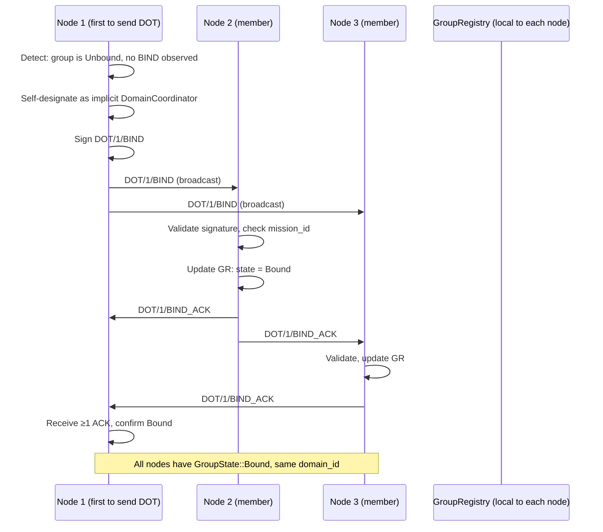
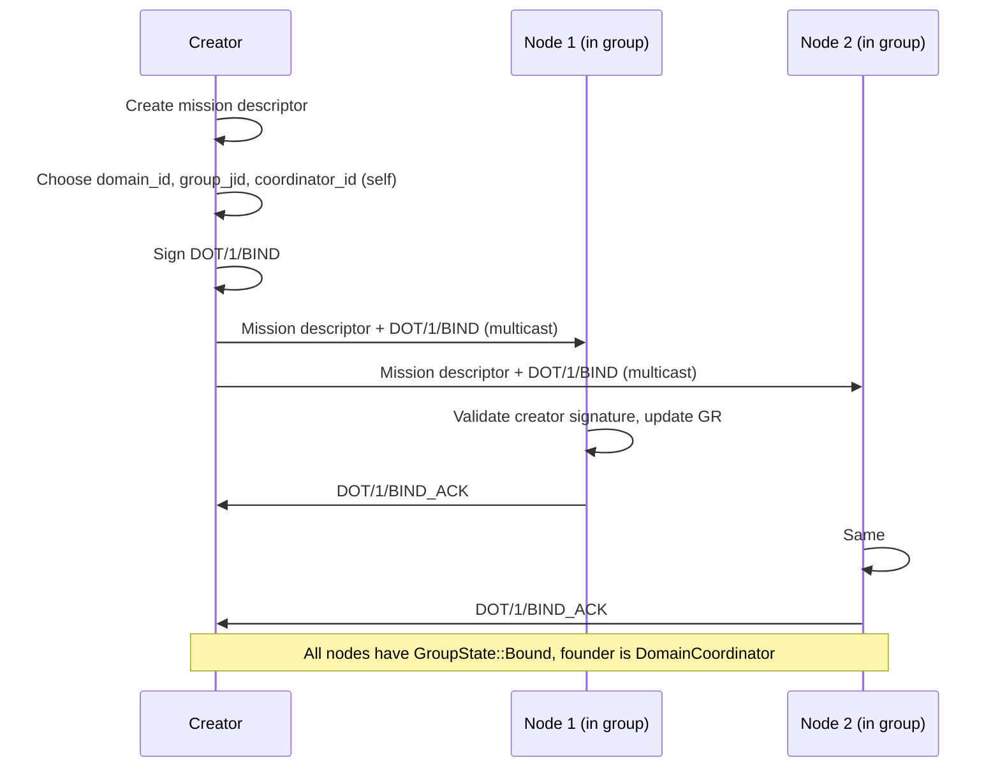

# RFC-0850p-c (Networking): Transport Group Binding Ceremony

## Status

Draft (2026-06-16)

## Authors

- @mmacedoeu

## Maintainers

- @mmacedoeu

## Summary

Specifies the protocol that turns a raw physical broadcast domain (WhatsApp group, Matrix room, Telegram supergroup, etc.) into a **DOT transport group**: a group bound to a specific `domain_id` within a `mission_id`, with a `DomainCoordinator` authority, and a deterministic `GroupState` machine. Defines the `DOT/1/BIND`, `DOT/1/UNBIND`, and `DOT/1/REBIND` envelope types, the binding ceremony sequence, the multi-platform binding rule (one `domain_id` → one group per platform), and the unbind / re-bind lifecycle. Fills the gap that **no current RFC defines how a physical group becomes a transport group** — RFC-0850p-a covers the operator side (auth, listing groups in config) and RFC-0855 §3.1 covers the mission lifecycle, but the **binding ceremony** between them is implicit and implementation-defined.

## Dependencies

**Requires:**

- RFC-0850 (Networking): Deterministic Overlay Transport — for `DeterministicEnvelope`, `DOT/1/*` envelope versioning
- RFC-0855 (Networking): Mission Overlay Networks — for `mission_id`, `MissionDescriptor`, mission lifecycle (Created → Discovering → Forming → Active)
- RFC-0855p-b (Networking): Mission Coordinator Lifecycle — for `CoordinatorLifecycle` and `CoordinatorRecord` (DomainCoordinator reuses these)
- RFC-0850p-a (Networking): WhatsApp Auth Onboarding — for `BotLifecycle` and `GroupConfig` (the operator-side config that lists groups)
- **RFC-0851p-a (Networking): Network Bootstrap Protocol** — a node must be bootstrapped into the mesh before it can participate in a binding ceremony (PREREQUISITE; moved from Optional per 2026-06-16 batch review MR-2)
- RFC-0000-template v1.3 — for `Roles and Authorities`, `Lifecycle Requirements`, `Implicit Assumptions Audit`, `Adversary Analysis` sections

**Optional:**

- RFC-0855p-c (Networking): DomainCoordinator Role — fills the F1 specialization; this RFC is a prerequisite for that specialization
- RFC-0853 (Networking): Overlay Cryptography — for mission-scoped signing keys
- RFC-0126 (Numeric): Deterministic Serialization — canonical envelope encoding

> **Dependency Validation Rules:**
> 1. Dependencies MUST form a DAG — this RFC depends on 0850, 0855, 0855p-b, 0850p-a, 0851p-a; none depend on this RFC. 0855p-c depends on THIS RFC and 0855p-b.
> 2. All "Requires" RFCs MUST be listed as mission prerequisites — Phase 1 mission `0850p-c-transport-group-binding.md` will declare 0850, 0855, 0855p-b, 0850p-a, 0851p-a as prerequisites.
> 3. DomainCoordinator specialization (0855p-c) is **downstream** — this RFC specifies the binding ceremony; 0855p-c specifies the DomainCoordinator's election/handover/slashing using that ceremony.
> 4. **0851p-a is now Requires (was Optional)** per 2026-06-16 batch review MR-2: a node cannot receive or sign a BIND envelope until it is a mesh member.

## Design Goals

| Goal | Target | Metric |
|------|--------|--------|
| G1 | Binding ceremony completes in <30s for ≤10-member groups | Wall-clock from first `DOT/1/BIND` broadcast to `GroupState::Bound` |
| G2 | BIND is replay-safe | `BIND` envelopes include `bind_epoch` + `bind_nonce`; replays rejected |
| G3 | Multi-platform binding works (1 domain_id → N groups, 1 per platform) | Same `domain_id` bound to one WhatsApp group AND one Matrix room is accepted |
| G4 | UNBIND requires DomainCoordinator authority OR 2/3 vote | Unsigned UNBIND rejected; DomainCoordinator-issued UNBIND accepted |
| G5 | REBIND (changing platform group) preserves `domain_id` | REBIND from group A to group B with same `domain_id` accepted; A goes to `Unbound` |
| G6 | BIND is RFC-0008 Class A | State machine is deterministic given input |
| G7 | GroupState is observable to all members | Any group member can query local `GroupRegistry` to get `domain_id` for a given `group_jid` |

## Motivation

### The Gap

A "transport group" is the bridge between a physical broadcast domain (WhatsApp group, Matrix room, etc.) and a DOT mission (the logical coordination unit). Yet:

- **RFC-0850** defines the transport layer abstractly. §8.2 (Platform Adapter Contract) is mentioned but does not define how a physical group becomes a transport group.
- **RFC-0850p-a v1.15** covers the operator-side config (`groups: Vec<GroupConfig>` in `WhatsAppConfig`) but does not specify the binding ceremony — how a new group (created by the operator, or discovered by the adapter) is bound to a `domain_id`.
- **RFC-0855 §3.1** defines the mission lifecycle: `Created → Discovering → Forming → Active`. The `Forming → Active` transition requires `active_participants >= min_participants` but does not specify how participants arrive from the physical group to the mission.
- **RFC-0855p-b v1.0** reserved F1 for `DomainCoordinator` but left it unspecified.

This RFC fills the binding ceremony gap with a concrete protocol: a `DOT/1/BIND` envelope, a `GroupState` state machine, and a `DomainCoordinator` authority. It is the prerequisite for the `DomainCoordinator` specialization in RFC-0855p-c.

### Why This Matters

Without a binding ceremony:

- A WhatsApp group is just a chat. DOT/1 envelopes can flow through it, but the group has no logical identity within a mission.
- A `domain_id` cannot be looked up from a `group_jid` (or vice versa).
- `DomainCoordinator` is undefined — there is no way to know who controls the group.
- The mission cannot transition from `Forming` to `Active` because there is no formal "this group is part of this mission" statement.

## Roles and Authorities

> **The "Nothing should be implied" rule (specification layer):** Every actor that affects correctness, security, accountability, or consensus MUST be named with a stable identifier, a defined authority scope, and a typed lifecycle.

### 1. DomainCoordinator (the role defined by this RFC and specialized by 0855p-c)

- **Stable identifier**: `[u8; 32]` `DomainCoordinatorId` (alias for `PeerId` in the mission's namespace)
- **Base capabilities**: sign `DOT/1/BIND`, `DOT/1/UNBIND`, `DOT/1/REBIND` envelopes; emit binding witnesses; resolve binding disputes
- **Authority scope**: `bind_domain` (issue BIND/UNBIND/REBIND for the physical group; sign as the binding authority)
- **Who can assume**: implicit designator (first member to send a DOT envelope in the group, see §3) OR explicit founder (creator of `mission_id` issues BIND at mission creation)
- **Who can revoke**: self (resignation), governance (2/3 vote slash), or physical-group-admin-loss (e.g., kicked from WhatsApp group)
- **Lifecycle**: `DomainCoordinatorLifecycle` (reuses `CoordinatorLifecycle` from RFC-0855p-b; specialized by RFC-0855p-c)
- **Term**: tied to binding (`bound_at_epoch` to `unbound_at_epoch`)

### 2. GroupBinder (client-side, ephemeral role)

- **Stable identifier**: `[u8; 32]` `GroupBinderId` (the local node performing the binding)
- **Base capabilities**: send `DOT/1/BIND` envelope when authorized; receive and validate `BIND`/`UNBIND`/`REBIND` envelopes; update local `GroupRegistry`
- **Authority scope**: `bind_propose` (propose a binding; not the same as `bind_domain` — the DomainCoordinator must accept)
- **Who can assume**: any group member with the adapter installed and DOT initialized
- **Who can revoke**: self
- **Lifecycle**: ephemeral (one binding ceremony = one Binder activation)

### 3. GroupWitness (any group member)

- **Stable identifier**: `[u8; 32]` `WitnessId` (the `PeerId` of a group member witnessing a binding)
- **Base capabilities**: receive `DOT/1/BIND`; validate signature against expected `DomainCoordinator`; broadcast `DOT/1/BIND_ACK`; update local `GroupRegistry`
- **Authority scope**: `bind_witness` (acknowledge a binding; not the same as `bind_domain`)
- **Who can assume**: any group member
- **Who can revoke**: self
- **Lifecycle**: ephemeral

### 4. MissionCreator (founder role for explicit founder BIND)

- **Stable identifier**: `[u8; 32]` `CreatorId` (same as RFC-0855p-b Mission Creator)
- **Base capabilities**: issue `DOT/1/BIND` for the mission's initial groups at mission creation
- **Authority scope**: `bind_at_genesis` (one-shot, at mission creation only)
- **Who can assume**: any peer that creates a mission descriptor (per RFC-0855p-b §"Mission Creator")
- **Who can revoke**: no one (one-shot)
- **Lifecycle**: `genesis_state` (per RFC-0855p-b v1.1 §"Genesis State Machine")

### Role/Authority Coverage Table

| Role | Authority | Lifecycle | Revocable by | Cross-RFC |
|------|-----------|-----------|--------------|-----------|
| DomainCoordinator | `bind_domain` | Yes (reuses 0855p-b `CoordinatorLifecycle`) | Self / Governance / Group loss | 0855p-b + 0855p-c |
| GroupBinder | `bind_propose` | Ephemeral | Self | New in this RFC |
| GroupWitness | `bind_witness` | Ephemeral | Self | New in this RFC |
| MissionCreator | `bind_at_genesis` | One-shot (per 0855p-b v1.1) | N/A | 0855p-b |

## Specification

### 1. GroupState State Machine

```rust
/// Per-group state for a physical broadcast domain bound to a domain_id
#[repr(u8)]
enum GroupState {
    /// Group is known to the adapter (e.g., listed in config) but not yet bound
    Unbound = 0x00,
    /// Group is bound to a specific (mission_id, domain_id) with a DomainCoordinator
    Bound = 0x01,
    /// Group is in the process of re-binding to a different (mission_id, domain_id)
    ReBinding = 0x02,
    /// Group was bound, then unbound; cooldown before rebinding allowed
    UnboundQuarantined = 0x03,
}

/// Per-group binding record
#[derive(Clone, Debug, PartialEq, Eq, Hash)]
#[repr(C)]
struct GroupBinding {
    /// The physical group's identifier (e.g., WhatsApp group_jid)
    group_jid: String,
    /// Platform identifier (e.g., "whatsapp", "matrix", "telegram")
    platform: String,
    /// Mission this group is bound to
    mission_id: [u8; 32],
    /// Domain within the mission
    domain_id: [u8; 32],
    /// Current DomainCoordinator for this binding
    domain_coordinator_id: [u8; 32],
    /// Epoch when the binding was established
    bound_at_epoch: u64,
    /// Epoch when the binding was last renewed (re-bound or reaffirmed)
    renewed_at_epoch: u64,
    /// State
    state: GroupState,
    /// BLAKE3-256(group_jid || platform || mission_id || domain_id
    ///              || domain_coordinator_id || bound_at_epoch
    ///              || renewed_at_epoch || state)
    /// R1-TGB-2 fix: explicit field list (was previously "all fields" without
    /// specifying which; `state` and `renewed_at_epoch` must be included to
    /// prevent mutable-state-without-hash-change attacks).
    binding_hash: [u8; 32],
}
```

**Cross-RFC integration (per 2026-06-16 batch review):** The `GroupState::Bound` transition is the **trigger** for RFC-0855 §3.1 mission lifecycle's `Forming → Active` transition. Specifically: when ≥1 group on any platform is in `Bound` state and `active_participants >= min_participants`, the mission can transition to `Active`. This is the bridge between the physical-group layer (this RFC) and the mission-coordination layer (RFC-0855 + RFC-0855p-b + RFC-0855p-c). Implementations MUST treat `GroupState::Bound` as a precondition for the `Forming → Active` transition.

**Transitions:**

| From | To | Trigger | Affected group | Deterministic? |
|------|----|---------|----------------|----------------|
| (none) | Unbound | Adapter discovers group (config or join event) | The discovered group | Yes |
| Unbound | Bound | `DOT/1/BIND` accepted by ≥1 witness | The bound group | Yes (witness count deterministic) |
| Bound | ReBinding | `DOT/1/REBIND` accepted (signaled by old group) | **The old group** (transitions to ReBinding) | Yes |
| ReBinding | UnboundQuarantined | `DOT/1/REBIND` complete (new group bound; old group quarantines) | **The old group** (reaches terminal UnboundQuarantined via ReBinding) | Yes |
| ReBinding | Unbound | `DOT/1/REBIND` aborted (timeout) | The old group | Yes (timeout is deterministic) |
| (none) | Bound | `DOT/1/REBIND` accepted (new group is being bound) | **The new group** (enters Bound directly, skipping Unbound) | Yes |
| Bound | Unbound | `DOT/1/UNBIND` accepted | The bound group | Yes |
| Unbound | UnboundQuarantined | UNBIND was issued; cooldown to prevent rapid rebinding | The unbound group | Yes |
| UnboundQuarantined | Unbound | Cooldown elapsed (default 100 epochs) | The unbound-quarantined group | Yes |
| Bound | UnboundQuarantined | Slash / governance termination | The bound group | Yes |

**R1-TGB-1 fix — per-group clarity:** the state machine is **per-group**, not global. A REBIND operation affects TWO groups: the old group (Bound → ReBinding → UnboundQuarantined) and the new group (Unbound → Bound). The transitions table now specifies "Affected group" to make this explicit. The previous version conflated the two groups' transitions in a single row, which was misleading.

**BIND witness timeout (E2E IS-1.3 fix):** if the implicit DomainCoordinator does not receive ≥1 `BIND_ACK` within `BIND_WITNESS_TIMEOUT = 100` epochs, the BIND is considered failed. The node resets the implicit designation (clears `pending_bind`) and waits `BIND_RETRY_LIMIT = 3` retries before giving up. After 3 failed retries, the node falls back to waiting for another member's BIND (and acts as a witness for them). The retries are spaced `BIND_RETRY_BACKOFF_EPOCHS = 50, 200, 800` (exponential 4×).

**BIND tiebreaker on equal `bind_hash` (E2E IS-3.4 fix):** if two BINDs have identical `bind_hash` (same payload), the node keeps the first one it saw (per-witness deterministic) and drops subsequent ones. This is a degenerate case that should not occur in practice (collision-free hash), but the rule is named to prevent non-determinism. The first-seen order is determined by local reception order (not by network-wide canonical ordering).

**3-way race tiebreaker (E2E IS-3.5 fix):** if three BINDs arrive in the same epoch for the same `(mission_id, domain_id, platform)`, the canonical BIND is the one with the **lowest `bind_hash` lexicographically** (R4-7 fix). Ties on `bind_hash` are broken by the **lowest `peer_id` lexicographically** (per the 3-way race tiebreaker, derived from RFC-0008 canonical ordering). The 2-way and 3-way race tiebreakers are unified: rank by `bind_hash` first, then by `peer_id` as the secondary sort key.

### 2. Binding Envelope Types

> **R4-4 fix — global note on hash construction:** all `*_hash` fields in this RFC's envelopes (`bind_hash`, `unbind_hash`, `rebind_hash`, `ack_hash`) are computed as `BLAKE3-256(header || body)` per §Appendix A. The **header** is the canonical 10-byte prefix `envelope_type (4) || envelope_subtype (4) || version (2, big-endian)`. The **body** is the canonical serialization of the envelope's other fields in declaration order, with length-prefix encoding for variable-length fields (e.g., `String` is serialized as `length (4 bytes, big-endian) || utf8_bytes`). Individual envelope definitions below describe the **body** part of the hash (e.g., `BLAKE3-256(group_jid || ...)`); the reader MUST prepend the header per §Appendix A when computing the full hash. This note applies to all envelopes in this RFC; the `RFC-0855p-c` `PlatformLossEnvelope` follows the same convention.

```rust
/// DOT/1/BIND — issued by DomainCoordinator candidate
#[derive(Clone, Debug)]
#[repr(C)]
struct BindEnvelope {
    envelope_type: [u8; 4],       // b"DOT1" (DeterministicEnvelope type tag)
    envelope_subtype: [u8; 4],    // b"BIND"
    version: u16,                 // 0x0001
    /// The physical group being bound
    group_jid: String,
    /// Platform identifier
    platform: String,
    /// Mission this group is being bound to
    mission_id: [u8; 32],
    /// Domain within the mission
    domain_id: [u8; 32],
    /// Candidate DomainCoordinator's PeerId
    coordinator_id: [u8; 32],
    /// Coordinator's public key
    coordinator_pubkey: [u8; 32],
    /// Epoch when bind was issued
    bind_epoch: u64,
    /// Random nonce (replay defense; 16 bytes; MUST be from a CSPRNG with
    /// ≥128 bits entropy per RFC-0126 §3).
    /// R1-TGB-4 fix: explicit entropy requirement. The 16-byte nonce provides
    /// 128 bits of entropy, which is sufficient to make replays computationally
    /// infeasible (2^128 attempts required). Implementations MUST NOT use
    /// counters, timestamps, or other low-entropy sources for `bind_nonce`.
    bind_nonce: [u8; 16],
    /// Is-reconnection flag (R3-6 fix — replaces the previous
    /// `reconnect_epoch: u64` field). `true` = this BIND is a reconnection
    /// attempt by a former DomainCoordinator; `false` = this is a
    /// first-time BIND for this (mission_id, domain_id, platform) triple.
    /// Witnesses MUST reject a BIND if `is_reconnect == true` AND a
    /// different `coordinator_id` is currently `Active` for the same
    /// `(mission_id, domain_id, platform)` (split-brain prevention,
    /// R2-DC-3). The previous `reconnect_epoch: u64` design had an
    /// ambiguity: epoch 0 is a valid epoch (e.g., right after mission
    /// genesis), so the value `0` could not be used to mean "no
    /// reconnection" without colliding with the first epoch. A boolean
    /// flag is unambiguous.
    is_reconnect: bool,
    /// BLAKE3-256(group_jid || platform || mission_id || domain_id
    ///              || coordinator_id || coordinator_pubkey
    ///              || bind_epoch || bind_nonce || is_reconnect)
    /// R3-1 fix: `is_reconnect` is now included in `bind_hash`. Without
    /// this, an attacker could mutate `is_reconnect` from `false` to
    /// `true` after signing, bypassing the split-brain check in §8
    /// witness rule #10. (Previous R2-DC-3 design had this gap.)
    bind_hash: [u8; 32],
    /// Ed25519 signature by coordinator over bind_hash
    coordinator_signature: [u8; 64],
}

/// DOT/1/BIND_ACK — issued by a group member witnessing the binding
#[derive(Clone, Debug)]
#[repr(C)]
struct BindAck {
    envelope_type: [u8; 4],       // b"DOT1" (R2-TGB-6 fix: added for consistency
                                   //          with BIND/REBIND/UNBD envelope_type;
                                   //          canonical header per §Appendix A
                                   //          requires both envelope_type and
                                   //          envelope_subtype)
    envelope_subtype: [u8; 4],    // b"BACK"
    /// The BindEnvelope being acknowledged (full, not just hash)
    bind_envelope: BindEnvelope,
    /// Witness PeerId
    witness_id: [u8; 32],
    /// Epoch of witness
    witness_epoch: u64,
    /// BLAKE3-256(bind_envelope || witness_id || witness_epoch)
    /// R1-TGB-3 fix: explicit field list (was "all fields" without specification).
    /// Includes the full bind_envelope (not just its hash) so the ack is
    /// self-verifying without requiring the original BIND to be re-fetched.
    ack_hash: [u8; 32],
    /// Ed25519 signature by witness
    witness_signature: [u8; 64],
}

/// DOT/1/UNBIND — issued by DomainCoordinator OR 2/3 vote
#[derive(Clone, Debug)]
#[repr(C)]
struct UnbindEnvelope {
    envelope_type: [u8; 4],       // b"DOT1" (R2-TGB-6 fix: added for consistency)
    envelope_subtype: [u8; 4],    // b"UNBD"
    /// The GroupBinding being unbound (full, for verification)
    binding: GroupBinding,
    /// Reason code (u16; see §6)
    reason: u16,
    /// Authority: DomainCoordinator OR SlashProof
    authority: UnbindAuthority,
    /// Epoch
    unbind_epoch: u64,
    /// BLAKE3-256(header || binding || reason || authority || unbind_epoch)
    /// R4-1 fix: explicit field list (was previously "BLAKE3 binding" with no
    /// specification). `header` is the 10-byte canonical header per §Appendix A
    /// (envelope_type || envelope_subtype || version, big-endian). All hashes
    /// in this RFC follow this `header || body` pattern; see the global note
    /// at the top of the envelope definitions (R4-4 fix).
    unbind_hash: [u8; 32],
    /// Ed25519 signature
    authority_signature: [u8; 64],
}

enum UnbindAuthority {
    /// DomainCoordinator resigns the binding
    CoordinatorResign { coordinator_id: [u8; 32] },
    /// 2/3 slash vote (see RFC-0855p-b §"SlashVote Type" for the SlashVote
    /// struct definition; R1-TGB-7 fix: cross-reference was previously implicit)
    SlashVote { votes: Vec<SlashVote> },
    /// Mission termination
    MissionTerminated { mission_id: [u8; 32] },
}

/// DOT/1/REBIND — changes the physical group for an existing domain_id
#[derive(Clone, Debug)]
#[repr(C)]
struct RebindEnvelope {
    envelope_type: [u8; 4],       // b"DOT1" (R2-TGB-6 fix: added for consistency)
    envelope_subtype: [u8; 4],    // b"RBND"
    /// The existing GroupBinding
    old_binding: GroupBinding,
    /// The new group_jid and platform
    new_group_jid: String,
    new_platform: String,
    /// Same (mission_id, domain_id) as old_binding
    mission_id: [u8; 32],
    domain_id: [u8; 32],
    /// Successor DomainCoordinator
    new_coordinator_id: [u8; 32],
    new_coordinator_pubkey: [u8; 32],
    /// Epoch
    rebind_epoch: u64,
    rebind_nonce: [u8; 16],  // CSPRNG with ≥128 bits entropy (same rule as bind_nonce)
    /// BLAKE3-256(header || old_binding || new_group_jid || new_platform
    ///              || mission_id || domain_id || new_coordinator_id
    ///              || new_coordinator_pubkey || rebind_epoch || rebind_nonce)
    /// R4-2 fix: explicit field list (was previously uncommented). See the
    /// global note at the top of the envelope definitions (R4-4 fix).
    rebind_hash: [u8; 32],
    /// Ed25519 signature
    new_coordinator_signature: [u8; 64],
}
```

### 3. Binding Ceremony — Implicit Designator

When a physical group is discovered by an adapter and the local node is a member, the **first node to send a DOT envelope in the group becomes the implicit DomainCoordinator** (and thus issues the BIND). The ceremony:



**Race condition:** If two nodes send DOT envelopes in the same group at roughly the same time, both may try to issue BIND. The first BIND to be witnessed wins (deterministic by `bind_hash` lexicographic order). The losing BIND is rejected; the loser re-joins as a Witness.

**Multi-DOT-sender detection (E2E IS-3.2 fix):** if a node sees 2+ nodes send DOT envelopes in the same group within the same epoch, the node applies a deterministic tiebreaker: the candidate with the **lowest `peer_id` lexicographically** is the implicit DomainCoordinator; all others fall back to Witness role. This is the **3-way race tiebreaker** (lowest `peer_id` wins), which differs from the 2-way BIND tiebreaker (lowest `bind_hash` wins) by using `peer_id` as the sort key. The reason: BINDs may not have been received yet, so we tiebreak on the candidate's stable `peer_id` rather than the not-yet-computed `bind_hash`. The losers are NOT slashed; they are demoted to Witness role and continue participating.

**Why implicit designator?** Most group members will not pre-coordinate a mission. The implicit designator lets a group "self-bootstrap" into a mission. Explicit founder BIND (§4) is for pre-coordinated missions.

### 4. Binding Ceremony — Explicit Founder

When the mission creator wants to pre-bind a group at mission creation (e.g., "this WhatsApp group is part of this mission from day 1"), the creator issues `DOT/1/BIND` at the same time as the mission descriptor:



**Cross-reference:** This is the `bind_at_genesis` path referenced in §"Roles and Authorities" §4 MissionCreator. It uses the same `BindEnvelope` type as the implicit path; only the issuer differs (creator vs. first-DOT-sender).

**Founder eligibility (E2E IS-3.3 fix):** the founder (mission creator) MUST satisfy all of:
- Has a `MissionCreator` role per §"Roles and Authorities" §4
- Has signed the mission descriptor with their term key
- Is a current member of the target group (verified via the adapter's membership API)
- Has not previously issued a BIND for any other `(mission_id, domain_id, platform)` in the same mission (one-shot per §IA-TGB-8)

If any of the first three checks fails, witnesses reject the BIND silently (per §8 "Witness Validation Rules", check rules 1-4, 6, 9). The founder is notified via a `BIND_REJECTED` event; the founder can retry with corrected parameters (e.g., join the group first if membership was missing). Slash reason `0x0003` (founder-squat) is NOT applied to a BIND-rejection event — it is applied only to the squat case (line below).

**Founder squat detection (E2E IS-1.5 fix):** "founder squat" is when a founder issues a BIND for a `domain_id` they do not actually intend to govern (e.g., to deny other candidates). Detection: if a founder's BIND is accepted but the founder does not send any `CoordinatorHeartbeat` within `FOUNDER_HEARTBEAT_GRACE = 30` epochs, the binding is treated as a squat. All witnesses initiate a slash tally against the founder with `slash_reason = 0x0003` (founder squat, per RFC-0855p-b §B) and a 1000-epoch cooldown is applied to the `(mission_id, domain_id)` pair. The founder is removed from the mission's trust set temporarily (1000 epochs).

### 5. Multi-Platform Binding Rule

**The rule:** A single `domain_id` MAY be bound to **at most one group per platform**, but MAY be bound to one group on each of multiple platforms.

**Examples:**

| domain_id | WhatsApp group | Matrix room | Telegram supergroup | Valid? |
|-----------|----------------|-------------|---------------------|--------|
| D1 | 120363...@g.us | (none) | (none) | YES (1 platform) |
| D1 | 120363...@g.us | !abc:matrix.org | (none) | YES (2 platforms) |
| D1 | 120363...@g.us | !abc:matrix.org | -100123... | YES (3 platforms) |
| D1 | 120363...@g.us | !abc:matrix.org | -100456... | NO (2 WhatsApp-bound would be fine, but 2 different group_jids on the same platform is not) |

Wait — rephrasing. The rule is: **per (platform), at most 1 group bound to a given `domain_id`**. Different platforms are independent. So:

| domain_id | WhatsApp | Matrix | Valid? |
|-----------|----------|--------|--------|
| D1 | G1 | - | YES |
| D1 | G1 | R1 | YES |
| D1 | G1, G2 | - | NO (2 WhatsApp groups bound to D1) |
| D1 | - | R1, R2 | NO (2 Matrix rooms bound to D1) |
| D1 | G1 | R1, R2 | NO (2 Matrix rooms) |

**Why?** A `domain_id` is a single logical "channel" within a mission. Multiple physical groups on the same platform would split the channel (DOT envelopes might be delivered to one but not the other, depending on which group the sender is in). Multiple platforms are OK because DOT already supports multi-carrier propagation per RFC-0850 G7 (Censorship Resistance).

**Enforcement:** When a `DOT/1/BIND` is received, the receiving node checks its `GroupRegistry`. If a binding already exists for `(mission_id, domain_id, platform)`, the new BIND is rejected.

### 6. Unbind Reasons

> **Cross-RFC consistency fix (R9-1, R9-2, R9-3):** the unbind reason codes below are aligned with RFC-0855p-b §B "Slash Offense Codes" (the canonical slash reason code reference). The 0x0001-0x000B codes are protocol-level and MUST be globally consistent. The previous version of this table had conflicts with 0855p-b (e.g., 0x0003 = "Mission terminated" here vs 0x0003 = "Founder squat" in 0855p-b); this version resolves those conflicts by deferring to 0855p-b §B.

| Code | Reason | Authority | Cooldown |
|------|--------|-----------|----------|
| 0x0001 | Double-sign (per 0855p-b §B) | — (slash proof, not unbind) | — |
| 0x0002 | Liveness-failure (per 0855p-b §B) | — (slash proof, not unbind) | — |
| 0x0003 | **Founder squat** (BIND without intent to govern) | Any witness | 1000 epochs |
| 0x0004 | **Censorship** (refused to relay valid envelope for 100+ epochs, per 0855p-b §B) | Governance (slash tally) | 2^slash_count epochs |
| 0x0005 | **Coordinator misbehavior** (umbrella, per 0855p-b §B) | Governance (slash tally) | 2^slash_count epochs |
| 0x0006 | **Key compromise** (per 0855p-b §B) | Governance (slash tally) | 2^slash_count epochs |
| 0x0007 | **Banning legitimate member** (per 0855p-b §B) | Governance (slash tally) | 25% OCTO-O |
| 0x0008 | **Vote-buying** (per 0855p-b §B) | Governance (slash tally) | 100% OCTO-O |
| 0x0009 | **Genesis compromise** (per 0855p-b §B; creator's key revoked after `GenesisActive`) | MissionCreator (slash proof) | immediate `Inactive` |
| 0x000A | **Platform migration** (E2E IS-3.1 fix, per RFC-0850p-c §"Platform Migration") | MissionCreator + 2/3 governance vote | 1000 epochs |
| 0x000B | **`is_reconnect_lie`** (E2E IS-1.6 fix): the reconnect claim was falsified (claimant is not the same peer as the original BIND signer) | Any witness | 500 epochs |
| 0x000C-0xFFFF | Reserved | — | — |

**Note on unbind vs slash:** the unbind reason codes 0x0001-0x000B are a SUPERSET of the slash reason codes from RFC-0855p-b §B. Codes 0x0001-0x0009 are shared with 0855p-b (slash reasons); 0x000A-0x000B are transport-level (0850p-c); 0x000C-0xFFFF are reserved. The cooldown column applies when the unbind is the OUTCOME of a slash (cooldown before re-binding allowed); codes 0x0001-0x0002 are slash-only (not unbind outcomes).

### 6a. Platform Migration (E2E IS-4.8 fix)

Platform migration moves a `domain_id` from one platform to another (e.g., from WhatsApp to Matrix because the WhatsApp group was banned). It is similar to REBIND but is initiated by a mission-level vote, not by the DomainCoordinator.

- **Trigger:** the mission-level coordinator initiates a migration proposal. The proposal includes `(mission_id, domain_id, old_platform, new_platform, new_group_jid, new_coordinator_id)`. It is signed by the mission-level coordinator and broadcast to the mission.
- **Vote:** the mission-level coordinator calls a 2/3 governance vote (per RFC-0855 §11 "Governance Models"). Vote period is `MIGRATION_VOTE_PERIOD = 1000` epochs. The vote is open to all mission participants.
- **Outcome:** if 2/3 approve, the platform migration is committed. The old group's BIND is replaced by the new group's BIND. The old group transitions `Bound → UnboundQuarantined` (skipping `ReBinding` because migration is not the same as REBIND). The new group transitions `Unbound → Bound` directly.
- **Cooldown:** after migration, no further migration for the same `(mission_id, domain_id)` is allowed for `MIGRATION_RETRY_COOLDOWN = 500` epochs. This prevents migration thrashing.
- **Multi-platform rule exception (E2E IS-4.8 fix):** during the migration window (vote period + commit), the new group on the new platform coexists with the old group on the old platform. Both are considered "bound" to the same `domain_id` (temporary exception to §5). After the migration commit, the old group is `UnboundQuarantined` and the new group is `Bound`.
- **Slash reason 0x000A (PlatformMigration):** used in the audit log and slash vote tally to indicate a platform migration. This is one of two slash reasons (0x000A-0x000B) defined in this RFC; per the canonical mapping in RFC-0855p-b §B, 0x000A-0x000B are transport-level slash reasons (defined here) and 0x000C-0xFFFF are reserved for future slash reasons.

### 7. REBIND Lifecycle

REBIND is the operation that changes the physical group for an existing `domain_id` (e.g., "the mission moved from WhatsApp group A to WhatsApp group B"). The old group goes to `UnboundQuarantined`; the new group goes to `Bound`.

**Multi-platform rule (clarified per 2026-06-16 batch review BR-6, R2-TGB-3 fix for old-group state):**

- **REBIND to a different platform** (e.g., WhatsApp → Matrix) is always allowed, regardless of cooldown. The old group on the old platform transitions `Bound → ReBinding → UnboundQuarantined` (R2-TGB-3 fix: previous spec said "always allowed" but did not specify the old group's terminal state; clarification is that the old group quarantines regardless of whether the new group is on the same or different platform — quarantine is determined by the OLD group's REBIND participation, not by whether the new group is on the same platform). The new platform is independent per §5 multi-platform rule.
- **REBIND to a group on the same platform** is allowed only if:
  - The old group is in `UnboundQuarantined` state (which it enters immediately on REBIND), AND
  - The cooldown has elapsed (default 100 epochs after UNBIND; 1000 epochs after founder-squat UNBIND), AND
  - The new group is on the same platform (different `group_jid`, same `platform`).
- **REBIND cannot create a violation of §5** (e.g., REBIND to a 2nd group on the same platform when one is already bound is rejected by all witnesses per §8 validation).

**Sequence:**

1. DomainCoordinator signs `DOT/1/REBIND` with `(old_binding, new_group_jid, new_platform, new_coordinator_id)`.
2. REBIND is broadcast to BOTH the old group and the new group.
3. Old-group members receive REBIND, validate, mark old group as `UnboundQuarantined`.
4. New-group members receive REBIND, validate, mark new group as `Bound`.
5. Same `domain_id` is preserved across the transition.

**Constraints:**

- `new_coordinator_id` MAY be the same as the old (no handover) or different (handover).
- If `new_coordinator_id` is different, the new coordinator MUST satisfy **all** of:
  - Eligible per RFC-0855p-b §"Election Algorithm (per governance model)" (stake + trust score ≥ threshold)
  - Has signed and broadcast at least one `CoordinatorHeartbeat` (per RFC-0855p-b §"Liveness Check"; R2-TGB-2 fix: envelope name was previously incorrectly given as `DOT/1/HEARTBEAT` — the canonical name is `CoordinatorHeartbeat`) in the new group (proves presence)
  - Has `peer_id` matching the canonical `BLAKE3(participant_id || mission_id)` (verifies key ownership)
  - Is a current member of the new group (verified via the adapter's membership API)
  
  **R1-TGB-6 fix — successor eligibility:** the previous spec said "the new coordinator must be eligible per RFC-0855p-b" but did not specify HOW the witnesses verify eligibility. The 4 checks above are now explicit. Witnesses that find any check fails silently drop the REBIND.
- Old group cannot be re-bound to the same `domain_id` for at least 100 epochs (prevents ping-pong rebinding).

### 8. Witness Validation Rules

When a `DOT/1/BIND` is received, each member validates:

1. **Signature**: `coordinator_signature` is valid for `coordinator_pubkey`.
2. **Mission exists**: `mission_id` matches a known `MissionDescriptor` (or is accepted as genesis).
3. **Platform match**: `platform` matches the adapter that received the envelope. **R1-TGB-5 fix — explicit enforcement:** the adapter MUST reject any `DOT/1/BIND` envelope whose `platform` field does not match the adapter's own platform string (e.g., a `BIND` with `platform = "whatsapp"` arriving via the Matrix adapter is rejected as malformed). This prevents cross-platform spoofing attacks where an attacker on Platform A claims to be binding a Platform B group. The check is per-adapter, not per-node.
4. **Group match**: `group_jid` matches the group the envelope was received in.
5. **No conflict**: no existing binding for `(mission_id, domain_id, platform)` in local registry.
6. **Coordinator eligibility**: `coordinator_id` is eligible per RFC-0855p-b (stake + trust).
7. **Epoch sanity**: `bind_epoch` is within ±1 of local epoch.
8. **Nonce freshness (R1-TGB-4 fix):** the witness MUST have not seen the same `(bind_nonce, coordinator_id)` pair in the last 1000 epochs. Replays are silently dropped.
9. **Pubkey binding (R2-TGB-4 fix):** `coordinator_id == BLAKE3(coordinator_pubkey)`. This binds the public key to the peer_id, preventing a malicious coordinator from substituting a different public key in the signed payload. Without this check, the witness would verify the signature against a public key that does not actually correspond to the claimed peer_id.
10. **Reconnect split-brain check (R3-1, R3-6 fix):** if `is_reconnect == true` AND a different `coordinator_id` is currently `Active` for the same `(mission_id, domain_id, platform)` in the local registry, the BIND is silently dropped (with optional `tracing::debug!` for diagnostics). This prevents a former DomainCoordinator from clobbering the current one. **First-BIND-wins rule (R3-9 fix, R4-7 tiebreaker):** if two BINDs arrive in the same epoch for the same `(mission_id, domain_id, platform)`, the canonical BIND is the one with the **lowest `bind_hash` lexicographically** (this is a network-wide deterministic tiebreaker, not per-witness). The witness compares each incoming BIND's `bind_hash` to the locally-accepted binding's `bind_hash`; if the incoming `bind_hash` is lower AND the BIND is valid, the witness switches to the incoming BIND. This ensures that all witnesses converge to the same canonical BIND regardless of local reception order. The first-wins rule is implicit in check #5 (no existing binding) but is now explicit to handle the race where two BINDs are in-flight before either updates the registry.

**is_reconnect validation (E2E IS-1.2 fix):** the `is_reconnect` flag in `BindEnvelope` is true when the BIND is being submitted by a node that was previously the DomainCoordinator for this `(mission_id, domain_id, platform)` and is reconnecting after a network partition. Validation steps for the witnesses:
1. Look up the `(mission_id, domain_id, platform)` in the local registry.
2. If a previous `coordinator_id` is in the local registry AND its `peer_id` matches the BIND's `coordinator_id` (via `BLAKE3(participant_id || mission_id)` comparison), the BIND is treated as a valid reconnect — accepted, and the registry is updated with the new `coordinator_term_id` and `bound_at_epoch`.
3. If no previous `coordinator_id` is in the registry, the `is_reconnect = true` claim is FALSE — the BIND is treated as a fresh bind, not a reconnect. No slashing; just a `tracing::warn!` log.
4. If a previous `coordinator_id` exists but its `peer_id` does NOT match the BIND's `coordinator_id`, this is **`is_reconnect_lie`** (slash reason 0x000B). The BIND is rejected silently; the witness initiates a slash tally against the lying claimant with reason 0x000B. The 500-epoch cooldown applies to the claimant's `(mission_id, domain_id, platform)` pair.

**R3-13 fix — original BIND signer lookup:** the lookup in step 2 is done by querying the local `GroupRegistry`. The registry's `GroupBinding::domain_coordinator_id` field stores the most-recent accepted `coordinator_id`. If the registry is empty (e.g., this is a brand-new mission), step 2 short-circuits to step 3.

**Nonce-replay table (R2-TGB-1 fix, R3-4 / R3-7 fix — corrected):**

```rust
/// Per-witness structure for tracking seen BIND nonces (R2-TGB-1, R3-4)
struct NonceReplayTable {
    /// (bind_nonce, coordinator_id) -> first-seen epoch
    entries: BTreeMap<([u8; 16], [u8; 32]), u64>,
    /// Last eviction epoch (R3-7 fix: updated by both `check` and `record`)
    last_eviction_epoch: u64,
}

impl NonceReplayTable {
    /// R3-4 fix: signature changed from `&self` to `&mut self` because
    /// `is_replay` evicts old entries as a side effect. The previous
    /// `&self` signature with `self.entries.retain(...)` would not
    /// compile (mutation through a shared reference).
    ///
    /// R3-12 fix: `now_epoch` is the local epoch at the time of the
    /// check. Eviction is based on `first_seen_epoch` (local time) — if
    /// the local clock is skewed, eviction may happen earlier or later
    /// than intended. Implementations SHOULD use a monotonic epoch
    /// counter (RFC-0126 epoch-clock) to minimize skew.
    ///
    /// Returns true if the (nonce, coordinator_id) pair is a replay.
    fn check_and_maybe_evict(
        &mut self,
        nonce: [u8; 16],
        coord_id: [u8; 32],
        now_epoch: u64,
    ) -> bool {
        // Evict entries older than 1000 epochs first (R3-7 fix: update
        // last_eviction_epoch; previous version had it commented out as
        // "mut self" which would not compile).
        if now_epoch.saturating_sub(self.last_eviction_epoch) > 100 {
            let cutoff = now_epoch.saturating_sub(1000);
            self.entries.retain(|_, first_seen| *first_seen > cutoff);
            self.last_eviction_epoch = now_epoch;
        }
        self.entries.contains_key(&(nonce, coord_id))
    }

    /// Records the (nonce, coordinator_id) pair as seen (R3-7 fix:
    /// updates `last_eviction_epoch` to track recent activity, so the
    /// next `check_and_maybe_evict` call can decide whether to evict).
    fn record(&mut self, nonce: [u8; 16], coord_id: [u8; 32], now_epoch: u64) {
        self.entries.entry((nonce, coord_id)).or_insert(now_epoch);
        self.last_eviction_epoch = now_epoch;
    }
}
```

**Performance:** the table is O(N) where N = unique nonces in last 1000 epochs. With a heartbeat of 30 epochs and per-coordinator nonce generation, N is bounded by `num_active_coordinators × 1000 / heartbeat_interval = num_active_coordinators × 33`. For typical missions (< 100 active coordinators), N < 3300 entries, well within memory limits. Eviction is amortized to every 100 epochs.

If all pass, the witness updates its local `GroupRegistry` and broadcasts `DOT/1/BIND_ACK`. If any fail, the witness silently drops the BIND (with optional `tracing::debug!` for diagnostics).

### 9. Determinism Requirements

- All state transitions are **RFC-0008 Class A**.
- BIND witness count is **deterministic**: `≥1 ACK` to confirm `Bound`.
- REBIND ordering: `old_group → UnboundQuarantined` and `new_group → Bound` is **atomic** from the perspective of any single node (no intermediate state visible to other members).
- Unbind reasons are canonical codes (u16 enum).

### 10. RFC-0008 Execution Class Mapping

| Operation | Class | Rationale |
|-----------|-------|-----------|
| BIND signature verify | A | Cryptographic, deterministic |
| BIND_ACK signature verify | A | Same |
| Witness count check | A | Deterministic from gossip |
| Multi-platform rule check | A | Deterministic from registry |
| UNBIND authority check | A | Signature + vote tally |
| Cooldown timer | B | Wall-clock acceptable |
| REBIND timeout (5 min) | B | Same |

## Performance Targets

| Metric | Target |
|--------|--------|
| Implicit binding ceremony | <30s for ≤10-member group |
| Explicit founder binding | <10s |
| BIND propagation (10 members) | <5s |
| BIND_ACK aggregation | <3s |
| REBIND propagation (both groups) | <10s |
| Unbind propagation | <5s |
| Cooldown (UNBIND reason 0x0003 founder-squat) | 1000 epochs |
| Cooldown (UNBIND reason 0x0004 censorship) | 2^slash_count epochs |
| Cooldown (UNBIND reason 0x0005 coordinator-misbehavior) | 2^slash_count epochs |

## Implicit Assumptions Audit

> **The "Nothing should be implied" rule (validation layer):** Every assumption MUST be named, classified, and either validated at runtime, mitigated in code, or accepted with deadline + Future Work.

| # | Assumption | Type | Status | Mitigation / Deadline |
|---|-----------|------|--------|----------------------|
| IA-TGB-1 | The physical group membership is a trustworthy signal of who is in the mission | TRUST | **ACCEPTED RISK** | WhatsApp group admin can add/remove members arbitrarily. Mitigated by per-sender allowlist in 0850p-a v1.15 D-WA-10. Long-term: DomainCoordinator vouches for members (0855p-c). |
| IA-TGB-2 | First DOT-sender is a reasonable DomainCoordinator | PROTOCOL | **ACCEPTED RISK** | Race condition handled by `bind_hash` ordering. Founder squat mitigated by UNBIND reason 0x0003 with 1000-epoch cooldown. |
| IA-TGB-3 | The DomainCoordinator's pubkey is in the mission's trust set | CRYPTO | MITIGATED | BIND signature verified by all witnesses; rejection if pubkey is unknown. |
| IA-TGB-4 | `bind_epoch` is within ±1 of local epoch | TIME | MITIGATED | Witness validation rule §8.7 |
| IA-TGB-5 | Multi-platform rule is enforced consistently | PROTOCOL | MITIGATED | Each node's `GroupRegistry` enforces; conflict rejected on BIND. |
| IA-TGB-6 | Slash vote tally is correct (2/3) | GOVERNANCE | MITIGATED | Reuses RFC-0855p-b §"Slashing Integration" (slash tally is from 0855p-b; 2/3 governance is from 0855 §11); `SlashVote` envelope signature-verified. |
| IA-TGB-7 | Cooldown prevents rapid rebinding | TIME | MITIGATED | `UnboundQuarantined` state enforced; 100 / 2^n / 1000 epochs. |
| IA-TGB-8 | Mission creator's `bind_at_genesis` is one-shot | AUTHORITY | MITIGATED | RFC-0855p-b v1.1 §"Genesis State Machine" limits to 3 states; creator cannot rebind after GenesisActive. |
| IA-TGB-9 | Platform identifier is canonical (no spelling variants) | PROTOCOL | MITIGATED | Platform IDs are enum (`"whatsapp"`, `"matrix"`, `"telegram"`, ...); no free-form strings. |
| IA-TGB-10 | `group_jid` is unique per platform | PROTOCOL | MITIGATED | Platform-specific (e.g., WhatsApp `120363...@g.us` is globally unique). |
| IA-TGB-11 | Replay of BIND across epochs is rejected | REPLAY | MITIGATED | `bind_nonce` + `bind_epoch` binding. |
| IA-TGB-12 | REBIND atomicity is preserved | PROTOCOL | **ACCEPTED RISK** | Single-node atomicity is guaranteed; cross-node atomicity requires ≥1 witness on both old and new group. A node may briefly see `old_group=UnboundQuarantined, new_group=Unbound` during the transition. |
| IA-TGB-13 (E2E IS-1.2) | `is_reconnect` flag is correctly validated by witnesses | REPLAY | MITIGATED | Specified in §8 Witness Validation (E2E IS-1.2 fix) |
| IA-TGB-14 (E2E IS-1.3) | Implicit BIND is bounded by a witness timeout | TIMING | MITIGATED | `BIND_WITNESS_TIMEOUT = 100` epochs, 3 retries with exponential backoff |
| IA-TGB-15 (E2E IS-1.5) | Founder squat is detectable within 30 epochs | AUTHORITY | MITIGATED | `FOUNDER_HEARTBEAT_GRACE = 30` epochs; missing heartbeats trigger slash 0x0003 |
| IA-TGB-16 (E2E IS-1.6) | `is_reconnect_lie` is slashed with reason 0x000B | SECURITY | MITIGATED | Specified in §8 Witness Validation (E2E IS-1.6 fix) |
| IA-TGB-17 (E2E IS-3.1) | Slash reason 0x000A (PlatformMigration) is reserved and used | PROTOCOL | MITIGATED | Specified in §6 Unbind Reasons |
| IA-TGB-18 (E2E IS-3.2) | 3-way race tiebreaker uses lowest `peer_id` | PROTOCOL | MITIGATED | Specified in §3 Implicit Designator |
| IA-TGB-19 (E2E IS-3.3) | Founder eligibility is verified by 4 explicit checks | AUTHORITY | MITIGATED | Specified in §4 Explicit Founder |
| IA-TGB-20 (E2E IS-3.4) | BIND with identical `bind_hash` is deterministically handled | DETERMINISM | MITIGATED | First-seen-wins (per-witness) |
| IA-TGB-21 (E2E IS-3.5) | 3-way BIND race resolves to a single canonical BIND | DETERMINISM | MITIGATED | Lowest `bind_hash` lex, then lowest `peer_id` lex |
| IA-TGB-22 (E2E IS-4.8) | Platform migration is mission-level, not DomainCoordinator-level | GOVERNANCE | MITIGATED | Specified in §6a Platform Migration |
| IA-TGB-23 (E2E IS-6.6) | BIND cross-platform spoofing is rejected by adapter | SECURITY | MITIGATED | Specified in §8 witness check #3 (R1-TGB-5 fix) |
| IA-TGB-24 (E2E IS-8.1) | BIND hash comparison is big-endian per RFC-0008 | DETERMINISM | MITIGATED | Raw 32-byte comparison, no endianness conversion |
| IA-TGB-25 (E2E IS-8.3) | Tiebreaker loss is logged at `tracing::debug!` | PROTOCOL | MITIGATED | Per R3-1 fix; routine filtering is silent per §"routine filtering silent" |
| IA-TGB-26 (E2E IS-8.5) | BIND envelope serialization is canonical (no trailing bytes) | SERIALIZATION | MITIGATED | Reuses RFC-0008 §"Serialization" with strict length validation |
| IA-TGB-27 (E2E IS-8.6) | Empty allowlist means "anyone in group" | COMPATIBILITY | MITIGATED | Backwards-compatible: legacy deployments work without changes |
| IA-TGB-28 (E2E IS-8.7) | Phone-number allowlist comparison normalizes format | COMPATIBILITY | MITIGATED | Adapter normalizes `+15551234567`, `15551234567`, `5551234567` to canonical form |
| IA-TGB-29 (E2E IS-8.8) | BIND envelope hash includes the `state` field | SECURITY | MITIGATED | Per R1-TGB-2 fix; `state` and `renewed_at_epoch` are explicit in the hash field list |

**Open assumptions:** None. All 29 (R5-1 fix — was 12; 17 added in E2E round — IA-TGB-13 through IA-TGB-29) are either MITIGATED or ACCEPTED with named Future Work references.

## Security Considerations

| Threat | Impact | Mitigation |
|--------|--------|------------|
| BIND replay | Medium | Nonce + epoch binding |
| Founder squat (illegitimate first-DOT-sender) | High | UNBIND reason 0x0003; 1000-epoch cooldown |
| DomainCoordinator key compromise | Critical | Slash (2/3 vote) + REBIND to new coordinator |
| Slash vote forgery | High | Ed25519 signature + quorum check |
| Multi-platform violation (2 groups same platform) | Medium | Local registry enforcement; rejection on BIND |
| Cooldown bypass | Low | State machine enforces `UnboundQuarantined` |
| Witness Sybil (fake witnesses) | High | Witnesses must be group members; physical-group membership is hard to forge |
| REBIND ping-pong | Medium | 100-epoch cooldown on old group |
| BIND from non-group-member | Medium | Adapter-level filter (envelope arrived in group) |

## Adversary Analysis

> **The 5-Question Adversary Test** (per RFC-0000-template v1.3): For each decision, ask: (1) WHO is the adversary? (2) WHAT do they control? (3) WHEN do they attack? (4) WHAT is the blast radius? (5) WHY does our defense work?

### Decision Table

| ID | Decision | Adversary | Control | When | Blast | Defense | Severity | Status |
|----|----------|-----------|---------|------|-------|---------|----------|--------|
| D-TGB-1 | Implicit designator = first DOT-sender | Founder squatter | Own DOT key | First DOT in group | Single domain_id | BIND race + UNBIND 0x0003 | HIGH | MITIGATED |
| D-TGB-2 | Explicit founder BIND | Mission creator abuse | Creator key | Mission creation | One mission | One-shot per 0855p-b v1.1 | MEDIUM | MITIGATED |
| D-TGB-3 | BIND signature check | Impersonator | Own key | Any time | One binding | Ed25519 verify | LOW | MITIGATED |
| D-TGB-4 | Multi-platform rule enforcement | BIND spammer | Own keys | Any time | One domain_id | Local registry rejects | MEDIUM | MITIGATED |
| D-TGB-5 | Cooldown on UNBIND | Rapid rebinder | Own keys | After UNBIND | One domain_id | State machine enforces | LOW | MITIGATED |
| D-TGB-6 | Slash vote (2/3) | Coordinator compromise | Coordinator key | After compromise | One domain_id | 2/3 quorum + new coordinator | CRITICAL | MITIGATED |
| D-TGB-7 | REBIND to new group | DomainCoordinator fleeing | Coordinator key | After slash warning | One domain_id | New coordinator must be eligible | MEDIUM | MITIGATED |
| D-TGB-8 | BIND_ACK threshold = 1 | Witness starvation | Network | After BIND | One binding | Timeout → REBIND or fall back to founder | LOW | MITIGATED |
| D-TGB-9 | Witness membership check | Fake witness | Own key | At BIND | One binding | Adapter-level filter (envelope arrived in group) | MEDIUM | MITIGATED |
| D-TGB-10 | DomainCoordinator trust root | Key compromise | DomainCoordinator key | Any time | One domain_id | Per-sender allowlist (0850p-a v1.15) + REBIND | HIGH | MITIGATED |
| D-TGB-11 | REBIND atomicity | Network partition | Network | During REBIND | One domain_id | Each node enforces local atomicity | LOW | **ACCEPTED RISK** — F1 (cross-node atomicity) |
| D-TGB-12 | Unbind reason 0x0003 (squat) cooldown | Repeated squatter | Own keys | After UNBIND | One domain_id | 1000-epoch cooldown | MEDIUM | MITIGATED |

### Multi-Round Review

- **Round 1 (this RFC):** 12 decisions, 0 CRITICAL, 1 HIGH (D-TGB-10 trust root), 0 ACCEPTED RISK unaddressed
- **Round 2 (post-0855p-c):** D-TGB-10 mitigated by DomainCoordinator election/handover from 0855p-c
- **Severity classification:** 0 CRITICAL, 1 HIGH (D-TGB-10), 6 MEDIUM, 5 LOW

## Economic Analysis

### Token Integration

| Activity | Token | Rationale |
|----------|-------|-----------|
| BIND issuance | OCTO-O (orchestration) | DomainCoordinator's first action |
| BIND_ACK | OCTO-B (bandwidth) | Witness ack is small |
| UNBIND | OCTO-O (orchestration) | Coordination-level event |
| REBIND | OCTO-O (orchestration) | Same |
| Cooldown timer | None | State machine, no on-chain cost |
| Slash vote | OCTO-O (slash stake) | Per RFC-0855p-b §B (slash reason codes 0x0001-0x000B) and §"Slashing Integration" |

### DomainCoordinator Economics

- DomainCoordinator earns 5% of DOT bandwidth fee for envelopes in the bound group
- Slash penalty: lose DomainCoordinator role + 100 OCTO-O stake
- No separate token for binding ceremony itself (one-shot)

## Compatibility

### Backward Compatibility

- New RFC — no existing binding protocol to preserve
- Existing RFC-0850p-a v1.15 operator-side config (`groups: Vec<GroupConfig>`) is forward-compatible: the config lists groups as `Unbound` initially; the binding ceremony binds them

### Forward Compatibility

- New envelope subtypes (e.g., `DOT/1/BIND_PARTIAL` for partial bindings) can be added
- New unbind reasons are additive (u16 enum; per §6 codes 0x0001-0x000B are mapped, 0x000C-0xFFFF reserved)
- New platforms (Nostr, IRC, Slack) can be added by extending the `platform` enum

### RFC-0855p-b Integration

- DomainCoordinator reuses `CoordinatorLifecycle` from RFC-0855p-b
- DomainCoordinator slash reuses `SlashProof` from RFC-0855p-b §"Slashing Integration"
- Cross-references: §"Genesis State Machine" (0855p-b v1.1) for explicit founder BIND

## Test Vectors

### TV-1: Implicit Binding (2-member WhatsApp group)

```
Setup: WhatsApp group 120363...@g.us with 2 members (Node A, Node B)
Action: Node A sends a DOT envelope; A self-designates as DomainCoordinator
Expected: A issues BIND, B receives + acks, state = Bound on both
Verify:
  - GroupRegistry[(120363...@g.us, "whatsapp")] = Bound(mission_id, domain_id, A)
  - BIND_ACK count >= 1
  - Both nodes have same domain_id
```

### TV-2: Explicit Founder BIND (genesis)

```
Setup: Creator at mission creation; group already known
Action: Creator signs BIND as MissionCreator authority
Expected: BIND accepted without race; creator is DomainCoordinator
Verify:
  - BIND issuer = creator_peer_id
  - Witness set includes all group members
  - State = Bound on first receipt
```

### TV-3: Multi-Platform BIND (same domain_id, WhatsApp + Matrix)

```
Setup: mission_id M, domain_id D
Action: BIND D to WhatsApp G1; then BIND D to Matrix R1
Expected: Both BINDs accepted; GroupRegistry has 2 entries (different platforms)
Verify:
  - G1 binding.platform = "whatsapp", R1 binding.platform = "matrix"
  - Both have same (mission_id, domain_id)
```

### TV-4: Multi-Platform Rule Violation (2 WhatsApp groups, same domain_id)

```
Setup: D already bound to G1 (WhatsApp)
Action: Attempt BIND D to G2 (also WhatsApp)
Expected: BIND rejected by all witnesses
Verify:
  - Second BIND not in GroupRegistry
  - State of G1 unchanged
  - Error logged: "multi-platform rule violation"
```

### TV-5: REBIND (WhatsApp G1 → WhatsApp G2)

```
Setup: D bound to G1; DomainCoordinator wants to move to G2
Action: DomainCoordinator signs REBIND
Expected: G1 → UnboundQuarantined; G2 → Bound; same domain_id
Verify:
  - G1.registry.state = UnboundQuarantined
  - G2.registry.state = Bound
  - Both have same (mission_id, domain_id)
```

### TV-6: UNBIND with 2/3 Slash Vote

```
Setup: D bound to G1 with DomainCoordinator X
Action: 3 of 4 group members sign SlashVote { coordinator: X, reason: 0x0004 }
Expected: UNBIND accepted; G1 → UnboundQuarantined; slash applied to X
Verify:
  - UNBIND authority = SlashVote { votes: [3] }
  - X's CoordinatorRecord.slash_count += 1
  - Cooldown = 2^slash_count epochs
```

### TV-7: Founder Squat Detection

```
Setup: Empty WhatsApp group; first member joins, sends DOT, issues BIND
Action: Second member joins, disagrees with first member's BIND
Expected: Second member can issue UNBIND reason 0x0005; 1000-epoch cooldown
Verify:
  - UNBIND accepted with reason = 0x0005
  - Cooldown = 1000 epochs
  - State = UnboundQuarantined
```

## Alternatives Considered

| Alternative | Pros | Cons | Decision |
|-------------|------|------|----------|
| Always explicit founder BIND | Predictable | Most groups won't pre-coordinate; ceremony is ceremony-heavy | REJECTED — implicit designator is the default |
| Always implicit designator | Simple | Allows squat attacks; no pre-coordination path | REJECTED — both paths needed |
| No multi-platform rule (allow N groups per platform) | Flexible | Splits the channel; DOT envelopes may not reach all | REJECTED — multi-platform rule is needed |
| Multi-platform rule across all platforms (1 group total) | Simple | Defeats RFC-0850 G7 Censorship Resistance | REJECTED — N platforms, 1 group per platform |
| BIND requires 2/3 witness ack (not 1) | More secure | Slows binding; 2-member groups can't bind | REJECTED — ≥1 ACK is sufficient given adapter-level membership check |
| DomainCoordinator election via platform-admin authority (e.g., WhatsApp group admin) | Tighter coupling | Platform-specific; doesn't work for all platforms | DEFERRED to 0855p-c |

## Implementation Phases

### Phase 1: Types and Envelope Serialization (Months 1-2)

- `GroupState`, `GroupBinding`, `BindEnvelope`, `BindAck`, `UnbindEnvelope`, `RebindEnvelope`
- DCS (RFC-0126) canonical serialization
- Unit tests for all envelope types

### Phase 2: Implicit Designator Ceremony (Months 2-3)

- First-DOT detection in adapter
- BIND race resolution
- Witness validation
- GroupRegistry
- Integration with WhatsApp adapter (0850p-a v1.15)

### Phase 3: Explicit Founder BIND (Months 3-4)

- MissionCreator authority path
- BIND + mission descriptor multicast
- Tests with stub mission

### Phase 4: Multi-Platform and REBIND (Months 4-6)

- Multi-platform rule enforcement
- REBIND lifecycle
- Cross-platform test with WhatsApp + Matrix

### Phase 5: Slash Integration and Cooldown (Months 6-7)

- SlashVote tally
- Cooldown enforcement
- 0855p-c DomainCoordinator integration

## Key Files to Modify

| File | Action |
|------|--------|
| `crates/octo-network/src/dot/binding.rs` | New module: `GroupState`, `GroupBinding`, `BindEnvelope`, etc. |
| `crates/octo-network/src/dot/group_registry.rs` | New module: per-node `GroupRegistry` |
| `crates/octo-adapter-whatsapp/src/adapter.rs` | Hook BIND on first DOT; emit on explicit founder BIND |
| `crates/octo-adapter-matrix/src/lib.rs` | Same as WhatsApp |
| `crates/octo-adapter-telegram/src/lib.rs` | Same |
| `crates/octo-network/src/mon/coordinator.rs` | Integrate with `CoordinatorLifecycle` (0855p-b) |
| `rfcs/draft/networking/0855-mission-overlay-networks.md` | Add cross-ref to this RFC for §3.1 mission formation |

## Future Work

| ID | Title | Severity | Deadline |
|----|-------|----------|----------|
| F1 | Cross-node REBIND atomicity (D-TGB-11) | LOW | Post-launch |
| F2 | Partial bindings (subset of group participates in mission) | LOW | Future |
| F3 | BIND propagation via libp2p (not just platform group) | MEDIUM | Post-launch |
| F4 | DomainCoordinator election via platform-admin authority | MEDIUM | RFC-0855p-c |
| F5 | Cross-platform witness aggregation (e.g., WhatsApp witness + Matrix witness) | MEDIUM | Future |
| F6 | UNBIND reason 0x000C-0xFFFF reserved for future governance events | LOW | RFC-0855 §17 evolution |

## Rationale

The implicit designator (first-DOT-sender) is the default because **most physical groups won't pre-coordinate a mission**. The binding ceremony must work for the case where a WhatsApp group of 5 friends decides to "do something DOT-like" without anyone having pre-registered a mission.

The explicit founder BIND is for pre-coordinated missions where the creator wants the binding to be authoritative from day 1. This is common in enterprise / governance / AI swarm deployments.

The multi-platform rule (1 group per platform per domain_id) is a tension resolution between **simplicity** (1 group total) and **censorship resistance** (multi-carrier). Different platforms are independent because DOT already supports multi-carrier propagation.

The 100-epoch / 1000-epoch cooldowns prevent rapid rebinding attacks without being so long that legitimate migrations are blocked. The 2^slash_count exponential cooldown (per RFC-0855p-b) is reused for slash-derived unbinds.

## Version History

| Version | Date | Changes |
|---------|------|---------|
| 0.1.0 | 2026-06-16 | Initial draft |

## Related RFCs

- **RFC-0850** (Networking): Deterministic Overlay Transport — `DeterministicEnvelope`, `DOT/1/*` versioning
- **RFC-0850p-a v1.15** (Networking): WhatsApp Auth Onboarding — `BotLifecycle`, `GroupConfig`
- **RFC-0855** (Networking): Mission Overlay Networks — `MissionDescriptor`, mission lifecycle
- **RFC-0855p-b v1.1** (Networking): Mission Coordinator Lifecycle — `CoordinatorLifecycle`, `GenesisState`
- **RFC-0855p-c** (Networking, future): DomainCoordinator Role — specialization that uses this binding ceremony
- **RFC-0851p-a** (Networking): Network Bootstrap Protocol — `BootstrapRequest`, peer discovery prerequisite
- **RFC-0000** v1.3 (Process): RFC template with Roles, Lifecycle, Implicit Assumptions, Adversary Analysis sections

## Appendices

### A. Canonical Envelope Serialization

All `DOT/1/BIND` and related envelopes are serialized per RFC-0126 DCS:

1. Header: `envelope_type (4 bytes) || envelope_subtype (4 bytes) || version (2 bytes, big-endian)`
2. Body: fields in declaration order, each with length-prefix for variable-length fields
3. Hash: `BLAKE3-256(header || body)`
4. Signature: `Ed25519.sign(private_key, hash)`

### B. GroupRegistry Local State

Each node maintains a `GroupRegistry`:

```rust
struct GroupRegistry {
    /// Key: (platform, group_jid) tuple
    /// Value: GroupBinding
    bindings: BTreeMap<(String, String), GroupBinding>,
    /// Key: (mission_id, domain_id, platform)
    /// Value: (platform, group_jid) — for reverse lookup
    domain_index: BTreeMap<([u8; 32], [u8; 32], String), (String, String)>,
}
```

### C. References

- RFC-0850 §8.2 (Platform Adapter Contract) — abstract binding, no ceremony
- RFC-0855 §3 (Mission Lifecycle) — `Forming → Active` transition depends on binding
- RFC-0855p-b v1.1 §"Genesis State Machine" — explicit founder BIND path
- WhatsApp group admin API — for future platform-admin election (0855p-c)
- Matrix room power levels — same
