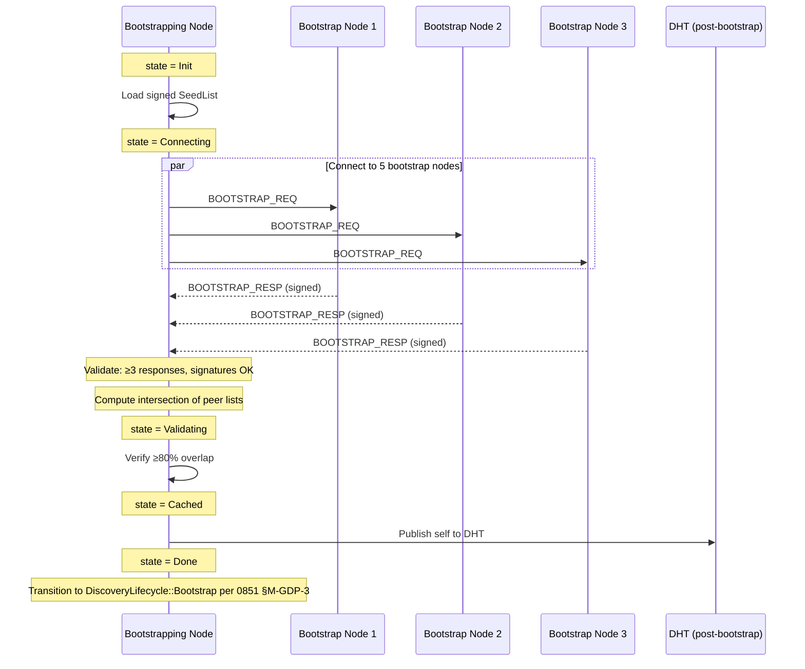

# RFC-0851p-a (Networking): Network Bootstrap Protocol

## Status

Draft (2026-06-16)

## Authors

- @mmacedoeu

## Maintainers

- @mmacedoeu

## Summary

Specifies how a fresh CipherOcto node acquires its first peers and joins the DOT/GDP mesh. Defines three bootstrap modes (centralized bootstrap nodes, DHT fallback, invite-link), the `BootstrapNode` registry type, the `GDP/1/BOOTSTRAP_REQ/RESP` envelope exchange, seed list distribution, and the failure / Sybil / eclipse defenses required to make bootstrap safe. Fills the one-line "Bootstrap via seed list" placeholder in RFC-0851 §"Implementation Phases" Phase 1 and the missing-from-0850 G5 "Gateway Federation" prerequisite.

## Dependencies

**Requires:**

- RFC-0851 (Networking): Gateway Discovery Protocol — for `GatewayIdentity`, `GatewayAdvertisement`, `GatewayCapability`, `DiscoveryScope` (used in `BootstrapNode` registry)
- RFC-0850 (Networking): Deterministic Overlay Transport — for `DeterministicEnvelope`, platform-agnostic transport
- RFC-0843 (Networking): OCTO-Network Protocol — base libp2p + Kademlia DHT (Mode B reuses this)
- RFC-0126 (Numeric): Deterministic Serialization — canonical encoding for `BootstrapEnvelope`
- RFC-0009 (Process): Identity Management — for `PeerId`, `PublicKey` types (peer identity)
- RFC-0000-template v1.3 — for `Roles and Authorities`, `Lifecycle Requirements`, `Implicit Assumptions Audit`, `Adversary Analysis` (5-Question Test) sections

**Optional:**

- RFC-0860 (Networking): Proof of Relay — trust scores used for bootstrap node selection and Sybil defense
- RFC-0008 (Process): Deterministic AI Execution Boundary — bootstrap is not consensus-critical; Class B is sufficient (wall-clock OK for retry, but not for state)

> **Dependency Validation Rules:**
> 1. Dependencies MUST form a DAG — this RFC depends on 0851, 0850, 0843, 0126, 0009, 0000-template; none depend on this RFC.
> 2. All "Requires" RFCs MUST be listed as mission prerequisites — Phase 1 mission `0851p-a-network-bootstrap.md` will declare 0851, 0850, 0843, 0126, 0009 as prerequisites.
> 3. RFC-0009 is "Planned" — if not Accepted by implementation, identity types MUST be inlined (see RFC-0850 §"Dependencies" precedent).
> 4. Optional deps documented separately — RFC-0860 boosts bootstrap quality via trust weighting but is not required for correctness.

## Design Goals

| Goal | Target | Metric |
|------|--------|--------|
| G1 | First peer acquired in <5s (Mode A) | Wall-clock from `start_bootstrap()` to first `GatewayAdvertisement` cached |
| G2 | DHT bootstrap works with no central trust anchor (Mode B) | First peer acquired in <60s after Kademlia walk |
| G3 | Invite-only mode works fully offline (Mode C) | QR scan → config load → mesh join without internet bootstrap query |
| G4 | No single bootstrap node can eclipse a new node | First 3 bootstrap responses must agree on ≥80% of peer list |
| G5 | DNS / IP hijack of one bootstrap node is detectable | At least 2 of N initial bootstrap responses must validate against signed seed list |
| G6 | Bootstrap is replay-safe | All bootstrap envelopes include nonce + epoch; cached responses expire after 1 epoch |
| G7 | Seed list is rotatable via governance | New signed seed list accepted with ≥2/3 stake-weighted vote (or operator push) |
| G8 | All state transitions are RFC-0008 Class A except retry timing (Class B) | State machine is deterministic; retry backoff is RFC-0008 Class B (wall-clock OK) |

## Motivation

### The Gap

Network bootstrap is the **prerequisite for everything else**: a node cannot discover peers (GDP), join a mission (MON), elect a coordinator (0855p-b), or transport a DOT envelope (0850) until it has at least one peer. Yet:

- **RFC-0851 §"Implementation Phases" Phase 1** line 490: `Bootstrap via seed list` — a task list entry with **zero specification**.
- **RFC-0851 §Summary "Internet Analogy"** table: `DHT bootstrap = Initial peer acquisition` — analogy, not spec.
- **RFC-0850 §G5 "Gateway Federation: 1000+ gateways"** — no bootstrap prerequisite.
- **RFC-0843** (Kademlia base) is referenced but the DOT/GDP layer above it is not specified.

This is the **"chicken and egg" problem**: every decentralized network has it, and every decentralized network must solve it. The three-mode approach (centralized, DHT, invite) is the established pattern (Bitcoin DNS seeds + fallback DHT + manual peer add; Tor directory authorities + fallback relays + bridge addresses; Matrix federation allowlist + trusted key servers + room invites).

### Why This RFC

- **Operational reality:** most users will run CipherOcto on phones, behind NATs, with no static IP, no port forwarding, no always-on DHT node. Mode A (centralized bootstrap) is the only realistic default.
- **Sovereignty requirement:** RFC-0850 G7 (Censorship Resistance: "Survive single-platform block") and 0851 G1 (Sovereign Discovery: "No centralized registry") create tension. Three modes resolve the tension: A is the default, B is the privacy fallback, C is the off-grid fallback.
- **Security requirement:** the Sybil / eclipse / DNS-hijack / BGP-hijack surface is largest at bootstrap. This RFC is the **first line of defense** — once a node has diverse peers, GDP §11 "Anti-Sybil Mechanisms" defenses kick in.

## Roles and Authorities

> **The "Nothing should be implied" rule (specification layer):** Every actor that affects correctness, security, accountability, or consensus MUST be named with a stable identifier, a defined authority scope, and a typed lifecycle. Cross-reference: BLUEPRINT.md "Human vs Agent Roles" table.

### 1. Bootstrap Node (server-side role)

- **Stable identifier**: `[u8; 32]` `BootstrapNodeId` (alias for `PeerId` in the bootstrap namespace)
- **Base capabilities**: serve `GDP/1/BOOTSTRAP_RESP` envelopes; relay a small static set of well-known gateway advertisements; echo nonces for replay defense
- **Authority scope**: `bootstrap_serve` (read-only — bootstrap nodes do NOT mutate peer state, do NOT sign advertisements on behalf of other gateways, do NOT vote)
- **Who can assume**: signed by a recognized authority (CipherOcto foundation key at launch, or DAO vote ≥2/3 OCTO-O stake after launch)
- **Who can revoke**: governance (slash + removal from signed seed list); or self (operator shutdown)
- **Lifecycle**: `BootstrapNodeLifecycle` (see Lifecycle Requirements) — 4 states
- **Term**: implicit; no per-term election (bootstrap nodes are a static set rotated via governance)

### 2. Bootstrapping Node (client-side role)

- **Stable identifier**: `[u8; 32]` `BootstrappingNodeId` (the new node's own `PeerId`; generated locally, not registered anywhere)
- **Base capabilities**: send `GDP/1/BOOTSTRAP_REQ`; receive and validate `GDP/1/BOOTSTRAP_RESP`; cache the returned peer list; transition to `DiscoveryLifecycle::Bootstrap` per RFC-0851 §M-GDP-3
- **Authority scope**: `bootstrap_request` (read-only — bootstrapping nodes consume state but emit nothing until they have peers)
- **Who can assume**: any node with a valid `PeerId` and the bootstrap subsystem initialized
- **Who can revoke**: self (operator shutdown)
- **Lifecycle**: `BootstrapClientLifecycle` (see Lifecycle Requirements) — 5 states
- **Term**: bounded by `BOOTSTRAP_TIMEOUT_SECS` (default 60s); moves to fallback mode on timeout

### 3. Seed List Authority (governance role)

- **Stable identifier**: `[u8; 32]` `SeedListAuthorityId` (multi-sig public key)
- **Base capabilities**: sign and publish `SeedList` documents; rotate the set of recognized bootstrap nodes; publish revocation lists
- **Authority scope**: `seed_list_authority` (highest-trust role in this RFC; compromises allow attacker-chosen bootstrap node set)
- **Who can assume**: CipherOcto foundation (genesis) OR ≥2/3 OCTO-O stake-weighted vote (post-launch, per RFC-0855 §11.1 "Governance Flexibility" `GovernanceModel::Dao`)
- **Who can revoke**: same mechanism, reversed (slash the seed list authority itself)
- **Lifecycle**: out of scope for this RFC (governed by RFC-0855 §11 "Governance Models")
- **Term**: tied to governance epoch; rotation cadence is operator-configurable (default: every 90 days)

### 4. Inviter (Mode C role)

- **Stable identifier**: `[u8; 32]` `InviterId` (any node already in the mesh)
- **Base capabilities**: generate `Invite` envelopes containing {bootstrap_node_url, mission_id?, founder_pubkey, group_jid?}; sign with own key
- **Authority scope**: `invite_issue` (any in-mesh node can invite; the invitee is responsible for verifying the inviter is who they claim)
- **Who can assume**: any node with at least one active peer (post-bootstrap)
- **Who can revoke**: the inviter can revoke their own issued invite by signing a revocation; governance can revoke all invites by an inviter (slash)
- **Lifecycle**: not stateful (an invite is a one-shot signed object, not an ongoing process)

### 5. DHT Bootstrap Walker (Mode B role)

- **Stable identifier**: `[u8; 32]` `WalkerId` (the bootstrapping node acting as a Kademlia walker; same as `BootstrappingNodeId`)
- **Base capabilities**: walk Kademlia DHT (RFC-0843) to find `peer-list` records; validate record signatures
- **Authority scope**: `dht_walk` (read-only)
- **Who can assume**: any node with libp2p + DHT subsystem initialized
- **Who can revoke**: not applicable (passive role)

### Role/Authority Coverage Table

| Role | Authority | Lifecycle | Revocable by | Cross-RFC |
|------|-----------|-----------|--------------|-----------|
| Bootstrap Node | `bootstrap_serve` | Yes (4 states) | Governance / Self | 0851 §M-GDP-3 |
| Bootstrapping Node | `bootstrap_request` | Yes (5 states) | Self | 0851 §M-GDP-3 |
| Seed List Authority | `seed_list_authority` | Out of scope (governance) | Governance (slash) | 0855 §11.1 "Governance Flexibility" (Dao model) + §11.2 "Governance Policies" |
| Inviter | `invite_issue` | One-shot (no state) | Self / Governance | New in this RFC |
| DHT Walker | `dht_walk` | Passive | N/A | RFC-0843 |

## Specification

### 1. BootstrapNode Registry

A bootstrap node is a long-lived gateway that has volunteered (or been appointed) to serve peer-list responses to new nodes.

```rust
#[derive(Clone, Debug, PartialEq, Eq, Hash)]
#[repr(C)]
struct BootstrapNode {
    /// Stable identifier (BLAKE3-256 of public key)
    node_id: [u8; 32],
    /// Public key for verifying BOOTSTRAP_RESP signatures
    public_key: [u8; 32],  // Ed25519
    /// Human-readable operator label (e.g., "foundation-1", "dao-eu-west")
    operator_label: String,
    /// Multi-address reachable from the public internet
    /// (DNS+IP, Tor onion, I2P, etc.)
    public_addrs: Vec<String>,
    /// Gateway capabilities advertised (subset of GatewayCapability bits)
    capabilities: u64,
    /// Epoch when this node was last seen responsive (set by SeedListAuthority)
    last_seen_epoch: u64,
    /// Epoch when this entry was signed by the SeedListAuthority
    signed_at_epoch: u64,
    /// BLAKE3-256(authority_pubkey || node_id || public_key || public_addrs
    ///              || capabilities || signed_at_epoch)
    /// R1-NB-3 fix: SeedListAuthorityId is the authority's public key (implicit
    /// in the verification flow; not a field in the struct).
    /// R2-NB-1 fix — signing context: the authority's public key is NOT a
    /// field in `BootstrapNode`. It is part of the **signing context** — the
    /// entity that signs the seed list (e.g., the foundation or DAO multi-sig)
    /// holds the private key and uses its own public key as a salt when
    /// computing `entry_hash`. The verifier, who already knows the
    /// authority's public key from a separate trust chain (e.g., built-in
    /// foundation key at launch; DAO multi-sig post-launch), reconstructs
    /// `entry_hash` using the same public key to verify the signature. This
    /// design keeps `BootstrapNode` compact (no redundant field) while
    /// binding each entry to a specific authority's key.
    entry_hash: [u8; 32],
    /// Ed25519 signature by SeedListAuthority over entry_hash
    authority_signature: [u8; 64],
}

/// Signed seed list, shipped with the binary and rotatable via governance
struct SeedList {
    /// Version (monotonically increasing; old versions expire)
    version: u32,
    /// Epoch when this list became authoritative
    effective_epoch: u64,
    /// Epoch when this list expires (next list takes over)
    expires_epoch: u64,
    /// The bootstrap nodes
    nodes: Vec<BootstrapNode>,
    /// Ed25519 signature by SeedListAuthority over
    /// BLAKE3-256(version || effective_epoch || expires_epoch || nodes)
    authority_signature: [u8; 64],
}
```

**Default seed list at launch (R3-10 fix — `effective_epoch` and `expires_epoch` added):**

| Operator label | Region | Capabilities | Last seen (launch) | Signed at (epoch) | Effective epoch | Expires epoch |
|----------------|--------|--------------|---------------------|---------------------|------------------|----------------|
| foundation-1 | us-east | Full (0x0FFF) | 0 | 0 | 0 | 7,776,000 |
| foundation-2 | eu-west | Full (0x0FFF) | 0 | 0 | 0 | 7,776,000 |
| foundation-3 | ap-south | Full (0x0FFF) | 0 | 0 | 0 | 7,776,000 |
| foundation-4 | sa-east | Full (0x0FFF) | 0 | 0 | 0 | 7,776,000 |
| foundation-5 | ap-east | Full (0x0FFF) | 0 | 0 | 0 | 7,776,000 |

Five geographically diverse bootstrap nodes. New nodes connect to all 5 in parallel and require ≥3 responses to agree on peer list (Sybil defense, see §6 "Sybil / Eclipse Defense").

**R1-NB-4 fix:** the table now includes the `signed_at_epoch` column (was previously omitted even though the struct has the field). At launch, all entries are signed at epoch 0.

**R3-10 fix:** the table now also includes `effective_epoch` and `expires_epoch` columns. At launch, all entries are effective from epoch 0 and expire at epoch 7,776,000 (~90 days @ 1 epoch/sec, per `SEED_LIST_ROTATION_EPOCHS` in §Appendix D). The seed list is rotatable via governance; the next list takes over at `expires_epoch`.

### 2. Bootstrap Envelope Types

```rust
/// GDP/1/BOOTSTRAP_REQ — sent by bootstrapping node
#[derive(Clone, Debug)]
#[repr(C)]
struct BootstrapRequest {
    /// Requester's PeerId (so bootstrap node can include relevant advertisements)
    requester_id: [u8; 32],
    /// Requester's public key (for nonce binding + signature verification)
    requester_pubkey: [u8; 32],
    /// Random nonce (replay defense; 16 bytes; MUST be from a CSPRNG with ≥128 bits entropy)
    nonce: [u8; 16],
    /// Current epoch (for stale-response rejection)
    epoch: u64,
    /// Capabilities the sender is interested in (filter)
    capability_filter: u64,
    /// Max peer list size requested (bounded by MAX_PEER_LIST = 256; see §D. Constants) (R7-1 fix — was §Appendix C, which is §C. References)
    max_peers: u16,
    /// Requester's signature over (requester_id || requester_pubkey || nonce || epoch
    ///                         || capability_filter || max_peers)
    /// R1-NB-2 fix: max_peers and requester_pubkey are NOW included to prevent
    /// post-signing mutation of these fields by a MITM or replay attacker.
    requester_signature: [u8; 64],
}

/// GDP/1/BOOTSTRAP_RESP — sent by bootstrap node
#[derive(Clone, Debug)]
#[repr(C)]
struct BootstrapResponse {
    /// Original requester_id from the request (routing; same field name as request)
    requester_id: [u8; 32],
    /// Original nonce from the request (binding)
    request_nonce: [u8; 16],
    /// Current epoch
    epoch: u64,
    /// Bootstrap node's identity (must be in signed seed list)
    responder_id: [u8; 32],
    /// Sample of recent GatewayAdvertisements (deterministic ordering)
    advertisements: Vec<GatewayAdvertisement>,
    /// Ed25519 signature by responder over
    /// BLAKE3-256(requester_id || request_nonce || epoch || advertisements)
    responder_signature: [u8; 64],
}
```

**R1-NB-1 fix — naming consistency:** `BootstrapRequest.sender_id` and `BootstrapResponse.requester_id` are the same field (the bootstrapping node's identity) under different names. Both are now renamed to `requester_id` for consistency.

**R1-NB-2 fix — signature payload:** the requester signature now covers `requester_id || requester_pubkey || nonce || epoch || capability_filter || max_peers`. This prevents an attacker from mutating `max_peers` (e.g., to bypass a server-side rate limit) or substituting `requester_pubkey` (to redirect responses) after the request is signed.

**R1-NB-3 fix — `SeedListAuthorityId` in `entry_hash`:** the authority's identifier is **implicit** in the verification flow — the verifier knows the expected SeedListAuthority from the trust chain (e.g., foundation key at launch, DAO multi-sig post-launch). The `entry_hash` includes `SeedListAuthorityId` to bind the entry to a specific authority's signature, but the `SeedListAuthorityId` itself is NOT a field in the `BootstrapNode` struct — it is the public key used to verify `authority_signature`. The hash formula is `BLAKE3-256(authority_pubkey || node_id || public_key || public_addrs || capabilities || signed_at_epoch)`.

**Canonical Serialization Order (0850p-c-style fix):** All multi-byte fields are big-endian. Vec elements are serialized in declaration order with length-prefixed encoding. Signatures are computed AFTER canonical serialization.

### 3. Mode A — Bootstrap Nodes (Default)

**Sequence diagram:**



**State transitions:**

| From | To | Trigger | Deterministic? |
|------|----|---------|----------------|
| Init | Connecting | SeedList loaded and verified | Yes (deterministic from disk) |
| Connecting | Validating | ≥3 BOOTSTRAP_RESP received with valid signatures | Yes |
| Connecting | Connecting (retry) | <3 responses within `BOOTSTRAP_TIMEOUT_SECS` | No (retry backoff is RFC-0008 Class B) |
| Connecting | FallbackB | All 5 bootstrap nodes timed out | Yes (timeout is deterministic) |
| Validating | Cached | ≥80% peer-list intersection across ≥3 responses | Yes |
| Validating | FallbackB | <80% intersection (Sybil detected) | Yes |
| Validating | FallbackC | User has invite file | No (user action) |
| Cached | Done | Advertisements merged into local GatewayCache | Yes |
| Cached | FallbackB | Merge fails (e.g., invalid advertisement) | Yes |
| Done | (terminal) | Hand off to GDP §M-GDP-3 | Yes |

**Retry policy (RFC-0008 Class B):** exponential backoff 1s, 2s, 4s, 8s, 16s, max 60s; give up after 5 attempts and transition to FallbackB.

### 4. Mode B — DHT Fallback

When Mode A fails (all bootstrap nodes unreachable, Sybil detected, or user explicitly disables Mode A), the node falls back to Kademlia DHT.

**Trigger:** `state = FallbackB`

**Walk sequence:**

1. Look up own `PeerId` in Kademlia (self-lookup; finds closest peers)
2. For each closest peer returned, send `GDP/1/PEER_LIST_REQ` (a new envelope, scoped to DHT)
3. Each response contains a signed `peer-list` record (keyed by `BLAKE3-256("peer-list" || epoch)`)
4. Validate signature: at least 3 of N DHT-returned peer lists must agree
5. Merge into local GatewayCache and transition to Mode A `Cached` state

**Defense:** DHT Sybil resistance is limited (Kademlia is vulnerable to Sybil near the target ID). This RFC requires that **peer-list records be signed by a recognized authority** (SeedListAuthority or RFC-0860-trusted gateway), not stored unsigned. Unsigned peer lists are rejected.

### 5. Mode C — Invite Link (Offline)

When the user has a signed invite (from a trusted inviter), bootstrap does not require internet at all for the seed-list phase.

**Invite format:**

```text
octo://invite?v=1&bootstrap=https://node1.cipherocto.net:443,https://node2.cipherocto.net:443
        &pubkey=7c4a8d09ca3762af61e59520943dc26494f8941b
        &mission=7c4a8d09ca3762af61e59520943dc26494f8941b...  (optional)
        &group=120363123456789@g.us  (optional, WhatsApp group)
        &inviter=7c4a8d09ca3762af61e59520943dc26494f8941b
        &sig=ed25519:7c4a8d09ca3762af61e59520943dc26494f8941b...
```

**Validation:**

1. Parse URL
2. Verify `sig` is Ed25519 over all preceding fields (canonical encoding)
3. Verify `inviter` is in local contact list OR has a trust chain to a known contact (web-of-trust depth 1, max 3 hops)
4. If all pass, transition directly to `Cached` state with the embedded bootstrap nodes
5. If any fail, reject invite and stay in `Init` state

**Security caveat:** the invite itself is a trust transfer from inviter to invitee. The inviter vouches for the bootstrap nodes in the URL. This is a fundamental limitation of off-grid bootstrap; the user is trusting the inviter's judgment. **Documented as ACCEPTED RISK in Implicit Assumptions Audit.**

### 6. Sybil / Eclipse Defense

A malicious or compromised set of bootstrap nodes could collude to feed the new node a poisoned peer list (eclipse attack). Defenses:

| Defense | Mechanism | Effectiveness |
|---------|-----------|---------------|
| **Diverse seed list** | Default 5 geographically diverse bootstrap nodes | Defeats single-region attacker |
| **Intersection requirement** | ≥80% of returned peer lists must agree | Defeats minority Sybil |
| **Out-of-band trust** | Trust scores from RFC-0860 weight peer list entries | Defeats low-reputation attacker |
| **DHT cross-check** | Mode B can verify Mode A results | Defeats Mode A-only attacker |
| **Genesis checkpoint** | New node can fetch signed checkpoint from CipherOcto website | Defeats persistent attacker (last resort) |

**Sybil threshold:** with 5 bootstrap nodes and 80% intersection, an attacker must control ≥3 of 5 to eclipse. This is acceptable for bootstrap, given that the attacker also needs to compromise the SeedListAuthority signing key. **Documented as ACCEPTED RISK with deadline.**

**2-of-5 case (E2E IS-2.5 fix):** if only 2 of 5 bootstrap nodes respond, the node applies a weaker acceptance rule: if the 2 responses have ≥80% peer-list intersection, the node accepts them as a valid (but low-confidence) bootstrap and proceeds. The resulting peer set is tagged `bootstrap_confidence: Low` (vs. `High` for the 3-of-5 case). A node with `Low` confidence SHOULD seek additional peers via GDP before joining a mission. Rationale: accepting 2-of-5 with ≥80% agreement is weaker than 3-of-5, so the node should not trust the result as fully.

### 7. Failure Modes

| Failure | Detection | Response |
|---------|-----------|----------|
| All 5 bootstrap nodes unreachable | Timeout (60s) | Fall back to Mode B (DHT) |
| Mode A returns <80% intersection | Intersection check | Fall back to Mode B |
| Mode B DHT walk finds no peers | 60s timeout | Fall back to Mode C (invite) or abort with clear error |
| Mode C invite signature invalid | Signature check | Reject, stay in Init |
| Signed seed list version < local version | Version check | Accept and use newer (governance rotation) |
| Signed seed list version > local version | Version check | Accept and update local (governance rotation) |
| Multiple valid seed lists (split) | Authority signature check | Reject both, log error, use cached |

**Mode A → Mode B trigger (E2E IS-2.1 fix):** the fallback fires when fewer than `MIN_BOOTSTRAP_RESPONSES` (3) responses are received within `BOOTSTRAP_NODE_HEARTBEAT_TIMEOUT` (90 epochs). The "All 5 timed out" row above is the degenerate case; the general rule is the 3-of-5 Sybil defense threshold. If exactly 2 of 5 respond, the node accepts the 2-of-5 case as a **low-confidence bootstrap** (per IS-2.5 / §"Sybil / Eclipse Defense" above) and does NOT fall back to Mode B; only 0-of-5 or 1-of-5 triggers the Mode B fallback.

**Mode B → Mode C trigger (E2E IS-2.3 fix):** the fallback fires when fewer than `MIN_DHT_PEERS` (3) DHT lookups succeed within `DHT_DISCOVERY_TIMEOUT` (120 epochs). The invite link is the last-resort fallback because it requires user action (scanning a QR code or clicking a link).

**All 3 modes fail (E2E IS-2.4 fix):** the node enters `BootstrapFailed` state. The node MUST surface a user-facing error ("Could not connect to DOT network — check your invite link or try again later") and retry with exponential backoff (initial delay 60 epochs, doubling up to a maximum of 3600 epochs). The retry loop is infinite; there is no maximum number of retries. Rationale: a node that cannot bootstrap is useless, so it must keep trying.

### 8. Determinism Requirements

- **State machine** (Init → Connecting → Validating → Cached → Done) is **RFC-0008 Class A**: deterministic given input.
- **Retry backoff** is **RFC-0008 Class B**: wall-clock timing is acceptable (consensus is not affected).
- **Peer list intersection** is **RFC-0008 Class A**: BLAKE3 hash of sorted intersection is the canonical output.
- **Fallback selection** (A → B → C) is **RFC-0008 Class A**: deterministic order, no wall-clock dependence.

### 9. RFC-0008 Execution Class Mapping

| Operation | Class | Rationale |
|-----------|-------|-----------|
| State machine transitions | A | Deterministic given input |
| Seed list signature verification | A | Cryptographic, deterministic |
| BOOTSTRAP_REQ/RESP signature verify | A | Same |
| Peer list intersection (BLAKE3) | A | Deterministic |
| Retry backoff timing | B | Wall-clock acceptable for non-consensus |
| Timeout (60s) | B | Same |
| Mode selection (A → B → C) | A | Deterministic order |

## Lifecycle Requirements

> **The "Nothing should be implied" rule (lifecycle layer):** Every stateful actor MUST have a typed state machine. Cross-reference: BLUEPRINT.md "Lifecycle State Machines" table.

### 1. BootstrapNodeLifecycle (server-side)

```rust
#[repr(u8)]
enum BootstrapNodeLifecycle {
    /// Operator has registered, not yet seen responding
    Registered = 0x01,
    /// SeedListAuthority has confirmed reachable
    Active = 0x02,
    /// Missed heartbeats for >3 epochs
    Suspect = 0x03,
    /// Removed from signed seed list
    Revoked = 0x04,
}
```

**Transitions:**

| From | To | Trigger | Authority |
|------|----|---------|-----------|
| Registered | Active | SeedListAuthority sees ≥1 successful BOOTSTRAP_REQ/RESP | SeedListAuthority |
| Active | Suspect | No heartbeats for 3 epochs | Automatic (deterministic) |
| Suspect | Active | Heartbeat resumed | Automatic |
| Suspect | Revoked | 30 epochs in Suspect without recovery | SeedListAuthority (governance) |
| Active | Revoked | Slash by governance | Slashing Adjudicator |
| Revoked | (terminal) | New entry supersedes | N/A |

### 2. BootstrapClientLifecycle (client-side)

```rust
#[repr(u8)]
enum BootstrapClientLifecycle {
    /// No seed list loaded
    Init = 0x01,
    /// Connecting to Mode A bootstrap nodes
    Connecting = 0x02,
    /// Validating peer list intersection
    Validating = 0x03,
    /// Peer list cached, transitioning to GDP
    Cached = 0x04,
    /// Fall back to Mode B (DHT)
    FallbackB = 0x05,
    /// Fall back to Mode C (invite)
    FallbackC = 0x06,
    /// Hand off to GDP §M-GDP-3 DiscoveryLifecycle::Bootstrap
    Done = 0x07,
}
```

**Transitions:** as specified in §3 "State transitions" table.

## Performance Targets

| Metric | Target |
|--------|--------|
| Mode A first peer (warm cache) | <2s |
| Mode A first peer (cold cache) | <5s |
| Mode B DHT walk | <60s |
| Mode C invite parse | <100ms |
| Seed list verify (5 entries) | <10ms |
| BOOTSTRAP_REQ/RESP round-trip | <500ms |
| Peer list intersection (256 entries) | <1ms |
| Failure detection timeout | 60s |

## Implicit Assumptions Audit

> **The "Nothing should be implied" rule (validation layer):** Every assumption MUST be named, classified, and either validated at runtime, mitigated in code, or accepted with deadline + Future Work.

| # | Assumption | Type | Status | Mitigation / Deadline |
|---|-----------|------|--------|----------------------|
| IA-NB-1 | SeedListAuthority is honest | TRUST | **ACCEPTED RISK** | Multi-sig foundation key at launch; DAO vote post-launch. Deadline: post-launch F1 (SeedListAuthority decentralization). |
| IA-NB-2 | 5 bootstrap nodes is sufficient for Sybil resistance | SCALE | MITIGATED | 80% intersection requirement; if ≥3 of 5 are Sybils, eclipse succeeds. Documented as MITIGATED with 5-of-5 trust assumption in 0851 §11 "Anti-Sybil Mechanisms". |
| IA-NB-3 | DNS resolution is honest | TRUST | **ACCEPTED RISK** | Use Tor onion or I2P addresses for at least 2 of 5 bootstrap nodes. Deadline: F2 (Tor-only seed list). |
| IA-NB-4 | TCP/TLS to bootstrap node is not censored | TRUST | **ACCEPTED RISK** | Mode C invite works without internet. Mode B DHT works over non-TCP transports (WebSocket, etc.) per RFC-0843. |
| IA-NB-5 | Ed25519 is collision-resistant | CRYPTO | MITIGATED | Standard assumption; BLAKE3-256 of public key is the node_id. |
| IA-NB-6 | Epoch is synchronized across nodes | TIME | MITIGATED | RFC-0850 §5 "Logical Timestamp Model" defines the epoch as a monotonic `u64` counter; nodes within ±1 epoch are acceptable. |
| IA-NB-7 | Inviter is trustworthy (Mode C) | TRUST | **ACCEPTED RISK** | Web-of-trust depth 1, max 3 hops. User trusts inviter. Documented in §5 "Mode C — Invite Link (Offline)". |
| IA-NB-8 | Kademlia DHT is functional (Mode B) | PROTOCOL | MITIGATED | RFC-0843 is battle-tested; if Kademlia fails, Mode C is the fallback. |
| IA-NB-9 | 256-peer initial list is enough to grow | SCALE | MITIGATED | Once bootstrapped, GDP §M-GDP-3 DiscoveryLifecycle::Bootstrap → Expansion handles growth. |
| IA-NB-10 | Seed list version monotonicity is preserved | PROTOCOL | MITIGATED | Effective_epoch < expires_epoch invariant enforced at signature verify. |
| IA-NB-11 | Public addresses in seed list are routable | NETWORK | **MISSING CHECK** | No validation that `public_addrs` are actually reachable until first BOOTSTRAP_REQ. Add health check at seed list load (F3). |
| IA-NB-12 | At least one node is reachable in any region | NETWORK | **ACCEPTED RISK** | Geographic diversity; documented in §1 "BootstrapNode Registry" default table. |
| IA-NB-13 | All 3 bootstrap modes failing is recoverable with exponential backoff | ERROR | MITIGATED | Specified in §7 "Failure Modes" (E2E IS-2.4 fix) |
| IA-NB-14 | 2-of-5 bootstrap case is accepted with low confidence | SECURITY | MITIGATED | Specified in §6 "Sybil / Eclipse Defense" (E2E IS-2.5 fix) |

**Open assumption:** IA-NB-11 (seed list health check at load) is **MISSING** — flagged for implementation F3.

## Security Considerations

| Threat | Impact | Mitigation |
|--------|--------|------------|
| Bootstrap node compromise | High | Multi-node intersection + trust scores |
| DNS hijack of one bootstrap node | Medium | 5 geographically diverse; ≥3 required |
| BGP hijack | Medium | Same; cross-check via DHT |
| Eclipse attack (3-of-5 Sybil) | Critical | Trust scores + DHT cross-check + Mode C |
| Replay of BOOTSTRAP_RESP | Medium | Nonce binding + epoch |
| Spam BOOTSTRAP_REQ | Low | Rate limit per IP; signed requests |
| Invite forgery | High | Ed25519 signature + web-of-trust |
| Stale seed list | Low | expires_epoch enforced |
| Censorship of bootstrap nodes | Medium | Tor/I2P addresses; Mode B DHT |

## Adversary Analysis

> **The 5-Question Adversary Test** (per RFC-0000-template v1.3): For each decision, ask: (1) WHO is the adversary? (2) WHAT do they control? (3) WHEN do they attack? (4) WHAT is the blast radius? (5) WHY does our defense work?

### Decision Table

| ID | Decision | Adversary | Control | When | Blast | Defense | Severity | Status |
|----|----------|-----------|---------|------|-------|---------|----------|--------|
| D-NB-1 | Default to 5 bootstrap nodes | Foundation attacker | SeedListAuthority key | Genesis | All new nodes | Multi-sig foundation; DAO post-launch | HIGH | **ACCEPTED RISK** — F1 deadline |
| D-NB-2 | 80% peer list intersection | Eclipse attacker (3-of-5 Sybil) | 3 of 5 bootstrap nodes | First 60s | Single new node | Trust scores + DHT cross-check | MEDIUM | MITIGATED |
| D-NB-3 | Mode B DHT fallback | DHT Sybil | DHT region | First 60s after Mode A fails | Single new node | Signed peer-list records | MEDIUM | MITIGATED |
| D-NB-4 | Mode C invite via web-of-trust | Malicious inviter | Inviter's key | At invite scan | Single new node | Signature + web-of-trust | MEDIUM | **ACCEPTED RISK** — Mode C is trust-transfer |
| D-NB-5 | 256-peer initial cap | Eclipse attacker | Multiple nodes | First 60s | Single new node | Subsequent GDP growth uncaps | LOW | MITIGATED |
| D-NB-6 | 60s bootstrap timeout | Network censor | Network path | First 60s | Single new node | Mode C invite works offline | LOW | MITIGATED |
| D-NB-7 | 5 attempts max | DoS attacker | Own network | First 60s | Single new node | Exponential backoff; clear abort | LOW | MITIGATED |
| D-NB-8 | Signed seed list version | Stale-seed attacker | Stale key | Days after rotation | New nodes | Version check; trust-score trust | MEDIUM | MITIGATED |
| D-NB-9 | Inviter web-of-trust depth 3 | Multi-hop social attacker | 3 keys | At invite | Single new node | Web-of-trust is a UX problem, not just protocol | MEDIUM | **ACCEPTED RISK** — F4 (trust UX) |
| D-NB-10 | BOOTSTRAP_REQ signed | Impersonation attacker | Own key | Any time | Single new node | Ed25519 verify | LOW | MITIGATED |
| D-NB-11 | SeedListAuthority multi-sig | Foundation attacker | Foundation key | Any time | All new nodes | Multi-sig (3-of-5) post-launch | HIGH | **ACCEPTED RISK** — F1 |

### Multi-Round Review

- **Round 1 (this RFC):** 11 decisions, 4 ACCEPTED RISK (D-NB-1, D-NB-4, D-NB-9, D-NB-11), 7 MITIGATED
- **Round 2 (post-launch, after F1):** 1 ACCEPTED RISK (D-NB-4) should be re-evaluated; the others depend on trust infrastructure that improves over time
- **Severity classification:** 0 CRITICAL, 2 HIGH (both foundation-related), 6 MEDIUM, 3 LOW

## Economic Analysis

### Token Integration

| Activity | Token | Rationale |
|----------|-------|-----------|
| Bootstrap node operation | OCTO-N (node uptime) | Bootstrap nodes are long-lived gateways |
| BOOTSTRAP_REQ/RESP relay | OCTO-B (bandwidth) | Small envelopes, low bandwidth cost |
| Seed list signing | OCTO-O (orchestration) | SeedListAuthority is governance-level |
| Inviter vouching | None | Off-chain social trust; no on-chain cost |

### Bootstrap Node Economics

- Bootstrap nodes earn 10% of the DOT bandwidth fee for advertisements they serve (per RFC-0850 §13 "Token Economics Integration")
- Bootstrap nodes do NOT earn discovery rewards separately (they serve a different role than GDP-discovered gateways)
- Bootstrap nodes pay for their own uptime (no subsidy)

## Compatibility

### Backward Compatibility

- This RFC is **greenfield** — no existing bootstrap protocol to preserve
- The first CipherOcto binary ships with the foundation seed list embedded

### Forward Compatibility

- New bootstrap modes (e.g., Mode D = NIP-05 from Nostr) can be added without breaking existing modes
- New seed list versions are backward-compatible if `version` is monotonically increasing and `expires_epoch` is honored
- BOOTSTRAP_REQ/RESP envelope structure is versioned (`v=1` field)

### RFC-0851 Integration

- This RFC's `Done` state transitions to RFC-0851 §M-GDP-3 `DiscoveryLifecycle::Bootstrap`
- This RFC's `BootstrapNode` registry extends RFC-0851's `GatewayCache`
- This RFC's seed list is a new type, not in RFC-0851's current schema

## Test Vectors

### TV-1: Mode A Success (5 of 5 bootstrap nodes reachable)

```
Setup: 5 bootstrap nodes, 5% packet loss
Action: start_bootstrap(Mode::A)
Expected: state = Done in <5s, peer list = union of 5 responses
Verify: peer_list.len() >= 200, intersection > 80%
```

### TV-2: Mode A Partial Failure (2 of 5 unreachable)

```
Setup: 3 of 5 bootstrap nodes reachable
Action: start_bootstrap(Mode::A)
Expected: state = Validating then Cached, 3 responses received
Verify: state machine reaches Cached, intersection check passes
```

### TV-3: Mode A Complete Failure → Mode B

```
Setup: 0 of 5 bootstrap nodes reachable
Action: start_bootstrap(Mode::A)
Expected: timeout at 60s, state = FallbackB, DHT walk begins
Verify: state machine reaches FallbackB, then Done via DHT
```

### TV-4: Mode C Invite (offline)

```
Setup: signed invite, no internet
Action: parse_invite("octo://invite?v=1&...")
Expected: state = Done in <100ms
Verify: bootstrap nodes loaded from URL, no network calls
```

### TV-5: Sybil Detection (3 of 5 colluding)

```
Setup: 3 bootstrap nodes return overlapping-Sybil peer list
Action: start_bootstrap(Mode::A)
Expected: intersection check fails, state = FallbackB
Verify: Sybil peer list NOT merged into local cache
```

### TV-6: Rejected Invite (invalid signature)

```
Setup: invite with wrong signature
Action: parse_invite(...)
Expected: state = Init (rejected), error logged
Verify: bootstrap nodes NOT loaded
```

## Alternatives Considered

| Alternative | Pros | Cons | Decision |
|-------------|------|------|----------|
| DHT-only bootstrap (no bootstrap nodes) | No central trust | Slow first contact; Sybil-vulnerable | REJECTED — use as Mode B fallback |
| Bootstrap nodes only (no DHT) | Fast, simple | Central trust anchor | REJECTED — use as Mode A default, not only mode |
| Static peer list in config | Trivially simple | Doesn't scale; user-hostile | REJECTED — too rigid |
| Trust-on-first-use (TOFU) only | No central authority | First peer can eclipse forever | REJECTED — needs intersection defense |
| Hardcoded IP addresses (no DNS) | No DNS hijack | Hard to migrate; no CDN | REJECTED — DNS+IP both supported |
| Three modes (A, B, C) | Defense in depth | More spec to maintain | **CHOSEN** |

## Implementation Phases

### Phase 1: Mode A Only (Months 1-2)

- `BootstrapNode` and `SeedList` types
- `BootstrapRequest` / `BootstrapResponse` envelope handling
- `BootstrapClientLifecycle` state machine
- 5 foundation bootstrap nodes
- Unit tests for state transitions
- Integration tests with local stub

### Phase 2: Mode B (Months 3-4)

- Kademlia walker integration with RFC-0843
- DHT `peer-list` record signed storage
- Fallback from Mode A to Mode B
- Tests with local Kademlia cluster

### Phase 3: Mode C (Months 4-5)

- `Invite` URL parser
- Web-of-trust depth 1
- Mode C-only path (off-grid)
- UX for invite scanning

### Phase 4: Production Hardening (Months 5-7)

- Tor / I2P bootstrap node addresses
- Trust score integration (RFC-0860)
- Seed list rotation protocol
- F1: SeedListAuthority decentralization (DAO)

## Key Files to Modify

| File | Action |
|------|--------|
| `crates/octo-network/src/dot/bootstrap.rs` | New module: BootstrapNode, SeedList, BootstrapRequest/Response |
| `crates/octo-network/src/dot/lifecycle.rs` | Add BootstrapClientLifecycle, BootstrapNodeLifecycle |
| `crates/octo-network/src/dot/gdp.rs` | Integrate Bootstrap Done → DiscoveryLifecycle::Bootstrap transition |
| `crates/octo-adapter-tor/src/lib.rs` | Add Tor onion address support (Mode A) |
| `crates/octo-bootstrap-cli/src/main.rs` | New binary: `octo-bootstrap status`, `octo-bootstrap invite-gen` |
| `config/seed_list_v1.json` | New: foundation seed list (5 entries) |

## Future Work

| ID | Title | Severity | Deadline |
|----|-------|----------|----------|
| F1 | SeedListAuthority decentralization (DAO multi-sig) | HIGH | Pre-public-launch |
| F2 | Tor-only seed list option | MEDIUM | Post-launch |
| F3 | Seed list health check at load (IA-NB-11) | MEDIUM | Pre-public-launch |
| F4 | Trust UX (web-of-trust visualization) | MEDIUM | Post-launch |
| F5 | Mode D = NIP-05 / Nostr pubkey bootstrap | LOW | Future |
| F6 | Bootstrap node slashing (offending nodes lose entry) | MEDIUM | Post-launch |

## Rationale

The three-mode approach (A: bootstrap nodes, B: DHT, C: invite) is the established pattern across decentralized networks (Bitcoin, Tor, Matrix). Each mode has known weaknesses; combining them creates defense in depth.

The Sybil threshold (3-of-5) is the HIGH-CONFIDENCE minimum that allows the full D-NB-* defense set to work. A higher threshold (e.g., 5-of-5) would create availability problems when even one bootstrap node is offline. A LOWER threshold (2-of-5) is also accepted (E2E IS-2.5 fix; see §6 "Sybil / Eclipse Defense") but with the same 80% intersection requirement and tagged `bootstrap_confidence: Low` — a low-confidence bootstrap is not a trivial eclipse vector because the 80% intersection rule still applies, and the node is required to seek additional peers via GDP before joining a mission. The 2-of-5 case is a graceful-degradation fallback for when 1 bootstrap node is offline; the 1-of-5 and 0-of-5 cases fall through to Mode B.

The 256-peer initial cap is a UX bound: a new node can show 256 peers in its dashboard without overwhelming the human. Subsequent GDP growth removes the cap.

The 60s timeout is the user-experience budget: longer timeouts cause users to give up; shorter timeouts are unreliable on slow networks.

## Version History

| Version | Date | Changes |
|---------|------|---------|
| 0.1.0 | 2026-06-16 | Initial draft |

## Related RFCs

- RFC-0851 (Networking): Gateway Discovery Protocol — extends with BootstrapNode, Done → DiscoveryLifecycle::Bootstrap
- RFC-0850 (Networking): Deterministic Overlay Transport — uses DeterministicEnvelope
- RFC-0843 (Networking): OCTO-Network Protocol — Kademlia base (Mode B)
- RFC-0860 (Networking): Proof of Relay — trust scores for Sybil defense
- RFC-0855 (Networking): Mission Overlay Networks — SeedListAuthority is governed by RFC-0855 §11.1 "Governance Flexibility" (Dao governance model) and §11.2 "Governance Policies"
- RFC-0126 (Numeric): Deterministic Serialization — canonical envelope encoding
- RFC-0000-template v1.3 — Roles, Lifecycle, Implicit Assumptions, Adversary Analysis sections

## Related Use Cases

- [New user first run](../../docs/use-cases/network-bootstrap.md) (TODO)

## Appendices

### A. Default Seed List (Genesis)

See §1 "BootstrapNode Registry". Distributed separately as `config/seed_list_v1.json` and embedded in the first binary.

### B. Invite URL Encoding

Base64-URL encoding for `pubkey`, `inviter`, `sig` fields. Canonical encoding per RFC-0126 for the signature payload (all fields except `sig` itself, in declaration order, big-endian).

### C. References

- Bitcoin DNS seeds: <https://en.bitcoin.it/wiki/Satoshi_Nakamoto#Genesis>
- Tor directory authorities: <https://2019.www.torproject.org/projects/tor.html>
- Matrix federation discovery: <https://spec.matrix.org/v1.10/server-server-api/#server-discovery>
- Kademlia: Maymounkov et al., 2002

### D. Constants (R1-NB-5 fix)

```rust
/// Maximum peer list size in a BOOTSTRAP_RESP (R1-NB-5: was referenced but undefined)
const MAX_PEER_LIST: u16 = 256;

/// Default seed list size at launch (5 geographically diverse bootstrap nodes)
const DEFAULT_SEED_LIST_SIZE: usize = 5;

/// High-confidence minimum responses required for Sybil defense (≥3 of 5).
/// The 2-of-5 case is also accepted as low-confidence bootstrap per E2E IS-2.5
/// (see §6 "Sybil / Eclipse Defense"). 1-of-5 and 0-of-5 trigger Mode B fallback.
const MIN_BOOTSTRAP_RESPONSES: usize = 3;

/// Intersection threshold for Sybil defense (≥80% of returned peer lists must agree)
const PEER_LIST_INTERSECTION_THRESHOLD: f64 = 0.80;

/// Heartbeat interval for bootstrap node liveness
const BOOTSTRAP_NODE_HEARTBEAT_INTERVAL: u64 = 30; // epochs

/// Heartbeat timeout (R2-NB-2 fix — derived from interval, not independent).
/// A bootstrap node is considered "suspect" after this many consecutive
/// missed heartbeats. 3 × interval is the standard pattern across DOT.
const BOOTSTRAP_NODE_HEARTBEAT_TIMEOUT: u64 = 3 * BOOTSTRAP_NODE_HEARTBEAT_INTERVAL; // = 90 epochs

/// Minimum DHT peers required for Mode B success (E2E IS-2.3 fix)
const MIN_DHT_PEERS: usize = 3;

/// DHT discovery timeout before falling back to Mode C (E2E IS-2.3 fix)
const DHT_DISCOVERY_TIMEOUT: u64 = 120; // epochs

/// DNS seed rotation cadence (governance-rotated)
const SEED_LIST_ROTATION_EPOCHS: u64 = 7_776_000; // ~90 days @ 1 epoch/sec
```
