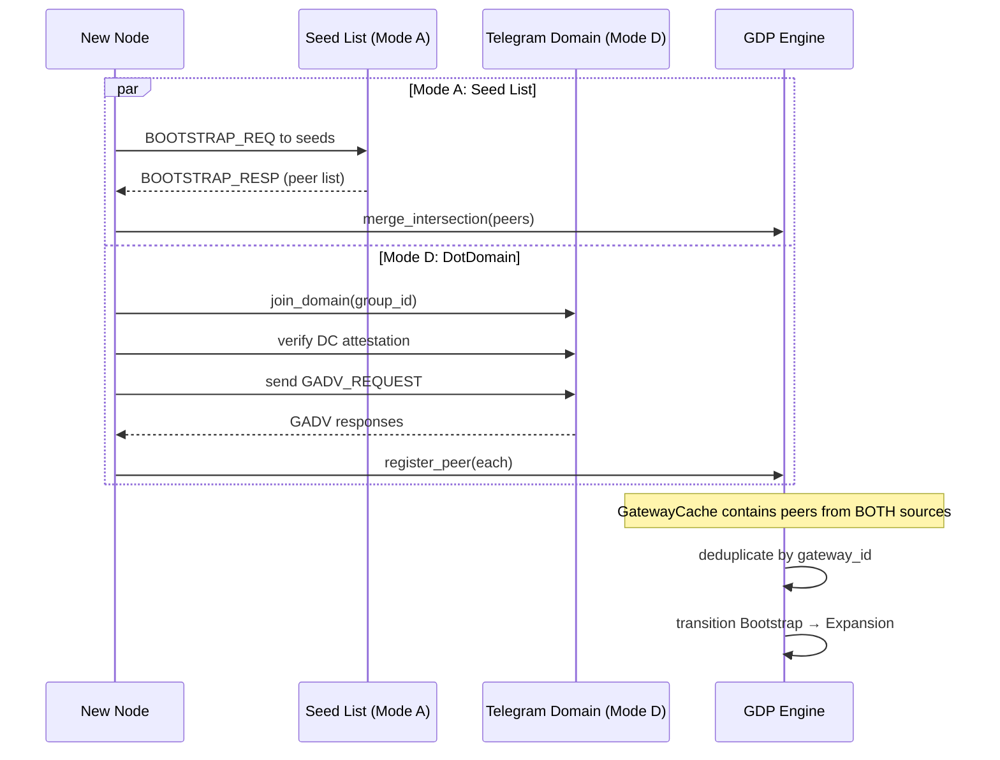

# RFC-0851p-b (Networking): DotDomain Bootstrap Mode

## Status

Draft (2026-06-25)

> **Patch RFC for RFC-0851p-a (Network Bootstrap Protocol).** Specifies `BootstrapMethod::DotDomain` (0x0004) — bootstrapping a node into the mesh by joining a DC-managed broadcast domain (Telegram group, Matrix room, WhatsApp group, etc.) rather than contacting static seed nodes. Closes the gap where `DotDomain` existed as an enum variant in RFC-0851 §8.1 with zero specification.
>
> This RFC is the keystone that connects the Domain Governance plane (RFC-0850p-c group binding, RFC-0855p-c DC role) to the Bootstrap plane (RFC-0851p-a). Without it, social adapters are transport-only and cannot participate in peer discovery.

## Authors

- @mmacedoeu
- Jcode Agent (drafting on behalf of human direction)

## Maintainers

- @mmacedoeu

## Summary

Specifies the `DotDomain` bootstrap mode: a node discovers peers by joining a DC-managed broadcast domain (identified by a `BroadcastDomainHint`), verifying the DomainCoordinator's attestation, checking that the group is `Bound` to the target mission, exchanging `GatewayAdvertisement`s, and populating `GatewayCache`. Defines the `DotDomainBootstrapConfig`, `DomainBootstrapResult`, DC attestation verification during bootstrap, GroupRegistry state check, scope mapping, gossip mode selection, and the interaction between DotDomain and seed-list (Mode A) parallel bootstrap. The result is a node that can discover peers through social platforms without any prior knowledge of seed node addresses.

## Dependencies

**Requires:**

- RFC-0851p-a (Networking): Network Bootstrap Protocol — parent RFC; this is a patch adding Mode DotDomain to the bootstrap lifecycle
- RFC-0851 (Networking): Gateway Discovery Protocol — for `GatewayAdvertisement`, `GatewayCache`, `DiscoveryScope`, `DiscoveryLifecycle`, `BootstrapMethod::DotDomain`
- RFC-0850p-c (Networking): Transport Group Binding Ceremony — for `GroupBinding`, `GroupState`, `GroupRegistry`, BIND ceremony
- RFC-0855p-c (Networking): DomainCoordinator Role — for `DomainCoordinatorRecord`, DC lifecycle, platform-admin authority check
- RFC-0850 (Networking): Deterministic Overlay Transport — for `PlatformAdapter`, `DeterministicEnvelope`, `BroadcastDomainId`

**Optional:**

- RFC-0860 (Networking): Proof of Relay — trust scores used for DC attestation confidence weighting
- RFC-0850p-d (Networking): DC-Initiated Group Creation — for groups created by a DC that become bootstrap targets
- RFC-0855p-b (Networking): Mission Coordinator Lifecycle — for `CoordinatorLifecycle` state machine (DC reuses this)

> **Dependency Validation Rules:**
> 1. Dependencies MUST form a DAG — this RFC depends on 0851p-a, 0851, 0850p-c, 0855p-c, 0850; none depend on this RFC yet. RFC-0863p-a will depend on this RFC.
> 2. All "Requires" RFCs MUST be listed as mission prerequisites.
> 3. RFC-0860 is Optional — without it, DC attestation uses structural verification only (no trust-score weighting).
> 4. RFC-0850p-d is Optional — DotDomain bootstrap works with pre-existing groups; 0850p-d adds DC-created groups as additional bootstrap targets.

## Design Goals

| Goal | Target | Metric |
|------|--------|--------|
| G1 | First peer acquired in <10s via DotDomain | Wall-clock from `join_domain()` to first `GatewayAdvertisement` cached |
| G2 | DC attestation verification in <500ms | Wall-clock from attestation receipt to `verified/rejected` |
| G3 | DotDomain + Mode A bootstrap runs in parallel | Both modes complete independently; results merge into `GatewayCache` |
| G4 | Group state is checked before peer acceptance | `GroupRegistry.lookup()` must return `Bound` for the target mission |
| G5 | DC lifecycle gates peer trust | DC in `Suspect` state → peers marked `degraded`; DC in `Inactive` → domain evicted from cache |
| G6 | All state transitions are RFC-0008 Class A | Deterministic given input attestations and registry state |

## Motivation

### The Gap

RFC-0851 §8.1 defines six `BootstrapMethod` variants. Modes A (Static), B (QrBlob), and C (LanBroadcast) are specified or partially specified in RFC-0851p-a. Mode `DotDomain = 0x0004` is defined as "Existing DOT broadcast domain" with zero specification.

CipherOcto has 20 platform adapters, of which at least 6 are natively broadcast-capable (Telegram groups, Discord servers, Matrix rooms, Nostr relays, IRC channels, Bluesky threads). These platforms already have group management (RFC-0850p-c CoordinatorAdmin), DC governance (RFC-0855p-c), and binding ceremonies (RFC-0850p-c). Yet none of this infrastructure participates in bootstrap.

A node operator who creates a Telegram group, binds it to a mission, and invites peers currently has no way to say: "New nodes should discover my mission through this group." The DotDomain bootstrap mode fills this gap.

### Why This Matters

Without DotDomain bootstrap:

1. **Every new node needs a seed list file.** This is a poor UX — the operator must manually distribute a JSON file with seed node addresses. Social platforms already solve "how do people find each other."
2. **Social adapters are transport-only.** Telegram, Discord, Matrix adapters can send/receive envelopes but cannot participate in the discovery plane. The GDP `GatewayAdvertisement` carries `OverlayEndpoint`s with `transport_type = PlatformType`, but these are never populated through social channel discovery.
3. **DC governance is disconnected from bootstrap.** The `DomainCoordinator` manages group membership, but a new node joining the group is invisible to the DC's BIND ceremony — the node enters the physical group without entering the logical mission.

### Relationship to Other Bootstrap Methods

| Method | Trust Anchor | Discovery Speed | Prior Knowledge |
|--------|-------------|----------------|-----------------|
| Mode A (Static seed list) | Seed list authority (Foundation/DAO) | Fast (<5s) | Seed list file |
| Mode B (QrBlob) | Human transfer | Instant (offline) | QR code |
| Mode C (LanBroadcast) | Network proximity | Instant (LAN) | Same LAN |
| **Mode D (DotDomain)** | **DomainCoordinator** | **Medium (<10s)** | **Group link/invite** |

DotDomain is the natural bootstrap path for mission-centric deployments where the DC maintains a persistent broadcast domain.

## Roles and Authorities

> **The "Nothing should be implied" rule:** Every actor that affects correctness, security, accountability, or consensus MUST be named with a stable identifier, a defined authority scope, and a typed lifecycle.

### 1. Bootstrap Node (DotDomain variant)

- **Stable identifier**: `[u8; 32]` `PeerId` (the node joining the domain)
- **Base capabilities**: join broadcast domain, send `GADV_REQUEST`, receive `GatewayAdvertisement`, verify DC attestation
- **Authority scope**: `bootstrap_dotdomain` (read-only on the domain; cannot BIND or modify group state)
- **Who can assume**: any node with a valid `BroadcastDomainHint` config
- **Who can revoke**: DC (kick from group → bootstrap fails)
- **Lifecycle**: stateless — bootstrap is a one-shot operation; no persistent state

### 2. DomainCoordinator (bootstrap target)

- **Stable identifier**: `[u8; 32]` `DomainCoordinatorId` (per RFC-0855p-c)
- **Base capabilities**: attest to group membership, sign `PlatformAdminAttest`, respond to `GADV_REQUEST`
- **Authority scope**: `attest_bootstrap` (sign attestations that bind a group to a mission for discovery purposes)
- **Who can assume**: platform-admin of the bound group (per RFC-0855p-c §"Roles and Authorities")
- **Who can revoke**: platform admin transfer, slashing (per RFC-0855p-c)
- **Lifecycle**: `DomainCoordinatorLifecycle` (8 states, per RFC-0855p-b) — attestation validity is tied to DC liveness

### 3. GroupRegistry (shared state)

- **Stable identifier**: per-node local registry (no global ID)
- **Base capabilities**: lookup bindings, enforce multi-platform rule, provide `GroupState` for bootstrap verification
- **Authority scope**: `read` during bootstrap (bootstrap does not modify `GroupRegistry`; BIND is a separate ceremony)
- **Lifecycle**: stateless for bootstrap purposes (read-only access)

## Specification

### System Architecture

```mermaid
graph TB
    subgraph "Bootstrap Entry"
        BHC[BroadcastDomainHint<br/>config: group_id + platform]
        ORC[BootstrapOrchestrator<br/>Mode D path]
    end

    subgraph "Domain Verification"
        ADP[PlatformAdapter<br/>.join_domain() / .receive_messages()]
        DCA[DC Attestation<br/>verify admin pubkey + mission_id]
        GRL[GroupRegistry<br/>lookup: GroupState == Bound?]
    end

    subgraph "Peer Discovery"
        GADV[GADV_REQUEST<br/>broadcast into domain]
        GADVR[GADV responses<br/>from domain members]
        GAC[GatewayCache<br/>populate with peers]
    end

    subgraph "GDP Integration"
        DS[DiscoveryState<br/>Bootstrap → Expansion]
        DISC[TransportDiscovery<br/>register_peer() for each]
    end

    BHC --> ORC
    ORC --> ADP
    ADP --> DCA
    ADP --> GRL
    DCA -->|attested| GADV
    GRL -->|Bound| GADV
    GADV --> GADVR
    GADVR --> GAC
    GAC --> DISC
    DISC --> DS
```

### Data Structures

#### `BroadcastDomainHint`

Specifies which broadcast domain to join for DotDomain bootstrap:

```rust
/// Identifies a broadcast domain for DotDomain bootstrap.
///
/// The hint tells the bootstrap orchestrator which social platform
/// channel to join. The orchestrator uses the adapter's
/// `PlatformAdapter` to enter the domain and discover peers.
#[derive(Clone, Debug, Serialize, Deserialize)]
pub struct BroadcastDomainHint {
    /// Platform type (Telegram, Discord, Matrix, etc.)
    pub platform: PlatformType,
    /// Platform-native group identifier
    /// (Telegram chat_id, Discord channel_id, Matrix room_id, etc.)
    pub domain_ref: String,
    /// Optional: the expected mission_id for this domain.
    /// If set, bootstrap rejects domains bound to a different mission.
    /// If unset, any mission binding is accepted.
    pub expected_mission_id: Option<[u8; 32]>,
    /// Optional: expected DomainCoordinator peer_id.
    /// If set, bootstrap verifies the DC identity matches.
    /// Mitigates DC impersonation on platforms with weak admin APIs.
    pub expected_dc_id: Option<[u8; 32]>,
}
```

#### `DotDomainBootstrapConfig`

Configuration for the DotDomain bootstrap mode:

```rust
/// Configuration for DotDomain bootstrap (Mode D).
#[derive(Clone, Debug)]
pub struct DotDomainBootstrapConfig {
    /// The broadcast domain to join.
    pub domain_hint: BroadcastDomainHint,
    /// Maximum time to wait for GADV responses after joining.
    pub discovery_timeout: Duration,
    /// Minimum GADV responses required for high-confidence discovery.
    pub min_gadv_responses: usize,
    /// Whether to require DC attestation before accepting peers.
    /// Default: true. Set false for untrusted domains (degraded trust).
    pub require_dc_attestation: bool,
    /// Maximum number of peers to accept from a single domain.
    /// Prevents a single compromised domain from flooding the cache.
    pub max_peers_per_domain: u16,
}
```

#### `DomainBootstrapResult`

Result of a DotDomain bootstrap attempt:

```rust
/// Result of a DotDomain bootstrap attempt.
#[derive(Clone, Debug)]
pub struct DomainBootstrapResult {
    /// Number of peers discovered and cached.
    pub peers_discovered: u32,
    /// The DC attestation (if verified).
    pub dc_attestation: Option<PlatformAdminAttest>,
    /// The mission_id this domain is bound to.
    pub bound_mission_id: Option<[u8; 32]>,
    /// Whether the bootstrap was high-confidence (DC attested + min responses met).
    pub high_confidence: bool,
    /// Peers that were rejected and why.
    pub rejected_peers: Vec<RejectedPeer>,
}

#[derive(Clone, Debug)]
pub struct RejectedPeer {
    pub peer_id: [u8; 32],
    pub reason: RejectionReason,
}

#[derive(Clone, Debug)]
pub enum RejectionReason {
    /// DC not attested and require_dc_attestation is true.
    DcNotAttested,
    /// Group not bound to the expected mission.
    MissionMismatch { expected: [u8; 32], actual: [u8; 32] },
    /// Group state is not Bound (e.g., UnboundQuarantined, Creating).
    GroupNotBound(GroupState),
    /// DC lifecycle is Suspect or Inactive — degraded trust.
    DcUntrusted(DcTrustLevel),
    /// Peer exceeds max_peers_per_domain cap.
    DomainPeerCapExceeded,
}
```

### Algorithms

#### DotDomain Bootstrap Flow

```
function dotdomain_bootstrap(config, adapter, group_registry, discovery):
    // Step 1: Join the broadcast domain
    adapter.join_domain(config.domain_hint.domain_ref)
    
    // Step 2: Verify GroupRegistry state
    binding = group_registry.lookup(config.domain_hint.platform, config.domain_hint.domain_ref)
    if binding is None:
        return Error(DomainNotBound)
    if binding.state != Bound:
        return Error(GroupNotBound(binding.state))
    if config.expected_mission_id is Some(mission_id):
        if binding.mission_id != mission_id:
            return Error(MissionMismatch)
    
    // Step 3: Verify DC attestation (if required)
    if config.require_dc_attestation:
        attest = adapter.receive_attestation(timeout=config.discovery_timeout)
        if attest is None:
            return Error(DcAttestationTimeout)
        verify_attestation(attest, binding.domain_coordinator_id)
        if config.expected_dc_id is Some(dc_id):
            if attest.dc_id != dc_id:
                return Error(DcIdentityMismatch)
    
    // Step 4: Send GADV_REQUEST into the domain
    adapter.send_envelope(config.domain_hint.domain_ref, gadv_request)
    
    // Step 5: Collect GADV responses
    responses = adapter.receive_gadv_responses(
        timeout=config.discovery_timeout,
        min_count=config.min_gadv_responses,
    )
    
    // Step 6: Populate GatewayCache (with per-domain cap)
    for response in responses[0..config.max_peers_per_domain]:
        discovery.register_peer(response.gateway_advertisement, current_epoch)
    
    // Step 7: Update DiscoveryState
    discovery_state.peer_count += len(responses)
    if discovery_state.peer_count >= 5:
        discovery_state.start_expansion()
    
    return Ok(DomainBootstrapResult { ... })
```

#### DC Attestation Verification

```
function verify_attestation(attest, expected_dc_id):
    // 1. Verify the attestation is for the correct DC
    if attest.dc_id != expected_dc_id:
        return Error(DcIdentityMismatch)
    
    // 2. Verify the attestation freshness (per RFC-0855p-c §admin_attest)
    if current_epoch - attest.attested_at > MAX_ATTEST_AGE_EPOCHS:
        return Error(StaleAttestation)
    
    // 3. Verify the attestation signature
    verify_ed25519(attest.signature, attest.dc_pubkey, attest.signing_bytes())
    
    // 4. Verify the mission_id matches the binding
    // (redundant if GroupRegistry already checked, but defense-in-depth)
    if attest.mission_id != binding.mission_id:
        return Error(MissionMismatch)
```

#### Parallel Bootstrap (DotDomain + Mode A)



### Lifecycle Requirements

> **DotDomain bootstrap is a one-shot operation** — the bootstrap node joins a domain, discovers peers, and exits the bootstrap flow. The DC lifecycle and GroupBinding lifecycle are ongoing; bootstrap reads their state but does not modify it.

#### State Transitions (Bootstrap Client)

| From | To | Trigger | Deterministic? | Side Effects | Signing |
|------|-----|---------|----------------|--------------|---------|
| Init | Joining | `join_domain()` called | Yes | Adapter enters broadcast domain | None |
| Joining | Verifying | Domain joined + messages received | Yes | None | None |
| Verifying | Discovering | DC attestation verified + GroupRegistry returns `Bound` | Yes | None | None |
| Verifying | Failed | Attestation invalid or group not bound | Yes | Leave domain | None |
| Discovering | Caching | ≥ `min_gadv_responses` received | Yes | Populate `GatewayCache` | None |
| Discovering | TimedOut | `discovery_timeout` elapsed | Yes | Partial cache if any responses | None |
| Caching | Done | Cache populated | Yes | `DiscoveryState` updated | None |

#### DC Liveness Impact on Bootstrap

| DC Lifecycle State | Bootstrap Behavior | Trust Level |
|---|---|---|
| `Active` | Normal bootstrap; full trust | `Trusted` |
| `Elected` / `Designated` | Bootstrap proceeds; reduced trust (DC not yet proven) | `Provisional` |
| `Suspect` | Bootstrap proceeds with degradation; peers marked `degraded` | `Degraded` |
| `Handover` | Bootstrap blocked; wait for successor or timeout | `Blocked` |
| `Demoting` / `Resigned` / `Inactive` | Bootstrap fails; domain not usable | `Untrusted` |

### Determinism Requirements

| Operation | Class | Rationale |
|-----------|-------|-----------|
| GroupRegistry state lookup | A | Read-only BTreeMap lookup; deterministic |
| DC attestation signature verification | A | Ed25519 verify is deterministic |
| GADV response ordering | B | Arrival order varies; cache population uses `gateway_id` sort for determinism |
| `DiscoveryState` transition | A | State machine is deterministic given peer count |

### RFC-0008 Execution Class Mapping

| Operation | Class | Rationale |
|-----------|-------|-----------|
| GroupRegistry lookup | A | Local BTreeMap read |
| DC attestation verify | A | Ed25519 verification |
| `join_domain()` adapter call | C | Platform API call; non-deterministic |
| `receive_messages()` adapter call | C | Platform API call; message order varies |
| GatewayCache insert | A | BTreeMap insert with deterministic key |
| DiscoveryState transition | A | Deterministic state machine |

### Error Handling

| Error Code | Description | Recovery |
|-----------|-------------|----------|
| `DD-001` | Domain not found in GroupRegistry | Retry or fallback to Mode A |
| `DD-002` | GroupState is not `Bound` | Wait for BIND ceremony or fallback |
| `DD-003` | DC attestation timeout | Retry with backoff or set `require_dc_attestation = false` |
| `DD-004` | DC attestation signature invalid | Reject domain; log alert |
| `DD-005` | Mission ID mismatch | Config error; operator must fix |
| `DD-006` | DC identity mismatch | Possible impersonation; reject |
| `DD-007` | GADV response timeout | Partial results accepted if ≥ 1 response |
| `DD-008` | Per-domain peer cap exceeded | Truncate; log warning |
| `DD-009` | DC lifecycle is `Untrusted` | Reject domain; log alert |
| `DD-010` | Adapter does not support `join_domain` | Fallback to Mode A |

## Performance Targets

| Metric | Target | Notes |
|--------|--------|-------|
| DotDomain bootstrap latency | <10s | From `join_domain()` to first peer cached |
| DC attestation verification | <500ms | Ed25519 verify + freshness check |
| GADV response collection | <5s | After `GADV_REQUEST` sent |
| Parallel bootstrap overhead | <2s additional | DotDomain + Mode A running concurrently |
| GatewayCache merge | <10ms | BTreeMap dedup by `gateway_id` |

## Implicit Assumptions Audit

| Assumption | Where Relied Upon | Blast Radius if False | Mitigation / Status |
|------------|-------------------|----------------------|---------------------|
| The platform adapter supports `join_domain()` or equivalent | §Algorithm Step 1 | DotDomain bootstrap fails entirely for that platform | Mitigation: check `CoordinatorAdmin::admin_capabilities().can_join` at config time; fallback to Mode A. **ACCEPTED RISK** — not all 20 adapters support group join; Telegram, Discord, Matrix, IRC do. |
| The DC's `PlatformAdminAttest` is current (within `MAX_ATTEST_AGE_EPOCHS`) | §Algorithm Step 3 | Stale attestation accepted; DC may have changed | Mitigation: freshness check per RFC-0855p-c §admin_attest. |
| The `GroupRegistry` is synchronized across the mesh | §Algorithm Step 2 | Node may see `Bound` while the group is actually `UnboundQuarantined` | Mitigation: GroupRegistry updates propagate via DOT/1/BIND/UNBIND envelopes; eventual consistency with bounded delay. **ACCEPTED RISK** — transient inconsistency window is <5s per RFC-0850p-c G1. |
| Platform group membership is stable during bootstrap | §Algorithm Steps 4-5 | Node kicked mid-bootstrap; GADV responses lost | Mitigation: adapter detects kick event; bootstrap retries or falls back to Mode A. |
| GADV responses from domain members are truthful | §Algorithm Step 5 | Sybil: attacker floods domain with fake GADVs | Mitigation: per-domain peer cap (`max_peers_per_domain`); cross-reference with Mode A results if both run in parallel. |
| The broadcast domain is the correct one for the mission | §BroadcastDomainHint | Operator configures wrong group; node joins wrong mission | Mitigation: `expected_mission_id` field in config; GroupRegistry binding check. |

## Security Considerations

| Threat | Impact | Mitigation |
|--------|--------|-----------|
| DC impersonation during bootstrap | HIGH | DC attestation signature verification; `expected_dc_id` config field |
| Fake domain (attacker creates group with same name) | HIGH | GroupRegistry binding check — domain must be `Bound` to the mission with a signed BIND envelope |
| Sybil flood via compromised domain | MEDIUM | `max_peers_per_domain` cap; cross-reference with Mode A if parallel |
| Platform kick during bootstrap (race) | MEDIUM | Adapter kick detection; retry with backoff |
| Stale DC attestation (DC rotated) | MEDIUM | `MAX_ATTEST_AGE_EPOCHS` freshness check |
| Replay of old GADV responses | LOW | `GatewayAdvertisement.sequence` is strictly monotonic; old sequences rejected |

## Adversary Analysis

### 5-Question Test

| # | Question | DotDomain Bootstrap |
|---|----------|-------------------|
| 1 | Who benefits from breaking it? | An attacker who wants to eclipse a new node by controlling which peers it discovers |
| 2 | What does it cost them? | Compromise the DC's key OR create a fake group + fake BIND envelope + fake attestation. Cost: moderate (requires platform account + key compromise) |
| 3 | What do they gain? | Eclipse: all traffic routed through attacker's nodes; message injection/suppression |
| 4 | What's our defense? | DC attestation signature verify + GroupRegistry BIND check + per-domain peer cap + parallel Mode A cross-reference. Cost to legitimate: +500ms attestation verify |
| 5 | What's the residual risk? | If DC key is compromised AND attacker creates a valid BIND, eclipse is possible. Mitigated by: parallel Mode A (seed list authority is independent trust anchor). **ACCEPTED RISK** — defense in depth via dual-bootstrap |

## Economic Analysis

DotDomain bootstrap does not directly involve token economics. However:

- DC attestation confidence can be weighted by the DC's trust score (RFC-0860) when available
- Domain-scoped OCTO-B stake requirements (RFC-0851 §11.1) apply to the DC, not the bootstrapping node
- The bootstrapping node does not need stake to discover peers via DotDomain

## Compatibility

- **Backward compatible**: existing Mode A (seed list) bootstrap continues to work unchanged
- **Forward compatible**: new adapter types that support `join_domain()` automatically work with DotDomain
- **Mixed deployment**: nodes using DotDomain and nodes using Mode A can discover each other (GDP merge)

## Test Vectors

### TV-DD-1: Successful DotDomain Bootstrap

```
Input:
  domain_hint: { platform: Telegram, domain_ref: "-1001234567890", expected_mission_id: Some(0x42..) }
  GroupRegistry: { state: Bound, mission_id: 0x42.., dc_id: 0xAA.. }
  DC attestation: { dc_id: 0xAA.., mission_id: 0x42.., signature: valid, age: 3 epochs }
  GADV responses: [Peer_A, Peer_B, Peer_C]

Expected:
  result: Ok(DomainBootstrapResult { peers_discovered: 3, high_confidence: true })
  GatewayCache: [Peer_A, Peer_B, Peer_C]
  DiscoveryState: { peer_count: 3, phase: Bootstrap }
```

### TV-DD-2: DC Attestation Failure

```
Input:
  domain_hint: { platform: Telegram, domain_ref: "-1001234567890" }
  DC attestation: { signature: INVALID }

Expected:
  result: Err(DcAttestationTimeout or DcNotAttested)
  GatewayCache: empty
```

### TV-DD-3: Group Not Bound

```
Input:
  domain_hint: { platform: Telegram, domain_ref: "-1001234567890" }
  GroupRegistry: { state: Creating }

Expected:
  result: Err(GroupNotBound(Creating))
```

### TV-DD-4: Parallel Bootstrap Merge

```
Input:
  Mode A response: [Peer_A, Peer_D]
  DotDomain response: [Peer_A, Peer_B, Peer_C]

Expected:
  GatewayCache: [Peer_A, Peer_B, Peer_C, Peer_D]  (deduplicated)
  DiscoveryState: { peer_count: 4 }
```

### TV-DD-5: DC Lifecycle Degraded

```
Input:
  DC lifecycle: Suspect
  GADV responses: [Peer_A, Peer_B]

Expected:
  result: Ok(DomainBootstrapResult { peers_discovered: 2, high_confidence: false })
  GatewayCache: [Peer_A(degraded), Peer_B(degraded)]
```

## Alternatives Considered

| Approach | Pros | Cons |
|----------|------|------|
| Mode D as standalone protocol (not patch to 0851p-a) | Independent versioning | Duplicates bootstrap lifecycle state machine; breaks single-bootstrap-orchestrator pattern |
| No DC attestation requirement | Simpler; works without DC | No trust anchor; trivially spoofable |
| Mode D replaces Mode A entirely | Single path | Loses seed-list trust anchor; single point of failure |
| GDP gossip-only discovery (no direct GADV_REQUEST) | Uses existing DGP infrastructure | Slower; no guarantee of response; DC attestation timing unclear |

## Implementation Phases

### Phase 1: Core DotDomain Bootstrap

- [ ] Define `BroadcastDomainHint`, `DotDomainBootstrapConfig`, `DomainBootstrapResult` types in `octo-transport`
- [ ] Implement `dotdomain_bootstrap()` algorithm in `BootstrapOrchestrator`
- [ ] Wire `CoordinatorAdmin::join_domain()` call (adapters that support it)
- [ ] DC attestation verification (structural + signature)
- [ ] GroupRegistry state check
- [ ] GatewayCache population with per-domain cap
- [ ] Unit tests: TV-DD-1 through TV-DD-5

### Phase 2: Parallel Bootstrap

- [ ] Run DotDomain + Mode A concurrently in `BootstrapOrchestrator::run()`
- [ ] Merge results into `GatewayCache` with dedup
- [ ] DiscoveryState updates from both paths

### Phase 3: DC Lifecycle Integration

- [ ] DC lifecycle state → trust level mapping
- [ ] Degraded trust marking in GatewayCache entries
- [ ] DC lifecycle change → cache invalidation (link to RFC-0851 update)

### Phase 4: Multi-Domain Bootstrap

- [ ] Support multiple `BroadcastDomainHint` entries (join N domains in parallel)
- [ ] Per-domain peer cap enforcement
- [ ] Cross-domain dedup

## Key Files to Modify

| File | Change |
|------|--------|
| `octo-transport/src/bootstrap.rs` | Add `DotDomain` path in `BootstrapOrchestrator::run()` |
| `octo-transport/src/discovery.rs` | Add `register_peer_with_trust_level()` method |
| `octo-transport/src/lib.rs` | Export new types |
| `octo-transport/Cargo.toml` | Add `octo-network` dep for `GroupRegistry`, `PlatformAdminAttest` |
| `sync-e2e-tests/stoolap-node/src/main.rs` | Add `--bootstrap-domain` CLI arg |

## Future Work

| ID | Title | Severity | Deadline | Spec |
|----|-------|----------|----------|------|
| F1 | Multi-relay Nostr bootstrap (subscribe to N relays simultaneously) | LOW | Future | Extends DotDomain to Nostr relay arrays |
| F2 | Bootstrap domain reputation (domains that produce good peers get priority) | MEDIUM | Post-launch | New `DomainReputation` module |
| F3 | DC attestation caching (avoid re-attesting on every bootstrap) | LOW | Post-launch | `AttestationCache` with TTL |
| F4 | Cross-platform bootstrap (discover peers in Telegram group, find their Matrix endpoints via GADV) | MEDIUM | Post-launch | GADV cross-pollination |

## Rationale

The DotDomain mode is a patch RFC (not a standalone RFC) because it adds a bootstrap method to an existing lifecycle — the `BootstrapOrchestrator` state machine from RFC-0851p-a is reused, not duplicated. The "Mode D" naming follows the existing A/B/C convention.

DC attestation is required by default (not optional) because an unattested domain provides no trust anchor — any attacker can create a Telegram group. The `require_dc_attestation = false` escape hatch exists for experimental deployments where the operator accepts degraded trust.

The per-domain peer cap (`max_peers_per_domain`, default 64) prevents a single compromised domain from filling the entire `GatewayCache` (default 256) with Sybil nodes.

## Adversarial Review

| Threat | Impact | Mitigation |
|--------|--------|-----------|
| DC key compromise → fake attestation | CRITICAL | Parallel Mode A as independent trust anchor; DC key rotation (RFC-0855p-c) |
| Fake group + fake BIND | HIGH | GroupRegistry requires signed BIND envelope from DC |
| Platform API abuse (rate limiting) | MEDIUM | Adapter-level rate limits; backoff |
| Domain flooding (many GADV responses) | MEDIUM | `max_peers_per_domain` cap |

## Version History

| Version | Date | Changes |
|---------|------|---------|
| 0.1.0 | 2026-06-25 | Initial draft |

## Related RFCs

- RFC-0851 (Networking): Gateway Discovery Protocol — defines `BootstrapMethod::DotDomain`
- RFC-0851p-a (Networking): Network Bootstrap Protocol — parent RFC; Mode D is a patch
- RFC-0850p-c (Networking): Transport Group Binding Ceremony — `GroupBinding`, `GroupState`
- RFC-0855p-c (Networking): DomainCoordinator Role — DC attestation, lifecycle
- RFC-0855p-b (Networking): Mission Coordinator Lifecycle — `CoordinatorLifecycle` reused by DC
- RFC-0863 (Networking): General-Purpose Network Integration — `NodeTransport` consumes DotDomain results
- RFC-0863p-a (Networking): Domain-Governed Transport — depends on this RFC for bootstrap integration

## Related Use Cases

- [Social Platform Transport Layer](../../docs/use-cases/social-platform-transport-layer.md)
- [Network Bootstrap](../../docs/use-cases/network-bootstrap.md) (TODO per RFC-0851p-a)

## Appendices

### A. Adapter `join_domain()` Support Matrix

| Platform | `join_domain()` Support | Notes |
|----------|------------------------|-------|
| Telegram | Yes | `join_chat(invite_link)` via Bot API |
| Discord | Yes | `accept_invite(invite_code)` via Bot |
| Matrix | Yes | `join_room(room_id_or_alias)` |
| WhatsApp | Partial | Requires invite link; no direct join |
| IRC | Yes | `JOIN #channel` |
| Nostr | Yes | Subscribe to relay |
| Signal | No | No group join API |
| QUIC | N/A | Point-to-point; no broadcast domain |
| Webhook | N/A | Point-to-point; no broadcast domain |
