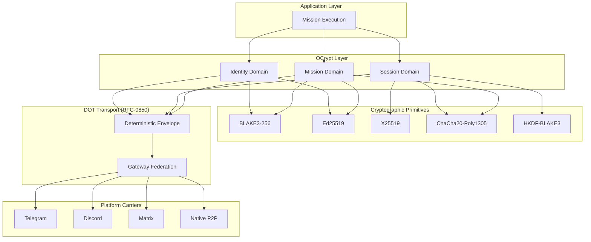

# RFC-0853: Overlay Cryptography (OCrypt)

## Status

Draft

## Authors

- Author: @cipherocto

## Maintainers

- Maintainer: @cipherocto

## Summary

Overlay Cryptography (OCrypt) defines the cryptographic model for CipherOcto overlay networking. OCrypt provides sovereign overlay identity, deterministic cryptographic envelopes, transport-independent encryption, mission-scoped trust domains, forward secrecy, replay-safe signatures, onion-capable relay encryption, multi-hop confidentiality, and deterministic canonical cryptographic boundaries.

The most important invariant:

> **External platforms MUST NEVER be trusted for confidentiality, authenticity, ordering, or integrity.** All trust exists ONLY inside the CipherOcto cryptographic layer.

OCrypt is explicitly designed for hostile heterogeneous transport environments where underlying communication carriers are assumed observable, mutable, censorable, replayable, and adversarial.

## Dependencies

**Requires:**

- RFC-0850 (Networking): Deterministic Overlay Transport — envelope format, gateway model
- RFC-0851 (Networking): Gateway Discovery Protocol — gateway identity advertisement
- RFC-0852 (Networking): Deterministic Gossip Protocol — propagation primitives
- RFC-0105 (Numeric): Deterministic Quant Arithmetic — ZK-safe arithmetic for witness generation
- RFC-0104 (Numeric): Deterministic Floating Point — deterministic numeric semantics

**Optional:**

- RFC-0009 (Process): Identity Management — core identity model
- RFC-0102 (Numeric): Wallet Cryptography — key pair format
- RFC-0949 (Economics): Enterprise SSO — IdentityProvider model
- RFC-0854 (Networking): Deterministic Proof Substrate — ZK proof integration

## Design Goals

| Goal | Target | Metric |
|------|--------|--------|
| G1: Sovereign Identity | Platform-independent | Identity survives platform account loss |
| G2: Deterministic Verification | 100% replay consistency | Identical verification results across all implementations |
| G3: Forward Secrecy | Session compromise isolation | Compromise of long-term keys does not expose past traffic |
| G4: Transport Independence | Carrier-agnostic | Encryption works over any DOT carrier (RFC-0850) |
| G5: Replay Resistance | Zero false positives | Valid envelopes never rejected; replayed envelopes always detected |
| G6: Mission Isolation | Cryptographic compartmentalization | Compromise of one mission does not affect others |
| G7: Multi-Hop Privacy | Onion-capable | Relay nodes cannot reconstruct full route |
| G8: Cryptographic Agility | Algorithm upgradeability | Hash, signature, KEX, AEAD can be upgraded independently |
| G9: Byzantine Resilience | Hostile relay tolerance | Malicious gateways cannot forge, replay, or undetectably modify envelopes |

## Motivation

### CAN WE? — Feasibility Research

The fundamental question: **Can we build a cryptographic layer that operates above hostile heterogeneous communication platforms while maintaining deterministic consensus guarantees?**

Research confirms feasibility through:

- **Ed25519/X25519** provide battle-tested asymmetric cryptography with 128-bit security
- **ChaCha20-Poly1305** is a proven AEAD cipher used in TLS 1.3, WireGuard, and Noise Protocol
- **BLAKE3** provides high-performance hashing with hardware acceleration
- **Noise Protocol Framework** demonstrates protocol composition for session establishment
- **MLS (Messaging Layer Security)** demonstrates group key management at scale
- **RFC-0126 DCS** provides deterministic serialization for consensus-critical data

CipherOcto's deterministic numeric stack (RFC-0104, RFC-0105) becomes strategically important as a ZK-safe arithmetic substrate for witness generation in proof-carrying envelopes.

### WHY? — Why This Matters

Without OCrypt:

- Platform operators can read all overlay traffic
- Man-in-the-middle attacks are trivial on untrusted carriers
- Replay attacks disrupt consensus
- Identity is tied to platform accounts (lost when accounts are banned)
- No mission compartmentalization — all traffic is linkable
- No onion routing — traffic analysis reveals overlay topology
- No forward secrecy — key compromise exposes all historical traffic

OCrypt provides the cryptographic foundation that makes DOT (RFC-0850) safe to use over untrusted platforms.

### Relationship to RFC-0009 and RFC-0102

RFC-0009 (Identity Management) defines the base identity model for CipherOcto. OCrypt extends this with:

- Overlay-specific identity derivation (Section 6)
- Platform binding proofs (Section 6.3)
- Session key management (Section 8)
- Mission-scoped key hierarchies (Section 10)

RFC-0102 (Wallet Cryptography) defines key pair formats. OCrypt uses the same Ed25519/X25519 primitives for consistency.

## Specification

### 1. System Architecture



### 2. Cryptographic Domains

OCrypt operates across three distinct cryptographic domains with different lifetimes and trust models.

#### 2.1 Identity Domain

Long-lived sovereign identity. Used for:

- Gateway identity (RFC-0850)
- Validator identity
- Mission authority
- Governance participation

**Lifetime:** Months to years. Rotation is infrequent and requires signed successor linkage.

**Trust model:** Self-sovereign. No centralized PKI. Trust emerges from mission membership, PoR reputation, signed introductions, governance, and overlay economics.

#### 2.2 Session Domain

Ephemeral session keys. Used for:

- Relay encryption between gateways
- Transient communication channels
- Forward secrecy

**Lifetime:** Minutes to hours. Aggressive rotation recommended.

**Trust model:** Ephemeral. Compromise of session keys MUST NOT compromise identity keys or past sessions.

#### 2.3 Mission Domain

Mission-scoped cryptographic namespace. Used for:

- Temporary overlay encryption
- AI swarm coordination
- Task compartmentalization

**Lifetime:** Mission duration. Rekeying on member rotation or compromise.

**Trust model:** Mission-scoped. Compromise of one mission MUST NOT compromise other missions, overlay identity, or unrelated sessions.

### 3. Cryptographic Primitives

#### 3.1 Mandatory Algorithms

| Function | Algorithm | Key Size | Security Level |
|----------|-----------|----------|---------------|
| Hashing | BLAKE3-256 | N/A (output 256-bit) | 128-bit collision |
| Signatures | Ed25519 | 32-byte public, 64-byte signature | 128-bit |
| Key Exchange | X25519 | 32-byte public, 32-byte shared secret | 128-bit |
| AEAD | ChaCha20-Poly1305 | 32-byte key, 12-byte nonce, 16-byte tag | 128-bit |
| KDF | HKDF-BLAKE3 | Variable input, variable output | 128-bit |
| Merkle Trees | BLAKE3 | N/A | 128-bit |
| Randomness | Deterministic CSPRNG | HKDF-based derivation | 128-bit |

#### 3.2 Algorithm Agility

OCrypt MUST support future algorithm migration via `CryptoSuiteId`:

```rust
#[derive(Clone, Copy, Debug, PartialEq, Eq)]
#[repr(C)]
struct CryptoSuiteId {
    /// Hash algorithm identifier
    hash_id: u16,
    /// Signature algorithm identifier
    signature_id: u16,
    /// Key exchange algorithm identifier
    kex_id: u16,
    /// AEAD algorithm identifier
    aead_id: u16,
}

// Initial suite (v1)
const CRYPTO_SUITE_V1: CryptoSuiteId = CryptoSuiteId {
    hash_id: 0x0001,        // BLAKE3-256
    signature_id: 0x0001,   // Ed25519
    kex_id: 0x0001,         // X25519
    aead_id: 0x0001,        // ChaCha20-Poly1305
};
```

**Versioning Rule:** Nodes MUST reject envelopes using unsupported crypto suites. Nodes MUST NOT downgrade to weaker suites. Suite negotiation uses the highest mutually supported suite.

#### 3.3 Post-Quantum Roadmap

Future suites SHOULD add:

| Primitive | Candidate | Suite ID |
|-----------|-----------|----------|
| Signatures | Dilithium (ML-DSA) | `signature_id: 0x0002` |
| KEX | Kyber (ML-KEM) | `kex_id: 0x0002` |
| Hashing | BLAKE3/SHA3 hybrid | `hash_id: 0x0002` |

**Guidance:** OCrypt should NOT bind to one proving system. Instead, define a deterministic proof substrate abstraction (RFC-0854) capable of hosting multiple proof systems.

### 4. Sovereign Identity Model

#### 4.1 Overlay Identity (extends RFC-0009)

```rust
#[derive(Clone, Debug)]
#[repr(C)]
struct OverlayIdentity {
    /// Peer identifier (SHA-256 of public_key)
    peer_id: [u8; 32],
    /// Ed25519 public key
    public_key: [u8; 32],
    /// Identity creation epoch
    identity_epoch: u64,
    /// Merkle root of capabilities
    capabilities_root: [u8; 32],
    /// Ed25519 signature over (peer_id || public_key || identity_epoch || capabilities_root)
    signature: [u8; 64],
}
```

**Derivation:**

```text
peer_id = SHA-256(public_key)
identity_signature = Ed25519_sign(
    private_key,
    peer_id || public_key || identity_epoch || capabilities_root
)
```

#### 4.2 Identity Independence

Identity MUST remain independent from:

- Telegram accounts
- Discord usernames
- Matrix IDs
- IP addresses
- DNS names
- Device identifiers
- Any platform-specific identifier

**Verification:** Identity verification uses only `public_key` and `signature`. No platform context is required.

#### 4.3 Platform Binding

Optional platform bindings MAY exist to link overlay identity to platform accounts:

```rust
#[derive(Clone, Debug)]
#[repr(C)]
struct PlatformBinding {
    /// Platform type (per RFC-0850)
    platform_type: u16,
    /// SHA-256 of platform-specific external identifier
    external_identifier_hash: [u8; 32],
    /// Ed25519 proof that identity holder controls platform account
    proof_signature: [u8; 64],
}
```

**Critical Rule:** Platform bindings MUST NEVER become consensus authority. They are convenience mappings only. Loss of a platform account MUST NOT affect overlay identity.

**Proof Construction:**

```text
proof_signature = Ed25519_sign(
    identity_private_key,
    platform_type || external_identifier_hash
)
```

Verification confirms that the identity holder claims association with the platform account. It does NOT prove the platform account holder claims the identity (that requires a separate platform-side proof).

### 5. Consensus Boundary (Most Critical Section)

#### 5.1 Consensus MUST NOT Depend On

- Ciphertext bytes
- Encryption randomness (nonces, IVs)
- Carrier metadata (platform timestamps, message IDs)
- Platform timestamps
- Packet fragmentation details
- Session key material
- AEAD tag bytes

#### 5.2 Consensus MAY Depend On

- Canonical plaintext hashes (BLAKE3-256)
- Deterministic serialization (RFC-0126 DCS)
- Verified Ed25519 signatures
- Merkle commitments
- Route commitments (RFC-0850)
- Replay identifiers (envelope_id, sequence, logical_timestamp)

#### 5.3 Enforcement

Every consensus-critical code path MUST verify against the boundary rules. The OCrypt implementation MUST include debug-mode assertions that detect boundary violations.

### 6. Deterministic Envelope Encryption

#### 6.1 Canonical Encryption Boundary

Critical invariant:

```text
plaintext canonicalization MUST occur BEFORE encryption
```

This ensures that:

1. Different implementations produce identical plaintext bytes
2. Signature verification operates over canonical data
3. Consensus can verify plaintext hashes independently of encryption

#### 6.2 Envelope Encryption Model

```rust
#[derive(Clone, Debug)]
#[repr(C)]
struct EncryptedEnvelope {
    /// SHA-256 of the canonical plaintext envelope
    envelope_hash: [u8; 32],
    /// Ephemeral X25519 public key for this envelope
    sender_ephemeral_key: [u8; 32],
    /// 96-bit nonce (random, MUST NOT repeat for same key)
    nonce: [u8; 12],
    /// ChaCha20-Poly1305 encrypted payload
    ciphertext: Vec<u8>,
    /// 128-bit Poly1305 authentication tag
    auth_tag: [u8; 16],
}
```

#### 6.3 Encryption Procedure

```text
1. Serialize plaintext envelope using RFC-0126 DCS → canonical_bytes
2. Compute envelope_hash = BLAKE3-256(canonical_bytes)
3. Generate ephemeral X25519 keypair (ephemeral_private, sender_ephemeral_key)
4. Compute shared_secret = X25519(ephemeral_private, recipient_public_key)
5. Derive symmetric_key = HKDF-BLAKE3(shared_secret, nonce, 32)
6. Encrypt: (ciphertext, auth_tag) = ChaCha20-Poly1305-seal(
       key: symmetric_key,
       nonce: nonce,
       plaintext: canonical_bytes,
       aad: envelope_hash || sender_ephemeral_key || nonce
   )
7. Output EncryptedEnvelope
```

#### 6.4 Decryption Procedure

```text
1. Parse EncryptedEnvelope
2. Compute shared_secret = X25519(recipient_private_key, sender_ephemeral_key)
3. Derive symmetric_key = HKDF-BLAKE3(shared_secret, nonce, 32)
4. Decrypt: plaintext = ChaCha20-Poly1305-open(
       key: symmetric_key,
       nonce: nonce,
       ciphertext: ciphertext,
       aad: envelope_hash || sender_ephemeral_key || nonce,
       tag: auth_tag
   )
5. Verify: BLAKE3-256(plaintext) == envelope_hash
6. Deserialize plaintext using RFC-0126 DCS → DeterministicEnvelope
```

#### 6.5 Deterministic Validation

Encryption itself MAY be probabilistic (random nonces are acceptable). Validation MUST remain deterministic.

Consensus MUST verify:

- `envelope_hash` matches canonical plaintext hash
- Signature validity over canonical plaintext
- Envelope structure validity
- Replay invariants

Consensus MUST NOT verify:

- Ciphertext byte equality (different nonces produce different ciphertext)
- Specific nonce values
- AEAD tag bytes

### 7. Session Key Establishment

#### 7.1 Session Handshake

```text
Initiator                              Responder
    |                                       |
    |--- ephemeral_public_key ------------->|
    |                                       |
    |<-- ephemeral_public_key --------------|
    |                                       |
    shared_secret = X25519(my_priv, their_pub)
    symmetric_key = HKDF-BLAKE3(shared_secret, session_context, 32)
```

**Session Context:**

```text
session_context = "ocrypt-session-v1"
    || initiator_peer_id
    || responder_peer_id
    || session_epoch
    || crypto_suite_id
```

#### 7.2 Forward Secrecy

All relay sessions SHOULD use ephemeral keys. Compromise of long-term identity keys MUST NOT expose past traffic.

**Implementation:** Generate new X25519 keypair per session. Destroy ephemeral private key after session establishment. For Perfect Forward Secrecy (PFS), use ephemeral-per-message keys (see Section 7.3).

#### 7.3 Per-Message Keys

For high-security missions, derive per-message keys:

```text
message_key = HKDF-BLAKE3(
    symmetric_key,
    "ocrypt-message" || message_sequence || logical_timestamp,
    32
)
```

Each message uses a derived key, so compromise of one message key does not expose others.

#### 7.4 Session Scoping

| Scope | Description | Lifetime |
|-------|-------------|----------|
| Peer | Direct node-to-node session | Minutes to hours |
| Gateway | Relay session between gateways | Hours |
| Mission | Mission-wide mesh key | Mission duration |
| Route | Multi-hop onion path key | Route lifetime |
| Broadcast Domain | Shared carrier encryption | Domain membership |

### 8. Onion Relay Extension

#### 8.1 Onion Layer Construction

```text
Payload
→ encrypt for relay N (exit)
→ encrypt for relay N-1
→ encrypt for relay N-2
→ ...
→ encrypt for relay 1 (entry)
```

Each layer uses X25519 key exchange + ChaCha20-Poly1305 encryption with per-hop keys.

#### 8.2 Onion Hop Structure

```rust
#[derive(Clone, Debug)]
#[repr(C)]
struct OnionHop {
    /// Relay gateway identifier
    relay_gateway: [u8; 32],
    /// X25519 ephemeral public key for this hop
    ephemeral_key: [u8; 32],
    /// Encrypted next-hop routing instruction
    encrypted_next_hop: Vec<u8>,
    /// Encrypted payload fragment (for this relay's view)
    encrypted_payload_fragment: Vec<u8>,
}
```

#### 8.3 Relay Knowledge Isolation

Each relay SHOULD know ONLY:

- Previous hop (where the onion came from)
- Next hop (where to forward it)
- Local relay instructions

Each relay MUST NOT know:

- Origin identity
- Final destination
- Full route topology
- Total route length
- Mission identity (unless it is the exit relay)

#### 8.4 Deterministic Onion Constraints

Consensus-sensitive metadata MUST remain canonical outside onion layers. The onion envelope wrapper (visible to all relays) contains only:

- `envelope_hash` (for replay protection)
- `route_commitment` (for route verification)
- `hop_count_hint` (optional, for timeout estimation)

No mission data, payload content, or routing intent is visible.

### 9. Mission Cryptography

#### 9.1 Mission Root Key

Each mission MAY possess a cryptographic root:

```rust
#[derive(Clone, Debug)]
#[repr(C)]
struct MissionRootKey {
    /// Mission identifier
    mission_id: [u8; 32],
    /// Key epoch (incremented on rekey)
    epoch: u64,
    /// X25519 public component
    public_component: [u8; 32],
}
```

**Derivation:**

```text
mission_key = HKDF-BLAKE3(
    coordinator_private_key,
    "ocrypt-mission" || mission_id || epoch,
    32
)
```

#### 9.2 Mission Key Hierarchy

```rust
#[derive(Clone, Debug)]
#[repr(C)]
struct MissionKeyHierarchy {
    /// Mission root key (coordinator-held)
    mission_root_key: [u8; 32],
    /// Merkle root of transport keys
    transport_keys_root: [u8; 32],
    /// Merkle root of relay keys
    relay_keys_root: [u8; 32],
    /// Merkle root of execution keys
    execution_keys_root: [u8; 32],
}
```

This hierarchy enables:

- Selective key distribution (relays don't get execution keys)
- Efficient rekeying (rotate one subtree without affecting others)
- Proof of key membership

#### 9.3 Mission Rekeying

Mission overlays SHOULD support:

- **Member rotation:** New member gets current keys; old member's keys are rotated
- **Emergency rekey:** Immediate key rotation on suspected compromise
- **Partition recovery:** Key reconciliation after network partition
- **Compromised-node eviction:** Remove node's key access without disrupting other members

#### 9.4 Mission Compartmentalization

Compromise of one mission MUST NOT compromise:

- Other missions
- Overlay identity
- Unrelated sessions

**Enforcement:** Mission keys are derived from mission-specific context. No shared secret between missions.

### 10. Replay Protection

#### 10.1 Replay Invariants

Every encrypted envelope MUST include inside authenticated data (AAD):

```text
(envelope_id, sequence, logical_timestamp)
```

This ensures:

- Same envelope cannot be replayed (envelope_id is unique)
- Out-of-order delivery is detectable (sequence)
- Stale envelopes are rejectable (logical_timestamp within window)

#### 10.2 Replay Cache

```rust
struct ReplayCache {
    /// Map of (mission_id, sender_id) → (sequence, logical_timestamp)
    seen: HashMap<([u8; 32], [u8; 32]), (u64, u64)>,
    /// Replay window duration
    window_duration: u64,
    /// Maximum cache entries
    max_entries: u32,
}
```

**Eviction:** Deterministic — oldest entries evicted first when `max_entries` is reached.

### 11. Signature Model

#### 11.1 Signature Scope

Signatures MUST cover:

- Canonical payload (RFC-0126 DCS bytes)
- Metadata (message_type, mission_id, logical_timestamp)
- Route commitment
- Mission scope (if applicable)
- Replay identifiers (envelope_id, sequence)

#### 11.2 Canonical Signing Order

All signatures MUST operate over:

```text
canonical serialized bytes (RFC-0126 DCS)
```

NEVER platform-native representations.

#### 11.3 Signature Verification

```text
valid = Ed25519_verify(
    public_key: signer_public_key,
    message: canonical_bytes,
    signature: signature_bytes
)
```

Verification MUST be deterministic. All implementations MUST agree on signature validity for identical inputs.

### 12. Gateway Cryptography

#### 12.1 Gateway Attestation

Gateways MAY issue signed attestations for relay participation:

```rust
#[derive(Clone, Debug)]
#[repr(C)]
struct GatewayAttestation {
    /// Gateway identifier
    gateway_id: [u8; 32],
    /// Attestation type
    attestation_type: u16,
    /// Merkle root of attested data
    payload_root: [u8; 32],
    /// Attestation timestamp (logical)
    timestamp: u64,
    /// Ed25519 signature
    signature: [u8; 64],
}
```

**Attestation Types:**

| Type | Value | Purpose |
|------|-------|---------|
| RelayProof | 0x0001 | Proof of relay participation |
| BandwidthProof | 0x0002 | Proof of bandwidth provided |
| AvailabilityProof | 0x0003 | Proof of uptime |
| DeliveryProof | 0x0004 | Proof of envelope delivery |

#### 12.2 Proof-of-Relay

Relay proofs enable economic validation of relay participation. See RFC-0860 (Proof-of-Relay) for the full specification.

### 13. Deterministic Randomness

#### 13.1 Consensus-Sensitive Randomness

Consensus cryptography MUST use deterministic randomness derivation:

```text
deterministic_random = HKDF-BLAKE3(
    seed,
    context || epoch || counter,
    output_length
)
```

Where `seed` is derived from consensus-agreed material (block hash, validator set).

#### 13.2 Forbidden Sources

Consensus-sensitive operations MUST NOT depend on:

- OS entropy timing
- Hardware RNG variance
- Platform randomness APIs
- Nondeterministic nonce generation

**Exception:** Encryption nonces MAY use OS entropy (they are not consensus-critical). Consensus verification does not check nonce values.

### 14. Transport Carrier Protection

#### 14.1 Carrier Obfuscation

Payloads SHOULD appear opaque to carrier platforms. Platforms SHOULD observe only:

- Ciphertext
- Random-looking blobs
- Relay metadata (gateway IDs, route commitments)

#### 14.2 Traffic Fingerprint Resistance

Future extensions MAY include:

- Padding (normalize message sizes)
- Timing normalization (batch sends)
- Cover traffic (decoy envelopes)
- Fragmentation camouflage (uniform fragment sizes)

### 15. Key Rotation

#### 15.1 Identity Rotation

Overlay identities MAY rotate keys. Rotation MUST produce a signed successor linkage:

```rust
#[repr(C)]
struct KeyRotation {
    /// Previous public key
    previous_public_key: [u8; 32],
    /// New public key
    new_public_key: [u8; 32],
    /// Rotation epoch
    rotation_epoch: u64,
    /// Signature by previous key
    signature: [u8; 64],
}
```

**Verification:** `Ed25519_verify(previous_public_key, previous_public_key || new_public_key || rotation_epoch, signature)`

#### 15.2 Session Rotation

Session keys SHOULD rotate aggressively, especially for:

- High-value missions
- Validator traffic
- AI coordination swarms
- Privacy-sensitive communication

### 16. Native Interoperability

OCrypt SHOULD integrate with:

| System | Purpose | Integration Point |
|--------|---------|-------------------|
| Noise Protocol | Session establishment | Noise IK pattern for handshake |
| MLS | Group messaging | MLS key schedule for mission groups |
| libp2p security | Native overlay | libp2p noise handshake |
| Matrix Olm/Megolm | Federation interop | Olm session for Matrix bridge |
| Nostr NIP crypto | Relay interop | NIP-04 encryption for Nostr bridge |

### 17. Test Vectors

#### 17.1 BLAKE3-256 Hashing

```text
Input: "hello world"
Output: d74981efa70a0c880b8d8c1985d075dbcbf679b99a5f9914e5aaf96b831a9e24
```

#### 17.2 Ed25519 Signature

```text
Private key (seed): 0000000000000000000000000000000000000000000000000000000000000000
Public key: 3b6a27bcceb6a42d62a3a8d02a6f0d73653215771de243a63ac048a18b59da29
Message: "test"
Signature: (deterministic from Ed25519 implementation)
```

#### 17.3 X25519 Key Exchange

```text
Alice private: a]0]0]0]0]0]0]0]0]0]0]0]0]0]0]0]0]0]0]0]0]0]0]0]0]0]0]0]0]0]0]0
Alice public:  (derived)
Bob private:   0101010101010101010101010101010101010101010101010101010101010101
Bob public:    (derived)
Shared secret: (deterministic from X25519 implementation)
```

#### 17.4 Envelope Encryption Round-Trip

```text
Input plaintext: DeterministicEnvelope { version: 1, network_id: 1, ... }
Step 1: DCS serialize → canonical_bytes
Step 2: envelope_hash = BLAKE3-256(canonical_bytes)
Step 3: Generate ephemeral keypair
Step 4: shared_secret = X25519(ephemeral_private, recipient_public)
Step 5: symmetric_key = HKDF-BLAKE3(shared_secret, nonce, 32)
Step 6: (ciphertext, auth_tag) = ChaCha20-Poly1305-seal(symmetric_key, nonce, canonical_bytes, aad)
Step 7: Decrypt and verify: BLAKE3-256(decrypted) == envelope_hash
```

## Performance Targets

| Metric | Target | Measurement |
|--------|--------|-------------|
| BLAKE3-256 hash | <1µs/KB | Single-threaded |
| Ed25519 sign | <50µs | Single signature |
| Ed25519 verify | <100µs | Single verification |
| X25519 key exchange | <200µs | Single ECDH |
| ChaCha20-Poly1305 encrypt | <1µs/KB | Single-threaded |
| HKDF-BLAKE3 derive | <5µs | Single derivation |
| Envelope encrypt (1KB) | <500µs | Full pipeline |
| Envelope decrypt (1KB) | <500µs | Full pipeline |
| Onion layer (1KB) | <5ms | 3-hop onion |

## Security Considerations

### Consensus Attacks

| Attack | Impact | Mitigation |
|--------|--------|------------|
| Ciphertext manipulation | Critical | Poly1305 auth tag verification |
| Signature forgery | Critical | Ed25519 verification at every gateway |
| Replay attack | High | Replay cache + logical timestamp validation |
| Consensus boundary violation | Critical | Canonical plaintext verification, not ciphertext |
| Key substitution | High | Identity key binding in signed envelopes |

### Economic Exploits

| Attack | Impact | Mitigation |
|--------|--------|------------|
| Key spam | Medium | Stake requirements for gateway identity |
| Session exhaustion | Medium | Session limits per gateway |
| Free-riding relay | Low | Proof-of-Relay verification (RFC-0860) |

### Proof Forgery

| Attack | Impact | Mitigation |
|--------|--------|------------|
| Invalid envelope signature | Critical | Ed25519 verification |
| Tampered payload | Critical | envelope_hash verification |
| Forg attestation | High | Gateway signature verification |

### Replay Attacks

| Attack | Impact | Mitigation |
|--------|--------|------------|
| Stale envelope replay | High | Replay cache with configurable window |
| Cross-mission replay | Medium | mission_id scoping in replay cache |
| Cross-network replay | Medium | network_id scoping |

### Determinism Violations

| Attack | Impact | Mitigation |
|--------|--------|------------|
| Non-deterministic serialization | Critical | RFC-0126 DCS mandatory |
| Platform metadata leakage | Critical | Consensus boundary rules |
| Clock-dependent ordering | Critical | Logical timestamps only |

## Adversarial Review

| Threat | Impact | Mitigation | Verification |
|--------|--------|------------|--------------|
| MITM on envelope exchange | Critical | X25519 key exchange + signature | Test with intercepted keys |
| Key compromise | Critical | Forward secrecy + rekeying | Compromise simulation test |
| Replay storm | High | Replay cache | Replay flood test |
| Weak random source | Critical | Deterministic CSPRNG for consensus | Random source audit |
| Algorithm downgrade | High | CryptoSuiteId versioning | Downgrade attempt test |
| Onion route correlation | Medium | Cover traffic + padding | Traffic analysis test |
| Mission key leakage | High | Compartmentalization | Cross-mission isolation test |

## Economic Analysis

### Market Dynamics

OCrypt enables cryptographic service markets:

- **Key management services:** OCTO-N for identity custodianship
- **Session relay:** OCTO-B for encrypted relay bandwidth
- **Proof generation:** OCTO-S for attestation storage
- **Mission coordination:** OCTO-O for key distribution orchestration

### Gateway Cryptographic Costs

| Operation | Cost Factor | Rationale |
|-----------|------------|-----------|
| Signature verification | Low | CPU-bound, <100µs |
| Envelope encryption | Medium | CPU + ephemeral key generation |
| Onion layer construction | High | Per-hop key derivation + encryption |
| Session establishment | Medium | X25519 key exchange |
| Replay cache maintenance | Low | Memory-bound, O(1) lookup |

## Compatibility

### Backward Compatibility

- OCrypt v1 uses suite CRYPTO_SUITE_V1 (Ed25519/X25519/ChaCha20-Poly1305/BLAKE3)
- Future suites MUST be negotiated via CryptoSuiteId
- Nodes MUST reject envelopes using unsupported suites

### Forward Compatibility

- CryptoSuiteId allows algorithm upgrades
- Reserved fields in data structures allow extension
- Post-quantum algorithms can be added as new suite IDs

### RFC-0009 Integration

OCrypt extends RFC-0009 (Identity Management) with:

- Overlay-specific identity derivation (Section 4.1)
- Platform binding proofs (Section 4.3)
- Key rotation protocol (Section 15.1)

### RFC-0102 Integration

OCrypt uses the same Ed25519/X25519 key formats as RFC-0102 (Wallet Cryptography) for consistency.

## Alternatives Considered

| Approach | Pros | Cons | Decision |
|----------|------|------|----------|
| TLS over each carrier | Proven, standardized | Per-carrier, no overlay abstraction | Insufficient |
| Signal Protocol | Excellent ratchet | Group-focused, not overlay-focused | Too narrow |
| Noise Protocol only | Clean, composable | No mission scoping | Supplemented by OCrypt |
| Custom everything | Full control | No peer review, high risk | Too dangerous |
| MLS only | Group key management | Not designed for relay routing | Complementary only |

**Decision:** OCrypt combines Noise-style session establishment with mission-scoped key hierarchies and platform-agnostic encryption, using proven primitives (Ed25519/X25519/ChaCha20-Poly1305/BLAKE3).

## Implementation Phases

### Phase 1: Core Primitives (Months 1-2)

| Task | Description | RFC Dependency |
|------|-------------|----------------|
| 1.1 | Implement BLAKE3-256 hashing wrapper | — |
| 1.2 | Implement Ed25519 sign/verify wrapper | RFC-0102 |
| 1.3 | Implement X25519 key exchange wrapper | RFC-0102 |
| 1.4 | Implement ChaCha20-Poly1305 encrypt/decrypt | — |
| 1.5 | Implement HKDF-BLAKE3 key derivation | — |
| 1.6 | Implement CryptoSuiteId with suite negotiation | — |
| 1.7 | Write unit tests for all primitives | — |

**Deliverables:** Cryptographic primitive wrappers, suite negotiation.

### Phase 2: Envelope Encryption (Months 2-4)

| Task | Description | RFC Dependency |
|------|-------------|----------------|
| 2.1 | Implement OverlayIdentity (extends RFC-0009) | RFC-0009 |
| 2.2 | Implement PlatformBinding with proof signatures | — |
| 2.3 | Implement EncryptedEnvelope encrypt/decrypt | — |
| 2.4 | Implement session handshake (X25519 + HKDF) | — |
| 2.5 | Implement per-message key derivation | — |
| 2.6 | Implement replay cache with deterministic eviction | — |
| 2.7 | Write envelope round-trip tests | — |

**Deliverables:** Identity model, envelope encryption, session management, replay cache.

### Phase 3: Mission Cryptography (Months 4-6)

| Task | Description | RFC Dependency |
|------|-------------|----------------|
| 3.1 | Implement MissionRootKey derivation | — |
| 3.2 | Implement MissionKeyHierarchy | — |
| 3.3 | Implement mission rekeying protocol | — |
| 3.4 | Implement compartmentalization verification | — |
| 3.5 | Implement GatewayAttestation | — |
| 3.6 | Write mission isolation tests | — |

**Deliverables:** Mission key management, attestation, isolation tests.

### Phase 4: Onion and Advanced Features (Months 6-9)

| Task | Description | RFC Dependency |
|------|-------------|----------------|
| 4.1 | Implement onion hop construction | — |
| 4.2 | Implement onion layer peeling | — |
| 4.3 | Implement relay knowledge isolation | — |
| 4.4 | Implement deterministic randomness derivation | — |
| 4.5 | Implement key rotation protocol | — |
| 4.6 | Implement Noise Protocol integration | — |
| 4.7 | Write adversarial test suite | — |

**Deliverables:** Onion routing, key rotation, adversarial tests.

## Key Files to Modify

| File | Change |
|------|--------|
| `crates/octo-crypto/src/lib.rs` | OCrypt root module |
| `crates/octo-crypto/src/primitives/mod.rs` | Primitive wrappers |
| `crates/octo-crypto/src/primitives/hash.rs` | BLAKE3-256 |
| `crates/octo-crypto/src/primitives/sign.rs` | Ed25519 |
| `crates/octo-crypto/src/primitives/kex.rs` | X25519 |
| `crates/octo-crypto/src/primitives/aead.rs` | ChaCha20-Poly1305 |
| `crates/octo-crypto/src/primitives/kdf.rs` | HKDF-BLAKE3 |
| `crates/octo-crypto/src/suite.rs` | CryptoSuiteId |
| `crates/octo-crypto/src/identity.rs` | OverlayIdentity |
| `crates/octo-crypto/src/binding.rs` | PlatformBinding |
| `crates/octo-crypto/src/envelope.rs` | EncryptedEnvelope |
| `crates/octo-crypto/src/session.rs` | Session handshake |
| `crates/octo-crypto/src/mission.rs` | Mission key hierarchy |
| `crates/octo-crypto/src/onion.rs` | Onion relay |
| `crates/octo-crypto/src/replay.rs` | Replay cache |
| `crates/octo-crypto/src/random.rs` | Deterministic CSPRNG |
| `crates/octo-crypto/src/rotation.rs` | Key rotation |

## Future Work

- F1: Post-quantum algorithm migration (Dilithium, Kyber)
- F2: MLS integration for mission group key management
- F3: Cover traffic generation for traffic analysis resistance
- F4: Noise Protocol IK pattern integration
- F5: Threshold signatures for mission governance
- F6: Zero-knowledge proof integration (RFC-0854)
- F7: Hardware security module (HSM) support
- F8: Formal verification of cryptographic protocols

## Rationale

### Why BLAKE3 over SHA-256?

BLAKE3 provides:

- Hardware acceleration (SIMD)
- Parallelism (tree hashing)
- Smaller code footprint
- Equivalent security (128-bit collision resistance)
- Better performance (up to 14x faster on modern CPUs)

### Why Ed25519 over ECDSA?

Ed25519 provides:

- Deterministic signatures (no random nonce required — eliminates a major failure mode)
- Simpler implementation (fewer side-channel concerns)
- Smaller signatures (64 bytes vs 70-72 for ECDSA)
- Wide adoption (TLS 1.3, SSH, WireGuard, Signal)

### Why ChaCha20-Poly1305 over AES-GCM?

ChaCha20-Poly1305 provides:

- Better performance on devices without AES hardware (mobile, IoT)
- Simpler implementation (no AES-NI dependency)
- Equivalent security (128-bit)
- No nonce-misuse catastrophic failure (unlike AES-GCM)

### Why separate cryptographic domains?

Separating Identity, Session, and Mission domains ensures:

- Compromise of one domain does not cascade
- Key lifetimes are appropriate for each use case
- Revocation is scoped (revoke a mission without revoking identity)
- Forward secrecy is achievable (session keys are ephemeral)

## Version History

| Version | Date | Changes |
|---------|------|---------|
| 1.0.0 | 2026-05-25 | Initial draft — primitives, identity, envelope encryption, sessions, missions, onion |

## Related RFCs

- RFC-0850 (Networking): DOT — transport layer
- RFC-0851 (Networking): GDP — gateway discovery
- RFC-0852 (Networking): DGP — gossip propagation
- RFC-0854 (Networking): Deterministic Proof Substrate — ZK integration
- RFC-0858 (Networking): Onion Relay Routing — privacy routing
- RFC-0860 (Networking): Proof-of-Relay — relay attestation
- RFC-0009 (Process): Identity Management — base identity model
- RFC-0102 (Numeric): Wallet Cryptography — key formats
- RFC-0126 (Numeric): Deterministic Serialization — canonical encoding
- RFC-0104 (Numeric): DFP — deterministic floating point
- RFC-0105 (Numeric): DQA — deterministic quant arithmetic
- RFC-0949 (Economics): Enterprise SSO — IdentityProvider model

## Related Use Cases

- [Privacy-Preserving Query Routing](../../docs/use-cases/privacy-preserving-query-routing.md)
- [Decentralized Mission Execution](../../docs/use-cases/decentralized-mission-execution.md)
- [Agent Marketplace](../../docs/use-cases/agent-marketplace.md)
- [Verifiable AI Agents in DeFi](../../docs/use-cases/verifiable-ai-agents-defi.md)
