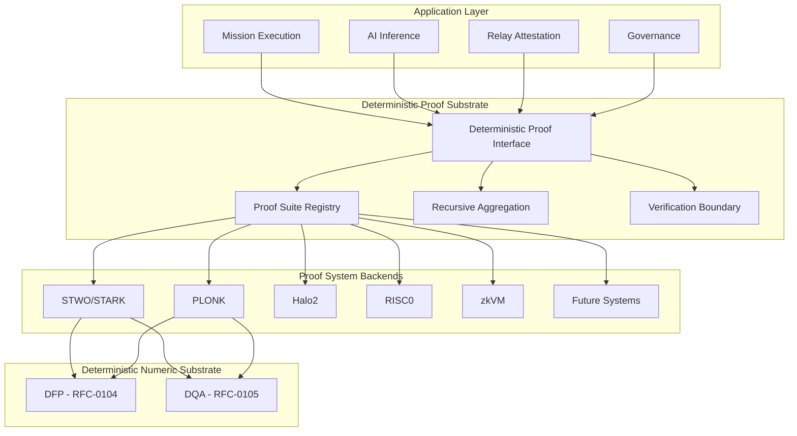

# RFC-0854: Deterministic Proof Substrate (DPS)

## Status

Draft

## Authors

- Author: @cipherocto

## Maintainers

- Maintainer: @cipherocto

## Summary

The Deterministic Proof Substrate (DPS) defines a proof-system-agnostic abstraction layer for zero-knowledge proof generation and verification within the CipherOcto overlay network. DPS is the equivalent of "libp2p for ZK proofs" — a canonical interface that allows multiple proving backends (STARK/STWO, PLONK, Halo2, RISC0, zkVM, and future systems) to coexist under a single deterministic verification boundary.

**Core invariant:** Consensus depends ONLY on deterministic proof verification semantics — NEVER on prover implementation details.

DPS provides:

- Proof-system-agnostic trait interface (`DeterministicProofSystem`)
- Multi-backend proof suite registry
- Deterministic proof verification boundary
- Mission-scoped verifier selection
- Recursive proof aggregation support
- Proof-carrying envelope integration (RFC-0850)
- DQA/DFP-safe witness generation substrate (RFC-0104, RFC-0105)
- Cryptographic agility for proof system migration

DPS extends RFC-0853 (OCrypt) by adding a deterministic proof layer above the cryptographic primitives, enabling verifiable AI inference, mission correctness proofs, relay attestations, and distributed execution verification across heterogeneous transport fabrics.

## Dependencies

**Requires:**

- RFC-0850 (Networking): Deterministic Overlay Transport — envelope transport
- RFC-0853 (Networking): Overlay Cryptography — cryptographic primitives
- RFC-0104 (Numeric): Deterministic Floating Point — ZK-safe arithmetic
- RFC-0105 (Numeric): Deterministic Quant Arithmetic — ZK-safe arithmetic

**Optional:**

- RFC-0630 (Proof Systems): Proof-of-Inference Consensus — AI inference proofs
- RFC-0650 (Proof Systems): Proof Aggregation Protocol — recursive aggregation
- RFC-0855 (Networking): Mission Overlay Networks — mission-scoped verifiers

## Design Goals

| Goal | Target | Metric |
|------|--------|--------|
| G1: Backend Agnosticism | 5+ proof systems | STARK, PLONK, Halo2, RISC0, zkVM |
| G2: Deterministic Verification | 100% consistency | Identical verification result across all implementations |
| G3: Consensus Isolation | Zero prover leakage | Prover details never affect consensus state |
| G4: Recursive Aggregation | O(log N) verification | Recursive proof composition |
| G5: Mission Scoping | Per-mission verifier | Different missions select different proof systems |
| G6: Verification Latency | <10ms | Single proof verification |
| G7: Cryptographic Agility | Algorithm migration | Proof system upgrade without protocol break |

## Motivation

### CAN WE? — Feasibility Research

The fundamental question: **Can we create a deterministic proof abstraction that supports multiple ZK proof systems without consensus fragmentation?**

Research confirms feasibility through:

- **ZKP ecosystem maturity** (see `docs/research/ZKP_Research_Report.md`): zk-SNARKs, zk-STARKs, PLONK, and Halo2 all provide well-defined verification interfaces
- **STARK transparency** (see `docs/research/ZKP_Research_Report.md` lines 159-166): STARKs avoid trusted setup, are naturally scalable for distributed proving, and are quantum-resistant
- **Cairo/STWO alignment** (see `docs/research/cairo-ai-research-report.md`): Cairo execution traces, AIR constraints, and SIMD-friendly proving align with CipherOcto's deterministic execution model
- **RFC-0630** already defines proof-of-inference consensus — DPS generalizes this to all proof types
- **RFC-0650** defines proof aggregation — DPS provides the substrate for aggregation backends
- **CipherOcto deterministic numerics** (RFC-0104 DFP, RFC-0105 DQA) provide ZK-safe arithmetic for witness generation

### WHY? — Why This Matters

Without DPS:

- CipherOcto is locked to a single proof system — cannot adapt as ZK technology evolves
- No verifiable AI inference — agents cannot prove correctness of computation
- No relay attestation — cannot prove correct forwarding behavior
- No mission execution verification — cannot cryptographically attest distributed computation
- Consensus fragmentation risk — each proof system reimplements verification differently

DPS creates a foundation where missions, AI swarms, relay behavior, economic coordination, distributed execution, and consensus transitions can all become cryptographically attestable — under a single deterministic substrate.

### Why STARK/STWO Is Particularly Interesting

STARK systems are highly compatible with CipherOcto:

| CipherOcto Property | STARK Compatibility | Rationale |
|---------------------|-------------------|-----------|
| Deterministic execution | Excellent | AIR constraints enforce determinism |
| Merkle-heavy state | Native | STARKs use Merkle trees intrinsically |
| Replay-safe proofs | Native | Hash-centric design |
| Hash-oriented pipelines | Native | BLAKE3/SHA-256 alignment |
| Massive distributed computation | Excellent | Parallel proving |
| Heterogeneous nodes | Excellent | No trusted setup requirement |
| Mission overlays | Excellent | Proof composition |
| AI/vector computation | Very promising | Execution trace verification |

However, DPS MUST NOT bind to STARK alone. The correct abstraction is:

```text
DPS
 └── Deterministic Proof Interface (DPI)
       ├── STWO/STARK backend
       ├── PLONK backend
       ├── Halo2 backend
       ├── RISC0 backend
       ├── zkVM backend
       └── Future systems
```

## Specification

### 1. System Architecture



### 2. Deterministic Proof Interface (DPI)

The DPI is the canonical proof interface that all proof systems must implement.

```rust
/// Core trait for all deterministic proof systems.
///
/// Implementations MUST ensure:
/// - prove() MAY be non-deterministic (prover freedom)
/// - verify() MUST be deterministic (consensus boundary)
/// - proof_commitment() MUST be deterministic
pub trait DeterministicProofSystem: Send + Sync {
    /// The proof type produced by this system
    type Proof: Clone + Send + Sync + AsRef<[u8]>;

    /// Verification key type
    type VerificationKey: Clone + Send + Sync;

    /// Public inputs type
    type PublicInputs: Clone + Send + Sync;

    /// Private witness type (prover-side only)
    type Witness: Send + Sync;

    /// System identifier
    fn system_id(&self) -> ProofSystemId;

    /// Generate a proof. MAY be non-deterministic.
    ///
    /// # Determinism Boundary
    /// This function is on the PROVER side of the determinism boundary.
    /// Different provers MAY produce different valid proofs for the same inputs.
    /// Consensus NEVER depends on which proof was produced — only that verification succeeds.
    fn prove(
        &self,
        witness: &Self::Witness,
        public_inputs: &Self::PublicInputs,
    ) -> Result<Self::Proof, ProofError>;

    /// Verify a proof. MUST be deterministic.
    ///
    /// # Determinism Boundary
    /// This function is on the CONSENSUS side of the determinism boundary.
    /// Given identical (vk, public_inputs, proof), ALL implementations MUST
    /// return identical results. No exceptions.
    fn verify(
        &self,
        vk: &Self::VerificationKey,
        public_inputs: &Self::PublicInputs,
        proof: &Self::Proof,
    ) -> Result<bool, ProofError>;

    /// Compute a deterministic commitment to a proof.
    ///
    /// Used for proof-carrying envelopes and Merkle commitments.
    /// MUST be deterministic: identical proof bytes → identical commitment.
    fn proof_commitment(
        &self,
        proof: &Self::Proof,
    ) -> [u8; 32];

    /// Serialize proof to canonical bytes (RFC-0126 DCS)
    fn serialize_proof(
        &self,
        proof: &Self::Proof,
    ) -> Result<Vec<u8>, ProofError>;

    /// Deserialize proof from canonical bytes
    fn deserialize_proof(
        &self,
        bytes: &[u8],
    ) -> Result<Self::Proof, ProofError>;

    /// Serialize verification key to canonical bytes
    fn serialize_vk(
        &self,
        vk: &Self::VerificationKey,
    ) -> Result<Vec<u8], ProofError>;

    /// Deserialize verification key from canonical bytes
    fn deserialize_vk(
        &self,
        bytes: &[u8],
    ) -> Result<Self::VerificationKey, ProofError>;
}
```

### 3. Proof System Registry

The registry maps proof system identifiers to implementations.

```rust
/// Unique identifier for a proof system
#[derive(Clone, Copy, Debug, PartialEq, Eq, Hash)]
#[repr(C)]
struct ProofSystemId {
    /// Proof system family (STARK=1, PLONK=2, Halo2=3, RISC0=4, zkVM=5)
    family: u16,
    /// Version within family
    version: u16,
    /// Field identifier (BN254=1, BLS12-381=2, Goldilocks=3, Mersenne31=4)
    field_id: u16,
    /// Hash function (SHA256=1, BLAKE3=2, Poseidon=3, Keccak=4)
    hash_id: u16,
}

/// Proof execution model — determines how proofs are structured
#[derive(Clone, Copy, Debug, PartialEq, Eq)]
#[repr(u16)]
enum ProofExecutionModel {
    /// Algebraic Intermediate Representation (STARK)
    AIR = 0x0001,
    /// Rank-1 Constraint System (Groth16, SNARK)
    R1CS = 0x0002,
    /// PLONKish arithmetization (PLONK, Halo2)
    PLONKISH = 0x0003,
    /// zkVM execution trace (RISC0, SP1)
    ZKVM = 0x0004,
    /// Recursive composition
    RECURSIVE = 0x0005,
}

/// Proof suite — complete specification of a proof system configuration
#[derive(Clone, Debug)]
struct ProofSuiteId {
    /// Proof system identifier
    proof_system: ProofSystemId,
    /// Execution model
    execution_model: ProofExecutionModel,
    /// Recursion scheme (None, Linear, Tree, Accumulator)
    recursion_scheme: RecursionScheme,
    /// Security parameter (bits)
    security_bits: u32,
}

#[derive(Clone, Copy, Debug, PartialEq, Eq)]
#[repr(u16)]
enum RecursionScheme {
    /// No recursion
    None = 0x0000,
    /// Linear recursion (chain)
    Linear = 0x0001,
    /// Tree recursion (binary)
    Tree = 0x0002,
    /// Accumulator-based (Nova/Sangria style)
    Accumulator = 0x0003,
}
```

### 4. Canonical Proof Boundary

This is the most critical section.

#### 4.1 Consensus MUST NOT Depend On

The following are explicitly forbidden from affecting consensus state:

- Prover runtime environment
- Hardware acceleration (GPU, FPGA, ASIC)
- Proving time or latency
- Memory layout or allocation patterns
- Parallel execution order
- Witness generation order
- Prover-specific optimizations
- Random prover nonces (verification must succeed regardless of nonce)

#### 4.2 Consensus MAY Depend On

The following are the ONLY consensus-relevant proof artifacts:

```text
(public_inputs, verification_key, proof_bytes, verification_result)
```

Where:
- `public_inputs`: Canonical byte representation (RFC-0126 DCS)
- `verification_key`: Canonical byte representation
- `proof_bytes`: Canonical byte representation
- `verification_result`: Boolean — deterministic output of verify()

#### 4.3 Proof Equivalence

Two proofs are consensus-equivalent if and only if:

```text
verify(vk, public_inputs, proof_a) == verify(vk, public_inputs, proof_b)
```

The actual proof bytes MAY differ. Only the verification result matters.

### 5. Deterministic Witness Model

Small numeric divergence can completely invalidate ZK proofs:

```text
0.30000000001 vs 0.29999999998 → proof invalid
```

CipherOcto's deterministic numeric stack (RFC-0104 DFP, RFC-0105 DQA) is therefore strategically critical for witness generation.

#### 5.1 DQA as ZK-Safe Arithmetic Substrate

DQA properties map directly to AIR benefits:

| DQA Property | AIR Benefit | Rationale |
|-------------|-------------|-----------|
| Integer core | Native field arithmetic | Maps directly to prime field elements |
| Fixed scale | Constraint simplification | No floating-point range checks needed |
| Canonicalization | Stable witness generation | Identical inputs → identical witnesses |
| Deterministic rounding | Reproducible traces | No rounding mode ambiguity |
| Bounded ranges | Lower proving cost | Smaller range proof circuits |

#### 5.2 Witness Generation Rules

All witness generation for consensus-critical proofs MUST:

1. Use DQA/DFP arithmetic (never raw floating-point)
2. Use RFC-0126 DCS for all intermediate serialization
3. Be reproducible from public inputs alone (no prover-specific state)
4. Use deterministic randomness: `HKDF(seed || context || epoch)`

### 6. Proof-Carrying Envelopes

DPS integrates with RFC-0850 (DOT) via proof-carrying envelopes.

```rust
/// An envelope that carries a cryptographic proof
#[derive(Clone, Debug)]
#[repr(C)]
struct ProofCarryingEnvelope {
    /// Base deterministic envelope (RFC-0850)
    envelope: DeterministicEnvelope,

    /// Which proof system was used
    proof_system_id: ProofSystemId,

    /// Commitment to the proof (for Merkle inclusion)
    proof_commitment: [u8; 32],

    /// Merkle root of public inputs
    public_input_root: [u8; 32],

    /// Serialized proof bytes
    proof_blob: Vec<u8>,
}
```

**Verification Protocol:**

1. Validate base envelope (RFC-0850 signature, replay check)
2. Look up proof system from `proof_system_id` in registry
3. Deserialize `proof_blob` using the proof system's `deserialize_proof()`
4. Deserialize public inputs from `public_input_root`
5. Call `verify(vk, public_inputs, proof)` — MUST be deterministic
6. If verification fails, reject the envelope

**Use Cases:**

| Proof Type | Description | Example |
|-----------|-------------|---------|
| AI Inference Proof | Prove correct model execution | "This LLM produced this output from this input" |
| Mission Execution Proof | Prove correct task completion | "10 agents completed this distributed computation" |
| Relay Proof | Prove correct forwarding | "This envelope was relayed through these gateways" |
| Validator Proof | Prove consensus participation | "This node validated this block" |
| Availability Proof | Prove data availability | "This data is stored and retrievable" |
| Aggregation Proof | Recursive composition | "These 1000 proofs are all valid" |

### 7. Recursive Proof Aggregation

DPS supports recursive proof composition for scalability.

#### 7.1 Aggregation Model

```rust
/// Recursive aggregation trait
pub trait ProofAggregator: Send + Sync {
    /// The inner proof system being aggregated
    type InnerProof: Clone + Send + Sync;
    /// The aggregated proof type
    type AggregatedProof: Clone + Send + Sync + AsRef<[u8]>;

    /// Aggregate multiple proofs into a single proof
    ///
    /// # Determinism Boundary
    /// Aggregation MAY be non-deterministic (different aggregation paths).
    /// Verification of the aggregated proof MUST be deterministic.
    fn aggregate(
        &self,
        proofs: &[Self::InnerProof],
        public_inputs: &[Vec<u8>],
    ) -> Result<Self::AggregatedProof, ProofError>;

    /// Verify an aggregated proof
    ///
    /// MUST be deterministic. MUST succeed regardless of aggregation path.
    fn verify_aggregated(
        &self,
        proof: &Self::AggregatedProof,
        public_input_roots: &[[u8; 32]],
    ) -> Result<bool, ProofError>;
}
```

#### 7.2 Hierarchical Aggregation

Large overlays MAY recursively aggregate proofs:

```text
Level 0: Individual gateway proofs (1000 proofs)
Level 1: Regional aggregation (100 proofs, 10 gateways each)
Level 2: Continental aggregation (10 proofs, 10 regions each)
Level 3: Global overlay proof (1 proof, 10 continents)
```

Verification cost: O(log N) instead of O(N).

#### 7.3 Aggregation Properties

| Property | Requirement |
|----------|-------------|
| Soundness | Aggregated proof is valid iff ALL inner proofs are valid |
| Completeness | Valid inner proofs always produce a valid aggregated proof |
| Determinism | Verification is deterministic regardless of aggregation path |
| Succinctness | Aggregated proof size is sublinear in number of inner proofs |

### 8. Mission-Scoped Verifiers

Different missions MAY require different proof systems.

```rust
/// Mission verifier configuration
#[derive(Clone, Debug)]
struct MissionVerifierConfig {
    /// Mission identifier
    mission_id: [u8; 32],
    /// Required proof suite
    proof_suite: ProofSuiteId,
    /// Verification key (mission-specific)
    verification_key: Vec<u8>,
    /// Whether aggregation is required
    require_aggregation: bool,
    /// Maximum proof age (in epochs)
    max_proof_age: u64,
}
```

**Recommended Proof Systems by Mission Type:**

| Mission Type | Recommended System | Rationale |
|-------------|-------------------|-----------|
| AI Inference | STARK/STWO | Execution traces, parallelism |
| Financial Privacy | PLONK | Small proof size, fast verification |
| Embedded Edge | zkVM | General-purpose, hardware-agnostic |
| Massive Aggregation | Recursive STARK | Logarithmic verification |
| Browser Verification | SNARK | Small proof, fast verify |
| Relay Attestation | STARK | Transparency, no trusted setup |
| Governance | PLONK/Halo2 | Flexibility |

### 9. Backends

#### 9.1 STWO/STARK Backend

```rust
struct StarkBackend {
    system_id: ProofSystemId,
    // StarkWare STWO configuration
    field: StarkField,
    hash: HashFunction,
    security_bits: u32,
}

impl DeterministicProofSystem for StarkBackend {
    type Proof = StarkProof;
    type VerificationKey = StarkVerificationKey;
    type PublicInputs = StarkPublicInputs;
    type Witness = StarkWitness;

    fn system_id(&self) -> ProofSystemId {
        self.system_id
    }

    // prove() — uses STWO prover, MAY be non-deterministic
    // verify() — uses STWO verifier, MUST be deterministic
    // proof_commitment() — SHA-256 of serialized proof
}
```

#### 9.2 PLONK Backend

```rust
struct PlonkBackend {
    system_id: ProofSystemId,
    // PLONK configuration
    curve: CurveId,
    hash: HashFunction,
    security_bits: u32,
}

impl DeterministicProofSystem for PlonkBackend {
    type Proof = PlonkProof;
    type VerificationKey = PlonkVerificationKey;
    type PublicInputs = PlonkPublicInputs;
    type Witness = PlonkWitness;

    // Standard DPI implementation
}
```

#### 9.3 zkVM Backend

```rust
struct ZkVmBackend {
    system_id: ProofSystemId,
    // zkVM configuration (RISC0, SP1, etc.)
    vm_type: ZkVmType,
    hash: HashFunction,
    security_bits: u32,
}

#[derive(Clone, Copy, Debug, PartialEq, Eq)]
#[repr(u16)]
enum ZkVmType {
    Risc0 = 0x0001,
    Sp1 = 0x0002,
    Custom = 0xFFFF,
}
```

### 10. Error Handling

```rust
#[derive(Clone, Debug, PartialEq, Eq)]
#[repr(u16)]
enum ProofError {
    /// Proof verification failed
    VerificationFailed = 0x0001,
    /// Invalid proof format
    InvalidProofFormat = 0x0002,
    /// Invalid verification key
    InvalidVerificationKey = 0x0003,
    /// Invalid public inputs
    InvalidPublicInputs = 0x0004,
    /// Proof system not supported
    UnsupportedProofSystem = 0x0005,
    /// Serialization error
    SerializationError = 0x0006,
    /// Proof expired
    ProofExpired = 0x0007,
    /// Proof too large
    ProofTooLarge = 0x0008,
    /// Witness generation failed
    WitnessGenerationFailed = 0x0009,
    /// Aggregation failed
    AggregationFailed = 0x000A,
}
```

### 11. Token Economics Integration

DPS integrates with CipherOcto's multi-token economy:

| Activity | Token | Rationale |
|----------|-------|-----------|
| Proof generation | OCTO-A | Compute-intensive (GPU) |
| Proof verification | OCTO-N | Node operation |
| Proof relay | OCTO-B | Bandwidth for proof propagation |
| Proof aggregation | OCTO-O | Orchestration of composition |
| Proof archival | OCTO-S | Long-term proof storage |

**Proof Markets:**

Future DPS extensions MAY support proof markets where:

- Provers offer proof generation services for OCTO-A
- Verifiers pay for verification (typically subsidized by protocol)
- Aggregators earn for composing recursive proofs
- Mission operators pay for proof-carrying envelope generation

## Performance Targets

| Metric | Target | Measurement |
|--------|--------|-------------|
| STARK verification | <10ms | Single proof, 128-bit security |
| PLONK verification | <5ms | Single proof, 128-bit security |
| SNARK verification | <2ms | Single proof, 128-bit security |
| Proof serialization | <1ms | 1KB proof |
| Proof commitment | <0.1ms | SHA-256 hash |
| Recursive aggregation (100 proofs) | <5s | STARK aggregation |
| Aggregated verification | <20ms | Log N verification |
| DQA witness generation | <100ms | 1000-element computation |
| Registry lookup | <1µs | HashMap lookup |

## Security Considerations

### Consensus Attacks

| Attack | Impact | Mitigation |
|--------|--------|------------|
| Invalid proof acceptance | Critical | Deterministic verification at every node |
| Verification divergence | Critical | Canonical proof boundary enforced |
| Prover manipulation | High | Consensus independent of prover details |
| Proof replay | High | Epoch-scoped proof validity |

### Economic Exploits

| Attack | Impact | Mitigation |
|--------|--------|------------|
| Proof spam | Medium | Economic friction via OCTO-A cost |
| Free verification riding | Low | Protocol-subsidized verification |
| Aggregator monopoly | Medium | Multiple aggregation backends |

### Cryptographic Attacks

| Attack | Impact | Mitigation |
|--------|--------|------------|
| Trusted setup compromise | High | Prefer transparent proofs (STARK) |
| Proof forgery | Critical | Soundness guarantees per proof system |
| Hash collision | High | BLAKE3-256 minimum |
| Quantum attacks | Medium | Post-quantum migration path via agility |

### Determinism Violations

| Attack | Impact | Mitigation |
|--------|--------|------------|
| Floating-point in witness | Critical | DQA/DFP mandatory |
| Non-deterministic serialization | Critical | RFC-0126 DCS mandatory |
| Prover-specific state leakage | High | Witness generation from public inputs only |
| Hardware-dependent results | Critical | Software-only verification boundary |

## Adversarial Review

| Threat | Impact | Mitigation | Verification |
|--------|--------|------------|--------------|
| Proof system backdoor | Critical | Transparent proofs preferred | Audit proof system implementations |
| Verification key tampering | Critical | Merkle commitment to VK | VK integrity test |
| Consensus divergence from proof | Critical | Deterministic boundary enforcement | Cross-implementation verification test |
| Witness malleability | High | DQA canonicalization | Witness determinism test |
| Recursive proof soundness | Critical | Formal verification of aggregation | Aggregation soundness test |
| Proof expiration bypass | Medium | Epoch validation | Expiration enforcement test |

## Economic Analysis

### Market Dynamics

DPS creates a market for proof generation and verification:

- **Supply:** GPU operators generating proofs (OCTO-A earners)
- **Demand:** Missions requiring verifiable computation
- **Price:** OCTO-A per proof, varying by complexity and proof system

### Cost Structure

| Operation | Relative Cost | Dominant Factor |
|-----------|--------------|-----------------|
| STARK proving | 100x | CPU/GPU time |
| PLONK proving | 50x | CPU time + trusted setup |
| SNARK proving | 30x | CPU time |
| Verification (any) | 1x | Constant |
| Aggregation | 10x | Recursive composition |
| Witness generation | 5x | DQA arithmetic |

### Gateway Economics

A proof gateway earning model:

```text
Revenue = (proofs_generated × OCTO_A_per_proof)
        + (proofs_verified × protocol_subsidy)
        + (aggregations × OCTO_O_per_aggregation)

Costs = (GPU_compute_time)
      + (electricity)
      + (stake_opportunity_cost)
```

## Compatibility

### Backward Compatibility

- DPS v1 is the initial version — no backward compatibility concerns
- Future versions MUST use `ProofSystemId.version` for versioning
- Nodes MUST reject proofs from unsupported proof system versions

### Forward Compatibility

- `ProofSystemId` is extensible (new families, fields, hash functions)
- `ProofExecutionModel` enum is extensible (0x0006-0xFFFF for future models)
- `RecursionScheme` enum is extensible
- New backends can be registered without protocol changes

### Integration with Existing RFCs

| RFC | Integration Point |
|-----|-------------------|
| RFC-0630 | Proof-of-Inference uses DPS for AI inference proofs |
| RFC-0650 | Proof Aggregation uses DPS recursive aggregation |
| RFC-0850 | Proof-Carrying Envelopes embed DPS proofs in DOT envelopes |
| RFC-0853 | OCrypt provides signature primitives for proof commitments |
| RFC-0104/0105 | DFP/DQA provide ZK-safe witness arithmetic |

## Test Vectors

### Proof System ID Serialization

```text
Input:
  family = 1 (STARK)
  version = 1
  field_id = 3 (Goldilocks)
  hash_id = 2 (BLAKE3)

Expected canonical bytes (hex):
  0001 0001 0003 0002
```

### Proof Commitment

```text
Input:
  proof_bytes = [0xAA; 128]

Expected commitment:
  SHA-256(0xAA * 128) = [computed hash]
```

### Verification Boundary

```text
Given:
  vk = [0x01; 32]
  public_inputs = [0x02; 64]
  proof_a = [0xAA; 128]  (generated by prover A)
  proof_b = [0xBB; 128]  (generated by prover B)

Invariant:
  verify(vk, public_inputs, proof_a) MUST equal verify(vk, public_inputs, proof_b)
  if both proofs are valid for the same public inputs.
```

## Alternatives Considered

| Approach | Pros | Cons | Decision |
|----------|------|------|----------|
| STARK-only (bind to STWO) | Simple, proven | No agility, no PLONK/SNARK support | Too narrow |
| SNARK-only (bind to Groth16) | Small proofs | Trusted setup, not quantum-safe | Too risky |
| Per-RPC proof system | Maximum flexibility | Consensus fragmentation risk | Too dangerous |
| No proof layer | Simple | No verifiable computation | Misses core value |
| Hardcoded multi-system | Supports many | Cannot add new systems | Not extensible |

**Decision:** DPS provides a trait-based abstraction that is proof-system-agnostic while enforcing a deterministic verification boundary.

## Implementation Phases

### Phase 1: Core Interface and STARK Backend (Months 1-4)

**Goal:** DPI trait, STARK/STWO backend, basic verification.

| Task | Description | RFC Dependency |
|------|-------------|----------------|
| 1.1 | Define `DeterministicProofSystem` trait | — |
| 1.2 | Define `ProofSystemId`, `ProofSuiteId`, `ProofExecutionModel` | — |
| 1.3 | Implement `ProofError` error types | — |
| 1.4 | Implement STWO/STARK backend | — |
| 1.5 | Implement proof serialization (RFC-0126 DCS) | RFC-0126 |
| 1.6 | Implement proof commitment (SHA-256) | — |
| 1.7 | Implement proof system registry | — |
| 1.8 | Write unit tests for STARK verify determinism | — |
| 1.9 | Write cross-implementation verification tests | — |

**Deliverables:** DPI trait, STARK backend, registry, test suite.

### Phase 2: Additional Backends and DQA Integration (Months 4-8)

**Goal:** PLONK, zkVM backends, DQA witness generation.

| Task | Description | RFC Dependency |
|------|-------------|----------------|
| 2.1 | Implement PLONK backend | — |
| 2.2 | Implement zkVM backend (RISC0) | — |
| 2.3 | Implement DQA-based witness generation | RFC-0105 |
| 2.4 | Implement DFP-based witness validation | RFC-0104 |
| 2.5 | Implement deterministic randomness derivation | — |
| 2.6 | Write backend equivalence tests | — |
| 2.7 | Write DQA witness determinism tests | — |

**Deliverables:** PLONK + zkVM backends, DQA integration, equivalence tests.

### Phase 3: Proof-Carrying Envelopes and Aggregation (Months 8-12)

**Goal:** DOT integration, recursive aggregation.

| Task | Description | RFC Dependency |
|------|-------------|----------------|
| 3.1 | Implement `ProofCarryingEnvelope` | RFC-0850 |
| 3.2 | Implement `ProofAggregator` trait | RFC-0650 |
| 3.3 | Implement STARK recursive aggregation | — |
| 3.4 | Implement `MissionVerifierConfig` | RFC-0855 |
| 3.5 | Implement proof expiration validation | — |
| 3.6 | Write aggregation soundness tests | — |
| 3.7 | Write envelope round-trip tests | — |

**Deliverables:** Envelope integration, aggregation, mission verifiers.

### Phase 4: Proof Markets and Advanced Features (Months 12-16)

**Goal:** Economic integration, proof markets, Halo2 backend.

| Task | Description | RFC Dependency |
|------|-------------|----------------|
| 4.1 | Implement Halo2 backend | — |
| 4.2 | Implement proof generation marketplace | — |
| 4.3 | Implement OCTO-A proof pricing | — |
| 4.4 | Implement proof-of-relay integration | RFC-0860 |
| 4.5 | Implement proof archival | — |
| 4.6 | Write adversarial test suite | — |
| 4.7 | Write performance benchmarks | — |

**Deliverables:** Halo2, proof markets, economics, adversarial tests.

## Key Files to Modify

| File | Change |
|------|--------|
| `crates/octo-prover/src/lib.rs` | New DPS crate |
| `crates/octo-prover/src/dpi.rs` | DeterministicProofSystem trait |
| `crates/octo-prover/src/registry.rs` | Proof system registry |
| `crates/octo-prover/src/error.rs` | ProofError types |
| `crates/octo-prover/src/types.rs` | ProofSystemId, ProofSuiteId, etc. |
| `crates/octo-prover/src/backends/mod.rs` | Backend module |
| `crates/octo-prover/src/backends/stark.rs` | STWO/STARK backend |
| `crates/octo-prover/src/backends/plonk.rs` | PLONK backend |
| `crates/octo-prover/src/backends/zkvm.rs` | zkVM backend |
| `crates/octo-prover/src/backends/halo2.rs` | Halo2 backend |
| `crates/octo-prover/src/witness.rs` | DQA-based witness generation |
| `crates/octo-prover/src/envelope.rs` | ProofCarryingEnvelope |
| `crates/octo-prover/src/aggregation.rs` | ProofAggregator |
| `crates/octo-prover/src/mission.rs` | MissionVerifierConfig |
| `crates/octo-network/src/dot/envelope.rs` | Extend with proof fields |

## Future Work

- F1: Halo2 backend implementation
- F2: Custom proof system registration API
- F3: Proof compression (proof size optimization)
- F4: GPU-accelerated proving (CUDA, Metal)
- F5: Distributed proving (split witness generation)
- F6: Proof caching and deduplication
- F7: Cross-chain proof verification bridges
- F8: Formal verification of proof boundary invariants
- F9: Proof system migration protocol (version upgrades)
- F10: Privacy-preserving proof aggregation (zero-knowledge aggregation)

## Rationale

### Why proof-system-agnostic instead of STARK-only?

ZK technology evolves rapidly. Binding to one system:

1. Prevents adoption of better systems as they emerge
2. Limits mission flexibility (different missions need different trade-offs)
3. Creates single point of failure in proving infrastructure

The DPI trait allows any proof system to participate while maintaining a deterministic verification boundary.

### Why deterministic verification is non-negotiable

If verification is non-deterministic:

1. Consensus breaks when nodes disagree on proof validity
2. Block production becomes non-deterministic
3. Economic settlement based on proofs becomes unreliable

The canonical proof boundary ensures all nodes reach identical verification conclusions.

### Why DQA/DFP for witness generation

Raw floating-point in witness generation:

1. Produces different witnesses on different hardware
2. Invalidates proofs due to rounding differences
3. Makes proof generation non-reproducible

DQA's integer-core, fixed-scale arithmetic eliminates these risks entirely.

## Version History

| Version | Date | Changes |
|---------|------|---------|
| 1.0.0 | 2026-05-25 | Initial draft — DPI trait, STARK/PLONK/zkVM backends, phases |

## Related RFCs

- RFC-0850 (Networking): Deterministic Overlay Transport — envelope transport
- RFC-0853 (Networking): Overlay Cryptography — cryptographic primitives
- RFC-0855 (Networking): Mission Overlay Networks — mission-scoped verifiers
- RFC-0859 (Networking): Proof-Carrying Envelopes — envelope integration
- RFC-0860 (Networking): Proof-of-Relay — relay attestation
- RFC-0630 (Proof Systems): Proof-of-Inference Consensus — AI inference proofs
- RFC-0650 (Proof Systems): Proof Aggregation Protocol — recursive aggregation
- RFC-0104 (Numeric): Deterministic Floating Point — ZK-safe arithmetic
- RFC-0105 (Numeric): Deterministic Quant Arithmetic — ZK-safe arithmetic

## Related Use Cases

- [Verifiable AI Agents in DeFi](../../docs/use-cases/verifiable-ai-agents-defi.md)
- [Verifiable Reasoning Traces](../../docs/use-cases/verifiable-reasoning-traces.md)
- [Probabilistic Verification Markets](../../docs/use-cases/probabilistic-verification-markets.md)
- [Verifiable Quality of Service](../../docs/use-cases/provable-quality-of-service.md)
- [Hybrid AI-Blockchain Runtime](../../docs/use-cases/hybrid-ai-blockchain-runtime.md)
