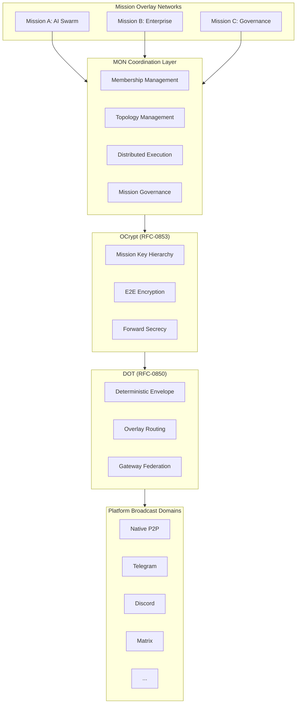
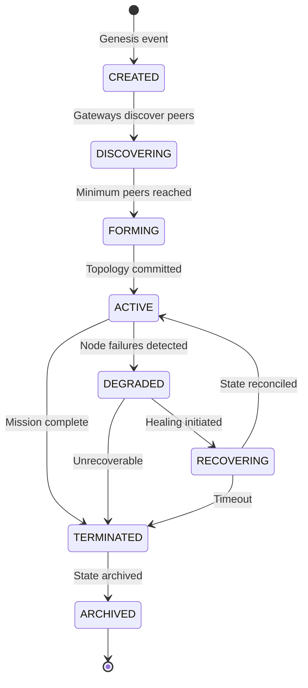

# RFC-0855: Mission Overlay Networks (MON)

## Status

Draft

## Authors

- Author: @cipherocto

## Maintainers

- Maintainer: @cipherocto

## Summary

Mission Overlay Networks (MON) define temporary or persistent sovereign overlay topologies constructed dynamically for coordinated distributed activity within the CipherOcto ecosystem.

> **Terminology Disambiguation:** This RFC uses "Mission" to mean a runtime overlay network coordination construct, distinct from BLUEPRINT "Missions" which are implementation work items (e.g., `missions/open/0909-d-replay-events.md`) with lifecycle `Open → Claimed → With-PR → Archived`. MON missions are runtime coordination events; BLUEPRINT missions are governance/development tasks. They are orthogonal — a BLUEPRINT mission MAY trigger creation of a MON mission, and a MON mission MAY reference a BLUEPRINT mission, but they share no lifecycle or infrastructure.

A MON represents:

- A mission-scoped overlay civilization
- A cryptographically isolated coordination mesh
- A deterministic execution environment
- A distributed AI/compute swarm
- A transport-independent operational topology

MONs are the primary orchestration primitive for AI swarms, distributed execution, decentralized coordination, federated automation, sovereign enterprise fabrics, tactical communication overlays, and proof-carrying distributed computation.

MONs build on DOT (RFC-0850) for transport, GDP (RFC-0851) for gateway discovery, DGP (RFC-0852) for gossip propagation, and OCrypt (RFC-0853) for cryptographic isolation.

## Dependencies

**Requires:**

- RFC-0850 (Networking): DOT — overlay transport primitives, DeterministicEnvelope
- RFC-0851 (Networking): GDP — gateway discovery and capability advertisement
- RFC-0852 (Networking): DGP — deterministic gossip propagation
- RFC-0853 (Networking): OCrypt — mission-scoped encryption, key hierarchy

**Optional:**

- RFC-0854 (Networking): DPS — proof-carrying mission execution
- RFC-0856 (Networking): DRS — deterministic route selection for mission routing
- RFC-0859 (Networking): PCE — proof-carrying envelopes (future)
- RFC-0008 (Process): Deterministic AI Execution Boundary — execution classes
- RFC-0009 (Process): Identity Management — peer identity model

## Design Goals

| Goal | Target | Metric |
|------|--------|--------|
| G1: Mission Isolation | Zero cross-mission leakage | Mission A traffic never visible to Mission B |
| G2: Deterministic Coordination | 100% replay consistency | Identical mission state from identical inputs |
| G3: Dynamic Federation | <30s formation time | From mission creation to active overlay |
| G4: Elastic Membership | 2-10,000 nodes per mission | Sublinear overhead scaling |
| G5: Multi-Transport Operation | 3+ simultaneous carriers | Transparent carrier migration |
| G6: Partition Survival | Autonomous recovery | Mission continues during network splits |
| G7: Byzantine Resilience | Tolerate f < n/3 malicious nodes | Mission continues with honest majority |
| G8: AI-Native Coordination | <100ms inference dispatch | Swarm task distribution latency |

## Motivation

### CAN WE? — Feasibility Research

The fundamental question: **Can we create cryptographically isolated, dynamically formed overlay networks for coordinated distributed activity across heterogeneous transports?**

Research confirms feasibility through:

- **OpenClaw** demonstrates channel federation with isolated contexts per group (see `docs/research/openclaw-architecture.md`)
- **IronClaw** provides WASM-based runtime isolation for execution environments (see `docs/research/ironclaw-architecture.md`)
- **Hermes** implements platform adapters enabling cross-platform coordination (see `docs/research/hermes-agent-architecture.md`)
- **RFC-0850** provides deterministic overlay transport with platform-agnostic envelope propagation
- **RFC-0853** provides mission-scoped cryptographic isolation via key hierarchies

### WHY? — Why This Matters

Without MONs:

- No cryptographically isolated coordination — all overlay traffic shares a single namespace
- No dynamic topology formation — must pre-configure all participants
- No AI swarm coordination — no primitive for distributed inference
- No mission-scoped economics — cannot tie economic incentives to specific missions
- No partition-resilient coordination — single point of failure in routing

MONs enable CipherOcto nodes to autonomously form AI swarms, compute clusters, censorship-resistant coordination meshes, temporary mission civilizations, decentralized enterprise fabrics, and sovereign machine economies.

### Relationship to RFC-0850

RFC-0850 defines the transport layer (envelopes, gateways, platform adapters). MONs define the coordination layer above transport — they consume DOT envelopes and add mission-scoped isolation, membership, topology, execution, and governance.

### Relationship to BLUEPRINT Missions (MON-H5 fix)

CipherOcto has two distinct "mission" concepts:

| Aspect | BLUEPRINT Mission | MON Mission |
|--------|-------------------|-------------|
| Definition | Implementation work item | Runtime overlay network |
| Lifecycle | Open → Claimed → With-PR → Archived | Created → Discovering → Forming → Active → ... |
| Duration | Days to weeks | Minutes to months |
| Participants | Developer + reviewer | 2-10,000 nodes |
| Purpose | Ship code/fixes | Coordinate distributed activity |
| Location | `missions/open/`, `missions/archived/` | Runtime state (no static files) |

**Interaction:** A BLUEPRINT mission MAY trigger creation of a MON mission (e.g., "test the new networking code across 10 nodes"). A MON mission MAY reference a BLUEPRINT mission in its descriptor metadata. They share no lifecycle, no state, and no infrastructure.

## Specification

### 1. System Architecture



### 2. Mission Identity

#### 2.1 Mission Identifier

Every MON possesses a globally unique mission identity.

```rust
#[derive(Clone, Copy, Debug, PartialEq, Eq, Hash)]
#[repr(C)]
struct MissionId {
    /// Network identifier
    network_id: u32,
    /// BLAKE3-256 of mission genesis material (creator + creation_epoch + nonce)
    mission_hash: [u8; 32],
    /// Protocol version
    version: u16,
}
```

**Derivation:**

```text
mission_hash = BLAKE3-256(
    creator_peer_id: [u8; 32] ||
    creation_epoch: u64 (8 bytes, big-endian) ||
    genesis_nonce: [u8; 32]
)
```

**Determinism Requirement:** `mission_hash` MUST be derived deterministically from genesis material. Given identical genesis inputs, all nodes MUST compute identical `MissionId`.

#### 2.2 Mission Descriptor

```rust
#[derive(Clone, Debug)]
#[repr(C)]
struct MissionDescriptor {
    /// Unique mission identifier
    mission_id: MissionId,
    /// Descriptor version for optimistic concurrency
    descriptor_version: u64,
    /// Mission type (see Section 2.3)
    mission_type: u16,
    /// Epoch when mission was created
    creation_epoch: u64,
    /// Governance model (see Section 11)
    governance_model: u16,
    /// Cryptographic suite identifier (per RFC-0853)
    cryptographic_suite: u16,
    /// Merkle root of mission genesis state
    mission_root: [u8; 32],
    /// Maximum number of participants (0 = unlimited)
    max_participants: u32,
    /// Minimum participants for mission formation (MON-C3 fix)
    min_participants: u32,
    /// Mission TTL in epochs (0 = permanent)
    ttl_epochs: u64,
    /// Mission flags (bitmask)
    flags: u64,
}
```

**Canonical Serialization Order (MON-M6 fix):** Fields MUST be serialized in declaration order using RFC-0126 DCS: `mission_id, mission_type, creation_epoch, governance_model, cryptographic_suite, mission_root, max_participants, min_participants, ttl_epochs, flags`. Multi-byte integers are big-endian.

#### 2.3 Mission Types

```rust
#[repr(u16)]
enum MissionType {
    /// AI inference swarm
    AiSwarm = 0x0001,
    /// Distributed compute cluster
    ComputeCluster = 0x0002,
    /// Enterprise coordination
    Enterprise = 0x0003,
    /// Governance/DAO coordination
    Governance = 0x0004,
    /// Tactical communication
    Tactical = 0x0005,
    /// Research collaboration
    Research = 0x0006,
    /// Proof generation swarm
    ProofSwarm = 0x0007,
    /// Data federation
    DataFederation = 0x0008,
    /// Custom
    Custom = 0xFFFF,
}
```

### 3. Mission Lifecycle



#### 3.1 Lifecycle States

```rust
#[repr(u16)]
enum MissionState {
    /// Mission created, awaiting participants
    Created = 0x0001,
    /// Discovering gateways and peers via GDP
    Discovering = 0x0002,
    /// Minimum participants reached, forming topology
    Forming = 0x0003,
    /// Mission operational
    Active = 0x0004,
    /// Degraded due to node failures
    Degraded = 0x0005,
    /// Healing from partition or failure
    Recovering = 0x0006,
    /// Mission completed or terminated
    Terminated = 0x0007,
    /// State archived for replay
    Archived = 0x0008,
}
```

#### 3.2 State Transitions

| From | To | Trigger | Deterministic? |
|------|----|---------|----------------|
| Created | Discovering | Gateway broadcasts mission advertisement | Yes |
| Discovering | Forming | `active_participants >= min_participants` | Yes |
| Forming | Active | Topology Merkle root committed | Yes |
| Active | Degraded | `failed_participants > tolerance_threshold` | Yes |
| Degraded | Recovering | Reconciliation protocol initiated | Yes |
| Recovering | Active | State convergence verified | Yes |
| Active | Terminated | Mission completion or governance decision | Yes |
| Active | Terminated | TTL expiry (`current_epoch >= creation_epoch + ttl_epochs`) | Yes (automatic) |
| Degraded | Terminated | Unrecoverable failure or TTL expiry | Yes |
| Terminated | Archived | State snapshot committed | Yes |

**Determinism Requirement:** All state transitions MUST be deterministic given identical mission state. Transition triggers MUST NOT depend on wall-clock timing, local heuristics, or non-deterministic inputs.

**Note on PAUSED State:** MON does not support a PAUSED state. Missions that experience participant failures transition to Degraded, not Paused. This is by design: pausing would require non-deterministic human intervention to resume, violating the determinism requirement. Missions degrade gracefully and recover automatically when participants return.

**State Consensus Mechanism (MON-C4 fix):**

State transitions require participant consensus to prevent split-brain scenarios:

| Transition | Trigger | Consensus Requirement |
|-----------|---------|----------------------|
| Active → Degraded | `failed_participants > tolerance_threshold` where `tolerance_threshold = floor(active_participants / 3)` | Automatic (deterministic heartbeat check) |
| Degraded → Recovering | Coordinator proposes reconciliation | Coordinator approval (no vote needed) |
| Recovering → Active | State convergence verified via Merkle roots | 2/3 majority vote on convergence proof |
| Forming → Active | Topology Merkle root committed | Automatic (deterministic topology verification) |
| Any → Terminated | Mission completion or TTL expiry | Coordinator proposal + 2/3 majority vote |

**Heartbeat Protocol:**

- Each participant broadcasts heartbeat every `heartbeat_interval` epochs (network-configured, default: 10)
- A participant is considered failed after `missed_heartbeats` consecutive misses (default: 3)
- Heartbeat failures are deterministic: given identical heartbeat history, all nodes agree on which participants are failed
- The `tolerance_threshold` is computed as `floor(active_participants / 3)` — mission degrades when more than 1/3 of participants fail

#### 3.3 Mission Genesis

Mission creation MAY originate from:

| Source | Example | Genesis Material |
|--------|---------|-----------------|
| Human operator | User-created overlay | `creator_peer_id + epoch + nonce` |
| Smart contract | Autonomous deployment | `contract_address + deployment_tx + epoch` |
| AI coordinator | Self-organizing swarm | `coordinator_id + epoch + swarm_seed` |
| Governance proposal | DAO mission | `proposal_id + approval_epoch + nonce` |
| External trigger | Sensor/event response | `trigger_hash + epoch + nonce` |

### 4. Mission Membership

#### 4.1 Mission Node

```rust
#[derive(Clone, Debug)]
#[repr(C)]
struct MissionNode {
    /// Peer identifier (per RFC-0009)
    peer_id: [u8; 32],
    /// Role flags (bitmask — see Section 4.2)
    role_flags: u64,
    /// Trust score (0-1000, network-computed per DRS Section 9.1)
    /// Computed by each node deterministically from: historical_uptime, relay_attestations,
    /// stake_weight, mission_trust, consensus_participation. Recomputed on each epoch transition.
    trust_score: u32,
    /// Merkle root of node capabilities
    capability_root: [u8; 32],
    /// Epoch when node joined mission
    join_epoch: u64,
    /// Ed25519 signature of membership commitment
    membership_signature: [u8; 64],
}
```

**Membership Commitment:**

```text
membership_commitment = BLAKE3-256(
    mission_id ||
    peer_id ||
    role_flags ||
    join_epoch
)
```

#### 4.2 Membership Roles

| Role | Flag Bit | Function | Token Incentive |
|------|----------|----------|-----------------|
| Coordinator | `0x0001` | Mission orchestration | OCTO-O |
| Executor | `0x0002` | Performs tasks | OCTO-A (compute) |
| Relay | `0x0004` | Envelope propagation | OCTO-B (bandwidth) |
| Validator | `0x0008` | Verification | OCTO-N (node ops) |
| Observer | `0x0010` | Read-only participation | None |
| Archivist | `0x0020` | Historical persistence | OCTO-S (storage) |
| Prover | `0x0040` | Generates ZK proofs | OCTO-A (compute) |
| Aggregator | `0x0080` | Recursive proof composition | OCTO-O |

**Role Constraints:**

- A node MAY hold multiple roles simultaneously, subject to compatibility constraints below
- Coordinator role requires `trust_score >= 500`
- Validator role requires `trust_score >= 300`
- Prover role requires proof generation capability (verified via GDP capability advertisement)

**Role Compatibility Constraints (MON-H2 fix):**

| Constraint | Rule | Rationale |
|-----------|------|-----------|
| Coordinator + Prover | FORBIDDEN | Prevents centralized proof authority |
| Coordinator + Aggregator | FORBIDDEN | Prevents centralized aggregation authority |
| Observer + Coordinator | FORBIDDEN | Observers cannot control mission |
| Max roles per node | 4 | Prevents role concentration. Any 4-role combination not explicitly forbidden by the constraints above is valid. |
| Role escalation | Requires Coordinator approval or 2/3 vote | Prevents unauthorized privilege gain |

**Role Transition Rules:**

- Observer → Executor/Relay/Validator: Requires Coordinator approval
- Any → Coordinator: Requires 2/3 participant vote (existing coordinators cannot unilaterally appoint)
- Any role removal: Self-removal always allowed; forced removal requires Coordinator + 1/3 vote

**Dual-Stake Requirements (CROSS-C1 fix):**

All mission participants MUST satisfy dual-stake requirements per the token design:

| Role | Global Stake (OCTO) | Role Stake | Min Total |
|------|-------------------|------------|-----------|
| Coordinator | 1,000 OCTO | OCTO-O | 1,000 OCTO + OCTO-O minimum |
| Executor | 1,000 OCTO | OCTO-A | 1,000 OCTO + OCTO-A minimum |
| Relay | 1,000 OCTO | OCTO-B | 1,000 OCTO + OCTO-B minimum |
| Validator | 1,000 OCTO | OCTO-N | 1,000 OCTO + OCTO-N minimum |
| Observer | 1,000 OCTO | None | 1,000 OCTO |
| Archivist | 1,000 OCTO | OCTO-S | 1,000 OCTO + OCTO-S minimum |
| Prover | 1,000 OCTO | OCTO-A | 1,000 OCTO + OCTO-A minimum |
| Aggregator | 1,000 OCTO | OCTO-O | 1,000 OCTO + OCTO-O minimum |

The 1,000 OCTO global stake minimum comes from the blockchain integration's `Global_Stake` configuration.

#### 4.3 Membership Admission

Admission policies:

```rust
#[repr(u16)]
enum AdmissionPolicy {
    /// Open to all
    Open = 0x0001,
    /// Invite-only (signed invitation required)
    InviteOnly = 0x0002,
    /// Stake-gated (minimum OCTO stake required)
    StakeGated = 0x0003,
    /// Trust-gated (minimum trust score required)
    TrustGated = 0x0004,
    /// Capability-gated (specific capabilities required)
    CapabilityGated = 0x0005,
}
```

**Determinism Requirement:** Admission decisions MUST be deterministic given identical membership state and policy. Admission MUST NOT depend on application order or timing.

### 5. Mission Topology

#### 5.1 Topology Models

| Model | Structure | Use Case | Resilience | Min Participants |
|-------|-----------|----------|------------|-----------------|
| Mesh | Full connectivity | High resilience | Excellent | 2 |
| Hierarchical | Tree with coordinators | Enterprise | Good | 3 (1 coordinator + 2 workers) |
| Star | Central coordinator | Lightweight | Poor | 2 (1 coordinator + 1 worker) |
| Swarm | Fluid, task-oriented | AI collectives | Good | 5 (for quorum diversity) |
| Ring | Circular sequencing | Distributed sequencing | Moderate | 3 (minimum ring) |
| Hybrid | Adaptive combination | General purpose | Variable | 2 |

**Note:** When `min_participants` in MissionDescriptor differs from the TopologyModel default, the descriptor value takes precedence.

```rust
#[repr(u16)]
enum TopologyModel {
    Mesh = 0x0001,
    Hierarchical = 0x0002,
    Star = 0x0003,
    Swarm = 0x0004,
    Ring = 0x0005,
    Hybrid = 0x0006,
}
```

#### 5.2 Topology Commitment

Topology is Merkle-committed for deterministic replay:

```rust
#[derive(Clone, Debug)]
#[repr(C)]
struct TopologyCommitment {
    /// Mission identifier
    mission_id: MissionId,
    /// Topology model
    model: TopologyModel,
    /// Merkle root of sorted node entries
    participant_root: [u8; 32],
    /// Merkle root of sorted route entries
    route_root: [u8; 32],
    /// Epoch of commitment
    epoch: u64,
    /// Commitment = BLAKE3-256(participant_root || route_root || epoch)
    commitment: [u8; 32],
}
```

**Determinism Requirement:** Participant and route entries MUST be sorted lexicographically by `(peer_id, role_flags)` before Merkle commitment. Given identical membership, all nodes MUST compute identical topology commitment.

**Topology Entry Format (MON-H1 fix):**

A topology entry is `(peer_id: [u8; 32], role_flags: u64, connection_list: Vec<[u8; 32]>)` where `connection_list` is the sorted list of connected peer IDs. Entries are canonically ordered by `(peer_id, role_flags)` lexicographic comparison. The Merkle tree is constructed as a binary tree over sorted entry hashes. When topology changes (member join/leave/role change), the commitment is recomputed deterministically from the new sorted entry set.

### 6. Mission Routing

#### 6.1 Scoped Routing

Mission traffic MUST remain logically isolated:

```text
Mission A traffic MUST NOT leak into Mission B routing scope
```

except through explicit bridge policies defined by governance.

**Isolation Mechanism (MON-H3 fix):** All DOT envelopes carry `mission_id`. Gateways MUST verify `mission_id` membership before forwarding. Envelopes with unknown or unauthorized `mission_id` MUST be dropped.

**Cryptographic Isolation Enforcement:**

1. All mission-scoped envelopes MUST be encrypted with mission-specific keys from the MissionKeyHierarchy (Section 7.1)
2. Gateways MUST verify the envelope's `mission_id` against their active mission membership set before forwarding
3. Gateways MUST decrypt and re-encrypt mission envelopes using per-hop session keys (per RFC-0853)
4. Envelopes failing mission key verification MUST be dropped and logged as potential isolation breach
5. A compromised gateway forwarding Mission A envelopes to Mission B participants will fail decryption at the receiving end (different mission_root_key)

#### 6.2 Adaptive Overlay Routing

Routing MAY adapt dynamically to:

- Gateway failure (automatic rerouting)
- Censorship (carrier switching)
- Bandwidth constraints (load balancing)
- Mission priority (priority queuing)
- Trust degradation (route exclusion)

**Determinism Requirement:** Adaptive routing decisions MUST be deterministic given identical network state. Adaptation MUST NOT depend on local latency measurements or timing heuristics.

### 7. Mission Cryptography

Built on RFC-0853 (OCrypt).

#### 7.1 Mission Key Hierarchy

```rust
#[derive(Clone, Debug)]
#[repr(C)]
struct MissionKeyHierarchy {
    /// Root key for mission (derived from MissionId)
    mission_root_key: [u8; 32],
    /// Root for transport-layer encryption keys
    transport_keys_root: [u8; 32],
    /// Root for relay-layer encryption keys
    relay_keys_root: [u8; 32],
    /// Root for execution-layer encryption keys
    execution_keys_root: [u8; 32],
}
```

**Genesis Secret Derivation (MON-C2 fix):**

The `mission_genesis_secret` is deterministically derived from the creator's identity material:

```text
mission_genesis_secret = HKDF-BLAKE3(
    secret = creator_private_key,
    salt = mission_id.mission_hash,
    info = "mission-genesis-secret"
)
```

Where `creator_private_key` is the Ed25519 private key of the mission creator. This ensures:

- Only the creator can derive the genesis secret initially
- The secret is deterministic from mission identity (reproducible)
- Distribution to participants uses encrypted channels (per RFC-0853)
- Compromise of genesis secret requires rekey (see Section 7.2)

**Key Derivation:**

```text
mission_root_key = HKDF-BLAKE3(
    secret = mission_genesis_secret,
    salt = mission_id.mission_hash,
    info = "mission_root_key"
)

transport_keys_root = HKDF-BLAKE3(
    secret = mission_root_key,
    salt = "transport",
    info = "transport_keys_root"
)

relay_keys_root = HKDF-BLAKE3(
    secret = mission_root_key,
    salt = "relay",
    info = "relay_keys_root"
)

execution_keys_root = HKDF-BLAKE3(
    secret = mission_root_key,
    salt = "execution",
    info = "execution_keys_root"
)
```

**Determinism Requirement:** Key derivation MUST be deterministic from genesis material. Given identical `mission_genesis_secret` and `mission_id`, all nodes MUST derive identical key hierarchy.

#### 7.2 Mission Rekeying

Mission overlays SHOULD support:

- **Participant rotation** — member departure triggers rekey of affected key slots
- **Emergency rekey** — compromise detection triggers full rekey
- **Partition recovery** — reconnection triggers key reconciliation
- **Compromised-node eviction** — expelled node's keys are revoked

**Rekey Protocol:**

Rekeying follows RFC-0853 Section 12 with MON-specific adaptations: coordinator initiates rekeying, participants notified via DGP gossip, backward secrecy achieved by deriving new keys from fresh entropy.

1. Coordinator generates new `mission_root_key` material
2. Distributes via encrypted channel to honest participants
3. New key hierarchy derived from updated root
4. Old keys become invalid after transition epoch

#### 7.3 Mission Compartmentalization

Compromise of one mission MUST NOT compromise:

- Other missions (different `mission_root_key`)
- Overlay identity (per RFC-0009)
- Unrelated sessions (per RFC-0853)

### 8. Mission Discovery

Built on GDP (RFC-0851).

#### 8.1 Discovery Scopes

| Scope | Visibility | Use Case |
|-------|-----------|----------|
| Public | Open discovery | Public swarms, open governance |
| Invite-only | Restricted | Enterprise, private coordination |
| Stealth | Hidden existence | Tactical, privacy-critical |
| Federated | Trusted domains | Cross-organization |
| Ephemeral | Temporary | Short-lived tasks |

```rust
#[repr(u16)]
enum MissionDiscoveryScope {
    Public = 0x0100,
    InviteOnly = 0x0101,
    Stealth = 0x0102,
    Federated = 0x0103,
    Ephemeral = 0x0104,
}
```

**R4-M1 fix:** Renamed from `DiscoveryScope` to `MissionDiscoveryScope` and discriminants moved to 0x0100-0x0104 to avoid collision with RFC-0851 GDP's `DiscoveryScope` (0x0001-0x0006). These are semantically different: GDP scopes describe gateway visibility, MON scopes describe mission discoverability. The mapping is defined in RFC-0851 Section 2 (C-GDP-1 fix).

**Scope Conversion Functions:**

```rust
fn mission_scope_to_gdp(scope: MissionDiscoveryScope) -> DiscoveryScope {
    match scope {
        MissionDiscoveryScope::Public => DiscoveryScope::Global,
        MissionDiscoveryScope::InviteOnly => DiscoveryScope::Private,
        MissionDiscoveryScope::Stealth => DiscoveryScope::Private,  // + stealth flag
        MissionDiscoveryScope::Federated => DiscoveryScope::Regional,
        MissionDiscoveryScope::Ephemeral => DiscoveryScope::Mission,
    }
}

fn mission_scope_to_route(scope: MissionDiscoveryScope) -> RouteScopeFlag {
    // Conversion via GDP scope as intermediary
    route_scope_from_discovery(mission_scope_to_gdp(scope))
}
```

#### 8.2 Mission Advertisement

```rust
#[derive(Clone, Debug)]
#[repr(C)]
struct MissionAdvertisement {
    /// Mission identifier
    mission_id: MissionId,
    /// Mission descriptor
    descriptor: MissionDescriptor,
    /// Mission discovery scope
    scope: MissionDiscoveryScope,
    /// Current participant count
    participant_count: u32,
    /// Minimum participants for formation
    min_participants: u32,
    /// Gateway providing this advertisement
    gateway_id: [u8; 32],
    /// Logical timestamp
    logical_timestamp: u64,
    /// Ed25519 signature
    signature: [u8; 64],
}
```

**Discovery Isolation:** Stealth missions MUST NOT be discoverable via public GDP queries. Only nodes with the mission's discovery key can decrypt stealth advertisements.

**Ephemeral Advertisement Behavior:** Ephemeral missions use short-lived advertisements with TTL = 5 hops. Advertisements auto-expire after the mission's configured lifetime.

**GDP Scope Mapping (MON-M5 fix):**

| MON Discovery Scope | GDP Scope Equivalent | Notes |
|--------------------|---------------------|-------|
| Public | GLOBAL | Discoverable across entire overlay |
| Invite-only | PRIVATE | Restricted to invited peers |
| Stealth | PRIVATE + stealth flag | Hidden existence, encrypted advertisements |
| Federated | REGIONAL | Limited to trusted domain set |
| Ephemeral | MISSION | Temporary, scoped to mission lifetime |

### 9. Mission Gossip

Built on DGP (RFC-0852).

#### 9.1 Mission Gossip Domain

Each MON creates isolated gossip domains:

```rust
#[derive(Clone, Copy, Debug, PartialEq, Eq, Hash)]
#[repr(C)]
struct MissionGossipScope {
    /// Mission identifier
    mission_id: MissionId,
    /// Scope flags (bitmask)
    scope_flags: u64,
}
```

#### 9.2 Propagation Classes

| Class | Priority | Use Case |
|-------|----------|----------|
| Emergency | Highest | Critical alerts, compromise detection |
| Consensus | High | Validator data, attestations |
| Coordination | Medium-High | Commands, state updates |
| Execution | Medium | Compute payloads, inference requests |
| AI | Medium | Model exchange, swarm coordination |
| Standard | Normal | General mission communication |
| Archive | Low | Historical replication |

```rust
#[repr(u16)]
enum MissionPropagationClass {
    Emergency = 0x0001,
    Consensus = 0x0002,
    Coordination = 0x0003,
    Execution = 0x0004,
    Ai = 0x0005,
    Standard = 0x0006,
    Archive = 0x0007,
}
```

**DGP GossipPriority Mapping:**

| MissionPropagationClass | GossipPriority (RFC-0852) | Notes |
|------------------------|--------------------------|-------|
| Emergency | Critical | Mission-critical alerts |
| Consensus | Consensus | Validator coordination |
| Coordination | Mission | Mission lifecycle events |
| Execution | Bulk | Compute task distribution |
| Ai | Standard | AI inference results |
| Standard | Standard | General mission traffic |
| Archive | Archive | Historical data |

**Determinism Requirement:** Propagation scheduling MUST be deterministic given identical gossip state. Priority ordering MUST NOT depend on local queue timing.

### 10. Distributed Execution Layer

#### 10.1 Execution Primitives

MONs MAY coordinate:

- Distributed AI inference (model sharding, ensemble)
- Compute jobs (map-reduce, task farming)
- Federated training (gradient aggregation)
- Consensus validation (validator coordination)
- Simulation (distributed simulation)
- Analytics (distributed query)
- Orchestration (workflow coordination)

#### 10.2 Execution Dispatch

```rust
#[derive(Clone, Debug)]
#[repr(C)]
struct ExecutionTask {
    /// Task identifier (unique within mission)
    task_id: [u8; 32],
    /// Task type
    task_type: u16,
    /// Target executor(s) — empty = broadcast to all executors
    targets: Vec<[u8; 32]>,
    /// Task payload hash
    payload_hash: [u8; 32],
    /// Priority class
    priority: MissionPropagationClass,
    /// Deadline epoch (0 = no deadline)
    deadline_epoch: u64,
    /// Task signature
    signature: [u8; 64],
}
```

#### 10.3 Deterministic Execution Boundary

Mission-critical execution MUST remain deterministic per RFC-0008:

| Component | Execution Class | Rationale |
|-----------|----------------|-----------|
| Task dispatch | Class A | Consensus-critical ordering |
| Result collection | Class A | Deterministic aggregation |
| AI inference | Class C | Inherently probabilistic |
| Training | Class C | Inherently probabilistic |

Execution validity MUST NOT depend on:

- Node timing
- Hardware architecture
- Platform transport order
- Floating-point nondeterminism (per RFC-0008)

### 11. Governance Models

#### 11.1 Governance Flexibility

```rust
#[repr(u16)]
enum GovernanceModel {
    /// Single coordinator controls mission
    Centralized = 0x0001,
    /// Token-weighted voting (OCTO)
    Dao = 0x0002,
    /// Multi-authority consensus
    Federated = 0x0003,
    /// AI agent coordination
    AiAssisted = 0x0004,
    /// Self-governing (protocol rules only)
    Autonomous = 0x0005,
}
```

#### 11.2 Governance Policies

```rust
struct GovernancePolicy {
    model: GovernanceModel,
    quorum_numerator: u16,
    quorum_denominator: u16,
    proposal_deadline_epochs: u64,
    emergency_authority: EmergencyAuthority,
}
```

Missions MAY define policies for:

- **Admission** — who can join (see Section 4.3)
- **Relay behavior** — forwarding rules, rate limits
- **Proof requirements** — ZK proof mandates for execution
- **Economic constraints** — staking requirements, fee structure
- **Privacy rules** — encryption mandates, metadata minimization
- **Termination conditions** — when mission ends, who decides

#### 11.3 Governance Specification (MON-H4 fix)

**Decision Types and Quorum Requirements:**

| Decision | Quorum | Mechanism |
|----------|--------|-----------|
| Admission (new member) | Coordinator approval OR 1/3 vote | Centralized: Coordinator decides; DAO/Federated: vote |
| Role assignment | Coordinator approval OR 1/3 vote | Same as admission |
| Topology change | 2/3 vote | All governance models except Centralized |
| Mission termination | 2/3 vote + Coordinator proposal | Coordinator proposes, participants vote |
| Policy modification | 2/3 vote | Requires explicit proposal with diff |
| Emergency rekey | Coordinator authority | No vote (time-critical) |
| Participant expulsion | Coordinator + 1/3 vote | Evidence-based (proof of misbehavior) |

**Governance Model Behaviors:**

- **Centralized:** Coordinator has final authority on all decisions. Participants can appeal to Coordinator but cannot override.
- **DAO:** Token-weighted voting (OCTO stake determines vote weight). Quorum is percentage of total staked OCTO in mission.
- **Federated:** Each organizational domain gets equal vote weight. Quorum is percentage of domains.
- **AI-Assisted:** AI coordinator proposes actions; participants ratify with 2/3 vote. AI cannot override human veto.
- **Autonomous:** Protocol rules only — no human intervention. Decisions are deterministic from mission state (e.g., auto-expel after N failed heartbeats).

### 12. Mission State Model

#### 12.1 Canonical Mission State

```rust
#[derive(Clone, Debug)]
#[repr(C)]
struct MissionStateRoot {
    /// Mission identifier
    mission_id: MissionId,
    /// Current state
    state: MissionState,
    /// Current epoch
    epoch: u64,
    /// Merkle root of all mission state
    state_root: [u8; 32],
    /// Merkle root of participant set
    participant_root: [u8; 32],
    /// Merkle root of execution history
    execution_root: [u8; 32],
    /// Merkle root of gossip state
    gossip_root: [u8; 32],
}
```

#### 12.2 State Synchronization

Mission state synchronization uses:

- Merkle anti-entropy (per RFC-0852)
- Deterministic replay from archived gossip
- Proof-based reconciliation (when RFC-0854 available)

**Determinism Requirement:** Given identical gossip history, all nodes MUST derive identical `MissionStateRoot`.

### 13. Partition Resilience

MONs assume hostile network environments.

#### 13.1 Autonomous Partition Operation

Partitioned mission segments MAY continue operating independently:

- Each partition maintains local mission state
- Partitions track divergence via logical timestamps
- Partition state is committed independently

#### 13.2 Reconciliation

Upon reconnection:

1. Partitions exchange Merkle state summaries (Merkle roots of participant set, execution history, gossip state)
2. Binary Merkle descent locates divergent state entries
3. Divergent state is reconciled using deterministic rules:
   - Higher `logical_timestamp` wins for conflicting state entries
   - For equal timestamps, lower `gateway_id` wins (lexicographic comparison)
   - Participant sets are union-merged (participants in either partition are retained)
   - Execution history is merged by `(task_id, logical_timestamp)` ordering
4. Reconciled state is committed as new mission root via Merkle re-computation

**Determinism Requirement:** Reconciliation MUST produce identical result regardless of which partition initiates.

### 14. Multi-Transport Mobility

One of MON's defining properties.

#### 14.1 Transport Migration

Mission sessions MAY migrate across carriers transparently:

```text
QUIC → Telegram → Bluetooth → LoRa → Matrix
```

without mission identity breakage. The `mission_id` remains constant across transport changes.

#### 14.2 Opportunistic Transport Utilization

MONs MAY exploit:

- High-bandwidth carriers for bulk data
- Low-latency paths for coordination
- Censorship-resistant relays for privacy
- Offline synchronization for intermittent connectivity

### 15. Proof-Carrying Missions

Future integration with Deterministic Proof Substrate (RFC-0854).

#### 15.1 Mission Proofs

| Proof Type | Purpose | Status |
|------------|---------|--------|
| Execution proof | Correct computation | Future (RFC-0854) |
| Relay proof | Routing correctness | Future (RFC-0860) |
| Consensus proof | Validator agreement | Future |
| AI inference proof | Verified inference | Future |
| Availability proof | Service uptime | Future |
| Aggregation proof | Recursive overlay validity | Future |

#### 15.2 Recursive Aggregation

Large MONs MAY recursively aggregate proofs:

```text
local node proofs → regional proofs → mission proof
```

### 16. AI Swarm Coordination

A strategic long-term direction.

#### 16.1 AI-Native Missions

MONs naturally support:

- Agent swarms (distributed task execution)
- Distributed cognition (shared reasoning)
- Federated inference (model sharding)
- Cooperative planning (multi-agent coordination)
- Decentralized autonomous coordination

#### 16.2 Hierarchical AI Coordination

```text
Global coordinator
  → regional coordinators
    → execution swarms
      → edge agents
```

Each level has scoped authority and communication channels.

#### 16.3 AI Swarm Specification (MON-H6 fix)

**Agent Discovery within Mission:**

AI agents discover each other via the mission's gossip domain (Section 9). Each agent publishes capabilities to the MissionGossipScope. The Coordinator assigns tasks to agents matching required capabilities.

**Work Distribution:**

Tasks are dispatched via `ExecutionTask` (Section 10.2) with `targets` specifying executor peer IDs. If `targets` is empty, tasks broadcast to all Executors. Load balancing uses deterministic round-robin: `executor_index = task_sequence_number % executor_count`.

**Result Aggregation:**

Executors return results to the Coordinator (or designated Aggregator). The Coordinator deterministically orders results by `(task_id, executor_peer_id)` and produces a Merkle commitment of aggregated results.

**Failure Model:**

- Partial swarm failure: Coordinator reassigns tasks from failed executors to healthy ones after `missed_heartbeats` threshold
- Coordinator failure: New Coordinator elected via governance model (Section 11)
- Split-brain: Each partition continues independently; reconciliation on reconnection (Section 13.2)

### 17. Token Economics Integration

| Activity | Token | Rationale |
|----------|-------|-----------|
| Relay bandwidth | OCTO-B | Envelope propagation |
| Compute execution | OCTO-A | AI inference, task execution |
| Coordination | OCTO-O | Mission orchestration |
| Gateway uptime | OCTO-N | Node operation |
| Storage/archival | OCTO-S | Historical persistence |
| Proof generation | OCTO-A | ZK proof computation |

**Mission Operation Token Amounts:**

| Operation | Token | Amount | Rationale |
|-----------|-------|--------|-----------|
| Mission message relay | OCTO-B | 0.001 per envelope | Bandwidth cost |
| Compute job execution | OCTO-A | 0.01 per job | Compute cost |
| Coordination action | OCTO-O | 0.005 per action | Orchestration overhead |
| State archival | OCTO-S | 0.001 per snapshot | Storage cost |
| Validation vote | OCTO-N | 0.002 per vote | Node operation |
| Proof generation | OCTO-A | 0.05 per proof | ZK compute cost |

**Slashing Conditions (MON-M2 fix):**

| Violation | Penalty | Evidence |
|-----------|---------|----------|
| Invalid task result | Slash OCTO-A stake | Proof of incorrect computation |
| Envelope forgery | Slash all stakes | Signature verification failure |
| Isolation breach | Slash OCTO-B/O stake | Cross-mission envelope proof |
| Free-riding (no contribution) | Slash OCTO stake proportional to inactivity | Heartbeat failure history |
| Coordinator misbehavior | Slash OCTO-O stake + demotion | Governance vote with evidence |

**Mission Resource Markets (Future):**

- Compute markets — auction unused compute
- Bandwidth markets — auction relay capacity
- Proof markets — auction proving power
- AI inference markets — auction model access

### 18. Privacy Extensions

#### 18.1 Stealth Missions

Future MONs MAY conceal:

- Mission existence (encrypted advertisements)
- Membership (anonymous credentials)
- Topology (onion-routed internal traffic)
- Traffic volume (cover traffic)

#### 18.2 Onion Mission Routing

Integration with RFC-0858 (ORR) for mission-internal privacy.

### 19. Error Types

```rust
enum MonError {
    InvalidMissionId { mission_hash: [u8; 32] },
    MissionNotActive { current_state: u16 },
    AdmissionDenied { reason: u16 },
    TopologyViolation { constraint: String },
    GovernanceRejected { proposal_id: [u8; 32] },
    ScopeViolation { required: u16, actual: u16 },
    KeyDerivationFailed { context: String },
    RekeyingFailed { reason: String },
}
```

## Performance Targets

| Metric | Target | Measurement |
|--------|--------|-------------|
| Mission creation | <1s | Genesis to Created state |
| Discovery phase | <30s | Created to Forming |
| Formation phase | <30s | Forming to Active |
| Membership admission | <100ms | Per-node admission decision |
| Topology commitment | <500ms | Merkle computation for 100 nodes |
| Execution dispatch | <100ms | Task to first executor |
| State synchronization | <5s | Merkle anti-entropy for 1000 nodes |
| Partition recovery | <60s | Reconnection to convergence |
| Cross-carrier migration | <2s | Transport switch latency |
| Key rotation | <5s | Full mission rekey for 100 nodes |

## Security Considerations

### Consensus Attacks

| Attack | Impact | Mitigation |
|--------|--------|------------|
| Mission forgery | High | Genesis signature verification |
| Membership forgery | High | Membership commitment signatures |
| Topology manipulation | High | Merkle commitment verification |
| Cross-mission leakage | Critical | Strict `mission_id` scoping |

### Economic Exploits

| Attack | Impact | Mitigation |
|--------|--------|------------|
| Free-riding | Medium | Role-based staking requirements |
| Sybil infiltration | High | Stake-gated admission + trust scores |
| Resource exhaustion | Medium | OCTO-B/A/O economic friction |

### Proof Forgery

| Attack | Impact | Mitigation |
|--------|--------|------------|
| Invalid execution proof | High | RFC-0854 verification (when available) |
| Fake relay proof | Medium | RFC-0860 verification (when available) |
| State commitment forgery | High | Merkle verification at every node |

### Replay Attacks

| Attack | Impact | Mitigation |
|--------|--------|------------|
| Mission replay | High | Mission TTL + epoch validation |
| Membership replay | Medium | `join_epoch` validation |
| State replay | High | Logical timestamp ordering |

### Determinism Violations

| Attack | Impact | Mitigation |
|--------|--------|------------|
| Non-deterministic admission | Critical | Deterministic policy evaluation |
| Non-deterministic topology | Critical | Sorted Merkle commitment |
| Non-deterministic reconciliation | Critical | Deterministic conflict resolution |

### RFC-0008 Execution Class Mapping (CROSS-C3 fix)

Per RFC-0008, each operation MUST be mapped to an execution class:

| Operation | Class | Rationale |
|-----------|-------|-----------|
| MissionId derivation | A | Consensus-critical identity |
| MissionDescriptor serialization | A | Consensus-critical state |
| State transition evaluation | A | Consensus-critical lifecycle |
| Admission policy evaluation | A | Consensus-critical membership |
| Topology Merkle commitment | A | Consensus-critical state |
| Key hierarchy derivation | A | Consensus-critical cryptography |
| Heartbeat failure detection | A | Consensus-critical liveness |
| Partition reconciliation | A | Consensus-critical state convergence |
| Mission advertisement creation | B | Off-chain but deterministic |
| Gateway discovery (GDP integration) | B | Off-chain but deterministic |
| Execution task dispatch | B | Off-chain, deterministic ordering |
| AI inference (within mission) | C | Inherently probabilistic |
| AI swarm coordination | C | Inherently probabilistic |
| Platform adapter I/O | C | Non-deterministic transport |

## Adversarial Review

| Threat | Impact | Mitigation | Verification |
|--------|--------|------------|--------------|
| Byzantine coordinator | Critical | Multi-validator consensus | Coordinator election test |
| Eclipse attack via gateways | High | GDP diversity constraints | Multi-gateway test |
| Mission partition attack | High | Autonomous reconciliation | Partition recovery test |
| Key compromise | Critical | Emergency rekey protocol | Rekey simulation test |
| Stealth mission deanonymization | High | Encrypted advertisements | Stealth discovery test |
| Execution result manipulation | High | Proof-carrying execution | Proof verification test |

## Economic Analysis

### Mission Economics Model

```text
Mission Revenue = sum(task_rewards) + sum(proof_rewards) + relay_fees
Mission Cost = compute_cost + bandwidth_cost + storage_cost + coordination_overhead
Mission Profit = Revenue - Cost
```

### Token Flow

```text
Mission Creator → OCTO stake → Mission Treasury
Mission Treasury → OCTO-A → Executors (per task)
Mission Treasury → OCTO-B → Relays (per envelope)
Mission Treasury → OCTO-O → Coordinators (per coordination)
Mission Treasury → OCTO-S → Archivists (per archive)
Mission Treasury → OCTO-N → Validators (per validation)
```

## Compatibility

### Backward Compatibility

- MON v1 is the initial version
- Future versions MUST use `descriptor.flags` for versioning
- Nodes MUST reject missions with unsupported versions

### Forward Compatibility

- `flags` field allows future extension
- `mission_type` enum is extensible (0x0009-0xFFFE)
- `governance_model` enum is extensible

### RFC-0850 Integration

- MONs consume DOT envelopes for transport
- `mission_id` in DOT envelopes scopes routing
- Gateway federation (DOT) provides the physical transport layer
- Platform adapters (DOT) enable multi-carrier mission operation

## Test Vectors

### Mission ID Derivation

```text
Input:
  creator_peer_id = [0x01; 32]
  creation_epoch = 1000
  genesis_nonce = [0xAB; 32]

Expected:
  mission_hash = BLAKE3-256([0x01; 32] || 0x00000000000003E8 || [0xAB; 32])
  mission_id = { network_id: 1, mission_hash: [computed] }
```

### Key Hierarchy Derivation

```text
Input:
  mission_genesis_secret = [0x42; 32]
  mission_id.mission_hash = [computed above]

Expected:
  mission_root_key = HKDF-BLAKE3(secret=[0x42;32], salt=mission_hash, info="mission_root_key")
  transport_keys_root = HKDF-BLAKE3(secret=mission_root_key, salt="transport", info="transport_keys_root")
  relay_keys_root = HKDF-BLAKE3(secret=mission_root_key, salt="relay", info="relay_keys_root")
  execution_keys_root = HKDF-BLAKE3(secret=mission_root_key, salt="execution", info="execution_keys_root")
```

### Topology Commitment

```text
Input:
  participants: [(peer_id=[0x01;32], roles=0x0003), (peer_id=[0x02;32], roles=0x000C)]
  Sorted by (peer_id, roles): same order (already sorted)
  epoch = 1000

Expected:
  participant_root = Merkle([entry1_hash, entry2_hash])
  route_root = Merkle([...])
  commitment = BLAKE3-256(participant_root || route_root || epoch_u64)
```

### Lifecycle State Transition

```text
Input:
  current_state = Created
  active_participants = 5
  min_participants = 3

Expected:
  Transition: Created → Discovering (first gateway broadcasts advertisement)
  Then: Discovering → Forming (active_participants >= min_participants)
  Then: Forming → Active (topology committed)
```

## Alternatives Considered

| Approach | Pros | Cons | Decision |
|----------|------|------|----------|
| Static overlay configuration | Simple | No dynamic formation | Too rigid |
| Single shared namespace | Simple routing | No isolation | Security risk |
| Application-layer isolation | No protocol changes | No cryptographic guarantees | Insufficient |
| Kubernetes-style orchestration | Proven | Not decentralized | Wrong model |
| libp2p topic-based isolation | Native | Limited to P2P | Insufficient transport diversity |

**Decision:** MON provides cryptographic mission isolation above DOT's multi-carrier transport.

## Implementation Phases

### Phase 1: Core Mission Identity and Lifecycle (Months 1-3)

| Task | Description | RFC Dependency |
|------|-------------|----------------|
| 1.1 | Implement `MissionId` with deterministic derivation | — |
| 1.2 | Implement `MissionDescriptor` serialization (DCS) | RFC-0126 |
| 1.3 | Implement `MissionState` lifecycle state machine | — |
| 1.4 | Implement `MissionNode` with membership commitment | RFC-0009 |
| 1.5 | Implement admission policy evaluation | — |
| 1.6 | Implement mission creation/genesis protocol | — |
| 1.7 | Write unit tests for deterministic derivation | — |
| 1.8 | Write lifecycle integration tests | — |

**Deliverables:** Mission identity, lifecycle, membership, admission.

### Phase 2: Topology and Cryptography (Months 3-6)

| Task | Description | RFC Dependency |
|------|-------------|----------------|
| 2.1 | Implement `MissionKeyHierarchy` derivation | RFC-0853 |
| 2.2 | Implement `TopologyCommitment` with sorted Merkle | — |
| 2.3 | Implement topology model selection | — |
| 2.4 | Implement scoped routing (mission_id enforcement) | RFC-0850 |
| 2.5 | Implement mission gossip scope | RFC-0852 |
| 2.6 | Implement key rotation protocol | RFC-0853 |
| 2.7 | Write topology commitment tests | — |
| 2.8 | Write cryptographic isolation tests | — |

**Deliverables:** Topology management, key hierarchy, scoped routing.

### Phase 3: Discovery and Governance (Months 6-9)

| Task | Description | RFC Dependency |
|------|-------------|----------------|
| 3.1 | Implement `MissionAdvertisement` | RFC-0851 |
| 3.2 | Implement discovery scopes (public, invite, stealth) | RFC-0851 |
| 3.3 | Implement governance model framework | — |
| 3.4 | Implement coordinator election | — |
| 3.5 | Implement partition detection and recovery | — |
| 3.6 | Implement state reconciliation protocol | — |
| 3.7 | Write discovery isolation tests | — |
| 3.8 | Write partition recovery tests | — |

**Deliverables:** Discovery, governance, partition resilience.

### Phase 4: Execution and Advanced Features (Months 9-12)

| Task | Description | RFC Dependency |
|------|-------------|----------------|
| 4.1 | Implement `ExecutionTask` dispatch | — |
| 4.2 | Implement execution result collection | — |
| 4.3 | Implement multi-transport migration | RFC-0850 |
| 4.4 | Implement OCTO-A/B/O/S/N accounting | — |
| 4.5 | Implement mission archival protocol | — |
| 4.6 | Write execution dispatch tests | — |
| 4.7 | Write economic accounting tests | — |
| 4.8 | Write adversarial test suite | — |

**Deliverables:** Execution layer, transport migration, economics, archival.

## Key Files to Modify

| File | Change |
|------|--------|
| `crates/octo-network/src/mon/mod.rs` | New MON module |
| `crates/octo-network/src/mon/mission_id.rs` | MissionId, MissionDescriptor |
| `crates/octo-network/src/mon/lifecycle.rs` | MissionState state machine |
| `crates/octo-network/src/mon/membership.rs` | MissionNode, admission policies |
| `crates/octo-network/src/mon/topology.rs` | TopologyCommitment, models |
| `crates/octo-network/src/mon/keys.rs` | MissionKeyHierarchy derivation |
| `crates/octo-network/src/mon/discovery.rs` | MissionAdvertisement |
| `crates/octo-network/src/mon/governance.rs` | Governance models |
| `crates/octo-network/src/mon/execution.rs` | ExecutionTask dispatch |
| `crates/octo-network/src/mon/reconciliation.rs` | Partition recovery |
| `crates/octo-network/src/mon/economics.rs` | Token accounting |

## Future Work

- F1: Proof-carrying mission execution (RFC-0854 integration)
- F2: AI swarm coordination primitives
- F3: Mission resource markets (compute, bandwidth, proof)
- F4: Stealth mission mode (RFC-0858 integration)
- F5: Cross-mission bridges (governed inter-mission communication)
- F6: Recursive mission aggregation (hierarchical missions)
- F7: Mission persistence and replay
- F8: Formal verification of mission invariants

## Rationale

### Why mission-scoped isolation?

Without cryptographic mission isolation:

1. All overlay traffic shares a single namespace — eavesdropping is trivial
2. No economic scoping — cannot tie incentives to specific missions
3. No governance boundaries — cannot enforce mission-specific policies
4. No partition resilience — failure in one mission affects all

### Why dynamic formation?

Static pre-configuration fails because:

1. Participants are not known in advance (AI swarms, open governance)
2. Missions are ephemeral (task-oriented, time-limited)
3. Topology must adapt to changing conditions
4. Bootstrap must be possible through existing infrastructure

### Why multiple governance models?

Different missions have different trust assumptions:

- Enterprise missions need centralized control
- DAO missions need token-weighted voting
- AI missions need autonomous coordination
- Tactical missions need federated authority

One governance model cannot serve all use cases.

## Version History

| Version | Date | Changes |
|---------|------|---------|
| 1.0.0 | 2026-05-25 | Initial draft — identity, lifecycle, membership, topology, execution |

## Related RFCs

- RFC-0850 (Networking): DOT — transport layer
- RFC-0851 (Networking): GDP — gateway discovery
- RFC-0852 (Networking): DGP — gossip propagation
- RFC-0853 (Networking): OCrypt — cryptography
- RFC-0854 (Networking): DPS — proof substrate (future)
- RFC-0856 (Networking): DRS — route selection
- RFC-0858 (Networking): ORR — onion routing (future)
- RFC-0860 (Networking): PoRelay — relay proofs (future)
- RFC-0008 (Process): Deterministic AI Execution Boundary
- RFC-0009 (Process): Identity Management

## Related Use Cases

- [Decentralized Mission Execution](../../docs/use-cases/decentralized-mission-execution.md)
- [Agent Marketplace](../../docs/use-cases/agent-marketplace.md)
- [Hybrid AI-Blockchain Runtime](../../docs/use-cases/hybrid-ai-blockchain-runtime.md)
- [Compute Provider Network](../../docs/use-cases/compute-provider-network.md)
- [Verifiable AI Agents DeFi](../../docs/use-cases/verifiable-ai-agents-defi.md)
