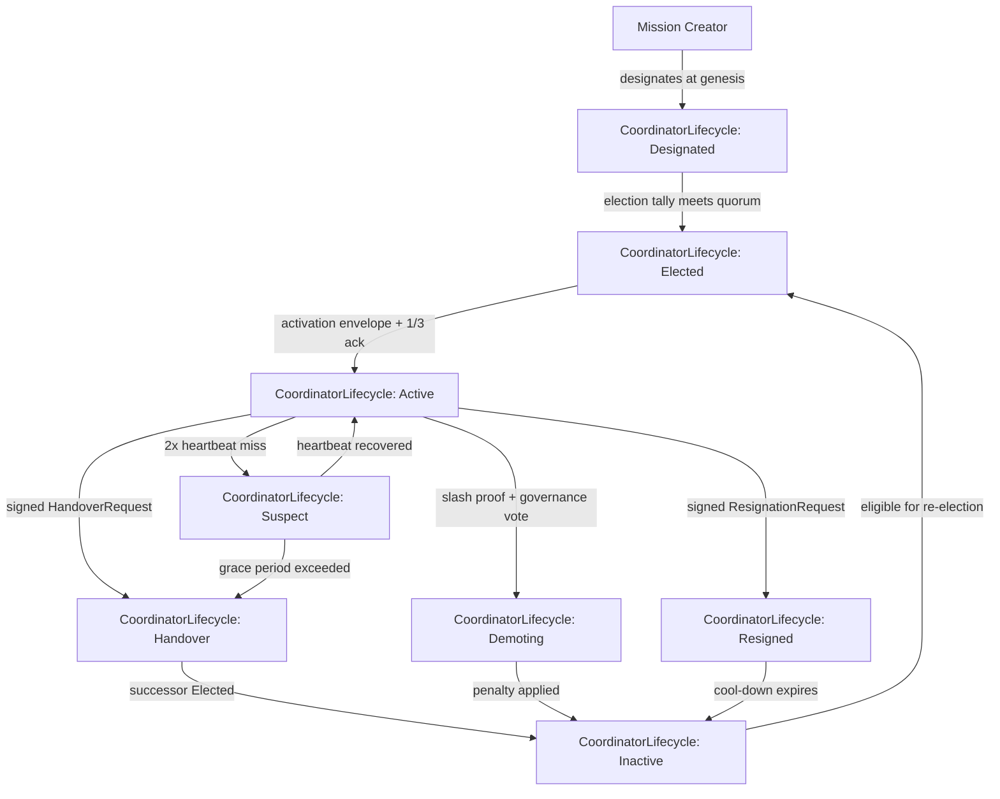
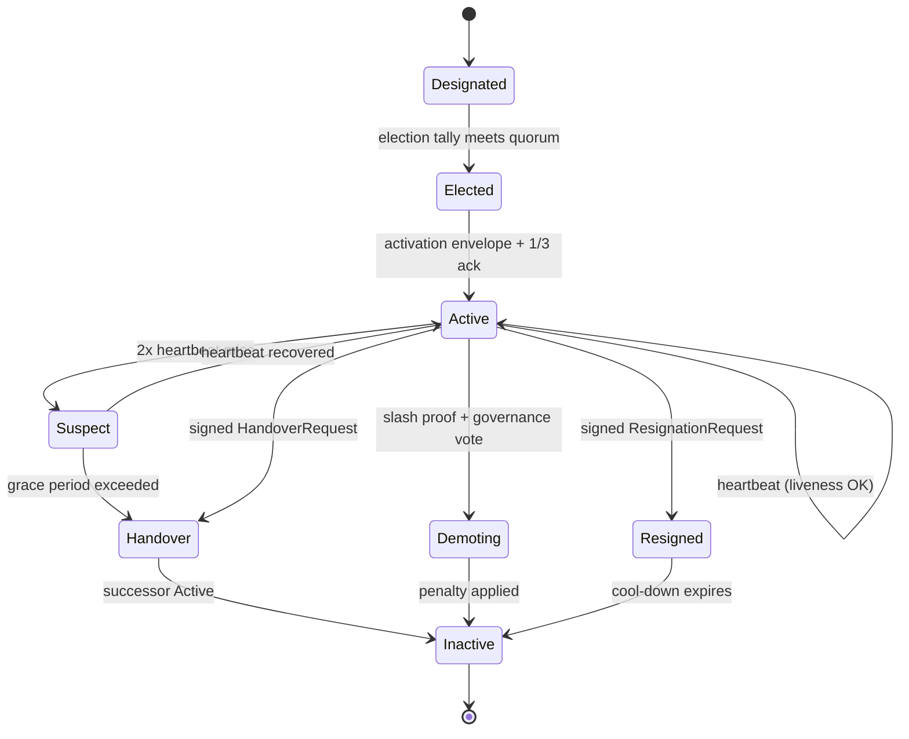

# RFC-0855p-b (Networking): Mission Coordinator Lifecycle

## Status

Draft

> **Patch RFC for RFC-0855 (Mission Overlay Networks).** This RFC fills the §16.3 → §11 forward-reference gap: §16.3 states "New Coordinator elected via governance model (Section 11)" but §11 defines 5 governance models, none of which include an election algorithm. The implementation timeline at §20 lists "3.4 Implement coordinator election" as a future task; this RFC is that task.

## Authors

- Author: @placeholder

## Maintainers

- Maintainer: @placeholder

## Summary

Specifies the `CoordinatorLifecycle` state machine, the `CoordinatorRecord` type, the per-governance-model election algorithm, term limits, handover protocols, slashing conditions, and liveness check semantics for the Mission Coordinator role defined in RFC-0855 §4.2. The result is a typed, deterministic, adversarial-resistant coordinator lifecycle that RFC-0855 can reference from §16.3, §11, and §17 in place of its current one-line forward reference.

## Dependencies

**Requires:**

- RFC-0855 (Networking): Mission Overlay Networks — primary, especially §3 (lifecycle), §4 (membership), §11 (governance), §16.3 (coordinator failure), §17 (slashing)
- RFC-0853 (Networking): Overlay Cryptography — for signature schemes and key derivation
- RFC-0000-template v1.3 — for `Roles and Authorities`, `Lifecycle Requirements`, `Implicit Assumptions Audit`, `Adversary Analysis` sections

**Optional:**

- RFC-0860 (Networking): Proof of Relay — for trust score source feeding election eligibility (RFC-0855 §4.2 requires `trust_score >= 500`)

> **Dependency Validation Rules:**
> 1. Dependencies MUST form a DAG (no cycles) — this RFC depends on 0855; 0855 is unchanged.
> 2. All "Requires" RFCs MUST be listed as mission prerequisites — Phase 1 mission `0855p-b-mission-coordinator-lifecycle.md` will declare `0855-mission-overlay-networks` as prerequisite.
> 3. Optional dependencies MUST be documented separately from required — RFC-0860 is optional; without it, election eligibility uses raw stake only.
> 4. Dependencies on "Planned" RFCs MUST note the assumption they will be Accepted — all dependencies are Draft or Final.

## Design Goals

| Goal | Target | Metric |
|------|--------|--------|
| G1 | Election completes in <30s for 100-participant mission | Wall-clock from election start to `CoordinatorRecord.state = Elected` |
| G2 | Term limits prevent indefinite incumbency | No coordinator serves > `term_max_epochs` consecutive epochs without re-election |
| G3 | Handover completes in <5s with no message loss | Wall-clock from `Handover` state entry to successor `Active`; zero envelopes lost during transition |
| G4 | Slashing is provable and deterministic | Slash proof is signed; penalty is computed deterministically from offense and stake record |
| G5 | Liveness failure is detected in <2 × heartbeat_interval | Wall-clock from missed heartbeat to `Suspect` state entry |
| G6 | All state transitions are RFC-0008 Class A | No non-determinism in coordinator state transitions affecting consensus |

## Motivation

RFC-0855 has three structural gaps with respect to the Mission Coordinator role:

1. **§16.3 forward reference**: "New Coordinator elected via governance model (Section 11)" references §11 (governance models) which defines 5 governance models, none of which include an election algorithm. The §20 implementation timeline lists "3.4 Implement coordinator election" as a future task.
2. **§4.2 coordinator role without lifecycle**: The `MembershipRole::Coordinator` bit is defined but the coordinator has no state machine, no term, no handover protocol, and no recovery from `Active → Byzantine`.
3. **§17 slashing ambiguity**: "Coordinator misbehavior → Slash OCTO-O stake + demotion" but `demotion` is undefined. Without a typed target state (this RFC defines `Demoting`), "demotion" is an implicit transition that implementations must invent independently.

This RFC fills all three gaps with a single coherent state machine, election algorithm, handover protocol, and slashing integration that implementations can reference directly.

The same lifecycle machinery is intended to specialize for the `DomainCoordinator` role (the operator of a physical broadcast domain — e.g., a WhatsApp group bridged into a DOT mission). `DomainCoordinator` is **Future Work F1** and is not specified here.

## Roles and Authorities

> **The "Nothing should be implied" rule (specification layer):** Every actor that affects correctness, security, accountability, or consensus MUST be named with a stable identifier, a defined authority scope, and a typed lifecycle. Cross-reference: BLUEPRINT.md "Human vs Agent Roles" table.

MUST enumerate:

### 1. Mission Coordinator (the role defined by this RFC)

- **Stable identifier**: `[u8; 32]` `CoordinatorId` (alias for `PeerId` in the mission's namespace)
- **Base capabilities**: sign coordination envelopes; receive `ExecutionTask` results; emit mission-state transitions
- **Authority scope**: `coordinate` (read mission state, dispatch tasks, propose mission-state transitions, sign coordination envelopes)
- **Who can assume**: genesis designator (creator), or election winner per §Election Algorithm
- **Who can revoke**: slashing adjudicator (governance), or self (resignation)
- **Lifecycle**: `CoordinatorLifecycle` (see Lifecycle Requirements) — 8 states
- **Term**: `term_start_epoch: u64`, `term_end_epoch: u64` (0 = no limit, mission-defined)

### 2. Mission Creator (genesis designator)

- **Stable identifier**: `creator_peer_id: [u8; 32]`
- **Base capabilities**: designate the first Mission Coordinator at mission creation time
- **Authority scope**: `designate-at-genesis` (one-shot, at mission creation only)
- **Who can assume**: any peer that creates a mission descriptor and signs the genesis envelope
- **Who can revoke**: no one (one-shot authority)
- **Lifecycle**: stateless (no persistent state; the designation is recorded in the mission descriptor)
- **Out of scope for replacement**: subsequent coordinators are elected per §Election Algorithm, not re-designated by the creator (this is the Centralized governance model's "designator-may-not-replace" rule; see §Election Algorithm)

### 3. Mission Participant (voter)

- **Stable identifier**: `peer_id: [u8; 32]`
- **Base capabilities**: vote in coordinator elections; sign election ballots
- **Authority scope**: `vote` (one vote per election per participant, weighted by stake or by domain depending on governance model)
- **Who can assume**: any peer admitted to the mission per RFC-0855 §4.3 admission policy
- **Who can revoke**: mission governance (per RFC-0855 §11.3 admission decisions)
- **Lifecycle**: `mission_membership` (RFC-0855 §4.2 `MembershipState`)

### 4. Slashing Adjudicator (governance)

- **Stable identifier**: `governance_id: [u8; 32]` (the governance keypair for the mission's governance model)
- **Base capabilities**: submit signed slash proofs; force `Active → Demoting` transition
- **Authority scope**: `slash` (cause a coordinator to enter `Demoting` state, with attached penalty)
- **Who can assume**: the governance authority designated by the mission descriptor (`mission_descriptor.governance_model: GovernanceModel`); for `Centralized` this is the same as the Mission Coordinator unless explicitly delegated
- **Who can revoke**: mission participants via 2/3 vote (RFC-0855 §11.3)
- **Lifecycle**: `governance_session` (per-mission; stateless across missions)

### 5. Domain Coordinator (FUTURE — NOT in this RFC)

This RFC does NOT define the `DomainCoordinator` role. It is reserved for `DomainCoordinator` specialization (Future Work F1) which will extend `CoordinatorLifecycle` with platform-specific states (e.g., `WAGroupAdmin`, `TelegramCreator`).

The "nothing should be implied" rule requires that the **out-of-scope statement itself is a named responsibility transfer**: the operator of a physical broadcast domain is currently responsible for that domain's lifecycle off-chain (filesystem config). When `DomainCoordinator` is specified, the off-chain operator role will be a specialization of `DomainCoordinator`, not an unstated implicit.

### Role/Authority Coverage Table

| Role | Identifier | Authority Scope | Lifecycle | Source/Ref |
|------|------------|-----------------|-----------|------------|
| Mission Coordinator | `CoordinatorId` (`[u8;32]`) | `coordinate` | `CoordinatorLifecycle` (8 states) | This RFC §Lifecycle Requirements |
| Mission Creator | `creator_peer_id` (`[u8;32]`) | `designate-at-genesis` (one-shot) | stateless | RFC-0855 §3 mission creation |
| Mission Participant | `peer_id` (`[u8;32]`) | `vote` (per-election) | `mission_membership` (RFC-0855 §4.2) | RFC-0855 §4.2 |
| Slashing Adjudicator | `governance_id` (`[u8;32]`) | `slash` | `governance_session` (per-mission) | RFC-0855 §11 + This RFC §Slashing |
| Domain Coordinator | (TBD) | (TBD) | (TBD) | Future Work F1 — out of scope for this RFC |

## Specification

### System Architecture



### Data Structures

```rust
/// Mission Coordinator role lifecycle (RFC-0855 §4.2 + This RFC)
#[repr(u8)]
#[derive(Clone, Copy, PartialEq, Eq, Hash, Debug)]
pub enum CoordinatorLifecycle {
    /// Designated at mission genesis by creator; not yet active
    Designated = 0x00,
    /// Election tally met quorum; awaiting activation
    Elected = 0x01,
    /// Heartbeat running, signing coordination envelopes
    Active = 0x02,
    /// Missed heartbeat threshold exceeded; under observation
    Suspect = 0x03,
    /// Standing down voluntarily or forced; successor being elected
    Handover = 0x04,
    /// Slashed by governance; OCTO-O stake being processed
    Demoting = 0x05,
    /// Voluntarily resigned; cool-down applies
    Resigned = 0x06,
    /// Role ended; eligible for re-election after cool-down (if any)
    Inactive = 0x07,
}

/// Provenance of a coordinator's current term
#[repr(u8)]
#[derive(Clone, Copy, PartialEq, Eq, Hash, Debug)]
pub enum CoordinatorSource {
    /// Designated at mission genesis by creator
    GenesisDesignation = 0x00,
    /// Elected by governance model after predecessor failure
    Election = 0x01,
    /// Inherited from predecessor via Handover
    Handover = 0x02,
    /// Emergency appointment by EmergencyAuthority
    Emergency = 0x03,
}

/// Election tally record (canonical for verification)
#[derive(Clone, PartialEq, Eq, Debug)]
pub struct ElectionTally {
    /// Election identifier (BLAKE3 of mission_id + election_epoch + nonce)
    pub election_id: [u8; 32],
    /// Epoch when election started
    pub election_epoch: u64,
    /// Epoch when election ended (quorum reached or timeout)
    pub closed_epoch: u64,
    /// Governance model used (RFC-0855 §11.1)
    pub governance_model: u16,
    /// Ballots sorted by (voter_peer_id, ballot_epoch) for determinism
    pub ballots: Vec<ElectionBallot>,
    /// Winning candidate's CoordinatorId
    pub winner: CoordinatorId,
    /// Total votes cast
    pub votes_received: u32,
    /// Total eligible voters
    pub votes_total: u32,
}

#[derive(Clone, PartialEq, Eq, Debug)]
pub struct ElectionBallot {
    pub voter_peer_id: [u8; 32],
    pub candidate_peer_id: [u8; 32],
    pub ballot_epoch: u64,
    /// Signature over (election_id, voter_peer_id, candidate_peer_id, ballot_epoch)
    pub signature: [u8; 64],
}

/// Slash proof (cause → penalty, signed by Slashing Adjudicator)
#[derive(Clone, PartialEq, Eq, Debug)]
pub struct SlashProof {
    pub slash_id: [u8; 32],
    pub coordinator: CoordinatorId,
    pub coordinator_term_id: [u8; 32],
    /// Offense type (reuses RFC-0855 §17 slash table)
    pub offense: u16,
    /// Evidence payload (proof of incorrect task, forged envelope, etc.)
    pub evidence: Vec<u8>,
    /// Penalty (OCTO-O micro-units, 0 = use default from §Slashing)
    pub penalty: u64,
    pub adjudicator: [u8; 32],
    pub adjudicator_signature: [u8; 64],
}

/// Full coordinator state (RFC-0008 Class A; deterministic across implementations)
#[derive(Clone, PartialEq, Eq, Debug)]
pub struct CoordinatorRecord {
    /// Coordinator's peer ID
    pub coordinator_peer_id: [u8; 32],
    /// Current lifecycle state
    pub state: CoordinatorLifecycle,
    /// Epoch when current term started
    pub term_start_epoch: u64,
    /// Epoch when current term ends (0 = no limit, mission-defined)
    pub term_end_epoch: u64,
    /// Provenance of this term
    pub source: CoordinatorSource,
    /// BLAKE3 of (coordinator_peer_id, term_start_epoch, source) for double-spend detection
    pub coordinator_term_id: [u8; 32],
    /// Number of times this coordinator has been slashed in this mission
    pub slash_count: u16,
    /// OCTO-O stake currently locked (returned on Inactive, slashed on Demoting)
    pub octo_o_stake_locked: u64,
    /// Last heartbeat epoch (0 if never Active)
    pub last_heartbeat_epoch: u64,
    /// Heartbeat interval the coordinator is committed to (epochs)
    pub heartbeat_interval: u64,
}
```

### Algorithms

#### Election Algorithm (per governance model)

| Governance Model | Election | Tie-Break | Eligibility |
|------------------|----------|-----------|-------------|
| **Centralized** | First coordinator: creator designates. Replacement: 2/3 vote. | n/a (designated) | `trust_score >= 500` (RFC-0855 §4.2) |
| **DAO** | Top-stake candidate wins if no candidate receives `>50%`. Otherwise top-stake wins. Re-election every `term_epochs`. | Lexicographic `peer_id` ascending | `octo_stake >= 1000` + `trust_score >= 500` |
| **Federated** | One per organizational domain; consensus from `f+1` of `2f+1` domain representatives. | Domain index then `peer_id` | `domain_reputation >= threshold` |
| **AI-Assisted** | AI proposes; humans ratify 2/3 within `proposal_deadline_epochs`. | n/a (proposed) | AI selection + human ratification |
| **Autonomous** | No election; protocol-defined rotation by `coordinator_term_id` ordering. Mission genesis names a deterministic order (e.g., BLAKE3-ordered `peer_id` list). | BLAKE3 of `(mission_id, slot_index)` | n/a |

For Centralized, the `creator-may-not-replace` rule: the Mission Creator designates the first coordinator at genesis, but cannot replace a sitting coordinator except via the 2/3 vote path. This prevents a creator from indefinitely controlling a mission by repeatedly replacing coordinators.

#### Term Limits

| Governance Model | Default `term_max_epochs` | Re-election Trigger | Cool-down after Resignation |
|------------------|---------------------------|---------------------|------------------------------|
| **Centralized** | 30 epochs (5 min @ 10s epochs) | Forced re-election at term end | 2 × `term_max_epochs` |
| **DAO** | 30 epochs | Automatic at term end | 2 × `term_max_epochs` |
| **Federated** | 30 epochs | Automatic at term end | 2 × `term_max_epochs` |
| **AI-Assisted** | 30 epochs | Human veto or 10 consecutive missed heartbeats | 2 × `term_max_epochs` |
| **Autonomous** | `mission_ttl` (entire mission) | n/a | 0 |

`term_max_epochs = 0` means no limit; the coordinator serves until explicit handover, resignation, or slash.

#### Handover Protocol

**Voluntary Handover:**

1. Coordinator signs `HandoverRequest { predecessor, designated_successor, handover_epoch }`.
2. Envelope is broadcast to mission gossip.
3. Successor runs election (if not already designated) OR transitions `Designated → Elected → Active`.
4. Predecessor transitions `Active → Handover → Inactive` once successor is `Active`.
5. **Message preservation**: envelopes in flight during `Handover` are queued by the predecessor; successor replays them upon activation. No message loss.

**Forced Handover (via 2/3 vote):**

1. Participants submit signed `ForceHandoverVote { coordinator, reason }` to governance.
2. Governance tallies votes; 2/3 threshold triggers `ForcedHandover` envelope.
3. Coordinator transitions `Active → Handover` (cannot resist — slash proof ready).
4. Same successor election as voluntary.

**Emergency Handover:**

1. `EmergencyAuthority` (RFC-0855 §11.2) signs `EmergencyHandover { coordinator, reason }`.
2. Coordinator transitions `Active → Handover` immediately.
3. Successor elected per `Emergency` branch of the governance model.

#### Slashing Integration

Slashing extends RFC-0855 §17 MON-M2 by making `Demoting` a typed state with a deterministic transition:

1. `SlashProof` is submitted by `Slashing Adjudicator` (governance).
2. Proof is verified: `adjudicator_signature` is valid; `evidence` matches the `offense` type; `coordinator_term_id` matches the current `CoordinatorRecord`.
3. Coordinator transitions `Active → Demoting`.
4. Penalty is applied: `octo_o_stake_locked -= min(penalty, octo_o_stake_locked)`.
5. Slash is recorded: `slash_count += 1`.
6. After penalty applied, coordinator transitions `Demoting → Inactive`.
7. Cool-down applies: `2^slash_count` epochs before eligible for re-election (exponential backoff prevents rapid re-elevation of repeatedly-misbehaving coordinators).

#### Liveness Check

1. Coordinator emits `CoordinatorHeartbeat { coordinator, term_id, epoch }` every `heartbeat_interval` epochs.
2. Mission participants track `last_heartbeat_epoch` per `coordinator_term_id`.
3. Detection: `current_epoch - last_heartbeat_epoch > 2 * heartbeat_interval` → `Active → Suspect`.
4. Grace period: `2 * heartbeat_interval` epochs in `Suspect`.
5. If heartbeat resumes: `Suspect → Active` (recovery).
6. If grace period exceeded: `Suspect → Handover` (forced handover begins).

#### Recovery from Network Partition

If the mission is partitioned and the coordinator is in the minority partition:

1. Coordinator's heartbeats do not reach majority.
2. Majority runs election; new coordinator emerges.
3. Minority coordinator, when partition heals, sees the new coordinator's activation envelope and transitions `Active → Inactive` (recognized as replaced).
4. No slash (this is partition, not misbehavior — RFC-0855 §13.2 split-brain handling).

### Determinism Requirements

All state transitions MUST be deterministic given identical mission state, coordinator term ID, and trigger inputs. Specifically:

- Election tally: ballots sorted by `(voter_peer_id, ballot_epoch)` then tallied in order.
- Tie-break: lexicographic `peer_id` ascending.
- Slash penalty: `min(penalty, octo_o_stake_locked)` — no overflow, deterministic.
- Handover: successor activation MUST be visible to predecessor before `Inactive`.

### RFC-0008 Execution Class Mapping

| Operation | Class | Rationale |
|-----------|-------|-----------|
| `CoordinatorId` derivation | A | Consensus-critical identity |
| `CoordinatorLifecycle` state transition | A | Consensus-critical lifecycle |
| Election tally computation | A | Consensus-critical election result |
| `CoordinatorTermId` derivation (`BLAKE3`) | A | Consensus-critical identity binding |
| Slash proof verification | A | Consensus-critical slashing |
| `CoordinatorHeartbeat` emission | B | Off-chain but deterministic (epoch-based) |
| Heartbeat transport | C | Network transport, non-deterministic |
| Handover message preservation queue | C | In-memory queue, non-deterministic ordering |
| Election ballot transport | C | Network transport |

### Error Handling

```rust
#[derive(Debug, thiserror::Error)]
pub enum CoordinatorError {
    #[error("no eligible candidate for election (reason: {reason})")]
    NoEligibleCandidate { reason: u16 },

    #[error("election tie unresolved between candidates {candidates:?}")]
    ElectionTieUnresolved { candidates: Vec<[u8; 32]> },

    #[error("handover timeout after {epochs} epochs waiting for successor")]
    HandoverTimeout {
        predecessor: [u8; 32],
        epochs: u64,
    },

    #[error("invalid coordinator term transition: {from:?} -> {to:?}")]
    InvalidTermTransition {
        from: CoordinatorLifecycle,
        to: CoordinatorLifecycle,
    },

    #[error("slash proof invalid: {reason}")]
    SlashProofInvalid { reason: String },

    #[error("heartbeat outside committed interval: actual {actual_epochs}, committed {committed_epochs}")]
    HeartbeatIntervalViolation {
        actual_epochs: u64,
        committed_epochs: u64,
    },

    #[error("coordinator term {term_id:?} does not match current record {current:?}")]
    TermMismatch {
        term_id: [u8; 32],
        current: [u8; 32],
    },
}
```

## Performance Targets

| Metric | Target | Measurement |
|--------|--------|-------------|
| Election completion (100 participants) | <30s | Wall-clock from election start to `Elected` |
| Election completion (10 participants) | <5s | Wall-clock |
| Handover completion | <5s with zero envelope loss | Wall-clock + message count diff |
| Heartbeat detection | <2 × `heartbeat_interval` epochs | Epoch delta between missed heartbeat and `Suspect` |
| Slash proof verification | <1s | Wall-clock from proof receipt to `Demoting` |
| `CoordinatorRecord` state size | <256 bytes | Serialized size (BLAKE3 + u64s + flags) |
| State transition verification | <10ms | Wall-clock for one transition check |

## Implicit Assumptions Audit

> **The "Nothing should be implied" rule (validation layer):** Every assumption the design relies on that is not enforced by types, runtime validation, or test coverage MUST be listed here.

| Assumption | Where Relied Upon | Blast Radius if False | Mitigation / Status |
|------------|-------------------|----------------------|---------------------|
| Coordinator's `peer_id` is stable across the term | `CoordinatorRecord.coordinator_peer_id` | Identity hijack via peer_id reuse; slash goes to wrong peer | RFC-0853 key rotation; term_id binds peer_id to term_epoch; rotation forced at term boundary. **MITIGATED** by term_id binding. |
| Mission participants have synchronized epoch counters | `current_epoch` in liveness check | False-positive `Suspect` from clock skew | Epoch from deterministic block height, not wall clock (RFC-0852 deterministic ordering). **MITIGATED**. |
| Heartbeat transport is reliable and acknowledged | Liveness check | False-positive `Suspect` from network drop | Heartbeat is gossiped (RFC-0852); not point-to-point. **MITIGATED**. |
| Slash proof evidence matches the offense type | Slash verification | Invalid slash; honest coordinator penalized | Verification function maps `offense: u16` to expected evidence schema; rejection on mismatch. **MITIGATED** by verification. |
| Election ballots are signed and non-replayable | Election tally | Ballot replay → vote inflation | Signature binds `(election_id, voter, candidate, ballot_epoch)`; replay across elections has different `election_id`. **MITIGATED**. |
| Slash proof `adjudicator` is the current governance key | Slash verification | Unauthorized slash by retired governance | Adjudicator key must match `mission_descriptor.governance_id` for the current `governance_session`. **MITIGATED** by key check. |
| Term limits (`term_end_epoch`) are honored by the coordinator | Term end trigger | Coordinator overstays; mission drifts to single-leader | `Suspect → Handover` trigger on `current_epoch >= term_end_epoch` regardless of heartbeat. **MITIGATED**. |
| Cool-down after Resignation is enforced | Re-election eligibility | Slashed/resigned coordinator immediately re-elected | Cool-down check in election eligibility filter. **MITIGATED**. |
| Handover message queue survives process crash | Message preservation | Envelopes lost during handover | Queue is durable (RFC-0857 mempool); crash recovery replays queue. **MITIGATED**. |

## Security Considerations

MUST document:

- **Consensus attacks**: Mission replay (mitigation: TTL + epoch validation, RFC-0855 §3.1); coordinator forgery (mitigation: signature verification on every envelope)
- **Economic exploits**: Sybil candidacy in elections (mitigation: stake-gated eligibility; M-of-N Sybil detection via RFC-0860 trust score); free-riding coordinator (mitigation: heartbeat-based slashing)
- **Proof forgery**: Slash proof forgery (mitigation: adjudicator signature verification); election ballot forgery (mitigation: voter signature)
- **Replay attacks**: Election ballot replay (mitigation: `election_id` binding); heartbeat replay (mitigation: `epoch` binding in heartbeat)
- **Determinism violations**: Election tie-break (mitigation: lexicographic `peer_id`); slash penalty overflow (mitigation: `min` operation)

## Adversary Analysis

> **The 5-Question Adversary Test:** For every design decision with security implications, enumerate: (1) who benefits from breaking it, (2) what it costs them, (3) what they gain if successful, (4) what's our defense and its cost to legitimate operation, (5) what's the residual risk and is it acceptable.

### Decision Table

| Decision | Q1 Beneficiary | Q2 Cost to Attacker | Q3 Gain if Successful | Q4 Defense (cost to legit op) | Q5 Residual Risk |
|----------|----------------|---------------------|------------------------|------------------------------|------------------|
| **D1**: Term-limited re-election (incumbent cannot stay past `term_end_epoch` without re-election) | Incumbent coordinator | 0 (re-election is free) | Indefinite mission control | Term limit; re-election requires winning election; slash on `term_end_epoch` overstay | LOW. Re-election is itself adversarial (Sybil, bribery); mitigated by D2. |
| **D2**: Election eligibility requires `trust_score >= 500` + minimum stake | Sybil cluster owner | 1000+ OCTO stake per identity | Election win via Sybil | Stake-gated admission (RFC-0851 §11.1) + M-of-N Sybil detection (RFC-0860 §6) | MEDIUM. Sophisticated Sybil with diverse funding and timing could pass; RFC-0860 behavioral correlation is the backstop. |
| **D3**: Slash proof requires governance signature | Griefing attacker | 0 (without governance key) | Mis-slash honest coordinator | Only `mission_descriptor.governance_id` can sign slash proofs; rotated per `governance_session` | MEDIUM. Governance key compromise = total control; mitigated by RFC-0860 slashing of governance key. |
| **D4**: Heartbeat emitted every `heartbeat_interval` epochs | Eclipse attacker partitioning the coordinator | Eclipse requires sustained network control | Force coordinator into `Suspect` → `Handover` without the coordinator actually being Byzantine | Coordinator can emit heartbeat via multiple transports; partition must be sustained for `4 × heartbeat_interval` to trigger handover | LOW. Sustained eclipse at the gateway level is detectable and slashable. |
| **D5**: Handover message preservation queue | Attacker flooding the predecessor with envelopes during handover | Mission gossip bandwidth | Memory exhaustion; predecessor OOM during handover | Queue size cap (mission-defined); excess envelopes are dropped with `tracing::warn!`; not a slash | MEDIUM. Predecessor could be coerced to OOM via legitimate-looking envelope flood; rate limit (RFC-0852 §rate-limit) is the backstop. |
| **D6**: `2^slash_count` cool-down after slash | Recurrent misbehavior attacker | Lost slash stake | Re-elevation after 1 slash | Exponential cool-down; after 1 slash, 2 epochs; after 2 slashes, 4 epochs; after N, `2^N` epochs | LOW. After 5+ slashes, the cool-down exceeds typical mission TTL. |
| **D7**: Election tally uses ballots sorted by `(voter, ballot_epoch)` | Vote-buying attacker | Bribes | Manipulate tally order to favor a candidate | Tally is order-independent (set semantics); sort is for determinism, not correctness | LOW. The sort is purely for cross-implementation verification. |
| **D8**: Handover successor inherits `slash_count` and `octo_o_stake_locked` from predecessor (no, successor starts fresh) | Attacker creating fake "clean" identities to bypass cool-down | New identity registration | Bypass cool-down | Successor is a NEW `CoordinatorRecord` with `slash_count = 0`; but the underlying peer_id has its own slash history tracked per-mission | MEDIUM. Cross-mission slash history requires RFC-0860 reputation; out of scope for this RFC. |

### Severity Classification

| Finding | Severity | Mitigation | Status |
|---------|----------|------------|--------|
| D2 Sybil candidacy | HIGH | Stake-gating + RFC-0860 M-of-N | MITIGATED, requires RFC-0860 final |
| D3 Governance key compromise | HIGH | Governance rotation + slash | MITIGATED, requires governance RFC (F2) |
| D5 Handover OOM | MEDIUM | Queue cap + rate limit | MITIGATED |
| D8 Cross-mission slash reputation | MEDIUM | RFC-0860 reputation (future) | ACCEPTED RISK, deadline: when RFC-0860 final |
| All others | LOW | Per-row mitigation | MITIGATED |

### Multi-Round Review

This RFC requires multi-round adversarial review per BLUEPRINT.md "Adversarial Review Process" because it touches:

- Token economics (slash penalty, election stake)
- Consensus (coordinator state transitions)
- Cryptographic primitives (slash proof signature, ballot signature)
- Coordinator/operator authority (the entire role)
- Admission/expulsion/slashing policies

Round 1 review SHOULD focus on the Election Algorithm table (per-governance-model correctness) and the SlashProof verification function.

## Economic Analysis

| Operation | Token | Amount | Rationale |
|-----------|-------|--------|-----------|
| Election candidacy (DAO) | OCTO | 1000 lock per candidacy | Anti-Sybil (RFC-0851 §11.1) |
| Election candidacy (all models) | OCTO-O | 100 lock per term | Coordinator stake (RFC-0855 §17) |
| Slash on `Active → Demoting` | OCTO-O | 100% of `octo_o_stake_locked` | Maximum penalty for coordinator misbehavior |
| Slash on `Free-riding` | OCTO | proportional to inactivity | RFC-0855 §17 free-riding slash |
| Heartbeat emission | none | 0 | Free (bandwidth only) |
| Handover coordination envelope | none | 0 | Free (single envelope) |

### Token Economics Reference

Participants MUST satisfy dual-stake requirements: 1,000 OCTO global stake + role-specific stake per `docs/04-tokenomics/token-design.md`. For Mission Coordinator, the role-specific stake is `100 OCTO-O` per term.

## Compatibility

### Backward Compatibility

- RFC-0855 missions created before this RFC MUST continue to work. The `CoordinatorRecord` is additive; missions without a `coordinator_record` field use the legacy behavior (creator-appointed, no election, no term limit, no slash).
- Detection: presence of `descriptor.flags & 0x0001` (bit 0: `COORDINATOR_LIFECYCLE_V2`) indicates the mission uses this RFC.
- Missions without the flag use legacy behavior; the gateway MAY upgrade them by setting the flag and running an initial election.

### Forward Compatibility

- `CoordinatorLifecycle` enum is extensible (0x08+ reserved for future states)
- `CoordinatorSource` enum is extensible
- `CoordinatorRecord` may add fields; serialization order is fixed per RFC-0126 DCS
- `CoordinatorError` is extensible
- Slash `offense: u16` is extensible

### RFC-0855 Integration

- RFC-0855 §16.3 ("New Coordinator elected via governance model (Section 11)") is updated to cite this RFC.
- RFC-0855 §17 ("Slashing Conditions") is updated to cite this RFC for the `Demoting` state and `SlashProof` type.
- RFC-0855 §11 (governance models) is unchanged; this RFC's Election Algorithm table extends §11 with the actual election mechanics per model.

## Test Vectors

### TV-1: Genesis Designation

```text
mission_id: 0xAAAA...
creator_peer_id: 0xBBBB...
coordinator_peer_id: 0xBBBB...
governance_model: Centralized (0x0001)
creation_epoch: 1000

Expected: CoordinatorRecord {
    coordinator_peer_id: 0xBBBB...,
    state: Designated (0x00),
    term_start_epoch: 1000,
    term_end_epoch: 0,  // no limit for Centralized default
    source: GenesisDesignation (0x00),
    coordinator_term_id: BLAKE3(0xBBBB... || 1000 || GenesisDesignation),
    slash_count: 0,
    octo_o_stake_locked: 100 OCTO-O,
    last_heartbeat_epoch: 0,
    heartbeat_interval: 1,
}
```

### TV-2: Election Win (DAO)

```text
mission_id: 0xAAAA...
governance_model: DAO (0x0002)
candidates: [0x1111, 0x2222, 0x3333]  (stakes: 5000, 3000, 2000)
ballots (sorted by voter, then epoch):
  0xAAAA -> 0x1111
  0xBBBB -> 0x1111
  0xCCCC -> 0x2222
  0xDDDD -> 0x1111
votes_total: 4
votes_received:
  0x1111: 3
  0x2222: 1
  0x3333: 0

Expected: winner = 0x1111, state = Elected (0x01)
```

### TV-3: Heartbeat Miss → Suspect

```text
coordinator: 0x1111...
heartbeat_interval: 1 epoch
last_heartbeat_epoch: 100
current_epoch: 102
missed_heartbeats: 102 - 100 = 2
threshold: 2 * heartbeat_interval = 2

Expected: state = Suspect (0x03)
```

### TV-4: Slash Proof → Demoting

```text
coordinator: 0x1111...
coordinator_term_id: 0xEEEE...
offense: 0x0001 (Invalid task result)
evidence: <proof of incorrect computation>
penalty: 100 OCTO-O (default for offense 0x0001)
adjudicator: 0xFFFF...  (current governance key)
adjudicator_signature: <valid signature over (slash_id, coordinator, term_id, offense, evidence, penalty)>

Expected: state = Demoting (0x05), octo_o_stake_locked -= 100
```

### TV-5: Cool-down After Resignation

```text
coordinator: 0x1111...
state: Resigned (0x06)
resign_epoch: 1000
cool_down_epochs: 2 * term_max_epochs = 60 epochs (term_max = 30)
eligible_for_re_election_at: 1060

Test: at epoch 1059, election eligibility filter returns NOT eligible.
      at epoch 1060, election eligibility filter returns eligible.
```

## Alternatives Considered

| Approach | Pros | Cons | Decision |
|----------|------|------|----------|
| **Hot standby (always-on backup coordinator)** | Fast handover (no election) | Wastes resources; no real election means incumbent can never be replaced by non-emergency means | REJECTED |
| **BFT consensus (PBFT, Raft) for coordinator election** | Strong consistency guarantees | Too slow for overlay gossip (RFC-0852 §line 496 explicitly rejected Raft/Paxos) | REJECTED |
| **Rotating-by-epoch (no election; protocol-defined schedule)** | Simple; deterministic | Cannot respond to misbehavior; coordinator cannot be replaced mid-mission | DEFERRED (Autonomous governance model uses this) |
| **Stake-weighted voting with quadratic cost** | Sybil-resistant | Higher implementation complexity; voting-cost bugs are consensus-splitting | DEFERRED (Future Work F2) |
| **Election by random beacon (VDF)** | Truly random selection | Requires VDF implementation; not yet standardized for OCTO | DEFERRED (Future Work F3) |

## Implementation Phases

### Phase 1: State Machine and Type Definitions

- [ ] `CoordinatorLifecycle` enum (8 variants)
- [ ] `CoordinatorSource` enum
- [ ] `CoordinatorRecord` struct
- [ ] `CoordinatorError` enum
- [ ] State transition validation function
- [ ] Unit tests for state machine (all valid + all invalid transitions)
- [ ] Round 1 adversarial review

### Phase 2: Election Algorithm

- [ ] Per-governance-model election logic
- [ ] `ElectionTally` and `ElectionBallot` types
- [ ] Tie-break (lexicographic `peer_id`)
- [ ] Mission: `0855p-b-mission-coordinator-election`
- [ ] Round 2 adversarial review

### Phase 3: Liveness Check and Heartbeat

- [ ] `CoordinatorHeartbeat` envelope type
- [ ] Liveness tracking (per-coordinator epoch counter)
- [ ] `Active → Suspect` detection
- [ ] Mission: `0855p-b-mission-coordinator-liveness`
- [ ] Round 3 adversarial review

### Phase 4: Handover Protocol

- [ ] Voluntary, forced, and emergency handover
- [ ] Message preservation queue integration
- [ ] Mission: `0855p-b-mission-coordinator-handover`
- [ ] Round 4 adversarial review

### Phase 5: Slashing Integration

- [ ] `SlashProof` type
- [ ] Slash verification function
- [ ] `Demoting` state processing
- [ ] Cool-down tracking
- [ ] Mission: `0855p-b-mission-coordinator-slashing`
- [ ] Round 5 adversarial review

## Key Files to Modify

| File | Change |
|------|--------|
| `crates/octo-network/src/mon/coordinator.rs` | NEW: `CoordinatorRecord`, `CoordinatorLifecycle`, `CoordinatorSource`, transition logic |
| `crates/octo-network/src/mon/election.rs` | NEW: `ElectionTally`, `ElectionBallot`, per-governance-model election |
| `crates/octo-network/src/mon/slashing.rs` | NEW: `SlashProof`, slash verification |
| `crates/octo-network/src/mon/lifecycle.rs` | EXISTING: integrate `CoordinatorLifecycle` with mission lifecycle |
| `rfcs/draft/networking/0855-mission-overlay-networks.md` | EXISTING: add cite to this RFC for §16.3, §17 |

## Future Work

- **F1**: `DomainCoordinator` — specialization of `CoordinatorLifecycle` for physical broadcast domains (e.g., WhatsApp groups). Will reference this RFC's `CoordinatorRecord` and add platform-specific states (`WAGroupAdmin`, `TelegramCreator`).
- **F2**: Cross-mission coordinator reputation (slash history aggregated across missions).
- **F3**: Election by random beacon (VDF).
- **F4**: Stake-weighted quadratic-cost voting.
- **F5**: Governance RFC — specifies the `governance_id` rotation protocol and slash semantics for governance key compromise.

## Rationale

Mission lifecycle (RFC-0855 §3) is deterministic; coordinator lifecycle must be too. The state machine mirrors mission lifecycle: `Designated → Elected → Active → Inactive`, with explicit failure states (`Suspect`, `Demoting`, `Resigned`) for Byzantine behavior and voluntary exit.

Election is delegated to the existing governance model taxonomy (RFC-0855 §11) to avoid duplicating authority scope; this RFC only specifies the actual election algorithm per model. The 5 governance models have meaningfully different election needs (Centralized uses designator, DAO uses stake, Federated uses domain consensus, AI-Assisted uses AI proposal + human ratification, Autonomous uses protocol-defined rotation), so a single algorithm would either be too restrictive (forcing AI missions to use stake) or too vague (lacking a concrete algorithm per case).

Handover is a separate state from Inactive, not collapsed into Election, because message preservation during handover is a real cost that election alone doesn't address. The predecessor must queue envelopes until the successor is `Active`; collapsing handover into election would either lose messages or require election to be aware of the queue (an awkward coupling).

Slashing is integrated as a state (`Demoting`) rather than a one-shot event because the slash penalty application is itself a transition that can fail (e.g., if `evidence` doesn't match the `offense`), and implementations need a typed target state to coordinate on.

`2^slash_count` cool-down after slash provides exponential backoff against recurrent misbehavior; this is more aggressive than RFC-0855 §17's "Slash OCTO-O stake + demotion" (which is silent on re-elevation) but consistent with the slashing pattern in other OCTO RFCs (e.g., RFC-0860 §6.4).

## Version History

| Version | Date | Changes |
|---------|------|---------|
| 1.0 | 2026-06-15 | Initial draft — fills RFC-0855 §16.3 → §11 forward-reference gap; defines `CoordinatorLifecycle`, `CoordinatorRecord`, per-governance-model election, handover, slashing, liveness check |

## Related RFCs

- **RFC-0855** (Networking): Mission Overlay Networks — primary; this RFC is a patch
- **RFC-0853** (Networking): Overlay Cryptography — signature schemes
- **RFC-0851** (Networking): Gateway Discovery Protocol — stake-gating references
- **RFC-0860** (Networking): Proof of Relay — trust score for election eligibility
- **RFC-0000** v1.3 (Process): RFC template with Roles, Implicit Assumptions, Adversary Analysis, Lifecycle Requirements

## Related Use Cases

- (Future) `docs/use-cases/coordinator-lifecycle.md` — Use case for the "active operator with term limits" pattern across the OCTO protocol

## Appendices

### A. State Machine Reference



### B. Slash Offense Codes (extends RFC-0855 §17)

| Code | Offense | Penalty (default) | Source |
|------|---------|-------------------|--------|
| 0x0001 | Invalid task result | 100% OCTO-O | RFC-0855 §17 |
| 0x0002 | Envelope forgery | 100% all stakes | RFC-0855 §17 |
| 0x0003 | Isolation breach | 100% OCTO-B/O | RFC-0855 §17 |
| 0x0004 | Free-riding | proportional to inactivity | RFC-0855 §17 |
| 0x0005 | Coordinator misbehavior | 100% OCTO-O + cool-down | RFC-0855 §17 + This RFC |
| 0x0006 | Heartbeat falsification | 50% OCTO-O | This RFC |
| 0x0007 | Handover message loss | 25% OCTO-O | This RFC |
| 0x0008 | Term overstay (post `term_end_epoch`) | 100% OCTO-O | This RFC |

Codes 0x0006-0x0008 are new in this RFC; codes 0x0001-0x0005 extend RFC-0855 §17 with the cool-down requirement.

---

**Version:** 1.0
**Submission Date:** 2026-06-15
**Last Updated:** 2026-06-15
