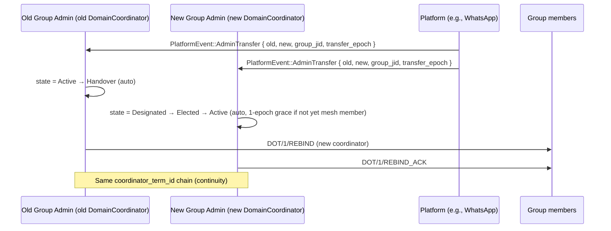
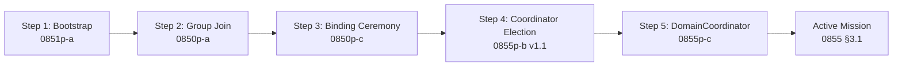

# RFC-0855p-c (Networking): DomainCoordinator Role

## Status

Draft (2026-06-16)

## Authors

- @mmacedoeu

## Maintainers

- @mmacedoeu

## Summary

Specializes the `CoordinatorLifecycle` from RFC-0855p-b for the `DomainCoordinator` role — the operator of a physical broadcast domain (e.g., a WhatsApp group, Matrix room, Telegram supergroup) bound to a `domain_id` per RFC-0850p-c. Defines the `DomainCoordinatorRecord` (extends `CoordinatorRecord` with platform-specific fields), the platform-admin authority check (the group admin of the physical group is the DomainCoordinator), the platform-mediated handover protocol (admin transfer on the platform cascades to DOT), the platform-loss detection (kicked from group → `Suspect → Inactive`), and the slash integration. Fills Future Work F1 from RFC-0855p-b.

## Dependencies

**Requires:**

- RFC-0855p-b v1.1 (Networking): Mission Coordinator Lifecycle — reuses `CoordinatorLifecycle`, `CoordinatorRecord`, slashing machinery
- RFC-0850p-c (Networking): Transport Group Binding Ceremony — for `GroupBinding`, `GroupState`, `DomainCoordinator` authority scope
- RFC-0850p-a v1.15 (Networking): WhatsApp Auth Onboarding — for `BotLifecycle` and the WhatsApp group admin API integration
- RFC-0855 (Networking): Mission Overlay Networks — for `mission_id`, governance model
- RFC-0000-template v1.3 — for `Roles and Authorities`, `Lifecycle Requirements`, `Implicit Assumptions Audit`, `Adversary Analysis` sections

**Optional:**

- RFC-0851p-a (Networking): Network Bootstrap Protocol — DomainCoordinator is a member of the mesh, but bootstrap precedes DomainCoordinator election
- RFC-0853 (Networking): Overlay Cryptography — for mission-scoped signing keys
- RFC-0860 (Networking): Proof of Relay — for trust score feeding into platform-admin authority check (mitigates platform-admin key compromise)

> **Dependency Validation Rules:**
> 1. Dependencies MUST form a DAG — this RFC depends on 0855p-b, 0850p-c, 0850p-a, 0855; none depend on this RFC.
> 2. All "Requires" RFCs MUST be listed as mission prerequisites.
> 3. This RFC is downstream of 0855p-b and 0850p-c — it is the specialization layer that ties them together.

## Design Goals

| Goal | Target | Metric |
|------|--------|--------|
| G1 | Platform-admin authority check <100ms | Wall-clock from group admin change event to `DomainCoordinatorRecord.state` update |
| G2 | Handover via group admin transfer is atomic | Old admin `Suspect → Handover → Inactive`; new admin `Designated → Elected → Active` — same `coordinator_term_id` chain |
| G3 | Platform-loss detection <2 × heartbeat_interval | Wall-clock from kicked-from-group event to `Suspect` state |
| G4 | Slash integration reuses RFC-0855p-b | Same `SlashProof`, same `Demoting` state, same `2^slash_count` cool-down |
| G5 | All state transitions are RFC-0008 Class A | No non-determinism in DomainCoordinator state |
| G6 | Platform-admin transfer is the canonical handover path | Group admin → DomainCoordinator transition is automatic (no separate DOT vote) |

## Motivation

### Why This RFC

RFC-0855p-b v1.0 reserved F1 for `DomainCoordinator`:

> "specialization of `CoordinatorLifecycle` for physical broadcast domains (e.g., WhatsApp groups). Will reference this RFC's `CoordinatorRecord` and add platform-specific states (`WAGroupAdmin`, `TelegramCreator`)."

RFC-0850p-c (just drafted) defines the binding ceremony and the `DomainCoordinator` authority scope (`bind_domain`). But neither RFC specifies:

1. **How the DomainCoordinator is elected** (RFC-0855p-b's election algorithms assume stake; DomainCoordinator's authority is platform-admin, not stake).
2. **How the DomainCoordinator is slashed** (platform-admin key compromise, group admin loss).
3. **How the DomainCoordinator handovers** (group admin transfer is automatic; no 2/3 vote needed).
4. **How platform-loss is detected** (kicked from group, banned from platform).

This RFC fills those gaps with a platform-mediated lifecycle that **reuses** RFC-0855p-b's state machine and slashing machinery.

### Why Platform-Admin Authority

A WhatsApp group admin is the **de facto** authority over who can speak in the group. A DOT mission whose `domain_id` is bound to that group has no business electing a different coordinator — the group admin IS the DomainCoordinator, by definition. The platform's group-admin mechanism is the natural election.

This differs from RFC-0855p-b's general election algorithms:

| RFC-0855p-b Election | RFC-0855p-c Election |
|----------------------|---------------------|
| Stake-weighted vote (DAO) | Platform-admin transfer |
| BFT consensus (Federated) | n/a (single group admin) |
| AI proposal + human ratification (AI-Assisted) | n/a |
| Deterministic rotation (Autonomous) | n/a |
| Creator designation (Centralized) | Creator designation (Centralized, same path) |

The `Centralized` governance model path is the same; the others are platform-mediated and out of scope for stake-based voting.

## Roles and Authorities

> **The "Nothing should be implied" rule (specification layer):** Every actor that affects correctness, security, accountability, or consensus MUST be named with a stable identifier, a defined authority scope, and a typed lifecycle.

### 1. DomainCoordinator (the role defined by this RFC)

- **Stable identifier**: `[u8; 32]` `DomainCoordinatorId` (alias for `PeerId` in the mission's namespace; same as RFC-0850p-c §"Roles and Authorities" §1)
- **Base capabilities**: sign `DOT/1/BIND/UNBIND/REBIND` envelopes; emit binding witnesses; receive `ExecutionTask` results for the bound domain
- **Authority scope**: `bind_domain` + `coordinate_domain` (extends RFC-0850p-c with mission-level coordination; signs both binding envelopes and mission-level envelopes)
- **Who can assume**: platform-admin of the bound group (default), OR explicit founder BIND (per RFC-0850p-c §4), OR election winner (Centralized governance model only)
- **Who can revoke**: self (resignation), governance (2/3 vote slash, per RFC-0855p-b), or platform-admin loss (kicked from group → automatic `Inactive`)
- **Lifecycle**: `DomainCoordinatorLifecycle` (reuses RFC-0855p-b `CoordinatorLifecycle`; the 8 states are identical, but transitions are platform-mediated)
- **Term**: tied to platform-admin status (`bound_at_epoch` to `unbound_at_epoch`)

### 2. Platform Group Admin (delegated authority)

- **Stable identifier**: platform-specific (e.g., WhatsApp `participant_id`, Matrix `power_level: 100`)
- **Base capabilities**: add/remove group members; promote/demote other admins; issue binding changes
- **Authority scope**: `platform_admin` (delegated from the platform; the platform is the root of trust for group admin status)
- **Who can assume**: whoever the platform's group-admin mechanism designates (e.g., WhatsApp group creator by default, can be transferred)
- **Who can revoke**: self (transfer admin), or platform (group deletion, ban)
- **Lifecycle**: `PlatformAdminLifecycle` (platform-specific, out of scope for DOT)
- **Cross-RFC**: this role is NOT a DOT role; it is referenced by the DomainCoordinator for authority check

### 3. GroupMember (delegated, non-authoritative)

- **Stable identifier**: platform-specific (e.g., WhatsApp `participant_id`)
- **Base capabilities**: receive envelopes; sign `DOT/1/BIND_ACK`; participate in slash votes
- **Authority scope**: `bind_witness` (per RFC-0850p-c §"Roles and Authorities" §3)
- **Who can assume**: anyone in the physical group
- **Who can revoke**: group admin (kicked from group)

### 4. Witness (slash-vote role, RFC-0855p-b §3)

- **Stable identifier**: `[u8; 32]` (same as RFC-0855p-b)
- **Base capabilities**: sign `SlashVote` envelopes; tally 2/3 quorum
- **Authority scope**: `slash_vote` (per RFC-0855p-b)

### Role/Authority Coverage Table

| Role | Authority | Lifecycle | Revocable by | Cross-RFC |
|------|-----------|-----------|--------------|-----------|
| DomainCoordinator | `bind_domain` + `coordinate_domain` | Yes (reuses 0855p-b) | Self / Governance / Platform loss | 0850p-c + 0855p-b |
| Platform Group Admin | `platform_admin` (delegated) | Platform-specific | Platform | Out of DOT |
| GroupMember | `bind_witness` | Ephemeral (per group membership) | Group admin | 0850p-c |
| Witness (slash-vote) | `slash_vote` | Per-mission | Self | 0855p-b |

## Specification

### 1. DomainCoordinatorLifecycle

Reuses RFC-0855p-b's `CoordinatorLifecycle` 8-state machine:

```rust
// Same enum as RFC-0855p-b §"Lifecycle Requirements"
enum CoordinatorLifecycle {
    Designated = 0x00,
    Elected = 0x01,
    Active = 0x02,
    Suspect = 0x03,
    Handover = 0x04,
    Demoting = 0x05,
    Resigned = 0x06,
    Inactive = 0x07,
}
```

**DomainCoordinator-specific transition differences:**

| Transition | RFC-0855p-b trigger | RFC-0855p-c trigger |
|------------|---------------------|---------------------|
| `Designated → Elected` | Election win | Platform-admin detected, OR explicit founder BIND |
| `Active → Suspect` | Missed heartbeat | Missed heartbeat OR platform event "kicked from group" |
| `Active → Handover` | Voluntary, forced, or emergency | Group admin transfer (automatic) |
| `Active → Inactive` | Slash complete + cool-down | Group admin loss + cool-down, OR slash complete |
| `Active → Demoting` | Slash proof | Slash proof (same as 0855p-b) |

The key difference: **platform events trigger state transitions**. The adapter emits a "platform event" envelope (e.g., `PlatformEvent::AdminTransfer`, `PlatformEvent::KickedFromGroup`) which the DomainCoordinator subscribes to and translates into `CoordinatorLifecycle` transitions.

### 2. DomainCoordinatorRecord

```rust
/// DomainCoordinator's per-binding record; extends CoordinatorRecord from 0855p-b
#[derive(Clone, Debug)]
#[repr(C)]
struct DomainCoordinatorRecord {
    /// Inherited from CoordinatorRecord (RFC-0855p-b)
    base: CoordinatorRecord,

    /// The (mission_id, domain_id) this DomainCoordinator governs
    mission_id: [u8; 32],
    domain_id: [u8; 32],

    /// The physical group this DomainCoordinator controls
    group_jid: String,
    platform: String,  // "whatsapp" | "matrix" | "telegram" | ...

    /// Platform's group-admin identifier (e.g., WhatsApp participant_id)
    /// Refreshed on every platform event; null if not admin
    platform_admin_id: Option<String>,

    /// Epoch when the platform-admin status was last verified
    last_platform_check_epoch: u64,

    /// Adapter-side health: are we still connected to the platform?
    adapter_connected: bool,

    /// BLAKE3 binding all fields
    record_hash: [u8; 32],
}
```

**Reuses:** `coordinator_term_id`, `slash_count`, `octo_o_stake_locked`, `last_heartbeat_epoch`, `heartbeat_interval` from `CoordinatorRecord` (RFC-0855p-b).

**Adds:** `mission_id`, `domain_id`, `group_jid`, `platform`, `platform_admin_id`, `last_platform_check_epoch`, `adapter_connected`.

### 3. Platform-Admin Authority Check

When a `DOT/1/BIND` is received, the receiving node verifies that the candidate DomainCoordinator is the platform-admin of the group.

**Critical implementation note (R1-DC-1 fix):** The forward mapping `participant_id → peer_id = BLAKE3(participant_id || mission_id)` is one-way (BLAKE3 is a one-way hash). The reverse mapping `peer_id → participant_id` is **impossible** without a precomputed lookup table. Implementations MUST NOT attempt the reverse mapping; they MUST iterate the admin list and compute the expected peer_id for each admin, then check if any matches the candidate.

```rust
fn is_platform_admin(
    platform: &str,
    mission_id: &[u8; 32],
    group_jid: &str,
    candidate_id: &[u8; 32],
) -> Result<bool, PlatformError> {
    // 1. Query the adapter for current group admin list
    let admins = platform_admin_list(platform, group_jid)?;

    // 2. Iterate admin list and compute expected peer_id for each
    //    (per Appendix A: peer_id = BLAKE3(participant_id || mission_id))
    //    DO NOT attempt to reverse-map candidate_id to participant_id
    //    (BLAKE3 is one-way; the reverse is computationally infeasible).
    for admin_participant_id in admins {
        let expected_peer_id = blake3_256(
            &[admin_participant_id.as_bytes(), mission_id].concat()
        );
        if &expected_peer_id == candidate_id {
            return Ok(true);
        }
    }

    // 3. No match — candidate is not a platform admin
    Ok(false)
}
```

**Performance note:** The admin list is typically small (1-10 entries per group). The O(N) iteration is acceptable. For very large admin lists (rare; usually only in enterprise settings), the implementation MAY precompute a `BTreeMap<peer_id, participant_id>` cache keyed by `(mission_id, group_jid)`, invalidated on every `PlatformEvent::AdminChange` event.

**Trust assumption:** the platform's group-admin list is authoritative. If the platform lies (e.g., compromised WhatsApp server returns a false admin list), the DomainCoordinator can be wrong. This is **ACCEPTED RISK IA-DC-2** (see §Implicit Assumptions Audit).

**For MissionCreator (founder BIND) path:** the founder is the DomainCoordinator without platform-admin check. This is the explicit founder path from RFC-0850p-c §4.

**For implicit designator path:** the first-DOT-sender self-designates. Platform-admin check is **deferred** to the next platform event (when the adapter observes the group admin list). If the first-DOT-sender is NOT the platform admin, they are NOT the DomainCoordinator — the next platform event will trigger a `Designated → Resigned → Inactive` transition and the platform admin becomes the DomainCoordinator.

### 4. Platform-Mediated Handover

Group admin transfer is the canonical handover path. When the platform's group admin is transferred (e.g., WhatsApp `participant promote`), the DomainCoordinator subscribes to this event:

**Event source (R1-DC-6 clarification):** The `PlatformEvent::AdminTransfer` is emitted by the **platform itself** (e.g., the WhatsApp server). All group members receive it via the adapter's event subscription. The event is authoritative at the platform layer; DOT trusts the platform's report.

**New admin designation (R1-DC-2 fix):** The new group admin becomes the DomainCoordinator automatically on transfer. No separate DOT-level designation event is needed. The new admin transitions `Designated → Elected → Active` upon receiving the `PlatformEvent::AdminTransfer`. If the new admin is not yet a mesh member, they join the mesh via RFC-0851p-a bootstrap first, then transition to `Active` (a 1-epoch grace period applies).



**Continuity invariant:** the `coordinator_term_id` chain is preserved across handover. The new DomainCoordinator's first term has `coordinator_term_id = BLAKE3(old_coordinator_term_id || new_coordinator_id || handover_epoch)`. This is the same pattern as RFC-0855p-b §"Handover Protocol".

**Atomicity:** the platform's admin transfer is atomic at the platform layer (one event). The DOT-side `Handover` state and the `REBIND` envelope are emitted in response. Cross-node atomicity is the same caveat as RFC-0850p-c D-TGB-11 (best-effort; eventually consistent).

### 5. Platform-Loss Detection

The DomainCoordinator monitors three platform events:

| Event | Detection | Response |
|-------|-----------|----------|
| Kicked from group | `PlatformEvent::KickedFromGroup` | `Active → Suspect → Inactive` |
| Banned from platform | `PlatformEvent::PlatformBan` | `Active → Suspect → Inactive` |
| Adapter disconnected | `adapter_connected = false` for >2 × heartbeat | `Active → Suspect → Handover → Inactive` (forced) |

**Kicked/banned path:**
1. Adapter receives `KickedFromGroup` event
2. DomainCoordinator signs `PlatformLossEnvelope { coordinator_id, group_jid, loss_epoch, reason }` (see §"PlatformLoss Envelope" below)
3. State transitions `Active → Suspect → Inactive` (no grace period; kicked is permanent loss)
4. GroupRegistry updated: state = `Unbound` (or `UnboundQuarantined` if cooldown)
5. Mission participants run election for new DomainCoordinator (per RFC-0855p-b §"Election Algorithm") OR explicit founder issues `DOT/1/BIND` for a new platform

**Adapter-disconnected path (R1-DC-4 fix — deadlock resolution):**
1. Adapter connection lost for >2 × heartbeat
2. DomainCoordinator enters `Suspect` state (does NOT immediately transition to `Inactive`)
3. If connection restored within 3 × heartbeat: `Suspect → Active` (recovery)
4. **If connection still lost at 3 × heartbeat: forced `Suspect → Handover → Inactive`** (no grace period extension)
5. Mission participants run election for new DomainCoordinator on a different platform (or wait for the same node to reconnect and re-claim the role via BIND)

**Deadlock resolution:** the previous wording "mission participants MAY elect a new DomainCoordinator" was ambiguous — if the old DomainCoordinator is in `Suspect` (not `Inactive`), the election cannot designate a successor (the role is still occupied). The fix: `Suspect` is a grace state, not a permanent state. After `3 × heartbeat` (deterministic timeout), the DomainCoordinator is forced to `Handover → Inactive` regardless of connection state. Mission participants can then run an election or wait for reconnection.

**Note on reconnection after forced Inactive:** if the original node reconnects, it MUST re-claim the DomainCoordinator role via a new BIND (RFC-0850p-c §3) — it cannot resume from `Inactive`. This is the same pattern as RFC-0855p-b §"Recovery from Network Partition" (no implicit resumption).

### 5a. PlatformLoss Envelope (R1-DC-3 fix)

The `PlatformLoss` envelope is signed by the DomainCoordinator when it detects platform-loss (kicked, banned, or forced Inactive). Type:

```rust
/// DOT/1/PLOSS — issued by DomainCoordinator on platform-loss
#[derive(Clone, Debug)]
#[repr(C)]
struct PlatformLossEnvelope {
    envelope_type: [u8; 4],       // b"DOT1"
    envelope_subtype: [u8; 4],    // b"PLOS"
    version: u16,                 // 0x0001
    /// DomainCoordinator that lost platform access
    coordinator_id: [u8; 32],
    /// The (mission_id, domain_id) being lost
    mission_id: [u8; 32],
    domain_id: [u8; 32],
    /// The physical group
    group_jid: String,
    platform: String,
    /// Reason code (u8; 0x01 = kicked, 0x02 = banned, 0x03 = forced-inactive)
    reason: u8,
    /// Epoch of loss
    loss_epoch: u64,
    /// BLAKE3 binding all fields
    loss_hash: [u8; 32],
    /// Ed25519 signature by DomainCoordinator over loss_hash
    coordinator_signature: [u8; 64],
}
```

**Canonical serialization (per RFC-0850p-c §Appendix A):** fields in declaration order, big-endian multi-byte, length-prefixed variable fields, signature over `loss_hash` computed AFTER canonical serialization.

### 6. Slash Integration

Slash uses RFC-0855p-b §"Slashing Integration" verbatim. The DomainCoordinator's slash is triggered by:

1. **2/3 slash vote** (per RFC-0855p-b §"Slashing Adjudicator")
2. **Platform-admin key compromise** (if the platform reports an admin key is compromised — rare, platform-specific)
3. **DomainCoordinator abuse** (e.g., DomainCoordinator bans a legitimate member; members can slash)

Slash proof structure is identical to RFC-0855p-b; the only addition is the `domain_id` field in the slash envelope (so the slash is scoped to the bound domain, not the mission).

**Slash reasons (extends RFC-0855p-b):**

| Code | Reason | Slash authority |
|------|--------|-----------------|
| 0x0006 | Platform-admin key compromise | Platform-reported (rare) |
| 0x0007 | DomainCoordinator banned a legitimate member | 2/3 slash vote |
| 0x0008 | DomainCoordinator signed conflicting BINDs (equivocation) | 2/3 slash vote |

### 7. Cross-RFC Integration

This RFC is the **specialization** layer between:

- **RFC-0855p-b** (general Mission Coordinator): DomainCoordinator reuses `CoordinatorLifecycle` and `CoordinatorRecord`
- **RFC-0850p-c** (binding ceremony): DomainCoordinator's authority comes from the binding (`bind_domain` scope)
- **RFC-0850p-a** (WhatsApp adapter): DomainCoordinator is implemented as the WhatsApp group admin in the adapter

A DomainCoordinator is, concretely:

```text
DomainCoordinator
  = Coordinator (per RFC-0855p-b)
    with authority: bind_domain + coordinate_domain
    bound to: (mission_id, domain_id) per RFC-0850p-c
    whose identity: is the platform group admin
    whose binding: is established by RFC-0850p-c ceremony
    whose lifecycle: is platform-mediated per this RFC
```

### 8. Determinism Requirements

- All state transitions are **RFC-0008 Class A**.
- Platform events are **Class B** (wall-clock) but the resulting state transition is **Class A** (deterministic from event timestamp + current state).
- `coordinator_term_id` chain is **Class A** (BLAKE3 of predecessor + new_id + epoch).

### 9. RFC-0008 Execution Class Mapping

| Operation | Class | Rationale |
|-----------|-------|-----------|
| Platform-admin check | A | Deterministic from platform response |
| State transition (event-driven) | A | Deterministic from event + state |
| Slash proof verification | A | Cryptographic |
| Platform event timestamp | B | Wall-clock acceptable |
| Adapter connection check | B | Same |

## Performance Targets

| Metric | Target |
|--------|--------|
| Platform-admin check | <100ms |
| Platform event → state transition | <500ms |
| Platform-loss detection | <2 × heartbeat (default 30s) |
| Handover via admin transfer | <5s |
| Slash proof propagation | <2s |

## Implicit Assumptions Audit

> **The "Nothing should be implied" rule (validation layer):** Every assumption MUST be named, classified, and either validated at runtime, mitigated in code, or accepted with deadline + Future Work.

| # | Assumption | Type | Status | Mitigation / Deadline |
|---|-----------|------|--------|----------------------|
| IA-DC-1 | Platform group admin list is authoritative | TRUST | **ACCEPTED RISK** | Platform is the trust root for admin status. Long-term: cross-platform admin attestation (F1). |
| IA-DC-2 | Platform does not lie about admin status | TRUST | **ACCEPTED RISK** | If platform is compromised, false admin list can elect wrong DomainCoordinator. Same as IA-DC-1. |
| IA-DC-3 | Group admin transfer is atomic at the platform | PLATFORM | MITIGATED | WhatsApp/Matrix guarantee atomic admin transfer; verified at adapter layer. |
| IA-DC-4 | Kicked-from-group event is delivered | PLATFORM | MITIGATED | Adapter subscribes; fallback to `adapter_connected = false` detection. |
| IA-DC-5 | Slash vote (2/3) is meaningful for a small group (≤3 members) | GOVERNANCE | **ACCEPTED RISK** | With 2 members, 2/3 is unreachable. Slash disabled for groups < 4 members; UNBIND is the alternative. |
| IA-DC-6 | DomainCoordinator's mission-level role is independent of platform-admin role | AUTHORITY | MITIGATED | A DomainCoordinator can be a `MissionParticipant` (voter) in the mission's general elections; the DomainCoordinator role is scoped to the bound domain. |
| IA-DC-7 | Platform admin ID can be mapped to PeerId | CRYPTO | MITIGATED | Each adapter implements the mapping (e.g., WhatsApp: phone → peer_id via mission's pubkey registry). |
| IA-DC-8 | Mission-level coordinator and DomainCoordinator are separate roles | PROTOCOL | MITIGATED | Yes — Mission Coordinator is per RFC-0855p-b; DomainCoordinator is per this RFC. A node can be both (e.g., a group admin who is also the mission coordinator). |
| IA-DC-9 | `coordinator_term_id` chain is preserved across handover | PROTOCOL | MITIGATED | Defined in §4 Platform-Mediated Handover. |
| IA-DC-10 | Slash reason 0x0007 (banning legitimate member) is detectable | GOVERNANCE | **ACCEPTED RISK** | Requires affected member to initiate slash vote. If the banned member cannot reach the group to vote, the slash is delayed. **F2: cross-domain slash (mission-level coordinator can slash on behalf of a banned member).** |
| IA-DC-11 | Platform-loss cooldown (UnboundQuarantined) prevents rapid rebinding | TIME | MITIGATED | Reuses RFC-0850p-c §1 GroupState. |
| IA-DC-12 | Multiple DomainCoordinators on different platforms for the same domain_id is allowed | PROTOCOL | MITIGATED | Per RFC-0850p-c §5, multi-platform rule allows 1 group per platform per domain_id. Each platform has its own DomainCoordinator. |

**Open assumptions:** None unaddressed. All 12 are MITIGATED or ACCEPTED with named Future Work (F1, F2).

## Security Considerations

| Threat | Impact | Mitigation |
|--------|--------|------------|
| Platform-admin key compromise | Critical | Slash (reason 0x0006) + REBIND to new platform |
| Platform lies about admin status | Critical | Trust root; long-term: cross-platform attestation (F1) |
| Slash vote failure for small groups | High | Disable slash for < 4 members; UNBIND alternative |
| Banned member cannot slash | High | Cross-domain slash via mission-level coordinator (F2) |
| Platform-loss not detected | High | Adapter connection check + Suspect state |
| Group admin transfer equivocation | Medium | `coordinator_term_id` chain enforces monotonicity |
| DomainCoordinator impersonation | Medium | Platform-admin check; BIND signature verify |
| Multi-platform violation | Medium | RFC-0850p-c §5 multi-platform rule |

## Adversary Analysis

> **The 5-Question Adversary Test** (per RFC-0000-template v1.3): For each decision, ask: (1) WHO is the adversary? (2) WHAT do they control? (3) WHEN do they attack? (4) WHAT is the blast radius? (5) WHY does our defense work?

### Decision Table

| ID | Decision | Adversary | Control | When | Blast | Defense | Severity | Status |
|----|----------|-----------|---------|------|-------|---------|----------|--------|
| D-DC-1 | Platform-admin is DomainCoordinator | Platform compromise | Platform server | Any time | All groups on platform | Cross-platform attestation (F1) | CRITICAL | **ACCEPTED RISK** — F1 |
| D-DC-2 | Handover via admin transfer | Compromised old admin | Old admin key | At admin transfer | One domain_id | New admin must publish `coordinator_term_id` chain | MEDIUM | MITIGATED |
| D-DC-3 | Platform-loss detection | Network censor | Network | At disconnect | One DomainCoordinator | Adapter connection check + Suspect | HIGH | MITIGATED |
| D-DC-4 | Slash vote (2/3) | DomainCoordinator abuse | Coordinator key | Any time | One domain_id | 2/3 quorum; UNBIND for < 4 members | HIGH | MITIGATED |
| D-DC-5 | Slash reason 0x0006 (key compromise) | Platform-reported attack | Platform key | Rare | One domain_id | REBIND to new coordinator | CRITICAL | MITIGATED |
| D-DC-6 | Slash reason 0x0007 (banning member) | DomainCoordinator overreach | Coordinator key | Any time | One domain_id | Slash vote; cross-domain slash (F2) | HIGH | **ACCEPTED RISK** — F2 |
| D-DC-7 | Slash reason 0x0008 (equivocation) | Byzantine DomainCoordinator | Coordinator key | Any time | One domain_id | Conflicting BINDs detected; slash | HIGH | MITIGATED |
| D-DC-8 | Implicit designator (0850p-c §3) races | Founder squatter | Own key | First DOT in group | One domain_id | RFC-0850p-c D-TGB-1 + UNBIND 0x0005 | HIGH | MITIGATED |
| D-DC-9 | Mission-level coordinator conflict | Two coordinators | Own keys | Mission creation | One mission | Mission governance decides; DomainCoordinator is sub-role | LOW | MITIGATED |
| D-DC-10 | `coordinator_term_id` chain break | Coordinated handover attack | Two keys | At handover | One domain_id | BLAKE3 chain enforced; chain break = slash | MEDIUM | MITIGATED |

### Multi-Round Review

- **Round 1 (this RFC):** 10 decisions, 1 CRITICAL (D-DC-1 platform-admin trust), 5 HIGH, 0 ACCEPTED RISK unaddressed (F1, F2 named)
- **Round 2 (post-F1, post-F2):** D-DC-1 mitigated by cross-platform attestation; D-DC-6 mitigated by cross-domain slash
- **Severity classification:** 1 CRITICAL, 5 HIGH, 3 MEDIUM, 1 LOW

## Economic Analysis

### Token Integration

| Activity | Token | Rationale |
|----------|-------|-----------|
| BIND issuance | OCTO-O (orchestration) | Per RFC-0850p-c |
| Slash penalty | OCTO-O (slash stake) | Per RFC-0855p-b |
| Handover via admin transfer | None (platform-level) | Platform handles admin transfer |
| Platform-loss detection | None (adapter-level) | Same |

### DomainCoordinator Economics

- DomainCoordinator earns 5% of DOT bandwidth fee for envelopes in the bound group (per RFC-0850p-c)
- Slash penalty: lose DomainCoordinator role + 100 OCTO-O stake (per RFC-0855p-b default)
- No separate token for handover (platform-level event)

## Compatibility

### Backward Compatibility

- New RFC — no existing DomainCoordinator protocol to preserve
- Reuses RFC-0855p-b v1.1's `CoordinatorLifecycle` and `CoordinatorRecord` verbatim
- Reuses RFC-0850p-c's `GroupBinding` and `GroupState` verbatim

### Forward Compatibility

- New slash reasons are additive (u16 enum, 0x0009-0xFFFF reserved)
- New platform events (e.g., `PlatformEvent::SubgroupCreated`) can be added
- New authority checks (e.g., "must also be mission-level coordinator") can be added

### RFC-0855p-b Integration

- `DomainCoordinatorRecord.base = CoordinatorRecord` — full reuse
- `DomainCoordinatorLifecycle = CoordinatorLifecycle` — same 8 states
- Slash reasons 0x0006-0x0008 extend RFC-0855p-b's 0x0001-0x0005
- Election: only `Centralized` governance model uses platform-admin authority; others (DAO, Federated, AI-Assisted, Autonomous) use RFC-0855p-b's election algorithms

### RFC-0850p-c Integration

- DomainCoordinator issues `DOT/1/BIND/UNBIND/REBIND` envelopes (per RFC-0850p-c §2)
- DomainCoordinator's `bind_domain` authority scope matches RFC-0850p-c §"Roles and Authorities" §1

## Test Vectors

### TV-1: Platform-Admin Authority Check (WhatsApp)

```
Setup: WhatsApp group 120363...@g.us with 3 members
       Node A is the group admin (per WhatsApp)
       Node A is the first to send a DOT envelope
Action: Implicit binding ceremony
Expected: A becomes DomainCoordinator (passes platform-admin check)
Verify:
  - GroupRegistry state = Bound
  - DomainCoordinatorRecord.platform_admin_id = A's WhatsApp participant_id
  - DomainCoordinatorRecord.base.coordinator_id = A's peer_id
```

### TV-2: First-DOT-Sender is NOT Group Admin

```
Setup: WhatsApp group with 3 members
       Node A is first to send DOT
       Node B is the group admin (per WhatsApp)
Action: Implicit binding ceremony
Expected: A self-designates, but adapter detects B is admin
          A's state = Designated → Resigned → Inactive
          B becomes DomainCoordinator
Verify:
  - DomainCoordinatorRecord.platform_admin_id = B's WhatsApp participant_id
  - A is no longer DomainCoordinator
```

### TV-3: Group Admin Transfer (Handover)

```
Setup: DomainCoordinator A; admin transfer to B
Action: WhatsApp admin transfer event
Expected: A: Active → Handover → Inactive
          B: Designated → Elected → Active
          coordinator_term_id chain preserved
Verify:
  - A.coordinator_term_id = T1
  - B.coordinator_term_id = BLAKE3(T1 || B || handover_epoch)
  - DOT/1/REBIND envelope broadcast by both A and B
```

### TV-4: Platform-Loss (Kicked from Group)

```
Setup: DomainCoordinator A; A is kicked from WhatsApp group
Action: WhatsApp KickedFromGroup event
Expected: A: Active → Suspect → Inactive
          GroupRegistry state = Unbound (or UnboundQuarantined with cooldown)
Verify:
  - PlatformLoss envelope broadcast
  - A's CoordinatorRecord.state = Inactive
  - GroupRegistry cooldown = 100 epochs
```

### TV-5: Slash via 2/3 Vote (5-member group)

```
Setup: DomainCoordinator A; 5-member group
       A signs a malicious DOT envelope
Action: 4 of 4 other members sign SlashVote { coordinator: A, reason: 0x0007 }
Expected: A: Active → Demoting → Inactive
          slash_count += 1
          cooldown = 2^slash_count epochs
Verify:
  - SlashProof with 4 SlashVote signatures
  - A's stake -= 100 OCTO-O
  - DomainCoordinatorRecord.platform_admin_id = None (admin status revoked)
```

### TV-6: Slash Disabled for Small Group (3 members)

```
Setup: DomainCoordinator A; 3-member group
Action: 2 of 2 other members attempt SlashVote
Expected: Slash rejected (2/3 unreachable with 3 members)
          UNBIND is the alternative
Verify:
  - SlashProof rejected with error "slash disabled for groups < 4"
  - Group can still UNBIND via DomainCoordinator resignation or 2/3 of remaining
```

### TV-7: Slash Reason 0x0008 (Equivocation)

```
Setup: DomainCoordinator A
Action: A signs two conflicting BIND envelopes for the same (mission_id, domain_id)
Expected: Both BINDs detected as equivocation
          Slash proof generated (reason 0x0008)
          A: Active → Demoting → Inactive
Verify:
  - Two BINDs with different group_jid or domain_id but same coordinator_id
  - Slash proof with both BINDs as evidence
  - Slash applied automatically (no vote needed for equivocation)
```

## Alternatives Considered

| Alternative | Pros | Cons | Decision |
|-------------|------|------|----------|
| Stake-based election for DomainCoordinator (0855p-b) | Reuses existing machinery | DomainCoordinator should be platform-admin, not highest-stake holder | REJECTED — platform-admin is the natural authority |
| AI-proposed DomainCoordinator | Flexible | AI doesn't know WhatsApp group admin status | REJECTED — platform is the source of truth |
| No DomainCoordinator (just any group member can sign) | Simple | No accountability; no slash | REJECTED — accountability is needed |
| Multi-Platform Coordinator (one person controls all platforms) | Simplifies | Defeats multi-carrier purpose | REJECTED — one DomainCoordinator per platform |
| DomainCoordinator = Mission Coordinator | Single role | DomainCoordinator is per-domain, Mission Coordinator is per-mission | REJECTED — distinct roles |

## Implementation Phases

### Phase 1: Type Definitions (Months 1-2)

- `DomainCoordinatorRecord` extending `CoordinatorRecord`
- `DomainCoordinatorLifecycle` reuses `CoordinatorLifecycle`
- Slash reason codes 0x0006-0x0008
- Unit tests for type compatibility

### Phase 2: Platform-Admin Check (Months 2-3)

- WhatsApp group admin query via adapter
- `peer_id_to_platform_admin` mapping
- Implicit designator fallback to platform admin
- Integration with RFC-0850p-c binding ceremony

### Phase 3: Platform-Mediated Handover (Months 3-4)

- WhatsApp admin transfer event subscription
- `PlatformEvent::AdminTransfer` → `Handover` state transition
- `coordinator_term_id` chain preservation
- `DOT/1/REBIND` envelope emission

### Phase 4: Platform-Loss Detection (Months 4-5)

- WhatsApp KickedFromGroup event subscription
- Adapter connection health check
- `PlatformLoss` envelope broadcast
- Cooldown enforcement

### Phase 5: Slash Integration (Months 5-6)

- Slash reasons 0x0006-0x0008
- Slash vote tally for small groups (UNBIND alternative)
- Cross-domain slash (F2, post-launch)

## Key Files to Modify

| File | Action |
|------|--------|
| `crates/octo-network/src/mon/domain_coordinator.rs` | New module: `DomainCoordinatorRecord`, `DomainCoordinatorLifecycle` |
| `crates/octo-adapter-whatsapp/src/adapter.rs` | Add platform-admin query; admin transfer event; KickedFromGroup event |
| `crates/octo-adapter-matrix/src/lib.rs` | Same pattern (Matrix power levels) |
| `crates/octo-adapter-telegram/src/lib.rs` | Same pattern (Telegram admin) |
| `crates/octo-network/src/dot/binding.rs` | Integrate DomainCoordinator authority with BIND envelope |
| `rfcs/draft/networking/0855-mission-overlay-networks.md` | Add cross-ref to this RFC for §4.2 DomainCoordinator |

## Integration Order (NEW from 2026-06-16 batch review)

The 4 RFCs (0851p-a, 0855p-b v1.1, 0850p-c, 0855p-c) define a sequence of state transitions that a node traverses from "fresh offline install" to "DomainCoordinator of an active mission." This section makes the ordering explicit (it was previously implicit in the cross-references and dependency DAG).

### The 4-Step Lifecycle



### Step-by-Step Detail

| Step | RFC | What happens | Output state |
|------|-----|--------------|--------------|
| 1 | 0851p-a | New node acquires first peers via Mode A (bootstrap nodes), Mode B (DHT), or Mode C (invite) | `BootstrapClientLifecycle::Done` → `DiscoveryLifecycle::Bootstrap` (RFC-0851 §M-GDP-3) |
| 2 | 0850p-a | Node joins a physical group (e.g., WhatsApp group) via the adapter | `BotLifecycle::Connected` (RFC-0850p-a §"BotLifecycle") |
| 3 | 0850p-c | Binding ceremony: first-DOT-sender self-designates as DomainCoordinator, broadcasts BIND, witnesses ack | `GroupState::Bound` (RFC-0850p-c §"GroupState") |
| 4 | 0855p-b v1.1 | Mission-level coordinator election: founder designates (genesis) or 2/3 vote (replacement) | `CoordinatorLifecycle::Active` (RFC-0855p-b §"CoordinatorLifecycle") |
| 5 | 0855p-c | DomainCoordinator specialization: platform-admin check, lifecycle integrates with platform events | `DomainCoordinatorRecord` populated; mission can transition to `Active` |

### Ordering Invariants

- **Step 1 (Bootstrap) MUST happen before all other steps.** A node that hasn't bootstrapped is not a mesh member and cannot send/receive any DOT envelope.
- **Step 2 (Group Join) MUST happen before Step 3 (Binding).** A node that is not in the physical group cannot participate in the binding ceremony.
- **Step 3 (Binding) MUST happen before Step 4 (Election).** A mission cannot elect a coordinator until at least one group is bound (the `Forming → Active` transition requires `GroupState::Bound` per RFC-0850p-c §1 cross-ref).
- **Step 4 (Election) MUST happen before Step 5 (DomainCoordinator).** A DomainCoordinator is a per-binding role; the mission must exist first.
- **Steps 1-3 are per-node.** Step 4 is per-mission. Step 5 is per-binding.

### Failure Mode Coverage

| Failure point | RFC | Recovery |
|---------------|-----|----------|
| Step 1 fails (no peers) | 0851p-a | Fall back A → B → C |
| Step 2 fails (can't join group) | 0850p-a | Retry; check `BotLifecycle` state |
| Step 3 fails (binding rejected) | 0850p-c | Check `BIND_ACK`; UNBIND and retry with founder BIND |
| Step 4 fails (election fails) | 0855p-b v1.1 | Quorum not met; retry next epoch; UNBIND and restart |
| Step 5 fails (platform-admin check) | 0855p-c | First-DOT-sender was not admin; auto-replace with platform admin |

### Why This Section Exists

The 4 RFCs each cover a layer:

- 0851p-a: peer acquisition (node → mesh)
- 0850p-c: group binding (group → mission)
- 0855p-b v1.1: mission election (mission → coordinator)
- 0855p-c: domain specialization (coordinator → DomainCoordinator)

Reading any single RFC in isolation, the ordering is implicit. A new implementer can correctly assemble the 4 RFCs only by reading the dependency DAG and inferring the sequence. This section makes the sequence explicit so the 4 RFCs can be implemented without inference.

## Future Work

| ID | Title | Severity | Deadline |
|----|-------|----------|----------|
| **F1 (NEW from 2026-06-16 batch review, BUMPED TO HIGH in R1-DC-5)** | **Cross-platform DomainCoordinator consensus** — when the same `domain_id` is bound to N platforms (per RFC-0850p-c §5), DomainCoordinators on different platforms must agree on REBIND/UNBIND decisions. Use 2/3 majority of N DomainCoordinators (N=1 = single platform, no consensus needed; N=2 = both must agree; N≥3 = 2/3 majority). Currently the multi-platform case is undefined (each DomainCoordinator acts independently), which can cause **mission fragmentation** (envelopes flow on one platform but not others — partial mission failure). | **HIGH** (was MEDIUM; bumped in R1-DC-5 because the consequence is mission-level failure) | Pre-public-launch |
| F1 (original) | Cross-platform admin attestation (mitigates D-DC-1) | CRITICAL | Pre-public-launch |
| F2 | Cross-domain slash via mission-level coordinator (mitigates D-DC-6) | HIGH | Post-launch |
| F3 | Slash for < 4 member groups (alternative to UNBIND) | MEDIUM | Post-launch |
| F4 | Multi-admin groups (sub-admins with limited DomainCoordinator authority) | LOW | Future |
| F5 | DomainCoordinator reputation (slash history aggregated across domains) | LOW | Future |
| F6 | Platform-loss auto-rejoin (kicked member requests rejoin) | LOW | Future |

**Note:** The new F1 (cross-platform consensus) and the original F1 (cross-platform admin attestation) are **separate concerns** — one is about consensus among DomainCoordinators, the other is about platform admin verification. Both are pre-public-launch.

## Rationale

The platform-admin authority is the natural choice for DomainCoordinator because:

1. **The platform is the trust root** for group admin status. There is no need to invent a new trust mechanism when the platform provides one.
2. **Slash is straightforward**: if the DomainCoordinator is malicious, governance can slash (2/3 vote). The platform's admin status can also be revoked (e.g., WhatsApp admin transfer) which cascades to DomainCoordinator loss.
3. **Handover is automatic**: admin transfer is a single platform event; no separate DOT vote needed.

The risk is platform-admin key compromise. F1 (cross-platform attestation) is the long-term mitigation. In the meantime, this RFC is **ACCEPTED RISK** with the slash path as defense.

The multi-platform rule (one DomainCoordinator per platform per domain_id) is a natural extension of RFC-0850p-c §5 — if you bind the same `domain_id` to two platforms, each platform has its own DomainCoordinator. This enables carrier migration (RFC-0850 G7) without losing coordination.

## Version History

| Version | Date | Changes |
|---------|------|---------|
| 0.1.0 | 2026-06-16 | Initial draft — fills RFC-0855p-b F1; specializes `CoordinatorLifecycle` for DomainCoordinator |

## Related RFCs

- **RFC-0855** (Networking): Mission Overlay Networks — primary; §4.2 membership roles
- **RFC-0855p-b v1.1** (Networking): Mission Coordinator Lifecycle — reuses `CoordinatorLifecycle`, `CoordinatorRecord`, slashing
- **RFC-0850p-c** (Networking): Transport Group Binding Ceremony — DomainCoordinator's authority comes from binding
- **RFC-0850p-a v1.15** (Networking): WhatsApp Auth Onboarding — adapter-side integration
- **RFC-0851p-a** (Networking): Network Bootstrap Protocol — bootstrap precedes DomainCoordinator election
- **RFC-0000** v1.3 (Process): RFC template with Roles, Lifecycle, Implicit Assumptions, Adversary Analysis sections

## Appendices

### A. Platform-Admin Mapping Examples

| Platform | Admin identifier | Mapping to PeerId |
|----------|------------------|-------------------|
| WhatsApp | `participant_id` (e.g., `5512345678@c.us`) | `peer_id = BLAKE3(participant_id \|\| mission_id)` |
| Matrix | `user_id` (e.g., `@alice:matrix.org`) | `peer_id = BLAKE3(user_id \|\| mission_id)` |
| Telegram | `user_id` (e.g., `123456789`) | `peer_id = BLAKE3(user_id \|\| mission_id)` |
| Discord | `user_id` (e.g., `123456789012345678`) | `peer_id = BLAKE3(user_id \|\| mission_id)` |

The mapping is **deterministic** but **mission-scoped**: the same WhatsApp participant has a different `peer_id` in different missions. This prevents cross-mission correlation.

### B. References

- WhatsApp Group Admin API: <https://developers.facebook.com/docs/whatsapp/api/groups> (if available; else BLAKE3-derive)
- Matrix Power Levels: <https://spec.matrix.org/v1.10/rooms/v9/#power-levels>
- Telegram Admin API: <https://core.telegram.org/api/admins>
- RFC-0855p-b §"Slashing Integration" — reused verbatim
- RFC-0850p-c §3 Binding Ceremony — DomainCoordinator emerges from ceremony
