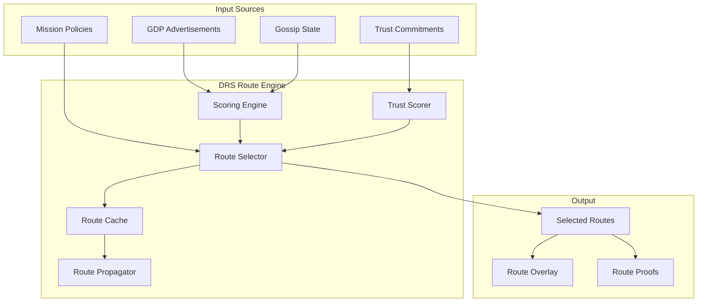

# RFC-0856: Deterministic Route Selection (DRS)

## Status

Draft

## Authors

- Author: @cipherocto

## Maintainers

- Maintainer: @cipherocto

## Summary

Deterministic Route Selection (DRS) defines how CipherOcto nodes compute, evaluate, select, maintain, and reconcile overlay routes across heterogeneous transport fabrics.

DRS provides:

- Deterministic overlay routing across heterogeneous carriers
- Mission-aware path computation with scoped route domains
- Trust-weighted relay selection with Merkle-committed trust state
- Censorship-resistant transport diversity
- Replay-safe route convergence
- Multi-carrier route federation
- Cryptographically attestable route state
- Adaptive yet consensus-safe routing behavior

The core invariant: **Route computation MUST be deterministic at the consensus boundary even when physical network conditions are nondeterministic.**

DRS builds on RFC-0850 (DOT) overlay transport, RFC-0851 (GDP) gateway discovery, RFC-0852 (DGP) gossip propagation, and RFC-0853 (OCrypt) cryptographic primitives to provide the routing intelligence layer for CipherOcto overlay civilizations.

## Dependencies

**Requires:**

- RFC-0850 (Networking): Deterministic Overlay Transport — envelope format, gateway model
- RFC-0851 (Networking): Gateway Discovery Protocol — gateway advertisements
- RFC-0852 (Networking): Deterministic Gossip Protocol — route propagation
- RFC-0853 (Networking): Overlay Cryptography — signatures, onion routing
- RFC-0855 (Networking): Mission Overlay Networks — mission-scoped routing
- RFC-0126 (Numeric): Deterministic Serialization — canonical encoding
- RFC-0008 (Process): Deterministic AI Execution Boundary — execution classes

**Optional:**

- RFC-0854 (Networking): Deterministic Proof Substrate — route attestation
- RFC-0858 (Networking): Onion Relay Routing — onion-compatible route construction
- RFC-0860 (Networking): Proof-of-Relay — relay verification
- RFC-0102 (Numeric): Wallet Cryptography — key format

## Design Goals

| Goal | Target | Metric |
|------|--------|--------|
| G1: Deterministic Convergence | 100% consistency | Identical route decisions under identical state across all implementations |
| G2: Multi-Transport Routing | 8+ carrier types | Telegram, Discord, Matrix, Nostr, QUIC, Bluetooth, LoRa, WebRTC |
| G3: Byzantine Resilience | Tolerate f < n/3 malicious relays | Signed advertisements + trust scoring |
| G4: Mission Isolation | Zero cross-mission route leakage | Scoped route domains per mission |
| G5: Adaptive Recovery | <30s failover | Automatic rerouting on carrier failure |
| G6: Replay Safety | Zero stale route replay | Epoch validation + replay cache |
| G7: Privacy Compatibility | Onion-compatible | Route concealment per RFC-0853 |
| G8: Economic Integration | OCTO-B/N incentives | Trust-weighted relay selection |
| G9: Proof Compatibility | Attestable routes | Route commitment proofs (future) |

## Motivation

### CAN WE? — Feasibility Research

The fundamental question: **Can we achieve deterministic route selection across heterogeneous, non-deterministic transport fabrics?**

Traditional networking assumes stable packet infrastructure. CipherOcto assumes hostile heterogeneous relay ecosystems where routes may traverse Telegram groups, Discord channels, Matrix federations, QUIC peers, LoRa relays, Bluetooth mesh, intermittent gateways, and censorship-resistant overlays.

Classical routing algorithms (OSPF, BGP, Dijkstra) are insufficient because:

1. They assume homogeneous network topology
2. They rely on latency-based metrics (non-deterministic)
3. They don't account for censorship resistance
4. They lack cryptographic attestation
5. They don't support mission-scoped routing

DRS solves this by separating physical transport nondeterminism from logical route determinism.

### WHY? — Why This Matters

Without DRS:

- Route decisions differ across nodes — consensus breaks
- No censorship resistance — blocking one carrier blocks all traffic
- No mission isolation — all traffic shares routing scope
- No trust-weighted selection — malicious relays treated equally
- No replay safety — stale routes can be re-injected

DRS is the routing intelligence that makes DOT (RFC-0850) and GDP (RFC-0851) work together deterministically.

### Relationship to Existing RFCs

- **RFC-0850 (DOT):** DRS operates on DOT envelopes and gateway topology
- **RFC-0851 (GDP):** DRS consumes gateway advertisements for route discovery
- **RFC-0852 (DGP):** DRS routes propagate via deterministic gossip
- **RFC-0853 (OCrypt):** DRS uses OCrypt for onion-compatible routing
- **RFC-0855 (MON):** DRS provides mission-scoped routing for MONs
- **RFC-0843 (OCTO-Network):** DRS extends RFC-0843 routing with overlay abstraction

## Specification

### 1. System Architecture



### 2. Core Principle

The central invariant:

> Route computation MUST be deterministic at the consensus boundary even when physical network conditions are nondeterministic.

This means:

1. Given identical gateway advertisements, all nodes MUST select identical routes
2. Route scoring MUST NOT depend on local measurements
3. Route ordering MUST be canonical and reproducible
4. Trust state MUST be Merkle-committed for verification

### 3. Route Domains

#### 3.1 Route Domain Definition

Routes are scoped to overlay domains.

```rust
#[derive(Clone, Copy, Debug, PartialEq, Eq, Hash)]
#[repr(C)]
struct RouteDomain {
    /// Network identifier
    network_id: u32,
    /// Mission identifier (zero for global routes)
    mission_id: [u8; 32],
    /// Scope flags (bitmask)
    scope_flags: u64,
}

#[repr(u64)]
enum RouteScopeFlag {
    Global      = 0x0001,
    Regional    = 0x0002,
    Mission     = 0x0004,
    Private     = 0x0008,
    Local       = 0x0010,
    Consensus   = 0x0020,
}

/// Convert GDP DiscoveryScope to DRS RouteScopeFlag
/// Mapping defined in RFC-0851 Section 2 (C-GDP-5 fix)
fn route_scope_from_discovery(scope: DiscoveryScope) -> RouteScopeFlag {
    match scope {
        DiscoveryScope::Local => RouteScopeFlag::Local,
        DiscoveryScope::Regional => RouteScopeFlag::Regional,
        DiscoveryScope::Mission => RouteScopeFlag::Mission,
        DiscoveryScope::Global => RouteScopeFlag::Global,
        DiscoveryScope::Private => RouteScopeFlag::Private,
        DiscoveryScope::Consensus => RouteScopeFlag::Consensus,
    }
}
```

#### 3.2 Domain Isolation

Routes in one domain MUST NOT implicitly affect another domain. Cross-domain routing requires explicit bridge policies defined by mission governance.

#### 3.3 Domain Ordering

Route domains are canonically ordered by `(network_id, mission_id, scope_flags)` using lexicographic byte comparison.

### 4. Canonical Route Object

The `DeterministicRoute` struct is the in-memory representation. The "canonical route" refers to its RFC-0126 DCS serialized form.

#### 4.1 Route Advertisement

```rust
#[derive(Clone, Debug)]
#[repr(C)]
struct DeterministicRoute {
    /// Globally unique route identifier
    route_id: [u8; 32],
    /// Source gateway identifier
    source_gateway: [u8; 32],
    /// Destination gateway identifier
    destination_gateway: [u8; 32],
    /// Next hop gateway identifier
    next_hop: [u8; 32],
    /// Merkle root of transport vectors
    transport_vector_root: [u8; 32],
    /// Trust score (0-1000000, 6 decimal precision)
    trust_score: u64,
    /// Bandwidth class (0-65535)
    bandwidth_class: u16,
    /// Latency class (0-65535)
    latency_class: u16,
    /// Censorship resistance class (0-65535)
    censorship_resistance_class: u16,
    /// Route cost (OCTO-B per hop, microtokens)
    route_cost: u64,
    /// Route epoch (consensus-derived)
    route_epoch: u64,
    /// Maximum hop count
    ttl_hops: u16,
    /// Route validity expiry epoch (DRS-H3 fix)
    /// Routes MUST be discarded after this epoch. 0 = no expiry.
    valid_until_epoch: u64,
    /// Ed25519 signature over canonical route bytes
    signature: [u8; 64],
}
```

#### 4.2 Route ID Derivation

```text
route_id = BLAKE3-256(
    version ||
    source_gateway ||
    destination_gateway ||
    next_hop ||
    transport_vector_root ||
    route_epoch
)
```

#### 4.3 Canonical Serialization

All route fields MUST be serialized using RFC-0126 DCS. Field order is fixed as declared. Multi-byte integers are big-endian.

### 5. Transport Vectors

#### 5.1 Multi-Transport Pathing

A route MAY span multiple transport carriers simultaneously.

```text
Example:
  Node A
  → Telegram relay (carrier 1)
  → Matrix bridge (carrier 2)
  → QUIC gateway (carrier 3)
  → Bluetooth mesh (carrier 4)
  → Node B
```

#### 5.2 Transport Vector

```rust
#[derive(Clone, Debug)]
#[repr(C)]
struct TransportVector {
    /// Platform type (per RFC-0850)
    transport_type: u16,
    /// Transport class (0-65535)
    transport_class: u16,
    /// Reliability score (0-1000000)
    reliability_score: u32,
    /// Censorship resistance score (0-1000000)
    censorship_score: u32,
    /// Cost class (micro OCTO-B per byte)
    cost_class: u32,
}
```

#### 5.3 Transport Vector Root

The `transport_vector_root` in `DeterministicRoute` is the Merkle root of all transport vectors in the route path.

```text
transport_vector_root = MERKLE(transport_vectors)
```

Transport vectors are ordered by `(hop_index, transport_type)` for deterministic Merkle construction.

### 6. Deterministic Route Scoring

This is the most critical section for consensus safety.

#### 6.1 Canonical Scoring Function

All nodes MUST compute route preference identically.

```rust
/// Network-defined deterministic constants (DRS-C2 fix)
/// Set at genesis or via governance proposal (RFC-0001).
/// All nodes MUST use identical weights for the same epoch.
/// Weight changes activate at a deterministic future epoch (current_epoch + grace_period).
#[derive(Clone, Debug)]
#[repr(C)]
struct ScoringWeights {
    /// Trust weight (0-1000000, 6 decimal precision)
    trust_weight: u64,
    /// Bandwidth weight (0-1000000)
    bandwidth_weight: u64,
    /// Latency weight (0-1000000)
    latency_weight: u64,
    /// Censorship resistance weight (0-1000000)
    censorship_weight: u64,
    /// Cost weight (0-1000000)
    cost_weight: u64,
    /// Epoch when these weights become active
    activation_epoch: u64,
}

/// Compute deterministic route score (DRS-C1 fix: all u64 arithmetic)
/// ALL intermediate values MUST use u64 to prevent overflow.
/// Saturating arithmetic is used: if any component overflows, it saturates to u64::MAX.
fn compute_route_score(
    route: &DeterministicRoute,
    weights: &ScoringWeights,
) -> u64 {
    // All arithmetic uses u64 integer math (no floating point, no u32 intermediates)
    let trust_component = (route.trust_score as u64).saturating_mul(weights.trust_weight);
    let bandwidth_component = (route.bandwidth_class as u64).saturating_mul(weights.bandwidth_weight);
    let latency_component = (route.latency_class as u64).saturating_mul(weights.latency_weight);
    let censorship_component = (route.censorship_resistance_class as u64).saturating_mul(weights.censorship_weight);
    let cost_component = (route.route_cost as u64).saturating_mul(weights.cost_weight);

    // Score = trust + bandwidth + latency + censorship - cost
    // Saturating add/sub to prevent overflow/underflow
    trust_component
        .saturating_add(bandwidth_component)
        .saturating_add(latency_component)
        .saturating_add(censorship_component)
        .saturating_sub(cost_component)
}
```

**Weight Configuration Protocol (DRS-C2 fix):**

Scoring weights are network-level constants with the following properties:

- **Genesis:** Initial weights are set in the genesis block
- **Governance:** Weight changes require governance proposal (per RFC-0001) with 2/3 stake-weighted vote
- **Activation:** New weights activate at `activation_epoch = proposal_approval_epoch + grace_period` (default grace: 1000 epochs)
- **Determinism:** All nodes MUST use identical weights for the same epoch. Weight lookup uses `(epoch → weights)` mapping sorted by `activation_epoch`
- **Scope:** Weights are global (apply to all routes). Mission-specific weight overrides are allowed only within mission-scoped route domains (Section 13.2)

#### 6.2 Forbidden Inputs

Consensus-sensitive route selection MUST NOT depend on:

- Local CPU load or memory pressure
- Local latency measurements (non-deterministic)
- Thread timing or execution order
- Wall-clock drift or NTP synchronization
- OS scheduler behavior
- Random number generation
- Platform-native metrics (Discord ping, Telegram delivery status)
- Network interface statistics

#### 6.3 Allowed Non-Deterministic Inputs

The following MAY be used for non-consensus optimization (e.g., local caching):

- Measured latency (for UI display only)
- Platform availability status (for local failover hints)
- Geographic proximity estimates (for local optimization)

These MUST NOT affect consensus route selection.

### 7. Route Ordering

#### 7.1 Canonical Route Ordering

When multiple routes possess equal score, tie-breaking uses:

```text
(route_score, route_epoch, route_id)
```

Where `route_id` uses lexicographic byte comparison (lowest wins).

#### 7.2 First-Wins Rule

If identical score/order collisions occur:

```text
lowest lexicographic route_id wins
```

This is deterministic because `route_id` is derived from route content (see Section 4.2).

#### 7.3 Implementation

```rust
/// Compare two routes for canonical ordering
fn compare_routes(
    a: &DeterministicRoute,
    b: &DeterministicRoute,
    weights: &ScoringWeights,
) -> std::cmp::Ordering {
    let score_a = compute_route_score(a, weights);
    let score_b = compute_route_score(b, weights);

    score_a.cmp(&score_b)
        .then_with(|| a.route_epoch.cmp(&b.route_epoch))
        .then_with(|| a.route_id.cmp(&b.route_id))
}
```

### 8. Route Discovery

Built atop GDP (RFC-0851).

#### 8.1 Discovery Sources

Routes MAY be discovered via:

| Source | Description | Priority |
|--------|-------------|----------|
| Gateway advertisements | GDP (RFC-0851) | Primary |
| Gossip propagation | DGP (RFC-0852) | Primary |
| Mission coordination | MON (RFC-0855) | Mission-scoped |
| Static configuration | Trusted routes | Bootstrap |
| Recursive referrals | Overlay expansion | Secondary |

#### 8.2 Discovery Propagation

Routes SHOULD propagate incrementally via DGP (RFC-0852). Flood propagation SHOULD be reserved for:

- Bootstrap (initial route acquisition)
- Partition healing (reconnection)
- Emergency recovery (carrier failure)

#### 8.3 Discovery Validation

Discovered routes MUST be validated before acceptance:

1. Signature verification (Ed25519)
2. Epoch monotonicity check
3. Replay window check
4. Trust score plausibility (0-1000000 range)
5. Transport vector root verification

### 9. Trust-Weighted Routing

#### 9.1 Trust Model

Route trust incorporates multiple factors:

```rust
#[derive(Clone, Debug)]
#[repr(C)]
struct TrustScore {
    /// Historical uptime score (0-1000000)
    historical_uptime: u64,
    /// Proof-of-Relay attestations (count, from RFC-0860)
    proof_of_relay: u64,
    /// Stake weight (micro OCTO)
    stake_weight: u64,
    /// Mission-specific trust (0-1000000)
    mission_trust: u64,
    /// Consensus participation score (0-1000000)
    consensus_participation: u64,
}

/// Compute composite trust score (DRS-H1 fix: cap stake_weight)
/// stake_weight contribution is capped via diminishing returns to prevent whale domination.
/// Cap: stake_weight_capped = min(stake_weight, median_stake * 10)
/// This ensures no single entity can dominate trust scoring regardless of stake size.
///
/// Design constraint: proof_of_relay attestations are capped at 1000 (prevents gaming
/// by accumulating excessive attestations). This is a protocol constant, not configurable.
fn compute_trust_score(factors: &TrustScore, median_stake: u64) -> u64 {
    // Weighted sum, all u64 arithmetic with saturating operations
    let uptime = factors.historical_uptime;
    // Cap attestations at 1000 (design constant) — saturating_mul for safety
    let relay = (factors.proof_of_relay.min(1000)).saturating_mul(1000);
    // DRS-H1 fix: cap stake_weight to prevent centralization
    let stake_cap = median_stake.saturating_mul(10);
    let stake_capped = factors.stake_weight.min(stake_cap);
    let stake = stake_capped / 1000;
    let mission = factors.mission_trust;
    let consensus = factors.consensus_participation;

    let total = uptime.saturating_add(relay).saturating_add(stake).saturating_add(mission).saturating_add(consensus);
    total.min(1_000_000)
}
```

#### 9.2 Trust Root Commitment

Trust state MAY be Merkleized for verification:

```rust
#[repr(C)]
struct TrustRoot {
    /// Merkle root of all trust entries
    trust_root: [u8; 32],
    /// Epoch of trust computation
    epoch: u64,
    /// Number of entries
    entry_count: u64,
}
```

Trust entries are ordered by `(gateway_id, factor_type)` for deterministic Merkle construction.

#### 9.3 Stake Requirements (CROSS-C1, CROSS-C2 fixes)

All gateways participating in DRS routing MUST satisfy the dual-stake model (per token design):

| Stake Type | Requirement | Purpose |
|-----------|-------------|---------|
| **Global Stake (OCTO)** | Minimum 1,000 OCTO | Security deposit, subject to slashing for misbehavior |
| **Role Stake (OCTO-B)** | Per-network configurable | Service-level guarantee for bandwidth provision |

- Gateways MUST stake BOTH OCTO (global) AND OCTO-B (bandwidth) to participate in route relay
- The 1,000 OCTO minimum is defined in blockchain-integration.md (`Global_Stake.min_stake`)
- Stake slashing applies for: route forgery, censorship, Byzantine behavior
- High-reputation gateways MAY reduce required collateral (meritocratic scaling)
- Dual-stake prevents: role tourism, stake-and-dump, farm-and-dump

### 10. Adaptive Route Evolution

#### 10.1 Dynamic Reconfiguration

Routes MAY evolve due to:

- Censorship (carrier blocked)
- Relay degradation (trust score drop)
- Mission policy change (new constraints)
- Gateway compromise (trust revocation)
- Transport migration (carrier switch)

#### 10.2 Deterministic Adaptation

Adaptation MUST remain deterministic under shared state. Given identical gateway advertisements and trust state, all nodes MUST derive identical route transitions.

#### 10.3 Adaptation Triggers

```rust
#[repr(u16)]
enum RouteAdaptationTrigger {
    CarrierFailure = 0x0001,
    TrustDegradation = 0x0002,
    CensorshipDetected = 0x0003,
    MissionPolicyChange = 0x0004,
    GatewayCompromise = 0x0005,
    EpochTransition = 0x0006,
}
```

### 11. Onion-Compatible Routing

Built atop OCrypt (RFC-0853).

#### 11.1 Layered Route Construction

Routes MAY conceal full topology. Each relay SHOULD know only:

- Previous hop
- Next hop
- Local relay instructions

NOT:

- Origin identity
- Final destination
- Full route length
- Mission topology

#### 11.2 Route Exposure Minimization

DRS SHOULD minimize:

- Topology leakage
- Mission exposure
- Route correlation
- Participant enumeration

#### 11.3 Onion Route Integration

DRS computes the logical route; OCrypt (RFC-0853) wraps it in onion layers. The route computation is deterministic; the onion encryption is probabilistic (but validation remains deterministic).

### 12. Multi-Path Routing

#### 12.1 Simultaneous Route Utilization

Traffic MAY propagate across multiple routes concurrently.

**Note:** `MultiPathRoute` is Class C (non-consensus) — the `Vec` allocation is acceptable because multi-path selection is a local optimization, not a consensus-critical operation. The deterministic load balancing algorithm (`select_route_for_packet`) IS Class A.

```rust
#[repr(C)]
struct MultiPathRoute {
    /// Primary route
    primary: DeterministicRoute,
    /// Secondary routes (ordered by score)
    secondaries: Vec<DeterministicRoute>,
    /// Multi-path policy
    policy: MultiPathPolicy,
}

#[repr(u16)]
enum MultiPathPolicy {
    /// Use primary only, failover to secondaries
    Failover = 0x0001,
    /// Propagate on all paths simultaneously
    Redundant = 0x0002,
    /// Split traffic across paths (deterministic — see below)
    LoadBalance = 0x0003,
}

/// Deterministic Load Balancing (DRS-H2 fix)
/// Traffic split MUST be deterministic: packet_n routes to route[n % route_count]
/// where route_count is the total number of routes in the MultiPathRoute (primary + secondaries).
/// All nodes MUST use this exact algorithm. Probabilistic splitting is FORBIDDEN.
fn select_route_for_packet(
    multipath: &MultiPathRoute,
    packet_sequence_number: u64,
) -> &DeterministicRoute {
    let all_routes_count = 1 + multipath.secondaries.len(); // primary + secondaries
    let index = (packet_sequence_number % all_routes_count as u64) as usize;
    if index == 0 {
        &multipath.primary
    } else {
        &multipath.secondaries[index - 1]
    }
}
```

#### 12.2 Redundant Dissemination

High-priority traffic MAY intentionally use redundant paths:

- Validator propagation
- Emergency coordination
- Censorship-resistant delivery
- Mission-critical state updates

### 13. Mission-Aware Routing

#### 13.1 Mission Policies

Mission overlays (RFC-0855) MAY define route constraints:

```rust
#[derive(Clone, Debug)]
#[repr(C)]
struct MissionRoutePolicy {
    /// Mission identifier
    mission_id: [u8; 32],
    /// Minimum trust score required
    min_trust_score: u32,
    /// Required transport types (bitmask)
    required_transports: u64,
    /// Forbidden transport types (bitmask)
    forbidden_transports: u64,
    /// Geographic isolation constraint
    geographic_isolation: bool,
    /// Stealth mode (conceal mission topology)
    stealth_mode: bool,
    /// Maximum route cost (micro OCTO-B)
    max_route_cost: u64,
}
```

#### 13.2 Mission-Specific Scoring

Different MONs MAY use different deterministic scoring constants. Mission scoring weights override network defaults for mission-scoped routes.

### 14. Route Revocation (DRS-H4 fix)

A gateway MUST be able to revoke its routes if compromised or decommissioned.

```rust
#[derive(Clone, Debug)]
#[repr(C)]
struct RouteRevocation {
    /// Gateway requesting revocation
    gateway_id: [u8; 32],
    /// Route IDs to revoke (empty = revoke all routes from this gateway)
    route_ids: Vec<[u8; 32]>,
    /// Epoch of revocation
    revocation_epoch: u64,
    /// Ed25519 signature by gateway's key
    signature: [u8; 64],
}
```

Revocation messages propagate via DGP (RFC-0852) as `MessageType::RouteAnnouncement` with a revocation flag. Upon receipt:

1. Verify signature against gateway's public key
2. Remove matching routes from local cache
3. Propagate revocation to peers via DGP
4. Log revocation for audit trail

Revocations are irrevocable — a revoked route cannot be un-revoked. The gateway MUST issue a new route advertisement to replace revoked routes.

### 15. Route Persistence

#### 15.1 Route Cache

```rust
#[derive(Clone, Debug)]
#[repr(C)]
struct RouteCacheEntry {
    /// Route identifier
    route_id: [u8; 32],
    /// First seen epoch
    first_seen: u64,
    /// Last validated epoch
    last_validated: u64,
    /// Computed route score
    route_score: u64,
    /// Trust score at last validation
    trust_score: u64,
    /// Cache validity (epoch-based)
    valid_until: u64,
}
```

#### 15.2 Deterministic Eviction

Eviction MUST follow canonical ordering:

```text
lowest score → oldest unseen → highest cost
```

Cache capacity is network-configured. When full, entries are evicted in the order above.

**TTL Defaults:**
- Default TTL: 100 epochs
- Minimum TTL: 1 epoch
- Maximum TTL: 1000 epochs
- Expiration: deterministic by `valid_until_epoch < current_epoch` comparison

#### 15.3 Cache Invalidation

Cache entries are invalidated when:

- `valid_until` epoch is exceeded
- Gateway advertisement is revoked
- Trust score drops below mission minimum
- Route signature verification fails

### 16. Partition Resilience

DRS assumes network fragmentation is inevitable.

#### 15.1 Autonomous Partition Routing

Partitioned overlay segments MAY continue routing independently using cached routes.

#### 15.2 Reconciliation

Upon reconnection:

```text
anti-entropy route reconciliation
```

MUST restore deterministic convergence. Nodes exchange route summaries via DGP (RFC-0852) and reconcile differences deterministically.

### 17. Token Economics Integration

| Activity | Token | Rationale |
|----------|-------|-----------|
| Route relay | OCTO-B | Bandwidth consumption per hop |
| Stable routing | OCTO-N | Gateway uptime and availability |
| Trusted relaying | PoR boosts | Trust-weighted selection premium |
| Mission routing | OCTO-O | Orchestration of mission-specific routes |
| Route attestation | OCTO-S | Storage of route proofs (future) |

### 18. AI-Native Routing

#### 17.1 AI-Assisted Optimization

AI agents MAY:

- Propose route optimizations
- Predict carrier failures
- Suggest relay diversity improvements
- Optimize mission-specific scoring weights

#### 17.2 Deterministic AI Constraint

AI-assisted routing MUST NOT violate deterministic replay guarantees. AI MAY propose, but canonical route selection MUST remain deterministic given shared state.

This is enforced by:

1. AI proposals are advisory, not authoritative
2. Canonical scoring uses fixed weights (not AI-derived)
3. Route selection is a pure function of (advertisements, weights, trust)

## RFC-0008 Execution Class Mapping

| DRS Operation | Class | Rationale |
|---------------|-------|-----------|
| Route score computation | A | Consensus-critical scoring |
| Canonical route ordering | A | Consensus-critical selection |
| Route commitment hash | A | Consensus-critical commitment |
| Trust score computation | A | Consensus-critical weight |
| Route selection | A | Consensus-critical decision |
| Mission-aware policy evaluation | A | Consensus-critical constraint |
| Route revocation verification | A | Consensus-critical validation |
| Route cache eviction | A | Deterministic eviction required |
| Partition resilience recomputation | A | Consensus-critical recovery |
| Multi-path selection | C | Local optimization (non-consensus) |
| Multi-path load balancing algorithm | A | Deterministic packet routing |
| Route discovery | C | Non-deterministic network conditions |
| Latency measurement | C | Non-deterministic timing |
| Physical route probing | C | Non-deterministic transport |
| Onion route construction | C | ORR-dependent (non-consensus) |

## Performance Targets

| Metric | Target | Measurement |
|--------|--------|-------------|
| Route scoring | <1ms | Single route score computation |
| Route selection | <10ms | Select best route from 100 candidates |
| Route cache lookup | <1µs | HashMap lookup by route_id |
| Trust computation | <5ms | Composite trust from 5 factors |
| Route propagation | <1s | New route visible to all gateways |
| Failover time | <30s | Automatic rerouting on carrier failure |
| Reconciliation | <60s | Full route table reconciliation after partition |
| Throughput | >10K routes/s | Route processing rate |

## Security Considerations

### Route Poisoning

| Threat | Impact | Mitigation |
|--------|--------|------------|
| Fake route advertisement | High | Ed25519 signature verification |
| Manipulated trust scores | High | Merkle-committed trust state |
| Bogus transport vectors | Medium | Transport vector root verification |
| Route replay | High | Epoch validation + replay cache |

### Eclipse Routing

| Threat | Impact | Mitigation |
|--------|--------|------------|
| Single-carrier dependency | High | Multi-path routing requirement |
| Gateway concentration | High | Diversity constraints on relay selection |
| Geographic isolation | Medium | Geographic distribution requirements |

### Topology Leakage

| Threat | Impact | Mitigation |
|--------|--------|------------|
| Route correlation | High | Onion-compatible routing (RFC-0853) |
| Mission exposure | High | Mission-scoped route isolation |
| Participant enumeration | Medium | Stealth route mode |

### Censorship

| Threat | Impact | Mitigation |
|--------|--------|------------|
| Carrier blocking | High | Multi-carrier routing with automatic failover |
| Selective route suppression | Medium | Redundant dissemination for critical routes |
| Gateway censorship | Medium | Trust-based gateway selection |

## Adversarial Review

| Threat | Impact | Mitigation | Verification |
|--------|--------|------------|--------------|
| Non-deterministic scoring | Critical | Integer-only arithmetic, fixed weights | Determinism fuzz test |
| Replay attack | High | Epoch + replay cache | Replay detection test |
| Route forgery | High | Ed25519 signature | Signature verification test |
| Trust manipulation | High | Merkle trust commitment | Trust root verification test |
| Cross-mission leakage | High | Route domain isolation | Domain isolation test |
| Eclipse attack | High | Diversity constraints | Multi-gateway connectivity test |
| Censorship | High | Multi-carrier failover | Carrier blocking test |
| AI non-determinism | Critical | AI advisory-only constraint | AI proposal test |

## Economic Analysis

### Route Market Dynamics

DRS creates a marketplace for overlay routing:

- **Supply:** Gateways providing relay bandwidth
- **Demand:** Missions requiring cross-platform routing
- **Price:** OCTO-B per hop, with trust and censorship premiums

### Route Pricing Model

```text
route_price = base_cost_per_hop
            × hop_count
            × trust_premium(trust_score)
            × censorship_premium(censorship_class)
            × carrier_multiplier(transport_type)
```

Where:

- `base_cost_per_hop`: network-configured minimum
- `trust_premium`: higher trust = higher price (quality guarantee)
- `censorship_premium`: censorship resistance = premium value
- `carrier_multiplier`: per-carrier pricing (LoRa expensive, native P2P cheap)

## Compatibility

### Backward Compatibility

DRS v1 is the initial version. Future versions MUST use versioned scoring functions.

### Forward Compatibility

- Scoring weights are network-configured (extensible)
- Transport vectors support new carrier types
- Trust factors are extensible via Merkle structure

### RFC-0843 Integration

DRS extends RFC-0843 routing:

- RFC-0843 provides libp2p-based routing primitives
- DRS adds overlay abstraction, trust weighting, mission scoping
- Native P2P routes use RFC-0843; overlay routes use DRS

## Error Types

```rust
enum DrsError {
    RouteNotFound { route_id: [u8; 32] },
    ScoringOverflow { component: String },
    InvalidWeights { field: String },
    CacheFull { max_entries: u32 },
    RevocationFailed { reason: String },
    TrustComputationFailed { factor: String },
    InvalidRouteDomain { domain: [u8; 32] },
    SignatureVerificationFailed,
}
```

## Test Vectors

### Route Scoring

```text
Input:
  route.trust_score = 800000 (0.8)
  route.bandwidth_class = 50000
  route.latency_class = 30000
  route.censorship_resistance_class = 70000
  route.route_cost = 1000

  weights.trust_weight = 500000 (0.5)
  weights.bandwidth_weight = 300000 (0.3)
  weights.latency_weight = 100000 (0.1)
  weights.censorship_weight = 200000 (0.2)
  weights.cost_weight = 100000 (0.1)

Expected:
  trust_component = 800000 × 500000 = 400000000000
  bandwidth_component = 50000 × 300000 = 15000000000
  latency_component = 30000 × 100000 = 3000000000
  censorship_component = 70000 × 200000 = 14000000000
  cost_component = 1000 × 100000 = 100000000

  score = 400000000000 + 15000000000 + 3000000000 + 14000000000 - 100000000
        = 431900000000
```

### Route Ordering

```text
Route A: score=100, epoch=10, route_id=[0x01; 32]
Route B: score=100, epoch=10, route_id=[0x02; 32]
Route C: score=100, epoch=11, route_id=[0x01; 32]
Route D: score=200, epoch=9,  route_id=[0x01; 32]

Canonical order: D > C > A > B
Reason: D has highest score
        C has higher epoch than A/B (same score)
        A.route_id < B.route_id (same score, same epoch)
```

### Trust Score Computation

```text
Input:
  historical_uptime = 900000
  proof_of_relay = 500
  stake_weight = 500000000
  mission_trust = 800000
  consensus_participation = 700000

Expected:
  uptime = 900000
  relay = min(500, 1000) × 1000 = 500000
  stake = 500000000 / 1000 = 500000
  mission = 800000
  consensus = 700000

  total = 900000 + 500000 + 500000 + 800000 + 700000 = 3400000
  trust_score = min(3400000, 1000000) = 1000000 (capped)
```

## Alternatives Considered

| Approach | Pros | Cons | Decision |
|----------|------|------|----------|
| Latency-based routing (OSPF/BGP) | Proven, simple | Non-deterministic, no censorship resistance | Rejected |
| Random routing | Simple | No optimization, no trust | Rejected |
| Centralized routing | Optimal | Single point of failure, not decentralized | Rejected |
| Pure trust routing | Security-focused | No bandwidth/cost optimization | Insufficient |
| AI-determined routing | Adaptive | Non-deterministic, consensus risk | Advisory only |

**Decision:** Deterministic scoring with fixed weights, trust-weighted selection, AI advisory optimization.

## Implementation Phases

### Phase 1: Core Route Engine (Months 1-3)

**Goal:** Deterministic route scoring and selection.

| Task | Description | RFC Dependency |
|------|-------------|----------------|
| 1.1 | Implement `RouteDomain` struct | RFC-0850 |
| 1.2 | Implement `DeterministicRoute` with DCS serialization | RFC-0126 |
| 1.3 | Implement `TransportVector` and Merkle root computation | — |
| 1.4 | Implement `compute_route_score` with integer arithmetic | — |
| 1.5 | Implement `compare_routes` canonical ordering | — |
| 1.6 | Implement `RouteCache` with deterministic eviction | — |
| 1.7 | Write unit tests for scoring determinism | — |
| 1.8 | Write fuzz tests for scoring edge cases | — |

**Deliverables:** Route scoring engine, route cache, determinism tests.

### Phase 2: Trust and Discovery (Months 3-6)

**Goal:** Trust-weighted routing with GDP integration.

| Task | Description | RFC Dependency |
|------|-------------|----------------|
| 2.1 | Implement `TrustFactors` and `compute_trust_score` | — |
| 2.2 | Implement `TrustRoot` Merkle commitment | — |
| 2.3 | Implement GDP advertisement consumption (RFC-0851) | RFC-0851 |
| 2.4 | Implement route discovery from gateway advertisements | RFC-0851 |
| 2.5 | Implement route propagation via DGP (RFC-0852) | RFC-0852 |
| 2.6 | Implement replay cache for route advertisements | — |
| 2.7 | Write integration tests with GDP/DGP | — |

**Deliverables:** Trust model, discovery integration, propagation.

### Phase 3: Mission Routing (Months 6-9)

**Goal:** Mission-scoped routing with policy enforcement.

| Task | Description | RFC Dependency |
|------|-------------|----------------|
| 3.1 | Implement `MissionRoutePolicy` | RFC-0855 |
| 3.2 | Implement mission-specific scoring weights | RFC-0855 |
| 3.3 | Implement route domain isolation | — |
| 3.4 | Implement `MultiPathRoute` with failover/redundant modes | — |
| 3.5 | Implement adaptive route evolution | — |
| 3.6 | Write mission routing integration tests | — |

**Deliverables:** Mission routing, multi-path, adaptive evolution.

### Phase 4: Privacy and Economics (Months 9-12)

**Goal:** Onion-compatible routing with economic integration.

| Task | Description | RFC Dependency |
|------|-------------|----------------|
| 4.1 | Implement onion-compatible route computation | RFC-0853 |
| 4.2 | Implement route exposure minimization | RFC-0853 |
| 4.3 | Implement OCTO-B route pricing | — |
| 4.4 | Implement trust premium calculation | — |
| 4.5 | Implement carrier-specific pricing | — |
| 4.6 | Implement AI advisory route optimization | — |
| 4.7 | Write adversarial test suite | — |
| 4.8 | Write performance benchmarks | — |

**Deliverables:** Onion routing, economics, adversarial tests.

## Key Files to Modify

| File | Change |
|------|--------|
| `crates/octo-network/src/drs/mod.rs` | New DRS module |
| `crates/octo-network/src/drs/domain.rs` | RouteDomain |
| `crates/octo-network/src/drs/route.rs` | DeterministicRoute |
| `crates/octo-network/src/drs/transport.rs` | TransportVector |
| `crates/octo-network/src/drs/scoring.rs` | Scoring engine |
| `crates/octo-network/src/drs/trust.rs` | Trust model |
| `crates/octo-network/src/drs/cache.rs` | RouteCache |
| `crates/octo-network/src/drs/discovery.rs` | GDP integration |
| `crates/octo-network/src/drs/propagation.rs` | DGP integration |
| `crates/octo-network/src/drs/mission.rs` | Mission routing |
| `crates/octo-network/src/drs/multipath.rs` | Multi-path routing |
| `crates/octo-network/src/drs/onion.rs` | Onion compatibility |
| `crates/octo-network/src/drs/pricing.rs` | Route pricing |

## Future Work

- F1: Route attestation proofs (RFC-0854 integration)
- F2: Proof-of-Relay integration (RFC-0860)
- F3: Recursive route aggregation for large overlays
- F4: Machine learning route optimization (advisory)
- F5: Cross-chain route bridging
- F6: Satellite link route optimization
- F7: Mesh radio route discovery

## Rationale

### Why deterministic scoring instead of adaptive?

Adaptive scoring (latency-based, ML-optimized) is non-deterministic. Different nodes would select different routes, breaking consensus. DRS uses deterministic scoring with fixed weights, allowing AI to propose optimizations that humans approve and deploy as new weight configurations.

### Why integer arithmetic instead of floating point?

Floating point is non-deterministic across architectures (x86 vs ARM vs RISC-V). Integer arithmetic with scaled values (6 decimal precision via ×1000000) provides deterministic results on all platforms.

### Why Merkle trust commitments?

Trust state must be verifiable. Merkle commitments allow any node to verify trust scores without storing the full trust tree. This is essential for light clients and cross-shard verification.

## Version History

| Version | Date | Changes |
|---------|------|---------|
| 1.0.0 | 2026-05-25 | Initial draft — scoring, trust, mission routing, phases |

## Related RFCs

- RFC-0850 (Networking): Deterministic Overlay Transport — transport layer
- RFC-0851 (Networking): Gateway Discovery Protocol — gateway discovery
- RFC-0852 (Networking): Deterministic Gossip Protocol — propagation
- RFC-0853 (Networking): Overlay Cryptography — encryption, onion routing
- RFC-0855 (Networking): Mission Overlay Networks — mission overlays
- RFC-0854 (Networking): Deterministic Proof Substrate — route attestation
- RFC-0860 (Networking): Proof-of-Relay — relay verification
- RFC-0843 (Networking): OCTO-Network Protocol — native P2P
- RFC-0126 (Numeric): Deterministic Serialization — canonical encoding
- RFC-0008 (Process): Deterministic AI Execution Boundary — execution classes

## Related Use Cases

- [Decentralized Mission Execution](../../docs/use-cases/decentralized-mission-execution.md)
- [Privacy-Preserving Query Routing](../../docs/use-cases/privacy-preserving-query-routing.md)
- [Provable Quality of Service](../../docs/use-cases/provable-quality-of-service.md)
- [Hybrid AI-Blockchain Runtime](../../docs/use-cases/hybrid-ai-blockchain-runtime.md)
