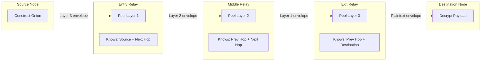

# RFC-0858: Onion Relay Routing (ORR)

## Status

Draft

## Authors

- Author: @cipherocto

## Maintainers

- Maintainer: @cipherocto

## Summary

The Onion Relay Routing (ORR) protocol defines the privacy-preserving multi-hop relay architecture for CipherOcto overlays. ORR ensures that no single relay possesses sufficient information to reconstruct the full route of an envelope, providing sender-receiver unlinkability, traffic analysis resistance, and mission-scoped anonymity.

ORR provides:

- Multi-hop layered encryption for sender-receiver unlinkability
- Per-relay knowledge isolation (each relay knows only previous/next hop)
- X25519 key agreement with HKDF-BLAKE3 session derivation
- Forward secrecy via ephemeral per-message keys
- Multi-transport onion paths across heterogeneous carriers
- Cover traffic generation for traffic analysis resistance
- Mission-scoped onion domains for isolated anonymity sets
- Integration with DRS (RFC-0856) for deterministic route construction
- Proof-of-Relay (RFC-0860) integration for relay verification

The key innovation: **relays forward encrypted envelopes without knowing the source, destination, or payload contents.** Each relay peels one encryption layer, learns only the next hop, and forwards the remainder.

## Dependencies

**Requires:**

- RFC-0850 (Networking): DOT — deterministic envelope format, broadcast domains
- RFC-0853 (Networking): OCrypt — X25519, HKDF-BLAKE3, ChaCha20-Poly1305
- RFC-0856 (Networking): DRS — deterministic route selection

**Optional:**

- RFC-0851 (Networking): GDP — gateway discovery for relay selection
- RFC-0852 (Networking): DGP — gossip propagation of onion envelopes
- RFC-0857 (Networking): DOM — onion-wrapped intent submission
- RFC-0854 (Networking): DPS — ZK proof integration for relay verification
- RFC-0860 (Networking): PoRelay — cryptographic relay proof generation

## Design Goals

| Goal | Target | Metric |
|------|--------|--------|
| G1: Sender unlinkability | No relay knows both source and destination | Information-theoretic at each hop |
| G2: Forward secrecy | Compromise of one key does not expose past sessions | Ephemeral X25519 per message |
| G3: Multi-transport paths | Onion spans 3+ carrier types | Telegram → Matrix → QUIC → Bluetooth |
| G4: Cover traffic | Indistinguishable from real traffic | Same envelope format, same timing |
| G5: Deterministic route construction | Identical routes from identical inputs | DRS-based, integer-only scoring |
| G6: Hop latency | <200ms per relay hop | Measured decryption + forwarding time |
| G7: Route diversity | Maximum transport/trust/geo diversity | Diversity score in route selection |

## Motivation

### CAN WE? — Feasibility Research

The fundamental question: **Can we build onion routing over heterogeneous social transport fabrics?**

Research confirms feasibility through:

- **Tor** demonstrates multi-hop onion routing over TCP (but single-transport)
- **Signal** uses forward-secrecy ratchets (but centralized relay)
- **Nostr** demonstrates relay federation (but no onion routing)
- **RFC-0853** provides the cryptographic primitives (X25519, HKDF-BLAKE3, ChaCha20-Poly1305)
- **RFC-0856** provides deterministic route selection compatible with onion construction

ORR extends these by combining onion routing with multi-transport overlay networking — something no existing system provides.

### WHY? — Why This Matters

Without ORR:

- Gateways can observe full source-destination pairs
- Traffic analysis reveals mission structure and participant graph
- Platform operators can correlate overlay traffic patterns
- No plausible deniability for relay participation
- Censorship targets can be identified by route analysis

ORR enables CipherOcto to provide **transport-level privacy** that is independent of carrier platform trustworthiness.

### Threat Model

ORR assumes adversarial capabilities:

| Adversary Capability | Assumption |
|---------------------|------------|
| Control of transport carriers | Yes — platforms may log, censor, or modify |
| Control of some overlay relays | Yes — Sybil gateways are assumed |
| Passive global observation | Plausible — timing correlation possible |
| Active manipulation of routes | Yes — route poisoning assumed |
| Compromise of relay keys | Possible — forward secrecy mitigates |
| Traffic analysis | Yes — cover traffic mitigates |

ORR does NOT protect against:

- Global passive adversary controlling all relays simultaneously
- End-to-end timing correlation with sub-millisecond precision
- Compromise of both source and destination simultaneously

## Specification

### 1. System Architecture



### 2. Onion Route Structure

#### 2.1 OnionRoute

The top-level route descriptor:

```rust
#[derive(Clone, Debug)]
#[repr(C)]
struct OnionRoute {
    /// Unique route identifier (SHA-256 of route construction inputs)
    route_id: [u8; 32],
    /// Mission identifier (zero if not mission-scoped)
    mission_id: [u8; 32],
    /// Network epoch when route was constructed
    route_epoch: u64,
    /// Number of hops in the route
    hop_count: u16,
    /// Entry gateway identifier
    entry_gateway: [u8; 32],
    /// Exit gateway identifier
    exit_gateway: [u8; 32],
    /// Merkle root of layered route data
    layered_route_root: [u8; 32],
    /// Route construction timestamp (logical, not wall-clock)
    construction_timestamp: u64,
    /// Route flags (bitmask)
    flags: u64,
}
```

**Route ID Derivation:**

```text
route_id = SHA-256(
    mission_id ||
    route_epoch ||
    hop_count ||
    entry_gateway ||
    exit_gateway ||
    construction_timestamp
)
```

#### 2.2 OnionHop

Each hop in the onion carries encrypted routing instructions:

```rust
#[derive(Clone, Debug)]
#[repr(C)]
struct OnionHop {
    /// Relay gateway identifier
    relay_gateway: [u8; 32],
    /// Transport vector for next hop (per RFC-0856)
    transport_vector_root: [u8; 32],
    /// Encrypted next-hop instructions (only decryptable by this relay)
    encrypted_next_hop: [u8; 128],
    /// Encrypted payload fragment (peeled at this hop)
    encrypted_payload_fragment: Vec<u8>,
    /// Hop-level MAC for integrity
    hop_mac: [u8; 32],
    /// Ephemeral public key for this hop's key derivation
    ephemeral_public_key: [u8; 32],
}
```

#### 2.3 Relay Knowledge Isolation

Each relay class has strictly bounded knowledge:

| Relay Type | Knows | Does NOT Know |
|-----------|-------|---------------|
| Entry Relay | Source identity, next hop | Destination, payload, route length |
| Middle Relay | Previous hop, next hop | Source, destination, payload, position |
| Exit Relay | Previous hop, destination | Source, payload origin, full route |
| Destination | Payload content | Source (if anonymous), route |

**Invariant:** No relay possesses both source and destination information simultaneously.

### 3. Layered Encryption Protocol

#### 3.1 Encryption Construction (Source Side)

The source constructs the onion by encrypting from the innermost layer outward:

```text
1. Generate ephemeral X25519 keypair per hop
2. For each hop (reverse order, exit first):
   a. Compute shared_secret = X25519(ephemeral_private, relay_public)
   b. Derive session_key = HKDF-BLAKE3(shared_secret, "onion-hop-" || hop_index)
   c. Encrypt payload_fragment = ChaCha20-Poly1305(session_key, nonce, fragment)
   d. Encrypt next_hop_instructions = ChaCha20-Poly1305(session_key, nonce, instructions)
   e. Compute hop_mac = BLAKE3-256(session_key || encrypted_fragment || encrypted_instructions)
3. Assemble final onion envelope
```

#### 3.2 Decryption at Each Relay

Each relay peels one layer:

```text
1. Receive onion envelope
2. Extract ephemeral_public_key from current hop
3. Compute shared_secret = X25519(relay_private, ephemeral_public)
4. Derive session_key = HKDF-BLAKE3(shared_secret, "onion-hop-" || hop_index)
5. Verify hop_mac against expected value
6. Decrypt encrypted_next_hop → next relay address + transport instructions
7. Decrypt encrypted_payload_fragment → inner onion envelope
8. Forward inner envelope to next hop via specified transport
```

#### 3.3 Forward Secrecy

Forward secrecy is achieved through:

- **Ephemeral keys:** Each message uses fresh X25519 ephemeral keys
- **Key destruction:** Session keys are zeroed after use
- **No key reuse:** Compromise of relay long-term keys does not expose past sessions
- **Per-hop isolation:** Compromise of one hop's key does not expose other hops

### 4. Session Key Derivation

#### 4.1 Key Derivation Function

All session keys are derived using HKDF-BLAKE3 (per RFC-0853):

```rust
#[repr(C)]
fn derive_hop_session_key(
    shared_secret: &[u8; 32],
    hop_index: u16,
    route_id: &[u8; 32],
) -> [u8; 32] {
    let info = format!("onion-hop-{}-{:02x}", hop_index, hex::encode(route_id));
    hkdf_blake3_expand(shared_secret, info.as_bytes(), 32)
}
```

#### 4.2 Nonce Construction

Nonces MUST be deterministic to prevent reuse:

```text
nonce = BLAKE3-256(session_key || hop_index || route_id)[0..12]
```

This ensures the same (session_key, hop_index, route_id) always produces the same nonce, while different combinations produce different nonces.

### 5. Multi-Transport Onion Paths

#### 5.1 Transport Diversity

Onion paths MUST maximize transport diversity per RFC-0856:

```text
Example path:
  Source → Telegram Bridge (Edge Gateway A)
         → Matrix Relay (Relay Gateway B)
         → QUIC Gateway (Consensus Gateway C)
         → Bluetooth Mesh (Edge Gateway D)
         → Destination
```

Each hop uses a different transport carrier, preventing single-carrier observation of the full path.

#### 5.2 Transport Selection

Transport vectors are selected during route construction:

```rust
#[derive(Clone, Debug)]
#[repr(C)]
struct TransportVector {
    /// Transport type (per RFC-0850 platform types)
    transport_type: u16,
    /// Broadcast domain for this hop
    domain_id: [u8; 34],
    /// Priority within transport class
    priority: u16,
    /// Bandwidth class (0-255)
    bandwidth_class: u8,
    /// Censorship resistance score (0-255)
    censorship_score: u8,
}
```

#### 5.3 Fallback Transports

Each hop MAY specify fallback transports:

```text
If primary transport fails:
  Try fallback_1
  If fallback_1 fails:
    Try fallback_2
    If all fail:
      Route reconstruction via DRS
```

### 6. Cover Traffic

#### 6.1 Cover Envelope Format

Cover envelopes use the same format as real envelopes:

```rust
#[repr(C)]
struct CoverEnvelope {
    /// Same structure as OnionRoute
    route: OnionRoute,
    /// Same layered encryption as real traffic
    layered_payload: Vec<u8>,
    /// Cover flag (encrypted in innermost layer, only destination knows)
    is_cover: bool,
}
```

#### 6.2 Cover Traffic Generation

Gateways generate cover traffic based on:

- **Constant rate:** Minimum cover envelopes per time period
- **Proportional rate:** Cover traffic proportional to real traffic volume
- **Burst matching:** Cover traffic during detected burst patterns

```text
cover_rate = max(
    MIN_COVER_RATE,
    real_traffic_rate * COVER_RATIO
)
```

#### 6.3 Indistinguishability

Cover envelopes MUST be indistinguishable from real envelopes:

- Same encryption layers
- Same route construction
- Same transport vectors
- Same timing patterns
- Same size distribution

### 7. Mission-Scoped Onion Domains

#### 7.1 Onion Domain Definition

Missions can create isolated anonymity domains:

```rust
#[derive(Clone, Debug)]
#[repr(C)]
struct OnionDomain {
    /// Mission identifier
    mission_id: [u8; 32],
    /// Domain key (used for domain-scoped route construction)
    domain_key: [u8; 32],
    /// Minimum relay trust score for domain participation
    min_trust_score: u32,
    /// Required transport diversity (minimum distinct transport types)
    min_transport_diversity: u8,
    /// Cover traffic policy
    cover_policy: CoverPolicy,
}
```

#### 7.2 Domain Isolation

Routes within one mission domain MUST NOT be routable from another domain.

### 8. Route Construction via DRS

Onion routes are constructed using RFC-0856 deterministic route selection. Route selection maximizes diversity along multiple dimensions:

| Dimension | Metric | Weight |
|-----------|--------|--------|
| Transport type | Distinct carrier types | 0.30 |
| Geographic | Distinct regions | 0.25 |
| Trust source | Distinct trust authorities | 0.20 |
| Organizational | Distinct gateway operators | 0.15 |
| Temporal | Distinct gateway creation epochs | 0.10 |

**Forbidden dependencies:** local randomness, wall-clock jitter, OS scheduler behavior, transport timing.

### 9. Route Rotation

Onion routes SHOULD rotate periodically. Rotation triggers:

- Elapsed epoch threshold
- Trust degradation of any relay
- Censorship detection at any hop
- Relay compromise suspicion
- Mission policy change

### 10. Determinism Requirements

| Operation | Class | Rationale |
|-----------|-------|-----------|
| Route construction | Class A | Consensus-critical route selection |
| Session key derivation | Class A | Must be reproducible for verification |
| Nonce construction | Class A | Prevents reuse across implementations |
| Route commitment | Class A | Consensus-verifiable proof |
| Encryption/decryption | Class A | Deterministic given same keys/nonces |
| Cover traffic timing | Class C | Non-deterministic by design |
| Transport selection | Class B | Configurable timeouts |

## Performance Targets

| Metric | Target | Measurement |
|--------|--------|-------------|
| Onion construction | <10ms | 5-hop route with ChaCha20-Poly1305 |
| Per-hop decryption | <2ms | Single layer peel + forward |
| End-to-end latency | <1s | 5-hop route across 3 transport types |
| Cover traffic overhead | <30% | Ratio of cover to real envelopes |
| Key derivation | <1ms | HKDF-BLAKE3 per hop |
| Route construction | <5ms | DRS-based 5-hop selection |
| Throughput per gateway | >500 onion/s | Sustained onion processing |

## Security Considerations

### Cryptographic Attacks

| Attack | Impact | Mitigation |
|--------|--------|------------|
| Key compromise | High | Forward secrecy via ephemeral keys |
| Replay attack | High | Route ID + hop index in nonce |
| MAC forgery | Critical | BLAKE3-256 MAC verification |
| Decryption oracle | Critical | Authenticated encryption (ChaCha20-Poly1305) |

### Traffic Analysis

| Attack | Impact | Mitigation |
|--------|--------|------------|
| Timing correlation | High | Cover traffic + jitter |
| Size analysis | Medium | Fixed-size envelope padding |
| Volume analysis | Medium | Proportional cover traffic |
| Intersection attack | Medium | Mission-scoped anonymity sets |

### Relay-Level Attacks

| Attack | Impact | Mitigation |
|--------|--------|------------|
| Sybil relays | High | Trust scoring + stake (RFC-0860) |
| Selective forwarding | Medium | Proof-of-Relay verification |
| Route manipulation | High | DRS deterministic selection |
| Eclipse attack | High | Multi-transport diversity |

## Adversarial Review

| Threat | Impact | Mitigation | Verification |
|--------|--------|------------|--------------|
| Global passive adversary | Critical | Cover traffic + multi-transport | Traffic analysis test |
| Entry relay compromise | High | Does not know destination | Knowledge isolation test |
| Exit relay compromise | High | Does not know source | Knowledge isolation test |
| Route poisoning | High | DRS deterministic construction | Route verification test |
| Cover traffic fingerprinting | Medium | Indistinguishable format | Indistinguishability test |
| Timing correlation | High | Jitter + cover traffic | Timing analysis test |
| Sybil relay majority | Critical | Trust scoring + diversity | Sybil resistance test |
| Replay of old routes | High | Route ID + epoch validation | Replay detection test |
| MAC forgery | Critical | BLAKE3-256 verification | MAC verification test |
| Forward secrecy violation | High | Ephemeral key destruction | Key compromise test |

## Economic Analysis

### Token Integration

| Activity | Token | Rationale |
|----------|-------|-----------|
| Onion relay bandwidth | OCTO-B | Primary resource for multi-hop forwarding |
| Cover traffic generation | OCTO-B | Bandwidth overhead for privacy |
| Route construction | OCTO-O | Orchestration of multi-hop paths |
| Relay uptime | OCTO-N | Continuous availability for onion paths |
| Relay proof generation | OCTO-N | Cryptographic work for verification |

### Relay Economics

Onion relay rewards are proportional to:

- Layers peeled and forwarded
- Transport diversity provided
- Cover traffic maintained
- Uptime consistency
- Proof-of-Relay compliance

### Cost Model

```text
onion_relay_cost = base_relay_cost * hop_count * (1 + cover_traffic_ratio)
```

Where `cover_traffic_ratio` is the percentage of decoy traffic (default 20%).

## Compatibility

### RFC-0843 Integration

ORR extends RFC-0843's native P2P with onion privacy:

- RFC-0843 provides gossipsub for message propagation
- ORR adds layered encryption on top of DOT envelopes
- Onion envelopes can be transported via any DOT carrier
- Native P2P (libp2p) is one of many transport options

### Tor Compatibility

ORR is NOT Tor-compatible but borrows concepts:

- Layered encryption (like Tor cells)
- Per-hop key derivation (like Tor circuit extension)
- Forward secrecy (like Tor's ephemeral keys)
- Multi-hop routing (like Tor circuits)

Differences: multi-transport (Tor is TCP-only), deterministic route selection (Tor uses path selection algorithms), mission-scoped domains (Tor has no concept).

### Forward Compatibility

- Hop count is variable (future routes can be longer/shorter)
- Transport vectors are extensible (new transport types)
- Cover policies are extensible (new traffic analysis resistance)
- Proof types are extensible (new relay proof mechanisms)
- Encryption algorithms swappable via CryptoSuiteId (RFC-0853)

## Test Vectors

### Onion Construction (3-hop)

```text
Input:
  Source: gateway_id=[0x01; 32]
  Hop 1 (Entry): gateway_id=[0x02; 32], transport=Telegram
  Hop 2 (Middle): gateway_id=[0x03; 32], transport=Matrix
  Hop 3 (Exit): gateway_id=[0x04; 32], transport=QUIC
  Destination: gateway_id=[0x05; 32]
  Payload: "hello world"
  mission_id: [0x00; 32]
  route_epoch: 1000

Construction:
  Layer 3 (outermost): encrypt for Hop 1 with ephemeral_key_1
  Layer 2: encrypt for Hop 2 with ephemeral_key_2
  Layer 1: encrypt for Hop 3 with ephemeral_key_3
  Inner: encrypt payload for destination

Expected route_id:
  SHA-256(mission_id || epoch || hop_count || entry || exit || timestamp)
```

### Session Key Derivation

```text
Input:
  shared_secret = X25519(ephemeral_private, relay_public)
  hop_index = 0
  route_id = [0xAA; 32]

Expected:
  session_key = HKDF-BLAKE3(shared_secret, "onion-hop-0-aaaa...")[0..32]
  nonce = BLAKE3-256(session_key || 0 || route_id)[0..12]
```

### Route Commitment

```text
Input:
  relay_sequence = [[0x02;32], [0x03;32], [0x04;32]]
  transport_vectors = [Telegram, Matrix, QUIC]
  diversity_scores = [transport=3, geo=2, trust=2, org=3, temporal=2]
  epoch = 1000

Expected:
  relay_hash = SHA-256(relay_sequence_bytes)
  transport_hash = SHA-256(transport_vector_bytes)
  diversity_hash = SHA-256(diversity_score_bytes)
  commitment = SHA-256(relay_hash || transport_hash || diversity_hash || epoch)
```

## Alternatives Considered

| Approach | Pros | Cons | Decision |
|----------|------|------|----------|
| Tor-compatible protocol | Existing tooling | TCP-only, no multi-transport | Rejected |
| Signal-style ratchets | Strong forward secrecy | Centralized relay infrastructure | Rejected |
| Nostr NIP-59 (gift wrap) | Simple, federated | No multi-hop, limited privacy | Insufficient |
| Mixnet (Loopix) | Strong traffic analysis resistance | High latency, single-transport | Partially adopted (cover traffic) |
| Garlic routing (I2P) | Bundled messages | Complex, high overhead | Rejected |
| Custom single-hop proxy | Simple | No anonymity | Rejected |

**Decision:** ORR combines Tor-style layered encryption with multi-transport overlay networking and deterministic route selection, providing privacy properties no existing system offers.

## Implementation Phases

### Phase 1: Core Onion Construction (Months 1-3)

| Task | Description | RFC Dependency |
|------|-------------|----------------|
| 1.1 | Implement `OnionRoute` struct with DCS serialization | RFC-0850 |
| 1.2 | Implement `OnionHop` struct with encrypted fields | RFC-0853 |
| 1.3 | Implement layered encryption (ChaCha20-Poly1305) | RFC-0853 |
| 1.4 | Implement session key derivation (HKDF-BLAKE3) | RFC-0853 |
| 1.5 | Implement nonce construction (deterministic) | — |
| 1.6 | Implement onion construction (source side) | — |
| 1.7 | Implement onion peeling (relay side) | — |
| 1.8 | Write unit tests for encryption/decryption round-trip | — |
| 1.9 | Write integration tests for 3-hop onion | — |

**Deliverables:** Core onion construction, encryption/decryption, unit tests.

### Phase 2: Route Construction and Transport (Months 3-6)

| Task | Description | RFC Dependency |
|------|-------------|----------------|
| 2.1 | Implement DRS-based onion route construction | RFC-0856 |
| 2.2 | Implement diversity maximization in route selection | RFC-0856 |
| 2.3 | Implement `RouteCommitment` generation/verification | — |
| 2.4 | Implement multi-transport onion forwarding | RFC-0850 |
| 2.5 | Implement transport fallback logic | — |
| 2.6 | Implement mission-scoped `OnionDomain` | — |
| 2.7 | Write route construction tests | — |
| 2.8 | Write multi-transport forwarding tests | — |

**Deliverables:** Route construction, multi-transport forwarding, mission domains.

### Phase 3: Cover Traffic and Privacy (Months 6-9)

| Task | Description | RFC Dependency |
|------|-------------|----------------|
| 3.1 | Implement cover envelope generation | — |
| 3.2 | Implement constant-rate cover traffic | — |
| 3.3 | Implement proportional cover traffic | — |
| 3.4 | Implement cover traffic timing jitter | — |
| 3.5 | Implement `RelayForwardProof` generation | RFC-0860 |
| 3.6 | Implement recursive relay proof aggregation | RFC-0860 |
| 3.7 | Write traffic analysis resistance tests | — |
| 3.8 | Write indistinguishability tests | — |

**Deliverables:** Cover traffic, relay proofs, traffic analysis tests.

### Phase 4: Integration and Hardening (Months 9-12)

| Task | Description | RFC Dependency |
|------|-------------|----------------|
| 4.1 | Integrate with DOT envelope transport | RFC-0850 |
| 4.2 | Integrate with DGP gossip propagation | RFC-0852 |
| 4.3 | Integrate with DOM onion-wrapped intents | RFC-0857 |
| 4.4 | Implement forward secrecy key destruction | — |
| 4.5 | Implement Sybil resistance via trust scoring | RFC-0860 |
| 4.6 | Write adversarial test suite | — |
| 4.7 | Write performance benchmarks | — |
| 4.8 | Write privacy audit test suite | — |

**Deliverables:** Full integration, adversarial tests, performance benchmarks.

## Key Files to Modify

| File | Change |
|------|--------|
| `crates/octo-network/src/orr/mod.rs` | ORR module root |
| `crates/octo-network/src/orr/route.rs` | OnionRoute struct |
| `crates/octo-network/src/orr/hop.rs` | OnionHop struct |
| `crates/octo-network/src/orr/encryption.rs` | Layered encryption/decryption |
| `crates/octo-network/src/orr/session.rs` | Per-hop session key derivation |
| `crates/octo-network/src/orr/nonce.rs` | Deterministic nonce construction |
| `crates/octo-network/src/orr/construction.rs` | Onion construction (source side) |
| `crates/octo-network/src/orr/peeling.rs` | Onion peeling (relay side) |
| `crates/octo-network/src/orr/relay.rs` | Entry/middle/exit relay logic |
| `crates/octo-network/src/orr/cover.rs` | Cover traffic generation |
| `crates/octo-network/src/orr/domain.rs` | Mission-scoped onion domains |
| `crates/octo-network/src/orr/proof.rs` | Relay forwarding proofs |
| `crates/octo-network/src/orr/rotation.rs` | Route rotation and refresh |
| `crates/octo-network/src/orr/transport.rs` | Multi-transport forwarding |

## Future Work

- F1: Variable-length onion routes (adaptive hop count based on threat level)
- F2: Vuvuzela-style decoy messaging for stronger traffic analysis resistance
- F3: Riffle-style verifiable shuffle for mixnet integration
- F4: Integration with LoRa/Bluetooth for physical-layer privacy
- F5: GPU-accelerated onion construction for high-throughput gateways
- F6: Zero-knowledge relay proofs (prove forwarding without revealing hop index)
- F7: Onion-wrapped ZK proof submission (RFC-0854 integration)
- F8: Adaptive cover traffic based on observed network conditions

## Rationale

### Why layered encryption instead of single-hop proxy?

Single-hop proxies provide no anonymity — the proxy sees both source and destination. Layered encryption ensures:

1. No single relay has full routing information
2. Compromise of one relay does not expose the full path
3. Forward secrecy limits damage from key compromise

### Why deterministic route construction?

Non-deterministic route selection would cause:

1. Different nodes construct different routes for the same request
2. Route verification becomes impossible
3. Proof-of-Relay cannot verify correct path traversal

DRS (RFC-0856) ensures all nodes derive identical routes from identical inputs.

### Why cover traffic?

Without cover traffic:

1. Active periods reveal communication patterns
2. Silence periods reveal non-communication
3. Traffic volume correlates with mission activity
4. Timing analysis can de-anonymize routes

Cover traffic makes real and dummy traffic indistinguishable, frustrating traffic analysis.

### Why mission-scoped domains?

Global anonymity sets are vulnerable to intersection attacks. Mission-scoped domains provide:

1. Smaller, focused anonymity sets
2. Domain-specific privacy policies
3. Isolation between mission traffic
4. Configurable cover traffic ratios per mission

## Version History

| Version | Date | Changes |
|---------|------|---------|
| 1.0.0 | 2026-05-25 | Initial draft — core onion protocol, layered encryption, cover traffic, mission domains |

## Related RFCs

- RFC-0850 (Networking): DOT — deterministic envelope format, transport abstraction
- RFC-0851 (Networking): GDP — gateway discovery for relay selection
- RFC-0852 (Networking): DGP — gossip propagation of onion envelopes
- RFC-0853 (Networking): OCrypt — cryptographic primitives (X25519, HKDF-BLAKE3, ChaCha20-Poly1305)
- RFC-0854 (Networking): DPS — ZK proof integration for relay verification
- RFC-0856 (Networking): DRS — deterministic route selection for onion construction
- RFC-0857 (Networking): DOM — onion-wrapped intent submission
- RFC-0860 (Networking): PoRelay — cryptographic relay proof generation

## Related Use Cases

- [Privacy-Preserving Query Routing](../../docs/use-cases/privacy-preserving-query-routing.md)
- [Decentralized Mission Execution](../../docs/use-cases/decentralized-mission-execution.md)
- [Agent Marketplace](../../docs/use-cases/agent-marketplace.md)
- [Verifiable AI Agents DeFi](../../docs/use-cases/verifiable-ai-agents-defi.md)
