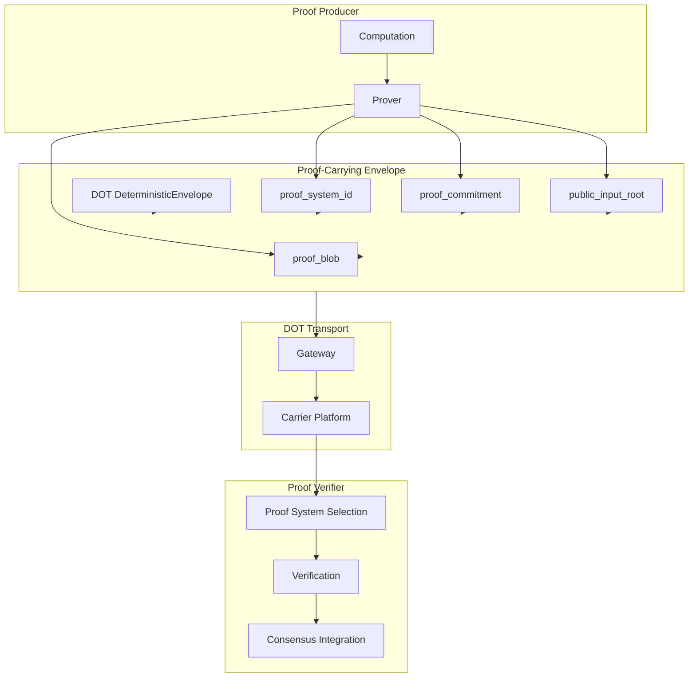

# RFC-0859: Proof-Carrying Envelopes (PCE)

## Status

Draft

## Authors

- Author: @cipherocto

## Maintainers

- Maintainer: @cipherocto

## Summary

Proof-Carrying Envelopes (PCE) extend the Deterministic Overlay Transport (DOT) envelope format to attach zero-knowledge proofs to overlay messages. PCE enables verifiable computation to propagate across the CipherOcto overlay network alongside regular coordination traffic.

PCE provides:

- Verifiable AI inference attestation across overlay hops
- Mission correctness proofs attached to coordination messages
- Validator proofs distributed through DOT transport
- Privacy-preserving execution attestations
- Cross-platform proof propagation via any DOT carrier
- Recursive proof aggregation over envelope sequences
- Deterministic proof verification at consensus boundary

PCE transforms DOT envelopes from opaque message carriers into **cryptographically verifiable computation attestations**. A Proof-Carrying Envelope proves that a specific computation was performed correctly without revealing the computation's internals.

## Dependencies

**Requires:**

- RFC-0850 (Networking): Deterministic Overlay Transport — envelope format
- RFC-0853 (Networking): Overlay Cryptography — cryptographic primitives
- RFC-0854 (Networking): Deterministic Proof Substrate — proof system abstraction

**Optional:**

- RFC-0630 (Proof Systems): Proof-of-Inference Consensus — AI inference proofs
- RFC-0650 (Proof Systems): Proof Aggregation Protocol — recursive aggregation
- RFC-0631 (Proof Systems): Proof-of-Dataset Integrity — dataset proofs
- RFC-0855 (Networking): Mission Overlay Networks — mission-scoped proofs
- RFC-0857 (Networking): Deterministic Overlay Mempool — proof-carrying intent submission
- RFC-0860 (Networking): Proof-of-Relay — relay attestation
- RFC-0104 (Numeric): DFP — deterministic floating point for consensus-critical arithmetic
- RFC-0105 (Numeric): DQA — deterministic quant arithmetic for proof sizing and fee computation

## Design Goals

| Goal | Target | Metric |
|------|--------|--------|
| G1: Proof Attachment | Any DOT envelope can carry a proof | 100% envelope compatibility |
| G2: Deterministic Verification | Identical verify result across all nodes | 100% consensus consistency |
| G3: Proof System Agnostic | Support 3+ proof backends | STARK, PLONK, Groth16 at minimum |
| G4: Verification Latency | <100ms per proof | Measured on commodity hardware |
| G5: Payload Efficiency | <50% overhead vs bare envelope | Proof size as fraction of envelope |
| G6: Recursive Aggregation | Aggregate N proofs into 1 | O(1) verification for aggregated proofs |
| G7: Privacy Preservation | Zero computation leakage | Only public inputs and verification result exposed |

## Motivation

### CAN WE? — Feasibility Research

The fundamental question: **Can we attach zero-knowledge proofs to overlay envelopes and verify them deterministically across heterogeneous gateways?**

Research confirms feasibility:

- The ZKP market is projected to grow from $1.28B (2024) to $7.59B (2033) at 22.1% CAGR (see `docs/research/ZKP_Research_Report.md`)
- zk-STARKs provide transparency (no trusted setup), quantum resistance, and O(N × poly-log N) prover complexity
- Cairo enables ZKML for verifiable AI inference (see `docs/research/cairo-ai-research-report.md`)
- Multiple production proof frameworks exist: RISC Zero, SP1, Winterfell, StarkWare STWO (see `docs/genesis-implementation-guide.md`)
- RFC-0650 already defines proof aggregation with O(1) verification via recursive STARK
- RFC-0630 defines proof-of-inference consensus for AI execution

The CipherOcto architecture is naturally aligned with ZK:

| CipherOcto Property | ZK Compatibility |
|---------------------|------------------|
| Deterministic execution | Excellent — witness generation is reproducible |
| Merkle-heavy state | Native — hash-centric design |
| Replay-safe envelopes | Native — canonical serialization |
| Hash-oriented pipelines | Native — BLAKE3 everywhere |
| Parallel proving | Excellent — independent envelope proofs |
| Mission overlays | Excellent — scoped proof domains |

### WHY? — Why This Matters

Without PCE:

- AI inference results are unverifiable — agents can lie about computation
- Mission execution is opaque — no proof of correct task completion
- Relay behavior is unauditable — gateways can claim false participation
- Distributed execution lacks trust — no cryptographic attestation
- Privacy requires full trust — cannot verify without revealing

PCE enables **cryptographically attested overlay civilizations** where every computation, relay, and execution can be independently verified.

### Relationship to Existing RFCs

| RFC | Relationship |
|-----|-------------|
| RFC-0630 | PCE transports proof-of-inference attestations over DOT |
| RFC-0650 | PCE uses aggregation protocol for recursive proof composition |
| RFC-0631 | PCE transports dataset integrity proofs |
| RFC-0854 | PCE uses DPS as the proof system abstraction layer |
| RFC-0850 | PCE extends DOT envelope format with proof attachment |
| RFC-0853 | PCE uses OCrypt for proof encryption and signing |

## Specification

### 1. System Architecture



### 2. Proof-Carrying Envelope Structure

```rust
/// A DOT envelope with an attached zero-knowledge proof.
///
/// The envelope itself is a standard DOT DeterministicEnvelope (RFC-0850).
/// The proof fields provide cryptographic attestation of computation.
///
/// Determinism requirement: ALL fields use canonical serialization (RFC-0126).
#[derive(Clone, Debug)]
#[repr(C)]
struct ProofCarryingEnvelope {
    /// The underlying DOT envelope (RFC-0850)
    envelope: DeterministicEnvelope,

    /// Identifier for the proof system used (see Section 3)
    proof_system_id: u16,

    /// BLAKE3-256 of the proof blob for integrity verification
    proof_commitment: [u8; 32],

    /// Merkle root of the public inputs to the proof
    public_input_root: [u8; 32],

    /// The serialized proof bytes (opaque to transport, verified by backend)
    proof_blob: Vec<u8>,

    /// Optional: execution model used (see Section 3.2)
    execution_model: u16,

    /// Optional: parent proof for recursive aggregation
    parent_proof_commitment: Option<[u8; 32]>,
}
```

**Construction Algorithm:**

```text
1. Compute the proof using the appropriate prover backend
2. Serialize the proof blob using RFC-0126 DCS
3. Compute proof_commitment = BLAKE3-256(proof_blob)
4. Compute public_input_root = Merkle(public_inputs)
5. Wrap in ProofCarryingEnvelope with the DOT envelope
6. Sign the PCE envelope (extends RFC-0850 signature over proof fields)
```

**Signature Coverage:**

The PCE signature MUST cover:

```text
signature = Ed25519_sign(
    private_key,
    canonical_bytes(envelope) ||
    proof_system_id ||
    proof_commitment ||
    public_input_root ||
    execution_model ||
    parent_proof_commitment (or 0x00 if None)
)
```

This ensures proof attachment cannot be tampered with or detached without invalidating the signature.

### 3. Proof System Registry

#### 3.1 Supported Proof Systems

```rust
/// Identifies the proof system backend.
///
/// Each backend has different performance, proof size, and verification
/// characteristics. The registry is extensible — new backends are added
/// via the proof system registration protocol.
#[repr(u16)]
enum ProofSystemId {
    /// StarkWare STWO — STARK prover, no trusted setup, SIMD-optimized
    STWO = 0x0001,
    /// RISC Zero — zkVM, RISC-V execution traces
    RiscZero = 0x0002,
    /// SP1 — zkVM, RISC-V, recursive proving
    SP1 = 0x0003,
    /// Winterfell — STARK prover by Meta, AIR-based
    Winterfell = 0x0004,
    /// Halo2 — PLONK-based, used by Zcash
    Halo2 = 0x0005,
    /// Groth16 — SNARK, smallest proofs, requires trusted setup
    Groth16 = 0x0006,
    /// PLONK — Universal SNARK, no per-circuit trusted setup
    PLONK = 0x0007,
    /// Cairo — StarkWare's native execution model
    Cairo = 0x0008,
    // 0x0009-0xFFFF: Reserved for future proof systems
}
```

#### 3.2 Execution Models

```rust
/// The computation model used for proof generation.
///
/// This determines how the proof's circuit/constraints are structured.
#[repr(u16)]
enum ProofCircuitModel {
    /// AIR constraints (STARK-native)
    AIR = 0x0001,
    /// R1CS (rank-1 constraint system, SNARK-native)
    R1CS = 0x0002,
    /// PLONKish (customizable gate constraints)
    PLONKISH = 0x0003,
    /// zkVM (virtual machine execution trace)
    zkVM = 0x0004,
    /// Recursive composition of inner proofs
    Recursive = 0x0005,
    // 0x0006-0xFFFF: Reserved for future circuit models
}
```

#### 3.3 Proof System Capabilities

Each registered proof system declares its capabilities:

```rust
struct ProofSystemCapabilities {
    /// Proof system identifier
    system_id: ProofSystemId,
    /// Execution model
    execution_model: ProofCircuitModel,
    /// Typical proof size in bytes
    typical_proof_size: u32,
    /// Typical verification time in microseconds
    typical_verify_time_us: u32,
    /// Whether the system requires a trusted setup
    requires_trusted_setup: bool,
    /// Whether the system supports recursive composition
    supports_recursion: bool,
    /// Whether the system is quantum-resistant
    quantum_resistant: bool,
    /// Maximum supported circuit size (in constraints)
    max_circuit_size: u64,
}
```

**Default Capabilities Table:**

| System | Proof Size | Verify Time | Trusted Setup | Recursive | Quantum-Resistant |
|--------|-----------|-------------|---------------|-----------|-------------------|
| STWO | ~50KB | ~10ms | No | Yes | Yes |
| RiscZero | ~100KB | ~50ms | No | Yes | Yes |
| SP1 | ~100KB | ~50ms | No | Yes | Yes |
| Winterfell | ~50KB | ~10ms | No | Yes | Yes |
| Halo2 | ~1KB | ~5ms | Universal | No | No |
| Groth16 | ~256B | ~2ms | Per-circuit | No | No |
| PLONK | ~1KB | ~5ms | Universal | Yes | No |
| Cairo | ~50KB | ~10ms | No | Yes | Yes |

### 4. Proof Types

#### 4.1 Supported Proof Types

```rust
/// The semantic type of proof attached to an envelope.
#[repr(u16)]
enum ProofType {
    /// AI inference execution proof (RFC-0630)
    InferenceProof = 0x0001,
    /// Dataset integrity proof (RFC-0631)
    DatasetIntegrityProof = 0x0002,
    /// Mission execution correctness proof
    MissionExecutionProof = 0x0003,
    /// Relay behavior proof (RFC-0860)
    RelayProof = 0x0004,
    /// Validator attestation proof
    ValidatorAttestation = 0x0005,
    /// Aggregated recursive proof (RFC-0650)
    AggregatedProof = 0x0006,
    /// Privacy-preserving membership proof
    MembershipProof = 0x0007,
    /// State transition proof
    StateTransitionProof = 0x0008,
    /// Custom proof type (registered)
    Custom(u16),
}
```

#### 4.2 Proof Type Metadata

```rust
/// Metadata attached to every proof for routing and verification.
#[derive(Clone, Debug)]
#[repr(C)]
struct ProofMetadata {
    /// The semantic proof type
    proof_type: ProofType,
    /// The proof system used
    proof_system: ProofSystemId,
    /// Execution model
    execution_model: ProofCircuitModel,
    /// Timestamp when proof was generated (logical, not wall-clock)
    generation_timestamp: u64,
    /// Optional: the computation hash being proved
    computation_hash: Option<[u8; 32]>,
    /// Optional: the dataset hash (for dataset integrity proofs)
    dataset_hash: Option<[u8; 32]>,
    /// Optional: the mission ID (for mission execution proofs)
    mission_id: Option<[u8; 32]>,
}
```

### 5. Verification Pipeline

#### 5.1 Deterministic Verification

Verification MUST be deterministic at the consensus boundary.

```rust
/// Result of proof verification.
#[derive(Clone, Copy, Debug, PartialEq, Eq)]
#[repr(u8)]
enum VerificationResult {
    /// Proof is valid — computation was performed correctly
    Valid = 0x00,
    /// Proof is invalid — verification failed
    Invalid = 0x01,
    /// Proof system not supported by this verifier
    UnsupportedSystem = 0x02,
    /// Proof blob is malformed
    MalformedProof = 0x03,
    /// Public inputs do not match commitment
    InputMismatch = 0x04,
}
```

#### 5.2 Verification Algorithm

```text
function verify_proof_carrying_envelope(pce):
    // Step 1: Verify envelope signature (includes proof fields)
    if not verify_signature(pce.envelope, pce.proof_fields):
        return Invalid

    // Step 2: Verify proof commitment
    if BLAKE3-256(pce.proof_blob) != pce.proof_commitment:
        return Invalid

    // Step 3: Select proof system backend
    backend = select_backend(pce.proof_system_id)
    if backend is null:
        return UnsupportedSystem

    // Step 4: Deserialize proof
    proof = backend.deserialize_proof(pce.proof_blob)
    if proof is Error:
        return MalformedProof

    // Step 5: Verify public inputs match commitment
    if Merkle(public_inputs) != pce.public_input_root:
        return InputMismatch

    // Step 6: Verify the proof
    result = backend.verify(
        verification_key,
        public_inputs,
        proof
    )

    // Step 7: Return deterministic result
    return result ? Valid : Invalid
```

#### 5.3 Execution Class Mapping (RFC-0008)

All PCE operations MUST be explicitly mapped to RFC-0008 execution classes:

| Operation | Class | Rationale |
|-----------|-------|-----------|
| Proof generation | Class C | Probabilistic — depends on prover runtime, hardware, witness generation |
| Proof blob serialization | Class C | May vary across prover implementations |
| Proof commitment computation (BLAKE3-256) | Class A | Deterministic hash of proof blob |
| Public input root computation (Merkle) | Class A | Deterministic Merkle root |
| Proof verification | Class A | Deterministic verification algorithm |
| Aggregated proof verification | Class A | O(1) deterministic verification |
| Proof system selection | Class A | Deterministic lookup by proof_system_id |
| Signature verification | Class A | Ed25519 deterministic verification |

**Critical invariant:** Proof generation is Class C (non-deterministic). Proof verification is Class A (deterministic). Consensus depends ONLY on verification results, never on generation details.

#### 5.4 Canonical Proof Boundary (CRITICAL)

This is the hard determinism boundary for PCE. Violation is a consensus-critical bug.

**Consensus NEVER depends on:**

- Prover runtime or implementation (different provers may use different algorithms)
- Hardware acceleration used for proving (GPU, FPGA, ASIC, CPU)
- Proving time or wall-clock duration (proof generation is inherently non-deterministic)
- Memory layout during proof generation (heap vs stack, allocator behavior)
- Parallel execution order during proving (thread scheduling, work-stealing)
- Witness generation order (intermediate computation order)
- Proof blob byte equality (the same logical proof may serialize differently)

**Consensus MAY depend ONLY on:**

- `public_inputs` — the claimed inputs to computation (Merkle-committed)
- `canonical_verifier` — the proof system's deterministic verification algorithm
- `proof_bytes` — the serialized proof blob (as committed in proof_commitment)
- `verification_result` — the deterministic boolean result (Valid/Invalid)

**Enforcement:** The verification pipeline (Section 5.2) is the ONLY path from proof bytes to consensus state. No other code path may inspect proof generation details for consensus purposes.

**Violation of this boundary is a consensus-critical bug.**

#### 5.5 Parallel Verification

Proofs on independent envelopes MAY be verified in parallel. Verification of a single proof MUST be sequential and deterministic.

```text
// Parallel verification of independent envelopes
par_for pce in envelope_batch:
    result[pce] = verify_proof_carrying_envelope(pce)

// Results are deterministic regardless of parallel execution order
// because each verification is independent
```

### 6. Proof Attachment Protocol

#### 6.1 Attaching Proofs to Envelopes

Any DOT envelope MAY have a proof attached. The attachment process:

```text
1. Generate proof using appropriate prover (DPS backend)
2. Compute proof_commitment = BLAKE3-256(proof_blob)
3. Compute public_input_root = Merkle(public_inputs)
4. Create ProofCarryingEnvelope wrapping the DOT envelope
5. Sign the PCE (signature covers envelope + proof fields)
6. Inject PCE into DOT transport
```

#### 6.2 Proof Detachment

Proofs MAY be detached from envelopes for storage or aggregation. Detachment requires:

1. The proof_commitment is preserved in the envelope metadata
2. The proof_blob can be independently verified against proof_commitment
3. The original envelope signature remains valid

#### 6.3 Proof Replacement

Proofs MAY be replaced with equivalent or stronger proofs:

- A STARK proof MAY replace a SNARK proof (stronger security assumptions)
- An aggregated proof MAY replace multiple individual proofs
- A proof from a more efficient backend MAY replace a slower one

Replacement MUST preserve the public_input_root commitment.

### 7. Recursive Proof Aggregation

#### 7.1 Aggregation Model

Multiple proofs across multiple envelopes MAY be aggregated into a single recursive proof.

```rust
/// An aggregated proof combining multiple envelope proofs.
#[derive(Clone, Debug)]
#[repr(C)]
struct AggregatedProof {
    /// The inner proofs being aggregated
    inner_proof_commitments: Vec<[u8; 32]>,
    /// The aggregated proof blob
    aggregated_blob: Vec<u8>,
    /// The aggregation proof system
    aggregation_system: ProofSystemId,
    /// The aggregated public input root
    aggregated_public_input_root: [u8; 32],
    /// Number of proofs aggregated
    proof_count: u32,
}
```

#### 7.2 Aggregation Algorithm

```text
function aggregate_proofs(pces: Vec<ProofCarryingEnvelope>):
    // Step 1: Verify all inner proofs individually
    for pce in pces:
        if verify(pce) != Valid:
            return Error

    // Step 2: Collect proof commitments
    commitments = pces.map(|pce| pce.proof_commitment)

    // Step 3: Compute aggregated public input root
    aggregated_root = Merkle(commitments)

    // Step 4: Generate recursive aggregation proof
    // The inner circuit proves "all these proofs are valid"
    aggregated_proof = recursive_prove(
        aggregation_system,
        commitments,
        pces.map(|pce| pce.proof_blob)
    )

    // Step 5: Return aggregated proof
    return AggregatedProof {
        inner_proof_commitments: commitments,
        aggregated_blob: serialized(aggregated_proof),
        aggregation_system: STWO,  // preferred for recursion
        aggregated_public_input_root: aggregated_root,
        proof_count: pces.len(),
    }
```

#### 7.3 Aggregated Verification

Verification of an aggregated proof is O(1) regardless of the number of inner proofs:

```text
function verify_aggregated(agg: AggregatedProof):
    backend = select_backend(agg.aggregation_system)
    return backend.verify(
        verification_key,
        agg.aggregated_public_input_root,
        agg.aggregated_blob
    )
```

### 8. Mission-Scoped Proofs

#### 8.1 Mission Proof Domains

Each Mission Overlay Network (RFC-0855) MAY define its own proof requirements:

```rust
struct MissionProofPolicy {
    /// Mission identifier
    mission_id: [u8; 32],
    /// Required proof types for this mission
    required_proof_types: Vec<ProofType>,
    /// Allowed proof systems
    allowed_proof_systems: Vec<ProofSystemId>,
    /// Minimum security level (proof size in bits)
    min_security_level: u16,
    /// Whether recursive aggregation is required
    require_aggregation: bool,
    /// Maximum proof age (in logical timestamps)
    max_proof_age: u64,
}
```

#### 8.2 Mission Proof Examples

| Mission Type | Required Proofs | Proof System | Rationale |
|-------------|-----------------|-------------|-----------|
| AI Inference | InferenceProof | STWO/Cairo | Verifiable AI execution |
| Financial Settlement | StateTransitionProof | Groth16/PLONK | Minimal proof size |
| Data Integrity | DatasetIntegrityProof | STARK | No trusted setup |
| Relay Audit | RelayProof | STWO | Efficient aggregation |
| Governance | ValidatorAttestation | Any | Flexible |

### 9. DOM Integration

PCE integrates with the Deterministic Overlay Mempool (RFC-0857) for proof-carrying intent submission:

- The `ProofSubmission` intent type in DOM carries a `ProofCarryingEnvelope` as its payload
- PCE proof verification results determine whether the `ProofSubmission` intent is admitted to the mempool
- Invalid proofs cause the intent to be rejected at the admission layer
- Valid proofs are propagated via DGP (RFC-0852) alongside the intent

```rust
// DOM intent carrying a PCE
struct ProofSubmissionIntent {
    intent_type: IntentType::ProofSubmission,
    pce: ProofCarryingEnvelope,
    // ... other OverlayIntent fields
}
```

### 10. Error Types

```rust
#[repr(u16)]
enum PceError {
    /// Proof signature verification failed
    InvalidSignature = 0x0001,
    /// proof_commitment does not match proof_blob
    CommitmentMismatch = 0x0002,
    /// Unsupported proof_system_id
    UnsupportedSystem = 0x0003,
    /// Proof blob failed parsing or structure validation
    MalformedProof = 0x0004,
    /// public_inputs do not match proof
    InputMismatch = 0x0005,
    /// Aggregation failure
    AggregationError { reason: String } = 0x0006,
}
```

### 11. Token Economics

PCE integrates with CipherOcto's multi-token economy:

| Activity | Token | Rationale |
|----------|-------|-----------|
| Proof generation | OCTO-A | GPU compute for proving |
| Proof verification | OCTO-N | Node operation for verification |
| Proof relay | OCTO-B | Bandwidth for proof transport |
| Proof aggregation | OCTO-O | Orchestration of recursive composition |
| Proof archival | OCTO-S | Long-term proof storage |

**Proof Market Dynamics:**

- **Supply:** Provers with GPU/FPGA hardware generating proofs
- **Demand:** Missions requiring verifiable computation
- **Price:** Per-proof fee based on circuit complexity and proof system

## Performance Targets

| Metric | Target | Measurement |
|--------|--------|-------------|
| Proof attachment overhead | <1ms | Time to wrap envelope with proof |
| Proof verification (STARK) | <50ms | Single proof on commodity hardware |
| Proof verification (SNARK) | <10ms | Single proof on commodity hardware |
| Recursive aggregation | <500ms | Aggregate 100 proofs |
| Aggregated verification | <50ms | O(1) regardless of count |
| Proof size (STARK) | <100KB | Typical inference proof |
| Proof size (SNARK) | <1KB | Groth16 proof |
| Parallel verification throughput | >1000 proofs/s | 8-core commodity machine |
| Envelope PCE overhead | <50% | Proof fields vs bare envelope |

**Maximum Verification Latency (per proof system):**

| Proof System | Max Verification Latency | Rationale |
|-------------|-------------------------|-----------|
| STARK (STWO/Winterfell/Cairo) | <100ms | Must not block block production |
| PLONK | <50ms | Succinct verification |
| Halo2 | <80ms | PLONKish verification |
| Groth16 | <20ms | Smallest proofs, fastest verify |
| RISC Zero / SP1 (zkVM) | <200ms | Larger verification circuits |
| Aggregated (RFC-0650) | <10ms | O(1) regardless of child count |

Exceeding these latencies triggers a performance degradation warning. Consensus nodes MUST reject proofs that exceed 2x the max latency to prevent verification DoS.

## Security Considerations

### Consensus Attacks

| Attack | Impact | Mitigation |
|--------|--------|------------|
| Proof forgery | Critical | Proof system cryptographic guarantees |
| Verification bypass | Critical | Deterministic verification at every node |
| Consensus boundary violation | Critical | Strict separation: only verification result in consensus |
| Public input manipulation | High | Merkle commitment to inputs |

### Economic Exploits

| Attack | Impact | Mitigation |
|--------|--------|------------|
| Proof spam | Medium | OCTO-A cost for proof generation |
| Verification DoS | Medium | Rate limiting, proof size limits |
| Free-riding on proofs | Low | Proof commitment prevents reuse without verification |

### Privacy Attacks

| Attack | Impact | Mitigation |
|--------|--------|------------|
| Computation inference from proof | Low | ZK property — proof reveals nothing beyond validity |
| Input inference | Low | Only public_input_root is visible, not inputs |
| Proof system fingerprinting | Low | Multiple supported backends |

## Adversarial Review

| Threat | Impact | Mitigation | Verification |
|--------|--------|------------|--------------|
| Invalid proof acceptance | Critical | Cryptographic soundness of proof system | Fuzz testing with invalid proofs |
| Valid proof rejection | High | Correct implementation of verification | Test vectors for each proof system |
| Proof system downgrade attack | Medium | Mission policy enforcement | Policy compliance test |
| Recursive proof manipulation | High | Inner proof commitment verification | Aggregation test vectors |
| Consensus boundary breach | Critical | Code-level enforcement of separation | Static analysis + review |
| Proof blob tampering | High | proof_commitment = BLAKE3-256(proof_blob) | Commitment verification test |
| Cross-mission proof replay | Medium | mission_id scoping | Replay detection test |

## Economic Analysis

### Proof Generation Market

The proof generation market creates demand for specialized hardware:

| Hardware | Proving Speed | Cost | Use Case |
|----------|--------------|------|----------|
| GPU (RTX 4090) | ~1s for STARK | $1,500 | General proving |
| FPGA | ~100ms for STARK | $10,000 | High-throughput proving |
| ASIC | ~10ms for STARK | $100,000+ | Enterprise proving |
| CPU (AVX-512) | ~10s for STARK | $500 | Low-priority proofs |

### Verification Economics

Verification is cheap compared to generation:

- STARK verification: ~10ms, can be done by any node
- SNARK verification: ~2ms, minimal resource usage
- Aggregated verification: ~50ms for any batch size

This asymmetry (expensive to prove, cheap to verify) is the fundamental economic property enabling PCE.

## Compatibility

### Backward Compatibility

- PCE is an extension of DOT envelopes — bare envelopes without proofs continue to work
- Gateways that do not support PCE can relay PCE envelopes as opaque blobs
- Proof verification is optional for non-consensus participants

### Forward Compatibility

- `ProofSystemId` is extensible (0x0009-0xFFFF reserved)
- `ProofCircuitModel` is extensible
- `ProofType` is extensible
- New proof backends are registered via the proof system registration protocol

### RFC-0854 Integration

PCE uses the Deterministic Proof Substrate as its proof system abstraction:

- `DeterministicProofSystem` trait from RFC-0854 is the verification interface
- Proof system registration uses RFC-0854's registry protocol
- Execution models align with RFC-0854's `ProofCircuitModel` enum

## Test Vectors

### Proof Attachment

```text
Input:
  envelope = standard DOT envelope (see RFC-0850 test vectors)
  proof_system_id = 0x0001 (STWO)
  proof_blob = [0x01, 0x02, ..., 0xFF] (256 bytes)
  public_inputs = [b"input1", b"input2"]

Expected:
  proof_commitment = BLAKE3-256(proof_blob)
  public_input_root = Merkle(BLAKE3-256("input1"), BLAKE3-256("input2"))
  signature covers: envelope_bytes || 0x0001 || proof_commitment || public_input_root || 0x0001 || 0x00
```

### Verification Result

```text
Input:
  valid_proof = correctly generated STARK proof
  invalid_proof = random bytes

Expected:
  verify(valid_proof) = Valid
  verify(invalid_proof) = Invalid or MalformedProof
```

### Aggregation

```text
Input:
  pces = [PCE_1, PCE_2, PCE_3] (three valid PCEs)

Expected:
  aggregate(pces) produces AggregatedProof with:
    proof_count = 3
    inner_proof_commitments = [c1, c2, c3]
    aggregated_public_input_root = Merkle(c1, c2, c3)
  verify_aggregated(aggregated) = Valid
```

## Alternatives Considered

| Approach | Pros | Cons | Decision |
|----------|------|------|----------|
| Inline verification (every hop) | Maximum trust | Impractical — too expensive | Rejected |
| Off-chain proof channel | No envelope overhead | Loses transport integration | Rejected |
| Single proof system (STWO only) | Simplest | Locks to one vendor | Rejected |
| Proof as separate envelope | Compatible with bare DOT | Loses binding guarantee | Rejected |
| Merkle inclusion proofs only | Lightweight | Not ZK — reveals data | Rejected |

**Decision:** PCE attaches proofs to DOT envelopes, supporting multiple proof backends via the DPS abstraction layer.

## Implementation Phases

### Phase 1: Core Structure and STWO Backend (Months 1-3)

**Goal:** PCE envelope format with STARK verification.

| Task | Description | RFC Dependency |
|------|-------------|----------------|
| 1.1 | Implement `ProofCarryingEnvelope` struct | RFC-0850 |
| 1.2 | Implement `ProofSystemId` and `ProofCircuitModel` enums | — |
| 1.3 | Implement `ProofMetadata` struct | — |
| 1.4 | Implement proof commitment computation (BLAKE3-256) | — |
| 1.5 | Implement public input Merkle root computation | — |
| 1.6 | Implement STWO backend integration | RFC-0854 |
| 1.7 | Implement deterministic verification pipeline | — |
| 1.8 | Extend PCE signature to cover proof fields | RFC-0853 |
| 1.9 | Write unit tests for PCE construction and verification | — |

**Deliverables:** PCE format, STWO verification, signature extension, tests.

### Phase 2: Multi-Backend Support (Months 3-6)

**Goal:** Support for RISC Zero, SP1, Halo2, Groth16, PLONK.

| Task | Description | RFC Dependency |
|------|-------------|----------------|
| 2.1 | Implement RISC Zero backend adapter | RFC-0854 |
| 2.2 | Implement SP1 backend adapter | RFC-0854 |
| 2.3 | Implement Halo2 backend adapter | RFC-0854 |
| 2.4 | Implement Groth16 backend adapter | RFC-0854 |
| 2.5 | Implement PLONK backend adapter | RFC-0854 |
| 2.6 | Implement proof system capability registry | — |
| 2.7 | Implement backend selection logic | — |
| 2.8 | Write backend-specific test vectors | — |

**Deliverables:** 6 proof backends, capability registry, test vectors.

### Phase 3: Aggregation and Mission Integration (Months 6-9)

**Goal:** Recursive proof aggregation and mission-scoped proof policies.

| Task | Description | RFC Dependency |
|------|-------------|----------------|
| 3.1 | Implement `AggregatedProof` struct | RFC-0650 |
| 3.2 | Implement recursive proof aggregation | RFC-0650 |
| 3.3 | Implement aggregated verification (O(1)) | RFC-0650 |
| 3.4 | Implement `MissionProofPolicy` | RFC-0855 |
| 3.5 | Implement mission proof policy enforcement | RFC-0855 |
| 3.6 | Implement proof type routing | — |
| 3.7 | Write aggregation test vectors | — |
| 3.8 | Write mission policy compliance tests | — |

**Deliverables:** Aggregation, mission policies, compliance tests.

### Phase 4: Economics and Advanced Features (Months 9-12)

**Goal:** Proof market integration, parallel verification, production hardening.

| Task | Description | RFC Dependency |
|------|-------------|----------------|
| 4.1 | Implement proof generation cost accounting (OCTO-A) | — |
| 4.2 | Implement verification reward accounting (OCTO-N) | — |
| 4.3 | Implement parallel verification pipeline | — |
| 4.4 | Implement proof caching for repeated verification | — |
| 4.5 | Implement proof compression for bandwidth optimization | — |
| 4.6 | Write performance benchmarks | — |
| 4.7 | Write adversarial test suite | — |
| 4.8 | Production hardening and stress testing | — |

**Deliverables:** Economics, parallel verification, benchmarks, adversarial tests.

## Key Files to Modify

| File | Change |
|------|--------|
| `crates/octo-network/src/dot/pce/mod.rs` | PCE module root |
| `crates/octo-network/src/dot/pce/envelope.rs` | ProofCarryingEnvelope struct |
| `crates/octo-network/src/dot/pce/proof_type.rs` | ProofType and ProofMetadata |
| `crates/octo-network/src/dot/pce/registry.rs` | Proof system registry |
| `crates/octo-network/src/dot/pce/verify.rs` | Deterministic verification pipeline |
| `crates/octo-network/src/dot/pce/aggregate.rs` | Recursive aggregation |
| `crates/octo-network/src/dot/pce/policy.rs` | Mission proof policies |
| `crates/octo-network/src/dot/pce/backends/mod.rs` | Backend trait |
| `crates/octo-network/src/dot/pce/backends/stwo.rs` | STWO adapter |
| `crates/octo-network/src/dot/pce/backends/risc_zero.rs` | RISC Zero adapter |
| `crates/octo-network/src/dot/pce/backends/sp1.rs` | SP1 adapter |
| `crates/octo-network/src/dot/pce/backends/halo2.rs` | Halo2 adapter |
| `crates/octo-network/src/dot/pce/backends/groth16.rs` | Groth16 adapter |
| `crates/octo-network/src/dot/pce/backends/plonk.rs` | PLONK adapter |

## Future Work

- F1: Proof-of-Inference integration (RFC-0630) — AI model execution proofs
- F2: Proof-of-Dataset integration (RFC-0631) — training data integrity
- F3: Proof-of-Relay integration (RFC-0860) — gateway behavior proofs
- F4: Proof compression for low-bandwidth carriers (LoRa, Bluetooth)
- F5: GPU-accelerated verification for high-throughput gateways
- F6: Cross-chain proof bridges (Ethereum, NEAR, Solana)
- F7: Proof privacy extensions (encrypted proofs for stealth missions)
- F8: Proof delegation (offload proving to specialized hardware nodes)

## Rationale

### Why attach proofs to envelopes instead of separate channels?

Separate proof channels lose the binding guarantee — a proof could be associated with the wrong computation. By embedding proofs in the envelope, the signature covers both the message and its attestation.

### Why support multiple proof backends?

Different use cases have different tradeoffs:

- AI inference: STARK (no trusted setup, large circuits)
- Financial privacy: SNARK (minimal proof size, fast verification)
- Embedded devices: Groth16 (smallest proofs)
- Research: Cairo (native ZKML support)

Locking to one backend would exclude valid use cases.

### Why recursive aggregation?

Without aggregation, N proofs require N verifications. With recursive aggregation, N proofs require 1 verification. This is critical for:

- High-throughput mission overlays with thousands of envelopes
- Bandwidth-constrained carriers (LoRa, Bluetooth)
- Consensus nodes that must verify all proofs in a block

## Version History

| Version | Date | Changes |
|---------|------|---------|
| 1.0.0 | 2026-05-25 | Initial draft — PCE format, proof systems, verification, aggregation, phases |
| 1.1.0 | 2026-05-26 | Adversarial review fixes: canonical proof boundary, RFC-0008 execution classes, verification latency, DOM integration, deterministic numerics |

## Related RFCs

- RFC-0850 (Networking): Deterministic Overlay Transport — envelope format
- RFC-0853 (Networking): Overlay Cryptography — cryptographic primitives
- RFC-0854 (Networking): Deterministic Proof Substrate — proof abstraction layer
- RFC-0855 (Networking): Mission Overlay Networks — mission-scoped proofs
- RFC-0860 (Networking): Proof-of-Relay — relay behavior proofs
- RFC-0630 (Proof Systems): Proof-of-Inference Consensus — AI inference proofs
- RFC-0650 (Proof Systems): Proof Aggregation Protocol — recursive aggregation
- RFC-0631 (Proof Systems): Proof-of-Dataset Integrity — dataset proofs

## Related Use Cases

- [Verifiable AI Agents in DeFi](../../docs/use-cases/verifiable-ai-agents-defi.md)
- [Verifiable Reasoning Traces](../../docs/use-cases/verifiable-reasoning-traces.md)
- [Probabilistic Verification Markets](../../docs/use-cases/probabilistic-verification-markets.md)
- [Provable Quality of Service](../../docs/use-cases/provable-quality-of-service.md)
