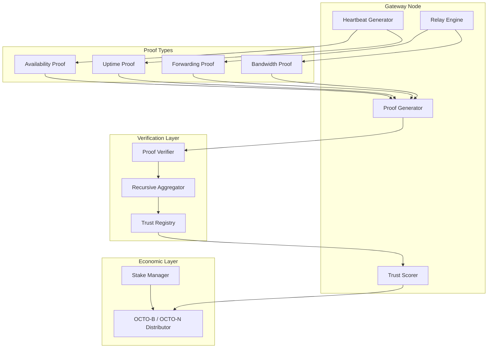

# RFC-0860: Proof-of-Relay (PoRelay)

## Status

Draft

## Authors

- Author: @cipherocto

## Maintainers

- Maintainer: @cipherocto

## Summary

Proof-of-Relay (PoRelay) defines how CipherOcto overlay gateways cryptographically prove their relay participation for economic validation, trust scoring, and Sybil resistance.

PoRelay provides:

- Cryptographic proof of message forwarding
- Availability attestation via heartbeats
- Bandwidth proof through envelope accounting
- Uptime proof via continuous participation
- Recursive aggregation from local to global proofs
- Trust-scored relay weighting for deterministic routing
- Economic validation for OCTO-B and OCTO-N reward distribution
- Anti-Sybil resistance through stake-gated proof generation

The key innovation: **gateways earn rewards proportional to cryptographically verified relay work, not self-reported claims.** All proofs are verifiable without revealing payload contents.

## Dependencies

**Requires:**

- RFC-0850 (Networking): DOT — envelope format, gateway identity
- RFC-0851 (Networking): GDP — gateway discovery, capability advertisement
- RFC-0853 (Networking): OCrypt — signatures, commitments
- RFC-0854 (Networking): DPS — proof substrate abstraction

**Optional:**

- RFC-0630 (Proof Systems): Proof-of-Inference — related proof mechanism
- RFC-0650 (Proof Systems): Proof Aggregation — recursive aggregation primitives
- RFC-0104 (Numeric): DFP — deterministic floating point for consensus-critical arithmetic
- RFC-0105 (Numeric): DQA — deterministic quant arithmetic for trust score and reward computation

## Design Goals

| Goal | Target | Metric |
|------|--------|--------|
| G1: Proof Compactness | <1KB per relay proof | Serialized proof size |
| G2: Verification Speed | <5ms per proof | Ed25519 + hash verification |
| G3: Aggregation Efficiency | 1000:1 compression | Proofs per aggregated proof |
| G4: Trust Accuracy | >95% correlation | Trust score vs actual reliability |
| G5: Sybil Resistance | >99% detection | Fake gateway identification |
| G6: Privacy | Zero payload leakage | Proofs reveal no message content |
| G7: Economic Fairness | Proportional rewards | Reward ∝ verified work |

## Motivation

### CAN WE? — Feasibility Research

The fundamental question: **Can gateways prove relay work without revealing message contents?**

Research confirms feasibility through:

- **Hash commitments** allow proving knowledge of data without revealing it
- **Merkle trees** enable efficient proof of inclusion for relay chains
- **Recursive STARK aggregation** (RFC-0854) compresses thousands of relay proofs into one
- **Heartbeat signatures** provide continuous availability attestation
- **Bandwidth accounting** with signed envelope receipts creates verifiable relay counts

The existing CipherOcto proof stack (RFC-0630 Proof-of-Inference, RFC-0650 Proof Aggregation) provides the cryptographic primitives. PoRelay adapts them for networking relay verification.

### WHY? — Why This Matters

Without PoRelay:

- Gateway rewards require trusted self-reporting — easily gamed
- Trust scoring depends on reputation history — cold-start problem
- Sybil attacks are cheap — spinning up fake gateways costs nothing
- Route selection lacks verifiable quality metrics
- Economic incentives misaligned — gateways rewarded for claiming, not proving

PoRelay creates a **verifiable relay economy** where rewards flow to gateways that provably forward messages correctly.

### Relationship to Existing Proofs

| Proof System | What It Proves | Domain |
|-------------|---------------|--------|
| RFC-0630 (PoI) | AI inference correctness | Computation |
| RFC-0650 (Aggregation) | Recursive proof composition | Meta-proof |
| RFC-0860 (PoRelay) | Message relay correctness | Networking |

PoRelay is the networking complement to Proof-of-Inference. Together they cover the two primary resource types in CipherOcto: compute and bandwidth.

## Specification

### 1. System Architecture



### 2. Determinism Requirements (RFC-0008 Execution Classes)

All PoRelay operations MUST be explicitly mapped to RFC-0008 execution classes:

| Operation | Class | Rationale |
|-----------|-------|-----------|
| Forwarding proof generation | Class C | Depends on relay runtime state |
| Availability proof generation | Class C | Depends on heartbeat timing |
| Bandwidth proof generation | Class C | Depends on relay I/O |
| Uptime proof generation | Class C | Depends on continuous operation |
| Forwarding proof verification | Class A | Ed25519 + hash verification, deterministic |
| Availability proof verification | Class A | Signature + Merkle verification, deterministic |
| Bandwidth proof verification | Class A | Signature + Merkle verification, deterministic |
| Uptime proof verification | Class A | Signature + Merkle verification, deterministic |
| Trust score computation | Class A | Composite formula, deterministic arithmetic |
| Gateway heartbeat verification | Class A | Ed25519 + sequence monotonicity, deterministic |
| Score decay computation | Class A | Exponential decay formula, deterministic |
| Stake multiplier computation | Class A | Integer arithmetic, deterministic |
| Proof archival | Class B | Storage operations, configurable timeouts |
| Reward distribution | Class A | Proportional allocation, deterministic |

**Critical invariant:** Trust score computation MUST be Class A. All nodes MUST derive identical trust scores from identical proof sets. Use RFC-0104 DFP and RFC-0105 DQA for all consensus-critical arithmetic in score computation.

### 3. Proof Types

#### 2.1 Forwarding Proof

Proves that a gateway correctly forwarded an envelope to the next hop.

```rust
#[derive(Clone, Debug)]
#[repr(C)]
struct ForwardingProof {
    /// Gateway that performed the relay
    relay_gateway: [u8; 32],
    /// BLAKE3-256 of the forwarded envelope (NOT the payload)
    envelope_hash: [u8; 32],
    /// Destination domain or next-hop gateway
    destination: [u8; 32],
    /// Timestamp of forwarding (logical, per RFC-0850)
    logical_timestamp: u64,
    /// Sequence number (monotonic per gateway)
    sequence: u64,
    /// BLAKE3-256(destination || logical_timestamp || sequence)
    /// Proves the relay knew the correct destination at the correct time
    commitment: [u8; 32],
    /// Ed25519 signature over (relay_gateway || envelope_hash || commitment)
    signature: [u8; 64],
}
```

**Generation Algorithm:**

```text
1. Receive envelope E from upstream
2. Compute envelope_hash = BLAKE3-256(canonical_bytes(E))
3. Select next-hop destination D (per RFC-0856 deterministic route selection)
4. Compute commitment = BLAKE3-256(D || logical_timestamp || sequence)
5. Sign: signature = Ed25519_sign(relay_gateway || envelope_hash || commitment, private_key)
6. Forward envelope to D
7. Store ForwardingProof locally for aggregation
```

**Verification Algorithm:**

```text
1. Parse ForwardingProof P
2. Verify Ed25519_verify(P.relay_gateway || P.envelope_hash || P.commitment, P.signature, public_key)
3. Verify P.sequence > previous_sequence for this gateway (monotonicity)
4. Verify P.logical_timestamp is within acceptable window
5. If all checks pass: proof is VALID
```

**Privacy Property:** The proof reveals `envelope_hash` (a hash, not the envelope itself) and `destination` (a gateway ID, not payload content). Message contents are never exposed.

#### 2.2 Availability Proof

Proves that a gateway was online and responsive during a time window.

```rust
#[derive(Clone, Debug)]
#[repr(C)]
struct AvailabilityProof {
    /// Gateway being attested
    gateway_id: [u8; 32],
    /// Time window start (epoch number)
    window_start: u64,
    /// Time window end (epoch number)
    window_end: u64,
    /// Number of heartbeats sent in this window
    heartbeat_count: u32,
    /// Merkle root of heartbeat hashes in this window
    heartbeat_root: [u8; 32],
    /// Number of distinct peers contacted
    peer_diversity: u16,
    /// Ed25519 signature over all above fields (canonical serialization)
    signature: [u8; 64],
}
```

**Heartbeat Structure:**

```rust
#[derive(Clone, Debug)]
#[repr(C)]
struct GatewayHeartbeat {
    /// Gateway sending the heartbeat
    gateway_id: [u8; 32],
    /// Monotonically increasing sequence
    sequence: u64,
    /// Number of active relay routes
    active_routes: u32,
    /// Load class (0-255, where 0 = idle, 255 = saturated)
    load_class: u8,
    /// Uptime class (0-255, where 0 = just started, 255 = maximum uptime)
    uptime_class: u8,
    /// Logical timestamp
    logical_timestamp: u64,
    /// Ed25519 signature over all above fields
    signature: [u8; 64],
}
```

**Heartbeat Generation:**

```text
Every HEARTBEAT_INTERVAL (network-configured, default 30s):
1. Collect current metrics (active_routes, load_class, uptime_class)
2. Increment sequence (strictly monotonic)
3. Set logical_timestamp from overlay sequence model
4. Sign: signature = Ed25519_sign(canonical_fields, private_key)
5. Broadcast to connected peers
6. Store hash in local Merkle tree for window commitment
```

**Availability Score:**

```text
availability_score = heartbeat_count / expected_heartbeat_count
expected_heartbeat_count = window_duration / HEARTBEAT_INTERVAL
```

A gateway with `availability_score >= 0.95` is considered "highly available."

#### 2.3 Bandwidth Proof

Proves the volume of data a gateway relayed during a time window.

```rust
#[derive(Clone, Debug)]
#[repr(C)]
struct BandwidthProof {
    /// Gateway being attested
    gateway_id: [u8; 32],
    /// Time window (epoch range)
    window_start: u64,
    window_end: u64,
    /// Number of envelopes relayed
    envelope_count: u64,
    /// Total bytes relayed (sum of canonical envelope sizes)
    bytes_relayed: u64,
    /// Number of distinct source peers served
    source_diversity: u32,
    /// Number of distinct destinations served
    destination_diversity: u32,
    /// Merkle root of (envelope_hash, byte_count) pairs
    relay_merkle_root: [u8; 32],
    /// Ed25519 signature over all above fields
    signature: [u8; 64],
}
```

**Bandwidth Accounting:**

```text
For each envelope E relayed:
1. Compute envelope_hash = BLAKE3-256(canonical_bytes(E))
2. Record (envelope_hash, byte_count, source_peer, destination)
3. Add to window Merkle tree

At window end:
4. Compute relay_merkle_root over all (envelope_hash, byte_count) pairs
5. Compute source_diversity = |distinct source_peers|
6. Compute destination_diversity = |distinct destinations|
7. Sign bandwidth proof
```

#### 2.4 Uptime Proof

Proves continuous gateway operation over an extended period.

```rust
#[derive(Clone, Debug)]
#[repr(C)]
struct UptimeProof {
    /// Gateway being attested
    gateway_id: [u8; 32],
    /// Start of uptime period (epoch)
    start_epoch: u64,
    /// Current epoch (end of attested period)
    current_epoch: u64,
    /// Number of windows with availability_score >= 0.95
    compliant_windows: u32,
    /// Total number of windows in period
    total_windows: u32,
    /// Merkle root of AvailabilityProof commitments
    availability_root: [u8; 32],
    /// Ed25519 signature
    signature: [u8; 64],
}
```

**Uptime Score:**

```text
uptime_score = compliant_windows / total_windows
```

### 3. Relay Score Model

The RelayScore combines all proof types into a single trust metric.

```rust
#[derive(Clone, Debug)]
#[repr(C)]
struct RelayScore {
    /// Gateway being scored
    gateway_id: [u8; 32],
    /// Computation epoch
    epoch: u64,
    /// Forwarding score (0-1000)
    forwarding_score: u16,
    /// Availability score (0-1000)
    availability_score: u16,
    /// Bandwidth score (0-1000)
    bandwidth_score: u16,
    /// Uptime score (0-1000)
    uptime_score: u16,
    /// Diversity bonus (0-500)
    diversity_bonus: u16,
    /// Stake multiplier (1000 = 1.0x, 2000 = 2.0x)
    stake_multiplier: u32,
    /// Composite score (computed, not stored)
    /// composite = (forwarding * WF + availability * WA + bandwidth * WB + uptime * WU + diversity) * stake_multiplier / 1000
    composite: u64,
}
```

**Score Weights (network-configured constants):**

| Weight | Default (basis points) | Rationale |
|--------|------------------------|-----------|
| WF (forwarding) | 300 | Core relay function |
| WA (availability) | 250 | Must be online to relay |
| WB (bandwidth) | 200 | Volume of useful work |
| WU (uptime) | 150 | Long-term reliability |
| WD (diversity) | 100 | Anti-Sybil, anti-eclipse |
| **Total** | **1000** | Integer-only arithmetic (Class A) |

**Composite Score Calculation:**

```text
raw_score = forwarding_score * 300
          + availability_score * 250
          + bandwidth_score * 200
          + uptime_score * 150
          + diversity_bonus * 100

composite = raw_score * stake_multiplier / 1000
```

All weights are integer basis points (total=1000). No floating-point arithmetic (RFC-0008 Class A).

**Stake Multiplier:**

```text
stake_multiplier = 1000 + min(staked_OCTO_B / STAKE_UNIT, MAX_STAKE_BOOST)
```

Where `STAKE_UNIT` and `MAX_STAKE_BOOST` are network parameters. This ensures staking provides bounded benefit — sufficient to incentivize commitment but insufficient to allow wealth alone to dominate routing.

### 4. Recursive Proof Aggregation

Individual relay proofs are expensive to verify at scale. PoRelay uses recursive aggregation (per RFC-0854 DPS) to compress proofs.

#### 4.1 Aggregation Hierarchy

```text
Level 0: Individual relay proofs (per-envelope)
  ↓ aggregate per gateway per window
Level 1: Window proofs (per-gateway per-epoch)
  ↓ aggregate per region
Level 2: Regional proofs (per-region per-epoch)
  ↓ aggregate globally
Level 3: Global relay proof (per-epoch)
```

#### 4.2 Aggregation Structure

```rust
#[derive(Clone, Debug)]
struct AggregatedRelayProof {
    /// Aggregation level (0 = leaf, 3 = global)
    level: u8,
    /// Epoch this aggregation covers
    epoch: u64,
    /// Scope identifier (gateway_id for L1, region_id for L2, network_id for L3)
    scope: [u8; 32],
    /// Number of individual proofs aggregated
    proof_count: u32,
    /// Aggregate metrics
    total_envelopes: u64,
    total_bytes: u64,
    average_availability: u16,
    /// Merkle root of child proofs
    children_root: [u8; 32],
    /// STARK proof (via RFC-0854 DPS) proving all children are valid
    proof_blob: Vec<u8>,
    /// Ed25519 signature by aggregator
    signature: [u8; 64],
}
```

#### 4.3 Aggregation Algorithm

```text
Input: Set of child proofs {P1, P2, ..., Pn} at level L

1. Verify each child proof individually
2. Compute children_root = Merkle_root(commitment(P1) || ... || commitment(Pn))
3. Compute aggregate metrics:
   - total_envelopes = sum(child.total_envelopes)
   - total_bytes = sum(child.bytes_relayed)
   - average_availability = mean(child.availability_score)
4. Generate STARK proof:
   - Public inputs: children_root, aggregate_metrics
   - Private witness: individual child proofs
   - Circuit: "all children are valid AND metrics are correctly aggregated"
5. Sign aggregated proof
```

**Verification:** O(1) regardless of `proof_count` — verifier checks the STARK proof and signature, not individual children.

### 5. Trust Registry

The Trust Registry maintains composite scores for all known gateways.

```rust
struct TrustRegistry {
    /// Map of gateway_id → current RelayScore
    scores: HashMap<[u8; 32], RelayScore>,
    /// Map of gateway_id → stake amount (OCTO-B)
    stakes: HashMap<[u8; 32], u64>,
    /// Current epoch
    current_epoch: u64,
    /// Score history depth (number of epochs retained)
    history_depth: u32,
}
```

**Registry Update Cycle:**

```text
Every EPOCH (network-configured):
1. Collect all ForwardingProofs, AvailabilityProofs, BandwidthProofs, UptimeProofs
2. Verify each proof
3. Compute RelayScore per gateway
4. Update TrustRegistry
5. Publish aggregated scores via GDP (RFC-0851) capability advertisement
```

**Score Decay:**

Scores decay over time to prevent stale reputation:

```text
effective_score = current_score * (950 ^ epochs_since_last_proof) / (1000 ^ epochs_since_last_proof)
```

Integer-only decay computation (RFC-0008 Class A). Decay factor = 950/1000 = 0.95 equivalent. A gateway that stops providing proofs gradually loses trust score, reaching near-zero after ~60 epochs of inactivity.

### 6. Anti-Sybil Mechanisms

#### 6.1 Stake-Gated Proof Generation

Proofs are only economically valuable if the gateway has staked OCTO-B:

```text
reward = base_reward * min(staked_amount / MINIMUM_STAKE, 1.0)
```

A gateway with zero stake generates proofs that verify but earn no rewards.

#### 6.2 Diversity Constraints

Sybil detection via diversity analysis:

```text
If source_diversity < MIN_SOURCE_DIVERSITY:
    flag as potential Sybil (receiving from single source)

If destination_diversity < MIN_DEST_DIVERSITY:
    flag as potential Sybil (forwarding to single destination)

If peer_diversity < MIN_PEER_DIVERSITY:
    flag as potential Sybil (connected to few peers)
```

#### 6.3 Stake-Proportional Routing

Route selection (RFC-0856) weights gateways by `composite` score. A Sybil attacker splitting stake across N gateways each has score `total_stake / N`, making the attack strictly worse than concentrating stake on one honest gateway.

### 7. Economic Integration

#### 7.1 Reward Distribution

| Proof Type | Token | Reward Formula |
|-----------|-------|----------------|
| Forwarding Proof | OCTO-B | `envelope_count * OCTO_B_PER_ENVELOPE` |
| Availability Proof | OCTO-N | `uptime_hours * OCTO_N_PER_HOUR * availability_score / 1000` |
| Bandwidth Proof | OCTO-B | `bytes_relayed * OCTO_B_PER_BYTE` |
| Uptime Proof | OCTO-N | `compliant_windows * OCTO_N_PER_WINDOW` |
| Proof Archival | OCTO-S | Long-term storage of proof history for audit and replay |
| Aggregated Proof Storage | OCTO-S | Storage of recursive aggregation artifacts |

#### 7.2 Penalty Conditions

| Condition | Penalty |
|-----------|---------|
| Invalid proof submitted | Stake slashing (10%) |
| Proof replay attempt | Stake slashing (25%) |
| Consensus violation detected | Stake slashing (50%) + gateway ban |
| Sustained low availability (<50%) | Reward reduction proportional to deficit |

#### 7.3 Economic Flow

```text
Mission pays OCTO-B for relay bandwidth
  → Distributed to gateways proportional to verified forwarding proofs
  → Gateways with higher RelayScore receive larger share
  → Stake multiplier bounds the advantage of staking

Network pays OCTO-N for gateway uptime
  → Distributed to gateways with compliant availability proofs
  → Uptime proof required for eligibility
```

### 8. Error Types

```rust
#[repr(u16)]
enum PoRelayError {
    /// Proof signature verification failed
    InvalidSignature = 0x0001,
    /// Proof epoch is stale or future
    InvalidEpoch = 0x0002,
    /// Gateway not found in trust registry
    GatewayNotFound = 0x0003,
    /// Proof replay detected
    ReplayDetected = 0x0004,
    /// Insufficient stake for proof generation
    InsufficientStake = 0x0005,
    /// Diversity constraint violation
    DiversityViolation = 0x0006,
    /// Slashing threshold exceeded
    SlashingTriggered { reason: String } = 0x0007,
}
```

### 9. Integration with DOT

PoRelay integrates with RFC-0850 (DOT) as follows:

- **ForwardingProof** is generated per `DeterministicEnvelope` relay
- **GatewayHeartbeat** is a DOT `MessageType::Heartbeat` envelope
- **BandwidthProof** accounts DOT canonical envelope sizes
- **RelayScore** feeds into DOT deterministic route selection (RFC-0856)

Gateways include proof commitments in their GDP advertisements (RFC-0851):

```rust
// Extends GatewayAdvertisement from RFC-0851
struct GatewayAdvertisementWithPoR {
    // ... existing fields from RFC-0851 ...
    /// Current relay score
    relay_score: u64,
    /// Proof commitment (Merkle root of recent proofs)
    proof_commitment: [u8; 32],
    /// Stake amount (OCTO-B)
    staked_octo_b: u64,
}
```

## Performance Targets

| Metric | Target | Measurement |
|--------|--------|-------------|
| Forwarding proof generation | <1ms | Per envelope relay |
| Forwarding proof verification | <2ms | Ed25519 + hash check |
| Heartbeat generation | <0.5ms | Per heartbeat |
| Availability proof generation | <10ms | Per window |
| Bandwidth proof generation | <10ms | Per window |
| Uptime proof generation | <50ms | Per epoch |
| Aggregated proof verification | <5ms | O(1) regardless of child count |
| Trust score computation | <1ms | Per gateway per epoch |
| Proof storage overhead | <100KB/gateway/epoch | All proof types combined |

## Security Considerations

### Consensus Attacks

| Attack | Impact | Mitigation |
|--------|--------|------------|
| Proof forgery | Critical | Ed25519 verification at every hop |
| Replay of old proofs | High | Epoch-scoped proofs, monotonic sequences |
| Metric manipulation | High | Signed metrics with Merkle commitments |

### Economic Exploits

| Attack | Impact | Mitigation |
|--------|--------|------------|
| Sybil relaying | Medium | Stake-gating + diversity constraints |
| Free-riding (claiming relay without forwarding) | High | ForwardingProof requires actual envelope_hash |
| Bandwidth inflation | Medium | Merkle commitment to actual byte counts |
| Stake grinding | Low | Bounded stake multiplier |

### Privacy

| Concern | Mitigation |
|---------|-----------|
| Payload leakage | Proofs contain only hashes, never content |
| Topology leakage | Proofs are scoped, not globally linked |
| Traffic analysis | Cover traffic integration (RFC-0858 ORR) |

## Adversarial Review

| Threat | Impact | Mitigation | Verification |
|--------|--------|------------|--------------|
| Forged forwarding proof | Critical | Ed25519 signature verification | Signature fuzz test |
| Heartbeat replay | High | Monotonic sequence + epoch scope | Replay detection test |
| Bandwidth inflation | Medium | Merkle root over actual relayed bytes | Accounting audit test |
| Sybil attack (1000 fake gateways) | High | Stake + diversity constraints | Sybil simulation test |
| Score manipulation | Medium | Deterministic composite formula | Score computation test |
| Proof aggregation forgery | Critical | STARK proof via DPS | Aggregation verification test |
| Stake flash attack | Medium | Stake unbonding period | Economic simulation test |
| Eclipse via selective relay | High | Diversity requirements in GDP | Eclipse resistance test |

## Economic Analysis

### Gateway Economics (Monthly)

```text
Revenue (per gateway):
  Forwarding: 100K envelopes * 0.001 OCTO-B = 100 OCTO-B
  Bandwidth: 1GB relayed * 0.1 OCTO-B/GB = 100 OCTO-B
  Uptime: 720 hours * 0.01 OCTO-N/hour = 7.2 OCTO-N

Costs:
  Platform API: ~10 OCTO-B (rate limit costs)
  Bandwidth: ~5 OCTO-B (infrastructure)
  Stake opportunity cost: variable

Net: ~185 OCTO-B + 7.2 OCTO-N per month (before costs)
```

### Market Dynamics

- **Supply:** Gateways providing relay services
- **Demand:** Missions requiring cross-platform communication
- **Equilibrium:** Price stabilizes where marginal gateway cost = marginal relay reward
- **Premium:** Censorship-resistant carriers command 2.5x premium (per RFC-0850)

## Compatibility

### Backward Compatibility

- PoRelay v1 is initial version — no backward compatibility concerns
- Proofs use RFC-0850 envelope format and RFC-0126 DCS serialization
- Trust Registry is additive — new proof types can be added without breaking existing scores

### Integration with RFC-0630 (Proof-of-Inference)

PoRelay and PoI are complementary:

| Aspect | PoRelay | PoI |
|--------|---------|-----|
| Domain | Networking | Computation |
| Proves | Message forwarding | AI inference correctness |
| Token | OCTO-B / OCTO-N | OCTO-A |
| Aggregation | Same DPS (RFC-0854) | Same DPS (RFC-0854) |

Both use the same Deterministic Proof Substrate for recursive aggregation, enabling unified proof verification infrastructure.

## Test Vectors

### Forwarding Proof

```text
Input:
  relay_gateway = [0xAA; 32]
  envelope_hash = BLAKE3-256(envelope_bytes)
  destination = [0xBB; 32]
  logical_timestamp = 5000
  sequence = 42

  commitment = BLAKE3-256([0xBB; 32] || 0x0000000000001388 || 0x000000000000002A)
  signature = Ed25519_sign([0xAA; 32] || envelope_hash || commitment, private_key)

Expected verification:
  Ed25519_verify([0xAA; 32] || envelope_hash || commitment, signature, public_key) == true
  sequence (42) > previous_sequence (41) == true
```

### Relay Score

```text
Input:
  forwarding_score = 800
  availability_score = 950
  bandwidth_score = 700
  uptime_score = 900
  diversity_bonus = 400
  stake_multiplier = 1500 (1.5x)
  WF=0.30, WA=0.25, WB=0.20, WU=0.15, WD=0.10

  raw = 800*0.30 + 950*0.25 + 700*0.20 + 900*0.15 + 400*0.10
      = 240 + 237.5 + 140 + 135 + 40
      = 792.5

  composite = 792.5 * 1500 / 1000 = 1188.75 → 1188 (integer)
```

## Alternatives Considered

| Approach | Pros | Cons | Decision |
|----------|------|------|----------|
| Self-reported metrics | Simple | Trivially gamed | Rejected |
| Centralized oracle | Accurate | Single point of failure, not decentralized | Rejected |
| Full message replay for verification | Complete proof | Privacy violation, bandwidth explosion | Rejected |
| Probabilistic spot-checks | Low overhead | Probabilistic, not deterministic | Rejected |
| Hash-based commitment proofs | Compact, private, verifiable | Requires careful design | **Selected** |

## Implementation Phases

### Phase 1: Core Proofs (Months 1-3)

| Task | Description | RFC Dependency |
|------|-------------|----------------|
| 1.1 | Implement `ForwardingProof` generation and verification | RFC-0850 |
| 1.2 | Implement `GatewayHeartbeat` generation and broadcasting | RFC-0850 |
| 1.3 | Implement `AvailabilityProof` window computation | — |
| 1.4 | Implement `BandwidthProof` accounting | — |
| 1.5 | Implement `UptimeProof` aggregation | — |
| 1.6 | Write unit tests for all proof types | — |
| 1.7 | Write verification benchmark suite | — |

### Phase 2: Trust Scoring (Months 3-5)

| Task | Description | RFC Dependency |
|------|-------------|----------------|
| 2.1 | Implement `RelayScore` composite computation | — |
| 2.2 | Implement `TrustRegistry` with score history | — |
| 2.3 | Implement score decay mechanism | — |
| 2.4 | Integrate with GDP capability advertisement | RFC-0851 |
| 2.5 | Integrate with DOT route selection | RFC-0856 |
| 2.6 | Write trust scoring integration tests | — |

### Phase 3: Aggregation (Months 5-8)

| Task | Description | RFC Dependency |
|------|-------------|----------------|
| 3.1 | Implement L1 per-gateway window aggregation | RFC-0854 |
| 3.2 | Implement L2 regional aggregation | RFC-0854 |
| 3.3 | Implement L3 global aggregation | RFC-0854 |
| 3.4 | Implement O(1) aggregated proof verification | RFC-0854 |
| 3.5 | Write aggregation integration tests | — |

### Phase 4: Economics and Anti-Sybil (Months 8-12)

| Task | Description | RFC Dependency |
|------|-------------|----------------|
| 4.1 | Implement OCTO-B reward distribution | — |
| 4.2 | Implement OCTO-N reward distribution | — |
| 4.3 | Implement penalty conditions and stake slashing | — |
| 4.4 | Implement diversity constraint enforcement | — |
| 4.5 | Implement stake-proportional routing | RFC-0856 |
| 4.6 | Write adversarial test suite | — |
| 4.7 | Write economic simulation tests | — |

## Key Files to Modify

| File | Change |
|------|--------|
| `crates/octo-network/src/por/mod.rs` | PoRelay module root |
| `crates/octo-network/src/por/forwarding.rs` | ForwardingProof |
| `crates/octo-network/src/por/heartbeat.rs` | GatewayHeartbeat |
| `crates/octo-network/src/por/availability.rs` | AvailabilityProof |
| `crates/octo-network/src/por/bandwidth.rs` | BandwidthProof |
| `crates/octo-network/src/por/uptime.rs` | UptimeProof |
| `crates/octo-network/src/por/score.rs` | RelayScore computation |
| `crates/octo-network/src/por/registry.rs` | TrustRegistry |
| `crates/octo-network/src/por/aggregation.rs` | Recursive aggregation |
| `crates/octo-network/src/por/economics.rs` | Reward distribution |
| `crates/octo-network/src/por/anti_sybil.rs` | Diversity constraints |

## Future Work

- F1: Zero-knowledge relay proofs (prove relay without revealing envelope_hash)
- F2: Cross-chain relay proof verification
- F3: Machine-learning-based anomaly detection for Sybil identification
- F4: Proof-of-Relay markets (relay futures)
- F5: Integration with Proof-of-Bandwidth for end-to-end QoS
- F6: Decentralized relay insurance (stake-backed SLA guarantees)

## Rationale

### Why hash-based proofs instead of full message verification?

Full message verification would require storing and replaying all relayed messages — a privacy violation and bandwidth explosion. Hash-based commitments prove the gateway processed a specific envelope without revealing contents.

### Why stake-gating?

Without economic friction, Sybil attacks are free. Stake-gating ensures that gaming the relay system has real economic cost, and that honest behavior is more profitable than dishonest behavior.

### Why recursive aggregation?

Verifying individual proofs for 1000 gateways × 100 epochs × 1000 envelopes = 100M proofs per epoch is infeasible. Recursive aggregation compresses this to O(1) verification regardless of scale, using the DPS (RFC-0854).

### Why diversity constraints?

A Sybil attacker creating 1000 gateways that all forward to the same destination has high bandwidth but zero diversity. Diversity constraints detect this pattern and penalize it.

## Version History

| Version | Date | Changes |
|---------|------|---------|
| 1.0.0 | 2026-05-25 | Initial draft — proof types, trust scoring, aggregation, economics |
| 1.1.0 | 2026-05-26 | Adversarial review fixes: RFC-0008 execution class mapping, OCTO-S proof archival, deterministic numerics |

## Related RFCs

- RFC-0850 (Networking): DOT — envelope format, gateway identity
- RFC-0851 (Networking): GDP — gateway discovery, capability advertisement
- RFC-0853 (Networking): OCrypt — signatures, commitments
- RFC-0854 (Networking): DPS — proof substrate for recursive aggregation
- RFC-0856 (Networking): DRS — route selection using trust scores
- RFC-0630 (Proof Systems): Proof-of-Inference — complementary compute proof
- RFC-0650 (Proof Systems): Proof Aggregation — recursive aggregation primitives

## Related Use Cases

- [Decentralized Mission Execution](../../docs/use-cases/decentralized-mission-execution.md)
- [Agent Marketplace](../../docs/use-cases/agent-marketplace.md)
- [Provable Quality of Service](../../docs/use-cases/provable-quality-of-service.md)
- [Node Operations](../../docs/use-cases/node-operations.md)
