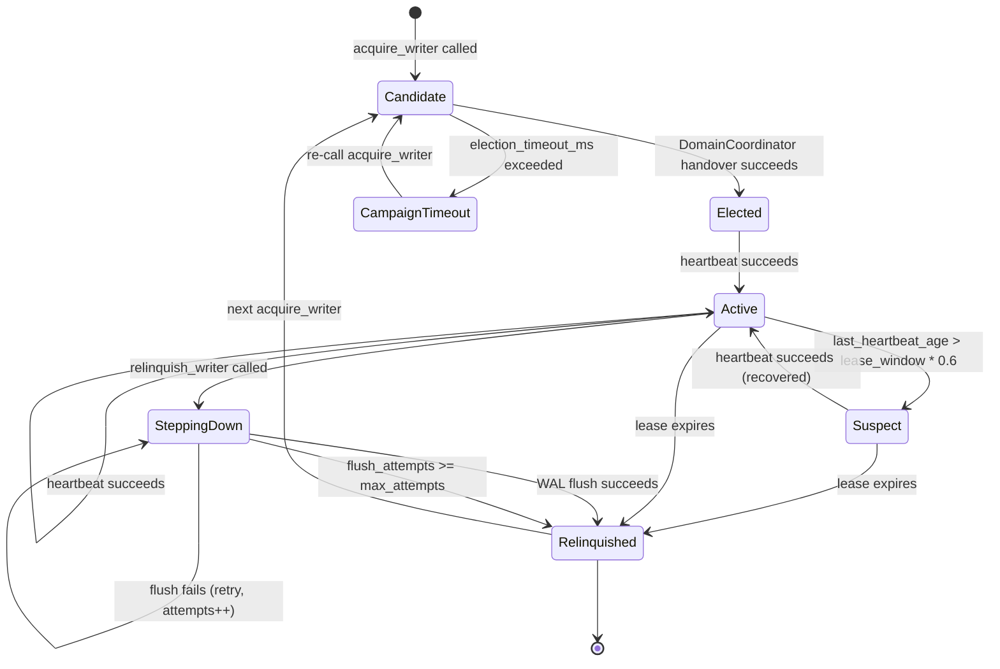

# RFC-0862 v1.3.0 — Writer Election + Bootstrap Integration

**Status:** Draft (2026-08-10)
**Author:** @cipherocto + @mmacedoeu
**Maintainers:** @cipherocto (primary), @mmacedoeu (review)
**Substrate:** RFC-0862 v1.2.0 + RFC-0855p-c (handover) + RFC-0863 (bootstrap)
**Parent:** Mission `0871e-phase5c-1-cross-instance-drain` + Mission `0871e-f7-cross-instance-did-coordination`

> **Promotion note:** In-place additive amendment to RFC-0862 (fourth
> update). Promotes §Future Work F8 + F11 to §Specification. Adds
> `WriterElection` protocol + CRDT-extension hooks (F12 + F13).

> **Breaking changes acknowledged (per R4-R11):** See §Breaking
> Changes + §Acceptance Criteria for the migration contract.

> **Filename note (per R8 H3):** file on disk is currently
> `0862-writer-election-bootstrap-v120.md`. Filename MUST be renamed
> to `0862-writer-election-bootstrap-v130.md` BEFORE v1.3 acceptance
> (AC#13).

## Summary

Extend RFC-0862 §Roles (writer/reader split) with:

1. **`WriterElection` protocol.**
2. **`BootstrapOrchestrator`-driven peer discovery.**
3. **CRDT-extension hooks** (F12 + F13).

## Review State

- **R1-R11 completed (2026-08-10).**
- **Termination condition:** convergence when a new round returns
  zero NEW findings.

## Breaking Changes

1. **`DidDocument` uses RFC-0010 v1.3 + v1.4 amendment**.
2. **Three-way `MissionId` type collision** → renamed
   `ShardMissionId`.
3. **`NodeId` struct vs alias collision** → renamed
   `WriterNodeId`.
4. **`octo-protocol` does NOT depend on `octo-ident`** (canonical-
   hash bytes only).
5. **`BootstrapOrchestrator` naming conflict** → renamed concrete
   to `BootstrapOrchestratorImpl`. Gated on **RFC-0863 v1.9
   amendment** (PENDING).
6. **Path correction.**
7. **WAL header field-size breakdown corrected.**
8. **`GovernanceAttestation` + `OperatorSignature` defined.**
9. **Phantom mission pointer resolved.**
10. **`force_relinquish_writer` via sealed trait pattern.**
11. **`EncodedDidDocument` blanket impl REMOVED.** `canonical_hash`
    is FREE FN (per R11 H2 — not trait method).
12. **Mission file drift resolved.**
13. **`WriterLifecycle` 7 states defined explicitly.**
14. **`WriterContext` struct defined.**
15. **Filename rename required.**
16. **Per R11 H3:** v1.3 WAL not readable by v1.2.0 nodes; v1.2 nodes
    MUST patch to v1.2.1+ before v1.3 rollout.

## Design Goals

| Goal | Target | Metric |
| ---- | ------ | ------ |
| G1 | Election latency | ≤ 3s p99 |
| G2 | Heartbeat interval | 500ms |
| G3 | Drain throughput | ≥ 1000 txn/s per shard |
| G4 | Failover pause | ≤ 3s |
| G5 | Backward compat | `DatabaseSyncAdapter` consumers unchanged |
| G6 | Forward compat | WAL dual-version cluster window (per R11 L4 + R12 H6; v1.3 entry format is BREAKING) |
| G7 | Substrate extension | Option C migration = impl swap |
| G8 | Path correctness | All leaf-workspace paths use prefix |
| G9 | Type identity | All new types consolidated |
| G10 | Cross-RFC consistency | All amendments FILED before v1.3 STABLE |
| G11 | **Rollout ordering** | v1.2 nodes → v1.2.1 (HeaderSize-aware) → v1.3 |

## Performance Targets

| Metric | Target | Acceptance Test |
|---|---|---|
| Election latency p99 | ≤ 3s | TV-`election_acquire_returns_within_3s` |
| Heartbeat interval | 500ms ± 50ms | TV-`heartbeat_interval_500ms` |
| Drain throughput | ≥ 1000 txn/s per shard | TV-`drain_throughput_1k_per_sec` |
| Failover pause | ≤ 3s p99 | TV-`failover_pause_under_3s` |
| WAL fan-out lag | ≤ 100ms p99 | TV-`wal_fanout_lag_under_100ms` |
| Bootstrap peer acquisition | ≤ 5s p99 | TV-`bootstrap_acquisition_under_5s` |
| HLC monotonicity (physical advance) | No reordering | TV-`hlc_monotonicity_10k_sequential` |
| HLC logical increment | Logical advances per same-physical-ms call | TV-`hlc_logical_increment_constant_physical` |

## Motivation

Two missions BLOCKED: `0871e-phase5c-1-cross-instance-drain` +
`0871e-f7-cross-instance-did-coordination`.

## Dependencies

**Requires:**

- RFC-0855p-c §Platform-Mediated Handover
- **RFC-0010 v1.4 amendment** (PENDING)
- **RFC-0863 v1.9 amendment** (PENDING)
- **RFC-0862 v1.2.1 patch** (per R11 H5 — v1.2 nodes MUST patch
  to v1.2.1+ before v1.3 rollout)
- RFC-0851p-a §Bootstrap Envelope Types
- RFC-0853 §Sovereign Identity Model
- RFC-0862 §WAL Format

**Optional:** F1-F7, F9-F10 (unchanged)

### Crate dependencies (per R12 H9)

`octo-sync` is a leaf workspace excluded from root; its
`Cargo.toml` MUST pin:

```toml
[dependencies]
# WAL substrate + substrate types: borsh canonical encoding
# (Layer A; pins match octo-protocol/octo-ident for wire compat).
borsh = "=1.5.0"

# NonceTracker per-shard locking (R12 L1); required for
# concurrent consume() across multiple shards.
dashmap = "=6.1.0"

# blake3 used by canonical_hash, governance_signature_message,
# WAL checksum, replay_wal.
blake3 = "=1.5.4"

# async_trait for dyn-compatibility of BootstrapOrchestrator,
# WriterElection, WriterElectionForceRelinquish, DrainCoordinator,
# DidWriteCoordinator, WalWriter, WalReader.
async-trait = "=0.1.83"

# Ed25519 for verify_governance_attestation + ed25519_verify fn.
ed25519-dalek = { version = "=2.1.1", features = ["std"] }

# thiserror for error enums.
thiserror = "=1.0.63"
```

Per CLAUDE.md §Crate dependency rationale: each dep carries its
layer + which RFC mandates it. `borsh` (A) — canonical wire form;
`dashmap` (B-substrate) — NonceTracker per-shard locking;
`async-trait` (B-substrate) — dyn-compat for trait objects;
`blake3` (A) — hash substrate (canonical_hash, governance,
checksum); `ed25519-dalek` (A) — operator attestation verify;
`thiserror` (B-substrate) — error enum derives.

## Roles and Authorities

| Role | Identifier | Authority Scope | Lifecycle | Source |
|------|------------|-----------------|-----------|--------|
| Writer Node | `WriterIdentity { writer_node_id, mission_id, term, elected_at_hlc, shard_key }` + `WriterContext` | Exclusive write for `ShardKey` during term | `WriterLifecycle` (7 states) | This RFC §WriterElection |
| Reader Node | (no identity; cached lease) | Read-only; forwards writes | Stateful | RFC-0862 v1.2.0 §Roles |
| Domain Coordinator | `DomainCoordinator` | Handover ceremony | `CoordinatorLifecycle` | RFC-0855p-c + RFC-0855p-b |
| Bootstrap Orchestrator | `BootstrapOrchestrator` TRAIT; `BootstrapOrchestratorImpl` CONCRETE | Peer discovery via RFC-0851p-a Mode A | Per node startup | RFC-0863 (impl) + this RFC (trait) |
| Drain Coordinator | `DrainCoordinator` trait impl | Cross-instance spend drain routing | Wired via `StoolapSpendLedger` | This RFC §DrainCoordinator |
| DID Write Coordinator | `DidWriteCoordinator` trait impl | Cross-instance DID write routing | Wired via `StoolapDidRegistry` | This RFC §DidWriteCoordinator |

### WriterLifecycle (7 states)

```rust
pub enum WriterLifecycle {
    Candidate,
    Elected,
    Active,
    Suspect,
    CampaignTimeout,
    SteppingDown,
    Relinquished,
}
```

**Suspect threshold (per R12 M21):** integer arithmetic
`last_heartbeat_age * 5 > lease_window_ms * 3` (no float
multiplication in state-machine guard; RFC-0104 DFP hostile).

**Config field (per R12 M21):** `lease_window_ms: u64`
(default 3_000; total lease window in milliseconds).

### WriterContext

```rust
pub struct WriterContext {
    pub relinquish_pending: AtomicBool,
    pub flush_attempts: AtomicU32,  // per R11 M2 — incremented per failed flush attempt
    pub max_attempts: u32,
    pub replay_state: ReplayState,
}

pub enum ReplayState {
    Idle,
    InProgress { start_lsn: u64, last_applied_lsn: u64, attempted_entries: u32 },
    /// Per R11 L3: `attempted_entries` for incident response.
    Failed { start_lsn: u64, last_applied_lsn: u64, attempted_entries: u32, reason: &'static str },
    Complete { tip_lsn: u64, total_entries: u32 },
}
```

### WriterLifecycle → CoordinatorLifecycle mapping

| WriterLifecycle | CoordinatorLifecycle substates |
|---|---|
| Candidate | (pre-Designated) |
| Elected | Elected |
| Active | Active |
| Suspect | Suspect |
| CampaignTimeout | Designated |
| SteppingDown | Handover |
| Relinquished | Resigned |

## Lifecycle Requirements

### Writer Node state machine



**Transition table:**

| From | To | Trigger | Guard | Deterministic? |
|---|---|---|---|---|
| (start) | Candidate | `acquire_writer` call | — | No |
| Candidate | Elected | handover success | — | Yes |
| Candidate | CampaignTimeout | timeout exceeded | — | Yes |
| CampaignTimeout | Candidate | re-call `acquire_writer` | no CampaignTimeout block active | Yes |
| Elected | Active | First `heartbeat` success | — | Yes |
| Active | Active | Subsequent `heartbeat` success | — | Yes |
| Active | Suspect | heartbeat close to expiry | `last_heartbeat_age * 5 > lease_window_ms * 3` | Yes |
| Suspect | Active | heartbeat succeeds | — | Yes |
| Suspect | SteppingDown | `relinquish_writer` | `!context.relinquish_pending` | Yes |
| Suspect | Relinquished | lease expires | — | Yes |
| **Elected** | **Relinquished** | **lease expires before first heartbeat** | **`!context.relinquish_pending`** | **Yes** |
| Active | SteppingDown | `relinquish_writer` | `!context.relinquish_pending` | Yes |
| Active | Relinquished | Lease expiry | `!context.relinquish_pending` | Yes |
| SteppingDown | Relinquished | WAL flush success | — | Yes |
| SteppingDown | SteppingDown | WAL flush retry | `context.flush_attempts < context.max_attempts` | Yes |
| **SteppingDown** | **Relinquished** | **flush_attempts ≥ max_attempts** | **forced abandon** | **Yes** |
| Relinquished | Candidate | next `acquire_writer` call | — | Yes |
| Relinquished | (terminal) | Node shutdown | — | No |

**flush_attempts increment policy (per R11 M2):**
`context.flush_attempts += 1` on every WAL flush attempt that
returns Err.

## Specification

### Substrate types (in `octo-sync/src/types.rs`)

```rust
use borsh::{BorshDeserialize, BorshSerialize};

#[derive(Clone, Copy, PartialEq, Eq, PartialOrd, Ord, Hash,
         BorshSerialize, BorshDeserialize)]
pub struct HlcTimestamp {
    pub physical_ms: u64,
    pub logical: u32,
    pub writer_node_id: WriterNodeId,
}

pub struct HlcClock {
    last_physical_ms: AtomicU64,  // per R11 M8 — thread-safe
    last_logical: AtomicU32,      // per R11 M8 — thread-safe
    writer_node_id: WriterNodeId,
    clock: Box<dyn Fn() -> u64 + Send + Sync>,
}

impl HlcClock {
    pub fn new(writer_node_id: WriterNodeId) -> Self { /* ... */ }

    /// Per R11 M4: refuse-new on overflow (Class A determinism).
    /// Per R12 H13: takes `&self` — atomics make `&mut self` redundant
    /// and would defeat the lock-free design.
    pub fn now(&self) -> Result<HlcTimestamp, HlcError> {
        let observed = (self.clock)();
        let physical_ms = observed.max(self.last_physical_ms.load(Acquire));
        let logical = if physical_ms == self.last_physical_ms.load(Acquire) {
            let next = self.last_logical.load(Acquire) + 1;
            if next == u32::MAX {
                return Err(HlcError::LogicalOverflow);
            }
            next
        } else {
            0
        };
        self.last_physical_ms.store(physical_ms, Release);
        self.last_logical.store(logical, Release);
        Ok(HlcTimestamp { physical_ms, logical, writer_node_id: self.writer_node_id })
    }

    /// Per R12 H13: takes `&self`.
    /// Per R12 H14: overflow guards on BOTH remote-derived branches;
    /// skew cap `max_skew_ms` rejects poisoned `remote.physical_ms`.
    pub fn observe(&self, remote: HlcTimestamp) -> Result<HlcTimestamp, HlcError> {
        // Per R12 H14: skew cap.
        let max_skew_ms: u64 = 60_000; // configurable
        let observed = (self.clock)();
        if remote.physical_ms.abs_diff(observed) > max_skew_ms {
            return Err(HlcError::RemoteSkewExceedsCap { observed, remote: remote.physical_ms, cap_ms: max_skew_ms });
        }
        let physical_ms = observed
            .max(self.last_physical_ms.load(Acquire))
            .max(remote.physical_ms);
        let logical = if physical_ms == self.last_physical_ms.load(Acquire)
            && physical_ms == remote.physical_ms {
            let next = self.last_logical.load(Acquire).max(remote.logical) + 1;
            if next == u32::MAX {
                return Err(HlcError::LogicalOverflow);
            }
            next
        } else if physical_ms == self.last_physical_ms.load(Acquire) {
            let next = self.last_logical.load(Acquire) + 1;
            // Per R12 H14: overflow guard on local+1 branch.
            if next == u32::MAX {
                return Err(HlcError::LogicalOverflow);
            }
            next
        } else if physical_ms == remote.physical_ms {
            let next = remote.logical + 1;
            // Per R12 H14: overflow guard on remote+1 branch
            // (attacker-supplied remote.logical == u32::MAX would
            // otherwise silently wrap and poison future timestamps).
            if next == u32::MAX {
                return Err(HlcError::LogicalOverflow);
            }
            next
        } else {
            0
        };
        self.last_physical_ms.store(physical_ms, Release);
        self.last_logical.store(logical, Release);
        Ok(HlcTimestamp { physical_ms, logical, writer_node_id: self.writer_node_id })
    }
}

#[derive(Clone, Copy, PartialEq, Eq, Hash, PartialOrd, Ord,
         BorshSerialize, BorshDeserialize)]
pub struct WriterNodeId(pub [u8; 32]);

#[derive(Clone, PartialEq, Eq, Hash,
         BorshSerialize, BorshDeserialize)]
pub struct ShardMissionId(pub [u8; 32]);

// Per R12 H7: 32-byte width matches existing `octo-sync`
// `pub type MissionId = [u8; 32]`. No truncation/derivation needed;
// `WriterIdentity.mission_id` constructed directly from existing
// `MissionId` via `ShardMissionId(mission_id.0)`.

#[derive(Clone, PartialEq, Eq, Hash,
         BorshSerialize, BorshDeserialize)]
pub struct ShardKey(pub [u8; 32]);

#[derive(Clone, PartialEq, Eq, Hash,
         BorshSerialize, BorshDeserialize)]
pub struct ChainId(pub [u8; 16]);

impl ShardKey {
    pub fn derive_canonical(record_key_canonical: &[u8]) -> Self {
        Self(*blake3::hash(record_key_canonical).as_bytes())
    }
}

/// Per R10 H9: OperatorSet sorted canonical serialization.
#[derive(Clone, BorshSerialize, BorshDeserialize)]
pub struct OperatorSet {
    pub operators: Vec<OperatorId>,
    pub threshold: usize,
}

impl OperatorSet {
    /// Per R11 M3: config-time validation.
    pub fn new(mut operators: Vec<OperatorId>, threshold: usize) -> Result<Self, ConfigError> {
        operators.sort_by_key(|o| o.0);
        operators.dedup();
        if threshold == 0 || threshold > operators.len() {
            return Err(ConfigError::InvalidThreshold {
                threshold, max: operators.len(),
            });
        }
        Ok(Self { operators, threshold })
    }

    pub fn canonical_bytes(&self) -> Vec<u8> {
        borsh::to_vec(self).expect("OperatorSet serialization is infallible")
    }
}

pub struct WriterContext {
    pub relinquish_pending: AtomicBool,
    pub flush_attempts: AtomicU32,
    pub max_attempts: u32,
    pub replay_state: ReplayState,
}

pub enum ReplayState {
    Idle,
    InProgress { start_lsn: u64, last_applied_lsn: u64, attempted_entries: u32 },
    Failed { start_lsn: u64, last_applied_lsn: u64, attempted_entries: u32, reason: &'static str },
    Complete { tip_lsn: u64, total_entries: u32 },
}
```

**WAL format constants (per R12 C2):**

```
/// v1.2 WAL magic (ASCII "WALE").
pub const WAL_MAGIC_V12: u32 = 0x454C_4157;

/// v1.3 WAL magic (ASCII "WAL3"; distinguishes v1.2 vs v1.3 entries).
pub const WAL_MAGIC_V13: u32 = 0x5741_4C33;

/// Entry type codes (allocated per R12 M20).
pub const ENTRY_TYPE_NONCE_RECORD: u8 = 0x10;
pub const ENTRY_TYPE_DRAIN: u8 = 0x20;
pub const ENTRY_TYPE_DID_REGISTER: u8 = 0x21;
pub const ENTRY_TYPE_DID_REVOKE: u8 = 0x22;
```

**V2 WAL `header_size` extension:**

```
V2 WAL header layout (32 bytes):
  Magic(4) + Version(1) + Flags(1) + HeaderSize(2)
  + LSN(8) + PreviousLSN(8) + EntrySize(4) + Reserved(4) = 32 bytes

v1.3 extension adds HlcTimestamp field AFTER existing fields:
  HlcTimestamp borsh = 8 + 4 + 32 = 44 bytes

v1.3 header_size = 32 + 44 = 76 bytes

v1.3 entry layout (per R11 M6 + R12 H5):
  Magic(WAL_MAGIC_V13, 4) + EntryType(1) + EntryVersion(1) + Reserved(2) +
  ShardKey(32) + LSN(8) + PreviousLSN(8) + PayloadLength(4) +
  Payload(PayloadLength bytes) + Blake3Hash(32)
  = 92 + PayloadLength bytes
  Checksum (per R12 H16): blake3 over the 60-byte entry prefix
  (Magic..PayloadLength) + Payload (NOT payload alone). Tampering
  with LSN / EntryType / ShardKey invalidates checksum.

v1.2 entry layout (for migration reference):
  Magic(WAL_MAGIC_V12, 4) + EntryType(1) + Reserved(3) +
  LSN(8) + PreviousLSN(8) + PayloadLength(4) +
  Payload(PayloadLength bytes) + CRC32Trailer(4)
  = 36 + PayloadLength bytes (NOT 32; CRC32Trailer adds 4)
  Checksum: CRC32 over payload only (per R12 H5 — what v1.2 code
  actually computes; entry prefix fields NOT covered).

Per R11 H3 + R12 C1: v1.3 entry is NOT parseable by v1.2 reader
(different Magic + ShardKey field + blake3 vs CRC32 checksum).

Per R11 H4: v1.3 entry has ONLY blake3 checksum (CRC32 removed).

v1.2 reader on v1.3 WAL: per R12 C1 the current v1.2.0
`validate_wal_entry_crc32` returns `true` (fails-open) on unknown
Magic → silently accepts v1.3 entries UNVALIDATED, no panic, no
reject. v1.2.1 patch flips behavior to reject unknown Magic with
`WalVersionTooNew`. Do NOT attempt entry parse on v1.2.1+ readers.

Per R11 H5 + R12 C1 rollout ordering:
  Phase 1: Patch all v1.2 nodes to v1.2.1 (accept→reject BEHAVIOR
          FLIP on unknown Magic; not "HeaderSize awareness" only).
          Without v1.2.1 patch, v1.2.0 silently accepts v1.3 entries
          unvalidated (corruption path, not panic).
  Phase 2: Deploy v1.3 nodes (write-only)
  Phase 3: Promote v1.3 nodes (mixed cluster accepts v1.2 + v1.3 WALs)
  Phase 4: Decommission v1.2 nodes
```

**`DidDocument` (per RFC-0010 v1.3 + v1.4 amendment — file INTRODUCED
by the v1.4 amendment per R12 H8; pre-amendment `octo-ident` has
only `lib.rs` + `test_helpers.rs`):**

```rust
// Per R10 H11: feature-gated borsh derives (consistent with other types).
#[cfg_attr(feature = "borsh", derive(BorshSerialize, BorshDeserialize))]
#[derive(Clone)]
pub struct DidDocument {
    pub public_key: [u8; 32],
    pub revoked: bool,
    pub chain_depth: u8,
    pub chain_parent: Option<[u8; 32]>,
    pub verification_method: Vec<VerificationMethod>,
    pub authentication: Vec<String>,
    pub assertion_method: Vec<String>,
}
```

**`canonical_hash` as FREE FN (per R11 H2 — not trait method):**

```rust
// Per R11 H2: free function — no trait method to override.
// Lives in `octo-sync/src/did.rs` (where EncodedDidDocument lives).
pub fn canonical_hash(doc: &DidDocument) -> [u8; 32] {
    let encoded = borsh::to_vec(doc).expect("DidDocument serialization is infallible");
    *blake3::hash(&encoded).as_bytes()
}

pub trait EncodedDidDocument: Send + Sync {
    fn encode(&self) -> Vec<u8>;
}

impl EncodedDidDocument for DidDocument {
    fn encode(&self) -> Vec<u8> {
        borsh::to_vec(self).expect("DidDocument serialization is infallible")
    }
}
```

### BootstrapOrchestrator trait (in `octo-sync/src/bootstrap.rs`)

```rust
// Per R12 M18: `#[async_trait]` for dyn-compatibility
// (`Arc<dyn BootstrapOrchestrator>` requires object-safe trait).
#[async_trait::async_trait]
pub trait BootstrapOrchestrator: Send + Sync {
    async fn acquire_peers(&self) -> Result<Vec<PeerIdentity>, BootstrapError>;
}
```

### WriterElection Protocol (sealed trait)

```rust
#[derive(Clone, PartialEq, Eq, Hash,
         BorshSerialize, BorshDeserialize)]
pub struct WriterIdentity {
    pub writer_node_id: WriterNodeId,
    pub mission_id: ShardMissionId,
    pub term: u64,
    pub elected_at_hlc: HlcTimestamp,
    pub shard_key: ShardKey,
}

// Per R12 M18: `#[async_trait]` for dyn-compatibility.
#[async_trait::async_trait]
pub trait WriterElection: Send + Sync {
    async fn acquire_writer(
        &self,
        shard_key: &ShardKey,
        election_timeout_ms: u64,
    ) -> Result<WriterIdentity, WriterElectionError>;

    async fn relinquish_writer(
        &self,
        shard_key: &ShardKey,
    ) -> Result<(), WriterElectionError>;

    async fn heartbeat(&self, shard_key: &ShardKey)
        -> Result<(), WriterElectionError>;

    fn current_writer(&self, shard_key: &ShardKey)
        -> Result<Option<WriterIdentity>, WriterElectionError>;
}

// Per R12 M18: `#[async_trait]` for dyn-compatibility.
#[async_trait::async_trait]
pub trait WriterElectionForceRelinquish: WriterElection + sealed::WriterElectionForceRelinquishSealed {
    async fn force_relinquish_writer(
        &self,
        shard_key: &ShardKey,
        attestation: &GovernanceAttestation,
        configured_operator_set: &OperatorSet,
        nonce_tracker: &NonceTracker,
    ) -> Result<(), WriterElectionError>;
}

mod sealed {
    pub trait WriterElectionForceRelinquishSealed {}
}

/// Per R11 H1: NonceTracker ACTUALLY writes to WAL on consume +
/// replay on init.
pub struct NonceTracker {
    used_nonces: DashMap<ShardKey, HashSet<[u8; 32]>>,  // per R11 L1 — DashMap for per-shard locking
    wal: Arc<dyn WalAppender>,
}

impl NonceTracker {
    pub fn new(wal: Arc<dyn WalAppender>) -> Self {
        let used_nonces = Self::replay_from_wal(&wal);
        Self { used_nonces, wal }
    }

    fn replay_from_wal(wal: &dyn WalAppender) -> DashMap<ShardKey, HashSet<[u8; 32]>> {
        let mut map = DashMap::new();
        for nonce_record in wal.scan_nonce_records() {
            map.entry(nonce_record.shard_key)
                .or_insert_with(HashSet::new)
                .insert(nonce_record.nonce);
        }
        map
    }

    /// Per R11 H1: durably writes to WAL.
    /// Per R12 H15: check-then-append (not append-then-check) so
    /// replayed nonces do NOT grow the WAL unboundedly.
    /// Per R12 L1: per-shard locking via DashMap.
    /// Per R12 H13: takes `&self`.
    pub fn consume(&self, shard_key: &ShardKey, nonce: &[u8; 32])
        -> Result<(), WriterElectionError>
    {
        let mut set = self.used_nonces.entry(shard_key.clone()).or_insert_with(HashSet::new);
        if !set.insert(*nonce) {
            return Err(WriterElectionError::NonceReplayed);
        }
        self.wal.append_nonce_record(&NonceRecord {
            shard_key: shard_key.clone(),
            nonce: *nonce,
        })?;
        Ok(())
    }

    /// Per R12 H15: term-scoped GC. Drop nonces older than `term -
    /// MAX_NONCE_RETENTION_TERMS`. Compaction runs on each new term
    /// boundary.
    pub fn gc_expired_nonces(&self, current_term: u64) {
        const MAX_NONCE_RETENTION_TERMS: u64 = 1_000;
        // Implementation: prune entries with `(term, nonce)` tuples
        // where term < current_term - MAX_NONCE_RETENTION_TERMS.
        // Requires extending the in-memory map to `(term, [u8; 32])`
        // and replaying the term from `NonceRecord`.
    }
}

pub fn governance_signature_message(
    shard_key: &ShardKey,
    chain_id: &ChainId,
    term: u64,
    nonce: &[u8; 32],
) -> [u8; 32] {
    // Per R12 M23: bind to chain_id (deployment-binding) so an
    // attestation cannot replay across deployments sharing an
    // operator set.
    *blake3::hash(
        b"cipherocto/governance/v1"
            .iter()
            .chain(shard_key.0.iter())
            .chain(chain_id.0.iter())
            .chain(term.to_be_bytes().iter())
            .chain(nonce.iter())
            .copied()
            .collect::<Vec<u8>>()
    ).as_bytes()
}

/// Per R12 M23: bound ed25519 verify cost.
pub const MAX_GOVERNANCE_SIGNATURES: usize = 32;

pub fn verify_governance_attestation(
    shard_key: &ShardKey,
    chain_id: &ChainId,
    attestation: &GovernanceAttestation,
    configured_operator_set: &OperatorSet,
    nonce_tracker: &NonceTracker,
) -> Result<(), WriterElectionError> {
    if &attestation.shard_key != shard_key {
        return Err(WriterElectionError::ShardKeyMismatch);
    }
    if &attestation.chain_id != chain_id {
        return Err(WriterElectionError::ChainIdMismatch);
    }
    if attestation.threshold != configured_operator_set.threshold {
        return Err(WriterElectionError::ThresholdMismatch);
    }
    // Per R12 M23: cap signature count.
    if attestation.signatures.len() > MAX_GOVERNANCE_SIGNATURES {
        return Err(WriterElectionError::TooManySignatures { count: attestation.signatures.len(), max: MAX_GOVERNANCE_SIGNATURES });
    }
    let message = governance_signature_message(
        &attestation.shard_key, chain_id, attestation.term, &attestation.nonce,
    );
    let configured_set: HashSet<_> = configured_operator_set.operators.iter().collect();
    let mut unique_signers = HashSet::new();
    let mut valid_count = 0;
    for sig in &attestation.signatures {
        if !unique_signers.insert(sig.operator_id) { return Err(WriterElectionError::DuplicateSigner); }
        if !configured_set.contains(&sig.operator_id) { return Err(WriterElectionError::UnauthorizedSigner); }
        if !ed25519_verify(&sig.operator_id.pubkey(), &message, &sig.signature) { return Err(WriterElectionError::InvalidSignature); }
        valid_count += 1;
    }
    if valid_count < attestation.threshold { return Err(WriterElectionError::InsufficientSignatures); }
    nonce_tracker.consume(&attestation.shard_key, &attestation.nonce)?;
    Ok(())
}

#[derive(Clone, BorshSerialize, BorshDeserialize)]
pub struct GovernanceAttestation {
    pub shard_key: ShardKey,
    /// Per R12 M23: deployment binding (prevents replay across
    /// deployments sharing an operator set).
    pub chain_id: ChainId,
    pub term: u64,
    /// Per R11 M5: `operators` field is advisory only (signatures
    /// carry operator_id). Retained for forward-compat with future
    /// operator-set updates.
    pub operators: Vec<OperatorId>,
    pub signatures: Vec<OperatorSignature>,
    pub threshold: usize,
    pub nonce: [u8; 32],
}

#[derive(Clone, PartialEq, Eq, Hash, BorshSerialize, BorshDeserialize)]
pub struct OperatorId(pub [u8; 32]);

impl OperatorId {
    pub fn pubkey(&self) -> [u8; 32] { self.0 }
}

#[derive(Clone, BorshSerialize, BorshDeserialize)]
pub struct OperatorSignature {
    pub operator_id: OperatorId,
    pub signature: [u8; 64],
}

pub trait ShardKeyDerivation: Send + Sync {
    fn derive(&self, record_key: &[u8]) -> ShardKey;
}
```

### WAL Replay Algorithm

```rust
/// Per R10 H3: fail-closed on corruption.
/// Per R10 H4: track `tip_lsn`; reject gaps + non-monotonic LSNs.
/// Per R10 H5: takes `&mut WriterContext`.
/// Per R10 H6: apply failure → ReplayState::Failed.
/// Per R11 H14: verify entry.shard_key.
/// Per R12 H16: blake3 over full 60-byte entry prefix + payload
/// (tampering with LSN / EntryType / ShardKey invalidates checksum).
pub async fn replay_wal(
    context: &mut WriterContext,
    start_lsn: u64,
    shard_key: &ShardKey,
    wal: &dyn WalReader,
) -> Result<u64, WriterElectionError> {
    let mut last_applied_lsn = start_lsn;
    let mut attempted_entries: u32 = 0;
    context.replay_state = ReplayState::InProgress {
        start_lsn, last_applied_lsn, attempted_entries,
    };
    let entries = wal.read_range(start_lsn, None).await?;
    let mut prev_lsn = start_lsn;
    for entry in entries {
        attempted_entries += 1;
        if entry.lsn != prev_lsn + 1 {
            context.replay_state = ReplayState::Failed {
                start_lsn, last_applied_lsn, attempted_entries,
                reason: "WAL LSN gap or non-monotonic",
            };
            return Err(WriterElectionError::WalCorruption);
        }
        // Per R12 H16: checksum covers full entry prefix + payload.
        let mut checksum_input = Vec::with_capacity(60 + entry.payload.len());
        checksum_input.extend_from_slice(&entry.prefix_bytes); // 60 bytes: Magic..PayloadLength
        checksum_input.extend_from_slice(&entry.payload);
        if entry.checksum != *blake3::hash(&checksum_input).as_bytes() {
            context.replay_state = ReplayState::Failed {
                start_lsn, last_applied_lsn, attempted_entries,
                reason: "WAL checksum mismatch",
            };
            return Err(WriterElectionError::WalCorruption);
        }
        if entry.shard_key != *shard_key {
            context.replay_state = ReplayState::Failed {
                start_lsn, last_applied_lsn, attempted_entries,
                reason: "WAL entry shard_key mismatch",
            };
            return Err(WriterElectionError::WalCorruption);
        }
        if let Err(e) = apply_entry(&entry, shard_key) {
            context.replay_state = ReplayState::Failed {
                start_lsn, last_applied_lsn, attempted_entries,
                reason: "apply failed",
            };
            return Err(e);
        }
        last_applied_lsn = entry.lsn;
        prev_lsn = entry.lsn;
        context.replay_state = ReplayState::InProgress {
            start_lsn, last_applied_lsn, attempted_entries,
        };
    }
    let tip_lsn = last_applied_lsn;
    context.replay_state = ReplayState::Complete {
        tip_lsn, total_entries: attempted_entries,
    };
    Ok(tip_lsn)
}
```

### BootstrapSyncAdapter

```rust
pub struct BootstrapSyncAdapter {
    inner: Arc<dyn DatabaseSyncAdapter>,
    bootstrap: Arc<dyn BootstrapOrchestrator>,
}
```

### DrainCoordinator trait (in `octo-sync/src/drain_coordinator.rs`)

```rust
pub enum DrainCoordinatorError {
    WriterUnavailable,
    UnknownHolder,
    InsufficientBalance,
}

// Per R12 M18: `#[async_trait]` for dyn-compatibility.
#[async_trait::async_trait]
pub trait DrainCoordinator: Send + Sync {
    async fn submit_drain(
        &self,
        holder_did: &str,
        macaroon_id: &[u8],
        requested_cost: u128,
    ) -> Result<ActualDrained, DrainCoordinatorError>;

    /// `#[deprecated]` + fail-closed default.
    #[deprecated(since="1.3.0", note="LWW substrate pending F12 amendment")]
    async fn submit_drain_local_fallback(
        &self,
        holder_did: &str,
        macaroon_id: &[u8],
        requested_cost: u128,
    ) -> Result<(), DrainCoordinatorError> {
        Err(DrainCoordinatorError::WriterUnavailable)
    }
}
```

### DidWriteCoordinator trait (in `crates/octo-ident/src/write_coordinator.rs`)

```rust
mod sealed {
    pub trait DidWriteCoordinatorSealed {}
}

// Per R12 M18: `#[async_trait]` for dyn-compatibility.
#[async_trait::async_trait]
pub trait DidWriteCoordinator: sealed::DidWriteCoordinatorSealed + Send + Sync {
    async fn submit_register(
        &self,
        canonical_did_hash: &[u8; 32],
        chain_id: &ChainId,
        document: &DidDocument,
    ) -> Result<(), DidWriteCoordinatorError> {
        // Per R11 H2: use FREE FN `canonical_hash` (not trait method).
        // Per R12 H12: take `&DidDocument` directly; no downcast, no
        // `EncodedDidDocument` sealing claim (it is NOT sealed).
        if canonical_did_hash != &super::canonical_hash(document) {
            return Err(DidWriteCoordinatorError::HashDocumentMismatch);
        }
        self.submit_register_validated(canonical_did_hash, chain_id, document).await
    }

    async fn submit_register_validated(
        &self,
        canonical_did_hash: &[u8; 32],
        chain_id: &ChainId,
        document: &DidDocument,
    ) -> Result<(), DidWriteCoordinatorError>;

    async fn submit_revoke(
        &self,
        canonical_did_hash: &[u8; 32],
        chain_id: &ChainId,
    ) -> Result<(), DidWriteCoordinatorError>;

    /// `#[deprecated]` + fail-closed default.
    #[deprecated(since="1.3.0", note="LWW substrate pending F13 amendment")]
    async fn submit_register_local_fallback(
        &self,
        canonical_did_hash: &[u8; 32],
        chain_id: &ChainId,
        document: &DidDocument,
    ) -> Result<(), DidWriteCoordinatorError> {
        Err(DidWriteCoordinatorError::WriterUnavailable)
    }
}

### Supporting types + error enums (per R12 M19)

```rust
// Substrate-layer error enums.

#[derive(Debug, thiserror::Error)]
pub enum WriterElectionError {
    #[error("WAL corruption detected: {0}")]
    WalCorruption,
    #[error("WAL version too new for this reader")]
    WalVersionTooNew,
    #[error("nonce already used (replay)")]
    NonceReplayed,
    #[error("shard_key mismatch")]
    ShardKeyMismatch,
    #[error("chain_id mismatch (deployment-binding)")]
    ChainIdMismatch,
    #[error("threshold mismatch")]
    ThresholdMismatch,
    #[error("too many signatures: count={count}, max={max}")]
    TooManySignatures { count: usize, max: usize },
    #[error("duplicate signer")]
    DuplicateSigner,
    #[error("unauthorized signer")]
    UnauthorizedSigner,
    #[error("invalid signature")]
    InvalidSignature,
    #[error("insufficient signatures")]
    InsufficientSignatures,
    #[error("lease expired")]
    LeaseExpired,
    #[error("relinquish already pending")]
    RelinquishPending,
}

#[derive(Debug, thiserror::Error)]
pub enum DidWriteCoordinatorError {
    #[error("writer unavailable")]
    WriterUnavailable,
    #[error("hash/document mismatch")]
    HashDocumentMismatch,
    #[error("chain_id mismatch")]
    ChainIdMismatch,
    #[error("WAL corruption detected: {0}")]
    WalCorruption,
}

#[derive(Debug, thiserror::Error)]
pub enum HlcError {
    #[error("logical counter overflow at u32::MAX")]
    LogicalOverflow,
    #[error("remote physical_ms skew {observed} vs {remote} exceeds cap {cap_ms} ms")]
    RemoteSkewExceedsCap { observed: u64, remote: u64, cap_ms: u64 },
}

#[derive(Debug, thiserror::Error)]
pub enum ConfigError {
    #[error("invalid threshold: {threshold} > max {max}")]
    InvalidThreshold { threshold: usize, max: usize },
}

#[derive(Debug, thiserror::Error)]
pub enum BootstrapError {
    #[error("peer acquisition timed out after {0} ms")]
    Timeout(u64),
    #[error("no peers discovered")]
    NoPeers,
    #[error("overlay identity verification failed")]
    OverlayIdentityVerificationFailed,
}

#[derive(Debug, thiserror::Error)]
pub enum DrainCoordinatorError {
    #[error("writer unavailable")]
    WriterUnavailable,
    #[error("unknown holder did")]
    UnknownHolder,
    #[error("insufficient balance")]
    InsufficientBalance,
}

// Identifiers + records.

pub struct PeerIdentity {
    pub node_id: WriterNodeId,
    pub overlay_id: [u8; 32],
    pub mission_id: ShardMissionId,
}

#[derive(Clone, BorshSerialize, BorshDeserialize)]
pub struct NonceRecord {
    pub shard_key: ShardKey,
    pub term: u64,
    pub nonce: [u8; 32],
}

pub struct ActualDrained {
    pub holder_did: String,
    pub macaroon_id: Vec<u8>,
    pub drained_amount: u128,
    pub receipt_lsn: u64,
}

// WAL traits (per R12 M20: split WalAppender into WalWriter + WalReader
// + WalNonceScanner; violates Interface Segregation otherwise).

#[async_trait::async_trait]
pub trait WalWriter: Send + Sync {
    async fn append_entry(&self, entry: &WalEntry) -> Result<u64, WriterElectionError>;
    async fn append_nonce_record(&self, record: &NonceRecord) -> Result<(), WriterElectionError>;
}

#[async_trait::async_trait]
pub trait WalReader: Send + Sync {
    async fn read_range(&self, from_lsn: u64, to_lsn: Option<u64>) -> Result<Vec<WalEntry>, WriterElectionError>;
}

pub trait WalNonceScanner: Send + Sync {
    fn scan_nonce_records(&self) -> Box<dyn Iterator<Item = NonceRecord> + '_>;
}

// Legacy alias kept for transition (deprecation cycle).
#[deprecated(since="1.3.0", note="use WalWriter + WalReader + WalNonceScanner")]
pub trait WalAppender: WalWriter + WalNonceScanner {}

// Per R12 H16: WAL entry carries prefix bytes for full checksum.
pub struct WalEntry {
    pub magic: u32,           // WAL_MAGIC_V12 or WAL_MAGIC_V13
    pub entry_type: u8,
    pub entry_version: u8,
    pub reserved: [u8; 2],
    pub shard_key: ShardKey,
    pub lsn: u64,
    pub previous_lsn: u64,
    pub payload_length: u32,
    pub payload: Vec<u8>,
    pub prefix_bytes: [u8; 60], // canonical serialization of the 60-byte prefix
    pub checksum: [u8; 32],     // blake3 over prefix_bytes || payload
}

// VerificationMethod (per RFC-0010 v1.4 amendment).
#[derive(Clone, BorshSerialize, BorshDeserialize)]
pub enum VerificationMethod {
    Ed25519 { public_key: [u8; 32] },
    Bls12381 { public_key: [u8; 48] },
}

// Free fns.

pub fn apply_entry(entry: &WalEntry, shard_key: &ShardKey) -> Result<(), WriterElectionError> {
    // Per R12 M19: declared here; actual apply logic is per-entry-type
    // dispatch (drain / did_register / did_revoke).
    let _ = (entry, shard_key);
    Ok(())
}

pub fn ed25519_verify(pk: &[u8; 32], msg: &[u8], sig: &[u8; 64]) -> bool {
    ed25519_dalek::Verifier::verify(
        &ed25519_dalek::PublicKey::from_bytes(pk).expect("32-byte pk"),
        msg,
        &ed25519_dalek::Signature::from_bytes(sig).expect("64-byte sig"),
    ).is_ok()
}
```
```

## Acceptance Criteria for v1.3 Acceptance

V1.3 acceptance GATED on:

1-5. (REMOVED per R7 M7 — F12/F13 acceptance moved to v1.4)
6. `MissionId` consolidation COMPLETED (gating direction per R12
   H17 — v1.3 is BLOCKED on consolidation; consolidation is NOT
   BLOCKED on v1.3 as §Future Work previously implied).
7. `NodeId` consolidation COMPLETED (same direction as AC#6).
8. **RFC-0010 v1.4 amendment FILED**.
9. **RFC-0863 v1.9 amendment FILED**.
10. `force_relinquish_writer` lands via sealed trait pattern (per
    R12 H11 — `WriterElectionForceRelinquishSealed` supertrait) +
    M-of-N operator-set check + nonce-freshness check + **durable
    nonce storage** (per R11 H1) + **deployment binding via
    `chain_id`** (per R12 M23).
11. Mission `0871e-phase5c-1-cross-instance-drain` UPDATED.
11b. Mission `0871e-f7-cross-instance-did-coordination` UPDATED
    (per R12 M25 — pre-rename filename hard-coded in 4 sites;
    blast radius in `sync-e2e-tests` + `sync-e2e-tests/stoolap-node`,
    ~15 call sites, both excluded from root workspace).
11c. `BootstrapOrchestrator` → `BootstrapOrchestratorImpl` rename
    blast radius documented (per R12 M25).
12. Mission `0871e-force-relinquish-governance` FILED.
13. **Filename renamed** to `0862-writer-election-bootstrap-v130.md`.
14. **`DidDocument` borsh derives** tested with `--features borsh`.
15. **Per R11 H5 + R12 C1 rollout ordering:** v1.2 nodes patched
    to v1.2.1+ BEFORE v1.3 rollout. Document ordering in
    deployment guide; v1.2.0 fail-open behavior (silently accepts
    v1.3 unvalidated) is the failure mode the v1.2.1 patch
    eliminates.
16. **Per R12 H10:** Two-file mapping resolved — on v1.3 acceptance
    this draft merges into `rfcs/accepted/networking/0862-stoolap-data-sync.md`
    (current accepted v1.0.0–v1.2.0 entry) OR the promotion note
    changes from "in-place additive" to "forked update with explicit
    mapping". The two-file pattern is NOT acceptable for the
    Accepted state.

## Determinism Requirements

Per RFC-0008 Execution Class mapping:

| Operation | Class | Justification |
|---|---|---|
| HKDF derivation | **A** | Pure function |
| Election term monotonicity | **A** | Raft term monotonicity |
| HLC timestamp construction | **B** | Wall-clock dependent |
| HLC remote observe | **B** | Wall-clock + remote input |
| Ordering of HLC-stamped WAL entries | **A** | HLC total order |
| `DatabaseSyncAdapter` fan-out | **B** | Network-dependent |
| Drain atomicity within writer (post-fsync) | **A** | Single-node atomic |
| Drain atomicity within writer (fsync) | **B** | Filesystem-dependent |
| Bootstrap peer acquisition | **B** | Network-dependent |
| **WAL replay** | **A** | Fail-closed on corruption |
| **OperatorSet canonical serialization** | **A** | Sorted-by-OperatorId.0 deterministic |
| **HLC `now()`/`observe()` refuse-new on overflow** | **A** | Deterministic Err |

## Implicit Assumptions Audit

| Category | Assumption | Risk | Mitigation |
|---|---|---|---|
| Operator | Key-share ceremony with secure RNG | Ceremony compromise | Per-scheme ceremony + audit log |
| Platform | TCP heartbeat | UDP packet loss | Default TCP |
| Platform | Linux baseline | BSD/Windows divergence | Linux baseline |
| Platform | FIPS NOT required | FIPS deployments break | Document non-FIPS |
| Platform | stoolap fork at pin | API drift | Pin commit hash |
| Platform | NTP-synced clocks | Clock skew → wrong HLC ordering | NTP + alarm >100ms |
| Time | Clock skew ≤ 100ms | Higher skew → wrong HLC ordering | NTP alarm |
| Time | Chain depth ≤ 8 | Migration if raised | Depth cap |
| Network | TCP heartbeat (consolidated) | Same | Same |
| Upgrade | v1.3 WAL **breaking** (new Magic + ShardKey field + blake3); old via V2 `header_size` (v1.2.0 fails-open on unknown Magic — per R12 C1; v1.2.1+ MUST reject) | v1.2.0 silently accepts v1.3 unvalidated = corruption | Version-check + reject (mandatory v1.2.1 patch BEFORE v1.3 rollout per R12 C1) |
| Upgrade | Cross-shard drain = undefined | Cross-shard silently fails | Document in §Out-of-scope |
| Config | Per-instance mutex RETAINED | Coordinator handshake delayed | Per-instance mutex serializes |
| Config | Key-share ceremony operator | Ceremony compromise | M-of-N governance (deadline: before v1.4.0) |
| Config | `force_relinquish_writer` via sealed trait + OperatorSet + durable nonce | Substrate-level defense | Sealed trait + NonceTracker (durable) |
| Identity | `MissionId` consolidation GATED | Type collision | Consolidate |
| Identity | `WriterNodeId` vs `NodeId` consolidation GATED | Type collision | Consolidate |
| Resource | Drain log bounded to 10k per read-replica | Unbounded growth | LRU + alarm |
| Time | Election 3s + heartbeat 500ms | Wrong values | Profiling |
| Operator | Coordinator quorum M-of-N | Single coordinator = SPOF | M-of-N governance |
| Operator | Coordinator state survives restart | Coordinator restart loses `elected_at_hlc` | Persistent log + snapshot + WAL replay |
| Operator | `force_relinquish_writer` operator SET = same as key-share ceremony | Operator confusion | Document explicitly |
| Resource | **HLC `last_logical: u32` overflow behavior** = refuse-new (per R11 M4) | Class A violation | `HlcError::LogicalOverflow` |

## Security Considerations

- **Lease expiry during partition.**
- **Bootstrap peer authentication.**
- **WAL tampering detection** — **fail-closed on checksum.**
- **HLC ordering under clock skew.**
- **Drain race during failover.**
- **Per-instance mutex as defense in depth.**
- **`GovernanceAttestation` replay protection** — durable nonce
  storage + verify-sigs-first-consume-nonce-last + shard_key
  cross-check.

## Adversary Analysis (7-column format)

| A# | Adversary | Q1 Beneficiary | Q2 Cost to Attacker | Q3 Gain if Successful | Q4 Defense | Q5 Residual Risk |
|---|---|---|---|---|---|---|
| A1 | Writer election split-brain | Attacker inducing partition | Network partition + CPU | Concurrent write authority | Raft-like consensus | ~3000 stale writes/incident |
| A2 | Heartbeat false renewal | Old writer during partition | Network partition tolerance | Lease retention = stale writes | Lease-based | Lease window (3s) |
| A3 | Bootstrap peer spoofing | Malicious node injecting peers | Mission-key signature forgery | Sync against poisoned state | Ed25519 + OverlayIdentity + nonce binding | Trust boundary on OverlayIdentity |
| A4 | WAL replay divergence | Attacker tampering with WAL | Node compromise | Inconsistent state | New writer resumes from `elected_at_hlc`; fail-closed on checksum | ~3000 stale writes/incident |
| A5 | Coordinator HA | Attacker compromising coordinator | Coordinator compromise | Writer election hijack | M-of-N operator quorum | Coordinator quorum compromise |
| A6 | Drain refusal storm during failover | Attacker triggering rapid drain | Coordinator partition | UX degradation | Holder retry per RFC-0871 | UX degradation within budget |
| A7 | Option C (LWW) double-spend | Attacker exploiting LWW in F12 | Concurrent drain attempts | Double-spend | v1.3 fail-closed + sealed trait | v1.3 fail-closed; F12 MUST solve |
| A8 | Concurrent partition residual | Attacker inducing simultaneous partition | Network partition tolerance window | Stale writes during partition | Heartbeat + lease bounds window to ~3s | See A1 |

## Economic Analysis

N/A. Coordination substrate.

## Compatibility

### Backward compatibility

- `DatabaseSyncAdapter` trait unchanged.
- `WriterElection` is NEW.
- `DrainCoordinator` + `DidWriteCoordinator` are NEW.
- Per-instance mutex RETAINED.
- **WAL entry format is BREAKING (per R12 H6).** v1.3 introduces
  new Magic (`WAL_MAGIC_V13`), new ShardKey field, blake3 over full
  entry prefix (not just payload). v1.2.0 nodes silently accept
  v1.3 entries UNVALIDATED (per R12 C1 — current code fails-open
  on unknown Magic); v1.2.1+ rejects with `WalVersionTooNew`.
  v1.2.0 → v1.2.1 patch is a behavior flip (accept→reject), NOT
  "additive".

### Forward compatibility

- v1.3 reader reading v1.2 WAL: works via V2 `header_size` (32 bytes)
  + Magic dispatch (`WAL_MAGIC_V12`).
- v1.2.1 reader reading v1.3 WAL: rejects with `WalVersionTooNew`
  (per R11 H3 — does NOT attempt entry parse).
- v1.2.0 reader reading v1.3 WAL: **silently accepts UNVALIDATED**
  (per R12 C1 — fail-open bug; this is why v1.2.1 patch is
  mandatory BEFORE v1.3 rollout).
- **Dual-version cluster window** (per R11 L4): mixed cluster
  during Phases 2-3 of rollout accepts both v1.2 and v1.3 WALs.
- **V2 WAL `header_size` extension:** 32 bytes → 76 bytes
  (HlcTimestamp field added; mandatory in v1.3).

## Alternatives Considered

1. **Two-phase commit (2PC)**.
2. **Centralized aggregator (Option B — chosen)**.
3. **CRDT LWW (Option C — deferred to F12/F13)**.

## Implementation Phases

**Phase 1 — substrate**

Deliverables:
- Substrate types with `borsh::{BorshSerialize, BorshDeserialize}` derives.
- `WriterElection` trait + `WriterElectionForceRelinquish` sealed trait.
- `WriterLifecycle` enum (7 states) + `WriterContext` struct.
- `BootstrapOrchestrator` trait.
- `BootstrapSyncAdapter`.
- `canonical_hash` as FREE FN (per R11 H2).
- `GovernanceAttestation` + `OperatorId` + `OperatorSignature` +
  `OperatorSet` + `NonceTracker` (durable; per R11 H1) +
  `governance_signature_message` + `verify_governance_attestation`.
- `DidWriteCoordinator` trait.
- `replay_wal` function.
- **`DidDocument` borsh derives** feature-gated (per R10 H11).
- **Phase 1 TV:**
  - TV-1: `hlc_monotonicity_10k_sequential`
  - TV-2: `hlc_logical_increment_constant_physical`
  - TV-3: `current_writer_returns_cached_identity`
  - TV-4: `bootstrap_acquisition_under_5s` against PRODUCTION impl

**Phase 2 — coordinator traits**

- `DrainCoordinator` + `DidWriteCoordinator` with fail-closed default.

**Phase 3 — consumer wiring (follow-on missions)**

**Phase 4 — Option C migration (F12/F13 amendment; v1.4 acceptance)**

## Future Work

- F1-F7, F9-F10: see RFC-0862 v1.2.0 §Future Work
- F12 (NEW): HLC + LWW per-instance counter (deferred; v1.4)
- F13 (NEW): CRDT-style reconciliation (deferred; v1.4)
- Coordinator quorum M-of-N key share ceremony (governance)
- Partition recovery via snapshot + replay
- Byzantine coordinator defense
- `force_relinquish_writer` governance (mission to be filed)
- ~~`MissionId` consolidation GATED on v1.3 acceptance~~ — RESOLVED
  per R12 H17: AC#6/#7 require consolidation COMPLETED BEFORE v1.3
  acceptance; removed from §Future Work.
- ~~`NodeId` consolidation GATED on v1.3 acceptance~~ — RESOLVED
  per R12 H17: same as `MissionId`.
- FIPS mode support (deferred to v2.0)

## Rationale

- **NonceTracker durable storage** (per R11 H1): prevents replay
  across process restart.
- **`canonical_hash` free fn** (per R11 H2): prevents local
  override.
- **v1.2 reader rejects v1.3 WAL** (per R11 H3): prevents panic.
- **blake3 only checksum** (per R11 H4): clear algorithm choice.
- **Rollout ordering** (per R11 H5): v1.2.0 → v1.2.1 → v1.3.
- **HLC `AtomicU64`/`AtomicU32`** (per R11 M8): thread-safe.
- **flush_attempts increment policy** (per R11 M2): per failed
  attempt.
- **HLC refuse-new on overflow** (per R11 M4): Class A preservation.
- **OperatorSet config-time validation** (per R11 M3).
- **`GovernanceAttestation.operators` advisory** (per R11 M5):
  signatures carry operator_id.
- **WAL entry binary format** (per R11 M6): fields + sizes defined.
- **quota-router-storage classified as Layer B** (per R11 M7) —
  not "B-adjacent".
- **NonceTracker per-shard locking** (per R11 L1): DashMap.
- **`configured_set` precomputed** (per R11 L2): O(1) lookup.
- **`ReplayState::Failed.attempted_entries`** (per R11 L3):
  incident response.
- **v1.3 = "breaking amendment"** (per R11 L4): dual-version support
  documented.

## Test Vectors (preview)

External acceptance artifact: `tests/fixtures/phase1_tv_0862.json`.

Per R12 M24: full §Performance Targets TV list (8 vectors) is
assigned to phases below; the 4 unassigned vectors
(`election_acquire_returns_within_3s`, `drain_throughput_1k_per_sec`,
`failover_pause_under_3s`, `wal_fanout_lag_under_100ms`) live in
**Phase 3** (consumer wiring follow-on missions).

- **Phase 1 TV:**
  - TV-1: `hlc_monotonicity_10k_sequential`
  - TV-2: `hlc_logical_increment_constant_physical`
  - TV-3: `current_writer_returns_cached_identity`
  - TV-4: `bootstrap_acquisition_under_5s`
- **Phase 2 TV:** (none — coordinator traits have no perf target)
- **Phase 3 TV:**
  - TV-5: `election_acquire_returns_within_3s`
  - TV-6: `drain_throughput_1k_per_sec`
  - TV-7: `failover_pause_under_3s`
  - TV-8: `wal_fanout_lag_under_100ms`

## Layer direction

- `octo-sync` (Layer B-substrate) — `WriterElection` protocol +
  `WriterElectionForceRelinquish` sealed trait +
  `BootstrapSyncAdapter` + `DrainCoordinator` +
  `BootstrapOrchestrator` TRAIT + substrate types +
  `canonical_hash` free fn
- `octo-transport` (Layer D) — `BootstrapOrchestratorImpl`
- `crates/octo-ident` (Layer B) — `DidDocument` +
  `EncodedDidDocument` + `DidWriteCoordinator`
- `crates/octo-paid-query` (Layer E) — consumer of `DrainCoordinator`
- `crates/quota-router-storage` (**Layer B** per R11 M7) —
  `StoolapSpendLedger` + `StoolapDidRegistry`

Dependency direction:
- `octo-sync` → `octo-protocol` (B-substrate → A; OK)
- `octo-transport` → `octo-sync` (D → B-substrate; OK)
- `crates/octo-paid-query` → `octo-sync` (E → B-substrate; OK)
- `crates/octo-ident` → `octo-sync` (B → B-substrate; OK)
- `crates/octo-ident` → `octo-protocol` (B → A; OK)
- `octo-protocol` does NOT depend on `octo-ident`.

## Validation

Per R12 H4: `octo-sync` + `octo-transport` are leaf workspaces
excluded from the root `Cargo.toml` workspace. `-p <name>` cannot
resolve them from the root; each invocation MUST use
`--manifest-path`.

```bash
cargo fmt --all
cargo fmt --all -- --check
cargo clippy --manifest-path octo-sync/Cargo.toml --all-targets -- -D warnings
cargo clippy --manifest-path octo-transport/Cargo.toml --all-targets -- -D warnings
cargo clippy -p octo-protocol -p octo-paid-query -p octo-ident --all-targets -- -D warnings
cargo test --manifest-path octo-sync/Cargo.toml --lib
cargo test --manifest-path octo-transport/Cargo.toml --lib
cargo test -p octo-protocol --lib -p octo-paid-query --lib -p octo-ident --features borsh --lib
cargo doc --workspace --no-deps --manifest-path octo-sync/Cargo.toml
cargo doc --workspace --no-deps --manifest-path octo-transport/Cargo.toml
```

## Cross-references

- RFC-0855p-c §Platform-Mediated Handover
- RFC-0855p-b §CoordinatorLifecycle
- RFC-0863 §BootstrapOrchestrator (impl, renamed to
  `BootstrapOrchestratorImpl` per RFC-0863 v1.9 amendment)
- RFC-0851p-a §Bootstrap Envelope Types
- RFC-0853 §Sovereign Identity Model
- RFC-0862 §WAL Format
- RFC-0871 §Adversary Analysis Threat 7
- RFC-0126 §Deterministic Serialization
- RFC-0010 §Storage Extension §Data Structures
- RFC-0008 §Execution Class Mapping (per R12 H3 — RFC-0104 has no
  Class A/B/C content; the taxonomy lives in RFC-0008)
- Mission `0871e-phase5c-1-cross-instance-drain`
- Mission `0871e-f7-cross-instance-did-coordination`
- Mission `0871b-storage-backend`
- Mission `0871e-force-relinquish-governance` (to be filed per AC#12)

## Version History

| Version | Date       | Status   | Changes                                                                                                                      |
| ------- | ---------- | -------- | ---------------------------------------------------------------------------------------------------------------------------- |
| 1.0.0   | 2026-06-20 | Accepted | Initial specification                                                                                                        |
| 1.1.0   | 2026-06-21 | Accepted | `DatabaseSyncAdapter` trait + `octo-sync` leaf-workspace                                                                     |
| 1.2.0   | 2026-06-25 | Accepted | Bootstrap integration path clarified                                                                                         |
| 1.3.0   | 2026-08-10 | Draft    | `WriterElection` + bootstrap-orchestrated sync + `DrainCoordinator` + `DidWriteCoordinator` + CRDT-extension hooks (F12/F13) |

## Review Process

Multi-round adversarial review per BLUEPRINT §RFC Process. R1-R11
completed (2026-08-10). Convergence target: zero NEW findings per
R12+.
