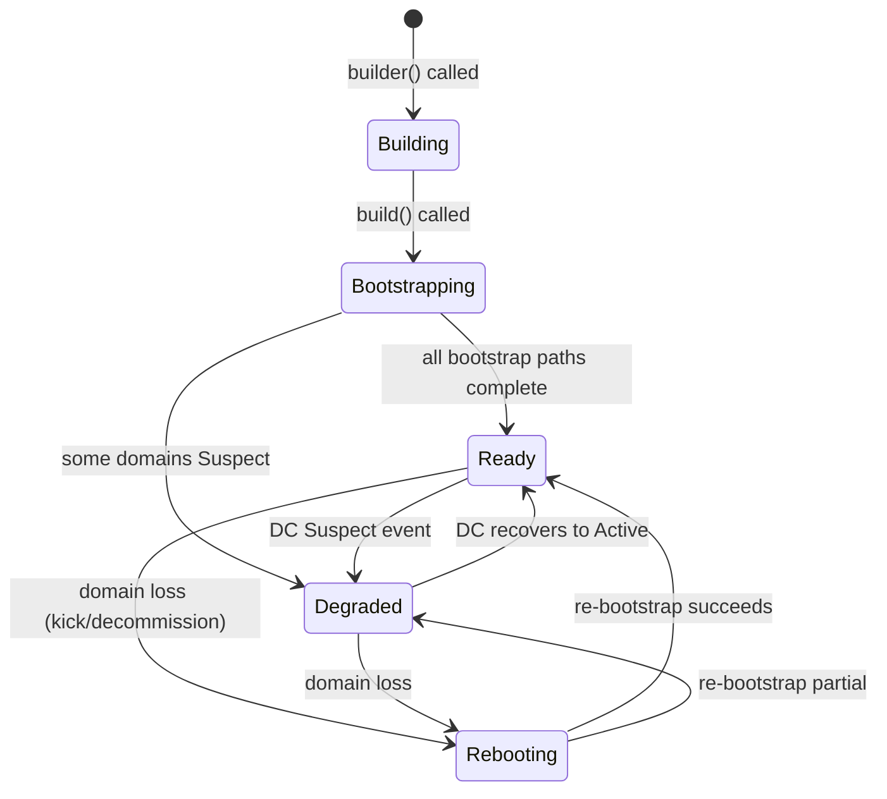

# RFC-0863p-a (Networking): Domain-Governed Transport

## Status

Draft (2026-06-25)

> **Patch RFC for RFC-0863 (General-Purpose Network Integration).** Specifies how `NodeTransport` integrates with DC/group governance — the `BroadcastDomainHint` config type, `DomainRole` enum, `GovernedTransport` wrapper, the `NodeTransport::builder()` pattern, auto-bootstrap pipeline (classify adapters → DotDomain discovery → seed list fallback → GDP expansion), and governance-aware send/receive paths. This is the developer-facing layer that makes domain governance invisible to the average node operator.
>
> Depends on RFC-0851p-b (DotDomain Bootstrap Mode) for the bootstrap integration.

## Authors

- @mmacedoeu
- Jcode Agent (drafting on behalf of human direction)

## Maintainers

- @mmacedoeu

## Summary

Defines the `GovernedTransport` layer that wraps `NodeTransport` with domain governance awareness. A developer configures `NodeTransport::builder()` with adapter configs (including optional `BroadcastDomainHint`), and the system automatically: (1) classifies adapters as broadcast-capable or point-to-point, (2) runs DotDomain bootstrap on broadcast adapters, (3) runs seed-list bootstrap on point-to-point adapters, (4) merges results into `GatewayCache`, (5) monitors DC lifecycle and `GroupRegistry` state for ongoing governance, and (6) gates send/receive operations on domain state. The result is a `transport.send_best()` call that automatically respects group governance without the developer needing to understand DC lifecycles, BIND ceremonies, or kick detection.

## Dependencies

**Requires:**

- RFC-0863 (Networking): General-Purpose Network Integration — parent RFC; this is a patch adding domain governance
- RFC-0851p-b (Networking): DotDomain Bootstrap Mode — for `BroadcastDomainHint`, `DotDomainBootstrapConfig`, `DomainBootstrapResult`
- RFC-0850p-c (Networking): Transport Group Binding Ceremony — for `GroupRegistry`, `GroupBinding`, `GroupState`
- RFC-0855p-c (Networking): DomainCoordinator Role — for `DomainCoordinatorRecord`, DC lifecycle, `CoordinatorAdmin`
- RFC-0850 (Networking): Deterministic Overlay Transport — for `PlatformAdapter`, `PlatformType`, `BroadcastDomainId`

**Optional:**

- RFC-0851p-a (Networking): Network Bootstrap Protocol — Mode A seed-list bootstrap (fallback when no broadcast adapter)
- RFC-0855p-b (Networking): Mission Coordinator Lifecycle — for `CoordinatorLifecycle` state machine
- RFC-0862 (Networking): Stoolap Data Sync — first consumer of governed transport

> **Dependency Validation Rules:**
> 1. Dependencies MUST form a DAG — this RFC depends on 0863, 0851p-b, 0850p-c, 0855p-c, 0850; none depend on this RFC yet.
> 2. All "Requires" RFCs MUST be listed as mission prerequisites.
> 3. RFC-0851p-a is Optional — DotDomain bootstrap is the primary path; seed-list is fallback.
> 4. RFC-0862 is Optional — validates the pattern but is not required for correctness.

## Design Goals

| Goal | Target | Metric |
|------|--------|--------|
| G1 | Developer integrates in ≤10 lines of Rust | `NodeTransport::builder()` + `.adapter()` + `.build()` |
| G2 | Auto-bootstrap without manual seed list (when broadcast adapter configured) | `transport.ready()` returns `true` after DotDomain discovery |
| G3 | Governance-aware send (DC `Inactive` → skip domain) | `send_best()` never sends through a decommissioned domain |
| G4 | Governance-aware receive (kicked → stop receiving) | `receive()` never processes messages from a domain the node was kicked from |
| G5 | Transparent cross-pollination | Peer discovered via Telegram but has QUIC endpoint → QUIC preferred automatically |
| G6 | All state transitions are RFC-0008 Class A | Domain governance checks are deterministic |

## Motivation

### The Gap

RFC-0863 defines `NodeTransport` as a stateless transport layer: `send_best()` picks the healthiest adapter and sends. It does not consult `GroupRegistry`, does not check DC lifecycle, and does not know about BIND ceremonies. The developer must manually:

1. Load adapters
2. Run bootstrap (if they know about it)
3. Build GDP advertisements (if they know about GDP)
4. Handle kick detection (if they know about it)
5. Check group state before sending (nobody does this)

This is 50+ lines of boilerplate that every node must implement, and most will implement incorrectly or incompletely.

### Why Governance-Aware Transport Matters

Without governance awareness:

1. **A node sends envelopes through a decommissioned group.** The DC issued `UNBIND_ALL`, the group is `UnboundAllDone`, but the node's `NodeTransport` still has the Telegram adapter in its sender list. Messages are silently lost.
2. **A kicked node continues receiving.** The DC kicked the node from the group, but the receive loop still polls the adapter. The node processes messages from a domain it no longer belongs to.
3. **No cross-pollination.** A peer discovered via Telegram says "I also support QUIC at 1.2.3.4:9000" in their GADV, but `send_best()` doesn't know to prefer QUIC.

### Developer Experience Target

```rust
// Before (RFC-0863 current — manual, error-prone):
let registry = AdapterRegistry::new(plugin_dirs);
registry.discover_and_load()?;
let senders = build_senders(registry);
let transport = NodeTransport::new(senders);
let bootstrap = BootstrapOrchestrator::new(seed_list, config);
let discovery = TransportDiscovery::new(identity, mission_id, 256);
let result = bootstrap.run(&transport, &discovery, &mut state).await?;
// ... manually wire governance, kick detection, DC lifecycle ...

// After (this RFC — governed, automatic):
let transport = NodeTransport::builder()
    .adapter(AdapterConfig {
        platform: PlatformType::Telegram,
        credentials: Credentials::BotToken("..."),
        domain_hint: Some(BroadcastDomainHint {
            platform: PlatformType::Telegram,
            domain_ref: "-1001234567890".to_string(),
            expected_mission_id: Some(mission_id),
            expected_dc_id: None,
        }),
        role: DomainRole::Joiner,
    })
    .adapter(AdapterConfig {
        platform: PlatformType::Quic,
        credentials: Credentials::Cert(cert, key),
        domain_hint: None,
        role: DomainRole::None,
    })
    .mission(mission_id)
    .seed_list("seeds.json")  // fallback for non-broadcast adapters
    .build()
    .await?;

// All governance, bootstrap, discovery, kick detection is automatic.
transport.send_best(payload, &ctx).await?;
```

## Roles and Authorities

> **The "Nothing should be implied" rule:** Every actor that affects correctness, security, accountability, or consensus MUST be named with a stable identifier, a defined authority scope, and a typed lifecycle.

### 1. Node Operator

- **Stable identifier**: config-time identity (public key, mission_id)
- **Base capabilities**: configure `NodeTransport::builder()`, specify adapters and domain hints
- **Authority scope**: `configure` (set up transport; does not control domain governance)
- **Lifecycle**: stateless — config at startup

### 2. GovernedTransport (new)

- **Stable identifier**: per-node instance (no global ID)
- **Base capabilities**: classify adapters, run auto-bootstrap, gate send/receive on governance state
- **Authority scope**: `govern` (enforce governance rules on the transport layer; delegates to GroupRegistry and DC lifecycle)
- **Lifecycle**: `GovernedTransportLifecycle` (see Lifecycle Requirements)

### 3. DomainCoordinator (consumed, not defined)

- Referenced from RFC-0855p-c
- `GovernedTransport` reads DC lifecycle state but does not modify it
- Authority scope: read-only access to `DomainCoordinatorRecord`

### 4. GroupRegistry (consumed, not defined)

- Referenced from RFC-0850p-c
- `GovernedTransport` reads `GroupBinding` state but does not modify it
- Authority scope: read-only access during transport operations

## Specification

### System Architecture

```mermaid
graph TB
    subgraph "Developer API"
        BLD[NodeTransport::builder()]
        AC[AdapterConfig]
        BLD --> AC
    end

    subgraph "Auto-Bootstrap Pipeline"
        CLS[Classify Adapters]
        DDB[DotDomain Bootstrap<br/>broadcast adapters]
        SLB[Seed List Bootstrap<br/>point-to-point adapters]
        MRG[Merge into GatewayCache]
        CLS --> DDB
        CLS --> SLB
        DDB --> MRG
        SLB --> MRG
    end

    subgraph "Governance Layer"
        GT[GroupRegistry check]
        DC[DC lifecycle check]
        GT --> DC
    end

    subgraph "Transport Layer"
        NT[NodeTransport]
        XPL[Cross-pollination<br/>GADV endpoint merge]
        NT --> XPL
    end

    AC --> CLS
    MRG --> GT
    DC --> NT

    subgraph "Send Path"
        SB[send_best()]
        SB --> GTCHK{GroupRegistry:<br/>state == Bound?}
        GTCHK -->|Yes| DCCHK{DC lifecycle:<br/>Active?}
        GTCHK -->|No| SKIP[skip adapter]
        DCCHK -->|Yes| SEND[adapter.send_envelope()]
        DCCHK -->|Suspect| DEGRADE[send with degraded flag]
        DCCHK -->|Inactive| SKIP
    end
```

### Data Structures

#### `AdapterConfig`

Developer-facing configuration for a single adapter:

```rust
/// Configuration for a single platform adapter in the transport stack.
#[derive(Clone, Debug)]
pub struct AdapterConfig {
    /// Platform type (Telegram, Discord, QUIC, etc.)
    pub platform: PlatformType,
    /// Authentication credentials for the platform.
    pub credentials: Credentials,
    /// Optional broadcast domain hint for DotDomain bootstrap.
    /// If set, this adapter is classified as broadcast-capable.
    /// If None, this adapter is point-to-point (needs seed list).
    pub domain_hint: Option<BroadcastDomainHint>,
    /// The node's role in the domain.
    pub role: DomainRole,
}

/// Credentials for platform authentication.
#[derive(Clone, Debug)]
pub enum Credentials {
    BotToken(String),
    Cert(Vec<u8>, Vec<u8>),
    ApiKey(String),
    UsernamePassword(String, String),
    /// Adapter-specific credential format.
    /// The string is passed verbatim to the adapter's `authenticate()` method.
    /// Format is adapter-defined (see per-adapter documentation).
    Custom(String),
}
```

#### `DomainRole`

The node's role in a broadcast domain:

```rust
/// The node's role in a broadcast domain.
///
/// Determines what governance actions the node can take
/// and how bootstrap behaves.
#[derive(Clone, Copy, Debug, PartialEq, Eq)]
pub enum DomainRole {
    /// No domain role (point-to-point adapter).
    None,
    /// The node is joining an existing domain (most common).
    /// During bootstrap: discover peers, verify DC attestation.
    /// During transport: send/receive through the domain.
    Joiner,
    /// The node is the DomainCoordinator of this domain.
    /// During bootstrap: create/own the domain.
    /// During transport: manage membership, sign attestations.
    Coordinator,
    /// The node is a sub-admin (deputy DC).
    /// Authority is limited per SubAdminAuthority policy.
    SubAdmin,
}
```

#### `GovernedTransportLifecycle`

```rust
/// Lifecycle of the governed transport.
#[derive(Clone, Copy, Debug, PartialEq, Eq)]
#[repr(u8)]
pub enum GovernedTransportLifecycle {
    /// Building: adapters being loaded.
    Building = 0x00,
    /// Bootstrapping: auto-bootstrap pipeline running.
    Bootstrapping = 0x01,
    /// Ready: bootstrap complete, governance active.
    Ready = 0x02,
    /// Degraded: one or more domains in Suspect state.
    Degraded = 0x03,
    /// Rebooting: re-running bootstrap after domain loss.
    Rebooting = 0x04,
}

impl GovernedTransportLifecycle {
    /// Derive lifecycle from aggregate domain trust.
    /// If all domains are Trusted → Ready.
    /// If any domain is Degraded → Degraded.
    /// If all domains are Untrusted or no domains → Rebooting.
    pub fn from_domain_trust(levels: &[DcTrustLevel]) -> Self {
        if levels.is_empty() {
            return Self::Ready; // PTP-only; no governance
        }
        if levels.iter().all(|l| *l == DcTrustLevel::Trusted) {
            Self::Ready
        } else if levels.iter().any(|l| *l == DcTrustLevel::Degraded) {
            Self::Degraded
        } else {
            Self::Rebooting
        }
    }
}
```

#### `GovernedTransport`

The central type that wraps `NodeTransport` with governance awareness.

```rust
/// Constants for governance-gated send path.
/// Flag indicating the message is being sent through a degraded domain.
pub const FLAG_DEGRADED_DOMAIN: u64 = 0x0001;

/// Governance-aware transport wrapper.
///
/// Canonical definition of `BroadcastDomainHint` is in RFC-0851p-b §Data Structures.
/// This RFC re-exports it for developer convenience.
pub struct GovernedTransport {
    /// The underlying transport layer.
    inner: NodeTransport,
    /// Shared group registry (read-only during transport operations).
    group_registry: Arc<Mutex<GroupRegistry>>,
    /// DC lifecycle store (read-only; populated by DC heartbeat monitor).
    dc_store: Arc<Mutex<BTreeMap<[u8; 32], DomainCoordinatorRecord>>>,
    /// Transport discovery (GDP cache + advertisement builder).
    discovery: Arc<Mutex<TransportDiscovery>>,
    /// Current lifecycle state.
    lifecycle: GovernedTransportLifecycle,
    /// Mission ID this transport is bound to.
    mission_id: [u8; 32],
    /// Adapter configs (for domain-to-adapter mapping).
    adapter_domains: Vec<(PlatformType, String, DomainRole)>,
    /// DC lifecycle event channel (for domain loss detection).
    dc_events: tokio::sync::broadcast::Sender<DcLifecycleEvent>,
}

/// DC lifecycle event for domain loss detection.
#[derive(Clone, Debug)]
pub struct DcLifecycleEvent {
    pub dc_id: [u8; 32],
    pub previous_state: CoordinatorLifecycle,
    pub new_state: CoordinatorLifecycle,
    pub epoch: u64,
}

impl GovernedTransport {
    /// Returns true if the transport is ready to send/receive.
    /// Ready means: bootstrap complete, at least one domain is Trusted or
    /// at least one PTP adapter is available.
    pub fn ready(&self) -> bool {
        matches!(self.lifecycle,
            GovernedTransportLifecycle::Ready
            | GovernedTransportLifecycle::Degraded
        )
    }

    /// Current lifecycle state.
    pub fn lifecycle(&self) -> GovernedTransportLifecycle {
        self.lifecycle
    }

    /// Send payload via the best available adapter, respecting governance.
    ///
    /// Governance checks (per send):
    /// 1. GroupRegistry state == Bound
    /// 2. DC lifecycle != Inactive/Demoting/Resigned
    /// 3. Not kicked from domain
    ///
    /// Retry: tries each healthy adapter in priority order.
    /// Returns AllTransportsFailed only if all adapters fail or are
    /// governance-blocked. Caller should retry after a backoff interval.
    pub async fn send_best(&self, payload: &[u8], ctx: &SendContext) -> Result<(), TransportError> { ... }

    /// Receive messages from all governance-approved adapters.
    /// Skips adapters whose domain is decommissioned or where the
    /// node has been kicked.
    pub async fn receive(&self) -> Vec<ReceivedMessage> { ... }
}
```

#### Helper Functions

```rust
/// Map a NetworkSender back to its broadcast domain.
/// Returns None for PTP adapters (no domain binding).
fn find_domain_for_sender(
    sender: &dyn NetworkSender,
    adapter_domains: &[(PlatformType, String, DomainRole)],
    group_registry: &GroupRegistry,
) -> Option<GroupBinding> {
    let platform = PlatformType::from_name(sender.name())?;
    let (_, domain_ref, role) = adapter_domains.iter()
        .find(|(pt, _, _)| *pt == platform)?;
    if *role == DomainRole::None {
        return None; // PTP adapter
    }
    group_registry.lookup(&platform.name().to_string(), domain_ref)
}

/// Map a PlatformAdapter back to its broadcast domain.
fn find_domain_for_adapter(
    adapter: &dyn PlatformAdapter,
    adapter_domains: &[(PlatformType, String, DomainRole)],
    group_registry: &GroupRegistry,
) -> Option<GroupBinding> {
    let platform = adapter.platform_type();
    let (_, domain_ref, role) = adapter_domains.iter()
        .find(|(pt, _, _)| *pt == platform)?;
    if *role == DomainRole::None {
        return None;
    }
    group_registry.lookup(&platform.name().to_string(), domain_ref)
}

/// Domain loss detection:
/// A domain is considered lost when:
/// 1. DC lifecycle transitions to Demoting/Resigned/Inactive, OR
/// 2. GroupState transitions to UnboundAllDone (decommission), OR
/// 3. Platform kick detection (adapter-level event)
///
/// The GovernedTransport subscribes to DcLifecycleEvent broadcasts
/// and GroupRegistry state changes. On domain loss, it:
/// 1. Evicts the domain's peers from GatewayCache (per RFC-0851 §14)
/// 2. Transitions lifecycle to Rebooting
/// 3. Re-runs DotDomain bootstrap if another domain is configured
fn on_domain_loss(transport: &mut GovernedTransport, event: DcLifecycleEvent) {
    if matches!(event.new_state,
        CoordinatorLifecycle::Demoting
        | CoordinatorLifecycle::Resigned
        | CoordinatorLifecycle::Inactive
    ) {
        transport.lifecycle = GovernedTransportLifecycle::Rebooting;
        // Evict domain from cache (RFC-0851 §14)
        let mut discovery = transport.discovery.lock().unwrap();
        // ... evict peers from the affected domain ...
    }
}
```

### Algorithms

#### Auto-Bootstrap Pipeline

```
function auto_bootstrap(adapters, seed_list, mission_id, discovery):
    broadcast_adapters = []
    ptp_adapters = []
    
    // Step 1: Classify adapters
    for adapter in adapters:
        if adapter.config.domain_hint is Some:
            broadcast_adapters.push(adapter)
        else:
            ptp_adapters.push(adapter)
    
    // Step 2: Run DotDomain bootstrap on broadcast adapters (parallel)
    domain_results = parallel_for adapter in broadcast_adapters:
        dotdomain_bootstrap(adapter.config.domain_hint, adapter, group_registry, discovery)
    
    // Step 3: Run seed-list bootstrap on PTP adapters (if seed list provided)
    ptp_result = None
    if seed_list is Some and ptp_adapters is not empty:
        orchestrator = BootstrapOrchestrator::new(seed_list, config)
        ptp_result = orchestrator.run(ptp_transport, discovery, discovery_state)
    
    // Step 4: Merge all results
    total_peers = sum(r.peers_discovered for r in domain_results)
    if ptp_result is Some:
        total_peers += ptp_result.peers_discovered
    
    return total_peers
```

#### Governance-Gated Send Path

```
function governed_send_best(transport, group_registry, dc_store, payload, ctx):
    // Try each adapter in priority order
    for sender in transport.senders():
        domain = find_domain_for_sender(sender, group_registry)
        
        if domain is None:
            // Point-to-point adapter: no governance check needed
            if sender.send(payload, ctx).is_ok():
                return Ok()
            continue
        
        // Governance check 1: GroupRegistry state
        binding = group_registry.lookup(domain.platform, domain.group_jid)
        if binding is None or binding.state != Bound:
            log("skipping adapter {}: domain not bound", sender.name())
            continue
        
        // Governance check 2: DC lifecycle
        dc = dc_store.lookup(binding.domain_coordinator_id)
        if dc is not None:
            match dc.state:
                Active | Elected | Designated => { /* proceed */ }
                Suspect => {
                    // Send with degraded flag (peer can reject)
                    ctx.flags |= FLAG_DEGRADED_DOMAIN
                }
                Handover | Demoting | Resigned | Inactive => {
                    log("skipping adapter {}: DC {}", sender.name(), dc.state)
                    continue
                }
        
        // Governance check 3: Not kicked
        if is_kicked_from_domain(domain, ctx.source_peer):
            log("skipping adapter {}: kicked from domain", sender.name())
            continue
        
        // All checks passed: send
        if sender.send(payload, ctx).is_ok():
            return Ok()
    
    return Err(TransportError::AllTransportsFailed)
```

#### Governance-Gated Receive Path

```
function governed_receive(transport, group_registry, dc_store):
    messages = []
    for adapter in transport.adapters():
        domain = find_domain_for_adapter(adapter, group_registry)
        
        if domain is None:
            // PTP adapter: no governance
            messages.extend(adapter.receive_messages())
            continue
        
        // Governance check: still bound?
        binding = group_registry.lookup(domain.platform, domain.group_jid)
        if binding is None or binding.state != Bound:
            continue
        
        // Governance check: not kicked?
        if is_kicked_from_domain(domain, local_peer_id):
            continue
        
        messages.extend(adapter.receive_messages())
    
    return messages
```

### Lifecycle Requirements

#### GovernedTransport State Machine



#### Transition Table

| From | To | Trigger | Deterministic? | Side Effects | Signing |
|------|-----|---------|----------------|--------------|---------|
| Building | Bootstrapping | `build()` called | Yes | Load adapters, create registry | None |
| Bootstrapping | Ready | All bootstrap paths complete + ≥1 peer | Yes | `DiscoveryState` updated | None |
| Bootstrapping | Degraded | Some domains have DC in `Suspect` | Yes | Peers marked `degraded` | None |
| Ready | Degraded | DC lifecycle → `Suspect` | Yes | Cache entry trust level changed | None |
| Degraded | Ready | DC lifecycle → `Active` | Yes | Cache entry trust level restored | None |
| Ready | Rebooting | Kick detected or UNBIND_ALL received | Yes | Evict domain from cache; re-run DotDomain | None |
| Rebooting | Ready | Re-bootstrap succeeds | Yes | Cache repopulated | None |

### Determinism Requirements

| Operation | Class | Rationale |
|-----------|-------|-----------|
| Adapter classification (broadcast vs PTP) | A | Config-driven; deterministic |
| GroupRegistry lookup | A | BTreeMap read |
| DC lifecycle check | A | Enum match |
| Send priority ordering | B | Health-based EMA; converges deterministically but initial ordering varies |
| Bootstrap merge order | B | Arrival order varies; final cache state is deterministic by `gateway_id` |

### RFC-0008 Execution Class Mapping

| Operation | Class | Rationale |
|-----------|-------|-----------|
| `NodeTransport::builder()` | A | Config accumulation |
| `.build().await` | C | Platform API calls (join domain, receive messages) |
| `send_best()` governance checks | A | Registry/lifecycle reads |
| `send_best()` adapter call | C | Platform API call |
| `receive()` governance checks | A | Registry/lifecycle reads |
| `receive()` adapter call | C | Platform API call |
| Auto-bootstrap pipeline | B | Mix of deterministic (merge) and non-deterministic (platform calls) |

### Error Handling

| Error Code | Description | Recovery |
|-----------|-------------|----------|
| GT-001 | No adapters configured | Operator must configure at least one adapter |
| GT-002 | All broadcast adapters failed bootstrap | Fallback to seed-list if available |
| GT-003 | Seed list not provided and no broadcast adapters | Fatal: no discovery path |
| GT-004 | Domain decommissioned mid-session | Auto-reboot: re-run DotDomain or switch to another domain |
| GT-005 | DC key compromised (attestation fails repeatedly) | Log alert; operator intervention required |
| GT-006 | All adapters unhealthy | `send_best()` returns `AllTransportsFailed` |

## Performance Targets

| Metric | Target | Notes |
|--------|--------|-------|
| `build()` latency | <5s | Adapter loading + initial bootstrap |
| `send_best()` governance check overhead | <1ms | BTreeMap lookups + enum matches |
| Auto-bootstrap total | <15s | DotDomain (10s) + Mode A (5s) in parallel |
| DC lifecycle event → transport reaction | <5s | Heartbeat interval |
| Cross-pollination discovery | <30s | After initial GADV exchange |

## Implicit Assumptions Audit

| Assumption | Where Relied Upon | Blast Radius if False | Mitigation / Status |
|------------|-------------------|----------------------|---------------------|
| `PlatformAdapter` implements `as_coordinator_admin()` for broadcast-capable adapters | §Adapter classification | Adapter classified as PTP when it could be broadcast | Mitigation: check at build time; log warning. **ACCEPTED RISK** — only Telegram, Discord, Matrix, IRC, WhatsApp implement CoordinatorAdmin currently. |
| `GroupRegistry` is populated before `build()` returns | §Governance-gated send | Governance checks find no binding → all sends skip | Mitigation: DotDomain bootstrap populates registry; `build()` blocks until bootstrap complete. |
| DC lifecycle events propagate in real-time | §DC lifecycle check | Node continues sending through a Suspect DC for up to 1 heartbeat interval | Mitigation: heartbeat interval is 5s; acceptable latency. **ACCEPTED RISK**. |
| `BroadcastDomainHint` config is correct | §Auto-bootstrap | Wrong group_id → join wrong domain → discover wrong peers | Mitigation: `expected_mission_id` field in config; GroupRegistry binding check. |
| Platform API rate limits are per-adapter | §Send/receive loops | Rate limiting on one adapter blocks others | Mitigation: each adapter has independent rate limit; `send_best()` fails over to next. |

## Security Considerations

| Threat | Impact | Mitigation |
|--------|--------|-----------|
| DC impersonation | HIGH | DC attestation verification per RFC-0851p-b |
| Governance bypass (adapter ignores kick) | HIGH | Governance checks happen in `GovernedTransport`, not in adapter |
| Domain flooding | MEDIUM | Per-domain peer cap from RFC-0851p-b |
| Send through decommissioned domain | MEDIUM | GroupRegistry check before every send |
| Receive from untrusted domain | MEDIUM | GroupRegistry + DC lifecycle check before every receive |

## Adversary Analysis

### 5-Question Test

| # | Question | Domain-Governed Transport |
|---|----------|--------------------------|
| 1 | Who benefits? | Attacker who wants to inject messages into a mission's transport or suppress legitimate messages |
| 2 | What does it cost? | Compromise DC key + platform admin access. Cost: moderate-high |
| 3 | What do they gain? | Message injection/suppression, governance capture |
| 4 | What's our defense? | GroupRegistry state check + DC lifecycle check + attestation verify — all in the transport layer, not in the adapter. Cost to legitimate: <1ms per send |
| 5 | What's the residual risk? | If DC is compromised and GroupRegistry is poisoned, governance checks are ineffective. Mitigated by: GroupRegistry is signed (BIND envelope from DC); DC key rotation. **ACCEPTED RISK** — same as RFC-0855p-c residual risk |

## Economic Analysis

Domain-governed transport does not directly involve token economics. The DC's OCTO-B stake requirements (RFC-0851 §11.1) apply to the domain operator, not to the transport consumer. A node using governed transport does not need additional stake beyond its base mission participation stake.

## Compatibility

- **Backward compatible**: `NodeTransport::new(senders)` continues to work (ungoverned mode)
- **Governed mode is opt-in**: developers use `NodeTransport::builder()` for governed mode, `NodeTransport::new()` for ungoverned
- **Mixed deployment**: governed and ungoverned nodes can communicate (governance is local enforcement, not wire protocol)

## Test Vectors

### TV-GT-1: Auto-Bootstrap with Broadcast Adapter

```
Input:
  adapters: [Telegram(domain_hint: Some("-1001234567890")), QUIC(domain_hint: None)]
  seed_list: Some("seeds.json")
  mission_id: 0x42..

Expected:
  Telegram classified as broadcast → DotDomain bootstrap
  QUIC classified as PTP → seed-list bootstrap (parallel)
  transport lifecycle: Ready
  GatewayCache: merged peers from both paths
```

### TV-GT-2: Send Governance — DC Active

```
Input:
  domain: Telegram group, GroupState: Bound, DC: Active
  send_best(payload)

Expected:
  Governance checks pass → send via Telegram adapter
```

### TV-GT-3: Send Governance — DC Inactive

```
Input:
  domain: Telegram group, GroupState: Bound, DC: Inactive
  send_best(payload)

Expected:
  DC lifecycle check fails → skip Telegram adapter
  Fallback to QUIC (PTP, no governance)
```

### TV-GT-4: Receive Governance — Kicked

```
Input:
  local_peer_id kicked from Telegram group
  receive()

Expected:
  Kick detection check → skip Telegram adapter receive
  Only receive from QUIC
```

## Alternatives Considered

| Approach | Pros | Cons |
|----------|------|------|
| Governance in each adapter | Adapter-local enforcement | Every adapter must implement governance; inconsistent |
| Governance in application layer | Full control | Every developer must implement; error-prone |
| Governance via wire protocol (peers enforce) | Distributed enforcement | Complex; requires trust in remote peers |
| **Governance in transport wrapper (this RFC)** | **Single implementation; all adapters benefit** | **Adds one layer of indirection** |

## Implementation Phases

### Phase 1: Core Builder + Classification

- [ ] Define `AdapterConfig`, `Credentials`, `DomainRole` types
- [ ] Implement `NodeTransport::builder()` pattern
- [ ] Adapter classification (broadcast vs PTP based on `domain_hint`)
- [ ] `build()` method that loads adapters via `AdapterRegistry`

### Phase 2: Auto-Bootstrap Pipeline

- [ ] Wire DotDomain bootstrap (RFC-0851p-b) for broadcast adapters
- [ ] Wire seed-list bootstrap (RFC-0851p-a) for PTP adapters
- [ ] Parallel execution + merge into `GatewayCache`
- [ ] `GovernedTransportLifecycle` state machine

### Phase 3: Governance-Gated Send/Receive

- [ ] `send_best()` with GroupRegistry + DC lifecycle checks
- [ ] `receive()` with kick detection + domain state checks
- [ ] Cross-pollination: prefer PTP transports for peers discovered via broadcast

### Phase 4: DC Lifecycle Monitoring

- [ ] Background task: monitor DC lifecycle events
- [ ] Auto-reboot on domain decommission
- [ ] Degraded trust marking

### Phase 5: Multi-Domain + Multi-Mission

- [ ] Support multiple broadcast domains (join N groups)
- [ ] Per-mission domain scoping
- [ ] Domain reputation tracking

## Key Files to Modify

| File | Change |
|------|--------|
| `octo-transport/src/governed_transport.rs` (new) | `GovernedTransport`, `NodeTransportBuilder`, governance-gated send/receive |
| `octo-transport/src/node_transport.rs` | Add `builder()` method |
| `octo-transport/src/adapter_factory.rs` | Support `AdapterConfig`-based loading |
| `octo-transport/src/bootstrap.rs` | Wire DotDomain path into orchestrator |
| `octo-transport/src/discovery.rs` | Add trust-level-aware cache entries |
| `octo-transport/src/lib.rs` | Export new types |
| `octo-transport/Cargo.toml` | Add deps for GroupRegistry, DC types |
| `sync-e2e-tests/stoolap-node/src/main.rs` | Migrate to `NodeTransport::builder()` pattern |

## Future Work

| ID | Title | Severity | Deadline | Spec |
|----|-------|----------|----------|------|
| F1 | Hot-reload adapters (add/remove without restart) | MEDIUM | Post-launch | RFC-0863 F5 |
| F2 | Domain reputation (trust good domains, distrust new ones) | MEDIUM | Post-launch | New module |
| F3 | Governance metrics (governance check latency, skip rate) | LOW | Post-launch | Observability |
| F4 | Multi-mission transport (one `GovernedTransport` for multiple missions) | LOW | Future | Architecture change |

## Rationale

The governed transport wrapper pattern (rather than governance in each adapter) is chosen because:

1. **Single implementation** — governance logic is written once in `GovernedTransport`; all 20+ adapters benefit
2. **Adapter simplicity** — adapters remain transport-only (`PlatformAdapter` trait unchanged)
3. **Operator trust** — the transport layer enforces governance; adapters don't need to be trusted
4. **Backward compatible** — `NodeTransport::new()` ungoverned mode continues to work

The `NodeTransport::builder()` pattern mirrors the established builder pattern in Rust (e.g., `reqwest::Client::builder()`). It provides a natural place for adapter classification, bootstrap configuration, and governance setup.

## Adversarial Review

| Threat | Impact | Mitigation |
|--------|--------|-----------|
| Governance bypass via `NodeTransport::new()` (ungoverned) | HIGH | Document that ungoverned mode is for testing only; production should use `builder()` |
| Adapter misclassification (broadcast vs PTP) | MEDIUM | Classification is config-driven (`domain_hint` presence); explicit, not inferred |
| Bootstrap race (governance not ready when first send) | MEDIUM | `build()` blocks until bootstrap complete; `transport.ready()` gate |
| DC lifecycle event storm | LOW | Debounce DC lifecycle events; process at heartbeat interval |

## Version History

| Version | Date | Changes |
|---------|------|---------|
| 0.1.0 | 2026-06-25 | Initial draft |
| 0.1.1 | 2026-06-25 | Adversarial review R1: 10 findings fixed (2H, 6M, 2L). Added `GovernedTransport` struct definition, `FLAG_DEGRADED_DOMAIN` constant, helper functions (`find_domain_for_sender`, `find_domain_for_adapter`, `on_domain_loss`), `DcLifecycleEvent` type, `transport.ready()` method, `Credentials::Custom` format clarification, `DcTrustLevel` cross-ref to 0851p-b, domain loss detection trigger. |

## Related RFCs

- RFC-0863 (Networking): General-Purpose Network Integration — parent RFC
- RFC-0851p-b (Networking): DotDomain Bootstrap Mode — bootstrap integration
- RFC-0850p-c (Networking): Transport Group Binding Ceremony — GroupRegistry
- RFC-0855p-c (Networking): DomainCoordinator Role — DC lifecycle
- RFC-0851 (Networking): Gateway Discovery Protocol — GatewayCache, DiscoveryState
- RFC-0862 (Networking): Stoolap Data Sync — first consumer

## Related Use Cases

- [Social Platform Transport Layer](../../docs/use-cases/social-platform-transport-layer.md)
- [Stoolap Data Sync via CipherOcto Network](../../docs/use-cases/stoolap-data-sync-via-cipherocto-network.md)
- [Agent Marketplace](../../docs/use-cases/agent-marketplace.md)

## Appendices

### A. Full `NodeTransport::builder()` API Reference

```rust
impl NodeTransport {
    /// Create a new builder for governed transport.
    pub fn builder() -> NodeTransportBuilder {
        NodeTransportBuilder::default()
    }
}

impl NodeTransportBuilder {
    /// Add an adapter configuration.
    pub fn adapter(mut self, config: AdapterConfig) -> Self { ... }
    
    /// Set the mission ID (required).
    pub fn mission(mut self, mission_id: [u8; 32]) -> Self { ... }
    
    /// Set the seed list file path (optional fallback).
    pub fn seed_list(mut self, path: impl AsRef<Path>) -> Self { ... }
    
    /// Set the seed list authority type.
    pub fn seed_authority(mut self, authority: SeedListAuthority) -> Self { ... }
    
    /// Set plugin directories for adapter discovery.
    pub fn plugin_dirs(mut self, dirs: Vec<PathBuf>) -> Self { ... }
    
    /// Set the GDP cache size (default: 256).
    pub fn cache_size(mut self, size: u32) -> Self { ... }
    
    /// Set the node identity.
    pub fn node_id(mut self, node_id: [u8; 32]) -> Self { ... }
    
    /// Set the node public key.
    pub fn node_pubkey(mut self, pubkey: [u8; 32]) -> Self { ... }
    
    /// Build the governed transport.
    ///
    /// This runs the auto-bootstrap pipeline and blocks until:
    /// - All broadcast adapters have attempted DotDomain bootstrap
    /// - Seed-list bootstrap has completed (if configured)
    /// - GatewayCache is populated
    ///
    /// Returns the GovernedTransport ready for send/receive.
    pub async fn build(self) -> Result<GovernedTransport, TransportBuildError> { ... }
}
```

### B. Migration Guide from RFC-0863 `NodeTransport::new()`

```rust
// Before (RFC-0863):
let senders: Vec<Arc<dyn NetworkSender>> = ...;
let transport = NodeTransport::new(senders);

// After (RFC-0863p-a):
let transport = NodeTransport::builder()
    .adapter(AdapterConfig { ... })
    .mission(mission_id)
    .node_id(node_id)
    .build()
    .await?;

// The old NodeTransport::new() still works for testing
// and for applications that don't need governance.
```
