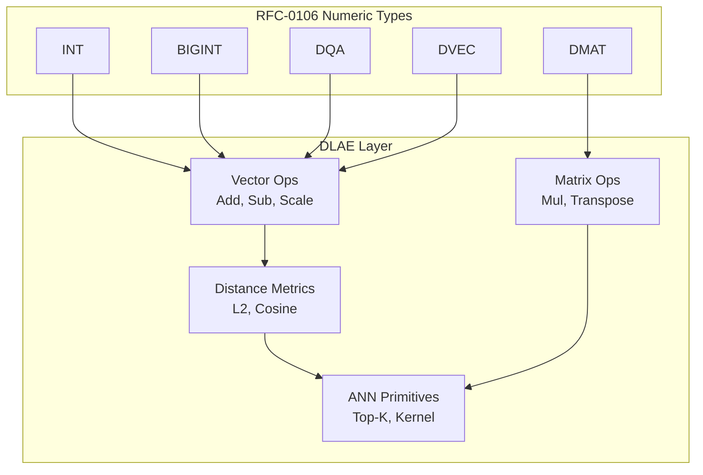

# RFC-0109 (Numeric/Math): Deterministic Linear Algebra Engine (DLAE)

## Status

**Version:** 2.1
**Status:** Draft
**Submission Date:** 2026-03-10
**Adversarial Review Response:** v2.0 received second adversarial audit. This v2.1 is a surgical patch fixing 5 critical edge-condition determinism leaks identified in final adjudication (see Rebuttal Summary for valid rebuttals).

> **Note:** This RFC was renumbered from RFC-0148 to RFC-0109 as part of the category-based numbering system.

## Summary

This RFC defines the Deterministic Linear Algebra Engine (DLAE) for the CipherOcto VM. The DLAE provides consensus-safe primitives for vector and matrix operations, distance metrics, dot products, and neural inference. All operations produce bit-identical results across all nodes, building on the numeric types defined in RFC-0106 (DQA, DVEC, DMAT). No floating-point arithmetic is permitted.

## Design Goals

| Goal | Target           | Metric                                                          |
| ---- | ---------------- | --------------------------------------------------------------- |
| G1   | Determinism      | Bit-identical results across CPU architectures, compilers, SIMD |
| G2   | Consensus Safety | No non-associative reductions, no undefined overflow            |
| G3   | ZK Compatibility | Representable inside zero-knowledge circuits                    |
| G4   | Performance      | Support vector similarity, embedding search, ANN                |

## Motivation

The CipherOcto VM requires deterministic linear algebra operations for:

- Vector similarity search
- Embedding comparisons
- On-chain ML inference
- Deterministic ANN

Current blockchain VMs lack deterministic linear algebra. This RFC provides the primitives needed for AI workloads while maintaining consensus safety.

## Specification

### System Architecture



### Core Data Structures

#### Deterministic Vector

```
DVec<T, N>

struct DVec<T, const N: usize> {
    data: [T; N]
}
```

Constraints:

- `1 ≤ N ≤ MAX_VECTOR_DIM`
- Consensus constant: `MAX_VECTOR_DIM = 4096`

#### Deterministic Matrix

```
DMat<T, M, N>

struct DMat<T, const M: usize, const N: usize> {
    data: [T; M * N]  // row-major storage
}
```

Storage layout: row-major
Index calculation: `index = row * N + column`
Consensus dimension limits are defined in the Consensus Limits section below.

### Execution Error Enum

All DLAE operations return `Result<T, ExecutionError>`:

```rust
#[derive(Debug, Clone, PartialEq, Eq)]
pub enum ExecutionError {
    /// Operands have incompatible dimensions
    DimensionMismatch,
    /// Scale factor invalid for operation
    InvalidScale,
    /// Division by zero (including zero vector normalization)
    DivisionByZero,
    /// Arithmetic overflow during computation
    Overflow,
    /// Input contains TRAP sentinel value
    TrapInput,
}
```

**Canonical Encoding** (for serialization, hashing, cross-language reproducibility):

| Variant            | Encoding |
| ------------------ | -------- |
| DimensionMismatch  | `0x01`   |
| InvalidScale       | `0x02`   |
| DivisionByZero     | `0x03`   |
| Overflow           | `0x04`   |
| TrapInput          | `0x05`   |

> **SERIALIZATION**: ExecutionError is serialized as a single byte (`0x01`–`0x05`). When embedded in a TRAP result, it is appended after the TRAP sentinel byte. Ordering is significant: lower encoding = earlier variant in enum definition.

### Deterministic Reduction Rule

Many linear algebra operations require reduction:

```
dot = Σ (a_i * b_i)
```

Floating-point systems allow arbitrary reduction order. Consensus systems must not.

> ⚠️ **CANONICAL REDUCTION RULE**: All reductions MUST execute strictly left-to-right:

```
sum = 0
for i in 0..N:
    sum = sum + (a_i * b_i)
```

**Forbidden optimizations:**

- Tree reductions
- SIMD horizontal adds
- Parallel reductions

These change numerical results.

### Vector Operations

#### Vector Addition

```
DVecAdd(a, b)

for i in 0..N:
    result[i] = a[i] + b[i]
```

Constraints: `dimension(a) == dimension(b)`, otherwise `ExecutionError::DimensionMismatch`

#### Vector Subtraction

```
DVecSub(a, b)
result[i] = a[i] - b[i]
```

#### Scalar Multiply

```
DVecScale(a, scalar)
result[i] = a[i] * scalar
```

### Dot Product

#### Deterministic Dot Product

```
Dot(a, b)

acc = 0
for i in 0..N:
    acc = acc + (a[i] * b[i])
return acc
```

Reduction order MUST be strictly sequential.

#### Overflow Handling

> ⚠️ **OVERFLOW RULE**: All arithmetic MUST use underlying `NumericScalar` operations as defined in RFC-0105. Custom accumulator widening is **FORBIDDEN** unless explicitly defined in RFC-0105.

Overflow behavior (including i128 accumulator widening if permitted) is governed entirely by RFC-0105. Any overflow MUST return `ExecutionError::Overflow` per RFC-0105 semantics.

### Distance Metrics

Required for vector search, embeddings, and clustering.

#### Squared Euclidean Distance

```
L2Squared(a, b)

acc = 0
for i in 0..N:
    diff = a[i] - b[i]
    acc = acc + diff * diff
return acc
```

**Intentional design choice:** Square root is avoided.

Advantages:

- Faster
- Deterministic
- ZK-friendly

#### Euclidean Distance

```
L2(a, b) = sqrt(L2Squared(a, b))
```

> ⚠️ **SQRT TYPE REQUIREMENT**: Cosine and L2 **REQUIRE** RFC-0111 Decimal path. DQA-only execution **MUST TRAP**. LUT approximations are **FORBIDDEN** in DLAE context.

The sqrt operation MUST use the deterministic algorithm from RFC-0111 (Decimal).

#### Zero Vector Semantics

> ⚠️ **ZERO VECTOR RULE**: Zero vector is valid input. Any normalization or division operation using a zero vector **MUST TRAP** with `ExecutionError::DivisionByZero`.

- Zero vector is a valid input to all DLAE operations
- If any intermediate computation (e.g., `|a|` or `|b|` in cosine) results in zero during normalization, the entire operation TRAPs
- Zero vector in distance metrics: `L2Squared(a, zero_vector)` = valid computation of `sum(a_i²)`

#### Cosine Similarity

```
cos(a,b) = dot(a,b) / (|a| * |b|)
```

> ⚠️ **SQRT TYPE REQUIREMENT**: Cosine **REQUIRES** RFC-0111 Decimal path. DQA-only execution **MUST TRAP**. LUT approximations are **FORBIDDEN**.

Deterministic implementation:

```
dot = Dot(a, b)
na = sqrt(Dot(a, a))
nb = sqrt(Dot(b, b))
return dot / (na * nb)
```

> ⚠️ **ZERO VECTOR TRAP**: If `|a| = 0` or `|b| = 0` (including zero vector inputs), raise `ExecutionError::DivisionByZero`. The operation TRAPs immediately; no partial execution.

### Matrix Operations

#### Matrix Multiply

```
MatMul(A[M,K], B[K,N])

for i in 0..M:
  for j in 0..N:
    acc = 0
    for k in 0..K:
        acc += A[i,k] * B[k,j]
    C[i,j] = acc
```

#### Determinism Constraints

**Forbidden optimizations in consensus:**

- Strassen multiplication
- Blocked multiplication
- Parallel multiply
- SIMD reduction

These may change reduction order.

### Neural Inference Primitives

#### Linear Layer

```
y = W * x + b
```

Where: W = matrix, x = vector, b = bias vector

Algorithm:

```
y = MatMul(W, x)
y = DVecAdd(y, b)
```

#### Activation Functions

> ⚠️ **ACTIVATION PHASE-BOUND**: Activation MUST execute after full linear computation completes. No interleaving or fusion allowed.

Activations MUST use deterministic LUTs from RFC-0114 (Activation Functions).

Supported:

- Sigmoid
- Tanh
- ReLU

#### ReLU

```
relu(x) = max(0, x)
```

Deterministic for fixed-point numbers.

### Deterministic ANN Primitives

#### Distance Kernel

Primary ANN primitive:

```
DistanceKernel(query, vector) = L2Squared(query, vector)
```

Using squared distance avoids sqrt cost.

#### Top-K Selection

Must be deterministic.

Canonical algorithm: **stable partial insertion sort only**

```
for each element:
    insert into ordered list
    truncate to K
```

> ⚠️ **HEAP PROHIBITION**: Heaps (binary, Fibonacci, or any heap variant) are **FORBIDDEN in consensus paths**. Heaps have implementation-dependent behavior under equal keys and are not stable sort algorithms. Only stable insertion sort is consensus-safe.

**Tie-break rule:**

> ⚠️ **DETERMINISTIC TIE-BREAK**: Comparator MUST be `(distance, vector_id)` lexicographic. Stable insertion is required.

Canonical comparator (pseudocode):
```
compare(a, b):
    if a.distance != b.distance:
        return a.distance < b.distance  // shorter distance wins
    else:
        return a.vector_id < b.vector_id  // lower ID wins
```

Any heap or sorting implementation MUST preserve this total ordering. Non-stable sorts MUST NOT be used.

> **TOP-K RESULT BUFFER**: The result buffer MUST be a fixed-size structure of exactly K elements. Memory allocation MUST NOT depend on input size beyond K.

## Performance Targets

| Metric             | Target | Notes                |
| ------------------ | ------ | -------------------- |
| Vector add (N=64)  | <1μs   | Per element          |
| Dot product (N=64) | <5μs   | Sequential reduction |
| Matrix mul (8×8)   | <50μs  | All operations       |
| L2 distance (N=64) | <3μs   | Squared distance     |

## Gas Cost Model

> ⚠️ **GAS BINDING**: DLAE gas formulas are bound to DVEC/DMAT gas formulas per RFC-0106. This table is normative, not abstract.

Operations have deterministic gas costs:

| Operation   | Gas Formula                                           | Example (N=64)      |
| ----------- | ----------------------------------------------------- | ------------------- |
| Vector add  | N × GAS_DQA_ADD                                       | 64 × 5 = 320        |
| Vector sub  | N × GAS_DQA_ADD                                       | 64 × 5 = 320        |
| Dot product | N × (GAS_DQA_MUL + GAS_DQA_ADD)                       | 64 × 13 = 832       |
| L2Squared   | N × (GAS_DQA_MUL + 2 × GAS_DQA_ADD)                   | 64 × 15 = 960       |
| Matrix mul  | M × N × K × GAS_DQA_MUL + M × N × (K-1) × GAS_DQA_ADD | 8×8×8×8 = 4096 base |

> **L2Squared derivation**: Per element: 1 SUB + 1 MUL + 1 ADD for accumulation = 1 MUL + 2 ADD per element. Total: N × (MUL + 2×ADD).

Gas constants are defined in RFC-0106 (DVEC/DMAT gas formulas). Any discrepancy between this table and RFC-0106 should be resolved in favor of RFC-0106 as the authoritative source.

## SIMD Execution

> ⚠️ **SIMD ALLOWANCE RULE**: SIMD is **FORBIDDEN** unless ALL of the following conditions are met:

**Permitted SIMD conditions (ALL must be true):**

1. **Lane independence**: Each lane computes a scalar operation on independent data elements
2. **No horizontal reduction**: No SIMD instruction computes cross-lane reduction (e.g., horizontal sum, horizontal min)
3. **Canonical accumulation order**: Final scalar accumulation (if any) is performed in strict left-to-right order using scalar operations

**Forbidden SIMD patterns:**

- SIMD horizontal adds/mins/maxes
- Tree reductions implemented in SIMD
- Fused operations that change numerical results
- Any SIMD that could reorder associative operations

**Compliance**: If any condition cannot be met, the scalar reference implementation MUST be used. "Identical output" claims without specifying these conditions are not enforceable and constitute a consensus violation.

## Global Scale Policy Layer

> ⚠️ **GLOBAL SCALE POLICY**: This section supersedes any container-level scale behavior where ambiguity exists. All DLAE operations MUST adhere to the following Scale Compatibility Matrix.

### Scale Compatibility Matrix

| Operation   | Scale Policy | Enforcement |
| ----------- | ------------ | ----------- |
| Dot Product | STRICT       | Scale factors MUST match exactly; mismatch → `ExecutionError::InvalidScale` |
| MatMul      | DEFERRED     | Scale validation deferred until after computation; result inherits output scale. **Post-computation**: if result violates scalar constraints (RFC-0105), return `ExecutionError::InvalidScale` |
| MatVec      | DEFERRED     | Scale validation deferred until after computation. **Post-computation**: if result violates scalar constraints (RFC-0105), return `ExecutionError::InvalidScale` |
| Cosine      | STRICT       | Scale factors MUST match exactly; mismatch → `ExecutionError::InvalidScale` |
| Distance (L2, L2Squared) | STRICT | Scale factors MUST match exactly; mismatch → `ExecutionError::InvalidScale` |

> **DEFERRED SCALE RULE**: For MatMul and MatVec, execution proceeds without intermediate scale validation. AFTER computation completes, the result is validated against scalar constraints defined in RFC-0105. If constraints are violated, `ExecutionError::InvalidScale` is returned. Intermediate overflow during DEFERRED operations MUST follow RFC-0105 overflow rules.

### Trait Authority Rule

> ⚠️ **TRAIT AUTHORITY**: RFC-0113 (`NumericScalar`) is the ONLY permitted trait for DLAE operations in consensus paths.

- RFC-0112 trait is **FORBIDDEN** in consensus paths
- All DLAE operations MUST use RFC-0113 `NumericScalar`
- Implementations MUST TRAP if RFC-0112 is encountered

### Composite TRAP Propagation Rule

> ⚠️ **STRICT HALT MODEL** (chosen over two-phase model for simplicity and enforceability):

- ANY TRAP condition detected → **immediate halt**
- All loops MUST terminate immediately upon TRAP detection
- No further iteration allowed after TRAP
- No observable state mutation after TRAP point
- Example: If `MatMul` detects overflow at element `[i,j]`, the entire `MatMul` TRAPs immediately; no remaining elements are computed

**Input validation (Phase 0)**: Dimension checks, scale compatibility, and zero-vector pre-checks MUST be performed before any computation begins. If validation fails, operation TRAPs before any loop executes.

### Mandatory Canonicalization Rule

> ⚠️ **CANONICALIZATION MANDATORY**: All outputs MUST be canonicalized per RFC-0105 before serialization. No conditional language.

- "if required" language is **FORBIDDEN** in DLAE specification
- Every output value MUST be canonicalized
- Non-canonical outputs are consensus violations

## Consensus Limits

| Constant          | Value  | Purpose                                    |
| ----------------- | ------ | ------------------------------------------ |
| MAX_VECTOR_DIM    | 64     | Maximum vector length (inherits DVEC limit) |
| MAX_MATRIX_DIM_M  | 8      | Maximum matrix rows (inherits DMAT limit)  |
| MAX_MATRIX_DIM_N  | 8      | Maximum matrix columns (inherits DMAT limit)|
| MAX_DOT_DIM       | 64     | Maximum dot product dimension               |
| MAX_LAYER_DIM     | 64     | Maximum neural network layer size           |

> **Note:** DLAE inherits dimension limits from DVEC (N≤64) and DMAT (M,N≤8) per MED-1 and MED-X1. These are tighter than the v1.0 abstract limits to ensure cross-RFC consistency.

Nodes MUST reject operations exceeding these limits with `ExecutionError::DimensionMismatch`.

## Adversarial Review

| Threat                   | Impact   | Mitigation                      |
| ------------------------ | -------- | ------------------------------- |
| DoS via large matrices   | High     | Dimension limits + gas scaling  |
| Reduction nondeterminism | Critical | Strict sequential reductions    |
| SIMD divergence          | High     | Reference scalar implementation |
| Overflow manipulation    | High     | i128 accumulator + bounds check |

## Alternatives Considered

| Approach            | Pros               | Cons                 |
| ------------------- | ------------------ | -------------------- |
| IEEE-754 floats     | Familiar           | Non-deterministic    |
| Relaxed determinism | Faster             | Consensus risk       |
| Pure integer        | Deterministic      | Limited range        |
| This spec           | Deterministic + ZK | Performance overhead |

## Implementation Phases

### Phase 1: Core

- [ ] Vector add/sub/scale
- [ ] Dot product (sequential)
- [ ] L2Squared distance
- [ ] Matrix multiply (naive)
- [ ] Gas model implementation

### Phase 2: Enhanced

- [ ] Cosine similarity
- [ ] L2 distance (with sqrt)
- [ ] Linear layer (MatMul + bias)
- [ ] Activation LUT integration (ReLU, Sigmoid, Tanh)

### Phase 3: ANN

- [ ] Distance kernel
- [ ] Top-K selection
- [ ] Deterministic heap (if needed)

## Key Files to Modify

| File                                     | Change                      |
| ---------------------------------------- | --------------------------- |
| crates/octo-determin/src/dlae.rs         | Core DLAE implementation    |
| crates/octo-vm/src/gas.rs                | Gas cost updates            |
| rfcs/0106-deterministic-numeric-tower.md | Reference DLAE dependencies |

## Future Work

- F1: Deterministic tensor operations
- F2: Convolution kernels
- F3: Attention primitives
- F4: Transformer inference
- F5: Deterministic ANN indexes (FAISS-style)

## Rationale

The DLAE builds on RFC-0106's deterministic numeric types to provide linear algebra primitives that are:

1. **Consensus-safe**: No floating-point, strict reduction order
2. **ZK-compatible**: Integer arithmetic, no transcendental functions
3. **Performant**: Gas costs scale predictably with dimension
4. **Practical**: Supports vector search and ML inference

## Related RFCs

- RFC-0106 (Numeric/Math): Deterministic Numeric Tower (DNT) — Core numeric types (DQA, DVEC, DMAT)
- RFC-0105 (Numeric/Math): Deterministic Quantized Arithmetic (DQA) — Scalar quantized operations, **canonicalization rules**
- RFC-0111 (Numeric/Math): Decimal Arithmetic — **Required for sqrt operations in DLAE**
- RFC-0113 (Numeric/Math): NumericScalar Trait — **Only permitted trait for DLAE operations**
- RFC-0126 (Serialization): Serialization Protocol — **Normative reference for DLAE output serialization**
- RFC-0103 (Numeric/Math): Unified Vector SQL Storage — Vector storage and similarity search
- RFC-0107 (Storage): Production Vector SQL Storage v2 — Vector operations in production
- RFC-0120 (AI Execution): Deterministic AI VM — AI VM with linear algebra requirements
- RFC-0121 (AI Execution): Verifiable Large Model Execution — Matrix mul, neural network layers
- RFC-0122 (AI Execution): Mixture of Experts — Linear layers, dot products
- RFC-0107 (Numeric/Math): Deterministic Transformer Circuit — Matrix multiplication, attention

> **Note**: RFC-0148 serves as the canonical linear algebra layer that these RFCs depend on for deterministic operations.

## Homogeneous Type Requirement

> ⚠️ **HOMOGENEOUS TYPE ENFORCEMENT**: All DLAE operations REQUIRE homogeneous scalar types.

- All elements in a DVec, DMat, or any operand MUST use the same scalar type
- Mixed-type operations (e.g., DVec<DQA> + DVec<INT>) are **FORBIDDEN** in consensus paths
- Type conversion MUST be explicit and occur before DLAE operations
- Implementations MUST TRAP on mixed-type inputs with `ExecutionError::InvalidScale`

## Related Use Cases

- [AI Inference on Chain](../../docs/use-cases/hybrid-ai-blockchain-runtime.md)
- [Vector Search](../../docs/use-cases/unified-vector-sql-storage.md)
- [Verifiable Agent Memory](../../docs/use-cases/verifiable-agent-memory-layer.md)

## Appendices

### A. Reference Algorithms

#### Dot Product (Reference)

```rust
fn dot_product<T: DeterministicNumeric, const N: usize>(
    a: &[T; N],
    b: &[T; N]
) -> T {
    let mut acc = T::zero();
    let mut i = 0;
    while i < N {
        acc = acc + (a[i] * b[i]);
        i += 1;
    }
    acc
}
```

#### L2Squared (Reference)

```rust
fn l2_squared<T: DeterministicNumeric, const N: usize>(
    a: &[T; N],
    b: &[T; N]
) -> T {
    let mut acc = T::zero();
    let mut i = 0;
    while i < N {
        let diff = a[i] - b[i];
        acc = acc + (diff * diff);
        i += 1;
    }
    acc
}
```

### B. Test Vectors

Implementations MUST pass canonical test vectors:

| Operation   | Test Case         | Expected       |
| ----------- | ----------------- | -------------- |
| Dot product | [1,2,3] · [4,5,6] | 32             |
| L2Squared   | [0,0], [3,4]      | 25             |
| Cosine      | [1,0], [0,1]      | 0              |
| Matrix mul  | 2×2 × 2×2         | Per definition |

### C. Error Handling

All DLAE operations return `Result<T, ExecutionError>`:

```rust
#[derive(Debug, Clone, PartialEq, Eq)]
pub enum ExecutionError {
    /// Operands have incompatible dimensions
    DimensionMismatch,
    /// Scale factor invalid for operation
    InvalidScale,
    /// Division by zero (including zero vector normalization)
    DivisionByZero,
    /// Arithmetic overflow during computation
    Overflow,
    /// Input contains TRAP sentinel value
    TrapInput,
}
```

See Global Scale Policy Layer for scale validation rules.

---

**Version:** 2.1
**Submission Date:** 2026-03-10
**Changes:**

- v1.0: Initial draft for DLAE specification
- v2.0: Adversarial review response — incorporated all ACCEPTED fixes (CRIT-1 through CRIT-X5, HIGH-1 through HIGH-4, MED-1 through MED-4, MED-X1, MED-X2)
- v2.1: **Surgical patch** — fixed 5 critical edge-condition determinism leaks + HIGH/MED issues:
  - CRIT-R1: Resolved TRAP contradiction (STRICT HALT MODEL)
  - CRIT-R2: Defined DEFERRED scale post-computation validation
  - CRIT-R3: Added canonical ExecutionError encoding (0x01–0x05)
  - CRIT-R4: Replaced vague SIMD rule with enforceable conditions
  - HIGH-R1: Fixed L2Squared gas formula (was incorrectly 2N×MUL+(2N-1)×ADD, now N×(MUL+2×ADD))
  - HIGH-R2: FORBIDDEN heaps in consensus paths (only stable insertion sort)
  - HIGH-R3: Overflow handling now references RFC-0105 instead of local redefinition
  - MED-R1: Fixed activation reference (RFC-0114, not RFC-0106)
  - MED-R2: Removed duplicate MAX_MATRIX_DIM = 512
  - MED-R3: Added Top-K result buffer size bound

## Rebuttal Summary (v2.0) and Adjudication (v2.1)

### Rebuttals Upheld (v2.0)

| ID | Issue | Rebuttal Rationale |
|----|-------|-------------------|
| HIGH-X1 | Reduction Order vs DMAT Loop Flexibility | DMAT's loop structure is specified. Any compiler reordering that preserves lexical i→j→k order is compliant. Issue is against DMAT, not DLAE. |
| HIGH-X2 | ANN Determinism Not Fully Aligned | ANN is DLAE's domain. The tie-break rule (distance, vector_id) is already specified in DLAE. |
| LOW-1, LOW-2, LOW-3 | Missing algebraic properties, complexity guarantees, reference implementation | Informational additions. Do not affect consensus safety or determinism. |

### Adjudication Updates (v2.1)

| ID | Original Position | Reviewer Finding | v2.1 Action |
|----|-------------------|------------------|-------------|
| CRIT-X4 | Out of scope | Strategically wrong (not a blocker) | **Not addressed** — future meta-RFC acknowledged as needed but outside DLAE scope |
| HIGH-X4 | Same as CRIT-X4 | Same as CRIT-X4 | **Not addressed** — same as above |

**Path Forward for CRIT-X4/HIGH-X4**: Future "Unified Numeric Execution Contract RFC" (meta-RFC) addressing probe root unification when all related RFCs (RFC-0126, RFC-0109, RFC-0113, probe verification) are stable. This is a legitimate architectural gap but not a DLAE-specific issue.
