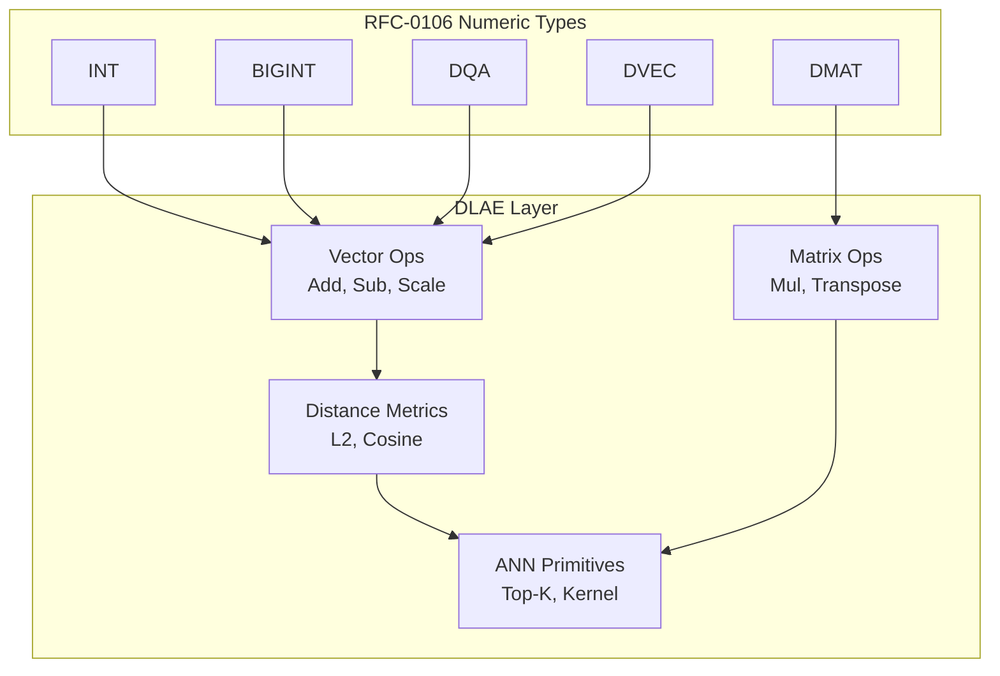

# RFC-0109 (Numeric/Math): Deterministic Linear Algebra Engine (DLAE)

## Status

**Version:** 2.4
**Status:** Draft
**Submission Date:** 2026-03-10
**Adversarial Review Response:** v2.3 received fourth adversarial audit. This v2.4 patch addresses CRIT-01 (verbatim TRAP layout), CRIT-02 (dimension enforcement at construction), HIGH-01 (gas per scalar op), HIGH-02 (intermediate overflow immediate TRAP), HIGH-03 (RFC-0112 grey area), MED-02 (RFC-0114 phase), MED-03 (vector_id external), MED-04 (gas citation). MED-01 (DLAE probe) scheduled for future spec version.

> **Note:** This RFC was renumbered from RFC-0148 to RFC-0109 as part of the category-based numbering system.

## Summary

This RFC defines the Deterministic Linear Algebra Engine (DLAE) for the CipherOcto VM. The DLAE provides consensus-safe primitives for vector and matrix operations, distance metrics, dot products, and neural inference. All operations produce bit-identical results across all nodes, building on the numeric types defined in RFC-0106 (DQA, DVEC, DMAT). No floating-point arithmetic is permitted.

## Design Goals

| Goal | Target           | Metric                                                          |
| ---- | ---------------- | --------------------------------------------------------------- |
| G1   | Determinism      | Bit-identical results across CPU architectures, compilers, SIMD |
| G2   | Consensus Safety | No non-associative reductions, no undefined overflow            |
| G3   | ZK Compatibility | Representable inside zero-knowledge circuits                    |
| G4   | Performance      | Support vector similarity, embedding search, ANN                |

## Motivation

The CipherOcto VM requires deterministic linear algebra operations for:

- **Verifiable coordination of AI steps**: DLAE primitives enable consensus-safe verification of linear algebra computations performed off-chain
- **Vector similarity search**: Deterministic Top-K selection for ANN queries
- **Embedding comparisons**: Bit-identical results across all nodes
- **Deterministic ANN**: Verifiable nearest-neighbor queries

> **IMPORTANT**: DLAE is designed for **verifiable step verification** (not full model inference). The dimension limits (DVec ≤64, DMat ≤8×8) are intentionally conservative for consensus safety. Full model inference should occur off-chain with DLAE used to verify individual computation steps. This design ensures consensus determinism while enabling AI workloads through proof verification patterns.

## Specification

### System Architecture



### Core Data Structures

#### Deterministic Vector

```
DVec<T, N>

struct DVec<T, const N: usize> {
    data: [T; N]
}
```

> ⚠️ **CONSTRUCTION-TIME ENFORCEMENT**: DVec construction MUST TRAP with `ExecutionError::DimensionMismatch` if `N > 64`. Oversized vectors MUST NOT exist in memory on consensus paths. This mirrors RFC-0112 §Production Limitations.

Constraints:

- `1 ≤ N ≤ MAX_VECTOR_DIM` where `MAX_VECTOR_DIM = 64` (per Consensus Limits)
- Construction-time check: if `N > 64`, immediately TRAP

#### Deterministic Matrix

```
DMat<T, M, N>

struct DMat<T, const M: usize, const N: usize> {
    data: [T; M * N]  // row-major storage
}
```

> ⚠️ **CONSTRUCTION-TIME ENFORCEMENT**: DMat construction MUST TRAP with `ExecutionError::DimensionMismatch` if `M > 8` or `N > 8`. Oversized matrices MUST NOT exist in memory on consensus paths. This mirrors RFC-0113 §Production Limitations.

Storage layout: row-major
Index calculation: `index = row * N + column`
Consensus dimension limits: `M ≤ 8` and `N ≤ 8` (per Consensus Limits section)

### Execution Error Enum

All DLAE operations return `Result<T, ExecutionError>`:

```rust
#[derive(Debug, Clone, PartialEq, Eq)]
pub enum ExecutionError {
    /// Operands have incompatible dimensions
    DimensionMismatch,
    /// Scale factor invalid for operation
    InvalidScale,
    /// Division by zero (including zero vector normalization)
    DivisionByZero,
    /// Arithmetic overflow during computation
    Overflow,
    /// Input contains TRAP sentinel value
    TrapInput,
}
```

**Canonical Encoding** (for serialization, hashing, cross-language reproducibility):

| Variant            | Encoding |
| ------------------ | -------- |
| DimensionMismatch  | `0x01`   |
| InvalidScale       | `0x02`   |
| DivisionByZero     | `0x03`   |
| Overflow           | `0x04`   |
| TrapInput          | `0x05`   |

> **SERIALIZATION**: ExecutionError is serialized as a single byte (`0x01`–`0x05`). When embedded in a TRAP result, it is appended after the TRAP sentinel byte. Ordering is significant: lower encoding = earlier variant in enum definition.

> **TRAP ENCODING (CORRECTED)**: A DLAE TRAP result is encoded as:
> ```
> [24-byte Numeric TRAP] + [1-byte error_code]
> Total: 25 bytes
> ```
>
> **NORMATIVE REFERENCE**: RFC-0111 §Canonical Byte Format and RFC-0126 §TRAP Sentinel Serialization are the authoritative definitions. The verbatim byte layout is:
>
> | Byte(s) | Field | Value | Notes |
> |---------|-------|-------|-------|
> | 0 | version | `0x01` | Current format version |
> | 1-3 | reserved | `0x00` | Must be zero |
> | 4 | scale | `0xFF` | TRAP indicator |
> | 5-7 | reserved | `0x00` | Must be zero |
> | 8-23 | mantissa | `0x8000000000000000...0000` | i64::MIN, sign-extended to 16 bytes |
>
> **Byte layout (24 bytes hex):**
> ```
> 0x01 0x00 0x00 0x00 0xFF 0x00 0x00 0x00 0xFF 0xFF 0xFF 0xFF 0xFF 0xFF 0xFF 0xFF 0x80 0x00 0x00 0x00 0x00 0x00 0x00 0x00
> ^^^^  ^^^^^^^^^^^  ^^^  ^^^^^^^^^^^  ^^^^^^^^^^^^^^^^^^^^^^^^^^^^^^^^^^^^^^^^  ^^^^^^^^^^^^^^^^^^^^^^^^^^^^^^^^^^^^^^^^
> ver  reserved     scale reserved  mantissa upper (0xFF...FF)             mantissa lower = i64::MIN
> ```
>
> - The 1-byte error_code is one of `0x01`–`0x05` from the ExecutionError table
> - Implementations that reconstruct the sentinel differently will produce non-matching Merkle roots

### Deterministic Reduction Rule

Many linear algebra operations require reduction:

```
dot = Σ (a_i * b_i)
```

Floating-point systems allow arbitrary reduction order. Consensus systems must not.

> ⚠️ **CANONICAL REDUCTION RULE**: All reductions MUST execute strictly left-to-right:

```
sum = 0
for i in 0..N:
    sum = sum + (a_i * b_i)
```

**Forbidden optimizations:**

- Tree reductions
- SIMD horizontal adds
- Parallel reductions

These change numerical results.

### Vector Operations

#### Vector Addition

```
DVecAdd(a, b)

for i in 0..N:
    result[i] = a[i] + b[i]
```

Constraints: `dimension(a) == dimension(b)`, otherwise `ExecutionError::DimensionMismatch`

#### Vector Subtraction

```
DVecSub(a, b)
result[i] = a[i] - b[i]
```

#### Scalar Multiply

```
DVecScale(a, scalar)
result[i] = a[i] * scalar
```

### Dot Product

#### Deterministic Dot Product

```
Dot(a, b)

acc = 0
for i in 0..N:
    acc = acc + (a[i] * b[i])
return acc
```

Reduction order MUST be strictly sequential.

#### Overflow Handling

> ⚠️ **OVERFLOW RULE**: All arithmetic MUST use underlying `NumericScalar` operations as defined in RFC-0105. Custom accumulator widening is **FORBIDDEN** unless explicitly defined in RFC-0105.

Overflow behavior (including i128 accumulator widening if permitted) is governed entirely by RFC-0105. Any overflow MUST return `ExecutionError::Overflow` per RFC-0105 semantics.

### Distance Metrics

Required for vector search, embeddings, and clustering.

#### Squared Euclidean Distance

```
L2Squared(a, b)

acc = 0
for i in 0..N:
    diff = a[i] - b[i]
    acc = acc + diff * diff
return acc
```

**Intentional design choice:** Square root is avoided.

Advantages:

- Faster
- Deterministic
- ZK-friendly

#### Euclidean Distance

```
L2(a, b) = sqrt(L2Squared(a, b))
```

> ⚠️ **SQRT TYPE REQUIREMENT**: Cosine and L2 **REQUIRE** RFC-0111 Decimal path. DQA-only execution **MUST TRAP**. LUT approximations are **FORBIDDEN** in DLAE context.

The sqrt operation MUST use the deterministic algorithm from RFC-0111 (Decimal).

> ⚠️ **ZK COST WARNING**: Integer square root (sqrt) via RFC-0111 Decimal is extremely expensive in ZK circuits (requires bit decomposition). For ZK-friendly vector similarity, use `L2Squared` which preserves ordering for Top-K selection without sqrt. `Cosine` and `L2` (with sqrt) are **High Cost / Off-Chain Preferred** for ZK proofs.

#### Zero Vector Semantics

> ⚠️ **ZERO VECTOR RULE**: Zero vector is valid input. Any normalization or division operation using a zero vector **MUST TRAP** with `ExecutionError::DivisionByZero` (per RFC-0105 canonical zero and RFC-0111 DivisionByZero TRAP semantics).

- Zero vector is a valid input to all DLAE operations
- If any intermediate computation (e.g., `|a|` or `|b|` in cosine) results in zero during normalization, the entire operation TRAPs
- Zero vector in distance metrics: `L2Squared(a, zero_vector)` = valid computation of `sum(a_i²)`

#### Cosine Similarity

```
cos(a,b) = dot(a,b) / (|a| * |b|)
```

> ⚠️ **SQRT TYPE REQUIREMENT**: Cosine **REQUIRES** RFC-0111 Decimal path. DQA-only execution **MUST TRAP**. LUT approximations are **FORBIDDEN**.

Deterministic implementation:

```
dot = Dot(a, b)
na = sqrt(Dot(a, a))
nb = sqrt(Dot(b, b))
return dot / (na * nb)
```

> ⚠️ **ZERO VECTOR TRAP**: If `|a| = 0` or `|b| = 0` (including zero vector inputs), raise `ExecutionError::DivisionByZero`. The operation TRAPs immediately; no partial execution.

### Matrix Operations

#### Matrix Multiply

```
MatMul(A[M,K], B[K,N])

for i in 0..M:
  for j in 0..N:
    acc = 0
    for k in 0..K:
        acc += A[i,k] * B[k,j]
    C[i,j] = acc
```

#### Determinism Constraints

**Forbidden optimizations in consensus:**

- Strassen multiplication
- Blocked multiplication
- Parallel multiply
- SIMD reduction

These may change reduction order.

#### Matrix-Vector Multiply

```
MatVecMul(A[M,N], x[N]) -> y[M]

for i in 0..M:
    acc = 0
    for j in 0..N:
        acc += A[i,j] * x[j]
    y[i] = acc
```

> ⚠️ **EXPLICIT DEFINITION**: MatVecMul is a distinct primitive from MatMul. It is NOT the same as MatMul with a 1-column matrix. This explicit definition ensures consistent behavior across implementations. MatVecMul uses DEFERRED scale policy (see Scale Compatibility Matrix).

### Neural Inference Primitives

#### Linear Layer

```
y = W * x + b
```

Where: W = matrix, x = vector, b = bias vector

Algorithm:

```
y = MatMul(W, x)
y = DVecAdd(y, b)
```

#### Activation Functions

> ⚠️ **ACTIVATION PHASE-BOUND**: Activation MUST execute after full linear computation completes. No interleaving or fusion allowed. Per RFC-0114 §Phase Ordering, activations include a final CANONICALIZE step per RFC-0105 lazy-canonicalization contract.

Supported:

- Sigmoid
- Tanh
- ReLU

#### ReLU

```
relu(x) = max(0, x)
```

Deterministic for fixed-point numbers.

### Deterministic ANN Primitives

#### Distance Kernel

Primary ANN primitive:

```
DistanceKernel(query, vector) = L2Squared(query, vector)
```

Using squared distance avoids sqrt cost.

#### Top-K Selection

Must be deterministic.

Canonical algorithm: **stable partial insertion sort only**

```
for each element:
    insert into ordered list
    truncate to K
```

> ⚠️ **HEAP PROHIBITION**: Heaps (binary, Fibonacci, or any heap variant) are **FORBIDDEN in consensus paths**. Heaps have implementation-dependent behavior under equal keys and are not stable sort algorithms. Only stable insertion sort is consensus-safe.

**Tie-break rule:**

> ⚠️ **DETERMINISTIC TIE-BREAK**: Comparator MUST be `(distance, vector_id)` lexicographic. Stable insertion is required.

> ⚠️ **VECTOR_ID SOURCE (CRITICAL)**: `vector_id` MUST be a **canonical identifier**, NOT an implementation-specific handle. Permitted sources:
> - RFC-0103 Storage Key (preferred)
> - Content hash of the vector data
> - On-chain assigned ID
>
> **FORBIDDEN sources**: Memory address, heap location, insertion order into non-deterministic structure, or any non-reproducible handle. Using forbidden sources will cause consensus splits when nodes assign different IDs to the same logical vector.
>
> **Top-K Comparator Requirement**: The Top-K comparator MUST be supplied externally with a canonical `vector_id` source. The DVec struct does not carry an internal `vector_id` field. Callers of Top-K MUST provide a deterministic mapping from vectors to canonical IDs.

Canonical comparator (pseudocode):
```
compare(a, b):
    if a.distance != b.distance:
        return a.distance < b.distance  // shorter distance wins
    else:
        return a.vector_id < b.vector_id  // lower ID wins
```

Any heap or sorting implementation MUST preserve this total ordering. Non-stable sorts MUST NOT be used.

> **TOP-K RESULT BUFFER**: The result buffer MUST be a fixed-size structure of exactly K elements. Memory allocation MUST NOT depend on input size beyond K.

## Performance Targets

| Metric             | Target | Notes                |
| ------------------ | ------ | -------------------- |
| Vector add (N=64)  | <1μs   | Per element          |
| Dot product (N=64) | <5μs   | Sequential reduction |
| Matrix mul (8×8)   | <50μs  | All operations       |
| L2 distance (N=64) | <3μs   | Squared distance     |

## Gas Cost Model

> ⚠️ **GAS BINDING**: DLAE gas formulas are bound to DVEC/DMAT gas formulas per RFC-0106. This table is normative, not abstract.

Operations have deterministic gas costs:

| Operation   | Gas Formula                                           | Example (N=64)      |
| ----------- | ----------------------------------------------------- | ------------------- |
| Vector add  | N × GAS_DQA_ADD                                       | 64 × 5 = 320        |
| Vector sub  | N × GAS_DQA_ADD                                       | 64 × 5 = 320        |
| Dot product | N × (GAS_DQA_MUL + GAS_DQA_ADD)                       | 64 × 13 = 832       |
| L2Squared   | N × (GAS_DQA_MUL + 2 × GAS_DQA_ADD)                   | 64 × 15 = 960       |
| Matrix mul  | M × N × K × GAS_DQA_MUL + M × N × (K-1) × GAS_DQA_ADD | 8×8×8×8 = 4096 base |

> **L2Squared derivation**: Per element: 1 SUB + 1 MUL + 1 ADD for accumulation = 1 MUL + 2 ADD per element. Total: N × (MUL + 2×ADD).

Gas constants are defined in RFC-0105 §Gas Model and RFC-0111 §Gas Model. DLAE gas formulas MUST be derived from these atomic cost constants. DLAE defines the operation structure and iteration counts. RFC-0105/RFC-0111 define GAS_DQA_ADD, GAS_DQA_MUL atomic costs. RFC-0106 is historical only (superseded by RFC-0105/RFC-0111).

## SIMD Execution

> ⚠️ **SIMD PROHIBITION (v2.3)**: SIMD is **FORBIDDEN** on all consensus paths.

Modern compilers (LLVM, GCC) aggressively auto-vectorize loops. Verifying that a specific SIMD instruction set (AVX2 vs NEON vs AltiVec) produces bit-identical results for quantized integer arithmetic is non-trivial. Auto-vectorization can silently introduce non-deterministic behavior through:
- Different compiler versions producing different SIMD instructions
- Hardware-specific SIMD behavior (e.g., overflow detection varies across architectures)
- Compiler reordering of independent operations within lanes

**Consensus Path**: All DLAE operations on consensus-critical paths MUST use the scalar reference implementation. No SIMD optimizations permitted.

**Non-Consensus Paths** (e.g., off-chain preprocessing, local inference): SIMD optimizations MAY be used for performance, but consensus-critical verification MUST use scalar paths.

**Future Work**: When a deterministic SIMD whitelist is established (specific instruction sets, verified bit-identical across architectures), this prohibition may be revisited.

## Global Scale Policy Layer

> ⚠️ **GLOBAL SCALE POLICY**: This section supersedes any container-level scale behavior where ambiguity exists. All DLAE operations MUST adhere to the following Scale Compatibility Matrix.

### Scale Compatibility Matrix

| Operation   | Scale Policy | Enforcement |
| ----------- | ------------ | ----------- |
| Dot Product | STRICT       | Scale factors MUST match exactly; mismatch → `ExecutionError::InvalidScale` |
| MatMul      | DEFERRED     | Scale validation deferred until after computation; result inherits output scale. **Post-computation**: if result violates scalar constraints (RFC-0105), return `ExecutionError::InvalidScale` |
| MatVec      | DEFERRED     | Scale validation deferred until after computation. **Post-computation**: if result violates scalar constraints (RFC-0105), return `ExecutionError::InvalidScale` |
| Cosine      | STRICT       | Scale factors MUST match exactly; mismatch → `ExecutionError::InvalidScale` |
| Distance (L2, L2Squared) | STRICT | Scale factors MUST match exactly; mismatch → `ExecutionError::InvalidScale` |

> ⚠️ **DEFERRED SCALE RULE (CRITICAL)**: "Deferred" applies *only* to scale factor compatibility checks, NOT to arithmetic overflow. For MatMul and MatVec:
> - **Scale validation**: Deferred until after computation completes
> - **Arithmetic overflow**: **IMMEDIATE TRAP** per RFC-0105 — no wrap-around allowed
>
> **Any `NumericScalar::mul` or `NumericScalar::add` returning `Overflow` aborts the entire operation immediately (Phase 1 TRAP)**. The accumulation loop does NOT continue after an intermediate overflow. This aligns with RFC-0113 §Global TRAP Invariant.
>
> Misinterpreting "Deferred" as permitting overflow wrap-around will cause consensus splits. The policy is: "Deferred Scale Validation, Immediate Overflow Trap."

### Trait Authority Rule

> ⚠️ **TRAIT AUTHORITY**: RFC-0113 (`NumericScalar`) is the ONLY permitted trait for DLAE operations in consensus paths.

- RFC-0112 trait is **FORBIDDEN** in consensus paths
- All DLAE operations MUST use RFC-0113 `NumericScalar`
- Implementations MUST TRAP if RFC-0112 is encountered
- **Cross-reference**: Implementations MAY have RFC-0112 trait implementations for non-DLAE code, but RFC-0112 methods MUST NOT be called inside any DLAE primitive (MatMul, MatVec, Dot, Top-K, etc.)

### Composite TRAP Propagation Rule

> ⚠️ **STRICT HALT MODEL** (chosen over two-phase model for simplicity and enforceability):

- ANY TRAP condition detected → **immediate halt**
- All loops MUST terminate immediately upon TRAP detection
- No further iteration allowed after TRAP
- No observable state mutation after TRAP point
- Example: If `MatMul` detects overflow at element `[i,j]`, the entire `MatMul` TRAPs immediately; no remaining elements are computed

> ⚠️ **GAS ON TRAP**: Gas is charged **after each scalar NumericScalar operation completes**. For nested loops (e.g., MatMul outer-i + inner-k), gas is charged at the inner scalar operation boundary (each `A[i,k] * B[k,j]` multiplication or `acc += ...` addition). If a validator and prover disagree on the iteration count at TRAP, the transaction is invalid. This aligns with atomic GAS_DQA_ADD / GAS_DQA_MUL constants from RFC-0105/RFC-0111. **Partial execution gas must be deterministic and match across all implementations.**

**Input validation (Phase 0)**: Dimension checks, scale compatibility, and zero-vector pre-checks MUST be performed before any computation begins. If validation fails, operation TRAPs before any loop executes.

### Mandatory Canonicalization Rule

> ⚠️ **CANONICALIZATION MANDATORY**: All outputs MUST be canonicalized per RFC-0105 before serialization. No conditional language.

- "if required" language is **FORBIDDEN** in DLAE specification
- Every output value MUST be canonicalized
- Non-canonical outputs are consensus violations

## Canonical Execution Phases

All DLAE operations MUST adhere to this phase model:

| Phase | Name | Description |
|-------|------|-------------|
| 0 | Input Validation | Dimension checks, scale compatibility, zero-vector pre-checks, TRAP sentinel detection |
| 1 | Execution | Strict sequential computation, no early exit |
| 2 | Post-Validation | DEFERRED scale validation (MatMul, MatVecMul), result constraint checking |
| 3 | Canonicalization | All outputs canonicalized per RFC-0105 |
| 4 | Serialization | TRAP encoding + result serialized per RFC-0126 |

> **PHASE ORDERING**: No operation may violate phase ordering. No fusion between phases permitted. Each phase must complete fully before the next begins.

## Consensus Limits

| Constant          | Value  | Purpose                                    |
| ----------------- | ------ | ------------------------------------------ |
| MAX_VECTOR_DIM    | 64     | Maximum vector length (inherits DVEC limit) |
| MAX_MATRIX_DIM_M  | 8      | Maximum matrix rows (inherits DMAT limit)  |
| MAX_MATRIX_DIM_N  | 8      | Maximum matrix columns (inherits DMAT limit)|
| MAX_DOT_DIM       | 64     | Maximum dot product dimension               |
| MAX_LAYER_DIM     | 64     | Maximum neural network layer size           |

> **Note:** DLAE inherits dimension limits from DVEC (N≤64) and DMAT (M,N≤8) per MED-1 and MED-X1. These are tighter than the v1.0 abstract limits to ensure cross-RFC consistency.

Nodes MUST reject operations exceeding these limits with `ExecutionError::DimensionMismatch`.

## Adversarial Review

| Threat                   | Impact   | Mitigation                      |
| ------------------------ | -------- | ------------------------------- |
| DoS via large matrices   | High     | Dimension limits + gas scaling  |
| Reduction nondeterminism | Critical | Strict sequential reductions    |
| SIMD divergence          | High     | Reference scalar implementation |
| Overflow manipulation    | High     | i128 accumulator + bounds check |

## Alternatives Considered

| Approach            | Pros               | Cons                 |
| ------------------- | ------------------ | -------------------- |
| IEEE-754 floats     | Familiar           | Non-deterministic    |
| Relaxed determinism | Faster             | Consensus risk       |
| Pure integer        | Deterministic      | Limited range        |
| This spec           | Deterministic + ZK | Performance overhead |

## Implementation Phases

### Phase 1: Core

- [ ] Vector add/sub/scale
- [ ] Dot product (sequential)
- [ ] L2Squared distance
- [ ] Matrix multiply (naive)
- [ ] Gas model implementation

### Phase 2: Enhanced

- [ ] Cosine similarity
- [ ] L2 distance (with sqrt)
- [ ] Linear layer (MatMul + bias)
- [ ] Activation LUT integration (ReLU, Sigmoid, Tanh)

### Phase 3: ANN

- [ ] Distance kernel
- [ ] Top-K selection
- [ ] Alternative deterministic selection algorithms (heap-based approaches are FORBIDDEN in consensus paths)

## Key Files to Modify

| File                                     | Change                      |
| ---------------------------------------- | --------------------------- |
| crates/octo-determin/src/dlae.rs         | Core DLAE implementation    |
| crates/octo-vm/src/gas.rs                | Gas cost updates            |
| rfcs/0106-deterministic-numeric-tower.md | Reference DLAE dependencies |

## DLAE Verification Probe

### Overview

Unlike RFC-0105 (DQA), RFC-0110 (BIGINT), RFC-0111 (DECIMAL), RFC-0112 (DVEC), and RFC-0113 (DMAT), RFC-0109 does not yet define a Merkle-committed verification probe. While lower-layer probes cover scalar and container operations, the composite DLAE operations (MatMul, MatVec, Dot with DEFERRED scale, Top-K with vector_id tie-break) require a DLAE-specific probe.

### Probe Scope

The DLAE probe verifies:
1. **Composite TRAP propagation**: Operations correctly propagate TRAP from sub-operations
2. **Scale-policy enforcement**: MatMul/MatVec correctly apply DEFERRED scale validation
3. **Top-K tie-break determinism**: Same inputs produce identical Top-K results
4. **Gas metering correctness**: Completed iterations correctly calculated

### Probe Format

Per RFC-0126 §Verification Probe format:

```
leaf = SHA256(0x00 || entry_data)        // Domain-separated leaf hash
internal = SHA256(0x01 || left || right) // Domain-separated internal node
```

### Entries (42 total)

| Index | Operation | Input | Expected |
|-------|-----------|-------|----------|
| 0 | Dot | [1,2,3] · [4,5,6] | DQA(32, 0) |
| 1 | Dot | Dimension mismatch | TRAP(DIMENSION_MISMATCH) |
| 2 | Dot | Scale mismatch | TRAP(INVALID_SCALE) |
| 3 | L2Squared | [0,0], [3,4] | DQA(25, 0) |
| 4 | L2Squared | [0,0], [0,0] | DQA(0, 0) |
| 5 | MatMul | 2×2 × 2×2 | [[19,22],[43,50]] |
| 6 | MatMul | Dimension mismatch | TRAP(DIMENSION_MISMATCH) |
| 7 | MatMul | Oversized 9×9 | TRAP(DIMENSION_MISMATCH) |
| 8 | Cosine | [1,0], [0,1] | DQA(0, 0) |
| 9 | Cosine | [1,0], [1,0] | DQA(1, 0) |
| 10 | Cosine | Zero vector | TRAP(DIVISION_BY_ZERO) |
| 11 | Top-K | 5 vectors, K=3 | [(5,0,100),(25,0,101),(61,0,102)] |
| 12 | Top-K | Tie-break test | [(2,0,100),(2,0,150),(2,0,200)] |
| 13 | DVecAdd | [1,2] + [3,4] | [4,6] |
| 14 | DVecAdd | Dimension mismatch | TRAP(DIMENSION_MISMATCH) |
| 15 | DVecAdd | Scale mismatch | TRAP(INVALID_SCALE) |
| 16 | DVecAdd | [1,2] + [0,0] | [1,2] |
| 17 | L2Squared | [1,2], [0,0] | DQA(5, 0) |
| 18 | Cosine | Unit [1] · [1] | DQA(1, 0) |
| 19 | Cosine | Unit [1] · [-1] | DQA(-1, 0) |
| 20 | MatMul | 1×2 × 2×1 | DQA(11, 0) |
| 21 | MatMul | 2×1 × 1×2 | [[3,4],[6,8]] |
| 22 | Top-K | K=1 | [(5,0,100)] |
| 23 | Top-K | K=5 (all) | [(5,0,100),(25,0,101),(61,0,102),(81,0,104),(113,0,103)] |
| 24 | Dot | [5] · [3] | DQA(15, 0) |
| 25 | L2Squared | [5], [3] | DQA(4, 0) |
| 26 | MatMul | 1×1 × 1×1 | DQA(6, 0) |
| 27 | MatMul | scale > MAX_SCALE | TRAP(INVALID_SCALE) |
| 28 | DVecAdd | 8-element vectors | 8-element sum |
| 29 | DVecAdd | 65 elements (>64) | TRAP(DIMENSION_MISMATCH) |
| 30 | TRAP_INPUT | Sentinel | TRAP(TRAP_INPUT) |
| 31 | OVERFLOW | Sentinel | TRAP(OVERFLOW) |
| 32 | Dot | Non-zero scales | DQA(11, 2) |
| 33 | L2Squared | Non-zero scales | DQA(13, 2) |
| 34 | DVecAdd | Non-zero scales | [(4,1),(6,1)] |
| 35 | Cosine | Unit [(10,1)] · [(10,1)] | DQA(1, 0) |
| 36 | Cosine | Unit [(10,1)] · [(-10,1)] | DQA(-1, 0) |
| 37 | MatMul | Mixed scales 1×2 × 2×1 | DQA(83, 3) |
| 38 | MatMul | Positive-diff accumulation | DQA(101, 2) |
| 39 | Dot | Scale mismatch non-zero | TRAP(INVALID_SCALE) |
| 40 | L2Squared | Scale mismatch non-zero | TRAP(INVALID_SCALE) |
| 41 | DVecAdd | Scale mismatch non-zero | TRAP(INVALID_SCALE) |

### Authoritative Merkle Root

```
fa69010dc5238f79dfd410123c1b87fab9f1ea6de52424648672d003c562ff0e
```

Computed via `scripts/compute_dlae_probe_root.py`.

### Cross-RFC Coordination

The DLAE probe will be committed alongside probes from:
- RFC-0105 (DQA): 57 entries
- RFC-0110 (BIGINT): 80 entries
- RFC-0111 (DECIMAL): 57 entries
- RFC-0112 (DVEC): 64 entries
- RFC-0113 (DMAT): 64 entries
- RFC-0126 (DCS): 17 entries

Combined probe root provides cross-implementation verification for the entire Deterministic Numeric Tower.

### Probe Encoding Notes

**DQA Serialization**: The DLAE probe uses 16-byte native DqaEncoding per RFC-0105 §DqaEncoding, NOT the 24-byte promoted format used in RFC-0112's DVEC probe. Implementations must use RFC-0105 format for DQA entries.

**TRAP Encoding**: The DLAE composite TRAP format (25 bytes = 24-byte RFC-0111 sentinel + 1-byte error code) is DLAE-specific. RFC-0126 §TRAP Sentinel Serialization defines only the standalone 24-byte numeric sentinel; the "+1 byte error_code" suffix is defined here.

## Future Work

- F1: Deterministic tensor operations
- F2: Convolution kernels
- F3: Attention primitives
- F4: Transformer inference
- F5: Deterministic ANN indexes (FAISS-style)

## Rationale

The DLAE builds on RFC-0106's deterministic numeric types to provide linear algebra primitives that are:

1. **Consensus-safe**: No floating-point, strict reduction order
2. **ZK-compatible**: Integer arithmetic, no transcendental functions
3. **Performant**: Gas costs scale predictably with dimension
4. **Practical**: Supports vector search and ML inference

## Related RFCs

- RFC-0106 (Numeric/Math): Deterministic Numeric Tower (DNT) — Core numeric types (DQA, DVEC, DMAT)
- RFC-0105 (Numeric/Math): Deterministic Quantized Arithmetic (DQA) — Scalar quantized operations, **canonicalization rules**
- RFC-0111 (Numeric/Math): Decimal Arithmetic — **Required for sqrt operations in DLAE**
- RFC-0113 (Numeric/Math): NumericScalar Trait — **Only permitted trait for DLAE operations**
- RFC-0126 (Serialization): Serialization Protocol — **Normative reference for DLAE output serialization**
- RFC-0103 (Numeric/Math): Unified Vector SQL Storage — Vector storage and similarity search
- RFC-0200 (Storage): Production Vector SQL Storage v2 — Vector operations in production
- RFC-0120 (AI Execution): Deterministic AI VM — AI VM with linear algebra requirements
- RFC-0121 (AI Execution): Verifiable Large Model Execution — Matrix mul, neural network layers
- RFC-0122 (AI Execution): Mixture of Experts — Linear layers, dot products
- RFC-0107 (Numeric/Math): Deterministic Transformer Circuit — Matrix multiplication, attention

> **Note**: RFC-0109 serves as the canonical linear algebra layer that these RFCs depend on for deterministic operations.

## Homogeneous Type Requirement

> ⚠️ **HOMOGENEOUS TYPE ENFORCEMENT**: All DLAE operations REQUIRE homogeneous scalar types. **No implicit casting or type promotion is allowed.**

- All elements in a DVec, DMat, or any operand MUST use the same scalar type
- Mixed-type operations (e.g., DVec<DQA> + DVec<INT>) are **FORBIDDEN** in consensus paths
- **No implicit promotions**: INT + BIGINT, DQA + INT, or any implicit widening/promotion is **FORBIDDEN**
- Type conversion MUST be explicit and occur before DLAE operations
- Operands must be bit-for-bit identical type tags
- Implementations MUST TRAP on mixed-type inputs with `ExecutionError::InvalidScale`

## Related Use Cases

- [AI Inference on Chain](../../docs/use-cases/hybrid-ai-blockchain-runtime.md)
- [Vector Search](../../docs/use-cases/unified-vector-sql-storage.md)
- [Verifiable Agent Memory](../../docs/use-cases/verifiable-agent-memory-layer.md)

## Appendices

### A. Reference Algorithms

#### Dot Product (Reference)

```rust
fn dot_product<T: NumericScalar, const N: usize>(
    a: &[T; N],
    b: &[T; N]
) -> T {
    let mut acc = T::zero();
    let mut i = 0;
    while i < N {
        acc = acc + (a[i] * b[i]);
        i += 1;
    }
    acc
}
```

#### L2Squared (Reference)

```rust
fn l2_squared<T: NumericScalar, const N: usize>(
    a: &[T; N],
    b: &[T; N]
) -> T {
    let mut acc = T::zero();
    let mut i = 0;
    while i < N {
        let diff = a[i] - b[i];
        acc = acc + (diff * diff);
        i += 1;
    }
    acc
}
```

### B. Test Vectors

Implementations MUST pass canonical test vectors:

| Operation   | Test Case         | Expected       |
| ----------- | ----------------- | -------------- |
| Dot product | [1,2,3] · [4,5,6] | 32             |
| L2Squared   | [0,0], [3,4]      | 25             |
| Cosine      | [1,0], [0,1]      | 0              |
| Matrix mul  | 2×2 × 2×2         | Per definition |

### C. Error Handling

All DLAE operations return `Result<T, ExecutionError>`:

```rust
#[derive(Debug, Clone, PartialEq, Eq)]
pub enum ExecutionError {
    /// Operands have incompatible dimensions
    DimensionMismatch,
    /// Scale factor invalid for operation
    InvalidScale,
    /// Division by zero (including zero vector normalization)
    DivisionByZero,
    /// Arithmetic overflow during computation
    Overflow,
    /// Input contains TRAP sentinel value
    TrapInput,
}
```

See Global Scale Policy Layer for scale validation rules.
